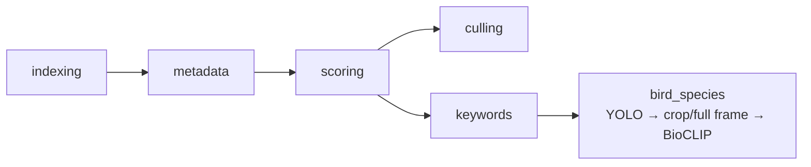
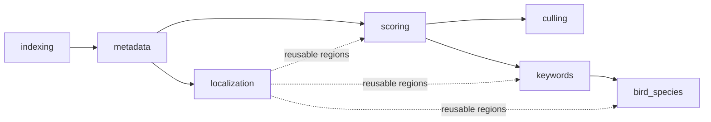
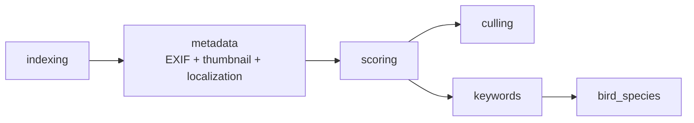
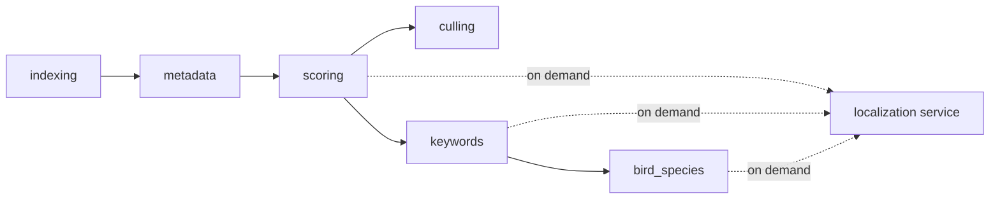
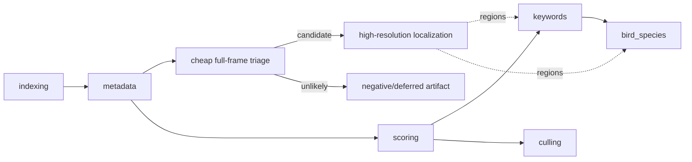
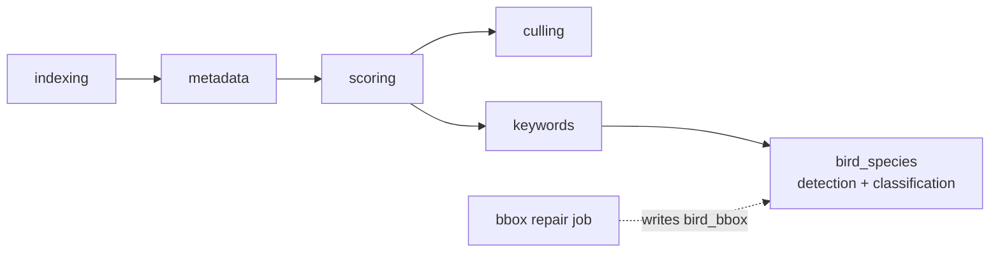
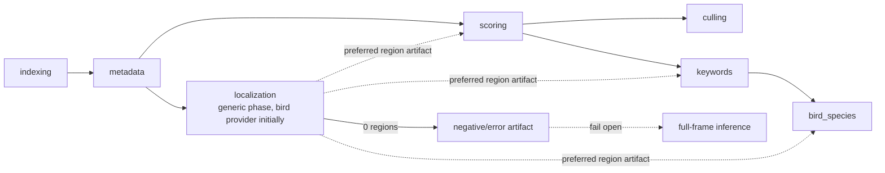

# Codex conversation

## User

Act as a senior ML pipeline and backend architecture reviewer.

  Repository:
  D:\Projects\image-scoring-backend

  Objective:
  Review the current processing pipeline and determine how its dependency graph could be redesigned to produce object/bird bounding boxes as early as safely possible, then reuse those boxes or derived crops for downstream inference where
  doing so is technically appropriate.

  This is an architecture review only. Do not edit code or documentation.

  Read these documents in full:

  - docs/architecture/INDEX.md
  - docs/architecture/pipeline/INDEX.md
  - docs/architecture/pipeline/overview.md
  - docs/architecture/pipeline/phase-graph.md
  - docs/architecture/pipeline/phase-status-machines.md
  - docs/architecture/pipeline/phase-preconditions.md
  - docs/architecture/pipeline/run-lifecycle.md
  - docs/architecture/pipeline/control-plane.md
  - docs/architecture/pipeline/persistence.md
  - docs/architecture/pipeline/terminology-map.md
  - docs/architecture/pipeline/phases/INDEX.md
  - docs/architecture/pipeline/phases/indexing.md
  - docs/architecture/pipeline/phases/metadata.md
  - docs/architecture/pipeline/phases/scoring.md
  - docs/architecture/pipeline/phases/culling.md
  - docs/architecture/pipeline/phases/keywords.md
  - docs/architecture/pipeline/phases/bird-species.md

  Validate important documentation claims against the implementation and follow relevant callers. At minimum, inspect:

  - modules/phases.py
  - modules/phase_executors.py
  - modules/pipeline_orchestrator.py
  - modules/run_phase_planner.py
  - modules/job_dispatcher.py
  - modules/metadata_runner.py
  - modules/scoring.py
  - modules/selection_runner.py
  - modules/clustering.py
  - modules/tagging.py
  - modules/bird_detection.py
  - modules/bird_species.py
  - modules/bird_species_eligibility.py
  - modules/db_legacy.py
  - modules/db_postgres.py
  - the run and pipeline submission routers
  - relevant migrations and tests

  Current-state hypothesis to verify:
  The documented graph is approximately:

      indexing → metadata → scoring → culling
                                    ↘ keywords → bird_species

  `bird_species` currently performs YOLO detection and writes `images.bird_bbox` only after the `keywords` phase has identified images carrying the `birds` keyword. Consequently, bounding boxes become available too late for scoring,
  culling, or keyword inference to reuse the crop.

  Do not accept this hypothesis without confirming it in source.

  Primary review question:
  How should the phase graph, persistence model, and runner boundaries change so localization happens as early as practical and downstream models can consume a reusable crop when beneficial, while retaining full-frame inference where
  cropping would reduce accuracy or change model semantics?

  Evaluate at least these alternatives:

  1. Split detection/localization into a new first-class phase after `metadata`.
  2. Add detection as a metadata sub-step.
  3. Introduce a shared, lazy localization service that downstream phases invoke without adding a phase.
  4. Use a two-pass design:
     - inexpensive full-frame triage;
     - detection only for likely subjects;
     - crop-aware downstream inference.
  5. Retain the current graph but expose bounding-box generation as an independently scheduled prerequisite or artifact-repair operation.
  6. Any materially better design found during the review.

  Important constraints and questions:

  - Metadata currently creates the thumbnails used by later inference, so localization probably cannot precede the usable-image/thumbnail portion of metadata.
  - The present bird detector stores only the highest-confidence box. Determine whether the future design must support multiple subjects and multiple boxes.
  - Do not assume crops improve every model:
    - IQA/aesthetic scoring may depend on the full composition and may have been trained on full frames.
    - Culling and similarity clustering may require full-frame context.
    - Keyword generation and captions may benefit from combining full-frame and subject-crop signals.
    - Bird-species classification is the clearest crop consumer.
  - Consider `full frame`, `crop`, and `full frame + crop fusion` as distinct inference modes.
  - An early detector false negative must not permanently prevent later inference. Define fallback, retry, and fail-open behavior.
  - Decide whether to persist crop files or persist only region metadata and materialize crops on demand.
  - Account for RAW files, orientation baking, thumbnail coordinates versus source-image coordinates, padding, crop hashing, and invalidation when the source image or detector version changes.
  - Determine whether `images.bird_bbox` is sufficient or should evolve into a normalized region/detection table containing fields such as:
    - image ID
    - object class
    - coordinates and coordinate space
    - source dimensions
    - confidence
    - detector/model version
    - padding policy
    - status or sentinel
    - retryability
    - source hash/version
    - timestamps
  - Preserve convergence semantics across:
    - completeness predicates
    - `image_phase_status`
    - `job_phases`
    - work claims
    - folder rollups
    - auto-drive buckets
    - executor-version invalidation
    - heal/reconcile operations
  - Examine the consequences of:
    - `PhaseExecutor.depends_on` currently being informational/inert;
    - prerequisite enforcement differing between submission APIs;
    - `bird_species` being absent from `PipelineOrchestrator`;
    - `normalize_phase_codes` special-casing or stripping `bird_species`;
    - conditional phase scope currently depending on the `birds` keyword.
  - Identify how existing images with species keywords, bbox sentinels, or no boxes would be migrated or reprocessed.
  - Estimate inference cost if bird detection moves from “bird-tagged images only” to all indexed images.
  - Look for opportunities to share decoded images, preprocessing, embeddings, or GPU batches without creating excessive coupling between runners.

  Required output:

  1. Executive conclusion
     - State whether the graph should change.
     - Identify the preferred design and why.
     - Clearly distinguish confirmed facts from recommendations.

  2. Current-state reconstruction
     - Provide the actual phase DAG as Mermaid.
     - Explain where bounding boxes are generated, persisted, checked for completeness, and repaired.
     - Cite every material claim using `path:line`.

  3. Downstream-consumer matrix

     For each model or subsystem, report:

     | Consumer | Current input | Full-frame value | Crop value | Recommended mode | Evidence/risk |
     |----------|---------------|------------------|------------|------------------|---------------|

     Include scoring models, technical-failure detection, MobileNet culling, CLIP/OpenCLIP embeddings, keyword scoring, captioning, accessibility text, and BioCLIP species classification.

  4. Candidate architectures
     - Show each viable DAG in Mermaid.
     - List benefits, drawbacks, operational cost, failure propagation, and migration complexity.
     - Explain why rejected alternatives are inferior.

  5. Recommended target architecture
     - Define exact phase boundaries and prerequisites.
     - Specify whether localization is generic or bird-specific.
     - Specify how candidate images are selected before keywords exist.
     - Define crop fallback and multi-box behavior.
     - Show the recommended DAG in Mermaid.

  6. Persistence and lifecycle design
     - Proposed schema changes.
     - Artifact provenance and invalidation rules.
     - Completeness and status semantics.
     - Retryable versus terminal outcomes.
     - Auto-drive and repair behavior.
     - Backward compatibility with `images.bird_bbox`.

  7. Implementation impact map
     - Enumerate affected modules, APIs, tables, migrations, configuration, tests, and documentation.
     - Describe the required change in each location without writing the implementation.

  8. Rollout plan
     - Break the work into independently deployable stages.
     - Include feature flags, backfill strategy, observability, rollback, and compatibility periods.
     - Avoid requiring a full-library rescan until the design has been benchmarked.

  9. Validation plan
     - Compare full-frame, crop-only, and fused inference.
     - Measure accuracy, false-negative propagation, throughput, GPU memory, model-loading overhead, database growth, and end-to-end run time.
     - Include unit, integration, migration, restart/recovery, concurrency, and auto-drive convergence tests.

  10. Findings and documentation gaps
      - Rank findings by severity: critical, high, medium, low.
      - Cite exact `path:line` evidence.
      - Call out documentation/source disagreements and missing architectural decisions.

  11. Open decisions
      - End with the smallest set of decisions that require product or ML benchmarking rather than code inspection.

  Review principles:

  - Treat source code and migrations as authoritative when documentation disagrees.
  - Do not recommend crop inference merely because a crop is available.
  - Prefer reusable, versioned artifacts over phase-specific hidden side effects.
  - Avoid coupling downstream phase completeness to an optional upstream result unless the fallback behavior is explicit.
  - Preserve idempotency, resumability, concurrent work claims, and auto-drive convergence.
  - Be specific enough that the result can be converted into an implementation plan without another architecture-discovery pass.

## Assistant

I’ll reconstruct the authoritative DAG and artifact lifecycle from source first, then evaluate each redesign against convergence, inference semantics, and migration risk. This is read-only: I won’t modify code or docs.

## Activity

    $ "C:\\Program Files\\PowerShell\\7\\pwsh.exe" -Command 'Get-Location; git status --short; rg --files docs/architecture/pipeline docs/architecture | Sort-Object; rg --files modules tests migrations alembic 2>$null | rg "(phases|phase_executors|pipeline_orchestrator|run_phase_planner|job_dispatcher|metadata_runner|scoring|selection_runner|clustering|tagging|bird_detection|bird_species|eligibility|db_legacy|db_postgres|router|migration|run|pipeline)"'
    status: Failed · exit 1
      
      warning: unable to access 'C:\Users\dmnsy/.config/git/ignore': Permission denied
      warning: unable to access 'C:\Users\dmnsy/.config/git/ignore': Permission denied
       M .claude/settings.local.json
       M docs/CANONICAL_SOURCES.md
       M docs/IMAGE_PIPELINE.md
       M docs/INDEX.md
       M docs/architecture/pipeline-architecture.md
       M docs/log.md
       M docs/technical/INDEX.md
       M docs/technical/PIPELINE_PHASE_RUNNERS.md
       M docs/technical/PIPELINE_TERMINOLOGY.md
       M modules/phases.py
      ?? 2026-08-30-222608-enter-windows-into-non-sleep-mode-to-allow-docker.txt
      ?? 2026-09-01-143728-build-a-full-comprehensive-graph-of-all-the-phase.txt
      ?? 2026-09-01-143802-investigte-db-and-backfill-missign-embeddings.txt
      ?? docs/architecture/INDEX.md
      ?? docs/architecture/pipeline/
      migrations\versions\0033_image_bird_bbox.py
      migrations\versions\0032_widen_agent_cull_prompt_version.py
      migrations\versions\0031_agent_cull_recommendations.py
      migrations\versions\0030_drop_images_scores_json.py
      migrations\versions\0029_culling_embedding_spaces.py
      migrations\versions\0028_sub_stacks.py
      migrations\versions\0027_auditlog.py
      migrations\versions\0026_bioclip_embedding_dim_768.py
      migrations\versions\0025_image_xmp_accessibility.py
      migrations\versions\0024_drop_images_image_embedding.py
      migrations\versions\0023_drop_legacy_model_score_columns.py
      migrations\versions\0022_image_phase_work_claims.py
      migrations\versions\0021_image_technical_failures.py
      migrations\versions\0020_jobs_status_check.py
      migrations\versions\0019_pipeline_tool_folder_last_touch.py
      migrations\versions\0018_image_pick_status.py
      migrations\versions\0017_image_keywords_relevance_weight.py
      migrations\versions\0016_image_model_scores.py
      migrations\versions\0015_normalize_canceled_status.py
      migrations\versions\0014_status_check_constraints.py
      migrations\versions\0013_image_exif_gps_location.py
      migrations\versions\0012_multi_dim_image_embeddings.py
      migrations\versions\0011_image_incidents.py
      migrations\versions\0010_job_execution_trail.py
      migrations\versions\0009_jobs_description.py
      migrations\versions\0008_images_hash_version_unique.py
      migrations\versions\0007_images_hash_version.py
      migrations\versions\0006_deleted_images.py
      migrations\versions\0005_images_updated_at_file_paths_unique.py
      migrations\versions\0004_embedding_spaces_image_embeddings.py
      migrations\versions\0003_widen_image_keywords_source.py
      migrations\versions\0002_add_keywords_tables.py
      migrations\versions\0001_initial_schema.py
      migrations\script.py.mako
      migrations\env.py
      modules\clustering.py
      modules\bird_species_eligibility.py
      modules\bird_species.py
      modules\bird_detection.py
      modules\folder_prune_nef.py
      modules\metadata_runner.py
      modules\job_dispatcher.py
      modules\indexing_runner.py
      modules\maintenance_runner.py
      tests\test_clustering_score_general.py
      tests\test_clustering_representative.py
      tests\test_bird_species_eligibility.py
      tests\test_clustering_force_rescan_burst.py
      tests\test_bird_species_api.py
      tests\test_bird_species.py
      tests\test_bird_detection.py
      modules\phase_executors.py
      modules\phases_policy.py
      modules\phases.py
      modules\pipeline_tool_folder_touch.py
      modules\selection_runner.py
      modules\pipeline_selector_composer.py
      modules\pipeline_orchestrator.py
      modules\pipeline_diagnostics.py
      modules\pipeline.py
      modules\photos_top_segment_prune.py
      modules\scoring.py
      modules\run_phase_planner.py
      modules\run_modes.py
      modules\run_manifest.py
      modules\run_log.py
      modules\runs_autodrive.py
      modules\student_scoring.py
      modules\sub_clustering.py
      modules\tagging.py
      modules\db_postgres.py
      modules\db_legacy.py
      tests\test_deleted_images_migration.py
      tests\test_db_postgres_deadlock_retry.py
      tests\test_db_image_phases.py
      tests\test_engines_pipeline_injection.py
      tests\support\pipeline_matrix.py
      tests\support\fake_runners.py
      modules\api\routers\duplicates.py
      modules\api\routers\debug.py
      modules\api\routers\data_query.py
      modules\api\routers\clustering.py
      modules\api\routers\bird_species.py
      modules\api\routers\agent_cull.py
      modules\api\routers\electron_helpers.py
      modules\api\routers\electron_folders.py
      modules\api\routers\electron_config.py
      modules\api\routers\electron.py
      modules\api\routers\electron_models.py
      modules\api\routers\electron_images.py
      modules\api\routers\electron_runs_lifecycle.py
      modules\api\routers\electron_runs_plan.py
      modules\api\routers\general.py
      modules\api\routers\embedding.py
      modules\api\routers\electron_scope_helpers.py
      modules\api\routers\electron_scope.py
      modules\api\routers\electron_run_helpers.py
      modules\api\routers\ipc_bridge.py
      modules\api\routers\import_register.py
      modules\api\routers\geo.py
      modules\api\routers\pipeline_submit.py
      modules\api\routers\maintenance.py
      modules\api\routers\public.py
      tests\integration\test_pipeline_nef_samples.py
      tests\integration\test_pipeline_workflow_matrix.py
      modules\api\routers\scoring.py
      modules\api\routers\shutdown_schema.py
      modules\api\routers\similar.py
      tests\integration\test_runs_submit_modes_e2e.py
      tests\integration\test_runs_incremental_e2e.py
      tests\integration\test_runs_submit_phase_permutations_e2e.py
      tests\test_folder_phase_summary_bird_species.py
      modules\api\routers\tagging.py
      modules\api\routers\tasks.py
      modules\api\routers\utility.py
      modules\api\routers\__init__.py
      modules\mcp\router_tools.py
      modules\mcp\router_server.py
      modules\ui\runner_snapshot.py
      tests\test_job_dispatcher_fakes.py
      tests\test_job_dispatcher.py
      tests\test_mcp_tool_router.py
      tests\test_mock_pipeline.py
      tests\test_migration_0024_image_embedding.py
      tests\test_phases_policy.py
      tests\test_phases_db.py
      tests\test_pipeline_orchestrator_fakes.py
      tests\test_photos_top_segment_prune.py
      tests\test_pipeline_registry_host_skip.py
      tests\test_pipeline_phase_gating.py
      tests\test_pipeline_selector_composer.py
      tests\test_post_run_audit.py
      tests\test_workflow_healing_bird_species.py
      tests\test_tagging_write_keyword_relevance.py
      tests\test_tagging_clustering_start_phases.py
      tests\test_sub_clustering.py
      tests\test_student_scoring.py
      tests\test_selector_runner_behavior.py
      tests\test_selection_runner_phases.py
      tests\test_scoring_runner_mock_engine.py
      tests\test_scoring_runner.py
      tests\test_scoring_incomplete_sql.py
      tests\test_scoring_host_init.py
      tests\test_safe_runner_thread_multi_phase.py
      tests\test_run_submit_prereq_gating.py
      tests\test_run_phase_planner.py
      tests\test_run_modes.py
      tests\test_run_manifest.py
      tests\test_run_log.py
      tests\test_runs_autodrive.py
      tests\test_runner_progress_interval.py
      tests\test_runner_early_fail_terminal_job_status.py
      tests\test_reconcile_stale_running.py
      Path
      ----
      D:\Projects\image-scoring-backend
      docs/architecture/pipeline\control-plane.md
      docs/architecture/pipeline\INDEX.md
      docs/architecture/pipeline\overview.md
      docs/architecture/pipeline\persistence.md
      docs/architecture/pipeline\phase-graph.md
      docs/architecture/pipeline\phase-preconditions.md
      docs/architecture/pipeline\phase-status-machines.md
      docs/architecture/pipeline\phases\bird-species.md
      docs/architecture/pipeline\phases\culling.md
      docs/architecture/pipeline\phases\INDEX.md
      docs/architecture/pipeline\phases\indexing.md
      docs/architecture/pipeline\phases\keywords.md
      docs/architecture/pipeline\phases\metadata.md
      docs/architecture/pipeline\phases\scoring.md
      docs/architecture/pipeline\run-lifecycle.md
      docs/architecture/pipeline\terminology-map.md
      docs/architecture\DB_CONNECTOR.md
      docs/architecture\INDEX.md
      docs/architecture\microservices_proposal.md
      docs/architecture\pipeline-architecture.md
      docs/architecture\pipeline\control-plane.md
      docs/architecture\pipeline\INDEX.md
      docs/architecture\pipeline\overview.md
      docs/architecture\pipeline\persistence.md
      docs/architecture\pipeline\phase-graph.md
      docs/architecture\pipeline\phase-preconditions.md
      docs/architecture\pipeline\phase-status-machines.md
      docs/architecture\pipeline\phases\bird-species.md
      docs/architecture\pipeline\phases\culling.md
      docs/architecture\pipeline\phases\INDEX.md
      docs/architecture\pipeline\phases\indexing.md
      docs/architecture\pipeline\phases\keywords.md
      docs/architecture\pipeline\phases\metadata.md
      docs/architecture\pipeline\phases\scoring.md
      docs/architecture\pipeline\run-lifecycle.md
      docs/architecture\pipeline\terminology-map.md
      docs/architecture\project-structure.md
      docs/architecture\system-overview.md
      docs/architecture\technical-summary.md
      

## Activity

    $ "C:\\Program Files\\PowerShell\\7\\pwsh.exe" -Command '$files = @('"'docs/architecture/INDEX.md','docs/architecture/pipeline/INDEX.md','docs/architecture/pipeline/overview.md','docs/architecture/pipeline/phase-graph.md','docs/architecture/pipeline/phase-status-machines.md','docs/architecture/pipeline/phase-preconditions.md','docs/architecture/pipeline/run-lifecycle.md','docs/architecture/pipeline/control-plane.md','docs/architecture/pipeline/persistence.md','docs/architecture/pipeline/terminology-map.md','docs/architecture/pipeline/phases/INDEX.md','docs/architecture/pipeline/phases/indexing.md','docs/architecture/pipeline/phases/metadata.md','docs/architecture/pipeline/phases/scoring.md','docs/architecture/pipeline/phases/culling.md','docs/architecture/pipeline/phases/keywords.md','docs/architecture/pipeline/phases/bird-species.md'); "'$files | ForEach-Object { $n=(Get-Content $_).Count; "$n`t$_" }'
    status: Completed · exit 0
      53	docs/architecture/INDEX.md
      66	docs/architecture/pipeline/INDEX.md
      164	docs/architecture/pipeline/overview.md
      215	docs/architecture/pipeline/phase-graph.md
      349	docs/architecture/pipeline/phase-status-machines.md
      310	docs/architecture/pipeline/phase-preconditions.md
      264	docs/architecture/pipeline/run-lifecycle.md
      315	docs/architecture/pipeline/control-plane.md
      367	docs/architecture/pipeline/persistence.md
      174	docs/architecture/pipeline/terminology-map.md
      36	docs/architecture/pipeline/phases/INDEX.md
      186	docs/architecture/pipeline/phases/indexing.md
      184	docs/architecture/pipeline/phases/metadata.md
      275	docs/architecture/pipeline/phases/scoring.md
      243	docs/architecture/pipeline/phases/culling.md
      216	docs/architecture/pipeline/phases/keywords.md
      200	docs/architecture/pipeline/phases/bird-species.md

## Assistant

The workspace already has uncommitted architecture-document and `modules/phases.py` changes. I’ll treat the current working tree—not `HEAD`—as the review target and preserve those changes. I’m now reading the requested architecture set end to end before tracing implementation divergences.

## Activity

    $ "C:\\Program Files\\PowerShell\\7\\pwsh.exe" -Command '$files=@('"'docs/architecture/INDEX.md','docs/architecture/pipeline/INDEX.md','docs/architecture/pipeline/overview.md','docs/architecture/pipeline/phase-graph.md'); foreach("'$f in $files){ "===== $f ====="; $i=0; Get-Content $f | ForEach-Object { $i++; "${i}:$_" } }'
    status: Completed · exit 0
      ===== docs/architecture/INDEX.md =====
      1:---
      2:type: Documentation Index
      3:title: Architecture — Index
      4:description: System overview, pipeline architecture, repository structure, and database connector design for image-scoring-backend.
      5:resource: architecture/INDEX.md
      6:tags: [architecture, index, pipeline, okf]
      7:timestamp: 2026-09-01T00:00:00Z
      8:okf_version: 0.1
      9:---
      10:
      11:# Architecture — index
      12:
      13:Structural documentation for **image-scoring-backend**. For contracts and stable reference
      14:material see [../technical/INDEX.md](../technical/INDEX.md); for the source-of-truth map see
      15:[../CANONICAL_SOURCES.md](../CANONICAL_SOURCES.md).
      16:
      17:## System
      18:
      19:| Page | Purpose |
      20:|---|---|
      21:| [system-overview.md](system-overview.md) | Component and data-flow overview. |
      22:| [technical-summary.md](technical-summary.md) | Compact technical summary. |
      23:| [project-structure.md](project-structure.md) | Repository layout: entry points, modules, scripts, tests. |
      24:
      25:## Pipeline
      26:
      27:| Page | Purpose |
      28:|---|---|
      29:| [pipeline/INDEX.md](pipeline/INDEX.md) | **Comprehensive pipeline documentation set** — phases, sub-steps, transitions, preconditions, control plane, persistence. |
      30:| [pipeline/overview.md](pipeline/overview.md) | The pipeline in one page. |
      31:| [pipeline/phase-graph.md](pipeline/phase-graph.md) | Phase codes, order, and the prerequisite DAG. |
      32:| [pipeline/phase-status-machines.md](pipeline/phase-status-machines.md) | The three status state machines. |
      33:| [pipeline/phase-preconditions.md](pipeline/phase-preconditions.md) | Gating and run/skip decisions. |
      34:| [pipeline/phases/INDEX.md](pipeline/phases/INDEX.md) | Per-phase deep references. |
      35:| [pipeline/run-lifecycle.md](pipeline/run-lifecycle.md) | Submit through completion, as sequence diagrams. |
      36:| [pipeline/control-plane.md](pipeline/control-plane.md) | Dispatcher, orchestrator, planner, auto-drive, heal sweeps. |
      37:| [pipeline/persistence.md](pipeline/persistence.md) | Phase tables, columns, constraints. |
      38:| [pipeline/terminology-map.md](pipeline/terminology-map.md) | Cross-naming traversal table. |
      39:| [pipeline-architecture.md](pipeline-architecture.md) | Short summary; routes into the set above. |
      40:
      41:## Data layer
      42:
      43:| Page | Purpose |
      44:|---|---|
      45:| [DB_CONNECTOR.md](DB_CONNECTOR.md) | Connector/transport architecture and compatibility notes. |
      46:| [microservices_proposal.md](microservices_proposal.md) | `DbClient` abstraction roadmap (proposal). |
      47:
      48:## See also
      49:
      50:- [../IMAGE_PIPELINE.md](../IMAGE_PIPELINE.md) — image pipeline hub
      51:- [../ARCHITECTURE.md](../ARCHITECTURE.md) — architecture hub
      52:- [../technical/DB_SCHEMA.md](../technical/DB_SCHEMA.md) — schema authority
      53:- [../INDEX.md](../INDEX.md) — full documentation index
      ===== docs/architecture/pipeline/INDEX.md =====
      1:---
      2:type: Documentation Index
      3:title: Pipeline Architecture — Index
      4:description: Entry point for the comprehensive backend pipeline documentation set — phases, sub-steps, transitions, preconditions, control plane, and persistence.
      5:resource: architecture/pipeline/INDEX.md
      6:tags: [pipeline, architecture, phases, index, okf]
      7:timestamp: 2026-09-01T00:00:00Z
      8:okf_version: 0.1
      9:---
      10:
      11:# Pipeline architecture — index
      12:
      13:The complete graph of the **image-scoring-backend** processing pipeline: what the phases are,
      14:what runs inside each of them, what state they can be in, what has to be true before work
      15:happens, and which layer decides that work should happen at all.
      16:
      17:These pages are written from source. Every claim carries a `file:line` citation so it can be
      18:re-checked. Where code and older documentation disagree, these pages follow the code and say so
      19:in a **Known gaps** section.
      20:
      21:## Start here
      22:
      23:| If you want to… | Read |
      24:|---|---|
      25:| Understand the system in one sitting | [overview.md](overview.md) |
      26:| Know which phases exist and what depends on what | [phase-graph.md](phase-graph.md) |
      27:| Debug a stuck or wrongly-`done` phase | [phase-status-machines.md](phase-status-machines.md) → [phase-preconditions.md](phase-preconditions.md) |
      28:| Know why an image was skipped | [phase-preconditions.md](phase-preconditions.md) |
      29:| Know what one phase actually does, step by step | [phases/](phases/) |
      30:| Trace a run from HTTP request to database write | [run-lifecycle.md](run-lifecycle.md) |
      31:| Understand auto-drive, JIT planning, or heal sweeps | [control-plane.md](control-plane.md) |
      32:| Write a query against phase state | [persistence.md](persistence.md) |
      33:| Translate between a UI label, a `phase_code`, and an endpoint | [terminology-map.md](terminology-map.md) |
      34:
      35:## Pages
      36:
      37:| Page | Covers |
      38:|---|---|
      39:| [overview.md](overview.md) | Layered architecture, the six phases, the three status vocabularies, how the pieces fit. |
      40:| [phase-graph.md](phase-graph.md) | `PhaseCode`, canonical order, the `PHASE_PREREQUISITES` DAG, executors and versions, phase aliases. |
      41:| [phase-status-machines.md](phase-status-machines.md) | All three state machines: per-image, per-run-stage, and the computed folder rollup. |
      42:| [phase-preconditions.md](phase-preconditions.md) | Submit-time gating, the per-image run/skip decision, completeness predicates, work claims. |
      43:| [run-lifecycle.md](run-lifecycle.md) | Submit → dispatch → execute → advance → complete, as sequence diagrams. Control operations. |
      44:| [control-plane.md](control-plane.md) | `JobDispatcher`, `PipelineOrchestrator`, the JIT run planner, auto-drive, and the heal/reconcile catalog. |
      45:| [persistence.md](persistence.md) | Tables, columns, constraints, and the folder aggregate cache. |
      46:| [terminology-map.md](terminology-map.md) | The one-row-per-phase traversal table across every naming system. |
      47:
      48:## Per-phase pages
      49:
      50:| Phase | Page | Executor |
      51:|---|---|---|
      52:| `indexing` | [phases/indexing.md](phases/indexing.md) | `IndexingRunner` |
      53:| `metadata` | [phases/metadata.md](phases/metadata.md) | `MetadataRunner` |
      54:| `scoring` | [phases/scoring.md](phases/scoring.md) | `ScoringRunner` → `BatchImageProcessor` |
      55:| `culling` | [phases/culling.md](phases/culling.md) | `SelectionRunner` (fallback `ClusteringRunner`) |
      56:| `keywords` | [phases/keywords.md](phases/keywords.md) | `TaggingRunner` |
      57:| `bird_species` | [phases/bird-species.md](phases/bird-species.md) | `BirdSpeciesRunner` |
      58:
      59:## Related canonical sources
      60:
      61:- [../../CANONICAL_SOURCES.md](../../CANONICAL_SOURCES.md) — master source-of-truth map
      62:- [../../technical/PIPELINE_TERMINOLOGY.md](../../technical/PIPELINE_TERMINOLOGY.md) — UI label ↔ `phase_code` ↔ submit token authority
      63:- [../../technical/PIPELINE_PHASE_RUNNERS.md](../../technical/PIPELINE_PHASE_RUNNERS.md) — prose walkthrough of runner ownership
      64:- [../../technical/DB_SCHEMA.md](../../technical/DB_SCHEMA.md) — full schema reference
      65:- [../../technical/API_CONTRACT.md](../../technical/API_CONTRACT.md) — REST contract
      66:- [../pipeline-architecture.md](../pipeline-architecture.md) — short architecture summary
      ===== docs/architecture/pipeline/overview.md =====
      1:---
      2:type: Technical Reference
      3:title: Pipeline Overview
      4:description: The backend processing pipeline in one page — layers, the six phases, the three status vocabularies, and how a run reaches an image.
      5:resource: architecture/pipeline/overview.md
      6:tags: [pipeline, architecture, phases, overview]
      7:timestamp: 2026-09-01T00:00:00Z
      8:okf_version: 0.1
      9:---
      10:
      11:# Pipeline overview
      12:
      13:The backend turns a folder of photographs into scored, clustered, tagged database rows. That work
      14:is divided into six **phases**, executed by eight **runners**, coordinated by four distinct
      15:**control layers**, and tracked in three separate **status vocabularies**.
      16:
      17:Most confusion about this system comes from conflating those last two things. This page separates
      18:them; the rest of the set goes deep on each.
      19:
      20:## The one-paragraph version
      21:
      22:A client submits a *run* over a *scope* (a folder subtree, or an explicit list of image IDs). The
      23:run is persisted as a `jobs` row plus an ordered set of `job_phases` rows — the plan. A background
      24:`JobDispatcher` picks up one job at a time and hands the current phase to its runner. The runner
      25:resolves which images in scope actually need work, claims them, and processes them one by one,
      26:writing a per-image `image_phase_status` (IPS) row for each. When the runner finishes, the stage is
      27:marked complete and the next stage auto-advances. Folder-level progress shown in the UI is not
      28:stored — it is computed by aggregating IPS rows and cached on `folders.phase_agg_json`.
      29:
      30:## Layers
      31:
      32:```mermaid
      33:flowchart TD
      34:    Client["Client: React SPA, Gradio, Electron gallery, MCP"]
      35:    API["REST API: /api/runs/*, /api/pipeline/*, per-phase routers"]
      36:    Plan["Plan and gate: assert_prereqs_for_scope, plan_scope"]
      37:    Store["jobs + job_phases: the persisted plan"]
      38:    Dispatch["JobDispatcher: one job at a time, polled tick"]
      39:    Runners["Runners: Indexing, Metadata, Scoring, Selection, Clustering, Tagging, BirdSpecies, Maintenance"]
      40:    Workers["Scoring only: PrepWorker to ScoringWorker to ResultWorker"]
      41:    Policy["Per-image gate: explain_phase_run_decision"]
      42:    IPS["image_phase_status: one row per image per phase"]
      43:    Rollup["Folder rollup: computed, cached on folders.phase_agg_json"]
      44:    Drive["Auto-drive: folder buckets, cooldowns, loop guards"]
      45:
      46:    Client --> API
      47:    API --> Plan
      48:    Plan --> Store
      49:    Store --> Dispatch
      50:    Dispatch --> Runners
      51:    Runners --> Policy
      52:    Policy --> IPS
      53:    Runners --> Workers
      54:    Workers --> IPS
      55:    IPS --> Rollup
      56:    Rollup --> Drive
      57:    Drive --> API
      58:```
      59:
      60:Auto-drive closes the loop: it reads the folder rollup, decides which folders still have work, and
      61:submits runs back through the same API an operator uses. See [control-plane.md](control-plane.md).
      62:
      63:## The six phases
      64:
      65:| Order | `phase_code` | UI label | Optional | Executor |
      66:|---|---|---|---|---|
      67:| 1 | `indexing` | Discovery | no | `IndexingRunner` |
      68:| 2 | `metadata` | Inspection | no | `MetadataRunner` |
      69:| 3 | `scoring` | Quality Analysis | no | `ScoringRunner` |
      70:| 4 | `culling` | Similarity Clustering | yes | `SelectionRunner` (fallback `ClusteringRunner`) |
      71:| 5 | `keywords` | Tagging | yes | `TaggingRunner` |
      72:| 6 | `bird_species` | Bird Species ID | yes | `BirdSpeciesRunner` |
      73:
      74:Defined at `modules/phases.py:27-38` (codes), `:42-49` (order), `:430-481` (seed rows and flags).
      75:
      76:**They are not a straight line.** `culling` and `keywords` are siblings that both depend only on
      77:`scoring` — enabling either does not require the other. See [phase-graph.md](phase-graph.md).
      78:
      79:```mermaid
      80:flowchart LR
      81:    I["indexing"] --> M["metadata"]
      82:    M --> S["scoring"]
      83:    S --> C["culling"]
      84:    S --> K["keywords"]
      85:    K --> B["bird_species"]
      86:```
      87:
      88:## The three status vocabularies
      89:
      90:This is the most important distinction in the system. These are **different enums applied to
      91:different things**, and they do not share values.
      92:
      93:| Level | Where | Values | Enforcement |
      94:|---|---|---|---|
      95:| **Image x phase** | `image_phase_status.status` | `not_started`, `queued`, `running`, `paused`, `cancel_requested`, `restarting`, `done`, `skipped`, `failed` (9) | `ALLOWED_TRANSITIONS` warns by default; DB `CHECK` constraint |
      96:| **Run x stage** | `job_phases.state` | `pending`, `queued`, `running`, `paused`, `cancel_requested`, `restarting`, `completed`, `failed`, `interrupted`, `skipped`, `canceled` (11) | illegal transitions **raise `ValueError`**; no `CHECK` |
      97:| **Folder x phase** | computed, cached | `not_started`, `queued`, `running`, `paused`, `restarting`, `cancel_requested`, `done`, `skipped`, `partial`, `failed` (10) | derived, never written directly |
      98:
      99:Traps worth internalising:
      100:
      101:- The image level says **`done`**; the run-stage level says **`completed`**. Different words, same idea.
      102:- `interrupted` exists only at the run-stage level; `not_started` only at the image and folder levels.
      103:- The folder level is the only one with `partial`, and it is never stored as a phase status — it is
      104:  a summary of the IPS rows beneath it.
      105:
      106:Full transition maps in [phase-status-machines.md](phase-status-machines.md).
      107:
      108:## What decides whether work happens
      109:
      110:Four gates, in order. Any one can turn a submitted run into a no-op.
      111:
      112:1. **Submit-time prerequisites** — `assert_prereqs_for_scope` rejects a run whose requested phases
      113:   have unsatisfied upstream phases (HTTP 400 `missing_prerequisites`). Only `/api/runs/submit`
      114:   enforces this; `/api/pipeline/submit` does not.
      115:2. **Scope planning** — `run_phase_planner.plan_scope` asks, per image and per stage, whether there
      116:   is real work. A stage with an empty queue is dropped; a run with nothing anywhere is rejected
      117:   with `nothing_to_queue`.
      118:3. **Work claims** — `image_phase_work_claims` stops two concurrent runs processing the same
      119:   image x phase.
      120:4. **Per-image policy** — `explain_phase_run_decision` makes the final call inside the runner,
      121:   returning one of roughly sixteen reason codes.
      122:
      123:Detail in [phase-preconditions.md](phase-preconditions.md).
      124:
      125:## Where the sub-steps are
      126:
      127:Only the **scoring** phase uses a multi-threaded worker pipeline. The other five runners process
      128:images in a straightforward loop.
      129:
      130:```mermaid
      131:flowchart LR
      132:    Files["image files"] --> PQ["prep_queue (50)"]
      133:    PQ --> PW["PrepWorker"]
      134:    PW --> SQ["scoring_queue (10)"]
      135:    SQ --> SW["ScoringWorker: GPU"]
      136:    SW --> RQ["result_queue (50)"]
      137:    RQ --> RW["ResultWorker: DB and XMP"]
      138:```
      139:
      140:One thread per stage, so GPU inference is serialised and there is no tensor batching. The
      141:`scoring_queue` is deliberately small to bound VRAM. See [phases/scoring.md](phases/scoring.md).
      142:
      143:Sub-steps inside every other phase are documented per phase under [phases/](phases/).
      144:
      145:> **`job_steps` is not the answer.** The schema has a `job_steps` table with `step_code` and
      146:> `step_name` columns that looks like sub-step telemetry, and `db_legacy.upsert_job_step` exists
      147:> to write it — but nothing in production calls it. Do not build on it. Sub-step granularity
      148:> currently lives only in `run_log` `step=` tags.
      149:
      150:## Known gaps
      151:
      152:- `CLAUDE.md` and several docs list **Q-Align** as an active scorer. It is not implemented
      153:  anywhere in `modules/` or `scripts/` and has no `config.json` key. The real production set is
      154:  SPAQ, AVA, LIQE, TOPIQ, ARNIQA — and **ARNIQA** is enabled but documented nowhere.
      155:- `PipelineOrchestrator.PHASE_ORDER` (`modules/pipeline_orchestrator.py:14-20`) omits
      156:  `bird_species`, despite the comment at `modules/phases.py:41` claiming it matches
      157:  `PIPELINE_PHASE_ORDER`. Bird species is orchestrated separately.
      158:- The `modules/phases.py:8-9` module docstring lists only 5 statuses; there are 9.
      159:
      160:## Related
      161:
      162:- [INDEX.md](INDEX.md) — this set
      163:- [../../technical/PIPELINE_TERMINOLOGY.md](../../technical/PIPELINE_TERMINOLOGY.md) — naming authority
      164:- [../../technical/PIPELINE_PHASE_RUNNERS.md](../../technical/PIPELINE_PHASE_RUNNERS.md) — prose runner walkthrough
      ===== docs/architecture/pipeline/phase-graph.md =====
      1:---
      2:type: Technical Reference
      3:title: Phase Graph and Prerequisites
      4:description: The canonical phase codes, execution order, prerequisite DAG, executor registration, versions, and phase-code aliases.
      5:resource: architecture/pipeline/phase-graph.md
      6:tags: [pipeline, phases, dag, prerequisites, executors]
      7:timestamp: 2026-09-01T00:00:00Z
      8:okf_version: 0.1
      9:---
      10:
      11:# Phase graph and prerequisites
      12:
      13:The structural contract: which phases exist, what order they run in, what must happen before
      14:what, and which code object actually executes each one.
      15:
      16:## Phase codes
      17:
      18:`modules/phases.py:27-38`:
      19:
      20:```python
      21:class PhaseCode(str, Enum):
      22:    INDEXING     = "indexing"
      23:    METADATA     = "metadata"
      24:    SCORING      = "scoring"
      25:    CULLING      = "culling"
      26:    KEYWORDS     = "keywords"
      27:    BIRD_SPECIES = "bird_species"
      28:```
      29:
      30:The `str` mixin means these serialise directly to JSON and SQL. Values must match
      31:`pipeline_phases.code` in the database, seeded from `SEED_PHASES` (`modules/phases.py:430-481`).
      32:
      33:## Canonical order
      34:
      35:`modules/phases.py:42-49` defines `PIPELINE_PHASE_ORDER` as
      36:`indexing, metadata, scoring, culling, keywords, bird_species`.
      37:
      38:This order governs display and sorting, not dependency. Two helpers use it:
      39:
      40:- `sort_phase_codes_canonical` (`:164`) — sorts `PhaseCode` values; unknown sorts to 999.
      41:- `phase_string_sort_key` (`:169-177`) — sorts persisted strings, special-casing `bird_species`
      42:  to `len(PIPELINE_PHASE_ORDER)` so it always lands after `keywords`.
      43:
      44:`sort_job_phase_rows_for_display` (`:217-237`) deliberately does **not** re-sort into canonical
      45:order. A run stores the plan the client submitted, which need not be canonical — a
      46:`metadata, score, tag, cluster` submission stores `keywords` before `culling`. Sorting by
      47:canonical order would report stages in an order the run never executed, so the stored
      48:`phase_order` wins and canonical order is only a tiebreak.
      49:
      50:## The prerequisite DAG
      51:
      52:This is the real dependency structure. `modules/phases.py:54-61`:
      53:
      54:```python
      55:PHASE_PREREQUISITES: dict[str, tuple[str, ...]] = {
      56:    "indexing":     (),
      57:    "metadata":     ("indexing",),
      58:    "scoring":      ("metadata",),
      59:    "culling":      ("scoring",),
      60:    "keywords":     ("scoring",),
      61:    "bird_species": ("keywords",),
      62:}
      63:```
      64:
      65:```mermaid
      66:flowchart TD
      67:    I["indexing"]
      68:    M["metadata"]
      69:    S["scoring"]
      70:    C["culling — optional"]
      71:    K["keywords — optional"]
      72:    B["bird_species — optional"]
      73:
      74:    I --> M
      75:    M --> S
      76:    S --> C
      77:    S --> K
      78:    K --> B
      79:```
      80:
      81:**`culling` and `keywords` are siblings, not sequential.** Every older diagram in this repository
      82:draws a straight line through them, which is wrong: you can run tagging without ever clustering,
      83:and vice versa. Only `bird_species` sits downstream of `keywords`, because it needs the `birds`
      84:discovery keyword to know which images are in scope.
      85:
      86:### Transitive closure
      87:
      88:`pipeline_prefix_through(phase)` (`modules/phases.py:187-214`) walks the DAG — it does not slice
      89:the linear order — and returns the contiguous set of phases required to reach a target:
      90:
      91:| Call | Result |
      92:|---|---|
      93:| `pipeline_prefix_through("keywords")` | `["indexing", "metadata", "scoring", "keywords"]` |
      94:| `pipeline_prefix_through("culling")` | `["indexing", "metadata", "scoring", "culling"]` |
      95:| unknown phase | `[phase]` unchanged |
      96:
      97:Used by the legacy single-phase `/start` endpoints (`modules/api/routers/clustering.py:137-139`,
      98:`modules/api/routers/tagging.py:147-149`) so a downstream phase can never be enqueued ahead of
      99:its prerequisites. Note `culling` closure does **not** include `keywords`, and vice versa.
      100:
      101:### Satisfaction and enforcement
      102:
      103:`missing_prerequisites(requested, satisfied)` (`:66-99`) returns `{phase: [missing]}`. A
      104:prerequisite counts as satisfied when it is either already complete for the scope **or**
      105:co-requested in the same run.
      106:
      107:`compute_satisfied_phases_for_scope(scope_paths)` (`:102-146`) aggregates
      108:`db.get_folder_phase_summary` across the scope. A phase is satisfied when, summed over all
      109:folders, either `total_count == 0` (nothing to gate on) or
      110:`done + skipped >= total AND failed == 0`.
      111:
      112:`assert_prereqs_for_scope(phase_values, scope_paths)` (`:149-161`) composes the two. An empty
      113:dict means every requested phase can proceed. Callers choose policy: `/api/runs/submit` raises
      114:HTTP 400, while heal records a per-folder skip and continues.
      115:
      116:## Executors and versions
      117:
      118:Registration happens once at startup in `modules/phase_executors.py:18-113`. Each phase binds a
      119:`run_folder` callable and a declared `depends_on`.
      120:
      121:| Phase | `executor_version` | `run_folder` | `depends_on` | Source |
      122:|---|---|---|---|---|
      123:| `indexing` | `1.0.0` | `indexing_runner.start_batch` | — | `:35-48` |
      124:| `metadata` | `1.0.0` | `metadata_runner.start_batch` | `indexing` | `:51-64` |
      125:| `scoring` | `5.0.0` (`SCORING_EXECUTOR_VERSION`) | `scoring_runner.start_batch` | `metadata` | `:67-73` |
      126:| `culling` | `1.0.0` | `selection_runner.start_batch`, else `clustering_runner.start_batch` | `scoring` | `:76-89` |
      127:| `keywords` | `1.0.0` | `tagging_runner.start_batch` | `scoring` | `:92-98` |
      128:| `bird_species` | `BIRD_SPECIES_RUNNER_VERSION` (`1.0.0`) | `bird_species_runner.start_batch` | `keywords` | `:101-109` |
      129:
      130:`indexing` and `metadata` register **even when their runner is `None`**, with `run_folder=None`.
      131:That makes the phase visible in the UI with a disabled trigger. The other four register only when
      132:a runner exists — so an unregistered phase simply cannot be launched.
      133:
      134:`culling` prefers `SelectionRunner` and falls back to `ClusteringRunner`. The fallback produces
      135:stacks but **no pick/reject decisions**; see [phases/culling.md](phases/culling.md).
      136:
      137:### Why executor_version matters
      138:
      139:`image_phase_status.executor_version` records which generation of the algorithm produced a row.
      140:When it changes, `explain_phase_run_decision` returns `executor_version_changed` and the image is
      141:re-queued — this is the mechanism for rolling out a model or algorithm change across an existing
      142:library. It is deliberately independent of `APP_VERSION`.
      143:
      144:`_get_scorer_version` (`modules/phase_executors.py:115-125`) carries an explicit warning: do not
      145:use the per-model `shared_scorer.VERSION` here. That tag names the active backend, not the phase
      146:generation stored in IPS.
      147:
      148:## Phase flags
      149:
      150:From `SEED_PHASES` (`modules/phases.py:430-481`), inserted into `pipeline_phases` on first start:
      151:
      152:| Code | Name | `sort_order` | `optional` | `default_skip` |
      153:|---|---|---|---|---|
      154:| `indexing` | Indexing | 1 | 0 | false |
      155:| `metadata` | Physical Metadata | 2 | 0 | false |
      156:| `scoring` | Scoring | 30 | false | false |
      157:| `culling` | Culling & Stacks | 40 | true | false |
      158:| `keywords` | Keywords | 50 | true | false |
      159:| `bird_species` | Bird Species | 60 | true | false |
      160:
      161:`optional` and `default_skip` drive orchestrator planning
      162:(`modules/pipeline_orchestrator.py:227-238`):
      163:
      164:- An `optional` phase already marked `skipped` is dropped from the plan.
      165:- An `optional` phase with `default_skip` and no status is written `skipped`
      166:  (reason `default_skip`, actor `system`) and bypassed.
      167:
      168:## Phase code aliases
      169:
      170:The API and job payloads use shorter tokens than the DB. `modules/phases.py:240-244`:
      171:
      172:```python
      173:PHASE_CODE_ALIASES = {
      174:    "score":   "scoring",
      175:    "tag":     "keywords",
      176:    "cluster": "culling",
      177:}
      178:```
      179:
      180:`normalize_phase_codes` (`:247-270`) strips a `PhaseCode.` prefix, lowercases, applies the
      181:aliases, dedupes, and returns canonically sorted values.
      182:
      183:The run planner carries a wider alias set (`modules/run_phase_planner.py:24-31`), adding
      184:`clustering` and `selection` to `culling`, `tagging` to `keywords`, and `bird-species` to
      185:`bird_species`. The dispatcher has its own map again at `modules/job_dispatcher.py:531-538`.
      186:
      187:### The bird_species asymmetry
      188:
      189:`normalize_phase_codes` **explicitly drops `bird_species`** (`modules/phases.py:261`), commented
      190:as a *"separate job type (API / job_phases), not a PhaseCode enum value"* — even though it very
      191:much is a `PhaseCode` member. Consequently every caller must special-case it, for example
      192:`modules/api/routers/electron_runs_lifecycle.py:65-70` strips it before normalising and
      193:re-attaches it afterwards.
      194:
      195:Treat this as a known wart, not a rule with a clean rationale.
      196:
      197:## Known gaps
      198:
      199:- **`PhaseExecutor.depends_on` is inert.** Its own docstring says *"Enforcement deferred to v2."*
      200:  (`modules/phases.py:385`). Real gating lives in `PHASE_PREREQUISITES` plus
      201:  `assert_prereqs_for_scope`. The two are kept in step by convention only — the comment at
      202:  `modules/phases.py:53` asks you to keep them aligned, and nothing checks it.
      203:- **`PipelineOrchestrator.PHASE_ORDER` is not `PIPELINE_PHASE_ORDER`.** The orchestrator list
      204:  (`modules/pipeline_orchestrator.py:14-20`) has five entries; `bird_species` is absent, and there
      205:  is no bird-species runner slot in its runner map (`:32-38`). The comment at
      206:  `modules/phases.py:41` claiming they are the same order is misleading.
      207:- **`SEED_PHASES` is inconsistently typed.** The first two rows use integers for `enabled` and
      208:  `optional`; the last four use booleans and omit `enabled` entirely.
      209:
      210:## Related
      211:
      212:- [phase-preconditions.md](phase-preconditions.md) — how these prerequisites are enforced at runtime
      213:- [phase-status-machines.md](phase-status-machines.md) — what states a phase can occupy
      214:- [terminology-map.md](terminology-map.md) — full cross-naming table
      215:- [phases/](phases/) — what each phase actually does

## Activity

    $ "C:\\Program Files\\PowerShell\\7\\pwsh.exe" -Command '$files=@('"'docs/architecture/pipeline/phase-status-machines.md','docs/architecture/pipeline/phase-preconditions.md'); foreach("'$f in $files){ "===== $f ====="; $i=0; Get-Content $f | ForEach-Object { $i++; "${i}:$_" } }'
    status: Completed · exit 0
      ===== docs/architecture/pipeline/phase-status-machines.md =====
      1:---
      2:type: Technical Reference
      3:title: Phase Status State Machines
      4:description: The three status vocabularies — per-image, per-run-stage, and the computed folder rollup — with their full transition maps and enforcement rules.
      5:resource: architecture/pipeline/phase-status-machines.md
      6:tags: [pipeline, phases, state-machine, status, transitions]
      7:timestamp: 2026-09-01T00:00:00Z
      8:okf_version: 0.1
      9:---
      10:
      11:# Phase status state machines
      12:
      13:Three different status vocabularies coexist. They describe different things, use different
      14:values, and are enforced with different strictness. Confusing them is the single most common
      15:source of misreadings of this system.
      16:
      17:| Machine | Subject | Table / column | Values | On illegal transition |
      18:|---|---|---|---|---|
      19:| [Image phase status](#1-image-phase-status-ips) | one image in one phase | `image_phase_status.status` | 9 | warn (configurable to raise) |
      20:| [Run stage state](#2-run-stage-state-job_phases) | one stage of one run | `job_phases.state` | 11 | **raise `ValueError`** |
      21:| [Folder rollup](#3-folder-rollup-computed) | a folder subtree in one phase | computed, cached | 10 | n/a — derived |
      22:
      23:Quick translation: the image level says **`done`**, the run-stage level says **`completed`**, and
      24:the folder level adds **`partial`** which exists nowhere else.
      25:
      26:---
      27:
      28:## 1. Image phase status (IPS)
      29:
      30:The authoritative per-image record. Everything else is derived from it.
      31:
      32:`modules/phases.py:277-286`:
      33:
      34:```python
      35:class PhaseStatus(str, Enum):
      36:    NOT_STARTED      = "not_started"
      37:    QUEUED           = "queued"
      38:    RUNNING          = "running"
      39:    PAUSED           = "paused"
      40:    CANCEL_REQUESTED = "cancel_requested"
      41:    RESTARTING       = "restarting"
      42:    DONE             = "done"
      43:    SKIPPED          = "skipped"
      44:    FAILED           = "failed"
      45:```
      46:
      47:All nine are enforced at the database level by `ck_image_phase_status_status`
      48:(`migrations/versions/0014_status_check_constraints.py:29-52`).
      49:
      50:### Transitions
      51:
      52:`ALLOWED_TRANSITIONS` (`modules/phases.py:300-338`). Self-edges are legal everywhere — callers
      53:re-emit the same status and that must not be flagged.
      54:
      55:```mermaid
      56:stateDiagram-v2
      57:    [*] --> not_started
      58:
      59:    not_started --> queued
      60:    not_started --> running
      61:    not_started --> done: one-shot backfill
      62:    not_started --> skipped: one-shot backfill
      63:    not_started --> failed: one-shot backfill
      64:
      65:    queued --> running
      66:    queued --> cancel_requested
      67:    queued --> skipped
      68:
      69:    running --> paused
      70:    running --> done
      71:    running --> failed
      72:    running --> skipped
      73:    running --> cancel_requested
      74:    running --> restarting
      75:
      76:    paused --> running
      77:    paused --> cancel_requested
      78:    paused --> restarting
      79:
      80:    cancel_requested --> skipped
      81:    cancel_requested --> failed
      82:
      83:    restarting --> queued
      84:    restarting --> running
      85:    restarting --> failed
      86:
      87:    done --> restarting
      88:    done --> running
      89:    failed --> restarting
      90:    failed --> running
      91:    skipped --> restarting
      92:    skipped --> running
      93:```
      94:
      95:Every state also has an edge back to `not_started`, omitted above for legibility. Those are the
      96:**heal reset** paths (`reset_image_phase_status`), kept legal so direct callers stay within the
      97:contract.
      98:
      99:Three groups of edges deserve comment, per the rationale at `modules/phases.py:288-299`:
      100:
      101:- **`not_started` straight to a terminal state** — legitimate one-shot writes from backfill and
      102:  ad-hoc maintenance that never pass through `running`.
      103:- **Anything back to `not_started`** — heal reset of ghost or falsely-complete rows.
      104:- **Terminal back to `running`/`restarting`** — re-running a phase after an executor bump.
      105:
      106:### Enforcement
      107:
      108:`is_transition_allowed` (`modules/phases.py:341-355`) coerces string inputs and **fails open**:
      109:an unrecognised status returns `True`, on the reasoning that gating unknown values is not its job.
      110:
      111:Inside `set_image_phase_status` (`modules/db_legacy.py:14023-14042`) a violation logs at WARNING
      112:by default. Set `database.strict_phase_transitions` to raise `ValueError` instead.
      113:
      114:### Side effects of a status write
      115:
      116:`set_image_phase_status` (`modules/db_legacy.py:13963-14195`) does considerably more than an
      117:`UPDATE`:
      118:
      119:| Behaviour | Detail |
      120:|---|---|
      121:| `running` → `running` guard | Returns without writing — duplicate-job protection (`:14015-14021`) |
      122:| `attempt_count` | Incremented when entering `running` from `done`/`failed`/`skipped` (`:14044-14048`) |
      123:| Timestamps | `running` sets `started_at` and **clears `finished_at`**; terminal states set `finished_at` (`:14054-14060`) |
      124:| `skip_reason` / `skipped_by` | Written only on `skipped`, cleared on `running` (`:14070-14076`) |
      125:| Folder cache | Marks the folder **and all ancestors** `phase_agg_dirty = 1`, in the same transaction (`:14105-14127`) |
      126:| Audit | Post-commit `record_audit`, plus `record_image_incident(kind="phase_failure")` on `failed` |
      127:
      128:Clearing `finished_at` on re-entry to `running` was added for issue #341 — without it, an
      129:in-flight work item rendered a negative duration on the run detail page.
      130:
      131:### The done postcondition gate
      132:
      133:`_apply_done_postcondition_gate` (`modules/db_legacy.py:13919-13961`) is an optional guard,
      134:enabled by `phases.enforce_done_postconditions` (**off by default**).
      135:
      136:When on, a `culling` → `done` write is downgraded to `failed` with
      137:`postcondition_failed:missing_similarity_artefacts` unless the image passes
      138:`is_image_culling_complete` and is not caught by
      139:`is_image_culling_similarity_artefacts_missing`. It fails open on exception.
      140:
      141:This exists because of the phantom-culling incident: a completeness predicate that tests *data
      142:shape* cannot prove clustering actually ran. See [phase-preconditions.md](phase-preconditions.md).
      143:
      144:---
      145:
      146:## 2. Run stage state (`job_phases`)
      147:
      148:Tracks one stage of one run. **Different vocabulary from IPS.**
      149:
      150:Eleven values: `pending`, `queued`, `running`, `paused`, `cancel_requested`, `restarting`,
      151:`completed`, `failed`, `interrupted`, `skipped`, `canceled`.
      152:
      153:Note `completed` (not `done`), and `interrupted`, which has no IPS equivalent. There is **no
      154:`CHECK` constraint** on this column — migration 0014 deliberately excluded `jobs.status` and
      155:`job_phases.state` because they carry legacy variants.
      156:
      157:### Transitions
      158:
      159:`set_job_phase_state` (`modules/db_legacy.py:7541-7640`):
      160:
      161:```mermaid
      162:stateDiagram-v2
      163:    [*] --> pending
      164:
      165:    pending --> queued
      166:    pending --> running
      167:    pending --> skipped
      168:    pending --> canceled
      169:    pending --> failed
      170:    pending --> completed
      171:
      172:    queued --> running
      173:    queued --> paused
      174:    queued --> cancel_requested
      175:    queued --> canceled
      176:    queued --> failed
      177:    queued --> completed
      178:
      179:    running --> paused
      180:    running --> completed
      181:    running --> failed
      182:    running --> interrupted
      183:    running --> cancel_requested
      184:    running --> restarting
      185:    running --> canceled
      186:
      187:    paused --> running
      188:    paused --> restarting
      189:    paused --> cancel_requested
      190:    paused --> canceled
      191:
      192:    cancel_requested --> canceled
      193:    cancel_requested --> failed
      194:
      195:    restarting --> queued
      196:    restarting --> running
      197:    restarting --> failed
      198:
      199:    interrupted --> running
      200:    interrupted --> failed
      201:    interrupted --> skipped
      202:    interrupted --> pending
      203:    interrupted --> queued
      204:
      205:    failed --> skipped
      206:    failed --> pending
      207:    failed --> completed
      208:
      209:    completed --> [*]
      210:    skipped --> [*]
      211:    canceled --> [*]
      212:```
      213:
      214:`completed`, `skipped` and `canceled` are **terminal** — their allowed sets are empty. An illegal
      215:transition raises `ValueError` (`:7583-7586`), unlike the image level which only warns. The one
      216:softening: `failed` → `skipped` / `pending` is tolerated even outside the map.
      217:
      218:### Auto-advance — how stages chain
      219:
      220:This is the mechanism that moves a run forward. On `completed` **or** `skipped`
      221:(`modules/db_legacy.py:7603-7616`), the next `pending` row by `phase_order` is flipped straight
      222:to `running`, with `started_at` backfilled.
      223:
      224:```mermaid
      225:sequenceDiagram
      226:    participant R as Runner
      227:    participant DB as set_job_phase_state
      228:    participant Next as next job_phases row
      229:
      230:    R->>DB: state = completed
      231:    DB->>DB: UPDATE this row, set completed_at
      232:    DB->>Next: SELECT lowest phase_order WHERE state = pending
      233:    alt a pending stage exists
      234:        DB->>Next: UPDATE state = running, backfill started_at
      235:    else none left
      236:        DB-->>R: run has no further stages
      237:    end
      238:    DB->>DB: emit_run_log("Stage <code>: <state>")
      239:```
      240:
      241:Two consequences worth knowing:
      242:
      243:- A stage can go `running` **without any runner having started it**. The dispatcher later notices
      244:  a `running` stage with no busy runner and picks it up as a *continuation*
      245:  (`modules/job_dispatcher.py:120-134`).
      246:- Because auto-advance fires on the write, a caller that marks a stage complete and *then*
      247:  marks the whole job complete would wrongly complete the stage that just auto-advanced. Both
      248:  `safe_runner_thread` (`modules/pipeline.py:127-134`) and `_skip_empty_phase`
      249:  (`modules/job_dispatcher.py:314-353`) exist specifically to avoid this.
      250:
      251:### Other timestamp behaviour
      252:
      253:- `running` backfills `started_at` via `COALESCE` and clears `error_message`.
      254:- `completed` from `pending`/`queued` also backfills `started_at`, so bulk-completing a backlog
      255:  stage does not leave a NULL start.
      256:- `completed`, `failed`, `skipped`, `interrupted` all set `completed_at`.
      257:
      258:---
      259:
      260:## 3. Folder rollup (computed)
      261:
      262:There is **no folder phase table**. Folder status is computed by aggregating IPS rows across a
      263:folder and its descendants, then cached as JSON.
      264:
      265:- Computed by `get_folder_phase_summary` (`modules/db_legacy.py:15047-15250`)
      266:- Cached on `folders.phase_agg_json`, invalidated via `folders.phase_agg_dirty`
      267:- Recomputed when dirty or on `force_refresh` (which also runs `_heal_stale_phase_flags`)
      268:
      269:Each row carries `code`, `name`, `sort_order`, `status`, `total_count`, `optional`,
      270:`advance_ready`, and per-status counts: `done_count`, `failed_count`, `running_count`,
      271:`queued_count`, `paused_count`, `cancel_requested_count`, `restarting_count`, `skipped_count`.
      272:
      273:### Derivation
      274:
      275:`modules/db_legacy.py:15186-15219`, evaluated strictly in this order. `advance_ready = done + skipped`.
      276:
      277:```mermaid
      278:flowchart TD
      279:    A["total == 0?"] -->|"yes, bird_species and optional"| S1["skipped"]
      280:    A -->|"yes, otherwise"| S2["not_started"]
      281:    A -->|no| B["done == total?"]
      282:    B -->|yes| S3["done"]
      283:    B -->|no| C["skipped == total and optional?"]
      284:    C -->|yes| S4["skipped"]
      285:    C -->|no| D["advance_ready == total and failed == 0?"]
      286:    D -->|yes| S5["done"]
      287:    D -->|no| E["running > 0?"]
      288:    E -->|yes| S6["running"]
      289:    E -->|no| F["paused > 0?"]
      290:    F -->|yes| S7["paused"]
      291:    F -->|no| G["queued > 0?"]
      292:    G -->|yes| S8["queued"]
      293:    G -->|no| H["restarting > 0?"]
      294:    H -->|yes| S9["restarting"]
      295:    H -->|no| I["cancel_requested > 0?"]
      296:    I -->|yes| S10["cancel_requested"]
      297:    I -->|no| J["done > 0 or skipped > 0?"]
      298:    J -->|yes| S11["partial"]
      299:    J -->|no| K["failed > 0?"]
      300:    K -->|"yes, failed >= total"| S12["failed"]
      301:    K -->|"yes, failed < total"| S13["partial"]
      302:    K -->|no| S14["not_started"]
      303:```
      304:
      305:Two rules encode hard-won lessons:
      306:
      307:- **`advance_ready == total and failed == 0` reads as `done`**, regardless of optional. Without it
      308:  a fully-processed folder reads `partial` forever — for example an indexing run that emits
      309:  `already_indexed` for every image.
      310:- **Minority failures are `partial`, not `failed`.** A folder only goes red when
      311:  `failed >= total`, so 13 failures out of 674 do not paint the whole folder as failed.
      312:
      313:### FolderPhaseStatus is vestigial
      314:
      315:`modules/phases.py:362-366` declares a `FolderPhaseStatus` enum with four values
      316:(`not_started`, `partial`, `done`, `failed`). The rollup actually emits ten. Do not treat that
      317:enum as the folder vocabulary; it covers less than half of it.
      318:
      319:---
      320:
      321:## Reconciliation sweeps
      322:
      323:Because three machines track overlapping reality, they drift. A family of sweeps in
      324:`modules/db_legacy.py` pulls them back into agreement — catalogued in
      325:[control-plane.md](control-plane.md), summarised here:
      326:
      327:| Sweep | Fixes |
      328:|---|---|
      329:| `reconcile_phantom_running_job_phases` | Stage says `running`, no runner is busy |
      330:| `reconcile_stale_running_image_phases` | IPS says `running`, owning job is terminal |
      331:| `reconcile_phantom_complete_image_phases` | Work product exists, IPS says not started |
      332:| `reset_false_complete_culling_phases` | IPS says `done`, clustering artefacts absent |
      333:| `reset_false_complete_metadata_phases` | Same shape, for metadata |
      334:| `reconcile_orphan_work_claims` | Claim held by a terminal job |
      335:
      336:## Known gaps
      337:
      338:- The `modules/phases.py:8-9` module docstring lists five statuses. There are nine.
      339:- Enforcement is asymmetric: the image level warns, the run-stage level raises. A caller that
      340:  survives an illegal IPS write will crash on the equivalent stage write.
      341:- `job_phases.state` has no `CHECK` constraint, so a legacy or hand-written value can enter the
      342:  column and then fail every transition lookup (unknown `from` state yields an empty allowed set).
      343:- `FolderPhaseStatus` covers 4 of the 10 rollup values.
      344:
      345:## Related
      346:
      347:- [phase-preconditions.md](phase-preconditions.md) — what gets an image into `running` at all
      348:- [persistence.md](persistence.md) — the columns behind these machines
      349:- [control-plane.md](control-plane.md) — the sweeps that repair drift
      ===== docs/architecture/pipeline/phase-preconditions.md =====
      1:---
      2:type: Technical Reference
      3:title: Phase Preconditions and Run Decisions
      4:description: Every gate that decides whether phase work happens — submit-time prerequisites, the per-image run/skip decision, completeness predicates, and work claims.
      5:resource: architecture/pipeline/phase-preconditions.md
      6:tags: [pipeline, phases, preconditions, policy, gating]
      7:timestamp: 2026-09-01T00:00:00Z
      8:okf_version: 0.1
      9:---
      10:
      11:# Phase preconditions and run decisions
      12:
      13:Four independent gates stand between "a client asked for this phase" and "this image is being
      14:processed". Any one of them can silently reduce a run to nothing, which is why a submitted run
      15:that appears to do nothing is usually a gating question, not a runner bug.
      16:
      17:```mermaid
      18:flowchart TD
      19:    Sub["Client submits run"] --> G1["Gate 1: prerequisites for scope"]
      20:    G1 -->|missing| R1["HTTP 400 missing_prerequisites"]
      21:    G1 -->|ok| G2["Gate 2: JIT scope planning"]
      22:    G2 -->|no work anywhere| R2["HTTP 400 nothing_to_queue"]
      23:    G2 -->|queues built| G3["Gate 3: work claims"]
      24:    G3 -->|claimed elsewhere| R3["Image excluded from this run"]
      25:    G3 -->|claimed| G4["Gate 4: per-image policy"]
      26:    G4 -->|should_run false| R4["IPS skipped or no-op"]
      27:    G4 -->|should_run true| Run["Execute phase for image"]
      28:```
      29:
      30:---
      31:
      32:## Gate 1 — Prerequisites for scope
      33:
      34:Runs at submit time. Prevents enqueuing a phase whose upstream work has not happened.
      35:
      36:`assert_prereqs_for_scope(phase_values, scope_paths)` (`modules/phases.py:149-161`) composes:
      37:
      38:1. `compute_satisfied_phases_for_scope` (`:102-146`) — sums `db.get_folder_phase_summary` over
      39:   every scope path. A phase is **satisfied** when `total_count == 0`, or
      40:   `done + skipped >= total` **and** `failed == 0`.
      41:2. `missing_prerequisites` (`:66-99`) — for each requested phase, lists prerequisites that are
      42:   neither satisfied nor co-requested in the same submission.
      43:
      44:An empty result means go. Callers pick their own policy:
      45:
      46:| Caller | On missing prerequisites |
      47:|---|---|
      48:| `POST /api/runs/submit` (`modules/api/routers/electron_runs_lifecycle.py:125-140`) | HTTP 400, body `{"code": "missing_prerequisites", "missing": {...}}` |
      49:| `workflow_healing._enqueue_heal_run` (`:544`) | Returns a structured skip, continues with other folders |
      50:| `POST /api/pipeline/submit` | **Does not check at all** |
      51:
      52:That last row is a real inconsistency — see Known gaps.
      53:
      54:The scope-satisfaction rule mirrors `_compute_scope_preview_for_resolved_paths` on purpose, so
      55:submit-time gating and heal-time gating cannot disagree.
      56:
      57:---
      58:
      59:## Gate 2 — JIT scope planning
      60:
      61:Runs at submit time and again at dispatch. Answers "is there actually work here?" per image and
      62:per stage, rather than trusting the folder rollup.
      63:
      64:`run_phase_planner.plan_scope` (`modules/run_phase_planner.py:122-216`):
      65:
      66:1. **Preflight repairs** when not a dry run (`_apply_preflight`, `:62-90`):
      67:   - `reconcile_stale_running_phases_for_terminal_jobs(limit=5000)`
      68:   - `backfill_index_meta_for_folder` per scope path
      69:   - `finalize_phantom_scores` — recomputes composites for images that have per-model rows but a
      70:     NULL `images.score_general`. Without this the scope never converges: the scoring predicate
      71:     sees the model rows and reports no work, while the folder bucketer keeps reading
      72:     `not_started` and re-queues the folder forever.
      73:2. **Bulk status prefetch** — `db.get_image_phase_statuses_bulk` for the whole scope, avoiding an
      74:   N+1. Kill switch `auto_drive.bulk_phase_status` (default true).
      75:3. **Per (stage, image) decision** via `explain_phase_run_decision`.
      76:4. **Claim exclusion** — drop images claimed by another job (`count_claimed_by_other`).
      77:5. `culling` queues are mirrored into a `clustering` key for legacy consumers (`:189-190`).
      78:
      79:### Reason buckets
      80:
      81:`_reason_bucket` (`modules/run_phase_planner.py:39-55`) collapses the fine-grained policy reasons
      82:into eight buckets for reporting:
      83:
      84:| Bucket | From policy reason |
      85:|---|---|
      86:| `missing_row` | `missing_phase_status` |
      87:| `not_started` | `status_not_started` |
      88:| `failed` | `status_failed` |
      89:| `stale_executor` | `executor_version_changed` |
      90:| `stale_running` | `already_running` |
      91:| `missing_data` | anything starting `missing_` or containing `incomplete` |
      92:| `current` | `already_done_current_executor` |
      93:| `invalid_data` | anything else |
      94:
      95:`include_stale_executor=False` moves `stale_executor` hits into `ignored_counts` rather than the
      96:queue — that is how a caller opts out of re-running everything after a version bump.
      97:
      98:---
      99:
      100:## Gate 3 — Work claims
      101:
      102:Prevents two concurrent runs from processing the same image in the same phase.
      103:
      104:Backed by `image_phase_work_claims` with a **partial unique index**:
      105:
      106:```sql
      107:CREATE UNIQUE INDEX uq_ipwc_open_image_phase
      108:  ON image_phase_work_claims (image_id, phase_code)
      109:  WHERE status IN ('queued', 'running');
      110:```
      111:
      112:The predicate is what makes it work: only *open* claims collide, so historical rows accumulate
      113:without blocking future runs.
      114:
      115:| Function | Role | Source |
      116:|---|---|---|
      117:| `claim_image_phases` | Claim IDs for a job; skip those already claimed elsewhere | `modules/phase_work_claims.py:13-96` |
      118:| `mark_claims_running` | Move claims from `queued` to `running` | `:99-116` |
      119:| `count_claimed_by_other` | Planner exclusion test | `:237-252` |
      120:| `release_claims_for_job` | Release on job end | `:215-234` |
      121:| `reconcile_orphan_work_claims` | Release claims held by terminal jobs | `:128-177` |
      122:| `reconcile_orphan_work_claims_all` | Loop the above, up to 20 passes | `:180-212` |
      123:
      124:A claim held by a crashed job would block that image forever, so orphan reconciliation runs
      125:during interrupted-job recovery (`modules/pipeline_orchestrator.py:435-484`).
      126:
      127:---
      128:
      129:## Gate 4 — Per-image run decision
      130:
      131:The final call, made inside the runner. `explain_phase_run_decision`
      132:(`modules/phases_policy.py:48-179`) returns a structured verdict rather than a bare boolean, so
      133:the reason can be logged, bucketed, and surfaced through `GET /api/phases/decision`.
      134:
      135:```python
      136:{
      137:  "image_id": int, "phase_code": str,
      138:  "should_run": bool, "reason": str, "force_run": bool,
      139:  "current_executor_version": str | None,
      140:  "stored_status": str | None, "stored_executor_version": str | None,
      141:}
      142:```
      143:
      144:### Decision order
      145:
      146:```mermaid
      147:flowchart TD
      148:    A["force_run?"] -->|yes| RUN1["run: force_run_requested"]
      149:    A -->|no| B["IPS row exists?"]
      150:    B -->|no| C["data already complete?"]
      151:    C -->|yes| SKIP1["skip: data_complete_missing_phase_status"]
      152:    C -->|no| RUN2["run: missing_phase_status"]
      153:    B -->|yes| D["status"]
      154:    D -->|not_started or failed| E["data already complete?"]
      155:    E -->|yes| SKIP2["skip: data_complete_status_STATUS"]
      156:    E -->|no| RUN3["run: status_STATUS"]
      157:    D -->|running| SKIP3["skip: already_running"]
      158:    D -->|skipped| F["executor version changed?"]
      159:    F -->|yes| RUN4["run: executor_version_changed"]
      160:    F -->|no| SKIP4["skip: already_skipped_current_executor"]
      161:    D -->|done| G["executor version changed?"]
      162:    G -->|yes| RUN5["run: executor_version_changed"]
      163:    G -->|no| H["data validation: is_image_PHASE_complete"]
      164:    H -->|incomplete| RUN6["run: missing_PHASE_data"]
      165:    H -->|complete| SKIP5["skip: already_done_current_executor"]
      166:```
      167:
      168:### Full reason vocabulary
      169:
      170:**Skip-producing** (`should_run = False`):
      171:
      172:| Reason | Meaning |
      173:|---|---|
      174:| `data_complete_missing_phase_status` | No IPS row, but the work product is already present |
      175:| `data_complete_status_not_started` | IPS says not started, data says otherwise |
      176:| `data_complete_status_failed` | IPS says failed, data is nonetheless complete |
      177:| `already_running` | Another run holds it |
      178:| `already_skipped_current_executor` | Deliberately skipped, executor unchanged |
      179:| `already_done_current_executor` | Done, current version, data verified present |
      180:
      181:**Run-producing** (`should_run = True`):
      182:
      183:| Reason | Meaning |
      184:|---|---|
      185:| `force_run_requested` | Caller overrode policy |
      186:| `missing_phase_status` | No IPS row and no work product |
      187:| `status_not_started` / `status_failed` | IPS says there is work |
      188:| `executor_version_changed` | Algorithm generation moved on |
      189:| `missing_indexing_data` | Passed `done` but `is_image_indexing_complete` false |
      190:| `missing_metadata` | Same, for metadata |
      191:| `missing_scoring_data` | Same, for scoring |
      192:| `missing_keyword_data` | Same, for keywords |
      193:| `missing_culling_work` | Same, for culling |
      194:| `missing_bird_species_data` | Same, for bird species |
      195:| `missing_metadata_assets` / `missing_thumbnail` / `missing_exif_capture_date` | Metadata asset-gap reasons (`modules/db_legacy.py:10552-10558`) |
      196:
      197:### Two rules that are easy to get wrong
      198:
      199:**`skipped` is terminal.** A skip means the executor deliberately produced no work product — the
      200:tagger finding no tags, for instance. Data validation would therefore always find the data
      201:missing and re-queue the image forever. Only an executor-version change reopens a skipped row
      202:(`modules/phases_policy.py:117-129`). This matches `runs_autodrive.COMPLETE_PHASE_STATUSES` and
      203:the `NOT IN ('done','skipped')` predicates used throughout.
      204:
      205:**A NULL `executor_version` is not stale.** Legacy rows commonly have no version. Treating that
      206:as a mismatch would re-run the entire library, so a NULL falls through to data validation
      207:instead (`:131-136`).
      208:
      209:### Data validation — the "falsely done" escape hatch
      210:
      211:Even a `done` row with a matching version is verified against the actual data. This is what
      212:catches an image whose status was written but whose commit was interrupted, or that was migrated
      213:from an older schema.
      214:
      215:---
      216:
      217:## Completeness predicates
      218:
      219:Each phase defines what "the work product exists" means. Two parallel families, and they are
      220:**not** always the same test.
      221:
      222:### Per-image
      223:
      224:Dispatched by `_phase_data_complete` (`modules/phases_policy.py:28-45`):
      225:
      226:| Phase | Predicate | Test |
      227:|---|---|---|
      228:| `indexing` | `is_image_indexing_complete` | `image_hash` present and non-blank |
      229:| `metadata` | `is_image_metadata_complete` + `get_image_metadata_asset_gap_reason` | `rating` in 0-5 and `label` non-NULL |
      230:| `scoring` | `is_image_scoring_complete` | at least one successful, non-shadow `image_model_scores` row with a positive value among spaq, ava, liqe, paq2piq, koniq |
      231:| `culling` | `is_image_culling_work_complete` | negation of the culling incomplete predicate |
      232:| `keywords` | `is_image_keywords_complete` | `image_keywords` rows exist |
      233:| `bird_species` | `is_image_bird_species_complete` | species keyword, exhausted marker, and a usable `bird_bbox` |
      234:
      235:`is_image_scoring_complete` deliberately ignores the aggregated `score_general`: a weighted score
      236:of exactly `0` is a legitimate output and must not flip a scored image back to incomplete
      237:(issue #162).
      238:
      239:### Set-based
      240:
      241:`get_phase_incomplete_sql(phase_code, table_alias)` (`modules/db_legacy.py:10185-10258`) returns a
      242:`WHERE` clause selecting images with missing data. An unknown phase returns `1=0` — no matches.
      243:
      244:| Phase | Predicate |
      245:|---|---|
      246:| `indexing` | `image_hash IS NULL OR TRIM(...) = ''` |
      247:| `metadata` | no thumbnails **and** no `image_exif` row **and** no `image_xmp` row |
      248:| `scoring` | `_incomplete_images_where_sql` |
      249:| `culling` | `get_culling_incomplete_predicate_sql` |
      250:| `keywords` | no `image_keywords` rows (plus legacy column check when present) |
      251:| `bird_species` | has `birds` keyword **and** (no `species:*` and not exhausted, **or** bbox needs scan) |
      252:
      253:> **Trap.** For `metadata` the two families test different things on purpose:
      254:> `is_image_metadata_complete` checks rating/label, while `get_phase_incomplete_sql("metadata")`
      255:> checks thumbnails and EXIF/XMP presence. The code carries an explicit warning
      256:> (`modules/db_legacy.py:10197-10199`) not to merge them without reconciling what "metadata is
      257:> done" is supposed to mean.
      258:
      259:### The culling predicate in detail
      260:
      261:`get_culling_incomplete_predicate_sql` (`modules/db_legacy.py:9971+`) treats an image as
      262:incomplete when **any** of these holds:
      263:
      264:1. `cull_decision` is NULL or blank; or
      265:2. **stale similarity** — `cull_decision` is set, `stack_id IS NULL`, the image is
      266:   clustering-eligible (`image_hash` present), and no default-space embedding exists; or
      267:3. folder time-cohesion candidacy, when `clustering.heal_folder_cohesion_candidates` is on.
      268:
      269:Condition 2 is the important one. `ClusteringEngine` persists the
      270:`mobilenet_v2_imagenet_gap` embedding itself — even for single-image time batches — so the
      271:absence of that embedding **proves the clustering pass never ran** on the image. That inference
      272:is what `reset_false_complete_culling_phases` and the done-postcondition gate rely on.
      273:
      274:This was added after the 2026-08-30 incident in which the auto-drive preflight flipped 672
      275:never-clustered images to `done` in a 23-second sweep, because the completeness predicate at the
      276:time tested only data shape. `culling` is now excluded from the drive preflight reconcile tuple
      277:entirely.
      278:
      279:---
      280:
      281:## Where each gate is applied
      282:
      283:| Component | Gate |
      284:|---|---|
      285:| `POST /api/runs/submit` | 1, then 2 |
      286:| `POST /api/pipeline/submit` | 2 only |
      287:| `JobDispatcher._jit_replan_phase` | 2, then 3 |
      288:| `PrepWorker._apply_scoring_prep` | 4 |
      289:| `TaggingRunner`, `SelectionRunner`, `ClusteringEngine`, `MetadataRunner`, `IndexingRunner` | 4 |
      290:| `runs_autodrive` | 1 and 2, before enqueueing |
      291:| `workflow_healing` | 1, non-fatally |
      292:
      293:## Known gaps
      294:
      295:- **`/api/pipeline/submit` skips Gate 1.** It validates operation tokens
      296:  (`modules/api/routers/pipeline_submit.py:98`) but never calls `assert_prereqs_for_scope`, so it
      297:  can enqueue a downstream phase whose prerequisites are unmet — something `/api/runs/submit`
      298:  rejects with HTTP 400.
      299:- **The metadata predicate divergence** above is intentional but undocumented outside a code
      300:  comment, and reliably surprises people.
      301:- `is_image_scoring_complete` still names the legacy model set (`spaq`, `ava`, `liqe`,
      302:  `paq2piq`, `koniq`) even though `koniq` and `paq2piq` are no longer produced, and the currently
      303:  enabled `topiq` and `arniqa` do not appear in it at all. An image scored only by TOPIQ and
      304:  ARNIQA would not register as scoring-complete.
      305:
      306:## Related
      307:
      308:- [phase-graph.md](phase-graph.md) — the prerequisite DAG itself
      309:- [phase-status-machines.md](phase-status-machines.md) — what the statuses mean
      310:- [control-plane.md](control-plane.md) — who calls these gates and how often

## Activity

    $ "C:\\Program Files\\PowerShell\\7\\pwsh.exe" -Command '$files=@('"'docs/architecture/pipeline/run-lifecycle.md','docs/architecture/pipeline/control-plane.md'); foreach("'$f in $files){ "===== $f ====="; $i=0; Get-Content $f | ForEach-Object { $i++; "${i}:$_" } }'
    status: Completed · exit 0
      ===== docs/architecture/pipeline/run-lifecycle.md =====
      1:---
      2:type: Technical Reference
      3:title: Run Lifecycle
      4:description: A run from HTTP submit through planning, dispatch, execution, stage auto-advance and completion — plus pause, resume, cancel, retry and restart paths.
      5:resource: architecture/pipeline/run-lifecycle.md
      6:tags: [pipeline, runs, jobs, dispatcher, lifecycle, api]
      7:timestamp: 2026-09-01T00:00:00Z
      8:okf_version: 0.1
      9:---
      10:
      11:# Run lifecycle
      12:
      13:How a request becomes processed images. A **run** is a `jobs` row; its plan is an ordered set of
      14:`job_phases` rows. The UI and gallery say *run*; the API and MCP still say `job_id`.
      15:
      16:## Two submit surfaces
      17:
      18:| | `POST /api/runs/submit` | `POST /api/pipeline/submit` |
      19:|---|---|---|
      20:| Source | `modules/api/routers/electron_runs_lifecycle.py:47` | `modules/api/routers/pipeline_submit.py:51` |
      21:| Consumer | React Runs UI, Electron gallery, auto-drive | Gradio, legacy clients |
      22:| Stage field | `stage_codes` (alias `operations`) | `stage_codes` (alias `operations`) |
      23:| Prerequisite check | **yes** — `assert_prereqs_for_scope` | **no** |
      24:| Empty-work check | **yes** — `nothing_to_queue` | no |
      25:| Creates | job + full phase plan in one transaction | job for the first op, then the phase plan |
      26:
      27:Both accept the short tokens `indexing`, `metadata`, `score`, `tag`, `cluster`, mapped to
      28:`phase_code` values by `PHASE_CODE_ALIASES`. `bird_species` is orchestrated separately.
      29:
      30:## Submit and plan
      31:
      32:```mermaid
      33:sequenceDiagram
      34:    participant C as Client
      35:    participant API as POST /api/runs/submit
      36:    participant P as phases.assert_prereqs_for_scope
      37:    participant PL as run_phase_planner.plan_scope
      38:    participant DB as PostgreSQL
      39:
      40:    C->>API: scope_paths, stage_codes, options
      41:    API->>API: strip bird_species, normalize_phase_codes, sort canonically
      42:    Note over API: default plan when stages omitted:<br/>tagging to keywords; selection to culling+metadata;<br/>otherwise indexing+metadata+scoring
      43:    API->>P: requested phases vs scope
      44:    P->>DB: get_folder_phase_summary per scope path
      45:    P-->>API: {} or {phase: [missing]}
      46:    alt prerequisites missing
      47:        API-->>C: 400 missing_prerequisites
      48:    end
      49:    API->>PL: narrow to phases that actually have work
      50:    PL->>DB: bulk phase statuses, per-image decisions
      51:    PL-->>API: stage queues
      52:    alt every stage empty
      53:        API-->>C: 400 nothing_to_queue
      54:    end
      55:    API->>DB: enqueue_job_with_phases(first_phase_state = queued)
      56:    DB-->>API: job_id
      57:    API-->>C: 200 {job_id}
      58:```
      59:
      60:The run is now persisted and idle. Nothing executes until the dispatcher picks it up.
      61:
      62:## Dispatch
      63:
      64:`JobDispatcher` runs one daemon thread named `job-dispatcher`, polling at a configurable interval
      65:clamped to at least 0.2 s (`modules/job_dispatcher.py:41`). It holds eight runner slots and a
      66:`_dispatch_lock`.
      67:
      68:```mermaid
      69:sequenceDiagram
      70:    participant T as _tick
      71:    participant R as Runner registry
      72:    participant DB as PostgreSQL
      73:    participant AD as runs_autodrive
      74:
      75:    T->>R: any runner busy?
      76:    alt busy
      77:        T-->>T: return (log at most once per 30s)
      78:    end
      79:    T->>T: re-check under _dispatch_lock
      80:    T->>DB: reconcile_phantom_running_job_phases(busy keys, grace)
      81:    T->>DB: get_running_job_for_phase_continuation()
      82:    alt a stage is running with no runner
      83:        T->>R: _start_job(phase_override = that phase)
      84:        T-->>T: return
      85:    end
      86:    T->>DB: count_running_pipeline_jobs < dispatcher.max_in_flight_jobs?
      87:    alt capacity available
      88:        T->>DB: dequeue_next_job()
      89:        T->>R: _start_job(job)
      90:    else nothing to do
      91:        T->>AD: drive_tick() outside the lock
      92:    end
      93:```
      94:
      95:Two things follow from this shape:
      96:
      97:- **Continuation beats new work.** A stage that auto-advanced to `running` without a runner is
      98:  adopted before any new job is dequeued. This is how a multi-stage run keeps moving.
      99:- **Auto-drive only runs when idle**, and deliberately outside the dispatch lock.
      100:
      101:`dispatcher.max_in_flight_jobs` defaults to 1, so the pipeline is effectively serial by default.
      102:Maintenance jobs are excluded from that count.
      103:
      104:### Phase to runner
      105:
      106:`modules/job_dispatcher.py:485-500` maps both `phase_code` values and their aliases:
      107:
      108:| Key | Runner |
      109:|---|---|
      110:| `indexing` | `IndexingRunner` |
      111:| `metadata` | `MetadataRunner` |
      112:| `score`, `scoring` | `ScoringRunner` |
      113:| `tag`, `tagging`, `keywords` | `TaggingRunner` |
      114:| `cluster`, `clustering` | `ClusteringRunner` |
      115:| `selection`, `culling` | `SelectionRunner` |
      116:| `bird_species`, `bird-species` | `BirdSpeciesRunner` |
      117:| `maintenance` | `MaintenanceRunner` |
      118:
      119:For a `pipeline` or `ui_pipeline` job the phase is resolved from the first `job_phases` row in
      120:state `queued`, `running` or `pending` (`:455-469`). Dispatch is wrapped in
      121:`audit_context(run_id, phase_code, source)`. Success means the runner returned `Started` or
      122:`PhaseSkipped`.
      123:
      124:### Scope resolution at dispatch
      125:
      126:`_dispatch_to_runner` (`:528-773`) decides which images the runner will see, in this order:
      127:
      128:1. **Maintenance** self-scopes and bypasses everything.
      129:2. **Explicit resolved IDs** from `payload.resolved_image_ids_by_stage[stage]`
      130:   (source `explicit_resolved`).
      131:3. **JIT replan** for the canonical run mode (`_jit_replan_phase`, `:288-312`) —
      132:   `plan_phase` then `claim_image_phases` then `mark_claims_running`, persisting the resulting
      133:   queue (source `jit_planner`).
      134:4. **Stored stage queue** from the payload (source `by_stage` or `root`).
      135:
      136:If the resolved queue is empty, `_skip_empty_phase` (`:314-353`) marks the stage `completed` and
      137:returns `PhaseSkipped` — but deliberately leaves `jobs.status = running` when non-terminal stages
      138:remain, because auto-advance has already promoted the next stage and completing the job here
      139:would wrongly complete that stage too.
      140:
      141:## Execution and stage advance
      142:
      143:```mermaid
      144:sequenceDiagram
      145:    participant D as JobDispatcher
      146:    participant Ru as Runner
      147:    participant Po as explain_phase_run_decision
      148:    participant DB as PostgreSQL
      149:
      150:    D->>Ru: start_batch(scope, job_id, resolved ids)
      151:    Ru->>Ru: spawn thread inside safe_runner_thread
      152:    loop per image
      153:        Ru->>Po: should this image run?
      154:        alt skip
      155:            Ru->>DB: IPS skipped (+ skip_reason) or record_skip only
      156:        else run
      157:            Ru->>DB: IPS running
      158:            Ru->>Ru: do the phase work
      159:            Ru->>DB: write work product
      160:            Ru->>DB: IPS done or failed
      161:        end
      162:    end
      163:    Ru->>DB: set_job_phase_state(stage, completed)
      164:    DB->>DB: auto-advance next pending stage to running
      165:    Ru->>DB: release work claims
      166:    Note over D: next tick sees a running stage with no busy runner<br/>and adopts it as a continuation
      167:```
      168:
      169:`safe_runner_thread` (`modules/pipeline.py:91-152`) is the safety net around every runner. On a
      170:clean return it completes the job **only if** the job status is still non-terminal, the runner did
      171:not report `stopped`, and no new terminal `job_phases` row appeared while it ran. That last check
      172:(`_terminal_phase_codes` diff, `:127-134`) is what stops a runner from completing the stage that
      173:auto-advance just started. Its `finally` always clears `runner_obj.is_running`.
      174:
      175:## The orchestrator path
      176:
      177:`PipelineOrchestrator` is a second, folder-oriented sequencer used by the Gradio pipeline flow.
      178:It builds a plan from the folder summary and drives stages itself on a 2-second tick.
      179:
      180:Its distinguishing behaviour is the **drain gate** (`on_tick`,
      181:`modules/pipeline_orchestrator.py:341-403`). When a runner stops, it counts IPS rows for the
      182:folder subtree that are not in `('done','skipped','failed')`. If any remain it waits up to
      183:`_MAX_PHASE_DRAIN_TICKS = 10` ticks — about 20 seconds — then force-terminates the stragglers to
      184:`failed` before refreshing aggregates, completing the stage, and starting the next.
      185:
      186:It also applies a **catch-up override**: a phase already marked `done` is re-planned anyway when
      187:`get_folder_fulfillment_stats_for_path` reports under 99.9% for indexing, scoring, or metadata
      188:thumbnails (`:195-226`).
      189:
      190:Note `PipelineOrchestrator.PHASE_ORDER` has no `bird_species` entry.
      191:
      192:## Control operations
      193:
      194:### Run level
      195:
      196:| Operation | Endpoint | Effect |
      197:|---|---|---|
      198:| Pause | `POST /api/runs/{id}/pause` | Cooperative: runners poll `job_should_stop_processing`, then reconcile in-flight IPS rows back to `not_started` and set the job `paused` |
      199:| Resume | `POST /api/runs/{id}/resume` | `resume_job_phases` keeps `completed`/`skipped`, sets the first incomplete stage `queued`, rest `pending` |
      200:| Cancel | `POST /api/runs/{id}/cancel` | Stage goes `cancel_requested` then `canceled` |
      201:| Retry | `POST /api/runs/{id}/retry` | Re-enqueue a failed or canceled run |
      202:| Force | `POST /api/runs/{id}/force` | Force-start a stuck run |
      203:
      204:Pause is **cooperative, not preemptive**. Every runner checks
      205:`db.job_should_stop_processing(job_id)` in its loop and, on stop, calls
      206:`reconcile_stale_running_phases_for_jobs(..., error_message=GRACEFUL_PAUSE_MSG,
      207:in_flight_to="not_started")` so partially-processed images are re-runnable rather than stuck in
      208:`running`.
      209:
      210:### Stage level
      211:
      212:| Operation | Endpoint |
      213:|---|---|
      214:| Retry one stage | `POST /api/runs/{id}/stages/{stage_code}/retry` |
      215:| Skip one stage | `POST /api/runs/{id}/stages/{stage_code}/skip` |
      216:| Inspect stages | `GET /api/runs/{id}/stages` |
      217:| Inspect work items | `GET /api/runs/{id}/stages/{stage_code}/items` |
      218:| Restart from a stage | `POST /api/pipeline/phase/restart-from` |
      219:| Skip / retry by folder | `POST /api/pipeline/phase/skip`, `.../retry` |
      220:
      221:`/api/pipeline/phase/retry` supports only `scoring`, `keywords` and `culling`.
      222:
      223:### Semantic three-tier aliases
      224:
      225:`modules/api/routers/tasks.py:354-396` exposes the same operations in run/stage/step language:
      226:
      227:- `POST /api/workflow-runs/{job_id}/{pause|resume|restart}`
      228:- `POST /api/stage-runs/{job_id}/{phase_code}/{pause|resume|restart}`
      229:- `POST /api/step-runs/{image_id}/{phase_code}/{pause|resume|restart}`
      230:
      231:### Inspection
      232:
      233:| Endpoint | Returns |
      234:|---|---|
      235:| `GET /api/phases/decision` | The full `explain_phase_run_decision` verdict for one image and phase |
      236:| `GET /api/runs/{id}/diagnostics` | Run diagnostics |
      237:| `GET /api/runs/{id}/report` | Execution report |
      238:| `GET /api/runs/plan/preview` | Dry-run scope plan without enqueuing |
      239:| `GET /api/queue` | Current queue |
      240:
      241:## Recovery after restart
      242:
      243:The queue survives a WebUI restart because it lives in `jobs`
      244:(`queue_position`, `enqueued_at`, `queue_payload`). On startup
      245:`recover_interrupted_jobs` (`modules/pipeline_orchestrator.py:435-484`) runs
      246:`recover_running_jobs(mark_as="interrupted")`, `reconcile_orphan_interrupted_job_phases()` and
      247:`reconcile_orphan_work_claims_all()`. Whether interrupted runs auto-resume is gated by
      248:`pipeline.auto_resume_interrupted` (default false).
      249:
      250:## Known gaps
      251:
      252:- `/api/pipeline/submit` does not validate prerequisites; `/api/runs/submit` does.
      253:- `_seed_phase_scope` (`modules/job_dispatcher.py:416-444`) creates a throwaway `ReportCollector`
      254:  purely to populate `job_phases.images_in_scope` and `images_targeted` for the tag, cluster and
      255:  selection runners, which do not yet accept a collector. Per-image progress is not recorded for
      256:  those phases as a result.
      257:- Pause cannot interrupt an in-flight model inference; it takes effect at the next image boundary.
      258:
      259:## Related
      260:
      261:- [control-plane.md](control-plane.md) — dispatcher internals, auto-drive, heal sweeps
      262:- [phase-preconditions.md](phase-preconditions.md) — the gates referenced above
      263:- [../../technical/RUNS_QUEUE_AND_RESTART.md](../../technical/RUNS_QUEUE_AND_RESTART.md) — queue persistence
      264:- [../../technical/RUN_OPTIONS_MODE_MATRIX.md](../../technical/RUN_OPTIONS_MODE_MATRIX.md) — run options vs `run_mode`
      ===== docs/architecture/pipeline/control-plane.md =====
      1:---
      2:type: Technical Reference
      3:title: Pipeline Control Plane
      4:description: The four layers that decide what runs and when — JobDispatcher, PipelineOrchestrator, the JIT run planner, and auto-drive — plus the heal and reconcile sweep catalog.
      5:resource: architecture/pipeline/control-plane.md
      6:tags: [pipeline, dispatcher, orchestrator, autodrive, healing, planner]
      7:timestamp: 2026-09-01T00:00:00Z
      8:okf_version: 0.1
      9:---
      10:
      11:# Pipeline control plane
      12:
      13:Four independent layers decide what runs and when. They are not alternatives — they stack, and
      14:a single processed image may have passed through all four. This layer is where most real
      15:production behaviour lives, and it is the part with the least existing documentation.
      16:
      17:| Layer | Module | Scope | Answers |
      18:|---|---|---|---|
      19:| Dispatcher | `modules/job_dispatcher.py` | one job at a time | "which job runs next?" |
      20:| Orchestrator | `modules/pipeline_orchestrator.py` | one folder, all stages | "which stage of this folder is next?" |
      21:| Run planner | `modules/run_phase_planner.py` | one scope, per image | "is there real work here?" |
      22:| Auto-drive | `modules/runs_autodrive.py` | the whole library | "which folder should we work on at all?" |
      23:
      24:---
      25:
      26:## 1. JobDispatcher
      27:
      28:A single daemon thread, `job-dispatcher`, polling at an interval clamped to at least 0.2 s.
      29:Detailed sequence in [run-lifecycle.md](run-lifecycle.md); the operational facts:
      30:
      31:- **Global exclusivity.** `_any_runner_busy` bails the whole tick if *any* runner is running.
      32:  Runner precedence for reporting: indexing, metadata, scoring, tagging, clustering, selection,
      33:  bird species, maintenance.
      34:- **Continuation before new work.** A stage left `running` by auto-advance is adopted first.
      35:- **Capacity.** New dequeues are gated by `dispatcher.max_in_flight_jobs` (default 1), counting
      36:  only non-maintenance pipeline jobs.
      37:- **Phantom cleanup each tick.** `reconcile_phantom_running_job_phases` demotes stages that claim
      38:  to be running while their runner is idle, after `dispatcher.stale_phase_grace_sec` (default 120).
      39:- **Idle work.** When there is nothing to dispatch, the tick calls `runs_autodrive.drive_tick()`
      40:  outside the lock.
      41:- **Slow-tick warning.** `_log_tick_summary` warns when a tick exceeds 1.0 s.
      42:
      43:Config: `dispatcher.max_in_flight_jobs`, `dispatcher.stale_phase_grace_sec`,
      44:`dispatcher.priority_lanes_enabled`, `dispatcher.interactive_priority_boost`,
      45:`dispatcher.small_batch_image_threshold`, `dispatcher.small_batch_priority_boost`,
      46:`dispatcher.maintenance_priority_delta`.
      47:
      48:---
      49:
      50:## 2. PipelineOrchestrator
      51:
      52:Folder-level sequencer for the Gradio pipeline flow, with its own 2-second background tick.
      53:
      54:### Planning
      55:
      56:`start()` (`modules/pipeline_orchestrator.py:164-259`) builds a plan from the folder phase
      57:summary and the enabled phase list, dropping:
      58:
      59:- phases with no registered runner;
      60:- phases not in the requested `target_phases`;
      61:- optional phases already `skipped`;
      62:- optional `default_skip` phases with no status — these are written `skipped`
      63:  (reason `default_skip`, actor `system`) and bypassed.
      64:
      65:**Catch-up override** (`:195-226`): a phase already `done` is kept in the plan anyway when
      66:`get_folder_fulfillment_stats_for_path` reports below **99.9%** for indexing, scoring, or metadata
      67:thumbnails. This is what lets a repair run touch a folder the rollup calls finished.
      68:
      69:### The drain gate
      70:
      71:The orchestrator's distinctive behaviour. When a runner stops, `on_tick` (`:341-403`) counts IPS
      72:rows in the folder subtree that are **not** in `('done','skipped','failed')`.
      73:
      74:```mermaid
      75:flowchart TD
      76:    A["Runner reports stopped"] --> B["Count non-terminal IPS rows in subtree"]
      77:    B -->|zero| E["Refresh aggregates"]
      78:    B -->|"more than zero"| C["Increment drain tick counter"]
      79:    C --> D["counter > 10 ticks (~20s)?"]
      80:    D -->|no| W["Wait for next tick"]
      81:    W --> B
      82:    D -->|yes| F["Force-terminate stragglers to failed"]
      83:    F --> E
      84:    E --> G["set_job_phase_state(stage, completed)"]
      85:    G --> H["Start next phase"]
      86:```
      87:
      88:Without this, a stage could complete while worker threads were still writing IPS rows, and the
      89:next stage would read a half-written folder.
      90:
      91:Config: `pipeline.auto_resume_interrupted`.
      92:
      93:---
      94:
      95:## 3. Run planner — just-in-time work discovery
      96:
      97:`modules/run_phase_planner.py`. Rather than trusting the folder rollup, this recomputes per image
      98:and per stage whether work exists. Called at submit time and again at dispatch.
      99:
      100:Covered in [phase-preconditions.md](phase-preconditions.md); the control-plane-relevant parts:
      101:
      102:**Preflight repairs** (non-dry-run only) run *before* queues are built:
      103:
      104:| Repair | Fixes |
      105:|---|---|
      106:| `reconcile_stale_running_phases_for_terminal_jobs(limit=5000)` | IPS `running` owned by a finished job |
      107:| `backfill_index_meta_for_folder` | Missing indexing/metadata rows |
      108:| `finalize_phantom_scores` | Per-model rows present but `images.score_general` NULL |
      109:
      110:That last one matters more than it looks. A phantom-scored image wedges auto-drive permanently:
      111:the scoring predicate sees the model rows and reports no work, so the stage is dropped from the
      112:run, while the folder bucketer keeps reading `not_started` and re-queues the folder. Finalising
      113:recomputes composites from the stored rows — no re-inference — so the scope converges.
      114:
      115:**Performance.** `db.get_image_phase_statuses_bulk` prefetches the whole scope in one query
      116:instead of an N+1 per image. Kill switch `auto_drive.bulk_phase_status` (default true) restores
      117:the per-image path without a redeploy.
      118:
      119:---
      120:
      121:## 4. Auto-drive — "Drive to Complete"
      122:
      123:`modules/runs_autodrive.py`, roughly 2,600 lines and the largest undocumented surface in the
      124:pipeline. It scans the library, buckets folders by what they still need, and submits runs through
      125:the ordinary API until everything is complete.
      126:
      127:```mermaid
      128:flowchart TD
      129:    T["drive_tick"] --> R["Reconcile stale IPS for the drive"]
      130:    R --> B["Build folder buckets from rollup"]
      131:    B --> C["Apply cooldowns and loop guard"]
      132:    C --> P["Prioritise: new folders, bird backlog quota"]
      133:    P --> Q["Capacity: max_in_flight_jobs"]
      134:    Q --> E["Enqueue prefix through the last stage with work"]
      135:    E --> M["Maybe enqueue self-heal maintenance"]
      136:```
      137:
      138:### Folder buckets
      139:
      140:A folder lands in exactly one bucket, named for the earliest phase with outstanding work:
      141:
      142:`awaiting_scoring`, `awaiting_culling`, `awaiting_keywords`, `awaiting_bird_species`,
      143:plus `waiting_in_flight` (a run already covers it), `blocked`, and `complete`.
      144:
      145:Completeness uses `COMPLETE_PHASE_STATUSES = {"done", "skipped"}`; a phase is active when its
      146:status is in `{"queued","running","paused","cancel_requested","restarting"}`.
      147:
      148:Buckets are cached behind `_BUCKETS_CACHE` with TTL `auto_drive.buckets_cache_ttl_sec`, and
      149:invalidated by `invalidate_autodrive_buckets_cache()`. A missed invalidation is why a repaired
      150:folder can appear to stay in the wrong bucket — `update_image_bird_bbox` had exactly that bug.
      151:
      152:### Phase selection
      153:
      154:`resolve_auto_drive_enqueue_phases` returns the **contiguous prefix through the last stage with
      155:work**, precisely so `assert_prereqs_for_scope` will pass on submit. It never enqueues an isolated
      156:downstream stage.
      157:
      158:`normalize_target_phases` aliases `score` to `scoring`, `tag`/`tagging` to `keywords`, and
      159:`cluster` to `culling`, then filters to real `PhaseCode` values.
      160:`phases_with_work_from_repair_plan` skips `clustering` (`_REPAIR_PLAN_QUEUE_SKIP`), since
      161:`culling` already covers it.
      162:
      163:### Loop guard
      164:
      165:Stops a folder that cannot progress from being enqueued forever.
      166:
      167:- Terminal statuses counting toward the guard: `failed`, `canceled`, `cancelled`, `interrupted`.
      168:- Completed statuses (`completed`, `done`, `success`, `succeeded`) are re-queued **only if
      169:  progress advanced**; otherwise they count toward `auto_drive.max_repeats`.
      170:- Progress means an `overall_percent` gain greater than `_PROGRESS_EPS` (currently `0.0`).
      171:- Candidate scanning is capped at `AUTODRIVE_CANDIDATE_SCAN_CAP = 500`.
      172:
      173:### Unproductive cooldown
      174:
      175:A folder that returns one of `nothing_to_queue`, `loop_detected`, `missing_on_disk` or
      176:`failed_exhausted` is put on a **600-second cooldown** (`DRIVE_UNPRODUCTIVE_COOLDOWN_SEC`),
      177:recorded with the completion percentage at the time of the skip so a later real change can lift
      178:it early. Toggle `auto_drive.unproductive_cooldown_enabled`; duration
      179:`auto_drive.unproductive_cooldown_sec`.
      180:
      181:### Prioritisation
      182:
      183:- **New folders first**, when `auto_drive.prioritize_new_folders` is on. "New" means created
      184:  within `auto_drive.new_folder_days` (default 7).
      185:- **Bird backlog quota.** Once the bird-species backlog exceeds
      186:  `BIRD_BACKLOG_QUOTA_THRESHOLD` (50), a fraction of each batch's slots is reserved for it via
      187:  `auto_drive.bird_backlog_reserve_ratio`, so species work cannot be starved by a steady inflow
      188:  of new folders.
      189:
      190:### Post-audit follow-up
      191:
      192:After a data-quality audit, `maybe_schedule_post_audit_followup` finds the **earliest** pipeline
      193:stage with audit work — in the order indexing, metadata, scoring, culling, keywords,
      194:bird_species — and schedules it. Gated by `auto_drive.post_audit_followup`.
      195:
      196:### Self-heal maintenance
      197:
      198:`_maybe_enqueue_drive_self_heal_maintenance` can enqueue maintenance actions during the drive,
      199:gated by `auto_drive.self_heal_thumbnails` and `auto_drive.self_heal_exif`. Only one maintenance
      200:job may be active at a time.
      201:
      202:### Control and configuration
      203:
      204:| Endpoint | Purpose |
      205:|---|---|
      206:| `POST /api/runs/drive/start` | Start the durable loop |
      207:| `POST /api/runs/drive/stop` | Stop it |
      208:| `GET /api/runs/drive/status` | Loop status plus outstanding work |
      209:| `POST /api/runs/auto-drive` | One-shot enqueue from the bucket planner |
      210:| `GET /api/runs/folder-buckets` | Paginated buckets for the Runs auto-queue UI |
      211:
      212:Config keys: `auto_drive.server_loop_enabled`, `max_in_flight_jobs`, `max_repeats`,
      213:`buckets_cache_ttl_sec`, `bulk_phase_status`, `prioritize_new_folders`, `new_folder_days`,
      214:`bird_backlog_reserve_ratio`, `bird_backlog_quota_threshold`, `unproductive_cooldown_enabled`,
      215:`unproductive_cooldown_sec`, `retry_unattempted_on_loop`, `post_audit_followup`,
      216:`self_heal_thumbnails`, `self_heal_exif`; plus `runs_autodrive.treat_exhausted_failed_as_terminal`.
      217:
      218:---
      219:
      220:## Heal and reconcile catalog
      221:
      222:Because four layers and three status vocabularies track overlapping reality, they drift. These
      223:sweeps repair it. All live in `modules/db_legacy.py` unless noted.
      224:
      225:### Stage-level (`job_phases`)
      226:
      227:| Function | Repairs |
      228:|---|---|
      229:| `reconcile_phantom_running_job_phases` | Stage `running`, runner idle past the grace window |
      230:| `reconcile_stale_running_phases_for_terminal_jobs` | Stage still open, job already terminal |
      231:| `reconcile_orphan_interrupted_job_phases` | `interrupted` stages with no owning process |
      232:| `reconcile_duplicate_running_job_phases` | More than one stage `running` on a job |
      233:| `force_reset_job_phase_to_queued` | Manual unstick |
      234:
      235:Runner-key mapping for the busy check is `PHASE_CODE_TO_RUNNER_KEY`
      236:(`modules/db_legacy.py:6519-6532`); note `culling` maps to `selection`, and `clustering` is
      237:separate.
      238:
      239:### Image-level (`image_phase_status`)
      240:
      241:| Function | Repairs |
      242:|---|---|
      243:| `reconcile_stale_running_image_phases` | IPS `running` whose job finished |
      244:| `reconcile_phantom_complete_image_phases` | Work product present, IPS not terminal-complete |
      245:| `reset_false_complete_culling_phases` | IPS `done` but clustering artefacts absent |
      246:| `reset_false_complete_metadata_phases` | Same shape, for metadata |
      247:| `reset_retryable_stale_phase_failures` | Retryable failures back to runnable |
      248:| `reset_image_phase_status` | Bulk reset to `not_started`, chunked at 900 |
      249:
      250:`reconcile_phantom_complete_image_phases` defines completeness as the negation of
      251:`get_phase_incomplete_sql`, so it can never diverge from a phase's own definition. Its allowed
      252:set is `_PHANTOM_RECONCILABLE_PHASES = ("indexing", "metadata", "scoring", "keywords", "culling")`
      253:— **`bird_species` is deliberately excluded**, because its scope is bird-tagged images only and it
      254:is reconciled by the dedicated eligibility tooling instead.
      255:
      256:> **Why `culling` is excluded from the drive preflight.** On 2026-08-30 the auto-drive preflight
      257:> ran this reconcile over `culling` and flipped **672 never-clustered images** from `not_started`
      258:> to `done` in a 23-second sweep. The culling completeness predicate tested data shape
      259:> (`cull_decision`, an embedding, folder time-cohesion), none of which proves clustering ran.
      260:> Those folders then read complete, so Drive to Complete skipped them permanently and the gallery
      261:> showed no stacks. `culling` is now excluded from the drive preflight tuple, the reconcile
      262:> refuses a culling `done` when similarity artefacts are missing, and
      263:> `reset_false_complete_culling_phases` returns poisoned rows to `not_started`. Full postmortem:
      264:> [../../reports/PHANTOM_CULLING_DONE_2026-09-01.md](../../reports/PHANTOM_CULLING_DONE_2026-09-01.md).
      265:
      266:### Claims and aggregates
      267:
      268:| Function | Repairs |
      269:|---|---|
      270:| `reconcile_orphan_work_claims` / `_all` | Claims held by terminal jobs |
      271:| `invalidate_folder_phase_aggregates` | Marks a folder cache dirty |
      272:| `refresh_folder_phase_aggregates_with_ancestors` | Recompute up the tree |
      273:| `backfill_folder_phase_aggregates` | Rebuild the cache wholesale |
      274:| `backfill_missing_phase_rows` | Create absent IPS rows |
      275:
      276:### Workflow healing
      277:
      278:`modules/workflow_healing.py` enqueues repair runs for folders whose rollup and fulfillment stats
      279:disagree. It maps phase to job type (`keywords` to `tagging`, `culling` to `selection`) and
      280:applies `assert_prereqs_for_scope` non-fatally — a folder with unmet prerequisites is recorded as
      281:skipped rather than raising.
      282:
      283:## Diagnosing a stalled pipeline
      284:
      285:In order:
      286:
      287:1. `GET /api/runs/drive/status` — is the drive running, and what does it think is outstanding?
      288:2. `GET /api/runs/folder-buckets` — which bucket is the folder in? `waiting_in_flight` with no
      289:   live job means a stale aggregate or an unreconciled stage.
      290:3. `GET /api/runs/plan/preview` — does the planner see work?
      291:4. `GET /api/phases/decision` for one image — the exact reason code.
      292:5. Check for an open row in `image_phase_work_claims` held by a terminal job.
      293:6. Check whether the folder is inside a 600-second unproductive cooldown.
      294:
      295:MCP shortcuts: `diagnostics.get_stale_running_phase_status`,
      296:`diagnostics.diagnose_phase_consistency`, `jobs.get_run_diagnostics`.
      297:
      298:## Known gaps
      299:
      300:- Auto-drive holds significant state in **process-local memory** — `_BUCKETS_CACHE`,
      301:  `_FOLDER_COOLDOWN`, loop-guard counters. All of it is lost on restart, so cooldowns and repeat
      302:  counts reset and a genuinely stuck folder gets fresh attempts.
      303:- `_PROGRESS_EPS` is `0.0`, so *any* nonzero percentage gain counts as progress. A folder
      304:  advancing by a fraction of a percent per pass can evade the repeat limit.
      305:- The dispatcher's global `_any_runner_busy` check makes the whole pipeline serial by default,
      306:  independent of `max_in_flight_jobs`.
      307:- Two separate sequencers (`JobDispatcher` and `PipelineOrchestrator`) can drive stages, with
      308:  different completion semantics. `JOBS_PIPELINE_REDESIGN_SPEC.md` proposes unifying them.
      309:
      310:## Related
      311:
      312:- [run-lifecycle.md](run-lifecycle.md) — the dispatch sequence in detail
      313:- [phase-preconditions.md](phase-preconditions.md) — the gates these layers apply
      314:- [phase-status-machines.md](phase-status-machines.md) — the states being reconciled
      315:- [../../technical/WORKFLOW_DIAGNOSTICS.md](../../technical/WORKFLOW_DIAGNOSTICS.md) — observability

## Activity

    $ "C:\\Program Files\\PowerShell\\7\\pwsh.exe" -Command '$files=@('"'docs/architecture/pipeline/persistence.md','docs/architecture/pipeline/terminology-map.md','docs/architecture/pipeline/phases/INDEX.md'); foreach("'$f in $files){ "===== $f ====="; $i=0; Get-Content $f | ForEach-Object { $i++; "${i}:$_" } }'
    status: Completed · exit 0
      ===== docs/architecture/pipeline/persistence.md =====
      1:---
      2:type: Technical Reference
      3:title: Pipeline Persistence Model
      4:description: Tables, columns, constraints and indexes behind phase tracking — pipeline_phases, image_phase_status, job_phases, work claims, and the computed folder aggregate cache.
      5:resource: architecture/pipeline/persistence.md
      6:tags: [pipeline, database, schema, phases, postgres]
      7:timestamp: 2026-09-01T00:00:00Z
      8:okf_version: 0.1
      9:---
      10:
      11:# Pipeline persistence model
      12:
      13:Where phase state lives. PostgreSQL + pgvector is the primary engine; this repository is the
      14:schema authority via `modules/db_postgres.py` and `migrations/versions/`.
      15:
      16:## Entity relationships
      17:
      18:```mermaid
      19:erDiagram
      20:    jobs ||--o{ job_phases : "plan"
      21:    jobs ||--o{ job_steps : "declared, unused"
      22:    jobs ||--o{ job_image_actions : "per-image trail"
      23:    jobs ||--o{ image_phase_work_claims : "claims"
      24:    images ||--o{ image_phase_status : "one per phase"
      25:    images ||--o{ image_phase_work_claims : "claimed for"
      26:    images ||--o{ image_incidents : "failures"
      27:    pipeline_phases ||--o{ image_phase_status : "phase_id"
      28:    pipeline_phases ||--o{ image_incidents : "phase_id"
      29:    folders ||--o{ images : "contains"
      30:    folders {
      31:        jsonb phase_agg_json "computed rollup cache"
      32:        smallint phase_agg_dirty
      33:        timestamp phase_agg_updated_at
      34:    }
      35:```
      36:
      37:Note there is **no folder_phase_status table**. Folder-level status is computed, never stored as
      38:rows — only cached as JSON on `folders`.
      39:
      40:---
      41:
      42:## `pipeline_phases` — the phase registry
      43:
      44:The six phases as database rows. Seeded on first startup from `phases.SEED_PHASES` by
      45:`db_legacy.seed_pipeline_phases()`; `get_phase_id(code)` resolves code to id.
      46:
      47:```sql
      48:CREATE TABLE pipeline_phases (
      49:    id            SERIAL PRIMARY KEY,
      50:    code          VARCHAR(50)  NOT NULL,
      51:    name          VARCHAR(100) NOT NULL,
      52:    description   TEXT,
      53:    sort_order    INTEGER  DEFAULT 0 NOT NULL,
      54:    enabled       SMALLINT DEFAULT 1 NOT NULL,
      55:    optional      SMALLINT DEFAULT 0 NOT NULL,
      56:    default_skip  SMALLINT DEFAULT 0 NOT NULL
      57:);
      58:CREATE UNIQUE INDEX uq_pipeline_phases_code ON pipeline_phases(code);
      59:```
      60:
      61:DDL at `modules/db_postgres.py:1024-1038`; migration `0001_initial_schema.py:323-335`.
      62:
      63:A phase present here but with no registered executor appears in the UI with its trigger disabled.
      64:
      65:---
      66:
      67:## `image_phase_status` (IPS) — the per-image truth
      68:
      69:The most important table in the pipeline. One row per image per phase. Everything the UI shows
      70:about progress is derived from it.
      71:
      72:```sql
      73:CREATE TABLE image_phase_status (
      74:    id                SERIAL PRIMARY KEY,
      75:    image_id          INTEGER NOT NULL REFERENCES images(id) ON DELETE CASCADE,
      76:    phase_id          INTEGER NOT NULL REFERENCES pipeline_phases(id),
      77:    status            VARCHAR(20) DEFAULT 'not_started' NOT NULL,
      78:    executor_version  VARCHAR(50),
      79:    app_version       VARCHAR(50),
      80:    job_id            INTEGER REFERENCES jobs(id) ON DELETE SET NULL,
      81:    attempt_count     SMALLINT DEFAULT 0 NOT NULL,
      82:    last_error        TEXT,
      83:    started_at        TIMESTAMP,
      84:    finished_at       TIMESTAMP,
      85:    updated_at        TIMESTAMP,
      86:    skip_reason       TEXT,
      87:    skipped_by        VARCHAR(255),
      88:    CONSTRAINT ck_image_phase_status_status CHECK (status IN (
      89:        'not_started', 'queued', 'running', 'paused',
      90:        'cancel_requested', 'restarting',
      91:        'done', 'skipped', 'failed'
      92:    ))
      93:);
      94:CREATE UNIQUE INDEX uq_image_phase ON image_phase_status(image_id, phase_id);
      95:CREATE INDEX idx_ips_image_id ON image_phase_status(image_id);
      96:CREATE INDEX idx_ips_phase_id ON image_phase_status(phase_id);
      97:CREATE INDEX idx_ips_status   ON image_phase_status(status);
      98:```
      99:
      100:DDL at `modules/db_postgres.py:1041-1067`; the `CHECK` was added by
      101:`migrations/versions/0014_status_check_constraints.py:29-52`.
      102:
      103:### Column semantics
      104:
      105:| Column | Meaning |
      106:|---|---|
      107:| `status` | One of the nine `PhaseStatus` values; the only phase column with a `CHECK` |
      108:| `executor_version` | Algorithm generation that produced the row. Drives re-run on bump. NULL on legacy rows and treated as *unknown*, not stale |
      109:| `app_version` | Application version at write time; informational |
      110:| `job_id` | Owning run. `ON DELETE SET NULL`, so history survives job deletion |
      111:| `attempt_count` | Incremented on entering `running` from a terminal state. Used by exhaustion predicates |
      112:| `last_error` | Failure text, truncated by callers |
      113:| `started_at` | Set on `running`; `finished_at` **cleared** at the same time (issue #341) |
      114:| `finished_at` | Set on any terminal state |
      115:| `skip_reason` | Written only on `skipped`, cleared on `running` |
      116:| `skipped_by` | Which component skipped it — `scoring_pipeline`, `tagging`, `bird_species_runner`, `system` |
      117:
      118:The unique index on `(image_id, phase_id)` is what makes the table an upsert target and
      119:guarantees exactly one current status per image per phase.
      120:
      121:### skip_reason vocabulary
      122:
      123:| Value | Written by |
      124:|---|---|
      125:| any `explain_phase_run_decision` reason | `modules/pipeline.py:254-266`, `skipped_by="scoring_pipeline"` |
      126:| `caption_only_no_keywords` | `modules/tagging.py:958` |
      127:| `no tags produced` | `modules/tagging.py:1006` |
      128:| `file_missing` | `modules/bird_species.py:458` |
      129:| `no_species_match` | `modules/bird_species_eligibility.py` |
      130:| `default_skip` | `PipelineOrchestrator`, `skipped_by="system"` |
      131:| `postcondition_failed:missing_similarity_artefacts` | done-postcondition gate, when enabled |
      132:
      133:Reasons beginning `already_done_`, plus `already_indexed` and `metadata_already_done`, are
      134:**aggregate-equivalent to `done`**. Runners must not rewrite an existing `done` row to `skipped` —
      135:that transition is illegal and would also corrupt the rollup.
      136:
      137:---
      138:
      139:## `job_phases` — the run plan
      140:
      141:The ordered stage plan for one run, and the mechanism by which stages chain.
      142:
      143:```sql
      144:CREATE TABLE job_phases (
      145:    id              SERIAL PRIMARY KEY,
      146:    job_id          INTEGER NOT NULL REFERENCES jobs(id) ON DELETE CASCADE,
      147:    phase_order     INTEGER NOT NULL,
      148:    phase_code      VARCHAR(50) NOT NULL,
      149:    state           VARCHAR(20) NOT NULL,
      150:    started_at      TIMESTAMP,
      151:    completed_at    TIMESTAMP,
      152:    error_message   TEXT,
      153:    -- counters, migration 0010
      154:    images_in_scope  INTEGER DEFAULT 0,
      155:    images_targeted  INTEGER DEFAULT 0,
      156:    images_processed INTEGER DEFAULT 0,
      157:    images_skipped   INTEGER DEFAULT 0,
      158:    images_failed    INTEGER DEFAULT 0
      159:);
      160:CREATE INDEX idx_job_phases_job_id ON job_phases(job_id);
      161:```
      162:
      163:DDL at `modules/db_postgres.py:615-624`.
      164:
      165:- `state` uses the **run-stage vocabulary** (`completed`, not `done`) and has **no `CHECK`
      166:  constraint** — migration 0014 excluded it because of legacy variants. Migration 0015 normalised
      167:  `canceled` to `cancelled` here.
      168:- `phase_order` is the **submitted** order, which need not be canonical. It is preserved for
      169:  display so a run reports the stages in the order it actually executed.
      170:- Counters are written by `db.update_job_phase_counters`, whose only production callers are
      171:  `ReportCollector._push_phase_counters_unlocked` and `ReportCollector.finalize`.
      172:
      173:### Related `jobs` columns
      174:
      175:`jobs` carries an execution cursor: `current_phase VARCHAR(50)`, `next_phase_index INTEGER`,
      176:`runner_state VARCHAR(50)`, written by `set_job_execution_cursor` and `update_job_status`. Queue
      177:persistence lives in `queue_position`, `enqueued_at`, `queue_payload`, plus `report_json` and
      178:`description`.
      179:
      180:---
      181:
      182:## `image_phase_work_claims` — concurrency control
      183:
      184:Stops two concurrent runs from processing the same image in the same phase.
      185:
      186:```sql
      187:CREATE TABLE image_phase_work_claims (
      188:    id           SERIAL PRIMARY KEY,
      189:    job_id       INTEGER NOT NULL REFERENCES jobs(id) ON DELETE CASCADE,
      190:    image_id     INTEGER NOT NULL REFERENCES images(id) ON DELETE CASCADE,
      191:    phase_code   VARCHAR(50) NOT NULL,
      192:    status       VARCHAR(20) NOT NULL DEFAULT 'queued',
      193:    claimed_at   TIMESTAMP DEFAULT CURRENT_TIMESTAMP,
      194:    released_at  TIMESTAMP
      195:);
      196:CREATE INDEX idx_ipwc_job_phase   ON image_phase_work_claims(job_id, phase_code);
      197:CREATE INDEX idx_ipwc_image_phase ON image_phase_work_claims(image_id, phase_code);
      198:CREATE UNIQUE INDEX uq_ipwc_open_image_phase
      199:    ON image_phase_work_claims(image_id, phase_code)
      200:    WHERE status IN ('queued', 'running');
      201:```
      202:
      203:DDL at `modules/db_postgres.py:683-700`; migration `0022_image_phase_work_claims.py`.
      204:
      205:The **partial** unique index is the whole design: only open claims collide, so released history
      206:accumulates freely. Note this table keys on `phase_code` (a string) while IPS keys on `phase_id`
      207:(a foreign key) — a deliberate asymmetry, since claims are short-lived and never joined to the
      208:registry.
      209:
      210:---
      211:
      212:## `job_image_actions` — the per-image execution trail
      213:
      214:Append-only record of what a run did to each image, with before/after snapshots.
      215:
      216:```sql
      217:CREATE TABLE job_image_actions (
      218:    id              SERIAL PRIMARY KEY,
      219:    job_id          INTEGER NOT NULL REFERENCES jobs(id) ON DELETE CASCADE,
      220:    image_id        INTEGER NOT NULL REFERENCES images(id) ON DELETE CASCADE,
      221:    phase_code      VARCHAR(50) NOT NULL,
      222:    action          VARCHAR(30) NOT NULL,
      223:    reason          TEXT,
      224:    before_snapshot JSONB,
      225:    after_snapshot  JSONB,
      226:    created_at      TIMESTAMP DEFAULT CURRENT_TIMESTAMP
      227:);
      228:```
      229:
      230:Written by `ReportCollector`. This is what `GET /api/runs/{id}/report/images` reads. Retention is
      231:governed by `processing.job_action_log_retention_days`.
      232:
      233:`ReportCollector` skip reasons are a **separate vocabulary** from IPS `skip_reason`:
      234:`already_indexed`, `metadata_already_done`, `scoring_policy_skip`, `no tags produced`,
      235:`caption_only_no_keywords`, `phase_policy_skip`.
      236:
      237:---
      238:
      239:## `job_steps` — declared, not used
      240:
      241:```sql
      242:CREATE TABLE job_steps (
      243:    id             SERIAL PRIMARY KEY,
      244:    job_id         INTEGER NOT NULL REFERENCES jobs(id) ON DELETE CASCADE,
      245:    phase_code     VARCHAR(50) NOT NULL,
      246:    step_code      VARCHAR(50) NOT NULL,
      247:    step_name      VARCHAR(100) NOT NULL,
      248:    status         VARCHAR(20) DEFAULT 'pending',
      249:    started_at     TIMESTAMP,
      250:    completed_at   TIMESTAMP,
      251:    items_total    INTEGER DEFAULT 0,
      252:    items_done     INTEGER DEFAULT 0,
      253:    throughput_rps DOUBLE PRECISION,
      254:    error_message  TEXT
      255:);
      256:```
      257:
      258:> **Dead schema.** `db_legacy.upsert_job_step` (writer) and `get_job_steps` (reader) both exist,
      259:> but **no production code calls the writer**. The table is never populated. Do not build
      260:> features on it without first implementing the write path. Sub-step granularity today lives only
      261:> in `run_log` `step=` tags (`prep`, `inference`, `workflow`, `dispatcher`) and in the frontend's
      262:> `STEP_DISPLAY` map (`musiq`, `liqe`, `topiq`, `qalign`, `blip`, `clip`) — which itself lists
      263:> `qalign`, a model this backend does not implement.
      264:
      265:---
      266:
      267:## `image_incidents` — failure records
      268:
      269:Append-only image-scoped failures and validations, with `phase_id` referencing
      270:`pipeline_phases(id) ON DELETE SET NULL`. Written post-commit by `set_image_phase_status` with
      271:`kind="phase_failure"` whenever a phase goes `failed`. Surfaced at `GET /api/incidents`.
      272:
      273:---
      274:
      275:## Folder rollup cache
      276:
      277:There is no folder phase table. `get_folder_phase_summary`
      278:(`modules/db_legacy.py:15047-15250`) aggregates IPS rows across a folder and its descendants,
      279:then caches the result.
      280:
      281:| Column on `folders` | Role |
      282:|---|---|
      283:| `phase_agg_json` | Cached rollup — one entry per phase |
      284:| `phase_agg_dirty` | Set to 1 by `set_image_phase_status`, for the folder **and all ancestors**, in the same transaction |
      285:| `phase_agg_updated_at` | Cache timestamp |
      286:| `is_fully_scored` | Legacy fast flag |
      287:
      288:Each cached entry holds `code`, `name`, `sort_order`, `status`, `total_count`, `optional`,
      289:`advance_ready`, and per-status counts (`done_count`, `failed_count`, `running_count`,
      290:`queued_count`, `paused_count`, `cancel_requested_count`, `restarting_count`, `skipped_count`).
      291:
      292:Recomputed when dirty or on `force_refresh`, which additionally runs `_heal_stale_phase_flags`.
      293:Derivation rules in [phase-status-machines.md](phase-status-machines.md).
      294:
      295:**Cache invalidation is the usual suspect** when the UI shows a folder in the wrong state.
      296:Relevant helpers: `invalidate_folder_phase_aggregates`,
      297:`refresh_folder_phase_aggregates_with_ancestors`, `backfill_folder_phase_aggregates`,
      298:`get_folder_phase_agg_dirty_local_paths`, `get_all_folder_phase_summaries_bulk`.
      299:
      300:---
      301:
      302:## Useful queries
      303:
      304:Phase distribution for one folder subtree:
      305:
      306:```sql
      307:SELECT pp.code, ips.status, COUNT(*)
      308:FROM image_phase_status ips
      309:JOIN pipeline_phases pp ON pp.id = ips.phase_id
      310:JOIN images i           ON i.id = ips.image_id
      311:JOIN folders f          ON f.id = i.folder_id
      312:WHERE f.path LIKE '/photos/2026%'
      313:GROUP BY pp.code, ips.status
      314:ORDER BY pp.code, ips.status;
      315:```
      316:
      317:Images stuck `running` with no live job:
      318:
      319:```sql
      320:SELECT ips.image_id, pp.code, ips.started_at, j.status AS job_status
      321:FROM image_phase_status ips
      322:JOIN pipeline_phases pp ON pp.id = ips.phase_id
      323:LEFT JOIN jobs j        ON j.id = ips.job_id
      324:WHERE ips.status = 'running'
      325:  AND (j.id IS NULL OR j.status IN ('completed','failed','canceled','cancelled','interrupted'));
      326:```
      327:
      328:Open work claims held by terminal jobs:
      329:
      330:```sql
      331:SELECT c.image_id, c.phase_code, c.job_id, j.status
      332:FROM image_phase_work_claims c
      333:JOIN jobs j ON j.id = c.job_id
      334:WHERE c.status IN ('queued','running')
      335:  AND j.status IN ('completed','failed','canceled','cancelled','interrupted');
      336:```
      337:
      338:Executor-version spread for one phase:
      339:
      340:```sql
      341:SELECT ips.executor_version, ips.status, COUNT(*)
      342:FROM image_phase_status ips
      343:JOIN pipeline_phases pp ON pp.id = ips.phase_id
      344:WHERE pp.code = 'scoring'
      345:GROUP BY ips.executor_version, ips.status
      346:ORDER BY 3 DESC;
      347:```
      348:
      349:Prefer read-only MCP `data.execute_sql` for ad-hoc queries; see the safety notes in
      350:`.agent/SAFETY.md`.
      351:
      352:## Known gaps
      353:
      354:- `job_phases.state` has no `CHECK` constraint, so an unexpected value can enter the column and
      355:  then fail every transition lookup.
      356:- `job_steps` is unpopulated dead schema.
      357:- IPS keys phases by `phase_id`; work claims key by `phase_code`. Any query joining the two must
      358:  bridge through `pipeline_phases`.
      359:- The folder rollup exists only as a JSON cache, so it cannot be joined or indexed. Set-based
      360:  questions must go through `get_phase_incomplete_sql` against `images` instead.
      361:
      362:## Related
      363:
      364:- [phase-status-machines.md](phase-status-machines.md) — what the status values mean
      365:- [phase-preconditions.md](phase-preconditions.md) — the completeness predicates over these tables
      366:- [../../technical/DB_SCHEMA.md](../../technical/DB_SCHEMA.md) — full schema reference
      367:- [../../DATABASE.md](../../DATABASE.md) — PostgreSQL and pgvector hub
      ===== docs/architecture/pipeline/terminology-map.md =====
      1:---
      2:type: Technical Reference
      3:title: Pipeline Terminology Map
      4:description: One traversal table per phase across every naming system — phase_code, submit token, job_type, runner class, REST endpoints, UI label, DB tables and auto-drive bucket.
      5:resource: architecture/pipeline/terminology-map.md
      6:tags: [pipeline, terminology, naming, api, mapping]
      7:timestamp: 2026-09-01T00:00:00Z
      8:okf_version: 0.1
      9:---
      10:
      11:# Pipeline terminology map
      12:
      13:The same phase is called seven different things depending on which layer you are standing in.
      14:This page is the single traversal table: pick any name, find all the others.
      15:
      16:For the canonical product-facing naming decision, see
      17:[../../technical/PIPELINE_TERMINOLOGY.md](../../technical/PIPELINE_TERMINOLOGY.md). This page is
      18:the wider engineering cross-reference.
      19:
      20:## Master table
      21:
      22:| `phase_code` | Submit token | `job_type` | Runner class | UI label | Auto-drive bucket |
      23:|---|---|---|---|---|---|
      24:| `indexing` | `indexing` | `indexing` | `IndexingRunner` | **Discovery** | (folded into scoring prefix) |
      25:| `metadata` | `metadata` | `metadata` | `MetadataRunner` | **Inspection** | (folded into scoring prefix) |
      26:| `scoring` | `score` | `scoring` | `ScoringRunner` | **Quality Analysis** | `awaiting_scoring` |
      27:| `culling` | `cluster` | `clustering` / `selection` | `SelectionRunner`, fallback `ClusteringRunner` | **Similarity Clustering** | `awaiting_culling` |
      28:| `keywords` | `tag` | `tagging` | `TaggingRunner` | **Tagging** | `awaiting_keywords` |
      29:| `bird_species` | orchestrated separately | `bird_species` | `BirdSpeciesRunner` | **Bird Species ID** | `awaiting_bird_species` |
      30:
      31:Stepper microcopy: **Discovery → Inspection → Quality Analysis → Similarity Clustering → Tagging**.
      32:
      33:## REST endpoints per phase
      34:
      35:| `phase_code` | Dedicated router endpoints |
      36:|---|---|
      37:| `indexing` | via `/api/pipeline/submit` and `/api/runs/submit` only |
      38:| `metadata` | as above, plus `POST /api/pipeline/phase/backfill-index-meta` |
      39:| `scoring` | `POST /api/scoring/start`, `/stop`, `GET /api/scoring/status`, `POST /api/scoring/single`, `POST /api/scoring/fix-db` |
      40:| `culling` | `POST /api/clustering/start`, `/stop`, `GET /api/clustering/status` |
      41:| `keywords` | `POST /api/tagging/start`, `/stop`, `GET /api/tagging/status`, `POST /api/tagging/single`, `POST /api/tagging/propagate` |
      42:| `bird_species` | `POST /api/bird-species/start`, `/stop`, `GET /api/bird-species/status` |
      43:
      44:The legacy single-phase `/start` endpoints for clustering and tagging enqueue their full
      45:prerequisite prefix via `pipeline_prefix_through`, so they cannot run ahead of upstream work.
      46:
      47:## Primary tables written
      48:
      49:| `phase_code` | Primary work product |
      50:|---|---|
      51:| `indexing` | `images` (`file_path`, `file_name`, `image_hash`, `hash_version`, `folder_id`, `metadata`), `folders`, `file_paths` |
      52:| `metadata` | `image_exif`, `image_xmp`, `images` (`image_uuid`, `thumbnail_path`, `thumbnail_path_win`) |
      53:| `scoring` | `image_model_scores`, `images` (`score_general`, `score_technical`, `score_aesthetic`, `rating`, `label`, `model_version`), `image_technical_failures` |
      54:| `culling` | `stacks`, `sub_stacks`, `images` (`stack_id`, `sub_stack_id`, `burst_uuid`, `cull_decision`, `cull_policy_version`, `pick_status`), `image_embeddings*`, `cluster_progress` |
      55:| `keywords` | `keywords_dim`, `image_keywords`, `images` (`keywords`, `title`, `description`), `image_xmp` accessibility, `image_embeddings_512/768` |
      56:| `bird_species` | `image_keywords` (`species:*`), `images.bird_bbox` |
      57:
      58:Every phase additionally writes `jobs`, `job_phases`, `image_phase_status`, `job_image_actions`
      59:and `auditlog`.
      60:
      61:## Alias resolution
      62:
      63:Three modules each carry their own alias map. They agree on the common cases but differ in reach.
      64:
      65:**`modules/phases.py:240-244`** — canonical, used by `normalize_phase_codes`:
      66:
      67:| Alias | Resolves to |
      68:|---|---|
      69:| `score` | `scoring` |
      70:| `tag` | `keywords` |
      71:| `cluster` | `culling` |
      72:
      73:**`modules/run_phase_planner.py:24-31`** — the widest set:
      74:
      75:| Alias | Resolves to |
      76:|---|---|
      77:| `clustering`, `selection` | `culling` |
      78:| `tagging`, `tag` | `keywords` |
      79:| `score` | `scoring` |
      80:| `bird-species` | `bird_species` |
      81:
      82:**`modules/job_dispatcher.py:531-538`** — phase to queue key:
      83:
      84:| Alias | Queue key |
      85:|---|---|
      86:| `score` | `scoring` |
      87:| `tagging`, `tag` | `keywords` |
      88:| `selection` | `culling` |
      89:| `cluster` | `clustering` |
      90:
      91:**`modules/db_legacy.py:6519-6532`** — `PHASE_CODE_TO_RUNNER_KEY`, for busy checks:
      92:
      93:| Phase code | Runner key |
      94:|---|---|
      95:| `indexing` | `indexing` |
      96:| `metadata` | `metadata` |
      97:| `scoring`, `score` | `scoring` |
      98:| `keywords`, `tagging`, `tag` | `tagging` |
      99:| `culling`, `selection` | `selection` |
      100:| `clustering`, `cluster` | `clustering` |
      101:| `bird_species` | `bird_species` |
      102:
      103:Note `culling` and `clustering` resolve to **different** runner keys here, because
      104:`SelectionRunner` and `ClusteringRunner` are distinct objects that can be busy independently.
      105:
      106:## Submit field naming
      107:
      108:The canonical request field is **`stage_codes`**. `operations` is a *validation alias* retained
      109:for older clients (`modules/api_models.py:604`, `AliasChoices("stage_codes", "operations")`).
      110:Prefer `stage_codes` in new code and documentation.
      111:
      112:Accepted tokens: `indexing`, `metadata`, `score`, `tag`, `cluster`
      113:(`modules/api/routers/pipeline_submit.py:98`). Constraints:
      114:
      115:- Single-file submissions support only `score` and `tag`.
      116:- `cluster` requires a folder path.
      117:
      118:## Status vocabulary cross-reference
      119:
      120:| Concept | Image (`image_phase_status`) | Run stage (`job_phases`) | Folder rollup |
      121:|---|---|---|---|
      122:| Not begun | `not_started` | `pending` | `not_started` |
      123:| Waiting | `queued` | `queued` | `queued` |
      124:| Active | `running` | `running` | `running` |
      125:| Held | `paused` | `paused` | `paused` |
      126:| Stopping | `cancel_requested` | `cancel_requested` | `cancel_requested` |
      127:| Restarting | `restarting` | `restarting` | `restarting` |
      128:| **Succeeded** | **`done`** | **`completed`** | **`done`** |
      129:| Deliberately not done | `skipped` | `skipped` | `skipped` |
      130:| Errored | `failed` | `failed` | `failed` |
      131:| Abandoned mid-flight | — | `interrupted` | — |
      132:| Stopped by user | — | `canceled` | — |
      133:| Mixed | — | — | `partial` |
      134:
      135:## Runs vs jobs
      136:
      137:- **Database:** batch rows live in `jobs`; stage rows in `job_phases`.
      138:- **React SPA:** each `jobs` row is a **Run** (`frontend/src/types/api.ts`, type `Run`).
      139:- **Electron gallery:** user-facing copy says *run* ("Recent runs", "Queue run") while still
      140:  passing `job_id` to the API.
      141:- **MCP:** still `job_id` and `get_recent_jobs`.
      142:
      143:## Sub-step names
      144:
      145:`frontend/src/types/api.ts` `STEP_DISPLAY`:
      146:
      147:| `step_code` | Display |
      148:|---|---|
      149:| `musiq` | Multi-Scale Quality |
      150:| `liqe` | Learned Quality |
      151:| `topiq` | Top-Down Quality |
      152:| `qalign` | Alignment Quality |
      153:| `blip` | BLIP Captioning |
      154:| `clip` | CLIP Tagging |
      155:
      156:> Two caveats. These map to the unpopulated `job_steps` table, so nothing currently emits them.
      157:> And `qalign` names a model **this backend does not implement** — see
      158:> [phases/scoring.md](phases/scoring.md). The genuinely active scorers include `arniqa`, which
      159:> has no entry here.
      160:
      161:## Known gaps
      162:
      163:- Four separate alias maps exist, in `phases.py`, `run_phase_planner.py`, `job_dispatcher.py` and
      164:  `db_legacy.py`. They are consistent today but nothing enforces that.
      165:- `PIPELINE_TERMINOLOGY.md` labels the submit column `operations`; the canonical field is
      166:  `stage_codes`.
      167:- `STEP_DISPLAY` lists a model that does not exist and omits one that does.
      168:
      169:## Related
      170:
      171:- [../../technical/PIPELINE_TERMINOLOGY.md](../../technical/PIPELINE_TERMINOLOGY.md) — product naming authority
      172:- [phase-graph.md](phase-graph.md) — the phases themselves
      173:- [persistence.md](persistence.md) — the tables named above
      174:- [run-lifecycle.md](run-lifecycle.md) — the endpoints in context
      ===== docs/architecture/pipeline/phases/INDEX.md =====
      1:---
      2:type: Documentation Index
      3:title: Pipeline Phases — Index
      4:description: Per-phase deep references for the six backend pipeline phases.
      5:resource: architecture/pipeline/phases/INDEX.md
      6:tags: [pipeline, phases, index, okf]
      7:timestamp: 2026-09-01T00:00:00Z
      8:okf_version: 0.1
      9:---
      10:
      11:# Pipeline phases — index
      12:
      13:One page per phase. Each follows the same shape: purpose, executor and version, prerequisites,
      14:sub-steps as a flowchart, models and algorithms, completeness predicate, what it writes, failure
      15:and skip semantics, config keys, and known gaps.
      16:
      17:| Order | Phase | Page | Executor | Optional |
      18:|---|---|---|---|---|
      19:| 1 | `indexing` | [indexing.md](indexing.md) | `IndexingRunner` | no |
      20:| 2 | `metadata` | [metadata.md](metadata.md) | `MetadataRunner` | no |
      21:| 3 | `scoring` | [scoring.md](scoring.md) | `ScoringRunner` | no |
      22:| 4 | `culling` | [culling.md](culling.md) | `SelectionRunner`, fallback `ClusteringRunner` | yes |
      23:| 5 | `keywords` | [keywords.md](keywords.md) | `TaggingRunner` | yes |
      24:| 6 | `bird_species` | [bird-species.md](bird-species.md) | `BirdSpeciesRunner` | yes |
      25:
      26:`culling` and `keywords` are **siblings** under `scoring`, not sequential — see
      27:[../phase-graph.md](../phase-graph.md).
      28:
      29:## Cross-cutting pages
      30:
      31:- [../overview.md](../overview.md) — how the phases fit together
      32:- [../phase-graph.md](../phase-graph.md) — order, prerequisites, executors
      33:- [../phase-status-machines.md](../phase-status-machines.md) — status values and transitions
      34:- [../phase-preconditions.md](../phase-preconditions.md) — run/skip decisions and completeness
      35:- [../persistence.md](../persistence.md) — tables each phase writes
      36:- [../INDEX.md](../INDEX.md) — the full set

## Activity

    $ "C:\\Program Files\\PowerShell\\7\\pwsh.exe" -Command '$files=@('"'docs/architecture/pipeline/phases/indexing.md','docs/architecture/pipeline/phases/metadata.md','docs/architecture/pipeline/phases/scoring.md'); foreach("'$f in $files){ "===== $f ====="; $i=0; Get-Content $f | ForEach-Object { $i++; "${i}:$_" } }'
    status: Completed · exit 0
      ===== docs/architecture/pipeline/phases/indexing.md =====
      1:---
      2:type: Technical Reference
      3:title: Phase — Indexing
      4:description: Discovery phase internals — file walk, identity hashing, content fingerprint reuse, split-brain collision resolution, and image registration.
      5:resource: architecture/pipeline/phases/indexing.md
      6:tags: [pipeline, phases, indexing, discovery, hashing]
      7:timestamp: 2026-09-01T00:00:00Z
      8:okf_version: 0.1
      9:---
      10:
      11:# Phase: `indexing`
      12:
      13:**UI label:** Discovery · **Executor:** `IndexingRunner` (`modules/indexing_runner.py:358`) ·
      14:**Version:** `INDEXING_VERSION = "1.0.0"` · **Prerequisites:** none · **Optional:** no
      15:
      16:Discovers image files on disk and establishes a stable database identity for each one. Everything
      17:downstream depends on the `image_hash` this phase produces.
      18:
      19:> Older documentation states that indexing has no standalone runner and executes inside the
      20:> scoring prep stage. That is no longer true — `modules/indexing_runner.py` exists and is
      21:> registered as the executor. The `PrepWorker` path still applies indexing actions opportunistically
      22:> when scoring runs over unindexed files.
      23:
      24:## Sub-steps
      25:
      26:```mermaid
      27:flowchart TD
      28:    A["start_batch: create job, spawn thread"] --> B["Resolve scope path with transient-mount retry"]
      29:    B -->|unresolvable| Z["fail_terminal: Error Path"]
      30:    B --> C["Discover files: os.walk with exclusion pruning"]
      31:    C --> D["Per file"]
      32:    D --> E["Fast skip: IPS done AND image_hash present?"]
      33:    E -->|yes| F["record_skip: already_indexed, no IPS write"]
      34:    E -->|no| G["Content fingerprint matches stored size and mtime?"]
      35:    G -->|yes| H["Reuse stored image_hash"]
      36:    G -->|no| I["UUID adoption: find existing row by image UUID"]
      37:    I -->|found| H
      38:    I -->|not found| J["compute_image_identity_hash"]
      39:    J -->|None| K["Log error, count skipped, no IPS write"]
      40:    J --> L["Lookup by hash and by path"]
      41:    L -->|conflict| M["Resolve split-brain collision"]
      42:    L --> N["IPS running"]
      43:    H --> N
      44:    M --> N
      45:    N --> O["Register path, assign folder_id, persist fingerprint"]
      46:    O --> P["IPS done"]
      47:```
      48:
      49:### 1. Scope resolution
      50:
      51:`_resolve_scope_input_path_with_retry` (`modules/indexing_runner.py:61-94`) retries three times
      52:with exponential backoff, but **only** for paths that look like transient mounts (`/mnt/...` or
      53:UNC). A network share that is briefly unavailable therefore recovers; a genuine typo fails fast.
      54:
      55:Failure produces `fail_terminal("Error Path")` with platform-specific hints for WSL, native
      56:Windows and Docker (`:998-1016`).
      57:
      58:### 2. Discovery
      59:
      60:`discover_files` (`:428-455`) walks with `prune_indexing_excluded_walk_dirs` and per-file
      61:`path_is_indexing_excluded`. Extensions come from `discovery_extensions()`; the canonical set
      62:lives in `modules/indexing_policy.py:25-41`.
      63:
      64:Selector mode instead loads all rows and filters by resolved image IDs.
      65:
      66:### 3. Fast skip
      67:
      68:If `skip_existing` is on, the image's IPS row says `done`, **and** `images.image_hash` is non-empty
      69:(`_image_row_has_identity_hash`, `:97-106`), the file is skipped as `already_indexed`.
      70:
      71:This deliberately records a `ReportCollector` skip and writes **no IPS row** — `done` to `skipped`
      72:is an illegal transition, and the existing `done` is already correct.
      73:
      74:### 4. Identity resolution, cheapest first
      75:
      76:Three shortcuts are tried before hashing, because hashing is the expensive step:
      77:
      78:**Content fingerprint reuse** (`:589-625`) — reuse the stored `image_hash` when
      79:`metadata.indexing_content_fp` `{size, mtime_ns}` still matches the file *and*
      80:`metadata.indexing_hash_mode` matches the configured mode.
      81:
      82:**UUID adoption** (`:629-683`) — derive the image UUID from EXIF, look up an existing row by it,
      83:and adopt that row's `image_hash` and `hash_version`. This is what makes moved and renamed files
      84:keep their identity.
      85:
      86:**Hashing** (`:687-701`) — `compute_image_identity_hash`. Returning `None` logs an error and
      87:counts the file as skipped, again with no IPS row.
      88:
      89:### 5. Identity hashing
      90:
      91:`modules/image_identity_hash.py` supports two modes, selected by `indexing.hash_mode`:
      92:
      93:| `hash_version` | Mode | Content |
      94:|---|---|---|
      95:| 1 | `full_file` | SHA-256 of the entire file |
      96:| 2 | `content_preview` | SHA-256 of the largest embedded JPEG preview |
      97:
      98:Version 2 exists because RAW files are large and their pixel content is stable even when metadata
      99:is rewritten. Candidate previews are gathered from three sources and the **longest blob of at
      100:least 64 bytes** wins (`_content_preview_payload`, `:356-386`):
      101:
      102:- **A** — `tifffile` JPEG-compressed strips across all pages (compressions 7, 33003, 33004, 33005, 34712)
      103:- **B** — Nikon MakerNote `0x0011` → Preview IFD → `0x0201`/`0x0202`
      104:- **C** — largest `FFD8..FFD9` run found via mmap, capped at 512 MB
      105:
      106:For `.nrw` the order is C, B, A. Header reads are capped at 48 MB. When no preview is found it
      107:falls back to full-file SHA-256 (version 1), logged when `indexing.log_hash_fallback` is on.
      108:
      109:### 6. Split-brain collision resolution
      110:
      111:`images` carries two competing uniqueness constraints: `UNIQUE(file_path)` and
      112:`UNIQUE(image_hash, hash_version)`. A file that moved onto the path of a different known image
      113:satisfies neither cleanly.
      114:
      115:`_resolve_split_brain_collision` (`:242-355`) reconciles them: case A adopts the hash row, case B
      116:prefers the path row, `rating` and `label` are merged, and the losing row is deleted.
      117:
      118:### 7. Registration and folder assignment
      119:
      120:`db.register_image_path`, then either an `UPDATE` of `file_path`/`file_name` or a full
      121:`db.upsert_image` with `{image_path, image_hash, hash_version, folder_id, metadata}`.
      122:
      123:Folder assignment is NEF-aware: `_resolve_nef_folder_path` (`:203-221`) walks **up** from the
      124:file's directory to the deepest directory that directly contains a `.nef`, bounded by the scan
      125:stop point. This keeps a RAW shoot and its derived JPEGs in one logical folder.
      126:
      127:### 8. Status and progress
      128:
      129:IPS `running` then `done`, both stamped with `app_version`, `executor_version` and `job_id`.
      130:Progress is broadcast and the job log persisted every `PROGRESS_INTERVAL = 50` images.
      131:
      132:## Completeness
      133:
      134:| Level | Test |
      135:|---|---|
      136:| Per image | `is_image_indexing_complete` — `image_hash` present and non-blank |
      137:| Set-based | `image_hash IS NULL OR TRIM(...) = ''` |
      138:
      139:The default-space embedding is explicitly **not** part of this predicate — that is a culling
      140:product and must not gate indexing.
      141:
      142:## Writes
      143:
      144:| Target | Columns |
      145:|---|---|
      146:| `images` | `file_path`, `file_name`, `image_hash`, `hash_version`, `folder_id`, `metadata` (`indexing_content_fp`, `indexing_hash_mode`) |
      147:| `file_paths` | via `db.register_image_path` |
      148:| `folders` | via `db.get_or_create_folder` |
      149:| `image_phase_status` | phase `indexing` |
      150:| `jobs` | `log`, `status` |
      151:
      152:## Failure and skip
      153:
      154:| Situation | Outcome |
      155:|---|---|
      156:| Path unresolvable after retries | `fail_terminal("Error Path")`, job fails |
      157:| DB fetch error | `fail_terminal("Error DB")` |
      158:| Hash computation returns `None` | Counted skipped, **no IPS row written** |
      159:| Any per-file exception | `record_failure` plus IPS `failed` |
      160:| Already indexed with a hash | `record_skip("already_indexed")`, no IPS write |
      161:| User pause | Reconcile in-flight rows to `not_started`, job `paused` |
      162:
      163:## Config
      164:
      165:| Key | Effect |
      166:|---|---|
      167:| `indexing.hash_mode` | `content_preview` (v2) or `full_file` (v1) |
      168:| `indexing.log_hash_fallback` | Log when v2 falls back to v1 |
      169:| `indexing.nikon_nef_only` | Restrict discovery to NEF |
      170:| `indexing.excluded_paths` | Pruned during the walk |
      171:| `indexing.photos_prune_*` | Library-specific pruning |
      172:
      173:## Known gaps
      174:
      175:- **`config.example.json` has no `indexing` section**, even though `hash_mode`, `nikon_nef_only`
      176:  and `excluded_paths` all change behaviour. A fresh checkout gets undocumented defaults.
      177:- Two distinct paths count an image as "skipped" without writing an IPS row (fast skip and hash
      178:  failure). Those images therefore never appear in the folder rollup for this phase, and a folder
      179:  full of them reads `not_started` despite being fully indexed. The rollup's
      180:  `advance_ready == total` rule mitigates this only when rows exist.
      181:
      182:## Related
      183:
      184:- [metadata.md](metadata.md) — the next phase
      185:- [../phase-preconditions.md](../phase-preconditions.md) — the policy gate
      186:- [../persistence.md](../persistence.md) — tables written
      ===== docs/architecture/pipeline/phases/metadata.md =====
      1:---
      2:type: Technical Reference
      3:title: Phase — Metadata
      4:description: Inspection phase internals — UUID synchronisation, EXIF and XMP extraction, thumbnail generation, and the two divergent completeness definitions.
      5:resource: architecture/pipeline/phases/metadata.md
      6:tags: [pipeline, phases, metadata, exif, xmp, thumbnails]
      7:timestamp: 2026-09-01T00:00:00Z
      8:okf_version: 0.1
      9:---
      10:
      11:# Phase: `metadata`
      12:
      13:**UI label:** Inspection · **Executor:** `MetadataRunner` (`modules/metadata_runner.py:17`) ·
      14:**Version:** `METADATA_VERSION = "1.0.0"` · **Prerequisites:** `indexing` · **Optional:** no
      15:
      16:Establishes a durable image identity in the file itself, pulls EXIF and XMP into the database,
      17:and generates the thumbnails every later phase depends on.
      18:
      19:## Sub-steps
      20:
      21:```mermaid
      22:flowchart TD
      23:    A["start_batch"] --> B["Resolve scope: selector IDs, all-DB, folder, or single file"]
      24:    B --> C["NEF policy filter"]
      25:    C --> D["Empty scope but folder has images?"]
      26:    D -->|yes| Z["fail_terminal: Error Empty Scope"]
      27:    D -->|no| E["Per image"]
      28:    E --> F["IPS done AND no asset gap?"]
      29:    F -->|yes| G["record_skip: metadata_already_done"]
      30:    F -->|no| H["IPS running"]
      31:    H --> I["Local path exists?"]
      32:    I -->|no| Y["IPS failed"]
      33:    I --> J["Step 1: resolve or generate image UUID"]
      34:    J --> K["Step 2: write UUID to embedded EXIF and XMP sidecar"]
      35:    K --> L["Step 3: DB sync, XMP first then EXIF, then update_image_uuid"]
      36:    L --> M["Step 4: thumbnail present or generate"]
      37:    M -->|not written| X["IPS failed: thumbnail_generation_failed"]
      38:    M --> N["Step 5: IPS done"]
      39:```
      40:
      41:### Scope resolution
      42:
      43:Four modes (`modules/metadata_runner.py:466-518`): explicit selector IDs; empty path meaning the
      44:whole database; a directory via `db.get_images_by_folder`, with a **recursive subfolder fallback**
      45:through `db.list_folder_paths_under_scope`; or a single file lookup.
      46:
      47:### The empty-scope guard
      48:
      49:If the scope resolves to zero images but `db.get_image_count(folder_path)` is greater than zero,
      50:the phase **hard-fails** with `"Error Empty Scope"` (`:529-552`) rather than quietly completing.
      51:
      52:This is deliberate. Silently completing would mark the folder metadata-done while touching
      53:nothing, and the rollup would then hide the gap permanently.
      54:
      55:### Skip check
      56:
      57:Skipped as `metadata_already_done` only when the IPS row says `done` **and**
      58:`db.get_image_metadata_asset_gap_reason(image_id)` is falsy. If an asset gap exists — a missing
      59:thumbnail, missing EXIF capture date — the image re-runs even though its status says done, and
      60:the gap reason is logged.
      61:
      62:### Step 1 — Image identity
      63:
      64:Read `row.uuid`; if absent, extract EXIF and derive one via `db.generate_image_uuid()`.
      65:
      66:### Step 2 — Physical metadata sync
      67:
      68:Write the UUID **into the files**: `exif_extractor.ensure_image_unique_id` sets EXIF
      69:`ImageUniqueID` through exiftool, and `xmp.write_image_unique_id` writes it to the sidecar. This
      70:is what makes identity survive the database being rebuilt.
      71:
      72:### Step 3 — Database sync, XMP first
      73:
      74:Order matters and is explicit (`:262-268`):
      75:
      76:1. `xmp.extract_and_upsert_xmp()`
      77:2. `exif_extractor.extract_and_upsert_exif()`
      78:3. `db.update_image_uuid()`
      79:
      80:XMP goes first because it carries user edits (rating, label, pick flag) that should win over
      81:camera-written EXIF.
      82:
      83:### Step 4 — Thumbnails
      84:
      85:`thumbnails.get_thumb_path()`, generating via `generate_thumbnail()` when absent, then
      86:`db.update_image_thumbnail_paths()`. Thumbnails are 512x512 maximum, stored under
      87:`<root>/thumbnails`, with a WSL/Windows dual-path pair persisted.
      88:
      89:**A thumbnail that cannot be written is a hard failure** — IPS `failed` with error
      90:`thumbnail_generation_failed`. Scoring, culling and keywords all prefer thumbnails for inference,
      91:so a missing one is not a cosmetic problem.
      92:
      93:### Step 5 — Completion
      94:
      95:IPS `done` plus a `record_after(action="processed")` snapshot. Progress broadcasts every 50 images.
      96:
      97:## EXIF extraction
      98:
      99:`modules/exif_extractor.py`. The exiftool binary is resolved once via `shutil.which`; if absent,
      100:extraction returns `None` and the phase degrades rather than failing.
      101:
      102:- Command shape: `exiftool -j -s -n -ee -<Tag>... <path>`. The `-n` flag forces numeric GPS.
      103:- 24 tags mapped by `_EXIF_TAG_MAP` (`:53-78`).
      104:- Lens fallback order: `LensModel`, `Lens`, `LensID`, `LensType`.
      105:- `gps_position_source` is set to `"exif"` whenever any GPS field is present.
      106:- Timeouts: `exif.exiftool_read_timeout_seconds` (default 30) and
      107:  `exif.exiftool_write_timeout_seconds` (default 120), each clamped to 5-3600.
      108:- Upserts **merge** with the existing row (`_merge_exif_for_upsert`), so a partial extraction
      109:  never NULLs previously-populated columns.
      110:
      111:## XMP handling
      112:
      113:`modules/xmp.py`. Sidecar path from `get_xmp_path`. `read_xmp_full` (`:438-556`) reads
      114:`xmp:Rating`, `xmp:Label`, `xmpDM:pick`, `xmp:BurstUUID`, `MicrosoftPhoto:StackId`,
      115:`xmp:Title`/`Description`, `xmp:CreateDate` (falling back to `photoshop:DateCreated`),
      116:`xmp:ModifyDate`, the `dc:subject` bag, `dc:title`/`dc:description` alt arrays, and the IPTC
      117:accessibility fields.
      118:
      119:`extract_and_upsert_xmp` returns `False` when no sidecar exists — non-fatal and expected for
      120:untouched files.
      121:
      122:Writers used by *later* phases live here too: `write_rating`, `write_label`,
      123:`write_pick_reject_flag`, `write_burst_uuid`, `write_metadata_unified`.
      124:
      125:## Completeness — two divergent definitions
      126:
      127:> **This is a known trap.** The per-image and set-based predicates test different things on
      128:> purpose, and the code carries an explicit warning not to merge them
      129:> (`modules/db_legacy.py:10197-10199`).
      130:
      131:| Level | Test |
      132:|---|---|
      133:| Per image (`is_image_metadata_complete`) | `rating` present and within 0-5, `label` non-NULL. Rating 0 and an empty label are valid — that is a fresh-from-camera file |
      134:| Set-based (`get_phase_incomplete_sql`) | No thumbnails **and** no `image_exif` row **and** no `image_xmp` row |
      135:| Asset gap (`get_image_metadata_asset_gap_reason`) | `missing_metadata_assets`, `missing_thumbnail`, `missing_exif_capture_date` |
      136:
      137:The asset-gap check is what bridges them: it can re-open a `done` image whose thumbnail
      138:subsequently vanished.
      139:
      140:## Writes
      141:
      142:| Target | Columns |
      143:|---|---|
      144:| `image_exif` | All 24 mapped EXIF columns |
      145:| `image_xmp` | Rating, label, pick, burst UUID, stack id, dates, subjects, accessibility |
      146:| `images` | `image_uuid`, `thumbnail_path`, `thumbnail_path_win` |
      147:| `image_phase_status` | phase `metadata` |
      148:| Disk | Embedded EXIF `ImageUniqueID`, `.xmp` sidecar, thumbnail file |
      149:
      150:## Failure and skip
      151:
      152:| Situation | Outcome |
      153:|---|---|
      154:| Scope empty but folder non-empty | `fail_terminal("Error Empty Scope")` |
      155:| Local path missing | IPS `failed`, error embeds both original and local path |
      156:| Thumbnail not written | IPS `failed`, error `thumbnail_generation_failed` |
      157:| Any exception | `record_failure` plus IPS `failed` |
      158:| Already done, no asset gap | `record_skip("metadata_already_done")` |
      159:| User pause | In-flight rows to `not_started`, job `paused` |
      160:
      161:## Config
      162:
      163:| Key | Effect |
      164:|---|---|
      165:| `exif.exiftool_read_timeout_seconds` | Read timeout, clamped 5-3600 |
      166:| `exif.exiftool_write_timeout_seconds` | Write timeout, clamped 5-3600 |
      167:| `raw_conversion.exiftool_timeout_s` | RAW-specific exiftool timeout |
      168:
      169:## Known gaps
      170:
      171:- The two completeness definitions can disagree: an image with EXIF rows but a NULL rating is
      172:  complete by the set-based predicate and incomplete by the per-image one. Which one applies
      173:  depends on whether the caller is a scan or a single-row check.
      174:- Without exiftool on `PATH` the phase silently produces no EXIF rather than failing, so a
      175:  misconfigured container yields metadata-complete images with no EXIF at all.
      176:- `_process_metadata_image_row` spans roughly 360 lines for about 120 lines of logic
      177:  (`:70-432`) — an artefact of a bad reformat, harmless but hard to read.
      178:
      179:## Related
      180:
      181:- [indexing.md](indexing.md) — the prerequisite phase
      182:- [scoring.md](scoring.md) — the next phase
      183:- [../../../technical/RAW_PROCESSING_GUIDE.md](../../../technical/RAW_PROCESSING_GUIDE.md) — RAW handling
      184:- [../../../technical/NEF_IMPLEMENTATION_REVIEW.md](../../../technical/NEF_IMPLEMENTATION_REVIEW.md) — NEF pitfalls
      ===== docs/architecture/pipeline/phases/scoring.md =====
      1:---
      2:type: Technical Reference
      3:title: Phase — Scoring
      4:description: Quality Analysis internals — the three-stage worker pipeline, model registry and load order, GPU handling, and the four-stage score normalisation and fusion math.
      5:resource: architecture/pipeline/phases/scoring.md
      6:tags: [pipeline, phases, scoring, models, musiq, liqe, topiq, arniqa]
      7:timestamp: 2026-09-01T00:00:00Z
      8:okf_version: 0.1
      9:---
      10:
      11:# Phase: `scoring`
      12:
      13:**UI label:** Quality Analysis · **Executor:** `ScoringRunner` (`modules/scoring.py:31`) ·
      14:**Version:** `SCORING_EXECUTOR_VERSION = "5.0.0"` · **Prerequisites:** `metadata` ·
      15:**Optional:** no
      16:
      17:Runs the quality models and reduces their outputs to three composite scores, a star rating and a
      18:colour label. The only phase with a multi-threaded worker pipeline.
      19:
      20:## Which models actually run
      21:
      22:> **Q-Align is not implemented in this backend.** It appears in `CLAUDE.md`, in planning
      23:> documents, and in the frontend's `STEP_DISPLAY` map, but there is no module, no wrapper, no
      24:> registry entry and no `scoring.models.qalign` config key. The only occurrence in the tree is
      25:> inside the vendored `pyiqa` package. Do not describe it as active.
      26:
      27:Production set, from `config.json` `scoring.models`:
      28:
      29:| Model | Enabled | Shadow | Backend | Native range |
      30:|---|---|---|---|---|
      31:| `spaq` | yes | no | MUSIQ head | 0-100 |
      32:| `ava` | yes | no | MUSIQ head | 1-10 |
      33:| `liqe` | yes | no | pyiqa / LIQE | 1.0-5.0 |
      34:| `topiq` | yes | no | `TopiqModelWrapper` | 0-1 |
      35:| `arniqa` | yes | no | `ArniqaModelWrapper` | 0-1 |
      36:| `cursor` | no | no | LLM judge | — |
      37:| `claude` | no | no | LLM judge | — |
      38:
      39:`koniq`, `paq2piq` and `vila` are commented out of `model_sources`
      40:(`scripts/python/run_all_musiq_models.py:802-830`) and deprecated MUSIQ variants are actively
      41:refused by `make_musiq_wrappers`. `QptV2ModelWrapper` exists but is **deliberately not
      42:registered** (`modules/engines/__init__.py:83-84`).
      43:
      44:### Registry semantics
      45:
      46:`modules/engines/registry.py:108-113`:
      47:
      48:| `enabled` | `shadow` | Behaviour |
      49:|---|---|---|
      50:| true | false | Production — inferred and fused into composites |
      51:| any | true | Shadow — inferred and stored, **excluded from fusion** |
      52:| false | false | Skipped entirely |
      53:| *absent from config* | — | Treated as **enabled** |
      54:
      55:Shadow mode is how a candidate model is evaluated on live data without affecting scores.
      56:
      57:## Model load
      58:
      59:```mermaid
      60:flowchart TD
      61:    A["ScoringRunner.start_batch"] --> B["_init_shared_scorer"]
      62:    B --> C["Circuit breaker open?"]
      63:    C -->|"yes, 3 prior failures"| Z["Refuse until WebUI restart"]
      64:    C -->|no| D["create_production_scoring_host"]
      65:    D --> E["MultiModelMUSIQ backend"]
      66:    E --> F["Register MUSIQ wrappers: spaq, ava"]
      67:    F --> G["Register LiqeModelWrapper"]
      68:    G --> H["Register student proxies if configured"]
      69:    H --> I["load_enabled_and_shadow over registry order"]
      70:    I -->|production model fails| Y["Fatal: job fails"]
      71:    I -->|shadow model fails| W["Warn and continue"]
      72:```
      73:
      74:Import of `MultiModelMUSIQ` happens at module import (`modules/scoring.py:17-29`); a failure is
      75:recorded and turns the whole phase into an immediate job failure.
      76:
      77:`_init_shared_scorer` (`:66-108`) guards loading with a **circuit breaker**:
      78:`_MODEL_LOAD_MAX_FAILURES = 3`. Once open it refuses further attempts until the WebUI restarts,
      79:so a broken model cannot burn the queue.
      80:
      81:The MUSIQ backend itself has a triple fallback per model — TF Hub, then Kaggle Hub, then a local
      82:`.npz` checkpoint. **The `.npz` path is unimplemented** and raises.
      83:
      84:### GPU handling
      85:
      86:- TensorFlow: `_setup_gpu` calls `set_memory_growth(gpu, True)` per device and falls back to
      87:  `/CPU:0` on `RuntimeError`. `gpu_available` is surfaced in every result payload.
      88:- Torch: LIQE, TOPIQ and ARNIQA wrappers default to `device="cuda"`.
      89:- `ScoringWorker` calls `torch.cuda.empty_cache()` before **every** image.
      90:
      91:Do not run heavy inference in `webui` and `gpu-shell` simultaneously on an 8 GB card.
      92:
      93:## The worker pipeline
      94:
      95:`BatchImageProcessor` (`modules/engine.py:16`) is used by this phase only.
      96:
      97:```mermaid
      98:flowchart LR
      99:    F["discovered files"] --> PQ["prep_queue (50)"]
      100:    PQ --> PW["PrepWorker"]
      101:    PW --> SQ["scoring_queue (10)"]
      102:    SQ --> SW["ScoringWorker"]
      103:    SW --> RQ["result_queue (50)"]
      104:    RQ --> RW["ResultWorker"]
      105:```
      106:
      107:**Exactly one thread per stage.** GPU inference is therefore serialised and there is **no
      108:tensor-level batching** — one image per model call. The `scoring_queue` is kept small
      109:deliberately to bound VRAM growth.
      110:
      111:Queue sizes: `processing.prep_queue_size`, `scoring_queue_size`, `result_queue_size`.
      112:Shutdown drains via `None` sentinels forwarded stage to stage, plus a shared `stop_event`.
      113:Each worker polls with a 1-second timeout so it can notice a stop, heartbeats to the stall
      114:detector, and wraps each item in `phase_timer`. An exception marks the item failed and
      115:**forwards it downstream** rather than dropping it, so the ResultWorker still records the failure.
      116:
      117:`process_directory` also checks `db.job_should_stop_processing(job_id)` per file, so pause takes
      118:effect at the next image boundary.
      119:
      120:### PrepWorker
      121:
      122:1. Resolve `image_id` by path; carry `image_hash` and `hash_version` forward.
      123:2. Ensure a thumbnail exists.
      124:3. **Policy gate** — `explain_phase_run_decision(..., force_run=not skip_existing)`. On skip:
      125:   job marked `skipped`, IPS `skipped` with the decision reason and
      126:   `skipped_by="scoring_pipeline"`.
      127:4. Detect RAW; write IPS `running`.
      128:5. Convert RAW to a temporary JPEG using a lazily-created `MultiModelMUSIQ(skip_gpu=True)`
      129:   converter. Failure marks the job failed with `"RAW Conversion Failed"`.
      130:
      131:### ScoringWorker
      132:
      133:1. Skip immediately if the job is already skipped or failed, or if scoring is not in
      134:   `target_phases`.
      135:2. **Preprocessing** — reads `scoring.model_preprocessing`. When LIQE and MUSIQ want different
      136:   resolutions it produces **two** preprocessed files, stashing the LIQE one on the job.
      137:3. Inject LIQE separately when the host does not run it.
      138:4. `torch.cuda.empty_cache()`.
      139:5. `host.run_all_models(path, external_scores, write_metadata=False)` — metadata writes are
      140:   deferred to the ResultWorker so file I/O never blocks the GPU.
      141:6. Optional technical-failure detection, gated by `technical_failures.enabled`.
      142:7. Status is `failed` **only if every model failed**; otherwise `success`.
      143:
      144:Inside the host, `_run_one` times each model, calls `normalize()` into 0-1, carries optional
      145:`subscores` for LLM judges, and stamps `is_shadow`.
      146:
      147:### ResultWorker
      148:
      149:1. Build the normalised score dict from **non-shadow, successful** models only.
      150:2. `score_normalization.compute_all()` for composites, rating and label.
      151:3. `xmp.write_metadata_unified(rating, label, use_sidecar=True, use_embedded=is_raw)`.
      152:4. `db.upsert_image(...)` with folder-aggregate invalidation batched to the end of the run.
      153:5. IPS `done` plus an after-snapshot.
      154:6. Clean up temporary files.
      155:
      156:## Score math
      157:
      158:Four stages, in order.
      159:
      160:```mermaid
      161:flowchart LR
      162:    A["model-native score"] --> B["linear normalize to 0-1"]
      163:    B --> C["percentile rescale with soft floor"]
      164:    C --> D["weighted fusion, re-normalised"]
      165:    D --> E["rating and label thresholds"]
      166:```
      167:
      168:### 1. Linear normalisation
      169:
      170:`IScoringModel.normalize()` maps the model's native `score_range` linearly onto 0-1.
      171:
      172:### 2. Percentile rescale
      173:
      174:`rescale_percentile` (`modules/score_normalization.py:129-144`) maps `[p02, p98]` onto `[0,1]`.
      175:Below `p02` a **soft floor** maps `[0, p02]` onto `[0, 0.15]`, so genuinely poor images still
      176:produce a small non-zero composite instead of collapsing to exactly zero.
      177:
      178:Default anchors (`DEFAULT_PERCENTILE_ANCHORS`, `:26-32`):
      179:
      180:| Model | p02 | p98 |
      181:|---|---|---|
      182:| `liqe` | 0.311 | 0.998 |
      183:| `ava` | 0.301 | 0.524 |
      184:| `spaq` | 0.257 | 0.760 |
      185:| `topiq` | 0.390 | 0.709 |
      186:| `arniqa` | 0.467 | 0.746 |
      187:
      188:### 3. Weighted fusion
      189:
      190:`compute_composites` (`:163-192`). Weights resolve from `scoring.fusion`, then legacy
      191:`composite_weights`, then defaults:
      192:
      193:| Composite | Default weights |
      194:|---|---|
      195:| `general` | liqe 0.35, spaq 0.30, topiq 0.13, ava 0.12, arniqa 0.10 |
      196:| `technical` | topiq 0.30, arniqa 0.25, spaq 0.25, liqe 0.20 |
      197:| `aesthetic` | spaq 0.50, ava 0.40, liqe 0.10 |
      198:
      199:**Missing models are dropped and the remaining weights re-normalised** (`:181-186`). Without
      200:this, one unavailable model would drag every composite toward zero.
      201:
      202:### 4. Rating and label
      203:
      204:`score_to_rating`: 5 at 0.90, 4 at 0.72, 3 at 0.50, 2 at 0.30, else 1.
      205:`determine_label` maps to `Red`, `Purple`, `Blue`, `Green`, `Yellow`.
      206:
      207:`compute_all` (`:232-256`) is the single entry point, used by both the ResultWorker and
      208:`ScoringRunner.fix_image_metadata`.
      209:
      210:## Completeness
      211:
      212:| Level | Test |
      213:|---|---|
      214:| Per image | At least one successful, non-shadow `image_model_scores` row with `COALESCE(normalized, raw_score) > 0` among `spaq`, `ava`, `liqe`, `paq2piq`, `koniq` |
      215:| Set-based | `_incomplete_images_where_sql` |
      216:
      217:`images.score_general` is deliberately **not** consulted: a derived weighted score of exactly `0`
      218:is a legitimate output and must not flip a scored image back to incomplete (issue #162).
      219:
      220:## Writes
      221:
      222:| Target | Columns |
      223:|---|---|
      224:| `image_model_scores` | `raw_score`, `normalized`, `status`, `is_shadow`, `model_version`, `scored_at`. Sole store since migration 0023 |
      225:| `images` | `score`, `score_general`, `score_technical`, `score_aesthetic`, `rating`, `label`, `model_version` |
      226:| `image_technical_failures` | Detector output when enabled |
      227:| `image_phase_status` | phase `scoring` |
      228:| Disk | `.xmp` sidecar rating and label; embedded metadata for RAW |
      229:
      230:## Failure and skip
      231:
      232:| Situation | Outcome |
      233:|---|---|
      234:| MUSIQ import error | Job fails immediately |
      235:| Model load failure (production) | Job fails; three consecutive failures open the circuit breaker |
      236:| Model load failure (shadow) | Warn and continue |
      237:| RAW conversion failure | IPS `failed`, `"RAW Conversion Failed"` |
      238:| **All** models fail for an image | IPS `failed` |
      239:| Some models fail | `success` — partial scores are fused with re-normalised weights |
      240:| Policy skip | IPS `skipped`, reason from the decision, `skipped_by="scoring_pipeline"` |
      241:
      242:## Config
      243:
      244:`scoring.models.*.{enabled,shadow}` · `scoring.fusion.*` ·
      245:`scoring.model_preprocessing.<model>.resolution` · `scoring.force_rescore_default` ·
      246:`scoring.max_image_retries` · `scoring.liqe_max_dimension` · `scoring.topiq_max_dimension` ·
      247:`percentile_anchors.*` · `rating_thresholds` · `label_thresholds` ·
      248:`processing.{prep,scoring,result}_queue_size` · `technical_failures.*` · `raw_conversion.*`
      249:
      250:## Known gaps
      251:
      252:- **Q-Align is advertised but absent** — see the callout above. `ARNIQA` is the reverse: enabled
      253:  in production and documented nowhere.
      254:- **The completeness predicate is out of date.** It tests `spaq`, `ava`, `liqe`, `paq2piq`,
      255:  `koniq`. Two of those are no longer produced, and the currently enabled `topiq` and `arniqa`
      256:  are absent — so an image scored *only* by TOPIQ and ARNIQA would not register as scoring
      257:  complete.
      258:- **No tensor batching.** One image per model call, one worker thread. GPU utilisation is well
      259:  below what batching would give.
      260:- **Phantom scores.** An interrupted commit can leave per-model rows with a NULL
      261:  `images.score_general`, which wedges auto-drive. `finalize_phantom_scores` in the planner
      262:  preflight repairs this without re-inference.
      263:- `modules/scoring.py:841` references `db_job_id` in an `except` block where it may be unbound,
      264:  raising `UnboundLocalError` in place of the real error.
      265:- **Eye quality is not implemented here.** The only reference is a docstring pointer to the
      266:  sibling `image-scoring-model` repository. The nearest local analogue is
      267:  `modules/focus_quality.py`, consumed by technical-failure detection, not by score fusion.
      268:
      269:## Related
      270:
      271:- [metadata.md](metadata.md) — the prerequisite phase
      272:- [culling.md](culling.md) and [keywords.md](keywords.md) — both depend on this phase
      273:- [../../../technical/MULTI_MODEL_SCORING.md](../../../technical/MULTI_MODEL_SCORING.md)
      274:- [../../../technical/WEIGHTED_SCORING_STRATEGY.md](../../../technical/WEIGHTED_SCORING_STRATEGY.md)
      275:- [../../../technical/MODEL_INPUT_SPECIFICATIONS.md](../../../technical/MODEL_INPUT_SPECIFICATIONS.md)

## Activity

    $ "C:\\Program Files\\PowerShell\\7\\pwsh.exe" -Command '$files=@('"'docs/architecture/pipeline/phases/culling.md','docs/architecture/pipeline/phases/keywords.md','docs/architecture/pipeline/phases/bird-species.md'); foreach("'$f in $files){ "===== $f ====="; $i=0; Get-Content $f | ForEach-Object { $i++; "${i}:$_" } }'
    status: Completed · exit 0
      ===== docs/architecture/pipeline/phases/culling.md =====
      1:---
      2:type: Technical Reference
      3:title: Phase — Culling
      4:description: Similarity Clustering internals — burst pre-grouping, time batching, MobileNetV2 features, agglomerative clustering, stack representatives, two-level sub-stacks and pick/reject policy.
      5:resource: architecture/pipeline/phases/culling.md
      6:tags: [pipeline, phases, culling, clustering, stacks, embeddings]
      7:timestamp: 2026-09-01T00:00:00Z
      8:okf_version: 0.1
      9:---
      10:
      11:# Phase: `culling`
      12:
      13:**UI label:** Similarity Clustering · **Executor:** `SelectionRunner`
      14:(`modules/selection_runner.py:24`), fallback `ClusteringRunner` (`modules/clustering.py:1085`) ·
      15:**Version:** `1.0.0` · **Prerequisites:** `scoring` · **Optional:** yes
      16:
      17:Groups visually similar frames into stacks and assigns pick / reject / neutral decisions within
      18:each stack.
      19:
      20:## Two meanings, depending on which runner is registered
      21:
      22:| Registered runner | What `culling` means |
      23:|---|---|
      24:| `SelectionRunner` (preferred) | Stack creation **plus** pick/reject assignment |
      25:| `ClusteringRunner` (fallback) | Stack creation **only** |
      26:
      27:In the fallback there is no pick/reject classification, no selection-policy sorting and no
      28:pick/reject sidecar writes. `modules/phase_executors.py:76-89` picks selection when available.
      29:
      30:## Sub-steps
      31:
      32:```mermaid
      33:flowchart TD
      34:    A["SelectionRunner.start_batch"] --> B["Resolve scope recursively"]
      35:    B --> C["Drop images with NULL score_general"]
      36:    C -->|all dropped| Z["Job FAILED: missing_prerequisites"]
      37:    C -->|queue empty| Y["Job completed: empty_queue"]
      38:    C --> D["Policy filter unless force_rescan"]
      39:    D --> E["SelectionService.run per folder"]
      40:    E --> F["ClusteringEngine.cluster_images"]
      41:    F --> G["Reload images with stack_id"]
      42:    G --> H["Group by stack, sort by blended rank"]
      43:    H --> I["Two-level enabled?"]
      44:    I -->|yes| J["Sub-stacks, allocate picks per leaf"]
      45:    I -->|no| K["classify_sorted_ids: top/bottom fractions"]
      46:    J --> L["CLIP reject guard"]
      47:    K --> L
      48:    L --> M["batch_update_cull_decisions"]
      49:    M --> N["Write stack and pick metadata to sidecars"]
      50:```
      51:
      52:### Scope and prerequisite filtering
      53:
      54:`_resolve_culling_scope` (`modules/selection_runner.py:85-144`) walks folders recursively,
      55:deduplicating by id, then applies two filters:
      56:
      57:- **Prerequisite filter** — drops rows where `score_general IS NULL`. A score of `0` is
      58:  legitimate and is kept (issue #162).
      59:- **Policy filter** — `explain_phase_run_decision`, bypassed when `force_rescan`.
      60:
      61:Status routing matters here:
      62:
      63:| Outcome | Job status |
      64:|---|---|
      65:| Selector target set empty (`empty_queue`) | `completed` |
      66:| Every image lacks a score (`missing_prerequisites`) | **`failed`**, deliberately |
      67:
      68:Failing rather than completing prevents auto-drive from treating the folder as done and
      69:scheduling follow-up phases over unscored images.
      70:
      71:### Clustering engine
      72:
      73:`modules/clustering.py`, `CLUSTER_VERSION = "1.0.0"`.
      74:
      75:**The embedding model is MobileNetV2, not CLIP.** `load_model` (`:207-214`) builds
      76:`MobileNetV2(weights='imagenet', include_top=False, pooling='avg', input_shape=(224,224,3))`,
      77:producing a **1280-dimensional** global-average-pooled vector. CLIP towers appear only in the
      78:optional two-level pass.
      79:
      80:Per folder:
      81:
      82:1. **Capture times** — `_load_capture_times` batch-pulls `image_exif.date_time_original` (falling
      83:   back to `create_date`). File mtime is not used: it reflects copy time, not capture time.
      84:2. **Runnable filter** — images without an `image_hash` are skipped with a "Run Indexing first"
      85:   warning. Includes a heal path that flips stuck `running` rows to `done` when nothing is
      86:   runnable.
      87:3. **BurstUUID pre-grouping** — `_get_burst_uuid` checks `images.burst_uuid`, then the metadata
      88:   JSON, then the file. Groups of two or more become stacks **immediately, bypassing visual
      89:   clustering**. Singletons fall through.
      90:4. **Time batching** — sort by capture time; a new batch starts whenever the gap to the previous
      91:   image exceeds `time_gap_seconds`. Visual clustering only ever compares images **within** one
      92:   batch, which is what keeps it tractable on a large folder.
      93:5. **Feature extraction** — prefers thumbnails, resizes to 224x224 LANCZOS, batches at
      94:   `processing.clustering_batch_size` (default 32), caches by `image_hash` plus `hash_version` in
      95:   `thumbnails/feature_cache/feature_cache.npz`.
      96:6. **Persist embeddings** — `db.update_image_embeddings_batch`. This happens **even for
      97:   single-image batches**, before any clustering decision. That detail is load-bearing: see below.
      98:7. **Cluster** — `AgglomerativeClustering(n_clusters=None, distance_threshold=..., metric='cosine', linkage='average')`.
      99:   Skipped when fewer than two feature vectors exist.
      100:8. **Create stacks** for clusters of two or more, choose a representative, write a fresh
      101:   `uuid.uuid4()` burst UUID to `images.burst_uuid` and to the XMP sidecar for every member.
      102:9. `db.mark_folder_clustered`, then IPS `culling = done` for the folder.
      103:
      104:> **Why the unconditional embedding write matters.** Because `ClusteringEngine` persists the
      105:> `mobilenet_v2_imagenet_gap` embedding itself, the **absence** of that embedding proves the
      106:> clustering pass never ran on an image. That inference is the basis of
      107:> `is_image_culling_similarity_artefacts_missing`, `reset_false_complete_culling_phases` and the
      108:> done-postcondition gate. Do not make the write conditional.
      109:
      110:### The burst_uuid feedback loop
      111:
      112:Visual clustering writes a synthetic `uuid4` into `images.burst_uuid`. On a later `force_rescan`
      113:that value would be re-read by burst pre-grouping and re-impose the previous grouping, silently
      114:ignoring any new threshold or time gap.
      115:
      116:`db.clear_stacks_in_folder` therefore NULLs `burst_uuid`, **and** the in-memory copies are cleared
      117:too (`modules/clustering.py:658-665`). Both are required.
      118:
      119:### Stack representative selection
      120:
      121:`_select_best_image` (`:98-205`), strategy from `clustering.stack_representative_strategy`:
      122:
      123:| Strategy | Rule |
      124:|---|---|
      125:| `score` | Highest normalised score; ties broken by EXIF — ISO ascending, exposure ascending, date ascending, id ascending |
      126:| `centroid` | Highest cosine similarity to the stack embedding centroid; images without embeddings forced to `-1.0` |
      127:| `balanced` | `alpha * norm_score + (1 - alpha) * norm_representativeness`, `alpha = clustering.best_image_alpha` (0.65) |
      128:
      129:Falls back to `score` when embeddings are unavailable.
      130:
      131:### Ranking and pick/reject
      132:
      133:`SelectionService` sorts each stack by `(-blended_rank_value, quality_tiebreak, created_at, id)`,
      134:where `blended_rank_value = (1 - w) * score_general + w * clip_quality_v0` and
      135:`w = culling.clip_quality.weight` (default 0.15, clamped 0-1). CLIP prompt-quality is computed
      136:just-in-time and only when `culling.clip_quality.enabled`.
      137:
      138:`classify_sorted_ids` (`modules/selection_policy.py:52-86`):
      139:
      140:| Stack size | Result |
      141:|---|---|
      142:| 1 | `neutral` |
      143:| 2 | `pick`, `neutral` |
      144:| 3 or more | top-k `pick`, bottom-k `reject`, rest `neutral`, `k = floor(n * 0.33)` |
      145:
      146:`CULL_DECISION_TO_PICK_STATUS` maps `pick` to 1, `reject` to -1, `neutral` to 0.
      147:
      148:**CLIP reject guard** — `apply_clip_reject_guard` downgrades frames below
      149:`culling.clip_quality.reject_below` to `reject`, but never upgrades to pick and **never strips a
      150:stack's last surviving pick**.
      151:
      152:### Two-level culling (optional)
      153:
      154:Enabled by `culling.two_level.enabled`; `policy_version` becomes `"2.0"`.
      155:
      156:A second agglomerative pass runs over a semantic embedding space (default
      157:`openclip_l14_laion2b_image`, 768-d, threshold 0.06) to split a stack into **leaf sub-stacks**,
      158:then picks are allocated across leaves:
      159:
      160:`M_eff = min(M, max(1, floor(N / c)))` where `M = picks_per_substack` (3),
      161:`N = max_picks_per_stack` (20), `c` = leaf count. Leftover slots go to the largest leaves,
      162:tie-broken by higher top score.
      163:
      164:Stacks smaller than `max(2, min_stack_size_for_substack)` become a single leaf. Optional MMR
      165:diversity re-ordering applies when a leaf has more members than picks.
      166:
      167:Embeddings for the level-2 space are ensured just-in-time by
      168:`culling_embeddings.ensure_embeddings_for_space` — Postgres only, prefers on-disk thumbnails,
      169:batches of 32, always unloads the embedder in a `finally`, and warns when coverage falls below
      170:90%.
      171:
      172:## Completeness
      173:
      174:`is_image_culling_work_complete` is the negation of `get_culling_incomplete_predicate_sql`. An
      175:image is **incomplete** when any of:
      176:
      177:1. `cull_decision` is NULL or blank; or
      178:2. **stale similarity** — `cull_decision` set, `stack_id IS NULL`, `image_hash` present, and no
      179:   default-space embedding; or
      180:3. folder time-cohesion candidacy, when `clustering.heal_folder_cohesion_candidates` is on.
      181:
      182:## Writes
      183:
      184:| Target | Columns |
      185:|---|---|
      186:| `stacks` | `name`, `best_image_id`, `created_at` |
      187:| `sub_stacks` | `stack_id`, `name`, `best_image_id`, `level1_space`, `level2_visual_space`, `level2_semantic_space`, `policy_version` |
      188:| `images` | `stack_id`, `sub_stack_id`, `burst_uuid`, `cull_decision`, `cull_policy_version`, `pick_status` |
      189:| `image_embeddings` | MobileNetV2 1280-d vectors |
      190:| `image_embeddings_512` / `_768` | CLIP and culling-tower vectors |
      191:| `image_model_scores` | `clip_quality_v0` when enabled |
      192:| `cluster_progress` | Folder clustered marker |
      193:| `image_phase_status` | phase `culling` |
      194:| Disk | `.xmp` `BurstUUID`, `MicrosoftPhoto:StackId`, `xmpDM:pick` |
      195:
      196:## Failure and skip
      197:
      198:| Situation | Outcome |
      199:|---|---|
      200:| All images lack `score_general` | Job **`failed`** (`missing_prerequisites`) |
      201:| Selector queue empty | Job `completed` (`empty_queue`) |
      202:| `SelectionService` exception | IPS `failed` for every eligible image, then re-raise |
      203:| Image without `image_hash` | Skipped with a warning |
      204:| Sub-clustering embedding malformed or wrong dimension | Falls into a single fallback bucket rather than crashing |
      205:| sklearn unavailable or fit failure | Degrades to one sub-cluster |
      206:
      207:Note `SelectionRunner` does **not** write per-image IPS `done` — `ClusteringEngine` does that per
      208:folder.
      209:
      210:## Config
      211:
      212:`clustering.default_threshold` · `clustering.default_time_gap` ·
      213:`clustering.force_rescan_default` · `clustering.stack_representative_strategy` ·
      214:`clustering.best_image_alpha` · `clustering.heal_folder_cohesion_candidates` ·
      215:`culling.enabled` · `culling.sub_cluster_distance_threshold` · `culling.two_level.*` ·
      216:`culling.clip_quality.{enabled,weight,reject_below}` · `culling.agent_review.*` ·
      217:`processing.clustering_batch_size` · `embeddings.culling_spaces`
      218:
      219:## Known gaps
      220:
      221:- **Live config diverges from the example.** `config.json` uses `default_threshold` 0.24 and
      222:  `default_time_gap` 600; `config.example.json` documents 0.15 and 120. Anyone reasoning from the
      223:  example is reasoning about a different clustering behaviour.
      224:- **The phantom-complete incident.** The culling completeness predicate tests data shape, which
      225:  cannot prove clustering ran. On 2026-08-30 a preflight reconcile flipped 672 never-clustered
      226:  images to `done`. `culling` is now excluded from the drive preflight and guarded by the
      227:  artefacts-missing predicate. See
      228:  [../../../reports/PHANTOM_CULLING_DONE_2026-09-01.md](../../../reports/PHANTOM_CULLING_DONE_2026-09-01.md).
      229:- `phases.enforce_done_postconditions` — the guard that would refuse a bad `done` at write time —
      230:  is **off by default**.
      231:- `modules/clustering.py:421` calls `datetime.datetime.strptime` while the module imports
      232:  `from datetime import datetime`, so that branch would raise `AttributeError`, which the
      233:  surrounding `except (ValueError, KeyError, TypeError)` does not catch. In practice the capture
      234:  timestamp cache short-circuits before reaching it.
      235:- `level2_semantic_space` is always NULL — only a single level-2 pass runs today.
      236:
      237:## Related
      238:
      239:- [scoring.md](scoring.md) — the prerequisite phase
      240:- [../phase-preconditions.md](../phase-preconditions.md) — the culling completeness predicate
      241:- [../../../technical/CULLING_FEATURE.md](../../../technical/CULLING_FEATURE.md)
      242:- [../../../technical/STACKS_MANUAL_MANAGEMENT.md](../../../technical/STACKS_MANUAL_MANAGEMENT.md)
      243:- [../../../EMBEDDINGS.md](../../../EMBEDDINGS.md)
      ===== docs/architecture/pipeline/phases/keywords.md =====
      1:---
      2:type: Technical Reference
      3:title: Phase — Keywords
      4:description: Tagging phase internals — CLIP keyword scoring, BLIP captioning, accessibility text, the normalized keyword schema, and the confidence vs relevance_weight distinction.
      5:resource: architecture/pipeline/phases/keywords.md
      6:tags: [pipeline, phases, keywords, tagging, clip, blip]
      7:timestamp: 2026-09-01T00:00:00Z
      8:okf_version: 0.1
      9:---
      10:
      11:# Phase: `keywords`
      12:
      13:**UI label:** Tagging · **Executor:** `TaggingRunner` (`modules/tagging.py:461`) ·
      14:**Version:** `TAGGER_VERSION = "1.0.0"` · **Prerequisites:** `scoring` · **Optional:** yes
      15:
      16:Generates search keywords with CLIP, optional captions and titles with BLIP, and optional
      17:accessibility text — then persists them to the normalized keyword schema and back to the files.
      18:
      19:Sibling of `culling` under `scoring`: neither depends on the other.
      20:
      21:## Sub-steps
      22:
      23:```mermaid
      24:flowchart TD
      25:    A["start_batch: resolve caption and accessibility flags"] --> B["Load CLIP keyword model"]
      26:    B -->|failure| Z["Job failed: Error loading model"]
      27:    B --> C["Load BLIP if captions enabled"]
      28:    C -->|failure| Z
      29:    C --> D["Resolve scope: selector IDs, all-DB, or folder"]
      30:    D --> E["NEF policy filter, then policy filter"]
      31:    E --> F["Per image"]
      32:    F --> G["IPS running"]
      33:    G --> H["RAW? use thumbnail as inference path"]
      34:    H --> I["Reuse persisted CLIP embedding if available"]
      35:    I --> J["CLIP predict: keywords with scores"]
      36:    J --> K["BLIP caption and shortened title, if enabled"]
      37:    K --> L["Accessibility alt text, if enabled"]
      38:    L --> M["Persist embeddings, keywords, title, description"]
      39:    M --> N["Write XMP and embedded metadata"]
      40:    N --> O{"Outcome"}
      41:    O -->|keywords produced| P["IPS done"]
      42:    O -->|caption only| Q["IPS skipped: caption_only_no_keywords"]
      43:    O -->|nothing| R["IPS skipped: no tags produced"]
      44:```
      45:
      46:### Model load
      47:
      48:Skipped entirely when a `tagging_engine` is injected. Otherwise:
      49:
      50:- **CLIP** — `KeywordScorer.load_model()` loads `tagging.clip_model` (default
      51:  `openai/clip-vit-base-patch32`) as `CLIPModel` plus `CLIPProcessor`, moved to CUDA when
      52:  available. Failure fails the job.
      53:- **BLIP** — `CaptionGenerator` loads `Salesforce/blip-image-captioning-base`, only when
      54:  `generate_captions`. Failure fails the job.
      55:
      56:Flags default from `tagging.captions_default` and `tagging.accessibility_default`.
      57:
      58:### Scope
      59:
      60:Selector IDs, an empty path meaning the whole database, or a folder with a recursive
      61:`list_folder_paths_under_scope` fallback. Then the NEF policy filter and
      62:`explain_phase_run_decision` with `force_run=overwrite`. Filtered-out images get a
      63:`ReportCollector` skip with the policy reason.
      64:
      65:`report_collector.set_scope_counts` is called **after** filtering, so reported scope reflects
      66:real targets.
      67:
      68:### Inference path
      69:
      70:For RAW extensions the **thumbnail** is used rather than the RAW file — CLIP and BLIP cannot read
      71:NEF directly, and the thumbnail is already colour-managed and orientation-baked.
      72:
      73:### CLIP embedding reuse
      74:
      75:`_reuse_clip_embedding` fetches the persisted `clip_vit_b32_image` 512-d vector, gated by
      76:`embeddings.reuse_clip_image_for_keywords` and validated against `CLIP_IMAGE_DIM`.
      77:
      78:When a reusable vector exists, `_score_prompts_from_embedding` takes a fast path: L2-normalise the
      79:stored image vector, encode **text only**, cosine, scale by `logit_scale.exp()`, softmax. A
      80:dimension mismatch raises so the caller falls back to a full image forward pass.
      81:
      82:The slow path runs full CLIP and recovers the raw cosine as `logits / logit_scale` — needed for
      83:relevance weighting below.
      84:
      85:### Keyword selection
      86:
      87:Prompts are `f"a photo of {k}"` over `DEFAULT_KEYWORDS` (26 entries) or a caller-supplied list.
      88:Keep everything with `prob >= threshold` (default 0.2), sort descending, cap at `top_k`
      89:(default 5).
      90:
      91:Any exception returns an **empty keyword list** rather than raising — the runner then records a
      92:skip, not a failure.
      93:
      94:### BLIP captioning
      95:
      96:`processor(image)` then `model.generate(max_new_tokens=tagging.max_new_tokens, default 50)` then
      97:`processor.decode(skip_special_tokens=True)`, capitalised. The title is
      98:`textwrap.shorten(caption, width=50, placeholder="...")`. An optional extra vision-tower pass
      99:produces the 768-d BLIP embedding. Failure returns an empty string.
      100:
      101:## The normalized keyword schema
      102:
      103:```sql
      104:CREATE TABLE keywords_dim (
      105:    keyword_id      SERIAL PRIMARY KEY,
      106:    keyword_norm    VARCHAR(200) NOT NULL,
      107:    keyword_display VARCHAR(200),
      108:    created_at      TIMESTAMP
      109:);
      110:CREATE UNIQUE INDEX uq_keywords_dim_norm ON keywords_dim(keyword_norm);
      111:
      112:CREATE TABLE image_keywords (
      113:    image_id         INTEGER NOT NULL REFERENCES images(id)       ON DELETE CASCADE,
      114:    keyword_id       INTEGER NOT NULL REFERENCES keywords_dim(keyword_id) ON DELETE CASCADE,
      115:    source           VARCHAR(128) DEFAULT 'auto',
      116:    confidence       DOUBLE PRECISION,
      117:    relevance_weight DOUBLE PRECISION NOT NULL DEFAULT 1.0,
      118:    created_at       TIMESTAMP,
      119:    PRIMARY KEY (image_id, keyword_id)
      120:);
      121:```
      122:
      123:**Normalisation rule:** `keyword_norm = keyword.strip().lower()`; `keyword_display` preserves the
      124:original casing.
      125:
      126:`_sync_image_keywords` (`modules/db_legacy.py:15535-15621`) runs in one transaction:
      127:**delete every `image_keywords` row for the image**, then upsert `keywords_dim` and insert fresh
      128:rows with per-keyword `source`, `confidence` and `relevance_weight`. This full-replace semantic
      129:means a re-run with a narrower keyword set removes the old ones.
      130:
      131:The legacy `images.keywords` CSV column is written only when
      132:`database.write_legacy_keywords_column` is on.
      133:
      134:### `confidence` vs `relevance_weight`
      135:
      136:These are **not** interchangeable, and using the wrong one skews search ranking.
      137:
      138:| Column | Meaning |
      139:|---|---|
      140:| `confidence` | The model's raw softmax probability. **Candidate-set dependent** — adding a keyword to the prompt list changes every other keyword's value |
      141:| `relevance_weight` | Set-size independent, derived from the raw cosine: `sigmoid(cos / 0.18)`, clamped strictly inside `(0,1)` with `1e-6` margins |
      142:
      143:`RELEVANCE_SIGMOID_TEMPERATURE = 0.18` (`modules/keyword_relevance.py:30`). Use
      144:`relevance_weight` for ranking across images; `confidence` is only meaningful within one image's
      145:prediction. Gated by `tagging.write_keyword_relevance` (default true).
      146:
      147:## Completeness
      148:
      149:| Level | Test |
      150:|---|---|
      151:| Per image | `is_image_keywords_complete` — `image_keywords` rows exist |
      152:| Set-based | No `image_keywords` rows, plus the legacy column check when that column is present |
      153:
      154:## Writes
      155:
      156:| Target | Columns |
      157:|---|---|
      158:| `keywords_dim` | `keyword_norm`, `keyword_display` |
      159:| `image_keywords` | `source`, `confidence`, `relevance_weight` |
      160:| `images` | `keywords` (legacy, gated), `title`, `description` |
      161:| `image_xmp` | `alt_text`, `extended_description` |
      162:| `image_embeddings_512` | CLIP image vectors |
      163:| `image_embeddings_768` | BLIP image vectors |
      164:| `image_phase_status` | phase `keywords` |
      165:| Disk | `.xmp` `dc:subject`, `dc:title`, `dc:description` |
      166:
      167:## Failure and skip
      168:
      169:Three distinct outcomes, and the two skips are easy to confuse:
      170:
      171:| Outcome | IPS | `skip_reason` |
      172:|---|---|---|
      173:| Keywords produced | `done` | — |
      174:| Caption produced but no keywords | `skipped` | `caption_only_no_keywords` |
      175:| Neither produced | `skipped` | `no tags produced` |
      176:| Exception | `failed` | error truncated to 1024 chars |
      177:
      178:Both skips are **terminal**. `skipped` only reopens on an executor-version change — otherwise
      179:data validation would see no keywords, re-queue the image, produce no keywords again, and loop
      180:forever.
      181:
      182:Model load failure or an unresolvable path fails the whole job. Pause reconciles in-flight rows to
      183:`not_started`.
      184:
      185:## Config
      186:
      187:`tagging.clip_model` · `tagging.captions_default` · `tagging.accessibility_default` ·
      188:`tagging.max_new_tokens` · `tagging.overwrite_default` · `tagging.write_keyword_relevance` ·
      189:`embeddings.persist_clip_image` · `embeddings.persist_blip_image` ·
      190:`embeddings.reuse_clip_image_for_keywords` · `embeddings.model_versions.*` ·
      191:`database.write_legacy_keywords_column`
      192:
      193:## Related utilities
      194:
      195:`propagate_tags` (`modules/tagging.py:20-209`) copies keywords across embedding-similar untagged
      196:images. It is an out-of-phase utility exposed at `POST /api/tagging/propagate` — it does not
      197:participate in phase status.
      198:
      199:## Known gaps
      200:
      201:- `_sync_image_keywords` deletes **all** keywords for an image before reinserting, including
      202:  `species:*` keywords written by `bird_species`. `build_bird_species_keyword_csv` exists
      203:  specifically to merge them back, so any new keyword writer must do the same or it will silently
      204:  destroy species data.
      205:- A `caption_only_no_keywords` skip leaves the image with a caption and no keywords, and because
      206:  skips are terminal it will never be retried at the current executor version — even if the
      207:  keyword list is later widened.
      208:- `modules/tagging.py` carries large blocks of doubled blank lines from a bad reformat.
      209:
      210:## Related
      211:
      212:- [scoring.md](scoring.md) — the prerequisite phase
      213:- [bird-species.md](bird-species.md) — the downstream phase
      214:- [../../../technical/KEYWORD_EXTRACTION_GUIDE.md](../../../technical/KEYWORD_EXTRACTION_GUIDE.md)
      215:- [../../../technical/CLIP_ACCESSIBILITY_METADATA.md](../../../technical/CLIP_ACCESSIBILITY_METADATA.md)
      216:- [../../../planning/database/PHASE4_KEYWORDS_HUB.md](../../../planning/database/PHASE4_KEYWORDS_HUB.md)
      ===== docs/architecture/pipeline/phases/bird-species.md =====
      1:---
      2:type: Technical Reference
      3:title: Phase — Bird Species
      4:description: Bird Species ID internals — YOLO detection, crop, BioCLIP-2 classification, the bbox sentinel taxonomy, eligibility states and the detector-only rescan pass.
      5:resource: architecture/pipeline/phases/bird-species.md
      6:tags: [pipeline, phases, bird-species, bioclip, yolo, detection]
      7:timestamp: 2026-09-01T00:00:00Z
      8:okf_version: 0.1
      9:---
      10:
      11:# Phase: `bird_species`
      12:
      13:**UI label:** Bird Species ID · **Executor:** `BirdSpeciesRunner`
      14:(`modules/bird_species.py:317`) · **Version:** `BIRD_SPECIES_RUNNER_VERSION = "1.0.0"` ·
      15:**Prerequisites:** `keywords` · **Optional:** yes
      16:
      17:Localises a bird in the frame and classifies it to species. The only phase with a **conditional
      18:scope**: it applies solely to images already carrying the `birds` discovery keyword, which is why
      19:it sits downstream of `keywords`.
      20:
      21:## Sub-steps
      22:
      23:```mermaid
      24:flowchart TD
      25:    A["start_batch"] --> B["Resolve scope: bird-tagged images"]
      26:    B --> C["Per image"]
      27:    C --> D["File present?"]
      28:    D -->|no| Z["IPS skipped: file_missing"]
      29:    D --> E["Open image, bake orientation"]
      30:    E --> F["Lazy-load YOLO detector"]
      31:    F --> G["detect_best_box: highest confidence"]
      32:    G -->|detected| H["crop_to_box with padding"]
      33:    G -->|not detected| I["Write bbox sentinel, classify full frame"]
      34:    H --> J["BioCLIP-2 preprocess and encode_image"]
      35:    I --> J
      36:    J --> K["Temperature-scaled softmax over species prompts"]
      37:    K --> L{"Match above threshold?"}
      38:    L -->|yes| M["Write species keywords, IPS done"]
      39:    L -->|no| N["mark_species_exhausted, IPS skipped: no_species_match"]
      40:```
      41:
      42:### Detection — YOLO
      43:
      44:`modules/bird_detection.py`. Weights `synthet/bird-detect-v0` / `bird_detect_v0.pt`, pulled via
      45:`huggingface_hub` unless `bird_detection.local_path` is set.
      46:
      47:`detect_best_box` (`:179-225`) calls `model.predict(conf, imgsz, max_det, device)` and takes the
      48:**highest-confidence** box, returning
      49:`{x1, y1, x2, y2, conf, img_w, img_h, area_frac}`.
      50:
      51:`crop_to_box` (`:227-242`) expands by the configured `padding` fraction, clamps to image bounds,
      52:and guards against a zero-area crop.
      53:
      54:The detector loads **lazily and fails open** — if it is unavailable, classification proceeds on
      55:the full frame rather than failing the image.
      56:
      57:### Classification — BioCLIP 2
      58:
      59:`BioCLIPClassifier` (`modules/bird_species.py:134`) loads `hf-hub:imageomics/bioclip-2` through
      60:`open_clip` and caches text features per species list.
      61:
      62:`classify` (`:230-314`): open, `bake_orientation`, ensure detector, detect and crop, preprocess,
      63:`encode_image`, then a temperature-scaled (x100) softmax over prompts of the form
      64:`"a photo of {name}, a bird species"`.
      65:
      66:### The bbox sentinel taxonomy
      67:
      68:`images.bird_bbox` is JSONB with four meaningful shapes. Getting these right is what makes the
      69:phase converge.
      70:
      71:| Value | Meaning | Retryable |
      72:|---|---|---|
      73:| `NULL` | Never scanned | yes |
      74:| `{"detected": false}` | Scanned, no bird found | no |
      75:| `{"detected": false, "error": "detector_unavailable"}` | Environmental failure | **yes** |
      76:| `{"detected": false, "error": "file_missing" / "decode_error: ..." / "detect_error: ..." / "classify_error: ..."}` | Data-terminal | no |
      77:| A real box | Success | no |
      78:
      79:`RETRYABLE_BBOX_ERRORS = frozenset({"detector_unavailable"})`
      80:(`modules/bird_detection.py:66`). Only that one reopens the work. The data-terminal sentinels are
      81:deliberately non-retryable so an unreadable file cannot loop the drive forever.
      82:
      83:### bird_bbox as first-class phase work
      84:
      85:Historically `bird_bbox` was written only as a side effect of BioCLIP classification and was
      86:invisible to every completeness check — a species-complete image with no box could only be
      87:repaired by `scripts/backfill_bird_bbox.py`.
      88:
      89:Since [#338](https://github.com/synthet/image-scoring-backend/issues/338) a missing or retryably
      90:failed box counts as real phase work. `get_phase_incomplete_sql("bird_species")` and
      91:`is_image_bird_species_complete` both include the box gap, so such folders surface as
      92:`awaiting_bird_species` and **Dashboard → Drive to Complete** repairs them unattended.
      93:
      94:`BirdSpeciesRunner.scan_bird_bbox_only` (`modules/bird_species.py:563-617`) is a **detector-only
      95:pass**: it writes `bird_bbox` and nothing else — no BioCLIP load, no keyword or embedding writes,
      96:no phase-status change.
      97:
      98:The folder rollup excludes a box-gap image from both `done_count` and `skipped_count`, which is
      99:what actually moves the bucket, and `update_image_bird_bbox` invalidates the folder aggregate
      100:cache so the bucket flips back once repaired.
      101:
      102:### Eligibility states
      103:
      104:`modules/bird_species_eligibility.py:22-30`:
      105:
      106:| State | Meaning |
      107:|---|---|
      108:| `not_in_scope` | No `birds` keyword |
      109:| `complete` | Species keyword present and box usable |
      110:| `pending` | In scope, work outstanding |
      111:| `exhausted` | Classified, no match above threshold |
      112:| `failed` | Terminal error |
      113:| `skipped_other` | Skipped for another reason |
      114:
      115:## Completeness
      116:
      117:`is_image_bird_species_complete`. Set-based
      118:(`get_phase_incomplete_sql("bird_species")`), an image is incomplete when it **has the `birds`
      119:keyword** and either:
      120:
      121:- no `species:*` keyword and no exhausted marker; **or**
      122:- `bird_bbox` needs a scan.
      123:
      124:The species check looks for `LOWER(keyword_norm) LIKE 'species:%'` in `image_keywords`, joined
      125:through `keywords_dim`, plus the legacy CSV column when it still exists.
      126:
      127:> `bird_species` is **excluded** from `_PHANTOM_RECONCILABLE_PHASES`
      128:> (`modules/db_legacy.py:10265`). Its scope is bird-tagged images only, so the generic
      129:> phantom-complete reconcile would misjudge it; the dedicated eligibility tooling handles it
      130:> instead.
      131:
      132:## Writes
      133:
      134:| Target | Columns |
      135:|---|---|
      136:| `image_keywords` | `species:*` entries with `source_map="bioclip"` |
      137:| `keywords_dim` | Species keyword dimension rows |
      138:| `images.bird_bbox` | JSONB box or sentinel |
      139:| `image_phase_status` | phase `bird_species` |
      140:
      141:Species keywords are merged through `build_bird_species_keyword_csv`
      142:(`modules/bird_species_eligibility.py:52-72`), which strips old `species:*` entries, appends the
      143:new ones, and **guarantees the `birds` discovery keyword survives** — without that, a rewrite
      144:would drop the image out of scope and it could never be reprocessed.
      145:
      146:## Failure and skip
      147:
      148:| Situation | Outcome |
      149:|---|---|
      150:| File missing | IPS `skipped`, `skip_reason="file_missing"`, `skipped_by="bird_species_runner"` |
      151:| No species above threshold | `mark_species_exhausted`, IPS `skipped`, `no_species_match` |
      152:| Detector unavailable | Classification proceeds on the full frame; box recorded as retryable |
      153:| Decode / detect / classify error | Terminal sentinel written |
      154:
      155:## Config
      156:
      157:| Key | Effect |
      158:|---|---|
      159:| `bird_detection.enabled` | Master switch |
      160:| `bird_detection.model_repo` / `model_file` / `local_path` | Weight source |
      161:| `bird_detection.confidence` | Minimum detection confidence |
      162:| `bird_detection.padding` | Crop expansion fraction |
      163:| `bird_detection.imgsz` / `max_det` / `device` | YOLO inference parameters |
      164:| `bird_detection.fail_open` | Continue when the detector is unavailable |
      165:| `auto_drive.bird_backlog_quota_threshold` | Backlog size that triggers reserved drive slots |
      166:| `auto_drive.bird_backlog_reserve_ratio` | Fraction of batch slots reserved |
      167:
      168:Runtime parameters `candidate_species`, `threshold` (default 0.1) and `top_k` (default 1) are
      169:passed per job by the dispatcher.
      170:
      171:## Orchestration
      172:
      173:Unlike the other five phases, `bird_species` is **not** driven by `PipelineOrchestrator` — its
      174:`PHASE_ORDER` has no entry for it, and its runner map has no slot. It is orchestrated separately:
      175:
      176:- `POST /api/bird-species/start`, `/stop`, `GET /api/bird-species/status`
      177:- Dispatched by `JobDispatcher` under job types `bird_species` and `bird-species`
      178:- Auto-drive buckets it as `awaiting_bird_species` with its own quota
      179:
      180:`normalize_phase_codes` also strips it (`modules/phases.py:261`), so submit paths must
      181:special-case it — `modules/api/routers/electron_runs_lifecycle.py:65-70` removes it before
      182:normalising and re-attaches it after.
      183:
      184:## Known gaps
      185:
      186:- The phase is structurally a second-class citizen: absent from the orchestrator, stripped by
      187:  `normalize_phase_codes`, excluded from phantom reconciliation, and special-cased in
      188:  `phase_string_sort_key` despite being a full member of `PIPELINE_PHASE_ORDER`.
      189:- Its scope depends on a keyword produced by an **optional** phase. If `keywords` is skipped for a
      190:  folder, no image ever carries `birds`, and bird species silently has nothing to do — which is
      191:  indistinguishable from being complete.
      192:- `BIRD_SPECIES_RUNNER_VERSION` was deliberately **not** bumped when box-gap handling was added,
      193:  so existing rows are not re-run by version change alone; convergence relies on the completeness
      194:  predicate instead.
      195:
      196:## Related
      197:
      198:- [keywords.md](keywords.md) — the prerequisite phase
      199:- [../../../technical/BIRD_SPECIES_WALKTHROUGH.md](../../../technical/BIRD_SPECIES_WALKTHROUGH.md) — end-to-end walkthrough
      200:- [../control-plane.md](../control-plane.md) — the bird backlog quota

## Activity

    $ "C:\\Program Files\\PowerShell\\7\\pwsh.exe" -Command '$files=@('"'modules/phases.py','modules/phase_executors.py','modules/pipeline_orchestrator.py','modules/run_phase_planner.py','modules/job_dispatcher.py','modules/metadata_runner.py','modules/scoring.py','modules/selection_runner.py','modules/clustering.py','modules/tagging.py','modules/bird_detection.py','modules/bird_species.py','modules/bird_species_eligibility.py','modules/db_legacy.py','modules/db_postgres.py','modules/api/routers/electron_runs_lifecycle.py','modules/api/routers/electron_runs_plan.py','modules/api/routers/pipeline_submit.py','modules/api/routers/bird_species.py'); "'$files | ForEach-Object { if(Test-Path $_){ "$((Get-Content $_).Count)`t$_" } }'
    status: Completed · exit 0
      484	modules/phases.py
      125	modules/phase_executors.py
      501	modules/pipeline_orchestrator.py
      251	modules/run_phase_planner.py
      807	modules/job_dispatcher.py
      637	modules/metadata_runner.py
      847	modules/scoring.py
      428	modules/selection_runner.py
      1218	modules/clustering.py
      1610	modules/tagging.py
      249	modules/bird_detection.py
      843	modules/bird_species.py
      205	modules/bird_species_eligibility.py
      15704	modules/db_legacy.py
      1325	modules/db_postgres.py
      648	modules/api/routers/electron_runs_lifecycle.py
      152	modules/api/routers/electron_runs_plan.py
      688	modules/api/routers/pipeline_submit.py
      190	modules/api/routers/bird_species.py

## Assistant

The documentation confirms the proposed shape at a high level, but I’m not treating it as proof. I’m tracing the actual phase registry, submission normalization, dispatcher routing, completeness SQL, and detector/classifier call path now; those are the places where the “real DAG” can diverge from diagrams.

## Activity

    $ "C:\\Program Files\\PowerShell\\7\\pwsh.exe" -Command '$files=@('"'modules/phases.py','modules/phase_executors.py','modules/run_phase_planner.py'); foreach("'$f in $files){ "===== $f ====="; $i=0; Get-Content $f | ForEach-Object { $i++; "${i}:$_" } }'
    status: Completed · exit 0
      ===== modules/phases.py =====
      1:"""
      2:Pipeline Phase Architecture — Configurable, data-driven processing phases.
      3:
      4:Phases are registered in the DB (PIPELINE_PHASES table) and bound to
      5:executors at runtime via PhaseRegistry.  A phase that exists in the DB
      6:but has no registered executor will appear in the UI but cannot be triggered.
      7:
      8:Status values (for IMAGE_PHASE_STATUS) -- see PhaseStatus and ALLOWED_TRANSITIONS below:
      9:    not_started | queued | running | paused | cancel_requested
      10:    | restarting | done | skipped | failed
      11:Enforced in the database by ck_image_phase_status_status. Note ``job_phases.state``
      12:is a *different* vocabulary (``completed`` rather than ``done``, plus ``interrupted``).
      13:
      14:Folder-level summaries are computed live (no stored table).
      15:"""
      16:
      17:import logging
      18:from collections.abc import Callable, Iterable
      19:from dataclasses import dataclass, field
      20:from enum import Enum
      21:from typing import Any
      22:
      23:logger = logging.getLogger(__name__)
      24:
      25:
      26:# ---------------------------------------------------------------------------
      27:# Phase code enum — canonical identifiers
      28:# ---------------------------------------------------------------------------
      29:
      30:class PhaseCode(str, Enum):
      31:    """
      32:    Canonical phase codes.  Must match pipeline_phases.code in the DB.
      33:
      34:    Using ``str`` mixin so values serialise cleanly to JSON / SQL.
      35:    """
      36:    INDEXING  = "indexing"
      37:    METADATA  = "metadata"
      38:    SCORING   = "scoring"
      39:    CULLING   = "culling"
      40:    KEYWORDS  = "keywords"
      41:    BIRD_SPECIES = "bird_species"
      42:
      43:
      44:# Same execution order as PipelineOrchestrator.PHASE_ORDER — UI and job_phases must follow this.
      45:PIPELINE_PHASE_ORDER: tuple[PhaseCode, ...] = (
      46:    PhaseCode.INDEXING,
      47:    PhaseCode.METADATA,
      48:    PhaseCode.SCORING,
      49:    PhaseCode.CULLING,
      50:    PhaseCode.KEYWORDS,
      51:    PhaseCode.BIRD_SPECIES,
      52:)
      53:
      54:_PHASE_ORDER_INDEX = {p: i for i, p in enumerate(PIPELINE_PHASE_ORDER)}
      55:
      56:# Direct prerequisites per pipeline stage (must stay aligned with ``phase_executors.register_all``).
      57:PHASE_PREREQUISITES: dict[str, tuple[str, ...]] = {
      58:    PhaseCode.INDEXING.value: (),
      59:    PhaseCode.METADATA.value: (PhaseCode.INDEXING.value,),
      60:    PhaseCode.SCORING.value: (PhaseCode.METADATA.value,),
      61:    PhaseCode.CULLING.value: (PhaseCode.SCORING.value,),
      62:    PhaseCode.KEYWORDS.value: (PhaseCode.SCORING.value,),
      63:    PhaseCode.BIRD_SPECIES.value: (PhaseCode.KEYWORDS.value,),
      64:}
      65:
      66:SCORING_EXECUTOR_VERSION = "5.0.0"
      67:
      68:
      69:def missing_prerequisites(
      70:    requested: Iterable[str],
      71:    satisfied: Iterable[str],
      72:) -> dict[str, list[str]]:
      73:    """Return phases whose direct prerequisites are not met.
      74:
      75:    A prerequisite *pre* for requested phase *P* is satisfied when *pre* is in
      76:    ``satisfied`` (e.g. scope preview marks stage ``done``) or when *pre* is
      77:    also listed in ``requested`` (same-run inclusion).
      78:    """
      79:    requested_norm: list[str] = []
      80:    seen_req: set[str] = set()
      81:    for raw in requested:
      82:        c = (str(raw or "")).strip().lower()
      83:        if not c or c in seen_req:
      84:            continue
      85:        seen_req.add(c)
      86:        requested_norm.append(c)
      87:
      88:    requested_set = set(requested_norm)
      89:    satisfied_set = {(str(s or "")).strip().lower() for s in satisfied}
      90:
      91:    missing_map: dict[str, list[str]] = {}
      92:    for phase in requested_norm:
      93:        prereqs = PHASE_PREREQUISITES.get(phase)
      94:        if prereqs is None:
      95:            continue
      96:        missing_list = [
      97:            pre for pre in prereqs
      98:            if pre not in satisfied_set and pre not in requested_set
      99:        ]
      100:        if missing_list:
      101:            missing_map[phase] = missing_list
      102:    return missing_map
      103:
      104:
      105:def compute_satisfied_phases_for_scope(scope_paths: Iterable[str]) -> set[str]:
      106:    """Aggregate per-stage status across folders and return phases counted as satisfied.
      107:
      108:    A phase is satisfied for the scope when, summed across all folders:
      109:      - total_count == 0 (no images to gate on), OR
      110:      - done + skipped == total AND failed == 0
      111:
      112:    Mirrors the semantics of ``api._compute_scope_preview_for_resolved_paths``
      113:    so submit-time gating and heal-time gating cannot disagree.
      114:    """
      115:    from modules import db  # lazy: db imports phases
      116:
      117:    stage_total: dict[str, int] = {}
      118:    stage_done_or_skipped: dict[str, int] = {}
      119:    stage_failed: dict[str, int] = {}
      120:
      121:    for raw_path in scope_paths or []:
      122:        path = (str(raw_path or "")).strip()
      123:        if not path:
      124:            continue
      125:        try:
      126:            summary = db.get_folder_phase_summary(path, force_refresh=False)
      127:        except Exception:
      128:            logger.exception("compute_satisfied_phases_for_scope: summary failed for %s", path)
      129:            continue
      130:        for row in summary or []:
      131:            code = (row.get("code") or "").strip()
      132:            if not code:
      133:                continue
      134:            stage_total[code] = stage_total.get(code, 0) + int(row.get("total_count") or 0)
      135:            stage_done_or_skipped[code] = (
      136:                stage_done_or_skipped.get(code, 0)
      137:                + int(row.get("done_count") or 0)
      138:                + int(row.get("skipped_count") or 0)
      139:            )
      140:            stage_failed[code] = stage_failed.get(code, 0) + int(row.get("failed_count") or 0)
      141:
      142:    satisfied: set[str] = set()
      143:    for code, total in stage_total.items():
      144:        if total <= 0:
      145:            satisfied.add(code)
      146:            continue
      147:        if stage_done_or_skipped.get(code, 0) >= total and stage_failed.get(code, 0) == 0:
      148:            satisfied.add(code)
      149:    return satisfied
      150:
      151:
      152:def assert_prereqs_for_scope(
      153:    phase_values: Iterable[str],
      154:    scope_paths: Iterable[str],
      155:) -> dict[str, list[str]]:
      156:    """Return the {phase: [missing_prereqs]} map for the given scope.
      157:
      158:    Empty dict means all requested phases have their prereqs satisfied (or
      159:    co-requested in the same submission). Callers decide policy: ``submit_run``
      160:    raises 400 on a non-empty result; heal records a per-folder skip and
      161:    continues.
      162:    """
      163:    satisfied = compute_satisfied_phases_for_scope(scope_paths)
      164:    return missing_prerequisites(phase_values or [], satisfied)
      165:
      166:
      167:def sort_phase_codes_canonical(phases: list[PhaseCode]) -> list[PhaseCode]:
      168:    """Order phase codes in pipeline sequence (not insertion order)."""
      169:    return sorted(phases, key=lambda ph: _PHASE_ORDER_INDEX.get(ph, 999))
      170:
      171:
      172:def phase_string_sort_key(code: str) -> int:
      173:    """Sort key for persisted phase_code strings; bird_species runs after keywords."""
      174:    c = (code or "").strip()
      175:    if c == "bird_species":
      176:        return len(PIPELINE_PHASE_ORDER)
      177:    try:
      178:        return _PHASE_ORDER_INDEX[PhaseCode(c)]
      179:    except ValueError:
      180:        return 999
      181:
      182:
      183:def sort_phase_value_strings(codes: list[str]) -> list[str]:
      184:    """Sort phase_code strings in canonical pipeline order (bird_species after keywords)."""
      185:    if not codes:
      186:        return []
      187:    return sorted(codes, key=lambda s: phase_string_sort_key(s))
      188:
      189:
      190:def pipeline_prefix_through(phase: str) -> list[str]:
      191:    """Return the canonical contiguous prefix of required phases up to and
      192:    including ``phase`` (transitive closure over :data:`PHASE_PREREQUISITES`).
      193:
      194:    ``keywords`` and ``culling`` are siblings under ``scoring``, so this walks
      195:    the dependency DAG rather than slicing a linear order::
      196:
      197:        pipeline_prefix_through("keywords") -> ["indexing", "metadata", "scoring", "keywords"]
      198:        pipeline_prefix_through("culling")  -> ["indexing", "metadata", "scoring", "culling"]
      199:
      200:    Used by the legacy single-phase ``/start`` endpoints so a downstream phase
      201:    can never be enqueued ahead of its prerequisites. An unknown phase returns
      202:    ``[phase]`` unchanged.
      203:    """
      204:    target = (str(phase or "")).strip().lower()
      205:    if not target:
      206:        return []
      207:    collected: set[str] = set()
      208:    stack = [target]
      209:    while stack:
      210:        cur = stack.pop()
      211:        if cur in collected:
      212:            continue
      213:        collected.add(cur)
      214:        for pre in PHASE_PREREQUISITES.get(cur, ()):
      215:            if pre not in collected:
      216:                stack.append(pre)
      217:    return sort_phase_value_strings(list(collected))
      218:
      219:
      220:def sort_job_phase_rows_for_display(rows: list[dict[str, Any]]) -> list[dict[str, Any]]:
      221:    """Sort job_phases rows for API/UI in the run's own execution order.
      222:
      223:    A run's ``phase_order`` is the submitted plan, which need not be canonical —
      224:    ``pipeline_submit`` preserves the client's ``stage_codes`` sequence, so a
      225:    ``metadata, score, tag, cluster`` submit stores ``keywords`` before
      226:    ``culling``. Sorting by canonical pipeline order and renumbering would report
      227:    the stages in an order the run never executed. Keep the stored
      228:    ``phase_order`` and fall back to canonical order only for rows that lack one.
      229:    """
      230:    if not rows:
      231:        return []
      232:
      233:    def _key(row: dict[str, Any]) -> tuple[int, int]:
      234:        canonical = phase_string_sort_key(str(row.get("phase_code") or ""))
      235:        try:
      236:            return int(row["phase_order"]), canonical
      237:        except (KeyError, TypeError, ValueError):
      238:            return 999, canonical
      239:
      240:    return [dict(r) for r in sorted(rows, key=_key)]
      241:
      242:
      243:PHASE_CODE_ALIASES = {
      244:    "score": PhaseCode.SCORING.value,
      245:    "tag": PhaseCode.KEYWORDS.value,
      246:    "cluster": PhaseCode.CULLING.value,
      247:}
      248:
      249:
      250:def normalize_phase_codes(phase_codes: list[Any] | None) -> list[PhaseCode]:
      251:    """Normalize API/job payload phase codes into canonical PhaseCode values."""
      252:    normalized: list[PhaseCode] = []
      253:    for phase in phase_codes or []:
      254:        if isinstance(phase, PhaseCode):
      255:            candidate = phase
      256:        else:
      257:            raw = str(phase or "").strip()
      258:            if not raw:
      259:                continue
      260:            if raw.startswith("PhaseCode."):
      261:                raw = raw.split(".", 1)[1]
      262:            raw = PHASE_CODE_ALIASES.get(raw.lower(), raw.lower())
      263:            # Separate job type (API / job_phases), not a PhaseCode enum value.
      264:            if raw == "bird_species":
      265:                continue
      266:            try:
      267:                candidate = PhaseCode(raw)
      268:            except ValueError:
      269:                logger.warning("Ignoring unknown phase code: %s", phase)
      270:                continue
      271:        if candidate not in normalized:
      272:            normalized.append(candidate)
      273:    return sort_phase_codes_canonical(normalized)
      274:
      275:
      276:# ---------------------------------------------------------------------------
      277:# Phase status enum
      278:# ---------------------------------------------------------------------------
      279:
      280:class PhaseStatus(str, Enum):
      281:    NOT_STARTED = "not_started"
      282:    QUEUED      = "queued"
      283:    RUNNING     = "running"
      284:    PAUSED      = "paused"
      285:    CANCEL_REQUESTED = "cancel_requested"
      286:    RESTARTING  = "restarting"
      287:    DONE        = "done"
      288:    SKIPPED     = "skipped"
      289:    FAILED      = "failed"
      290:
      291:# Allowed transitions for ``set_image_phase_status`` updates: from_status -> set of to_statuses.
      292:# Anything not in this map is treated as suspicious and logged at WARNING (or, when
      293:# ``database.strict_phase_transitions`` is true, raised as a ValueError). The map is the
      294:# state-machine contract; expand it consciously when adding a new code path.
      295:#
      296:# Notes on the explicit edges below:
      297:#   - "X -> X" (idempotent): callers occasionally re-emit the same status and we do not
      298:#     want to flag those as transition violations.
      299:#   - "NOT_STARTED -> DONE/SKIPPED/FAILED": legitimate one-shot writes from backfill /
      300:#     ad-hoc maintenance paths that never go through RUNNING.
      301:#   - "RUNNING/DONE/FAILED/SKIPPED -> NOT_STARTED": heal reset paths (see
      302:#     ``reset_image_phase_status``); kept here so direct callers also stay legal.
      303:ALLOWED_TRANSITIONS = {
      304:    PhaseStatus.NOT_STARTED: {
      305:        PhaseStatus.NOT_STARTED, PhaseStatus.QUEUED, PhaseStatus.RUNNING,
      306:        PhaseStatus.DONE, PhaseStatus.SKIPPED, PhaseStatus.FAILED,  # one-shot writes
      307:    },
      308:    PhaseStatus.QUEUED: {
      309:        PhaseStatus.QUEUED, PhaseStatus.RUNNING, PhaseStatus.NOT_STARTED,
      310:        PhaseStatus.CANCEL_REQUESTED, PhaseStatus.SKIPPED,
      311:    },
      312:    PhaseStatus.RUNNING: {
      313:        PhaseStatus.RUNNING, PhaseStatus.PAUSED, PhaseStatus.DONE, PhaseStatus.FAILED,
      314:        PhaseStatus.SKIPPED, PhaseStatus.CANCEL_REQUESTED, PhaseStatus.RESTARTING,
      315:        PhaseStatus.NOT_STARTED,  # heal reset of in-flight ghost rows
      316:    },
      317:    PhaseStatus.PAUSED: {
      318:        PhaseStatus.PAUSED, PhaseStatus.RUNNING, PhaseStatus.CANCEL_REQUESTED,
      319:        PhaseStatus.RESTARTING, PhaseStatus.NOT_STARTED,
      320:    },
      321:    PhaseStatus.CANCEL_REQUESTED: {
      322:        PhaseStatus.CANCEL_REQUESTED, PhaseStatus.SKIPPED, PhaseStatus.FAILED,
      323:        PhaseStatus.NOT_STARTED,
      324:    },
      325:    PhaseStatus.RESTARTING: {
      326:        PhaseStatus.RESTARTING, PhaseStatus.QUEUED, PhaseStatus.RUNNING,
      327:        PhaseStatus.FAILED, PhaseStatus.NOT_STARTED,
      328:    },
      329:    PhaseStatus.DONE: {
      330:        PhaseStatus.DONE, PhaseStatus.RESTARTING, PhaseStatus.RUNNING,
      331:        PhaseStatus.NOT_STARTED,  # heal reset
      332:    },
      333:    PhaseStatus.FAILED: {
      334:        PhaseStatus.FAILED, PhaseStatus.RESTARTING, PhaseStatus.RUNNING,
      335:        PhaseStatus.NOT_STARTED,
      336:    },
      337:    PhaseStatus.SKIPPED: {
      338:        PhaseStatus.SKIPPED, PhaseStatus.RESTARTING, PhaseStatus.RUNNING,
      339:        PhaseStatus.NOT_STARTED,
      340:    },
      341:}
      342:
      343:
      344:def is_transition_allowed(from_status, to_status) -> bool:
      345:    """Membership check against ``ALLOWED_TRANSITIONS``; tolerant to str inputs."""
      346:    def _coerce(s):
      347:        if isinstance(s, PhaseStatus):
      348:            return s
      349:        try:
      350:            return PhaseStatus(str(s).strip().lower())
      351:        except (ValueError, AttributeError):
      352:            return None
      353:
      354:    a = _coerce(from_status)
      355:    b = _coerce(to_status)
      356:    if a is None or b is None:
      357:        return True  # unknown status — let caller proceed; not our place to gate
      358:    return b in ALLOWED_TRANSITIONS.get(a, set())
      359:
      360:
      361:# ---------------------------------------------------------------------------
      362:# Folder-level summary status
      363:# ---------------------------------------------------------------------------
      364:
      365:class FolderPhaseStatus(str, Enum):
      366:    NOT_STARTED = "not_started"
      367:    PARTIAL     = "partial"
      368:    DONE        = "done"
      369:    FAILED      = "failed"
      370:
      371:
      372:# ---------------------------------------------------------------------------
      373:# Phase executor — binds a code to its run logic
      374:# ---------------------------------------------------------------------------
      375:
      376:@dataclass
      377:class PhaseExecutor:
      378:    """
      379:    Binds a phase code to its actual execution logic.
      380:
      381:    Attributes:
      382:        code:             Phase code (must match PIPELINE_PHASES.code).
      383:        executor_version: Version of the algo/model.  Bumped when the model
      384:                          or algorithm changes — independent of APP_VERSION.
      385:        run_folder:       ``fn(folder_path, job_id) -> None``
      386:        run_image:        ``fn(image_path, job_id) -> None``  (optional)
      387:        depends_on:       List of phase codes that must be ``done`` before
      388:                          this phase can run.  (Enforcement deferred to v2.)
      389:    """
      390:    code:             str
      391:    executor_version: str
      392:    run_folder:       Callable[..., Any] | None = None
      393:    run_image:        Callable[..., Any] | None = None
      394:    depends_on:       list[str] = field(default_factory=list)
      395:
      396:
      397:# ---------------------------------------------------------------------------
      398:# Phase registry — runtime lookup
      399:# ---------------------------------------------------------------------------
      400:
      401:class PhaseRegistry:
      402:    """
      403:    Runtime registry mapping ``phase_code -> PhaseExecutor``.
      404:
      405:    Executors are registered at app startup; the Folder Tree UI queries this
      406:    to decide which buttons are active.
      407:    """
      408:    _executors: dict[str, PhaseExecutor] = {}
      409:
      410:    @classmethod
      411:    def register(cls, executor: PhaseExecutor):
      412:        logger.info("PhaseRegistry: registered executor for '%s' (v%s)",
      413:                     executor.code, executor.executor_version)
      414:        cls._executors[executor.code] = executor
      415:
      416:    @classmethod
      417:    def get(cls, code: str) -> PhaseExecutor | None:
      418:        return cls._executors.get(code)
      419:
      420:    @classmethod
      421:    def get_all(cls) -> list[PhaseExecutor]:
      422:        return list(cls._executors.values())
      423:
      424:    @classmethod
      425:    def is_registered(cls, code: str) -> bool:
      426:        return code in cls._executors
      427:
      428:
      429:# ---------------------------------------------------------------------------
      430:# Seed data — inserted into PIPELINE_PHASES on first startup
      431:# ---------------------------------------------------------------------------
      432:
      433:SEED_PHASES = [
      434:    {
      435:        "code": PhaseCode.INDEXING,
      436:        "name": "Indexing",
      437:        "description": "Scan folder, create/update DB records, compute file hash and register image paths.",
      438:        "sort_order": 1,
      439:        "enabled": 1,
      440:        "optional": 0,
      441:        "default_skip": False,
      442:    },
      443:    {
      444:        "code": PhaseCode.METADATA,
      445:        "name": "Physical Metadata",
      446:        "description": "Extract EXIF/XMP tags, generate thumbnails, and prepare files for scoring.",
      447:        "sort_order": 2,
      448:        "enabled": 1,
      449:        "optional": 0,
      450:        "default_skip": False,
      451:    },
      452:    {
      453:        "code": PhaseCode.SCORING,
      454:        "name": "Scoring",
      455:        "description": "AI quality scoring (MUSIQ, SPAQ, AVA, LIQE, etc.)",
      456:        "sort_order": 30,
      457:        "optional": False,
      458:        "default_skip": False,
      459:    },
      460:    {
      461:        "code": PhaseCode.CULLING,
      462:        "name": "Culling & Stacks",
      463:        "description": "Clustering into stacks, cull/pick decisions",
      464:        "sort_order": 40,
      465:        "optional": True,
      466:        "default_skip": False,
      467:    },
      468:    {
      469:        "code": PhaseCode.KEYWORDS,
      470:        "name": "Keywords",
      471:        "description": "CLIP keyword tagging + BLIP captioning",
      472:        "sort_order": 50,
      473:        "optional": True,
      474:        "default_skip": False,
      475:    },
      476:    {
      477:        "code": PhaseCode.BIRD_SPECIES,
      478:        "name": "Bird Species",
      479:        "description": "Identify and classify bird species in images",
      480:        "sort_order": 60,
      481:        "optional": True,
      482:        "default_skip": False,
      483:    },
      484:]
      ===== modules/phase_executors.py =====
      1:"""
      2:Phase Executor Registration — wires PhaseCode to actual runner logic.
      3:
      4:Called once at app startup (after db.init_db, before UI build).
      5:Each executor binds:
      6:  - code:             PhaseCode enum value
      7:  - executor_version: bumped when the underlying algorithm/model changes
      8:  - run_folder:       fn(folder_path, job_id) -> None
      9:  - depends_on:       list of phase codes that must be 'done' first
      10:"""
      11:import logging
      12:
      13:from modules.phases import PhaseCode, PhaseExecutor, PhaseRegistry
      14:
      15:logger = logging.getLogger(__name__)
      16:
      17:
      18:def register_all(
      19:    scoring_runner=None,
      20:    tagging_runner=None,
      21:    clustering_runner=None,
      22:    selection_runner=None,
      23:    bird_species_runner=None,
      24:    indexing_runner=None,
      25:    metadata_runner=None,
      26:):
      27:    """
      28:    Register all known phase executors.
      29:
      30:    Runners are optional — if a runner is None, that phase will appear in the
      31:    UI (from the DB) but its button will be disabled (no executor registered).
      32:    """
      33:
      34:    # Phase A — Indexing
      35:    if indexing_runner:
      36:        PhaseRegistry.register(PhaseExecutor(
      37:            code=PhaseCode.INDEXING,
      38:            executor_version="1.0.0",
      39:            run_folder=indexing_runner.start_batch,
      40:            depends_on=[],
      41:        ))
      42:    else:
      43:        PhaseRegistry.register(PhaseExecutor(
      44:            code=PhaseCode.INDEXING,
      45:            executor_version="1.0.0",
      46:            run_folder=None,
      47:            depends_on=[],
      48:        ))
      49:
      50:    # Phase B — Metadata Prep
      51:    if metadata_runner:
      52:        PhaseRegistry.register(PhaseExecutor(
      53:            code=PhaseCode.METADATA,
      54:            executor_version="1.0.0",
      55:            run_folder=metadata_runner.start_batch,
      56:            depends_on=[PhaseCode.INDEXING],
      57:        ))
      58:    else:
      59:        PhaseRegistry.register(PhaseExecutor(
      60:            code=PhaseCode.METADATA,
      61:            executor_version="1.0.0",
      62:            run_folder=None,
      63:            depends_on=[PhaseCode.INDEXING],
      64:        ))
      65:
      66:    # Phase C — Scoring
      67:    if scoring_runner:
      68:        PhaseRegistry.register(PhaseExecutor(
      69:            code=PhaseCode.SCORING,
      70:            executor_version=_get_scorer_version(scoring_runner),
      71:            run_folder=scoring_runner.start_batch,
      72:            depends_on=[PhaseCode.METADATA],
      73:        ))
      74:
      75:    # Phase D — Culling & Stacks (clustering OR selection)
      76:    if selection_runner:
      77:        PhaseRegistry.register(PhaseExecutor(
      78:            code=PhaseCode.CULLING,
      79:            executor_version="1.0.0",
      80:            run_folder=selection_runner.start_batch,
      81:            depends_on=[PhaseCode.SCORING],
      82:        ))
      83:    elif clustering_runner:
      84:        PhaseRegistry.register(PhaseExecutor(
      85:            code=PhaseCode.CULLING,
      86:            executor_version="1.0.0",
      87:            run_folder=clustering_runner.start_batch,
      88:            depends_on=[PhaseCode.SCORING],
      89:        ))
      90:
      91:    # Phase E — Keywords
      92:    if tagging_runner:
      93:        PhaseRegistry.register(PhaseExecutor(
      94:            code=PhaseCode.KEYWORDS,
      95:            executor_version="1.0.0",
      96:            run_folder=tagging_runner.start_batch,
      97:            depends_on=[PhaseCode.SCORING],
      98:        ))
      99:
      100:    # Phase F — Bird Species
      101:    if bird_species_runner:
      102:        from modules.bird_species import BIRD_SPECIES_RUNNER_VERSION
      103:
      104:        PhaseRegistry.register(PhaseExecutor(
      105:            code=PhaseCode.BIRD_SPECIES,
      106:            executor_version=BIRD_SPECIES_RUNNER_VERSION,
      107:            run_folder=bird_species_runner.start_batch,
      108:            depends_on=[PhaseCode.KEYWORDS],
      109:        ))
      110:
      111:    registered = [e.code for e in PhaseRegistry.get_all()]
      112:    logger.info("Phase executors registered: %s", registered)
      113:
      114:
      115:def _get_scorer_version(scoring_runner) -> str:
      116:    """Phase-registry scoring version (must match IPS writes in pipeline runners).
      117:
      118:    Do not use per-model ``shared_scorer.VERSION`` (e.g. topiq-nr-1) here — that tag
      119:    describes the active backend, not the pipeline scoring phase generation stored in
      120:    ``image_phase_status.executor_version``.
      121:    """
      122:    _ = scoring_runner
      123:    from modules.phases import SCORING_EXECUTOR_VERSION
      124:
      125:    return SCORING_EXECUTOR_VERSION
      ===== modules/run_phase_planner.py =====
      1:"""Just-in-time run planning: stale/missing image×phase work in scope."""
      2:
      3:from __future__ import annotations
      4:
      5:import logging
      6:from collections import defaultdict
      7:from typing import Any
      8:
      9:from modules import db
      10:from modules.phase_work_claims import count_claimed_by_other
      11:from modules.phases_policy import explain_phase_run_decision
      12:
      13:logger = logging.getLogger(__name__)
      14:
      15:DEFAULT_STAGES = (
      16:    "indexing",
      17:    "metadata",
      18:    "scoring",
      19:    "keywords",
      20:    "culling",
      21:    "bird_species",
      22:)
      23:
      24:_PHASE_ALIASES = {
      25:    "clustering": "culling",
      26:    "selection": "culling",
      27:    "tagging": "keywords",
      28:    "tag": "keywords",
      29:    "score": "scoring",
      30:    "bird-species": "bird_species",
      31:}
      32:
      33:
      34:def _normalize_stage_code(code: str) -> str:
      35:    c = (code or "").strip().lower()
      36:    return _PHASE_ALIASES.get(c, c)
      37:
      38:
      39:def _reason_bucket(policy_reason: str) -> str:
      40:    r = (policy_reason or "").strip().lower()
      41:    if r in ("missing_phase_status",):
      42:        return "missing_row"
      43:    if r.startswith("status_not_started"):
      44:        return "not_started"
      45:    if r.startswith("status_failed"):
      46:        return "failed"
      47:    if r in ("executor_version_changed",):
      48:        return "stale_executor"
      49:    if r in ("already_running",):
      50:        return "stale_running"
      51:    if r.startswith("missing_") or "incomplete" in r:
      52:        return "missing_data"
      53:    if r in ("already_done_current_executor",):
      54:        return "current"
      55:    return "invalid_data"
      56:
      57:
      58:def _images_in_scope(scope_paths: list[str]) -> list[int]:
      59:    return db._query_image_ids_by_condition_for_scope(scope_paths, "1=1")
      60:
      61:
      62:def _apply_preflight(scope_paths: list[str]) -> dict[str, int]:
      63:    actions = {"reconciled_rows": 0, "backfilled_index_meta": 0, "phantom_scores_finalized": 0}
      64:    try:
      65:        actions["reconciled_rows"] = int(
      66:            db.reconcile_stale_running_phases_for_terminal_jobs(limit=5000)
      67:        )
      68:    except Exception:
      69:        logger.exception("run_phase_planner: reconcile terminal phases failed")
      70:    try:
      71:        for p in scope_paths or []:
      72:            actions["backfilled_index_meta"] += int(db.backfill_index_meta_for_folder(p))
      73:    except Exception:
      74:        logger.exception("run_phase_planner: backfill index/meta failed")
      75:    # Finalize phantom-scored images before the stage queues are built. Such an image has
      76:    # per-model rows but a NULL ``images.score_general`` and a non-terminal scoring phase
      77:    # row, which wedges auto-drive: the scoring predicate below reports no work (the model
      78:    # rows exist) so the phase is dropped from the run, while the folder bucketer keeps
      79:    # reading ``not_started`` and re-queues the folder — and culling then aborts with
      80:    # "missing score_general". Finalizing here recomputes the composites from the stored
      81:    # rows (no re-inference) and flips the phase, so the scope actually converges.
      82:    try:
      83:        from modules.phantom_score_finalize import finalize_phantom_scores
      84:
      85:        for p in scope_paths or []:
      86:            summary = finalize_phantom_scores(scope_path=p, dry_run=False)
      87:            actions["phantom_scores_finalized"] += int(summary.get("composites_backfilled") or 0)
      88:    except Exception:
      89:        logger.exception("run_phase_planner: phantom score finalize failed")
      90:    return actions
      91:
      92:
      93:def _needs_work_for_phase(
      94:    image_id: int,
      95:    phase_code: str,
      96:    *,
      97:    prefetched_statuses: dict[str, Any] | None = None,
      98:) -> tuple[bool, str]:
      99:    decision = explain_phase_run_decision(
      100:        image_id,
      101:        phase_code,
      102:        force_run=False,
      103:        prefetched_statuses=prefetched_statuses,
      104:    )
      105:    return bool(decision.get("should_run")), str(decision.get("reason") or "")
      106:
      107:
      108:def _bulk_phase_status_enabled() -> bool:
      109:    """Kill switch: ``auto_drive.bulk_phase_status`` (default True).
      110:
      111:    Lets the per-image status fetch be restored without a redeploy if the bulk
      112:    path ever diverges from :func:`db.get_image_phase_statuses`.
      113:    """
      114:    try:
      115:        from modules.config import get_config_value
      116:
      117:        return bool(get_config_value("auto_drive.bulk_phase_status", default=True))
      118:    except Exception:
      119:        return True
      120:
      121:
      122:def plan_scope(
      123:    scope_paths: list[str],
      124:    stage_codes: list[str] | None = None,
      125:    *,
      126:    dry_run: bool = True,
      127:    job_id: int | None = None,
      128:    exclude_claimed: bool = True,
      129:    include_stale_executor: bool = True,
      130:) -> dict[str, Any]:
      131:    """Build a scope plan with per-stage queues and reason counts."""
      132:    selected = {_normalize_stage_code(str(s)) for s in (stage_codes or []) if str(s).strip()}
      133:    if not selected:
      134:        selected = set(DEFAULT_STAGES)
      135:
      136:    actions = {
      137:        "reconciled_rows": 0,
      138:        "backfilled_index_meta": 0,
      139:        "phantom_scores_finalized": 0,
      140:        "scoring_fix_targets": 0,
      141:    }
      142:    if not dry_run:
      143:        actions.update(_apply_preflight(scope_paths))
      144:
      145:    image_ids = _images_in_scope(scope_paths)
      146:    # Prefetch every image's phase-status map once for the whole scope so the
      147:    # per-(image, stage) decision below is in-memory instead of an N+1 over the
      148:    # folder. Gated so it can be turned off if the bulk path ever diverges.
      149:    statuses_by_image: dict[int, dict[str, Any]] = {}
      150:    if image_ids and _bulk_phase_status_enabled():
      151:        try:
      152:            statuses_by_image = db.get_image_phase_statuses_bulk(image_ids) or {}
      153:        except Exception:
      154:            logger.exception(
      155:                "run_phase_planner: bulk phase-status prefetch failed; "
      156:                "falling back to per-image lookups"
      157:            )
      158:            statuses_by_image = {}
      159:    issue_counts: dict[str, int] = defaultdict(int)
      160:    issue_counts_by_reason: dict[str, int] = defaultdict(int)
      161:    ignored_counts: dict[str, int] = defaultdict(int)
      162:    ignored_counts_by_reason: dict[str, int] = defaultdict(int)
      163:    stage_queues: dict[str, list[int]] = {}
      164:
      165:    for stage in sorted(selected):
      166:        queue: list[int] = []
      167:        for iid in image_ids:
      168:            needs, reason = _needs_work_for_phase(
      169:                iid, stage, prefetched_statuses=statuses_by_image.get(iid)
      170:            )
      171:            if not needs:
      172:                continue
      173:            bucket = _reason_bucket(reason)
      174:            if bucket == "stale_executor" and not include_stale_executor:
      175:                ignored_counts_by_reason[bucket] += 1
      176:                ignored_counts[f"{stage}_{bucket}"] = ignored_counts.get(f"{stage}_{bucket}", 0) + 1
      177:                continue
      178:            issue_counts_by_reason[bucket] += 1
      179:            issue_counts[f"{stage}_{bucket}"] = issue_counts.get(f"{stage}_{bucket}", 0) + 1
      180:            if (
      181:                exclude_claimed
      182:                and job_id is not None
      183:                and count_claimed_by_other(job_id, stage, [iid]) > 0
      184:            ):
      185:                issue_counts_by_reason["claimed_by_active_run"] += 1
      186:                continue
      187:            queue.append(iid)
      188:        stage_queues[stage] = queue
      189:        if stage == "culling":
      190:            stage_queues["clustering"] = list(queue)
      191:        if stage == "scoring":
      192:            actions["scoring_fix_targets"] = len(queue)
      193:
      194:    unique_issue_ids: set[int] = set()
      195:    for ids in stage_queues.values():
      196:        unique_issue_ids.update(int(i) for i in ids)
      197:
      198:    return {
      199:        "issue_counts": dict(issue_counts),
      200:        "issue_counts_by_reason": dict(issue_counts_by_reason),
      201:        "ignored_counts": dict(ignored_counts),
      202:        "ignored_counts_by_reason": dict(ignored_counts_by_reason),
      203:        "stage_queues": stage_queues,
      204:        "actions": actions,
      205:        "issue_hits": int(sum(issue_counts_by_reason.values())),
      206:        "repaired": (
      207:            actions["reconciled_rows"]
      208:            + actions["backfilled_index_meta"]
      209:            + actions["phantom_scores_finalized"]
      210:        )
      211:        if not dry_run
      212:        else 0,
      213:        "skipped": len(unique_issue_ids) if dry_run else 0,
      214:        "failed": 0,
      215:        "dry_run": bool(dry_run),
      216:    }
      217:
      218:
      219:def plan_phase(
      220:    scope_paths: list[str],
      221:    phase_code: str,
      222:    *,
      223:    job_id: int | None = None,
      224:    dry_run: bool = False,
      225:    exclude_claimed: bool = True,
      226:    include_stale_executor: bool = True,
      227:) -> list[int]:
      228:    stage = _normalize_stage_code(phase_code)
      229:    plan = plan_scope(
      230:        scope_paths,
      231:        [stage],
      232:        dry_run=dry_run,
      233:        job_id=job_id,
      234:        exclude_claimed=exclude_claimed,
      235:        include_stale_executor=include_stale_executor,
      236:    )
      237:    return list(plan.get("stage_queues", {}).get(stage) or [])
      238:
      239:
      240:def to_legacy_repair_plan(plan: dict[str, Any]) -> dict[str, Any]:
      241:    """Shape compatible with historical validation-repair consumers."""
      242:    out = dict(plan)
      243:    legacy_counts: dict[str, int] = {}
      244:    for stage, ids in (plan.get("stage_queues") or {}).items():
      245:        if stage == "clustering":
      246:            continue
      247:        legacy_counts[f"{stage}_needs_work"] = len(ids or [])
      248:    if "scoring" in (plan.get("stage_queues") or {}):
      249:        legacy_counts["scoring_incomplete"] = len(plan["stage_queues"]["scoring"])
      250:    out["issue_counts"] = {**legacy_counts, **(plan.get("issue_counts") or {})}
      251:    return out

## Activity

    $ "C:\\Program Files\\PowerShell\\7\\pwsh.exe" -Command '$files=@('"'modules/pipeline_orchestrator.py','modules/job_dispatcher.py'); foreach("'$f in $files){ "===== $f ====="; $i=0; Get-Content $f | ForEach-Object { $i++; "${i}:$_" } }'
    status: Completed · exit 0
      ===== modules/pipeline_orchestrator.py =====
      1:import logging
      2:import threading
      3:
      4:from modules import config, db
      5:from modules.phases import PhaseCode
      6:from modules.pipeline_diagnostics import get_stall_detector, log_phase_transition
      7:
      8:logger = logging.getLogger(__name__)
      9:
      10:
      11:class PipelineOrchestrator:
      12:    """Manages sequential execution across pipeline phases using persisted job phase plans."""
      13:
      14:    PHASE_ORDER = [
      15:        PhaseCode.INDEXING,
      16:        PhaseCode.METADATA,
      17:        PhaseCode.SCORING,
      18:        PhaseCode.CULLING,
      19:        PhaseCode.KEYWORDS
      20:    ]
      21:
      22:    def __init__(
      23:        self,
      24:        scoring_runner,
      25:        tagging_runner,
      26:        selection_runner,
      27:        indexing_runner=None,
      28:        metadata_runner=None,
      29:        *,
      30:        enable_background_tick: bool = True,
      31:    ):
      32:        self._runners = {
      33:            PhaseCode.INDEXING.value: indexing_runner,
      34:            PhaseCode.METADATA.value: metadata_runner,
      35:            PhaseCode.SCORING.value: scoring_runner,
      36:            PhaseCode.KEYWORDS.value: tagging_runner,
      37:            PhaseCode.CULLING.value: selection_runner,
      38:        }
      39:        self.folder_path: str | None = None
      40:        self.root_job_id: int | None = None
      41:        self.current_phase: str | None = None
      42:        self.current_phase_job_id: int | None = None
      43:        self._active: bool = False
      44:        self._lock = threading.Lock()
      45:        self._phase_drain_ticks: int = 0
      46:        self._resume_policy: bool = bool(config.get_config_value("pipeline.auto_resume_interrupted", False))
      47:        self._last_recovery_info: dict = {}
      48:        self._stall_detector = get_stall_detector()
      49:
      50:        self._stop_event = threading.Event()
      51:        self._thread: threading.Thread | None = None
      52:        if enable_background_tick:
      53:            self._thread = threading.Thread(target=self._run_loop, daemon=True)
      54:            self._thread.start()
      55:
      56:    # Max on_tick cycles to wait for stragglers before force-terminating them.
      57:    # on_tick fires every 2s, so 10 ≈ 20s of grace.
      58:    _MAX_PHASE_DRAIN_TICKS = 10
      59:
      60:    def _count_non_terminal_phase_rows(self, folder_path: str, phase_code: str) -> int:
      61:        """Return number of image_phase_status rows for this folder+phase still in a non-terminal state.
      62:
      63:        Terminal statuses: done, skipped, failed. Anything else (running, queued,
      64:        restarting, cancel_requested, not_started) means the previous phase has
      65:        not actually finished writing its per-image rows — advancing to the
      66:        next phase here is the root cause of cross-phase corruption.
      67:        """
      68:        try:
      69:            from modules.db_legacy import get_connector
      70:            path_like_unix = folder_path + "/%"
      71:            path_like_win = folder_path + "\\%"
      72:            row = get_connector().query_one(
      73:                """
      74:                SELECT COUNT(*) AS n
      75:                FROM image_phase_status ips
      76:                JOIN pipeline_phases pp ON pp.id = ips.phase_id
      77:                JOIN images i ON i.id = ips.image_id
      78:                WHERE LOWER(TRIM(pp.code)) = LOWER(TRIM(?))
      79:                  AND LOWER(TRIM(ips.status)) NOT IN ('done', 'skipped', 'failed')
      80:                  AND i.folder_id IN (
      81:                      SELECT id FROM folders
      82:                      WHERE path = ? OR path LIKE ? OR path LIKE ?
      83:                  )
      84:                """,
      85:                (phase_code, folder_path, path_like_unix, path_like_win),
      86:            )
      87:            count = int(row["n"]) if row and row.get("n") is not None else 0
      88:            if count > 0:
      89:                logger.debug(f"[ORCHESTRATOR] Found {count} non-terminal rows for {folder_path} in phase {phase_code}")
      90:            return count
      91:        except Exception as e:
      92:            logger.debug("Non-terminal row probe failed for %s/%s: %s", folder_path, phase_code, e)
      93:            return 0
      94:
      95:    def _force_terminate_stragglers(self, folder_path: str, phase_code: str, reason: str) -> int:
      96:        """Mark non-terminal image_phase_status rows for this folder+phase as failed.
      97:
      98:        Called after the runner reports done but stragglers remain past the drain grace.
      99:        Returns the number of rows flipped.
      100:        """
      101:        try:
      102:            from modules.db_legacy import get_connector
      103:            path_like_unix = folder_path + "/%"
      104:            path_like_win = folder_path + "\\%"
      105:            affected = get_connector().execute(
      106:                """
      107:                UPDATE image_phase_status
      108:                SET status = 'failed',
      109:                    last_error = COALESCE(last_error, ?),
      110:                    finished_at = CURRENT_TIMESTAMP,
      111:                    updated_at = CURRENT_TIMESTAMP
      112:                WHERE id IN (
      113:                    SELECT ips.id
      114:                    FROM image_phase_status ips
      115:                    JOIN pipeline_phases pp ON pp.id = ips.phase_id
      116:                    JOIN images i ON i.id = ips.image_id
      117:                    WHERE LOWER(TRIM(pp.code)) = LOWER(TRIM(?))
      118:                      AND LOWER(TRIM(ips.status)) NOT IN ('done', 'skipped', 'failed')
      119:                      AND i.folder_id IN (
      120:                          SELECT id FROM folders
      121:                          WHERE path = ? OR path LIKE ? OR path LIKE ?
      122:                      )
      123:                )
      124:                """,
      125:                (reason, phase_code, folder_path, path_like_unix, path_like_win),
      126:            )
      127:            return int(affected or 0)
      128:        except Exception as e:
      129:            logger.warning("Failed to force-terminate stragglers in %s/%s: %s", phase_code, folder_path, e)
      130:            return 0
      131:
      132:    def _refresh_folder_aggregates(self, folder_path: str) -> None:
      133:        """Force synchronous recomputation of folder phase aggregates at a phase boundary.
      134:
      135:        Without this, the next phase may read a stale cached summary (phase_agg_dirty
      136:        not yet flipped, or flipped but cache still serving old JSON) and skip or
      137:        double-process images. Ancestors are refreshed too — ``set_image_phase_status``
      138:        marks the entire chain dirty, so refreshing only the leaf leaves ancestor
      139:        caches stuck (root cause of folder badges drifting from per-image truth).
      140:        """
      141:        try:
      142:            db.invalidate_folder_phase_aggregates(folder_path=folder_path)
      143:        except Exception as e:
      144:            logger.debug("invalidate_folder_phase_aggregates failed for %s: %s", folder_path, e)
      145:        try:
      146:            db.refresh_folder_phase_aggregates_with_ancestors(folder_path=folder_path)
      147:        except Exception as e:
      148:            logger.debug("refresh_folder_phase_aggregates_with_ancestors failed for %s: %s", folder_path, e)
      149:
      150:    def _run_loop(self):
      151:        tick_count = 0
      152:        while not self._stop_event.is_set():
      153:            try:
      154:                tick_count += 1
      155:                if self._stall_detector:
      156:                    self._stall_detector.tick_orchestrator()
      157:                if tick_count % 30 == 0 and self._active:
      158:                    logger.debug(f"[ORCHESTRATOR] Tick {tick_count} - Active Phase: {self.current_phase}")
      159:                self.on_tick()
      160:            except Exception as e:
      161:                logger.error(f"PipelineOrchestrator tick error: {e}")
      162:            self._stop_event.wait(2.0)
      163:
      164:    def start(self, folder_path: str, target_phases: list[str] = None, force_rerun: bool = False) -> int | None:
      165:        """Starts the pipeline for the given folder and persists phase plan. Returns root_job_id."""
      166:        with self._lock:
      167:            if self._active:
      168:                logger.warning("Pipeline is already running.")
      169:                return self.root_job_id
      170:
      171:            self.folder_path = folder_path
      172:
      173:            summary_list = db.get_folder_phase_summary(folder_path)
      174:            summary_by_code = {item["code"]: item for item in summary_list}
      175:            phases_by_code = {p["code"]: p for p in db.get_all_phases(enabled_only=True)}
      176:
      177:            phase_plan: list[str] = []
      178:            indexing_in_plan = False
      179:            for phase in self.PHASE_ORDER:
      180:                code = phase.value
      181:                if code not in self._runners:
      182:                    continue
      183:
      184:                # If target phases are explicitly provided, only run those
      185:                if target_phases is not None and code not in target_phases:
      186:                    continue
      187:
      188:                if not force_rerun:
      189:                    phase_info = summary_by_code.get(code) or {}
      190:                    phase_def = phases_by_code.get(code) or {}
      191:                    phase_status = phase_info.get("status")
      192:                    is_optional = bool(phase_def.get("optional"))
      193:                    default_skip = bool(phase_def.get("default_skip"))
      194:
      195:                    if phase_status == "done":
      196:                        if indexing_in_plan:
      197:                            logger.info(
      198:                                "Pipeline: including phase '%s' (marked done) because "
      199:                                "indexing is in the plan and may add new images.",
      200:                                code,
      201:                            )
      202:                        else:
      203:                            stats = db.get_folder_fulfillment_stats_for_path(folder_path)
      204:                            if code == PhaseCode.INDEXING.value and stats["indexing_pct"] < 99.9:
      205:                                logger.info(
      206:                                    "Pipeline: folder %s marked INDEXING DONE but needs catch-up "
      207:                                    "(%.1f%% indexing IPS done/skipped). Re-running phase.",
      208:                                    folder_path,
      209:                                    stats["indexing_pct"],
      210:                                )
      211:                            elif code == PhaseCode.SCORING.value and stats["score_pct"] < 99.9:
      212:                                logger.info(
      213:                                    "Pipeline: folder %s marked SCORING DONE but needs catch-up "
      214:                                    "(%.1f%% results). Re-running phase.",
      215:                                    folder_path,
      216:                                    stats["score_pct"],
      217:                                )
      218:                            elif code == PhaseCode.METADATA.value and stats["thumbnail_pct"] < 99.9:
      219:                                logger.info(
      220:                                    "Pipeline: folder %s marked METADATA DONE but needs catch-up "
      221:                                    "(%.1f%% thumbnails). Re-running phase.",
      222:                                    folder_path,
      223:                                    stats["thumbnail_pct"],
      224:                                )
      225:                            else:
      226:                                continue
      227:                    elif is_optional and phase_status == "skipped":
      228:                        continue
      229:                    elif is_optional and default_skip and phase_status in (None, "not_started"):
      230:                        logger.info("Pipeline: default-skipping optional phase '%s'", code)
      231:                        db.set_folder_phase_status(
      232:                            folder_path=self.folder_path,
      233:                            phase_code=code,
      234:                            status="skipped",
      235:                            reason="default_skip",
      236:                            actor="system",
      237:                        )
      238:                        continue
      239:
      240:                phase_plan.append(code)
      241:                if code == PhaseCode.INDEXING.value:
      242:                    indexing_in_plan = True
      243:
      244:            if not phase_plan:
      245:                self.folder_path = None
      246:                return None
      247:
      248:            self.root_job_id = db.create_job(
      249:                folder_path,
      250:                job_type="ui_pipeline",
      251:                status="running",
      252:                current_phase=None,
      253:                next_phase_index=0,
      254:                runner_state="running",
      255:            )
      256:            db.create_job_phases(self.root_job_id, phase_plan)
      257:            self._active = True
      258:            self._start_next_phase()
      259:            return self.root_job_id
      260:
      261:    def _start_next_phase(self) -> str:
      262:        """Start the current running phase from persisted job_phases."""
      263:        if not self.root_job_id:
      264:            self._active = False
      265:            return "Pipeline is not initialized."
      266:
      267:        next_phase = db.get_next_running_job_phase(self.root_job_id)
      268:        if not next_phase:
      269:            self._active = False
      270:            self.current_phase = None
      271:            self.current_phase_job_id = None
      272:            if self.root_job_id:
      273:                db.update_job_status(
      274:                    self.root_job_id,
      275:                    "completed",
      276:                    runner_state="completed",
      277:                    current_phase=None,
      278:                    next_phase_index=len(self.PHASE_ORDER),
      279:                )
      280:            self.folder_path = None
      281:            return "Pipeline run finished."
      282:
      283:        # Check for runner
      284:        runner = self._runners.get(next_phase)
      285:        if not runner:
      286:            logger.warning("Pipeline: phase '%s' has no runner registered; skipping", next_phase)
      287:            db.set_job_phase_state(self.root_job_id, next_phase, "skipped")
      288:            return self._start_next_phase()
      289:
      290:        prev_phase = self.current_phase or "idle"
      291:        self.current_phase = next_phase
      292:
      293:        logger.info("Pipeline: Starting phase %s for folder %s", next_phase, self.folder_path)
      294:        log_phase_transition(self.root_job_id, prev_phase, next_phase, "orchestrator sequence advance", folder_path=self.folder_path)
      295:        try:
      296:            phases = db.get_job_phases(self.root_job_id) or []
      297:            phase_codes = [p.get("phase_code") for p in phases if p.get("phase_code")]
      298:            if not phase_codes:
      299:                phase_codes = [p.value for p in self.PHASE_ORDER]
      300:            next_phase_index = next(
      301:                (i for i, pc in enumerate(phase_codes) if pc == next_phase),
      302:                len(phase_codes),
      303:            )
      304:            if self.root_job_id:
      305:                db.set_job_execution_cursor(
      306:                    self.root_job_id,
      307:                    current_phase=next_phase,
      308:                    next_phase_index=next_phase_index,
      309:                    runner_state="running",
      310:                )
      311:            self.current_phase_job_id = db.create_job(
      312:                self.folder_path,
      313:                phase_code=next_phase,
      314:                job_type=next_phase,
      315:                status="running",
      316:                current_phase=next_phase,
      317:                next_phase_index=next_phase_index,
      318:                runner_state="running",
      319:            )
      320:            if next_phase == PhaseCode.KEYWORDS.value:
      321:                tagging_cfg = config.get_config_section('tagging') or {}
      322:                generate_captions = tagging_cfg.get('captions_default', True)
      323:                generate_accessibility = tagging_cfg.get('accessibility_default', False)
      324:                msg = runner.start_batch(
      325:                    self.folder_path,
      326:                    self.current_phase_job_id,
      327:                    generate_captions=generate_captions,
      328:                    generate_accessibility=generate_accessibility,
      329:                )
      330:            else:
      331:                msg = runner.start_batch(self.folder_path, self.current_phase_job_id)
      332:            return f"Started {next_phase}: {msg}"
      333:        except Exception as e:
      334:            self._active = False
      335:            db.set_job_phase_state(self.root_job_id, next_phase, "failed", error_message=str(e))
      336:            if self.root_job_id:
      337:                db.update_job_status(self.root_job_id, "failed", str(e), runner_state="failed")
      338:            logger.error("Pipeline: Failed to start phase %s: %s", next_phase, e)
      339:            return f"Failed to start {next_phase}: {e!s}"
      340:
      341:    def on_tick(self) -> dict | None:
      342:        """Checks if current runner finished and advances to the next phase."""
      343:        with self._lock:
      344:            if not self._active:
      345:                return None
      346:
      347:            if self.current_phase:
      348:                runner = self._runners.get(self.current_phase)
      349:                if runner:
      350:                    result = runner.get_status()
      351:                    is_running, log, msg, current, total = result[:5]
      352:                    if not is_running:
      353:                        phase_job = db.get_job_by_id(self.current_phase_job_id) if self.current_phase_job_id else None
      354:                        phase_status = (phase_job.get("status") or "").strip().lower() if phase_job else ""
      355:                        if phase_status == "failed":
      356:                            db.set_job_phase_state(self.root_job_id, self.current_phase, "failed", error_message=phase_job.get("log"))
      357:                            self._active = False
      358:                        elif phase_status in ("paused", "interrupted", "cancelled", "canceled"):
      359:                            # Propagate non-completed terminal/pause states instead of assuming completion
      360:                            mapped = "cancelled" if phase_status in ("cancelled", "canceled") else phase_status
      361:                            db.set_job_phase_state(self.root_job_id, self.current_phase, mapped)
      362:                            self._active = False
      363:                        else:
      364:                            # Prerequisite gate: the runner is done, but image_phase_status
      365:                            # rows may still be non-terminal (e.g. ResultWorker draining,
      366:                            # a thread died mid-write). Advancing now causes the next phase
      367:                            # to observe half-written state, which is the primary source of
      368:                            # multi-phase corruption. Grace-wait first; force-fail stragglers
      369:                            # after _MAX_PHASE_DRAIN_TICKS cycles so the pipeline can make
      370:                            # progress instead of stalling forever.
      371:                            straggler_count = self._count_non_terminal_phase_rows(
      372:                                self.folder_path, self.current_phase
      373:                            )
      374:                            if straggler_count > 0:
      375:                                self._phase_drain_ticks += 1
      376:                                if self._phase_drain_ticks < self._MAX_PHASE_DRAIN_TICKS:
      377:                                    logger.info(
      378:                                        "Pipeline: phase %s reported done but %d image_phase_status "
      379:                                        "rows still non-terminal for %s (drain tick %d/%d). "
      380:                                        "Waiting for ResultWorker to finish writing to DB.",
      381:                                        self.current_phase, straggler_count, self.folder_path,
      382:                                        self._phase_drain_ticks, self._MAX_PHASE_DRAIN_TICKS,
      383:                                    )
      384:                                    return self.get_status()
      385:                                forced = self._force_terminate_stragglers(
      386:                                    self.folder_path,
      387:                                    self.current_phase,
      388:                                    reason="force-failed at phase transition: runner exited with rows still non-terminal",
      389:                                )
      390:                                logger.warning(
      391:                                    "Pipeline: forcibly failed %d stale %s rows in %s after %d drain ticks.",
      392:                                    forced, self.current_phase, self.folder_path, self._phase_drain_ticks,
      393:                                )
      394:                            self._phase_drain_ticks = 0
      395:                            self._refresh_folder_aggregates(self.folder_path)
      396:
      397:                            # Log the completion transition
      398:                            log_phase_transition(self.root_job_id, self.current_phase, "done", "phase successfully finished", folder_path=self.folder_path)
      399:
      400:                            db.set_job_phase_state(self.root_job_id, self.current_phase, "completed")
      401:                            self._start_next_phase()
      402:
      403:            return self.get_status()
      404:
      405:    def stop(self, mode: str = "cancel") -> str:
      406:        """Stops the current runner.
      407:
      408:        mode ``cancel`` (default): marks the active phase failed and the pipeline job canceled.
      409:        mode ``graceful``: stops the runner only; DB rows are updated by server shutdown / pause logic.
      410:        """
      411:        with self._lock:
      412:            self._active = False
      413:            if self.current_phase:
      414:                runner = self._runners.get(self.current_phase)
      415:                if runner:
      416:                    runner.stop()
      417:                if self.root_job_id and mode != "graceful":
      418:                    db.set_job_phase_state(self.root_job_id, self.current_phase, "failed", error_message="Pipeline stopped")
      419:                    db.update_job_status(
      420:                        self.root_job_id,
      421:                        "cancelled",
      422:                        runner_state="cancelled",
      423:                        current_phase=self.current_phase,
      424:                    )
      425:                self.current_phase = None
      426:                self.folder_path = None
      427:                if mode == "graceful":
      428:                    self.root_job_id = None
      429:                    self.current_phase_job_id = None
      430:                return "Pipeline stopped." if mode != "graceful" else "Pipeline stop requested (graceful)."
      431:
      432:            return "Pipeline wasn't running."
      433:
      434:
      435:    def recover_interrupted_jobs(self) -> dict:
      436:        """Recover stale running jobs and optionally auto-resume the pipeline."""
      437:        folder_to_resume = None
      438:        resumed_job_id = None
      439:
      440:        with self._lock:
      441:            recovered_job_ids = db.recover_running_jobs(mark_as="interrupted")
      442:            # Sweep IPS rows still 'running' under jobs that were already
      443:            # 'interrupted' before this startup (e.g. crash between status
      444:            # flip and reconcile in update_job_status). See issue #157.
      445:            try:
      446:                orphan_summary = db.reconcile_orphan_interrupted_job_phases()
      447:            except Exception:
      448:                logger.exception("recover_interrupted_jobs: orphan interrupted IPS sweep failed")
      449:                orphan_summary = {"swept_job_ids": [], "reconciled_rows": 0}
      450:            try:
      451:                from modules.phase_work_claims import reconcile_orphan_work_claims_all
      452:
      453:                orphan_claims_summary = reconcile_orphan_work_claims_all()
      454:            except Exception:
      455:                logger.exception("recover_interrupted_jobs: orphan work-claims sweep failed")
      456:                orphan_claims_summary = {"released_rows": 0, "job_ids": []}
      457:            interrupted = db.get_interrupted_jobs(job_type="pipeline", limit=1)
      458:
      459:            auto_resumed = False
      460:            if self._resume_policy and interrupted and not self._active:
      461:                job = interrupted[0]
      462:                folder = job.get("input_path")
      463:                if folder:
      464:                    logger.info("Pipeline: Auto-resume interrupted orchestrator job %s for %s", job.get("id"), folder)
      465:                    auto_resumed = True
      466:                    resumed_job_id = job.get("id")
      467:                    folder_to_resume = folder
      468:
      469:            info = {
      470:                "recovered_running_jobs": recovered_job_ids,
      471:                "orphan_interrupted_sweep": orphan_summary,
      472:                "orphan_work_claims_sweep": orphan_claims_summary,
      473:                "interrupted_pipeline_jobs": [j.get("id") for j in interrupted],
      474:                "auto_resume_enabled": self._resume_policy,
      475:                "auto_resumed": auto_resumed,
      476:                "resumed_from_job_id": resumed_job_id,
      477:            }
      478:            self._last_recovery_info = info
      479:
      480:        if folder_to_resume:
      481:            # Start a fresh run from folder summary state; keep historical interrupted row.
      482:            self.start(folder_to_resume)
      483:
      484:        return info
      485:
      486:    def is_active(self) -> bool:
      487:        with self._lock:
      488:            return self._active
      489:
      490:    def get_status(self) -> dict:
      491:        phases = db.get_job_phases(self.root_job_id) if self.root_job_id else []
      492:        return {
      493:            "active": self._active,
      494:            "job_id": self.root_job_id,
      495:            "folder_path": self.folder_path,
      496:            "current_phase": self.current_phase,
      497:            "phases": phases,
      498:            "pending_phases": [p["phase_code"] for p in phases if p.get("state") == "pending"],
      499:            "resume_policy_enabled": self._resume_policy,
      500:            "recovery": self._last_recovery_info,
      501:        }
      ===== modules/job_dispatcher.py =====
      1:import json
      2:import logging
      3:import threading
      4:import time
      5:from typing import Any
      6:
      7:from modules import db
      8:from modules.audit import audit_context
      9:from modules.run_modes import (
      10:    CANONICAL_RUN_MODE,
      11:    normalize_run_mode,
      12:    resolve_run_mode_flags,
      13:)
      14:
      15:logger = logging.getLogger(__name__)
      16:
      17:
      18:class JobDispatcher:
      19:    """Dispatches queued jobs and ensures only one active job starts at a time."""
      20:
      21:    def __init__(
      22:        self,
      23:        scoring_runner=None,
      24:        tagging_runner=None,
      25:        clustering_runner=None,
      26:        selection_runner=None,
      27:        bird_species_runner=None,
      28:        indexing_runner=None,
      29:        metadata_runner=None,
      30:        maintenance_runner=None,
      31:        poll_interval: float = 1.0,
      32:    ):
      33:        self.scoring_runner = scoring_runner
      34:        self.tagging_runner = tagging_runner
      35:        self.clustering_runner = clustering_runner
      36:        self.selection_runner = selection_runner
      37:        self.bird_species_runner = bird_species_runner
      38:        self.indexing_runner = indexing_runner
      39:        self.metadata_runner = metadata_runner
      40:        self.maintenance_runner = maintenance_runner
      41:        self.poll_interval = max(0.2, float(poll_interval or 1.0))
      42:        self._stop_event = threading.Event()
      43:        self._thread: threading.Thread | None = None
      44:        self._dispatch_lock = threading.Lock()
      45:        self._last_busy_logged: float = 0
      46:
      47:    def set_runners(self, scoring_runner=None, tagging_runner=None, clustering_runner=None, selection_runner=None, bird_species_runner=None, indexing_runner=None, metadata_runner=None, maintenance_runner=None):
      48:        self.scoring_runner = scoring_runner
      49:        self.tagging_runner = tagging_runner
      50:        self.clustering_runner = clustering_runner
      51:        self.selection_runner = selection_runner
      52:        self.bird_species_runner = bird_species_runner
      53:        self.indexing_runner = indexing_runner
      54:        self.metadata_runner = metadata_runner
      55:        self.maintenance_runner = maintenance_runner
      56:
      57:    def start(self):
      58:        if self._thread and self._thread.is_alive():
      59:            return
      60:        self._stop_event.clear()
      61:        self._thread = threading.Thread(target=self._run_loop, name="job-dispatcher", daemon=True)
      62:        self._thread.start()
      63:        logger.info("JobDispatcher started")
      64:
      65:    def stop(self):
      66:        self._stop_event.set()
      67:        if self._thread and self._thread.is_alive():
      68:            self._thread.join(timeout=2)
      69:        logger.info("JobDispatcher stopped")
      70:
      71:    def get_state(self) -> dict[str, Any]:
      72:        queue = db.get_queued_jobs(limit=200)
      73:        active = self._get_active_runner()
      74:        return {
      75:            "queue": queue,
      76:            "queue_size": len(queue),
      77:            "active_runner": active,
      78:            "is_dispatcher_running": bool(self._thread and self._thread.is_alive()),
      79:        }
      80:
      81:    def _run_loop(self):
      82:        while not self._stop_event.is_set():
      83:            try:
      84:                self._tick()
      85:            except Exception as exc:
      86:                logger.exception("JobDispatcher tick failed: %s", exc)
      87:            self._stop_event.wait(self.poll_interval)
      88:
      89:    def tick_for_tests(self) -> None:
      90:        """Single dispatch iteration for unit tests (does not require start())."""
      91:        self._tick()
      92:
      93:    def _tick(self):
      94:        start_tick = time.perf_counter()
      95:        if self._any_runner_busy():
      96:            # Only log busy state every 30 seconds to avoid spam
      97:            now = time.time()
      98:            if now - getattr(self, '_last_busy_logged', 0) > 30:
      99:                logger.debug(f"[DISPATCHER] Skipping tick: runner '{self._get_active_runner()}' is currently busy.")
      100:                self._last_busy_logged = now
      101:            return
      102:
      103:        idle = False
      104:        tick_continuation: int | None = None
      105:        tick_dequeued: int | None = None
      106:        tick_stale_demotions = 0
      107:        with self._dispatch_lock:
      108:            if self._any_runner_busy():
      109:                return
      110:
      111:            busy_runner_keys: list[str] = []
      112:            active_runner = self._get_active_runner()
      113:            if active_runner:
      114:                busy_runner_keys.append(active_runner)
      115:
      116:            tick_stale_demotions = len(
      117:                self._reconcile_phantom_job_phases(busy_runner_keys=busy_runner_keys)
      118:            )
      119:
      120:            cont = db.get_running_job_for_phase_continuation()
      121:            if cont:
      122:                phase_code = (cont.pop("_active_phase_code", None) or "").strip().lower()
      123:                if not phase_code:
      124:                    logger.warning("Dispatcher: continuation job %s missing active phase code", cont.get("id"))
      125:                else:
      126:                    payload = self._parse_queue_payload(cont)
      127:                    started, err = self._start_job(cont, payload, phase_override=phase_code)
      128:                    tick_continuation = int(cont.get("id"))
      129:                    if not started:
      130:                        reason = err or "Dispatcher failed to continue multi-phase job (unknown reason)"
      131:                        logger.warning("Dispatcher: continuation job %s failed to start: %s", cont.get("id"), reason)
      132:                        db.update_job_status(cont["id"], "failed", reason)
      133:                    self._log_tick_summary(tick_continuation, tick_dequeued, tick_stale_demotions, start_tick)
      134:                    return
      135:
      136:            if not self._may_dequeue_new_job():
      137:                idle = True
      138:            else:
      139:                queue_depth = db.get_queued_jobs_count()
      140:                if queue_depth > 0:
      141:                    logger.debug(f"[DISPATCHER] Found {queue_depth} jobs in queue. Attempting dequeue.")
      142:
      143:                job = db.dequeue_next_job()
      144:                if job:
      145:                    payload = self._parse_queue_payload(job)
      146:                    started, err = self._start_job(job, payload)
      147:                    tick_dequeued = int(job.get("id"))
      148:                    if not started:
      149:                        reason = err or "Dispatcher failed to start job (unknown reason)"
      150:                        logger.warning("Dispatcher: job %s failed to start: %s", job.get("id"), reason)
      151:                        db.update_job_status(job["id"], "failed", reason)
      152:                    self._log_tick_summary(tick_continuation, tick_dequeued, tick_stale_demotions, start_tick)
      153:                    return
      154:
      155:            idle = True
      156:
      157:        # When the pipeline is fully idle, top up the queue from the durable
      158:        # auto-drive loop (no-op unless a drive is active). Done outside the
      159:        # dispatch lock because the bucket scan can be heavy on large libraries.
      160:        if idle:
      161:            self._maybe_drive_tick()
      162:
      163:        self._log_tick_summary(tick_continuation, tick_dequeued, tick_stale_demotions, start_tick)
      164:
      165:    @staticmethod
      166:    def _stale_phase_grace_sec() -> int:
      167:        try:
      168:            from modules.config import get_config_value
      169:
      170:            return max(0, int(get_config_value("dispatcher.stale_phase_grace_sec", default=120)))
      171:        except (TypeError, ValueError):
      172:            return 120
      173:
      174:    @staticmethod
      175:    def _max_in_flight_jobs() -> int:
      176:        try:
      177:            from modules.config import get_config_value
      178:
      179:            return max(1, int(get_config_value("dispatcher.max_in_flight_jobs", default=1)))
      180:        except (TypeError, ValueError):
      181:            return 1
      182:
      183:    def _reconcile_phantom_job_phases(self, busy_runner_keys: list[str]) -> list:
      184:        try:
      185:            return db.reconcile_phantom_running_job_phases(
      186:                busy_runner_keys=busy_runner_keys,
      187:                grace_seconds=self._stale_phase_grace_sec(),
      188:            )
      189:        except Exception:
      190:            logger.debug("Dispatcher: phantom phase reconciliation failed", exc_info=True)
      191:            return []
      192:
      193:    def _may_dequeue_new_job(self) -> bool:
      194:        try:
      195:            in_flight = db.count_running_pipeline_jobs(exclude_maintenance=True)
      196:        except Exception:
      197:            in_flight = 0
      198:        cap = self._max_in_flight_jobs()
      199:        if in_flight >= cap:
      200:            logger.debug(
      201:                "[DISPATCHER] Deferring dequeue: %s running pipeline job(s) (cap=%s)",
      202:                in_flight,
      203:                cap,
      204:            )
      205:            return False
      206:        return True
      207:
      208:    @staticmethod
      209:    def _log_tick_summary(
      210:        continuation: int | None,
      211:        dequeued: int | None,
      212:        stale_demotions: int,
      213:        start_tick: float,
      214:    ) -> None:
      215:        tick_duration = time.perf_counter() - start_tick
      216:        if continuation is not None or dequeued is not None or stale_demotions:
      217:            logger.info(
      218:                "[DISPATCHER] tick continuation=%s dequeued=%s stale_demotions=%s duration=%.3fs",
      219:                continuation,
      220:                dequeued,
      221:                stale_demotions,
      222:                tick_duration,
      223:            )
      224:        elif tick_duration > 1.0:
      225:            logger.warning(f"[DISPATCHER] Slow tick detected: {tick_duration:.3f}s")
      226:
      227:    def _maybe_drive_tick(self) -> None:
      228:        """Advance the durable auto-drive loop. Never raises (background thread)."""
      229:        try:
      230:            from modules import runs_autodrive
      231:
      232:            runs_autodrive.drive_tick()
      233:        except Exception:
      234:            logger.debug("Dispatcher: drive_tick failed", exc_info=True)
      235:
      236:    @staticmethod
      237:    def _parse_queue_payload(job: dict[str, Any]) -> dict[str, Any]:
      238:        payload: dict[str, Any] = {}
      239:        raw_payload = job.get("queue_payload")
      240:        if raw_payload:
      241:            try:
      242:                parsed = json.loads(raw_payload)
      243:                if isinstance(parsed, str):
      244:                    parsed = json.loads(parsed)
      245:                payload = parsed if isinstance(parsed, dict) else {}
      246:            except Exception:
      247:                logger.warning("Invalid queue payload for job %s", job.get("id"))
      248:        return payload
      249:
      250:    @staticmethod
      251:    def _run_mode_flags(payload: dict[str, Any]) -> dict[str, Any]:
      252:        try:
      253:            run_mode = normalize_run_mode(payload.get("run_mode"))
      254:        except ValueError:
      255:            run_mode = CANONICAL_RUN_MODE
      256:        return resolve_run_mode_flags(run_mode)
      257:
      258:    @staticmethod
      259:    def _fresh_payload(job_id: int, payload: dict[str, Any]) -> dict[str, Any]:
      260:        try:
      261:            row = db.get_job_by_id(job_id)
      262:            if row:
      263:                return JobDispatcher._parse_queue_payload(row)
      264:        except Exception:
      265:            logger.debug("Failed to reload queue_payload for job %s", job_id, exc_info=True)
      266:        return payload
      267:
      268:    @staticmethod
      269:    def _persist_stage_queue(
      270:        job_id: int,
      271:        payload: dict[str, Any],
      272:        queue_key: str,
      273:        image_ids: list[int],
      274:    ) -> dict[str, Any]:
      275:        stage_queues = dict(payload.get("resolved_image_ids_by_stage") or {})
      276:        stage_queues[queue_key] = list(image_ids)
      277:        if queue_key == "culling":
      278:            stage_queues["clustering"] = list(image_ids)
      279:        payload = dict(payload)
      280:        payload["resolved_image_ids_by_stage"] = stage_queues
      281:        payload["resolved_image_ids"] = list(image_ids)
      282:        try:
      283:            db.update_job_payload(job_id, json.dumps(payload))
      284:        except Exception:
      285:            logger.debug("Failed to persist stage queue for job %s phase %s", job_id, queue_key, exc_info=True)
      286:        return payload
      287:
      288:    def _jit_replan_phase(
      289:        self,
      290:        job_id: int,
      291:        payload: dict[str, Any],
      292:        queue_key: str,
      293:        input_path: str,
      294:    ) -> tuple[dict[str, Any], list[int] | None, bool]:
      295:        """Recompute phase queue from DB truth. Returns (payload, ids, skip_phase)."""
      296:        from modules.phase_work_claims import claim_image_phases, mark_claims_running
      297:        from modules.run_phase_planner import plan_phase
      298:
      299:        payload = self._fresh_payload(job_id, payload)
      300:        scope_paths = payload.get("scope_paths")
      301:        if not isinstance(scope_paths, list) or not scope_paths:
      302:            scope_paths = [payload.get("input_path") or input_path]
      303:        scope_paths = [str(p) for p in scope_paths if p]
      304:
      305:        planned = plan_phase(scope_paths, queue_key, job_id=job_id, dry_run=False)
      306:        claim_result = claim_image_phases(job_id, queue_key, planned)
      307:        scoped = list(claim_result.get("claimed") or [])
      308:        if scoped:
      309:            mark_claims_running(job_id, queue_key, scoped)
      310:        payload = self._persist_stage_queue(job_id, payload, queue_key, scoped)
      311:        skip_phase = len(scoped) == 0
      312:        return payload, scoped, skip_phase
      313:
      314:    @staticmethod
      315:    def _skip_empty_phase(job_id: int, phase_code: str) -> str:
      316:        """Mark an empty phase completed without completing later stages.
      317:
      318:        ``set_job_phase_state(..., completed)`` advances the next pending phase to
      319:        ``running``. Calling ``update_job_status(..., completed)`` afterward would
      320:        incorrectly complete that newly-running next phase (see multi-phase sync in
      321:        ``db.update_job_status``). Keep the job ``running`` when phases remain so
      322:        the dispatcher continuation tick can start the next stage.
      323:        """
      324:        log_msg = f"Phase {phase_code}: no stale/missing work"
      325:        try:
      326:            db.set_job_phase_state(job_id, phase_code, "completed")
      327:            phases = db.get_job_phases(job_id) or []
      328:            terminal = {"completed", "skipped", "canceled", "cancelled"}
      329:            remaining = [
      330:                p for p in phases
      331:                if (p.get("state") or "").strip().lower() not in terminal
      332:            ]
      333:            if remaining:
      334:                active = next(
      335:                    (
      336:                        p for p in remaining
      337:                        if (p.get("state") or "").strip().lower() == "running"
      338:                    ),
      339:                    remaining[0],
      340:                )
      341:                db.update_job_status(
      342:                    job_id,
      343:                    "running",
      344:                    log_msg,
      345:                    current_phase=active.get("phase_code"),
      346:                    next_phase_index=int(active.get("phase_order") or 0),
      347:                    runner_state="running",
      348:                )
      349:            else:
      350:                db.update_job_status(job_id, "completed", log_msg)
      351:        except Exception:
      352:            logger.exception("Failed to skip empty phase job_id=%s phase=%s", job_id, phase_code)
      353:        return "PhaseSkipped"
      354:
      355:    @staticmethod
      356:    def _make_collector(job_id: int, phase_code: str, payload: dict[str, Any]):
      357:        """Create a ReportCollector for a phase dispatch. Returns None on failure."""
      358:        try:
      359:            from modules.report_collector import ReportCollector
      360:            run_mode = (payload.get("run_mode") or "").strip()
      361:            return ReportCollector(job_id, phase_code, run_mode)
      362:        except Exception:
      363:            logger.debug("Failed to create ReportCollector for job %s phase %s", job_id, phase_code, exc_info=True)
      364:            return None
      365:
      366:    @staticmethod
      367:    def _folder_scoped_payload(payload: dict[str, Any]) -> bool:
      368:        scope_paths = payload.get("scope_paths")
      369:        if isinstance(scope_paths, list) and any(str(p).strip() for p in scope_paths):
      370:            return True
      371:        ip = (payload.get("input_path") or "").strip()
      372:        return bool(ip) and not ip.startswith("SELECTOR_")
      373:
      374:    @staticmethod
      375:    def _explicit_stage_resolved_ids(payload: dict[str, Any], queue_key: str) -> list[int] | None:
      376:        """Return pre-resolved image IDs when the job has no folder scope (selector API)."""
      377:        stage_queues = payload.get("resolved_image_ids_by_stage")
      378:        if isinstance(stage_queues, dict):
      379:            per_stage = stage_queues.get(queue_key)
      380:            if isinstance(per_stage, list):
      381:                if len(per_stage) == 0 and JobDispatcher._folder_scoped_payload(payload):
      382:                    return None
      383:                return [int(i) for i in per_stage if i is not None]
      384:
      385:        root = payload.get("resolved_image_ids")
      386:        if not isinstance(root, list) or not root:
      387:            return None
      388:
      389:        ip = (payload.get("input_path") or "").strip()
      390:        if ip and not ip.startswith("SELECTOR_"):
      391:            return None
      392:        scope_paths = payload.get("scope_paths")
      393:        if isinstance(scope_paths, list) and any(str(p).strip() for p in scope_paths):
      394:            return None
      395:        return [int(i) for i in root if i is not None]
      396:
      397:    @staticmethod
      398:    def _compute_phase_scope(payload: dict[str, Any], resolved: list[int] | None) -> tuple:
      399:        """Return ``(in_scope, targeted)`` derived from ``payload['scope_paths']``
      400:        with a fallback to ``len(resolved)``. Mirrors the scoring dispatch's
      401:        scope computation so all phases use the same accounting (see issue #159).
      402:        """
      403:        total_in_scope = 0
      404:        scope_paths = payload.get("scope_paths")
      405:        if isinstance(scope_paths, list) and scope_paths:
      406:            for p in scope_paths:
      407:                try:
      408:                    total_in_scope += db.get_image_count(folder_path=str(p))
      409:                except Exception:
      410:                    pass
      411:        if total_in_scope == 0:
      412:            total_in_scope = len(resolved) if resolved else 0
      413:        targeted = len(resolved) if resolved else total_in_scope
      414:        return total_in_scope, targeted
      415:
      416:    @staticmethod
      417:    def _seed_phase_scope(
      418:        job_id: int,
      419:        phase_code: str,
      420:        payload: dict[str, Any],
      421:        resolved: list[int] | None,
      422:    ) -> None:
      423:        """Push `job_phases.images_in_scope/targeted` for `job_id`/`phase_code` immediately.
      424:
      425:        This is the issue #159 lightweight fix: dispatch branches whose runners do
      426:        not yet accept a ``report_collector`` (tag, cluster, selection) can call this
      427:        before invoking ``start_batch`` so the Runs UI denominator is visible from
      428:        phase start. Best-effort — failures are logged and swallowed.
      429:
      430:        The collector is short-lived and discarded after seeding; per-image
      431:        progress (record_after / record_skip / record_failure) is NOT recorded
      432:        here. Wiring those callbacks into the runners is left for Stage B.
      433:        """
      434:        try:
      435:            collector = JobDispatcher._make_collector(job_id, phase_code, payload)
      436:            if collector is None:
      437:                return
      438:            in_scope, targeted = JobDispatcher._compute_phase_scope(payload, resolved)
      439:            collector.set_scope_counts(in_scope=in_scope, targeted=targeted)
      440:        except Exception:
      441:            logger.debug(
      442:                "Failed to seed job_phases scope for job %s phase %s",
      443:                job_id, phase_code, exc_info=True,
      444:            )
      445:
      446:    def _start_job(self, job: dict[str, Any], payload: dict[str, Any], phase_override: str | None = None) -> tuple:
      447:        """Try to start the job. Returns (success: bool, error_msg: str|None)."""
      448:        phase = (phase_override or job.get("job_type") or "").lower()
      449:        job_id = int(job["id"])
      450:        input_path = job.get("input_path")
      451:
      452:        # Multi-phase pipeline jobs keep ``job_type`` stable (e.g. "pipeline"); the
      453:        # actual phase to dispatch lives in ``job_phases``. Resolve it from the
      454:        # first queued/running job_phases row when no override is supplied.
      455:        if phase_override is None and phase in ("pipeline", "ui_pipeline"):
      456:            try:
      457:                rows = db.get_job_phases(job_id) or []
      458:            except Exception:
      459:                rows = []
      460:            resolved = next(
      461:                (
      462:                    (r.get("phase_code") or "").strip().lower()
      463:                    for r in rows
      464:                    if (r.get("state") or "").strip().lower() in ("queued", "running", "pending")
      465:                ),
      466:                "",
      467:            )
      468:            if resolved:
      469:                phase = resolved
      470:
      471:        if phase_override:
      472:            try:
      473:                from modules.run_log import emit_run_log
      474:
      475:                emit_run_log(
      476:                    job_id,
      477:                    f"Continuing multi-phase run with phase: {phase}",
      478:                    "INFO",
      479:                    phase=phase,
      480:                    step="dispatcher",
      481:                )
      482:            except Exception:
      483:                pass
      484:
      485:        runner_map = {
      486:            "indexing": ("indexing_runner", self.indexing_runner),
      487:            "metadata": ("metadata_runner", self.metadata_runner),
      488:            "score": ("scoring_runner", self.scoring_runner),
      489:            "scoring": ("scoring_runner", self.scoring_runner),
      490:            "tag": ("tagging_runner", self.tagging_runner),
      491:            "tagging": ("tagging_runner", self.tagging_runner),
      492:            "keywords": ("tagging_runner", self.tagging_runner),
      493:            "cluster": ("clustering_runner", self.clustering_runner),
      494:            "clustering": ("clustering_runner", self.clustering_runner),
      495:            "selection": ("selection_runner", self.selection_runner),
      496:            "culling": ("selection_runner", self.selection_runner),
      497:            "bird_species": ("bird_species_runner", self.bird_species_runner),
      498:            "bird-species": ("bird_species_runner", self.bird_species_runner),
      499:            "maintenance": ("maintenance_runner", self.maintenance_runner),
      500:        }
      501:
      502:        entry = runner_map.get(phase)
      503:        if entry is None:
      504:            logger.warning("Unknown queued job_type=%s for job_id=%s", phase, job_id)
      505:            return False, f"Unknown job type: {phase}"
      506:
      507:        runner_name, runner = entry
      508:        if not runner:
      509:            return False, f"No runner available for '{phase}' (runner '{runner_name}' is not initialized)"
      510:
      511:        logger.info(f"[DISPATCHER] Starting job {job_id} on {runner_name} (phase: {phase}, path: {input_path})")
      512:
      513:        try:
      514:            # Bind run/phase/source so synchronous DB writes during dispatch land
      515:            # in auditlog with correlation. Note: contextvars do not propagate
      516:            # into runner worker threads — thread-spawning runners still record
      517:            # thread_name and any explicit run_id (e.g. job lifecycle / phases).
      518:            with audit_context(run_id=job_id, phase_code=phase, source=runner_name):
      519:                result = self._dispatch_to_runner(phase, runner, job_id, input_path, payload)
      520:        except Exception as exc:
      521:            logger.exception("Runner %s raised during start for job %s", runner_name, job_id)
      522:            return False, f"Runner '{runner_name}' raised: {exc}"
      523:
      524:        if result in ("Started", "PhaseSkipped"):
      525:            return True, None
      526:        return False, f"Runner '{runner_name}' returned: {result}"
      527:
      528:    def _dispatch_to_runner(self, phase: str, runner, job_id: int, input_path: str, payload: dict[str, Any]) -> str:
      529:        """Call the appropriate start_batch method on the runner. Returns the result string."""
      530:        phase_key = str(phase).strip().lower()
      531:        phase_alias = {
      532:            "score": "scoring",
      533:            "tagging": "keywords",
      534:            "tag": "keywords",
      535:            "selection": "culling",
      536:            "cluster": "clustering",
      537:        }
      538:        queue_key = phase_alias.get(phase_key, phase_key)
      539:        payload = self._fresh_payload(job_id, payload)
      540:
      541:        # Maintenance jobs are self-scoping (global SQL limits / action handlers).
      542:        # They must not go through JIT replan, which treats input_path as folder scope.
      543:        if phase_key == "maintenance":
      544:            act = (payload or {}).get("action", "")
      545:            logger.info(
      546:                "Dispatching maintenance job id=%s action=%r input_path=%r",
      547:                job_id,
      548:                act,
      549:                input_path,
      550:            )
      551:            return runner.start_batch(
      552:                payload.get("input_path", input_path),
      553:                job_id=job_id,
      554:            )
      555:
      556:        try:
      557:            run_mode = normalize_run_mode(payload.get("run_mode"))
      558:        except ValueError:
      559:            run_mode = CANONICAL_RUN_MODE
      560:
      561:        explicit_ids = self._explicit_stage_resolved_ids(payload, queue_key)
      562:        if explicit_ids is not None:
      563:            scoped_resolved = explicit_ids
      564:            payload = self._persist_stage_queue(job_id, payload, queue_key, explicit_ids)
      565:            skip_phase = len(explicit_ids) == 0
      566:            source = "explicit_resolved"
      567:            if skip_phase:
      568:                logger.info(
      569:                    "[DISPATCHER] skip empty phase job_id=%s phase=%s (explicit resolved list empty)",
      570:                    job_id,
      571:                    queue_key,
      572:                )
      573:                return self._skip_empty_phase(job_id, queue_key)
      574:        elif run_mode == CANONICAL_RUN_MODE:
      575:            payload, scoped_resolved, skip_phase = self._jit_replan_phase(
      576:                job_id, payload, queue_key, input_path or "",
      577:            )
      578:            source = "jit_planner"
      579:            if skip_phase:
      580:                logger.info(
      581:                    "[DISPATCHER] skip empty phase job_id=%s phase=%s (no stale/missing work)",
      582:                    job_id,
      583:                    queue_key,
      584:                )
      585:                return self._skip_empty_phase(job_id, queue_key)
      586:        else:
      587:            stage_queues = payload.get("resolved_image_ids_by_stage")
      588:            scoped_resolved = payload.get("resolved_image_ids")
      589:            source = "root"
      590:            if isinstance(stage_queues, dict):
      591:                per_stage = stage_queues.get(queue_key)
      592:                if isinstance(per_stage, list):
      593:                    scoped_resolved = per_stage
      594:                    source = "by_stage"
      595:                else:
      596:                    source = "by_stage_missing"
      597:        # Structured log so multi-stage WorkflowRun handoffs are visible without
      598:        # relying on runner-side log_history (see issue #156).
      599:        logger.info(
      600:            "[DISPATCHER] dispatch job_id=%s phase=%s queue_key=%s resolved_count=%d source=%s "
      601:            "input_path=%r has_stage_queues=%s",
      602:            job_id,
      603:            phase_key,
      604:            queue_key,
      605:            len(scoped_resolved or []) if isinstance(scoped_resolved, list) else -1,
      606:            source,
      607:            payload.get("input_path", input_path),
      608:            isinstance(payload.get("resolved_image_ids_by_stage"), dict),
      609:        )
      610:
      611:        mode_flags = self._run_mode_flags(payload)
      612:
      613:        if phase_key == "indexing":
      614:            report_collector = self._make_collector(job_id, "indexing", payload)
      615:            return runner.start_batch(
      616:                payload.get("input_path", input_path),
      617:                job_id=job_id,
      618:                skip_existing=bool(mode_flags["skip_existing"]),
      619:                resolved_image_ids=scoped_resolved,
      620:                report_collector=report_collector,
      621:            )
      622:
      623:        if phase_key == "metadata":
      624:            report_collector = self._make_collector(job_id, "metadata", payload)
      625:            return runner.start_batch(
      626:                payload.get("input_path", input_path),
      627:                job_id=job_id,
      628:                skip_existing=bool(mode_flags["skip_existing"]),
      629:                resolved_image_ids=scoped_resolved,
      630:                report_collector=report_collector,
      631:            )
      632:
      633:        if phase_key in ("score", "scoring"):
      634:            skip_existing_val = bool(mode_flags["skip_existing"])
      635:            resolved = scoped_resolved
      636:            run_mode_val = (payload.get("run_mode") or CANONICAL_RUN_MODE).strip()
      637:            report_collector = None
      638:            if resolved and bool(mode_flags.get("fix_incomplete_stages")):
      639:                skip_existing_val = False
      640:
      641:            # Build ReportCollector with before-snapshots for resolved IDs.
      642:            try:
      643:                from modules.report_collector import (
      644:                    ReportCollector,
      645:                    describe_incomplete_fields,
      646:                    extract_score_snapshot,
      647:                )
      648:                report_collector = ReportCollector(job_id, "scoring", run_mode_val)
      649:                if resolved:
      650:                    # Batch-query current scores for before-snapshot capture.
      651:                    # Per-model values live in ``image_model_scores`` (migration
      652:                    # 0016) and are overlaid into the row dict below.
      653:                    placeholders = ",".join("?" * len(resolved))
      654:                    rows = db.get_connector().query(
      655:                        f"""
      656:                        SELECT id, score, score_general, score_technical, score_aesthetic,
      657:                               rating, label
      658:                        FROM images WHERE id IN ({placeholders})
      659:                        """,
      660:                        tuple(resolved),
      661:                    )
      662:                    try:
      663:                        ims_map = db.get_batch_image_model_scores(resolved, include_shadow=False)
      664:                    except Exception:
      665:                        ims_map = {}
      666:                    for r in rows or []:
      667:                        img_id = int(r["id"])
      668:                        entries = ims_map.get(img_id) or {}
      669:                        for name in ("spaq", "ava", "koniq", "paq2piq", "liqe"):
      670:                            entry = entries.get(name)
      671:                            if entry and entry.get("status") == "success":
      672:                                val = entry.get("normalized")
      673:                                if val is None:
      674:                                    val = entry.get("raw_score")
      675:                                if val is not None:
      676:                                    r[f"score_{name}"] = val
      677:                        snapshot = extract_score_snapshot(r)
      678:                        reason = describe_incomplete_fields(r)
      679:                        report_collector.record_before(img_id, snapshot, reason)
      680:                # Scope: total images under paths; targeted = resolved set size.
      681:                total_in_scope = 0
      682:                scope_paths = payload.get("scope_paths")
      683:                if isinstance(scope_paths, list) and scope_paths:
      684:                    for p in scope_paths:
      685:                        try:
      686:                            total_in_scope += db.get_image_count(folder_path=str(p))
      687:                        except Exception:
      688:                            pass
      689:                if total_in_scope == 0:
      690:                    total_in_scope = len(resolved) if resolved else 0
      691:                report_collector.set_scope_counts(
      692:                    in_scope=total_in_scope,
      693:                    targeted=len(resolved) if resolved else total_in_scope,
      694:                )
      695:            except Exception:
      696:                logger.debug("Failed to create scoring ReportCollector for job %s", job_id, exc_info=True)
      697:
      698:            return runner.start_batch(
      699:                payload.get("input_path", input_path),
      700:                job_id,
      701:                skip_existing_val,
      702:                resolved_image_ids=resolved,
      703:                target_phases=payload.get("target_phases"),
      704:                report_collector=report_collector,
      705:            )
      706:
      707:        if phase_key in ("tag", "tagging", "keywords"):
      708:            report_collector = self._make_collector(job_id, "keywords", payload)
      709:            # seed job_phases scope so the Runs UI denominator shows immediately, and
      710:            if report_collector is not None:
      711:                try:
      712:                    in_scope, targeted = self._compute_phase_scope(payload, scoped_resolved)
      713:                    report_collector.set_scope_counts(in_scope=in_scope, targeted=targeted)
      714:                except Exception:
      715:                    logger.debug(
      716:                        "Failed to seed job_phases scope for tagging job %s",
      717:                        job_id, exc_info=True,
      718:                    )
      719:            return runner.start_batch(
      720:                payload.get("input_path", input_path),
      721:                job_id=job_id,
      722:                custom_keywords=payload.get("custom_keywords"),
      723:                overwrite=bool(mode_flags["overwrite"]),
      724:                generate_captions=bool(payload.get("generate_captions", False)),
      725:                generate_accessibility=bool(payload.get("generate_accessibility", False)),
      726:                resolved_image_ids=scoped_resolved,
      727:                report_collector=report_collector,
      728:            )
      729:
      730:        if phase_key in ("cluster", "clustering"):
      731:            force_rescan = bool(mode_flags["force_rescan"]) or bool(payload.get("force_rescan"))
      732:            # Issue #159 Stage A: seed denominator. Same caveat as tagging above.
      733:            self._seed_phase_scope(job_id, "culling", payload, scoped_resolved)
      734:            return runner.start_batch(
      735:                payload.get("input_path", input_path),
      736:                threshold=payload.get("threshold"),
      737:                time_gap=payload.get("time_gap"),
      738:                force_rescan=force_rescan,
      739:                job_id=job_id,
      740:                resolved_image_ids=scoped_resolved,
      741:            )
      742:
      743:        if phase_key in ("selection", "culling"):
      744:            force_rescan = bool(mode_flags["force_rescan"]) or bool(payload.get("force_rescan"))
      745:            logger.debug(
      746:                "[culling] dispatch job_id=%s phase=%s input_path=%r force_rescan=%s resolved=%d",
      747:                job_id,
      748:                phase_key,
      749:                payload.get("input_path", input_path),
      750:                force_rescan,
      751:                len(scoped_resolved or []),
      752:            )
      753:            self._seed_phase_scope(job_id, "culling", payload, scoped_resolved)
      754:            return runner.start_batch(
      755:                payload.get("input_path", input_path),
      756:                job_id=job_id,
      757:                force_rescan=force_rescan,
      758:                resolved_image_ids=scoped_resolved,
      759:            )
      760:
      761:        if phase_key in ("bird_species", "bird-species"):
      762:            overwrite = bool(mode_flags["overwrite"]) or bool(payload.get("overwrite"))
      763:            return runner.start_batch(
      764:                payload.get("input_path", input_path),
      765:                job_id=job_id,
      766:                candidate_species=payload.get("candidate_species"),
      767:                threshold=float(payload.get("threshold", 0.1)),
      768:                top_k=int(payload.get("top_k", 1)),
      769:                overwrite=overwrite,
      770:                resolved_image_ids=scoped_resolved,
      771:            )
      772:
      773:        return f"No dispatch handler for phase '{phase}'"
      774:
      775:    def _runner_busy(self, runner) -> bool:
      776:        return bool(runner and getattr(runner, "is_running", False))
      777:
      778:    def _any_runner_busy(self) -> bool:
      779:        return any([
      780:            self._runner_busy(self.indexing_runner),
      781:            self._runner_busy(self.metadata_runner),
      782:            self._runner_busy(self.scoring_runner),
      783:            self._runner_busy(self.tagging_runner),
      784:            self._runner_busy(self.clustering_runner),
      785:            self._runner_busy(self.selection_runner),
      786:            self._runner_busy(self.bird_species_runner),
      787:            self._runner_busy(self.maintenance_runner),
      788:        ])
      789:
      790:    def _get_active_runner(self) -> str | None:
      791:        if self._runner_busy(self.indexing_runner):
      792:            return "indexing"
      793:        if self._runner_busy(self.metadata_runner):
      794:            return "metadata"
      795:        if self._runner_busy(self.scoring_runner):
      796:            return "scoring"
      797:        if self._runner_busy(self.tagging_runner):
      798:            return "tagging"
      799:        if self._runner_busy(self.clustering_runner):
      800:            return "clustering"
      801:        if self._runner_busy(self.selection_runner):
      802:            return "selection"
      803:        if self._runner_busy(self.bird_species_runner):
      804:            return "bird_species"
      805:        if self._runner_busy(self.maintenance_runner):
      806:            return "maintenance"
      807:        return None

## Activity

    $ "C:\\Program Files\\PowerShell\\7\\pwsh.exe" -Command '$files=@('"'modules/bird_detection.py','modules/bird_species_eligibility.py','modules/bird_species.py'); foreach("'$f in $files){ "===== $f ====="; $i=0; Get-Content $f | ForEach-Object { $i++; "${i}:$_" } }'
    status: Completed · exit 0
      ===== modules/bird_detection.py =====
      1:"""
      2:Bird detection (localization) using the Ultralytics YOLO model ``synthet/bird-detect-v0``.
      3:
      4:Provides ``BirdDetector`` — a lazily-loaded YOLO detector that finds the bird in an
      5:image and returns / crops the highest-confidence bounding box. This runs as a
      6:preprocessing step before BioCLIP species classification (see ``modules/bird_species.py``)
      7:so the classifier sees a tight crop of the bird rather than the whole frame.
      8:
      9:Heavy imports (``ultralytics``, ``huggingface_hub``) are lazy so importing this module is
      10:cheap. When they are unavailable the detector fails open (callers fall back to the whole
      11:image), mirroring the ``open_clip`` handling in ``bird_species.py``.
      12:
      13:Defaults mirror the canonical detector contract in the sibling model repo
      14:`synthet/image-scoring-model <https://github.com/synthet/image-scoring-model>`_
      15:(``src/eye_quality/localization/bird_detector.py``: weights ``bird_detect_v0.pt``,
      16:``predict(conf=0.25, max_det=10)``, ``imgsz=640``, single class ``{0: bird}``, highest-confidence
      17:box wins) and its ``docs/architecture/BIRD_DETECTION.md`` (crop ``pad_frac = 0.10``).
      18:
      19:Config section ``bird_detection`` (see ``config.example.json``):
      20:    enabled     — master toggle (default true)
      21:    model_repo  — HuggingFace repo id (default "synthet/bird-detect-v0")
      22:    model_file  — weight filename within the repo (default "bird_detect_v0.pt")
      23:    local_path  — optional local .pt path; used instead of downloading when set and present.
      24:                  Point this at the sibling checkout's ``models/bird_detect_v0.pt`` to share one
      25:                  weights file with the model repo instead of downloading a second copy.
      26:    confidence  — YOLO detection confidence threshold (default 0.25)
      27:    padding     — fraction of box size to expand the crop by (default 0.10)
      28:    imgsz       — YOLO inference image size (default 640)
      29:    max_det     — maximum detections per image (default 10)
      30:    device      — "auto" | "cpu" | "cuda" (default "auto")
      31:    fail_open   — on load/inference error, fall back to whole image (default true)
      32:"""
      33:
      34:import logging
      35:import os
      36:from typing import List, Optional, Tuple
      37:
      38:logger = logging.getLogger(__name__)
      39:
      40:_DEFAULT_MODEL_REPO = "synthet/bird-detect-v0"
      41:_DEFAULT_MODEL_FILE = "bird_detect_v0.pt"
      42:_DEFAULT_CONFIDENCE = 0.25
      43:_DEFAULT_PADDING = 0.10
      44:_DEFAULT_IMGSZ = 640
      45:_DEFAULT_MAX_DET = 10
      46:
      47:#: Stored in ``images.bird_bbox`` when the detector ran and found no bird, so
      48:#: backfills and reruns can tell "no bird here" apart from "never scanned" (NULL).
      49:#: Deliberately omits ``img_w``/``img_h`` so UI overlay checks treat it as undrawable.
      50:BBOX_NOT_DETECTED = {"detected": False}
      51:
      52:
      53:def bbox_scan_failed(reason: str) -> dict:
      54:    """Sentinel when a scan was attempted but could not produce a box (decode/IO/etc.).
      55:
      56:    Distinct from ``NULL`` (never scanned) and ``BBOX_NOT_DETECTED`` (YOLO ran, no bird).
      57:    Undrawable in the UI (no ``img_w``/``img_h``).
      58:    """
      59:    return {"detected": False, "error": (reason or "scan_failed")[:200]}
      60:
      61:
      62:#: Scan-failure reasons worth retrying — environment-transient, not data-terminal.
      63:#: Terminal reasons (``file_missing``, ``decode_error: …``, ``detect_error: …``,
      64:#: ``classify_error: …``) are deliberately excluded: re-queueing them would keep the
      65:#: image in the ``bird_species`` backlog forever.
      66:RETRYABLE_BBOX_ERRORS = frozenset({"detector_unavailable"})
      67:
      68:
      69:def bbox_needs_scan(bbox) -> bool:
      70:    """True when ``images.bird_bbox`` should be (re)scanned.
      71:
      72:    ``NULL`` means never scanned; a retryable sentinel means the detector could not
      73:    run for an environmental reason (see :data:`RETRYABLE_BBOX_ERRORS`). A real box
      74:    and ``BBOX_NOT_DETECTED`` are both final answers.
      75:
      76:    Accepts a ``dict`` (parsed JSONB), a JSON string, or ``None``.
      77:    """
      78:    if bbox is None:
      79:        return True
      80:    if isinstance(bbox, (str, bytes)):
      81:        text = bbox.decode() if isinstance(bbox, bytes) else bbox
      82:        if not text.strip():
      83:            return True
      84:        import json
      85:
      86:        try:
      87:            bbox = json.loads(text)
      88:        except ValueError:
      89:            return False
      90:    if not isinstance(bbox, dict):
      91:        return False
      92:    return str(bbox.get("error") or "") in RETRYABLE_BBOX_ERRORS
      93:
      94:
      95:def bird_bbox_payload(box: Optional[dict], *, error: Optional[str] = None) -> dict:
      96:    """Normalize a detection outcome to a JSONB payload (never ``None``)."""
      97:    if error:
      98:        return bbox_scan_failed(error)
      99:    if box is not None:
      100:        return box
      101:    return dict(BBOX_NOT_DETECTED)
      102:
      103:
      104:def select_best_box(boxes: List[dict]) -> Optional[dict]:
      105:    """Return the highest-confidence box from a list of ``{"xyxy", "conf"}`` dicts.
      106:
      107:    Pure helper (no ultralytics dependency) so it is unit-testable in isolation.
      108:    ``boxes`` is a list of dicts each with keys ``xyxy`` (``(x1, y1, x2, y2)``) and
      109:    ``conf`` (float). Returns ``None`` for an empty list.
      110:    """
      111:    if not boxes:
      112:        return None
      113:    return max(boxes, key=lambda b: b.get("conf", 0.0))
      114:
      115:
      116:def _clamp(value: int, low: int, high: int) -> int:
      117:    return max(low, min(high, value))
      118:
      119:
      120:class BirdDetector:
      121:    """Lazily-loaded YOLO bird detector.
      122:
      123:    Usage:
      124:        detector = BirdDetector()
      125:        box = detector.detect_best_box(pil_image)   # dict or None
      126:        crop = detector.crop_to_box(pil_image, box) # PIL.Image
      127:    """
      128:
      129:    def __init__(self, config: Optional[dict] = None, device: Optional[str] = None):
      130:        if config is None:
      131:            try:
      132:                from modules import config as _cfg
      133:
      134:                config = _cfg.get_config_section("bird_detection") or {}
      135:            except Exception:  # noqa: BLE001 — config is best-effort
      136:                config = {}
      137:
      138:        self.enabled = bool(config.get("enabled", True))
      139:        self.model_repo = config.get("model_repo") or _DEFAULT_MODEL_REPO
      140:        self.model_file = config.get("model_file") or _DEFAULT_MODEL_FILE
      141:        self.local_path = config.get("local_path") or ""
      142:        self.confidence = float(config.get("confidence", _DEFAULT_CONFIDENCE))
      143:        self.padding = float(config.get("padding", _DEFAULT_PADDING))
      144:        self.imgsz = int(config.get("imgsz", _DEFAULT_IMGSZ))
      145:        self.max_det = int(config.get("max_det", _DEFAULT_MAX_DET))
      146:        self.fail_open = bool(config.get("fail_open", True))
      147:
      148:        cfg_device = device or config.get("device") or "auto"
      149:        if cfg_device == "auto":
      150:            try:
      151:                import torch
      152:
      153:                cfg_device = "cuda" if torch.cuda.is_available() else "cpu"
      154:            except Exception:  # noqa: BLE001 — torch optional at import time
      155:                cfg_device = "cpu"
      156:        self.device = cfg_device
      157:
      158:        self.model = None
      159:
      160:    def _resolve_weights_path(self) -> str:
      161:        """Return a local path to the YOLO weights, downloading from HF if needed."""
      162:        if self.local_path and os.path.exists(self.local_path):
      163:            return self.local_path
      164:        from huggingface_hub import hf_hub_download
      165:
      166:        return hf_hub_download(repo_id=self.model_repo, filename=self.model_file)
      167:
      168:    def load_model(self) -> None:
      169:        """Lazily load the YOLO model. Call once before running a batch."""
      170:        if self.model is not None:
      171:            return
      172:        from ultralytics import YOLO
      173:
      174:        weights = self._resolve_weights_path()
      175:        logger.info("Loading bird detector (%s) on %s...", weights, self.device)
      176:        self.model = YOLO(weights)
      177:        logger.info("Bird detector loaded.")
      178:
      179:    def detect_best_box(self, image) -> Optional[dict]:
      180:        """Detect birds in a PIL image; return the highest-confidence box or None.
      181:
      182:        Returns a dict ``{"x1", "y1", "x2", "y2", "conf", "img_w", "img_h", "area_frac"}``
      183:        with integer pixel coordinates, or ``None`` when nothing is detected.
      184:        ``area_frac`` is the box area as a fraction of the image area (mirrors
      185:        ``BirdBox.area_frac`` in the model repo).
      186:        """
      187:        self.load_model()
      188:        results = self.model.predict(
      189:            image,
      190:            conf=self.confidence,
      191:            imgsz=self.imgsz,
      192:            max_det=self.max_det,
      193:            verbose=False,
      194:            device=self.device,
      195:        )
      196:
      197:        boxes: List[dict] = []
      198:        for result in results:
      199:            result_boxes = getattr(result, "boxes", None)
      200:            if result_boxes is None:
      201:                continue
      202:            for box in result_boxes:
      203:                xyxy = box.xyxy[0].tolist()
      204:                conf = float(box.conf[0].item())
      205:                boxes.append({"xyxy": tuple(xyxy), "conf": conf})
      206:
      207:        best = select_best_box(boxes)
      208:        if best is None:
      209:            return None
      210:
      211:        img_w, img_h = image.size
      212:        x1, y1, x2, y2 = best["xyxy"]
      213:        area_frac = 0.0
      214:        if img_w and img_h:
      215:            area_frac = abs(x2 - x1) * abs(y2 - y1) / float(img_w * img_h)
      216:        return {
      217:            "x1": int(round(x1)),
      218:            "y1": int(round(y1)),
      219:            "x2": int(round(x2)),
      220:            "y2": int(round(y2)),
      221:            "conf": round(best["conf"], 4),
      222:            "img_w": int(img_w),
      223:            "img_h": int(img_h),
      224:            "area_frac": round(area_frac, 6),
      225:        }
      226:
      227:    def crop_to_box(self, image, box: dict, padding: Optional[float] = None):
      228:        """Crop a PIL image to ``box``, expanded by ``padding`` and clamped to bounds."""
      229:        if padding is None:
      230:            padding = self.padding
      231:        img_w, img_h = image.size
      232:        x1, y1, x2, y2 = box["x1"], box["y1"], box["x2"], box["y2"]
      233:        pad_x = int(round((x2 - x1) * padding))
      234:        pad_y = int(round((y2 - y1) * padding))
      235:        left = _clamp(x1 - pad_x, 0, img_w)
      236:        top = _clamp(y1 - pad_y, 0, img_h)
      237:        right = _clamp(x2 + pad_x, 0, img_w)
      238:        bottom = _clamp(y2 + pad_y, 0, img_h)
      239:        # Guard against a degenerate (zero-area) crop.
      240:        if right <= left or bottom <= top:
      241:            return image
      242:        return image.crop((left, top, right, bottom))
      243:
      244:    def detect_and_crop(self, image) -> Tuple["object", Optional[dict]]:
      245:        """Return ``(cropped_or_original_image, box_or_None)``."""
      246:        box = self.detect_best_box(image)
      247:        if box is None:
      248:            return image, None
      249:        return self.crop_to_box(image, box), box
      ===== modules/bird_species_eligibility.py =====
      1:"""Bird Species ID eligibility — scope, pending work, and terminal no-match state.
      2:
      3:Images are in scope when tagged with a birds-related keyword (see ``_sql_image_has_birds_keyword``).
      4:Species work is **pending** when in scope, no ``species:*`` keyword, and bird_species IPS is not
      5:``skipped`` with ``skip_reason=no_species_match`` (BioCLIP found no prediction above threshold).
      6:
      7:The no-match terminal state lives in ``image_phase_status`` only — not as a user-facing keyword.
      8:The underlying ``birds`` tag is preserved for discovery and filtering.
      9:"""
      10:from __future__ import annotations
      11:
      12:from enum import Enum
      13:
      14:# Legacy keyword marker — migration/backfill strip only; never written on new runs.
      15:BIRDS_SPECIES_EXHAUSTED_KEYWORD = "birds:species-exhausted"
      16:BIRDS_SPECIES_EXHAUSTED_NORM = BIRDS_SPECIES_EXHAUSTED_KEYWORD.lower()
      17:BIRDS_DISCOVERY_KEYWORD = "birds"
      18:BIRD_SPECIES_NO_MATCH_SKIP_REASON = "no_species_match"
      19:
      20:
      21:class BirdSpeciesEligibility(str, Enum):
      22:    """Per-image classification for reporting and backfill."""
      23:
      24:    NOT_IN_SCOPE = "not_in_scope"  # no birds tag — bird phase N/A
      25:    COMPLETE = "complete"  # has species:* (or legacy species in keywords column)
      26:    PENDING = "pending"  # birds, needs species run
      27:    EXHAUSTED = "exhausted"  # attempted, no species — exclude from pending backlog
      28:    FAILED = "failed"  # IPS failed — may retry
      29:    SKIPPED_OTHER = "skipped_other"  # IPS skipped (e.g. file_missing) — review manually
      30:
      31:
      32:def _keyword_list_from_csv(keywords_csv: str) -> list[str]:
      33:    return [k.strip() for k in (keywords_csv or "").split(",") if k.strip()]
      34:
      35:
      36:def has_birds_discovery_keyword(keywords: list[str]) -> bool:
      37:    return any(k.lower() == BIRDS_DISCOVERY_KEYWORD for k in keywords)
      38:
      39:
      40:def ensure_birds_discovery_keyword(keywords: list[str]) -> list[str]:
      41:    """Append canonical ``birds`` when absent (idempotent)."""
      42:    if has_birds_discovery_keyword(keywords):
      43:        return keywords
      44:    return [*keywords, BIRDS_DISCOVERY_KEYWORD]
      45:
      46:
      47:def strip_legacy_exhausted_keyword(keywords: list[str]) -> list[str]:
      48:    """Remove deprecated ``birds:species-exhausted`` marker from a keyword list."""
      49:    return [k for k in keywords if k.lower() != BIRDS_SPECIES_EXHAUSTED_NORM]
      50:
      51:
      52:def build_bird_species_keyword_csv(
      53:    image_id: int,
      54:    *,
      55:    legacy_csv: str | None = None,
      56:    new_species: list[str] | None = None,
      57:) -> str:
      58:    """Merge species tags onto resolved keywords and preserve ``birds``."""
      59:    from modules import db
      60:
      61:    resolved = db.get_resolved_image_keywords(
      62:        int(image_id), legacy_fallback=legacy_csv, hide_internal=False
      63:    )
      64:    base = strip_legacy_exhausted_keyword(_keyword_list_from_csv(resolved))
      65:    base = [k for k in base if not k.lower().startswith("species:")]
      66:    if new_species:
      67:        base.extend(new_species)
      68:    base = ensure_birds_discovery_keyword(base)
      69:    return ",".join(base)
      70:
      71:
      72:def _sql_bird_species_exhausted_ips(table_alias: str = "i") -> str:
      73:    """True when bird_species IPS records a terminal no-species-match skip."""
      74:    prefix = f"{table_alias}." if table_alias else ""
      75:    reason = BIRD_SPECIES_NO_MATCH_SKIP_REASON.replace("'", "''")
      76:    return f"""EXISTS (
      77:        SELECT 1 FROM image_phase_status ips_e
      78:        JOIN pipeline_phases pp_e ON pp_e.id = ips_e.phase_id
      79:        WHERE ips_e.image_id = {prefix}id
      80:          AND LOWER(TRIM(pp_e.code)) = 'bird_species'
      81:          AND LOWER(TRIM(ips_e.status)) = 'skipped'
      82:          AND LOWER(TRIM(COALESCE(ips_e.skip_reason, ''))) = '{reason}'
      83:    )"""
      84:
      85:
      86:def _sql_exhausted_marker(table_alias: str = "i") -> str:
      87:    """True when the image is terminal no-match (IPS primary; legacy keyword during migration)."""
      88:    ips = _sql_bird_species_exhausted_ips(table_alias)
      89:    from modules.db_legacy import _images_table_has_legacy_keywords_column
      90:
      91:    prefix = f"{table_alias}." if table_alias else ""
      92:    marker = BIRDS_SPECIES_EXHAUSTED_NORM.replace("'", "''")
      93:    legacy_kw = f"""EXISTS (
      94:        SELECT 1 FROM image_keywords ik_e
      95:        JOIN keywords_dim kd_e ON kd_e.keyword_id = ik_e.keyword_id
      96:        WHERE ik_e.image_id = {prefix}id
      97:          AND kd_e.keyword_norm = '{marker}'
      98:    )"""
      99:    if not _images_table_has_legacy_keywords_column():
      100:        return f"({ips} OR {legacy_kw})"
      101:    legacy_col = (
      102:        f"LOWER(CAST({prefix}keywords AS VARCHAR(2048))) LIKE '%birds:species-exhausted%'"
      103:    )
      104:    return f"({ips} OR {legacy_kw} OR {legacy_col})"
      105:
      106:
      107:def sql_bird_species_pending_predicate(table_alias: str = "i") -> str:
      108:    """Images that still need (or may retry) species classification."""
      109:    from modules.db_legacy import get_phase_incomplete_sql
      110:
      111:    return f"({get_phase_incomplete_sql('bird_species', table_alias)})"
      112:
      113:
      114:def classify_image_row(
      115:    *,
      116:    image_id: int,
      117:    has_birds: bool,
      118:    has_species: bool,
      119:    has_exhausted_marker: bool,
      120:    ips_status: str | None,
      121:    ips_skip_reason: str | None = None,
      122:) -> BirdSpeciesEligibility:
      123:    if not has_birds:
      124:        return BirdSpeciesEligibility.NOT_IN_SCOPE
      125:    if has_species:
      126:        return BirdSpeciesEligibility.COMPLETE
      127:    if has_exhausted_marker:
      128:        return BirdSpeciesEligibility.EXHAUSTED
      129:    st = (ips_status or "").strip().lower()
      130:    skip = (ips_skip_reason or "").strip().lower()
      131:    if st == "skipped" and skip == BIRD_SPECIES_NO_MATCH_SKIP_REASON:
      132:        return BirdSpeciesEligibility.EXHAUSTED
      133:    if st == "failed":
      134:        return BirdSpeciesEligibility.FAILED
      135:    if st == "skipped":
      136:        return BirdSpeciesEligibility.SKIPPED_OTHER
      137:    return BirdSpeciesEligibility.PENDING
      138:
      139:
      140:def mark_species_classified_done(image_id: int, *, dry_run: bool = False) -> bool:
      141:    """Reconcile an already-classified image: set bird_species IPS to ``done``.
      142:
      143:    For bird-tagged images that carry a ``species:*`` keyword (classified in an
      144:    earlier run or import) but have **no** ``image_phase_status`` row for
      145:    bird_species. Without a row the folder aggregate counts them as in-scope but
      146:    not done, leaving the folder stuck in a phantom ``awaiting_bird_species``
      147:    bucket (auto-drive churns ``nothing_to_queue`` on it forever). Writing the
      148:    terminal ``done`` row makes per-image truth match keyword reality and marks
      149:    the folder aggregate dirty so the bucket clears. Idempotent: callers select
      150:    only rows missing the IPS row, and a re-run is a harmless ``done``→``done``.
      151:    """
      152:    if dry_run:
      153:        return True
      154:    from modules import db
      155:    from modules.bird_species import BIRD_SPECIES_RUNNER_VERSION
      156:
      157:    db.set_image_phase_status(
      158:        image_id,
      159:        "bird_species",
      160:        "done",
      161:        executor_version=BIRD_SPECIES_RUNNER_VERSION,
      162:    )
      163:    return True
      164:
      165:
      166:def mark_species_exhausted(
      167:    image_id: int,
      168:    *,
      169:    existing_keywords_csv: str = "",
      170:    dry_run: bool = False,
      171:) -> bool:
      172:    """Record terminal no-match in IPS so backlog queries skip the image.
      173:
      174:    Does not mutate keywords — ``birds`` and other tags stay as-is.
      175:    ``existing_keywords_csv`` is accepted for back-compat but ignored.
      176:    """
      177:    del existing_keywords_csv  # legacy callers; IPS-only path
      178:    if dry_run:
      179:        return True
      180:    from modules import db
      181:    from modules.bird_species import BIRD_SPECIES_RUNNER_VERSION
      182:
      183:    db.set_image_phase_status(
      184:        image_id,
      185:        "bird_species",
      186:        "skipped",
      187:        skip_reason=BIRD_SPECIES_NO_MATCH_SKIP_REASON,
      188:        skipped_by="bird_species_eligibility",
      189:        executor_version=BIRD_SPECIES_RUNNER_VERSION,
      190:    )
      191:    return True
      192:
      193:
      194:def strip_legacy_exhausted_keyword_csv(image_id: int, *, dry_run: bool = False) -> bool:
      195:    """Remove deprecated ``birds:species-exhausted`` from keyword storage."""
      196:    from modules import db
      197:
      198:    resolved = db.get_resolved_image_keywords(int(image_id), hide_internal=False)
      199:    cleaned = strip_legacy_exhausted_keyword(_keyword_list_from_csv(resolved))
      200:    if len(cleaned) == len(_keyword_list_from_csv(resolved)):
      201:        return False
      202:    if dry_run:
      203:        return True
      204:    db.update_image_keywords_for_image(int(image_id), ",".join(cleaned), source="auto")
      205:    return True
      ===== modules/bird_species.py =====
      1:"""
      2:Bird species classification using BioCLIP 2.
      3:
      4:Provides BioCLIPClassifier (zero-shot species identification via OpenCLIP) and
      5:BirdSpeciesRunner (background thread runner following the same interface as TaggingRunner).
      6:
      7:Only images that already have the "birds" keyword are processed — all others are skipped.
      8:Top predicted species are stored as "species:Common Name" keywords.
      9:"""
      10:
      11:import logging
      12:import os
      13:import threading
      14:from pathlib import Path
      15:
      16:from modules import db
      17:
      18:logger = logging.getLogger(__name__)
      19:
      20:BIRD_SPECIES_RUNNER_VERSION = "1.0.0"
      21:
      22:# Default candidate species list (common North American names)
      23:_DEFAULT_SPECIES_LIST_PATH = Path(__file__).resolve().parent.parent / "data" / "bird_species_list.txt"
      24:
      25:
      26:def _load_default_species() -> list[str]:
      27:    """Load species names from the bundled list file."""
      28:    try:
      29:        with open(_DEFAULT_SPECIES_LIST_PATH, "r", encoding="utf-8") as f:
      30:            return [
      31:                line.strip()
      32:                for line in f
      33:                if line.strip() and not line.startswith("#")
      34:            ]
      35:    except FileNotFoundError:
      36:        logger.warning("Default species list not found at %s", _DEFAULT_SPECIES_LIST_PATH)
      37:        return []
      38:
      39:
      40:def _resolve_inference_path(row: dict, file_path: str) -> str:
      41:    """Return the best image path for ML inference.
      42:
      43:    Prefers the **original** file — including RAW — because ``open_image_for_ml`` decodes RAW
      44:    via the full-preview chain (embedded JPEG at >=1000px, then rawpy, then ImageMagick at
      45:    2048px). The detector needs that resolution: localizing a bird on a 512px thumbnail and
      46:    cropping it yields a tiny, low-detail crop for BioCLIP. See the model repo's
      47:    ``docs/guides/BACKEND_INTEGRATION.md`` ("resolve full embedded JPEG preview — not 512px
      48:    thumbnails").
      49:
      50:    Falls back to the cached thumbnail for RAW only when the original file is not present.
      51:    """
      52:    if file_path and os.path.exists(file_path):
      53:        return file_path
      54:
      55:    ext = os.path.splitext(file_path)[1].lower()
      56:    if ext in {".nef", ".nrw", ".arw", ".cr2", ".cr3", ".dng", ".orf", ".rw2"}:
      57:        try:
      58:            from modules.thumbnails import get_thumb_wsl
      59:            thumb = get_thumb_wsl(row)
      60:            if thumb and os.path.exists(thumb):
      61:                return thumb
      62:        except Exception:
      63:            pass
      64:    return file_path
      65:
      66:
      67:def _get_image_ids_with_species_keyword(image_ids: list[int]) -> set:
      68:    """Return the subset of image_ids that already have at least one 'species:' keyword."""
      69:    if not image_ids:
      70:        return set()
      71:    from modules import db as _db
      72:    conn = _db.get_db()
      73:    c = conn.cursor()
      74:
      75:    found_ids = set()
      76:    try:
      77:        # Firebird's parameter limit is ~1500 in v3, higher in v4. Chunk at 900 for safety.
      78:        chunk_size = 900
      79:        for i in range(0, len(image_ids), chunk_size):
      80:            chunk = image_ids[i:i + chunk_size]
      81:            placeholders = ",".join("?" * len(chunk))
      82:            c.execute(
      83:                f"SELECT DISTINCT ik.image_id FROM image_keywords ik "
      84:                f"JOIN keywords_dim kd ON ik.keyword_id = kd.keyword_id "
      85:                f"WHERE ik.image_id IN ({placeholders}) "
      86:                f"AND LOWER(kd.keyword_norm) LIKE 'species:%'",
      87:                tuple(int(x) for x in chunk),
      88:            )
      89:            found_ids.update(row[0] for row in c.fetchall())
      90:        return found_ids
      91:    except Exception as exc:
      92:        logger.warning("_get_image_ids_with_species_keyword failed: %s", exc)
      93:        return found_ids
      94:    finally:
      95:        conn.close()
      96:
      97:
      98:def scan_bird_bbox_only(row: dict, detector) -> dict:
      99:    """Detect the bird box for one image row and return a ``bird_bbox`` payload.
      100:
      101:    Detector only: no BioCLIP inference, no keyword or embedding writes. Repairs images
      102:    whose species work is already done (or exhausted) but that never got a box. Always
      103:    returns a payload, so the row stops matching ``bbox_needs_scan`` and the auto-drive
      104:    queue converges instead of re-offering the same image every tick.
      105:    """
      106:    from modules.bird_detection import bbox_scan_failed, bird_bbox_payload
      107:    from modules.thumbnails import open_image_for_ml
      108:
      109:    file_path = row.get("file_path") or ""
      110:    inference_path = _resolve_inference_path(row, file_path)
      111:    if not inference_path or not os.path.exists(inference_path):
      112:        return bbox_scan_failed("file_missing")
      113:
      114:    try:
      115:        img = open_image_for_ml(inference_path).convert("RGB")
      116:    except Exception as exc:  # noqa: BLE001 — record the failure, don't abort the batch
      117:        return bbox_scan_failed(f"decode_error: {exc}")
      118:
      119:    # Bake EXIF orientation so the stored coordinates are in display orientation,
      120:    # matching the classify path in ``BioCLIPClassifier.classify``.
      121:    try:
      122:        from modules.thumbnails import bake_orientation
      123:
      124:        img = bake_orientation(img, inference_path)
      125:    except Exception as orient_err:  # noqa: BLE001 — orientation is best-effort
      126:        logger.debug("bake_orientation failed for %s: %s", inference_path, orient_err)
      127:
      128:    try:
      129:        return bird_bbox_payload(detector.detect_best_box(img))
      130:    except Exception as exc:  # noqa: BLE001 — record the failure, don't abort the batch
      131:        return bbox_scan_failed(f"detect_error: {exc}")
      132:
      133:
      134:class BioCLIPClassifier:
      135:    """
      136:    Zero-shot bird species classifier using BioCLIP 2 via OpenCLIP.
      137:
      138:    Loads lazily on first call to classify(). Text embeddings for the candidate
      139:    species list are pre-computed once per batch to avoid redundant encoding.
      140:
      141:    Usage:
      142:        classifier = BioCLIPClassifier()
      143:        results = classifier.classify("/path/img.jpg", ["American Robin", "Mallard"])
      144:        # → [("American Robin", 0.82), ("Mallard", 0.09)]
      145:    """
      146:
      147:    MODEL_ID = "hf-hub:imageomics/bioclip-2"
      148:
      149:    def __init__(self, device: str = None):
      150:        import torch
      151:        if device is None:
      152:            device = "cuda" if torch.cuda.is_available() else "cpu"
      153:        self.device = device
      154:        self.model = None
      155:        self.preprocess = None
      156:        self.tokenizer = None
      157:        # Cache text embeddings when species list is stable across a batch
      158:        self._cached_species_list: list[str] | None = None
      159:        self._cached_text_features = None
      160:        # Most-recent BioCLIP image embedding (768-d, L2-normalized) populated
      161:        # as a side effect of classify() so BirdSpeciesRunner can persist it
      162:        # under the ``bioclip_2_image`` space without an extra forward pass.
      163:        self.last_image_embedding = None
      164:        # Optional YOLO bird detector used to crop to the bird before classifying.
      165:        # ``_detector_state`` is one of: None (not yet resolved), "enabled",
      166:        # "disabled" (unavailable / fail-open). ``last_bbox`` is populated as a
      167:        # side effect of classify() so BirdSpeciesRunner can persist it.
      168:        self.detector = None
      169:        self._detector_state: str | None = None
      170:        self.last_bbox: dict | None = None
      171:
      172:    def load_model(self):
      173:        """Lazily load BioCLIP 2. Call once before running a batch."""
      174:        if self.model is not None:
      175:            return
      176:        import open_clip
      177:        logger.info("Loading BioCLIP 2 model (%s) on %s...", self.MODEL_ID, self.device)
      178:        self.model, _, self.preprocess = open_clip.create_model_and_transforms(self.MODEL_ID)
      179:        self.model = self.model.to(self.device).eval()
      180:        self.tokenizer = open_clip.get_tokenizer(self.MODEL_ID)
      181:        logger.info("BioCLIP 2 loaded.")
      182:
      183:    def _get_text_features(self, species_names: list[str]):
      184:        """Return cached (or freshly computed) normalized text embeddings."""
      185:        import torch
      186:        if species_names == self._cached_species_list and self._cached_text_features is not None:
      187:            return self._cached_text_features
      188:        prompts = [f"a photo of {name}, a bird species" for name in species_names]
      189:        tokens = self.tokenizer(prompts).to(self.device)
      190:        with torch.no_grad():
      191:            text_features = self.model.encode_text(tokens)
      192:            text_features = text_features / text_features.norm(dim=-1, keepdim=True)
      193:        self._cached_species_list = species_names
      194:        self._cached_text_features = text_features
      195:        return text_features
      196:
      197:    def _ensure_detector(self):
      198:        """Resolve the optional bird detector once (lazy, fail-open).
      199:
      200:        Returns the ``BirdDetector`` when enabled and available, else ``None``.
      201:        On the first call it loads the YOLO model; if the detector is disabled in
      202:        config or its dependencies/weights are unavailable (and ``fail_open``),
      203:        it is marked ``disabled`` and never retried per image.
      204:        """
      205:        if self._detector_state == "enabled":
      206:            return self.detector
      207:        if self._detector_state == "disabled":
      208:            return None
      209:
      210:        try:
      211:            from modules.bird_detection import BirdDetector
      212:
      213:            detector = BirdDetector(device=self.device)
      214:            if not detector.enabled:
      215:                logger.info("Bird detector disabled via config; classifying whole images.")
      216:                self._detector_state = "disabled"
      217:                return None
      218:            detector.load_model()
      219:            self.detector = detector
      220:            self._detector_state = "enabled"
      221:            return detector
      222:        except Exception as exc:  # noqa: BLE001 — fail open to whole-image classify
      223:            logger.warning(
      224:                "Bird detector unavailable (%s); falling back to whole-image classification.",
      225:                exc,
      226:            )
      227:            self._detector_state = "disabled"
      228:            return None
      229:
      230:    def classify(
      231:        self,
      232:        image_path: str,
      233:        candidate_species: list[str],
      234:        threshold: float = 0.1,
      235:        top_k: int = 1,
      236:    ) -> list[tuple[str, float]]:
      237:        """
      238:        Classify a single image against candidate_species.
      239:
      240:        Returns:
      241:            List of (species_name, confidence) tuples sorted by confidence descending,
      242:            only including results at or above threshold, capped at top_k.
      243:            Returns [] on error.
      244:        """
      245:        import torch
      246:
      247:        from modules.thumbnails import open_image_for_ml
      248:
      249:        self.load_model()
      250:        self.last_image_embedding = None
      251:        self.last_bbox = None
      252:        try:
      253:            img = open_image_for_ml(image_path).convert("RGB")
      254:
      255:            # Bake EXIF orientation so detection, the crop, and the persisted bbox
      256:            # coordinates all share the image's display orientation.
      257:            try:
      258:                from modules.thumbnails import bake_orientation
      259:
      260:                img = bake_orientation(img, image_path)
      261:            except Exception as orient_err:  # noqa: BLE001 — orientation is best-effort
      262:                logger.debug("bake_orientation failed for %s: %s", image_path, orient_err)
      263:
      264:            # Localize the bird and crop to its box before classifying. Falls back
      265:            # to the whole image when the detector is unavailable or finds no bird.
      266:            # Always set last_bbox so callers persist a scan outcome (never leave NULL
      267:            # after bird_species classifies — including detector_unavailable).
      268:            from modules.bird_detection import BBOX_NOT_DETECTED, bbox_scan_failed
      269:
      270:            detector = self._ensure_detector()
      271:            if detector is not None:
      272:                try:
      273:                    box = detector.detect_best_box(img)
      274:                    if box:
      275:                        self.last_bbox = box
      276:                        img = detector.crop_to_box(img, box)
      277:                    else:
      278:                        self.last_bbox = dict(BBOX_NOT_DETECTED)
      279:                except Exception as det_err:  # noqa: BLE001 — fall back to whole image
      280:                    logger.debug("Bird detection failed for %s: %s", image_path, det_err)
      281:                    self.last_bbox = bbox_scan_failed(f"detect_error: {det_err}")
      282:            else:
      283:                self.last_bbox = bbox_scan_failed("detector_unavailable")
      284:
      285:            img_tensor = self.preprocess(img).unsqueeze(0).to(self.device)
      286:
      287:            text_features = self._get_text_features(candidate_species)
      288:
      289:            with torch.no_grad():
      290:                img_features = self.model.encode_image(img_tensor)
      291:                img_features = img_features / img_features.norm(dim=-1, keepdim=True)
      292:                # Temperature-scaled cosine similarity → softmax probabilities
      293:                logits = (img_features @ text_features.T) * 100
      294:                probs = logits.softmax(dim=-1)[0].tolist()
      295:
      296:            try:
      297:                from modules.embeddings_extract import extract_bioclip_image_features
      298:
      299:                self.last_image_embedding = extract_bioclip_image_features(img_features)
      300:            except Exception as emb_err:  # noqa: BLE001 — best-effort side effect
      301:                logger.debug("BioCLIP embedding extraction failed: %s", emb_err)
      302:
      303:            results = sorted(
      304:                zip(candidate_species, probs),
      305:                key=lambda x: -x[1],
      306:            )
      307:            return [
      308:                (name, round(prob, 4))
      309:                for name, prob in results
      310:                if prob >= threshold
      311:            ][:top_k]
      312:        except Exception as exc:
      313:            logger.error("BioCLIP classify error for %s: %s", image_path, exc)
      314:            return []
      315:
      316:
      317:class BirdSpeciesRunner:
      318:    """
      319:    Runs bird species classification in a background thread.
      320:
      321:    Follows the same interface as TaggingRunner (start_batch / get_status / stop).
      322:    Only images that already have the 'birds' keyword are processed.
      323:    """
      324:
      325:    def __init__(self):
      326:        self.stop_event = threading.Event()
      327:        self.classifier: BioCLIPClassifier | None = None
      328:
      329:        self.is_running = False
      330:        self.log_history: list[str] = []
      331:        self.status_message = "Idle"
      332:        self._thread: threading.Thread | None = None
      333:        self.current_count = 0
      334:        self.total_count = 0
      335:
      336:    def get_status(self):
      337:        """Return (is_running, log_text, status_message, current_count, total_count)."""
      338:        return self.is_running, "\n".join(self.log_history), self.status_message, self.current_count, self.total_count
      339:
      340:    def stop(self):
      341:        """Signal the running batch to stop after the current image."""
      342:        self.stop_event.set()
      343:
      344:    def _persist_bioclip_embedding(self, image_id: int) -> None:
      345:        """Upsert the BioCLIP image embedding produced during the last classify.
      346:
      347:        Best-effort: any DB or numpy error is logged at DEBUG and swallowed so
      348:        embedding persistence never fails a bird-species job. No-op on
      349:        non-Postgres engines (see ``db.update_image_embeddings_batch_for_space``).
      350:        Gated by ``config.embeddings.persist_bioclip_image`` (default true).
      351:        """
      352:        if image_id is None or self.classifier is None:
      353:            return
      354:        vec = getattr(self.classifier, "last_image_embedding", None)
      355:        if vec is None:
      356:            return
      357:        try:
      358:            from modules import config as _cfg
      359:            from modules import db as _db
      360:            from modules.embedding_spaces import BIOCLIP_IMAGE_SPACE_CODE
      361:
      362:            emb_section = _cfg.get_config_section('embeddings') or {}
      363:            if not bool(emb_section.get('persist_bioclip_image', True)):
      364:                return
      365:            versions = emb_section.get('model_versions') or {}
      366:            model_version = versions.get(BIOCLIP_IMAGE_SPACE_CODE) or getattr(
      367:                self.classifier, "MODEL_ID", None
      368:            )
      369:            _db.update_image_embeddings_batch_for_space(
      370:                BIOCLIP_IMAGE_SPACE_CODE,
      371:                [(image_id, vec, model_version)],
      372:            )
      373:        except Exception as exc:  # noqa: BLE001 — best-effort
      374:            logger.debug(
      375:                "bird_species: BioCLIP embedding upsert failed for image_id=%s: %s",
      376:                image_id,
      377:                exc,
      378:            )
      379:
      380:    def start_batch(
      381:        self,
      382:        input_path: str,
      383:        job_id: int = None,
      384:        candidate_species: list[str] = None,
      385:        threshold: float = 0.1,
      386:        top_k: int = 1,
      387:        overwrite: bool = False,
      388:        resolved_image_ids: list[int] = None,
      389:    ) -> str:
      390:        """Start classification in a background thread. Returns 'Started' or error string."""
      391:        if self.is_running:
      392:            return "Error: Already running."
      393:
      394:        self.is_running = True
      395:        self.log_history = []
      396:        self.status_message = "Starting..."
      397:        self.current_count = 0
      398:        self.total_count = 0
      399:
      400:        if job_id is None:
      401:            from modules import db as _db
      402:            job_id = _db.create_job(input_path or "BIRD_SPECIES")
      403:
      404:        def target():
      405:            from modules.pipeline import safe_runner_thread
      406:            def target_wrapper():
      407:                try:
      408:                    from modules.pipeline_diagnostics import phase_timer
      409:                    with phase_timer("BirdSpeciesRunner.batch", job_id):
      410:                        self._run_batch_internal(
      411:                            input_path, candidate_species, threshold, top_k,
      412:                            overwrite, job_id=job_id, resolved_image_ids=resolved_image_ids,
      413:                        )
      414:                except Exception:
      415:                    self.status_message = "Failed"
      416:                    raise
      417:                finally:
      418:                    if "Error" in self.status_message:
      419:                        self.status_message = "Failed"
      420:                    elif not self.status_message.startswith("Done"):
      421:                        self.status_message = "Done"
      422:
      423:            safe_runner_thread(self, job_id, target_wrapper)
      424:
      425:        self._thread = threading.Thread(target=target, name="bird-species-runner", daemon=True)
      426:        self._thread.start()
      427:        return "Started"
      428:
      429:    def _process_bird_species_image_row(
      430:        self,
      431:        row,
      432:        *,
      433:        species_list,
      434:        threshold,
      435:        top_k,
      436:        phase_code,
      437:        log,
      438:    ):
      439:        """Classify one bird-tagged image. Returns (processed_delta, skipped_delta)."""
      440:        file_path = row["file_path"]
      441:        inference_path = _resolve_inference_path(row, file_path)
      442:
      443:        if not inference_path or not os.path.exists(inference_path):
      444:            try:
      445:                from modules.bird_detection import bbox_scan_failed
      446:
      447:                db.update_image_bird_bbox(int(row["id"]), bbox_scan_failed("file_missing"))
      448:            except Exception:
      449:                logger.warning(
      450:                    "bird_species: bird_bbox persist failed for image_id=%s",
      451:                    row.get("id"),
      452:                    exc_info=True,
      453:                )
      454:            db.set_image_phase_status(
      455:                row["id"],
      456:                phase_code,
      457:                "skipped",
      458:                skip_reason="file_missing",
      459:                skipped_by="bird_species_runner",
      460:                executor_version=BIRD_SPECIES_RUNNER_VERSION,
      461:            )
      462:            log(f"Skipped (file not found): {os.path.basename(file_path)}", "WARNING")
      463:            return 0, 1
      464:
      465:        try:
      466:            predictions = self.classifier.classify(
      467:                inference_path, species_list, threshold=threshold, top_k=top_k
      468:            )
      469:
      470:            try:
      471:                self._persist_bioclip_embedding(row["id"])
      472:            except Exception:
      473:                logger.debug(
      474:                    "bird_species: BioCLIP embedding persist failed for image_id=%s",
      475:                    row.get("id"),
      476:                    exc_info=True,
      477:                )
      478:
      479:            # classify() always sets last_bbox (box, not-detected, or scan-failed).
      480:            bbox = getattr(self.classifier, "last_bbox", None)
      481:            if bbox is not None:
      482:                try:
      483:                    db.update_image_bird_bbox(int(row["id"]), bbox)
      484:                except Exception:
      485:                    logger.warning(
      486:                        "bird_species: bird_bbox persist failed for image_id=%s",
      487:                        row.get("id"),
      488:                        exc_info=True,
      489:                    )
      490:            else:
      491:                logger.warning(
      492:                    "bird_species: classify left last_bbox unset for image_id=%s",
      493:                    row.get("id"),
      494:                )
      495:
      496:            if predictions:
      497:                from modules.bird_species_eligibility import build_bird_species_keyword_csv
      498:
      499:                new_species_kws = [f"species:{name}" for name, _ in predictions]
      500:                merged_str = build_bird_species_keyword_csv(
      501:                    int(row["id"]),
      502:                    legacy_csv=(row.get("keywords") or ""),
      503:                    new_species=new_species_kws,
      504:                )
      505:
      506:                confidence_map = {
      507:                    f"species:{name}".lower(): float(prob)
      508:                    for name, prob in predictions
      509:                }
      510:                source_map = {
      511:                    f"species:{name}".lower(): "bioclip"
      512:                    for name, _ in predictions
      513:                }
      514:                db.update_image_keywords_for_image(
      515:                    row["id"],
      516:                    merged_str,
      517:                    source="auto",
      518:                    confidence_map=confidence_map,
      519:                    source_map=source_map,
      520:                )
      521:                db.set_image_phase_status(
      522:                    row["id"],
      523:                    phase_code,
      524:                    "done",
      525:                    executor_version=BIRD_SPECIES_RUNNER_VERSION,
      526:                )
      527:                log(f"{os.path.basename(file_path)}: {', '.join(new_species_kws)}")
      528:                return 1, 0
      529:
      530:            from modules.bird_species_eligibility import mark_species_exhausted
      531:
      532:            mark_species_exhausted(int(row["id"]))
      533:            log(
      534:                f"{os.path.basename(file_path)}: no species above threshold "
      535:                f"(bird_species IPS skipped / no_species_match)",
      536:            )
      537:            return 0, 1
      538:
      539:        except Exception as exc:
      540:            try:
      541:                from modules.bird_detection import bbox_scan_failed
      542:
      543:                db.update_image_bird_bbox(
      544:                    int(row["id"]), bbox_scan_failed(f"classify_error: {exc}")
      545:                )
      546:            except Exception:
      547:                logger.warning(
      548:                    "bird_species: bird_bbox persist failed for image_id=%s",
      549:                    row.get("id"),
      550:                    exc_info=True,
      551:                )
      552:            db.set_image_phase_status(
      553:                row["id"],
      554:                phase_code,
      555:                "failed",
      556:                error=str(exc),
      557:                executor_version=BIRD_SPECIES_RUNNER_VERSION,
      558:            )
      559:            log(f"Error classifying {os.path.basename(file_path)}: {exc}", "ERROR")
      560:            logger.exception("BirdSpeciesRunner error on %s", file_path)
      561:            return 0, 1
      562:
      563:    def _run_bbox_only_pass(self, rows: list, *, job_id, log) -> tuple[int, bool]:
      564:        """Rescan ``rows`` with the detector alone. Returns ``(rescanned, stopped)``.
      565:
      566:        Writes ``images.bird_bbox`` and nothing else — no BioCLIP, no keywords, no
      567:        embeddings, no phase-status changes. The rows are already species-complete;
      568:        only the box was missing.
      569:        """
      570:        from modules.events import event_manager
      571:
      572:        # Borrow the classifier's cached detector without loading BioCLIP: it is
      573:        # resolved lazily and independently of ``load_model``.
      574:        if not self.classifier:
      575:            self.classifier = BioCLIPClassifier()
      576:        detector = self.classifier._ensure_detector()
      577:        if detector is None:
      578:            log(
      579:                f"Bird detector unavailable; leaving {len(rows)} images unscanned "
      580:                f"(they stay queued for a later run).",
      581:                "WARNING",
      582:            )
      583:            self.total_count -= len(rows)
      584:            return 0, False
      585:
      586:        log(f"Rescanning {len(rows)} images for bird box only (no re-classification).")
      587:        rescanned = 0
      588:        for row in rows:
      589:            if self.stop_event.is_set():
      590:                log("Stopped by user.", "WARNING")
      591:                return rescanned, True
      592:            if job_id and db.job_should_stop_processing(job_id):
      593:                self.stop_event.set()
      594:                log("Paused (job status).", "WARNING")
      595:                return rescanned, True
      596:
      597:            bbox = scan_bird_bbox_only(row, detector)
      598:            try:
      599:                db.update_image_bird_bbox(int(row["id"]), bbox)
      600:                rescanned += 1
      601:            except Exception:
      602:                logger.warning(
      603:                    "bird_species: bird_bbox persist failed for image_id=%s",
      604:                    row.get("id"),
      605:                    exc_info=True,
      606:                )
      607:
      608:            self.current_count += 1
      609:            if self.current_count % 5 == 0:
      610:                event_manager.broadcast_threadsafe("job_progress", {
      611:                    "job_id": job_id,
      612:                    "job_type": "bird_species",
      613:                    "current": self.current_count,
      614:                    "total": self.total_count,
      615:                })
      616:        return rescanned, False
      617:
      618:    def _run_batch_internal(
      619:        self,
      620:        input_path: str,
      621:        candidate_species: list[str] | None,
      622:        threshold: float,
      623:        top_k: int,
      624:        overwrite: bool,
      625:        job_id: int = None,
      626:        resolved_image_ids: list[int] | None = None,
      627:    ):
      628:        from modules import db
      629:        from modules.events import event_manager
      630:        from modules.run_log import runner_emit
      631:
      632:        def log(msg: str, level: str = "INFO") -> None:
      633:            runner_emit(self.log_history, job_id, msg, level, phase="bird_species")
      634:
      635:        self.stop_event.clear()
      636:        log(f"Starting bird species classification on {input_path or 'Selected Images'}...")
      637:        self.status_message = "Running..."
      638:
      639:        if job_id:
      640:            db.update_job_status(job_id, "running")
      641:            event_manager.broadcast_threadsafe("job_started", {
      642:                "job_id": job_id,
      643:                "job_type": "bird_species",
      644:                "input_path": input_path,
      645:            })
      646:
      647:        # --- Load candidate species list ---
      648:        species_list = candidate_species or _load_default_species()
      649:        if not species_list:
      650:            log(
      651:                "Error: No candidate species list available. "
      652:                "Add species to data/bird_species_list.txt or pass candidate_species.",
      653:                "ERROR",
      654:            )
      655:            self.status_message = "Error: no species list"
      656:            if job_id:
      657:                db.update_job_status(job_id, "failed")
      658:            return
      659:
      660:        log(f"Using {len(species_list)} candidate species.")
      661:
      662:        def load_classifier() -> bool:
      663:            """Load BioCLIP lazily. Returns False (and fails the job) on error.
      664:
      665:            Deferred until after the work partition so a batch that only needs a bird-box
      666:            rescan never pays for the BioCLIP model load.
      667:            """
      668:            if self.classifier:
      669:                return True
      670:            try:
      671:                log("Loading BioCLIP 2 model (first run may take a while)...")
      672:                self.classifier = BioCLIPClassifier()
      673:                self.classifier.load_model()
      674:                log("Model loaded.")
      675:                return True
      676:            except ImportError:
      677:                log("Error: open_clip not installed. Run: pip install open_clip_torch", "ERROR")
      678:                self.status_message = "Error: open_clip not installed"
      679:                if job_id:
      680:                    db.update_job_status(job_id, "failed")
      681:                return False
      682:            except Exception as exc:
      683:                log(f"Error loading BioCLIP 2: {exc}", "ERROR")
      684:                self.status_message = "Error loading model"
      685:                if job_id:
      686:                    db.update_job_status(job_id, "failed")
      687:                return False
      688:
      689:        # --- Fetch images that have "birds" keyword ---
      690:        log("Querying images with 'birds' keyword...")
      691:        all_images = db.get_images_with_keyword(
      692:            folder_path=input_path,
      693:            keyword="birds",
      694:            resolved_image_ids=resolved_image_ids,
      695:        )
      696:        log(f"Found {len(all_images)} bird-tagged images.")
      697:
      698:        if not all_images:
      699:            # Check if reason for empty set is because Tagging hasn't run at all
      700:            if resolved_image_ids:
      701:                log("No images with 'birds' keyword found in selection. Ensure the Tagging phase has completed first.", "WARNING")
      702:            else:
      703:                log("No images with 'birds' keyword found in folder. Ensure images are tagged first.", "WARNING")
      704:
      705:            self.status_message = "Done (no bird images)"
      706:            if job_id:
      707:                db.update_job_status(job_id, "completed")
      708:                event_manager.broadcast_threadsafe("job_completed", {"job_id": job_id, "status": "completed"})
      709:            return
      710:
      711:        # --- Partition: full classification vs bird-box-only rescan (unless overwrite) ---
      712:        # The bird box is a product of this phase, so an image whose species work is done
      713:        # (or exhausted) but that never got a box still owes work. Those need the detector
      714:        # only — re-running BioCLIP would rewrite species keywords for no reason.
      715:        #
      716:        # The bbox branch is decided from the row's own column plus a species-only
      717:        # completeness check, not from ``explain_phase_run_decision``: IPS-``skipped`` rows
      718:        # (the ``no_species_match`` path) short-circuit at ``already_skipped_current_executor``
      719:        # before data validation, so a policy-based split would leave exhausted images
      720:        # unrepairable while ``get_phase_incomplete_sql`` kept advertising them as work.
      721:        bbox_only: list = []
      722:        if not overwrite:
      723:            from modules.bird_detection import bbox_needs_scan
      724:            from modules.phases import PhaseCode
      725:            from modules.phases_policy import explain_phase_run_decision
      726:
      727:            filtered = []
      728:            skipped_policy = 0
      729:            for row in all_images:
      730:                if bbox_needs_scan(row.get("bird_bbox")) and db.is_image_bird_species_complete(
      731:                    int(row["id"]), include_bbox=False
      732:                ):
      733:                    bbox_only.append(row)
      734:                    continue
      735:                decision = explain_phase_run_decision(
      736:                    int(row["id"]),
      737:                    PhaseCode.BIRD_SPECIES,
      738:                    current_executor_version=BIRD_SPECIES_RUNNER_VERSION,
      739:                    force_run=False,
      740:                )
      741:                if decision.get("should_run"):
      742:                    filtered.append(row)
      743:                else:
      744:                    skipped_policy += 1
      745:            if skipped_policy:
      746:                log(
      747:                    f"Skipping {skipped_policy} bird images already current "
      748:                    f"(use overwrite=true to re-classify)."
      749:                )
      750:            all_images = filtered
      751:
      752:        self.total_count = len(all_images) + len(bbox_only)
      753:        self.current_count = 0
      754:
      755:        if self.total_count == 0:
      756:            log("All bird images already classified.")
      757:            self.status_message = "Done (all already classified)"
      758:            if job_id:
      759:                db.update_job_status(job_id, "completed")
      760:                event_manager.broadcast_threadsafe("job_completed", {"job_id": job_id, "status": "completed"})
      761:            return
      762:
      763:        processed = 0
      764:        skipped = 0
      765:        rescanned = 0
      766:
      767:        # --- Bird-box-only rescan pass (no BioCLIP, no keyword writes) ---
      768:        if bbox_only:
      769:            rescanned, stopped = self._run_bbox_only_pass(
      770:                bbox_only, job_id=job_id, log=log
      771:            )
      772:            if stopped:
      773:                all_images = []
      774:
      775:        if all_images and not load_classifier():
      776:            return
      777:
      778:        if all_images:
      779:            log(f"Classifying {len(all_images)} images...")
      780:
      781:        # Track phase status for each image
      782:        phase_code = "bird_species"
      783:
      784:        for row in all_images:
      785:            if self.stop_event.is_set():
      786:                log("Stopped by user.", "WARNING")
      787:                break
      788:            if job_id and db.job_should_stop_processing(job_id):
      789:                self.stop_event.set()
      790:                log("Paused (job status).", "WARNING")
      791:                break
      792:
      793:            processed_delta, skipped_delta = self._process_bird_species_image_row(
      794:                row,
      795:                species_list=species_list,
      796:                threshold=threshold,
      797:                top_k=top_k,
      798:                phase_code=phase_code,
      799:                log=log,
      800:            )
      801:            processed += processed_delta
      802:            skipped += skipped_delta
      803:
      804:            self.current_count += 1
      805:            if self.current_count % 5 == 0:
      806:                event_manager.broadcast_threadsafe("job_progress", {
      807:                    "job_id": job_id,
      808:                    "job_type": "bird_species",
      809:                    "current": self.current_count,
      810:                    "total": self.total_count,
      811:                })
      812:
      813:        rescan_note = f", Box rescanned: {rescanned}" if rescanned else ""
      814:        log(f"Done. Classified: {processed}, Skipped: {skipped}{rescan_note}")
      815:        self.status_message = f"Done ({processed} classified, {skipped} skipped)"
      816:
      817:        if job_id:
      818:            if self.stop_event.is_set() or db.job_should_stop_processing(job_id):
      819:                try:
      820:                    db.reconcile_stale_running_phases_for_jobs(
      821:                        [job_id],
      822:                        error_message=db.GRACEFUL_PAUSE_MSG,
      823:                        in_flight_to="not_started",
      824:                    )
      825:                except Exception:
      826:                    logger.exception("bird_species: reconcile after stop failed (job_id=%s)", job_id)
      827:                j = db.get_job(job_id)
      828:                st = (j.get("status") or "").strip().lower() if j else ""
      829:                if st == "running":
      830:                    try:
      831:                        db.update_job_status(job_id, "paused", "\n".join(self.log_history))
      832:                    except Exception:
      833:                        pass
      834:                event_manager.broadcast_threadsafe(
      835:                    "job_completed",
      836:                    {"job_id": job_id, "status": (j or {}).get("status") or "paused"},
      837:                )
      838:            else:
      839:                db.update_job_status(job_id, "completed")
      840:                event_manager.broadcast_threadsafe("job_completed", {
      841:                    "job_id": job_id,
      842:                    "status": "completed",
      843:                })

## Activity

    $ "C:\\Program Files\\PowerShell\\7\\pwsh.exe" -Command '$f='"'modules/bird_species.py'; "'$start=1; $count=428; $lines=Get-Content $f; for($n=$start;$n -le [Math]::Min($start+$count-1,$lines.Count);$n++){ "${n}:$($lines[$n-1])" }'
    status: Completed · exit 0
      1:"""
      2:Bird species classification using BioCLIP 2.
      3:
      4:Provides BioCLIPClassifier (zero-shot species identification via OpenCLIP) and
      5:BirdSpeciesRunner (background thread runner following the same interface as TaggingRunner).
      6:
      7:Only images that already have the "birds" keyword are processed — all others are skipped.
      8:Top predicted species are stored as "species:Common Name" keywords.
      9:"""
      10:
      11:import logging
      12:import os
      13:import threading
      14:from pathlib import Path
      15:
      16:from modules import db
      17:
      18:logger = logging.getLogger(__name__)
      19:
      20:BIRD_SPECIES_RUNNER_VERSION = "1.0.0"
      21:
      22:# Default candidate species list (common North American names)
      23:_DEFAULT_SPECIES_LIST_PATH = Path(__file__).resolve().parent.parent / "data" / "bird_species_list.txt"
      24:
      25:
      26:def _load_default_species() -> list[str]:
      27:    """Load species names from the bundled list file."""
      28:    try:
      29:        with open(_DEFAULT_SPECIES_LIST_PATH, "r", encoding="utf-8") as f:
      30:            return [
      31:                line.strip()
      32:                for line in f
      33:                if line.strip() and not line.startswith("#")
      34:            ]
      35:    except FileNotFoundError:
      36:        logger.warning("Default species list not found at %s", _DEFAULT_SPECIES_LIST_PATH)
      37:        return []
      38:
      39:
      40:def _resolve_inference_path(row: dict, file_path: str) -> str:
      41:    """Return the best image path for ML inference.
      42:
      43:    Prefers the **original** file — including RAW — because ``open_image_for_ml`` decodes RAW
      44:    via the full-preview chain (embedded JPEG at >=1000px, then rawpy, then ImageMagick at
      45:    2048px). The detector needs that resolution: localizing a bird on a 512px thumbnail and
      46:    cropping it yields a tiny, low-detail crop for BioCLIP. See the model repo's
      47:    ``docs/guides/BACKEND_INTEGRATION.md`` ("resolve full embedded JPEG preview — not 512px
      48:    thumbnails").
      49:
      50:    Falls back to the cached thumbnail for RAW only when the original file is not present.
      51:    """
      52:    if file_path and os.path.exists(file_path):
      53:        return file_path
      54:
      55:    ext = os.path.splitext(file_path)[1].lower()
      56:    if ext in {".nef", ".nrw", ".arw", ".cr2", ".cr3", ".dng", ".orf", ".rw2"}:
      57:        try:
      58:            from modules.thumbnails import get_thumb_wsl
      59:            thumb = get_thumb_wsl(row)
      60:            if thumb and os.path.exists(thumb):
      61:                return thumb
      62:        except Exception:
      63:            pass
      64:    return file_path
      65:
      66:
      67:def _get_image_ids_with_species_keyword(image_ids: list[int]) -> set:
      68:    """Return the subset of image_ids that already have at least one 'species:' keyword."""
      69:    if not image_ids:
      70:        return set()
      71:    from modules import db as _db
      72:    conn = _db.get_db()
      73:    c = conn.cursor()
      74:
      75:    found_ids = set()
      76:    try:
      77:        # Firebird's parameter limit is ~1500 in v3, higher in v4. Chunk at 900 for safety.
      78:        chunk_size = 900
      79:        for i in range(0, len(image_ids), chunk_size):
      80:            chunk = image_ids[i:i + chunk_size]
      81:            placeholders = ",".join("?" * len(chunk))
      82:            c.execute(
      83:                f"SELECT DISTINCT ik.image_id FROM image_keywords ik "
      84:                f"JOIN keywords_dim kd ON ik.keyword_id = kd.keyword_id "
      85:                f"WHERE ik.image_id IN ({placeholders}) "
      86:                f"AND LOWER(kd.keyword_norm) LIKE 'species:%'",
      87:                tuple(int(x) for x in chunk),
      88:            )
      89:            found_ids.update(row[0] for row in c.fetchall())
      90:        return found_ids
      91:    except Exception as exc:
      92:        logger.warning("_get_image_ids_with_species_keyword failed: %s", exc)
      93:        return found_ids
      94:    finally:
      95:        conn.close()
      96:
      97:
      98:def scan_bird_bbox_only(row: dict, detector) -> dict:
      99:    """Detect the bird box for one image row and return a ``bird_bbox`` payload.
      100:
      101:    Detector only: no BioCLIP inference, no keyword or embedding writes. Repairs images
      102:    whose species work is already done (or exhausted) but that never got a box. Always
      103:    returns a payload, so the row stops matching ``bbox_needs_scan`` and the auto-drive
      104:    queue converges instead of re-offering the same image every tick.
      105:    """
      106:    from modules.bird_detection import bbox_scan_failed, bird_bbox_payload
      107:    from modules.thumbnails import open_image_for_ml
      108:
      109:    file_path = row.get("file_path") or ""
      110:    inference_path = _resolve_inference_path(row, file_path)
      111:    if not inference_path or not os.path.exists(inference_path):
      112:        return bbox_scan_failed("file_missing")
      113:
      114:    try:
      115:        img = open_image_for_ml(inference_path).convert("RGB")
      116:    except Exception as exc:  # noqa: BLE001 — record the failure, don't abort the batch
      117:        return bbox_scan_failed(f"decode_error: {exc}")
      118:
      119:    # Bake EXIF orientation so the stored coordinates are in display orientation,
      120:    # matching the classify path in ``BioCLIPClassifier.classify``.
      121:    try:
      122:        from modules.thumbnails import bake_orientation
      123:
      124:        img = bake_orientation(img, inference_path)
      125:    except Exception as orient_err:  # noqa: BLE001 — orientation is best-effort
      126:        logger.debug("bake_orientation failed for %s: %s", inference_path, orient_err)
      127:
      128:    try:
      129:        return bird_bbox_payload(detector.detect_best_box(img))
      130:    except Exception as exc:  # noqa: BLE001 — record the failure, don't abort the batch
      131:        return bbox_scan_failed(f"detect_error: {exc}")
      132:
      133:
      134:class BioCLIPClassifier:
      135:    """
      136:    Zero-shot bird species classifier using BioCLIP 2 via OpenCLIP.
      137:
      138:    Loads lazily on first call to classify(). Text embeddings for the candidate
      139:    species list are pre-computed once per batch to avoid redundant encoding.
      140:
      141:    Usage:
      142:        classifier = BioCLIPClassifier()
      143:        results = classifier.classify("/path/img.jpg", ["American Robin", "Mallard"])
      144:        # → [("American Robin", 0.82), ("Mallard", 0.09)]
      145:    """
      146:
      147:    MODEL_ID = "hf-hub:imageomics/bioclip-2"
      148:
      149:    def __init__(self, device: str = None):
      150:        import torch
      151:        if device is None:
      152:            device = "cuda" if torch.cuda.is_available() else "cpu"
      153:        self.device = device
      154:        self.model = None
      155:        self.preprocess = None
      156:        self.tokenizer = None
      157:        # Cache text embeddings when species list is stable across a batch
      158:        self._cached_species_list: list[str] | None = None
      159:        self._cached_text_features = None
      160:        # Most-recent BioCLIP image embedding (768-d, L2-normalized) populated
      161:        # as a side effect of classify() so BirdSpeciesRunner can persist it
      162:        # under the ``bioclip_2_image`` space without an extra forward pass.
      163:        self.last_image_embedding = None
      164:        # Optional YOLO bird detector used to crop to the bird before classifying.
      165:        # ``_detector_state`` is one of: None (not yet resolved), "enabled",
      166:        # "disabled" (unavailable / fail-open). ``last_bbox`` is populated as a
      167:        # side effect of classify() so BirdSpeciesRunner can persist it.
      168:        self.detector = None
      169:        self._detector_state: str | None = None
      170:        self.last_bbox: dict | None = None
      171:
      172:    def load_model(self):
      173:        """Lazily load BioCLIP 2. Call once before running a batch."""
      174:        if self.model is not None:
      175:            return
      176:        import open_clip
      177:        logger.info("Loading BioCLIP 2 model (%s) on %s...", self.MODEL_ID, self.device)
      178:        self.model, _, self.preprocess = open_clip.create_model_and_transforms(self.MODEL_ID)
      179:        self.model = self.model.to(self.device).eval()
      180:        self.tokenizer = open_clip.get_tokenizer(self.MODEL_ID)
      181:        logger.info("BioCLIP 2 loaded.")
      182:
      183:    def _get_text_features(self, species_names: list[str]):
      184:        """Return cached (or freshly computed) normalized text embeddings."""
      185:        import torch
      186:        if species_names == self._cached_species_list and self._cached_text_features is not None:
      187:            return self._cached_text_features
      188:        prompts = [f"a photo of {name}, a bird species" for name in species_names]
      189:        tokens = self.tokenizer(prompts).to(self.device)
      190:        with torch.no_grad():
      191:            text_features = self.model.encode_text(tokens)
      192:            text_features = text_features / text_features.norm(dim=-1, keepdim=True)
      193:        self._cached_species_list = species_names
      194:        self._cached_text_features = text_features
      195:        return text_features
      196:
      197:    def _ensure_detector(self):
      198:        """Resolve the optional bird detector once (lazy, fail-open).
      199:
      200:        Returns the ``BirdDetector`` when enabled and available, else ``None``.
      201:        On the first call it loads the YOLO model; if the detector is disabled in
      202:        config or its dependencies/weights are unavailable (and ``fail_open``),
      203:        it is marked ``disabled`` and never retried per image.
      204:        """
      205:        if self._detector_state == "enabled":
      206:            return self.detector
      207:        if self._detector_state == "disabled":
      208:            return None
      209:
      210:        try:
      211:            from modules.bird_detection import BirdDetector
      212:
      213:            detector = BirdDetector(device=self.device)
      214:            if not detector.enabled:
      215:                logger.info("Bird detector disabled via config; classifying whole images.")
      216:                self._detector_state = "disabled"
      217:                return None
      218:            detector.load_model()
      219:            self.detector = detector
      220:            self._detector_state = "enabled"
      221:            return detector
      222:        except Exception as exc:  # noqa: BLE001 — fail open to whole-image classify
      223:            logger.warning(
      224:                "Bird detector unavailable (%s); falling back to whole-image classification.",
      225:                exc,
      226:            )
      227:            self._detector_state = "disabled"
      228:            return None
      229:
      230:    def classify(
      231:        self,
      232:        image_path: str,
      233:        candidate_species: list[str],
      234:        threshold: float = 0.1,
      235:        top_k: int = 1,
      236:    ) -> list[tuple[str, float]]:
      237:        """
      238:        Classify a single image against candidate_species.
      239:
      240:        Returns:
      241:            List of (species_name, confidence) tuples sorted by confidence descending,
      242:            only including results at or above threshold, capped at top_k.
      243:            Returns [] on error.
      244:        """
      245:        import torch
      246:
      247:        from modules.thumbnails import open_image_for_ml
      248:
      249:        self.load_model()
      250:        self.last_image_embedding = None
      251:        self.last_bbox = None
      252:        try:
      253:            img = open_image_for_ml(image_path).convert("RGB")
      254:
      255:            # Bake EXIF orientation so detection, the crop, and the persisted bbox
      256:            # coordinates all share the image's display orientation.
      257:            try:
      258:                from modules.thumbnails import bake_orientation
      259:
      260:                img = bake_orientation(img, image_path)
      261:            except Exception as orient_err:  # noqa: BLE001 — orientation is best-effort
      262:                logger.debug("bake_orientation failed for %s: %s", image_path, orient_err)
      263:
      264:            # Localize the bird and crop to its box before classifying. Falls back
      265:            # to the whole image when the detector is unavailable or finds no bird.
      266:            # Always set last_bbox so callers persist a scan outcome (never leave NULL
      267:            # after bird_species classifies — including detector_unavailable).
      268:            from modules.bird_detection import BBOX_NOT_DETECTED, bbox_scan_failed
      269:
      270:            detector = self._ensure_detector()
      271:            if detector is not None:
      272:                try:
      273:                    box = detector.detect_best_box(img)
      274:                    if box:
      275:                        self.last_bbox = box
      276:                        img = detector.crop_to_box(img, box)
      277:                    else:
      278:                        self.last_bbox = dict(BBOX_NOT_DETECTED)
      279:                except Exception as det_err:  # noqa: BLE001 — fall back to whole image
      280:                    logger.debug("Bird detection failed for %s: %s", image_path, det_err)
      281:                    self.last_bbox = bbox_scan_failed(f"detect_error: {det_err}")
      282:            else:
      283:                self.last_bbox = bbox_scan_failed("detector_unavailable")
      284:
      285:            img_tensor = self.preprocess(img).unsqueeze(0).to(self.device)
      286:
      287:            text_features = self._get_text_features(candidate_species)
      288:
      289:            with torch.no_grad():
      290:                img_features = self.model.encode_image(img_tensor)
      291:                img_features = img_features / img_features.norm(dim=-1, keepdim=True)
      292:                # Temperature-scaled cosine similarity → softmax probabilities
      293:                logits = (img_features @ text_features.T) * 100
      294:                probs = logits.softmax(dim=-1)[0].tolist()
      295:
      296:            try:
      297:                from modules.embeddings_extract import extract_bioclip_image_features
      298:
      299:                self.last_image_embedding = extract_bioclip_image_features(img_features)
      300:            except Exception as emb_err:  # noqa: BLE001 — best-effort side effect
      301:                logger.debug("BioCLIP embedding extraction failed: %s", emb_err)
      302:
      303:            results = sorted(
      304:                zip(candidate_species, probs),
      305:                key=lambda x: -x[1],
      306:            )
      307:            return [
      308:                (name, round(prob, 4))
      309:                for name, prob in results
      310:                if prob >= threshold
      311:            ][:top_k]
      312:        except Exception as exc:
      313:            logger.error("BioCLIP classify error for %s: %s", image_path, exc)
      314:            return []
      315:
      316:
      317:class BirdSpeciesRunner:
      318:    """
      319:    Runs bird species classification in a background thread.
      320:
      321:    Follows the same interface as TaggingRunner (start_batch / get_status / stop).
      322:    Only images that already have the 'birds' keyword are processed.
      323:    """
      324:
      325:    def __init__(self):
      326:        self.stop_event = threading.Event()
      327:        self.classifier: BioCLIPClassifier | None = None
      328:
      329:        self.is_running = False
      330:        self.log_history: list[str] = []
      331:        self.status_message = "Idle"
      332:        self._thread: threading.Thread | None = None
      333:        self.current_count = 0
      334:        self.total_count = 0
      335:
      336:    def get_status(self):
      337:        """Return (is_running, log_text, status_message, current_count, total_count)."""
      338:        return self.is_running, "\n".join(self.log_history), self.status_message, self.current_count, self.total_count
      339:
      340:    def stop(self):
      341:        """Signal the running batch to stop after the current image."""
      342:        self.stop_event.set()
      343:
      344:    def _persist_bioclip_embedding(self, image_id: int) -> None:
      345:        """Upsert the BioCLIP image embedding produced during the last classify.
      346:
      347:        Best-effort: any DB or numpy error is logged at DEBUG and swallowed so
      348:        embedding persistence never fails a bird-species job. No-op on
      349:        non-Postgres engines (see ``db.update_image_embeddings_batch_for_space``).
      350:        Gated by ``config.embeddings.persist_bioclip_image`` (default true).
      351:        """
      352:        if image_id is None or self.classifier is None:
      353:            return
      354:        vec = getattr(self.classifier, "last_image_embedding", None)
      355:        if vec is None:
      356:            return
      357:        try:
      358:            from modules import config as _cfg
      359:            from modules import db as _db
      360:            from modules.embedding_spaces import BIOCLIP_IMAGE_SPACE_CODE
      361:
      362:            emb_section = _cfg.get_config_section('embeddings') or {}
      363:            if not bool(emb_section.get('persist_bioclip_image', True)):
      364:                return
      365:            versions = emb_section.get('model_versions') or {}
      366:            model_version = versions.get(BIOCLIP_IMAGE_SPACE_CODE) or getattr(
      367:                self.classifier, "MODEL_ID", None
      368:            )
      369:            _db.update_image_embeddings_batch_for_space(
      370:                BIOCLIP_IMAGE_SPACE_CODE,
      371:                [(image_id, vec, model_version)],
      372:            )
      373:        except Exception as exc:  # noqa: BLE001 — best-effort
      374:            logger.debug(
      375:                "bird_species: BioCLIP embedding upsert failed for image_id=%s: %s",
      376:                image_id,
      377:                exc,
      378:            )
      379:
      380:    def start_batch(
      381:        self,
      382:        input_path: str,
      383:        job_id: int = None,
      384:        candidate_species: list[str] = None,
      385:        threshold: float = 0.1,
      386:        top_k: int = 1,
      387:        overwrite: bool = False,
      388:        resolved_image_ids: list[int] = None,
      389:    ) -> str:
      390:        """Start classification in a background thread. Returns 'Started' or error string."""
      391:        if self.is_running:
      392:            return "Error: Already running."
      393:
      394:        self.is_running = True
      395:        self.log_history = []
      396:        self.status_message = "Starting..."
      397:        self.current_count = 0
      398:        self.total_count = 0
      399:
      400:        if job_id is None:
      401:            from modules import db as _db
      402:            job_id = _db.create_job(input_path or "BIRD_SPECIES")
      403:
      404:        def target():
      405:            from modules.pipeline import safe_runner_thread
      406:            def target_wrapper():
      407:                try:
      408:                    from modules.pipeline_diagnostics import phase_timer
      409:                    with phase_timer("BirdSpeciesRunner.batch", job_id):
      410:                        self._run_batch_internal(
      411:                            input_path, candidate_species, threshold, top_k,
      412:                            overwrite, job_id=job_id, resolved_image_ids=resolved_image_ids,
      413:                        )
      414:                except Exception:
      415:                    self.status_message = "Failed"
      416:                    raise
      417:                finally:
      418:                    if "Error" in self.status_message:
      419:                        self.status_message = "Failed"
      420:                    elif not self.status_message.startswith("Done"):
      421:                        self.status_message = "Done"
      422:
      423:            safe_runner_thread(self, job_id, target_wrapper)
      424:
      425:        self._thread = threading.Thread(target=target, name="bird-species-runner", daemon=True)
      426:        self._thread.start()
      427:        return "Started"
      428:

## Activity

    $ "C:\\Program Files\\PowerShell\\7\\pwsh.exe" -Command "rg -n \"bird_bbox|is_image_bird_species_complete|get_phase_incomplete_sql|_PHANTOM_RECONCILABLE_PHASES|update_image_bird_bbox|get_folder_phase_summary|bird_species|bbox_needs_scan|CREATE TABLE images|images \\(\" modules/db_legacy.py modules/db_postgres.py migrations/versions tests | Select-Object -First 500"
    status: Completed · exit 0
      modules/db_postgres.py:544:            CREATE TABLE IF NOT EXISTS images (
      modules/db_postgres.py:573:                bird_bbox           JSONB,
      modules/db_postgres.py:592:                "ALTER TABLE images ADD COLUMN IF NOT EXISTS bird_bbox JSONB;"
      modules/db_postgres.py:1170:            CREATE TABLE IF NOT EXISTS deleted_images (
      modules/db_postgres.py:1199:                INSERT INTO deleted_images (original_id, image_uuid, image_hash, file_name, original_path)
      modules/db_legacy.py:2570:        c.execute('''CREATE TABLE images (
      modules/db_legacy.py:2845:                """CREATE TABLE deleted_images (
      modules/db_legacy.py:2901:                        INSERT INTO deleted_images (original_id, image_uuid, image_hash, file_name, original_path)
      modules/db_legacy.py:4122:def update_image_bird_bbox(image_id: int, bbox: dict) -> bool:
      modules/db_legacy.py:4123:    """Store the detected bird bounding box for an image in ``images.bird_bbox`` (JSONB).
      modules/db_legacy.py:4132:            "UPDATE images SET bird_bbox = ?::jsonb WHERE id = ?", (payload, image_id)
      modules/db_legacy.py:4134:        # The folder rollup counts a missing box as outstanding bird_species work, so a
      modules/db_legacy.py:4136:        # would keep the folder in ``awaiting_bird_species`` after the repair and
      modules/db_legacy.py:4146:                "bird_bbox: folder aggregate invalidation failed for image %s",
      modules/db_legacy.py:4152:        logging.error(f"Failed to update bird_bbox for image {image_id}: {e}")
      modules/db_legacy.py:4450:    True if this file matches a prior deletion recorded in deleted_images (Sync/Import skip).
      modules/db_legacy.py:4557:            get_folder_phase_summary(path, force_refresh=True)
      modules/db_legacy.py:4575:            """UPDATE OR INSERT INTO images (file_path, file_name, file_type, folder_id, image_uuid, created_at)
      modules/db_legacy.py:4871:        get_folder_phase_summary(path)
      modules/db_legacy.py:4993:            culling``); explicitly omits the optional ``bird_species`` phase.
      modules/db_legacy.py:6531:    "bird_species": "bird_species",
      modules/db_legacy.py:6532:    "bird-species": "bird_species",
      modules/db_legacy.py:7019:    "bird_species": "bird_species",
      modules/db_legacy.py:8255:            "bird_species": "bird_species",
      modules/db_legacy.py:10047:    """True when the image is complete per :func:`get_phase_incomplete_sql` for culling.
      modules/db_legacy.py:10156:def _sql_bird_species_in_scope(table_alias: str = "i") -> str:
      modules/db_legacy.py:10157:    """Images that count toward folder bird_species phase aggregates (birds-tagged only)."""
      modules/db_legacy.py:10161:def _sql_bird_bbox_needs_scan(table_alias: str = "") -> str:
      modules/db_legacy.py:10162:    """``images.bird_bbox`` missing, or holding a retryable scan-failure sentinel.
      modules/db_legacy.py:10164:    Mirrors :func:`modules.bird_detection.bbox_needs_scan` in SQL so the folder-level
      modules/db_legacy.py:10165:    predicate and the per-image policy check agree. ``bird_bbox`` is a Postgres-only
      modules/db_legacy.py:10175:    # COALESCE is load-bearing: ``bird_bbox->>'error'`` is NULL for a real box and for
      modules/db_legacy.py:10180:        f"({prefix}bird_bbox IS NULL "
      modules/db_legacy.py:10181:        f"OR COALESCE({prefix}bird_bbox->>'error', '') IN ({retryable}))"
      modules/db_legacy.py:10185:def get_phase_incomplete_sql(phase_code: str, table_alias: str = "") -> str:
      modules/db_legacy.py:10229:    if code == "bird_species":
      modules/db_legacy.py:10230:        from modules.bird_species_eligibility import _sql_exhausted_marker
      modules/db_legacy.py:10247:        # A missing (or retryably-failed) bird_bbox is real phase work too: the box is
      modules/db_legacy.py:10250:        # be repaired by scripts/backfill_bird_bbox.py.
      modules/db_legacy.py:10251:        needs_bbox = _sql_bird_bbox_needs_scan(table_alias)
      modules/db_legacy.py:10263:# Phases whose ``get_phase_incomplete_sql`` predicate cleanly inverts to "complete"
      modules/db_legacy.py:10264:# (work product present == phase done). bird_species is intentionally excluded — its
      modules/db_legacy.py:10265:# scope is bird-tagged images only and is reconciled by bird_species_eligibility tooling.
      modules/db_legacy.py:10266:_PHANTOM_RECONCILABLE_PHASES = ("indexing", "metadata", "scoring", "keywords", "culling")
      modules/db_legacy.py:10285:    Completeness is the negation of :func:`get_phase_incomplete_sql`, so this can never
      modules/db_legacy.py:10307:        if code not in _PHANTOM_RECONCILABLE_PHASES:
      modules/db_legacy.py:10313:        incomplete_sql = get_phase_incomplete_sql(code, "i")
      modules/db_legacy.py:10380:    incomplete_sql = get_phase_incomplete_sql(code, "i")
      modules/db_legacy.py:10505:    Broader than :func:`get_phase_incomplete_sql` for ``metadata``, which only matches
      modules/db_legacy.py:10688:    product (see ``modules/clustering.py``). Mirror ``get_phase_incomplete_sql('indexing')``
      modules/db_legacy.py:10710:    from modules.bird_species_eligibility import (
      modules/db_legacy.py:13982:    ``get_folder_phase_summary``). Runners must **not** rewrite an existing ``done``
      modules/db_legacy.py:14716:    Uses the same path key as `get_folder_phase_summary` (WSL-style keys in DB when
      modules/db_legacy.py:14747:def folder_has_bird_species_work(folder_path: str) -> bool:
      modules/db_legacy.py:14758:    incomplete = get_phase_incomplete_sql("bird_species", "i")
      modules/db_legacy.py:14968:    # get_phase_incomplete_sql('indexing')). It must NOT be keyed on the default
      modules/db_legacy.py:15050:def get_folder_phase_summary(folder_path, force_refresh=False):
      modules/db_legacy.py:15092:            birds_scope = _sql_bird_species_in_scope("i")
      modules/db_legacy.py:15093:            agg_scope = f"(LOWER(TRIM(pp.code)) <> 'bird_species' OR ({birds_scope}))"
      modules/db_legacy.py:15097:            # not done, pinning the folder in ``awaiting_bird_species`` (auto-drive then
      modules/db_legacy.py:15100:            # skipped rows are never overridden, and on bird_species only.
      modules/db_legacy.py:15107:                f"(LOWER(TRIM(pp.code)) = 'bird_species' AND ips.status IS NULL AND {bs_classified})"
      modules/db_legacy.py:15109:            # ``bird_bbox`` is a product of the bird_species phase, so an image still
      modules/db_legacy.py:15113:            # Mirrors ``get_phase_incomplete_sql('bird_species')``.
      modules/db_legacy.py:15114:            bbox_needs_scan_sql = _sql_bird_bbox_needs_scan("i")
      modules/db_legacy.py:15115:            if bbox_needs_scan_sql == "1=0":
      modules/db_legacy.py:15120:                    f"(LOWER(TRIM(pp.code)) = 'bird_species' AND ({bbox_needs_scan_sql}))"
      modules/db_legacy.py:15122:                agg_image_cols = "id, bird_bbox"
      modules/db_legacy.py:15164:                        "get_folder_phase_summary: legacy images.keywords missing; "
      modules/db_legacy.py:15193:                if code == "bird_species" and is_optional:
      modules/db_legacy.py:15251:            logger.debug("get_folder_phase_summary cache write failed for '%s' (non-fatal): %s", folder_path, cache_err)
      modules/db_legacy.py:15254:        logger.error("get_folder_phase_summary failed for '%s': %s", folder_path, e)
      modules/db_legacy.py:15273:    Subtree-scoped fulfillment under ``folder_path`` (same folder set as ``get_folder_phase_summary``).
      modules/db_legacy.py:15396:    omitted so callers can recompute via ``get_folder_phase_summary(force_refresh=True)``.
      migrations/versions\0006_deleted_images.py:21:        CREATE TABLE IF NOT EXISTS deleted_images (
      migrations/versions\0006_deleted_images.py:52:            INSERT INTO deleted_images (original_id, image_uuid, image_hash, file_name, original_path)
      migrations/versions\0008_images_hash_version_unique.py:30:        ON images (image_hash, hash_version)
      migrations/versions\0033_image_bird_bbox.py:1:"""images.bird_bbox — bounding box of the detected bird (YOLO ``synthet/bird-detect-v0``).
      migrations/versions\0033_image_bird_bbox.py:3:Populated by the ``bird_species`` phase or ``scripts/backfill_bird_bbox.py``: the detector
      migrations/versions\0033_image_bird_bbox.py:32:        ADD COLUMN IF NOT EXISTS bird_bbox JSONB
      migrations/versions\0033_image_bird_bbox.py:38:    op.execute("ALTER TABLE images DROP COLUMN IF EXISTS bird_bbox")
      tests\integration\test_runs_submit_phase_permutations_e2e.py:37:    """Scope preview calls ``get_folder_phase_summary(..., force_refresh=True)``, which heals stale rows."""
      migrations/versions\0026_bioclip_embedding_dim_768.py:8:registered as 512-d at migration 0012, causing bird_species embedding upserts
      tests\integration\test_runs_submit_modes_e2e.py:36:    "bird_species",
      tests\integration\test_runs_submit_modes_e2e.py:45:    "bird_species",
      tests\integration\test_runs_submit_modes_e2e.py:139:        bird_species_runner=FakeBirdSpeciesRunner(delay_s=delay_s, on_start=_noop_running_sync),
      tests\support\pipeline_matrix.py:26:ALL_PHASES = ("indexing", "metadata", "scoring", "culling", "keywords", "bird_species")
      tests\support\pipeline_matrix.py:38:    ("indexing", "metadata", "scoring", "culling", "keywords", "bird_species"),
      tests\support\pipeline_matrix.py:45:    ("scoring", "keywords", "bird_species"),
      tests\support\pipeline_matrix.py:46:    ("keywords", "bird_species"),
      tests\support\pipeline_matrix.py:234:        dispatcher.bird_species_runner,
      tests\support\pipeline_matrix.py:418:    ("bird_species",),
      tests\support\pipeline_matrix.py:460:            "phase_plan": ("bird_species",),
      tests\support\pipeline_matrix.py:465:            "phase_plan": ("bird_species",),
      tests\integration\test_runs_incremental_e2e.py:26:    "bird_species",
      tests\integration\test_pipeline_nef_samples.py:12:    NEF_TEST_SAMPLES_ROOT                - path to sample images (default: tests/fixtures/testing_samples)
      tests\integration\test_pipeline_workflow_matrix.py:114:    if fail_phase == "bird_species":
      tests\integration\test_pipeline_workflow_matrix.py:115:        bs_kw["fail_message"] = "Simulated failure in bird_species"
      tests\integration\test_pipeline_workflow_matrix.py:124:        bird_species_runner=FakeBirdSpeciesRunner(**bs_kw),
      tests\test_bird_crop_af_metadata.py:4:writes AF coordinates in sensor space while ``images.bird_bbox`` is stored in
      tests\test_bird_crop_af_metadata.py:167:    """bird_bbox carries img_w/img_h; a different decode size must not shift it."""
      tests\test_backfill_bird_bbox.py:2:Tests for scripts/backfill_bird_bbox.py — detector-only bird_bbox backfill.
      tests\test_backfill_bird_bbox.py:17:_SCRIPT = Path(__file__).resolve().parents[1] / "scripts" / "backfill_bird_bbox.py"
      tests\test_backfill_bird_bbox.py:22:    name = "backfill_bird_bbox_under_test"
      tests\test_backfill_bird_bbox.py:198:    assert "bird_bbox IS NULL" in backfill._SQL_MISSING_BBOX_ALL
      tests\test_bird_species_api.py:24:def test_bird_species_start_selector_stores_stage_queue(monkeypatch):
      tests\test_bird_species_api.py:25:    monkeypatch.setattr(api, "_bird_species_runner", _RunnerStub())
      tests\test_bird_species_api.py:55:    assert captured["job_type"] == "bird_species"
      tests\test_bird_species_api.py:60:    assert payload["resolved_image_ids_by_stage"]["bird_species"] == [10, 20, 30]
      tests\test_bird_crop_pin.py:31:            rows[:] = [{"id": i, "folder_id": 1, "bird_bbox": {"x1": 0}} for i in ids]
      tests\test_bird_species.py:2:Tests for modules/bird_species.py — BioCLIP 2 bird species classification.
      tests\test_bird_species.py:8:    pytest tests/test_bird_species.py -v -m "not ml"
      tests\test_bird_species.py:15:from modules.bird_species import (
      tests\test_bird_species.py:41:    import modules.bird_species as bs
      tests\test_bird_species.py:107:    import modules.bird_species as bs
      tests\test_bird_species.py:116:    import modules.bird_species as bs
      tests\test_bird_species.py:126:    import modules.bird_species as bs
      tests\test_bird_species.py:255:def test_dispatcher_routes_bird_species(monkeypatch):
      tests\test_bird_species.py:259:    dispatcher = JobDispatcher(bird_species_runner=bird_runner)
      tests\test_bird_species.py:263:        "job_type": "bird_species",
      tests\test_bird_species.py:296:    Regression: bird_species heal loop on /mnt/d/Photos/Z8/180-600mm/2026/2026-05-09
      tests\test_bird_species.py:299:    import modules.bird_species as bs
      tests\test_bird_species.py:329:        "update_image_bird_bbox",
      tests\test_bird_species.py:351:        "Using 'failed' would cause heal_workflow_bird_species to re-queue indefinitely."
      tests\test_bird_species.py:359:    import modules.bird_species as bs
      tests\test_bird_species.py:388:        "update_image_bird_bbox",
      tests\test_bird_species.py:425:    import modules.bird_species as bs
      tests\test_bird_species.py:455:    monkeypatch.setattr(_db, "update_image_bird_bbox", lambda *a, **k: True)
      tests\test_bird_species.py:474:    import modules.bird_species as bs
      tests\test_bird_species.py:500:    monkeypatch.setattr(_db, "update_image_bird_bbox", lambda *a, **k: True)
      tests\test_bird_species.py:517:    """When YOLO is unavailable, species tags still write and bird_bbox is not left NULL."""
      tests\test_bird_species.py:518:    import modules.bird_species as bs
      tests\test_bird_species.py:550:        "update_image_bird_bbox",
      tests\test_bird_species.py:571:    import modules.bird_species as bs
      tests\test_bird_species.py:667:def test_bird_species_request_default_top_k_is_one():
      tests\test_bird_species.py:672:def test_dispatcher_bird_species_default_top_k_is_one(monkeypatch):
      tests\test_bird_species.py:677:    dispatcher = JobDispatcher(bird_species_runner=bird_runner)
      tests\test_bird_species.py:681:        "job_type": "bird_species",
      tests\test_bird_species.py:703:def test_dispatcher_bird_species_runner_busy_blocks_dequeue(monkeypatch):
      tests\test_bird_species.py:707:    dispatcher = JobDispatcher(bird_species_runner=bird_runner)
      tests\test_bird_species.py:710:        raise AssertionError("dequeue_next_job must not be called while bird_species runner is busy")
      tests\test_bird_species.py:715:    assert dispatcher._get_active_runner() == "bird_species"
      tests\test_bird_species.py:720:# bird-box-only repair pass — bbox is a product of the bird_species phase, so a
      tests\test_bird_species.py:757:    import modules.bird_species as bs
      tests\test_bird_species.py:773:        _db, "is_image_bird_species_complete", lambda image_id, **kw: species_complete
      tests\test_bird_species.py:777:        "update_image_bird_bbox",
      tests\test_bird_species.py:802:    rows = [{"id": 7, "file_path": "/mnt/d/Photos/a.jpg", "bird_bbox": None}]
      tests\test_bird_species.py:828:         "bird_bbox": {"detected": False, "error": "detector_unavailable"}},
      tests\test_bird_species.py:830:         "bird_bbox": {"detected": False, "error": "decode_error: boom"}},
      tests\test_bird_species.py:831:        {"id": 3, "file_path": "/c.jpg", "bird_bbox": {"detected": False}},
      tests\test_bird_species.py:860:    rows = [{"id": 5, "file_path": "/a.jpg", "bird_bbox": None}]
      tests\test_bird_species.py:864:        lambda *a, **kw: {"should_run": True, "reason": "missing_bird_species_data"},
      tests\test_bird_species.py:870:        "_process_bird_species_image_row",
      tests\test_bird_species.py:896:    rows = [{"id": 9, "file_path": "/a.jpg", "bird_bbox": None}]
      tests\test_bird_species_eligibility.py:6:from modules.bird_species_eligibility import (
      tests\test_bird_species_eligibility.py:10:    build_bird_species_keyword_csv,
      tests\test_bird_species_eligibility.py:19:def test_bird_species_incomplete_sql_excludes_exhausted_ips():
      tests\test_bird_species_eligibility.py:20:    sql = db_legacy.get_phase_incomplete_sql("bird_species", "i")
      tests\test_bird_species_eligibility.py:84:def test_build_bird_species_keyword_csv_preserves_birds(monkeypatch):
      tests\test_bird_species_eligibility.py:92:    merged = build_bird_species_keyword_csv(
      tests\test_bird_species_eligibility.py:124:    assert args[1] == "bird_species"
      tests\test_bird_species_eligibility.py:155:    assert args[1] == "bird_species"
      tests\test_bird_species_eligibility.py:161:    """The bird_species aggregate must treat species:* images with no phase row as done."""
      tests\test_bird_species_eligibility.py:164:    src = inspect.getsource(db_legacy.get_folder_phase_summary)
      tests\test_bird_detection.py:19:    bbox_needs_scan,
      tests\test_bird_detection.py:20:    bird_bbox_payload,
      tests\test_bird_detection.py:34:def test_bird_bbox_payload_box_and_sentinels():
      tests\test_bird_detection.py:36:    assert bird_bbox_payload(box) is box
      tests\test_bird_detection.py:37:    assert bird_bbox_payload(None) == BBOX_NOT_DETECTED
      tests\test_bird_detection.py:38:    assert bird_bbox_payload(None, error="file_missing") == bbox_scan_failed("file_missing")
      tests\test_bird_detection.py:42:def test_bbox_needs_scan_truth_table():
      tests\test_bird_detection.py:45:    assert bbox_needs_scan(None) is True
      tests\test_bird_detection.py:47:    assert bbox_needs_scan(bbox_scan_failed("detector_unavailable")) is True
      tests\test_bird_detection.py:49:    assert bbox_needs_scan(box) is False
      tests\test_bird_detection.py:50:    assert bbox_needs_scan(dict(BBOX_NOT_DETECTED)) is False
      tests\test_bird_detection.py:54:        assert bbox_needs_scan(bbox_scan_failed(reason)) is False
      tests\test_bird_detection.py:57:def test_bbox_needs_scan_accepts_json_text():
      tests\test_bird_detection.py:58:    assert bbox_needs_scan('{"detected": false, "error": "detector_unavailable"}') is True
      tests\test_bird_detection.py:59:    assert bbox_needs_scan('{"detected": false}') is False
      tests\test_bird_detection.py:60:    assert bbox_needs_scan("") is True
      tests\test_bird_detection.py:61:    assert bbox_needs_scan("not json") is False
      tests\test_bird_detection.py:261:    from modules.bird_species import BioCLIPClassifier
      tests\test_bird_detection.py:277:    from modules.bird_species import BioCLIPClassifier
      tests\test_bird_detection.py:296:    from modules.bird_species import BioCLIPClassifier
      tests\test_consistency_repair_helpers.py:78:    fed to ``get_folder_phase_summary(force_refresh=True)`` exactly once."""
      tests\test_consistency_repair_helpers.py:102:    monkeypatch.setattr(db, "get_folder_phase_summary", _fake_summary)
      tests\test_consistency_repair_helpers.py:131:    monkeypatch.setattr(db, "get_folder_phase_summary", _fake_summary)
      tests\test_consistency_repair_helpers.py:162:    monkeypatch.setattr(db, "get_folder_phase_summary", _flaky_summary)
      tests\test_culling.py:105:        # Create test images (3 groups of 3 similar images each)
      tests\test_culling.py:121:                UPDATE OR INSERT INTO images (file_path, file_name, score_general, score_technical, score_aesthetic, folder_id)
      tests\test_culling_false_complete_reset.py:43:    """``bird_bbox``-style engine guard: the default-space lookup has no Firebird form."""
      tests\test_db_leaks.py:43:        "INSERT INTO images (file_path, folder_id, file_name) "
      tests\test_db_consistency.py:33:    c.execute("INSERT INTO images (file_path, file_name, keywords) VALUES (?, ?, ?)",
      tests\test_db_consistency.py:82:    c.execute("INSERT INTO images (file_path, file_name) VALUES (?, ?)", ("test/xmp.jpg", "xmp.jpg"))
      tests\test_folder_phase_summary_bird_species.py:1:"""Unit tests for bird_species folder phase aggregation helpers (no DB)."""
      tests\test_folder_phase_summary_bird_species.py:25:def test_bird_species_incomplete_sql_requires_birds_and_missing_species():
      tests\test_folder_phase_summary_bird_species.py:26:    sql = db_legacy.get_phase_incomplete_sql("bird_species", "i")
      tests\test_folder_phase_summary_bird_species.py:31:def test_bird_species_incomplete_sql_normalized_only_without_legacy_column(monkeypatch):
      tests\test_folder_phase_summary_bird_species.py:33:    sql = db_legacy.get_phase_incomplete_sql("bird_species", "i")
      tests\test_folder_phase_summary_bird_species.py:40:    sql = db_legacy.get_phase_incomplete_sql("keywords", "i")
      tests\test_folder_phase_summary_bird_species.py:47:    sql = db_legacy.get_phase_incomplete_sql("keywords", "i")
      tests\test_folder_phase_summary_bird_species.py:52:def test_bird_species_in_scope_matches_birds_predicate():
      tests\test_folder_phase_summary_bird_species.py:53:    assert db_legacy._sql_bird_species_in_scope("i") == db_legacy._sql_image_has_birds_keyword("i")
      tests\test_folder_phase_summary_bird_species.py:121:def test_get_folder_phase_summary_retries_after_missing_keywords_column(monkeypatch):
      tests\test_folder_phase_summary_bird_species.py:147:    result = db_legacy.get_folder_phase_summary("/mnt/d/Photos/test", force_refresh=True)
      tests\test_folder_phase_summary_bird_species.py:158:def test_get_folder_phase_summary_does_not_retry_on_unrelated_db_error(monkeypatch):
      tests\test_folder_phase_summary_bird_species.py:173:    result = db_legacy.get_folder_phase_summary("/mnt/d/Photos/test", force_refresh=True)
      tests\test_image_incidents.py:36:        "INSERT INTO images (file_path, file_name, folder_id, score) VALUES (%s, %s, %s, %s) RETURNING id",
      tests\test_engine_orchestration.py:217:    def get_folder_phase_summary(self, folder_path, force_refresh=False):
      tests\test_folder_quality_schedule.py:34:def test_stages_for_quality_row_bird_only_keywords_and_bird_species():
      tests\test_folder_quality_schedule.py:41:    assert stages_for_quality_row(row) == ["keywords", "bird_species"]
      tests\test_job_dispatcher.py:174:def test_dispatcher_bird_species_explicit_selector_ids_bypass_empty_jit(monkeypatch):
      tests\test_job_dispatcher.py:177:    dispatcher = JobDispatcher(bird_species_runner=bird_runner)
      tests\test_job_dispatcher.py:186:        "job_type": "bird_species",
      tests\test_job_dispatcher.py:191:            "resolved_image_ids_by_stage": {"bird_species": [101, 102]},
      tests\test_phantom_score_finalize.py:3:Patches the connector + get_phase_incomplete_sql + set_image_phase_status so the
      tests\test_phantom_score_finalize.py:31:    monkeypatch.setattr(psf.db, "get_phase_incomplete_sql", lambda code, alias="": "1=0")
      tests\test_phase_incomplete_sql_bird_bbox.py:1:"""The bird_species incomplete predicate must also count a missing bird box.
      tests\test_phase_incomplete_sql_bird_bbox.py:3:``images.bird_bbox`` is produced inside the ``bird_species`` phase, so a birds-tagged
      tests\test_phase_incomplete_sql_bird_bbox.py:5:only ``scripts/backfill_bird_bbox.py`` can repair it.
      tests\test_phase_incomplete_sql_bird_bbox.py:17:        return db.get_phase_incomplete_sql("bird_species", table_alias="i")
      tests\test_phase_incomplete_sql_bird_bbox.py:20:def test_bird_species_incomplete_sql_includes_bbox_gap_on_postgres():
      tests\test_phase_incomplete_sql_bird_bbox.py:22:    assert "i.bird_bbox IS NULL" in sql
      tests\test_phase_incomplete_sql_bird_bbox.py:23:    assert "COALESCE(i.bird_bbox->>'error', '') IN ('detector_unavailable')" in sql
      tests\test_phase_incomplete_sql_bird_bbox.py:29:def test_bird_species_incomplete_sql_omits_bbox_gap_on_firebird():
      tests\test_phase_incomplete_sql_bird_bbox.py:30:    # ``bird_bbox`` is a Postgres-only JSONB column and ``->>`` is not translated.
      tests\test_phase_incomplete_sql_bird_bbox.py:32:    assert "bird_bbox" not in sql
      tests\test_phase_incomplete_sql_bird_bbox.py:36:def test_bird_species_incomplete_sql_retryable_list_tracks_the_module():
      tests\test_phase_incomplete_sql_bird_bbox.py:47:def test_bird_bbox_needs_scan_sql_is_null_safe():
      tests\test_phase_incomplete_sql_bird_bbox.py:50:    ``bird_bbox->>'error'`` is NULL for a real box and for ``{"detected": false}``, and
      tests\test_phase_incomplete_sql_bird_bbox.py:55:        sql = db._sql_bird_bbox_needs_scan("i")
      tests\test_phase_incomplete_sql_bird_bbox.py:56:    assert "COALESCE(i.bird_bbox->>'error', '')" in sql
      tests\test_phase_incomplete_sql_bird_bbox.py:59:def test_bird_bbox_needs_scan_sql_honours_empty_alias():
      tests\test_phase_incomplete_sql_bird_bbox.py:61:        sql = db._sql_bird_bbox_needs_scan("")
      tests\test_phase_incomplete_sql_bird_bbox.py:62:    assert "(bird_bbox IS NULL" in sql
      tests\test_phase_incomplete_sql_bird_bbox.py:63:    assert "i.bird_bbox" not in sql
      tests\test_phase_incomplete_sql_bird_bbox.py:68:# comes from get_folder_phase_summary, which counts IPS rows; without the same
      tests\test_phase_incomplete_sql_bird_bbox.py:97:    db.get_folder_phase_summary("/mnt/d/Photos/x")
      tests\test_phase_incomplete_sql_bird_bbox.py:104:    # bird_bbox must be projected by the inner image subquery to be referenceable.
      tests\test_phase_incomplete_sql_bird_bbox.py:105:    assert "SELECT id, bird_bbox FROM images" in sql
      tests\test_phase_incomplete_sql_bird_bbox.py:106:    assert sql.count("i.bird_bbox IS NULL") == 2, (
      tests\test_phase_incomplete_sql_bird_bbox.py:110:    assert sql.count("NOT ((LOWER(TRIM(pp.code)) = 'bird_species'") == 2
      tests\test_phase_incomplete_sql_bird_bbox.py:115:    assert "bird_bbox" not in sql
      tests\test_phases_db.py:66:        "INSERT INTO images (file_path, folder_id, file_name) VALUES (?, ?, ?) RETURNING id",
      tests\test_phases_db.py:81:        "INSERT INTO images (file_path, folder_id, file_name) "
      tests\test_phases_db.py:248:        get_folder_phase_summary returns 'partial' when some images are done
      tests\test_phases_db.py:256:        """get_folder_phase_summary returns 'done' when all images in a folder are done."""
      tests\test_phases_db.py:268:        summary_list = db.get_folder_phase_summary(base_root, force_refresh=True)
      tests\test_phases_db.py:271:        # Active work: running_count > 0 maps to status 'running' (see get_folder_phase_summary)
      tests\test_phases_db.py:279:        fsum = {r['code']: r for r in db.get_folder_phase_summary(fail_folder, force_refresh=True)}
      tests\test_phases_db.py:288:        afsum = {r['code']: r for r in db.get_folder_phase_summary(all_fail_folder, force_refresh=True)}
      tests\test_phases_db.py:297:        ssum = {r['code']: r for r in db.get_folder_phase_summary(skip_folder, force_refresh=True)}
      tests\test_phases_db.py:308:        first = {r['code']: r for r in db.get_folder_phase_summary(folder, force_refresh=True)}
      tests\test_phases_db.py:312:        second = {r['code']: r for r in db.get_folder_phase_summary(folder, force_refresh=True)}
      tests\test_phases_db.py:348:        summary = {r['code']: r for r in db.get_folder_phase_summary(folder, force_refresh=True)}
      tests\test_phases_db.py:353:        summary2 = {r['code']: r for r in db.get_folder_phase_summary(folder, force_refresh=True)}
      tests\test_phantom_phase_reconcile.py:3:Patches the connector + ``set_image_phase_status`` + ``get_phase_incomplete_sql`` so the
      tests\test_phantom_phase_reconcile.py:26:    monkeypatch.setattr(db_legacy, "get_phase_incomplete_sql", lambda code, alias="": "1=0")
      tests\test_phantom_phase_reconcile.py:54:    out = db_legacy.reconcile_phantom_complete_image_phases(("bird_species",), dry_run=False)
      tests\test_phantom_phase_reconcile.py:55:    assert out == {"bird_species": 0}
      tests\test_phantom_phase_reconcile.py:163:    monkeypatch.setattr(db_legacy, "get_phase_incomplete_sql", lambda code, alias="": "1=1")
      tests\test_phantom_phase_reconcile.py:174:    monkeypatch.setattr(db_legacy, "get_phase_incomplete_sql", lambda code, alias="": "1=1")
      tests\test_phases_policy.py:262:def test_policy_skips_bird_species_when_done_same_version(monkeypatch):
      tests\test_phases_policy.py:266:        lambda image_id: {"bird_species": {"status": "done", "executor_version": "1.0.0"}},
      tests\test_phases_policy.py:270:        "is_image_bird_species_complete",
      tests\test_phases_policy.py:325:def test_policy_runs_bird_species_when_version_changed(monkeypatch):
      tests\test_phases_policy.py:329:        lambda image_id: {"bird_species": {"status": "done", "executor_version": "1.0.0"}},
      tests\test_phase_prereq_gating.py:3:No database required — patches ``modules.db.get_folder_phase_summary`` to return
      tests\test_phase_prereq_gating.py:28:    """Build a fake ``db.get_folder_phase_summary`` from a {path: [row, ...]} map."""
      tests\test_phase_prereq_gating.py:40:        "modules.db.get_folder_phase_summary",
      tests\test_phase_prereq_gating.py:49:        "modules.db.get_folder_phase_summary",
      tests\test_phase_prereq_gating.py:57:        "modules.db.get_folder_phase_summary",
      tests\test_phase_prereq_gating.py:65:        "modules.db.get_folder_phase_summary",
      tests\test_phase_prereq_gating.py:73:        "modules.db.get_folder_phase_summary",
      tests\test_phase_prereq_gating.py:81:        "modules.db.get_folder_phase_summary",
      tests\test_phase_prereq_gating.py:92:        "modules.db.get_folder_phase_summary",
      tests\test_phase_prereq_gating.py:105:    monkeypatch.setattr("modules.db.get_folder_phase_summary", _raises)
      tests\test_phase_prereq_gating.py:116:        "modules.db.get_folder_phase_summary",
      tests\test_phase_prereq_gating.py:127:        "modules.db.get_folder_phase_summary",
      tests\test_phase_prereq_gating.py:139:        "modules.db.get_folder_phase_summary",
      tests\test_phase_prereq_gating.py:148:        "modules.db.get_folder_phase_summary",
      tests\test_phase_prereq_gating.py:155:def test_assert_bird_species_requires_keywords(monkeypatch):
      tests\test_phase_prereq_gating.py:157:        "modules.db.get_folder_phase_summary",
      tests\test_phase_prereq_gating.py:160:    miss = phases.assert_prereqs_for_scope(["bird_species"], ["/x"])
      tests\test_phase_prereq_gating.py:161:    assert miss == {"bird_species": ["keywords"]}
      tests\test_phase_prereq_gating.py:173:    monkeypatch.setattr("modules.db.get_folder_phase_summary", _summary)
      tests\test_phase_prerequisites_registry_sync.py:30:        bird_species_runner=_StubRunner(),
      tests\test_pipeline_orchestrator_fakes.py:153:    monkeypatch.setattr(db, "get_folder_phase_summary", fake_summary)
      tests\test_phase_incomplete_sql_culling.py:8:def test_get_phase_incomplete_sql_culling_missing_decision_always_included():
      tests\test_phase_incomplete_sql_culling.py:9:    sql = db.get_phase_incomplete_sql("culling", table_alias="i")
      tests\test_phase_incomplete_sql_culling.py:13:def test_get_phase_incomplete_sql_culling_similarity_stale_branch():
      tests\test_phase_incomplete_sql_culling.py:15:        sql = db.get_phase_incomplete_sql("culling", table_alias="i")
      tests\test_phase_incomplete_sql_culling.py:21:        sql_fb = db.get_phase_incomplete_sql("culling", table_alias="i")
      tests\test_phase_incomplete_sql_culling.py:26:def test_get_phase_incomplete_sql_culling_time_cohesion_branch_postgres():
      tests\test_phase_incomplete_sql_culling.py:32:            sql = db.get_phase_incomplete_sql("culling", table_alias="i")
      tests\test_phase_incomplete_sql_culling.py:40:def test_get_phase_incomplete_sql_culling_time_cohesion_branch_firebird_span():
      tests\test_phase_incomplete_sql_culling.py:46:            sql = db.get_phase_incomplete_sql("culling", table_alias="i")
      tests\test_phase_incomplete_sql_culling.py:51:def test_get_phase_incomplete_sql_culling_cohesion_can_disable():
      tests\test_phase_incomplete_sql_culling.py:57:            sql = db.get_phase_incomplete_sql("culling", table_alias="i")
      tests\test_postgres_integration.py:117:        "INSERT INTO images (file_path, file_name, folder_id) VALUES (%s, %s, %s) RETURNING id",
      tests\test_postgres_integration.py:196:        "INSERT INTO images (file_path, file_name, folder_id, score) "
      tests\test_postgres_parity.py:54:    f_cursor.execute("INSERT INTO images (file_name, file_path, score) VALUES (?, ?, ?)",
      tests\test_resolved_paths.py:65:                INSERT INTO images (job_id, file_path, file_name, score_general, folder_id, created_at)
      tests\test_runs_autodrive.py:42:        _phase("bird_species", "not_started"),
      tests\test_runs_autodrive.py:68:    assert item["next_phases"] == ["scoring", "culling", "keywords", "bird_species"]
      tests\test_runs_autodrive.py:103:def test_build_folder_buckets_non_bird_folder_complete_when_bird_species_skipped(monkeypatch):
      tests\test_runs_autodrive.py:111:        _phase("bird_species", "skipped", total=0, skipped=0),
      tests\test_runs_autodrive.py:129:    monkeypatch.setattr(runs_autodrive.db, "folder_has_bird_species_work", lambda _p: False)
      tests\test_runs_autodrive.py:223:    monkeypatch.setattr(runs_autodrive.db, "folder_has_bird_species_work", lambda _p: False)
      tests\test_runs_autodrive.py:252:        _phase("bird_species", "skipped", total=0),
      tests\test_runs_autodrive.py:276:    monkeypatch.setattr(runs_autodrive.db, "get_folder_phase_summary", _refresh)
      tests\test_runs_autodrive.py:277:    monkeypatch.setattr(runs_autodrive.db, "folder_has_bird_species_work", lambda _p: False)
      tests\test_runs_autodrive.py:373:    monkeypatch.setattr(runs_autodrive.db, "get_folder_phase_summary", _refresh)
      tests\test_runs_autodrive.py:374:    monkeypatch.setattr(runs_autodrive.db, "folder_has_bird_species_work", lambda _p: False)
      tests\test_runs_autodrive.py:493:    structural_key = runs_autodrive._plan_key(folder, ["keywords", "bird_species"])
      tests\test_runs_autodrive.py:510:                    "next_phases": ["keywords", "bird_species"],
      tests\test_runs_autodrive.py:937:                "bucket": "awaiting_bird_species",
      tests\test_runs_autodrive.py:938:                "next_phases": ["bird_species"],
      tests\test_runs_autodrive.py:944:        "bucket_counts": {"awaiting_bird_species": 1},
      tests\test_runs_autodrive.py:945:        "phase_counts": {"bird_species": 1},
      tests\test_runs_autodrive.py:954:            ["bird_species"],
      tests\test_runs_autodrive.py:980:        lambda *_a, **_k: ["bird_species"],
      tests\test_runs_autodrive.py:1011:        lambda *_a, **_k: ["bird_species"],
      tests\test_runs_autodrive.py:1041:        runs_autodrive, "phases_with_work_from_repair_plan", lambda *_a, **_k: ["bird_species"]
      tests\test_runs_autodrive.py:1072:        runs_autodrive, "phases_with_work_from_repair_plan", lambda *_a, **_k: ["bird_species"]
      tests\test_runs_autodrive.py:1074:    plan_key = runs_autodrive._plan_key("/mnt/d/Photos/bird-folder", ["bird_species"])
      tests\test_runs_autodrive.py:1109:        runs_autodrive, "phases_with_work_from_repair_plan", lambda *_a, **_k: ["bird_species"]
      tests\test_runs_autodrive.py:1146:    assert skip["failed_phase"] == "bird_species"
      tests\test_runs_autodrive.py:1163:        runs_autodrive, "phases_with_work_from_repair_plan", lambda *_a, **_k: ["bird_species"]
      tests\test_runs_autodrive.py:1198:    unscored images (see folders 2026-05-24/05-30).
      tests\test_runs_autodrive.py:1209:        runs_autodrive, "phases_with_work_from_repair_plan", lambda *_a, **_k: ["bird_species"]
      tests\test_runs_autodrive.py:1211:    plan_key = runs_autodrive._plan_key("/mnt/d/Photos/bird-folder", ["bird_species"])
      tests\test_runs_autodrive.py:1312:            "bucket": "awaiting_bird_species",
      tests\test_runs_autodrive.py:1313:            "next_phases": ["bird_species"],
      tests\test_runs_autodrive.py:1319:        bucket_counts={"awaiting_bird_species": 200, "awaiting_indexing": 10},
      tests\test_runs_autodrive.py:1322:    bird_picked = sum(1 for x in picked if x.get("bucket") == "awaiting_bird_species")
      tests\test_runs_autodrive.py:1502:            bucket_counts={"awaiting_bird_species": 90, "awaiting_keywords": 10},
      tests\test_runs_autodrive.py:1691:    monkeypatch.setattr(runs_autodrive.db, "folder_has_bird_species_work", lambda _p: False)
      tests\test_runs_autodrive.py:1829:        "get_folder_phase_summary",
      tests\test_runs_autodrive.py:1835:    monkeypatch.setattr(runs_autodrive.db, "folder_has_bird_species_work", lambda _p: False)
      tests\test_runs_autodrive.py:1908:                "bird_species": [1],
      tests\test_runs_autodrive.py:1920:        "modules.db.get_folder_phase_summary",
      tests\test_runs_autodrive.py:1928:    candidates = ["metadata", "scoring", "culling", "keywords", "bird_species"]
      tests\test_runs_autodrive.py:2057:            "target_phases": ["metadata", "scoring", "culling", "keywords", "bird_species"],
      tests\test_runs_autodrive.py:2074:        "bird_species",
      tests\test_run_manifest.py:103:        requested_phases=["keywords", "bird_species"],
      tests\test_run_submit_prereq_gating.py:71:def test_bird_species_only_returns_missing_keywords(api_client, tmp_path, _stub_compute_scope_phases):
      tests\test_run_submit_prereq_gating.py:76:        json=_submit_body(str(p.resolve()), ["bird_species"]),
      tests\test_run_submit_prereq_gating.py:80:    assert detail["missing"]["bird_species"] == ["keywords"]
      tests\test_selection_integration.py:38:    """Full run on folder with scored images (integration)."""
      tests\test_selection_runner_phases.py:4:Validates that when a selection job has multiple phases (e.g. culling + bird_species),
      tests\test_selection_runner_phases.py:25:        {"phase_code": "bird_species", "state": "pending", "started_at": None},
      tests\test_selection_runner_phases.py:41:        {"phase_code": "bird_species", "state": "running", "started_at": "2026-03-24T00:01:00"},
      tests\test_selection_runner_phases.py:46:    assert result == "bird_species"
      tests\test_selection_runner_phases.py:55:        {"phase_code": "bird_species", "state": "skipped", "started_at": None},
      tests\test_selection_runner_phases.py:122:            "phase_code": "bird_species",
      tests\test_selection_runner_phases.py:128:        assert _resolve_multi_phase_job_phases_sync_code(1, "completed") == "bird_species"
      tests\test_selection_runner_phases.py:136:        {"phase_code": "bird_species", "state": "cancelled", "started_at": None},
      tests\test_selection_runner_phases.py:180:def test_selection_runner_enqueues_bird_species():
      tests\test_selection_runner_phases.py:181:    """When culling finishes and bird_species phase is pending, a follow-up job should be enqueued."""
      tests\test_selection_runner_phases.py:189:        {"phase_code": "bird_species", "state": "pending", "started_at": None, "completed_at": None},
      tests\test_selection_runner_phases.py:202:    # Should have enqueued a bird_species job
      tests\test_selection_runner_phases.py:205:    assert enqueue_args[1].get("job_type") == "bird_species" or enqueue_args[0][2] == "bird_species"
      tests\test_selection_runner_phases.py:208:    mock_db.create_job_phases.assert_called_once_with(500, ["bird_species"], first_phase_state="queued")
      tests\test_selection_runner_phases.py:210:    # Should mark bird_species as completed on the PARENT job so the UI shows it as fully done
      tests\test_selection_runner_phases.py:211:    mock_db.set_job_phase_state.assert_any_call(449, "bird_species", "completed")
      tests\test_selection_runner_phases.py:217:    assert any("bird_species" in msg for msg in log_messages)
      tests\test_selection_runner_phases.py:243:def test_parent_job_bird_species_phase_marked_completed():
      tests\test_selection_runner_phases.py:244:    """Parent job's bird_species phase row is set to 'completed' so the UI shows the job fully done.
      tests\test_selection_runner_phases.py:256:        {"phase_code": "bird_species", "state": "pending", "started_at": None, "completed_at": None},
      tests\test_selection_runner_phases.py:268:    assert call(449, "bird_species", "completed") in phase_state_calls, (
      tests\test_selection_runner_phases.py:269:        "bird_species must be marked completed on parent job for UI visibility"
      tests\test_selector_resolver.py:10:    conn.execute("CREATE TABLE images (id INTEGER PRIMARY KEY, file_path TEXT UNIQUE, folder_id INTEGER)")
      tests\test_selector_resolver.py:20:        "INSERT INTO images (id, file_path, folder_id) VALUES (?, ?, ?)",
      tests\test_selector_resolver.py:83:                "INSERT OR IGNORE INTO images (id, file_path, folder_id) VALUES (?, ?, ?)",
      tests\test_sql_validators.py:62:        assert validate_write_sql_for_api("INSERT INTO images (file_path) VALUES ('/a')") is None
      tests\test_stacks.py:136:            INSERT INTO images (file_path, file_name, score_general, folder_id)
      tests\test_testing_samples_integration.py:60:        "INSERT INTO images (file_path, folder_id, file_name) VALUES (?, ?, ?) RETURNING id",
      tests\test_translate_fb_to_pg.py:59:            f"UPDATE OR INSERT INTO images ({cols}) "
      tests\test_translate_fb_to_pg.py:374:            "INSERT INTO images (id, image_embedding) VALUES (?, ?)",
      tests\test_workflow_healing_bird_species.py:36:def test_heal_bird_species_excludes_done_current_version(monkeypatch):
      tests\test_workflow_healing_bird_species.py:44:    monkeypatch.setattr(workflow_healing.db, "get_phase_incomplete_sql", lambda *a, **k: "1=1")
      tests\test_workflow_healing_bird_species.py:49:        "bird_species",
      tests\test_workflow_healing_bird_species.py:60:def test_heal_bird_species_includes_when_executor_version_changes(monkeypatch):
      tests\test_workflow_healing_bird_species.py:68:    monkeypatch.setattr(workflow_healing.db, "get_phase_incomplete_sql", lambda *a, **k: "1=1")
      tests\test_workflow_healing_bird_species.py:73:        "bird_species",
      tests\test_workflow_healing_touch_order.py:48:    monkeypatch.setattr(workflow_healing.db, "get_phase_incomplete_sql", lambda *a, **k: "1=0")
      tests\test_workflow_healing_touch_order.py:68:    monkeypatch.setattr(workflow_healing.db, "get_phase_incomplete_sql", lambda *a, **k: "1=0")

## Activity

    $ "C:\\Program Files\\PowerShell\\7\\pwsh.exe" -Command '$targets=@(@('"'modules/db_postgres.py',530,80),@('modules/db_legacy.py',4100,70),@('modules/db_legacy.py',10140,145),@('modules/db_legacy.py',10670,100),@('modules/db_legacy.py',14730,55),@('modules/db_legacy.py',15040,230)); foreach("'$t in $targets){$f=$t[0];$s=[int]$t[1];$c=[int]$t[2];"===== $f $s-$($s+$c-1) =====";$lines=Get-Content $f;for($n=$s;$n -le [Math]::Min($s+$c-1,$lines.Count);$n++){"${n}:$($lines[$n-1])"}}'
    status: Completed · exit 0
      ===== modules/db_postgres.py 530-609 =====
      530:                next_phase_index    INTEGER,
      531:                runner_state        VARCHAR(50),
      532:                description         TEXT,
      533:                report_json         JSONB
      534:            );
      535:            """)
      536:
      537:            # ------------------------------------------------------------------
      538:            # IMAGES  (full column set)
      539:            # ------------------------------------------------------------------
      540:            # Per-model scores (spaq/ava/koniq/paq2piq/liqe) live in
      541:            # ``image_model_scores`` (migration 0016); they no longer have a
      542:            # dedicated column on ``images``.
      543:            cur.execute("""
      544:            CREATE TABLE IF NOT EXISTS images (
      545:                id                  SERIAL PRIMARY KEY,
      546:                job_id              INTEGER REFERENCES jobs(id) ON DELETE SET NULL,
      547:                file_path           VARCHAR(4000),
      548:                file_name           VARCHAR(255),
      549:                file_type           VARCHAR(20),
      550:                score               DOUBLE PRECISION,
      551:                score_general       DOUBLE PRECISION,
      552:                score_technical     DOUBLE PRECISION,
      553:                score_aesthetic     DOUBLE PRECISION,
      554:                keywords            TEXT,
      555:                title               VARCHAR(500),
      556:                description         TEXT,
      557:                metadata            TEXT,
      558:                thumbnail_path      VARCHAR(4000),
      559:                thumbnail_path_win  VARCHAR(4000),
      560:                model_version       VARCHAR(50),
      561:                rating              SMALLINT,
      562:                label               VARCHAR(50),
      563:                pick_status         SMALLINT NOT NULL DEFAULT 0,
      564:                image_hash          VARCHAR(64),
      565:                hash_version        INTEGER NOT NULL DEFAULT 1,
      566:                folder_id           INTEGER REFERENCES folders(id) ON DELETE SET NULL,
      567:                stack_id            INTEGER REFERENCES stacks(id) ON DELETE SET NULL,
      568:                sub_stack_id        INTEGER REFERENCES sub_stacks(id) ON DELETE SET NULL,
      569:                burst_uuid          VARCHAR(64),
      570:                cull_decision       VARCHAR(20),
      571:                cull_policy_version VARCHAR(50),
      572:                image_uuid          VARCHAR(36),
      573:                bird_bbox           JSONB,
      574:                created_at          TIMESTAMP DEFAULT CURRENT_TIMESTAMP,
      575:                updated_at          TIMESTAMP
      576:            );
      577:            """)
      578:            cur.execute(
      579:                "ALTER TABLE images ADD COLUMN IF NOT EXISTS updated_at TIMESTAMP;"
      580:            )
      581:            cur.execute(
      582:                "ALTER TABLE images ADD COLUMN IF NOT EXISTS hash_version INTEGER NOT NULL DEFAULT 1;"
      583:            )
      584:            cur.execute(
      585:                "ALTER TABLE images ADD COLUMN IF NOT EXISTS pick_status SMALLINT NOT NULL DEFAULT 0;"
      586:            )
      587:            cur.execute(
      588:                "ALTER TABLE images ADD COLUMN IF NOT EXISTS sub_stack_id "
      589:                "INTEGER REFERENCES sub_stacks(id) ON DELETE SET NULL;"
      590:            )
      591:            cur.execute(
      592:                "ALTER TABLE images ADD COLUMN IF NOT EXISTS bird_bbox JSONB;"
      593:            )
      594:            cur.execute(
      595:                "UPDATE images SET updated_at = COALESCE(created_at, CURRENT_TIMESTAMP) "
      596:                "WHERE updated_at IS NULL"
      597:            )
      598:            cur.execute("CREATE INDEX IF NOT EXISTS idx_images_folder_id ON images(folder_id);")
      599:            cur.execute("CREATE INDEX IF NOT EXISTS idx_images_stack_id ON images(stack_id);")
      600:            cur.execute("CREATE INDEX IF NOT EXISTS idx_images_sub_stack_id ON images(sub_stack_id);")
      601:            cur.execute("CREATE INDEX IF NOT EXISTS idx_images_pick_status ON images(pick_status);")
      602:            cur.execute("CREATE INDEX IF NOT EXISTS idx_images_hash ON images(image_hash);")
      603:            cur.execute(
      604:                "CREATE UNIQUE INDEX IF NOT EXISTS uq_images_image_hash_hash_version "
      605:                "ON images(image_hash, hash_version) WHERE image_hash IS NOT NULL;"
      606:            )
      607:            cur.execute("CREATE INDEX IF NOT EXISTS idx_images_burst_uuid ON images(burst_uuid);")
      608:            cur.execute("CREATE UNIQUE INDEX IF NOT EXISTS uq_images_image_uuid ON images(image_uuid) WHERE image_uuid IS NOT NULL;")
      609:            cur.execute("CREATE UNIQUE INDEX IF NOT EXISTS uq_images_file_path ON images(file_path);")
      ===== modules/db_legacy.py 4100-4169 =====
      4100:            audit.record_audit(
      4101:                "images", image_id, "update",
      4102:                audit.build_field_update_patch(field_name, _audit_old, value),
      4103:                source="db.update_image_field",
      4104:            )
      4105:
      4106:        # Broadcast image update
      4107:        try:
      4108:            from modules.events import event_manager
      4109:            event_manager.broadcast_threadsafe("image_updated", {
      4110:                "image_id": image_id,
      4111:                "field": field_name,
      4112:                "value": value
      4113:            })
      4114:        except Exception: pass
      4115:
      4116:        return True
      4117:    except Exception as e:
      4118:        logging.error(f"Failed to update {field_name} for image {image_id}: {e}")
      4119:        return False
      4120:
      4121:
      4122:def update_image_bird_bbox(image_id: int, bbox: dict) -> bool:
      4123:    """Store the detected bird bounding box for an image in ``images.bird_bbox`` (JSONB).
      4124:
      4125:    ``bbox`` is a dict such as ``{"x1","y1","x2","y2","conf","img_w","img_h"}`` (see
      4126:    ``modules/bird_detection.BirdDetector.detect_best_box``). Passing ``None`` clears the
      4127:    column. Serialized with ``json.dumps`` and cast to ``jsonb``. Returns True on success.
      4128:    """
      4129:    try:
      4130:        payload = json.dumps(bbox) if bbox is not None else None
      4131:        get_connector().execute(
      4132:            "UPDATE images SET bird_bbox = ?::jsonb WHERE id = ?", (payload, image_id)
      4133:        )
      4134:        # The folder rollup counts a missing box as outstanding bird_species work, so a
      4135:        # box write changes the aggregate. Without this the cached ``phase_agg_json``
      4136:        # would keep the folder in ``awaiting_bird_species`` after the repair and
      4137:        # auto-drive would re-enqueue it until the loop guard fires.
      4138:        try:
      4139:            row = get_connector().query_one(
      4140:                "SELECT folder_id FROM images WHERE id = ?", (image_id,)
      4141:            )
      4142:            if row and row.get("folder_id"):
      4143:                invalidate_folder_phase_aggregates(folder_id=row["folder_id"])
      4144:        except Exception:
      4145:            logging.debug(
      4146:                "bird_bbox: folder aggregate invalidation failed for image %s",
      4147:                image_id,
      4148:                exc_info=True,
      4149:            )
      4150:        return True
      4151:    except Exception as e:
      4152:        logging.error(f"Failed to update bird_bbox for image {image_id}: {e}")
      4153:        return False
      4154:
      4155:
      4156:def update_image_path(image_hash, new_path, hash_version=None):
      4157:    from pathlib import Path
      4158:    new_name = Path(new_path).name
      4159:    try:
      4160:        def _tx(tx):
      4161:            if hash_version is not None:
      4162:                tx.execute(
      4163:                    "UPDATE images SET file_path = ?, file_name = ? WHERE image_hash = ? AND hash_version = ?",
      4164:                    (new_path, new_name, image_hash, int(hash_version)),
      4165:                )
      4166:                row = tx.query_one(
      4167:                    "SELECT id FROM images WHERE image_hash = ? AND hash_version = ?",
      4168:                    (image_hash, int(hash_version)),
      4169:                )
      ===== modules/db_legacy.py 10140-10284 =====
      10140:
      10141:def _sql_image_has_birds_keyword(table_alias: str = "i") -> str:
      10142:    """True when the image has a birds keyword (normalized or legacy column)."""
      10143:    prefix = f"{table_alias}." if table_alias else ""
      10144:    norm_birds = f"""EXISTS (
      10145:        SELECT 1 FROM image_keywords ik_b
      10146:        JOIN keywords_dim kd_b ON kd_b.keyword_id = ik_b.keyword_id
      10147:        WHERE ik_b.image_id = {prefix}id
      10148:          AND LOWER(kd_b.keyword_norm) LIKE '%birds%'
      10149:    )"""
      10150:    if not _images_table_has_legacy_keywords_column():
      10151:        return norm_birds
      10152:    legacy_birds = f"LOWER(CAST({prefix}keywords AS VARCHAR(2048))) LIKE '%birds%'"
      10153:    return f"({norm_birds} OR {legacy_birds})"
      10154:
      10155:
      10156:def _sql_bird_species_in_scope(table_alias: str = "i") -> str:
      10157:    """Images that count toward folder bird_species phase aggregates (birds-tagged only)."""
      10158:    return _sql_image_has_birds_keyword(table_alias)
      10159:
      10160:
      10161:def _sql_bird_bbox_needs_scan(table_alias: str = "") -> str:
      10162:    """``images.bird_bbox`` missing, or holding a retryable scan-failure sentinel.
      10163:
      10164:    Mirrors :func:`modules.bird_detection.bbox_needs_scan` in SQL so the folder-level
      10165:    predicate and the per-image policy check agree. ``bird_bbox`` is a Postgres-only
      10166:    JSONB column and ``->>`` is not translated for Firebird, so this yields ``1=0``
      10167:    on any other engine.
      10168:    """
      10169:    if _get_db_engine() != "postgres":
      10170:        return "1=0"
      10171:    from modules.bird_detection import RETRYABLE_BBOX_ERRORS
      10172:
      10173:    prefix = f"{table_alias}." if table_alias else ""
      10174:    retryable = ", ".join(f"'{err}'" for err in sorted(RETRYABLE_BBOX_ERRORS))
      10175:    # COALESCE is load-bearing: ``bird_bbox->>'error'`` is NULL for a real box and for
      10176:    # ``{"detected": false}``, and ``NULL IN (...)`` yields NULL, not FALSE. Callers that
      10177:    # negate this (the folder rollup's ``NOT (...)``) would then get NULL and silently
      10178:    # stop counting those images as done.
      10179:    return (
      10180:        f"({prefix}bird_bbox IS NULL "
      10181:        f"OR COALESCE({prefix}bird_bbox->>'error', '') IN ({retryable}))"
      10182:    )
      10183:
      10184:
      10185:def get_phase_incomplete_sql(phase_code: str, table_alias: str = "") -> str:
      10186:    """Return an image-level WHERE clause identifying images with missing data for a phase."""
      10187:    prefix = f"{table_alias}." if table_alias else ""
      10188:    code = (phase_code or "").strip().lower()
      10189:
      10190:    if code == "indexing":
      10191:        # ``is_image_indexing_complete`` mirrors this predicate (hash present == indexed).
      10192:        # The default-space embedding is a culling product, not an indexing one, so it must
      10193:        # not gate indexing completeness here or in workflow heal's false-done reset.
      10194:        return f"({prefix}image_hash IS NULL OR TRIM(CAST({prefix}image_hash AS VARCHAR(128))) = '')"
      10195:
      10196:    if code == "metadata":
      10197:        # NOTE: ``is_image_metadata_complete`` checks rating/label for phase policy; this
      10198:        # predicate matches "no thumbnails and no EXIF/XMP rows" (workflow heal copy).
      10199:        # They intentionally differ — do not merge without reconciling product meaning.
      10200:        return f"""(
      10201:            COALESCE(TRIM({prefix}thumbnail_path), '') = ''
      10202:            AND COALESCE(TRIM({prefix}thumbnail_path_win), '') = ''
      10203:            AND NOT EXISTS (
      10204:                SELECT 1 FROM image_exif ie WHERE ie.image_id = {prefix}id
      10205:            )
      10206:            AND NOT EXISTS (
      10207:                SELECT 1 FROM image_xmp ix WHERE ix.image_id = {prefix}id
      10208:            )
      10209:        )"""
      10210:
      10211:    if code == "scoring":
      10212:        return _incomplete_images_where_sql(table_alias)
      10213:
      10214:    if code == "culling":
      10215:        # Delegate to shared predicate; inline cohesion aggregate (no outer CTE).
      10216:        return get_culling_incomplete_predicate_sql(table_alias, cohesion_folders_expr=None)
      10217:
      10218:    if code == "keywords":
      10219:        missing_norm = f"""NOT EXISTS (
      10220:                SELECT 1 FROM image_keywords ik WHERE ik.image_id = {prefix}id
      10221:            )"""
      10222:        if not _images_table_has_legacy_keywords_column():
      10223:            return missing_norm
      10224:        return f"""(
      10225:            {missing_norm}
      10226:            AND ({prefix}keywords IS NULL OR TRIM(CAST({prefix}keywords AS VARCHAR(2048))) = '')
      10227:        )"""
      10228:
      10229:    if code == "bird_species":
      10230:        from modules.bird_species_eligibility import _sql_exhausted_marker
      10231:
      10232:        norm_species_check = f"""EXISTS (
      10233:            SELECT 1 FROM image_keywords ik_s
      10234:            JOIN keywords_dim kd_s ON kd_s.keyword_id = ik_s.keyword_id
      10235:            WHERE ik_s.image_id = {prefix}id
      10236:              AND LOWER(kd_s.keyword_norm) LIKE 'species:%'
      10237:        )"""
      10238:        species_present = norm_species_check
      10239:        if _images_table_has_legacy_keywords_column():
      10240:            legacy_species_check = (
      10241:                f"LOWER(CAST({prefix}keywords AS VARCHAR(2048))) LIKE '%species:%'"
      10242:            )
      10243:            species_present = f"({norm_species_check} OR {legacy_species_check})"
      10244:        # Mirror the alias handling of the birds/species predicates above (unqualified columns
      10245:        # when no alias is given) so the exhausted clause never references a phantom ``i`` table.
      10246:        exhausted = _sql_exhausted_marker(table_alias)
      10247:        # A missing (or retryably-failed) bird_bbox is real phase work too: the box is
      10248:        # produced inside this phase, so without this clause a species-complete or
      10249:        # exhausted image with no box stays invisible to auto-drive forever and can only
      10250:        # be repaired by scripts/backfill_bird_bbox.py.
      10251:        needs_bbox = _sql_bird_bbox_needs_scan(table_alias)
      10252:        return f"""(
      10253:            ({_sql_image_has_birds_keyword(table_alias or "")})
      10254:            AND (
      10255:                (NOT ({species_present}) AND NOT ({exhausted}))
      10256:                OR ({needs_bbox})
      10257:            )
      10258:        )"""
      10259:
      10260:    return "1=0"  # Default to no matches for unknown phase
      10261:
      10262:
      10263:# Phases whose ``get_phase_incomplete_sql`` predicate cleanly inverts to "complete"
      10264:# (work product present == phase done). bird_species is intentionally excluded — its
      10265:# scope is bird-tagged images only and is reconciled by bird_species_eligibility tooling.
      10266:_PHANTOM_RECONCILABLE_PHASES = ("indexing", "metadata", "scoring", "keywords", "culling")
      10267:
      10268:
      10269:def reconcile_phantom_complete_image_phases(
      10270:    phases: Sequence[str] = ("scoring", "keywords"),
      10271:    *,
      10272:    scope_path: str | None = None,
      10273:    limit: int = 5000,
      10274:    dry_run: bool = False,
      10275:) -> dict[str, int]:
      10276:    """Mark phase status ``done`` for images whose work product already exists but
      10277:    whose ``image_phase_status`` row is missing or not terminal-complete.
      10278:
      10279:    Fixes "phantom incomplete" folders: images that carry quality scores or keywords
      10280:    from an earlier run/import but whose IPS row still reads ``not_started``/``failed``.
      10281:    The folder aggregate then counts them incomplete (``awaiting_scoring`` /
      10282:    ``awaiting_keywords``) while the JIT planner correctly sees no work, so the drive
      10283:    churns ``nothing_to_queue`` / ``loop_detected`` and eventually stalls.
      10284:
      ===== modules/db_legacy.py 10670-10769 =====
      10670:    return {
      10671:        "asset_gap_total": _count(incomplete_sql),
      10672:        "thumbnail_gap_count": _count(thumb_clause),
      10673:        "exif_date_gap_count": _count(capture_clause),
      10674:    }
      10675:
      10676:
      10677:def _folder_like_patterns_for_scope(scope_path: str) -> list[str]:
      10678:    """Best-effort folder prefix patterns for SQL LIKE filters."""
      10679:    from modules.thumbnail_maintenance import folder_like_patterns
      10680:
      10681:    return folder_like_patterns(scope_path)
      10682:
      10683:
      10684:def is_image_indexing_complete(image_id: int) -> bool:
      10685:    """True if the image has been indexed (``image_hash`` present).
      10686:
      10687:    Indexing produces the file hash; the default-space embedding is a *culling*
      10688:    product (see ``modules/clustering.py``). Mirror ``get_phase_incomplete_sql('indexing')``
      10689:    so a freshly-indexed image with no embedding is not judged "indexing-incomplete".
      10690:    """
      10691:    if _get_db_engine() == "postgres":
      10692:        row = db_postgres.execute_select_one(
      10693:            "SELECT 1 AS x FROM images i WHERE i.id = %s "
      10694:            "AND i.image_hash IS NOT NULL AND TRIM(CAST(i.image_hash AS VARCHAR(128))) <> ''",
      10695:            (image_id,),
      10696:        )
      10697:        return row is not None
      10698:    row = get_connector().query_one(
      10699:        "SELECT image_hash FROM images WHERE id = ?",
      10700:        (image_id,),
      10701:    )
      10702:    if row is None:
      10703:        return False
      10704:    h = row.get("image_hash")
      10705:    return h is not None and str(h).strip() != ""
      10706:
      10707:
      10708:def _strip_internal_keywords_for_display(keywords_csv: str) -> str:
      10709:    """Hide internal markers from user-facing keyword strings."""
      10710:    from modules.bird_species_eligibility import (
      10711:        _keyword_list_from_csv,
      10712:        strip_legacy_exhausted_keyword,
      10713:    )
      10714:
      10715:    parts = strip_legacy_exhausted_keyword(_keyword_list_from_csv(keywords_csv))
      10716:    return ",".join(parts)
      10717:
      10718:
      10719:def get_resolved_image_keywords(
      10720:    image_id: int,
      10721:    legacy_fallback: str | None = None,
      10722:    *,
      10723:    hide_internal: bool = True,
      10724:) -> str:
      10725:    """Return display keywords: normalized ``image_keywords`` first, legacy column fallback."""
      10726:    try:
      10727:        image_id = int(image_id)
      10728:    except (ValueError, TypeError):
      10729:        raw = str(legacy_fallback or "").strip()
      10730:        return _strip_internal_keywords_for_display(raw) if hide_internal else raw
      10731:
      10732:    conn = get_connector()
      10733:    if conn.type == "postgres":
      10734:        agg_sql = """
      10735:            SELECT STRING_AGG(COALESCE(kd.keyword_display, kd.keyword_norm), ', ') AS kw
      10736:            FROM image_keywords ik
      10737:            JOIN keywords_dim kd ON ik.keyword_id = kd.keyword_id
      10738:            WHERE ik.image_id = ?
      10739:        """
      10740:    else:
      10741:        agg_sql = """
      10742:            SELECT LIST(COALESCE(kd.keyword_display, kd.keyword_norm), ', ') AS kw
      10743:            FROM image_keywords ik
      10744:            JOIN keywords_dim kd ON ik.keyword_id = kd.keyword_id
      10745:            WHERE ik.image_id = ?
      10746:        """
      10747:    try:
      10748:        row = conn.query_one(agg_sql, (image_id,))
      10749:    except Exception:
      10750:        row = None
      10751:    normalized = str((row or {}).get("kw") or (row or {}).get("KW") or "").strip()
      10752:    if normalized:
      10753:        return (
      10754:            _strip_internal_keywords_for_display(normalized)
      10755:            if hide_internal
      10756:            else normalized
      10757:        )
      10758:    if legacy_fallback is not None:
      10759:        raw = str(legacy_fallback or "").strip()
      10760:        return _strip_internal_keywords_for_display(raw) if hide_internal else raw
      10761:    if _images_table_has_legacy_keywords_column():
      10762:        try:
      10763:            leg_row = conn.query_one(
      10764:                "SELECT keywords FROM images WHERE id = ?", (image_id,)
      10765:            )
      10766:        except Exception:
      10767:            leg_row = None
      10768:        raw = str((leg_row or {}).get("keywords") or "").strip()
      10769:        return _strip_internal_keywords_for_display(raw) if hide_internal else raw
      ===== modules/db_legacy.py 14730-14784 =====
      14730:        return []
      14731:
      14732:    row = get_connector().query_one("SELECT path FROM folders WHERE id = ?", (base_folder_id,))
      14733:    if not row or not row.get("path"):
      14734:        return []
      14735:
      14736:    canonical = row["path"]
      14737:    path_like_unix = canonical + "/%"
      14738:    path_like_win = canonical + "\\%"
      14739:
      14740:    rows = get_connector().query(
      14741:        "SELECT path FROM folders WHERE path = ? OR path LIKE ? OR path LIKE ? ORDER BY path",
      14742:        (canonical, path_like_unix, path_like_win),
      14743:    )
      14744:    return [r["path"] for r in rows]
      14745:
      14746:
      14747:def folder_has_bird_species_work(folder_path: str) -> bool:
      14748:    """True when the folder subtree has birds-tagged images still missing species classification."""
      14749:    from modules import utils
      14750:
      14751:    if not folder_path or not str(folder_path).strip():
      14752:        return False
      14753:
      14754:    wsl_path = utils.convert_path_to_wsl(folder_path) if hasattr(utils, "convert_path_to_wsl") else folder_path
      14755:    target_path = wsl_path if wsl_path else folder_path
      14756:    path_like_unix = target_path + "/%"
      14757:    path_like_win = target_path + "\\%"
      14758:    incomplete = get_phase_incomplete_sql("bird_species", "i")
      14759:
      14760:    row = get_connector().query_one(
      14761:        f"""
      14762:        SELECT 1 AS x
      14763:        FROM images i
      14764:        JOIN folders f ON f.id = i.folder_id
      14765:        WHERE (f.path = ? OR f.path LIKE ? OR f.path LIKE ?)
      14766:          AND ({incomplete})
      14767:        LIMIT 1
      14768:        """,
      14769:        (target_path, path_like_unix, path_like_win),
      14770:    )
      14771:    return row is not None
      14772:
      14773:
      14774:def scope_has_exhausted_phase_work(folder_path: str, phase_code: str, min_attempts: int = 2) -> bool:
      14775:    """True when the folder scope has images whose ``phase_code`` is terminally
      14776:    ``failed`` after exhausting the per-image retry budget (``attempt_count >=
      14777:    min_attempts``).
      14778:
      14779:    Lets the auto-drive loop guard distinguish "permanently failed, nothing left to
      14780:    retry" from "still retryable / never attempted" (see
      14781:    ``scope_has_unattempted_phase_work``). A folder whose only remaining shortfall is
      14782:    exhausted failures is surfaced as blocked (``failed_exhausted``) with the offending
      14783:    images, instead of being re-enqueued forever or reported as opaque ``loop_detected``.
      14784:    """
      ===== modules/db_legacy.py 15040-15269 =====
      15040:        healed += 1
      15041:
      15042:    if kw_reset:
      15043:        logger.warning(
      15044:            "heal_stale_phase_flags: marked %d keywords flags failed (done but incomplete) under '%s'",
      15045:            kw_reset, folder_path)
      15046:
      15047:    return healed
      15048:
      15049:
      15050:def get_folder_phase_summary(folder_path, force_refresh=False):
      15051:    """
      15052:    Return phase status summary for a folder and descendants.
      15053:
      15054:    Uses folder-level cache (`folders.phase_agg_json`) and recomputes live data
      15055:    when `phase_agg_dirty = 1`. Pass force_refresh=True to bypass cache and
      15056:    always recompute (e.g. when user selects a folder or clicks Refresh).
      15057:
      15058:    When force_refresh=True, also runs _heal_stale_phase_flags to auto-reset
      15059:    any 'done' status flags where actual data (scores, keywords) is missing.
      15060:    """
      15061:    from modules import utils
      15062:
      15063:    wsl_path = utils.convert_path_to_wsl(folder_path) if hasattr(utils, 'convert_path_to_wsl') else folder_path
      15064:    target_path = wsl_path if wsl_path else folder_path
      15065:    base_folder_id = get_or_create_folder(target_path)
      15066:    if not base_folder_id:
      15067:        return []
      15068:
      15069:    try:
      15070:        if force_refresh and _should_run_heal(folder_path):
      15071:            try:
      15072:                _heal_stale_phase_flags(folder_path)
      15073:            except Exception as heal_err:
      15074:                logger.debug("_heal_stale_phase_flags non-fatal error for '%s': %s", folder_path, heal_err)
      15075:
      15076:        if not force_refresh:
      15077:            cache_row = get_connector().query_one(
      15078:                "SELECT phase_agg_dirty, phase_agg_json FROM folders WHERE id = ?",
      15079:                (base_folder_id,))
      15080:            if cache_row and (cache_row.get("phase_agg_dirty") or 0) == 0 and cache_row.get("phase_agg_json"):
      15081:                try:
      15082:                    return json.loads(cache_row["phase_agg_json"])
      15083:                except Exception:
      15084:                    pass
      15085:
      15086:        path_like_unix = target_path + "/%"
      15087:        path_like_win = target_path + "\\%"
      15088:        query_params = (target_path, path_like_unix, path_like_win)
      15089:
      15090:        rows = None
      15091:        for attempt in range(2):
      15092:            birds_scope = _sql_bird_species_in_scope("i")
      15093:            agg_scope = f"(LOWER(TRIM(pp.code)) <> 'bird_species' OR ({birds_scope}))"
      15094:            # Phantom-folder guard: a bird image that already carries a ``species:*``
      15095:            # keyword is classified, but legacy/import tagging may never have written an
      15096:            # ``image_phase_status`` row for it. Without a row it counts as in-scope but
      15097:            # not done, pinning the folder in ``awaiting_bird_species`` (auto-drive then
      15098:            # churns ``nothing_to_queue`` on it). Count such rowless-but-classified images
      15099:            # as done-equivalent. Gated on ``ips.status IS NULL`` so real running/failed/
      15100:            # skipped rows are never overridden, and on bird_species only.
      15101:            bs_classified = """EXISTS (
      15102:                SELECT 1 FROM image_keywords ik_s
      15103:                JOIN keywords_dim kd_s ON kd_s.keyword_id = ik_s.keyword_id
      15104:                WHERE ik_s.image_id = i.id AND LOWER(kd_s.keyword_norm) LIKE 'species:%'
      15105:            )"""
      15106:            bs_done_extra = (
      15107:                f"(LOWER(TRIM(pp.code)) = 'bird_species' AND ips.status IS NULL AND {bs_classified})"
      15108:            )
      15109:            # ``bird_bbox`` is a product of the bird_species phase, so an image still
      15110:            # missing its box has not finished the phase even when IPS says ``done`` or
      15111:            # ``skipped``. Excluding it from both terminal counts is what lets the folder
      15112:            # rollup — and therefore the Dashboard bucket and auto-drive — see the gap.
      15113:            # Mirrors ``get_phase_incomplete_sql('bird_species')``.
      15114:            bbox_needs_scan_sql = _sql_bird_bbox_needs_scan("i")
      15115:            if bbox_needs_scan_sql == "1=0":
      15116:                bs_bbox_gap = "1=0"
      15117:                agg_image_cols = "id"
      15118:            else:
      15119:                bs_bbox_gap = (
      15120:                    f"(LOWER(TRIM(pp.code)) = 'bird_species' AND ({bbox_needs_scan_sql}))"
      15121:                )
      15122:                agg_image_cols = "id, bird_bbox"
      15123:            try:
      15124:                rows = get_connector().query(
      15125:                    f"""
      15126:                    SELECT
      15127:                        pp.code,
      15128:                        pp.name,
      15129:                        pp.sort_order,
      15130:                        COUNT(CASE WHEN {agg_scope} THEN i.id END) as total_images,
      15131:                        COALESCE(SUM(CASE WHEN {agg_scope} AND NOT ({bs_bbox_gap}) AND (ips.status = 'done' OR {bs_done_extra}) THEN 1 ELSE 0 END), 0) as done_count,
      15132:                        COALESCE(SUM(CASE WHEN {agg_scope} AND ips.status = 'failed' THEN 1 ELSE 0 END), 0) as failed_count,
      15133:                        COALESCE(SUM(CASE WHEN {agg_scope} AND ips.status = 'running' THEN 1 ELSE 0 END), 0) as running_count,
      15134:                        COALESCE(SUM(CASE WHEN {agg_scope} AND ips.status = 'queued' THEN 1 ELSE 0 END), 0) as queued_count,
      15135:                        COALESCE(SUM(CASE WHEN {agg_scope} AND ips.status = 'paused' THEN 1 ELSE 0 END), 0) as paused_count,
      15136:                        COALESCE(SUM(CASE WHEN {agg_scope} AND ips.status = 'cancel_requested' THEN 1 ELSE 0 END), 0) as cancel_requested_count,
      15137:                        COALESCE(SUM(CASE WHEN {agg_scope} AND ips.status = 'restarting' THEN 1 ELSE 0 END), 0) as restarting_count,
      15138:                        COALESCE(SUM(CASE WHEN {agg_scope} AND NOT ({bs_bbox_gap}) AND ips.status = 'skipped' THEN 1 ELSE 0 END), 0) as skipped_count,
      15139:                        pp.optional
      15140:                    FROM pipeline_phases pp
      15141:                    CROSS JOIN (
      15142:                        SELECT {agg_image_cols} FROM images
      15143:                        WHERE folder_id IN (
      15144:                            SELECT id FROM folders
      15145:                            WHERE path = ? OR path LIKE ? OR path LIKE ?
      15146:                        )
      15147:                    ) i
      15148:                    LEFT JOIN image_phase_status ips
      15149:                        ON ips.image_id = i.id AND ips.phase_id = pp.id
      15150:                    WHERE pp.enabled = 1
      15151:                    GROUP BY pp.code, pp.name, pp.sort_order, pp.optional
      15152:                    ORDER BY pp.sort_order
      15153:                    """,
      15154:                    query_params)
      15155:                break
      15156:            except Exception as query_err:
      15157:                if (
      15158:                    attempt == 0
      15159:                    and _get_db_engine() == "postgres"
      15160:                    and _is_postgres_missing_keywords_column_error(query_err)
      15161:                ):
      15162:                    _pin_postgres_keywords_column_absent()
      15163:                    logger.info(
      15164:                        "get_folder_phase_summary: legacy images.keywords missing; "
      15165:                        "retrying with normalized keyword tables only"
      15166:                    )
      15167:                    continue
      15168:                raise
      15169:
      15170:        result = []
      15171:        scoring_done = False
      15172:        for row in rows:
      15173:            code = row["code"].strip() if isinstance(row["code"], str) else row["code"]
      15174:            name = row["name"].strip() if isinstance(row["name"], str) else row["name"]
      15175:            sort_order = row["sort_order"]
      15176:            total = row["total_images"] or 0
      15177:            done = row["done_count"] or 0
      15178:            failed = row["failed_count"] or 0
      15179:            running = row["running_count"] or 0
      15180:            queued = row["queued_count"] or 0
      15181:            paused = row["paused_count"] or 0
      15182:            cancel_requested = row["cancel_requested_count"] or 0
      15183:            restarting = row["restarting_count"] or 0
      15184:            skipped = row["skipped_count"] or 0
      15185:            is_optional = bool(row["optional"])
      15186:
      15187:            # ``skipped`` is a terminal state (already_done_* / not_applicable).
      15188:            # Treat it as advance-ready for required phases too — without this,
      15189:            # fully-processed folders read as ``partial`` indefinitely (e.g.
      15190:            # an indexing run that emits ``already_indexed`` for every image).
      15191:            advance_ready = done + skipped
      15192:            if total == 0:
      15193:                if code == "bird_species" and is_optional:
      15194:                    status = "skipped"
      15195:                else:
      15196:                    status = "not_started"
      15197:            elif done == total:
      15198:                status = "done"
      15199:            elif skipped == total and is_optional:
      15200:                status = "skipped"
      15201:            elif advance_ready == total and failed == 0:
      15202:                # done+skipped covers every image and nothing failed — folder is finished
      15203:                # for this phase regardless of optional/required.
      15204:                status = "done"
      15205:            elif running > 0:
      15206:                status = "running"
      15207:            elif paused > 0:
      15208:                status = "paused"
      15209:            elif queued > 0:
      15210:                status = "queued"
      15211:            elif restarting > 0:
      15212:                status = "restarting"
      15213:            elif cancel_requested > 0:
      15214:                status = "cancel_requested"
      15215:            elif done > 0 or skipped > 0:
      15216:                status = "partial"
      15217:            elif failed > 0:
      15218:                # Minority failures among mostly un-attempted images are partial,
      15219:                # not folder-fatal — avoids a red "failed" rollup when 13/674 failed.
      15220:                status = "failed" if failed >= total else "partial"
      15221:            else:
      15222:                status = "not_started"
      15223:
      15224:            if code == 'scoring' and status == 'done':
      15225:                scoring_done = True
      15226:
      15227:            result.append({
      15228:                "code": code,
      15229:                "name": name,
      15230:                "sort_order": sort_order,
      15231:                "status": status,
      15232:                "done_count": done,
      15233:                "failed_count": failed,
      15234:                "running_count": running,
      15235:                "queued_count": queued,
      15236:                "paused_count": paused,
      15237:                "cancel_requested_count": cancel_requested,
      15238:                "restarting_count": restarting,
      15239:                "skipped_count": skipped,
      15240:                "total_count": total,
      15241:                "optional": is_optional,
      15242:                "advance_ready": advance_ready == total if total > 0 else False,
      15243:            })
      15244:
      15245:        # Cache the computed result (non-fatal if this fails)
      15246:        try:
      15247:            get_connector().execute(
      15248:                "UPDATE folders SET phase_agg_dirty = 0, phase_agg_updated_at = ?, phase_agg_json = ?, is_fully_scored = ? WHERE id = ?",
      15249:                (datetime.datetime.now(), json.dumps(result), 1 if scoring_done else 0, base_folder_id))
      15250:        except Exception as cache_err:
      15251:            logger.debug("get_folder_phase_summary cache write failed for '%s' (non-fatal): %s", folder_path, cache_err)
      15252:        return result
      15253:    except Exception as e:
      15254:        logger.error("get_folder_phase_summary failed for '%s': %s", folder_path, e)
      15255:        return []
      15256:
      15257:
      15258:def _empty_folder_fulfillment_stats() -> dict:
      15259:    return {
      15260:        "total": 0,
      15261:        "scored": 0,
      15262:        "thumbnails": 0,
      15263:        "keywords": 0,
      15264:        "indexing_done": 0,
      15265:        "score_pct": 0.0,
      15266:        "thumbnail_pct": 0.0,
      15267:        "indexing_pct": 0.0,
      15268:    }
      15269:

## Activity

    $ "C:\\Program Files\\PowerShell\\7\\pwsh.exe" -Command 'rg -n "def is_image_(metadata|scoring|keywords|bird_species|culling)|is_image_bird_species_complete|include_bbox|_incomplete_images_where_sql" modules/db_legacy.py modules/phases_policy.py'
    status: Completed · exit 0
      modules/phases_policy.py:42:        return bool(db.is_image_bird_species_complete(image_id))
      modules/phases_policy.py:167:        if not db.is_image_bird_species_complete(image_id):
      modules/db_legacy.py:4825:    incomplete_sql = _incomplete_images_where_sql()  # no alias needed
      modules/db_legacy.py:9895:def _incomplete_images_where_sql(table_alias: str = "") -> str:
      modules/db_legacy.py:10046:def is_image_culling_work_complete(image_id: int) -> bool:
      modules/db_legacy.py:10212:        return _incomplete_images_where_sql(table_alias)
      modules/db_legacy.py:10443:def is_image_scoring_complete(image_id: int) -> bool:
      modules/db_legacy.py:10448:    Aligned with :func:`_incomplete_images_where_sql`: completeness is decided
      modules/db_legacy.py:10482:def is_image_metadata_complete(image_id: int) -> bool:
      modules/db_legacy.py:10806:def is_image_keywords_complete(image_id: int) -> bool:
      modules/db_legacy.py:10843:def is_image_culling_similarity_artefacts_missing(image_id: int) -> bool:
      modules/db_legacy.py:10907:    Retrieves records that fail :func:`_incomplete_images_where_sql` (scoring completeness).
      modules/db_legacy.py:10915:    inc = _incomplete_images_where_sql("")
      modules/db_legacy.py:10929:    inc = _incomplete_images_where_sql("")
      modules/db_legacy.py:10996:    inc = _incomplete_images_where_sql("i")

## Activity

    $ "C:\\Program Files\\PowerShell\\7\\pwsh.exe" -Command '$targets=@(@('"'modules/phases_policy.py',1,220),@('modules/db_legacy.py',9880,130),@('modules/db_legacy.py',10430,95),@('modules/db_legacy.py',10790,95)); foreach("'$t in $targets){$f=$t[0];$s=[int]$t[1];$c=[int]$t[2];"===== $f $s-$($s+$c-1) =====";$lines=Get-Content $f;for($n=$s;$n -le [Math]::Min($s+$c-1,$lines.Count);$n++){"${n}:$($lines[$n-1])"}}'
    status: Completed · exit 0
      ===== modules/phases_policy.py 1-220 =====
      1:"""Phase execution policy helpers.
      2:
      3:Centralizes decision making for whether a phase should execute for an image
      4:based on stored IMAGE_PHASE_STATUS and registered PhaseRegistry executor
      5:versions.
      6:"""
      7:
      8:from __future__ import annotations
      9:
      10:from typing import Any
      11:
      12:from modules import db
      13:from modules.phases import PhaseRegistry, PhaseStatus
      14:
      15:
      16:def get_phase_executor_version(phase_code, current_executor_version=None) -> str | None:
      17:    """Resolve current executor version from explicit input or PhaseRegistry."""
      18:    if current_executor_version:
      19:        return str(current_executor_version)
      20:
      21:    code = phase_code.value if hasattr(phase_code, "value") else str(phase_code)
      22:    executor = PhaseRegistry.get(code)
      23:    if executor and executor.executor_version:
      24:        return str(executor.executor_version)
      25:    return None
      26:
      27:
      28:def _phase_data_complete(image_id: int, code: str) -> bool | None:
      29:    """Return True/False if the phase has a data-completeness checker, else None."""
      30:    from modules.phases import PhaseCode
      31:    if code == PhaseCode.SCORING.value:
      32:        return bool(db.is_image_scoring_complete(image_id))
      33:    if code == PhaseCode.KEYWORDS.value:
      34:        return bool(db.is_image_keywords_complete(image_id))
      35:    if code == PhaseCode.METADATA.value:
      36:        if db.get_image_metadata_asset_gap_reason(image_id):
      37:            return False
      38:        return bool(db.is_image_metadata_complete(image_id))
      39:    if code == PhaseCode.INDEXING.value:
      40:        return bool(db.is_image_indexing_complete(image_id))
      41:    if code == PhaseCode.BIRD_SPECIES.value:
      42:        return bool(db.is_image_bird_species_complete(image_id))
      43:    if code == PhaseCode.CULLING.value:
      44:        return bool(db.is_image_culling_work_complete(image_id))
      45:    return None
      46:
      47:
      48:def explain_phase_run_decision(
      49:    image_id: int,
      50:    phase_code,
      51:    current_executor_version=None,
      52:    force_run: bool = False,
      53:    prefetched_statuses: dict[str, Any] | None = None,
      54:) -> dict[str, Any]:
      55:    """Return structured diagnostics for run/skip decision.
      56:
      57:    ``prefetched_statuses`` is an optional per-image phase-status map (same shape
      58:    as :func:`db.get_image_phase_statuses`). When provided, it is used instead of
      59:    issuing a per-image query — set-based callers (e.g. the run planner) pass a
      60:    bulk-fetched slice to avoid an N+1 over a whole folder.
      61:    """
      62:    code = phase_code.value if hasattr(phase_code, "value") else str(phase_code)
      63:    active_version = get_phase_executor_version(code, current_executor_version)
      64:    if prefetched_statuses is not None:
      65:        statuses = prefetched_statuses
      66:    else:
      67:        statuses = db.get_image_phase_statuses(image_id) or {}
      68:    stored = statuses.get(code)
      69:
      70:    decision = {
      71:        "image_id": image_id,
      72:        "phase_code": code,
      73:        "should_run": True,
      74:        "reason": "not_started",
      75:        "force_run": bool(force_run),
      76:        "current_executor_version": active_version,
      77:        "stored_status": None,
      78:        "stored_executor_version": None,
      79:    }
      80:
      81:    if force_run:
      82:        decision["reason"] = "force_run_requested"
      83:        return decision
      84:
      85:    if not stored:
      86:        # No phase_status row. Before queueing, check whether the underlying
      87:        # data is already present (e.g. backfilled via image_model_scores)
      88:        # so we don't re-run completed work when the row was never written.
      89:        if _phase_data_complete(image_id, code) is True:
      90:            decision["should_run"] = False
      91:            decision["reason"] = "data_complete_missing_phase_status"
      92:            return decision
      93:        decision["reason"] = "missing_phase_status"
      94:        return decision
      95:
      96:    status = (stored.get("status") or PhaseStatus.NOT_STARTED).strip()
      97:    stored_version = stored.get("executor_version")
      98:    decision["stored_status"] = status
      99:    decision["stored_executor_version"] = stored_version
      100:
      101:    if status in (PhaseStatus.NOT_STARTED, PhaseStatus.FAILED):
      102:        # phase_status says not_started/failed, but a previous run may have
      103:        # populated the data anyway (interrupted commit, manual backfill,
      104:        # legacy migration). Skip the rerun when the data is complete.
      105:        if _phase_data_complete(image_id, code) is True:
      106:            decision["should_run"] = False
      107:            decision["reason"] = f"data_complete_status_{status}"
      108:            return decision
      109:        decision["reason"] = f"status_{status}"
      110:        return decision
      111:
      112:    if status == PhaseStatus.RUNNING:
      113:        decision["should_run"] = False
      114:        decision["reason"] = "already_running"
      115:        return decision
      116:
      117:    if status == PhaseStatus.SKIPPED:
      118:        # Terminal, like the rest of the codebase treats it (see
      119:        # ``runs_autodrive.COMPLETE_PHASE_STATUSES`` and the ``NOT IN ('done','skipped')``
      120:        # incomplete-work predicates). A skip means the executor deliberately produced no
      121:        # work product (e.g. the tagger's "no tags produced"), so the data-validation below
      122:        # would always find the data missing and re-queue the image forever. Only a new
      123:        # executor version justifies another attempt.
      124:        if active_version and stored_version and stored_version != active_version:
      125:            decision["reason"] = "executor_version_changed"
      126:            return decision
      127:        decision["should_run"] = False
      128:        decision["reason"] = "already_skipped_current_executor"
      129:        return decision
      130:
      131:    # status == done (or unknown terminal): compare versions when both are known.
      132:    # Legacy rows often have executor_version=NULL; treat as unknown and fall through
      133:    # to data-validation instead of forcing executor_version_changed.
      134:    if active_version and stored_version and stored_version != active_version:
      135:        decision["reason"] = "executor_version_changed"
      136:        return decision
      137:
      138:    # DATA VALIDATION: Even if status is 'done', check if the actual data is present.
      139:    # This addresses the 'falsely done' state where status is 'done' but data is missing.
      140:    from modules.phases import PhaseCode
      141:    if code == PhaseCode.SCORING.value:
      142:        if not db.is_image_scoring_complete(image_id):
      143:            decision["should_run"] = True
      144:            decision["reason"] = "missing_scoring_data"
      145:            return decision
      146:    elif code == PhaseCode.KEYWORDS.value:
      147:        if not db.is_image_keywords_complete(image_id):
      148:            decision["should_run"] = True
      149:            decision["reason"] = "missing_keyword_data"
      150:            return decision
      151:    elif code == PhaseCode.METADATA.value:
      152:        asset_gap = db.get_image_metadata_asset_gap_reason(image_id)
      153:        if asset_gap:
      154:            decision["should_run"] = True
      155:            decision["reason"] = asset_gap
      156:            return decision
      157:        if not db.is_image_metadata_complete(image_id):
      158:            decision["should_run"] = True
      159:            decision["reason"] = "missing_metadata"
      160:            return decision
      161:    elif code == PhaseCode.INDEXING.value:
      162:        if not db.is_image_indexing_complete(image_id):
      163:            decision["should_run"] = True
      164:            decision["reason"] = "missing_indexing_data"
      165:            return decision
      166:    elif code == PhaseCode.BIRD_SPECIES.value:
      167:        if not db.is_image_bird_species_complete(image_id):
      168:            decision["should_run"] = True
      169:            decision["reason"] = "missing_bird_species_data"
      170:            return decision
      171:    elif code == PhaseCode.CULLING.value:
      172:        if not db.is_image_culling_work_complete(image_id):
      173:            decision["should_run"] = True
      174:            decision["reason"] = "missing_culling_work"
      175:            return decision
      176:
      177:    decision["should_run"] = False
      178:    decision["reason"] = "already_done_current_executor"
      179:    return decision
      180:
      181:
      182:def should_run_phase(image_id: int, phase_code, current_executor_version=None, force_run: bool = False) -> bool:
      183:    """Policy predicate used by runners before phase execution."""
      184:    return explain_phase_run_decision(
      185:        image_id=image_id,
      186:        phase_code=phase_code,
      187:        current_executor_version=current_executor_version,
      188:        force_run=force_run,
      189:    )["should_run"]
      190:
      ===== modules/db_legacy.py 9880-10009 =====
      9880:        "SELECT 1 FROM image_model_scores ims WHERE "
      9881:        f"ims.image_id = {image_ref} "
      9882:        "AND ims.model_name IN ('spaq', 'ava', 'liqe', 'paq2piq', 'koniq') "
      9883:        "AND ims.status = 'success' "
      9884:        "AND ims.is_shadow = FALSE "
      9885:        "AND COALESCE(ims.normalized, ims.raw_score) > 0"
      9886:        "))"
      9887:    )
      9888:
      9889:
      9890:def _salvage_scoring_outputs_image_ids_subquery() -> str:
      9891:    """Subquery listing image ids that already have persisted scoring outputs."""
      9892:    return f"SELECT i.id FROM images i WHERE {_scoring_outputs_present_sql('i')}"
      9893:
      9894:
      9895:def _incomplete_images_where_sql(table_alias: str = "") -> str:
      9896:    """SQL fragment for scoring completeness — aligned with :func:`is_image_scoring_complete`.
      9897:
      9898:    rating and label are user-edited fields the scoring runner never writes,
      9899:    so including them here would mark every freshly-scored-but-unrated image
      9900:    incomplete forever and trap heal in a re-target loop.
      9901:
      9902:    Semantics: an image is scored when ``image_model_scores`` has at least one
      9903:    production (non-shadow) row with ``status='success'`` and a positive value
      9904:    for one of the five canonical models (``spaq/ava/liqe/paq2piq/koniq``).
      9905:    The aggregated ``score_general`` is a derived weighted value that can
      9906:    legitimately be ``0`` for a successfully-scored image and is intentionally
      9907:    not consulted (issue #162). The legacy typed ``images.score_*`` columns are
      9908:    likewise ignored: the per-model table is the source of truth (migration
      9909:    0016) and the typed columns are scheduled for removal.
      9910:    """
      9911:    ialias = (table_alias or "").strip()
      9912:    image_ref = f"{ialias}.id" if ialias else "id"
      9913:    if _get_db_engine() != "postgres":
      9914:        prefix = f"{ialias}." if ialias else ""
      9915:        models_any_positive = " OR ".join(
      9916:            f"({prefix}score_{m} IS NOT NULL AND {prefix}score_{m} > 0)"
      9917:            for m in ("spaq", "ava", "liqe", "paq2piq", "koniq")
      9918:        )
      9919:        return f"(NOT ({models_any_positive}))"
      9920:    return (
      9921:        "(NOT EXISTS ("
      9922:        "SELECT 1 FROM image_model_scores ims WHERE "
      9923:        f"ims.image_id = {image_ref} "
      9924:        "AND ims.model_name IN ('spaq', 'ava', 'liqe', 'paq2piq', 'koniq') "
      9925:        "AND ims.status = 'success' "
      9926:        "AND ims.is_shadow = FALSE "
      9927:        "AND COALESCE(ims.normalized, ims.raw_score) > 0"
      9928:        "))"
      9929:    )
      9930:
      9931:
      9932:def culling_cohesion_folders_aggregate_sql() -> str:
      9933:    """
      9934:    Uncorrelated SQL subquery body: one row per folder_id that matches heal time-cohesion
      9935:    (2+ images, none in a stack, capture-time span within (n-1)*default_time_gap).
      9936:
      9937:    Safe to wrap as ``WITH cohesion_folders AS (<this>)`` or use inside ``IN (...)``.
      9938:    Respects ``clustering.heal_folder_cohesion_candidates`` and ``default_time_gap``.
      9939:
      9940:    Folders already recorded in ``cluster_progress`` are excluded: clustering ran and
      9941:    found no multi-image stacks (legitimate singletons). Without this, Heal Culling
      9942:    would re-queue the same folders forever. ``clear_stacks_in_folder`` removes the
      9943:    progress row so a manual re-cluster / force rescan can heal again.
      9944:    """
      9945:    from modules.config import get_config_section
      9946:
      9947:    cc = get_config_section("clustering") or {}
      9948:    if not bool(cc.get("heal_folder_cohesion_candidates", True)):
      9949:        return "SELECT i3.folder_id FROM images i3 WHERE 1 = 0"
      9950:
      9951:    gap_sec = float(cc.get("default_time_gap", 120) or 120)
      9952:    gap_lit = str(gap_sec)
      9953:    _ts3 = "COALESCE(ex3.date_time_original, ex3.create_date, i3.created_at)"
      9954:    if _get_db_engine() == "postgres":
      9955:        span_sql = f"EXTRACT(EPOCH FROM (MAX({_ts3}) - MIN({_ts3})))"
      9956:    else:
      9957:        span_sql = f"DATEDIFF(SECOND FROM MIN({_ts3}) TO MAX({_ts3}))"
      9958:
      9959:    return f"""SELECT i3.folder_id
      9960:FROM images i3
      9961:LEFT JOIN image_exif ex3 ON ex3.image_id = i3.id
      9962:JOIN folders f3 ON f3.id = i3.folder_id
      9963:LEFT JOIN cluster_progress cp3 ON LOWER(REPLACE(cp3.folder_path, '\\\\', '/')) = LOWER(REPLACE(f3.path, '\\\\', '/'))
      9964:WHERE cp3.folder_path IS NULL
      9965:GROUP BY i3.folder_id
      9966:HAVING COUNT(*) >= 2
      9967:  AND SUM(CASE WHEN i3.stack_id IS NOT NULL THEN 1 ELSE 0 END) = 0
      9968:  AND ({span_sql}) <= ((COUNT(*) - 1) * {gap_lit})"""
      9969:
      9970:
      9971:def get_culling_incomplete_predicate_sql(
      9972:    table_alias: str = "i",
      9973:    *,
      9974:    cohesion_folders_expr: str | None = None,
      9975:    include_folder_cohesion: bool | None = None,
      9976:) -> str:
      9977:    """
      9978:    Image-level predicate (for ``WHERE ...``): culling incompleteness for workflow healing.
      9979:
      9980:    ``cohesion_folders_expr``: SQL producing ``folder_id`` values (typically the aggregate from
      9981:    :func:`culling_cohesion_folders_aggregate_sql`). When ``None``, uses ``IN (<aggregate>)``.
      9982:
      9983:    ``include_folder_cohesion``: override config ``heal_folder_cohesion_candidates``.
      9984:    ``None`` means read from config.
      9985:
      9986:    IMPORTANT: Prefer evaluating the cohesion aggregate once (CTE) plus
      9987:    ``cohesion_folders_expr = 'SELECT folder_id FROM cohesion_folders'`` in heal scans;
      9988:    callers that cannot use a CTE may omit ``cohesion_folders_expr`` to inline the aggregate.
      9989:    """
      9990:    prefix = f"{table_alias}." if table_alias else ""
      9991:    ialias = (table_alias or "i").strip() or "i"
      9992:
      9993:    missing_cull = (
      9994:        f"{prefix}cull_decision IS NULL OR "
      9995:        f"TRIM(CAST({prefix}cull_decision AS VARCHAR(20))) = ''"
      9996:    )
      9997:    cull_nonempty = (
      9998:        f"{prefix}cull_decision IS NOT NULL AND "
      9999:        f"TRIM(CAST({prefix}cull_decision AS VARCHAR(20))) <> ''"
      10000:    )
      10001:    clustering_eligible_hash = (
      10002:        f"{prefix}image_hash IS NOT NULL AND "
      10003:        f"TRIM(CAST({prefix}image_hash AS VARCHAR(128))) <> ''"
      10004:    )
      10005:    if _get_db_engine() == "postgres":
      10006:        clustering_emb_missing_sql = (
      10007:            f"NOT ({_postgres_has_default_embedding_sql(ialias)})"
      10008:        )
      10009:        emb_present_sql = f"({_postgres_has_default_embedding_sql(ialias)})"
      ===== modules/db_legacy.py 10430-10524 =====
      10430:                f"attempt_count = 0, updated_at = CURRENT_TIMESTAMP "
      10431:                f"WHERE phase_id = ? AND image_id IN ({placeholders})"
      10432:            )
      10433:            params = [phase_id] + list(chunk)
      10434:            c.execute(sql, tuple(params))
      10435:            updated_total += c.rowcount
      10436:
      10437:        conn.commit()
      10438:        return updated_total
      10439:    finally:
      10440:        conn.close()
      10441:
      10442:
      10443:def is_image_scoring_complete(image_id: int) -> bool:
      10444:    """
      10445:    Check if an image has all required scores in the database.
      10446:    Used by phases_policy to verify 'DONE' status.
      10447:
      10448:    Aligned with :func:`_incomplete_images_where_sql`: completeness is decided
      10449:    solely by the presence of at least one positive per-model score in
      10450:    ``image_model_scores`` for the canonical legacy models. The aggregated
      10451:    ``score_general`` is intentionally not consulted because a derived weighted
      10452:    score of exactly ``0`` is a legitimate scorer output and must not flip a
      10453:    successfully-scored image back to incomplete (issue #162).
      10454:    """
      10455:    if _get_db_engine() != "postgres":
      10456:        row = get_connector().query_one(
      10457:            "SELECT score_spaq, score_ava, score_koniq, score_paq2piq, score_liqe "
      10458:            "FROM images WHERE id = ?",
      10459:            (image_id,),
      10460:        )
      10461:        if not row:
      10462:            return False
      10463:        for m in ("score_spaq", "score_ava", "score_koniq", "score_paq2piq", "score_liqe"):
      10464:            val = row.get(m)
      10465:            if val is not None and val > 0:
      10466:                return True
      10467:        return False
      10468:
      10469:    row = get_connector().query_one(
      10470:        "SELECT 1 AS hit FROM image_model_scores "
      10471:        "WHERE image_id = ? "
      10472:        "AND model_name IN ('spaq', 'ava', 'liqe', 'paq2piq', 'koniq') "
      10473:        "AND status = 'success' "
      10474:        "AND is_shadow = FALSE "
      10475:        "AND COALESCE(normalized, raw_score) > 0 "
      10476:        "LIMIT 1",
      10477:        (image_id,),
      10478:    )
      10479:    return bool(row)
      10480:
      10481:
      10482:def is_image_metadata_complete(image_id: int) -> bool:
      10483:    """True if image has valid rating (0-5) and non-null label.
      10484:
      10485:    Relaxed check: rating 0 and empty label are considered valid (fresh from camera).
      10486:    We only return False if the data is NULL or clearly corrupt (out of range).
      10487:    """
      10488:    row = get_connector().query_one(
      10489:        "SELECT rating, label FROM images WHERE id = ?",
      10490:        (image_id,)
      10491:    )
      10492:    if not row:
      10493:        return False
      10494:    rating = row.get("rating")
      10495:    # Metadata phase is 'done' even if empty; only 'incomplete' if NULL or corrupt.
      10496:    if rating is None or rating < 0 or rating > 5:
      10497:        return False
      10498:    # If the row exists, even empty label is technically 'metadata read'.
      10499:    return True
      10500:
      10501:
      10502:def get_metadata_asset_incomplete_sql(table_alias: str = "i") -> str:
      10503:    """SQL predicate: thumbnail and/or capture-date work product still missing.
      10504:
      10505:    Broader than :func:`get_phase_incomplete_sql` for ``metadata``, which only matches
      10506:    rows with no thumbnail **and** no EXIF **and** no XMP. Used by auto-drive planner
      10507:    healing and workflow reset passes.
      10508:    """
      10509:    prefix = f"{table_alias}." if table_alias else ""
      10510:    image_id_ref = f"{prefix}id"
      10511:    return f"""(
      10512:        (COALESCE(TRIM({prefix}thumbnail_path), '') = ''
      10513:         AND COALESCE(TRIM({prefix}thumbnail_path_win), '') = '')
      10514:        OR (
      10515:            COALESCE(
      10516:                (SELECT ie.date_time_original FROM image_exif ie WHERE ie.image_id = {image_id_ref} LIMIT 1),
      10517:                (SELECT ie.create_date FROM image_exif ie WHERE ie.image_id = {image_id_ref} LIMIT 1),
      10518:                (SELECT ix.create_date FROM image_xmp ix WHERE ix.image_id = {image_id_ref} LIMIT 1)
      10519:            ) IS NULL
      10520:        )
      10521:    )"""
      10522:
      10523:
      10524:def get_image_metadata_asset_gap_reason(image_id: int) -> str | None:
      ===== modules/db_legacy.py 10790-10884 =====
      10790:    )
      10791:    try:
      10792:        rows = conn.query(sql, tuple(ids))
      10793:    except Exception:
      10794:        return {}
      10795:    out: dict[int, str] = {}
      10796:    for r in rows or []:
      10797:        iid = r.get("image_id") or r.get("IMAGE_ID")
      10798:        if iid is None:
      10799:            continue
      10800:        out[int(iid)] = _strip_internal_keywords_for_display(
      10801:            str(r.get("kw") or r.get("KW") or "").strip()
      10802:        )
      10803:    return out
      10804:
      10805:
      10806:def is_image_keywords_complete(image_id: int) -> bool:
      10807:    """True if image has non-empty keywords string (and title/description if enabled)."""
      10808:    # Check config for captions requirement
      10809:    from modules import config
      10810:    tagging_cfg = config.get_config_section("tagging") or {}
      10811:    require_captions = tagging_cfg.get("captions_default", True)
      10812:
      10813:    row = get_connector().query_one(
      10814:        "SELECT keywords, title, description FROM images WHERE id = ?",
      10815:        (image_id,)
      10816:    )
      10817:    if not row:
      10818:        return False
      10819:
      10820:    # Keywords check
      10821:    kw = str(row.get("keywords") or "").strip()
      10822:    if not kw:
      10823:        # Fallback: check image_keywords table
      10824:        cnt = get_connector().query_one(
      10825:            "SELECT COUNT(*) as c FROM image_keywords WHERE image_id = ?",
      10826:            (image_id,)
      10827:        )
      10828:        if int((cnt or {}).get("c") or 0) == 0:
      10829:            return False
      10830:
      10831:    # Captions check (title/description)
      10832:    if require_captions:
      10833:        title = str(row.get("title") or "").strip()
      10834:        desc = str(row.get("description") or "").strip()
      10835:        if not title or not desc:
      10836:            return False
      10837:
      10838:    return True
      10839:
      10840:
      10841:
      10842:
      10843:def is_image_culling_similarity_artefacts_missing(image_id: int) -> bool:
      10844:    """True when pick/reject data exists without any clustering fingerprints on the row.
      10845:
      10846:    This catches the stale state described in selection + clustering coupling: clustering
      10847:    can finish without assigning ``stack_id`` or persisting default-space MobileNet
      10848:    embeddings while :func:`~modules.db_legacy.batch_update_cull_decisions` still
      10849:    assigns ``cull_decision`` for every image under the implicit ``stack_id=NULL``
      10850:    bucket. Those rows otherwise look terminal to phase policy despite never having run
      10851:    a successful visual feature write.
      10852:
      10853:    Returns False when clustering would not consider the row runnable (missing
      10854:    ``image_hash``) or when a stack/default visual embedding is already persisted.
      10855:    """
      10856:    try:
      10857:        conn = get_connector()
      10858:        if conn.type == "postgres":
      10859:            row = conn.query_one(
      10860:                "SELECT stack_id, image_hash, cull_decision FROM images WHERE id = ?",
      10861:                (image_id,),
      10862:            )
      10863:        else:
      10864:            row = conn.query_one(
      10865:                """
      10866:                SELECT stack_id, image_hash, image_embedding, cull_decision
      10867:                FROM images WHERE id = ?
      10868:                """,
      10869:                (image_id,),
      10870:            )
      10871:        if not row:
      10872:            return False
      10873:        if str(row.get("cull_decision") or "").strip() == "":
      10874:            return False
      10875:        if row.get("stack_id") is not None:
      10876:            return False
      10877:        if str(row.get("image_hash") or "").strip() == "":
      10878:            return False
      10879:
      10880:        if conn.type != "postgres" and row.get("image_embedding") is not None:
      10881:            return False
      10882:
      10883:        if conn.type == 'postgres':
      10884:            from modules.embedding_spaces import get_default_embedding_space_id

## Activity

    $ "C:\\Program Files\\PowerShell\\7\\pwsh.exe" -Command 'rg -n "is_image_bird_species_complete" modules; rg -n "def .*bird_species.*complete" modules/db_legacy.py modules/db_postgres.py modules'
    status: Completed · exit 0
      modules\bird_species.py:730:                if bbox_needs_scan(row.get("bird_bbox")) and db.is_image_bird_species_complete(
      modules\phases_policy.py:42:        return bool(db.is_image_bird_species_complete(image_id))
      modules\phases_policy.py:167:        if not db.is_image_bird_species_complete(image_id):
      modules\db\__init__.py:18:    if not hasattr(mod, "is_image_bird_species_complete"):
      modules\db\__init__.py:19:        def is_image_bird_species_complete(image_id: int, *, include_bbox: bool = True) -> bool:
      modules\db\__init__.py:86:        mod.is_image_bird_species_complete = is_image_bird_species_complete
      modules\db\__init__.py:19:        def is_image_bird_species_complete(image_id: int, *, include_bbox: bool = True) -> bool:

## Activity

    $ "C:\\Program Files\\PowerShell\\7\\pwsh.exe" -Command '$f='"'modules/db/__init__.py';"'$lines=Get-Content $f;for($n=1;$n -le [Math]::Min(120,$lines.Count);$n++){"${n}:$($lines[$n-1])"}'
    status: Completed · exit 0
      1:"""
      2:Facade for the database module.
      3:
      4:Historically, this project used a monolithic `modules.db_legacy.py`.
      5:To support cleaner imports and transition to a PostgreSQL-native
      6:architecture, we use this package as a facade that currently
      7:aliases back to the legacy monolith.
      8:
      9:New PostgreSQL-native code should prefer the granular helpers that will
      10:migrate into a submodule when the surrounding area is extracted.
      11:"""
      12:import sys as _sys
      13:
      14:from modules import db_legacy as _db_legacy
      15:
      16:
      17:def _ensure_new_helpers(mod):
      18:    if not hasattr(mod, "is_image_bird_species_complete"):
      19:        def is_image_bird_species_complete(image_id: int, *, include_bbox: bool = True) -> bool:
      20:            """Mirror of ``db_legacy.get_phase_incomplete_sql('bird_species')`` per image.
      21:
      22:            Keep the two in step: when they disagree, auto-drive enqueues folders the
      23:            runner then filters empty and the drive stalls on no-progress ticks.
      24:
      25:            ``include_bbox=False`` answers the narrower question "is the *species* work
      26:            done?", ignoring the bird box. ``BirdSpeciesRunner`` uses it to tell a row
      27:            that needs full classification from one that only needs a detector rescan.
      28:            """
      29:            from modules.bird_detection import bbox_needs_scan
      30:            from modules.bird_species_eligibility import _sql_bird_species_exhausted_ips
      31:
      32:            conn = mod.get_connector()
      33:            cnt_birds = conn.query_one(
      34:                "SELECT COUNT(*) AS c FROM image_keywords ik "
      35:                "JOIN keywords_dim kd ON kd.keyword_id = ik.keyword_id "
      36:                "WHERE ik.image_id = ? AND LOWER(kd.keyword_norm) LIKE '%birds%'",
      37:                (image_id,),
      38:            )
      39:            has_birds = int((cnt_birds or {}).get("c") or 0) > 0
      40:
      41:            kw_str = None
      42:            if mod._images_table_has_legacy_keywords_column():
      43:                row = conn.query_one(
      44:                    "SELECT keywords FROM images WHERE id = ?", (image_id,)
      45:                )
      46:                if not row:
      47:                    return False
      48:                kw_str = str(row.get("keywords") or "").lower()
      49:                has_birds = has_birds or "birds" in kw_str
      50:
      51:            # Not birds-tagged => out of scope for this phase entirely.
      52:            if not has_birds:
      53:                return True
      54:
      55:            # The bird box is a product of this phase, so a birds-tagged image that was
      56:            # never scanned (or whose scan failed retryably) still owes work — even when
      57:            # species are already assigned or the species search is exhausted. Postgres
      58:            # only: ``bird_bbox`` does not exist on the legacy Firebird schema.
      59:            if include_bbox and mod._get_db_engine() == "postgres":
      60:                row_bbox = conn.query_one(
      61:                    "SELECT bird_bbox FROM images WHERE id = ?", (image_id,)
      62:                )
      63:                if row_bbox is not None and bbox_needs_scan(row_bbox.get("bird_bbox")):
      64:                    return False
      65:
      66:            exhausted_sql = _sql_bird_species_exhausted_ips("i")
      67:            row_ex = conn.query_one(
      68:                f"SELECT 1 AS x FROM images i WHERE i.id = ? AND ({exhausted_sql})",
      69:                (image_id,),
      70:            )
      71:            if row_ex:
      72:                return True
      73:            if kw_str is not None and "birds:species-exhausted" in kw_str:
      74:                return True
      75:
      76:            cnt_species = conn.query_one(
      77:                "SELECT COUNT(*) AS c FROM image_keywords ik "
      78:                "JOIN keywords_dim kd ON kd.keyword_id = ik.keyword_id "
      79:                "WHERE ik.image_id = ? AND LOWER(kd.keyword_norm) LIKE 'species:%'",
      80:                (image_id,),
      81:            )
      82:            has_species = int((cnt_species or {}).get("c") or 0) > 0
      83:            if kw_str is not None:
      84:                has_species = has_species or "species:" in kw_str
      85:            return has_species
      86:        mod.is_image_bird_species_complete = is_image_bird_species_complete
      87:
      88:    if not hasattr(mod, "is_image_culling_complete"):
      89:        def is_image_culling_complete(image_id: int) -> bool:
      90:            row = mod.get_connector().query_one(
      91:                "SELECT cull_decision FROM images WHERE id = ?", (image_id,)
      92:            )
      93:            return row is not None and str(row.get("cull_decision") or "").strip() != ""
      94:        mod.is_image_culling_complete = is_image_culling_complete
      95:
      96:    # Some call sites import `modules.db` very early (during module import),
      97:    # before `modules.db_legacy` finishes defining all helpers. Provide a safe
      98:    # fallback so those call sites don't crash on attribute access.
      99:    if not hasattr(mod, "get_queued_jobs_count"):
      100:        def get_queued_jobs_count() -> int:
      101:            try:
      102:                row = mod.get_connector().query_one(
      103:                    "SELECT COUNT(*) AS cnt FROM jobs WHERE status = 'queued'"
      104:                )
      105:                return int((row or {}).get("cnt") or 0)
      106:            except Exception:
      107:                return 0
      108:        mod.get_queued_jobs_count = get_queued_jobs_count
      109:
      110:
      111:_ensure_new_helpers(_db_legacy)
      112:
      113:# Alias the package to the monolith so `modules.db` IS `modules.db_legacy`.
      114:_sys.modules[__name__] = _db_legacy

## Activity

    $ "C:\\Program Files\\PowerShell\\7\\pwsh.exe" -Command "rg -n \"thumbnail|open_image|Image\\.open|preprocess|technical_fail|detect_technical|failure_detector|focus|mobilenet|clip|caption|accessib|embedding|bake_orientation|RAW|raw\" modules/scoring.py modules/engine.py modules/pipeline.py modules/technical_failure*.py modules/focus_quality.py modules/selection_runner.py modules/clustering.py modules/tagging.py modules/culling_embeddings.py modules/engines tests | Select-Object -First 600"
    status: Completed · exit 0
      rg: modules/technical_failure*.py: Синтаксическая ошибка в имени файла, имени папки или метке тома. (os error 123)
      modules/culling_embeddings.py:1:"""Just-in-time culling-tower embeddings for two-level culling.
      modules/culling_embeddings.py:4:``ensure_embeddings_for_space`` for stacked images missing the configured
      modules/culling_embeddings.py:6:available via ``scripts/maintenance/backfill_culling_embeddings.py``.
      modules/culling_embeddings.py:26:    """Outcome of ``ensure_embeddings_for_space``."""
      modules/culling_embeddings.py:55:def resolve_embedding_paths(
      modules/culling_embeddings.py:58:    use_thumbnails: bool = True,
      modules/culling_embeddings.py:60:    """Return ``(image_id, local_path)`` pairs; prefer on-disk thumbnails when set."""
      modules/culling_embeddings.py:69:            thumb = str(row.get("thumbnail_path") or "")
      modules/culling_embeddings.py:70:            thumb_win = row.get("thumbnail_path_win")
      modules/culling_embeddings.py:78:        if use_thumbnails:
      modules/culling_embeddings.py:91:def ensure_embeddings_for_space(
      modules/culling_embeddings.py:96:    use_thumbnails: bool = True,
      modules/culling_embeddings.py:103:    from modules.embedding_extractors import (
      modules/culling_embeddings.py:128:    missing_rows = db.get_images_missing_embedding_for_space(
      modules/culling_embeddings.py:138:            f"Generating {space_code} embeddings for {missing_before} stacked image(s)..."
      modules/culling_embeddings.py:147:    local_rows, n_thumb = resolve_embedding_paths(missing_rows, use_thumbnails=use_thumbnails)
      modules/culling_embeddings.py:149:        "[culling] level2 load paths: %d via thumbnail, %d via original",
      modules/culling_embeddings.py:166:    covered = db.get_image_embeddings_batch_for_space(space_code, ids)
      modules/clustering.py:30:DEFAULT_CACHE_DIR = os.path.join(os.path.dirname(os.path.dirname(__file__)), 'thumbnails', 'feature_cache')
      modules/clustering.py:105:        when embeddings are unavailable.
      modules/clustering.py:110:            id_to_feature: Optional dict mapping image_id -> 1-D numpy embedding.
      modules/clustering.py:137:        # Build embedding matrix; may be incomplete/missing
      modules/clustering.py:151:        # Fall back to score strategy if no useful embeddings
      modules/clustering.py:177:        # Compute centroid from valid-embedding images only
      modules/clustering.py:188:        # Images without valid embeddings should not be preferred
      modules/clustering.py:223:            image_paths: Paths to load images from (may be thumbnails).
      modules/clustering.py:267:                    f"Computing embeddings for {len(uncached_paths)} image(s) "
      modules/clustering.py:272:            logger.info(f"[Clustering] Computing embeddings for {len(uncached_paths)} image(s) ({cached_count} hit cache)")
      modules/clustering.py:286:                    from tensorflow.keras.applications.mobilenet_v2 import (
      modules/clustering.py:287:                        preprocess_input,
      modules/clustering.py:290:                    from modules.thumbnails import open_image_for_ml
      modules/clustering.py:292:                    img = open_image_for_ml(path)
      modules/clustering.py:295:                    x = preprocess_input(x)
      modules/clustering.py:808:                # Find best image (no embeddings available for burst path; falls back to score)
      modules/clustering.py:888:                # Extract features for this batch (including single-image batches — embeddings
      modules/clustering.py:894:                    from modules.thumbnails import _resolve_thumbnail_filesystem_path
      modules/clustering.py:895:                    thumb = _resolve_thumbnail_filesystem_path(
      modules/clustering.py:896:                        r.get('thumbnail_path'), r.get('thumbnail_path_win'),
      modules/clustering.py:921:                # Persist embeddings to DB for similarity search
      modules/clustering.py:922:                embedding_pairs = []
      modules/clustering.py:926:                    embedding_pairs.append((img_id, feat.astype(np.float32).tobytes()))
      modules/clustering.py:927:                if embedding_pairs:
      modules/clustering.py:928:                    db.update_image_embeddings_batch(embedding_pairs, model_version=CLUSTER_VERSION)
      modules/clustering.py:933:                        "thumbnail or image loading failed for all images",
      modules/clustering.py:939:                        "[Clustering] Batch %d/%d: single-image batch, skipping cluster step (embeddings persisted)",
      modules/tagging.py:29:    focus_image_id: int | None = None,
      modules/tagging.py:32:    Propagate keywords from tagged images to untagged neighbors using embedding similarity.
      modules/tagging.py:34:    For each untagged image with a stored embedding:
      modules/tagging.py:48:        focus_image_id: With dry_run=True, preview suggestions for this image even if tagged;
      modules/tagging.py:80:        logger.info("Tag propagation: no tagged images with embeddings found.")
      modules/tagging.py:85:    if not untagged and not (dry_run and focus_image_id):
      modules/tagging.py:86:        logger.info("Tag propagation: no untagged images with embeddings found.")
      modules/tagging.py:109:    def score_embedding(emb_bytes: bytes):
      modules/tagging.py:152:    if focus_image_id is not None:
      modules/tagging.py:153:        work_untagged = [t for t in work_untagged if t[0] != focus_image_id]
      modules/tagging.py:157:            scored = score_embedding(emb_bytes)
      modules/tagging.py:175:        if dry_run and focus_image_id is not None:
      modules/tagging.py:176:            focus_row = db.get_image_tag_propagation_focus(focus_image_id)
      modules/tagging.py:177:            if focus_row:
      modules/tagging.py:178:                emb, fp, img_folder, kw_csv = focus_row
      modules/tagging.py:185:                        "Tag propagation focus_image_id=%s not in folder %s (image folder=%s)",
      modules/tagging.py:186:                        focus_image_id, folder_path, img_folder,
      modules/tagging.py:189:                    scored = score_embedding(emb)
      modules/tagging.py:195:                            append_candidate(focus_image_id, fp, accepted, anchor_sim)
      modules/tagging.py:229:            model_name = tagging_config.get('clip_model', "openai/clip-vit-base-patch32")
      modules/tagging.py:234:        # Most-recent CLIP image embedding (512-d, L2-normalized) populated as a
      modules/tagging.py:236:        # ``clip_vit_b32_image`` space without an extra forward pass.
      modules/tagging.py:237:        self.last_image_embedding = None
      modules/tagging.py:261:    def _score_prompts_from_embedding(self, image_embedding, prompts):
      modules/tagging.py:262:        """Score ``prompts`` against a precomputed CLIP image embedding (text-only).
      modules/tagging.py:264:        Returns ``(probs_list, cosine_list, normalized_embedding)``. Lets the
      modules/tagging.py:265:        keywords phase reuse the ``clip_vit_b32_image`` vector that the culling
      modules/tagging.py:271:        emb = np.asarray(image_embedding, dtype=np.float32).reshape(-1)
      modules/tagging.py:283:                f"embedding dim {emb.shape[0]} != text dim {text_np.shape[1]}"
      modules/tagging.py:299:        image_embedding=None,
      modules/tagging.py:308:        stable ``(0, 1)`` weight derived from the raw image/text cosine
      modules/tagging.py:312:        When ``image_embedding`` (a CLIP ViT-B/32 512-d vector) is supplied, the
      modules/tagging.py:314:        vector under ``clip_vit_b32_image`` — and only the text prompts are
      modules/tagging.py:319:        self.last_image_embedding = None
      modules/tagging.py:332:            # Fast path: reuse the embedding persisted by the culling phase.
      modules/tagging.py:333:            if image_embedding is not None:
      modules/tagging.py:335:                    probs_list, cosine_list, reused_emb = self._score_prompts_from_embedding(
      modules/tagging.py:336:                        image_embedding, prompts
      modules/tagging.py:338:                    self.last_image_embedding = reused_emb
      modules/tagging.py:341:                        "CLIP embedding reuse failed (%s); encoding image %s",
      modules/tagging.py:347:                from modules.thumbnails import open_image_for_ml
      modules/tagging.py:349:                image = open_image_for_ml(image_path)
      modules/tagging.py:358:                    from modules.embeddings_extract import (
      modules/tagging.py:359:                        extract_clip_image_features_from_outputs,
      modules/tagging.py:362:                    self.last_image_embedding = extract_clip_image_features_from_outputs(outputs)
      modules/tagging.py:364:                    logger.debug("CLIP image embedding extraction failed: %s", emb_err)
      modules/tagging.py:398:    Uses BLIP for image captioning.
      modules/tagging.py:400:    def __init__(self, model_name: str = "Salesforce/blip-image-captioning-base", device: str = None):
      modules/tagging.py:408:        self.last_image_embedding = None
      modules/tagging.py:424:    def generate(self, image_path: str, extract_embedding: bool = False) -> str:
      modules/tagging.py:425:        """Generate a caption for the image.
      modules/tagging.py:427:        If ``extract_embedding`` is True, also populate ``self.last_image_embedding``
      modules/tagging.py:433:        self.last_image_embedding = None
      modules/tagging.py:435:            from modules.thumbnails import open_image_for_ml
      modules/tagging.py:437:            image = open_image_for_ml(image_path).convert("RGB")
      modules/tagging.py:444:            caption = self.processor.decode(context_tokens[0], skip_special_tokens=True)
      modules/tagging.py:446:            if extract_embedding:
      modules/tagging.py:448:                    from modules.embeddings_extract import extract_blip_image_features
      modules/tagging.py:452:                        self.last_image_embedding = extract_blip_image_features(self.model, pixel_values)
      modules/tagging.py:454:                    logger.debug("BLIP image embedding extraction failed: %s", emb_err)
      modules/tagging.py:456:            return caption.capitalize()
      modules/tagging.py:471:        self.captioner = None
      modules/tagging.py:484:    def start_batch(self, input_path: str, job_id: int = None, custom_keywords: list[str] = None, overwrite: bool = False, generate_captions: bool | None = None, generate_accessibility: bool | None = None, resolved_image_ids: list[int] = None, report_collector=None):
      modules/tagging.py:485:        # Resolve generate_captions from config if not provided
      modules/tagging.py:486:        if generate_captions is None:
      modules/tagging.py:488:            generate_captions = config.get_config_section('tagging').get('captions_default', True)
      modules/tagging.py:489:        if generate_accessibility is None:
      modules/tagging.py:491:            generate_accessibility = config.get_config_section('tagging').get('accessibility_default', False)
      modules/tagging.py:515:                            generate_captions,
      modules/tagging.py:516:                            generate_accessibility,
      modules/tagging.py:543:        generate_captions,
      modules/tagging.py:544:        generate_accessibility,
      modules/tagging.py:608:                from modules.thumbnails import get_thumb_wsl
      modules/tagging.py:618:            # Resolve embedding-persistence flags once per image (cheap dict lookups).
      modules/tagging.py:622:            _emb_section = _emb_cfg.get_config_section('embeddings') or {}
      modules/tagging.py:624:            _persist_clip = bool(_emb_section.get('persist_clip_image', True))
      modules/tagging.py:640:                caption = ""
      modules/tagging.py:644:                if generate_captions:
      modules/tagging.py:646:                    caption = self.tagging_engine.generate_caption(inference_path)
      modules/tagging.py:650:                    title = textwrap.shorten(caption, width=50, placeholder="...")
      modules/tagging.py:654:                # Reuse the clip_vit_b32_image embedding the culling phase already
      modules/tagging.py:658:                reuse_emb = self._reuse_clip_embedding(row['id']) if _persist_clip else None
      modules/tagging.py:666:                        image_embedding=reuse_emb,
      modules/tagging.py:676:                        image_embedding=reuse_emb,
      modules/tagging.py:680:                caption = ""
      modules/tagging.py:684:                if generate_captions:
      modules/tagging.py:686:                    caption = self.captioner.generate(
      modules/tagging.py:688:                        inference_path, extract_embedding=_persist_blip
      modules/tagging.py:694:                    title = textwrap.shorten(caption, width=50, placeholder="...")
      modules/tagging.py:698:            # Best-effort: persist the freshly-computed image embeddings for
      modules/tagging.py:708:                    self._persist_tagging_embeddings(row['id'], _persist_clip, _persist_blip)
      modules/tagging.py:714:                        "tagging: embedding persist failed for image_id=%s",
      modules/tagging.py:722:            elif (_persist_clip or _persist_blip) and not getattr(self, "_warned_engine_persist_gap", False):
      modules/tagging.py:728:                    "CLIP/BLIP image embeddings; image_embeddings_512 / "
      modules/tagging.py:730:                    "image_embeddings_768 will not populate via this runner. "
      modules/tagging.py:732:                    "Set embeddings.persist_clip_image / persist_blip_image to "
      modules/tagging.py:746:            caption = (caption or "").strip()
      modules/tagging.py:754:            if generate_accessibility:
      modules/tagging.py:756:                from modules import clip_accessibility
      modules/tagging.py:760:                acc = clip_accessibility.describe_from_clip(
      modules/tagging.py:800:            metadata_produced = bool(caption or alt_text or extended_description)
      modules/tagging.py:832:                    "description": caption if caption else row.get('description'),
      modules/tagging.py:876:                    caption,
      modules/tagging.py:920:                                    "description": caption or None,
      modules/tagging.py:958:                        skip_reason="caption_only_no_keywords",
      modules/tagging.py:972:                                "caption_only_no_keywords",
      modules/tagging.py:1101:    def _run_batch_internal(self, input_path: str, custom_keywords: list[str] = None, overwrite: bool = False, generate_captions: bool = False, generate_accessibility: bool = False, job_id: int = None, resolved_image_ids: list[int] = None, report_collector=None):
      modules/tagging.py:1156:            if generate_captions and not self.captioner:
      modules/tagging.py:1159:                    self.captioner = CaptionGenerator()
      modules/tagging.py:1160:                    self.captioner.load_model()
      modules/tagging.py:1163:                    log(f"Error loading captioning model: {e}", "ERROR")
      modules/tagging.py:1164:                    fail_terminal("Error loading captioning model")
      modules/tagging.py:1294:                generate_captions=generate_captions,
      modules/tagging.py:1295:                generate_accessibility=generate_accessibility,
      modules/tagging.py:1355:    def _reuse_clip_embedding(self, image_id: int):
      modules/tagging.py:1356:        """Return the persisted ``clip_vit_b32_image`` vector for ``image_id``, or None.
      modules/tagging.py:1359:        culling phase (clip_quality JIT) already generated the embedding. Gated by
      modules/tagging.py:1360:        ``embeddings.reuse_clip_image_for_keywords`` (default true); best-effort.
      modules/tagging.py:1366:            if not bool((_cfg.get_config_section('embeddings') or {}).get(
      modules/tagging.py:1367:                    'reuse_clip_image_for_keywords', True)):
      modules/tagging.py:1374:            from modules.embedding_spaces import CLIP_IMAGE_DIM, CLIP_IMAGE_SPACE_CODE
      modules/tagging.py:1376:            raw = db.get_image_embeddings_batch_for_space(CLIP_IMAGE_SPACE_CODE, [int(image_id)])
      modules/tagging.py:1377:            emb = raw.get(int(image_id))
      modules/tagging.py:1383:            logger.debug("reuse clip embedding lookup failed for image_id=%s: %s", image_id, exc)
      modules/tagging.py:1386:    def _persist_tagging_embeddings(self, image_id: int, persist_clip: bool, persist_blip: bool) -> None:
      modules/tagging.py:1387:        """Upsert CLIP / BLIP image embeddings produced during the last inference.
      modules/tagging.py:1390:        embedding persistence never fails a tagging job. No-op on non-Postgres
      modules/tagging.py:1391:        engines (see ``db.update_image_embeddings_batch_for_space``).
      modules/tagging.py:1395:        from modules.embedding_spaces import (
      modules/tagging.py:1404:            emb_section = _cfg.get_config_section('embeddings') or {}
      modules/tagging.py:1409:        if persist_clip and self.scorer is not None:
      modules/tagging.py:1410:            vec = getattr(self.scorer, "last_image_embedding", None)
      modules/tagging.py:1413:                    db.update_image_embeddings_batch_for_space(
      modules/tagging.py:1419:                        "tagging: CLIP embedding upsert failed for image_id=%s: %s",
      modules/tagging.py:1424:        if persist_blip and self.captioner is not None:
      modules/tagging.py:1425:            vec = getattr(self.captioner, "last_image_embedding", None)
      modules/tagging.py:1428:                    db.update_image_embeddings_batch_for_space(
      modules/tagging.py:1430:                        [(image_id, vec, versions.get(BLIP_IMAGE_SPACE_CODE) or getattr(self.captioner, "model_name", None))],
      modules/tagging.py:1434:                        "tagging: BLIP embedding upsert failed for image_id=%s: %s",
      modules/tagging.py:1480:        generate_captions=True,
      modules/tagging.py:1481:        generate_accessibility=None,
      modules/tagging.py:1484:        Runs tagging/captioning for a single image, blocking.
      modules/tagging.py:1490:        if generate_accessibility is None:
      modules/tagging.py:1492:            generate_accessibility = config.get_config_section('tagging').get(
      modules/tagging.py:1493:                'accessibility_default', False
      modules/tagging.py:1507:        if generate_captions and not self.captioner:
      modules/tagging.py:1509:                self.captioner = CaptionGenerator()
      modules/tagging.py:1510:                self.captioner.load_model()
      modules/tagging.py:1515:        # Determine inference path (use thumbnail for NEF/RAW)
      modules/tagging.py:1521:                from modules.thumbnails import get_thumb_wsl
      modules/tagging.py:1528:            caption = ""
      modules/tagging.py:1531:            if generate_captions:
      modules/tagging.py:1532:                 caption = self.captioner.generate(inference_path)
      modules/tagging.py:1534:                 title = textwrap.shorten(caption, width=50, placeholder="...")
      modules/tagging.py:1538:            if generate_accessibility:
      modules/tagging.py:1539:                from modules import clip_accessibility
      modules/tagging.py:1543:                acc = clip_accessibility.describe_from_clip(
      modules/tagging.py:1556:            if tags or caption or alt_text or extended_description:
      modules/tagging.py:1568:                        if caption:
      modules/tagging.py:1570:                                      (tags_str, title, caption, image_id))
      modules/tagging.py:1583:                    if caption:
      modules/tagging.py:1596:                    caption,
      modules/selection_runner.py:354:                # keywords phase sees the same generate_captions/custom_keywords
      modules/selection_runner.py:356:                # dispatcher defaults generate_captions to False and BLIP
      modules/selection_runner.py:364:                    raw = (row or {}).get("queue_payload")
      modules/selection_runner.py:365:                    if isinstance(raw, str) and raw:
      modules/selection_runner.py:366:                        parsed = _json.loads(raw)
      modules/selection_runner.py:369:                    elif isinstance(raw, dict):
      modules/selection_runner.py:370:                        parent_payload = raw
      modules/selection_runner.py:378:                for _k in ("generate_captions", "custom_keywords", "overwrite"):
      modules/pipeline.py:15:from modules import db, thumbnails, xmp
      modules/pipeline.py:45:    is_raw: bool = False
      modules/pipeline.py:48:    thumbnail_path: str | None = None
      modules/pipeline.py:225:    Scans for existence, generates thumbnails, converts RAWs.
      modules/pipeline.py:229:        self.scorer = scorer_ref # Reference to scorer class for static methods (is_raw, etc)
      modules/pipeline.py:230:        self._raw_converter = None  # Lazy-init; reused for RAW conversion to avoid per-image instantiation
      modules/pipeline.py:237:        if not job.thumbnail_path:
      modules/pipeline.py:238:            thumb = thumbnails.get_thumb_path(job.image_path)
      modules/pipeline.py:240:                generated = thumbnails.generate_thumbnail(job.image_path)
      modules/pipeline.py:243:            job.thumbnail_path = thumb
      modules/pipeline.py:278:        job.is_raw = self.scorer.is_raw_file(job.image_path) if self.scorer else False
      modules/pipeline.py:282:                f"Prep {Path(job.image_path).name} raw={job.is_raw}",
      modules/pipeline.py:298:        if job.is_raw:
      modules/pipeline.py:302:            if self._raw_converter is None:
      modules/pipeline.py:304:                self._raw_converter = MultiModelMUSIQ(skip_gpu=True)
      modules/pipeline.py:305:            self._raw_converter.temp_dir = t_dir
      modules/pipeline.py:307:            jpg = self._raw_converter.convert_raw_to_jpeg(job.image_path)
      modules/pipeline.py:314:                        f"RAW converted: {Path(job.image_path).name}",
      modules/pipeline.py:321:                job.error = "RAW Conversion Failed"
      modules/pipeline.py:325:                        f"RAW conversion failed: {job.image_path}",
      modules/pipeline.py:466:            raw = float(payload["score"])
      modules/pipeline.py:467:            norm = model.normalize(raw)
      modules/pipeline.py:470:                "score": round(raw, 2),
      modules/pipeline.py:515:        # Preprocess using config (raw_conversion or scoring.model_preprocessing)
      modules/pipeline.py:520:            model_prep = (cfg.get("scoring") or {}).get("model_preprocessing") or {}
      modules/pipeline.py:528:            # Single path: no per-model preprocessing or same resolution
      modules/pipeline.py:530:                path_512 = self.scorer.preprocess_image(job.process_path, output_dir=temp_dir)
      modules/pipeline.py:534:                # Per-model: preprocess at LIQE resolution and at MUSIQ resolution
      modules/pipeline.py:538:                    path_liqe = self.scorer.preprocess_image(job.process_path, output_dir=temp_dir, resolution_override=res_liqe)
      modules/pipeline.py:539:                    path_musiq = self.scorer.preprocess_image(job.process_path, output_dir=temp_dir, resolution_override=res_musiq)
      modules/pipeline.py:542:                        job.external_scores["_liqe_preprocess_path"] = path_liqe
      modules/pipeline.py:544:                    path_liqe = self.scorer.preprocess_image(job.process_path, output_dir=temp_dir, resolution_override=res_liqe)
      modules/pipeline.py:547:                        job.external_scores["_liqe_preprocess_path"] = path_liqe
      modules/pipeline.py:549:                    path_512 = self.scorer.preprocess_image(job.process_path, output_dir=temp_dir, resolution_override=res_musiq)
      modules/pipeline.py:558:                path = external.get("_liqe_preprocess_path") or job.process_path
      modules/pipeline.py:599:            tf_cfg = (cfg.get("technical_failures") or {})
      modules/pipeline.py:602:                    from modules.technical_failures import detect_technical_failures
      modules/pipeline.py:604:                    payload = detect_technical_failures(job.process_path, context=tf_cfg)
      modules/pipeline.py:606:                        "technical_failure_detection"
      modules/pipeline.py:660:            thumb = job.thumbnail_path
      modules/pipeline.py:662:                thumb = thumbnails.get_thumb_path(job.image_path)
      modules/pipeline.py:664:                db.update_image_thumbnail_paths(job.image_id, thumb, None)
      modules/pipeline.py:706:                    use_embedded=job.is_raw,
      modules/pipeline.py:726:            if job.thumbnail_path:
      modules/pipeline.py:727:                job.result["thumbnail_path"] = job.thumbnail_path
      modules/scoring.py:6:from modules import db, pipeline, thumbnails
      modules/scoring.py:423:                    val = entry.get("raw_score")
      modules/scoring.py:498:                    val = entry.get("raw_score")
      modules/scoring.py:675:                            val = info.get('raw_score')
      modules/scoring.py:728:            is_raw = os.path.splitext(disk_path)[1].lower() in ['.nef', '.nrw']
      modules/scoring.py:744:                use_embedded=is_raw
      modules/scoring.py:751:                thumb_path = thumbnails.get_thumb_path(disk_path)
      modules/scoring.py:755:                new_thumb = thumbnails.generate_thumbnail(disk_path)
      modules/scoring.py:757:                    db.update_image_thumbnail_paths(int(details["id"]), new_thumb, None)
      modules/scoring.py:759:                print(f"Error regenerating thumbnail: {e}")
      modules/focus_quality.py:1:"""Algorithmic blur / focus / noise scoring — no model, no GPU, no training.
      modules/focus_quality.py:5:``modules/technical_failures/classical_metrics.py`` scored blur as
      modules/focus_quality.py:10:1. **Noise masquerades as sharpness.** On a smooth (defocused) region, adding
      modules/focus_quality.py:36:measured here, grain inverts it outright (a defocused ramp at sigma=15 scored
      modules/focus_quality.py:46:``focus_ratio`` — subject sharpness over background sharpness. This is the measure
      modules/focus_quality.py:48:focus on *this*": being a ratio, it cancels the global factors (ISO, lens, light,
      modules/focus_quality.py:54:Phase 4 measured classical focus measures against real camera misses and found
      modules/focus_quality.py:56:*noise*, which are physically well-defined, and reports ``focus_ratio`` as a
      modules/focus_quality.py:57:relative observation. It does not claim to detect misfocus, and the verdict
      modules/focus_quality.py:88:#: 45 MP frame is dominated by whatever happens to be in focus somewhere, so
      modules/focus_quality.py:106:#: corners of a frame say little about whether this subject is the focused plane.
      modules/focus_quality.py:123:    """Blur, noise and focus for one image (optionally one subject within it)."""
      modules/focus_quality.py:136:    focus_ratio: Optional[float] = None
      modules/focus_quality.py:235:    *blurred* frame reads as sharp. Measured on a defocused ramp at sigma=15, the
      modules/focus_quality.py:236:    raw metric returned 0.1053 — *below* genuinely sharp texture at 0.1139, i.e.
      modules/focus_quality.py:288:    smoothed = cv2.medianBlur(np.clip(gray, 0, 255).astype(np.uint8), ksize)
      modules/focus_quality.py:326:    structural part. Without this step a noisy defocused region outscores a clean
      modules/focus_quality.py:349:def _clip_box(box: Sequence[float], w: int, h: int) -> Optional[tuple[int, int, int, int]]:
      modules/focus_quality.py:366:    """Score blur, noise and (given a box) subject focus for one image.
      modules/focus_quality.py:377:    decode the original rather than a thumbnail.
      modules/focus_quality.py:381:    Two reasons: ``focus_ratio`` is only meaningful if both arms share a pixel
      modules/focus_quality.py:423:    clipped = _clip_box(box, w, h)
      modules/focus_quality.py:424:    if clipped is None:
      modules/focus_quality.py:427:    x1, y1, x2, y2 = clipped
      modules/focus_quality.py:458:    sub = _clip_box((sx1, sy1, sx2, sy2), context.shape[1], context.shape[0])
      modules/focus_quality.py:485:        focus_ratio=ratio,
      modules/focus_quality.py:512:def _verdict(blur: float, noise: float, focus_ratio: Optional[float]) -> str:
      modules/focus_quality.py:525:    if focus_ratio is not None and focus_ratio < FOCUS_RATIO_SUBJECT_SOFT:
      modules/focus_quality.py:547:            with Image.open(image_path) as im:
      modules/focus_quality.py:550:        logger.warning("focus_quality could not read %s: %s", image_path, exc)
      modules/engines\base.py:38:    def normalize(self, raw_score: float) -> float:
      modules/engines\base.py:39:        """Map a raw score into [0, 1]. Default: linear over `score_range`."""
      modules/engines\base.py:43:        return max(0.0, min(1.0, (raw_score - lo) / (hi - lo)))
      modules/engines\base.py:52:    def is_raw_file(self, file_path: str) -> bool:
      modules/engines\base.py:56:    def preprocess_image(
      modules/engines\base.py:84:    """Keyword + optional caption inference for TaggingRunner."""
      modules/engines\base.py:90:    def generate_caption(self, image_path: str) -> str:
      modules/engines\base.py:91:        """Optional; default no caption."""
      tests\e2e_docker\test_student_shadow_inference.py:17:def test_raw_orientation_and_failure_contract_match_baseline():
      tests\e2e_docker\test_student_shadow_inference.py:18:    pytest.skip("Requires e2e inference container and RAW fixtures")
      modules/engines\mock.py:23:    def is_raw_file(self, file_path: str) -> bool:
      modules/engines\mock.py:27:    def preprocess_image(
      modules/engines\mock.py:87:    def __init__(self, keywords: list[str] | None = None, caption: str = ""):
      modules/engines\mock.py:89:        self._caption = caption
      modules/engines\mock.py:96:    def generate_caption(self, image_path: str) -> str:
      modules/engines\mock.py:97:        return self._caption or "Mock caption."
      modules/engines\host.py:5:- A backend that owns model-agnostic concerns: RAW handling, image
      modules/engines\host.py:6:  preprocessing, NEF metadata writes, weighted-score computation. The
      modules/engines\host.py:57:    def is_raw_file(self, file_path: str) -> bool:
      modules/engines\host.py:58:        return bool(self._backend.is_raw_file(file_path))
      modules/engines\host.py:60:    def preprocess_image(
      modules/engines\host.py:66:        return self._backend.preprocess_image(
      modules/engines\host.py:93:        is_raw = self.is_raw_file(image_path)
      modules/engines\host.py:94:        processing_path = self._resolve_processing_path(image_path, is_raw, log)
      modules/engines\host.py:97:            return self._raw_failure_result(image_path)
      modules/engines\host.py:99:        results = self._init_result(image_path, is_raw, processing_path, active)
      modules/engines\host.py:113:    def _resolve_processing_path(self, image_path: str, is_raw: bool, log: Callable[..., Any]) -> str | None:
      modules/engines\host.py:114:        if is_raw:
      modules/engines\host.py:115:            log(f"RAW file detected: {image_path}")
      modules/engines\host.py:116:            return self.preprocess_image(image_path)
      modules/engines\host.py:117:        # Non-RAW: trust caller; PrepWorker may have preprocessed already.
      modules/engines\host.py:120:    def _raw_failure_result(self, image_path: str) -> dict[str, Any]:
      modules/engines\host.py:133:                "error": "RAW/Image preprocessing failed",
      modules/engines\host.py:135:            "raw_conversion": {
      modules/engines\host.py:136:                "original_raw": image_path,
      modules/engines\host.py:145:        is_raw: bool,
      modules/engines\host.py:163:        if is_raw:
      modules/engines\host.py:164:            out["raw_conversion"] = {
      modules/engines\host.py:165:                "original_raw": image_path,
      modules/engines\host.py:191:                raw = payload.get("score")
      modules/engines\host.py:192:                if model is not None and raw is not None:
      modules/engines\host.py:193:                    norm = model.normalize(float(raw))
      modules/engines\host.py:223:            raw = float(payload["score"])
      modules/engines\host.py:224:            norm = model.normalize(raw)
      modules/engines\host.py:227:                "score": round(raw, 2),
      modules/engines\host.py:245:            log(f"  {model.name.upper()} score: {raw:.2f} (range: {lo}-{hi}) [{elapsed:.3f}s]{tag}")
      tests\e2e_docker\test_inference_via_live_api.py:42:            "generate_captions": False,
      tests\test_agent_cull_apply.py:83:                "issue": "misfocus",
      tests\test_agent_cull_apply.py:105:    assert "misfocus" in kwargs["reason"]
      tests\test_agent_cull_apply.py:188:        raw_response="{}",
      tests\test_agent_cull_actions.py:135:        "thumbnail_path": "/app/thumbnails/aa/0100.jpg",
      tests\test_agent_cull_actions.py:136:        "thumbnail_path_win": None,
      tests\test_agent_cull_actions.py:149:    # Source file + thumbnail unlinked from disk.
      tests\test_agent_cull_actions.py:152:    assert "/app/thumbnails/aa/0100.jpg" in removed
      tests\test_agent_cull_safety.py:201:            "issue": "misfocus",
      tests\test_agent_cull_cli_adapter.py:34:    assert "thumbnail_manifest" in prompt
      tests\test_agent_cull_cli_adapter.py:35:    assert "clip_quality_v0" in prompt
      tests\test_agent_cull_cli_adapter.py:190:    raw = 'Here is the result:\n```json\n{"schema_version":"agent-cull-response-v1"}\n```'
      tests\test_agent_cull_cli_adapter.py:191:    out = normalize_antigravity_stdout(raw)
      tests\test_agent_cull_payload.py:1:"""Unit tests for agent cull payload thumbnail downscaling (issue #256)."""
      tests\test_agent_cull_payload.py:22:def test_prepare_thumbnail_passthrough_when_small(tmp_path):
      tests\test_agent_cull_payload.py:24:    out_path, w, h, downscaled = payload._prepare_thumbnail(src, max_edge=512)
      tests\test_agent_cull_payload.py:30:def test_prepare_thumbnail_downscales_when_large(tmp_path, monkeypatch):
      tests\test_agent_cull_payload.py:31:    # Route the cache dir into tmp so the test never touches the repo thumbnails/
      tests\test_agent_cull_payload.py:40:    out_path, w, h, downscaled = payload._prepare_thumbnail(src, max_edge=512)
      tests\test_agent_cull_payload.py:49:    out_path2, w2, h2, downscaled2 = payload._prepare_thumbnail(src, max_edge=512)
      tests\test_agent_cull_payload.py:55:def test_prepare_thumbnail_disabled_when_max_edge_non_positive(tmp_path):
      tests\test_agent_cull_payload.py:57:    out_path, w, h, downscaled = payload._prepare_thumbnail(src, max_edge=0)
      tests\test_agent_cull_payload.py:62:def test_prepare_thumbnail_fail_safe_when_pillow_unavailable(tmp_path, monkeypatch):
      tests\test_agent_cull_payload.py:65:    out_path, w, h, downscaled = payload._prepare_thumbnail(src, max_edge=512)
      tests\test_agent_cull_payload.py:70:def test_prepare_thumbnail_fail_safe_on_unreadable_source(tmp_path):
      tests\test_agent_cull_payload.py:74:    out_path, w, h, downscaled = payload._prepare_thumbnail(bad, max_edge=512)
      tests\test_agent_cull_payload.py:102:        10: {"id": 10, "pick_status": 1, "thumbnail_path": thumb, "score_general": 0.8},
      tests\test_agent_cull_payload.py:103:        11: {"id": 11, "pick_status": -1, "thumbnail_path": thumb, "score_general": 0.4},
      tests\test_agent_cull_payload.py:105:    cfg = AgentCullConfig()  # include_thumbnails True, max_thumbnail_edge_px 512 by default
      tests\test_agent_cull_payload.py:109:    manifest = packet["thumbnail_manifest"]
      tests\test_agent_cull_payload.py:124:        10: {"id": 10, "pick_status": 1, "thumbnail_path": thumb},
      tests\test_agent_cull_payload.py:125:        11: {"id": 11, "pick_status": -1, "thumbnail_path": thumb},
      tests\test_agent_cull_payload.py:131:    for entry in packet["thumbnail_manifest"]:
      tests\test_agent_cull_payload.py:138:def test_build_review_packet_resolves_host_db_thumbnail_path(tmp_path, monkeypatch):
      tests\test_agent_cull_payload.py:139:    from modules import thumbnails
      tests\test_agent_cull_payload.py:142:    thumb_dir = tmp_path / "thumbnails" / "ab"
      tests\test_agent_cull_payload.py:146:    monkeypatch.setattr(thumbnails, "THUMB_DIR", str(tmp_path / "thumbnails"))
      tests\test_agent_cull_payload.py:148:    host_path = f"/mnt/d/Projects/image-scoring-backend/thumbnails/ab/{thumb_name}"
      tests\test_agent_cull_payload.py:150:        10: {"id": 10, "pick_status": 1, "thumbnail_path": host_path, "score_general": 0.8},
      tests\test_agent_cull_payload.py:151:        11: {"id": 11, "pick_status": -1, "thumbnail_path": host_path, "score_general": 0.4},
      tests\test_agent_cull_payload.py:157:    assert len(packet["thumbnail_manifest"]) == 2
      tests\test_agent_cull_payload.py:158:    for entry in packet["thumbnail_manifest"]:
      tests\test_agent_cull_payload.py:172:            10: {"clip_quality_v0": {"normalized": 0.61, "raw_score": 0.61, "status": "success"}},
      tests\test_agent_cull_payload.py:173:            11: {"clip_quality_v0": {"normalized": 0.55, "raw_score": 0.55, "status": "success"}},
      tests\test_agent_cull_payload.py:180:    assert rows[10]["model_scores"]["clip_quality_v0"]["normalized"] == 0.61
      tests\test_agent_cull_payload.py:185:    assert img10["scores"]["clip_quality_v0"] == 0.61
      tests\test_agent_cull_payload.py:186:    assert img10["model_scores"]["clip_quality_v0"]["normalized"] == 0.61
      tests\test_agent_cull_payload.py:225:def test_enrich_attaches_embedding_outlier_z(monkeypatch):
      tests\test_agent_cull_payload.py:231:    cfg = AgentCullConfig()  # block_embedding_outliers True by default
      tests\test_agent_cull_payload.py:239:    assert rows[12]["embedding_outlier_z"] > rows[10]["embedding_outlier_z"]
      tests\test_agent_cull_payload.py:242:    assert img12["similarity"]["embedding_outlier_z"] == rows[12]["embedding_outlier_z"]
      tests\test_agent_cull_payload.py:252:        local_gates=dataclasses.replace(base.local_gates, block_embedding_outliers=False),
      tests\test_agent_cull_payload.py:261:    assert all("embedding_outlier_z" not in r for r in rows.values())
      tests\test_agent_cull_discovery_db.py:33:                    "thumbnail_path": None, "thumbnail_path_win": None,
      tests\test_agent_cull_discovery_db.py:54:    assert "image_technical_failures" in sql
      tests\test_agent_cull_schema.py:5:from modules.agent_cull.schema import validate_agent_response, validate_raw_agent_response
      tests\test_agent_cull_schema.py:43:    result = validate_raw_agent_response(
      tests\test_agent_cull_schema.py:81:    raw = "```json\n" + json.dumps(inner) + "\n```"
      tests\test_agent_cull_schema.py:82:    result = validate_raw_agent_response(
      tests\test_agent_cull_schema.py:83:        raw,
      tests\test_agent_cull_schema.py:122:def _advisory(*, image_id=11, issue="misfocus", alts=(11,)):
      tests\test_agent_cull_schema.py:276:    raw = json.dumps(_valid_response()) + "\n\nNote: this stack had soft foreground frames."
      tests\test_agent_cull_schema.py:277:    result = validate_raw_agent_response(
      tests\test_agent_cull_schema.py:278:        raw,
      tests\test_agent_cull_study.py:57:def test_apply_mode_profile_metadata_only_disables_thumbnails():
      tests\test_agent_cull_study.py:59:    assert cfg.agent.include_thumbnails is False
      tests\test_agent_cull_study.py:62:def test_apply_mode_profile_technical_focus_flattens_models():
      tests\test_agent_cull_study.py:63:    cfg = apply_mode_profile(AgentCullConfig(), "technical_focus")
      tests\test_agent_cull_study.py:69:    cfg = AgentCullConfig(agent=AgentCullAgentConfig(prompt_template_version="cull_redundancy_v3_clip_gate"))
      tests\test_agent_cull_study.py:70:    assert resolve_prompt_template_version(cfg, override=None) == "cull_redundancy_v3_clip_gate"
      tests\test_agent_cull_study.py:90:def test_packet_uses_resolved_thumbnail_path_for_manifest(tmp_path, monkeypatch):
      tests\test_agent_cull_study.py:93:    wsl_path = "/mnt/d/Projects/image-scoring-backend/thumbnails/x/y.jpg"
      tests\test_agent_cull_study.py:95:    import modules.thumbnails as thumb_mod
      tests\test_agent_cull_study.py:100:        "_resolve_thumbnail_filesystem_path",
      tests\test_agent_cull_study.py:119:            "thumbnail_path": wsl_path,
      tests\test_agent_cull_study.py:127:    cfg = AgentCullConfig(agent=AgentCullAgentConfig(include_thumbnails=True, include_all_model_scores=False))
      tests\test_agent_cull_study.py:130:    assert len(packet["thumbnail_manifest"]) == 1
      tests\test_agent_cull_study.py:131:    assert packet["thumbnail_manifest"][0]["path"] == str(thumb)
      tests\test_agent_cull_study.py:132:    assert os.path.isfile(packet["thumbnail_manifest"][0]["path"])
      tests\test_agent_cull_study.py:143:    assert base.agent.include_thumbnails != meta.agent.include_thumbnails
      tests\test_agent_cull_study.py:156:    cfg = apply_mode_profile(AgentCullConfig(), "technical_focus_strict_picks")
      tests\test_agent_cull_study.py:158:    assert cfg.agent.prompt_template_version == "cull_redundancy_v3_technical_focus"
      tests\test_agent_cull_study.py:166:        195193: {"score_technical": 0.834, "model_scores": {"clip_quality_v0": 0.551}},
      tests\test_agent_cull_study.py:167:        195199: {"score_technical": 0.72, "model_scores": {"clip_quality_v0": 0.62}},
      tests\test_agent_cull_study.py:173:            "scores": {"score_technical": 0.834, "clip_quality_v0": 0.551, "topiq": 0.55},
      tests\test_agent_cull_study.py:178:            "scores": {"score_technical": 0.72, "clip_quality_v0": 0.62, "topiq": 0.68},
      tests\test_agent_cull_study.py:209:            "model_scores": {"clip_quality_v0": 0.551},
      tests\test_agent_cull_study.py:217:            "model_scores": {"clip_quality_v0": 0.62},
      tests\test_agent_cull_study.py:246:    cfg = AgentCullConfig(agent=AgentCullAgentConfig(include_thumbnails=False))
      tests\test_agent_cull_study.py:259:            {"image_id": 195193, "issue": "misfocus", "reason": "soft fawn foreground"},
      tests\test_agent_cull_study.py:266:    assert m["195193_misfocus"] is True
      tests\test_agent_memory.py:34:    (base / "raw-sessions").mkdir(parents=True)
      tests\test_agent_memory.py:42:        "raw_session_retention_days": 0,
      tests\test_agent_memory.py:45:    shutil.copy(FIXTURES / "session1.yaml", base / "raw-sessions" / "session1.yaml")
      tests\test_agent_memory.py:67:        memory_home / ".agent-memory" / "raw-sessions",
      tests\test_agent_memory.py:90:        memory_home / ".agent-memory" / "raw-sessions" / "session_conflict.yaml",
      tests\test_agent_memory.py:94:        memory_home / ".agent-memory" / "raw-sessions",
      tests\test_agent_cull_service_batching.py:80:    def _fake_validate(raw, **kwargs):
      tests\test_agent_cull_service_batching.py:111:        patch("modules.agent_cull.service.validate_raw_agent_response", side_effect=_fake_validate),
      tests\support\fake_runners.py:129:        generate_captions: bool = False,
      tests\support\pipeline_matrix.py:362:        "generate_captions": False,
      tests\support\pipeline_matrix.py:397:        db.update_image_embedding(image_id, emb.tobytes())
      tests\test_api_embedding_map.py:2:Tests for GET /api/embedding_map endpoint.
      tests\test_api_embedding_map.py:4:All tests are pure-unit: they mock db.get_embeddings_with_metadata and the
      tests\test_api_embedding_map.py:30:    """Return n fake embedding rows with random float32 vectors of dimension `dim`."""
      tests\test_api_embedding_map.py:38:            "embedding": vec.tobytes(),
      tests\test_api_embedding_map.py:39:            "thumbnail_path": f"/thumbs/img{i+1:04d}.jpg",
      tests\test_api_embedding_map.py:64:def test_embedding_map_too_few_points(monkeypatch):
      tests\test_api_embedding_map.py:71:    monkeypatch.setattr(db_mod, "get_embeddings_with_metadata", lambda **kw: _fake_rows(1))
      tests\test_api_embedding_map.py:74:        resp = client.get("/api/embedding_map")
      tests\test_api_embedding_map.py:84:def test_embedding_map_returns_points(monkeypatch):
      tests\test_api_embedding_map.py:91:    monkeypatch.setattr(db_mod, "get_embeddings_with_metadata", lambda **kw: rows)
      tests\test_api_embedding_map.py:104:        resp = client.get("/api/embedding_map?method=umap")
      tests\test_api_embedding_map.py:114:            "image_id", "x", "y", "file_path", "thumbnail_path",
      tests\test_api_embedding_map.py:133:def test_embedding_map_clamps_umap_n_neighbors(monkeypatch):
      tests\test_api_embedding_map.py:140:    monkeypatch.setattr(db_mod, "get_embeddings_with_metadata", lambda **kw: rows)
      tests\test_api_embedding_map.py:153:        resp = client.get("/api/embedding_map?method=umap&n_neighbors=30")
      tests\test_api_embedding_map.py:160:def test_embedding_map_invalid_method():
      tests\test_api_embedding_map.py:163:        resp = client.get("/api/embedding_map?method=foo")
      tests\test_api_embedding_map.py:167:def test_embedding_map_tsne_fallback(monkeypatch):
      tests\test_api_embedding_map.py:174:    monkeypatch.setattr(db_mod, "get_embeddings_with_metadata", lambda **kw: rows)
      tests\test_api_embedding_map.py:190:        resp = client.get("/api/embedding_map?method=umap")
      tests\test_api_embedding_map.py:199:def test_embedding_map_cache_hit(monkeypatch):
      tests\test_api_embedding_map.py:206:                    "thumbnail_path": None, "label": None, "rating": None,
      tests\test_api_embedding_map.py:220:    monkeypatch.setattr(db_mod, "get_embeddings_with_metadata", _fail_db)
      tests\test_api_embedding_map.py:224:        resp = client.get("/api/embedding_map")
      tests\test_api_embedding_map.py:253:def test_make_cache_key_separates_embedding_space_and_pca_dim():
      tests\test_api_embedding_map.py:254:    """Different embedding_space or pca_dim must produce distinct cache keys."""
      tests\test_api_embedding_map.py:262:    key_clip = proj_mod._make_cache_key(**base, embedding_space="clip_vit_b32_image")
      tests\test_api_embedding_map.py:266:    assert key_default != key_clip
      tests\test_api_embedding_map.py:268:    assert key_clip != key_default_pca
      tests\test_api_embedding_map.py:307:def test_embedding_map_unknown_space_returns_error_meta(monkeypatch):
      tests\test_api_embedding_map.py:316:        resp = client.get("/api/embedding_map?space_code=does_not_exist")
      tests\test_api_embedding_map.py:322:    assert body["data"]["meta"]["error"] == "unknown_embedding_space"
      tests\test_api_embedding_map.py:323:    assert body["data"]["meta"]["embedding_space"] == "does_not_exist"
      tests\test_api_embedding_map.py:326:def test_embedding_map_routes_through_projections_db_for_non_default_space(monkeypatch):
      tests\test_api_embedding_map.py:349:    monkeypatch.setattr(db_mod, "get_embeddings_with_metadata", _fail_db)
      tests\test_api_embedding_map.py:351:        pdb_mod, "get_embeddings_with_metadata_for_space", _fake_pdb
      tests\test_api_embedding_map.py:358:        resp = client.get("/api/embedding_map?space_code=clip_vit_b32_image")
      tests\test_api_embedding_map.py:362:    assert captured["space_code"] == "clip_vit_b32_image"
      tests\test_api_embedding_map.py:364:    assert body["data"]["meta"]["embedding_space"] == "clip_vit_b32_image"
      tests\test_api_embedding_map.py:367:def test_embedding_map_pca_dim_off_when_zero(monkeypatch):
      tests\test_api_embedding_map.py:374:    monkeypatch.setattr(db_mod, "get_embeddings_with_metadata", lambda **kw: rows)
      tests\test_api_embedding_map.py:388:        resp = client.get("/api/embedding_map?pca_dim=0")
      tests\test_api_embedding_map.py:395:def test_embedding_map_pca_dim_explicit_runs(monkeypatch):
      tests\test_api_embedding_map.py:403:    monkeypatch.setattr(db_mod, "get_embeddings_with_metadata", lambda **kw: rows)
      tests\test_api_embedding_map.py:419:        resp = client.get("/api/embedding_map?pca_dim=16")
      tests\test_api_embedding_map.py:502:            "/api/images/1/similar?limit=5&embedding_space=clip_vit_b32_image"
      tests\test_api_embedding_map.py:509:    assert body["embedding_space"] == "clip_vit_b32_image"
      tests\test_api_embedding_map.py:512:    assert captured["embedding_space"] == "clip_vit_b32_image"
      tests\test_api_embedding_map.py:515:def test_embedding_map_cache_separated_by_sample_limit(monkeypatch):
      tests\test_api_embedding_map.py:532:    monkeypatch.setattr(db_mod, "get_embeddings_with_metadata", _fake_db)
      tests\test_api_embedding_map.py:540:    first = proj_mod.compute_embedding_map(method="umap", sample_limit=3)
      tests\test_api_embedding_map.py:545:    again = proj_mod.compute_embedding_map(method="umap", sample_limit=3)
      tests\test_api_embedding_map.py:551:    second = proj_mod.compute_embedding_map(method="umap", sample_limit=5)
      tests\test_api_embedding_map.py:558:# /api/embedding_spaces
      tests\test_api_embedding_map.py:561:def test_embedding_spaces_postgres_returns_registry_rows(monkeypatch):
      tests\test_api_embedding_map.py:562:    """On Postgres the endpoint surfaces rows from embedding_spaces."""
      tests\test_api_embedding_map.py:568:        {"code": "mobilenet_v2_imagenet_gap", "dim": 1280, "description": "default", "active": 1},
      tests\test_api_embedding_map.py:569:        {"code": "clip_vit_b32_image", "dim": 512, "description": "clip", "active": 1},
      tests\test_api_embedding_map.py:570:        {"code": "bioclip_2_image", "dim": 768, "description": "bioclip", "active": 1},
      tests\test_api_embedding_map.py:584:        resp = client.get("/api/embedding_spaces")
      tests\test_api_embedding_map.py:592:        "mobilenet_v2_imagenet_gap",
      tests\test_api_embedding_map.py:593:        "clip_vit_b32_image",
      tests\test_api_embedding_map.py:594:        "bioclip_2_image",
      tests\test_api_embedding_map.py:598:    assert default["code"] == "mobilenet_v2_imagenet_gap"
      tests\test_api_embedding_map.py:602:    assert data["meta"]["default_code"] == "mobilenet_v2_imagenet_gap"
      tests\test_api_embedding_map.py:607:def test_embedding_spaces_firebird_falls_back_to_static_registry(monkeypatch):
      tests\test_api_embedding_map.py:610:    from modules.embedding_spaces import DEFAULT_EMBEDDING_SPACE_CODE, SPACE_DIMS
      tests\test_api_embedding_map.py:615:        resp = client.get("/api/embedding_spaces")
      tests\test_api_embedding_map.py:632:def test_embedding_spaces_postgres_empty_registry(monkeypatch):
      tests\test_api_embedding_map.py:641:        resp = client.get("/api/embedding_spaces")
      tests\test_api_embedding_map.py:649:    assert data["meta"]["default_code"] == "mobilenet_v2_imagenet_gap"
      tests\integration\test_pipeline_nef_samples.py:2:Tier B: Optional integration tests against real Nikon RAW (NEF) sample files.
      tests\integration\test_pipeline_nef_samples.py:115:        """MetadataRunner extracts EXIF/thumbnails after indexing."""
      tests\integration\test_pipeline_nef_samples.py:293:            sample_root, job_id=tjid, overwrite=False, generate_captions=False,
      tests\integration\test_pipeline_workflow_matrix.py:133:_RAW_MATRIX = build_matrix(max_plans=0)
      tests\integration\test_pipeline_workflow_matrix.py:137:_MATRIX = _RAW_MATRIX[:_MAX_CASES] if _MAX_CASES > 0 else _RAW_MATRIX
      tests\test_api_endpoints.py:330:    monkeypatch.setattr(db, "get_batch_image_embedding_presence", lambda ids: {})
      tests\test_api_endpoints.py:346:    monkeypatch.setattr(db, "get_batch_image_embedding_presence", lambda ids: {})
      tests\integration\test_runs_submit_modes_e2e.py:156:        "generate_captions": False,
      tests\integration\test_runs_submit_modes_e2e.py:169:    raw = job_row.get("queue_payload")
      tests\integration\test_runs_submit_modes_e2e.py:170:    if not raw:
      tests\integration\test_runs_submit_modes_e2e.py:172:    pl = json.loads(raw) if isinstance(raw, str) else {}
      tests\test_api_v2_reorg.py:37:    def mock_search(example_image_id, limit, folder_path, min_similarity, embedding_space=None):
      tests\test_api_v2_reorg.py:53:    def mock_search(example_image_id, limit, folder_path, min_similarity, embedding_space=None):
      tests\test_api_v2_reorg.py:94:            "stats": {"total_with_embeddings": 10},
      tests\test_api_queue.py:355:        ((str(tmp_path),), {"job_id": 902, "overwrite": False, "generate_captions": False})
      tests\test_api_queue.py:566:            "total_with_embeddings": 100,
      tests\test_api_queue.py:633:        example_image_id, limit, folder_path, min_similarity, embedding_space=None
      tests\test_api_queue.py:639:        assert embedding_space is None
      tests\test_api_queue.py:699:            "total_with_embeddings": 20,
      tests\fixtures\mcp_search_eval.yaml:9:- query: find images without embeddings
      tests\fixtures\mcp_search_eval.yaml:10:  expected_top1: data.get_embedding_stats
      tests\fixtures\mcp_search_eval.yaml:46:- query: rebuild embeddings for this folder
      tests\fixtures\mcp_search_eval.yaml:49:- query: start thumbnail generation
      tests\test_bird_crop_af_metadata.py:6:quietly report that the camera focused somewhere other than the bird on every
      tests\test_bird_crop_af_metadata.py:177:    """14.4% of the library has no AF area; scoring that as misfocus would be wrong."""
      tests\test_bird_crop_af_metadata.py:195:    assert out["NIKON Z 8"] == {"n": 2, "af_area": 2, "focus_distance": 2}
      tests\test_bird_crop_af_metadata.py:196:    assert out["NIKON D90"] == {"n": 2, "af_area": 0, "focus_distance": 1}
      tests\fixtures\testing_samples\manifest.json:33:      "source_url": "https://raw.pixls.us/data/Nikon/D300/MMC_2821.NEF",
      tests\fixtures\testing_samples\manifest.json:45:      "source_url": "https://raw.pixls.us/data/Nikon/D300/MMC_2822.NEF",
      tests\fixtures\testing_samples\manifest.json:57:      "source_url": "https://raw.pixls.us/data/Nikon/D300/MMC_2824.NEF",
      tests\fixtures\testing_samples\manifest.json:79:      "path": "public/D300/RAW_NIKON_D300.NEF",
      tests\fixtures\testing_samples\manifest.json:81:      "source_url": "http://www.rawsamples.ch/raws/nikon/d300/RAW_NIKON_D300.NEF",
      tests\fixtures\testing_samples\manifest.json:93:      "source_url": "https://raw.pixls.us/data/Nikon/D90/00001.NEF",
      tests\fixtures\testing_samples\manifest.json:199:      "path": "public/D90/RAW_NIKON_D90.NEF",
      tests\fixtures\testing_samples\manifest.json:201:      "source_url": "http://www.rawsamples.ch/raws/nikon/d90/RAW_NIKON_D90.NEF",
      tests\fixtures\testing_samples\manifest.json:261:      "source_url": "https://raw.pixls.us/data/Nikon/Z%206_2/CZP_0299.NEF",
      tests\fixtures\testing_samples\manifest.json:273:      "source_url": "https://raw.pixls.us/data/Nikon/Z%206_2/CZP_0300.NEF",
      tests\fixtures\testing_samples\manifest.json:285:      "source_url": "https://raw.pixls.us/data/Nikon/Z%206_2/CZP_0301.NEF",
      tests\fixtures\testing_samples\manifest.json:297:      "source_url": "https://raw.pixls.us/data/Nikon/Z%206_2/CZP_0302.NEF",
      tests\fixtures\testing_samples\manifest.json:345:      "source_url": "https://raw.pixls.us/data/Nikon/Z%208/Nikon_Z8_raw_14_bit_lossless_compression.NEF",
      tests\fixtures\testing_samples\manifest.json:393:      "source_url": "https://raw.pixls.us/data/Nikon/Z%208/Nikon_Z8_raw_high_efficiency_hight.NEF",
      tests\fixtures\testing_samples\manifest.json:405:      "source_url": "https://raw.pixls.us/data/Nikon/Z%208/Nikon_Z8_high_efficiency_low.NEF",
      tests\test_bird_crop_crops.py:149:# rescale_box — the RAW decode-branch hazard
      tests\test_bird_crop_crops.py:157:    """A later decode can pick a different RAW branch and yield another size, so
      tests\test_bird_crop_focus_arm_b_labels.py:5:from scripts.research.bird_crop.focus_eval import _arm_b, _arm_b_vs_labels
      tests\test_bird_crop_focus_measures.py:1:"""Unit tests for the classical focus measures (no GPU/DB, synthetic images).
      tests\test_bird_crop_focus_measures.py:4:blur — otherwise it cannot decide focus. Second, and just as important, the
      tests\test_bird_crop_focus_measures.py:15:from scripts.research.bird_crop.focus_measures import (
      tests\test_bird_crop_focus_measures.py:39:    """A defocused region — smooth, low-frequency, no real detail."""
      tests\test_bird_crop_focus_measures.py:52:    return np.clip(img + rng.normal(0, sigma, img.shape), 0, 255)
      tests\test_bird_crop_focus_measures.py:79:    disqualifies edge density as a threshold signal for *mild* misfocus — which is
      tests\test_bird_crop_focus_measures.py:100:    """On a defocused region, noise must raise the score — that is the trap.
      tests\test_bird_crop_focus_measures.py:137:    The raw Tenengrad/Haar sums scale with pixel count; they are averaged for
      tests\test_bird_crop_export.py:3:Focused on ``export_focus_arm_b``: it reads a nested key that does not match its
      tests\test_bird_crop_export.py:60:    path = export_results.export_focus_arm_b(_payload(_SCORED), tsv=False)
      tests\test_bird_crop_export.py:72:    path = export_results.export_focus_arm_b(_payload(_SCORED), tsv=False)
      tests\test_bird_crop_export.py:82:    assert export_results.export_focus_arm_b(wrong, tsv=False) is None
      tests\test_bird_crop_export.py:89:    assert export_results.export_focus_arm_b(_payload(unscored), tsv=False) is None
      tests\test_bird_crop_export.py:94:    assert export_results.export_focus_arm_b(
      tests\test_bird_crop_export.py:100:    path = export_results.export_focus_arm_b(_payload(_SCORED), tsv=True)
      tests\fixtures\testing_samples\README.md:7:- `public/`: Real Nikon RAW samples from third-party sources (Pixls.us, Photography Blog, etc.). Organized by camera model.
      tests\fixtures\testing_samples\README.md:15:- **Redistribution:** samples from **raw.pixls.us** are **CC0**. **rawsamples.ch** files are under **CC BY-SA 2.5 (Switzerland)** — attribute and respect share-alike if you republish. Files you add from other sites may be **all rights reserved**; check each source before committing or shipping in CI artifacts.
      tests\test_bird_crop_report.py:12:    verdict_caption,
      tests\test_bird_crop_report.py:13:    verdict_embedding,
      tests\test_bird_crop_report.py:23:def _embedding_summary(cells):
      tests\test_bird_crop_report.py:34:    return {"embedding": {"runs": runs}}
      tests\test_bird_crop_report.py:37:def _caption_summary(cells):
      tests\test_bird_crop_report.py:38:    """cells: {long_edge: {source: burst_caption_uniqueness}}."""
      tests\test_bird_crop_report.py:46:                "metrics": {"burst_caption_uniqueness": uniq},
      tests\test_bird_crop_report.py:48:    return {"caption": {"runs": runs}}
      tests\test_bird_crop_report.py:54:def test_embedding_verdict_is_none_without_an_eval():
      tests\test_bird_crop_report.py:55:    assert verdict_embedding(None) is None
      tests\test_bird_crop_report.py:56:    assert verdict_embedding({}) is None
      tests\test_bird_crop_report.py:57:    assert verdict_embedding({"embedding": {"runs": []}}) is None
      tests\test_bird_crop_report.py:60:def test_caption_verdict_is_none_without_an_eval():
      tests\test_bird_crop_report.py:61:    assert verdict_caption(None) is None
      tests\test_bird_crop_report.py:62:    assert verdict_caption({"caption": {"runs": []}}) is None
      tests\test_bird_crop_report.py:65:def test_embedding_verdict_is_none_when_no_full_frame_baseline():
      tests\test_bird_crop_report.py:67:    summary = _embedding_summary({("clip_b32", 224): {"crop": 0.30, "croppad25": 0.31}})
      tests\test_bird_crop_report.py:69:    assert verdict_embedding(summary) is None
      tests\test_bird_crop_report.py:77:    summary = _embedding_summary({

## Activity

    $ "C:\\Program Files\\PowerShell\\7\\pwsh.exe" -Command "rg --files modules | rg \"technical|failure|focus|engine\\.py|clip_accessibility|thumbnails\"; rg -n \"technical_failures|detect_technical|focus_quality\" modules | Select-Object -First 300"
    status: Completed · exit 0
      modules\clip_accessibility.py
      modules\thumbnails.py
      modules\technical_failures\__init__.py
      modules\technical_failures\schemas.py
      modules\technical_failures\detector.py
      modules\technical_failures\classical_metrics.py
      modules\technical_failures\calibration.py
      modules\focus_quality.py
      modules\engine.py
      modules\agent_cull\prompts\cull_redundancy_v3_technical_focus.txt
      modules\db_postgres.py:822:            CREATE TABLE IF NOT EXISTS image_technical_failures (
      modules\focus_quality.py:5:``modules/technical_failures/classical_metrics.py`` scored blur as
      modules\focus_quality.py:550:        logger.warning("focus_quality could not read %s: %s", image_path, exc)
      modules\db_legacy.py:8663:    from modules.technical_failures.schemas import TECHNICAL_FAILURE_METRIC_KEYS
      modules\db_legacy.py:8670:        "technical_failures": metrics,
      modules\db_legacy.py:8680:        "SELECT * FROM image_technical_failures WHERE image_id = ?",
      modules\db_legacy.py:8688:def _write_image_technical_failures(image_id, result):
      modules\db_legacy.py:8689:    """Dual-write technical failure stats to ``image_technical_failures`` (Postgres)."""
      modules\db_legacy.py:8697:    from modules.technical_failures.schemas import TECHNICAL_FAILURE_METRIC_KEYS
      modules\db_legacy.py:8699:    metrics = tf_data.get("technical_failures") or tf_data
      modules\db_legacy.py:8707:        "INSERT INTO image_technical_failures "
      modules\db_legacy.py:8726:            "image_technical_failures write failed for image=%s: %s",
      modules\db_legacy.py:8990:                _write_image_technical_failures(existing_id, result)
      modules\db_legacy.py:9120:            _write_image_technical_failures(image_id, result)
      modules\db_legacy.py:9123:                "image_technical_failures dual-write failed for image %s: %s",
      modules\agent_cull\discovery_db.py:177:        LEFT JOIN image_technical_failures tf ON tf.image_id = i.id
      modules\pipeline.py:599:            tf_cfg = (cfg.get("technical_failures") or {})
      modules\pipeline.py:602:                    from modules.technical_failures import detect_technical_failures
      modules\pipeline.py:604:                    payload = detect_technical_failures(job.process_path, context=tf_cfg)
      modules\technical_failures\detector.py:12:def detect_technical_failures(image_path: str, context: dict = None) -> TechnicalFailurePayload:
      modules\technical_failures\schemas.py:5:#: Metrics with a column in ``image_technical_failures``. **Adding to this tuple
      modules\technical_failures\schemas.py:6:#: is a schema change**: ``db_legacy._write_image_technical_failures`` builds its
      modules\technical_failures\schemas.py:55:    def technical_failures_dict(self) -> dict[str, float]:
      modules\technical_failures\schemas.py:60:        """API / scores_json shape: metrics nested under ``technical_failures``."""
      modules\technical_failures\schemas.py:65:            "technical_failures": self.technical_failures_dict(),
      modules\technical_failures\__init__.py:1:from .detector import detect_technical_failures
      modules\technical_failures\__init__.py:4:__all__ = ["TechnicalFailurePayload", "detect_technical_failures"]
      modules\technical_failures\classical_metrics.py:26:        from modules.focus_quality import analyze
      modules\technical_failures\classical_metrics.py:30:        logger.warning("focus_quality failed, reporting no blur/noise: %s", exc)
      modules\technical_failures\classical_metrics.py:45:    ``blur`` and ``noise`` come from :mod:`modules.focus_quality`, which estimates

## Activity

    $ "C:\\Program Files\\PowerShell\\7\\pwsh.exe" -Command '$targets=@(@('"'modules/pipeline.py',180,470),@('modules/technical_failures/detector.py',1,180),@('modules/technical_failures/classical_metrics.py',1,140),@('modules/focus_quality.py',500,80)); foreach("'$t in $targets){$f=$t[0];$s=[int]$t[1];$c=[int]$t[2];"===== $f $s-$($s+$c-1) =====";$lines=Get-Content $f;for($n=$s;$n -le [Math]::Min($s+$c-1,$lines.Count);$n++){"${n}:$($lines[$n-1])"}}'
    status: Completed · exit 0
      ===== modules/pipeline.py 180-649 =====
      180:        self.stop_event = stop_event
      181:        self.daemon = True
      182:
      183:    def run(self):
      184:        logger.info(f"{self.name} started.")
      185:        stall_detector = get_stall_detector()
      186:        hb = stall_detector.register_worker(self.name)
      187:        try:
      188:            while not self.stop_event.is_set():
      189:                hb.beat("waiting")
      190:                try:
      191:                    # Timeout allows checking stop_event periodically
      192:                    item = self.input_queue.get(timeout=1.0)
      193:                except queue.Empty:
      194:                    continue
      195:
      196:                if item is None: # Sentinel
      197:                    if self.output_queue:
      198:                        self.output_queue.put(None)
      199:                    break
      200:
      201:                try:
      202:                    hb.beat(f"processing_job_{item.job_id}")
      203:                    with phase_timer(f"{self.name}.process", item.job_id):
      204:                        self.process(item)
      205:                except Exception as e:
      206:                    logger.error(f"Error in {self.name}: {e}")
      207:                    traceback.print_exc()
      208:                    if isinstance(item, ImageJob):
      209:                        item.status = "failed"
      210:                        item.error = str(e)
      211:                        # Pass it along to handle failure in DB/Cleanup
      212:                        if self.output_queue:
      213:                             self.output_queue.put(item)
      214:                finally:
      215:                    self.input_queue.task_done()
      216:        finally:
      217:            stall_detector.unregister_worker(self.name)
      218:        logger.info(f"{self.name} stopped.")
      219:
      220:    def process(self, item):
      221:        raise NotImplementedError
      222:
      223:class PrepWorker(PipelineWorker):
      224:    """
      225:    Scans for existence, generates thumbnails, converts RAWs.
      226:    """
      227:    def __init__(self, input_queue, output_queue, stop_event, scorer_ref):
      228:        super().__init__("PrepWorker", input_queue, output_queue, stop_event)
      229:        self.scorer = scorer_ref # Reference to scorer class for static methods (is_raw, etc)
      230:        self._raw_converter = None  # Lazy-init; reused for RAW conversion to avoid per-image instantiation
      231:
      232:    def _apply_scoring_prep(self, job: ImageJob) -> bool:
      233:        """Run scoring-phase prep for one job. Returns False if job should not reach GPU."""
      234:        if not _is_phase_targeted(job.target_phases, PhaseCode.SCORING):
      235:            return True
      236:
      237:        if not job.thumbnail_path:
      238:            thumb = thumbnails.get_thumb_path(job.image_path)
      239:            if not os.path.exists(thumb):
      240:                generated = thumbnails.generate_thumbnail(job.image_path)
      241:                if generated:
      242:                    thumb = generated
      243:            job.thumbnail_path = thumb
      244:
      245:        if job.image_id:
      246:            from modules.phases_policy import explain_phase_run_decision
      247:            decision = explain_phase_run_decision(
      248:                job.image_id,
      249:                PhaseCode.SCORING,
      250:                current_executor_version=SCORING_EXECUTOR_VERSION,
      251:                force_run=not job.skip_existing,
      252:            )
      253:            if not decision['should_run']:
      254:                skip_reason = decision.get("reason", "scoring_policy_skip")
      255:                job.status = "skipped"
      256:                job.skip_reason = skip_reason
      257:                db.set_image_phase_status(
      258:                    job.image_id,
      259:                    PhaseCode.SCORING,
      260:                    PhaseStatus.SKIPPED,
      261:                    app_version=APP_VERSION,
      262:                    executor_version=SCORING_EXECUTOR_VERSION,
      263:                    job_id=job.job_id,
      264:                    skip_reason=skip_reason,
      265:                    skipped_by="scoring_pipeline",
      266:                )
      267:                if job.job_id:
      268:                    emit_run_log(
      269:                        job.job_id,
      270:                        f"Scoring skipped (policy): {Path(job.image_path).name}",
      271:                        "INFO",
      272:                        phase="scoring",
      273:                        step="prep",
      274:                    )
      275:                self.output_queue.put(job)
      276:                return False
      277:
      278:        job.is_raw = self.scorer.is_raw_file(job.image_path) if self.scorer else False
      279:        if job.job_id:
      280:            emit_run_log(
      281:                job.job_id,
      282:                f"Prep {Path(job.image_path).name} raw={job.is_raw}",
      283:                "DEBUG",
      284:                phase="scoring",
      285:                step="prep",
      286:            )
      287:
      288:        if job.image_id:
      289:            db.set_image_phase_status(
      290:                job.image_id,
      291:                PhaseCode.SCORING,
      292:                PhaseStatus.RUNNING,
      293:                app_version=APP_VERSION,
      294:                executor_version=SCORING_EXECUTOR_VERSION,
      295:                job_id=job.job_id,
      296:            )
      297:
      298:        if job.is_raw:
      299:            t_dir = tempfile.mkdtemp(prefix="musiq_prep_")
      300:            job.temp_files.append(t_dir)
      301:
      302:            if self._raw_converter is None:
      303:                from scripts.python.run_all_musiq_models import MultiModelMUSIQ
      304:                self._raw_converter = MultiModelMUSIQ(skip_gpu=True)
      305:            self._raw_converter.temp_dir = t_dir
      306:
      307:            jpg = self._raw_converter.convert_raw_to_jpeg(job.image_path)
      308:            if jpg:
      309:                job.process_path = jpg
      310:                job.temp_files.append(jpg)
      311:                if job.job_id:
      312:                    emit_run_log(
      313:                        job.job_id,
      314:                        f"RAW converted: {Path(job.image_path).name}",
      315:                        "DEBUG",
      316:                        phase="scoring",
      317:                        step="prep",
      318:                    )
      319:            else:
      320:                job.status = "failed"
      321:                job.error = "RAW Conversion Failed"
      322:                if job.job_id:
      323:                    emit_run_log(
      324:                        job.job_id,
      325:                        f"RAW conversion failed: {job.image_path}",
      326:                        "ERROR",
      327:                        phase="scoring",
      328:                        step="prep",
      329:                    )
      330:                self.output_queue.put(job)
      331:                return False
      332:        else:
      333:            job.process_path = job.image_path
      334:        return True
      335:
      336:    def process(self, job: ImageJob):
      337:        try:
      338:            # 1. Image Record Check
      339:            # We need an image_id for phase tracking. If it's not set in the job,
      340:            # we should look it up by path. This replaces the old Indexing/Metadata logic.
      341:            if not job.image_id:
      342:                path_record = db.get_image_details(job.image_path)
      343:                if path_record:
      344:                    job.image_id = path_record.get('id')
      345:                    if not job.external_scores.get("image_hash"):
      346:                        job.external_scores["image_hash"] = path_record.get('image_hash')
      347:                    if path_record.get("hash_version") is not None and not job.external_scores.get("hash_version"):
      348:                        job.external_scores["hash_version"] = int(path_record["hash_version"])
      349:
      350:                    # Audit safeguard: log if overwriting non-default rating/label
      351:                    if not job.skip_existing and _is_phase_targeted(job.target_phases, PhaseCode.SCORING):
      352:                        rating = path_record.get("rating")
      353:                        label = path_record.get("label")
      354:                        try:
      355:                            has_rating = rating is not None and int(rating) > 0
      356:                        except (TypeError, ValueError):
      357:                            has_rating = False
      358:                        has_label = bool(label and str(label).strip().lower() not in ("none", "null", ""))
      359:                        if has_rating or has_label:
      360:                            emit_run_log(
      361:                                job.job_id,
      362:                                f"Audit: Overwriting existing metadata for {Path(job.image_path).name} (Rating={rating}, Label={label})",
      363:                                "WARNING",
      364:                                phase="scoring",
      365:                                step="prep"
      366:                            )
      367:
      368:            # --- PHASE C: SCORING (Preparation) ---
      369:            if not self._apply_scoring_prep(job):
      370:                return
      371:
      372:            self.output_queue.put(job)
      373:
      374:        except Exception as e:
      375:            job.status = "failed"
      376:            job.error = f"Prep failed: {e!s}"
      377:            self.output_queue.put(job)
      378:
      379:class ScoringWorker(PipelineWorker):
      380:    """
      381:    Runs GPU Inference.
      382:    """
      383:    def __init__(self, input_queue, output_queue, stop_event, scorer_instance, liqe_scorer=None):
      384:        super().__init__("ScoringWorker", input_queue, output_queue, stop_event)
      385:        self.scorer = scorer_instance # The actual loaded heavy model
      386:        # None => lazily construct LiqeScorer on first LIQE use (keeps ml imports out of __init__).
      387:        self._liqe_scorer_explicit = liqe_scorer
      388:        self._liqe_scorer_lazy = None
      389:
      390:    def _get_liqe_scorer(self):
      391:        if self._liqe_scorer_explicit is not None:
      392:            return self._liqe_scorer_explicit
      393:        if self._liqe_scorer_lazy is None:
      394:            from modules.liqe import LiqeScorer
      395:
      396:            self._liqe_scorer_lazy = LiqeScorer()
      397:        return self._liqe_scorer_lazy
      398:
      399:    def _scorer_is_registry_host(self) -> bool:
      400:        try:
      401:            from modules.engines.host import MultiModelHost
      402:        except Exception:
      403:            return False
      404:        return isinstance(self.scorer, MultiModelHost)
      405:
      406:    def _host_runs_liqe(self) -> bool:
      407:        if not self._scorer_is_registry_host():
      408:            return False
      409:        try:
      410:            return any(m.name == "liqe" for m in self.scorer.registry.all_active())
      411:        except Exception:
      412:            return False
      413:
      414:    def _run_registry_models(self, external: dict, image_path: str, log) -> None:
      415:        """Run registry `IScoringModel`s the legacy backend doesn't produce.
      416:
      417:        Mirrors the LIQE injection: results are merged into ``external`` so
      418:        ``run_all_models`` stores them in ``image_model_scores``. Shadow models
      419:        are stamped ``is_shadow=True``; ``ResultWorker`` excludes those from
      420:        fusion. Inert unless a model is marked active in ``scoring.models``
      421:        config, so it is a no-op by default.
      422:
      423:        Skipped when ``self.scorer`` is ``MultiModelHost`` (registry is already
      424:        the live inference path).
      425:        """
      426:        if self._scorer_is_registry_host():
      427:            return
      428:        try:
      429:            from modules.engines.registry import get_registry
      430:        except Exception:  # engines packages unavailable
      431:            return
      432:        registry = get_registry()
      433:        try:
      434:            active = registry.all_active()
      435:        except Exception as exc:
      436:            logger.debug("registry.all_active failed: %s", exc)
      437:            return
      438:        legacy_sources = getattr(self.scorer, "model_sources", {}) or {}
      439:        for model in active:
      440:            name = getattr(model, "name", "")
      441:            # Skip models already produced elsewhere (legacy backend or LIQE).
      442:            if not name or name in external or name in legacy_sources:
      443:                continue
      444:            is_shadow = registry.is_shadow(name)
      445:            try:
      446:                if not model.load():
      447:                    external[name] = {
      448:                        "status": "not_loaded",
      449:                        "error": "Model not loaded",
      450:                        "is_shadow": is_shadow,
      451:                    }
      452:                    continue
      453:                payload = model.predict(image_path)
      454:            except Exception as exc:
      455:                logger.error("Registry model %s failed: %s", name, exc)
      456:                external[name] = {"status": "failed", "error": str(exc), "is_shadow": is_shadow}
      457:                continue
      458:            external[name] = self._format_registry_payload(model, payload, is_shadow)
      459:            log(f"  {name.upper()} score injected (shadow={is_shadow})")
      460:
      461:    @staticmethod
      462:    def _format_registry_payload(model, payload: dict, is_shadow: bool) -> dict:
      463:        """Adapt an IScoringModel.predict() result to the external_scores shape."""
      464:        status = payload.get("status") if isinstance(payload, dict) else None
      465:        if status == "success" and payload.get("score") is not None:
      466:            raw = float(payload["score"])
      467:            norm = model.normalize(raw)
      468:            lo, hi = model.score_range
      469:            out = {
      470:                "score": round(raw, 2),
      471:                "score_range": f"{lo}-{hi}",
      472:                "normalized_score": round(norm, 3),
      473:                "status": "success",
      474:                "is_shadow": is_shadow,
      475:            }
      476:            sub = payload.get("subscores")
      477:            if isinstance(sub, dict) and sub:
      478:                out["subscores"] = sub
      479:            return out
      480:        if status == "not_loaded":
      481:            return {
      482:                "status": "not_loaded",
      483:                "error": payload.get("error") or "Model not loaded",
      484:                "is_shadow": is_shadow,
      485:            }
      486:        return {
      487:            "score": None,
      488:            "error": (payload.get("error") if isinstance(payload, dict) else None) or "Prediction failed",
      489:            "status": "failed",
      490:            "is_shadow": is_shadow,
      491:        }
      492:
      493:    def process(self, job: ImageJob):
      494:        if job.status in ["skipped", "failed"]:
      495:            self.output_queue.put(job)
      496:            return
      497:
      498:        # Operation-scoped pipeline runs can intentionally omit scoring.
      499:        if not _is_phase_targeted(job.target_phases, PhaseCode.SCORING):
      500:            job.status = "skipped"
      501:            if job.job_id:
      502:                emit_run_log(
      503:                    job.job_id,
      504:                    f"Scoring not targeted for phase list: {Path(job.image_path).name}",
      505:                    "INFO",
      506:                    phase="scoring",
      507:                    step="inference",
      508:                )
      509:            self.output_queue.put(job)
      510:            return
      511:
      512:        # Prepare external scores container
      513:        external = job.external_scores if job.external_scores else {}
      514:
      515:        # Preprocess using config (raw_conversion or scoring.model_preprocessing)
      516:        try:
      517:            temp_dir = tempfile.mkdtemp(prefix="score_512_")
      518:            job.temp_files.append(temp_dir)
      519:            cfg = app_config.load_config()
      520:            model_prep = (cfg.get("scoring") or {}).get("model_preprocessing") or {}
      521:            def get_res(key):
      522:                v = model_prep.get(key)
      523:                if isinstance(v, dict):
      524:                    return v.get("resolution")
      525:                return v
      526:            liqe_res = get_res("liqe")
      527:            musiq_res = get_res("spaq") or get_res("ava")
      528:            # Single path: no per-model preprocessing or same resolution
      529:            if not liqe_res and not musiq_res:
      530:                path_512 = self.scorer.preprocess_image(job.process_path, output_dir=temp_dir)
      531:                if path_512:
      532:                    job.process_path = path_512
      533:            else:
      534:                # Per-model: preprocess at LIQE resolution and at MUSIQ resolution
      535:                res_liqe = int(liqe_res) if liqe_res is not None else None
      536:                res_musiq = int(musiq_res) if musiq_res is not None else None
      537:                if res_liqe is not None and res_musiq is not None and res_liqe != res_musiq:
      538:                    path_liqe = self.scorer.preprocess_image(job.process_path, output_dir=temp_dir, resolution_override=res_liqe)
      539:                    path_musiq = self.scorer.preprocess_image(job.process_path, output_dir=temp_dir, resolution_override=res_musiq)
      540:                    if path_liqe and path_musiq:
      541:                        job.process_path = path_musiq
      542:                        job.external_scores["_liqe_preprocess_path"] = path_liqe
      543:                elif res_liqe is not None:
      544:                    path_liqe = self.scorer.preprocess_image(job.process_path, output_dir=temp_dir, resolution_override=res_liqe)
      545:                    if path_liqe:
      546:                        job.process_path = path_liqe
      547:                        job.external_scores["_liqe_preprocess_path"] = path_liqe
      548:                else:
      549:                    path_512 = self.scorer.preprocess_image(job.process_path, output_dir=temp_dir, resolution_override=res_musiq)
      550:                    if path_512:
      551:                        job.process_path = path_512
      552:        except Exception as e:
      553:            logger.warning("Preprocess failed, using original path: %s", e)
      554:
      555:        # Check/Run LIQE if missing (host runs LIQE via LiqeModelWrapper when active)
      556:        if "liqe" not in external and not self._host_runs_liqe():
      557:            try:
      558:                path = external.get("_liqe_preprocess_path") or job.process_path
      559:                liqe_result = self._get_liqe_scorer().predict(path)
      560:                external["liqe"] = liqe_result
      561:            except Exception as e:
      562:                logger.error(f"LIQE failed for {job.image_path}: {e}")
      563:                external["liqe"] = {"status": "failed", "error": str(e)}
      564:
      565:        try:
      566:            # Run All Models
      567:            # We assume scorer.run_all_models is thread safe if called serially by this single worker
      568:            # (TF sessions can be tricky but single thread consumption is fine)
      569:
      570:            # Clear Cache
      571:            try:
      572:                import torch
      573:                if torch.cuda.is_available():
      574:                    torch.cuda.empty_cache()
      575:            except (ImportError, RuntimeError) as e:
      576:                logger.warning("CUDA cache clear failed: %s", e)
      577:
      578:            def _inference_log(msg):
      579:                if job.job_id:
      580:                    emit_run_log(
      581:                        job.job_id,
      582:                        str(msg),
      583:                        "DEBUG",
      584:                        phase="scoring",
      585:                        step="inference",
      586:                    )
      587:
      588:            # Inject registry-based models (topiq, cursor, claude, …) not produced
      589:            # by the legacy backend. No-op unless enabled in scoring.models config.
      590:            self._run_registry_models(external, job.process_path, _inference_log)
      591:
      592:            results = self.scorer.run_all_models(
      593:                job.process_path,
      594:                external_scores=external,
      595:                logger=_inference_log,
      596:                write_metadata=False,  # Handled in ResultWorker to avoid I/O blocking GPU
      597:            )
      598:
      599:            tf_cfg = (cfg.get("technical_failures") or {})
      600:            if tf_cfg.get("enabled", False):
      601:                try:
      602:                    from modules.technical_failures import detect_technical_failures
      603:
      604:                    payload = detect_technical_failures(job.process_path, context=tf_cfg)
      605:                    results.setdefault("summary", {})[
      606:                        "technical_failure_detection"
      607:                    ] = payload.to_detection_dict()
      608:                except Exception as tf_exc:
      609:                    logger.warning(
      610:                        "Technical failure detection failed for %s: %s",
      611:                        job.image_path,
      612:                        tf_exc,
      613:                    )
      614:                    if tf_cfg.get("fail_on_detector_error", False):
      615:                        raise
      616:
      617:            job.result = results
      618:
      619:            # Post-check
      620:            if results["summary"]["failed_predictions"] == results["summary"]["total_models"]:
      621:                 job.status = "failed"
      622:                 job.error = "All models failed"
      623:            else:
      624:                 job.status = "success"
      625:
      626:            self.output_queue.put(job)
      627:
      628:        except Exception as e:
      629:            job.status = "failed"
      630:            job.error = f"Scoring failed: {e!s}"
      631:            self.output_queue.put(job)
      632:
      633:class ResultWorker(PipelineWorker):
      634:    """
      635:    Upserts to DB, cleans up, logs.
      636:    Also handles writing metadata to NEF files (I/O bound).
      637:    """
      638:    def __init__(self, input_queue, output_queue, stop_event, scorer_instance, progress_callback=None, item_finished_callback=None, folder_agg_dirty_ids=None):
      639:        super().__init__("ResultWorker", input_queue, output_queue, stop_event) # Output queue unused
      640:        self.progress_callback = progress_callback # func(str, level="INFO") -> log
      641:        self.item_finished_callback = item_finished_callback # func() -> void
      642:        self.scorer = scorer_instance
      643:        self._folder_agg_dirty_ids = folder_agg_dirty_ids
      644:
      645:    def _progress(self, msg: str, level: str = "INFO", *, image_id: int | None = None) -> None:
      646:        if not self.progress_callback:
      647:            return
      648:        out = attach_image_log_suffix(msg, image_id)
      649:        try:
      ===== modules/technical_failures/detector.py 1-180 =====
      1:import logging
      2:
      3:from .calibration import (
      4:    calibrate_technical_failure_score,
      5:    determine_primary_reject_reason,
      6:)
      7:from .classical_metrics import compute_classical_metrics
      8:from .schemas import TechnicalFailurePayload
      9:
      10:logger = logging.getLogger(__name__)
      11:
      12:def detect_technical_failures(image_path: str, context: dict = None) -> TechnicalFailurePayload:
      13:    """
      14:    Main orchestrator for technical failure detection.
      15:    Args:
      16:        image_path: Path to the preprocessed (or original) image to analyze.
      17:        context: Optional configuration or contextual information.
      18:    Returns:
      19:        TechnicalFailurePayload containing the metrics and calibrated scores.
      20:    """
      21:    context = context or {}
      22:    use_classical = context.get("use_classical_metrics", True)
      23:
      24:    metrics = {}
      25:
      26:    if use_classical:
      27:        try:
      28:            metrics = compute_classical_metrics(image_path)
      29:        except Exception as e:
      30:            logger.error(f"Error computing classical metrics for {image_path}: {e}")
      31:            if context.get("fail_on_detector_error", False):
      32:                raise
      33:
      34:    score = calibrate_technical_failure_score(metrics)
      35:    reason = determine_primary_reject_reason(metrics)
      36:
      37:    return TechnicalFailurePayload(
      38:        technical_failure_score=score,
      39:        primary_reject_reason=reason,
      40:        **metrics
      41:    )
      ===== modules/technical_failures/classical_metrics.py 1-140 =====
      1:import logging
      2:
      3:import numpy as np
      4:
      5:try:
      6:    import cv2
      7:except ImportError:
      8:    cv2 = None
      9:from PIL import Image
      10:
      11:logger = logging.getLogger(__name__)
      12:
      13:#: Noise sigma (0-255 scale) that maps to a severity of 1.0. Sensor noise beyond
      14:#: roughly this level is objectionable at any viewing size; below it the severity
      15:#: scales linearly. An engineering default, not a validated cut-off.
      16:_NOISE_SEVERITY_FULL_SCALE = 25.0
      17:
      18:
      19:def _focus_metrics(gray, box=None) -> dict:
      20:    """Blur and noise severities in 0-1, via the noise-aware scorer.
      21:
      22:    Kept separate so both the OpenCV and the Pillow path share one definition of
      23:    blur — they previously duplicated the formula, and duplicated its bug.
      24:    """
      25:    try:
      26:        from modules.focus_quality import analyze
      27:
      28:        result = analyze(np.asarray(gray, dtype=np.float64), box=box)
      29:    except Exception as exc:  # noqa: BLE001 — a metric failure must not fail the image
      30:        logger.warning("focus_quality failed, reporting no blur/noise: %s", exc)
      31:        return {}
      32:    return {
      33:        # `blur` is already a 0-1 perceptual severity, so it needs no rescaling —
      34:        # which was the second problem with `1 - lapvar/500`.
      35:        "blur": round(float(result.blur), 4),
      36:        "noise": round(min(1.0, result.noise_sigma / _NOISE_SEVERITY_FULL_SCALE), 4),
      37:    }
      38:
      39:
      40:def compute_classical_metrics(image_path: str, box=None) -> dict:
      41:    """
      42:    Computes classical image quality metrics for technical failure detection.
      43:    Falls back to Pillow if OpenCV is not available.
      44:
      45:    ``blur`` and ``noise`` come from :mod:`modules.focus_quality`, which estimates
      46:    the sensor noise and subtracts it before judging sharpness. The previous
      47:    formula here — ``1 - laplacian_variance / 500`` — could not work: on a
      48:    defocused region, sigma=15 grain moved Laplacian variance from 0.019 to 4435,
      49:    so a blurred high-ISO frame scored as tack sharp. See
      50:    ``docs/reports/BIRD_CROP_FOCUS_MEASURES_2026-08-03.md``.
      51:
      52:    ``box`` is an optional ``(x1, y1, x2, y2)`` subject rectangle. Supplying one
      53:    scores the *subject* at native resolution instead of averaging over the whole
      54:    frame, which measured 2.42x-17.51x less sensitive to subject-only degradation.
      55:    """
      56:    metrics = {
      57:        "blur": 0.0,
      58:        "overexposed": 0.0,
      59:        "underexposed": 0.0,
      60:        "highlight_clipping": 0.0,
      61:        "shadow_crushing": 0.0,
      62:        "noise": 0.0,
      63:    }
      64:
      65:    if cv2 is not None:
      66:        try:
      67:            # Read image in grayscale for blur and basic exposure
      68:            # Use imread with IMREAD_GRAYSCALE to save memory
      69:            img_gray = cv2.imread(image_path, cv2.IMREAD_GRAYSCALE)
      70:            if img_gray is None:
      71:                return metrics
      72:
      73:            # 1. Blur and noise, noise-aware (see module docstring).
      74:            metrics.update(_focus_metrics(img_gray, box))
      75:
      76:            # 2. Exposure & Clipping (Histogram)
      77:            # Calculate percentages of pixels near 0 and 255
      78:            total_pixels = img_gray.size
      79:            hist = cv2.calcHist([img_gray], [0], None, [256], [0, 256])
      80:
      81:            # Shadow crushing (pixels <= 5)
      82:            shadow_pixels = np.sum(hist[:6])
      83:            metrics["shadow_crushing"] = float(shadow_pixels / total_pixels)
      84:
      85:            # Highlight clipping (pixels >= 250)
      86:            highlight_pixels = np.sum(hist[250:])
      87:            metrics["highlight_clipping"] = float(highlight_pixels / total_pixels)
      88:
      89:            # Mean brightness
      90:            mean_brightness = np.mean(img_gray)
      91:            # Overexposed (mean > 200)
      92:            if mean_brightness > 200:
      93:                metrics["overexposed"] = float((mean_brightness - 200) / 55.0)
      94:            # Underexposed (mean < 50)
      95:            if mean_brightness < 50:
      96:                metrics["underexposed"] = float((50 - mean_brightness) / 50.0)
      97:
      98:            return metrics
      99:        except Exception:
      100:            pass # Fall back to PIL if cv2 fails
      101:
      102:    # PIL Fallback
      103:    try:
      104:        with Image.open(image_path) as img:
      105:            img_gray = img.convert('L')
      106:            arr = np.array(img_gray)
      107:
      108:            metrics.update(_focus_metrics(arr, box))
      109:
      110:            # Exposure
      111:            total_pixels = arr.size
      112:            metrics["shadow_crushing"] = float(np.sum(arr <= 5) / total_pixels)
      113:            metrics["highlight_clipping"] = float(np.sum(arr >= 250) / total_pixels)
      114:
      115:            mean_brightness = np.mean(arr)
      116:            if mean_brightness > 200:
      117:                metrics["overexposed"] = float((mean_brightness - 200) / 55.0)
      118:            if mean_brightness < 50:
      119:                metrics["underexposed"] = float((50 - mean_brightness) / 50.0)
      120:    except Exception as e:
      121:        import logging
      122:        logging.getLogger(__name__).warning("Classical metrics calculation failed: %s", e)
      123:
      124:    return metrics
      ===== modules/focus_quality.py 500-579 =====
      500:    if cv2 is not None:
      501:        lap = cv2.Laplacian(gray, cv2.CV_64F)
      502:    else:
      503:        lap = _convolve(gray, np.array([[0.0, 1, 0], [1, -4, 1], [0, 1, 0]]))
      504:    inner = np.zeros_like(mask)
      505:    inner[1:-1, 1:-1] = True
      506:    values = lap[mask & inner]
      507:    if values.size < 32:
      508:        return None
      509:    return max(0.0, float(np.var(values)) - _LAPLACIAN_NOISE_GAIN * noise**2)
      510:
      511:
      512:def _verdict(blur: float, noise: float, focus_ratio: Optional[float]) -> str:
      513:    """Single-word summary. Thresholds are engineering defaults, not validated.
      514:
      515:    Noise is checked before blur because a noisy frame makes every sharpness
      516:    reading unreliable — reporting "sharp" from a grainy image would be the same
      517:    mistake the old metric made, in the opposite direction.
      518:    """
      519:    if noise >= NOISE_HIGH:
      520:        return "noisy"
      521:    if blur >= BLUR_BLURRED:
      522:        return "blurred"
      523:    if blur >= BLUR_SOFT:
      524:        return "soft"
      525:    if focus_ratio is not None and focus_ratio < FOCUS_RATIO_SUBJECT_SOFT:
      526:        # The frame is sharp somewhere, but not where the subject is.
      527:        return "soft"
      528:    return "sharp"
      529:
      530:
      531:def analyze_path(
      532:    image_path: str,
      533:    *,
      534:    box: Optional[Sequence[float]] = None,
      535:    work_long_edge: int = DEFAULT_WORK_LONG_EDGE,
      536:) -> Optional[FocusQuality]:
      537:    """Convenience wrapper for callers holding a path. ``None`` if unreadable."""
      538:    try:
      539:        if cv2 is not None:
      540:            img = cv2.imread(image_path, cv2.IMREAD_GRAYSCALE)
      541:            if img is None:
      542:                raise OSError("decode returned None")
      543:            arr = img.astype(np.float64)
      544:        else:
      545:            from PIL import Image
      546:
      547:            with Image.open(image_path) as im:
      548:                arr = np.asarray(im.convert("L"), dtype=np.float64)
      549:    except Exception as exc:  # noqa: BLE001 — an unreadable file is a caller concern
      550:        logger.warning("focus_quality could not read %s: %s", image_path, exc)
      551:        return None
      552:    return analyze(arr, box=box, work_long_edge=work_long_edge)

## Activity

    $ "C:\\Program Files\\PowerShell\\7\\pwsh.exe" -Command 'rg --files scripts/research docs/reports docs/planning | rg "bird.crop|crop.*bird|localiz|bbox|detection" | Sort-Object; rg -n "full.frame|crop|fusion|localization|bbox|detector" docs/reports scripts/research/bird_crop tests/test_bird_crop* 2>$null | Select-Object -First 500'
    status: Completed · exit 0
      scripts/research\bird_crop\__init__.py
      scripts/research\bird_crop\af_metadata.py
      scripts/research\bird_crop\bbox.py
      scripts/research\bird_crop\build_label_set.py
      scripts/research\bird_crop\bursts.py
      scripts/research\bird_crop\crops.py
      scripts/research\bird_crop\degradation_eval.py
      scripts/research\bird_crop\export_results.py
      scripts/research\bird_crop\focus_eval.py
      scripts/research\bird_crop\focus_measures.py
      scripts/research\bird_crop\geometry_eval.py
      scripts/research\bird_crop\labels.py
      scripts/research\bird_crop\pin_study_set.py
      scripts/research\bird_crop\prod.py
      scripts/research\bird_crop\report.py
      scripts/research\bird_crop\run_bird_crop_study.sh
      scripts/research\bird_crop\species_crop_eval.py
      scripts/research/bird_crop\__init__.py:1:"""Bird-bbox crop study (research; read-only against production).
      scripts/research/bird_crop\__init__.py:3:Measures what a subject-localized crop buys each pipeline phase versus the
      scripts/research/bird_crop\__init__.py:8:``bbox``            Parse ``images.bird_bbox`` and derive geometry features.
      scripts/research/bird_crop\focus_eval.py:1:"""Phase 4 — can cheap signals decide whether a bird crop is in focus?
      scripts/research/bird_crop\focus_eval.py:3:Phase 2b showed that a bbox crop is 2.42x-17.51x more sensitive to subject-only
      scripts/research/bird_crop\focus_eval.py:7:1. **Classical focus measures** on the crop (``focus_measures``), and
      scripts/research/bird_crop\focus_eval.py:21:  study's premise: does measuring on the crop predict better than on the frame?
      scripts/research/bird_crop\focus_eval.py:24:  ``reports/bird-crop/labels/label_set.csv`` is filled, the rule is scored
      scripts/research/bird_crop\focus_eval.py:31:    python -m scripts.research.bird_crop.focus_eval \\
      scripts/research/bird_crop\focus_eval.py:32:        --image-ids-file reports/bird-crop/study_image_ids.txt
      scripts/research/bird_crop\focus_eval.py:44:from scripts.research.bird_crop import (
      scripts/research/bird_crop\focus_eval.py:47:    crops,
      scripts/research/bird_crop\focus_eval.py:52:from scripts.research.bird_crop.bbox import padded_box, parse_bbox
      scripts/research/bird_crop\focus_eval.py:54:logger = logging.getLogger("bird_crop.focus_eval")
      scripts/research/bird_crop\focus_eval.py:60:#: Long edge each measure is finally computed at, for both crop and full frame.
      scripts/research/bird_crop\focus_eval.py:63:#: Crop padding variant, matching production's stored ``bird_bbox`` pad.
      scripts/research/bird_crop\focus_eval.py:64:DEFAULT_CROP_VARIANT = "crop"
      scripts/research/bird_crop\focus_eval.py:71:    tie-aware: many of these measures produce exact ties on flat crops, and
      scripts/research/bird_crop\focus_eval.py:92:def _measure_one(row: dict, *, work_long_edge: int, long_edge: int, crop_variant: str):
      scripts/research/bird_crop\focus_eval.py:93:    """Focus measures on the bird crop and on the whole frame, for one image."""
      scripts/research/bird_crop\focus_eval.py:97:    box = parse_bbox(row.get("bird_bbox"))
      scripts/research/bird_crop\focus_eval.py:101:        oriented = crops.load_oriented(path)
      scripts/research/bird_crop\focus_eval.py:106:    oriented = crops.resize_to_long_edge(oriented, work_long_edge)
      scripts/research/bird_crop\focus_eval.py:107:    box = crops.rescale_box(box, *oriented.size)
      scripts/research/bird_crop\focus_eval.py:108:    spec = crops.parse_variant(crop_variant)
      scripts/research/bird_crop\focus_eval.py:109:    crop_img = oriented.crop(padded_box(box, pad=spec.pad))
      scripts/research/bird_crop\focus_eval.py:113:            crops.resize_to_long_edge(img, long_edge).convert("L"), dtype=np.float64
      scripts/research/bird_crop\focus_eval.py:117:    return {"crop": _measures(crop_img), "full": _measures(oriented)}
      scripts/research/bird_crop\focus_eval.py:128:    crop_variant: str = DEFAULT_CROP_VARIANT,
      scripts/research/bird_crop\focus_eval.py:139:            row, work_long_edge=work_long_edge, long_edge=long_edge, crop_variant=crop_variant
      scripts/research/bird_crop\focus_eval.py:145:            af_metadata.af_box_in_display_space(meta), parse_bbox(row.get("bird_bbox"))
      scripts/research/bird_crop\focus_eval.py:172:            "crop_variant": crop_variant,
      scripts/research/bird_crop\focus_eval.py:197:    for source in ("crop", "full"):
      scripts/research/bird_crop\focus_eval.py:211:    out["_crop_vs_full"] = _crop_beats_full(out)
      scripts/research/bird_crop\focus_eval.py:215:def _crop_beats_full(cells: dict) -> dict:
      scripts/research/bird_crop\focus_eval.py:216:    """Per measure, how much better the crop predicts than the whole frame.
      scripts/research/bird_crop\focus_eval.py:219:    synthetic degradation: if cropping matters, measuring on the crop should
      scripts/research/bird_crop\focus_eval.py:224:        c = (cells.get(f"crop/{name}") or {}).get("auc")
      scripts/research/bird_crop\focus_eval.py:232:        "delta_abs_auc_crop_minus_full": deltas,
      scripts/research/bird_crop\focus_eval.py:233:        "crop_wins": wins,
      scripts/research/bird_crop\focus_eval.py:311:    # here we use laplacian_variance on the crop because it is the incumbent metric
      scripts/research/bird_crop\focus_eval.py:313:    values = [r["crop"]["laplacian_variance"] for r in with_af]
      scripts/research/bird_crop\focus_eval.py:319:    soft = [r for r in with_af if r["crop"]["laplacian_variance"] <= p10]
      scripts/research/bird_crop\focus_eval.py:344:            "flag when crop laplacian_variance <= p10 AND the AF centre falls "
      scripts/research/bird_crop\focus_eval.py:349:        "n_soft_crop": len(soft),
      scripts/research/bird_crop\focus_eval.py:368:    cvf = arm_a.get("_crop_vs_full", {})
      scripts/research/bird_crop\focus_eval.py:371:        "# Bird crop focus — classical measures and camera AF intent",
      scripts/research/bird_crop\focus_eval.py:375:        "the detector picking the wrong bird in a multi-bird frame (only the top-1 box "
      scripts/research/bird_crop\focus_eval.py:381:        f"measured at long edge **{cfg['long_edge']}** · crop variant "
      scripts/research/bird_crop\focus_eval.py:382:        f"`{cfg['crop_variant']}`",
      scripts/research/bird_crop\focus_eval.py:402:        "| Measure | AUC (crop) | AUC (full frame) | crop better by | tracks blur? | noise? |",
      scripts/research/bird_crop\focus_eval.py:405:    deltas = cvf.get("delta_abs_auc_crop_minus_full", {})
      scripts/research/bird_crop\focus_eval.py:408:        c = (arm_a.get(f"crop/{name}") or {}).get("auc")
      scripts/research/bird_crop\focus_eval.py:419:        f"Crop separates better than the full frame for **{cvf.get('crop_wins')} of "
      scripts/research/bird_crop\focus_eval.py:441:            f"- soft crops (bottom decile): {arm_b['n_soft_crop']}",
      scripts/research/bird_crop\focus_eval.py:477:        "Generated by `scripts.research.bird_crop.focus_eval`. Production was read "
      scripts/research/bird_crop\focus_eval.py:505:    parser.add_argument("--crop-variant", default=DEFAULT_CROP_VARIANT)
      scripts/research/bird_crop\focus_eval.py:516:        from scripts.research.bird_crop.pin_study_set import read_ids
      scripts/research/bird_crop\focus_eval.py:532:        crop_variant=args.crop_variant,
      scripts/research/bird_crop\species_crop_eval.py:1:"""Step 3 — does cropping actually help BioCLIP species classification?
      scripts/research/bird_crop\species_crop_eval.py:3:Species is the one place cropping is **already live** in production
      scripts/research/bird_crop\species_crop_eval.py:4:(``modules/bird_species.py`` crops to ``bird_bbox`` before BioCLIP), and it is the
      scripts/research/bird_crop\species_crop_eval.py:5:one place the result is unresolved. A 2026-07-26 session found that cropping
      scripts/research/bird_crop\species_crop_eval.py:12:1. the crop is hurting classification, or
      scripts/research/bird_crop\species_crop_eval.py:13:2. the crop is fine and ``data/bird_species_list.txt`` simply does not contain the
      scripts/research/bird_crop\species_crop_eval.py:17:the candidate list is the bottleneck then tuning crops here is wasted effort.
      scripts/research/bird_crop\species_crop_eval.py:25:* **flip rate** — how often crop and whole-image disagree, which localises where
      scripts/research/bird_crop\species_crop_eval.py:26:  the crop changes the answer.
      scripts/research/bird_crop\species_crop_eval.py:28:Reuses ``BioCLIPClassifier`` directly, toggling the detector per arm, so this
      scripts/research/bird_crop\species_crop_eval.py:31:Reads production read-only; writes only into ``reports/bird-crop/``.
      scripts/research/bird_crop\species_crop_eval.py:38:    python -m scripts.research.bird_crop.species_crop_eval --coverage-only
      scripts/research/bird_crop\species_crop_eval.py:40:    # Compare crop vs whole-image on burst frames (GPU)
      scripts/research/bird_crop\species_crop_eval.py:41:    python -m scripts.research.bird_crop.species_crop_eval --limit 60
      scripts/research/bird_crop\species_crop_eval.py:44:    python -m scripts.research.bird_crop.species_crop_eval \\
      scripts/research/bird_crop\species_crop_eval.py:45:        --image-ids-file reports/bird-crop/study_image_ids.txt
      scripts/research/bird_crop\species_crop_eval.py:59:from scripts.research.bird_crop import bursts, prod
      scripts/research/bird_crop\species_crop_eval.py:60:from scripts.research.bird_crop.bbox import parse_bbox
      scripts/research/bird_crop\species_crop_eval.py:62:logger = logging.getLogger("bird_crop.species_crop_eval")
      scripts/research/bird_crop\species_crop_eval.py:84:    confidence figures from the crop/whole comparison, that is suggestive — but
      scripts/research/bird_crop\species_crop_eval.py:150:def _make_classifier(*, use_detector: bool):
      scripts/research/bird_crop\species_crop_eval.py:151:    """Build a BioCLIPClassifier with the detector forced on or off.
      scripts/research/bird_crop\species_crop_eval.py:153:    Forces ``_detector_state`` rather than mutating ``config.json``: the state is the
      scripts/research/bird_crop\species_crop_eval.py:162:    if not use_detector:
      scripts/research/bird_crop\species_crop_eval.py:163:        clf._detector_state = "disabled"
      scripts/research/bird_crop\species_crop_eval.py:164:        clf.detector = None
      scripts/research/bird_crop\species_crop_eval.py:166:        detector = clf._ensure_detector()
      scripts/research/bird_crop\species_crop_eval.py:167:        if detector is None:
      scripts/research/bird_crop\species_crop_eval.py:169:                "Bird detector unavailable, so the crop arm cannot run. Check "
      scripts/research/bird_crop\species_crop_eval.py:208:        for box in (parse_bbox(r.get("bird_bbox")) for r in rows)
      scripts/research/bird_crop\species_crop_eval.py:248:    for arm, use_detector in (("crop", True), ("whole", False)):
      scripts/research/bird_crop\species_crop_eval.py:249:        clf = _make_classifier(use_detector=use_detector)
      scripts/research/bird_crop\species_crop_eval.py:265:                last_bbox = getattr(clf, "last_bbox", None)
      scripts/research/bird_crop\species_crop_eval.py:266:                if use_detector and isinstance(last_bbox, dict) and "x1" in last_bbox:
      scripts/research/bird_crop\species_crop_eval.py:271:            arm, len(preds), f", {n_boxed} with a fresh box" if use_detector else "",
      scripts/research/bird_crop\species_crop_eval.py:297:        clf.detector = None
      scripts/research/bird_crop\species_crop_eval.py:312:        lambda: {"agreement": {"crop": [], "whole": []}, "conf": {"crop": [], "whole": []}, "flips": []}
      scripts/research/bird_crop\species_crop_eval.py:318:            for box in (parse_bbox(f.get("bird_bbox")) for f in frames)
      scripts/research/bird_crop\species_crop_eval.py:328:        for arm in ("crop", "whole"):
      scripts/research/bird_crop\species_crop_eval.py:341:            if iid in arms["crop"] and iid in arms["whole"]:
      scripts/research/bird_crop\species_crop_eval.py:342:                bucket["flips"].append(arms["crop"][iid][0] != arms["whole"][iid][0])
      scripts/research/bird_crop\species_crop_eval.py:349:                arm: _mean(b["agreement"][arm]) for arm in ("crop", "whole")
      scripts/research/bird_crop\species_crop_eval.py:351:            "mean_top1_confidence": {arm: _mean(b["conf"][arm]) for arm in ("crop", "whole")},
      scripts/research/bird_crop\species_crop_eval.py:352:            "label_flip_rate_crop_vs_whole": _mean(b["flips"]),
      scripts/research/bird_crop\species_crop_eval.py:353:            "n_bursts": len(b["agreement"]["crop"]),
      scripts/research/bird_crop\species_crop_eval.py:359:        for arm in ("crop", "whole")
      scripts/research/bird_crop\species_crop_eval.py:363:        for arm in ("crop", "whole")
      scripts/research/bird_crop\species_crop_eval.py:368:        "agreement_delta_crop_minus_whole": _delta(overall_agree),
      scripts/research/bird_crop\species_crop_eval.py:369:        "confidence_delta_crop_minus_whole": _delta(overall_conf),
      scripts/research/bird_crop\species_crop_eval.py:376:        "confidence drop with an agreement rise is consistent with the crop removing "
      scripts/research/bird_crop\species_crop_eval.py:390:    a, b = pair.get("crop"), pair.get("whole")
      scripts/research/bird_crop\species_crop_eval.py:400:        "# BioCLIP species — crop vs whole image",
      scripts/research/bird_crop\species_crop_eval.py:406:        "crop tuning can produce a right answer.",
      scripts/research/bird_crop\species_crop_eval.py:448:            "| Subject size | Agreement (crop) | Agreement (whole) | Confidence (crop) | Confidence (whole) | Flip rate | bursts |",
      scripts/research/bird_crop\species_crop_eval.py:455:                f"| {t['subject_size']} | {a['crop']} | {a['whole']} | "
      scripts/research/bird_crop\species_crop_eval.py:456:                f"{c['crop']} | {c['whole']} | {t['label_flip_rate_crop_vs_whole']} | "
      scripts/research/bird_crop\species_crop_eval.py:462:            f"**Overall** — agreement {o['mean_within_burst_agreement']['crop']} (crop) vs "
      scripts/research/bird_crop\species_crop_eval.py:464:            f"delta **{o['agreement_delta_crop_minus_whole']}**; "
      scripts/research/bird_crop\species_crop_eval.py:465:            f"confidence {o['mean_top1_confidence']['crop']} vs "
      scripts/research/bird_crop\species_crop_eval.py:467:            f"delta **{o['confidence_delta_crop_minus_whole']}**; "
      scripts/research/bird_crop\species_crop_eval.py:477:        "Generated by `scripts.research.bird_crop.species_crop_eval`. "
      scripts/research/bird_crop\species_crop_eval.py:500:            "tracks. Generate with scripts/research/bird_crop/pin_study_set.py."
      scripts/research/bird_crop\species_crop_eval.py:517:        from scripts.research.bird_crop.pin_study_set import read_ids
      scripts/research/bird_crop\species_crop_eval.py:540:    prod.write_json("species_crop.json", payload)
      scripts/research/bird_crop\species_crop_eval.py:541:    prod.write_text("species_crop.md", render_markdown(payload))
      scripts/research/bird_crop\export_results.py:13:    python -m scripts.research.bird_crop.export_results            # CSV
      scripts/research/bird_crop\export_results.py:14:    python -m scripts.research.bird_crop.export_results --tsv      # TSV
      scripts/research/bird_crop\export_results.py:26:from scripts.research.bird_crop import prod
      scripts/research/bird_crop\export_results.py:28:logger = logging.getLogger("bird_crop.export")
      scripts/research/bird_crop\export_results.py:70:    """The headline table: crop vs full-frame sensitivity, one row per model x kind."""
      scripts/research/bird_crop\export_results.py:81:                "subject_full_frame_drop": _n(v.get("subject_degraded_full_frame_drop")),
      scripts/research/bird_crop\export_results.py:82:                "subject_crop_drop": _n(v.get("subject_degraded_crop_drop")),
      scripts/research/bird_crop\export_results.py:83:                "crop_sensitivity_ratio": _n(v.get("crop_sensitivity_ratio")),
      scripts/research/bird_crop\export_results.py:86:                "spearman_subject_crop": _n(mono.get("subject_crop_spearman")),
      scripts/research/bird_crop\export_results.py:90:                "crop_variant": _n(cfg.get("crop_variant")),
      scripts/research/bird_crop\export_results.py:95:        ["model", "degradation", "subject_full_frame_drop", "subject_crop_drop",
      scripts/research/bird_crop\export_results.py:96:         "crop_sensitivity_ratio", "whole_frame_control_drop", "spearman_subject_full",
      scripts/research/bird_crop\export_results.py:97:         "spearman_subject_crop", "spearman_whole_frame", "n_images", "long_edge",
      scripts/research/bird_crop\export_results.py:98:         "crop_variant", "image_ids_file"],
      scripts/research/bird_crop\export_results.py:139:    deltas = (arm.get("_crop_vs_full") or {}).get("delta_abs_auc_crop_minus_full", {})
      scripts/research/bird_crop\export_results.py:142:        for source in ("crop", "full"):
      scripts/research/bird_crop\export_results.py:150:                "crop_minus_full_abs_auc": _n(deltas.get(measure)) if source == "crop" else "",
      scripts/research/bird_crop\export_results.py:161:         "median_af_disagree", "crop_minus_full_abs_auc", "tracks_blur",
      scripts/research/bird_crop\export_results.py:302:            "agreement_crop": _n(agree.get("crop")),
      scripts/research/bird_crop\export_results.py:304:            "agreement_delta_crop_minus_whole": _n(
      scripts/research/bird_crop\export_results.py:305:                v.get("agreement_delta_crop_minus_whole")
      scripts/research/bird_crop\export_results.py:306:                if v.get("agreement_delta_crop_minus_whole") is not None
      scripts/research/bird_crop\export_results.py:307:                else (round(agree["crop"] - agree["whole"], 4)
      scripts/research/bird_crop\export_results.py:308:                      if agree.get("crop") is not None and agree.get("whole") is not None
      scripts/research/bird_crop\export_results.py:311:            "confidence_crop": _n(conf.get("crop")),
      scripts/research/bird_crop\export_results.py:314:                v.get("label_flip_rate_crop_vs_whole") or v.get("label_flip_rate")
      scripts/research/bird_crop\export_results.py:320:        "species_crop_vs_whole",
      scripts/research/bird_crop\export_results.py:321:        ["row", "subject_size", "agreement_crop", "agreement_whole",
      scripts/research/bird_crop\export_results.py:322:         "agreement_delta_crop_minus_whole", "confidence_crop", "confidence_whole",
      scripts/research/bird_crop\export_results.py:347:    species = _read("species_crop.json")
      docs/reports\CULLING_MODEL_RECOMMENDATION_2026-05-29.md:16:| **Mishot rejection** | **Keep ARNIQA + technical IQA** (`score_technical`, fused ensemble) | **KEEP** | CLIP L/14 best detector ROC-AUC **0.611** vs technical baseline **0.688** ([exp2](../../reports/clip-culling/exp2_mishot.json)) |
      docs/reports\CULLING_MODEL_RECOMMENDATION_2026-05-29.md:40:| **Mishot / quality gate** | Composite scores + optional `technical_failures`; **ARNIQA** promoted into general/technical fusion (May 2026) | MUSIQ, LIQE, TOPIQ-NR, SPAQ, AVA, **ARNIQA** |
      docs/reports\CULLING_MODEL_RECOMMENDATION_2026-05-29.md:212:| **Evidence** | Technical score ROC-AUC **0.688** vs best CLIP detector **0.611** on 573/2126 rejects |
      docs/reports\CLIP_MODELS_CULLING_SCORING_2026-05-23.md:148:For a culling-specific validation set, a simple but defensible protocol is this. Sample several shoots or folders. Ask one or more human reviewers to assign labels such as **keeper**, **maybe**, **reject**, plus reason tags like **blur**, **bad crop**, **duplicate**, **wrong subject**, or **good composition**. Then evaluate both semantic prompt scores and exemplar-based scores. The key metrics should be recall at the reject threshold, precision at top-*K*, ROC-AUC or PR-AUC for binary keeper/reject decisions, Kendall’s tau or Spearman correlation if you turn the task into ranking, and ECE or NLL if you calibrate probabilities rather than only ranks. The calibration literature reviewed here specifically uses ECE and NLL, and those are the right diagnostics if you want threshold stability rather than just ranking quality.
      scripts/research/bird_crop\pin_study_set.py:8:usable ``bird_bbox``, and a ``backfill_bird_bbox.py --all-null`` job was growing
      scripts/research/bird_crop\pin_study_set.py:11:``--boxed-only`` kept the crop and full-frame arms the same *size*; it did not pin
      scripts/research/bird_crop\pin_study_set.py:24:    python -m scripts.research.bird_crop.pin_study_set            # write the list
      scripts/research/bird_crop\pin_study_set.py:25:    python -m scripts.research.bird_crop.pin_study_set --verify    # check the NPZs
      scripts/research/bird_crop\pin_study_set.py:37:from scripts.research.bird_crop import labels, prod
      scripts/research/bird_crop\pin_study_set.py:39:logger = logging.getLogger("bird_crop.pin")
      scripts/research/bird_crop\pin_study_set.py:54:            "`python -m scripts.research.bird_crop.pin_study_set` first."
      scripts/research/bird_crop\pin_study_set.py:87:        f"       jsonb_exists(i.bird_bbox, 'x1') AS boxed, "
      scripts/research/bird_crop\pin_study_set.py:88:        f"       (i.bird_bbox->>'area_frac')::float AS area_frac "
      scripts/research/bird_crop\pin_study_set.py:101:        "SELECT COUNT(*) AS n FROM images WHERE jsonb_exists(bird_bbox, 'x1')"
      scripts/research/bird_crop\pin_study_set.py:128:        "# Pinned bird-crop study population — one production images.id per line.",
      scripts/research/bird_crop\pin_study_set.py:264:            "%d label-set id(s) have no usable bird box: %s. The crop tracks would "
      docs/reports\BIRD_BBOX_CROP_STUDY_2026-08-01.md:3:title: Bird-bbox crop study — pinned re-sweep close-out
      docs/reports\BIRD_BBOX_CROP_STUDY_2026-08-01.md:4:description: Does a subject-localized crop beat the whole downscaled frame, per pipeline phase? Close-out of the re-sweep on a pinned 236-image population after the first sweep produced four incomparable populations.
      docs/reports\BIRD_BBOX_CROP_STUDY_2026-08-01.md:6:tags: [research, bird-detection, crop, iqa, culling, captions, species, bbox]
      docs/reports\BIRD_BBOX_CROP_STUDY_2026-08-01.md:11:# Bird-bbox crop study — pinned re-sweep close-out
      docs/reports\BIRD_BBOX_CROP_STUDY_2026-08-01.md:17:The question: a bird occupies a median **11.7%** of the frame in this library, so when a 45MP frame is downscaled to a model input the subject survives at roughly **78 px** at 224. Does feeding models a `bird_bbox` crop instead of the whole downscaled frame buy anything?
      docs/reports\BIRD_BBOX_CROP_STUDY_2026-08-01.md:29:The culling result is the useful negative: crop-vs-full-frame is noise there (best crop source beats the full frame in 6 of 9 model × long-edge cells, by amounts that do not survive rounding), and the tight `crop` variant *loses* to the full frame in 8 of 9 and is never the best source in any cell. Whatever cropping is worth, it is not worth it for grouping burst frames.
      docs/reports\BIRD_BBOX_CROP_STUDY_2026-08-01.md:35:`input_size_embed._subset_rows` takes a *strided* sample — `rows[::step][:n]` — of the rows that currently have a usable `bird_bbox`, and a `backfill_bird_bbox.py --all-null` job was growing that population throughout the sweep (boxed count 21,194 → 24,562 → 35,322). Every process that started at a different time therefore sampled a **different** 200 images. `--boxed-only` guaranteed the crop and full-frame arms covered the same *number* of images; it never pinned *which*.
      docs/reports\BIRD_BBOX_CROP_STUDY_2026-08-01.md:43:`reports/bird-crop/study_image_ids.txt` pins **236 production image ids** across **34 folders**, generated from the human label CSV by [`pin_study_set.py`](../../scripts/research/bird_crop/pin_study_set.py). Binding to the label set rather than a folder sample means every track shares one population *and* the within-burst human verdicts, when filled in, will apply to all of them.
      docs/reports\BIRD_BBOX_CROP_STUDY_2026-08-01.md:49:| `run_bird_crop_study.sh` phases 2/2b/3 pass `--image-ids-file`; **`FOLDERS`/`SUBSET` removed entirely** | Those were the levers that recreated the drift. The comparability harness no longer offers them; the underlying CLIs keep them for ad-hoc work. |
      docs/reports\BIRD_BBOX_CROP_STUDY_2026-08-01.md:51:| `bursts.load_boxed_rows(image_ids=…)` | One insertion point for both phase-2b/3 evals. Rejects `folders`/`limit` alongside a pin and raises naming any id that did not survive the `bird_bbox` + `image_exif` filters. |
      docs/reports\BIRD_BBOX_CROP_STUDY_2026-08-01.md:52:| `--image-ids-file` on `species_crop_eval` / `degradation_eval`; pin overrides `--limit` | `--limit 120` would strided-sample the pin — the original bug, one layer down. |
      docs/reports\BIRD_BBOX_CROP_STUDY_2026-08-01.md:56:**Verification:** `pin_study_set --verify` reports **100 pinned-track NPZs all carrying the same 236 image ids, 0 mismatched**. `degradation.json` and `species_crop.json` record `image_ids_file` / `n_pinned_ids` / `n_pinned_covered` so each artifact states its own population. Species covered **236 of 236** pinned ids across 54 bursts — the pin and the 3–8 frame burst window agree exactly, since both derive from the same bounds.
      docs/reports\BIRD_BBOX_CROP_STUDY_2026-08-01.md:62:Re-run after the `bird_bbox` backfill completed, so these are settled figures: **37,417** images with a real box, 29,068 carrying the not-detected sentinel, **0 remaining NULL**.
      docs/reports\BIRD_BBOX_CROP_STUDY_2026-08-01.md:82:Every cell is far above 1.0, which is what would refute the premise. Noise is the extreme case: full-frame LIQE barely moves (0.0224 relative drop) while the crop drops 0.3923 — averaged over 45MP, subject noise is invisible.
      docs/reports\BIRD_BBOX_CROP_STUDY_2026-08-01.md:84:This is a **complementary** signal, not a replacement: the crop measures whether the *bird* is sharp, the full frame whether the *photo* is clean. Both are worth having.
      docs/reports\BIRD_BBOX_CROP_STUDY_2026-08-01.md:92:| clip_b32 | file 0.2044 / best crop 0.2054 | file 0.2140 / best crop 0.2182 | **file 0.2192** / best crop 0.2192 |
      docs/reports\BIRD_BBOX_CROP_STUDY_2026-08-01.md:93:| openclip | **file 0.3398** / best crop 0.3387 | file 0.3353 / best crop 0.3447 | **file 0.3394** / best crop 0.3387 |
      docs/reports\BIRD_BBOX_CROP_STUDY_2026-08-01.md:94:| openai | file 0.2414 / best crop 0.2493 | file 0.2693 / best crop 0.2715 | file 0.2711 / best crop 0.2737 |
      docs/reports\BIRD_BBOX_CROP_STUDY_2026-08-01.md:96:Mean delta **+0.0028**. Tight `crop` is the best source in **0 of 9** cells and loses to the plain full frame in **8 of 9**; where a crop source leads at all it is `croppad25`/`croppad50`, by amounts inside the noise. Grouping ARI tells the same story inconsistently — clip_b32 gains at 384/512, the L/14 towers lose.
      docs/reports\BIRD_BBOX_CROP_STUDY_2026-08-01.md:98:### Captions — cropping changes what BLIP sees (derived)
      docs/reports\BIRD_BBOX_CROP_STUDY_2026-08-01.md:100:Within-burst caption uniqueness rises **+0.1052** (best crop source minus full frame, averaged over three long edges) — five times the materiality bar. Cropping makes BLIP distinguish frames within a burst substantially more. Ground truth is `derived`: this measures that BLIP says something *different*, not something more *correct*.
      docs/reports\BIRD_BBOX_CROP_STUDY_2026-08-01.md:104:Overall: within-burst agreement 0.9172 (crop) vs 0.8991 (whole), delta **+0.0181**; confidence +0.0398; labels flip on 21.2% of images. The overall number understates it, because the effect is concentrated where the premise predicts:
      docs/reports\BIRD_BBOX_CROP_STUDY_2026-08-01.md:106:| Subject size | Agreement (crop) | Agreement (whole) | Delta |
      docs/reports\BIRD_BBOX_CROP_STUDY_2026-08-01.md:112:Cropping helps most exactly when the bird is small in frame. Confidence rising alongside agreement on the smallest tercile (+0.101) is consistent with the crop removing background cues the classifier was over-trusting.
      docs/reports\BIRD_BBOX_CROP_STUDY_2026-08-01.md:124:- **No accuracy claim is made anywhere in this memo.** The 236 `verdict` cells in `reports/bird-crop/labels/label_set.csv` are still empty. Every result above is either constructed ground truth or agreement with the incumbent stack. The geometry phase stays `not yet measured` for exactly this reason.
      docs/reports\BIRD_BBOX_CROP_STUDY_2026-08-01.md:127:- **Only the top-1 box is stored.** `bird_bbox` holds a single object; multi-bird frames are represented by their highest-confidence bird only.
      docs/reports\BIRD_BBOX_CROP_STUDY_2026-08-01.md:128:- **`cropctx` is a no-op on this library** — it expands only 5 of ~25k boxes at 224 px, because 45MP frames already yield native boxes far larger than any model input. Excluded from the sweep; retained for long edges ≥ 768.
      docs/reports\BIRD_BBOX_CROP_STUDY_2026-08-01.md:132:1. **Fill the human label set** — `reports/bird-crop/labels/label_set.csv`, 236 rows. This is the only gate on an accuracy verdict for bbox geometry, and the only non-circular check on the species and caption results.
      docs/reports\BIRD_BBOX_CROP_STUDY_2026-08-01.md:134:3. Productionizing a crop-based IQA signal is **not** proposed here — this memo measures, it does not design.
      docs/reports\BIRD_BBOX_CROP_STUDY_2026-08-01.md:140:| [`reports/bird-crop/REPORT.md`](../../reports/bird-crop/REPORT.md) | Generated consolidated report with per-phase verdicts |
      docs/reports\BIRD_BBOX_CROP_STUDY_2026-08-01.md:141:| `reports/bird-crop/{geometry,degradation,species_crop}.{json,md}` | Per-phase detail |
      docs/reports\BIRD_BBOX_CROP_STUDY_2026-08-01.md:142:| `reports/bird-crop/study_image_ids.txt` + `_provenance.json` | The pinned population and how it was derived |
      scripts/research/bird_crop\degradation_eval.py:13:and scoring each of those two ways (full frame vs bbox crop). That gives a 2x2
      scripts/research/bird_crop\degradation_eval.py:17:                        scored full-frame   scored on crop
      scripts/research/bird_crop\degradation_eval.py:23:If full-frame scoring turns out to be just as sensitive to subject-only
      scripts/research/bird_crop\degradation_eval.py:24:degradation as crop scoring, the premise of this study is wrong and the rest of
      scripts/research/bird_crop\degradation_eval.py:30:Reads production read-only; writes only into ``reports/bird-crop/``.
      scripts/research/bird_crop\degradation_eval.py:37:    python -m scripts.research.bird_crop.degradation_eval --limit 12 --models topiq
      scripts/research/bird_crop\degradation_eval.py:40:    python -m scripts.research.bird_crop.degradation_eval --limit 120
      scripts/research/bird_crop\degradation_eval.py:43:    python -m scripts.research.bird_crop.degradation_eval --limit 400 \\
      scripts/research/bird_crop\degradation_eval.py:47:    python -m scripts.research.bird_crop.degradation_eval \\
      scripts/research/bird_crop\degradation_eval.py:48:        --image-ids-file reports/bird-crop/study_image_ids.txt
      scripts/research/bird_crop\degradation_eval.py:61:from scripts.research.bird_crop import bursts, crops, focus_measures, prod
      scripts/research/bird_crop\degradation_eval.py:62:from scripts.research.bird_crop.bbox import padded_box, parse_bbox
      scripts/research/bird_crop\degradation_eval.py:64:logger = logging.getLogger("bird_crop.degradation_eval")
      scripts/research/bird_crop\degradation_eval.py:82:#: input, so crops are still never upscaled — while cutting degradation cost ~7x.
      scripts/research/bird_crop\degradation_eval.py:84:#: absolute scale, not the crop-vs-full conclusion.
      scripts/research/bird_crop\degradation_eval.py:173:    patch = out.crop((left, top, right, bottom))
      scripts/research/bird_crop\degradation_eval.py:187:    the crop study cannot drift from the resolution study it is compared against.
      scripts/research/bird_crop\degradation_eval.py:210:    MUSIQ, which additionally bypasses MUSIQ's crop-blind preprocess cache), so the
      scripts/research/bird_crop\degradation_eval.py:220:            # crops.resize_to_long_edge matches clip_culling.common.load_pil_resized,
      scripts/research/bird_crop\degradation_eval.py:223:            resized = crops.resize_to_long_edge(img, long_edge)
      scripts/research/bird_crop\degradation_eval.py:299:    crop_variant: str = "crop",
      scripts/research/bird_crop\degradation_eval.py:305:    boxed = [r for r in rows if parse_bbox(r.get("bird_bbox")) is not None]
      scripts/research/bird_crop\degradation_eval.py:307:        # The SQL only asks whether bird_bbox has an 'x1' key; parse_bbox also
      scripts/research/bird_crop\degradation_eval.py:310:            r["id"] for r in rows if parse_bbox(r.get("bird_bbox")) is None
      scripts/research/bird_crop\degradation_eval.py:313:            f"{len(unparseable)} pinned image id(s) have a bird_bbox that does not "
      scripts/research/bird_crop\degradation_eval.py:315:            "pinned set with `python -m scripts.research.bird_crop.pin_study_set --force`."
      scripts/research/bird_crop\degradation_eval.py:329:            "crop_variant": crop_variant,
      scripts/research/bird_crop\degradation_eval.py:349:            prepared = _prepare(row, crop_variant=crop_variant, work_long_edge=work_long_edge)
      scripts/research/bird_crop\degradation_eval.py:352:            oriented, region_box, crop_rect = prepared
      scripts/research/bird_crop\degradation_eval.py:358:                    full_scores, crop_scores = [], []
      scripts/research/bird_crop\degradation_eval.py:364:                        crop_scores.append(
      scripts/research/bird_crop\degradation_eval.py:365:                            score_pil(damaged.crop(crop_rect), scorer, model_name, long_edge)
      scripts/research/bird_crop\degradation_eval.py:370:                    cells.setdefault(f"{kind}/{region}/crop", []).append(
      scripts/research/bird_crop\degradation_eval.py:371:                        sensitivity(ladder, crop_scores)
      scripts/research/bird_crop\degradation_eval.py:383:def _prepare(row: dict, *, crop_variant: str, work_long_edge: int):
      scripts/research/bird_crop\degradation_eval.py:393:        oriented = crops.load_oriented(path)
      scripts/research/bird_crop\degradation_eval.py:398:    oriented = crops.resize_to_long_edge(oriented, work_long_edge)
      scripts/research/bird_crop\degradation_eval.py:400:    box = parse_bbox(row.get("bird_bbox"))
      scripts/research/bird_crop\degradation_eval.py:403:    box = crops.rescale_box(box, *oriented.size)
      scripts/research/bird_crop\degradation_eval.py:405:    # Degrade exactly the tight box; crop with the variant's padding. Keeping them
      scripts/research/bird_crop\degradation_eval.py:406:    # different is deliberate: the crop is what a model would really be fed.
      scripts/research/bird_crop\degradation_eval.py:408:    spec = crops.parse_variant(crop_variant)
      scripts/research/bird_crop\degradation_eval.py:409:    crop_rect = padded_box(box, pad=spec.pad)
      scripts/research/bird_crop\degradation_eval.py:410:    return oriented, region_box, crop_rect
      scripts/research/bird_crop\degradation_eval.py:425:    """Compare crop vs full-frame sensitivity to *subject-only* degradation.
      scripts/research/bird_crop\degradation_eval.py:427:    The falsifiable core: if cropping does not buy materially more sensitivity
      scripts/research/bird_crop\degradation_eval.py:444:            subj_crop = cells.get(f"{kind}/subject/crop") or {}
      scripts/research/bird_crop\degradation_eval.py:447:            crop_drop = subj_crop.get("mean_relative_drop")
      scripts/research/bird_crop\degradation_eval.py:448:            if full_drop is None or crop_drop is None:
      scripts/research/bird_crop\degradation_eval.py:451:                "subject_degraded_full_frame_drop": full_drop,
      scripts/research/bird_crop\degradation_eval.py:452:                "subject_degraded_crop_drop": crop_drop,
      scripts/research/bird_crop\degradation_eval.py:453:                # >1 means the crop responds more strongly than the full frame.
      scripts/research/bird_crop\degradation_eval.py:454:                "crop_sensitivity_ratio": (
      scripts/research/bird_crop\degradation_eval.py:455:                    round(crop_drop / full_drop, 2) if full_drop else None
      scripts/research/bird_crop\degradation_eval.py:460:                    "subject_crop_spearman": subj_crop.get("mean_spearman"),
      scripts/research/bird_crop\degradation_eval.py:467:        "crop_sensitivity_ratio > 1 means the crop responds more strongly than the "
      scripts/research/bird_crop\degradation_eval.py:468:        "full frame to the *bird alone* being degraded, supporting the study's "
      scripts/research/bird_crop\degradation_eval.py:483:        "# Bird crop vs full frame — synthetic degradation sensitivity",
      scripts/research/bird_crop\degradation_eval.py:490:        f"crop variant **{cfg['crop_variant']}** · models {cfg['models']}",
      scripts/research/bird_crop\degradation_eval.py:498:        "`crop_sensitivity_ratio > 1` supports the premise; ~1 would refute it.",
      scripts/research/bird_crop\degradation_eval.py:510:                f"{v['subject_degraded_full_frame_drop']} | "
      scripts/research/bird_crop\degradation_eval.py:511:                f"{v['subject_degraded_crop_drop']} | "
      scripts/research/bird_crop\degradation_eval.py:512:                f"**{v['crop_sensitivity_ratio']}x** | {v['whole_frame_control_drop']} |"
      scripts/research/bird_crop\degradation_eval.py:576:        "Generated by `scripts.research.bird_crop.degradation_eval`. "
      scripts/research/bird_crop\degradation_eval.py:588:    "work_long_edge", "crop_variant", "ladders", "folders",
      scripts/research/bird_crop\degradation_eval.py:657:            "(default: {}). Keeps crops above the model input while making the "
      scripts/research/bird_crop\degradation_eval.py:669:            "tracks. Generate with scripts/research/bird_crop/pin_study_set.py."
      scripts/research/bird_crop\degradation_eval.py:677:    parser.add_argument("--crop-variant", default="crop", help="Crop variant to score (default: crop)")
      scripts/research/bird_crop\degradation_eval.py:708:        crops.parse_variant(args.crop_variant)
      scripts/research/bird_crop\degradation_eval.py:718:        from scripts.research.bird_crop.pin_study_set import read_ids
      scripts/research/bird_crop\degradation_eval.py:735:        crop_variant=args.crop_variant,
      docs/reports\AUTO_CULLING_ALGORITHMS_RESEARCH_2026-05-23.md:47:| Perceptual hashing | Compare compact hashes | aHash, dHash, pHash, wHash, Hamming distance | Extremely fast for exact or lightly transformed duplicates | Breaks on stronger edits, crops, viewpoint changes, and semantic near-duplicates | ImageHash and pHash are standard open-source implementations.  |
      docs/reports\AUTO_CULLING_ALGORITHMS_RESEARCH_2026-05-23.md:73:| **Charm** | 2025 | ViT tokenization for aesthetics and quality | Preserves composition, high-resolution detail, aspect ratio, and multi-scale information in ViT tokenization | AVA, AADB, TAD66k, PARA, BAID, SPAQ, KonIQ10k | On AVA with DINOv2-small + Charm: **0.779 PLCC / 0.777 SRCC / 0.826 ACC**; reported gains up to **8.1% SRCC** across datasets. | Useful for modern culling systems that need ViT-quality scores without destroying composition by cropping or resizing too aggressively. |  |
      docs/reports\AUTO_CULLING_ALGORITHMS_RESEARCH_2026-05-23.md:79:The current ecosystem is split between **turnkey photographer products** and **developer-facing open-source libraries**. Turnkey products are mostly proprietary and workflow-centric: they write XMP metadata, group scenes, surface face crops, and integrate with Lightroom or Capture One. Open-source options are much more componentized: deduplication, IQA, saliency, or face detection libraries are common, but fully packaged open-source culling applications are relatively rare.
      docs/reports\AUTO_CULLING_ALGORITHMS_RESEARCH_2026-05-23.md:91:For engineering teams, the most realistic open-source path is seldom to “install one app and be done.” Instead, it is to **compose** a culling pipeline from components such as `imagededup` or `fastdup` for redundancy control, `pyiqa` or a custom NIMA/MUSIQ-style model for scoring, and a detector or saliency module for subject-aware reranking. Commercial tools mainly reduce integration cost and UX work, not the underlying algorithmic diversity.
      docs/reports\AUTO_CULLING_ALGORITHMS_RESEARCH_2026-05-23.md:134:    G --> H[Score fusion and thresholding]
      docs/reports\AUTO_CULLING_ALGORITHMS_RESEARCH_2026-05-23.md:142:For **real-time workflows**, on-device size and inference cost dominate. The burst-selection paper is still the clearest target: sub-megabyte model size and ~13 ms per frame on a mobile device. MediaPipe’s face detector is explicitly designed for image and video streams and is based on a lightweight model family intended for mobile inference. Saliency models can also be made practical when they are packaged in lightweight variants, as U²-Net shows.
      docs/reports\AUTO_CULLING_ALGORITHMS_RESEARCH_2026-05-23.md:158:| Data augmentation | Use augmentations that match the deployment distortions: blur, reencoding, crops, viewpoint changes, motion | SSCD’s gains are largely driven by copy-aware augmentations and entropy regularization |  |
      docs/reports\AUTO_CULLING_ALGORITHMS_RESEARCH_2026-05-23.md:175:    C -- Yes --> D[Use heuristics + lightweight burst ranker + face detector]
      docs/reports\CODE_REVIEW_2026-04-15.md:48:- `[should-fix]` This block was rewritten **five times** in one day across three PRs. The final form hedges both ways: prefer `db.update_job_log`, fall back to raw SQL for non-running jobs, and to `update_job_status("running", log=...)` for running ones. It works, but `db.update_job_log` is now always present (verify and then drop the `hasattr` guard). Leaving it in invites future confusion.
      scripts/research/bird_crop\run_bird_crop_study.sh:2:# Bird-bbox crop study — phased, resumable orchestrator.
      scripts/research/bird_crop\run_bird_crop_study.sh:4:# Measures what a subject-localized crop buys each pipeline phase versus the whole
      scripts/research/bird_crop\run_bird_crop_study.sh:6:# reports/bird-crop/ or reports/clip-culling/input-size/npz/.
      scripts/research/bird_crop\run_bird_crop_study.sh:9:#   setsid bash scripts/research/bird_crop/run_bird_crop_study.sh \
      scripts/research/bird_crop\run_bird_crop_study.sh:10:#     >> reports/bird-crop/study_nohup.log 2>&1 &
      scripts/research/bird_crop\run_bird_crop_study.sh:15:#   2     crop-vs-full sweep: embedding, iqa, caption tracks (GPU)
      scripts/research/bird_crop\run_bird_crop_study.sh:17:#   3     BioCLIP species crop vs whole image (GPU)
      scripts/research/bird_crop\run_bird_crop_study.sh:19:#   report consolidate everything into reports/bird-crop/REPORT.md
      scripts/research/bird_crop\run_bird_crop_study.sh:32:#   SOURCES=file,crop,croppad25        crop variants to sweep in phase 2
      scripts/research/bird_crop\run_bird_crop_study.sh:72:LOG_DIR="$ROOT/reports/bird-crop"
      scripts/research/bird_crop\run_bird_crop_study.sh:83:# scripts/research/bird_crop/pin_study_set.py, so the within-burst verdicts apply
      scripts/research/bird_crop\run_bird_crop_study.sh:85:IDS_FILE="${IDS_FILE:-reports/bird-crop/study_image_ids.txt}"
      scripts/research/bird_crop\run_bird_crop_study.sh:86:# cropctx is omitted on purpose: measured on this library it expands only 5 of
      scripts/research/bird_crop\run_bird_crop_study.sh:89:SOURCES="${SOURCES:-file,crop,croppad25,croppad50}"
      scripts/research/bird_crop\run_bird_crop_study.sh:93:# BioCLIP species is Phase 3 (species_crop_eval), not this embedding track.
      scripts/research/bird_crop\run_bird_crop_study.sh:103:      echo "  python -m scripts.research.bird_crop.pin_study_set" >&2
      scripts/research/bird_crop\run_bird_crop_study.sh:120:log "=== bird-crop study start (phase=$PHASE) ==="
      scripts/research/bird_crop\run_bird_crop_study.sh:128:  python -m scripts.research.bird_crop.build_label_set 2>&1 | tee -a "$MAIN_LOG"
      scripts/research/bird_crop\run_bird_crop_study.sh:129:  log "phase 0 done — fill in the 'verdict' column in reports/bird-crop/labels/label_set.csv"
      scripts/research/bird_crop\run_bird_crop_study.sh:134:  python -m scripts.research.bird_crop.geometry_eval 2>&1 | tee -a "$MAIN_LOG"
      scripts/research/bird_crop\run_bird_crop_study.sh:139:  # so the crop and full-frame arms cannot drift apart the way they did in the
      scripts/research/bird_crop\run_bird_crop_study.sh:173:  eval_folders="$(python -m scripts.research.bird_crop.pin_study_set \
      scripts/research/bird_crop\run_bird_crop_study.sh:184:  python -m scripts.research.bird_crop.degradation_eval \
      scripts/research/bird_crop\run_bird_crop_study.sh:189:  log "phase 3: species coverage + crop vs whole image"
      scripts/research/bird_crop\run_bird_crop_study.sh:190:  python -m scripts.research.bird_crop.species_crop_eval \
      scripts/research/bird_crop\run_bird_crop_study.sh:196:  python -m scripts.research.bird_crop.focus_eval     --image-ids-file "$IDS_FILE" 2>&1 | tee -a "$MAIN_LOG"
      scripts/research/bird_crop\run_bird_crop_study.sh:201:  python -m scripts.research.bird_crop.report 2>&1 | tee -a "$MAIN_LOG"
      scripts/research/bird_crop\run_bird_crop_study.sh:224:log "=== bird-crop study complete (phase=$PHASE) ==="
      scripts/research/bird_crop\report.py:1:"""Step 4 — consolidate the bird-crop study into one report with per-phase verdicts.
      scripts/research/bird_crop\report.py:3:Reads whatever result JSONs exist under ``reports/bird-crop/`` and emits
      scripts/research/bird_crop\report.py:4:``reports/bird-crop/REPORT.md``. Missing phases are reported as missing rather than
      scripts/research/bird_crop\report.py:26:    python -m scripts.research.bird_crop.report
      scripts/research/bird_crop\report.py:36:from scripts.research.bird_crop import prod
      scripts/research/bird_crop\report.py:38:logger = logging.getLogger("bird_crop.report")
      scripts/research/bird_crop\report.py:41:REPLACE = "replace full-frame"
      scripts/research/bird_crop\report.py:71:        v["crop_sensitivity_ratio"]
      scripts/research/bird_crop\report.py:75:        if v.get("crop_sensitivity_ratio") is not None
      scripts/research/bird_crop\report.py:83:            f"Crop sensitivity ratio as low as {worst}x — the full frame already "
      scripts/research/bird_crop\report.py:84:            "sees subject degradation, so cropping adds little.",
      scripts/research/bird_crop\report.py:89:        "the full frame. Crop measures whether the *bird* is sharp; the full frame "
      scripts/research/bird_crop\report.py:91:        "indicated change is to add a crop-based score alongside the existing one, "
      scripts/research/bird_crop\report.py:132:    """Species: cropping is already live, so the question is whether to keep it."""
      scripts/research/bird_crop\report.py:134:        return UNMEASURED, "Run `species_crop_eval` (phase 3)."
      scripts/research/bird_crop\report.py:142:            "`--coverage-only` to compare crop against whole image.",
      scripts/research/bird_crop\report.py:145:    d_agree = o.get("agreement_delta_crop_minus_whole")
      scripts/research/bird_crop\report.py:146:    d_conf = o.get("confidence_delta_crop_minus_whole")
      scripts/research/bird_crop\report.py:149:        f"by {_fmt(d_conf)} when cropping (crop minus whole image); labels flip on "
      scripts/research/bird_crop\report.py:157:            "one name more often, which is what cropping was introduced to fix — keep "
      scripts/research/bird_crop\report.py:167:#: Below this, a crop-vs-full-frame difference is noise rather than signal. Matches
      scripts/research/bird_crop\report.py:188:    """Culling verdict from burst pair-margin — crop sources versus the full frame.
      scripts/research/bird_crop\report.py:204:    deltas, crop_wins = [], 0
      scripts/research/bird_crop\report.py:207:        crops = {s: v for s, v in cell.items() if s.startswith("crop")}
      scripts/research/bird_crop\report.py:208:        if full is None or not crops:
      scripts/research/bird_crop\report.py:210:        best = max(crops.values())
      scripts/research/bird_crop\report.py:213:            crop_wins += 1
      scripts/research/bird_crop\report.py:220:        f"crop source beats the full frame in {crop_wins} of them, mean delta "
      scripts/research/bird_crop\report.py:229:        detail + f"That is below the +/-{_MATERIAL_DELTA} materiality bar, so cropping "
      scripts/research/bird_crop\report.py:230:        "buys the culling embeddings nothing; the crop payoff is in the IQA track, "
      scripts/research/bird_crop\report.py:236:    """Caption verdict from within-burst caption uniqueness (crop vs full frame).
      scripts/research/bird_crop\report.py:239:    whether cropping changes what BLIP says, not whether it is more correct.
      scripts/research/bird_crop\report.py:252:        crops = {s: v for s, v in cell.items() if s.startswith("crop")}
      scripts/research/bird_crop\report.py:253:        if full is None or not crops:
      scripts/research/bird_crop\report.py:255:        deltas.append(max(crops.values()) - full)
      scripts/research/bird_crop\report.py:261:        f"Within-burst caption uniqueness over {len(deltas)} long-edge(s): best crop "
      scripts/research/bird_crop\report.py:262:        f"source minus full frame is {mean_delta:+.4f}. "
      scripts/research/bird_crop\report.py:268:    return NO_BENEFIT, detail + "No material change; captions are unaffected by cropping."
      scripts/research/bird_crop\report.py:297:        auc = (arm.get(f"crop/{name}") or {}).get("auc")
      scripts/research/bird_crop\report.py:309:    cvf = arm.get("_crop_vs_full") or {}
      scripts/research/bird_crop\report.py:312:        f"blur-tracking measure on the crop is `{best_blur_name}` at AUC "
      scripts/research/bird_crop\report.py:313:        f"{best_blur_auc} (0.5 = chance). Crop separates better than the full frame "
      scripts/research/bird_crop\report.py:314:        f"for {cvf.get('crop_wins')}/{cvf.get('n_measures')} measures. "
      scripts/research/bird_crop\report.py:345:    crop_runs, full_runs = [], []
      scripts/research/bird_crop\report.py:351:        (crop_runs if source.startswith("crop") else full_runs).append(p.name)
      scripts/research/bird_crop\report.py:352:    if not crop_runs:
      scripts/research/bird_crop\report.py:353:        return UNMEASURED, f"No crop runs for the {track} track yet; run phase 2."
      scripts/research/bird_crop\report.py:356:        f"{len(crop_runs)} crop run(s) and {len(full_runs)} full-frame run(s) cached. "
      scripts/research/bird_crop\report.py:389:        "# Bird bbox crop study — consolidated report",
      scripts/research/bird_crop\report.py:427:            edge = key.replace("full_frame_resize_to_", "")
      scripts/research/bird_crop\report.py:437:            "percentage of the frame, which is why full-frame downscaling loses it.",
      scripts/research/bird_crop\report.py:453:                    f"| {model} | {kind} | {_fmt(v.get('subject_degraded_full_frame_drop'))} | "
      scripts/research/bird_crop\report.py:454:                    f"{_fmt(v.get('subject_degraded_crop_drop'))} | "
      scripts/research/bird_crop\report.py:455:                    f"**{_fmt(v.get('crop_sensitivity_ratio'))}x** |"
      scripts/research/bird_crop\report.py:466:        f"| `species_crop.md` | {'yes' if species else 'no'} |",
      scripts/research/bird_crop\report.py:478:        "information cropping adds. Hence the label set and the constructed metrics.",
      scripts/research/bird_crop\report.py:479:        "- **The boxed population is still growing.** A `bird_bbox` backfill has been "
      scripts/research/bird_crop\report.py:482:        "- **`cropctx` is a no-op on this library.** The computed-context variant "
      scripts/research/bird_crop\report.py:486:        "- **Only the top-1 box is stored.** `bird_bbox` holds a single object, so "
      scripts/research/bird_crop\report.py:491:        "Generated by `scripts.research.bird_crop.report`.",
      scripts/research/bird_crop\report.py:506:        "species": _read("species_crop.json"),
      scripts/research/bird_crop\geometry_eval.py:7:subject geometry? ``images.score_general`` is produced by full-frame IQA models,
      scripts/research/bird_crop\geometry_eval.py:13:**Predictive value** (needs ``reports/bird-crop/labels/label_set.csv``). Do the
      scripts/research/bird_crop\geometry_eval.py:24:    python -m scripts.research.bird_crop.geometry_eval
      scripts/research/bird_crop\geometry_eval.py:25:    python -m scripts.research.bird_crop.geometry_eval --folders 62,44,45,676
      scripts/research/bird_crop\geometry_eval.py:37:from scripts.research.bird_crop import bursts, labels, prod
      scripts/research/bird_crop\geometry_eval.py:38:from scripts.research.bird_crop.bbox import (
      scripts/research/bird_crop\geometry_eval.py:40:    parse_bbox,
      scripts/research/bird_crop\geometry_eval.py:44:logger = logging.getLogger("bird_crop.geometry_eval")
      scripts/research/bird_crop\geometry_eval.py:162:        box = parse_bbox(r.get("bird_bbox"))
      scripts/research/bird_crop\geometry_eval.py:248:            "Compares images where the detector found a bird against the "
      scripts/research/bird_crop\geometry_eval.py:263:            f"full_frame_resize_to_{le}": _percentiles(
      scripts/research/bird_crop\geometry_eval.py:414:        "# Bird bbox geometry — zero-inference study",
      scripts/research/bird_crop\geometry_eval.py:426:        s = bias["subject_resolution"][f"full_frame_resize_to_{le}"]
      scripts/research/bird_crop\geometry_eval.py:487:            "python -m scripts.research.bird_crop.build_label_set",
      scripts/research/bird_crop\geometry_eval.py:489:            "python -m scripts.research.bird_crop.geometry_eval",
      scripts/research/bird_crop\geometry_eval.py:534:        "Generated by `scripts.research.bird_crop.geometry_eval`. "
      scripts/research/bird_crop\geometry_eval.py:577:    """Scores for images where the detector ran cleanly and found no bird.
      scripts/research/bird_crop\geometry_eval.py:585:        "WHERE i.bird_bbox IS NOT NULL "
      scripts/research/bird_crop\geometry_eval.py:586:        "  AND NOT jsonb_exists(i.bird_bbox, 'x1') "
      scripts/research/bird_crop\geometry_eval.py:587:        "  AND NOT jsonb_exists(i.bird_bbox, 'error')"
      scripts/research/bird_crop\prod.py:1:"""Read-only access to the production database for the bird-crop study.
      scripts/research/bird_crop\prod.py:7:for the culling spike, which writes embeddings, but wrong here: ``bird_bbox``
      scripts/research/bird_crop\prod.py:19:    python -m scripts.research.bird_crop.geometry_eval --help
      scripts/research/bird_crop\prod.py:36:logger = logging.getLogger("bird_crop")
      scripts/research/bird_crop\prod.py:42:REPORTS_DIR = PROJECT_ROOT / "reports" / "bird-crop"
      scripts/research/bird_crop\prod.py:88:    ``bird_bbox`` data.
      scripts/research/bird_crop\prod.py:98:        "SELECT COUNT(*) AS n FROM images WHERE jsonb_exists(bird_bbox, 'x1')", None
      scripts/research/bird_crop\prod.py:102:            f"{db_name!r} has {n} images but 0 with a bird_bbox; nothing to study. "
      scripts/research/bird_crop\prod.py:103:            "Run scripts/backfill_bird_bbox.py first."
      scripts/research/bird_crop\prod.py:109:    """Write JSON under ``reports/bird-crop/``."""
      scripts/research/bird_crop\prod.py:120:    """Write a markdown/text report under ``reports/bird-crop/``."""
      scripts/research/bird_crop\labels.py:15:CSV contract (``reports/bird-crop/labels/label_set.csv``)
      scripts/research/bird_crop\labels.py:37:from scripts.research.bird_crop import prod
      scripts/research/bird_crop\labels.py:39:logger = logging.getLogger("bird_crop.labels")
      scripts/research/bird_crop\labels.py:137:            "`python -m scripts.research.bird_crop.build_label_set` first."
      scripts/research/bird_crop\bbox.py:1:"""Parse ``images.bird_bbox`` and derive geometry features.
      scripts/research/bird_crop\bbox.py:6:``images.bird_bbox`` is **four**-state (see ``modules/bird_detection.py``:
      scripts/research/bird_crop\bbox.py:7:``BBOX_NOT_DETECTED``, ``bbox_scan_failed``):
      scripts/research/bird_crop\bbox.py:11:``{"detected": false}``                detector ran, found no bird
      scripts/research/bird_crop\bbox.py:69:def parse_bbox(value: Any) -> Optional[BirdBox]:
      scripts/research/bird_crop\bbox.py:100:    """True when the detector ran cleanly and found no bird.
      scripts/research/bird_crop\bbox.py:177:    the subject when fed a downscaled full frame.
      scripts/research/bird_crop\bbox.py:191:    """Return the crop rectangle ``(left, top, right, bottom)``, clamped to frame.
      scripts/research/bird_crop\bbox.py:196:                     ``modules.bird_detection.BirdDetector.crop_to_box`` so the
      scripts/research/bird_crop\bbox.py:198:    ``min_long_px``  floor on the crop's long side. Expands the window
      scripts/research/bird_crop\bbox.py:200:                     is how the computed ``cropctx`` policy avoids ever handing a
      scripts/research/bird_crop\bbox.py:201:                     model an upscaled crop: small subjects gain context, large
      scripts/research/bird_crop\bbox.py:204:    Clamping can still yield a crop shorter than *min_long_px* when the box sits
      scripts/research/bird_crop\bbox.py:248:    # crop_to_box's guard rather than raising mid-sweep.
      docs/reports\BIRD_CROP_FOCUS_MEASURES_2026-08-03.md:3:title: Bird-crop focus decision — classical measures and camera AF intent
      docs/reports\BIRD_CROP_FOCUS_MEASURES_2026-08-03.md:4:description: Can zero-inference signals decide whether a bird crop is in focus? Classical focus measures sit at chance against real camera misses; the camera's own AF geometry turns out to be available and informative.
      docs/reports\BIRD_CROP_FOCUS_MEASURES_2026-08-03.md:6:tags: [research, bird-detection, focus, iqa, exif, autofocus, crop]
      docs/reports\BIRD_CROP_FOCUS_MEASURES_2026-08-03.md:11:# Bird-crop focus decision — classical measures and camera AF intent
      docs/reports\BIRD_CROP_FOCUS_MEASURES_2026-08-03.md:13:> **Status:** point-in-time research memo, not a product spec. Production was read **read-only**; every artifact lands under `reports/`. Phase 4 of the bird-bbox crop study ([close-out memo](BIRD_BBOX_CROP_STUDY_2026-08-01.md), issue [#317](https://github.com/synthet/image-scoring-backend/issues/317)). Nothing here changes production: `technical_failures.enabled` remains `false`, no DDL, no migration.
      docs/reports\BIRD_CROP_FOCUS_MEASURES_2026-08-03.md:17:The crop study established that a bbox crop is **2.42×–17.51×** more sensitive to subject-only degradation than the whole frame — but measured that only with learned IQA models (LIQE / TOPIQ / ARNIQA), each of which costs a GPU pass. Nothing turned that into an explainable, cheap decision about whether a given bird crop is acceptably sharp.
      docs/reports\BIRD_CROP_FOCUS_MEASURES_2026-08-03.md:21:1. **Classical focus measures** on the crop — Laplacian variance, Tenengrad, DoG, Haar wavelet energy, entropy, Canny edge density.
      docs/reports\BIRD_CROP_FOCUS_MEASURES_2026-08-03.md:26:**Classical focus measures do not predict real misfocus on this library, and the AF-conjunction rule built on them is worse than chance.** Every measure that actually responds to blur sits at chance against real camera misses — even though the same measures show the crop's sensitivity advantage clearly on *constructed* degradation. The camera's AF geometry is available far more widely than the literature suggested and is a genuinely independent cue, but combining it with a sharpness threshold did not produce a usable decision rule.
      docs/reports\BIRD_CROP_FOCUS_MEASURES_2026-08-03.md:32:| …yet the same measures carry the crop premise on constructed blur | `dog_energy` **8.80×**, `haar_energy` **7.20×** crop sensitivity — above LIQE's 3.61× |
      docs/reports\BIRD_CROP_FOCUS_MEASURES_2026-08-03.md:34:| Crop sharpness says nothing about whether the camera found the bird | `crop/laplacian_variance` median 779.6 (AF agreed) vs 789.1 (AF disagreed) |
      docs/reports\BIRD_CROP_FOCUS_MEASURES_2026-08-03.md:37:| AF and the bird detector usually agree | **158 / 216 = 73.1%** of AF centres fall inside the detected bird box |
      docs/reports\BIRD_CROP_FOCUS_MEASURES_2026-08-03.md:43:| Measure | AUC (crop) | AUC (full frame) | crop better by | tracks blur? | noise-fooled? |
      docs/reports\BIRD_CROP_FOCUS_MEASURES_2026-08-03.md:54:Crop measured better than the full frame for only 3 of 6 measures, and the margins are inside the noise — so on *real* misses, this phase found no evidence for the crop advantage that synthetic degradation shows so strongly.
      docs/reports\BIRD_CROP_FOCUS_MEASURES_2026-08-03.md:62:> **Rule:** flag when crop `laplacian_variance` ≤ p10 **and** the AF centre falls outside the bird box.
      docs/reports\BIRD_CROP_FOCUS_MEASURES_2026-08-03.md:66:- soft crops (bottom decile): 22
      docs/reports\BIRD_CROP_FOCUS_MEASURES_2026-08-03.md:107:**Coordinate spaces differ and this is the trap.** `images.bird_bbox` is stored in EXIF-**oriented** (display) space; Nikon writes AF coordinates in **sensor** space. A missing rotation would not crash — it would silently report disagreement on every portrait frame and make the AF cue look worthless. All 8 EXIF orientations are reconciled and unit-tested.
      docs/reports\BIRD_CROP_FOCUS_MEASURES_2026-08-03.md:117:The AF proxy is `derived` and imperfect: it conflates genuine misfocus with the detector picking the wrong bird in a multi-bird frame (only the top-1 box is stored) and with focus-recompose technique.
      docs/reports\BIRD_CROP_FOCUS_MEASURES_2026-08-03.md:125:| `scripts/research/bird_crop/focus_measures.py` | Six pure-function measures + `MEASURES`, `NOISE_FOOLED`, `TRACKS_BLUR` registries. Haar hand-rolled in numpy — no PyWavelets dependency for a spike. |
      docs/reports\BIRD_CROP_FOCUS_MEASURES_2026-08-03.md:126:| `scripts/research/bird_crop/af_metadata.py` | Batched exiftool read; pure `af_box_in_display_space` (all 8 orientations, `AFImageWidth` fallback) and `af_bird_agreement` (centre-inside, IoU, distance). |
      docs/reports\BIRD_CROP_FOCUS_MEASURES_2026-08-03.md:127:| `scripts/research/bird_crop/focus_eval.py` | Phase 4 evaluator; tie-aware `roc_auc`; writes `reports/bird-crop/focus.{json,md}`. |
      docs/reports\BIRD_CROP_FOCUS_MEASURES_2026-08-03.md:129:| `run_bird_crop_study.sh`, `report.py` | `PHASE=4`; a **Focus (classical + AF)** verdict row. |
      docs/reports\BIRD_CROP_FOCUS_MEASURES_2026-08-03.md:130:| `tests/test_bird_crop_focus_measures.py`, `tests/test_bird_crop_af_metadata.py` | 61 tests pinning behaviour **and** documented failure modes. |
      docs/reports\BIRD_CROP_FOCUS_MEASURES_2026-08-03.md:146:different question the crop study asked of the learned models: when the subject is degraded by a **known**
      docs/reports\BIRD_CROP_FOCUS_MEASURES_2026-08-03.md:147:amount, does the crop notice more than the full frame? Same 236 images, same blur / motion / noise ladders,
      docs/reports\BIRD_CROP_FOCUS_MEASURES_2026-08-03.md:148:same `crop_sensitivity_ratio`.
      docs/reports\BIRD_CROP_FOCUS_MEASURES_2026-08-03.md:161:the highest crop advantage in the whole study, above LIQE's 3.61×. A zero-inference measure carries the
      docs/reports\BIRD_CROP_FOCUS_MEASURES_2026-08-03.md:162:crop premise as well as a GPU pass does, for the degradations it can see.
      docs/reports\BIRD_CROP_FOCUS_MEASURES_2026-08-03.md:176:- **Constructed** (Track A): given a *known* degradation, the crop response is large and orderly. 8.80×.
      docs/reports\BIRD_CROP_FOCUS_MEASURES_2026-08-03.md:188:2. **Do not productionize this rule.** A crop-Laplacian threshold, alone or intersected with AF geometry, does not earn its place on this evidence. Should some future rule prove out against human verdicts, productionizing means AF columns on `image_exif`, an Alembic migration, and the [cross-repo contract change](../../.agent/workflows/cross_repo_contract_change.md) procedure.
      docs/reports\BIRD_CROP_FOCUS_MEASURES_2026-08-03.md:196:| `reports/bird-crop/focus.{json,md}` | Arm A AUCs, AF coverage, Arm B rule scored against the labels |
      docs/reports\BIRD_CROP_FOCUS_MEASURES_2026-08-03.md:197:| `reports/bird-crop/REPORT.md` | Consolidated verdicts, now including Focus |
      docs/reports\BIRD_CROP_FOCUS_MEASURES_2026-08-03.md:198:| `reports/bird-crop/degradation.{json,md}` | Track A — all 7 models on the pinned 236 |
      docs/reports\BIRD_CROP_FOCUS_MEASURES_2026-08-03.md:199:| `reports/bird-crop/tables/*.{csv,tsv}` | Every number above, machine-readable — including `focus_arm_b_rule` with its `ground_truth_kind` column |
      scripts/research/bird_crop\af_metadata.py:18:``images.bird_bbox`` is stored in EXIF-**oriented** (display) space (``bbox.py``),
      scripts/research/bird_crop\af_metadata.py:37:from scripts.research.bird_crop.bbox import BirdBox
      scripts/research/bird_crop\af_metadata.py:39:logger = logging.getLogger("bird_crop.af_metadata")
      docs/reports\bird-species-keywords-2026-08-31\worklog.md:73:| `tests/test_phase_incomplete_sql_bird_bbox.py` | Assert `no_species_match` in incomplete SQL |
      scripts/research/bird_crop\crops.py:1:"""PIL-level crop loading for the bird-crop study.
      scripts/research/bird_crop\crops.py:3:Wraps the production decode chain so a crop produced here is byte-for-byte what
      scripts/research/bird_crop\crops.py:10:    open_image_for_ml -> .convert("RGB") -> bake_orientation -> crop
      scripts/research/bird_crop\crops.py:23:``full``                     whole frame (baseline, no crop)
      scripts/research/bird_crop\crops.py:24:``crop``                     pad 10% — reproduces production exactly
      scripts/research/bird_crop\crops.py:25:``croppad25`` / ``croppad50``  fixed fractional padding
      scripts/research/bird_crop\crops.py:26:``cropctx10`` / ``cropctx15`` / ``cropctx20``  computed: expand until the crop's
      scripts/research/bird_crop\crops.py:39:from scripts.research.bird_crop.bbox import BirdBox, padded_box, parse_bbox
      scripts/research/bird_crop\crops.py:41:logger = logging.getLogger("bird_crop.crops")
      scripts/research/bird_crop\crops.py:45:#: ``cropctx<k*10>`` — e.g. ``cropctx15`` means k=1.5.
      scripts/research/bird_crop\crops.py:46:_CTX_RE = re.compile(r"^cropctx(\d+)$")
      scripts/research/bird_crop\crops.py:47:#: ``croppad<pct>`` — e.g. ``croppad25`` means pad=0.25.
      scripts/research/bird_crop\crops.py:48:_PAD_RE = re.compile(r"^croppad(\d+)$")
      scripts/research/bird_crop\crops.py:53:    """A parsed crop variant."""
      scripts/research/bird_crop\crops.py:60:    def is_full_frame(self) -> bool:
      scripts/research/bird_crop\crops.py:68:    rather than silently producing full-frame runs mislabelled as crops.
      scripts/research/bird_crop\crops.py:73:    if token == "crop":
      scripts/research/bird_crop\crops.py:80:        f"Unknown crop variant {token!r}. Expected 'full', 'crop', "
      scripts/research/bird_crop\crops.py:81:        "'croppad<pct>' (e.g. croppad25), or 'cropctx<k*10>' (e.g. cropctx15)."
      scripts/research/bird_crop\crops.py:87:    """A cropped image plus the provenance the analysis must control for."""
      scripts/research/bird_crop\crops.py:90:    #: Native crop long side / model input long edge. <1 means the crop had to be
      scripts/research/bird_crop\crops.py:93:    crop_scale_factor: float
      scripts/research/bird_crop\crops.py:96:    crop_w: int
      scripts/research/bird_crop\crops.py:97:    crop_h: int
      scripts/research/bird_crop\crops.py:113:    detector ran (embedded JPEG >=1000px, rawpy, or ImageMagick 2048px). A later
      scripts/research/bird_crop\crops.py:133:def crop_for_variant(
      scripts/research/bird_crop\crops.py:135:    bbox_value: Any,
      scripts/research/bird_crop\crops.py:143:    rather than silently substituting a full frame — which would make a "crop" run
      scripts/research/bird_crop\crops.py:151:    if spec.is_full_frame:
      scripts/research/bird_crop\crops.py:156:            crop_scale_factor=(long_px / long_edge) if long_edge else 1.0,
      scripts/research/bird_crop\crops.py:158:            crop_w=img_w,
      scripts/research/bird_crop\crops.py:159:            crop_h=img_h,
      scripts/research/bird_crop\crops.py:163:    box = parse_bbox(bbox_value)
      scripts/research/bird_crop\crops.py:173:    cropped = img.crop((left, top, right, bottom))
      scripts/research/bird_crop\crops.py:175:    crop_w, crop_h = cropped.size
      scripts/research/bird_crop\crops.py:176:    long_px = float(max(crop_w, crop_h))
      scripts/research/bird_crop\crops.py:177:    short_px = float(min(crop_w, crop_h))
      scripts/research/bird_crop\crops.py:178:    if not isinstance(cropped, Image.Image):  # pragma: no cover - defensive
      scripts/research/bird_crop\crops.py:182:        image=cropped,
      scripts/research/bird_crop\crops.py:183:        crop_scale_factor=(long_px / long_edge) if long_edge else 1.0,
      scripts/research/bird_crop\crops.py:185:        crop_w=crop_w,
      scripts/research/bird_crop\crops.py:186:        crop_h=crop_h,
      scripts/research/bird_crop\crops.py:194:    Matches ``clip_culling.common.load_pil_resized`` so crop and full-frame runs

## Assistant

Source confirms the key hypothesis: YOLO is embedded inside BioCLIP classification, runs only after `birds` keyword selection, stores one top-confidence box, and falls back to full-frame classification on detector failure/no detection. I also found an existing read-only bird-crop study in the repository; I’m using its measured results to avoid recommending crop modes on intuition alone.

## Activity

    $ "C:\\Program Files\\PowerShell\\7\\pwsh.exe" -Command '$files=@('"'docs/reports/BIRD_BBOX_CROP_STUDY_2026-08-01.md','docs/reports/BIRD_CROP_FOCUS_MEASURES_2026-08-03.md','reports/bird-crop/REPORT.md','reports/bird-crop/species_crop.md','reports/bird-crop/degradation.md','reports/bird-crop/embedding.md','reports/bird-crop/caption.md'); foreach("'$f in $files){if(Test-Path $f){"$((Get-Content $f).Count)`t$f"}else{"MISSING`t$f"}}'
    status: Completed · exit 0
      149	docs/reports/BIRD_BBOX_CROP_STUDY_2026-08-01.md
      204	docs/reports/BIRD_CROP_FOCUS_MEASURES_2026-08-03.md
      82	reports/bird-crop/REPORT.md
      45	reports/bird-crop/species_crop.md
      140	reports/bird-crop/degradation.md
      MISSING	reports/bird-crop/embedding.md
      MISSING	reports/bird-crop/caption.md

## Activity

    $ "C:\\Program Files\\PowerShell\\7\\pwsh.exe" -Command '$files=@('"'docs/reports/BIRD_BBOX_CROP_STUDY_2026-08-01.md','reports/bird-crop/REPORT.md','reports/bird-crop/species_crop.md','reports/bird-crop/degradation.md'); foreach("'$f in $files){"===== $f =====";$i=0;Get-Content $f|ForEach-Object{$i++;"${i}:$_"}}'
    status: Completed · exit 0
      ===== docs/reports/BIRD_BBOX_CROP_STUDY_2026-08-01.md =====
      1:---
      2:type: Report
      3:title: Bird-bbox crop study — pinned re-sweep close-out
      4:description: Does a subject-localized crop beat the whole downscaled frame, per pipeline phase? Close-out of the re-sweep on a pinned 236-image population after the first sweep produced four incomparable populations.
      5:resource: docs/reports/BIRD_BBOX_CROP_STUDY_2026-08-01.md
      6:tags: [research, bird-detection, crop, iqa, culling, captions, species, bbox]
      7:timestamp: 2026-08-01T00:00:00Z
      8:okf_version: 0.1
      9:---
      10:
      11:# Bird-bbox crop study — pinned re-sweep close-out
      12:
      13:> **Status:** point-in-time research memo, not a product spec. Production was read **read-only** throughout; every artifact lands under `reports/`. Tracking issue: [#317](https://github.com/synthet/image-scoring-backend/issues/317).
      14:
      15:## Summary
      16:
      17:The question: a bird occupies a median **11.7%** of the frame in this library, so when a 45MP frame is downscaled to a model input the subject survives at roughly **78 px** at 224. Does feeding models a `bird_bbox` crop instead of the whole downscaled frame buy anything?
      18:
      19:**The answer is phase-dependent, and that is the finding.** Cropping is not a global upgrade — it helps exactly where the signal is about the subject, and does nothing where the signal is about the scene.
      20:
      21:| Phase | Verdict | Ground truth | Headline |
      22:|---|---|---|---|
      23:| Quality scoring (IQA) | **add as complementary signal** | constructed | Crop is **2.42×–17.51×** more sensitive to subject-only degradation |
      24:| Captions (BLIP) | **add as complementary signal** | derived | Within-burst caption uniqueness **+0.1052** |
      25:| Species (BioCLIP) | **add as complementary signal** | derived | Agreement +0.0181 overall, but **+0.053 on the smallest-subject tercile** |
      26:| Culling embeddings | **no benefit** | constructed | Burst pair-margin **+0.0028** — below the ±0.02 materiality bar |
      27:| Bbox geometry | **not yet measured** | human | Blocked on human verdicts; bias probe only |
      28:
      29:The culling result is the useful negative: crop-vs-full-frame is noise there (best crop source beats the full frame in 6 of 9 model × long-edge cells, by amounts that do not survive rounding), and the tight `crop` variant *loses* to the full frame in 8 of 9 and is never the best source in any cell. Whatever cropping is worth, it is not worth it for grouping burst frames.
      30:
      31:## Why this was re-run
      32:
      33:The first sweep (2026-07-29) produced numbers that could not be compared to each other.
      34:
      35:`input_size_embed._subset_rows` takes a *strided* sample — `rows[::step][:n]` — of the rows that currently have a usable `bird_bbox`, and a `backfill_bird_bbox.py --all-null` job was growing that population throughout the sweep (boxed count 21,194 → 24,562 → 35,322). Every process that started at a different time therefore sampled a **different** 200 images. `--boxed-only` guaranteed the crop and full-frame arms covered the same *number* of images; it never pinned *which*.
      36:
      37:Grouping the resulting NPZs by their exact sorted id set gave **four distinct populations**. All 38 files are quarantined in [`npz/archive_mixed_population/`](../../reports/clip-culling/input-size/npz/archive_mixed_population/README.md) — kept rather than deleted, because they cost about four GPU-hours and they are the evidence for the drift itself. They must not be fed to `input_size_eval`.
      38:
      39:A second, quieter problem: the old sweep's folder scope (`62,676`) had **zero overlap** with the human label set. Those labels could never have evaluated Phase 2 at all.
      40:
      41:## The fix — one pinned population
      42:
      43:`reports/bird-crop/study_image_ids.txt` pins **236 production image ids** across **34 folders**, generated from the human label CSV by [`pin_study_set.py`](../../scripts/research/bird_crop/pin_study_set.py). Binding to the label set rather than a folder sample means every track shares one population *and* the within-burst human verdicts, when filled in, will apply to all of them.
      44:
      45:Harness changes that make the pin binding rather than advisory:
      46:
      47:| Change | Why |
      48:|---|---|
      49:| `run_bird_crop_study.sh` phases 2/2b/3 pass `--image-ids-file`; **`FOLDERS`/`SUBSET` removed entirely** | Those were the levers that recreated the drift. The comparability harness no longer offers them; the underlying CLIs keep them for ad-hoc work. |
      50:| Fail-fast when the pin is missing, before venv/model load | A missing pin otherwise costs hours of GPU time and yields another incomparable population. |
      51:| `bursts.load_boxed_rows(image_ids=…)` | One insertion point for both phase-2b/3 evals. Rejects `folders`/`limit` alongside a pin and raises naming any id that did not survive the `bird_bbox` + `image_exif` filters. |
      52:| `--image-ids-file` on `species_crop_eval` / `degradation_eval`; pin overrides `--limit` | `--limit 120` would strided-sample the pin — the original bug, one layer down. |
      53:| `input_size_eval` invoked with `--from-prod` + `CLIP_CULLING_FOLDERS` derived from the pin | Its defaults are the E2E database and folder scope `62,44,45,676`, which has zero overlap with the pin. Left alone it joins production NPZ ids against the wrong database and finds nothing. |
      54:| `pin_study_set --verify` run as a gate | The check whose absence caused the rework. |
      55:
      56:**Verification:** `pin_study_set --verify` reports **100 pinned-track NPZs all carrying the same 236 image ids, 0 mismatched**. `degradation.json` and `species_crop.json` record `image_ids_file` / `n_pinned_ids` / `n_pinned_covered` so each artifact states its own population. Species covered **236 of 236** pinned ids across 54 bursts — the pin and the 3–8 frame burst window agree exactly, since both derive from the same bounds.
      57:
      58:## Results
      59:
      60:### The premise, measured (Phase 1, whole library)
      61:
      62:Re-run after the `bird_bbox` backfill completed, so these are settled figures: **37,417** images with a real box, 29,068 carrying the not-detected sentinel, **0 remaining NULL**.
      63:
      64:| Full-frame resize | bird long side p10 | p50 | p90 |
      65:|---|---|---|---|
      66:| 224 px | 42.8 | 77.6 | 157.4 |
      67:| 384 px | 73.4 | 133.1 | 269.7 |
      68:| 512 px | 97.9 | 177.4 | 359.7 |
      69:
      70:`area_frac` p10/p50/p90: **0.0399 / 0.1173 / 0.4471**.
      71:
      72:### Quality scoring — the strongest result (constructed ground truth)
      73:
      74:Degradation is applied at known strength to the subject region only, so this needs no human labels and cannot be circular. Relative score drop, clean → worst:
      75:
      76:| Model | Blur | Motion | Noise |
      77:|---|---|---|---|
      78:| liqe | **3.61×** | **2.42×** | **17.51×** |
      79:| topiq | **2.91×** | **3.12×** | **7.00×** |
      80:| arniqa | **3.93×** | **3.75×** | **11.80×** |
      81:
      82:Every cell is far above 1.0, which is what would refute the premise. Noise is the extreme case: full-frame LIQE barely moves (0.0224 relative drop) while the crop drops 0.3923 — averaged over 45MP, subject noise is invisible.
      83:
      84:This is a **complementary** signal, not a replacement: the crop measures whether the *bird* is sharp, the full frame whether the *photo* is clean. Both are worth having.
      85:
      86:### Culling embeddings — no benefit (constructed ground truth)
      87:
      88:Burst pair-margin (separation between same-burst and different-burst distances, grouped by EXIF capture time — unbiased, unlike `pick_review`, which scores against pipeline-produced columns and is circular):
      89:
      90:| Model | 224 | 384 | 512 |
      91:|---|---|---|---|
      92:| clip_b32 | file 0.2044 / best crop 0.2054 | file 0.2140 / best crop 0.2182 | **file 0.2192** / best crop 0.2192 |
      93:| openclip | **file 0.3398** / best crop 0.3387 | file 0.3353 / best crop 0.3447 | **file 0.3394** / best crop 0.3387 |
      94:| openai | file 0.2414 / best crop 0.2493 | file 0.2693 / best crop 0.2715 | file 0.2711 / best crop 0.2737 |
      95:
      96:Mean delta **+0.0028**. Tight `crop` is the best source in **0 of 9** cells and loses to the plain full frame in **8 of 9**; where a crop source leads at all it is `croppad25`/`croppad50`, by amounts inside the noise. Grouping ARI tells the same story inconsistently — clip_b32 gains at 384/512, the L/14 towers lose.
      97:
      98:### Captions — cropping changes what BLIP sees (derived)
      99:
      100:Within-burst caption uniqueness rises **+0.1052** (best crop source minus full frame, averaged over three long edges) — five times the materiality bar. Cropping makes BLIP distinguish frames within a burst substantially more. Ground truth is `derived`: this measures that BLIP says something *different*, not something more *correct*.
      101:
      102:### Species — a size-dependent effect (derived)
      103:
      104:Overall: within-burst agreement 0.9172 (crop) vs 0.8991 (whole), delta **+0.0181**; confidence +0.0398; labels flip on 21.2% of images. The overall number understates it, because the effect is concentrated where the premise predicts:
      105:
      106:| Subject size | Agreement (crop) | Agreement (whole) | Delta |
      107:|---|---|---|---|
      108:| smallest | 0.9373 | 0.8844 | **+0.0529** |
      109:| middle | 0.9253 | 0.9563 | −0.0310 |
      110:| largest | 0.8889 | 0.8565 | +0.0324 |
      111:
      112:Cropping helps most exactly when the bird is small in frame. Confidence rising alongside agreement on the smallest tercile (+0.101) is consistent with the crop removing background cues the classifier was over-trusting.
      113:
      114:## Ground-truth standing
      115:
      116:| Tag | Meaning |
      117:|---|---|
      118:| `human` | Human within-burst verdicts. Non-circular; **the only basis for an accuracy claim.** |
      119:| `constructed` | True by construction (known degradation strength) or unbiased (EXIF capture-time bursts). |
      120:| `derived` | Compared against pipeline-produced columns (`rating`, `pick_status`, BLIP captions). Measures agreement with the incumbent stack, **not** accuracy. |
      121:
      122:## Limits
      123:
      124:- **No accuracy claim is made anywhere in this memo.** The 236 `verdict` cells in `reports/bird-crop/labels/label_set.csv` are still empty. Every result above is either constructed ground truth or agreement with the incumbent stack. The geometry phase stays `not yet measured` for exactly this reason.
      125:- **The culling grouping metrics are thin.** The pin spreads 236 images over 34 folders to serve within-burst labelling, so only 8 folders held enough images to evaluate clustering. The pair-margin figure is more trustworthy than ARI here. The old sweep's 200-images-in-2-folders shape gave denser clusters — and incomparable populations.
      126:- **`pick_review` is empty.** `mean_keep_rating` / `mean_reject_rating` come back NaN for the pinned set. That metric is `derived` anyway, so nothing rests on it.
      127:- **Only the top-1 box is stored.** `bird_bbox` holds a single object; multi-bird frames are represented by their highest-confidence bird only.
      128:- **`cropctx` is a no-op on this library** — it expands only 5 of ~25k boxes at 224 px, because 45MP frames already yield native boxes far larger than any model input. Excluded from the sweep; retained for long edges ≥ 768.
      129:
      130:## What remains
      131:
      132:1. **Fill the human label set** — `reports/bird-crop/labels/label_set.csv`, 236 rows. This is the only gate on an accuracy verdict for bbox geometry, and the only non-circular check on the species and caption results.
      133:2. **Re-run `geometry_eval`** once verdicts exist; it already reads them.
      134:3. Productionizing a crop-based IQA signal is **not** proposed here — this memo measures, it does not design.
      135:
      136:## Artifacts
      137:
      138:| Artifact | Contents |
      139:|---|---|
      140:| [`reports/bird-crop/REPORT.md`](../../reports/bird-crop/REPORT.md) | Generated consolidated report with per-phase verdicts |
      141:| `reports/bird-crop/{geometry,degradation,species_crop}.{json,md}` | Per-phase detail |
      142:| `reports/bird-crop/study_image_ids.txt` + `_provenance.json` | The pinned population and how it was derived |
      143:| `reports/clip-culling/input-size/eval_summary.json` | Embedding / IQA / caption eval metrics |
      144:| [`npz/archive_mixed_population/`](../../reports/clip-culling/input-size/npz/archive_mixed_population/README.md) | Quarantined pre-pin runs — evidence only, never eval input |
      145:
      146:## See also
      147:
      148:- Session record (build + corrections + Cursor close-out): [`SESSION_BIRD_CROP_FOCUS_2026-08-05.md`](SESSION_BIRD_CROP_FOCUS_2026-08-05.md)
      149:- Dual-arc hub: [`RESEARCH_SESSIONS_2026-08-05.md`](RESEARCH_SESSIONS_2026-08-05.md)
      ===== reports/bird-crop/REPORT.md =====
      1:# Bird bbox crop study — consolidated report
      2:
      3:> **Status:** point-in-time research memo, not a product spec. Production was read read-only throughout; nothing in this study writes to it.
      4:
      5:## Verdicts
      6:
      7:| Phase | Verdict | Ground truth | Basis |
      8:|---|---|---|---|
      9:| Quality scoring (IQA) | **no benefit** | constructed | Crop sensitivity ratio as low as 0.0x — the full frame already sees subject degradation, so cropping adds little. |
      10:| Bbox geometry (free signal) | **add as complementary signal** | agent-derived | Geometry adds 0.2175 ROC-AUC over score-alone on agent-derived labels, clearing the 0.03 gate. Worth exposing as first-class features — and it costs no inference, since the box is already stored. |
      11:| Species (BioCLIP) | **add as complementary signal** | derived | Within-burst agreement changes by 0.0181 and mean top-1 confidence by 0.0398 when cropping (crop minus whole image); labels flip on 0.2119 of images. Candidate-list normalised entropy is 0.8569. No material change in agreement either way. |
      12:| Culling embeddings | **no benefit** | constructed | Burst pair-margin over 9 model x long-edge cell(s): the best crop source beats the full frame in 6 of them, mean delta +0.0028 (same-burst vs different-burst separation). That is below the +/-0.02 materiality bar, so cropping buys the culling embeddings nothing; the crop payoff is in the IQA track, not here. |
      13:| Captions (BLIP) | **add as complementary signal** | derived | Within-burst caption uniqueness over 3 long-edge(s): best crop source minus full frame is +0.1052. Cropping makes BLIP distinguish frames within a burst more. |
      14:| Focus (classical + AF) | **no benefit** | derived | Over 216 image(s) with AF geometry, the best blur-tracking measure on the crop is `tenengrad` at AUC 0.465 (0.5 = chance). Crop separates better than the full frame for 3/6 measures. That is inside the +/-0.05 materiality bar, so classical focus measures do not predict real misfocus on this population. `local_entropy` scores higher (AUC 0.6082) but does not track blur at all, so its separation reflects something else — scene complexity or subject size — not focus. |
      15:
      16:### Ground-truth standing
      17:
      18:| Tag | Meaning |
      19:|---|---|
      20:| `human` | Human within-burst verdicts. Non-circular; the only basis for an accuracy claim. |
      21:| `agent-derived` | Vision-LLM consensus; independent of the scoring pipeline under test, but not human ground truth. |
      22:| `constructed` | True by construction (known degradation strength) or unbiased (EXIF capture-time bursts). |
      23:| `derived` | Compared against pipeline-produced columns (`rating`, `pick_status`, BLIP captions). Measures agreement with the incumbent stack, **not** accuracy. |
      24:
      25:## The premise, measured
      26:
      27:Corpus: **37417** images with a real bird box.
      28:
      29:| Full-frame resize | bird long side p10 | p50 | p90 |
      30:|---|---|---|---|
      31:| 224 px | 42.8 | 77.6 | 157.4 |
      32:| 384 px | 73.4 | 133.1 | 269.7 |
      33:| 512 px | 97.9 | 177.4 | 359.7 |
      34:
      35:`area_frac` p10/p50/p90: **0.0399 / 0.1173 / 0.4471** — the median bird occupies a single-digit percentage of the frame, which is why full-frame downscaling loses it.
      36:
      37:## Degradation sensitivity (constructed ground truth)
      38:
      39:| Model | Degradation | Full-frame drop | Crop drop | Ratio |
      40:|---|---|---|---|---|
      41:| liqe | blur | 0.1495 | 0.539 | **3.61x** |
      42:| liqe | motion | 0.2977 | 0.7218 | **2.42x** |
      43:| liqe | noise | 0.0224 | 0.3923 | **17.51x** |
      44:| topiq | blur | 0.1203 | 0.3495 | **2.91x** |
      45:| topiq | motion | 0.1671 | 0.5216 | **3.12x** |
      46:| topiq | noise | 0.0413 | 0.2891 | **7.0x** |
      47:| arniqa | blur | 0.0238 | 0.0936 | **3.93x** |
      48:| arniqa | motion | 0.0369 | 0.1385 | **3.75x** |
      49:| arniqa | noise | 0.0114 | 0.1345 | **11.8x** |
      50:| laplacian_variance | blur | 0.2405 | 0.7612 | **3.17x** |
      51:| laplacian_variance | motion | 0.2143 | 0.7071 | **3.3x** |
      52:| laplacian_variance | noise | 0.0033 | 0.0 | **0.0x** |
      53:| tenengrad | blur | 0.142 | 0.6568 | **4.63x** |
      54:| tenengrad | motion | 0.1315 | 0.5843 | **4.44x** |
      55:| tenengrad | noise | 0.0144 | 0.0073 | **0.51x** |
      56:| dog_energy | blur | 0.0584 | 0.5137 | **8.8x** |
      57:| dog_energy | motion | 0.0639 | 0.4166 | **6.52x** |
      58:| dog_energy | noise | 0.004 | 0.0019 | **0.47x** |
      59:| haar_energy | blur | 0.0545 | 0.3925 | **7.2x** |
      60:| haar_energy | motion | 0.0564 | 0.3579 | **6.35x** |
      61:| haar_energy | noise | 0.0019 | 0.0002 | **0.11x** |
      62:
      63:## Detail reports
      64:
      65:| Report | Present |
      66:|---|---|
      67:| `geometry.md` | yes |
      68:| `degradation.md` | yes |
      69:| `species_crop.md` | yes |
      70:| `focus.md` | yes |
      71:| `reports/clip-culling/input-size/` | embedding / iqa / caption sweep output |
      72:
      73:## Caveats
      74:
      75:- **No human quality ground truth exists in the database.** `rating` and `label` are computed by `snorm.compute_all()` (`modules/pipeline.py:652`), `pick_status` by `cull_decision_to_pick_status()` (`modules/selection_policy.py:89`), and `title`/`description` are BLIP output (`modules/tagging.py:1569`). Any metric against those columns measures agreement with the incumbent stack, so it would penalise exactly the new information cropping adds. Hence the label set and the constructed metrics.
      76:- **The boxed population is still growing.** A `bird_bbox` backfill has been running during this study, so absolute counts and percentiles drift between runs; re-run once it settles before quoting final figures.
      77:- **`cropctx` is a no-op on this library.** The computed-context variant expands only 5 of ~25k boxes at 224 px (198 at 512 px) because 45MP frames already yield native boxes far larger than any model input. It is excluded from the default sweep and retained only for long edges >= 768.
      78:- **Only the top-1 box is stored.** `bird_bbox` holds a single object, so multi-bird frames are represented by their highest-confidence bird only.
      79:
      80:---
      81:
      82:Generated by `scripts.research.bird_crop.report`.
      ===== reports/bird-crop/species_crop.md =====
      1:# BioCLIP species — crop vs whole image
      2:
      3:## 1. Is the candidate list the bottleneck?
      4:
      5:Checked first because a zero-shot classifier can only return a name from its candidate list. If the birds in the library are not on the list, no amount of crop tuning can produce a right answer.
      6:
      7:> ⚠️ **This check cannot answer that question, and the numbers below are easy to over-read.** Labels are produced by BioCLIP *from* this list, so they cannot be used to validate it — the same circularity that rules out `images.rating` as ground truth. Treat this as a description of the label distribution, not as evidence.
      8:
      9:- Candidate list: **360** names (`data/bird_species_list.txt`)
      10:- Distinct species assigned across **51766** tags: **360**
      11:- Candidates never assigned: **0** (expected to be ~0 by construction; not a coverage signal)
      12:- Top-20 species share: **39.3%** · normalised entropy **0.8569** (near 1.0 = mass spread ~uniformly, consistent with guessing; well below 1.0 = concentrated, consistent with real signal)
      13:
      14:> NOT evidence that the candidate list matches the library. Labels are generated by BioCLIP from this list, so both 'every tag is on the list' and 'every candidate got used' are expected by construction — the second especially, since argmax over 360 classes across 51766 tags will touch every class even when guessing. Read normalised_entropy instead: near 1.0 means the mass is spread almost uniformly across the list (consistent with guessing), well below 1.0 means it concentrates on particular species (consistent with real signal). Correctness still requires the human label set or an expert check.
      15:
      16:Most-assigned species:
      17:
      18:  - snowy egret — 1904
      19:  - northern cardinal — 1844
      20:  - carolina wren — 1426
      21:  - roseate spoonbill — 1426
      22:  - white ibis — 1267
      23:  - red-bellied woodpecker — 1256
      24:  - great egret — 979
      25:  - great blue heron — 973
      26:  - little blue heron — 972
      27:  - summer tanager — 963
      28:
      29:## 2. Crop vs whole image
      30:
      31:54 bursts / 236 images, 360 candidate species.
      32:
      33:| Subject size | Agreement (crop) | Agreement (whole) | Confidence (crop) | Confidence (whole) | Flip rate | bursts |
      34:|---|---|---|---|---|---|---|
      35:| smallest | 0.9373 | 0.8844 | 0.8728 | 0.7717 | 0.3 | 18 |
      36:| middle | 0.9253 | 0.9563 | 0.8736 | 0.8504 | 0.1358 | 18 |
      37:| largest | 0.8889 | 0.8565 | 0.7418 | 0.7492 | 0.2 | 18 |
      38:
      39:**Overall** — agreement 0.9172 (crop) vs 0.8991 (whole), delta **0.0181**; confidence 0.8314 vs 0.7916, delta **0.0398**; labels flip on **0.2119** of images.
      40:
      41:> Higher within-burst agreement is better: frames of the same bird seconds apart should get one name. Confidence is a softmax over the candidate list, so it measures how peaked that distribution is, NOT correctness — a confidence drop with an agreement rise is consistent with the crop removing background cues the classifier was over-trusting. Neither metric can establish accuracy; only the human label set or an expert check can.
      42:
      43:---
      44:
      45:Generated by `scripts.research.bird_crop.species_crop_eval`. Production was read read-only; nothing was written to it.
      ===== reports/bird-crop/degradation.md =====
      1:# Bird crop vs full frame — synthetic degradation sensitivity
      2:
      3:> Ground truth **by construction**: the degradation strength is known, so this needs no human labels and cannot be circular.
      4:
      5:Images: **236** · scored at long edge **512** · working resolution **3000** · crop variant **crop** · models ['haar_energy']
      6:
      7:## Verdict — sensitivity to subject-only degradation
      8:
      9:Effect size is the **relative score drop** from clean to worst. Spearman is not used here: it saturates at -1.0 in every cell, so it confirms direction but cannot separate "noticed slightly" from "noticed a lot".
      10:
      11:`crop_sensitivity_ratio > 1` supports the premise; ~1 would refute it.
      12:
      13:| Model | Degradation | Full-frame drop | Crop drop | Sensitivity ratio | Whole-frame control |
      14:|---|---|---|---|---|---|
      15:| liqe | blur | 0.1495 | 0.539 | **3.61x** | 0.415 |
      16:| liqe | motion | 0.2977 | 0.7218 | **2.42x** | 0.6467 |
      17:| liqe | noise | 0.0224 | 0.3923 | **17.51x** | 0.0936 |
      18:| topiq | blur | 0.1203 | 0.3495 | **2.91x** | 0.4708 |
      19:| topiq | motion | 0.1671 | 0.5216 | **3.12x** | 0.5674 |
      20:| topiq | noise | 0.0413 | 0.2891 | **7.0x** | 0.1312 |
      21:| arniqa | blur | 0.0238 | 0.0936 | **3.93x** | 0.2072 |
      22:| arniqa | motion | 0.0369 | 0.1385 | **3.75x** | 0.4347 |
      23:| arniqa | noise | 0.0114 | 0.1345 | **11.8x** | 0.0433 |
      24:| laplacian_variance | blur | 0.2405 | 0.7612 | **3.17x** | 0.9473 |
      25:| laplacian_variance | motion | 0.2143 | 0.7071 | **3.3x** | 0.8369 |
      26:| laplacian_variance | noise | 0.0033 | 0.0 | **0.0x** | 0.0062 |
      27:| tenengrad | blur | 0.142 | 0.6568 | **4.63x** | 0.6279 |
      28:| tenengrad | motion | 0.1315 | 0.5843 | **4.44x** | 0.5761 |
      29:| tenengrad | noise | 0.0144 | 0.0073 | **0.51x** | 0.045 |
      30:| dog_energy | blur | 0.0584 | 0.5137 | **8.8x** | 0.3024 |
      31:| dog_energy | motion | 0.0639 | 0.4166 | **6.52x** | 0.3268 |
      32:| dog_energy | noise | 0.004 | 0.0019 | **0.47x** | 0.0128 |
      33:| haar_energy | blur | 0.0545 | 0.3925 | **7.2x** | 0.2947 |
      34:| haar_energy | motion | 0.0564 | 0.3579 | **6.35x** | 0.3058 |
      35:| haar_energy | noise | 0.0019 | 0.0002 | **0.11x** | 0.0054 |
      36:
      37:### Harness self-check
      38:
      39:⚠️ **Suspect**: ['laplacian_variance/noise', 'dog_energy/noise', 'haar_energy/noise'] — a scorer that cannot rank a *whole-frame* degradation ladder at all points to a harness bug rather than a finding.
      40:
      41:Weak but correctly-signed whole-frame response: ['liqe/noise (ρ=-0.8356)', 'arniqa/blur (ρ=-0.8475)', 'arniqa/noise (ρ=-0.553)', 'tenengrad/noise (ρ=-0.7186)']. That is a property of the model (limited sensitivity to that degradation), not a harness problem — LIQE in particular responds only weakly to noise.
      42:
      43:## Full cell detail
      44:
      45:| Model | kind/region/scored-on | mean ρ | mean rel. drop | % monotonic | n |
      46:|---|---|---|---|---|---|
      47:| liqe | `blur/frame/crop` | -0.9966 | 0.705 | 99.6 | 236 |
      48:| liqe | `blur/frame/full` | -0.9996 | 0.415 | 100.0 | 236 |
      49:| liqe | `blur/subject/crop` | -0.978 | 0.539 | 96.2 | 236 |
      50:| liqe | `blur/subject/full` | -0.9254 | 0.1495 | 94.9 | 236 |
      51:| liqe | `motion/frame/crop` | -0.9979 | 0.7618 | 99.6 | 236 |
      52:| liqe | `motion/frame/full` | -0.9996 | 0.6467 | 100.0 | 236 |
      53:| liqe | `motion/subject/crop` | -0.9945 | 0.7218 | 100.0 | 236 |
      54:| liqe | `motion/subject/full` | -0.9767 | 0.2977 | 97.5 | 236 |
      55:| liqe | `noise/frame/crop` | -0.9818 | 0.4328 | 97.0 | 236 |
      56:| liqe | `noise/frame/full` | -0.8356 | 0.0936 | 74.2 | 236 |
      57:| liqe | `noise/subject/crop` | -0.9758 | 0.3923 | 94.9 | 236 |
      58:| liqe | `noise/subject/full` | -0.6627 | 0.0224 | 54.2 | 236 |
      59:| topiq | `blur/frame/crop` | -1.0 | 0.7335 | 100.0 | 236 |
      60:| topiq | `blur/frame/full` | -1.0 | 0.4708 | 100.0 | 236 |
      61:| topiq | `blur/subject/crop` | -0.9517 | 0.3495 | 92.8 | 236 |
      62:| topiq | `blur/subject/full` | -0.9165 | 0.1203 | 89.0 | 236 |
      63:| topiq | `motion/frame/crop` | -0.9987 | 0.8155 | 100.0 | 236 |
      64:| topiq | `motion/frame/full` | -1.0 | 0.5674 | 100.0 | 236 |
      65:| topiq | `motion/subject/crop` | -0.9856 | 0.5216 | 97.9 | 236 |
      66:| topiq | `motion/subject/full` | -0.9581 | 0.1671 | 91.9 | 236 |
      67:| topiq | `noise/frame/crop` | -0.9966 | 0.3751 | 100.0 | 236 |
      68:| topiq | `noise/frame/full` | -0.972 | 0.1312 | 96.2 | 236 |
      69:| topiq | `noise/subject/crop` | -0.9945 | 0.2891 | 100.0 | 236 |
      70:| topiq | `noise/subject/full` | -0.9258 | 0.0413 | 88.6 | 236 |
      71:| arniqa | `blur/frame/crop` | -0.8733 | 0.4478 | 75.8 | 236 |
      72:| arniqa | `blur/frame/full` | -0.8475 | 0.2072 | 75.8 | 236 |
      73:| arniqa | `blur/subject/crop` | -0.5047 | 0.0936 | 49.2 | 236 |
      74:| arniqa | `blur/subject/full` | -0.3398 | 0.0238 | 44.9 | 236 |
      75:| arniqa | `motion/frame/crop` | -0.9839 | 0.5982 | 98.7 | 236 |
      76:| arniqa | `motion/frame/full` | -0.9564 | 0.4347 | 93.2 | 236 |
      77:| arniqa | `motion/subject/crop` | -0.5267 | 0.1385 | 47.0 | 236 |
      78:| arniqa | `motion/subject/full` | -0.386 | 0.0369 | 46.6 | 236 |
      79:| arniqa | `noise/frame/crop` | -0.9008 | 0.2453 | 86.0 | 236 |
      80:| arniqa | `noise/frame/full` | -0.553 | 0.0433 | 58.5 | 236 |
      81:| arniqa | `noise/subject/crop` | -0.8119 | 0.1345 | 72.5 | 236 |
      82:| arniqa | `noise/subject/full` | -0.414 | 0.0114 | 42.4 | 236 |
      83:| laplacian_variance | `blur/frame/crop` | -1.0 | 0.9897 | 100.0 | 236 |
      84:| laplacian_variance | `blur/frame/full` | -1.0 | 0.9473 | 100.0 | 236 |
      85:| laplacian_variance | `blur/subject/crop` | -0.9919 | 0.7612 | 100.0 | 236 |
      86:| laplacian_variance | `blur/subject/full` | -1.0 | 0.2405 | 100.0 | 236 |
      87:| laplacian_variance | `motion/frame/crop` | -1.0 | 0.9196 | 100.0 | 236 |
      88:| laplacian_variance | `motion/frame/full` | -1.0 | 0.8369 | 100.0 | 236 |
      89:| laplacian_variance | `motion/subject/crop` | -0.9996 | 0.7071 | 100.0 | 236 |
      90:| laplacian_variance | `motion/subject/full` | -1.0 | 0.2143 | 100.0 | 236 |
      91:| laplacian_variance | `noise/frame/crop` | 0.9996 | 0.0 | 0.0 | 236 |
      92:| laplacian_variance | `noise/frame/full` | 0.597 | 0.0062 | 10.6 | 236 |
      93:| laplacian_variance | `noise/subject/crop` | 0.9958 | 0.0 | 0.0 | 236 |
      94:| laplacian_variance | `noise/subject/full` | 0.0326 | 0.0033 | 35.6 | 236 |
      95:| tenengrad | `blur/frame/crop` | -1.0 | 0.8538 | 100.0 | 236 |
      96:| tenengrad | `blur/frame/full` | -1.0 | 0.6279 | 100.0 | 236 |
      97:| tenengrad | `blur/subject/crop` | -1.0 | 0.6568 | 100.0 | 236 |
      98:| tenengrad | `blur/subject/full` | -1.0 | 0.142 | 100.0 | 236 |
      99:| tenengrad | `motion/frame/crop` | -1.0 | 0.757 | 100.0 | 236 |
      100:| tenengrad | `motion/frame/full` | -1.0 | 0.5761 | 100.0 | 236 |
      101:| tenengrad | `motion/subject/crop` | -1.0 | 0.5843 | 100.0 | 236 |
      102:| tenengrad | `motion/subject/full` | -1.0 | 0.1315 | 100.0 | 236 |
      103:| tenengrad | `noise/frame/crop` | 0.5034 | 0.0078 | 19.5 | 236 |
      104:| tenengrad | `noise/frame/full` | -0.7186 | 0.045 | 68.2 | 236 |
      105:| tenengrad | `noise/subject/crop` | 0.422 | 0.0073 | 22.0 | 236 |
      106:| tenengrad | `noise/subject/full` | -0.9237 | 0.0144 | 88.6 | 236 |
      107:| dog_energy | `blur/frame/crop` | -1.0 | 0.6827 | 100.0 | 236 |
      108:| dog_energy | `blur/frame/full` | -1.0 | 0.3024 | 100.0 | 236 |
      109:| dog_energy | `blur/subject/crop` | -1.0 | 0.5137 | 100.0 | 236 |
      110:| dog_energy | `blur/subject/full` | -1.0 | 0.0584 | 100.0 | 236 |
      111:| dog_energy | `motion/frame/crop` | -1.0 | 0.5486 | 100.0 | 236 |
      112:| dog_energy | `motion/frame/full` | -0.9979 | 0.3268 | 100.0 | 236 |
      113:| dog_energy | `motion/subject/crop` | -1.0 | 0.4166 | 100.0 | 236 |
      114:| dog_energy | `motion/subject/full` | -1.0 | 0.0639 | 100.0 | 236 |
      115:| dog_energy | `noise/frame/crop` | 0.7627 | 0.0023 | 6.4 | 236 |
      116:| dog_energy | `noise/frame/full` | 0.0013 | 0.0128 | 31.8 | 236 |
      117:| dog_energy | `noise/subject/crop` | 0.7208 | 0.0019 | 7.2 | 236 |
      118:| dog_energy | `noise/subject/full` | -0.5758 | 0.004 | 61.0 | 236 |
      119:| haar_energy | `blur/frame/crop` | -1.0 | 0.5276 | 100.0 | 236 |
      120:| haar_energy | `blur/frame/full` | -1.0 | 0.2947 | 100.0 | 236 |
      121:| haar_energy | `blur/subject/crop` | -1.0 | 0.3925 | 100.0 | 236 |
      122:| haar_energy | `blur/subject/full` | -1.0 | 0.0545 | 100.0 | 236 |
      123:| haar_energy | `motion/frame/crop` | -1.0 | 0.4786 | 100.0 | 236 |
      124:| haar_energy | `motion/frame/full` | -0.9979 | 0.3058 | 100.0 | 236 |
      125:| haar_energy | `motion/subject/crop` | -1.0 | 0.3579 | 100.0 | 236 |
      126:| haar_energy | `motion/subject/full` | -1.0 | 0.0564 | 100.0 | 236 |
      127:| haar_energy | `noise/frame/crop` | 0.9758 | 0.0002 | 0.4 | 236 |
      128:| haar_energy | `noise/frame/full` | 0.4979 | 0.0054 | 13.6 | 236 |
      129:| haar_energy | `noise/subject/crop` | 0.9775 | 0.0002 | 0.4 | 236 |
      130:| haar_energy | `noise/subject/full` | -0.0242 | 0.0019 | 28.4 | 236 |
      131:
      132:### Ladders
      133:
      134:- **blur**: [0.0, 0.8, 1.6, 3.2, 6.4]
      135:- **motion**: [0.0, 5.0, 11.0, 21.0, 41.0]
      136:- **noise**: [0.0, 4.0, 8.0, 16.0, 32.0]
      137:
      138:---
      139:
      140:Generated by `scripts.research.bird_crop.degradation_eval`. Production was read read-only; nothing was written to it.

## Activity

    $ "C:\\Program Files\\PowerShell\\7\\pwsh.exe" -Command 'rg -n "def (generate_thumbnail|open_image_for_ml|bake_orientation|extract_embedded|convert_raw|_resolve_thumbnail)|THUMBNAIL|max_size|512|orientation" modules/thumbnails.py modules/metadata_runner.py modules/raw_conversion.py scripts/python/run_all_musiq_models.py | Select-Object -First 400'
    status: Failed · exit 1
      rg: modules/raw_conversion.py: Не удается найти указанный файл. (os error 2)
      scripts/python/run_all_musiq_models.py:103:            max_res = int(resolution_override) if resolution_override is not None else int(raw_cfg.get("max_resolution", 512))
      scripts/python/run_all_musiq_models.py:106:            cache_dir = prep_cfg.get("cache_dir", ".cache/preprocessed_512")
      scripts/python/run_all_musiq_models.py:107:            if cache_dir == ".cache/preprocessed_512" or "{resolution}" not in cache_dir:
      scripts/python/run_all_musiq_models.py:129:                "max_resolution": int(raw_cfg.get("max_resolution", 512)),
      scripts/python/run_all_musiq_models.py:142:            "max_resolution": 512,
      scripts/python/run_all_musiq_models.py:597:    def convert_raw_to_jpeg(self, raw_path: str) -> Optional[str]:
      modules/thumbnails.py:19:MAX_SIZE = (512, 512)
      modules/thumbnails.py:181:def _resolve_thumbnail_filesystem_path(
      modules/thumbnails.py:372:def read_orientation(path: str) -> int | None:
      modules/thumbnails.py:400:def bake_orientation(img: Image.Image, source_path: str) -> Image.Image:
      modules/thumbnails.py:413:        source_orient = read_orientation(source_path)
      modules/thumbnails.py:420:def extract_embedded_jpeg(image_path: str, min_size: int = 100) -> Image.Image | None:
      modules/thumbnails.py:489:def open_image_for_ml(read_path: str) -> Image.Image:
      modules/thumbnails.py:671:def generate_thumbnail(image_path, source_path=None):
      modules/thumbnails.py:716:                    cmd = ["magick", str(read_path), "-resize", "512x512", "-quality", "85", thumb_path]
      modules/thumbnails.py:736:            # Copy EXIF orientation from original
      modules/thumbnails.py:793:                # Copy EXIF orientation from original
      modules/thumbnails.py:816:                # Copy EXIF orientation from original

## Activity

    $ "C:\\Program Files\\PowerShell\\7\\pwsh.exe" -Command '$targets=@(@('"'modules/thumbnails.py',360,190),@('modules/thumbnails.py',650,190),@('modules/metadata_runner.py',200,180),@('modules/metadata_runner.py',430,180),@('scripts/python/run_all_musiq_models.py',70,110),@('scripts/python/run_all_musiq_models.py',570,100));foreach("'$t in $targets){$f=$t[0];$s=[int]$t[1];$c=[int]$t[2];"===== $f $s-$($s+$c-1) =====";$lines=Get-Content $f;for($n=$s;$n -le [Math]::Min($s+$c-1,$lines.Count);$n++){"${n}:$($lines[$n-1])"}}'
    status: Completed · exit 0
      ===== modules/thumbnails.py 360-549 =====
      360:            return True
      361:
      362:    if (tp and not tw) or (tw and not tp):
      363:        return True
      364:
      365:    return False
      366:
      367:
      368:# EXIF Orientation tag (TIFF / EXIF IFD).
      369:_EXIF_ORIENTATION = 0x0112
      370:
      371:
      372:def read_orientation(path: str) -> int | None:
      373:    """
      374:    Read numeric EXIF Orientation from *path* via exiftool (``-n -Orientation -s3``).
      375:
      376:    Returns an int in 1..8, or None if exiftool is missing, the tag is absent, or parsing fails.
      377:    """
      378:    if not path or not shutil.which("exiftool"):
      379:        return None
      380:    try:
      381:        result = subprocess.run(
      382:            ["exiftool", "-n", "-Orientation", "-s3", str(path)],
      383:            capture_output=True,
      384:            text=True,
      385:            timeout=10,
      386:        )
      387:        if result.returncode != 0:
      388:            return None
      389:        raw = (result.stdout or "").strip()
      390:        if not raw:
      391:            return None
      392:        value = int(raw.splitlines()[0].strip())
      393:        if 1 <= value <= 8:
      394:            return value
      395:    except (subprocess.TimeoutExpired, FileNotFoundError, ValueError, OSError):
      396:        return None
      397:    return None
      398:
      399:
      400:def bake_orientation(img: Image.Image, source_path: str) -> Image.Image:
      401:    """
      402:    Apply EXIF Orientation so returned pixels are upright (Orientation cleared).
      403:
      404:    Prefer Orientation already on *img* (embedded JPEG). If missing or 1, fall back to
      405:    Orientation from *source_path* (typically the RAW file — ``exiftool -b`` extracts often
      406:    omit the tag). Mirrors gallery ``nefExtractor`` stamping NEF Orientation onto extracts.
      407:    """
      408:    from PIL import ImageOps
      409:
      410:    image_exif = img.getexif()
      411:    existing = image_exif.get(_EXIF_ORIENTATION)
      412:    if existing in (None, 0, 1):
      413:        source_orient = read_orientation(source_path)
      414:        if source_orient is not None and source_orient >= 2:
      415:            image_exif[_EXIF_ORIENTATION] = source_orient
      416:
      417:    return ImageOps.exif_transpose(img)
      418:
      419:
      420:def extract_embedded_jpeg(image_path: str, min_size: int = 100) -> Image.Image | None:
      421:    """
      422:    Extract embedded JPEG preview from RAW file.
      423:    Tries ExifTool first (robust for modern formats like Z8/Z9 HE*), then dcraw (fast).
      424:    Returns PIL Image or None if extraction fails.
      425:
      426:    Args:
      427:        image_path: Path to RAW file
      428:        min_size: Minimum file size in bytes to accept (default 100 bytes)
      429:
      430:    Returns:
      431:        PIL Image if successful, None otherwise
      432:    """
      433:    image_path_str = str(image_path)
      434:
      435:    # Try ExifTool first (most robust for modern Nikon formats)
      436:    if shutil.which("exiftool"):
      437:        try:
      438:            # Try -JpgFromRaw first (full-size embedded JPEG)
      439:            cmd = ['exiftool', '-b', '-JpgFromRaw', image_path_str]
      440:            result = subprocess.run(cmd, capture_output=True, text=False, timeout=10)
      441:
      442:            if result.returncode == 0 and len(result.stdout) > min_size:
      443:                if result.stdout.startswith(b'\xff\xd8'):  # JPEG header
      444:                    try:
      445:                        img = Image.open(io.BytesIO(result.stdout))
      446:                        img.load()  # Verify validity
      447:                        return img
      448:                    except Exception:
      449:                        pass
      450:
      451:            # Try -PreviewImage if JpgFromRaw fails or is missing
      452:            cmd = ['exiftool', '-b', '-PreviewImage', image_path_str]
      453:            result = subprocess.run(cmd, capture_output=True, text=False, timeout=10)
      454:
      455:            if result.returncode == 0 and len(result.stdout) > min_size:
      456:                if result.stdout.startswith(b'\xff\xd8'):  # JPEG header
      457:                    try:
      458:                        img = Image.open(io.BytesIO(result.stdout))
      459:                        img.load()  # Verify validity
      460:                        return img
      461:                    except Exception:
      462:                        pass
      463:        except (subprocess.TimeoutExpired, FileNotFoundError, Exception):
      464:            pass
      465:
      466:    # Fallback to dcraw -e (fast embedded thumbnail extraction)
      467:    if shutil.which("dcraw"):
      468:        try:
      469:            cmd = ["dcraw", "-e", "-c", image_path_str]
      470:            res = subprocess.run(cmd, capture_output=True, text=False, timeout=10)
      471:            if res.returncode == 0 and len(res.stdout) > min_size:
      472:                if res.stdout.startswith(b'\xff\xd8'):  # JPEG header
      473:                    try:
      474:                        img = Image.open(io.BytesIO(res.stdout))
      475:                        img.load()  # Verify validity
      476:                        return img
      477:                    except Exception:
      478:                        pass
      479:        except (subprocess.TimeoutExpired, FileNotFoundError, Exception):
      480:            pass
      481:
      482:    return None
      483:
      484:
      485:# Extensions treated as camera RAW for ML inference (same set as generate_thumbnail).
      486:_RAW_EXT_ML = frozenset({".nef", ".nrw", ".cr2", ".dng", ".arw", ".orf", ".cr3", ".rw2"})
      487:
      488:
      489:def open_image_for_ml(read_path: str) -> Image.Image:
      490:    """
      491:    Open a file as PIL for ML inference (CLIP, BLIP, BioCLIP, etc.).
      492:
      493:    Raster formats use :func:`PIL.Image.open` directly. RAW files use the same decode
      494:    chain as thumbnail generation (embedded JPEG → rawpy → ImageMagick) so tagging
      495:    and similar jobs work when no thumbnail row/path exists yet.
      496:    """
      497:    read_path = str(read_path)
      498:    ext = Path(read_path).suffix.lower()
      499:    if ext not in _RAW_EXT_ML:
      500:        return Image.open(read_path)
      501:
      502:    img = extract_embedded_jpeg(read_path, min_size=1000)
      503:    if img is None:
      504:        try:
      505:            import rawpy
      506:
      507:            with rawpy.imread(read_path) as raw:
      508:                rgb = raw.postprocess(use_camera_wb=True, bright=1.0, user_sat=None)
      509:                img = Image.fromarray(rgb)
      510:        except ImportError:
      511:            pass
      512:        except Exception:
      513:            pass
      514:    if img is None and shutil.which("magick"):
      515:        try:
      516:            cmd = ["magick", read_path, "-resize", "2048x2048>", "jpeg:-"]
      517:            res = subprocess.run(cmd, capture_output=True, text=False, timeout=60)
      518:            if res.returncode == 0 and len(res.stdout) > 100 and res.stdout.startswith(b"\xff\xd8"):
      519:                img = Image.open(io.BytesIO(res.stdout))
      520:                img.load()
      521:        except Exception:
      522:            pass
      523:    if img is None:
      524:        from PIL import UnidentifiedImageError
      525:
      526:        raise UnidentifiedImageError(f"cannot identify or decode RAW image file {read_path!r}")
      527:    return img
      528:
      529:
      530:def _thumb_hash(image_path):
      531:    return hashlib.md5(str(image_path).encode('utf-8')).hexdigest()
      532:
      533:
      534:def get_thumb_path(image_path):
      535:    """
      536:    Returns the expected path of the thumbnail for a given image.
      537:    Uses MD5 of the path with a 2-char prefix subdirectory (git-style).
      538:    Layout: thumbnails/{hash[:2]}/{hash}.jpg
      539:    Falls back to legacy flat path if it exists and nested does not.
      540:    """
      541:    path_hash = _thumb_hash(image_path)
      542:    prefix = path_hash[:2]
      543:
      544:    nested = os.path.join(THUMB_DIR, prefix, f"{path_hash}.jpg")
      545:    if os.path.exists(nested):
      546:        return nested
      547:
      548:    legacy = os.path.join(THUMB_DIR, f"{path_hash}.jpg")
      549:    if os.path.exists(legacy):
      ===== modules/thumbnails.py 650-839 =====
      650:def get_local_thumb(row):
      651:    """
      652:    Auto-detect platform and return the appropriate thumbnail path.
      653:    Prefer get_thumb_wsl() or get_thumb_win() for explicit intent.
      654:    """
      655:    if platform.system() == 'Windows':
      656:        return get_thumb_win(row)
      657:    return get_thumb_wsl(row)
      658:
      659:
      660:def _row_val(row, col_name):
      661:    """Read a column from a DB row (dict, Row, or keys()-supporting object)."""
      662:    try:
      663:        if hasattr(row, 'get'):
      664:            return row.get(col_name)
      665:        if hasattr(row, 'keys') and col_name in row.keys():
      666:            return row[col_name]
      667:    except Exception:
      668:        pass
      669:    return None
      670:
      671:def generate_thumbnail(image_path, source_path=None):
      672:    """
      673:    Generates a thumbnail for the image if it doesn't exist.
      674:    Returns the path to the thumbnail.
      675:
      676:    For RAW files, prioritizes fast embedded JPEG extraction:
      677:    ExifTool → dcraw (embedded) → rawpy (full decode) → ImageMagick
      678:
      679:    Args:
      680:        image_path: Logical path (e.g. DB ``file_path``) — used for thumbnail hash / layout.
      681:        source_path: If set, read pixel data from this filesystem path; defaults to *image_path*.
      682:          Use when *image_path* is a Windows path string but the script runs under WSL.
      683:    """
      684:    read_path = source_path if source_path is not None else image_path
      685:    thumb_path = get_thumb_path(image_path)
      686:
      687:    if os.path.exists(thumb_path):
      688:        return thumb_path
      689:
      690:    try:
      691:        # Check if RAW file
      692:        is_raw = Path(read_path).suffix.lower() in ['.nef', '.cr2', '.dng', '.arw', '.orf', '.nrw', '.cr3', '.rw2']
      693:
      694:        if is_raw:
      695:            img = None
      696:
      697:            # Priority 1: Extract embedded JPEG (fast - ExifTool or dcraw)
      698:            img = extract_embedded_jpeg(read_path, min_size=1000)
      699:
      700:            # Priority 2: Full RAW decode with rawpy (slow but high quality)
      701:            if img is None:
      702:                try:
      703:                    import rawpy
      704:                    with rawpy.imread(str(read_path)) as raw:
      705:                        rgb = raw.postprocess(use_camera_wb=True, bright=1.0, user_sat=None)
      706:                        img = Image.fromarray(rgb)
      707:                except ImportError:
      708:                    pass  # rawpy not available
      709:                except Exception:
      710:                    pass  # rawpy failed (e.g., Z8 HE* files)
      711:
      712:            # Priority 3: ImageMagick as last resort
      713:            if img is None:
      714:                if shutil.which("magick"):
      715:                    # ImageMagick can write directly to output path
      716:                    cmd = ["magick", str(read_path), "-resize", "512x512", "-quality", "85", thumb_path]
      717:                    res = subprocess.run(cmd, capture_output=True, timeout=30)
      718:                    if res.returncode == 0 and os.path.exists(thumb_path):
      719:                        return thumb_path
      720:
      721:                # All methods failed
      722:                raise Exception("All RAW conversion methods failed for thumbnail generation")
      723:        else:
      724:            # Standard image handling (non-RAW)
      725:            img = Image.open(read_path)
      726:
      727:        # Process and save thumbnail
      728:        with img:
      729:            # Convert to RGB if needed
      730:            if img.mode in ('RGBA', 'P'):
      731:                img = img.convert('RGB')
      732:
      733:            img.thumbnail(MAX_SIZE)
      734:            img.save(thumb_path, "JPEG", quality=85)
      735:
      736:            # Copy EXIF orientation from original
      737:            if is_raw and shutil.which("exiftool"):
      738:                cmd = ["exiftool", "-TagsFromFile", str(read_path), "-Orientation", "-overwrite_original", thumb_path]
      739:                subprocess.run(cmd, capture_output=True, timeout=10)
      740:
      741:            return thumb_path
      742:
      743:    except Exception as e:
      744:        print(f"Error generating thumbnail for {image_path}: {e}")
      745:        return None
      746:
      747:PREVIEW_DIR = str(PROJECT_ROOT / "thumbnails" / "previews")
      748:
      749:def ensure_preview_dir():
      750:    if not os.path.exists(PREVIEW_DIR):
      751:        try:
      752:            os.makedirs(PREVIEW_DIR)
      753:        except OSError:
      754:            pass
      755:
      756:def get_preview_filename(image_path):
      757:    path_hash = hashlib.md5(str(image_path).encode('utf-8')).hexdigest()
      758:    return os.path.join(PREVIEW_DIR, f"{path_hash}.jpg")
      759:
      760:def generate_preview(image_path):
      761:    """
      762:    Generates or extracts a high-resolution preview for the image.
      763:    Returns the path to the preview image (JPEG).
      764:
      765:    For RAW files, prioritizes embedded JPEG extraction (ExifTool → dcraw),
      766:    then falls back to full RAW decode if needed.
      767:    """
      768:    ensure_preview_dir()
      769:
      770:    # If not raw, return original (assuming browser compatible)
      771:    ext = Path(image_path).suffix.lower()
      772:    if ext not in ['.nef', '.cr2', '.dng', '.arw', '.orf', '.nrw', '.cr3', '.rw2']:
      773:        return image_path
      774:
      775:    preview_path = get_preview_filename(image_path)
      776:    if os.path.exists(preview_path):
      777:        return preview_path
      778:
      779:    print(f"Generating preview for {image_path}...")
      780:
      781:    img = None
      782:
      783:    # Priority 1: Extract embedded JPEG via ExifTool or dcraw (fast, high quality)
      784:    img = extract_embedded_jpeg(image_path, min_size=1000)
      785:
      786:    if img:
      787:        # Check if preview is large enough (reject tiny thumbnails)
      788:        # Full HD is usually > 1600 width, but we accept > 1000 for previews
      789:        if img.width > 1000:
      790:            try:
      791:                img.save(preview_path, "JPEG", quality=90)
      792:
      793:                # Copy EXIF orientation from original
      794:                if shutil.which("exiftool"):
      795:                    cmd = ["exiftool", "-TagsFromFile", str(image_path), "-Orientation", "-overwrite_original", preview_path]
      796:                    subprocess.run(cmd, capture_output=True, timeout=10)
      797:
      798:                return preview_path
      799:            except Exception as e:
      800:                print(f"Failed to save extracted preview: {e}")
      801:                img = None
      802:        else:
      803:            print(f"Embedded preview too small: {img.size}, trying full decode...")
      804:            img = None
      805:
      806:    # Priority 2: Fallback to rawpy full decode (slow but best quality)
      807:    if img is None:
      808:        try:
      809:            import rawpy
      810:            with rawpy.imread(str(image_path)) as raw:
      811:                # postprocess gives full size numpy array
      812:                rgb = raw.postprocess(use_camera_wb=True, bright=1.0, user_sat=None)
      813:                img = Image.fromarray(rgb)
      814:                img.save(preview_path, "JPEG", quality=90)
      815:
      816:                # Copy EXIF orientation from original
      817:                if shutil.which("exiftool"):
      818:                    cmd = ["exiftool", "-TagsFromFile", str(image_path), "-Orientation", "-overwrite_original", preview_path]
      819:                    subprocess.run(cmd, capture_output=True, timeout=10)
      820:
      821:                return preview_path
      822:        except ImportError:
      823:            print("rawpy not available for full decode")
      824:        except Exception as e:
      825:            print(f"rawpy decode failed: {e}")
      826:
      827:    return None
      ===== modules/metadata_runner.py 200-379 =====
      200:                    PhaseCode.METADATA,
      201:
      202:                    PhaseStatus.FAILED,
      203:
      204:                    app_version=APP_VERSION,
      205:
      206:                    executor_version=METADATA_VERSION,
      207:
      208:                    job_id=job_id,
      209:
      210:                    error=path_error,
      211:
      212:                )
      213:
      214:            except Exception:
      215:
      216:                logger.exception(
      217:
      218:                    "metadata_runner: failed to mark image %s FAILED for missing local path",
      219:
      220:                    image_id,
      221:
      222:                )
      223:
      224:            return processed_count, skipped_count
      225:
      226:
      227:
      228:        try:
      229:
      230:            log(
      231:
      232:                f"Metadata: EXIF/XMP/thumbnail for image_id={image_id}, "
      233:
      234:                f"original_path={original_path}, local_path={local_path}",
      235:
      236:                "DEBUG",
      237:
      238:                image_id=image_id,
      239:
      240:            )
      241:
      242:            # 1. Image Identity (UUID)
      243:
      244:            image_uuid = row.get("uuid")
      245:
      246:            if not image_uuid:
      247:
      248:                temp_exif = exif_extractor.extract_exif(local_path)
      249:
      250:                image_uuid = db.generate_image_uuid(temp_exif)
      251:
      252:
      253:
      254:            # 2. Physical Metadata Sync (EXIF + XMP)
      255:
      256:            exif_extractor.ensure_image_unique_id(local_path, image_uuid)
      257:
      258:            xmp.write_image_unique_id(local_path, image_uuid)
      259:
      260:
      261:
      262:            # 3. Database Sync (IMAGE_XMP first so sidecar shot dates exist alongside EXIF cache)
      263:
      264:            xmp.extract_and_upsert_xmp(local_path, image_id)
      265:
      266:            exif_extractor.extract_and_upsert_exif(local_path, image_id)
      267:
      268:            db.update_image_uuid(image_id, image_uuid)
      269:
      270:
      271:
      272:            # 4. Thumbnails creation
      273:
      274:            thumb = thumbnails.get_thumb_path(local_path)
      275:
      276:            if not os.path.exists(thumb):
      277:
      278:                generated = thumbnails.generate_thumbnail(local_path)
      279:
      280:                if generated:
      281:
      282:                    thumb = generated
      283:
      284:            thumb_written = False
      285:
      286:            if thumb and os.path.isfile(thumb):
      287:
      288:                thumb_written = bool(db.update_image_thumbnail_paths(image_id, thumb, None))
      289:
      290:
      291:
      292:            if not thumb_written:
      293:
      294:                thumb_error = "thumbnail_generation_failed"
      295:
      296:                log(thumb_error, "ERROR", image_id=image_id)
      297:
      298:                skipped_count += 1
      299:
      300:                if report_collector:
      301:
      302:                    report_collector.record_failure(image_id, thumb_error)
      303:
      304:                db.set_image_phase_status(
      305:
      306:                    image_id,
      307:
      308:                    PhaseCode.METADATA,
      309:
      310:                    PhaseStatus.FAILED,
      311:
      312:                    app_version=APP_VERSION,
      313:
      314:                    executor_version=METADATA_VERSION,
      315:
      316:                    job_id=job_id,
      317:
      318:                    error=thumb_error,
      319:
      320:                )
      321:
      322:                return processed_count, skipped_count
      323:
      324:
      325:
      326:            # 5. Update Status
      327:
      328:            db.set_image_phase_status(
      329:
      330:                image_id,
      331:
      332:                PhaseCode.METADATA,
      333:
      334:                PhaseStatus.DONE,
      335:
      336:                app_version=APP_VERSION,
      337:
      338:                executor_version=METADATA_VERSION,
      339:
      340:                job_id=job_id
      341:
      342:            )
      343:
      344:            processed_count += 1
      345:
      346:            if report_collector:
      347:
      348:                report_collector.record_after(image_id, {}, action="processed")
      349:
      350:            log(f"Metadata done: {original_path}", "DEBUG", image_id=image_id)
      351:
      352:
      353:
      354:        except Exception as e:
      355:
      356:            log(
      357:
      358:                f"Error processing original_path={original_path}, "
      359:
      360:                f"local_path={local_path}: {e}",
      361:
      362:                "ERROR",
      363:
      364:                image_id=image_id,
      365:
      366:            )
      367:
      368:            skipped_count += 1
      369:
      370:            if report_collector:
      371:
      372:                report_collector.record_failure(image_id, str(e))
      373:
      374:            try:
      375:
      376:                db.set_image_phase_status(
      377:
      378:                    image_id,
      379:
      ===== modules/metadata_runner.py 430-609 =====
      430:            )
      431:
      432:        return processed_count, skipped_count
      433:
      434:    def _run_batch_internal(self, input_path: str, job_id: int = None, skip_existing: bool = True, resolved_image_ids: list[int] = None, report_collector=None):
      435:        def log(msg: str, level: str = "INFO", image_id: int | None = None) -> None:
      436:            runner_emit(self.log_history, job_id, msg, level, phase="metadata", image_id=image_id)
      437:
      438:        # Handle WSL path conversion if needed (e.g. running on Windows but path is /mnt/d/...)
      439:        converted = utils.convert_path_to_local(input_path)
      440:        if converted != input_path:
      441:            log(f"Normalized path: {input_path} -> {converted}", "DEBUG")
      442:            input_path = converted
      443:
      444:        self.stop_event.clear()
      445:        log(f"Starting Metadata process on {input_path or 'Selected Images'}...")
      446:        self.status_message = "Running..."
      447:
      448:        if job_id:
      449:            db.update_job_status(job_id, "running")
      450:            event_manager.broadcast_threadsafe("job_started", {
      451:                "job_id": job_id,
      452:                "job_type": "metadata",
      453:                "input_path": input_path
      454:            })
      455:
      456:        def fail_terminal(error_summary: str):
      457:            self.status_message = error_summary
      458:            if job_id:
      459:                db.update_job_status(job_id, "failed", "\n".join(self.log_history))
      460:                event_manager.broadcast_threadsafe("job_completed", {
      461:                    "job_id": job_id,
      462:                    "status": "failed",
      463:                    "error": error_summary,
      464:                })
      465:
      466:        all_images = []
      467:
      468:        if resolved_image_ids is not None:
      469:             try:
      470:                 rows = db.get_all_images(limit=-1)
      471:                 selected_ids = {int(i) for i in resolved_image_ids}
      472:                 all_images = [row for row in rows if row.get('id') in selected_ids]
      473:                 log(f"Selector mode enabled. Matched {len(all_images)} images by ID.")
      474:             except Exception as e:
      475:                 log(f"Error fetching from DB: {e}", "ERROR")
      476:                 fail_terminal("Error DB")
      477:                 return
      478:        elif not input_path or not input_path.strip():
      479:             log("Input path empty. Processing all missing metadata in DB...")
      480:             try:
      481:                 # TODO: A better query would fetch images without metadata IPS done.
      482:                 rows = db.get_all_images(limit=-1)
      483:                 all_images = rows
      484:             except Exception as e:
      485:                 log(f"Error fetching from DB: {e}", "ERROR")
      486:                 fail_terminal("Error DB")
      487:                 return
      488:        elif os.path.isdir(input_path):
      489:             # Clear stale folder images cache — indexing may have invalidated
      490:             # under different cache keys (WSL vs Windows path normalization).
      491:             db.invalidate_folder_images_cache()
      492:             all_images = db.get_images_by_folder(input_path)
      493:             if not all_images:
      494:                 # Fallback: recursive lookup across subfolders, matching how
      495:                 # get_folder_phase_summary counts images for status reporting.
      496:                 scope_path = input_path
      497:                 local = utils.convert_path_to_local(scope_path)
      498:                 if local and os.path.isdir(local):
      499:                     scope_path = local
      500:                 seen_ids = set()
      501:                 for folder_path in db.list_folder_paths_under_scope(scope_path):
      502:                     for row in db.get_images_by_folder(folder_path) or []:
      503:                         iid = row.get("id")
      504:                         if iid is not None and iid not in seen_ids:
      505:                             seen_ids.add(iid)
      506:                             all_images.append(row)
      507:                 if all_images:
      508:                     log(f"Recursive fallback found {len(all_images)} images "
      509:                         f"across subfolders of {input_path}", "INFO")
      510:        else:
      511:             # Just one file?
      512:             row = db.get_image_details(input_path)
      513:             if row:
      514:                 all_images = [row]
      515:             else:
      516:                 log(f"Input path not found in DB: {input_path}", "ERROR")
      517:                 fail_terminal("Error Path")
      518:                 return
      519:
      520:        all_images = filter_image_rows_for_nef_policy(all_images)
      521:
      522:        # Defensive guard: if scope resolution returned an empty list but the
      523:        # target folder demonstrably has indexed images, the runner would
      524:        # silently mark this phase complete with zero work and the orchestrator
      525:        # would advance — leaving an entire folder un-touched until a Heal job
      526:        # caught up days later (job 2140 vs heal job 2158 on folder
      527:        # /mnt/d/Photos/Z8/180-600mm/2026/2026-05-03). Treat the mismatch as a
      528:        # hard failure so the operator can investigate path/folder_id drift.
      529:        if (
      530:            resolved_image_ids is None
      531:            and not all_images
      532:            and input_path
      533:            and os.path.isdir(input_path)
      534:        ):
      535:            try:
      536:                folder_image_count = db.get_image_count(folder_path=input_path)
      537:            except Exception:
      538:                folder_image_count = 0
      539:                logger.exception(
      540:                    "metadata_runner: get_image_count probe failed for %s",
      541:                    input_path,
      542:                )
      543:            if folder_image_count > 0:
      544:                msg = (
      545:                    f"Metadata scope resolved to 0 images, but folder {input_path!r} "
      546:                    f"contains {folder_image_count} indexed images. Refusing to "
      547:                    "silently complete this phase — investigate path normalization "
      548:                    "or folder_id mismatch before re-running."
      549:                )
      550:                log(msg, "ERROR")
      551:                fail_terminal("Error Empty Scope")
      552:                return
      553:
      554:        log(f"Found {len(all_images)} images to potentially process.")
      555:        self.total_count = len(all_images)
      556:        self.current_count = 0
      557:
      558:        if report_collector is not None:
      559:            targeted = len(resolved_image_ids) if resolved_image_ids is not None else len(all_images)
      560:            report_collector.set_scope_counts(in_scope=len(all_images), targeted=targeted)
      561:
      562:        processed_count = 0
      563:        skipped_count = 0
      564:
      565:        for row in all_images:
      566:            if self.stop_event.is_set():
      567:                log("Metadata runner stopped by user.", "WARNING")
      568:                break
      569:            if job_id and db.job_should_stop_processing(job_id):
      570:                self.stop_event.set()
      571:                log("Metadata runner paused (job status).", "WARNING")
      572:                break
      573:
      574:
      575:            processed_count, skipped_count = self._process_metadata_image_row(
      576:                row,
      577:                skip_existing=skip_existing,
      578:                job_id=job_id,
      579:                report_collector=report_collector,
      580:                log=log,
      581:                processed_count=processed_count,
      582:                skipped_count=skipped_count,
      583:            )
      584:
      585:        log(f"Done. Processed: {processed_count}, Skipped: {skipped_count}")
      586:
      587:        try:
      588:            seen_parents = set()
      589:            for row in all_images:
      590:                fp = row.get("file_path")
      591:                if not fp:
      592:                    continue
      593:                parent = os.path.normpath(os.path.dirname(fp))
      594:                if parent and parent not in seen_parents:
      595:                    seen_parents.add(parent)
      596:                    db.invalidate_folder_phase_aggregates(folder_path=parent)
      597:            if not all_images and input_path and os.path.isdir(input_path):
      598:                db.invalidate_folder_phase_aggregates(folder_path=input_path)
      599:        except Exception:
      600:            logger.exception("MetadataRunner: invalidate_folder_phase_aggregates after batch failed")
      601:
      602:        if job_id:
      603:            if self.stop_event.is_set() or db.job_should_stop_processing(job_id):
      604:                try:
      605:                    db.reconcile_stale_running_phases_for_jobs(
      606:                        [job_id],
      607:                        error_message=db.GRACEFUL_PAUSE_MSG,
      608:                        in_flight_to="not_started",
      609:                    )
      ===== scripts/python/run_all_musiq_models.py 70-179 =====
      70:    NEF_EXTENSIONS = {'.nef', '.NEF', '.nrw', '.NRW'}
      71:
      72:    @staticmethod
      73:    def wsl_to_windows_path(path: str) -> str:
      74:        """Convert WSL path to Windows path for browser compatibility."""
      75:        if path.startswith('/mnt/'):
      76:            # Extract drive letter and path: /mnt/d/Path/To/File -> D:/Path/To/File
      77:            parts = path[5:].split('/', 1)  # Remove '/mnt/' prefix
      78:            if len(parts) == 2:
      79:                drive_letter = parts[0].upper()
      80:                rest_of_path = parts[1]
      81:                return f"{drive_letter}:/{rest_of_path}"
      82:            elif len(parts) == 1:
      83:                # Just drive letter
      84:                return f"{parts[0].upper()}:/"
      85:        return path
      86:
      87:    def is_raw_file(self, file_path: str) -> bool:
      88:        """Check if file is a RAW image."""
      89:        ext = Path(file_path).suffix.lower()
      90:        return ext in self.RAW_EXTENSIONS
      91:
      92:    def _get_cache_path(self, file_path: str, resolution_override: Optional[int] = None) -> Optional[str]:
      93:        """Return path to cached preprocessed JPEG, or None if caching disabled.
      94:        Cache key includes max_resolution so changing config invalidates cache."""
      95:        try:
      96:            cfg = _merged_app_config()
      97:
      98:            prep_cfg = cfg.get("preprocessing", {})
      99:            if not prep_cfg.get("cache_enabled", False):
      100:                return None
      101:
      102:            raw_cfg = cfg.get("raw_conversion", {})
      103:            max_res = int(resolution_override) if resolution_override is not None else int(raw_cfg.get("max_resolution", 512))
      104:            max_res = max(224, min(2048, max_res))
      105:
      106:            cache_dir = prep_cfg.get("cache_dir", ".cache/preprocessed_512")
      107:            if cache_dir == ".cache/preprocessed_512" or "{resolution}" not in cache_dir:
      108:                cache_dir = f".cache/preprocessed_{max_res}"
      109:            if not os.path.isabs(cache_dir):
      110:                cache_dir = os.path.join(self.project_root, cache_dir)
      111:
      112:            os.makedirs(cache_dir, exist_ok=True)
      113:
      114:            import hashlib
      115:            path_hash = hashlib.sha256(file_path.encode("utf-8")).hexdigest()[:16]
      116:            mtime = str(int(os.path.getmtime(file_path)))
      117:            cache_name = f"{path_hash}_{mtime}.jpg"
      118:            return os.path.join(cache_dir, cache_name)
      119:        except Exception:
      120:            return None
      121:
      122:    def _get_raw_conversion_config(self) -> dict:
      123:        """Read raw_conversion and preprocessing config. Returns defaults if missing."""
      124:        try:
      125:            cfg = _merged_app_config()
      126:            raw_cfg = cfg.get("raw_conversion", {})
      127:            return {
      128:                "method": raw_cfg.get("method", "rawpy_half"),
      129:                "max_resolution": int(raw_cfg.get("max_resolution", 512)),
      130:                "jpeg_quality": int(raw_cfg.get("jpeg_quality", 85)),
      131:                # Transient-failure handling for embedded-preview extraction. A slow
      132:                # exiftool spawn under concurrent load used to be misreported as a
      133:                # permanent "RAW Conversion Failed" on otherwise-valid files; retry the
      134:                # subprocess a few times with a longer timeout before giving up.
      135:                "exiftool_timeout_s": float(raw_cfg.get("exiftool_timeout_s", 20)),
      136:                "transient_retries": max(0, int(raw_cfg.get("transient_retries", 2))),
      137:            }
      138:        except Exception:
      139:            pass
      140:        return {
      141:            "method": "rawpy_half",
      142:            "max_resolution": 512,
      143:            "jpeg_quality": 85,
      144:            "exiftool_timeout_s": 20.0,
      145:            "transient_retries": 2,
      146:        }
      147:
      148:    def preprocess_image(self, file_path: str, output_dir: Optional[str] = None, resolution_override: Optional[int] = None) -> Optional[str]:
      149:        """
      150:        Preprocess image for optimal model input:
      151:        1. Check preprocessed cache (if enabled, and no resolution_override)
      152:        2. (RAW only) Convert using config raw_conversion.method order (exiftool_jpgfromraw or rawpy_half)
      153:        3. Resize: Bicubic to fit within config max_resolution (or resolution_override)
      154:        4. Pad: Add black borders to make exactly target_size x target_size
      155:
      156:        Args:
      157:            file_path: Path to image or RAW file.
      158:            output_dir: If set, write preprocessed JPEG here and return path (caller owns cleanup).
      159:                        If None, use internal temp dir and append to self.temp_files.
      160:            resolution_override: If set, use this size instead of config max_resolution (for per-model preprocessing).
      161:
      162:        Returns:
      163:            Path to preprocessed JPEG, or None on failure.
      164:        """
      165:        raw_cfg = self._get_raw_conversion_config()
      166:        target_size = int(resolution_override) if resolution_override is not None else max(224, min(2048, raw_cfg["max_resolution"]))
      167:        target_size = max(224, min(2048, target_size))
      168:        jpeg_quality = max(50, min(100, raw_cfg["jpeg_quality"]))
      169:        conversion_prefer = (raw_cfg["method"] or "exiftool_jpgfromraw").strip().lower()
      170:
      171:        if output_dir is None and resolution_override is None:
      172:            cache_path = self._get_cache_path(file_path)
      173:            if cache_path and os.path.exists(cache_path):
      174:                logging.getLogger(__name__).info(
      175:                    "preprocess_image: method=cache_hit path=%s cache=%s", file_path, cache_path
      176:                )
      177:                return cache_path
      178:
      179:        if output_dir is not None:
      ===== scripts/python/run_all_musiq_models.py 570-669 =====
      570:                            return False
      571:
      572:            return True
      573:        except Exception as e:
      574:            # If check fails, default to trying rawpy
      575:            return True
      576:
      577:    def _convert_with_exiftool(self, raw_path: str, output_path: str) -> Tuple[bool, Optional[str]]:
      578:        """
      579:        Convert RAW using exiftool to extract embedded JPEG.
      580:        This is often the most robust method for modern proprietary formats like Z8/Z9 HE*.
      581:        """
      582:        try:
      583:            pair = self._exiftool_extract_preview_bytes(raw_path)
      584:            if not pair:
      585:                return False, None
      586:            tag, data = pair
      587:            if data.startswith(b"\xff\xd8"):
      588:                with open(output_path, "wb") as f:
      589:                    f.write(data)
      590:            else:
      591:                img = Image.open(io.BytesIO(data)).convert("RGB")
      592:                img.save(output_path, "JPEG", quality=85, optimize=True)
      593:            return True, f"exiftool:{tag}"
      594:        except (subprocess.TimeoutExpired, FileNotFoundError, Exception):
      595:            return False, None
      596:
      597:    def convert_raw_to_jpeg(self, raw_path: str) -> Optional[str]:
      598:        """Convert RAW file to temporary JPEG for processing."""
      599:        logging.getLogger(__name__).info(f"Converting RAW file: {raw_path}")
      600:
      601:        # Setup temp directory
      602:        temp_dir = self.setup_temp_directory()
      603:
      604:        # Generate temp JPEG path
      605:        raw_name = Path(raw_path).stem
      606:        temp_jpeg = os.path.join(temp_dir, f"{raw_name}_temp.jpg")
      607:
      608:        # Try different RAW conversion tools in order of preference
      609:        # Research recommendation: exiftool first (fast, sufficient), then rawpy
      610:        if self._is_safe_for_rawpy(raw_path):
      611:             conversion_methods = [
      612:                 self._convert_with_exiftool,
      613:                 self._convert_with_rawpy,
      614:                 self._convert_with_dcraw,
      615:                 self._convert_with_imagemagick,
      616:                 self._convert_with_pillow
      617:             ]
      618:        else:
      619:             logging.getLogger(__name__).info(f"Skipping rawpy for likely HE/HE* compressed file: {raw_name}")
      620:             conversion_methods = [
      621:                 self._convert_with_exiftool,  # Priority 1 for HE* files
      622:                 self._convert_with_dcraw,
      623:                 self._convert_with_imagemagick,
      624:                 self._convert_with_pillow
      625:             ]
      626:
      627:        for method in conversion_methods:
      628:            try:
      629:                ok, used = method(raw_path, temp_jpeg)
      630:                if ok:
      631:                    self.temp_files.append(temp_jpeg)
      632:                    label = used or method.__name__.replace("_convert_with_", "")
      633:                    logging.getLogger(__name__).info(
      634:                        "✓ RAW conversion successful path=%s method=%s", temp_jpeg, label
      635:                    )
      636:                    return temp_jpeg
      637:            except Exception as e:
      638:                msg = str(e).lower()
      639:                if "corrupted" in msg or "data error" in msg:
      640:                    logging.getLogger(__name__).error(f"⚠ File appears corrupted, skipping fallback methods: {raw_path}")
      641:                    break
      642:                logging.getLogger(__name__).warning(f"⚠ Conversion method failed: {method.__name__}: {e}")
      643:                continue
      644:
      645:        logging.getLogger(__name__).error(f"✗ All RAW conversion methods failed for: {raw_path}")
      646:        return None
      647:
      648:    def _convert_with_rawpy(self, raw_path: str, output_path: str) -> Tuple[bool, Optional[str]]:
      649:        """Convert RAW using rawpy library (best quality)."""
      650:        try:
      651:            import rawpy
      652:            with rawpy.imread(raw_path) as raw:
      653:                # Process with minimal settings for speed
      654:                rgb = raw.postprocess(
      655:                    half_size=True,  # Half resolution for speed
      656:                    use_camera_wb=True,  # Use camera white balance
      657:                    output_color=rawpy.ColorSpace.sRGB,
      658:                    output_bps=8  # 8-bit for smaller files
      659:                )
      660:
      661:                # Save as JPEG
      662:                from PIL import Image
      663:                img = Image.fromarray(rgb)
      664:                img.save(output_path, 'JPEG', quality=85, optimize=True)
      665:                return True, "rawpy_half"
      666:        except ImportError:
      667:            print("rawpy not available - install with: pip install rawpy")
      668:            return False, None
      669:        except Exception as e:

## Activity

    $ "C:\\Program Files\\PowerShell\\7\\pwsh.exe" -Command '$targets=@(@('"'modules/api/routers/electron_runs_lifecycle.py',1,220),@('modules/api/routers/pipeline_submit.py',1,260),@('modules/api/routers/bird_species.py',1,190),@('migrations/versions/0033_image_bird_bbox.py',1,100),@('tests/test_phase_prerequisites_registry_sync.py',1,140),@('tests/test_phase_prereq_gating.py',1,220),@('tests/test_run_submit_prereq_gating.py',1,140));foreach("'$t in $targets){$f=$t[0];$s=[int]$t[1];$c=[int]$t[2];"===== $f $s-$($s+$c-1) =====";$lines=Get-Content $f;for($n=$s;$n -le [Math]::Min($s+$c-1,$lines.Count);$n++){"${n}:$($lines[$n-1])"}}'
    status: Completed · exit 0
      ===== modules/api/routers/electron_runs_lifecycle.py 1-220 =====
      1:"""API routes: electron runs lifecycle (extracted from electron.py)."""
      2:
      3:from __future__ import annotations
      4:
      5:import asyncio
      6:import json
      7:
      8:from fastapi import APIRouter, Body, HTTPException
      9:
      10:from modules import db
      11:from modules.api.routers.electron_helpers import (
      12:    _join_runner_threads,
      13:    _stop_runner_for_job_row,
      14:    _stop_runner_for_phase,
      15:    api_module,
      16:    logger,
      17:)
      18:from modules.api.routers.electron_models import ForceRunRequest, RunSubmitRequest
      19:from modules.api.routers.electron_run_helpers import (
      20:    create_retry_job,
      21:    reset_ghost_runners,
      22:    resume_job_inplace,
      23:)
      24:from modules.api.routers.electron_scope_helpers import (
      25:    normalize_scope_path_input,
      26:    scope_resolve_path,
      27:)
      28:from modules.api_helpers import (
      29:    _job_phases_for_run_display,
      30:    _job_supports_execution_report,
      31:)
      32:from modules.job_description import (
      33:    augment_queue_payload_for_audit,
      34:    build_run_submit_description,
      35:)
      36:from modules.run_manifest import (
      37:    REASON_SOURCE_MANUAL_SUBMIT,
      38:    attach_run_reason,
      39:    build_manual_submit_summary,
      40:)
      41:from modules.run_modes import CANONICAL_RUN_MODE, resolve_run_mode_flags
      42:
      43:
      44:def create_electron_runs_lifecycle_router() -> APIRouter:
      45:    router = APIRouter()
      46:
      47:    @router.post("/runs/submit", summary="Submit a new Run")
      48:    async def submit_run(request: RunSubmitRequest = Body(...)):
      49:        from modules import db
      50:        from modules.phases import (
      51:            PhaseCode,
      52:            assert_prereqs_for_scope,
      53:            normalize_phase_codes,
      54:            sort_phase_value_strings,
      55:        )
      56:        scope_paths = [normalize_scope_path_input(p) for p in request.scope_paths]
      57:        scope_paths = [p for p in scope_paths if p]
      58:        if not scope_paths:
      59:            raise HTTPException(status_code=400, detail="scope_paths must not be empty")
      60:        # Resolve each scope path to a local OS path (e.g. WSL /mnt/d/... → D:/ on Windows)
      61:        # so the job dispatcher and runners see paths that actually exist on this host.
      62:        scope_paths = [scope_resolve_path(p) for p in scope_paths]
      63:        primary_path = scope_paths[0]
      64:
      65:        # bird_species is not a pipeline PhaseCode — handle it before normalize_phase_codes.
      66:        raw_stages = list(request.stages or [])
      67:        want_bird_species = "bird_species" in raw_stages
      68:        pipeline_stages = [s for s in raw_stages if s != "bird_species"]
      69:
      70:        phases = normalize_phase_codes(pipeline_stages) if pipeline_stages else None
      71:        phase_values = [p.value for p in phases] if phases else None
      72:
      73:        # Derive job_type and phase_code from stages so JobDispatcher can route the job.
      74:        # Routing:
      75:        # - indexing -> IndexingRunner
      76:        # - metadata -> MetadataRunner
      77:        # - score    -> ScoringRunner
      78:        # - keywords -> TaggingRunner
      79:        # - culling  -> SelectionRunner
      80:
      81:        phase_code = "scoring"
      82:        job_type = "scoring"
      83:        if phases:
      84:            # We use the first phase in the requested set to determine the entry runner
      85:            # (Subsequent phases are handled by the PipelineOrchestrator)
      86:            first_p = phases[0]
      87:            if first_p == PhaseCode.INDEXING:
      88:                phase_code = "indexing"
      89:                job_type = "indexing"
      90:            elif first_p == PhaseCode.METADATA:
      91:                phase_code = "metadata"
      92:                job_type = "metadata"
      93:            elif first_p == PhaseCode.SCORING:
      94:                phase_code = "scoring"
      95:                job_type = "scoring"
      96:            elif first_p == PhaseCode.KEYWORDS:
      97:                phase_code = "keywords"
      98:                job_type = "tagging"
      99:            elif first_p == PhaseCode.CULLING:
      100:                phase_code = "culling"
      101:                job_type = "selection"
      102:        elif want_bird_species:
      103:            # bird_species is the only requested stage
      104:            phase_code = "bird_species"
      105:            job_type = "bird_species"
      106:            phase_values = ["bird_species"]
      107:
      108:        # SPA workflow expects job_phases rows; clients may omit `stages` (or send []).
      109:        if not phase_values:
      110:            if job_type == "tagging":
      111:                phase_values = [PhaseCode.KEYWORDS.value]
      112:            elif job_type == "selection":
      113:                # For selection, we want clustering/selection logic + metadata (XMP writing)
      114:                phase_values = [PhaseCode.CULLING.value, PhaseCode.METADATA.value]
      115:            else:
      116:                phase_values = [
      117:                    PhaseCode.INDEXING.value,
      118:                    PhaseCode.METADATA.value,
      119:                    PhaseCode.SCORING.value,
      120:                ]
      121:
      122:        if want_bird_species and phase_values and "bird_species" not in phase_values:
      123:            phase_values = list(phase_values) + ["bird_species"]
      124:        if phase_values:
      125:            phase_values = sort_phase_value_strings(phase_values)
      126:
      127:        try:
      128:            prereq_miss = await asyncio.to_thread(
      129:                assert_prereqs_for_scope,
      130:                phase_values or [],
      131:                scope_paths,
      132:            )
      133:        except Exception as e:
      134:            raise HTTPException(status_code=500, detail=f"scope prerequisite check failed: {e}") from e
      135:
      136:        if prereq_miss:
      137:            raise HTTPException(
      138:                status_code=400,
      139:                detail={"code": "missing_prerequisites", "missing": prereq_miss},
      140:            )
      141:
      142:        requested_phases = list(phase_values) if phase_values else None
      143:
      144:        if phase_values and not request.plan_dry_run:
      145:            from modules.runs_autodrive import phases_with_work_from_repair_plan
      146:
      147:            try:
      148:                narrowed = await asyncio.to_thread(
      149:                    phases_with_work_from_repair_plan,
      150:                    scope_paths,
      151:                    requested_phases,
      152:                    dry_run=True,
      153:                    include_stale_executor=True,
      154:                )
      155:            except Exception as e:
      156:                raise HTTPException(status_code=500, detail=f"run planning failed: {e}") from e
      157:            if not narrowed:
      158:                raise HTTPException(
      159:                    status_code=400,
      160:                    detail={
      161:                        "code": "nothing_to_queue",
      162:                        "message": "No stale or missing work for the requested stages in this scope.",
      163:                        "requested_phases": requested_phases,
      164:                    },
      165:                )
      166:            phase_values = narrowed
      167:            phases = normalize_phase_codes(phase_values)
      168:            first_p = phases[0]
      169:            if first_p == PhaseCode.INDEXING:
      170:                phase_code = "indexing"
      171:                job_type = "indexing"
      172:            elif first_p == PhaseCode.METADATA:
      173:                phase_code = "metadata"
      174:                job_type = "metadata"
      175:            elif first_p == PhaseCode.SCORING:
      176:                phase_code = "scoring"
      177:                job_type = "scoring"
      178:            elif first_p == PhaseCode.KEYWORDS:
      179:                phase_code = "keywords"
      180:                job_type = "tagging"
      181:            elif first_p == PhaseCode.CULLING:
      182:                phase_code = "culling"
      183:                job_type = "selection"
      184:            elif first_p == PhaseCode.BIRD_SPECIES:
      185:                phase_code = "bird_species"
      186:                job_type = "bird_species"
      187:
      188:        mode_flags = resolve_run_mode_flags(CANONICAL_RUN_MODE)
      189:
      190:        payload = {
      191:            "scope_type": request.scope_type,
      192:            "scope_paths": scope_paths,
      193:            "input_path": primary_path,
      194:            "run_mode": CANONICAL_RUN_MODE,
      195:            "skip_done": mode_flags["skip_done"],
      196:            "skip_existing": mode_flags["skip_existing"],
      197:            "force_rerun": mode_flags["force_rerun"],
      198:            "fix_incomplete_stages": mode_flags["fix_incomplete_stages"],
      199:            "overwrite": mode_flags["overwrite"],
      200:            "force_rescan": mode_flags["force_rescan"],
      201:            "phases": phase_values,
      202:            "target_phases": phase_values,
      203:            "generate_captions": bool(request.generate_captions),
      204:            "generate_accessibility": bool(request.generate_accessibility),
      205:            "post_run_audit": True,
      206:        }
      207:        payload = augment_queue_payload_for_audit(payload, trigger="api", tool_id="run_submit")
      208:        run_description = build_run_submit_description(
      209:            scope_type=request.scope_type,
      210:            scope_paths=scope_paths,
      211:            run_mode=CANONICAL_RUN_MODE,
      212:            phase_values=phase_values,
      213:            client_description=request.description,
      214:        )
      215:        if request.post_run_audit is not None:
      216:            payload["post_run_audit"] = bool(request.post_run_audit)
      217:        try:
      218:            repair_plan = await asyncio.to_thread(
      219:                db.build_validation_repair_plan,
      220:                scope_paths,
      ===== modules/api/routers/pipeline_submit.py 1-260 =====
      1:"""API routes: pipeline_submit (extracted from modules.api)."""
      2:
      3:from __future__ import annotations
      4:
      5:import logging
      6:import os
      7:
      8:from fastapi import APIRouter, HTTPException, Query
      9:
      10:from modules import config, db
      11:from modules.api import state
      12:from modules.api_models import (
      13:    ApiResponse,
      14:    PhaseDecisionResponse,
      15:    PipelineBackfillRequest,
      16:    PipelinePhaseControlRequest,
      17:    PipelineRestartFromStageRequest,
      18:    PipelineRunControlRequest,
      19:    PipelineStepRerunRequest,
      20:    PipelineSubmitRequest,
      21:)
      22:from modules.job_description import (
      23:    augment_queue_payload_for_audit,
      24:    build_workflow_run_description,
      25:)
      26:from modules.phases_policy import explain_phase_run_decision
      27:from modules.pipeline_selector_composer import (
      28:    serialize_queue_payload,
      29:)
      30:from modules.run_manifest import (
      31:    REASON_SOURCE_LEGACY_API,
      32:    REASON_SOURCE_PIPELINE_SUBMIT,
      33:    attach_run_reason,
      34:)
      35:
      36:logger = logging.getLogger(__name__)
      37:
      38:
      39:import sys
      40:
      41:
      42:def _api_module():
      43:    return sys.modules["modules.api"]
      44:
      45:
      46:
      47:def create_pipeline_submit_router() -> APIRouter:
      48:    router = APIRouter()
      49:    # ========== Pipeline Submit Endpoint ==========
      50:
      51:    @router.post(
      52:        "/pipeline/submit",
      53:        response_model=ApiResponse,
      54:        summary="Submit to processing pipeline",
      55:        description="""
      56:        Creates a WorkflowRun for sequential StageRuns on a WorkspaceTarget.
      57:
      58:        StageRuns are executed in order based on stage_codes.
      59:        For folder submissions, only the first applicable operation is queued immediately;
      60:        subsequent operations should be triggered by the Electron app after the previous
      61:        one completes (via status polling or WebSocket events).
      62:
      63:        For single-file submissions, the first StageRun runs immediately.
      64:
      65:        For single files, only 'score' and 'tag' StageRuns are supported.
      66:        'cluster' requires a folder path.
      67:        """
      68:    )
      69:    def submit_pipeline(request: PipelineSubmitRequest):
      70:        """Submit image/folder to the processing pipeline."""
      71:        from modules.ui.security import _check_rate_limit
      72:        _check_rate_limit("pipeline_submit")
      73:
      74:        wt = (request.workspace_target or "").strip()
      75:        has_selector = any(
      76:            [
      77:                wt,
      78:                request.image_ids,
      79:                request.image_paths,
      80:                request.folder_ids,
      81:                request.folder_paths,
      82:            ]
      83:        )
      84:        if not has_selector:
      85:            return ApiResponse(success=False, message="Invalid submission parameters: Provide workspace_target or at least one selector")
      86:
      87:        import modules.api as api_mod
      88:
      89:        selector_request = api_mod.compose_selector_request(
      90:            input_path=wt or None,
      91:            image_ids_raw=request.image_ids,
      92:            image_paths_raw=request.image_paths,
      93:            folder_ids_raw=request.folder_ids,
      94:            folder_paths_raw=request.folder_paths,
      95:            exclude_image_paths_raw=request.exclude_image_paths,
      96:            recursive=request.recursive,
      97:        )
      98:        valid_ops = {"indexing", "metadata", "score", "tag", "cluster"}
      99:        invalid_ops = [op for op in request.stage_codes if op not in valid_ops]
      100:        if invalid_ops:
      101:            return ApiResponse(success=False, message=f"Invalid submission parameters: Invalid stage_codes: {invalid_ops}. Valid: {sorted(valid_ops)}")
      102:        if not request.stage_codes:
      103:            return ApiResponse(success=False, message="Invalid submission parameters: At least one stage_code is required")
      104:
      105:        first_op = request.stage_codes[0]
      106:
      107:        preview = api_mod.validate_and_preview(selector_request)
      108:        resolved_count = int(preview.get("preview_count") or 0)
      109:        if resolved_count <= 0 and first_op != "indexing":
      110:            return ApiResponse(success=False, message="Invalid submission parameters: No images matched selectors")
      111:
      112:        if wt and not any([request.image_ids, request.image_paths, request.folder_ids, request.folder_paths]):
      113:            if not os.path.exists(wt):
      114:                return ApiResponse(success=False, message=f"Invalid submission parameters: Path not found: {wt}")
      115:
      116:        is_file = bool(wt and os.path.isfile(wt))
      117:        if is_file and "cluster" in request.stage_codes:
      118:            return ApiResponse(success=False, message="Invalid submission parameters: Clustering requires a folder path, not a single file")
      119:        if "cluster" in request.stage_codes and not any([wt, request.folder_ids, request.folder_paths]):
      120:            return ApiResponse(success=False, message="Invalid submission parameters: Clustering requires a folder selector")
      121:
      122:        queue_input_path = wt or "SELECTOR_PIPELINE"
      123:
      124:
      125:        def _normalize_stage_run_plan(rows: list[dict]) -> list[dict]:
      126:            """Return semantic StageRun keys while preserving legacy phase aliases."""
      127:            normalized: list[dict] = []
      128:            for row in rows:
      129:                stage_order = row.get("stage_order", row.get("phase_order"))
      130:                stage_code = row.get("stage_code", row.get("phase_code"))
      131:                item = dict(row)
      132:                item["stage_order"] = stage_order
      133:                item["stage_code"] = stage_code
      134:                item.setdefault("phase_order", stage_order)
      135:                item.setdefault("phase_code", stage_code)
      136:                normalized.append(item)
      137:            return normalized
      138:
      139:        if is_file:
      140:            if first_op == "score":
      141:                if _api_module()._scoring_runner is None:
      142:                    return ApiResponse(success=False, message="Orchestrator unavailable: Scoring runner not available")
      143:                if _api_module()._scoring_runner.is_running:
      144:                    return ApiResponse(success=False, message="Orchestrator busy: Scoring runner is busy", data={"is_running": True})
      145:                success, message = _api_module()._scoring_runner.run_single_image(wt)
      146:            elif first_op == "tag":
      147:                if _api_module()._tagging_runner is None:
      148:                    return ApiResponse(success=False, message="Orchestrator unavailable: Tagging runner not available")
      149:                if _api_module()._tagging_runner.is_running:
      150:                    return ApiResponse(success=False, message="Orchestrator busy: Tagging runner is busy", data={"is_running": True})
      151:                success, message = _api_module()._tagging_runner.run_single_image(
      152:                    wt,
      153:                    request.custom_keywords,
      154:                    request.generate_captions,
      155:                )
      156:            else:
      157:                return ApiResponse(success=False, message="Invalid submission parameters: Single-file pipeline supports score/tag only")
      158:
      159:            stage_run_plan = _normalize_stage_run_plan([
      160:                {"stage_order": i, "stage_code": op, "state": "completed" if i == 0 else "pending"}
      161:                for i, op in enumerate(request.stage_codes)
      162:            ])
      163:            return ApiResponse(
      164:                success=success,
      165:                message=message,
      166:                data={
      167:                    "workflow_run_id": None,
      168:                    "workspace_target": wt,
      169:                    "input_path": wt,
      170:                    "workflow_template": request.workflow_template,
      171:                    "active_stage_run": None,
      172:                    "active_operation": None,
      173:                    "completed_stage_run": first_op,
      174:                    "completed_operation": first_op,
      175:                    "stage_run_plan": stage_run_plan,
      176:                    "phase_plan": stage_run_plan,
      177:                    "remaining_stage_runs": request.stage_codes[1:],
      178:                    "remaining_operations": request.stage_codes[1:],
      179:                },
      180:            )
      181:
      182:        # API operations map to persisted phase codes used by DB phase/status sync.
      183:        op_to_phase_code = {
      184:            "indexing": "indexing",
      185:            "metadata": "metadata",
      186:            "score": "scoring",
      187:            "tag": "keywords",
      188:            "cluster": "culling",
      189:        }
      190:        op_to_label = {
      191:            "indexing": "indexing",
      192:            "metadata": "metadata",
      193:            "score": "scoring",
      194:            "tag": "tagging",
      195:            "cluster": "clustering",
      196:        }
      197:        phase_plan_codes = [op_to_phase_code.get(op, op) for op in request.stage_codes]
      198:
      199:        wf_desc = build_workflow_run_description(first_op, wt or queue_input_path, list(request.stage_codes))
      200:
      201:        def _pipeline_queue_payload(base: dict) -> dict:
      202:            payload = augment_queue_payload_for_audit(
      203:                serialize_queue_payload(base, preview),
      204:                trigger="api",
      205:                tool_id="pipeline_submit",
      206:            )
      207:            return attach_run_reason(
      208:                payload,
      209:                source=REASON_SOURCE_PIPELINE_SUBMIT,
      210:                summary=(
      211:                    f"Workflow pipeline queued starting at {first_op!r} "
      212:                    f"for {queue_input_path or wt or 'workspace'}."
      213:                ),
      214:                trigger="api",
      215:                tool_id="pipeline_submit",
      216:                criteria={
      217:                    "stage_codes": list(base.get("stage_codes") or request.stage_codes or []),
      218:                    "first_op": first_op,
      219:                    "workspace_target": wt or None,
      220:                },
      221:            )
      222:
      223:        if first_op == "indexing":
      224:            if _api_module()._indexing_runner is None:
      225:                return ApiResponse(success=False, message="Orchestrator unavailable: Indexing runner not available")
      226:            job_id, queue_position = db.enqueue_job(
      227:                queue_input_path,
      228:                phase_code="indexing",
      229:                job_type="indexing",
      230:                queue_payload=_pipeline_queue_payload(
      231:                    {
      232:                        "input_path": wt or None,
      233:                        "workspace_target": wt or None,
      234:                        "workflow_template": request.workflow_template,
      235:                        "stage_codes": request.stage_codes,
      236:                        "skip_existing": request.skip_existing,
      237:                    },
      238:                ),
      239:                description=wf_desc,
      240:            )
      241:        elif first_op == "metadata":
      242:            if _api_module()._metadata_runner is None:
      243:                return ApiResponse(success=False, message="Orchestrator unavailable: Metadata runner not available")
      244:            job_id, queue_position = db.enqueue_job(
      245:                queue_input_path,
      246:                phase_code="metadata",
      247:                job_type="metadata",
      248:                queue_payload=_pipeline_queue_payload(
      249:                    {
      250:                        "input_path": wt or None,
      251:                        "workspace_target": wt or None,
      252:                        "workflow_template": request.workflow_template,
      253:                        "stage_codes": request.stage_codes,
      254:                        "skip_existing": request.skip_existing,
      255:                    },
      256:                ),
      257:                description=wf_desc,
      258:            )
      259:        elif first_op == "score":
      260:            if _api_module()._scoring_runner is None:
      ===== modules/api/routers/bird_species.py 1-190 =====
      1:"""API routes: bird_species (extracted from modules.api)."""
      2:
      3:from __future__ import annotations
      4:
      5:import asyncio
      6:import logging
      7:import os
      8:
      9:from fastapi import APIRouter, HTTPException
      10:
      11:from modules import db
      12:from modules.api_models import (
      13:    ApiResponse,
      14:    BirdSpeciesStartRequest,
      15:)
      16:from modules.job_description import (
      17:    augment_queue_payload_for_audit,
      18:    build_bird_species_job_description,
      19:)
      20:from modules.run_manifest import (
      21:    REASON_SOURCE_LEGACY_API,
      22:    attach_run_reason,
      23:    build_legacy_api_summary,
      24:)
      25:
      26:logger = logging.getLogger(__name__)
      27:
      28:
      29:import sys
      30:
      31:
      32:def _api_module():
      33:    return sys.modules["modules.api"]
      34:
      35:
      36:
      37:def create_bird_species_router() -> APIRouter:
      38:    router = APIRouter()
      39:    # ========== Bird Species Endpoints ==========
      40:
      41:    @router.post(
      42:        "/bird-species/start",
      43:        response_model=ApiResponse,
      44:        summary="Start bird species classification",
      45:        description="""
      46:        Classify bird species for images that already have the 'birds' keyword.
      47:
      48:        Images **without** the 'birds' keyword are automatically skipped — no need to
      49:        pre-filter. Top predictions are stored as 'species:Common Name' keywords using
      50:        BioCLIP 2 (zero-shot, MIT license).
      51:
      52:        The job runs asynchronously via the job queue. Monitor progress with
      53:        GET /api/bird-species/status.
      54:
      55:        **Requires:** `open_clip_torch` installed (`pip install open_clip_torch`).
      56:        """
      57:    )
      58:    async def start_bird_species(request: BirdSpeciesStartRequest):
      59:        """Start a bird species classification job."""
      60:        if _api_module()._bird_species_runner is None:
      61:            raise HTTPException(status_code=503, detail="Bird species runner not available")
      62:
      63:        if not any([request.input_path, request.image_ids, request.image_paths,
      64:                    request.folder_ids, request.folder_paths]):
      65:            raise HTTPException(
      66:                status_code=400,
      67:                detail="Provide input_path or at least one selector (image_ids, folder_paths, etc.)"
      68:            )
      69:
      70:        if request.input_path and not os.path.exists(request.input_path):
      71:            raise HTTPException(status_code=400, detail=f"Path not found: {request.input_path}")
      72:
      73:        selector_result = {"resolved_image_ids": None}
      74:        has_explicit_selectors = any([
      75:            request.image_ids, request.image_paths,
      76:            request.folder_ids, request.folder_paths,
      77:        ])
      78:        if has_explicit_selectors:
      79:            import modules.api as api_mod
      80:
      81:            selector_result = api_mod.resolve_selectors(
      82:                image_ids=request.image_ids,
      83:                image_paths=request.image_paths,
      84:                folder_ids=request.folder_ids,
      85:                folder_paths=request.folder_paths,
      86:                recursive=request.recursive,
      87:                index_missing=True,
      88:            )
      89:
      90:        resolved_ids = selector_result.get("resolved_image_ids")
      91:        resolved_count = len(resolved_ids) if resolved_ids is not None else None
      92:        job_source = request.input_path or "SELECTOR_BIRD_SPECIES"
      93:
      94:        bs_payload_body: dict = {
      95:            "input_path": request.input_path,
      96:            "candidate_species": request.candidate_species,
      97:            "threshold": request.threshold,
      98:            "top_k": request.top_k,
      99:            "overwrite": request.overwrite,
      100:            "resolved_image_ids": resolved_ids,
      101:        }
      102:        if resolved_ids is not None:
      103:            bs_payload_body["resolved_image_ids_by_stage"] = {
      104:                "bird_species": list(resolved_ids),
      105:            }
      106:        if request.folder_paths:
      107:            bs_payload_body["scope_paths"] = list(request.folder_paths)
      108:        bs_payload = augment_queue_payload_for_audit(
      109:            bs_payload_body,
      110:            trigger="api",
      111:            tool_id="bird_species_start",
      112:        )
      113:        bs_extra = f"{resolved_count} resolved images." if resolved_count is not None else None
      114:        bs_payload = attach_run_reason(
      115:            bs_payload,
      116:            source=REASON_SOURCE_LEGACY_API,
      117:            summary=build_legacy_api_summary(
      118:                job_kind="bird species", input_path=request.input_path, extra=bs_extra
      119:            ),
      120:            trigger="api",
      121:            tool_id="bird_species_start",
      122:            criteria={"resolved_count": resolved_count} if resolved_count is not None else None,
      123:        )
      124:        job_id, queue_position = db.enqueue_job(
      125:            job_source,
      126:            phase_code=None,
      127:            job_type="bird_species",
      128:            queue_payload=bs_payload,
      129:            description=build_bird_species_job_description(request.input_path),
      130:        )
      131:        if job_id is None:
      132:            raise HTTPException(status_code=500, detail="Failed to enqueue bird species job")
      133:
      134:        await asyncio.to_thread(db.create_job_phases, job_id, ["bird_species"], "queued")
      135:
      136:        return ApiResponse(
      137:            success=True,
      138:            message="Bird species classification job queued",
      139:            data={
      140:                "job_id": job_id,
      141:                "input_path": request.input_path,
      142:                "resolved_count": resolved_count,
      143:                "queue_position": queue_position,
      144:            }
      145:        )
      146:
      147:    @router.post(
      148:        "/bird-species/stop",
      149:        response_model=ApiResponse,
      150:        summary="Stop bird species job",
      151:        description="Send a stop signal to the running bird species classification job."
      152:    )
      153:    async def stop_bird_species():
      154:        """Stop the running bird species classification job."""
      155:        if _api_module()._bird_species_runner is None:
      156:            raise HTTPException(status_code=503, detail="Bird species runner not available")
      157:        if not _api_module()._bird_species_runner.is_running:
      158:            return ApiResponse(
      159:                success=False,
      160:                message="No bird species job is currently running",
      161:                data={"is_running": False}
      162:            )
      163:        _api_module()._bird_species_runner.stop()
      164:        return ApiResponse(
      165:            success=True,
      166:            message="Stop signal sent to bird species runner",
      167:            data={"is_running": _api_module()._bird_species_runner.is_running}
      168:        )
      169:
      170:    @router.get(
      171:        "/bird-species/status",
      172:        summary="Get bird species status",
      173:        description="Get the current status of the bird species classification runner."
      174:    )
      175:    async def get_bird_species_status():
      176:        """Get bird species runner status."""
      177:        if _api_module()._bird_species_runner is None:
      178:            raise HTTPException(status_code=503, detail="Bird species runner not available")
      179:        is_running, log_text, status_message, current, total = _api_module()._bird_species_runner.get_status()
      180:        return {
      181:            "is_running": is_running,
      182:            "status_message": status_message,
      183:            "current": current,
      184:            "total": total,
      185:            "log": log_text,
      186:            "job_type": "bird_species",
      187:        }
      188:
      189:
      190:    return router
      ===== migrations/versions/0033_image_bird_bbox.py 1-100 =====
      1:"""images.bird_bbox — bounding box of the detected bird (YOLO ``synthet/bird-detect-v0``).
      2:
      3:Populated by the ``bird_species`` phase or ``scripts/backfill_bird_bbox.py``: the detector
      4:localizes the bird, (for species jobs) the crop is fed to BioCLIP, and the box is stored
      5:here as JSON ``{"x1","y1","x2","y2","conf","img_w","img_h"}`` (pixel coordinates).
      6:
      7:Semantics:
      8:  - ``NULL`` — never scanned (detector has not run for this row).
      9:  - ``{"detected": false}`` — detector ran and found no bird (``BBOX_NOT_DETECTED``).
      10:  - xyxy object — highest-confidence bird box in EXIF-oriented pixel space.
      11:
      12:Uses ``ADD COLUMN IF NOT EXISTS`` so this migration stays safe if ``modules/db_postgres``
      13:init DDL already applied the column.
      14:
      15:Revision ID: 0033
      16:Revises: 0032
      17:Create Date: 2026-07-26
      18:"""
      19:
      20:from alembic import op
      21:
      22:revision = "0033"
      23:down_revision = "0032"
      24:branch_labels = None
      25:depends_on = None
      26:
      27:
      28:def upgrade() -> None:
      29:    op.execute(
      30:        """
      31:        ALTER TABLE images
      32:        ADD COLUMN IF NOT EXISTS bird_bbox JSONB
      33:        """
      34:    )
      35:
      36:
      37:def downgrade() -> None:
      38:    op.execute("ALTER TABLE images DROP COLUMN IF EXISTS bird_bbox")
      ===== tests/test_phase_prerequisites_registry_sync.py 1-140 =====
      1:"""Ensure PHASE_PREREQUISITES matches PhaseExecutor.depends_on from phase_executors."""
      2:
      3:import pytest
      4:
      5:from modules.phase_executors import register_all
      6:from modules.phases import PHASE_PREREQUISITES, PhaseCode, PhaseRegistry
      7:
      8:
      9:@pytest.fixture(autouse=True)
      10:def _clear_registry():
      11:    PhaseRegistry._executors.clear()
      12:    yield
      13:    PhaseRegistry._executors.clear()
      14:
      15:
      16:def test_phase_prerequisites_match_registered_executors():
      17:    """Drift guard: registry depends_on must match PHASE_PREREQUISITES."""
      18:
      19:    class _StubRunner:
      20:        def start_batch(self, *_a, **_kw):
      21:            return "ok"
      22:
      23:    register_all(
      24:        indexing_runner=_StubRunner(),
      25:        metadata_runner=_StubRunner(),
      26:        scoring_runner=_StubRunner(),
      27:        tagging_runner=_StubRunner(),
      28:        clustering_runner=_StubRunner(),
      29:        selection_runner=_StubRunner(),
      30:        bird_species_runner=_StubRunner(),
      31:    )
      32:
      33:    for code_str, expected_tuple in PHASE_PREREQUISITES.items():
      34:        ex = PhaseRegistry._executors.get(PhaseCode(code_str))
      35:        assert ex is not None, f"no executor registered for {code_str!r}"
      36:        deps = tuple(
      37:            d.value if isinstance(d, PhaseCode) else str(d)
      38:            for d in (ex.depends_on or [])
      39:        )
      40:        assert deps == expected_tuple, (
      41:            f"mismatch for {code_str}: registry={deps} PHASE_PREREQUISITES={expected_tuple}"
      42:        )
      ===== tests/test_phase_prereq_gating.py 1-220 =====
      1:"""Unit tests for ``phases.assert_prereqs_for_scope`` and the satisfied helper.
      2:
      3:No database required — patches ``modules.db.get_folder_phase_summary`` to return
      4:canned per-folder summary rows. Verifies both the optional/required parity
      5:(skipped+done == total counts) and the cross-folder aggregation.
      6:"""
      7:
      8:from __future__ import annotations
      9:
      10:import pytest
      11:
      12:from modules import phases
      13:
      14:
      15:def _row(code: str, total: int, *, done: int = 0, skipped: int = 0, failed: int = 0) -> dict:
      16:    return {
      17:        "code": code,
      18:        "total_count": total,
      19:        "done_count": done,
      20:        "skipped_count": skipped,
      21:        "failed_count": failed,
      22:        "running_count": 0,
      23:        "queued_count": 0,
      24:    }
      25:
      26:
      27:def _fake_summary(per_path):
      28:    """Build a fake ``db.get_folder_phase_summary`` from a {path: [row, ...]} map."""
      29:    def _summary(path: str, force_refresh: bool = False):
      30:        return per_path.get(path, [])
      31:    return _summary
      32:
      33:
      34:# ---------------------------------------------------------------------------
      35:# compute_satisfied_phases_for_scope
      36:# ---------------------------------------------------------------------------
      37:
      38:def test_satisfied_includes_done_only_phase(monkeypatch):
      39:    monkeypatch.setattr(
      40:        "modules.db.get_folder_phase_summary",
      41:        _fake_summary({"/x": [_row("indexing", total=10, done=10)]}),
      42:    )
      43:    assert phases.compute_satisfied_phases_for_scope(["/x"]) == {"indexing"}
      44:
      45:
      46:def test_satisfied_includes_required_phase_when_skipped_plus_done_covers_total(monkeypatch):
      47:    """The 2026-05-02 case: indexing has 281 done + 259 skipped == 540 total."""
      48:    monkeypatch.setattr(
      49:        "modules.db.get_folder_phase_summary",
      50:        _fake_summary({"/x": [_row("indexing", total=540, done=281, skipped=259)]}),
      51:    )
      52:    assert "indexing" in phases.compute_satisfied_phases_for_scope(["/x"])
      53:
      54:
      55:def test_failed_blocks_satisfied(monkeypatch):
      56:    monkeypatch.setattr(
      57:        "modules.db.get_folder_phase_summary",
      58:        _fake_summary({"/x": [_row("metadata", total=10, done=8, failed=2)]}),
      59:    )
      60:    assert "metadata" not in phases.compute_satisfied_phases_for_scope(["/x"])
      61:
      62:
      63:def test_partial_blocks_satisfied(monkeypatch):
      64:    monkeypatch.setattr(
      65:        "modules.db.get_folder_phase_summary",
      66:        _fake_summary({"/x": [_row("scoring", total=10, done=5)]}),
      67:    )
      68:    assert "scoring" not in phases.compute_satisfied_phases_for_scope(["/x"])
      69:
      70:
      71:def test_empty_scope_phase_is_vacuously_satisfied(monkeypatch):
      72:    monkeypatch.setattr(
      73:        "modules.db.get_folder_phase_summary",
      74:        _fake_summary({"/x": [_row("indexing", total=0)]}),
      75:    )
      76:    assert "indexing" in phases.compute_satisfied_phases_for_scope(["/x"])
      77:
      78:
      79:def test_aggregates_across_multiple_folders(monkeypatch):
      80:    monkeypatch.setattr(
      81:        "modules.db.get_folder_phase_summary",
      82:        _fake_summary({
      83:            "/a": [_row("indexing", total=10, done=10)],
      84:            "/b": [_row("indexing", total=20, done=15, skipped=5)],
      85:        }),
      86:    )
      87:    assert "indexing" in phases.compute_satisfied_phases_for_scope(["/a", "/b"])
      88:
      89:
      90:def test_aggregates_unsatisfied_when_one_folder_partial(monkeypatch):
      91:    monkeypatch.setattr(
      92:        "modules.db.get_folder_phase_summary",
      93:        _fake_summary({
      94:            "/a": [_row("indexing", total=10, done=10)],
      95:            "/b": [_row("indexing", total=20, done=10)],   # partial -> blocks
      96:        }),
      97:    )
      98:    assert "indexing" not in phases.compute_satisfied_phases_for_scope(["/a", "/b"])
      99:
      100:
      101:def test_summary_failure_is_skipped_not_propagated(monkeypatch):
      102:    """If a folder's summary raises, we log + continue rather than crash gating."""
      103:    def _raises(path, force_refresh=False):
      104:        raise RuntimeError("boom")
      105:    monkeypatch.setattr("modules.db.get_folder_phase_summary", _raises)
      106:    # Doesn't raise; returns whatever it could compute (nothing here).
      107:    assert phases.compute_satisfied_phases_for_scope(["/x"]) == set()
      108:
      109:
      110:# ---------------------------------------------------------------------------
      111:# assert_prereqs_for_scope
      112:# ---------------------------------------------------------------------------
      113:
      114:def test_assert_returns_empty_when_prereqs_satisfied(monkeypatch):
      115:    monkeypatch.setattr(
      116:        "modules.db.get_folder_phase_summary",
      117:        _fake_summary({"/x": [
      118:            _row("indexing", total=10, done=10),
      119:            _row("metadata", total=10, done=10),
      120:        ]}),
      121:    )
      122:    assert phases.assert_prereqs_for_scope(["scoring"], ["/x"]) == {}
      123:
      124:
      125:def test_assert_returns_missing_when_prereq_not_done(monkeypatch):
      126:    monkeypatch.setattr(
      127:        "modules.db.get_folder_phase_summary",
      128:        _fake_summary({"/x": [
      129:            _row("indexing", total=10, done=10),
      130:            _row("metadata", total=10, done=5),  # partial
      131:        ]}),
      132:    )
      133:    miss = phases.assert_prereqs_for_scope(["scoring"], ["/x"])
      134:    assert miss == {"scoring": ["metadata"]}
      135:
      136:
      137:def test_assert_co_requested_prereq_satisfies(monkeypatch):
      138:    monkeypatch.setattr(
      139:        "modules.db.get_folder_phase_summary",
      140:        _fake_summary({"/x": [_row("indexing", total=10, done=10)]}),
      141:    )
      142:    # metadata not done in scope, but listed in same submission as scoring.
      143:    assert phases.assert_prereqs_for_scope(["metadata", "scoring"], ["/x"]) == {}
      144:
      145:
      146:def test_assert_indexing_root_phase_never_blocked(monkeypatch):
      147:    monkeypatch.setattr(
      148:        "modules.db.get_folder_phase_summary",
      149:        _fake_summary({"/x": [_row("indexing", total=10, done=0)]}),
      150:    )
      151:    # indexing has no prerequisites; never returns missing.
      152:    assert phases.assert_prereqs_for_scope(["indexing"], ["/x"]) == {}
      153:
      154:
      155:def test_assert_bird_species_requires_keywords(monkeypatch):
      156:    monkeypatch.setattr(
      157:        "modules.db.get_folder_phase_summary",
      158:        _fake_summary({"/x": [_row("keywords", total=10, done=5)]}),
      159:    )
      160:    miss = phases.assert_prereqs_for_scope(["bird_species"], ["/x"])
      161:    assert miss == {"bird_species": ["keywords"]}
      162:
      163:
      164:@pytest.mark.parametrize("scope_paths", [[], [""], None])
      165:def test_assert_empty_scope_returns_empty(monkeypatch, scope_paths):
      166:    """No scope -> nothing is satisfied, but also nothing is blocked (empty input)."""
      167:    called = {"n": 0}
      168:
      169:    def _summary(path, force_refresh=False):
      170:        called["n"] += 1
      171:        return []
      172:
      173:    monkeypatch.setattr("modules.db.get_folder_phase_summary", _summary)
      174:    # With empty scope_paths, nothing is satisfied -> any non-root phase reports its prereq.
      175:    miss = phases.assert_prereqs_for_scope(["scoring"], scope_paths or [])
      176:    assert miss == {"scoring": ["metadata"]}
      177:
      178:
      179:# ---------------------------------------------------------------------------
      180:# pipeline_prefix_through  (used by the legacy single-phase /start endpoints)
      181:# ---------------------------------------------------------------------------
      182:
      183:def test_pipeline_prefix_through_keywords():
      184:    assert phases.pipeline_prefix_through("keywords") == [
      185:        "indexing", "metadata", "scoring", "keywords",
      186:    ]
      187:
      188:
      189:def test_pipeline_prefix_through_culling():
      190:    # culling and keywords are siblings under scoring: keywords must NOT appear.
      191:    prefix = phases.pipeline_prefix_through("culling")
      192:    assert prefix == ["indexing", "metadata", "scoring", "culling"]
      193:    assert "keywords" not in prefix
      194:
      195:
      196:def test_pipeline_prefix_through_root_phase_is_self():
      197:    assert phases.pipeline_prefix_through("indexing") == ["indexing"]
      198:
      199:
      200:def test_pipeline_prefix_through_unknown_phase_returns_self():
      201:    assert phases.pipeline_prefix_through("mystery") == ["mystery"]
      202:
      203:
      204:def test_pipeline_prefix_through_blank_returns_empty():
      205:    assert phases.pipeline_prefix_through("") == []
      ===== tests/test_run_submit_prereq_gating.py 1-140 =====
      1:"""FastAPI prerequisite validation on POST /api/runs/submit (compute stubbed; no PostgreSQL required for 400 paths)."""
      2:
      3:from __future__ import annotations
      4:
      5:import pathlib
      6:
      7:import pytest
      8:
      9:FastAPI = pytest.importorskip("fastapi").FastAPI
      10:TestClient = pytest.importorskip("fastapi.testclient").TestClient
      11:
      12:
      13:@pytest.fixture
      14:def api_client(monkeypatch):
      15:    monkeypatch.setattr("modules.ui.security._check_rate_limit", lambda *_a, **_kw: None)
      16:    from modules import api as api_mod
      17:
      18:    app = FastAPI()
      19:    app.include_router(api_mod.create_api_router())
      20:    app.include_router(api_mod.create_public_api_router())
      21:    with TestClient(app) as client:
      22:        yield client
      23:
      24:
      25:@pytest.fixture(name="_stub_compute_scope_phases")
      26:def stub_compute_scope_phases(monkeypatch):
      27:    """``compute_satisfied_phases_for_scope`` drives submit-run prerequisites."""
      28:    satisfied: set[str] = set()
      29:
      30:    def _fake(_scope_paths):
      31:        return set(satisfied)
      32:
      33:    monkeypatch.setattr("modules.phases.compute_satisfied_phases_for_scope", _fake)
      34:    return satisfied
      35:
      36:
      37:@pytest.fixture
      38:def resolve_scope_stub(monkeypatch):
      39:    def _fake(raw_path: str):
      40:        p = pathlib.Path(raw_path)
      41:        p.mkdir(parents=True, exist_ok=True)
      42:        resolved = str(p.resolve())
      43:        return resolved, [resolved]
      44:
      45:    monkeypatch.setattr("modules.utils.resolve_scope_input_path", _fake)
      46:
      47:
      48:def _submit_body(scope_path: str, stages: list[str]) -> dict:
      49:    return {
      50:        "scope_type": "folder_recursive",
      51:        "scope_paths": [scope_path],
      52:        "stages": stages,
      53:        "generate_captions": False,
      54:    }
      55:
      56:
      57:def test_scoring_only_returns_missing_metadata(api_client, tmp_path, _stub_compute_scope_phases):
      58:    p = tmp_path / "scope"
      59:    p.mkdir()
      60:    r = api_client.post(
      61:        "/api/runs/submit",
      62:        json=_submit_body(str(p.resolve()), ["scoring"]),
      63:    )
      64:    assert r.status_code == 400
      65:    detail = r.json().get("detail")
      66:    assert isinstance(detail, dict)
      67:    assert detail["code"] == "missing_prerequisites"
      68:    assert detail["missing"]["scoring"] == ["metadata"]
      69:
      70:
      71:def test_bird_species_only_returns_missing_keywords(api_client, tmp_path, _stub_compute_scope_phases):
      72:    p = tmp_path / "scope"
      73:    p.mkdir()
      74:    r = api_client.post(
      75:        "/api/runs/submit",
      76:        json=_submit_body(str(p.resolve()), ["bird_species"]),
      77:    )
      78:    assert r.status_code == 400
      79:    detail = r.json().get("detail")
      80:    assert detail["missing"]["bird_species"] == ["keywords"]
      81:
      82:
      83:def test_canonical_mode_does_not_bypass_missing_prereq(api_client, tmp_path, _stub_compute_scope_phases):
      84:    p = tmp_path / "scope"
      85:    p.mkdir()
      86:    r = api_client.post(
      87:        "/api/runs/submit",
      88:        json=_submit_body(str(p.resolve()), ["scoring"]),
      89:    )
      90:    assert r.status_code == 400
      91:
      92:
      93:def test_metadata_and_scoring_accepted_with_stub_enqueue(
      94:    api_client,
      95:    tmp_path,
      96:    _stub_compute_scope_phases,
      97:    resolve_scope_stub,
      98:    monkeypatch,
      99:):
      100:    monkeypatch.setattr(
      101:        "modules.db.enqueue_job_with_phases",
      102:        lambda *a, **k: (42, 0),
      103:    )
      104:    monkeypatch.setattr(
      105:        "modules.db.build_validation_repair_plan",
      106:        lambda *a, **k: {
      107:            "stage_queues": {"metadata": [1], "scoring": [1]},
      108:            "dry_run": False,
      109:        },
      110:    )
      111:    monkeypatch.setattr(
      112:        "modules.runs_autodrive.phases_with_work_from_repair_plan",
      113:        lambda *_a, **_k: ["metadata", "scoring"],
      114:    )
      115:    _stub_compute_scope_phases.add("indexing")
      116:
      117:    p = tmp_path / "scope"
      118:    p.mkdir()
      119:    r = api_client.post(
      120:        "/api/runs/submit",
      121:        json=_submit_body(str(p.resolve()), ["metadata", "scoring"]),
      122:    )
      123:    assert r.status_code == 200
      124:    assert r.json().get("success") is True
      125:
      126:
      127:def test_submit_returns_nothing_to_queue_when_planner_has_no_work(
      128:    api_client,
      129:    tmp_path,
      130:    _stub_compute_scope_phases,
      131:    resolve_scope_stub,
      132:    monkeypatch,
      133:):
      134:    _stub_compute_scope_phases.update({"indexing", "metadata", "scoring"})
      135:    monkeypatch.setattr(
      136:        "modules.runs_autodrive.phases_with_work_from_repair_plan",
      137:        lambda *_a, **_k: [],
      138:    )
      139:    monkeypatch.setattr(
      140:        "modules.db.enqueue_job_with_phases",

## Activity

    $ "C:\\Program Files\\PowerShell\\7\\pwsh.exe" -Command '$targets=@(@('"'modules/selection_runner.py',1,428),@('modules/api/routers/pipeline_submit.py',180,260),@('modules/api/routers/pipeline_submit.py',440,130),@('modules/api/routers/bird_species.py',1,150),@('modules/api/routers/electron_runs_lifecycle.py',210,100));foreach("'$t in $targets){$f=$t[0];$s=[int]$t[1];$c=[int]$t[2];"===== $f $s-$($s+$c-1) =====";$lines=Get-Content $f;for($n=$s;$n -le [Math]::Min($s+$c-1,$lines.Count);$n++){"${n}:$($lines[$n-1])"}}'
    status: Completed · exit 0
      ===== modules/selection_runner.py 1-428 =====
      1:"""
      2:SelectionRunner - Run/stop/status interface for the Selection tab.
      3:
      4:Matches Scoring/Keywords runner contract for polling-based UI integration.
      5:"""
      6:
      7:import logging
      8:import os
      9:import threading
      10:
      11:from modules import db, utils
      12:from modules.events import event_manager
      13:from modules.job_description import augment_queue_payload_for_audit
      14:from modules.phases import PhaseCode, PhaseStatus
      15:from modules.phases_policy import explain_phase_run_decision
      16:from modules.run_log import runner_emit
      17:from modules.run_manifest import REASON_SOURCE_PHASE_FOLLOWUP, attach_run_reason
      18:from modules.selection import SelectionConfig, SelectionService
      19:from modules.version import APP_VERSION
      20:
      21:logger = logging.getLogger(__name__)
      22:
      23:
      24:class SelectionRunner:
      25:    """
      26:    Runs Selection workflow in a background thread.
      27:    Contract: start_batch, stop, get_status (running, log, status_msg, cur, tot)
      28:    """
      29:
      30:    def __init__(self):
      31:        self._service = SelectionService()
      32:        self._lock = threading.Lock()
      33:        self.is_running = False
      34:        self._log_history: list[str] = []
      35:        self._status_message = "Idle"
      36:        self._current_count = 0
      37:        self._total_count = 0
      38:        self._thread: threading.Thread | None = None
      39:
      40:    def get_status(self) -> tuple[bool, str, str, int, int]:
      41:        """Returns (is_running, log_text, status_message, current, total)."""
      42:        with self._lock:
      43:            log_text = "\n".join(self._log_history)
      44:            return (
      45:                self.is_running,
      46:                log_text,
      47:                self._status_message,
      48:                self._current_count,
      49:                self._total_count,
      50:            )
      51:
      52:    def start_batch(
      53:        self,
      54:        input_path: str,
      55:        job_id: int = None,
      56:        force_rescan: bool = False,
      57:        resolved_image_ids: list[int] | None = None,
      58:    ) -> str:
      59:        """Starts Selection in a background thread. Non-blocking."""
      60:        with self._lock:
      61:            if self.is_running:
      62:                return "Error: Already running."
      63:
      64:            self.is_running = True
      65:            self._log_history = []
      66:            self._status_message = "Starting..."
      67:            self._current_count = 0
      68:            self._total_count = 0
      69:
      70:        if job_id is None:
      71:            job_id = db.create_job(input_path or "ALL_IMAGES_SELECTION")
      72:
      73:        def target():
      74:            from modules.pipeline import safe_runner_thread
      75:            def target_wrapper():
      76:                from modules.pipeline_diagnostics import phase_timer
      77:                with phase_timer("SelectionRunner.batch", job_id):
      78:                    self._run_internal(input_path, force_rescan, job_id, resolved_image_ids)
      79:            safe_runner_thread(self, job_id, target_wrapper)
      80:
      81:        self._thread = threading.Thread(target=target, daemon=True)
      82:        self._thread.start()
      83:        return "Started"
      84:
      85:    def _resolve_culling_scope(
      86:        self,
      87:        input_path: str,
      88:        force_rescan: bool,
      89:        resolved_image_ids: list[int] | None,
      90:        log,
      91:    ):
      92:        """Load images in scope and filter to culling-eligible rows."""
      93:        from modules.phases import PhaseCode
      94:
      95:        images = []
      96:        images_for_phase = []
      97:        local_scope = utils.convert_path_to_local((input_path or "").strip())
      98:        seen_ids: set[int] = set()
      99:        if local_scope and os.path.isdir(local_scope):
      100:            for folder_path in db.list_folder_paths_under_scope(local_scope):
      101:                for row in db.get_images_by_folder(folder_path) or []:
      102:                    iid = row.get("id")
      103:                    if iid is None or iid in seen_ids:
      104:                        continue
      105:                    seen_ids.add(iid)
      106:                    images.append(row)
      107:        if not images:
      108:            images = db.get_images_by_folder(input_path) or []
      109:        if resolved_image_ids is not None:
      110:            target_ids = {int(i) for i in resolved_image_ids}
      111:            images = [img for img in images if int(img.get("id") or 0) in target_ids]
      112:            if not target_ids:
      113:                return "empty_queue", images, images_for_phase
      114:        if images:
      115:            # score_general == 0 is a legitimate composite (issue #162); only NULL
      116:            # means finalize/scoring never wrote the aggregate.
      117:            valid_images = [
      118:                img for img in images
      119:                if img.get("score_general") is not None
      120:            ]
      121:            missing_scores = len(images) - len(valid_images)
      122:            if missing_scores > 0:
      123:                log(
      124:                    f"Warning: {missing_scores} images are missing score_general "
      125:                    "(NULL composite). They will be skipped. Run scoring finalize "
      126:                    "or re-score before culling.",
      127:                    "WARNING",
      128:                )
      129:            images = valid_images
      130:            if not images:
      131:                return "missing_prerequisites", images, images_for_phase
      132:            if force_rescan:
      133:                images_for_phase = images
      134:            else:
      135:                for img in images:
      136:                    decision = explain_phase_run_decision(
      137:                        img['id'],
      138:                        PhaseCode.CULLING,
      139:                        current_executor_version="1.0.0",
      140:                        force_run=False,
      141:                    )
      142:                    if decision['should_run']:
      143:                        images_for_phase.append(img)
      144:        return "ok", images, images_for_phase
      145:
      146:    def _run_internal(
      147:        self,
      148:        input_path: str,
      149:        force_rescan: bool,
      150:        job_id: int = None,
      151:        resolved_image_ids: list[int] | None = None,
      152:    ):
      153:
      154:        def log(msg: str, level: str = "INFO") -> None:
      155:            with self._lock:
      156:                runner_emit(self._log_history, job_id, msg, level, phase="culling")
      157:
      158:        def debug_culling(msg: str) -> None:
      159:            suffix = f" job_id={job_id}" if job_id else ""
      160:            logger.debug("[culling]%s %s", suffix, msg)
      161:            if job_id is not None:
      162:                with self._lock:
      163:                    runner_emit(self._log_history, job_id, msg, "DEBUG", phase="culling")
      164:
      165:        def progress_cb(pct: float, msg: str, cur: int | None = None, tot: int | None = None):
      166:            with self._lock:
      167:                self._status_message = msg
      168:                if cur is not None and tot is not None and tot > 0:
      169:                    self._current_count = cur
      170:                    self._total_count = tot
      171:                else:
      172:                    self._total_count = 100
      173:                    self._current_count = int(pct * 100)
      174:                runner_emit(self._log_history, job_id, msg, "INFO", phase="culling")
      175:                if len(self._log_history) > 200:
      176:                    self._log_history.pop(0)
      177:
      178:            if job_id:
      179:                event_manager.broadcast_threadsafe("job_progress", {
      180:                    "job_id": job_id,
      181:                    "job_type": "selection",
      182:                    "phase_code": "culling",
      183:                    "current": self._current_count,
      184:                    "total": self._total_count,
      185:                    "message": msg
      186:                })
      187:
      188:        log("Starting Selection workflow...")
      189:        log(f"Input: {input_path}")
      190:        debug_culling(
      191:            f"run start input_path={input_path!r} force_rescan={force_rescan}"
      192:        )
      193:        log("-" * 20)
      194:
      195:        # Notify job started
      196:        if job_id:
      197:            db.update_job_status(job_id, "running")
      198:            event_manager.broadcast_threadsafe("job_started", {
      199:                "job_id": job_id,
      200:                "job_type": "selection",
      201:                "input_path": input_path
      202:            })
      203:
      204:        images = []
      205:        images_for_phase = []
      206:        try:
      207:            scope_status, images, images_for_phase = self._resolve_culling_scope(
      208:                input_path, force_rescan, resolved_image_ids, log
      209:            )
      210:            if scope_status == "empty_queue":
      211:                log("No images in planner queue for culling.")
      212:                if job_id:
      213:                    db.update_job_status(job_id, "completed", "Culling: empty planner queue")
      214:                with self._lock:
      215:                    self._status_message = "Done (no images)"
      216:                return
      217:            if scope_status == "missing_prerequisites":
      218:                log(
      219:                    "Error: No images in the current scope have required scoring data. "
      220:                    "Aborting Selection/Culling phase. Run 'Scoring' first.",
      221:                    "ERROR",
      222:                )
      223:                with self._lock:
      224:                    self._status_message = "Failed: missing prerequisites"
      225:                if job_id:
      226:                    # Do not mark completed — that re-triggers auto-drive post-audit
      227:                    # follow-ups while culling phase rows stay not_started.
      228:                    db.update_job_status(
      229:                        job_id,
      230:                        "failed",
      231:                        "Culling aborted: missing score_general (run scoring / finalize phantoms first)",
      232:                    )
      233:                    event_manager.broadcast_threadsafe("job_completed", {
      234:                        "job_id": job_id,
      235:                        "status": "failed",
      236:                    })
      237:                return
      238:        except Exception as pe:
      239:            log(f"Phase status eligibility check error: {pe}")
      240:
      241:        skipped_by_policy = max(0, len(images) - len(images_for_phase))
      242:        debug_culling(
      243:            f"scope images={len(images)} eligible_for_phase={len(images_for_phase)} "
      244:            f"skipped_by_policy={skipped_by_policy}"
      245:        )
      246:        if skipped_by_policy:
      247:            log(
      248:                f"Culling: skipping re-run for {skipped_by_policy} image(s) (already current); "
      249:                f"{len(images_for_phase)} image(s) will be driven through clustering for this run."
      250:            )
      251:
      252:        if job_id and db.job_should_stop_processing(job_id):
      253:            debug_culling("abort before SelectionService.run: job paused or canceled")
      254:            log("Selection/culling skipped: job already paused or canceled.")
      255:            return
      256:
      257:        cfg = SelectionConfig(force_rescan=force_rescan)
      258:        log(
      259:            f"Starting clustering for {len(images_for_phase)} of {len(images)} image(s) in scope "
      260:            f"(force_rescan={force_rescan})..."
      261:        )
      262:        debug_culling("calling SelectionService.run")
      263:        try:
      264:            # SelectionService operates at folder scope; phase status updates are limited
      265:            # to policy-eligible images tracked in images_for_phase.
      266:            summary = self._service.run(input_path, cfg=cfg, progress_cb=progress_cb)
      267:            debug_culling(
      268:                f"SelectionService.run finished status={summary.status!r} "
      269:                f"images={summary.total_images} stacks={summary.total_stacks} "
      270:                f"pick={summary.picked} reject={summary.rejected} neutral={summary.neutral}"
      271:            )
      272:
      273:            if summary.status == "stopped":
      274:                log("Selection stopped gracefully. Skipping finalization.", "WARNING")
      275:                with self._lock:
      276:                    self._status_message = "stopped"
      277:                return
      278:
      279:            # FIX: Do not mark images DONE here. ClusteringEngine already marks processed
      280:            # images as DONE per-folder. Redundant marking here can clobber more granular
      281:            # failures or skip policy decisions made inside the engine.
      282:        except Exception as e:
      283:            debug_culling(f"SelectionService.run failed: {e!r}")
      284:            for img in images_for_phase:
      285:                db.set_image_phase_status(
      286:                    img['id'],
      287:                    PhaseCode.CULLING,
      288:                    PhaseStatus.FAILED,
      289:                    app_version=APP_VERSION,
      290:                    executor_version="1.0.0",
      291:                    job_id=job_id,
      292:                    error=str(e),
      293:                )
      294:            raise
      295:
      296:        with self._lock:
      297:            self._status_message = summary.status
      298:            self._current_count = 100
      299:            self._total_count = 100
      300:
      301:        if job_id:
      302:            # Only advance if we didn't stop (handled by the return check above,
      303:            # but being explicit here for safety if the structure changes)
      304:            if summary.status != "stopped":
      305:                self._complete_phase_and_advance(job_id, input_path, log)
      306:
      307:        log(f"Total images: {summary.total_images}")
      308:        log(f"Total stacks: {summary.total_stacks}")
      309:        if summary.total_images:
      310:            pct_pick = summary.picked / summary.total_images * 100
      311:            pct_rej = summary.rejected / summary.total_images * 100
      312:            log(f"Picked: {summary.picked} ({pct_pick:.1f}%)")
      313:            log(f"Rejected: {summary.rejected} ({pct_rej:.1f}%)")
      314:        else:
      315:            log("Picked: 0, Rejected: 0")
      316:        log(f"Neutral: {summary.neutral}")
      317:        log(f"Sidecar written: {summary.sidecar_written}, errors: {summary.sidecar_errors}")
      318:        log(f"Status: {summary.status}")
      319:
      320:    def _complete_phase_and_advance(self, job_id: int, input_path: str, log):
      321:        """Mark culling phase done and advance to next phase or complete the job."""
      322:        try:
      323:            # Mark our own phase as completed
      324:            db.set_job_phase_state(job_id, PhaseCode.CULLING.value, "completed")
      325:        except Exception as e:
      326:            logger.warning("Failed to set culling phase completed for job %s: %s", job_id, e)
      327:
      328:        # Check for remaining pending/queued phases
      329:        remaining = []
      330:        try:
      331:            phases = db.get_job_phases(job_id) or []
      332:            remaining = [
      333:                p for p in phases
      334:                if (p.get("state") or "").strip().lower() in ("pending", "queued", "running")
      335:                and p.get("phase_code") != PhaseCode.CULLING.value
      336:            ]
      337:        except Exception as e:
      338:            logger.warning("Failed to check remaining phases for job %s: %s", job_id, e)
      339:
      340:        logger.debug(
      341:            "[culling] job_id=%s complete_phase_and_advance remaining_phases=%s input_path=%r",
      342:            job_id,
      343:            [p.get("phase_code") for p in remaining],
      344:            input_path,
      345:        )
      346:
      347:        if remaining:
      348:            # Enqueue a follow-up job for the next phase (e.g. bird_species)
      349:            next_phase = remaining[0]
      350:            next_code = next_phase.get("phase_code")
      351:            log(f"Advancing to next phase: {next_code}")
      352:            try:
      353:                # Forward tagging-relevant flags from the parent payload so the
      354:                # keywords phase sees the same generate_captions/custom_keywords
      355:                # the user requested at /runs/submit time (otherwise the
      356:                # dispatcher defaults generate_captions to False and BLIP
      357:                # title/description never get written).
      358:                parent_payload: dict = {}
      359:                try:
      360:                    import json as _json
      361:                    row = db.get_connector().query_one(
      362:                        "SELECT queue_payload FROM jobs WHERE id = ?", (job_id,)
      363:                    )
      364:                    raw = (row or {}).get("queue_payload")
      365:                    if isinstance(raw, str) and raw:
      366:                        parsed = _json.loads(raw)
      367:                        if isinstance(parsed, dict):
      368:                            parent_payload = parsed
      369:                    elif isinstance(raw, dict):
      370:                        parent_payload = raw
      371:                except Exception as _pe:
      372:                    logger.debug("follow-up payload propagation: parent read failed: %s", _pe)
      373:
      374:                followup_body: dict = {
      375:                    "input_path": input_path,
      376:                    "parent_job_id": job_id,
      377:                }
      378:                for _k in ("generate_captions", "custom_keywords", "overwrite"):
      379:                    if _k in parent_payload:
      380:                        followup_body[_k] = parent_payload[_k]
      381:
      382:                fq_payload = attach_run_reason(
      383:                    augment_queue_payload_for_audit(
      384:                        followup_body,
      385:                        trigger="runner",
      386:                        tool_id="phase_followup",
      387:                    ),
      388:                    source=REASON_SOURCE_PHASE_FOLLOWUP,
      389:                    summary=f"Follow-up stage {next_code!r} after parent job #{job_id}.",
      390:                    trigger="runner",
      391:                    tool_id="phase_followup",
      392:                    criteria={
      393:                        "parent_job_id": job_id,
      394:                        "enqueued_phases": [next_code],
      395:                        "input_path": input_path,
      396:                    },
      397:                )
      398:                follow_job_id, _ = db.enqueue_job(
      399:                    input_path,
      400:                    phase_code=next_code,
      401:                    job_type=next_code,
      402:                    queue_payload=fq_payload,
      403:                    description=f"Follow-up stage {next_code!r} after parent job #{job_id} (orchestrator advance).",
      404:                )
      405:                if follow_job_id:
      406:                    db.create_job_phases(follow_job_id, [next_code], first_phase_state="queued")
      407:                    logger.info("Enqueued follow-up %s job %s for parent job %s", next_code, follow_job_id, job_id)
      408:                # Mark the remaining phase as completed in the parent job
      409:                # so the parent shows as fully done in the UI
      410:                db.set_job_phase_state(job_id, next_code, "completed")
      411:            except Exception as e:
      412:                logger.error("Failed to enqueue follow-up %s job for job %s: %s", next_code, job_id, e)
      413:
      414:        # Now complete the parent job
      415:        db.update_job_status(job_id, "completed")
      416:        event_manager.broadcast_threadsafe("job_completed", {
      417:            "job_id": job_id,
      418:            "status": "completed"
      419:        })
      420:
      421:    def stop(self) -> None:
      422:        """Request stop. Checked between stages."""
      423:        self._service.stop()
      424:        # Best-effort: wait briefly for the background thread to drain so UI/tests
      425:        # observe ``is_running`` flipping promptly (safe_runner_thread also clears it).
      426:        t = self._thread
      427:        if t and t.is_alive():
      428:            t.join(timeout=5.0)
      ===== modules/api/routers/pipeline_submit.py 180-439 =====
      180:            )
      181:
      182:        # API operations map to persisted phase codes used by DB phase/status sync.
      183:        op_to_phase_code = {
      184:            "indexing": "indexing",
      185:            "metadata": "metadata",
      186:            "score": "scoring",
      187:            "tag": "keywords",
      188:            "cluster": "culling",
      189:        }
      190:        op_to_label = {
      191:            "indexing": "indexing",
      192:            "metadata": "metadata",
      193:            "score": "scoring",
      194:            "tag": "tagging",
      195:            "cluster": "clustering",
      196:        }
      197:        phase_plan_codes = [op_to_phase_code.get(op, op) for op in request.stage_codes]
      198:
      199:        wf_desc = build_workflow_run_description(first_op, wt or queue_input_path, list(request.stage_codes))
      200:
      201:        def _pipeline_queue_payload(base: dict) -> dict:
      202:            payload = augment_queue_payload_for_audit(
      203:                serialize_queue_payload(base, preview),
      204:                trigger="api",
      205:                tool_id="pipeline_submit",
      206:            )
      207:            return attach_run_reason(
      208:                payload,
      209:                source=REASON_SOURCE_PIPELINE_SUBMIT,
      210:                summary=(
      211:                    f"Workflow pipeline queued starting at {first_op!r} "
      212:                    f"for {queue_input_path or wt or 'workspace'}."
      213:                ),
      214:                trigger="api",
      215:                tool_id="pipeline_submit",
      216:                criteria={
      217:                    "stage_codes": list(base.get("stage_codes") or request.stage_codes or []),
      218:                    "first_op": first_op,
      219:                    "workspace_target": wt or None,
      220:                },
      221:            )
      222:
      223:        if first_op == "indexing":
      224:            if _api_module()._indexing_runner is None:
      225:                return ApiResponse(success=False, message="Orchestrator unavailable: Indexing runner not available")
      226:            job_id, queue_position = db.enqueue_job(
      227:                queue_input_path,
      228:                phase_code="indexing",
      229:                job_type="indexing",
      230:                queue_payload=_pipeline_queue_payload(
      231:                    {
      232:                        "input_path": wt or None,
      233:                        "workspace_target": wt or None,
      234:                        "workflow_template": request.workflow_template,
      235:                        "stage_codes": request.stage_codes,
      236:                        "skip_existing": request.skip_existing,
      237:                    },
      238:                ),
      239:                description=wf_desc,
      240:            )
      241:        elif first_op == "metadata":
      242:            if _api_module()._metadata_runner is None:
      243:                return ApiResponse(success=False, message="Orchestrator unavailable: Metadata runner not available")
      244:            job_id, queue_position = db.enqueue_job(
      245:                queue_input_path,
      246:                phase_code="metadata",
      247:                job_type="metadata",
      248:                queue_payload=_pipeline_queue_payload(
      249:                    {
      250:                        "input_path": wt or None,
      251:                        "workspace_target": wt or None,
      252:                        "workflow_template": request.workflow_template,
      253:                        "stage_codes": request.stage_codes,
      254:                        "skip_existing": request.skip_existing,
      255:                    },
      256:                ),
      257:                description=wf_desc,
      258:            )
      259:        elif first_op == "score":
      260:            if _api_module()._scoring_runner is None:
      261:                return ApiResponse(success=False, message="Orchestrator unavailable: Scoring runner not available")
      262:
      263:            # Map operations to internal phase codes for the orchestrator
      264:            target_phases = [op_to_phase_code.get(op) for op in request.stage_codes if op in ["indexing", "metadata", "score"]]
      265:
      266:            job_id, queue_position = db.enqueue_job(
      267:                queue_input_path,
      268:                phase_code="scoring",
      269:                job_type="scoring",
      270:                queue_payload=_pipeline_queue_payload(
      271:                    {
      272:                        "input_path": wt or None,
      273:                        "workspace_target": wt or None,
      274:                        "workflow_template": request.workflow_template,
      275:                        "stage_codes": request.stage_codes,
      276:                        "skip_existing": request.skip_existing,
      277:                        "target_phases": target_phases,
      278:                    },
      279:                ),
      280:                description=wf_desc,
      281:            )
      282:        elif first_op == "tag":
      283:            if _api_module()._tagging_runner is None:
      284:                return ApiResponse(success=False, message="Orchestrator unavailable: Tagging runner not available")
      285:            job_id, queue_position = db.enqueue_job(
      286:                queue_input_path,
      287:                phase_code="keywords",
      288:                job_type="tagging",
      289:                queue_payload=_pipeline_queue_payload(
      290:                    {
      291:                        "input_path": wt or None,
      292:                        "workspace_target": wt or None,
      293:                        "workflow_template": request.workflow_template,
      294:                        "stage_codes": request.stage_codes,
      295:                        "custom_keywords": request.custom_keywords,
      296:                        "overwrite": not request.skip_existing,
      297:                        "generate_captions": request.generate_captions,
      298:                        "generate_accessibility": request.generate_accessibility,
      299:                    },
      300:                ),
      301:                description=wf_desc,
      302:            )
      303:        else:
      304:            if _api_module()._clustering_runner is None:
      305:                return ApiResponse(success=False, message="Orchestrator unavailable: Clustering runner not available")
      306:            job_id, queue_position = db.enqueue_job(
      307:                queue_input_path,
      308:                phase_code="culling",
      309:                job_type="clustering",
      310:                queue_payload=_pipeline_queue_payload(
      311:                    {
      312:                        "input_path": wt or None,
      313:                        "workspace_target": wt or None,
      314:                        "workflow_template": request.workflow_template,
      315:                        "stage_codes": request.stage_codes,
      316:                        "threshold": request.clustering_threshold,
      317:                        "time_gap": request.clustering_time_gap,
      318:                        "force_rescan": request.clustering_force_rescan,
      319:                    },
      320:                ),
      321:                description=wf_desc,
      322:            )
      323:
      324:        if job_id is None:
      325:            raise HTTPException(status_code=500, detail=f"Failed to enqueue WorkflowRun for StageRun: {first_op}")
      326:
      327:        phase_rows = db.create_job_phases(job_id, phase_plan_codes)
      328:        stage_run_plan = _normalize_stage_run_plan(phase_rows)
      329:
      330:        return ApiResponse(
      331:            success=True,
      332:            message=f"WorkflowRun queued: {op_to_label[first_op]}",
      333:            data={
      334:                "workflow_run_id": job_id,
      335:                "job_id": job_id,
      336:                "workspace_target": wt or queue_input_path,
      337:                "input_path": wt or queue_input_path,
      338:                "selector_source": queue_input_path,
      339:                "workflow_template": request.workflow_template,
      340:                "active_stage_run": first_op,
      341:                "active_operation": first_op,
      342:                "current_operation": first_op,
      343:                "queue_position": queue_position,
      344:                "stage_run_plan": stage_run_plan,
      345:                "phase_plan": stage_run_plan,
      346:                "remaining_stage_runs": request.stage_codes[1:],
      347:                "remaining_operations": request.stage_codes[1:],
      348:                "resolved_count": resolved_count,
      349:                "warnings": preview.get("warnings") or [],
      350:            },
      351:        )
      352:
      353:
      354:    @router.get(
      355:        "/phases/decision",
      356:        response_model=PhaseDecisionResponse,
      357:        summary="Explain phase run/skip decision",
      358:        description="Returns policy diagnostics describing why a phase would run or be skipped for an image."
      359:    )
      360:    async def get_phase_decision(
      361:        image_id: int = Query(..., description="Image ID"),
      362:        phase_code: str = Query(..., description="Phase code (scoring|culling|keywords|...)"),
      363:        current_executor_version: str | None = Query(None, description="Optional explicit executor version override"),
      364:        force_run: bool = Query(False, description="If true, policy returns run decision as forced"),
      365:    ):
      366:        from modules.phases import PhaseCode
      367:
      368:        phase_code_normalized = (phase_code or "").strip().lower()
      369:        valid_phase_codes = {code.value for code in PhaseCode}
      370:        if phase_code_normalized not in valid_phase_codes:
      371:            raise HTTPException(
      372:                status_code=400,
      373:                detail=f"Invalid phase_code: '{phase_code}'. Valid: {sorted(valid_phase_codes)}",
      374:            )
      375:
      376:        conn = db.get_db()
      377:        try:
      378:            c = conn.cursor()
      379:            c.execute("SELECT id FROM images WHERE id = ?", (image_id,))
      380:            if c.fetchone() is None:
      381:                raise HTTPException(status_code=404, detail=f"Image not found: id={image_id}")
      382:        finally:
      383:            conn.close()
      384:
      385:        return explain_phase_run_decision(
      386:            image_id=image_id,
      387:            phase_code=phase_code_normalized,
      388:            current_executor_version=current_executor_version,
      389:            force_run=force_run,
      390:        )
      391:
      392:
      393:    @router.post(
      394:        "/pipeline/phase/skip",
      395:        response_model=ApiResponse,
      396:        summary="Skip a pipeline phase",
      397:        description="Marks all images in a folder phase as skipped, storing reason and actor."
      398:    )
      399:    async def skip_pipeline_phase(request: PipelinePhaseControlRequest):
      400:        from modules.ui.security import _check_rate_limit
      401:        _check_rate_limit("pipeline_phase_skip")
      402:
      403:        if not os.path.exists(request.input_path):
      404:            raise HTTPException(status_code=400, detail=f"Path not found: {request.input_path}")
      405:
      406:        updated = db.set_folder_phase_status(
      407:            folder_path=request.input_path,
      408:            phase_code=request.phase_code,
      409:            status="skipped",
      410:            reason=request.reason or "manual_skip",
      411:            actor=request.actor or "api_user",
      412:        )
      413:        return ApiResponse(
      414:            success=True,
      415:            message=f"Phase '{request.phase_code}' marked as skipped",
      416:            data={"updated_images": updated, "phase_code": request.phase_code}
      417:        )
      418:
      419:    @router.post(
      420:        "/pipeline/phase/retry",
      421:        response_model=ApiResponse,
      422:        summary="Retry a skipped pipeline phase",
      423:        description="Converts skipped statuses to running and starts the selected phase runner."
      424:    )
      425:    async def retry_pipeline_phase(request: PipelinePhaseControlRequest):
      426:        from modules.ui.security import _check_rate_limit
      427:        _check_rate_limit("pipeline_phase_retry")
      428:
      429:        if not os.path.exists(request.input_path):
      430:            raise HTTPException(status_code=400, detail=f"Path not found: {request.input_path}")
      431:
      432:        updated = db.set_folder_phase_status(
      433:            folder_path=request.input_path,
      434:            phase_code=request.phase_code,
      435:            status="running",
      436:        )
      437:
      438:        phase = request.phase_code.strip().lower()
      439:        if phase == "scoring":
      ===== modules/api/routers/pipeline_submit.py 440-569 =====
      440:            if _api_module()._scoring_runner is None:
      441:                raise HTTPException(status_code=503, detail="Scoring runner not available")
      442:            job_id = db.create_job(request.input_path, phase_code="scoring")
      443:            result = _api_module()._scoring_runner.start_batch(request.input_path, job_id, True)
      444:        elif phase == "keywords":
      445:            if _api_module()._tagging_runner is None:
      446:                raise HTTPException(status_code=503, detail="Tagging runner not available")
      447:            job_id = db.create_job(request.input_path, phase_code="keywords")
      448:            generate_captions = config.get_config_section('tagging').get('captions_default', True)
      449:            result = _api_module()._tagging_runner.start_batch(request.input_path, job_id=job_id, overwrite=False, generate_captions=generate_captions)
      450:        elif phase == "culling":
      451:            culling_runner = _api_module()._selection_runner or _api_module()._clustering_runner
      452:            if culling_runner is None:
      453:                raise HTTPException(status_code=503, detail="Selection runner not available")
      454:            job_id = db.create_job(request.input_path, phase_code="culling")
      455:            result = culling_runner.start_batch(request.input_path, job_id=job_id, force_rescan=True)
      456:        else:
      457:            raise HTTPException(status_code=400, detail=f"Unsupported phase_code: {request.phase_code}")
      458:        db.create_job_phases(job_id, [phase])  # immediate start
      459:
      460:        return ApiResponse(
      461:            success=(result == "Started"),
      462:            message=f"Retry {request.phase_code}: {result}",
      463:            data={"updated_images": updated, "phase_code": request.phase_code, "job_id": job_id}
      464:        )
      465:
      466:    @router.post(
      467:        "/pipeline/phase/backfill-index-meta",
      468:        response_model=ApiResponse,
      469:        summary="Backfill Index/Meta phase status",
      470:        description=(
      471:            "Sets INDEXING=DONE and METADATA=DONE for images that have "
      472:            "SCORING=DONE but lack these statuses in the given folder."
      473:        ),
      474:        tags=["General API"],
      475:    )
      476:    async def backfill_index_meta(request: PipelineBackfillRequest):
      477:        from modules.ui.security import _check_rate_limit
      478:        _check_rate_limit("pipeline_backfill")
      479:        if not os.path.exists(request.input_path):
      480:            raise HTTPException(status_code=400, detail=f"Path not found: {request.input_path}")
      481:        updated = db.backfill_index_meta_for_folder(request.input_path)
      482:        return ApiResponse(
      483:            success=True,
      484:            message=f"Backfilled Index/Meta for {updated} image(s)",
      485:            data={"updated_images": updated},
      486:        )
      487:
      488:    @router.post("/pipeline/run/pause", response_model=ApiResponse, summary="Pause current run")
      489:    async def pause_pipeline_run(request: PipelineRunControlRequest):
      490:        from modules.ui.security import _check_rate_limit
      491:        _check_rate_limit("pipeline_run_pause")
      492:        stopped = []
      493:        for phase in ("indexing", "metadata", "scoring", "culling", "keywords"):
      494:            if state._stop_runner_for_phase(phase):
      495:                stopped.append(phase)
      496:        return ApiResponse(
      497:            success=True,
      498:            message="Pipeline run paused",
      499:            data={
      500:                "confirm_level": "soft",
      501:                "stopped_phases": stopped,
      502:                "rollback_guidance": "Resume with Run All Pending or retry a stage.",
      503:            },
      504:        )
      505:
      506:    @router.post("/pipeline/run/cancel", response_model=ApiResponse, summary="Cancel current run")
      507:    async def cancel_pipeline_run(request: PipelineRunControlRequest):
      508:        from modules.ui.security import _check_rate_limit
      509:        _check_rate_limit("pipeline_run_cancel")
      510:
      511:        stopped = []
      512:        for phase in ("indexing", "metadata", "scoring", "culling", "keywords"):
      513:            if state._stop_runner_for_phase(phase):
      514:                stopped.append(phase)
      515:
      516:        cancelled_jobs = []
      517:        input_path = (request.input_path or "").strip()
      518:        for job in db.get_queued_jobs(limit=1000):
      519:            queued_path = str(job.get("input_path") or "")
      520:            if input_path and not queued_path.startswith(input_path):
      521:                continue
      522:            res = db.request_cancel_job(job.get("id"))
      523:            if res.get("success"):
      524:                cancelled_jobs.append(job.get("id"))
      525:
      526:        return ApiResponse(
      527:            success=True,
      528:            message="Pipeline run cancelled",
      529:            data={
      530:                "confirm_level": "strong",
      531:                "stopped_phases": stopped,
      532:                "cancelled_jobs": cancelled_jobs,
      533:                "rollback_guidance": "Restart from stage to resume processing.",
      534:            },
      535:        )
      536:
      537:    @router.post("/pipeline/run/restart", response_model=ApiResponse, summary="Restart run")
      538:    async def restart_pipeline_run(request: PipelineRunControlRequest):
      539:        from modules.ui.security import _check_rate_limit
      540:        _check_rate_limit("pipeline_run_restart")
      541:        input_path = (request.input_path or "").strip()
      542:        if not input_path:
      543:            raise HTTPException(status_code=400, detail="input_path is required")
      544:        if not os.path.exists(input_path):
      545:            raise HTTPException(status_code=400, detail=f"Path not found: {input_path}")
      546:
      547:        for phase in ("indexing", "metadata", "scoring", "culling", "keywords"):
      548:            state._stop_runner_for_phase(phase)
      549:
      550:        rp = attach_run_reason(
      551:            augment_queue_payload_for_audit(
      552:                {"input_path": input_path, "skip_existing": False},
      553:                trigger="api",
      554:                tool_id="pipeline_run_restart",
      555:            ),
      556:            source=REASON_SOURCE_LEGACY_API,
      557:            summary=(
      558:                f"Pipeline restart queued full Discovery→Inspection→Quality for {input_path}."
      559:            ),
      560:            trigger="api",
      561:            tool_id="pipeline_run_restart",
      562:            criteria={"enqueued_phases": ["indexing", "metadata", "scoring"], "input_path": input_path},
      563:        )
      564:        job_id, queue_position = db.enqueue_job(
      565:            input_path,
      566:            phase_code="indexing",
      567:            job_type="indexing",
      568:            queue_payload=rp,
      569:            description=f"Pipeline restart from API: full Discovery→Inspection→Quality for {input_path}.",
      ===== modules/api/routers/bird_species.py 1-150 =====
      1:"""API routes: bird_species (extracted from modules.api)."""
      2:
      3:from __future__ import annotations
      4:
      5:import asyncio
      6:import logging
      7:import os
      8:
      9:from fastapi import APIRouter, HTTPException
      10:
      11:from modules import db
      12:from modules.api_models import (
      13:    ApiResponse,
      14:    BirdSpeciesStartRequest,
      15:)
      16:from modules.job_description import (
      17:    augment_queue_payload_for_audit,
      18:    build_bird_species_job_description,
      19:)
      20:from modules.run_manifest import (
      21:    REASON_SOURCE_LEGACY_API,
      22:    attach_run_reason,
      23:    build_legacy_api_summary,
      24:)
      25:
      26:logger = logging.getLogger(__name__)
      27:
      28:
      29:import sys
      30:
      31:
      32:def _api_module():
      33:    return sys.modules["modules.api"]
      34:
      35:
      36:
      37:def create_bird_species_router() -> APIRouter:
      38:    router = APIRouter()
      39:    # ========== Bird Species Endpoints ==========
      40:
      41:    @router.post(
      42:        "/bird-species/start",
      43:        response_model=ApiResponse,
      44:        summary="Start bird species classification",
      45:        description="""
      46:        Classify bird species for images that already have the 'birds' keyword.
      47:
      48:        Images **without** the 'birds' keyword are automatically skipped — no need to
      49:        pre-filter. Top predictions are stored as 'species:Common Name' keywords using
      50:        BioCLIP 2 (zero-shot, MIT license).
      51:
      52:        The job runs asynchronously via the job queue. Monitor progress with
      53:        GET /api/bird-species/status.
      54:
      55:        **Requires:** `open_clip_torch` installed (`pip install open_clip_torch`).
      56:        """
      57:    )
      58:    async def start_bird_species(request: BirdSpeciesStartRequest):
      59:        """Start a bird species classification job."""
      60:        if _api_module()._bird_species_runner is None:
      61:            raise HTTPException(status_code=503, detail="Bird species runner not available")
      62:
      63:        if not any([request.input_path, request.image_ids, request.image_paths,
      64:                    request.folder_ids, request.folder_paths]):
      65:            raise HTTPException(
      66:                status_code=400,
      67:                detail="Provide input_path or at least one selector (image_ids, folder_paths, etc.)"
      68:            )
      69:
      70:        if request.input_path and not os.path.exists(request.input_path):
      71:            raise HTTPException(status_code=400, detail=f"Path not found: {request.input_path}")
      72:
      73:        selector_result = {"resolved_image_ids": None}
      74:        has_explicit_selectors = any([
      75:            request.image_ids, request.image_paths,
      76:            request.folder_ids, request.folder_paths,
      77:        ])
      78:        if has_explicit_selectors:
      79:            import modules.api as api_mod
      80:
      81:            selector_result = api_mod.resolve_selectors(
      82:                image_ids=request.image_ids,
      83:                image_paths=request.image_paths,
      84:                folder_ids=request.folder_ids,
      85:                folder_paths=request.folder_paths,
      86:                recursive=request.recursive,
      87:                index_missing=True,
      88:            )
      89:
      90:        resolved_ids = selector_result.get("resolved_image_ids")
      91:        resolved_count = len(resolved_ids) if resolved_ids is not None else None
      92:        job_source = request.input_path or "SELECTOR_BIRD_SPECIES"
      93:
      94:        bs_payload_body: dict = {
      95:            "input_path": request.input_path,
      96:            "candidate_species": request.candidate_species,
      97:            "threshold": request.threshold,
      98:            "top_k": request.top_k,
      99:            "overwrite": request.overwrite,
      100:            "resolved_image_ids": resolved_ids,
      101:        }
      102:        if resolved_ids is not None:
      103:            bs_payload_body["resolved_image_ids_by_stage"] = {
      104:                "bird_species": list(resolved_ids),
      105:            }
      106:        if request.folder_paths:
      107:            bs_payload_body["scope_paths"] = list(request.folder_paths)
      108:        bs_payload = augment_queue_payload_for_audit(
      109:            bs_payload_body,
      110:            trigger="api",
      111:            tool_id="bird_species_start",
      112:        )
      113:        bs_extra = f"{resolved_count} resolved images." if resolved_count is not None else None
      114:        bs_payload = attach_run_reason(
      115:            bs_payload,
      116:            source=REASON_SOURCE_LEGACY_API,
      117:            summary=build_legacy_api_summary(
      118:                job_kind="bird species", input_path=request.input_path, extra=bs_extra
      119:            ),
      120:            trigger="api",
      121:            tool_id="bird_species_start",
      122:            criteria={"resolved_count": resolved_count} if resolved_count is not None else None,
      123:        )
      124:        job_id, queue_position = db.enqueue_job(
      125:            job_source,
      126:            phase_code=None,
      127:            job_type="bird_species",
      128:            queue_payload=bs_payload,
      129:            description=build_bird_species_job_description(request.input_path),
      130:        )
      131:        if job_id is None:
      132:            raise HTTPException(status_code=500, detail="Failed to enqueue bird species job")
      133:
      134:        await asyncio.to_thread(db.create_job_phases, job_id, ["bird_species"], "queued")
      135:
      136:        return ApiResponse(
      137:            success=True,
      138:            message="Bird species classification job queued",
      139:            data={
      140:                "job_id": job_id,
      141:                "input_path": request.input_path,
      142:                "resolved_count": resolved_count,
      143:                "queue_position": queue_position,
      144:            }
      145:        )
      146:
      147:    @router.post(
      148:        "/bird-species/stop",
      149:        response_model=ApiResponse,
      150:        summary="Stop bird species job",
      ===== modules/api/routers/electron_runs_lifecycle.py 210-309 =====
      210:            scope_paths=scope_paths,
      211:            run_mode=CANONICAL_RUN_MODE,
      212:            phase_values=phase_values,
      213:            client_description=request.description,
      214:        )
      215:        if request.post_run_audit is not None:
      216:            payload["post_run_audit"] = bool(request.post_run_audit)
      217:        try:
      218:            repair_plan = await asyncio.to_thread(
      219:                db.build_validation_repair_plan,
      220:                scope_paths,
      221:                phase_values or [],
      222:                bool(request.plan_dry_run),
      223:            )
      224:        except Exception as e:
      225:            raise HTTPException(status_code=500, detail=f"run planning failed: {e}") from e
      226:
      227:        if request.plan_dry_run:
      228:            return {"success": True, "plan": repair_plan, "dry_run": True}
      229:
      230:        payload["repair_plan_summary"] = repair_plan
      231:        payload["resolved_image_ids_by_stage"] = repair_plan.get("stage_queues", {})
      232:        if phase_values:
      233:            first = str(phase_values[0]).strip().lower()
      234:            first_ids = (repair_plan.get("stage_queues", {}) or {}).get(first)
      235:            if isinstance(first_ids, list):
      236:                payload["resolved_image_ids"] = first_ids
      237:        payload["skip_existing"] = False
      238:        reason_summary, reason_criteria = build_manual_submit_summary(
      239:            scope_paths=scope_paths,
      240:            enqueued_phases=phase_values or [],
      241:            requested_phases=requested_phases,
      242:            repair_plan=repair_plan,
      243:        )
      244:        reason_criteria["run_mode"] = CANONICAL_RUN_MODE
      245:        payload = attach_run_reason(
      246:            payload,
      247:            source=REASON_SOURCE_MANUAL_SUBMIT,
      248:            summary=reason_summary,
      249:            criteria=reason_criteria,
      250:            trigger="api",
      251:            tool_id="run_submit",
      252:        )
      253:        try:
      254:            job_id, position = await asyncio.wait_for(
      255:                asyncio.to_thread(
      256:                    db.enqueue_job_with_phases,
      257:                    primary_path,
      258:                    phase_code,
      259:                    job_type,
      260:                    payload,
      261:                    run_description,
      262:                    phase_values,
      263:                    "queued",
      264:                ),
      265:                timeout=30.0,
      266:            )
      267:            return {"run_id": job_id, "queue_position": position, "success": True}
      268:        except asyncio.TimeoutError:
      269:            raise HTTPException(
      270:                status_code=504,
      271:                detail="Database operation timed out. The database may be busy or unreachable.",
      272:            )
      273:        except Exception as e:
      274:            raise HTTPException(status_code=500, detail=str(e))
      275:
      276:    @router.post("/runs/{run_id}/pause", summary="Soft-pause a running Run")
      277:    async def pause_run(run_id: int):
      278:        """Pause: mark job paused, stop the runner, wait for the batch thread, reconcile in-flight images."""
      279:
      280:        def _sync_pause() -> dict:
      281:            job = db.get_job(run_id)
      282:            if not job:
      283:                raise HTTPException(status_code=404, detail=f"Run {run_id} not found")
      284:            if job.get("status") != "running":
      285:                raise HTTPException(
      286:                    status_code=400,
      287:                    detail=f"Run {run_id} is not running (status={job.get('status')})",
      288:                )
      289:            try:
      290:                db.update_job_status(run_id, "paused", "user_pause")
      291:            except ValueError as e:
      292:                raise HTTPException(status_code=409, detail=str(e))
      293:            _stop_runner_for_job_row(job)
      294:            _join_runner_threads(per_thread_timeout=4.0)
      295:            try:
      296:                db.reconcile_stale_running_phases_for_jobs(
      297:                    [run_id],
      298:                    error_message=db.GRACEFUL_PAUSE_MSG,
      299:                    in_flight_to="not_started",
      300:                )
      301:            except Exception:
      302:                logger.exception("pause_run: reconcile failed for run_id=%s", run_id)
      303:            return {"success": True, "message": f"Run {run_id} paused"}
      304:
      305:        try:
      306:            return await asyncio.to_thread(_sync_pause)
      307:        except HTTPException:
      308:            raise
      309:        except Exception as e:

## Activity

    $ "C:\\Program Files\\PowerShell\\7\\pwsh.exe" -Command '$targets=@(@('"'modules/clustering.py',200,115),@('modules/clustering.py',760,210),@('modules/culling_embeddings.py',45,140),@('modules/tagging.py',220,260),@('modules/tagging.py',580,250),@('modules/clip_accessibility.py',1,260));foreach("'$t in $targets){$f=$t[0];$s=[int]$t[1];$c=[int]$t[2];"===== $f $s-$($s+$c-1) =====";$lines=Get-Content $f;for($n=$s;$n -le [Math]::Min($s+$c-1,$lines.Count);$n++){"${n}:$($lines[$n-1])"}}'
    status: Completed · exit 0
      ===== modules/clustering.py 200-314 =====
      200:            return img_ids[best_idx]
      201:
      202:        # balanced: alpha * quality + (1 - alpha) * representativeness
      203:        combined = alpha * norm_scores + (1.0 - alpha) * norm_represent
      204:        best_idx = int(np.argmax(combined))
      205:        return img_ids[best_idx]
      206:
      207:    def load_model(self):
      208:        if self.model is None:
      209:            # Deferred import
      210:            from tensorflow.keras.applications import MobileNetV2
      211:
      212:            # Load MobileNetV2, exclude top layer, use global average pooling
      213:            self.model = MobileNetV2(weights='imagenet', include_top=False, pooling='avg', input_shape=(224, 224, 3))
      214:            logging.info("Clustering Model (MobileNetV2) loaded.")
      215:
      216:    def extract_features(self, image_paths, original_paths=None, progress_log=None, stop_event=None):
      217:        """
      218:        Extract features for a list of image paths.
      219:        Uses persisted cache when available.
      220:        Returns numpy array of features.
      221:
      222:        Args:
      223:            image_paths: Paths to load images from (may be thumbnails).
      224:            original_paths: Original file paths for DB hash lookup. If None, image_paths are used.
      225:            progress_log: Optional ``callable(message, level="INFO")`` for run-scoped UI logs.
      226:            stop_event: Optional threading.Event to check for interruption.
      227:        """
      228:        if original_paths is None:
      229:            original_paths = image_paths
      230:
      231:        features_list = []
      232:        valid_indices = []  # Track which images were successfully processed
      233:
      234:        # Separate cached vs uncached images
      235:        uncached_paths = []
      236:        uncached_indices = []
      237:        path_to_hash = {}
      238:        cached_count = 0
      239:
      240:        for i, (path, orig_path) in enumerate(zip(image_paths, original_paths)):
      241:            if not os.path.exists(path):
      242:                logger.debug(f"[Clustering] File not found for feature extraction: {path}")
      243:                continue
      244:
      245:            # Get hash for cache lookup using original path (DB stores original paths)
      246:            img_hash = self._get_image_hash(orig_path)
      247:            path_to_hash[path] = img_hash
      248:
      249:            if img_hash and img_hash in self.feature_cache:
      250:                # Use cached feature
      251:                features_list.append(self.feature_cache[img_hash])
      252:                valid_indices.append(i)
      253:                cached_count += 1
      254:            else:
      255:                # Need to extract
      256:                uncached_paths.append(path)
      257:                uncached_indices.append(i)
      258:
      259:        if cached_count > 0:
      260:            logger.debug(f"[Clustering] Found {cached_count} image(s) in feature cache.")
      261:
      262:        # Process uncached images in batches (model loaded only when needed)
      263:        if uncached_paths:
      264:            if progress_log:
      265:                n_cached = cached_count
      266:                progress_log(
      267:                    f"Computing embeddings for {len(uncached_paths)} image(s) "
      268:                    f"({n_cached} from cache); loading MobileNetV2 if needed — "
      269:                    f"first load or large batches can take several minutes.",
      270:                    "INFO",
      271:                )
      272:            logger.info(f"[Clustering] Computing embeddings for {len(uncached_paths)} image(s) ({cached_count} hit cache)")
      273:            self.load_model()
      274:            batch_images = []
      275:            batch_paths = []
      276:            batch_indices = []
      277:            # Load batch size from config
      278:            from modules import config
      279:            processing_config = config.get_config_section('processing')
      280:            batch_size = processing_config.get('clustering_batch_size', 32)
      281:            new_features = []
      282:
      283:            for idx, path in zip(uncached_indices, uncached_paths):
      284:                try:
      285:                    # Load image, resize to 224x224
      286:                    from tensorflow.keras.applications.mobilenet_v2 import (
      287:                        preprocess_input,
      288:                    )
      289:
      290:                    from modules.thumbnails import open_image_for_ml
      291:
      292:                    img = open_image_for_ml(path)
      293:                    img = img.convert("RGB").resize((224, 224), Image.LANCZOS)
      294:                    x = np.array(img, dtype=np.float32)
      295:                    x = preprocess_input(x)
      296:                    batch_images.append(x)
      297:                    batch_paths.append(path)
      298:                    batch_indices.append(idx)
      299:
      300:                    if len(batch_images) >= batch_size:
      301:                        logger.debug(f"[Clustering] Predicting batch of {len(batch_images)} images...")
      302:                        batch_arr = np.array(batch_images)
      303:                        preds = self.model.predict(batch_arr, verbose=0)
      304:
      305:                        # Cache and collect results
      306:                        for j, (p, feat) in enumerate(zip(batch_paths, preds)):
      307:                            h = path_to_hash.get(p)
      308:                            if h:
      309:                                self.feature_cache[h] = feat
      310:                            new_features.append((batch_indices[j], feat))
      311:
      312:                        logger.debug(f"[Clustering] Batch prediction complete. Processed {len(new_features)} uncached images so far.")
      313:                        batch_images = []
      314:                        batch_paths = []
      ===== modules/clustering.py 760-969 =====
      760:                            r["id"],
      761:                        )
      762:                        db.set_image_phase_status(
      763:                            r['id'],
      764:                            PhaseCode.CULLING,
      765:                            PhaseStatus.DONE,
      766:                            app_version=APP_VERSION,
      767:                            executor_version=CLUSTER_VERSION,
      768:                        )
      769:
      770:                db.set_image_phase_status(
      771:                    r['id'],
      772:                    PhaseCode.CULLING,
      773:                    PhaseStatus.RUNNING,
      774:                    app_version=APP_VERSION,
      775:                    executor_version=CLUSTER_VERSION,
      776:                    job_id=job_id,
      777:                )
      778:
      779:            rows = runnable_rows
      780:            yield update_status(f"Processing folder: {folder} ({len(rows)} images)...", processed_count, len(images_rows))
      781:
      782:            folder_stacks = 0
      783:
      784:            # ===== PRE-GROUP BY BURSTUUID =====
      785:            # Images with same BurstUUID go directly into stacks, skip visual clustering
      786:            from modules import xmp
      787:
      788:            burst_groups = {}  # BurstUUID -> list of rows
      789:            non_burst_rows = []  # Rows without BurstUUID (need visual clustering)
      790:
      791:            for r in rows:
      792:                burst_uuid = self._get_burst_uuid(r)
      793:                if burst_uuid:
      794:                    if burst_uuid not in burst_groups:
      795:                        burst_groups[burst_uuid] = []
      796:                    burst_groups[burst_uuid].append(r)
      797:                else:
      798:                    non_burst_rows.append(r)
      799:
      800:            # Create stacks from BurstUUID groups
      801:            burst_stacks_data = []
      802:            for burst_uuid, group_rows in burst_groups.items():
      803:                if len(group_rows) < 2:
      804:                    # Single image with BurstUUID - add to visual clustering
      805:                    non_burst_rows.extend(group_rows)
      806:                    continue
      807:
      808:                # Find best image (no embeddings available for burst path; falls back to score)
      809:                img_ids = [r['id'] for r in group_rows]
      810:                id_to_score_burst = {r['id']: r.get('score_general') or 0 for r in group_rows}
      811:                best_id = self._select_best_image(img_ids, id_to_score_burst)
      812:
      813:                s_name = f"Burst {os.path.basename(folder)} ({len(group_rows)} shots)"
      814:                burst_stacks_data.append({
      815:                    'name': s_name,
      816:                    'best_image_id': best_id,
      817:                    'image_ids': img_ids,
      818:                    'burst_uuid': burst_uuid
      819:                })
      820:                logger.debug(f"[Clustering] Grouped {len(img_ids)} images into burst stack: {s_name} (UUID: {burst_uuid})")
      821:                folder_stacks += 1
      822:                total_clusters += 1
      823:
      824:            # Create burst stacks
      825:            if burst_stacks_data:
      826:                msg = f"Created {len(burst_stacks_data)} burst stacks from BurstUUID in {folder}"
      827:                logging.info(f"[Clustering] {msg}")
      828:                if progress_log:
      829:                    progress_log(msg)
      830:                db.create_stacks_batch(burst_stacks_data)
      831:                # Update burst_uuid in database for these images
      832:                for stack_data in burst_stacks_data:
      833:                    for img_id in stack_data['image_ids']:
      834:                        db.update_image_field(img_id, 'burst_uuid', stack_data['burst_uuid'])
      835:                yield update_status(f"Created {len(burst_stacks_data)} burst stacks from BurstUUID", processed_count, len(images_rows))
      836:
      837:            # ===== CONTINUE WITH VISUAL CLUSTERING FOR REMAINING IMAGES =====
      838:            logging.info(f"[Clustering] non_burst_rows={len(non_burst_rows)}, time_batches will be built")
      839:            if not non_burst_rows:
      840:                # All images were burst photos - skip to next folder
      841:                db.mark_folder_clustered(folder)
      842:                processed_count += len(rows)
      843:                yield update_status(f"Finished {folder}. Created {folder_stacks} stacks.", processed_count, len(images_rows))
      844:                continue
      845:
      846:            # Sort by Time
      847:            rows_with_time = []
      848:            for r in non_burst_rows:
      849:                t = self._get_image_time(r)
      850:                rows_with_time.append((r, t))
      851:
      852:            rows_with_time.sort(key=lambda x: x[1])
      853:
      854:            # Split by Time Gap
      855:            time_batches = []
      856:            if not rows_with_time: continue
      857:
      858:            current_batch = [rows_with_time[0]]
      859:
      860:            for i in range(1, len(rows_with_time)):
      861:                prev_row, prev_time = rows_with_time[i-1]
      862:                curr_row, curr_time = rows_with_time[i]
      863:
      864:                if (curr_time - prev_time) > time_gap_seconds:
      865:                    time_batches.append(current_batch)
      866:                    current_batch = []
      867:
      868:                current_batch.append((curr_row, curr_time))
      869:
      870:            if current_batch:
      871:                time_batches.append(current_batch)
      872:
      873:            non_burst_msg = (
      874:                f"Temporal analysis in {folder}: split {len(non_burst_rows)} images into {len(time_batches)} time batch(es) "
      875:                f"(new batch when consecutive capture times differ by > {time_gap_seconds}s). "
      876:                f"Batches with >=2 images: {sum(1 for b in time_batches if len(b) >= 2)}"
      877:            )
      878:            logger.info(f"[Clustering] {non_burst_msg}")
      879:            if progress_log:
      880:                progress_log(non_burst_msg)
      881:            for b_idx, batch in enumerate(time_batches):
      882:                if stop_event and stop_event.is_set():
      883:                    break
      884:                # Calculate overall progress for this folder
      885:                folder_progress = processed_count + (len(rows) * (b_idx / len(time_batches)))
      886:                yield update_status(f"Processing folder: {folder} - Batch {b_idx+1}/{len(time_batches)}", folder_progress, len(images_rows))
      887:
      888:                # Extract features for this batch (including single-image batches — embeddings
      889:                # are always persisted; clustering is skipped below when len(features) < 2)
      890:                batch_paths = []
      891:                batch_original_paths = []
      892:                batch_ids = []
      893:                for r, t in batch:
      894:                    from modules.thumbnails import _resolve_thumbnail_filesystem_path
      895:                    thumb = _resolve_thumbnail_filesystem_path(
      896:                        r.get('thumbnail_path'), r.get('thumbnail_path_win'),
      897:                    )
      898:                    p = thumb if thumb else r['file_path']
      899:
      900:                    if p and os.path.exists(p):
      901:                        batch_paths.append(p)
      902:                        batch_original_paths.append(r['file_path'])
      903:                        batch_ids.append(r['id'])
      904:
      905:                if not batch_paths:
      906:                    logging.warning(
      907:                        "[Clustering] Batch %d/%d skipped: no valid image paths resolved (%d images in batch)",
      908:                        b_idx + 1,
      909:                        len(time_batches),
      910:                        len(batch),
      911:                    )
      912:                    continue
      913:
      914:                features, valid_indices = self.extract_features(
      915:                    batch_paths,
      916:                    original_paths=batch_original_paths,
      917:                    progress_log=progress_log,
      918:                    stop_event=stop_event,
      919:                )
      920:
      921:                # Persist embeddings to DB for similarity search
      922:                embedding_pairs = []
      923:                for i, feat in enumerate(features):
      924:                    orig_idx = valid_indices[i]
      925:                    img_id = batch_ids[orig_idx]
      926:                    embedding_pairs.append((img_id, feat.astype(np.float32).tobytes()))
      927:                if embedding_pairs:
      928:                    db.update_image_embeddings_batch(embedding_pairs, model_version=CLUSTER_VERSION)
      929:
      930:                if len(features) == 0 and len(batch_paths) > 0:
      931:                    logging.warning(
      932:                        "[Clustering] Batch %d/%d: 0 features from %d paths — "
      933:                        "thumbnail or image loading failed for all images",
      934:                        b_idx + 1, len(time_batches), len(batch_paths),
      935:                    )
      936:
      937:                if len(features) < 2:
      938:                    logging.info(
      939:                        "[Clustering] Batch %d/%d: single-image batch, skipping cluster step (embeddings persisted)",
      940:                        b_idx + 1,
      941:                        len(time_batches),
      942:                    )
      943:                    continue
      944:
      945:                # Cluster
      946:                logger.debug(f"[Clustering] Batch {b_idx+1}: Running AgglomerativeClustering on {len(features)} images (threshold={distance_threshold})...")
      947:                clustering = AgglomerativeClustering(
      948:                    n_clusters=None,
      949:                    distance_threshold=distance_threshold,
      950:                    metric='cosine',
      951:                    linkage='average'
      952:                )
      953:                labels = clustering.fit_predict(features)
      954:                logger.debug(f"[Clustering] Batch {b_idx+1}: Clustering algorithm finished.")
      955:
      956:                # Build id -> feature map for centroid/balanced strategies
      957:                id_to_feature = {}
      958:                for i, feat in enumerate(features):
      959:                    orig_idx = valid_indices[i]
      960:                    img_id = batch_ids[orig_idx]
      961:                    id_to_feature[img_id] = feat
      962:
      963:                local_clusters = {}
      964:                for i, lbl in enumerate(labels):
      965:                    orig_idx = valid_indices[i]
      966:                    img_id = batch_ids[orig_idx]
      967:
      968:                    if lbl not in local_clusters:
      969:                        local_clusters[lbl] = []
      ===== modules/culling_embeddings.py 45-184 =====
      45:        if stack_id is None or len(group) < 2:
      46:            continue
      47:        for img in group:
      48:            try:
      49:                ids.append(int(img["id"]))
      50:            except (KeyError, TypeError, ValueError):
      51:                continue
      52:    return ids
      53:
      54:
      55:def resolve_embedding_paths(
      56:    rows: Sequence[Mapping | tuple],
      57:    *,
      58:    use_thumbnails: bool = True,
      59:) -> tuple[list[tuple[int, str]], int]:
      60:    """Return ``(image_id, local_path)`` pairs; prefer on-disk thumbnails when set."""
      61:    from modules import utils
      62:
      63:    resolved: list[tuple[int, str]] = []
      64:    n_thumb = 0
      65:    for row in rows:
      66:        if isinstance(row, dict):
      67:            image_id = int(row["id"])
      68:            file_path = str(row.get("file_path") or "")
      69:            thumb = str(row.get("thumbnail_path") or "")
      70:            thumb_win = row.get("thumbnail_path_win")
      71:        else:
      72:            image_id = int(row[0])
      73:            file_path = str(row[1])
      74:            thumb = str(row[2]) if len(row) > 2 else ""
      75:            thumb_win = row[3] if len(row) > 3 else None
      76:
      77:        path = file_path
      78:        if use_thumbnails:
      79:            for candidate in (thumb, thumb_win):
      80:                if not candidate:
      81:                    continue
      82:                local_thumb = utils.convert_path_to_local(str(candidate))
      83:                if os.path.exists(local_thumb):
      84:                    path = str(candidate)
      85:                    n_thumb += 1
      86:                    break
      87:        resolved.append((image_id, utils.convert_path_to_local(path)))
      88:    return resolved, n_thumb
      89:
      90:
      91:def ensure_embeddings_for_space(
      92:    space_code: str,
      93:    image_ids: Iterable[int],
      94:    *,
      95:    batch_size: int = 32,
      96:    use_thumbnails: bool = True,
      97:    device: str | None = None,
      98:    fp16: bool = True,
      99:    progress_cb: ProgressCb | None = None,
      100:) -> EnsureResult:
      101:    """Embed missing vectors for ``image_ids`` and persist when Postgres is active."""
      102:    from modules import db
      103:    from modules.embedding_extractors import (
      104:        CullingEmbedder,
      105:        generate_and_persist,
      106:        is_supported,
      107:    )
      108:
      109:    ids = sorted({int(i) for i in image_ids})
      110:    if not ids:
      111:        return EnsureResult(space_code, 0, 0, 0, 0)
      112:
      113:    if not is_supported(space_code):
      114:        logger.warning(
      115:            "[culling] level2 space %r is not a culling tower; skipping JIT embed",
      116:            space_code,
      117:        )
      118:        return EnsureResult(space_code, len(ids), len(ids), 0, 0)
      119:
      120:    if db._get_db_engine() != "postgres":
      121:        logger.debug(
      122:            "[culling] JIT embed for %r skipped (engine=%s)",
      123:            space_code,
      124:            db._get_db_engine(),
      125:        )
      126:        return EnsureResult(space_code, len(ids), len(ids), 0, 0)
      127:
      128:    missing_rows = db.get_images_missing_embedding_for_space(
      129:        space_code,
      130:        image_ids=ids,
      131:    )
      132:    missing_before = len(missing_rows)
      133:    if missing_before == 0:
      134:        return EnsureResult(space_code, len(ids), 0, 0, len(ids))
      135:
      136:    if progress_cb:
      137:        progress_cb(
      138:            f"Generating {space_code} embeddings for {missing_before} stacked image(s)..."
      139:        )
      140:    logger.info(
      141:        "[culling] level2 ensure space=%s missing=%d of %d stacked ids",
      142:        space_code,
      143:        missing_before,
      144:        len(ids),
      145:    )
      146:
      147:    local_rows, n_thumb = resolve_embedding_paths(missing_rows, use_thumbnails=use_thumbnails)
      148:    logger.info(
      149:        "[culling] level2 load paths: %d via thumbnail, %d via original",
      150:        n_thumb,
      151:        len(local_rows) - n_thumb,
      152:    )
      153:
      154:    embedder = CullingEmbedder(space_code, device=device, fp16=fp16)
      155:    persisted = 0
      156:    try:
      157:        persisted = generate_and_persist(
      158:            space_code,
      159:            local_rows,
      160:            batch_size=batch_size,
      161:            embedder=embedder,
      162:        )
      163:    finally:
      164:        embedder.unload()
      165:
      166:    covered = db.get_image_embeddings_batch_for_space(space_code, ids)
      167:    covered_after = len(covered)
      168:    ratio = covered_after / len(ids) if ids else 1.0
      169:    logger.info(
      170:        "[culling] level2 ensure space=%s persisted=%d coverage=%d/%d (%.1f%%)",
      171:        space_code,
      172:        persisted,
      173:        covered_after,
      174:        len(ids),
      175:        100.0 * ratio,
      176:    )
      177:    if ratio < LOW_COVERAGE_WARN:
      178:        logger.warning(
      179:            "[culling] level2 %s coverage %.1f%% below %.0f%% after ensure "
      180:            "(%d/%d stacked images have vectors)",
      181:            space_code,
      182:            100.0 * ratio,
      183:            100.0 * LOW_COVERAGE_WARN,
      184:            covered_after,
      ===== modules/tagging.py 220-479 =====
      220:        "flowers", "animals", "birds", "insect", "people", "abstract", "minimal",
      221:        "aerial", "transportation"
      222:    ]
      223:
      224:    def __init__(self, model_name: str = None, device: str = None):
      225:        # Load model name from config if not provided
      226:        if model_name is None:
      227:            from modules import config
      228:            tagging_config = config.get_config_section('tagging')
      229:            model_name = tagging_config.get('clip_model', "openai/clip-vit-base-patch32")
      230:        self.model_name = model_name
      231:        self.device = device if device else ("cuda" if torch.cuda.is_available() else "cpu")
      232:        self.model = None
      233:        self.processor = None
      234:        # Most-recent CLIP image embedding (512-d, L2-normalized) populated as a
      235:        # side effect of predict() so TaggingRunner can persist it under the
      236:        # ``clip_vit_b32_image`` space without an extra forward pass.
      237:        self.last_image_embedding = None
      238:        logger.info(f"KeywordScorer initialized. Device: {self.device}")
      239:
      240:    def load_model(self):
      241:        """Lazy load the model."""
      242:        if self.model is None:
      243:            try:
      244:                from transformers import CLIPModel, CLIPProcessor
      245:
      246:                logger.info(f"Loading CLIP model: {self.model_name}...")
      247:                self.model = CLIPModel.from_pretrained(self.model_name).to(self.device)
      248:                self.processor = CLIPProcessor.from_pretrained(self.model_name)
      249:                logger.info("CLIP model loaded successfully.")
      250:            except Exception as e:
      251:                logger.error(f"Failed to load CLIP model: {e}")
      252:                raise
      253:
      254:    def _logit_scale(self) -> float:
      255:        try:
      256:            ls = float(self.model.logit_scale.exp().item())
      257:        except Exception:  # noqa: BLE001 — fall back to no rescale
      258:            ls = 1.0
      259:        return ls if ls > 0 else 1.0
      260:
      261:    def _score_prompts_from_embedding(self, image_embedding, prompts):
      262:        """Score ``prompts`` against a precomputed CLIP image embedding (text-only).
      263:
      264:        Returns ``(probs_list, cosine_list, normalized_embedding)``. Lets the
      265:        keywords phase reuse the ``clip_vit_b32_image`` vector that the culling
      266:        phase already persisted, skipping the (expensive) image forward pass.
      267:        Raises on dimension mismatch so the caller can fall back to image encode.
      268:        """
      269:        import numpy as np
      270:
      271:        emb = np.asarray(image_embedding, dtype=np.float32).reshape(-1)
      272:        norm = float(np.linalg.norm(emb))
      273:        if norm > 0:
      274:            emb = emb / norm
      275:        text_inputs = self.processor(text=prompts, return_tensors="pt", padding=True)
      276:        text_inputs = {k: v.to(self.device) for k, v in text_inputs.items()}
      277:        with torch.no_grad():
      278:            text_feats = self.model.get_text_features(**text_inputs)
      279:            text_feats = text_feats / text_feats.norm(dim=-1, keepdim=True)
      280:        text_np = text_feats.float().cpu().numpy()  # (T, d)
      281:        if text_np.shape[1] != emb.shape[0]:
      282:            raise ValueError(
      283:                f"embedding dim {emb.shape[0]} != text dim {text_np.shape[1]}"
      284:            )
      285:        cosine = text_np @ emb  # (T,)
      286:        logits = cosine * self._logit_scale()
      287:        logits = logits - logits.max()
      288:        e = np.exp(logits)
      289:        probs = e / e.sum()
      290:        return probs.tolist(), [float(c) for c in cosine.tolist()], emb
      291:
      292:    def predict(
      293:        self,
      294:        image_path: str,
      295:        keywords: list[str] = None,
      296:        threshold: float = 0.2,
      297:        top_k: int = 5,
      298:        return_scores: bool = False,
      299:        image_embedding=None,
      300:    ):
      301:        """
      302:        Predict keywords for an image using zero-shot classification.
      303:
      304:        By default returns a ``List[str]`` of keywords (back-compat). When
      305:        ``return_scores`` is True, returns ``(keywords, confidence_map,
      306:        relevance_map)`` where ``confidence_map[kw]`` is the CLIP softmax
      307:        probability over the candidate set and ``relevance_map[kw]`` is a
      308:        stable ``(0, 1)`` weight derived from the raw image/text cosine
      309:        similarity (see ``modules.keyword_relevance``). Keys are the keyword
      310:        strings exactly as returned in the list.
      311:
      312:        When ``image_embedding`` (a CLIP ViT-B/32 512-d vector) is supplied, the
      313:        image is **not** re-encoded — the culling phase already persisted this
      314:        vector under ``clip_vit_b32_image`` — and only the text prompts are
      315:        encoded. Falls back to a full image forward pass on any mismatch/error.
      316:        """
      317:        self.load_model()
      318:
      319:        self.last_image_embedding = None
      320:        target_keywords = keywords if keywords else self.DEFAULT_KEYWORDS
      321:        prompts = [f"a photo of {k}" for k in target_keywords]
      322:
      323:        def _result(kw_list, conf_map=None, rel_map=None):
      324:            if return_scores:
      325:                return kw_list, (conf_map or {}), (rel_map or {})
      326:            return kw_list
      327:
      328:        try:
      329:            probs_list = None
      330:            cosine_list = None
      331:
      332:            # Fast path: reuse the embedding persisted by the culling phase.
      333:            if image_embedding is not None:
      334:                try:
      335:                    probs_list, cosine_list, reused_emb = self._score_prompts_from_embedding(
      336:                        image_embedding, prompts
      337:                    )
      338:                    self.last_image_embedding = reused_emb
      339:                except Exception as reuse_err:  # noqa: BLE001 — fall back to image encode
      340:                    logger.debug(
      341:                        "CLIP embedding reuse failed (%s); encoding image %s",
      342:                        reuse_err, image_path,
      343:                    )
      344:                    probs_list = None
      345:
      346:            if probs_list is None:
      347:                from modules.thumbnails import open_image_for_ml
      348:
      349:                image = open_image_for_ml(image_path)
      350:
      351:                inputs = self.processor(text=prompts, images=image, return_tensors="pt", padding=True)
      352:                inputs = {k: v.to(self.device) for k, v in inputs.items()}
      353:
      354:                with torch.no_grad():
      355:                    outputs = self.model(**inputs)
      356:
      357:                try:
      358:                    from modules.embeddings_extract import (
      359:                        extract_clip_image_features_from_outputs,
      360:                    )
      361:
      362:                    self.last_image_embedding = extract_clip_image_features_from_outputs(outputs)
      363:                except Exception as emb_err:  # noqa: BLE001 — best-effort side effect
      364:                    logger.debug("CLIP image embedding extraction failed: %s", emb_err)
      365:
      366:                logits_per_image = outputs.logits_per_image
      367:                probs_list = logits_per_image.softmax(dim=1)[0].tolist()
      368:                # Raw cosine similarity = logits / logit_scale; logits_per_image is
      369:                # the scaled dot product of L2-normalized image/text features.
      370:                ls = self._logit_scale()
      371:                cosine_list = [float(v) / ls for v in logits_per_image[0].tolist()]
      372:
      373:            valid_results = []
      374:            for i, score in enumerate(probs_list):
      375:                if score >= threshold:
      376:                    valid_results.append((target_keywords[i], score, cosine_list[i]))
      377:
      378:            valid_results.sort(key=lambda x: x[1], reverse=True)
      379:            top = valid_results[:top_k]
      380:            final_keywords = [k for k, _s, _c in top]
      381:
      382:            if not return_scores:
      383:                return final_keywords
      384:
      385:            from modules.keyword_relevance import cosine_to_relevance
      386:
      387:            confidence_map = {k: float(s) for k, s, _c in top}
      388:            relevance_map = {k: cosine_to_relevance(c) for k, _s, c in top}
      389:            return _result(final_keywords, confidence_map, relevance_map)
      390:
      391:        except Exception as e:
      392:            logger.error(f"Error processing {image_path}: {e}")
      393:            return _result([])
      394:
      395:
      396:class CaptionGenerator:
      397:    """
      398:    Uses BLIP for image captioning.
      399:    """
      400:    def __init__(self, model_name: str = "Salesforce/blip-image-captioning-base", device: str = None):
      401:        self.model_name = model_name
      402:        self.device = device if device else ("cuda" if torch.cuda.is_available() else "cpu")
      403:        self.model = None
      404:        self.processor = None
      405:        # Most-recent BLIP vision-encoder pooler_output (768-d, L2-normalized);
      406:        # populated by generate() when the extract_blip flag is enabled so
      407:        # TaggingRunner can persist it under the ``blip_vit_b16_image`` space.
      408:        self.last_image_embedding = None
      409:        logger.info(f"CaptionGenerator initialized. Device: {self.device}")
      410:
      411:    def load_model(self):
      412:        if self.model is None:
      413:            try:
      414:                from transformers import BlipForConditionalGeneration, BlipProcessor
      415:
      416:                logger.info(f"Loading BLIP model: {self.model_name}...")
      417:                self.processor = BlipProcessor.from_pretrained(self.model_name)
      418:                self.model = BlipForConditionalGeneration.from_pretrained(self.model_name).to(self.device)
      419:                logger.info("BLIP model loaded successfully.")
      420:            except Exception as e:
      421:                logger.error(f"Failed to load BLIP model: {e}")
      422:                raise
      423:
      424:    def generate(self, image_path: str, extract_embedding: bool = False) -> str:
      425:        """Generate a caption for the image.
      426:
      427:        If ``extract_embedding`` is True, also populate ``self.last_image_embedding``
      428:        with a 768-d L2-normalized vector from the BLIP vision tower for
      429:        persistence by the caller. This costs one extra vision-tower forward
      430:        pass per image.
      431:        """
      432:        self.load_model()
      433:        self.last_image_embedding = None
      434:        try:
      435:            from modules.thumbnails import open_image_for_ml
      436:
      437:            image = open_image_for_ml(image_path).convert("RGB")
      438:            inputs = self.processor(image, return_tensors="pt").to(self.device)
      439:            # Load max_new_tokens from config
      440:            from modules import config
      441:            tagging_config = config.get_config_section('tagging')
      442:            max_tokens = tagging_config.get('max_new_tokens', 50)
      443:            context_tokens = self.model.generate(**inputs, max_new_tokens=max_tokens)
      444:            caption = self.processor.decode(context_tokens[0], skip_special_tokens=True)
      445:
      446:            if extract_embedding:
      447:                try:
      448:                    from modules.embeddings_extract import extract_blip_image_features
      449:
      450:                    pixel_values = inputs.get("pixel_values") if isinstance(inputs, dict) else getattr(inputs, "pixel_values", None)
      451:                    if pixel_values is not None:
      452:                        self.last_image_embedding = extract_blip_image_features(self.model, pixel_values)
      453:                except Exception as emb_err:  # noqa: BLE001 — best-effort side effect
      454:                    logger.debug("BLIP image embedding extraction failed: %s", emb_err)
      455:
      456:            return caption.capitalize()
      457:        except Exception as e:
      458:            logger.error(f"Caption generation failed for {image_path}: {e}")
      459:            return ""
      460:
      461:class TaggingRunner:
      462:    """
      463:    Runs tagging in a local thread, yielding logs.
      464:
      465:    tagging_engine: optional ITaggingEngine (e.g. MockTaggingEngine); when set, CLIP/BLIP are not loaded.
      466:    """
      467:    def __init__(self, tagging_engine=None):
      468:        self.stop_event = threading.Event()
      469:        self.tagging_engine = tagging_engine
      470:        self.scorer = None
      471:        self.captioner = None
      472:
      473:        # State persistence
      474:        self.is_running = False
      475:        self.log_history = []
      476:        self.status_message = "Idle"
      477:        self._thread = None
      478:        self.current_count = 0
      479:        self.total_count = 0
      ===== modules/tagging.py 580-829 =====
      580:            row['id'],
      581:
      582:            PhaseCode.KEYWORDS,
      583:
      584:            PhaseStatus.RUNNING,
      585:
      586:            app_version=APP_VERSION,
      587:
      588:            executor_version=TAGGER_VERSION,
      589:
      590:            job_id=job_id,
      591:
      592:        )
      593:
      594:
      595:
      596:        try:
      597:
      598:            log(f"Tagging image_id={row['id']}: {path}", "DEBUG", image_id=row["id"])
      599:
      600:            # Determine inference path (NEF vs Thumbnail)
      601:
      602:            inference_path = path
      603:
      604:            ext = os.path.splitext(path)[1].lower()
      605:
      606:            if ext in ['.nef', '.nrw', '.arw', '.cr2', '.cr3', '.dng']:
      607:
      608:                from modules.thumbnails import get_thumb_wsl
      609:
      610:                thumb_path = get_thumb_wsl(row)
      611:
      612:                if thumb_path and os.path.exists(thumb_path):
      613:
      614:                    inference_path = thumb_path
      615:
      616:
      617:
      618:            # Resolve embedding-persistence flags once per image (cheap dict lookups).
      619:
      620:            from modules import config as _emb_cfg
      621:
      622:            _emb_section = _emb_cfg.get_config_section('embeddings') or {}
      623:
      624:            _persist_clip = bool(_emb_section.get('persist_clip_image', True))
      625:
      626:            _persist_blip = bool(_emb_section.get('persist_blip_image', True))
      627:
      628:
      629:
      630:            # Run inference
      631:
      632:            confidence_map: dict[str, float] = {}
      633:
      634:            relevance_map: dict[str, float] = {}
      635:
      636:            if self.tagging_engine is not None:
      637:
      638:                tags = self.tagging_engine.predict_keywords(inference_path, custom_keywords)
      639:
      640:                caption = ""
      641:
      642:                title = ""
      643:
      644:                if generate_captions:
      645:
      646:                    caption = self.tagging_engine.generate_caption(inference_path)
      647:
      648:                    import textwrap
      649:
      650:                    title = textwrap.shorten(caption, width=50, placeholder="...")
      651:
      652:            else:
      653:
      654:                # Reuse the clip_vit_b32_image embedding the culling phase already
      655:
      656:                # persisted (if any) so we skip the CLIP image forward pass here.
      657:
      658:                reuse_emb = self._reuse_clip_embedding(row['id']) if _persist_clip else None
      659:
      660:                if write_keyword_relevance:
      661:
      662:                    tags, confidence_map, relevance_map = self.scorer.predict(
      663:
      664:                        inference_path, keywords=custom_keywords, return_scores=True,
      665:
      666:                        image_embedding=reuse_emb,
      667:
      668:                    )
      669:
      670:                else:
      671:
      672:                    tags = self.scorer.predict(
      673:
      674:                        inference_path, keywords=custom_keywords,
      675:
      676:                        image_embedding=reuse_emb,
      677:
      678:                    )
      679:
      680:                caption = ""
      681:
      682:                title = ""
      683:
      684:                if generate_captions:
      685:
      686:                    caption = self.captioner.generate(
      687:
      688:                        inference_path, extract_embedding=_persist_blip
      689:
      690:                    )
      691:
      692:                    import textwrap
      693:
      694:                    title = textwrap.shorten(caption, width=50, placeholder="...")
      695:
      696:
      697:
      698:            # Best-effort: persist the freshly-computed image embeddings for
      699:
      700:            # this image (CLIP 512-d, BLIP 768-d) so downstream features
      701:
      702:            # (similarity, diversity, tag propagation) can reuse them.
      703:
      704:            if self.tagging_engine is None:
      705:
      706:                try:
      707:
      708:                    self._persist_tagging_embeddings(row['id'], _persist_clip, _persist_blip)
      709:
      710:                except Exception:
      711:
      712:                    logger.warning(
      713:
      714:                        "tagging: embedding persist failed for image_id=%s",
      715:
      716:                        row.get('id'),
      717:
      718:                        exc_info=True,
      719:
      720:                    )
      721:
      722:            elif (_persist_clip or _persist_blip) and not getattr(self, "_warned_engine_persist_gap", False):
      723:
      724:                logger.warning(
      725:
      726:                    "tagging: shared tagging_engine path does not yet extract "
      727:
      728:                    "CLIP/BLIP image embeddings; image_embeddings_512 / "
      729:
      730:                    "image_embeddings_768 will not populate via this runner. "
      731:
      732:                    "Set embeddings.persist_clip_image / persist_blip_image to "
      733:
      734:                    "false to silence this warning, or use TaggingRunner() with "
      735:
      736:                    "no engine arg."
      737:
      738:                )
      739:
      740:                self._warned_engine_persist_gap = True
      741:
      742:
      743:
      744:            tags = [t.strip() for t in (tags or []) if t and t.strip()]
      745:
      746:            caption = (caption or "").strip()
      747:
      748:
      749:
      750:            alt_text = None
      751:
      752:            extended_description = None
      753:
      754:            if generate_accessibility:
      755:
      756:                from modules import clip_accessibility
      757:
      758:
      759:
      760:                acc = clip_accessibility.describe_from_clip(
      761:
      762:                    image_id=row['id'],
      763:
      764:                    image_path=original_windows_path,
      765:
      766:                    keywords=tags,
      767:
      768:                    scorer=self.scorer if self.tagging_engine is None else None,
      769:
      770:                    overwrite=overwrite,
      771:
      772:                )
      773:
      774:                if not acc.get('error'):
      775:
      776:                    alt_text = (acc.get('alt_text') or '').strip() or None
      777:
      778:                    extended_description = (
      779:
      780:                        (acc.get('extended_description') or '').strip() or None
      781:
      782:                    )
      783:
      784:                    if acc.get('skipped'):
      785:
      786:                        log(
      787:
      788:                            f"Accessibility skipped image_id={row['id']}: {acc.get('reason')}",
      789:
      790:                            "DEBUG",
      791:
      792:                            image_id=row["id"],
      793:
      794:                        )
      795:
      796:
      797:
      798:            keywords_produced = bool(tags)
      799:
      800:            metadata_produced = bool(caption or alt_text or extended_description)
      801:
      802:
      803:
      804:            if keywords_produced or metadata_produced:
      805:
      806:                tags_str = ",".join(tags)
      807:
      808:                # When CLIP inference produced per-keyword scores, persist
      809:
      810:                # keywords (legacy column + normalized rows with confidence /
      811:
      812:                # relevance_weight) via the dedicated helper, and write only
      813:
      814:                # the remaining fields through the batch helper to avoid a
      815:
      816:                # second keyword sync that would overwrite the weights.
      817:
      818:                use_scored_keywords = bool(
      819:
      820:                    keywords_produced
      821:
      822:                    and write_keyword_relevance
      823:
      824:                    and (confidence_map or relevance_map)
      825:
      826:                )
      827:
      828:                field_updates = {
      829:
      ===== modules/clip_accessibility.py 1-260 =====
      1:"""
      2:Generate IPTC accessibility metadata (Alt Text, Extended Description) from CLIP.
      3:
      4:Uses cosine similarity between a stored or freshly computed CLIP image embedding
      5:and a bank of descriptive text prompts (CLIP-interrogator style). Does not use
      6:BLIP; Title/Caption remain the captioning model's job in tagging.
      7:"""
      8:
      9:from __future__ import annotations
      10:
      11:import logging
      12:from pathlib import Path
      13:from typing import Any
      14:
      15:import numpy as np
      16:
      17:from modules import config, db
      18:from modules.embedding_spaces import (
      19:    CLIP_IMAGE_DIM,
      20:    CLIP_IMAGE_SPACE_CODE,
      21:    get_embedding_space_id,
      22:)
      23:from modules.embeddings_extract import l2_normalize
      24:
      25:logger = logging.getLogger(__name__)
      26:
      27:_DEFAULT_PROMPTS_REL = Path("data") / "clip_accessibility_prompts.txt"
      28:_PROMPT_CACHE: list[str] | None = None
      29:_TEXT_EMB_CACHE: dict[tuple[str, ...], np.ndarray] = {}
      30:
      31:_PHOTO_PREFIXES = (
      32:    "a photo of ",
      33:    "a photograph of ",
      34:    "a picture of ",
      35:    "an image of ",
      36:    "a close-up photograph of ",
      37:    "a close-up photo of ",
      38:)
      39:
      40:
      41:def _tagging_cfg() -> dict:
      42:    return config.get_config_section("tagging") or {}
      43:
      44:
      45:def _default_prompts_path() -> Path:
      46:    rel = _tagging_cfg().get("accessibility_prompts_file") or str(_DEFAULT_PROMPTS_REL)
      47:    p = Path(rel)
      48:    if not p.is_absolute():
      49:        from modules.config import BASE_DIR
      50:
      51:        p = BASE_DIR / p
      52:    return p
      53:
      54:
      55:def load_prompt_bank(path: Path | str | None = None) -> list[str]:
      56:    """Load descriptive prompts from a text file (comments and blank lines skipped)."""
      57:    global _PROMPT_CACHE
      58:    if path is None and _PROMPT_CACHE is not None:
      59:        return _PROMPT_CACHE
      60:
      61:    file_path = Path(path) if path is not None else _default_prompts_path()
      62:    if not file_path.is_file():
      63:        logger.warning("CLIP accessibility prompts file not found: %s", file_path)
      64:        return []
      65:
      66:    prompts: list[str] = []
      67:    with open(file_path, encoding="utf-8") as fh:
      68:        for line in fh:
      69:            line = line.strip()
      70:            if not line or line.startswith("#"):
      71:                continue
      72:            prompts.append(line)
      73:
      74:    if path is None:
      75:        _PROMPT_CACHE = prompts
      76:    logger.info("Loaded %d CLIP accessibility prompts from %s", len(prompts), file_path)
      77:    return prompts
      78:
      79:
      80:def get_stored_clip_embedding(image_id: int) -> np.ndarray | None:
      81:    """Return L2-normalized 512-d CLIP vector from Postgres, or None."""
      82:    if not image_id or db._get_db_engine() != "postgres":
      83:        return None
      84:    space_id = get_embedding_space_id(CLIP_IMAGE_SPACE_CODE)
      85:    if space_id is None:
      86:        return None
      87:    try:
      88:        with db.connection() as conn:
      89:            cur = conn.cursor()
      90:            cur.execute(
      91:                "SELECT embedding FROM image_embeddings_512 "
      92:                "WHERE image_id = %s AND embedding_space_id = %s",
      93:                (image_id, space_id),
      94:            )
      95:            row = cur.fetchone()
      96:        if not row or row[0] is None:
      97:            return None
      98:        raw = row[0]
      99:        if hasattr(raw, "tobytes"):
      100:            vec = np.frombuffer(raw.tobytes(), dtype=np.float32)
      101:        else:
      102:            vec = np.asarray(raw, dtype=np.float32).reshape(-1)
      103:        if vec.size != CLIP_IMAGE_DIM:
      104:            logger.warning(
      105:                "CLIP embedding dim mismatch for image_id=%s: expected %d, got %d",
      106:                image_id,
      107:                CLIP_IMAGE_DIM,
      108:                vec.size,
      109:            )
      110:            return None
      111:        return l2_normalize(vec)
      112:    except Exception as e:
      113:        logger.warning("Failed to load CLIP embedding for image_id=%s: %s", image_id, e)
      114:        return None
      115:
      116:
      117:def _batch_clip_text_embeddings(prompts: list[str], chunk_size: int = 64) -> np.ndarray:
      118:    """Encode prompts with CLIP text tower → (N, 512) L2-normalized rows."""
      119:    import torch
      120:    from transformers import CLIPModel, CLIPProcessor
      121:
      122:    if not prompts:
      123:        return np.zeros((0, CLIP_IMAGE_DIM), dtype=np.float32)
      124:
      125:    cache_key = tuple(prompts)
      126:    if cache_key in _TEXT_EMB_CACHE:
      127:        return _TEXT_EMB_CACHE[cache_key]
      128:
      129:    tagging_cfg = _tagging_cfg()
      130:    model_name = tagging_cfg.get("clip_model", "openai/clip-vit-base-patch32")
      131:    device = "cuda" if torch.cuda.is_available() else "cpu"
      132:
      133:    model = CLIPModel.from_pretrained(model_name).to(device)
      134:    processor = CLIPProcessor.from_pretrained(model_name)
      135:    model.eval()
      136:
      137:    rows: list[np.ndarray] = []
      138:    with torch.no_grad():
      139:        for start in range(0, len(prompts), chunk_size):
      140:            batch = prompts[start : start + chunk_size]
      141:            inputs = processor(text=batch, return_tensors="pt", padding=True, truncation=True)
      142:            inputs = {k: v.to(device) for k, v in inputs.items()}
      143:            out = model.get_text_features(**inputs)
      144:            feats = out
      145:            if not hasattr(feats, "cpu"):
      146:                if hasattr(out, "text_embeds") and out.text_embeds is not None:
      147:                    feats = out.text_embeds
      148:                elif hasattr(out, "pooler_output") and out.pooler_output is not None:
      149:                    feats = out.pooler_output
      150:            arr = feats.detach().cpu().numpy().astype(np.float32)
      151:            for i in range(arr.shape[0]):
      152:                rows.append(l2_normalize(arr[i]))
      153:
      154:    mat = np.stack(rows, axis=0)
      155:    if len(_TEXT_EMB_CACHE) > 4:
      156:        _TEXT_EMB_CACHE.clear()
      157:    _TEXT_EMB_CACHE[cache_key] = mat
      158:    return mat
      159:
      160:
      161:def _rank_prompts_by_embedding(
      162:    image_emb: np.ndarray,
      163:    prompts: list[str],
      164:) -> list[tuple[str, float]]:
      165:    """Cosine similarity rank (both vectors L2-normalized)."""
      166:    text_mat = _batch_clip_text_embeddings(prompts)
      167:    if text_mat.shape[0] == 0:
      168:        return []
      169:    img = l2_normalize(np.asarray(image_emb, dtype=np.float32).reshape(-1))
      170:    sims = text_mat @ img
      171:    order = np.argsort(-sims)
      172:    return [(prompts[int(i)], float(sims[int(i)])) for i in order]
      173:
      174:
      175:def _rank_prompts_from_image_path(
      176:    image_path: str,
      177:    prompts: list[str],
      178:    scorer: Any | None = None,
      179:) -> tuple[np.ndarray | None, list[tuple[str, float]]]:
      180:    """Run CLIP image+text forward pass; return image embedding and ranked prompts."""
      181:    import torch
      182:
      183:    from modules.thumbnails import open_image_for_ml
      184:
      185:    if scorer is not None:
      186:        scorer.load_model()
      187:        model = scorer.model
      188:        processor = scorer.processor
      189:        device = scorer.device
      190:    else:
      191:        from modules.tagging import KeywordScorer
      192:
      193:        scorer = KeywordScorer()
      194:        scorer.load_model()
      195:        model = scorer.model
      196:        processor = scorer.processor
      197:        device = scorer.device
      198:
      199:    image = open_image_for_ml(image_path)
      200:    inputs = processor(text=prompts, images=image, return_tensors="pt", padding=True, truncation=True)
      201:    inputs = {k: v.to(device) for k, v in inputs.items()}
      202:
      203:    with torch.no_grad():
      204:        outputs = model(**inputs)
      205:
      206:    from modules.embeddings_extract import extract_clip_image_features_from_outputs
      207:
      208:    image_emb = extract_clip_image_features_from_outputs(outputs)
      209:    if image_emb is None:
      210:        return None, []
      211:
      212:    logits = outputs.logits_per_image[0].detach().cpu().numpy()
      213:    order = np.argsort(-logits)
      214:    ranked = [(prompts[int(i)], float(logits[int(i)])) for i in order]
      215:    return image_emb, ranked
      216:
      217:
      218:def _clean_prompt_text(prompt: str) -> str:
      219:    text = prompt.strip()
      220:    lower = text.lower()
      221:    for prefix in _PHOTO_PREFIXES:
      222:        if lower.startswith(prefix):
      223:            text = text[len(prefix) :].strip()
      224:            break
      225:    if text:
      226:        text = text[0].upper() + text[1:]
      227:    return text
      228:
      229:
      230:def compose_alt_text(
      231:    ranked: list[tuple[str, float]],
      232:    *,
      233:    top_k: int | None = None,
      234:    max_chars: int | None = None,
      235:) -> str:
      236:    cfg = _tagging_cfg()
      237:    top_k = top_k if top_k is not None else int(cfg.get("accessibility_top_k_alt", 2))
      238:    max_chars = max_chars if max_chars is not None else int(cfg.get("alt_text_max_chars", 200))
      239:
      240:    parts: list[str] = []
      241:    for prompt, _score in ranked[: max(1, top_k)]:
      242:        cleaned = _clean_prompt_text(prompt)
      243:        if cleaned and cleaned not in parts:
      244:            parts.append(cleaned)
      245:    if not parts:
      246:        return ""
      247:
      248:    text = ". ".join(parts)
      249:    if not text.endswith("."):
      250:        text += "."
      251:    if len(text) > max_chars:
      252:        trimmed = text[: max_chars - 3].rsplit(" ", 1)[0]
      253:        text = trimmed + "..."
      254:    return text
      255:
      256:
      257:def compose_extended_description(
      258:    ranked: list[tuple[str, float]],
      259:    *,
      260:    keywords: list[str] | None = None,

## Activity

    $ "C:\\Program Files\\PowerShell\\7\\pwsh.exe" -Command '$targets=@(@('"'modules/tagging.py',220,250),@('modules/clip_accessibility.py',300,160),@('modules/culling_embeddings.py',120,75),@('modules/embedding_extractors.py',1,300));foreach("'$t in $targets){$f=$t[0];$s=[int]$t[1];$c=[int]$t[2];"===== $f $s-$($s+$c-1) =====";$lines=Get-Content $f;for($n=$s;$n -le [Math]::Min($s+$c-1,$lines.Count);$n++){"${n}:$($lines[$n-1])"}}'
    status: Completed · exit 0
      ===== modules/tagging.py 220-469 =====
      220:        "flowers", "animals", "birds", "insect", "people", "abstract", "minimal",
      221:        "aerial", "transportation"
      222:    ]
      223:
      224:    def __init__(self, model_name: str = None, device: str = None):
      225:        # Load model name from config if not provided
      226:        if model_name is None:
      227:            from modules import config
      228:            tagging_config = config.get_config_section('tagging')
      229:            model_name = tagging_config.get('clip_model', "openai/clip-vit-base-patch32")
      230:        self.model_name = model_name
      231:        self.device = device if device else ("cuda" if torch.cuda.is_available() else "cpu")
      232:        self.model = None
      233:        self.processor = None
      234:        # Most-recent CLIP image embedding (512-d, L2-normalized) populated as a
      235:        # side effect of predict() so TaggingRunner can persist it under the
      236:        # ``clip_vit_b32_image`` space without an extra forward pass.
      237:        self.last_image_embedding = None
      238:        logger.info(f"KeywordScorer initialized. Device: {self.device}")
      239:
      240:    def load_model(self):
      241:        """Lazy load the model."""
      242:        if self.model is None:
      243:            try:
      244:                from transformers import CLIPModel, CLIPProcessor
      245:
      246:                logger.info(f"Loading CLIP model: {self.model_name}...")
      247:                self.model = CLIPModel.from_pretrained(self.model_name).to(self.device)
      248:                self.processor = CLIPProcessor.from_pretrained(self.model_name)
      249:                logger.info("CLIP model loaded successfully.")
      250:            except Exception as e:
      251:                logger.error(f"Failed to load CLIP model: {e}")
      252:                raise
      253:
      254:    def _logit_scale(self) -> float:
      255:        try:
      256:            ls = float(self.model.logit_scale.exp().item())
      257:        except Exception:  # noqa: BLE001 — fall back to no rescale
      258:            ls = 1.0
      259:        return ls if ls > 0 else 1.0
      260:
      261:    def _score_prompts_from_embedding(self, image_embedding, prompts):
      262:        """Score ``prompts`` against a precomputed CLIP image embedding (text-only).
      263:
      264:        Returns ``(probs_list, cosine_list, normalized_embedding)``. Lets the
      265:        keywords phase reuse the ``clip_vit_b32_image`` vector that the culling
      266:        phase already persisted, skipping the (expensive) image forward pass.
      267:        Raises on dimension mismatch so the caller can fall back to image encode.
      268:        """
      269:        import numpy as np
      270:
      271:        emb = np.asarray(image_embedding, dtype=np.float32).reshape(-1)
      272:        norm = float(np.linalg.norm(emb))
      273:        if norm > 0:
      274:            emb = emb / norm
      275:        text_inputs = self.processor(text=prompts, return_tensors="pt", padding=True)
      276:        text_inputs = {k: v.to(self.device) for k, v in text_inputs.items()}
      277:        with torch.no_grad():
      278:            text_feats = self.model.get_text_features(**text_inputs)
      279:            text_feats = text_feats / text_feats.norm(dim=-1, keepdim=True)
      280:        text_np = text_feats.float().cpu().numpy()  # (T, d)
      281:        if text_np.shape[1] != emb.shape[0]:
      282:            raise ValueError(
      283:                f"embedding dim {emb.shape[0]} != text dim {text_np.shape[1]}"
      284:            )
      285:        cosine = text_np @ emb  # (T,)
      286:        logits = cosine * self._logit_scale()
      287:        logits = logits - logits.max()
      288:        e = np.exp(logits)
      289:        probs = e / e.sum()
      290:        return probs.tolist(), [float(c) for c in cosine.tolist()], emb
      291:
      292:    def predict(
      293:        self,
      294:        image_path: str,
      295:        keywords: list[str] = None,
      296:        threshold: float = 0.2,
      297:        top_k: int = 5,
      298:        return_scores: bool = False,
      299:        image_embedding=None,
      300:    ):
      301:        """
      302:        Predict keywords for an image using zero-shot classification.
      303:
      304:        By default returns a ``List[str]`` of keywords (back-compat). When
      305:        ``return_scores`` is True, returns ``(keywords, confidence_map,
      306:        relevance_map)`` where ``confidence_map[kw]`` is the CLIP softmax
      307:        probability over the candidate set and ``relevance_map[kw]`` is a
      308:        stable ``(0, 1)`` weight derived from the raw image/text cosine
      309:        similarity (see ``modules.keyword_relevance``). Keys are the keyword
      310:        strings exactly as returned in the list.
      311:
      312:        When ``image_embedding`` (a CLIP ViT-B/32 512-d vector) is supplied, the
      313:        image is **not** re-encoded — the culling phase already persisted this
      314:        vector under ``clip_vit_b32_image`` — and only the text prompts are
      315:        encoded. Falls back to a full image forward pass on any mismatch/error.
      316:        """
      317:        self.load_model()
      318:
      319:        self.last_image_embedding = None
      320:        target_keywords = keywords if keywords else self.DEFAULT_KEYWORDS
      321:        prompts = [f"a photo of {k}" for k in target_keywords]
      322:
      323:        def _result(kw_list, conf_map=None, rel_map=None):
      324:            if return_scores:
      325:                return kw_list, (conf_map or {}), (rel_map or {})
      326:            return kw_list
      327:
      328:        try:
      329:            probs_list = None
      330:            cosine_list = None
      331:
      332:            # Fast path: reuse the embedding persisted by the culling phase.
      333:            if image_embedding is not None:
      334:                try:
      335:                    probs_list, cosine_list, reused_emb = self._score_prompts_from_embedding(
      336:                        image_embedding, prompts
      337:                    )
      338:                    self.last_image_embedding = reused_emb
      339:                except Exception as reuse_err:  # noqa: BLE001 — fall back to image encode
      340:                    logger.debug(
      341:                        "CLIP embedding reuse failed (%s); encoding image %s",
      342:                        reuse_err, image_path,
      343:                    )
      344:                    probs_list = None
      345:
      346:            if probs_list is None:
      347:                from modules.thumbnails import open_image_for_ml
      348:
      349:                image = open_image_for_ml(image_path)
      350:
      351:                inputs = self.processor(text=prompts, images=image, return_tensors="pt", padding=True)
      352:                inputs = {k: v.to(self.device) for k, v in inputs.items()}
      353:
      354:                with torch.no_grad():
      355:                    outputs = self.model(**inputs)
      356:
      357:                try:
      358:                    from modules.embeddings_extract import (
      359:                        extract_clip_image_features_from_outputs,
      360:                    )
      361:
      362:                    self.last_image_embedding = extract_clip_image_features_from_outputs(outputs)
      363:                except Exception as emb_err:  # noqa: BLE001 — best-effort side effect
      364:                    logger.debug("CLIP image embedding extraction failed: %s", emb_err)
      365:
      366:                logits_per_image = outputs.logits_per_image
      367:                probs_list = logits_per_image.softmax(dim=1)[0].tolist()
      368:                # Raw cosine similarity = logits / logit_scale; logits_per_image is
      369:                # the scaled dot product of L2-normalized image/text features.
      370:                ls = self._logit_scale()
      371:                cosine_list = [float(v) / ls for v in logits_per_image[0].tolist()]
      372:
      373:            valid_results = []
      374:            for i, score in enumerate(probs_list):
      375:                if score >= threshold:
      376:                    valid_results.append((target_keywords[i], score, cosine_list[i]))
      377:
      378:            valid_results.sort(key=lambda x: x[1], reverse=True)
      379:            top = valid_results[:top_k]
      380:            final_keywords = [k for k, _s, _c in top]
      381:
      382:            if not return_scores:
      383:                return final_keywords
      384:
      385:            from modules.keyword_relevance import cosine_to_relevance
      386:
      387:            confidence_map = {k: float(s) for k, s, _c in top}
      388:            relevance_map = {k: cosine_to_relevance(c) for k, _s, c in top}
      389:            return _result(final_keywords, confidence_map, relevance_map)
      390:
      391:        except Exception as e:
      392:            logger.error(f"Error processing {image_path}: {e}")
      393:            return _result([])
      394:
      395:
      396:class CaptionGenerator:
      397:    """
      398:    Uses BLIP for image captioning.
      399:    """
      400:    def __init__(self, model_name: str = "Salesforce/blip-image-captioning-base", device: str = None):
      401:        self.model_name = model_name
      402:        self.device = device if device else ("cuda" if torch.cuda.is_available() else "cpu")
      403:        self.model = None
      404:        self.processor = None
      405:        # Most-recent BLIP vision-encoder pooler_output (768-d, L2-normalized);
      406:        # populated by generate() when the extract_blip flag is enabled so
      407:        # TaggingRunner can persist it under the ``blip_vit_b16_image`` space.
      408:        self.last_image_embedding = None
      409:        logger.info(f"CaptionGenerator initialized. Device: {self.device}")
      410:
      411:    def load_model(self):
      412:        if self.model is None:
      413:            try:
      414:                from transformers import BlipForConditionalGeneration, BlipProcessor
      415:
      416:                logger.info(f"Loading BLIP model: {self.model_name}...")
      417:                self.processor = BlipProcessor.from_pretrained(self.model_name)
      418:                self.model = BlipForConditionalGeneration.from_pretrained(self.model_name).to(self.device)
      419:                logger.info("BLIP model loaded successfully.")
      420:            except Exception as e:
      421:                logger.error(f"Failed to load BLIP model: {e}")
      422:                raise
      423:
      424:    def generate(self, image_path: str, extract_embedding: bool = False) -> str:
      425:        """Generate a caption for the image.
      426:
      427:        If ``extract_embedding`` is True, also populate ``self.last_image_embedding``
      428:        with a 768-d L2-normalized vector from the BLIP vision tower for
      429:        persistence by the caller. This costs one extra vision-tower forward
      430:        pass per image.
      431:        """
      432:        self.load_model()
      433:        self.last_image_embedding = None
      434:        try:
      435:            from modules.thumbnails import open_image_for_ml
      436:
      437:            image = open_image_for_ml(image_path).convert("RGB")
      438:            inputs = self.processor(image, return_tensors="pt").to(self.device)
      439:            # Load max_new_tokens from config
      440:            from modules import config
      441:            tagging_config = config.get_config_section('tagging')
      442:            max_tokens = tagging_config.get('max_new_tokens', 50)
      443:            context_tokens = self.model.generate(**inputs, max_new_tokens=max_tokens)
      444:            caption = self.processor.decode(context_tokens[0], skip_special_tokens=True)
      445:
      446:            if extract_embedding:
      447:                try:
      448:                    from modules.embeddings_extract import extract_blip_image_features
      449:
      450:                    pixel_values = inputs.get("pixel_values") if isinstance(inputs, dict) else getattr(inputs, "pixel_values", None)
      451:                    if pixel_values is not None:
      452:                        self.last_image_embedding = extract_blip_image_features(self.model, pixel_values)
      453:                except Exception as emb_err:  # noqa: BLE001 — best-effort side effect
      454:                    logger.debug("BLIP image embedding extraction failed: %s", emb_err)
      455:
      456:            return caption.capitalize()
      457:        except Exception as e:
      458:            logger.error(f"Caption generation failed for {image_path}: {e}")
      459:            return ""
      460:
      461:class TaggingRunner:
      462:    """
      463:    Runs tagging in a local thread, yielding logs.
      464:
      465:    tagging_engine: optional ITaggingEngine (e.g. MockTaggingEngine); when set, CLIP/BLIP are not loaded.
      466:    """
      467:    def __init__(self, tagging_engine=None):
      468:        self.stop_event = threading.Event()
      469:        self.tagging_engine = tagging_engine
      ===== modules/clip_accessibility.py 300-459 =====
      300:        if extended is None:
      301:            extended = (row.get("extended_description") or "").strip() or None
      302:    return {"alt_text": alt, "extended_description": extended}
      303:
      304:
      305:def describe_from_clip(
      306:    *,
      307:    image_id: int | None = None,
      308:    image_path: str | None = None,
      309:    keywords: list[str] | None = None,
      310:    scorer: Any | None = None,
      311:    prompts: list[str] | None = None,
      312:    overwrite: bool = False,
      313:) -> dict[str, Any]:
      314:    """
      315:    Build Alt Text and Extended Description from CLIP prompt ranking.
      316:
      317:    Returns dict with alt_text, extended_description, top_prompts (list of
      318:    {prompt, score}), and optional error key.
      319:    """
      320:    prompts = prompts if prompts is not None else load_prompt_bank()
      321:    if not prompts:
      322:        return {"error": "No accessibility prompts loaded", "alt_text": "", "extended_description": ""}
      323:
      324:    if image_path:
      325:        existing = existing_accessibility_fields(image_path, image_id)
      326:        if not overwrite and existing.get("alt_text") and existing.get("extended_description"):
      327:            return {
      328:                "alt_text": existing["alt_text"],
      329:                "extended_description": existing["extended_description"],
      330:                "skipped": True,
      331:                "reason": "existing_accessibility_metadata",
      332:            }
      333:
      334:    ranked: list[tuple[str, float]] = []
      335:    image_emb = get_stored_clip_embedding(image_id) if image_id else None
      336:
      337:    if image_emb is not None:
      338:        ranked = _rank_prompts_by_embedding(image_emb, prompts)
      339:    elif image_path:
      340:        image_emb, ranked = _rank_prompts_from_image_path(image_path, prompts, scorer=scorer)
      341:    else:
      342:        return {"error": "image_id or image_path required", "alt_text": "", "extended_description": ""}
      343:
      344:    if not ranked:
      345:        return {"error": "CLIP prompt ranking produced no results", "alt_text": "", "extended_description": ""}
      346:
      347:    alt_text = compose_alt_text(ranked)
      348:    extended = compose_extended_description(ranked, keywords=keywords)
      349:
      350:    top_prompts = [{"prompt": p, "score": round(s, 4)} for p, s in ranked[:10]]
      351:    return {
      352:        "alt_text": alt_text,
      353:        "extended_description": extended,
      354:        "top_prompts": top_prompts,
      355:    }
      ===== modules/culling_embeddings.py 120-194 =====
      120:    if db._get_db_engine() != "postgres":
      121:        logger.debug(
      122:            "[culling] JIT embed for %r skipped (engine=%s)",
      123:            space_code,
      124:            db._get_db_engine(),
      125:        )
      126:        return EnsureResult(space_code, len(ids), len(ids), 0, 0)
      127:
      128:    missing_rows = db.get_images_missing_embedding_for_space(
      129:        space_code,
      130:        image_ids=ids,
      131:    )
      132:    missing_before = len(missing_rows)
      133:    if missing_before == 0:
      134:        return EnsureResult(space_code, len(ids), 0, 0, len(ids))
      135:
      136:    if progress_cb:
      137:        progress_cb(
      138:            f"Generating {space_code} embeddings for {missing_before} stacked image(s)..."
      139:        )
      140:    logger.info(
      141:        "[culling] level2 ensure space=%s missing=%d of %d stacked ids",
      142:        space_code,
      143:        missing_before,
      144:        len(ids),
      145:    )
      146:
      147:    local_rows, n_thumb = resolve_embedding_paths(missing_rows, use_thumbnails=use_thumbnails)
      148:    logger.info(
      149:        "[culling] level2 load paths: %d via thumbnail, %d via original",
      150:        n_thumb,
      151:        len(local_rows) - n_thumb,
      152:    )
      153:
      154:    embedder = CullingEmbedder(space_code, device=device, fp16=fp16)
      155:    persisted = 0
      156:    try:
      157:        persisted = generate_and_persist(
      158:            space_code,
      159:            local_rows,
      160:            batch_size=batch_size,
      161:            embedder=embedder,
      162:        )
      163:    finally:
      164:        embedder.unload()
      165:
      166:    covered = db.get_image_embeddings_batch_for_space(space_code, ids)
      167:    covered_after = len(covered)
      168:    ratio = covered_after / len(ids) if ids else 1.0
      169:    logger.info(
      170:        "[culling] level2 ensure space=%s persisted=%d coverage=%d/%d (%.1f%%)",
      171:        space_code,
      172:        persisted,
      173:        covered_after,
      174:        len(ids),
      175:        100.0 * ratio,
      176:    )
      177:    if ratio < LOW_COVERAGE_WARN:
      178:        logger.warning(
      179:            "[culling] level2 %s coverage %.1f%% below %.0f%% after ensure "
      180:            "(%d/%d stacked images have vectors)",
      181:            space_code,
      182:            100.0 * ratio,
      183:            100.0 * LOW_COVERAGE_WARN,
      184:            covered_after,
      185:            len(ids),
      186:        )
      187:
      188:    return EnsureResult(
      189:        space_code=space_code,
      190:        requested=len(ids),
      191:        missing_before=missing_before,
      192:        persisted=persisted,
      193:        covered_after=covered_after,
      194:    )
      ===== modules/embedding_extractors.py 1-300 =====
      1:"""Production embedding extractors for the optional culling towers.
      2:
      3:Generates 768-d image embeddings for the towers evaluated in the 2026-05-29
      4:culling spike (OpenCLIP L/14, OpenAI CLIP L/14, DINOv2-reg base, SigLIP2 base)
      5:and persists them into the pgvector fact tables via
      6:``db.update_image_embeddings_batch_for_space``.
      7:
      8:Design:
      9:
      10:* **Opt-in.** Nothing runs unless a space code is requested (typically from
      11:  ``embeddings.culling_spaces`` in config, or the backfill script). Importing
      12:  this module never loads ML deps.
      13:* **Lazy ML imports.** ``torch`` / ``open_clip`` / ``timm`` / ``transformers``
      14:  are imported inside loaders so the module is import-safe without a GPU/ML env.
      15:* **Selectable per level.** Once vectors exist, point any
      16:  ``culling.two_level.level*.embedding_space`` at the space code; the two-level
      17:  pipeline reads them through ``db.get_image_embeddings_batch_for_space``.
      18:
      19:Verdicts / thresholds for each tower:
      20:``docs/reports/CULLING_MODEL_RECOMMENDATION_2026-05-29.md``.
      21:"""
      22:
      23:from __future__ import annotations
      24:
      25:import logging
      26:from collections.abc import Iterable, Sequence
      27:from dataclasses import dataclass
      28:
      29:from modules.embedding_spaces import (
      30:    CLIP_IMAGE_DIM,
      31:    CLIP_IMAGE_SPACE_CODE,
      32:    CULLING_TOWER_IMAGE_DIM,
      33:    DINOV2_REG_BASE_IMAGE_SPACE_CODE,
      34:    OPENAI_CLIP_L14_IMAGE_SPACE_CODE,
      35:    OPENCLIP_L14_IMAGE_SPACE_CODE,
      36:    SIGLIP2_BASE_IMAGE_SPACE_CODE,
      37:)
      38:
      39:logger = logging.getLogger(__name__)
      40:
      41:
      42:@dataclass(frozen=True)
      43:class CullingSpaceSpec:
      44:    """Loader recipe for one optional culling embedding space."""
      45:
      46:    code: str
      47:    loader: str  # "open_clip" | "timm" | "hf_siglip2" | "hf_dinov2"
      48:    model_name: str
      49:    pretrained: str | None = None
      50:    dim: int = CULLING_TOWER_IMAGE_DIM
      51:
      52:
      53:# Registry: space code -> loader recipe. Codes must match
      54:# modules/embedding_spaces.SPACE_DIMS and migration 0029.
      55:SUPPORTED_CULLING_SPACES: dict[str, CullingSpaceSpec] = {
      56:    OPENCLIP_L14_IMAGE_SPACE_CODE: CullingSpaceSpec(
      57:        OPENCLIP_L14_IMAGE_SPACE_CODE, "open_clip", "ViT-L-14", "laion2b_s32b_b82k"
      58:    ),
      59:    OPENAI_CLIP_L14_IMAGE_SPACE_CODE: CullingSpaceSpec(
      60:        OPENAI_CLIP_L14_IMAGE_SPACE_CODE, "open_clip", "ViT-L-14-quickgelu", "openai"
      61:    ),
      62:    DINOV2_REG_BASE_IMAGE_SPACE_CODE: CullingSpaceSpec(
      63:        DINOV2_REG_BASE_IMAGE_SPACE_CODE, "timm", "vit_base_patch14_dinov2.lvd142m"
      64:    ),
      65:    SIGLIP2_BASE_IMAGE_SPACE_CODE: CullingSpaceSpec(
      66:        SIGLIP2_BASE_IMAGE_SPACE_CODE, "hf_siglip2", "google/siglip2-base-patch16-224"
      67:    ),
      68:    # CLIP ViT-B/32 (512-d) — produced by the keywords phase (tagging.py) in normal
      69:    # runs, but registered here as a culling tower so the JIT ensure path can generate
      70:    # it *before* culling for the clip_quality_v0 pick/reject signal. Uses the same HF
      71:    # weights as KeywordScorer / similar_search so image↔text towers match.
      72:    CLIP_IMAGE_SPACE_CODE: CullingSpaceSpec(
      73:        CLIP_IMAGE_SPACE_CODE, "hf_clip", "openai/clip-vit-base-patch32", dim=CLIP_IMAGE_DIM
      74:    ),
      75:}
      76:
      77:
      78:def is_supported(space_code: str) -> bool:
      79:    return space_code in SUPPORTED_CULLING_SPACES
      80:
      81:
      82:def get_spec(space_code: str) -> CullingSpaceSpec:
      83:    try:
      84:        return SUPPORTED_CULLING_SPACES[space_code]
      85:    except KeyError as exc:
      86:        raise ValueError(
      87:            f"Unknown culling embedding space {space_code!r}; supported: "
      88:            f"{sorted(SUPPORTED_CULLING_SPACES)}"
      89:        ) from exc
      90:
      91:
      92:def _l2_normalize(arr):
      93:    import numpy as np
      94:
      95:    arr = np.asarray(arr, dtype=np.float32)
      96:    n = np.linalg.norm(arr, axis=-1, keepdims=True)
      97:    n[n == 0] = 1.0
      98:    return arr / n
      99:
      100:
      101:def _unwrap_image_features(feats):
      102:    """Return the projected image-feature tensor from a ``get_image_features`` result.
      103:
      104:    Transformers >= 4.57 returns a ``BaseModelOutputWithPooling`` (projected features in
      105:    ``pooler_output``) where older versions returned a bare tensor. Mirrors the same
      106:    normalization ``similar_search._get_clip_text_embedding`` does for the text tower.
      107:    """
      108:    if hasattr(feats, "cpu"):
      109:        return feats
      110:    for attr in ("image_embeds", "pooler_output"):
      111:        val = getattr(feats, attr, None)
      112:        if val is not None:
      113:            return val
      114:    val = getattr(feats, "last_hidden_state", None)
      115:    if val is not None:
      116:        return val[:, 0]
      117:    if isinstance(feats, (list, tuple)) and feats:
      118:        return feats[0]
      119:    raise TypeError(f"Unexpected CLIP image features type: {type(feats)!r}")
      120:
      121:
      122:class CullingEmbedder:
      123:    """Lazily-loaded image embedder for one culling space (fp16 on CUDA).
      124:
      125:    Construct with a space code, call :meth:`embed` (PIL images) or
      126:    :meth:`embed_paths`. Call :meth:`unload` to free VRAM between spaces.
      127:    """
      128:
      129:    def __init__(self, space_code: str, device: str | None = None, fp16: bool = True):
      130:        self.spec = get_spec(space_code)
      131:        self.code = self.spec.code
      132:        self._device = device
      133:        self._fp16 = fp16
      134:        self._model = None
      135:        self._preprocess = None  # open_clip / timm transform
      136:        self._processor = None  # HF processor
      137:
      138:    # -- device -----------------------------------------------------------
      139:    @property
      140:    def device(self) -> str:
      141:        if self._device is None:
      142:            import torch
      143:
      144:            self._device = "cuda" if torch.cuda.is_available() else "cpu"
      145:        return self._device
      146:
      147:    @property
      148:    def fp16(self) -> bool:
      149:        return self._fp16 and self.device == "cuda"
      150:
      151:    # -- load / unload ----------------------------------------------------
      152:    def load(self) -> None:
      153:        if self._model is not None:
      154:            return
      155:        if self.spec.loader == "open_clip":
      156:            self._load_open_clip()
      157:        elif self.spec.loader == "timm":
      158:            self._load_timm()
      159:        elif self.spec.loader in ("hf_siglip2", "hf_dinov2"):
      160:            self._load_hf()
      161:        elif self.spec.loader == "hf_clip":
      162:            self._load_hf_clip()
      163:        else:  # pragma: no cover - guarded by get_spec
      164:            raise ValueError(f"Unknown loader {self.spec.loader!r}")
      165:        logger.info(
      166:            "CullingEmbedder loaded space=%s loader=%s model=%s device=%s fp16=%s",
      167:            self.code,
      168:            self.spec.loader,
      169:            self.spec.model_name,
      170:            self.device,
      171:            self.fp16,
      172:        )
      173:
      174:    def _load_open_clip(self) -> None:
      175:        import open_clip
      176:
      177:        model, _, preprocess = open_clip.create_model_and_transforms(
      178:            self.spec.model_name, pretrained=self.spec.pretrained
      179:        )
      180:        model = model.to(self.device).eval()
      181:        if self.fp16:
      182:            model = model.half()
      183:        self._model = model
      184:        self._preprocess = preprocess
      185:
      186:    def _load_timm(self) -> None:
      187:        import timm
      188:
      189:        model = timm.create_model(self.spec.model_name, pretrained=True, num_classes=0)
      190:        model = model.to(self.device).eval()
      191:        if self.fp16:
      192:            model = model.half()
      193:        cfg = timm.data.resolve_model_data_config(model)
      194:        self._model = model
      195:        self._preprocess = timm.data.create_transform(**cfg, is_training=False)
      196:
      197:    def _load_hf(self) -> None:
      198:        import torch
      199:        from transformers import AutoImageProcessor, AutoModel, AutoProcessor
      200:
      201:        if self.spec.loader == "hf_siglip2":
      202:            self._processor = AutoProcessor.from_pretrained(self.spec.model_name)
      203:        else:
      204:            self._processor = AutoImageProcessor.from_pretrained(self.spec.model_name)
      205:        dtype = torch.float16 if self.fp16 else torch.float32
      206:        model = AutoModel.from_pretrained(self.spec.model_name, torch_dtype=dtype)
      207:        self._model = model.to(self.device).eval()
      208:
      209:    def _load_hf_clip(self) -> None:
      210:        """HF ``CLIPModel`` image tower (ViT-B/32, 512-d).
      211:
      212:        Resolves the model id from ``tagging.clip_model`` (falling back to the spec)
      213:        so the image embeddings match the text tower used by
      214:        ``similar_search._get_clip_text_embedding`` and ``KeywordScorer``.
      215:        """
      216:        import torch
      217:        from transformers import CLIPModel, CLIPProcessor
      218:
      219:        from modules import config
      220:
      221:        model_id = config.get_config_section("tagging").get(
      222:            "clip_model", self.spec.model_name
      223:        )
      224:        dtype = torch.float16 if self.fp16 else torch.float32
      225:        self._processor = CLIPProcessor.from_pretrained(model_id)
      226:        model = CLIPModel.from_pretrained(model_id, torch_dtype=dtype)
      227:        self._model = model.to(self.device).eval()
      228:
      229:    def unload(self) -> None:
      230:        self._model = None
      231:        self._preprocess = None
      232:        self._processor = None
      233:        try:
      234:            import torch
      235:
      236:            if torch.cuda.is_available():
      237:                torch.cuda.empty_cache()
      238:        except Exception:  # noqa: BLE001 — best-effort
      239:            pass
      240:
      241:    # -- embed ------------------------------------------------------------
      242:    def embed(self, pil_images: Sequence, batch_size: int = 32):
      243:        """Return an ``(N, dim)`` L2-normalized float32 array for PIL images."""
      244:        import numpy as np
      245:
      246:        self.load()
      247:        if not pil_images:
      248:            return np.zeros((0, self.spec.dim), np.float32)
      249:        if self.spec.loader == "open_clip":
      250:            out = self._embed_open_clip(pil_images, batch_size)
      251:        elif self.spec.loader == "timm":
      252:            out = self._embed_timm(pil_images, batch_size)
      253:        elif self.spec.loader == "hf_clip":
      254:            out = self._embed_hf_clip(pil_images, batch_size)
      255:        else:
      256:            out = self._embed_hf(pil_images, batch_size)
      257:        if out.shape[1] != self.spec.dim:
      258:            raise ValueError(
      259:                f"Embedder for {self.code!r} produced dim {out.shape[1]}, "
      260:                f"expected {self.spec.dim}"
      261:            )
      262:        return _l2_normalize(out)
      263:
      264:    def _embed_open_clip(self, pils, batch_size):
      265:        import numpy as np
      266:        import torch
      267:
      268:        out = []
      269:        for i in range(0, len(pils), batch_size):
      270:            chunk = pils[i : i + batch_size]
      271:            tensors = torch.stack([self._preprocess(im) for im in chunk]).to(self.device)
      272:            if self.fp16:
      273:                tensors = tensors.half()
      274:            with torch.no_grad():
      275:                feats = self._model.encode_image(tensors)
      276:                feats = feats / feats.norm(dim=-1, keepdim=True)
      277:            out.append(feats.float().cpu().numpy())
      278:        return np.concatenate(out, axis=0)
      279:
      280:    def _embed_timm(self, pils, batch_size):
      281:        import numpy as np
      282:        import torch
      283:
      284:        out = []
      285:        for i in range(0, len(pils), batch_size):
      286:            chunk = pils[i : i + batch_size]
      287:            tensors = torch.stack([self._preprocess(im) for im in chunk]).to(self.device)
      288:            if self.fp16:
      289:                tensors = tensors.half()
      290:            with torch.no_grad():
      291:                feats = self._model(tensors)
      292:                feats = feats / feats.norm(dim=-1, keepdim=True)
      293:            out.append(feats.float().cpu().numpy())
      294:        return np.concatenate(out, axis=0)
      295:
      296:    def _embed_hf_clip(self, pils, batch_size):
      297:        import numpy as np
      298:        import torch
      299:
      300:        out = []

## Activity

    $ "C:\\Program Files\\PowerShell\\7\\pwsh.exe" -Command 'rg -n "bird.*(sec|ms|throughput|images/s|it/s)|bbox.*(sec|elapsed|throughput)|detector.*(batch|throughput|cost)|backfill.*bird_bbox" docs/reports reports docs/log.md scripts/backfill_bird_bbox.py tests | Select-Object -First 400; $f='"'scripts/backfill_bird_bbox.py'; if(Test-Path "'$f){$i=0;Get-Content $f|ForEach-Object{$i++;"${i}:$_"}}'
    status: Completed · exit 0
      scripts/backfill_bird_bbox.py:17:  python scripts/backfill_bird_bbox.py --dry-run
      scripts/backfill_bird_bbox.py:20:  python scripts/backfill_bird_bbox.py --folder "/path/to/folder"
      scripts/backfill_bird_bbox.py:23:  python scripts/backfill_bird_bbox.py --workers 4
      scripts/backfill_bird_bbox.py:26:  python scripts/backfill_bird_bbox.py --all-null --workers 4
      docs/log.md:51:Documented `images.bird_bbox` NULL vs `{"detected": false}` sentinel, and detector-only backfill via `scripts/backfill_bird_bbox.py`, in [technical/BIRD_SPECIES_WALKTHROUGH.md](technical/BIRD_SPECIES_WALKTHROUGH.md) and migration `0033` docstring.
      docs/log.md:433:Added `modules/bird_detection.py` (YOLO `BirdDetector` + pure `select_best_box`) wired into `BioCLIPClassifier.classify` — detects the bird, crops to the highest-confidence box before BioCLIP species classification, falls back to whole image. New `images.bird_bbox` JSONB column (migration `0033`, `db_postgres` DDL, `db.update_image_bird_bbox`), `bird_detection` config section, optional `ultralytics`/`huggingface_hub` deps. Tests: `tests/test_bird_detection.py`.
      docs/log.md:445:Added [`docs/reports/BIRD_BBOX_CROP_STUDY_2026-08-01.md`](reports/BIRD_BBOX_CROP_STUDY_2026-08-01.md) — close-out for [#317](https://github.com/synthet/image-scoring-backend/issues/317). The first sweep produced four mutually incomparable populations (strided sampling of a `bird_bbox` set that a backfill was growing mid-run); those 38 NPZs stay quarantined in `npz/archive_mixed_population/`. Re-ran phases 1/2/2b/3 against a pinned 236-image population bound to the human label set, with `pin_study_set --verify` as a gate (100 NPZs, one id set, 0 mismatched). Verdicts: crop is a complementary signal for IQA (2.42×–17.51× subject-degradation sensitivity), captions (+0.105 within-burst uniqueness) and small-subject species (+0.053 agreement), and **no benefit** for culling embeddings (+0.0028 burst pair-margin). No accuracy claims — the 236 human verdicts are still unfilled. Registered in `docs/reports/INDEX.md`.
      docs/log.md:461:Closed out the bird-crop / focus workstream ([#317](https://github.com/synthet/image-scoring-backend/issues/317)). **Track A completed** — all 7 models on the pinned 236-image population, merges clean (`Carried forward 6 previously measured model(s)`, no `replacing it rather than merging`). On *constructed* degradation the classical measures top the study: `dog_energy` **8.80×** and `haar_energy` **7.20×** crop sensitivity to subject-only blur, above LIQE's 3.61× — but on the noise ladder three of four are flagged **Suspect**, `laplacian_variance` scoring ρ **+0.996** as sharpness rises with grain. **Arm B was scored for the first time and fails**: precision **0.1429** against a base reject rate of **0.2963** — lift **×0.48**, recall **0.0156**, TP 1 / FP 6 / FN 63 — on the agent-derived label set, i.e. worse than the base rate, consistent with Arm A's at-chance AUC 0.5295 against real misfocus. Updated [`docs/reports/BIRD_CROP_FOCUS_MEASURES_2026-08-03.md`](reports/BIRD_CROP_FOCUS_MEASURES_2026-08-03.md) (headline, Arm B, and a Track A section replacing “Still in flight”), and appended dated resolution sections to [`RESEARCH_SESSIONS_2026-08-05.md`](reports/RESEARCH_SESSIONS_2026-08-05.md) and both `SESSION_BIRD_CROP_*_2026-08-05.md` records rather than rewriting their pause snapshots. Added a `focus_arm_b_rule` CSV/TSV exporter carrying `ground_truth_kind`, so an agent-derived precision cannot be quoted as if it were human-validated. Production untouched: `technical_failures.enabled` stays `false`, no DDL, no migration.
      docs/log.md:465:Updated [`docs/technical/BIRD_SPECIES_WALKTHROUGH.md`](technical/BIRD_SPECIES_WALKTHROUGH.md) for [#338](https://github.com/synthet/image-scoring-backend/issues/338). `images.bird_bbox` used to be written only as a side effect of BioCLIP classification and was invisible to every completeness check, so a species-complete (or exhausted) image with no box could only be repaired by `scripts/backfill_bird_bbox.py`. `get_phase_incomplete_sql("bird_species")` and `is_image_bird_species_complete` now also count a `NULL` box, or one holding a retryable sentinel (`RETRYABLE_BBOX_ERRORS` = `detector_unavailable`), as phase work — so such folders surface as `awaiting_bird_species` and **Dashboard → Drive to Complete** repairs them unattended. `BirdSpeciesRunner` gained a detector-only pass (`scan_bird_bbox_only`) that writes `bird_bbox` and nothing else: no BioCLIP load, no keyword or embedding writes, no phase-status change. The folder rollup (`get_folder_phase_summary`) excludes a box-gap image from both `done_count` and `skipped_count`, which is what actually moves the Dashboard bucket to `awaiting_bird_species`, and `update_image_bird_bbox` now invalidates the folder aggregate cache so the bucket flips back once repaired. Data-terminal sentinels (`decode_error`, `file_missing`, …) stay non-retryable so the drive converges. Added the *Box gap* row to the §3.2.1 eligibility table. No schema change, no frontend change, `BIRD_SPECIES_RUNNER_VERSION` deliberately not bumped.
      reports\project-items.json:1:{"items":[{"content":{"body":"> **Status: obsolete** — Operator-only Gradio `/app` scope; primary product UI is React `/ui/`. See `docs/features/planned/ux-ui-implementation-plan.md`.  Kept for historical tracking.\n\n## Source\nHigh Priority › Operator UI (plans)\n\n## Markers\n`[gradio]`\n\n## Description\nImplement the P0 operator-UI polish per plan: Quick Start panel, Stop/Skip confirmation rows, inline action microcopy.\n\n## Related docs\n- docs/features/planned/ux-ui-implementation-plan.md","number":102,"repository":"synthet/image-scoring-backend","title":"Pipeline UX: Quick Start panel, Stop/Skip confirmation rows, inline action microcopy","type":"Issue","url":"https://github.com/synthet/image-scoring-backend/issues/102"},"id":"PVTI_lAHOAFXgIs4BWC3czgrTyf8","labels":["area:gradio","priority:p0","type:feature","status:obsolete"],"repository":"https://github.com/synthet/image-scoring-backend","stage":"Backlog","status":"Todo","title":"Pipeline UX: Quick Start panel, Stop/Skip confirmation rows, inline action microcopy"},{"assignees":["synthet"],"content":{"body":"## Source\nHigh Priority › API & Embedding (cross-repo)\n\n## Markers\n`[electron]` `[db]`\n\n## Description\nWhen backend API or schema changes, propagate to gallery: update `apiService.ts`, `db.ts`, and `apiTypes.ts`. Drives the cross-repo sync discipline.\n\n## Related docs\n- docs/technical/AGENT_COORDINATION.md (in image-scoring-backend)\n\n## Cross-repo\nCoordinated change across `image-scoring-backend` and `image-scoring-gallery`.\nTrack the counterpart issue via the `cross-repo` label.\n\n---\n_Bootstrapped from legacy `TODO.md` on 2026-04-28._","number":71,"repository":"synthet/image-scoring-gallery","title":"Notify image-scoring-gallery on API/schema changes (apiService.ts, db.ts)","type":"Issue","url":"https://github.com/synthet/image-scoring-gallery/issues/71"},"id":"PVTI_lAHOAFXgIs4BWC3czgrTygs","labels":["area:db","area:electron","priority:p0","type:chore","cross-repo"],"linked pull requests":["https://github.com/synthet/image-scoring-backend/pull/131"],"repository":"https://github.com/synthet/image-scoring-gallery","stage":"Done","status":"Done","title":"Notify image-scoring-gallery on API/schema changes (apiService.ts, db.ts)"},{"content":{"body":"## Source\nDatabase keyword normalization — Phase 4d (v7.0 target)\n\n## Description\nDrop the legacy `IMAGES.KEYWORDS` column after all readers use `IMAGE_KEYWORDS` / `KEYWORDS_DIM`.\n\n**Blocker resolved:** Gallery read-path cutover completed ([#72](https://github.com/synthet/image-scoring-gallery/issues/72) closed).\n\n## Canonical references\n- [PHASE4_KEYWORDS_DEPRECATION.md](docs/planning/database/PHASE4_KEYWORDS_DEPRECATION.md)\n- [AGENT_COORDINATION.md](docs/technical/AGENT_COORDINATION.md)\n- `modules/db_postgres.py` — schema authority\n\n## Acceptance criteria\n- [ ] No production reader depends on `IMAGES.KEYWORDS`\n- [ ] Alembic migration drops column idempotently\n- [ ] Gallery `electron/db.ts` queries use normalized tables only\n","number":103,"repository":"synthet/image-scoring-backend","title":"DB Phase 4d: Hard deprecation — remove IMAGES.KEYWORDS legacy column (v7.0)","type":"Issue","url":"https://github.com/synthet/image-scoring-backend/issues/103"},"id":"PVTI_lAHOAFXgIs4BWC3czgrTyhc","labels":["area:python","area:db","priority:p0","type:refactor"],"repository":"https://github.com/synthet/image-scoring-backend","stage":"Ready","status":"Todo","title":"DB Phase 4d: Hard deprecation — remove IMAGES.KEYWORDS legacy column (v7.0)"},{"assignees":["synthet"],"content":{"body":"## Source\nDatabase & Migration › Schema refactor — keywords / metadata (cross-repo)\n\n## Markers\n`[electron]` `[db]`\n\n## Description\nUpdate gallery query/read paths to use the normalized `IMAGE_KEYWORDS` / `KEYWORDS_DIM` schema before backend Phase 4d removes the legacy column.\n\n## Related docs\n- docs/technical/AGENT_COORDINATION.md (in image-scoring-backend)\n\n## Cross-repo\nCoordinated change across `image-scoring-backend` and `image-scoring-gallery`.\nTrack the counterpart issue via the `cross-repo` label.\n\n---\n_Bootstrapped from legacy `TODO.md` on 2026-04-28._","number":72,"repository":"synthet/image-scoring-gallery","title":"DB Phase 4 coordinated: gallery read-path cutover to normalized keywords","type":"Issue","url":"https://github.com/synthet/image-scoring-gallery/issues/72"},"id":"PVTI_lAHOAFXgIs4BWC3czgrTyiA","labels":["area:db","area:electron","priority:p0","type:refactor","cross-repo"],"linked pull requests":["https://github.com/synthet/image-scoring-gallery/pull/82"],"repository":"https://github.com/synthet/image-scoring-gallery","stage":"Done","status":"Done","title":"DB Phase 4 coordinated: gallery read-path cutover to normalized keywords"},{"content":{"body":"## Source\nEpic: #200 RAW preview verification\n\n## Description\nNEF → Extract Preview → canvas renders (`/api/raw-preview`).\n\n## Canonical references\n- `/api/raw-preview` in `modules/api.py`\n- React `/ui/` or operator `/app` as applicable\n\n## Parent epic\nTracked under [#200](https://github.com/synthet/image-scoring-backend/issues/200).\n","number":104,"repository":"synthet/image-scoring-backend","title":"In-browser RAW preview test: NEF → Extract Preview → canvas renders","type":"Issue","url":"https://github.com/synthet/image-scoring-backend/issues/104"},"id":"PVTI_lAHOAFXgIs4BWC3czgrT2-Q","labels":["area:gradio","priority:p1","type:test"],"repository":"https://github.com/synthet/image-scoring-backend","stage":"Backlog","status":"Todo","title":"In-browser RAW preview test: NEF → Extract Preview → canvas renders"},{"content":{"body":"## Source\nEpic: #200 RAW preview verification\n\n## Description\nJPG selection shows not-a-RAW warning.\n\n## Canonical references\n- `/api/raw-preview` in `modules/api.py`\n- React `/ui/` or operator `/app` as applicable\n\n## Parent epic\nTracked under [#200](https://github.com/synthet/image-scoring-backend/issues/200).\n","number":105,"repository":"synthet/image-scoring-backend","title":"In-browser RAW preview test: JPG → warning message shown","type":"Issue","url":"https://github.com/synthet/image-scoring-backend/issues/105"},"id":"PVTI_lAHOAFXgIs4BWC3czgrT2_c","labels":["area:gradio","priority:p1","type:test"],"repository":"https://github.com/synthet/image-scoring-backend","stage":"Backlog","status":"Todo","title":"In-browser RAW preview test: JPG → warning message shown"},{"content":{"body":"## Source\nEpic: #200 RAW preview verification\n\n## Description\nNo image selected shows error message.\n\n## Canonical references\n- `/api/raw-preview` in `modules/api.py`\n- React `/ui/` or operator `/app` as applicable\n\n## Parent epic\nTracked under [#200](https://github.com/synthet/image-scoring-backend/issues/200).\n","number":106,"repository":"synthet/image-scoring-backend","title":"In-browser RAW preview test: no image selected → error message","type":"Issue","url":"https://github.com/synthet/image-scoring-backend/issues/106"},"id":"PVTI_lAHOAFXgIs4BWC3czgrT3AY","labels":["area:gradio","priority:p1","type:test"],"repository":"https://github.com/synthet/image-scoring-backend","stage":"Backlog","status":"Todo","title":"In-browser RAW preview test: no image selected → error message"},{"content":{"body":"## Source\nEpic: #200 RAW preview verification\n\n## Description\nNo JS errors on page load (DevTools).\n\n## Canonical references\n- `/api/raw-preview` in `modules/api.py`\n- React `/ui/` or operator `/app` as applicable\n\n## Parent epic\nTracked under [#200](https://github.com/synthet/image-scoring-backend/issues/200).\n","number":107,"repository":"synthet/image-scoring-backend","title":"In-browser RAW preview test: no JS errors on page load","type":"Issue","url":"https://github.com/synthet/image-scoring-backend/issues/107"},"id":"PVTI_lAHOAFXgIs4BWC3czgrT3BQ","labels":["area:gradio","priority:p1","type:test"],"repository":"https://github.com/synthet/image-scoring-backend","stage":"Backlog","status":"Todo","title":"In-browser RAW preview test: no JS errors on page load"},{"content":{"body":"## Source\nEpic: #200 RAW preview verification\n\n## Description\nFiles >50MB show progress without UI freeze.\n\n## Canonical references\n- `/api/raw-preview` in `modules/api.py`\n- React `/ui/` or operator `/app` as applicable\n\n## Parent epic\nTracked under [#200](https://github.com/synthet/image-scoring-backend/issues/200).\n","number":108,"repository":"synthet/image-scoring-backend","title":"In-browser RAW preview test: large files (>50MB) → progress bar works","type":"Issue","url":"https://github.com/synthet/image-scoring-backend/issues/108"},"id":"PVTI_lAHOAFXgIs4BWC3czgrT3B8","labels":["area:gradio","priority:p1","type:test"],"repository":"https://github.com/synthet/image-scoring-backend","stage":"Backlog","status":"Todo","title":"In-browser RAW preview test: large files (>50MB) → progress bar works"},{"content":{"body":"## Source\nHigh Priority › Testing & Verification\n\n## Markers\n`[python]` `[gradio]`\n\n## Description\nEnd-to-end check: run AI culling, import resulting XMP into Lightroom Cloud, confirm ratings and color labels apply.\n\n---\n_Bootstrapped from legacy `TODO.md` on 2026-04-28._","number":109,"repository":"synthet/image-scoring-backend","title":"AI culling: Lightroom Cloud import — verify ratings and labels","type":"Issue","url":"https://github.com/synthet/image-scoring-backend/issues/109"},"id":"PVTI_lAHOAFXgIs4BWC3czgrT3C4","labels":["area:python","area:gradio","priority:p1","type:test"],"repository":"https://github.com/synthet/image-scoring-backend","stage":"Backlog","status":"Todo","title":"AI culling: Lightroom Cloud import — verify ratings and labels"},{"content":{"body":"## Source\nHigh Priority › Testing & Verification\n\n## Markers\n`[python]` `[gradio]`\n\n## Description\nConfirm Lightroom honors `xmpDM:pick` and `xmpDM:good` flags written by the culling pipeline.\n\n---\n_Bootstrapped from legacy `TODO.md` on 2026-04-28._","number":110,"repository":"synthet/image-scoring-backend","title":"AI culling: pick/reject flags — verify Lightroom recognition","type":"Issue","url":"https://github.com/synthet/image-scoring-backend/issues/110"},"id":"PVTI_lAHOAFXgIs4BWC3czgrT3D4","labels":["area:python","area:gradio","priority:p1","type:test"],"repository":"https://github.com/synthet/image-scoring-backend","stage":"Backlog","status":"Todo","title":"AI culling: pick/reject flags — verify Lightroom recognition"},{"content":{"body":"## Source\nMedium Priority › Clustering & Embeddings (cross-repo)\n\n## Markers\n`[electron]` `[gradio]`\n\n## Description\nWire the bidirectional IPC/WebSocket bridge between gallery and backend per the embedding integration plan.\n\n## Related docs\n- docs/features/planned/embeddings/EMBEDDING_APP_08_GRADIO_INTEGRATION_PLAN.md (in image-scoring-backend)\n\n## Cross-repo\nCoordinated change across `image-scoring-backend` and `image-scoring-gallery`.\nTrack the counterpart issue via the `cross-repo` label.\n\n---\n_Bootstrapped from legacy `TODO.md` on 2026-04-28._","number":73,"repository":"synthet/image-scoring-gallery","title":"Embedding/UI end-to-end wiring: gallery IPC/WebSocket bridge + Gradio/Electron flows","type":"Issue","url":"https://github.com/synthet/image-scoring-gallery/issues/73"},"id":"PVTI_lAHOAFXgIs4BWC3czgrT3E0","labels":["area:electron","priority:p1","type:feature","cross-repo","status:obsolete"],"repository":"https://github.com/synthet/image-scoring-gallery","stage":"Backlog","status":"Todo","title":"Embedding/UI end-to-end wiring: gallery IPC/WebSocket bridge + Gradio/Electron flows"},{"content":{"body":"## Source\nMedium Priority › Clustering & Embeddings\n\n## Markers\n`[electron]` `[db]`\n\n## Description\nGallery-side pipeline-mode selector with headless lifecycle support; backend exposes/owns the `INTEGRATION_QUEUE` table coordination.\n\n## Cross-repo\nCoordinated change across `image-scoring-backend` and `image-scoring-gallery`.\nTrack the counterpart issue via the `cross-repo` label.\n\n---\n_Bootstrapped from legacy `TODO.md` on 2026-04-28._","number":74,"repository":"synthet/image-scoring-gallery","title":"Pipeline mode selector + headless lifecycle + INTEGRATION_QUEUE table","type":"Issue","url":"https://github.com/synthet/image-scoring-gallery/issues/74"},"id":"PVTI_lAHOAFXgIs4BWC3czgrT3HI","labels":["area:db","area:electron","priority:p1","type:feature","cross-repo"],"repository":"https://github.com/synthet/image-scoring-gallery","stage":"Backlog","status":"Todo","title":"Pipeline mode selector + headless lifecycle + INTEGRATION_QUEUE table"},{"content":{"body":"## Source\nDatabase Phase 5 — PostgreSQL optimizations\n\n## Description\nConsolidate embedding storage into `image_embeddings` SSOT, add integrity constraints (job/phase status), apply JSONB where appropriate.\n\n## Canonical references\n- [POSTGRES_SCHEMA_OPTIMIZATIONS.md](docs/planning/database/POSTGRES_SCHEMA_OPTIMIZATIONS.md)\n- [DB_SCHEMA.md](docs/technical/DB_SCHEMA.md)\n- Primary engine: **PostgreSQL + pgvector** (not Firebird)\n\n## Acceptance criteria\n- [ ] Embeddings single source of truth documented and enforced\n- [ ] Job/phase integrity constraints in Alembic\n- [ ] Gallery contract updated if read shapes change\n","number":111,"repository":"synthet/image-scoring-backend","title":"DB Phase 5: PostgreSQL optimizations — embeddings SSOT, integrity constraints, JSONB","type":"Issue","url":"https://github.com/synthet/image-scoring-backend/issues/111"},"id":"PVTI_lAHOAFXgIs4BWC3czgrT3IM","labels":["area:python","area:db","priority:p1","type:refactor"],"repository":"https://github.com/synthet/image-scoring-backend","stage":"Backlog","status":"Todo","title":"DB Phase 5: PostgreSQL optimizations — embeddings SSOT, integrity constraints, JSONB"},{"content":{"body":"## Source\nMedium Priority › RAW & Culling\n\n## Markers\n`[gradio]`\n\n## Description\nOffload RAW decoding to a Web Worker so the UI stays responsive on large files.\n\n---\n_Bootstrapped from legacy `TODO.md` on 2026-04-28._","number":112,"repository":"synthet/image-scoring-backend","title":"Web Worker for non-blocking RAW decode","type":"Issue","url":"https://github.com/synthet/image-scoring-backend/issues/112"},"id":"PVTI_lAHOAFXgIs4BWC3czgrT3Is","labels":["area:gradio","priority:p2","type:feature"],"repository":"https://github.com/synthet/image-scoring-backend","stage":"Backlog","status":"Todo","title":"Web Worker for non-blocking RAW decode"},{"content":{"body":"## Source\nMedium Priority › RAW & Culling\n\n## Markers\n`[gradio]`\n\n## Description\nReplace embedded-JPEG-only preview with full LibRaw WASM decode.\n\n---\n_Bootstrapped from legacy `TODO.md` on 2026-04-28._","number":113,"repository":"synthet/image-scoring-backend","title":"LibRaw WASM integration for full RAW decode","type":"Issue","url":"https://github.com/synthet/image-scoring-backend/issues/113"},"id":"PVTI_lAHOAFXgIs4BWC3czgrT3JQ","labels":["area:gradio","priority:p2","type:feature"],"repository":"https://github.com/synthet/image-scoring-backend","stage":"Backlog","status":"Todo","title":"LibRaw WASM integration for full RAW decode"},{"content":{"body":"## Source\nMedium Priority › RAW & Culling\n\n## Markers\n`[python]` `[gradio]`\n\n## Description\nAdd AI-Assisted culling mode in addition to fully automated mode — user picks, AI suggests.\n\n---\n_Bootstrapped from legacy `TODO.md` on 2026-04-28._","number":114,"repository":"synthet/image-scoring-backend","title":"AI-Assisted culling mode (user picks with AI suggestions)","type":"Issue","url":"https://github.com/synthet/image-scoring-backend/issues/114"},"id":"PVTI_lAHOAFXgIs4BWC3czgrT3J4","labels":["area:python","area:gradio","priority:p2","type:feature"],"repository":"https://github.com/synthet/image-scoring-backend","stage":"Backlog","status":"Todo","title":"AI-Assisted culling mode (user picks with AI suggestions)"},{"content":{"body":"## Source\nMedium Priority › RAW & Culling\n\n## Markers\n`[python]` `[gradio]`\n\n## Description\nAdd face detection so portrait expressions can be prioritized in scoring/culling.\n\n---\n_Bootstrapped from legacy `TODO.md` on 2026-04-28._","number":115,"repository":"synthet/image-scoring-backend","title":"Face detection: prioritize expressions for portrait photography","type":"Issue","url":"https://github.com/synthet/image-scoring-backend/issues/115"},"id":"PVTI_lAHOAFXgIs4BWC3czgrT3Kw","labels":["area:python","area:gradio","priority:p2","type:feature"],"repository":"https://github.com/synthet/image-scoring-backend","stage":"Backlog","status":"Todo","title":"Face detection: prioritize expressions for portrait photography"},{"content":{"body":"## Source\nMedium Priority › RAW & Culling\n\n## Markers\n`[python]` `[gradio]`\n\n## Description\nWrite additional XMP fields for Capture One compatibility.\n\n---\n_Bootstrapped from legacy `TODO.md` on 2026-04-28._","number":116,"repository":"synthet/image-scoring-backend","title":"Capture One support — additional XMP fields","type":"Issue","url":"https://github.com/synthet/image-scoring-backend/issues/116"},"id":"PVTI_lAHOAFXgIs4BWC3czgrT3OE","labels":["area:python","area:gradio","priority:p2","type:feature"],"repository":"https://github.com/synthet/image-scoring-backend","stage":"Backlog","status":"Todo","title":"Capture One support — additional XMP fields"},{"content":{"body":"## Source\nMedium Priority › Tag Propagation\n\n## Markers\n`[electron]`\n\n## Description\nAdd AI Suggestions sidebar to `ImageViewer.tsx`; implement Accept/Reject interaction logic.\n\n---\n_Bootstrapped from legacy `TODO.md` on 2026-04-28._","number":75,"repository":"synthet/image-scoring-gallery","title":"Tag Propagation UI: AI Suggestions sidebar + Accept/Reject in ImageViewer","type":"Issue","url":"https://github.com/synthet/image-scoring-gallery/issues/75"},"id":"PVTI_lAHOAFXgIs4BWC3czgrT3O0","labels":["area:electron","priority:p2","type:feature"],"repository":"https://github.com/synthet/image-scoring-gallery","stage":"Backlog","status":"Todo","title":"Tag Propagation UI: AI Suggestions sidebar + Accept/Reject in ImageViewer"},{"content":{"body":"> **Status: obsolete** — Superseded by React Embedding Atlas (`/ui/`) and REST `/api/similarity/*`.  Kept for historical tracking.\n\n## Source\nMedium Priority › Clustering & Embeddings\n\n## Markers\n`[gradio]`\n\n## Description\nSurface `similar_search.py` in the Gradio WebUI as a tab or right-click context menu.","number":117,"repository":"synthet/image-scoring-backend","title":"Similarity Search tab / context menu in Gradio WebUI","type":"Issue","url":"https://github.com/synthet/image-scoring-backend/issues/117"},"id":"PVTI_lAHOAFXgIs4BWC3czgrT3Pw","labels":["area:gradio","priority:p2","type:feature","status:obsolete"],"repository":"https://github.com/synthet/image-scoring-backend","stage":"Backlog","status":"Todo","title":"Similarity Search tab / context menu in Gradio WebUI"},{"content":{"body":"## Source\nOngoing cross-repo API discipline (supersedes closed #71 notification task)\n\n## Description\nWhen adding or changing backend REST endpoints, update gallery integration in the same PR or linked PR:\n- `electron/apiService.ts`\n- `electron/apiTypes.ts` or generated OpenAPI types (`npm run generate:api-types`)\n- `electron/db.ts` if SQL shapes change\n\n## Canonical references\n- Backend [API_CONTRACT.md](https://github.com/synthet/image-scoring-backend/blob/main/docs/technical/API_CONTRACT.md)\n- [AGENT_COORDINATION.md](docs/technical/AGENT_COORDINATION.md)\n- `npm run contract:check` in this repo\n\n## Acceptance criteria\n- [ ] New endpoints reflected in apiService + types before merge\n","number":76,"repository":"synthet/image-scoring-gallery","title":"Update electron/apiService.ts and apiTypes.ts when adding endpoints","type":"Issue","url":"https://github.com/synthet/image-scoring-gallery/issues/76"},"id":"PVTI_lAHOAFXgIs4BWC3czgrT3Q4","labels":["area:electron","priority:p2","type:chore","cross-repo"],"repository":"https://github.com/synthet/image-scoring-gallery","stage":"Backlog","status":"Todo","title":"Update electron/apiService.ts and apiTypes.ts when adding endpoints"},{"content":{"body":"## Source\nMedium Priority › Model & Performance\n\n## Markers\n`[python]`\n\n## Description\nEvaluate and integrate additional VLMs (BLIP-2, LLaVA, InternVL) for tagging.\n\n---\n_Bootstrapped from legacy `TODO.md` on 2026-04-28._","number":118,"repository":"synthet/image-scoring-backend","title":"Additional Vision-Language Models — BLIP-2, LLaVA, InternVL","type":"Issue","url":"https://github.com/synthet/image-scoring-backend/issues/118"},"id":"PVTI_lAHOAFXgIs4BWC3czgrT3SM","labels":["area:python","priority:p2","type:feature","type:epic"],"repository":"https://github.com/synthet/image-scoring-backend","stage":"Backlog","status":"Todo","title":"Additional Vision-Language Models — BLIP-2, LLaVA, InternVL"},{"content":{"body":"## Source\nLow Priority › Infrastructure\n\n## Markers\n`[db]` `[python]`\n\n## Description\nMaintain Alembic revisions and operational runbooks as schema evolves.\n\n---\n_Bootstrapped from legacy `TODO.md` on 2026-04-28._","number":119,"repository":"synthet/image-scoring-backend","title":"Database migration tooling — ongoing Alembic revisions and runbooks","type":"Issue","url":"https://github.com/synthet/image-scoring-backend/issues/119"},"id":"PVTI_lAHOAFXgIs4BWC3czgrT3Ss","labels":["area:python","area:db","priority:p3","type:chore"],"repository":"https://github.com/synthet/image-scoring-backend","stage":"Backlog","status":"Todo","title":"Database migration tooling — ongoing Alembic revisions and runbooks"},{"content":{"body":"## Source\nLow Priority › Infrastructure\n\n## Markers\n`[python]`\n\n## Description\nExpose batch processing via REST for headless / scripted use.\n\n---\n_Bootstrapped from legacy `TODO.md` on 2026-04-28._","number":120,"repository":"synthet/image-scoring-backend","title":"Batch API endpoints — REST API for programmatic access","type":"Issue","url":"https://github.com/synthet/image-scoring-backend/issues/120"},"id":"PVTI_lAHOAFXgIs4BWC3czgrT3Tk","labels":["area:python","priority:p3","type:feature"],"repository":"https://github.com/synthet/image-scoring-backend","stage":"Backlog","status":"Todo","title":"Batch API endpoints — REST API for programmatic access"},{"content":{"body":"## Source\nLow Priority › Infrastructure\n\n## Markers\n`[python]`\n\n## Description\nAllow scoring/tagging to run against remote GPU providers.\n\n---\n_Bootstrapped from legacy `TODO.md` on 2026-04-28._","number":121,"repository":"synthet/image-scoring-backend","title":"Cloud processing support — remote GPU inference (RunPod, Lambda Labs)","type":"Issue","url":"https://github.com/synthet/image-scoring-backend/issues/121"},"id":"PVTI_lAHOAFXgIs4BWC3czgrT3Uc","labels":["area:python","priority:p3","type:feature"],"repository":"https://github.com/synthet/image-scoring-backend","stage":"Backlog","status":"Todo","title":"Cloud processing support — remote GPU inference (RunPod, Lambda Labs)"},{"content":{"body":"## Source\nLow Priority › UI & Future\n\n## Markers\n`[gradio]`\n\n## Description\nUser-selectable color themes for the operator UI.\n\n---\n_Bootstrapped from legacy `TODO.md` on 2026-04-28._","number":122,"repository":"synthet/image-scoring-backend","title":"Gallery themes and customization — user-selectable color themes","type":"Issue","url":"https://github.com/synthet/image-scoring-backend/issues/122"},"id":"PVTI_lAHOAFXgIs4BWC3czgrT3Vs","labels":["area:gradio","priority:p3","type:feature"],"repository":"https://github.com/synthet/image-scoring-backend","stage":"Done","status":"Done","title":"Gallery themes and customization — user-selectable color themes"},{"content":{"body":"## Source\nLow Priority › UI & Future\n\n## Markers\n`[gradio]`\n\n## Description\nFull keyboard navigation in the Gradio gallery view.\n\n---\n_Bootstrapped from legacy `TODO.md` on 2026-04-28._","number":123,"repository":"synthet/image-scoring-backend","title":"Keyboard navigation — full keyboard support for gallery navigation","type":"Issue","url":"https://github.com/synthet/image-scoring-backend/issues/123"},"id":"PVTI_lAHOAFXgIs4BWC3czgrT3XM","labels":["area:gradio","priority:p3","type:feature"],"repository":"https://github.com/synthet/image-scoring-backend","stage":"Done","status":"Done","title":"Keyboard navigation — full keyboard support for gallery navigation"},{"content":{"body":"> **Status: obsolete** — Icebox: video scoring not on current roadmap.  Kept for historical tracking.\n\n## Source\nLow Priority › UI & Future\n\n## Markers\n`[python]`\n\n## Description\nExtend the scoring pipeline to handle video inputs.","number":124,"repository":"synthet/image-scoring-backend","title":"Video quality assessment — extend scoring to video files","type":"Issue","url":"https://github.com/synthet/image-scoring-backend/issues/124"},"id":"PVTI_lAHOAFXgIs4BWC3czgrT3Xw","labels":["area:python","priority:p3","type:feature","status:obsolete"],"repository":"https://github.com/synthet/image-scoring-backend","stage":"Backlog","status":"Todo","title":"Video quality assessment — extend scoring to video files"},{"content":{"body":"> **Status: obsolete** — Icebox: real-time camera assessment.  Kept for historical tracking.\n\n## Source\nLow Priority › UI & Future\n\n## Markers\n`[python]`\n\n## Description\nLive-feed quality analysis (real-time camera input).","number":125,"repository":"synthet/image-scoring-backend","title":"Real-time camera assessment — live feed quality analysis","type":"Issue","url":"https://github.com/synthet/image-scoring-backend/issues/125"},"id":"PVTI_lAHOAFXgIs4BWC3czgrT3YY","labels":["area:python","priority:p3","type:feature","status:obsolete"],"repository":"https://github.com/synthet/image-scoring-backend","stage":"Backlog","status":"Todo","title":"Real-time camera assessment — live feed quality analysis"},{"content":{"body":"> **Status: obsolete** — Icebox: mobile app.  Kept for historical tracking.\n\n## Source\nLow Priority › UI & Future\n\n## Markers\n(none)\n\n## Description\nNative mobile companion application.","number":126,"repository":"synthet/image-scoring-backend","title":"Mobile app support — native mobile application","type":"Issue","url":"https://github.com/synthet/image-scoring-backend/issues/126"},"id":"PVTI_lAHOAFXgIs4BWC3czgrT3Y4","labels":["area:python","priority:p3","type:feature","status:obsolete"],"repository":"https://github.com/synthet/image-scoring-backend","stage":"Backlog","status":"Todo","title":"Mobile app support — native mobile application"},{"content":{"body":"> **Status: obsolete** — Icebox: deployable web service packaging.  Kept for historical tracking.\n\n## Source\nLow Priority › UI & Future\n\n## Markers\n`[python]`\n\n## Description\nPackage the scoring engine as a deployable web service.","number":127,"repository":"synthet/image-scoring-backend","title":"Web API/service — deployable scoring service","type":"Issue","url":"https://github.com/synthet/image-scoring-backend/issues/127"},"id":"PVTI_lAHOAFXgIs4BWC3czgrT3Zg","labels":["area:python","priority:p3","type:feature","status:obsolete"],"repository":"https://github.com/synthet/image-scoring-backend","stage":"Backlog","status":"Todo","title":"Web API/service — deployable scoring service"},{"content":{"body":"> **Status: obsolete** — Icebox: Lightroom Classic plugin.  Kept for historical tracking.\n\n## Source\nLow Priority › UI & Future\n\n## Markers\n`[python]`\n\n## Description\nNative Lightroom Classic plugin for in-app scoring/culling.","number":128,"repository":"synthet/image-scoring-backend","title":"Adobe Lightroom Classic plugin — native Lightroom integration","type":"Issue","url":"https://github.com/synthet/image-scoring-backend/issues/128"},"id":"PVTI_lAHOAFXgIs4BWC3czgrT3ak","labels":["area:python","priority:p3","type:feature","status:obsolete"],"repository":"https://github.com/synthet/image-scoring-backend","stage":"Backlog","status":"Todo","title":"Adobe Lightroom Classic plugin — native Lightroom integration"},{"content":{"body":"> **Status: obsolete** — Icebox: Capture One workflow.  Kept for historical tracking.\n\n## Source\nLow Priority › UI & Future\n\n## Markers\n`[python]`\n\n## Description\nEnd-to-end Capture One culling workflow.","number":129,"repository":"synthet/image-scoring-backend","title":"Capture One workflow — culling workflow for Capture One","type":"Issue","url":"https://github.com/synthet/image-scoring-backend/issues/129"},"id":"PVTI_lAHOAFXgIs4BWC3czgrT3b4","labels":["area:python","priority:p3","type:feature","status:obsolete"],"repository":"https://github.com/synthet/image-scoring-backend","stage":"Backlog","status":"Todo","title":"Capture One workflow — culling workflow for Capture One"},{"content":{"body":"> **Status: obsolete** — Icebox: Photo Mechanic integration.  Kept for historical tracking.\n\n## Source\nLow Priority › UI & Future\n\n## Markers\n`[python]`\n\n## Description\nPhoto Mechanic ingest-side integration.","number":130,"repository":"synthet/image-scoring-backend","title":"Photo Mechanic integration — ingest workflow support","type":"Issue","url":"https://github.com/synthet/image-scoring-backend/issues/130"},"id":"PVTI_lAHOAFXgIs4BWC3czgrT3cc","labels":["area:python","priority:p3","type:feature","status:obsolete"],"repository":"https://github.com/synthet/image-scoring-backend","stage":"Backlog","status":"Todo","title":"Photo Mechanic integration — ingest workflow support"},{"content":{"body":"## Source\nimage-scoring-gallery/TODO.md › Embeddings\n\n## Markers\n`[electron]`\n\n## Description\n`EmbeddingMap.tsx` is currently a placeholder scaffold. Add projection pipeline, WebGL/canvas visualization of 1280-d vectors projected to 2D, and map UX in `AppContent.tsx`.\n\n## Cross-repo\nCoordinated change across `image-scoring-backend` and `image-scoring-gallery`.\nTrack the counterpart issue via the `cross-repo` label.\n\n---\n_Bootstrapped from legacy `TODO.md` on 2026-04-28._","number":77,"repository":"synthet/image-scoring-gallery","title":"2D Embedding Map UI — extend EmbeddingMap.tsx with projection + WebGL viz","type":"Issue","url":"https://github.com/synthet/image-scoring-gallery/issues/77"},"id":"PVTI_lAHOAFXgIs4BWC3czgrT38w","labels":["area:electron","priority:p2","type:feature","cross-repo"],"repository":"https://github.com/synthet/image-scoring-gallery","stage":"Backlog","status":"Todo","title":"2D Embedding Map UI — extend EmbeddingMap.tsx with projection + WebGL viz"},{"content":{"body":"## Source\nimage-scoring-gallery/TODO.md › Embeddings\n\n## Markers\n`[electron]`\n\n## Description\nAdd a 'Show Outliers' toggle to `FilterPanel.tsx`, a visual badge in `GalleryGrid.tsx`, and connect to the backend outlier detection endpoint.\n\n## Cross-repo\nCoordinated change across `image-scoring-backend` and `image-scoring-gallery`.\nTrack the counterpart issue via the `cross-repo` label.\n\n---\n_Bootstrapped from legacy `TODO.md` on 2026-04-28._","number":78,"repository":"synthet/image-scoring-gallery","title":"Outlier Detection UI — Show Outliers toggle + visual badge","type":"Issue","url":"https://github.com/synthet/image-scoring-gallery/issues/78"},"id":"PVTI_lAHOAFXgIs4BWC3czgrT39M","labels":["area:electron","priority:p2","type:feature","cross-repo"],"repository":"https://github.com/synthet/image-scoring-gallery","stage":"Backlog","status":"Todo","title":"Outlier Detection UI — Show Outliers toggle + visual badge"},{"content":{"body":"## Source\nimage-scoring-gallery/TODO.md › Embeddings\n\n## Markers\n`[electron]`\n\n## Description\nAdd a 'Smart Cover' toggle to `SelectionSettings.tsx`; implement centroid-based cover selection across IPC + backend.\n\n## Cross-repo\nCoordinated change across `image-scoring-backend` and `image-scoring-gallery`.\nTrack the counterpart issue via the `cross-repo` label.\n\n---\n_Bootstrapped from legacy `TODO.md` on 2026-04-28._","number":79,"repository":"synthet/image-scoring-gallery","title":"Smart Stack Representative — Smart Cover toggle + centroid-based selection","type":"Issue","url":"https://github.com/synthet/image-scoring-gallery/issues/79"},"id":"PVTI_lAHOAFXgIs4BWC3czgrT39g","labels":["area:electron","priority:p2","type:feature","cross-repo"],"repository":"https://github.com/synthet/image-scoring-gallery","stage":"Backlog","status":"Todo","title":"Smart Stack Representative — Smart Cover toggle + centroid-based selection"},{"content":{"body":"## Source\nimage-scoring-gallery/TODO.md › DB\n\n## Markers\n`[electron]` `[db]`\n\n## Description\nReplace ad-hoc folder lookups in `useFolders` with an indexed structure for performance.\n\n---\n_Bootstrapped from legacy `TODO.md` on 2026-04-28._","number":80,"repository":"synthet/image-scoring-gallery","title":"Refactor folder lookup to indexed structure in useFolders","type":"Issue","url":"https://github.com/synthet/image-scoring-gallery/issues/80"},"id":"PVTI_lAHOAFXgIs4BWC3czgrT398","labels":["area:db","area:electron","priority:p3","type:refactor"],"repository":"https://github.com/synthet/image-scoring-gallery","stage":"Backlog","status":"Todo","title":"Refactor folder lookup to indexed structure in useFolders"},{"content":{"body":"## Source\nimage-scoring-gallery/TODO.md › UI\n\n## Markers\n`[electron]`\n\n## Description\nPick CSS Modules or Tailwind and consolidate the gallery's styling into a single, consistent system.\n\n---\n_Bootstrapped from legacy `TODO.md` on 2026-04-28._","number":81,"repository":"synthet/image-scoring-gallery","title":"Consolidate styling into a unified system (CSS Modules or Tailwind)","type":"Issue","url":"https://github.com/synthet/image-scoring-gallery/issues/81"},"id":"PVTI_lAHOAFXgIs4BWC3czgrT3-c","labels":["area:electron","priority:p3","type:refactor"],"repository":"https://github.com/synthet/image-scoring-gallery","stage":"Backlog","status":"Todo","title":"Consolidate styling into a unified system (CSS Modules or Tailwind)"},{"assignees":["synthet"],"content":{"body":"The embedding atlas page hardcodes the embedding space:\n\n```ts\n// frontend/src/features/embedding-atlas/pages/EmbeddingAtlasPage.tsx:32-35\nconst [params, setParams] = useState<FetchEmbeddingMapParams>({\n  space_code: 'mobilenet_v2_imagenet_gap',\n  method: 'umap',\n});\n```\n\n`ProjectionSettingsDialog.tsx` ships a static option list of 4 codes. The backend already exposes `GET /api/embedding_spaces` (registry of active spaces) — the SPA should fetch it and let users switch between MobileNet, CLIP, BLIP, BioCLIP without code changes when new spaces register.\n\n## Acceptance\n- [ ] New `useEmbeddingSpaces` hook (TanStack Query) wraps `/api/embedding_spaces`.\n- [ ] `ProjectionSettingsDialog` populates the Embedding Space select from the hook (not hardcoded).\n- [ ] Default space falls back to `mobilenet_v2_imagenet_gap` if the registry is empty.\n- [ ] Changing the space invalidates the embedding-map cache and triggers a refetch (or uses `refresh=true`).\n- [ ] Unknown / inactive space is skipped gracefully (already handled by `meta.error: unknown_embedding_space`).\n\n## References\n- `modules/api.py` — `/api/embedding_spaces` endpoint\n- `frontend/src/features/embedding-atlas/components/ProjectionSettingsDialog.tsx` — current static list\n- `docs/plans/database/DB_VECTORS_REFACTOR.md` — registry table semantics","number":133,"repository":"synthet/image-scoring-backend","title":"Atlas: replace hardcoded space_code with /api/embedding_spaces dropdown","type":"Issue","url":"https://github.com/synthet/image-scoring-backend/issues/133"},"id":"PVTI_lAHOAFXgIs4BWC3czgrm8n0","labels":["enhancement","area:gradio","priority:p1","type:feature"],"linked pull requests":["https://github.com/synthet/image-scoring-backend/pull/178"],"repository":"https://github.com/synthet/image-scoring-backend","stage":"Review","status":"Done","title":"Atlas: replace hardcoded space_code with /api/embedding_spaces dropdown"},{"content":{"body":"The shell sidebar already renders a `ScopeSelector`, but `EmbeddingAtlasPage` never reads its current folder into `params`. Result: picking a folder in the global scope sidebar has no effect on the atlas projection — it always renders all embedded images.\n\n## Acceptance\n- [ ] `EmbeddingAtlasPage` subscribes to the global scope store (whatever `ScopeSelector` writes to).\n- [ ] When the scope folder changes, `params.folder_path` updates and `useEmbeddingMap` refetches.\n- [ ] Empty scope → no filter (current behavior).\n- [ ] Verify visually: pick `mnt/d/Photos/Z6ii/180-600mm` and the cloud shrinks to that folder's points.\n\n## References\n- `frontend/src/features/embedding-atlas/pages/EmbeddingAtlasPage.tsx`\n- `frontend/src/features/embedding-atlas/hooks/useEmbeddingMap.ts:36` — `folder_path?: string` already in params\n- `frontend/src/components/scope/ScopeSelector.tsx` (find current scope source of truth)","number":134,"repository":"synthet/image-scoring-backend","title":"Atlas: wire global ScopeSelector folder to embedding_map folder_path","type":"Issue","url":"https://github.com/synthet/image-scoring-backend/issues/134"},"id":"PVTI_lAHOAFXgIs4BWC3czgrm8n8","labels":["area:gradio","priority:p1","type:feature"],"repository":"https://github.com/synthet/image-scoring-backend","stage":"Ready","status":"Todo","title":"Atlas: wire global ScopeSelector folder to embedding_map folder_path"},{"content":{"body":"The plan calls for a round-trip: from `ImageInspectorPage`, a \"Show on embedding map\" link that opens `/ui/embeddings?focus=<image_id>` and recenters the canvas on that point. Today neither side is wired.\n\n## Acceptance\n- [ ] `ImageInspectorPage` (or `ImageInspectorSheet`) renders a \"Show on embedding map\" link/button to `/ui/embeddings?focus=<image_id>`.\n- [ ] `EmbeddingAtlasPage` reads `searchParams.focus`, calls Cosmograph's ref API to `zoomToPoints` / `focusPoint` for that id once data loads.\n- [ ] Selection store updates so the side filmstrip pre-loads similar images.\n- [ ] If the focused id is missing from the current projection (e.g. wrong scope/space), surface an inline message rather than failing silently.\n\n## References\n- `frontend/src/pages/ImageInspectorPage.tsx`\n- `@cosmograph/react` — `Cosmograph` ref methods (`zoomToPoints`, `focusPoint`, `selectPoint`)\n- `frontend/src/features/embedding-atlas/pages/EmbeddingAtlasPage.tsx`","number":135,"repository":"synthet/image-scoring-backend","title":"Atlas: cross-link inspector to atlas via ?focus=<image_id>","type":"Issue","url":"https://github.com/synthet/image-scoring-backend/issues/135"},"id":"PVTI_lAHOAFXgIs4BWC3czgrm8pM","labels":["area:gradio","priority:p2","type:feature"],"repository":"https://github.com/synthet/image-scoring-backend","stage":"Ready","status":"Todo","title":"Atlas: cross-link inspector to atlas via ?focus=<image_id>"},{"content":{"body":"`EmbeddingCanvas.tsx` wires `pointColorByFn` / `pointSizeByFn` against `pointColorBy=\"image_id\"` / `pointSizeBy=\"image_id\"` and ignores the `_value` arg, re-indexing into a closed-over `nodes[]` array via `(value, index) => nodes[index]`. This works only because Cosmograph's internal table happens to be in the same order as our memo. Three concrete fragility points:\n\n1. **Index-coupling** — if Cosmograph ever filters/reorders rows internally (it has crossfilter / data-manager paths that do), color/size silently mis-align with rows.\n2. **Auto-resolved color strategy** — `pointColorBy: 'image_id'` is numeric, so `resolveOptimalPointColorStrategy` may choose `Continuous` and build a quantile scale that is then overridden by `Fn`. Pinning the strategy is safer.\n3. **`pointIncludeColumns: ['*']`** — defeats the allowlist; ships every row column to DuckDB. We only read `image_id`, `file_path`, `thumbnail_path`, `score_*`.\n\n## Acceptance\n- [ ] Compute color hex per point in the `nodes` memo and store on the row (e.g. `__color`); use `pointColorBy: '__color'` + `pointColorStrategy: 'palette'` (or whichever Cosmograph strategy passes the column value through unchanged).\n- [ ] Same treatment for size: `__size` numeric column + `pointSizeBy: '__size'`.\n- [ ] Replace `pointIncludeColumns: ['*']` with an explicit list of columns the UI reads.\n- [ ] Verify color/size still react to `activeColorMode` and `selectedPointId` / `hoveredPointId` changes (recompute the columns on those deps).\n- [ ] Manual smoke: hover/select a point and confirm the right dot grows; switch Color By and confirm the cloud recolors.\n\n## References\n- `frontend/src/features/embedding-atlas/components/EmbeddingCanvas.tsx`\n- `frontend/node_modules/@cosmograph/cosmograph/cosmograph/strategies/point-color.js` — resolution rules\n- `frontend/node_modules/@cosmograph/cosmograph/cosmograph/config/interfaces/data.d.ts` — `BasePointsConfigKeys`","number":136,"repository":"synthet/image-scoring-backend","title":"Atlas: refactor Cosmograph color/size to use real columns + strategy (drop closure-by-index)","type":"Issue","url":"https://github.com/synthet/image-scoring-backend/issues/136"},"id":"PVTI_lAHOAFXgIs4BWC3czgrm8q8","labels":["area:gradio","priority:p2","type:refactor"],"repository":"https://github.com/synthet/image-scoring-backend","stage":"Ready","status":"Todo","title":"Atlas: refactor Cosmograph color/size to use real columns + strategy (drop closure-by-index)"},{"content":{"body":"Two related visual issues in the atlas color modes.\n\n## 1. 5-bucket score ramp loses signal at the top\n`colorFromUnitScore` in `EmbeddingCanvas.tsx` quantizes `[0,1]` into 5 fixed bins (red, orange, amber, lime, green). Photo-library scores cluster in 0.4–0.8, so most of the cloud reads as amber/lime — most of the gradient is wasted on the tails.\n\n```ts\n// EmbeddingCanvas.tsx:8-15\nconst SCORE_UNIT_GRADIENT = ['#ef4444', '#f97316', '#eab308', '#84cc16', '#22c55e'] as const;\nfunction colorFromUnitScore(v: number | null | undefined): string {\n  if (v == null || !Number.isFinite(v)) return '#64748b';\n  const x = Math.max(0, Math.min(1, v));\n  const bin = Math.min(4, Math.floor(x * 5));\n  return SCORE_UNIT_GRADIENT[bin]!;\n}\n```\n\n**Fix:** interpolate continuously between two/three anchor hues (e.g. red → yellow → green via HSL lerp, then convert to hex). Or bump to 7–9 bins. Continuous is preferable for visual gradient.\n\n## 2. Folder palette shadows the missing-data color\n`folderColor.ts` includes `#64748b` (slate) at index 17 of `FOLDER_PALETTE`. That's the same shade `colorFromUnitScore` returns for missing scores and `colorForIndex` returns for unknown nodes. A folder that hashes to bin 17 is visually indistinguishable from \"no data\".\n\n**Fix:** drop `#64748b` from `FOLDER_PALETTE` (or replace with a different accent). Reserve slate exclusively for \"missing/unknown\" everywhere.\n\n## Acceptance\n- [ ] Score modes (general / aesthetic / technical / iq_*) use a continuous 0–1 hex interpolation, not 5 bins.\n- [ ] `FOLDER_PALETTE` no longer contains `#64748b`.\n- [ ] Manual: switch Color By → Aesthetic Score, eyeball that mid-range scores show a discernible gradient, not just two tones.\n- [ ] Manual: in Folder mode, no real folder is colored slate; only missing-path / no-data points show slate.\n\n## References\n- `frontend/src/features/embedding-atlas/components/EmbeddingCanvas.tsx:8-15`\n- `frontend/src/features/embedding-atlas/utils/folderColor.ts:22-41`","number":137,"repository":"synthet/image-scoring-backend","title":"Atlas: continuous score color ramp + remove slate from folder palette","type":"Issue","url":"https://github.com/synthet/image-scoring-backend/issues/137"},"id":"PVTI_lAHOAFXgIs4BWC3czgrm8sM","labels":["area:gradio","priority:p2","type:bug"],"repository":"https://github.com/synthet/image-scoring-backend","stage":"Ready","status":"Todo","title":"Atlas: continuous score color ramp + remove slate from folder palette"},{"content":{"body":"`onPointMouseOut` immediately calls `setHoveredPointId(null)`, which unmounts `ImageHoverCard`. If a user wants to traverse from the dot to the card (to read the full filename or copy text), the card vanishes mid-move.\n\nThe card is `pointer-events-none` so it can't be hovered directly anyway, but a small debounce makes the read-on-hover experience less twitchy.\n\n## Acceptance\n- [ ] `setHoveredPointId(null)` is debounced ~150 ms in `EmbeddingCanvas`'s `onPointMouseOut`.\n- [ ] Mousing onto another point cancels the pending null and sets the new id immediately.\n- [ ] Tooltip stays visible if the user briefly leaves the dot's pixel without entering another.\n\n## References\n- `frontend/src/features/embedding-atlas/components/EmbeddingCanvas.tsx:148`\n- `frontend/src/features/embedding-atlas/components/ImageHoverCard.tsx`","number":138,"repository":"synthet/image-scoring-backend","title":"Atlas: debounce hover card unmount on mouseout","type":"Issue","url":"https://github.com/synthet/image-scoring-backend/issues/138"},"id":"PVTI_lAHOAFXgIs4BWC3czgrm8so","labels":["area:gradio","priority:p3","type:feature"],"repository":"https://github.com/synthet/image-scoring-backend","stage":"Ready","status":"Todo","title":"Atlas: debounce hover card unmount on mouseout"},{"content":{"body":"`fitViewOnInit` only fires once. When the user opens/closes the inspector or filmstrip, or drags the panel separator, the canvas keeps the old fit and the cloud sits off-center. Cosmograph exposes `fitView()` on the ref.\n\n## Acceptance\n- [ ] Capture a `Cosmograph` ref via `forwardRef` / `onMount`.\n- [ ] Observe canvas-container size (e.g. ResizeObserver) and call `cosmograph.fitView()` after a debounced settle (~250 ms).\n- [ ] Don't fit while the user is actively zooming/panning.\n\n## References\n- `frontend/src/features/embedding-atlas/components/EmbeddingCanvas.tsx`\n- `frontend/src/features/embedding-atlas/pages/EmbeddingAtlasPage.tsx` — collapsible panels via `panelRef`\n- `@cosmograph/react` `Cosmograph` component `onMount(cosmograph)` exposes the instance","number":139,"repository":"synthet/image-scoring-backend","title":"Atlas: refit Cosmograph view when panels resize","type":"Issue","url":"https://github.com/synthet/image-scoring-backend/issues/139"},"id":"PVTI_lAHOAFXgIs4BWC3czgrm8s4","labels":["area:gradio","priority:p3","type:feature"],"repository":"https://github.com/synthet/image-scoring-backend","stage":"Ready","status":"Todo","title":"Atlas: refit Cosmograph view when panels resize"},{"content":{"body":"The toolbar exposes a Lasso button but it's currently disabled (`title=\"Lasso selection is not available yet\"`). Cosmograph supports polygonal area selection out of the box.\n\n## Acceptance\n- [ ] Enable the Lasso button when `currentTool === 'lasso'`.\n- [ ] Wire `onPolygonSelected(points)` callback on `<Cosmograph>` to receive the selection.\n- [ ] Selected point indices land in the store (e.g. `setSelectedClusterIds` already exists).\n- [ ] Filmstrip / inspector reflect the multi-select (or define a clear UX: count + \"open first\" link).\n- [ ] Esc clears the lasso.\n\n## References\n- `frontend/src/features/embedding-atlas/components/EmbeddingToolbar.tsx:44-52`\n- `frontend/src/features/embedding-atlas/stores/embeddingAtlasStore.ts` — `currentTool`, `selectedClusterIds`\n- `@cosmograph/react` props: `onPolygonSelected`, `polygonalSelectorStrokeColor`","number":140,"repository":"synthet/image-scoring-backend","title":"Atlas: implement lasso selection (Cosmograph polygonal select)","type":"Issue","url":"https://github.com/synthet/image-scoring-backend/issues/140"},"id":"PVTI_lAHOAFXgIs4BWC3czgrm8tc","labels":["area:gradio","priority:p3","type:feature"],"repository":"https://github.com/synthet/image-scoring-backend","stage":"Ready","status":"Todo","title":"Atlas: implement lasso selection (Cosmograph polygonal select)"},{"content":{"body":"Every time we add a per-point score to the `/api/embedding_map` payload (`score_technical`, `score_aesthetic`, IQ-model columns), `_make_cache_key` bumps `output_v` and invalidates every cached projection on disk. At 50k points × multiple spaces that's not free to recompute.\n\n## Acceptance\n- [ ] Decide on one of two strategies:\n  - **(a) Generic blob.** Replace per-column score fields on the cache payload with `scores: Record<string, number | null>`. Reading the payload tolerates new keys without bumping `output_v`. Frontend reads `point.scores?.technical` etc.\n  - **(b) Soft-merge.** Keep current shape but make the read side tolerate missing columns silently (already partially the case — color falls back to slate). Document the compatibility contract.\n- [ ] Pick (a) or (b), implement, ship.\n- [ ] Add a unit test that asserts adding a new score column does not require an `output_v` bump.\n- [ ] Update `compute_embedding_map`, `get_embeddings_with_metadata`, `get_embeddings_with_metadata_for_space`, `tests/test_api_embedding_map.py`.\n\n## References\n- `modules/projections.py` — `_make_cache_key`, `compute_embedding_map`\n- `modules/db_legacy.py` — `get_embeddings_with_metadata`\n- `modules/projections_db.py` — `get_embeddings_with_metadata_for_space`\n- `frontend/src/features/embedding-atlas/hooks/useEmbeddingMap.ts:4-20` — `EmbeddingPoint`","number":141,"repository":"synthet/image-scoring-backend","title":"Atlas: forward-compatible projection cache to slow output_v churn","type":"Issue","url":"https://github.com/synthet/image-scoring-backend/issues/141"},"id":"PVTI_lAHOAFXgIs4BWC3czgrm8t0","labels":["area:python","priority:p3","type:refactor"],"repository":"https://github.com/synthet/image-scoring-backend","stage":"Ready","status":"Todo","title":"Atlas: forward-compatible projection cache to slow output_v churn"},{"content":{"body":"`setSelectedPointId(null)` currently also flips `sidePanelOpen: false`:\n\n```ts\n// embeddingAtlasStore.ts:42-46\nsetSelectedPointId: (id) =>\n  set({\n    selectedPointId: id,\n    ...(id == null ? { sidePanelOpen: false } : {}),\n  }),\n```\n\nPossible footgun: toolbar \"Inspector\" toggle calls `setSidePanelOpen(true)` while `selectedPointId` is `null`. The inspector opens, but if the user then deselects a point (or any path that fires `setSelectedPointId(null)`), the inspector closes unexpectedly.\n\n## Acceptance\n- [ ] Either (a) the inspector lifecycle is fully driven by `sidePanelOpen` (selection clear no longer touches it), or (b) the inspector requires `selectedPointId` to render and the close is explicit.\n- [ ] Decide and document the rule in a comment on the store.\n- [ ] Manual test: select point → open inspector → click empty canvas (deselect) → inspector should follow the documented rule, not behave randomly.\n\n## References\n- `frontend/src/features/embedding-atlas/stores/embeddingAtlasStore.ts:42-46`\n- `frontend/src/features/embedding-atlas/components/ImageInspectorSheet.tsx:7-16`\n- `frontend/src/features/embedding-atlas/components/EmbeddingToolbar.tsx` — Inspector toggle","number":142,"repository":"synthet/image-scoring-backend","title":"Atlas: decouple setSelectedPointId(null) from inspector close","type":"Issue","url":"https://github.com/synthet/image-scoring-backend/issues/142"},"id":"PVTI_lAHOAFXgIs4BWC3czgrm8uE","labels":["area:gradio","priority:p3","type:bug"],"repository":"https://github.com/synthet/image-scoring-backend","stage":"Ready","status":"Todo","title":"Atlas: decouple setSelectedPointId(null) from inspector close"},{"assignees":["synthet"],"content":{"body":"## Summary\n\nIncremental subsystem for **technical-defect signals** (classical-first MVP), persisted in PostgreSQL with API exposure on existing image-detail payloads. Integrate inside the existing **`scoring`** phase after `MultiModelHost.run_all_models()` — **no new pipeline phase**; must not break RAW/NEF handling (run detector on same preprocessed path models use).\n\n**Planning:** Design notes in Cursor plan `technical_failure_detection_b73e53c6.plan.md`; add canonical `docs/planning/models/TECHNICAL_FAILURE_DETECTION_PLAN.md` as part of delivery.\n\n## Specification alignment\n\n- Example JSON nests metrics under **`technical_failures`**; **`primary_reject_reason`** must include **`none`** plus **every scalar key inside `technical_failures`** (e.g. include highlight_clipping, shadow_crushing, overexposed, underexposed as needed). Document ordering / tie-break policy in planning doc.\n- **`technical_failure_score`** (0–100) = calibrated aggregate; MVP: simple weighted or max-of-failure with formula documented.\n\n## MVP scope\n\n1. Package **`modules/technical_failures/`**: `schemas.py`, `classical_metrics.py` (numpy; OpenCV only if already standard — avoid new heavy deps on CPU-only installs), `detector.py`, `calibration.py` stubs; **`detect_technical_failures(path, context) -> TechnicalFailurePayload`**.\n2. **`ScoringWorker.process`**: after successful `run_all_models()`, run detector on job image path (guarded by `technical_failures.enabled`). Try/except with **`fail_on_detector_error`** config (default false).\n3. **`image_technical_failures`** table (Approach A): Alembic + mirror `CREATE TABLE` in `db_postgres.py` bootstrap; **`upsert_image_technical_failures`** from `upsert_image` (pattern like `_write_image_model_scores`). FK `images(id) ON DELETE CASCADE`.\n4. Merge structured output into scorer results / **`scores_json`** summary (e.g. `summary[\"technical_failure_detection\"]`).\n5. **`GET /api/images/{id}`** (and public route): **`technical_failure_detection`** object via join or secondary query in `_image_detail_payload`. Update OpenAPI + **`docs/technical/API_CONTRACT.md`**.\n6. **`config.example.json`** section `technical_failures` (`enabled`, `use_classical_metrics`, `use_clip_iqa`, `use_pyiqa`, `fail_on_detector_error`, `version`).\n7. Docs: touch **`docs/IMAGE_PIPELINE.md`**, **`docs/technical/SCORING_CHANGES.md`**, append **`docs/log.md`** per wiki rules.\n\n## Explicit non-goals (MVP)\n\nNew phase; new git LFS weights; subject-aware sharpness; bird detectors; calibrated CLIP prompts; training datasets; pyiqa/CLIP-IQA (separate tickets).\n\n## Tests\n\n- `tests/test_technical_failures_*.py`: classical metrics on synthetic arrays; schema/aggregation; ImportError monkeypatch for optional ML branch if stubbed.\n- Fast gate: `python -m pytest -m \"not gpu and not db and not ml and not firebird\" --ignore=tests/test_probe.py`\n- DB/API tests per existing markers (`db` / mocked).\n\n## Commit sequence (Deliverable B)\n\n1. Classical metrics + synthetic tests  \n2. Schemas + detector + degradation  \n3. Alembic + postgres DDL + db_legacy upsert  \n4. ScoringWorker integration + summary merge  \n5. API + OpenAPI + API_CONTRACT  \n6. Docs + log entry\n\n## PR\n\n`Closes #<this-issue>`","number":143,"repository":"synthet/image-scoring-backend","title":"feat: Technical failure detection (classical MVP + DB + API)","type":"Issue","url":"https://github.com/synthet/image-scoring-backend/issues/143"},"id":"PVTI_lAHOAFXgIs4BWC3czgrsF5Y","labels":["area:python","area:db","priority:p1","type:feature","type:epic"],"repository":"https://github.com/synthet/image-scoring-backend","stage":"Ready","status":"Todo","title":"feat: Technical failure detection (classical MVP + DB + API)"},{"content":{"body":"## Depends on\n\n- MVP: [#143](https://github.com/synthet/image-scoring-backend/issues/143) (technical failure detection — classical baseline)\n\n## Scope\n\nGate optional ML behind `technical_failures.use_pyiqa` / `use_clip_iqa` (or aligned config keys after MVP). Import errors skip branch + warning — same pattern as other optional models. Separate PR acceptable after table + API stable.\n\n## Out of scope\n\nCalibration datasets, training, new git LFS assets (those are separate tickets if needed).\n\n## References\n\nCursor plan `technical_failure_detection_b73e53c6.plan.md` § Optional ML.\n\n_Links MVP; do not block #143 closure._","number":144,"repository":"synthet/image-scoring-backend","title":"feat(technical-failures): Optional pyiqa and CLIP-IQA metrics","type":"Issue","url":"https://github.com/synthet/image-scoring-backend/issues/144"},"id":"PVTI_lAHOAFXgIs4BWC3czgrsF50","labels":["area:python","priority:p2","type:feature"],"repository":"https://github.com/synthet/image-scoring-backend","stage":"Backlog","status":"Todo","title":"feat(technical-failures): Optional pyiqa and CLIP-IQA metrics"},{"content":{"body":"## Depends on\n\n- MVP: [#143](https://github.com/synthet/image-scoring-backend/issues/143)\n\n## Scope\n\nIf project policy keeps **dual-engine** operators or CI on Firebird, add idempotent **`ALTER`/create** in legacy init mirroring Postgres `image_technical_failures`. If maintainers declare **Postgres-only** for new features, close as **not planned** with a comment pointing to [`docs/planning/models/TECHNICAL_FAILURE_DETECTION_PLAN.md`](docs/planning/models/TECHNICAL_FAILURE_DETECTION_PLAN.md) policy.\n\n## References\n\nCursor plan § Database persistence / Firebird.","number":145,"repository":"synthet/image-scoring-backend","title":"chore(technical-failures): Firebird DDL for image_technical_failures (dual-engine)","type":"Issue","url":"https://github.com/synthet/image-scoring-backend/issues/145"},"id":"PVTI_lAHOAFXgIs4BWC3czgrsF6M","labels":["wontfix","area:python","area:db","priority:p3","type:chore"],"repository":"https://github.com/synthet/image-scoring-backend","stage":"Done","status":"Done","title":"chore(technical-failures): Firebird DDL for image_technical_failures (dual-engine)"},{"content":{"body":"## Depends on\n\n- MVP: [#143](https://github.com/synthet/image-scoring-backend/issues/143)\n\n## Scope\n\nSharpen/defect signals aware of salient ROI (not global Laplacian only). Research + integration path TBD after classical MVP validates pipeline.\n\n## References\n\nCursor plan § Follow-up backlog — subject-aware sharpness.","number":146,"repository":"synthet/image-scoring-backend","title":"feat(technical-failures): Subject-aware sharpness / ROI metrics","type":"Issue","url":"https://github.com/synthet/image-scoring-backend/issues/146"},"id":"PVTI_lAHOAFXgIs4BWC3czgrsF6c","labels":["area:python","priority:p3","type:feature"],"repository":"https://github.com/synthet/image-scoring-backend","stage":"Backlog","status":"Todo","title":"feat(technical-failures): Subject-aware sharpness / ROI metrics"},{"content":{"body":"## Depends on\n\n- MVP: [#143](https://github.com/synthet/image-scoring-backend/issues/143)\n\n## Scope\n\nUse subject or species detectors to strengthen “empty frame” / missed-shot classification. Depends on tagging/detection stack availability.\n\n## References\n\nCursor plan § Follow-up backlog.","number":147,"repository":"synthet/image-scoring-backend","title":"feat(technical-failures): Bird / subject-assisted missed_shot heuristic","type":"Issue","url":"https://github.com/synthet/image-scoring-backend/issues/147"},"id":"PVTI_lAHOAFXgIs4BWC3czgrsF7A","labels":["area:python","priority:p3","type:feature"],"repository":"https://github.com/synthet/image-scoring-backend","stage":"Backlog","status":"Todo","title":"feat(technical-failures): Bird / subject-assisted missed_shot heuristic"},{"content":{"body":"## Depends on\n\n- MVP: [#143](https://github.com/synthet/image-scoring-backend/issues/143); mature embedding pipeline\n\n## Scope\n\nTrain/eval classifier for defect labels using existing embeddings; document data custody and versioning.\n\n## References\n\nCursor plan § Follow-up backlog.","number":148,"repository":"synthet/image-scoring-backend","title":"feat(technical-failures): Labeled dataset + classifier on embeddings (DINOv2/CLIP)","type":"Issue","url":"https://github.com/synthet/image-scoring-backend/issues/148"},"id":"PVTI_lAHOAFXgIs4BWC3czgrsF7g","labels":["area:python","priority:p3","type:feature"],"repository":"https://github.com/synthet/image-scoring-backend","stage":"Backlog","status":"Todo","title":"feat(technical-failures): Labeled dataset + classifier on embeddings (DINOv2/CLIP)"},{"content":{"body":"## Depends on\n\n- MVP: [#143](https://github.com/synthet/image-scoring-backend/issues/143) with stable **`technical_failure_detection`** in image detail API\n\n## Scope\n\nOptional UI in `frontend/` once API/OpenAPI settled — badges, inspector panel, filtering hooks as product asks.\n\n## References\n\nCursor plan § Follow-up — frontend surfacing.","number":149,"repository":"synthet/image-scoring-backend","title":"feat(technical-failures): React SPA surfacing (backend frontend/)","type":"Issue","url":"https://github.com/synthet/image-scoring-backend/issues/149"},"id":"PVTI_lAHOAFXgIs4BWC3czgrsF8Y","labels":["area:gradio","priority:p2","type:feature"],"repository":"https://github.com/synthet/image-scoring-backend","stage":"Backlog","status":"Todo","title":"feat(technical-failures): React SPA surfacing (backend frontend/)"},{"content":{"body":"## Depends on\n\n- Backend MVP: [#143](https://github.com/synthet/image-scoring-backend/issues/143)\n\n## Scope\n\nWhen gallery needs failures in **`pg`/SQL provider** paths (not only HTTP JSON): coordinate with backend via [`AGENT_COORDINATION.md`](https://github.com/synthet/image-scoring-backend/blob/main/docs/technical/AGENT_COORDINATION.md). Ancillary **`image_technical_failures`** table / typed row fields — avoid silent `SELECT *` drift.\n\n## Non-goals (initial)\n\nCan ship after REST image detail exposes `technical_failure_detection`; SQL layer optional follow-up.\n\n## References\n\nCursor plan `technical_failure_detection_b73e53c6.plan.md` § Cross-repo note.","number":83,"repository":"synthet/image-scoring-gallery","title":"feat: Surface technical failure detection (Electron / SQL detail)","type":"Issue","url":"https://github.com/synthet/image-scoring-gallery/issues/83"},"id":"PVTI_lAHOAFXgIs4BWC3czgrsF9M","labels":["area:db","area:electron","priority:p2","type:feature","cross-repo"],"repository":"https://github.com/synthet/image-scoring-gallery","stage":"Backlog","status":"Todo","title":"feat: Surface technical failure detection (Electron / SQL detail)"},{"content":{"body":"Sub-task of [#118](https://github.com/synthet/image-scoring-backend/issues/118).\n\nPick default Hugging Face checkpoint IDs for BLIP-2, LLaVA, and InternVL; run a forward-pass spike to fix **which tensor** to persist and **exact vector dimension N** per checkpoint (for pgvector spaces).\n\n**Refs:** Local plan `vl_models_caption_embeddings` / embedding_spaces + `modules/embeddings_extract.py`.","number":150,"repository":"synthet/image-scoring-backend","title":"[#118] VL models: spike HF checkpoints + embedding dims","type":"Issue","url":"https://github.com/synthet/image-scoring-backend/issues/150"},"id":"PVTI_lAHOAFXgIs4BWC3czgrsKmU","labels":["area:python","priority:p2","type:feature"],"repository":"https://github.com/synthet/image-scoring-backend","stage":"Ready","status":"Todo","title":"[#118] VL models: spike HF checkpoints + embedding dims"},{"content":{"body":"Sub-task of [#118](https://github.com/synthet/image-scoring-backend/issues/118).\n\nRegister new `embedding_spaces` rows; add `image_embeddings_{N}` tables for each new dimension not in `512/768/1280`; extend `_pg_embedding_table_for_dim` and `SPACE_DIMS`; mirror greenfield DDL in `modules/db_postgres.py`.\n\n**Refs:** migration `0012` pattern, `docs/technical/EMBEDDINGS.md`.","number":151,"repository":"synthet/image-scoring-backend","title":"[#118] VL models: Alembic spaces + image_embeddings_{N} tables","type":"Issue","url":"https://github.com/synthet/image-scoring-backend/issues/151"},"id":"PVTI_lAHOAFXgIs4BWC3czgrsKmk","labels":["area:python","priority:p2","type:feature"],"repository":"https://github.com/synthet/image-scoring-backend","stage":"Ready","status":"Todo","title":"[#118] VL models: Alembic spaces + image_embeddings_{N} tables"},{"content":{"body":"Sub-task of [#118](https://github.com/synthet/image-scoring-backend/issues/118).\n\nIntroduce caption-backend abstraction + `build_caption_generator()` from config; wire `TaggingRunner` to generalized embedding persistence using backend `embedding_space_code` / dims instead of BLIP-only constants.\n\n**Config:** `caption_backend`, `caption_model` (see plan).","number":152,"repository":"synthet/image-scoring-backend","title":"[#118] VL models: caption backend factory + TaggingRunner","type":"Issue","url":"https://github.com/synthet/image-scoring-backend/issues/152"},"id":"PVTI_lAHOAFXgIs4BWC3czgrsKnA","labels":["area:python","priority:p2","type:feature"],"repository":"https://github.com/synthet/image-scoring-backend","stage":"Ready","status":"Todo","title":"[#118] VL models: caption backend factory + TaggingRunner"},{"content":{"body":"Sub-task of [#118](https://github.com/synthet/image-scoring-backend/issues/118).\n\nImplement per-backend caption generation + `embeddings_extract` helpers aligned with the spike; full stack (captions + vector persistence) per model family.\n\n**Depends on:** spike + migration + factory issues where applicable.","number":153,"repository":"synthet/image-scoring-backend","title":"[#118] VL models: BLIP-2 / LLaVA / InternVL backends","type":"Issue","url":"https://github.com/synthet/image-scoring-backend/issues/153"},"id":"PVTI_lAHOAFXgIs4BWC3czgrsKnM","labels":["area:python","priority:p2","type:feature"],"repository":"https://github.com/synthet/image-scoring-backend","stage":"Ready","status":"Todo","title":"[#118] VL models: BLIP-2 / LLaVA / InternVL backends"},{"content":{"body":"Sub-task of [#118](https://github.com/synthet/image-scoring-backend/issues/118).\n\nUpdate OpenAPI wording (not BLIP-only), Gradio tagging settings (caption backend + model), `config.example.json`, and `docs/technical/EMBEDDINGS.md` registry table for new spaces.","number":154,"repository":"synthet/image-scoring-backend","title":"[#118] VL models: API, Gradio settings, config + docs","type":"Issue","url":"https://github.com/synthet/image-scoring-backend/issues/154"},"id":"PVTI_lAHOAFXgIs4BWC3czgrsKno","labels":["area:python","priority:p2","type:feature"],"repository":"https://github.com/synthet/image-scoring-backend","stage":"Ready","status":"Todo","title":"[#118] VL models: API, Gradio settings, config + docs"},{"content":{"body":"Sub-task of [#118](https://github.com/synthet/image-scoring-backend/issues/118).\n\nUnit tests for caption-backend factory/config wiring; Postgres integration test for new embedding space write path (pattern from `tests/test_postgres_integration.py`). Keep heavy model loads behind `ml`/`gpu` markers as appropriate.","number":155,"repository":"synthet/image-scoring-backend","title":"[#118] VL models: tests (factory + Postgres integration)","type":"Issue","url":"https://github.com/synthet/image-scoring-backend/issues/155"},"id":"PVTI_lAHOAFXgIs4BWC3czgrsKoA","labels":["area:python","priority:p2","type:feature"],"repository":"https://github.com/synthet/image-scoring-backend","stage":"Ready","status":"Todo","title":"[#118] VL models: tests (factory + Postgres integration)"},{"assignees":["synthet"],"content":{"body":"## Symptom\n\nIn the React Runs UI (`/ui/runs/:id`), the **work-items** progress bar for the active phase shows `0 / 0 work items (0%)` for the entire duration of the phase, even when work is happening. The denominator finally appears (and `processed` snaps to the final value) only when the phase transitions to `completed`.\n\n## Reproduction\n\nObserved on run 2365 (2026-05-10) during the metadata phase. Live DB cross-check while UI showed `0 / 0`:\n\n```\n-- job_phases counters (what the UI reads)\nphase_order=0 metadata running in_scope=0 processed=0 skipped=0 failed=0\n\n-- IPS rows for the same 733 ids (what's actually happening)\nphase_id=2 (metadata): 86 done, 1 running   -- earlier in the phase\nphase_id=2 (metadata): 600 done, 1 running  -- mid-phase\nphase_id=2 (metadata): 631 done, 1 running  -- later\nphase_id=2 (metadata): 733 done             -- only after phase flipped to completed\n                                                does job_phases show in_scope=733 processed=733\n```\n\nSo real progress was visible in `image_phase_status` while `job_phases` stayed at 0.\n\n## Root cause\n\n`ReportCollector.finalize()` is the only place that calls `db.update_job_phase_counters(...)`:\n\n```python\n# modules/report_collector.py (~269-285)\ntry:\n    from modules import db\n    db.update_job_phase_counters(\n        self.job_id, self.phase_code,\n        in_scope=self._images_in_scope,\n        targeted=self._images_targeted,\n        processed=self._processed,\n        skipped=self._skipped,\n        failed=self._failed,\n    )\nexcept Exception:\n    logger.exception(\"ReportCollector: failed to update job_phases counters …\")\n```\n\nThe collector receives `set_scope_counts(in_scope, targeted)` at phase start and increments `_processed`/`_skipped`/`_failed` per image, but never pushes anything to `job_phases` until `finalize()` runs. The Runs UI faithfully reads what's there: zeros.\n\n## Proposed fix\n\nTwo small changes in `modules/report_collector.py`:\n\n1. **At phase start:** in `set_scope_counts(...)`, immediately call `db.update_job_phase_counters(job_id, phase_code, in_scope=in_scope, targeted=targeted, processed=0, skipped=0, failed=0)`. This makes the denominator visible the moment the runner knows scope.\n2. **During the run:** piggyback on the existing `_FLUSH_THRESHOLD` path in `_flush_unlocked` (or add a similar threshold), so every N processed images we also flush counters. Keep it cheap — one UPDATE per flush batch.\n\nCaveats:\n- `update_job_phase_counters` currently overwrites all five counters in one statement. The during-run flush should pass the current totals (already tracked in `self._processed` etc.), so this is safe.\n- If `finalize()` later overwrites with the final values, that's fine — same statement, same row.\n\n## Acceptance criteria\n\n- For a running phase, `job_phases.images_in_scope` is non-zero within seconds of the phase starting.\n- `images_processed`/`skipped`/`failed` update at least every ~N images (matching `_FLUSH_THRESHOLD` cadence — currently 25 by default in the collector).\n- Runs UI work-items panel shows non-zero denominator and a moving bar throughout an active phase.\n- No regressions: `finalize()` still writes the final totals.\n\n## Severity\n\n**p2** — cosmetic but high-visibility. Users reasonably interpret `0 / 0` as \"the runner didn't pick this up\" (see #156, where this masked a real scoring bug).","number":158,"repository":"synthet/image-scoring-backend","title":"job_phases counters not flushed during run — Runs UI shows 0/0 for entire active phase","type":"Issue","url":"https://github.com/synthet/image-scoring-backend/issues/158"},"id":"PVTI_lAHOAFXgIs4BWC3czgssCwI","labels":["bug","area:python","area:gradio","priority:p2","type:bug"],"repository":"https://github.com/synthet/image-scoring-backend","stage":"Review","status":"Done","title":"job_phases counters not flushed during run — Runs UI shows 0/0 for entire active phase"},{"content":{"body":"## Symptom\n\nWhen a pipeline job is submitted with an explicit `image_ids` list and `operations: [\"score\"]` (or a chain that includes `score`), the scoring phase runs for ~3 seconds, marks itself **`completed`** with `images_in_scope = 0, images_processed = 0`, and produces no `image_phase_status` rows for `scoring`. The target images stay with `score_general IS NULL`.\n\nObserved end-to-end on **run 2365** (2026-05-10) — a gallery sync of 733 NEFs.\n\n## Reproduction\n\nRun 2365 queue_payload (truncated):\n```\n{\n  \"input_path\": \"D:\\Photos\\Z8\\180-600mm\\2026\\2026-05-10\",\n  \"stage_codes\": [\"metadata\", \"score\", \"tag\", \"cluster\"],\n  \"skip_existing\": true,\n  \"resolved_image_ids\": [167287, ..., 168029],   // 733 ids\n  \"selector_preview_count\": 733\n}\n```\n\n`job_phases` after run finished:\n```\nphase_order=0 metadata   completed  in_scope=733 processed=733\nphase_order=1 scoring    completed  in_scope=0   processed=0\nphase_order=2 keywords   completed  in_scope=0   processed=0   (worked anyway via tagging runner)\nphase_order=3 culling    completed  in_scope=0   processed=0\n```\n\nAfter run 2365 completed:\n```\nSELECT COUNT(*) FILTER (WHERE score_general IS NOT NULL) AS with_scores,\n       COUNT(*) AS total\n  FROM images WHERE id BETWEEN 167287 AND 168029;\n-- with_scores: 0, total: 733\n```\n\nNo `image_phase_status` rows existed for phase_id=3 (scoring) on any of the 733 ids.\n\n## Hypothesis\n\nThe scoring runner appears to enumerate work from `image_phase_status` rows that are missing rather than from the explicit `resolved_image_ids` list, and exits cleanly when its scope query returns 0. `skip_existing: true` is in the payload but should not suppress 733 unscored images.\n\nGallery-side mitigation already merged (G5, gallery v7.7): `scheduleProcessingForImages` now calls `markImagePhasesPending(imageIds)` in the API-success branch so `not_started` rows exist for `scoring`/`culling`/`keywords` before the runner starts. The next sync→pipeline run after that change should give the scoring runner a non-empty scope. But the runner itself should still honor `resolved_image_ids` even when IPS rows are absent — that's the real fix.\n\n## Likely files\n\n- `modules/scoring.py` / `modules/phase_executors.py` — wherever the scoring runner builds its work list.\n- `modules/job_dispatcher.py` — how `resolved_image_ids` from `queue_payload` is plumbed into the runner.\n- `modules/phases_policy.py` — `skip_existing` semantics for scoring.\n\n## Acceptance criteria\n\n- Given a pipeline submit with `image_ids: [...]` and `operations: [\"score\"]`, the scoring runner enumerates exactly the supplied ids.\n- For each, it produces an `image_phase_status` row (`running` → `done`/`failed`/`skipped`) and writes the score columns when applicable.\n- `job_phases.scoring.images_in_scope` reflects the supplied id count (not 0).\n- Existing test: extend or add a Postgres-marked test in `tests/test_phase_executors.py` (or sibling) that submits a 3-image scoring job and asserts IPS rows and score columns post-run.\n\n## Severity\n\n**p1 / critical** — current behavior silently completes the run without doing the work the user requested. The gallery and backend UIs both show the phase as `completed`, hiding the failure.","number":156,"repository":"synthet/image-scoring-backend","title":"Scoring runner short-circuits when given explicit image_ids list","type":"Issue","url":"https://github.com/synthet/image-scoring-backend/issues/156"},"id":"PVTI_lAHOAFXgIs4BWC3czgssCzU","labels":["area:python","priority:p1","type:bug"],"repository":"https://github.com/synthet/image-scoring-backend","status":"Todo","title":"Scoring runner short-circuits when given explicit image_ids list"},{"content":{"body":"## Symptom\n\nSame shape as #156. With a pipeline submit that includes `cluster` in `operations` and an explicit `image_ids` list, the culling phase marks itself **`completed`** in seconds with `images_in_scope = 0, images_processed = 0`, and produces no `image_phase_status` rows for `culling`. No images receive a `stack_id`.\n\nObserved on run 2365 (2026-05-10):\n\n```\nphase_order=3 culling   completed  in_scope=0  processed=0  failed=0\n```\n\nAfter completion:\n```\nSELECT COUNT(*) FILTER (WHERE stack_id IS NOT NULL) AS with_stack,\n       COUNT(*) AS total\n  FROM images WHERE id BETWEEN 167287 AND 168029;\n-- with_stack: 0, total: 733\n```\n\n## Hypothesis\n\nLikely cascades from #156: clustering needs embeddings/scores from the scoring phase, which never ran. But the runner should still **fail loudly** (or skip with an explicit reason recorded in IPS) rather than silently complete with zero scope. Two possible fixes:\n\n1. **Defensive**: detect \"scoring did not produce embeddings\" and either fail the phase or write `skipped` IPS rows with a reason, instead of `completed in_scope=0`.\n2. **Scope honoring**: same as #156 — enumerate from `resolved_image_ids` rather than from prerequisite IPS rows.\n\n## Likely files\n\n- `modules/clustering.py` / `modules/phase_executors.py` — culling runner scope query.\n- `modules/phases_policy.py` — `metadata → scoring → culling` dependency check.\n\n## Acceptance criteria\n\n- After a submit that includes `cluster` but where scoring produced no data, the culling phase records IPS rows as `skipped` (with `skip_reason`) or `failed`, not `done`.\n- `job_phases.culling.images_in_scope` reflects the supplied id count.\n- When scoring/embeddings ARE present, culling enumerates them correctly and writes stacks.\n- Resolves the silent-success failure mode visible in #156.\n\n## Severity\n\n**p1** — currently the user sees no error indicator but the pipeline produced no stacks. Depends on #156 for the upstream fix; this ticket covers the loud-failure / scope-honoring contract.","number":157,"repository":"synthet/image-scoring-backend","title":"Culling runner short-circuits when given explicit image_ids list (likely cascades from scoring)","type":"Issue","url":"https://github.com/synthet/image-scoring-backend/issues/157"},"id":"PVTI_lAHOAFXgIs4BWC3czgssCzs","labels":["area:python","priority:p1","type:bug"],"linked pull requests":["https://github.com/synthet/image-scoring-backend/pull/234"],"repository":"https://github.com/synthet/image-scoring-backend","status":"In Progress","title":"Culling runner short-circuits when given explicit image_ids list (likely cascades from scoring)"},{"assignees":["synthet"],"content":{"body":"## Context\n\nFollow-up to #158. The fix in commit `a8dc6a1` makes `ReportCollector.set_scope_counts` push counters to `job_phases` immediately, so the Runs UI work-items panel shows a non-zero denominator from the moment the runner declares scope. That works for **indexing**, **metadata**, and **scoring** because those dispatch paths in `modules/job_dispatcher.py` already create a `ReportCollector` and call `set_scope_counts`.\n\n**Keywords (tag) and culling (cluster/selection) don't.** Their `job_phases.images_in_scope` stays at 0 for the entire active phase even after #158, because no collector is ever created on those dispatch paths.\n\n## Evidence\n\n- `modules/job_dispatcher.py:300-359` — scoring dispatch builds a `ReportCollector(job_id, \"scoring\", run_mode)` and calls `set_scope_counts(in_scope=total_in_scope, targeted=len(resolved))`.\n- `modules/job_dispatcher.py:361-370` — tagging dispatch passes `resolved_image_ids` to the runner but does NOT create a collector.\n- `modules/job_dispatcher.py:372-383` — clustering dispatch same.\n- `modules/job_dispatcher.py:385-405` — selection dispatch same.\n- `modules/tagging.py:388`, `modules/clustering.py:1048`, `modules/selection_runner.py:51` — none of these `start_batch` signatures accept a `report_collector` parameter; none call `record_after/skip/failure`.\n\nSo the UX symptom of #158 persists for **Tagging** and **Similarity Clustering** stages.\n\n## Proposal — two-stage delivery\n\n### Stage A (small, immediate value)\n\nIn each of the three dispatch branches in `job_dispatcher.py`:\n1. Build a `ReportCollector(job_id, phase_code, run_mode)`.\n2. Compute `in_scope` from `payload[\"scope_paths\"]` (same pattern as scoring, ~line 335-344).\n3. Call `set_scope_counts(in_scope=total_in_scope, targeted=len(resolved or []))` **before** invoking `runner.start_batch(...)`.\n4. The `_push_phase_counters_unlocked()` call inside `set_scope_counts` will write `job_phases.images_in_scope/targeted` immediately, even though the runner won't be calling `record_after` yet.\n\nThis alone closes the worst symptom: the Runs UI denominator changes from `0 / 0` to `N / N` from phase start. `images_processed` will still stay at 0 (no record_after wiring), but real per-image progress is observable via the existing `image_phase_status` table for users who want a moving bar.\n\n### Stage B (proper telemetry, separate ticket)\n\nAdd `report_collector` kwarg to `TaggingRunner.start_batch`, `ClusteringRunner.start_batch`, `SelectionRunner.start_batch`, and wire `record_after/record_skip/record_failure` into each runner's per-image branches. Then `images_processed/skipped/failed` increment during the run via the per-flush push (a8dc6a1) — fully matching scoring/metadata/indexing.\n\nThis is a meatier change touching three runner modules and requires careful per-image hook placement. Leaving for follow-up.\n\n## Acceptance criteria (Stage A)\n\n- After submitting a single-stage `[\"tag\"]` or `[\"cluster\"]` job with `image_ids`, `job_phases.images_in_scope` is non-zero within seconds of the phase starting.\n- Same for selection.\n- No regression on scoring/metadata/indexing dispatch (`tests/test_job_dispatcher.py` stays green).\n\n## Severity\n\n**p2** — cosmetic but covers the residual #158 surface (two of the five user-facing stages still show `0 / 0`).","number":159,"repository":"synthet/image-scoring-backend","title":"Wire ReportCollector into keywords/culling dispatch so job_phases denominator shows from phase start","type":"Issue","url":"https://github.com/synthet/image-scoring-backend/issues/159"},"id":"PVTI_lAHOAFXgIs4BWC3czgssF6s","labels":["bug","area:python","priority:p2","type:bug"],"repository":"https://github.com/synthet/image-scoring-backend","stage":"Review","status":"Done","title":"Wire ReportCollector into keywords/culling dispatch so job_phases denominator shows from phase start"},{"assignees":["synthet"],"content":{"body":"## Context\n\nStage B follow-up to #159. The dispatcher now seeds `job_phases.images_in_scope/targeted` for the `tag` dispatch path (commit `83168fc`, v7.15.3), but the runner itself doesn't accept a `ReportCollector` and doesn't call `record_after/skip/failure` per image. So `job_phases.images_processed` stays at 0 throughout the entire keywords phase even after Stage A. The denominator is visible but the progress bar doesn't move.\n\n## Scope\n\n**TaggingRunner only.** ClusteringRunner and SelectionRunner do bulk / folder-level work rather than per-image, so the per-image collector pattern doesn't fit cleanly there — handle those in a separate iteration if needed.\n\n## Plan\n\nChanges in `modules/tagging.py`:\n- Add `report_collector=None` to `TaggingRunner.start_batch` signature and pass it through to `_run_batch_internal`.\n- After the `explain_phase_run_decision` filter loop builds `final_images`, call `collector.set_scope_counts(in_scope=len(all_images_pre_filter), targeted=len(final_images))` so the per-flush push from #158 keeps `job_phases` in sync.\n- In the per-image branches inside the main `for row in all_images:` loop:\n  - **Success** (`produced_output` path, `set_image_phase_status(..., DONE)` at line 687-694): `collector.record_after(row['id'], snapshot, action=\"processed\")`.\n  - **No-output skip** (`set_image_phase_status(..., SKIPPED)` at line 697-706): `collector.record_skip(row['id'], reason=\"no tags produced\")`.\n  - **Exception path** (`set_image_phase_status(..., FAILED)` at line 707-724): `collector.record_failure(row['id'], str(e))`.\n  - Optional `record_before(...)` capturing current keywords for audit trail. (Cheap; mirrors scoring's pattern.)\n- At phase end (after the loop), call `collector.finalize()` once to flush the final counter snapshot and pending action rows.\n\nChanges in `modules/job_dispatcher.py`:\n- Replace the seed-and-discard `_seed_phase_scope(...)` call in the tag branch with a proper full-lifecycle collector that gets passed to `runner.start_batch(report_collector=collector)`.\n\n## Acceptance criteria\n\n- During an active keywords phase, `job_phases.images_processed` increments at the `_FLUSH_THRESHOLD` cadence (200 records) instead of staying at 0.\n- `job_phases.images_skipped` reflects images filtered by `explain_phase_run_decision` and \"no tags produced\" paths.\n- `job_phases.images_failed` reflects images that threw during inference.\n- `job_image_actions` rows are written per image (existing per-image audit trail used by scoring/metadata).\n- No regression: existing TaggingRunner tests stay green; existing dispatcher tests stay green.\n\n## Severity\n\n**p2** — same as #158/#159: cosmetic but high-visibility. Closes the residual after Stage A.","number":160,"repository":"synthet/image-scoring-backend","title":"TaggingRunner: wire ReportCollector for per-image progress (Stage B for keywords phase)","type":"Issue","url":"https://github.com/synthet/image-scoring-backend/issues/160"},"id":"PVTI_lAHOAFXgIs4BWC3czgssOFw","labels":["bug","area:python","priority:p2","type:bug"],"repository":"https://github.com/synthet/image-scoring-backend","stage":"Review","status":"Done","title":"TaggingRunner: wire ReportCollector for per-image progress (Stage B for keywords phase)"},{"assignees":["synthet"],"content":{"body":"## Summary\n\nPhase 1 of a two-phase refinement of agent-facing infrastructure across the Vexlum Scoring / Driftara Gallery ecosystem. This issue covers the **gallery** side only; Phase 2 (backend mirror) will follow as a separate issue.\n\n## Scope\n\nFill gaps and clean up stale items in the gallery's agent infrastructure so AI/human agents have a single, accurate map of `.agent/`, `.cursor/`, `.claude/`, slash commands, MCP profiles, and workflows.\n\nConcrete deliverables:\n\n- Populate `.agent/AGENT_INFRA_STATUS.json` (machine-readable summary, schema per the multi-repo spec).\n- Expand `.agent/mcp_tools_reference.md` with a **read-only diagnostics profile** and a **high-risk write tools disable-by-default** list (covers `execute_code`, `execute_sql`, `set_config_value`, `run_processing_job`, `process_newly_imported_folders`, `rebase_file_paths`, `prune_missing_files`, `set_image_metadata`, `propagate_tags`, `manage_runners`).\n- Update `.agent/AGENT_INFRA_INVENTORY.md` (firebird-db deletion + review date).\n- Remove deprecated `.agent/skills/firebird-db/SKILL.md` (PostgreSQL is canonical via `electron/db/provider.ts` and backend `DB_SCHEMA.md`).\n- Refresh `.cursorrules` to a stub pointing to canonical sources (was Firebird-as-primary; now correctly cites PostgreSQL + backend authority).\n- Add `docs/log.md` entry.\n\n## Out of scope\n\n- Phase 2: backend (`image-scoring-backend`) agent-infra mirror — separate issue to be filed.\n- Confirm-or-prune of third-party `.agent/skills/` (moltbook, memory-mcp, serena-integration) — separate follow-up.\n\n## Validation\n\n- `npx tsc --noEmit` — clean.\n- `npx tsc -p electron/tsconfig.json --noEmit` — clean.\n- `npm run doctor` — PASS.\n- `npm run lint` — pre-existing baseline only (no TS/TSX touched in this round).","number":84,"repository":"synthet/image-scoring-gallery","title":"Refine agent infrastructure (Phase 1 — gallery)","type":"Issue","url":"https://github.com/synthet/image-scoring-gallery/issues/84"},"id":"PVTI_lAHOAFXgIs4BWC3czgs8LPU","labels":["area:docs","priority:p2","type:chore"],"linked pull requests":["https://github.com/synthet/image-scoring-gallery/pull/85"],"repository":"https://github.com/synthet/image-scoring-gallery","stage":"Done","status":"Done","title":"Refine agent infrastructure (Phase 1 — gallery)"},{"assignees":["synthet"],"content":{"body":"## Summary\nThe post-run audit flags `scoring_incomplete` whenever `score_technical=0.0`, even when the scorer ran successfully and explicitly recorded that value. A single image with a legitimate zero technical score (e.g. all SPAQ/AVA submodels weighted to 0.0) triggers a permanent loop of `heal_workflow_scoring` runs.\n\n## Evidence\nImage 153393 (`/mnt/d/Photos/Z8/180-600mm/2026/2026-05-02/DSC_2680.NEF`):\n\n- `images.score=0.13, score_liqe=0.36, score_aesthetic=0.2378, score_technical=0.0`\n- `scores_json.summary.weighted_scores.technical = 0.0`\n- All three submodels (LIQE, SPAQ, AVA) report `status='success'`\n\nHeal jobs that each scored this image and still produced `issues_remaining` with `scoring_incomplete=1`:\n- 2310, 2327, 2344, 2362, 2375, 2378 (and several more interrupted attempts)\n\n## Expected behaviour\nAudit should treat a phase as complete when the scorer's row exists with `scores_json.models.*.status='success'`, not when `score_technical > 0`.\n\nSuggested predicate: `image is scoring_incomplete only if scores_json IS NULL OR no successful submodel`.\n\n## Notes\n- Search `modules/` for `scoring_incomplete` to find the audit predicate.\n- Add a regression test using image 153393's `scores_json` payload.\n\nCloses: surfaced via run-history audit (2026-05-15).","number":162,"repository":"synthet/image-scoring-backend","title":"Audit predicate treats legitimate score_technical=0.0 as scoring_incomplete (infinite heal loop)","type":"Issue","url":"https://github.com/synthet/image-scoring-backend/issues/162"},"id":"PVTI_lAHOAFXgIs4BWC3czgs8Le8","labels":["bug","area:python","priority:p1","type:bug"],"linked pull requests":["https://github.com/synthet/image-scoring-backend/pull/176"],"repository":"https://github.com/synthet/image-scoring-backend","stage":"Review","status":"Done","title":"Audit predicate treats legitimate score_technical=0.0 as scoring_incomplete (infinite heal loop)"},{"content":{"body":"## Epic\n\nDecompose and execute [`docs/planning/models/IQA_MODEL_STACK_UPDATE_PROPOSAL.md`](https://github.com/synthet/image-scoring-backend/blob/master/docs/planning/models/IQA_MODEL_STACK_UPDATE_PROPOSAL.md): replace the legacy TensorFlow-heavy scoring ensemble with an **all-PyTorch** stack centered on **QPT V2 + TOPIQ-NR + LIQE**, via a risk-managed shadow → hybrid → cutover rollout.\n\n### Target stack & weights (from the proposal)\n\n| Score | QPT V2 | TOPIQ-NR | LIQE |\n|---|---|---|---|\n| General | 55% | 30% | 15% |\n| Aesthetic | 75% | — | 25% |\n| Technical | 35% | 65% | — |\n\n### Reality check — the proposal's \"Current State\" table is stale\n\n- **Live ensemble is only SPAQ + AVA + LIQE** (KONIQ/PAQ2PIQ have DB columns but are **not** in the active fusion). Defaults: General `liqe 0.45 / ava 0.30 / spaq 0.25`; Technical `liqe 1.0`; Aesthetic `ava 0.55 / spaq 0.45` — see `modules/score_normalization.py` (`DEFAULT_PERCENTILE_ANCHORS`, `DEFAULT_COMPOSITE_WEIGHTS`) and `config.example.json` (`scoring.fusion` / `scoring.models`). Live `config.json` omits these blocks and relies on code defaults.\n\n### Most of the machinery already exists — this is \"add 2 wrappers + calibrate + evaluate + stage weights,\" not a rebuild\n\n- `IScoringModel` interface: `modules/engines/base.py` (`load()`, `predict()`, `normalize()`, `score_range`).\n- Config-driven registry with `enabled`/`shadow` semantics: `modules/engines/registry.py` (its docstring already uses `qpt_v2` as the shadow example).\n- Registry-driven host `MultiModelHost.run_all_models`: `modules/engines/host.py` — **but** its docstring warns *\"wiring into the pipeline happens in a later step; for now the host exists alongside the legacy path\"* → must verify the registry path is live.\n- Per-model storage with shadow flag: `image_model_scores` table (`migrations/versions/0016_image_model_scores.py`): `model_name, raw_score, normalized, status, is_shadow, model_version`. New models need **no migration** to store scores. Legacy typed columns (`score_spaq/ava/liqe/...`) are dual-written for Electron.\n- Canonical fusion: `modules/score_normalization.py` reads `scoring.fusion` (`get_composite_weights()`, `get_percentile_anchors()`).\n- **TOPIQ-NR / Q-Align wrappers do not exist yet** (CLAUDE.md lists `modules/topiq.py`/`modules/qalign.py` aspirationally). LIQE is integrated via **pyiqa** (`modules/engines/liqe_model.py`); **TOPIQ-NR is in pyiqa too** → its wrapper mirrors LIQE. **QPT V2 is not in pyiqa** → needs a custom PyTorch wrapper loading the HiViT checkpoint (`KeiChiTse/QPT-V2`).\n\n### Sub-issues (dependency-ordered)\n\n- [ ] #181 — Spike: QPT V2 + TOPIQ-NR local inference feasibility *(Ready)*\n- [ ] #182 — TOPIQ-NR scoring engine wrapper *(dep: #181)*\n- [ ] #183 — QPT V2 scoring engine wrapper *(dep: #181)*\n- [ ] #184 — Verify/finish registry (`MultiModelHost`) as the live scoring path *(dep: #182, #183)*\n- [ ] #185 — Calibration layer + percentile anchors for new models *(dep: #184)*\n- [ ] #186 — Disagreement diagnostics *(dep: #184)*\n- [ ] #187 — Evaluation harness (old vs new ensemble) *(dep: #185)*\n- [ ] #188 — Staged weight migration: shadow → hybrid → cutover *(dep: #187)*\n- [ ] #189 — Retire legacy models + all-PyTorch cleanup *(dep: #188)*\n- [ ] #190 — API / settings / config + docs *(dep: #182, #183)*\n- [ ] #191 — Tests for new wrappers + fusion *(dep: #182, #183, #185)*\n\n### Note on benchmark numbers\n\nThe two local IAA research reports disagree on QPT V2's AVA SRCC (`IAA_MODELS_SURVEY_2024_2025.md` ≈0.82 vs `IAA_MODELS_LOCAL_DEPLOYMENT.md` 0.865). Validate empirically in the spike/eval; do not quote as fact.\n\n\n### Related but distinct issues (not the stack swap)\n\nThese overlap on keywords but are **separate work** — do not conflate them with this epic:\n\n| Issue | Overlap |\n|---|---|\n| #144 — Optional pyiqa and CLIP-IQA metrics | TOPIQ via pyiqa for **technical-failure detection**, not the main scoring ensemble |\n| #143 — Technical failure detection (classical MVP) | Classical failure detection; parent of #144 |\n| #156 / #157 — Scoring/culling runner short-circuits | Scoring **bugs**, unrelated to the model stack |\n| #118 — VL models (BLIP-2 / LLaVA / InternVL) | **Tagging/caption** backends, not the IQA stack |\n\nNo other issues in either repo mention QPT V2, TOPIQ-NR, QualiCLIP, AesMamba, or \"model stack modernization.\"\n","number":180,"repository":"synthet/image-scoring-backend","title":"Modernize the IQA / aesthetic scoring stack (QPT V2 + TOPIQ-NR, all-PyTorch)","type":"Issue","url":"https://github.com/synthet/image-scoring-backend/issues/180"},"id":"PVTI_lAHOAFXgIs4BWC3czgtQ9e8","labels":["area:python","priority:p2","type:feature","cross-repo","type:epic"],"repository":"https://github.com/synthet/image-scoring-backend","stage":"Backlog","status":"Todo","title":"Modernize the IQA / aesthetic scoring stack (QPT V2 + TOPIQ-NR, all-PyTorch)"},{"assignees":["synthet"],"content":{"body":"Sub-task of #180.\n\n**Spike / feasibility** — validate the two new models run locally before committing to wrappers.\n\n- Load **TOPIQ-NR** (via `pyiqa`, metric `topiq_nr`) and **QPT V2** (repo `KeiChiTse/QPT-V2`, HiViT checkpoint — not in pyiqa) on the dev GPU.\n- Confirm each model's **native `score_range`** and output semantics.\n- Measure **latency + VRAM** per image (RTX 4060-class budget per `docs/reports/IAA_MODELS_LOCAL_DEPLOYMENT.md`).\n- Decide the integration path for QPT V2 (custom PyTorch wrapper vs. any pyiqa alternative).\n\n**Deliverable:** short feasibility note + chosen `score_range` per model + rough percentile anchors to seed `modules/score_normalization.py`.\n\n⚠️ The two IAA reports disagree on QPT V2's AVA SRCC (≈0.82 vs 0.865) — validate, don't assume.\n\n_Deps: none. **Stage: Ready.**_\n","number":181,"repository":"synthet/image-scoring-backend","title":"[#180] scoring stack: spike QPT V2 + TOPIQ-NR local inference feasibility","type":"Issue","url":"https://github.com/synthet/image-scoring-backend/issues/181"},"id":"PVTI_lAHOAFXgIs4BWC3czgtQ9fE","labels":["area:python","priority:p2","type:feature"],"repository":"https://github.com/synthet/image-scoring-backend","stage":"Done","status":"Done","title":"[#180] scoring stack: spike QPT V2 + TOPIQ-NR local inference feasibility"},{"assignees":["synthet"],"content":{"body":"Sub-task of #180.\n\nImplement a **TOPIQ-NR** `IScoringModel` wrapper.\n\n- Mirror `modules/engines/liqe_model.py` (`LiqeModelWrapper`) using `pyiqa` metric `topiq_nr`; implement `load()`, `predict()`, set `name=\"topiq\"`, `framework=\"torch\"`, `score_range`.\n- Register the instance in `modules/engines/__init__.py`.\n- Add `scoring.models.topiq` (`enabled:false, shadow:true`) to `config.example.json`.\n\n_Deps: #181._\n","number":182,"repository":"synthet/image-scoring-backend","title":"[#180] scoring stack: TOPIQ-NR scoring engine wrapper","type":"Issue","url":"https://github.com/synthet/image-scoring-backend/issues/182"},"id":"PVTI_lAHOAFXgIs4BWC3czgtQ9fY","labels":["area:python","priority:p2","type:feature"],"linked pull requests":["https://github.com/synthet/image-scoring-backend/pull/204"],"repository":"https://github.com/synthet/image-scoring-backend","stage":"Review","status":"Done","title":"[#180] scoring stack: TOPIQ-NR scoring engine wrapper"},{"content":{"body":"Sub-task of #180.\n\nImplement a **QPT V2** `IScoringModel` wrapper.\n\n- Custom PyTorch wrapper loading the QPT V2 HiViT checkpoint (`KeiChiTse/QPT-V2`); implement `load()`/`predict()`, set `name=\"qpt_v2\"`, `framework=\"torch\"`, `score_range` (from spike).\n- Register in `modules/engines/__init__.py`.\n- Add `scoring.models.qpt_v2` (`enabled:false, shadow:true`) to `config.example.json`.\n- Document checkpoint acquisition/placement (see `docs/reference/models/MODEL_WEIGHTS.md`).\n\n_Deps: #181._\n","number":183,"repository":"synthet/image-scoring-backend","title":"[#180] scoring stack: QPT V2 scoring engine wrapper","type":"Issue","url":"https://github.com/synthet/image-scoring-backend/issues/183"},"id":"PVTI_lAHOAFXgIs4BWC3czgtQ9f0","labels":["area:python","priority:p2","type:feature"],"linked pull requests":["https://github.com/synthet/image-scoring-backend/pull/208"],"repository":"https://github.com/synthet/image-scoring-backend","stage":"Backlog","status":"Done","title":"[#180] scoring stack: QPT V2 scoring engine wrapper"},{"assignees":["synthet"],"content":{"body":"Sub-task of #180.\n\n**Verify/finish the registry-driven scoring path is live.**\n\n`modules/engines/host.py` (`MultiModelHost`) docstring says *\"wiring into the pipeline happens in a later step; for now the host exists alongside the legacy path.\"* Confirm a real scoring job (`modules/scoring.py` `ScoringRunner` → engine) actually iterates `registry.all_active()`, runs the new shadow models, and persists them to `image_model_scores` (with `is_shadow=true`). If the legacy `MultiModelMUSIQ` path is still primary, wire `MultiModelHost` in (or document the gap and fix).\n\n**Acceptance:** running scoring on a folder produces `image_model_scores` rows for `topiq` and `qpt_v2` with `is_shadow=true`, excluded from fused composites.\n\n_Deps: #182, #183._\n","number":184,"repository":"synthet/image-scoring-backend","title":"[#180] scoring stack: verify registry/MultiModelHost is the live scoring path","type":"Issue","url":"https://github.com/synthet/image-scoring-backend/issues/184"},"id":"PVTI_lAHOAFXgIs4BWC3czgtQ9gE","labels":["area:python","priority:p2","type:feature"],"linked pull requests":["https://github.com/synthet/image-scoring-backend/pull/219"],"repository":"https://github.com/synthet/image-scoring-backend","stage":"Backlog","status":"Done","title":"[#180] scoring stack: verify registry/MultiModelHost is the live scoring path"},{"content":{"body":"Sub-task of #180.\n\n**Calibration + percentile anchors for the new models.**\n\n- Add empirical percentile anchors (`p02`/`p98`) for `qpt_v2` and `topiq` to `modules/score_normalization.py` (`DEFAULT_PERCENTILE_ANCHORS`), computed from shadow scores over the corpus.\n- Implement the calibration layer from the proposal §\"Add a calibration layer\" (z-score / percentile, optional isotonic/logistic) so raw outputs are comparable before fusion.\n\n_Deps: #184 (needs shadow scores stored)._\n","number":185,"repository":"synthet/image-scoring-backend","title":"[#180] scoring stack: calibration layer + percentile anchors for new models","type":"Issue","url":"https://github.com/synthet/image-scoring-backend/issues/185"},"id":"PVTI_lAHOAFXgIs4BWC3czgtQ9gU","labels":["area:python","priority:p2","type:feature"],"repository":"https://github.com/synthet/image-scoring-backend","stage":"Backlog","status":"Todo","title":"[#180] scoring stack: calibration layer + percentile anchors for new models"},{"content":{"body":"Sub-task of #180.\n\n**Disagreement diagnostics** (proposal §\"Add disagreement diagnostics\").\n\nPersist per-image: per-model scores (already in `image_model_scores`), fused score, **disagreement spread**, and a **confidence estimate**. Reuse `image_model_scores` where possible; add a summary column/field only if needed (Alembic migration following `migrations/versions/0016_image_model_scores.py` if a column is required). Surfaces cases where aesthetics and technical quality diverge.\n\n_Deps: #184._\n","number":186,"repository":"synthet/image-scoring-backend","title":"[#180] scoring stack: disagreement diagnostics","type":"Issue","url":"https://github.com/synthet/image-scoring-backend/issues/186"},"id":"PVTI_lAHOAFXgIs4BWC3czgtQ9go","labels":["area:python","area:db","priority:p2","type:feature"],"repository":"https://github.com/synthet/image-scoring-backend","stage":"Backlog","status":"Todo","title":"[#180] scoring stack: disagreement diagnostics"},{"content":{"body":"Sub-task of #180.\n\n**Evaluation harness** (proposal §\"Evaluation Plan\").\n\nAdd a `scripts/` tool comparing the **old vs new** ensemble on the internal corpus:\n- Metrics: Spearman, Pearson, pairwise ranking accuracy, top-k selection precision, latency, VRAM, score stability across similar frames.\n- Test slices: sharp, high-ISO/noisy, composition-strong, dull-but-clean, wildlife/bird closeups, low-light/backlit.\n- Encode the proposal's **adoption criteria** as pass/fail gates for the cutover (#188).\n\n_Deps: #185._\n","number":187,"repository":"synthet/image-scoring-backend","title":"[#180] scoring stack: evaluation harness (old vs new ensemble)","type":"Issue","url":"https://github.com/synthet/image-scoring-backend/issues/187"},"id":"PVTI_lAHOAFXgIs4BWC3czgtQ9g8","labels":["area:python","priority:p2","type:test"],"repository":"https://github.com/synthet/image-scoring-backend","stage":"Backlog","status":"Todo","title":"[#180] scoring stack: evaluation harness (old vs new ensemble)"},{"content":{"body":"Sub-task of #180.\n\n**Staged weight migration: shadow → hybrid → cutover** (proposal §\"Migration Plan\").\n\nDrive `scoring.fusion` from config through the proposal's phases:\n- Phase 1 shadow (QPT V2 35% / TOPIQ-NR 20% / LIQE 10% / old 35%)\n- Phase 2 hybrid (50/25/10/15)\n- Phase 3 cutover (QPT V2 55–70% / TOPIQ-NR 20–30% / LIQE 10–15%)\n\nFlip `qpt_v2`/`topiq` from `shadow:true` to production incrementally. **Gated on #187 adoption criteria.**\n\n_Deps: #187._\n","number":188,"repository":"synthet/image-scoring-backend","title":"[#180] scoring stack: staged weight migration (shadow -> hybrid -> cutover)","type":"Issue","url":"https://github.com/synthet/image-scoring-backend/issues/188"},"id":"PVTI_lAHOAFXgIs4BWC3czgtQ9hE","labels":["area:python","priority:p2","type:feature"],"repository":"https://github.com/synthet/image-scoring-backend","stage":"Backlog","status":"Todo","title":"[#180] scoring stack: staged weight migration (shadow -> hybrid -> cutover)"},{"content":{"body":"Sub-task of #180.\n\n**Retire legacy models + all-PyTorch cleanup** (proposal §\"Models to retire\").\n\nOnce cutover is validated:\n- Remove AVA / KONIQ / SPAQ / PAQ2PIQ from active fusion + registry (and `scoring.models`).\n- **Keep their DB columns** per back-compat norms (Electron reads); follow the keyword-deprecation precedent for any eventual removal.\n- Drop the TensorFlow backend dependency where possible (move toward all-PyTorch inference).\n\n_Deps: #188._\n","number":189,"repository":"synthet/image-scoring-backend","title":"[#180] scoring stack: retire legacy models + all-PyTorch cleanup","type":"Issue","url":"https://github.com/synthet/image-scoring-backend/issues/189"},"id":"PVTI_lAHOAFXgIs4BWC3czgtQ9hY","labels":["area:python","priority:p2","type:refactor"],"repository":"https://github.com/synthet/image-scoring-backend","stage":"Backlog","status":"Todo","title":"[#180] scoring stack: retire legacy models + all-PyTorch cleanup"},{"assignees":["synthet"],"content":{"body":"Sub-task of #180.\n\n**API / settings / config + docs.**\n\n- Surface model enable/shadow + fusion weights via config; update `config.example.json`.\n- Update docs: `docs/technical/MODELS_SUMMARY.md`, `docs/technical/MULTI_MODEL_SCORING.md`, `docs/technical/WEIGHTED_SCORING_STRATEGY.md`, `docs/reference/models/MODEL_WEIGHTS.md`, and OpenAPI wording (not BLIP/MUSIQ-only).\n- Ensure model-status reporting (`get_model_status` in `modules/mcp_server.py` + FastAPI status) reflects `qpt_v2`/`topiq`.\n\n_Deps: #182, #183._\n","number":190,"repository":"synthet/image-scoring-backend","title":"[#180] scoring stack: API, settings, config + docs","type":"Issue","url":"https://github.com/synthet/image-scoring-backend/issues/190"},"id":"PVTI_lAHOAFXgIs4BWC3czgtQ9h4","labels":["area:python","area:docs","priority:p2","type:feature"],"linked pull requests":["https://github.com/synthet/image-scoring-backend/pull/221"],"repository":"https://github.com/synthet/image-scoring-backend","stage":"Review","status":"Done","title":"[#180] scoring stack: API, settings, config + docs"},{"content":{"body":"Sub-task of #180.\n\n**Tests for new wrappers + fusion.**\n\n- Wrapper load/predict + shadow-exclusion tests mirroring `tests/test_engines_shadow_mode.py`.\n- Dual-write / row-extraction tests mirroring `tests/test_image_model_scores_dual_write.py` for `qpt_v2`/`topiq` rows.\n- Fusion unit test: composites with the new models present (config-driven `scoring.fusion`).\n- Mark GPU/ML-dependent tests with `@pytest.mark.ml` / `@pytest.mark.gpu`; keep a no-hardware subset.\n\n_Deps: #182, #183, #185._\n","number":191,"repository":"synthet/image-scoring-backend","title":"[#180] scoring stack: tests for new wrappers + fusion","type":"Issue","url":"https://github.com/synthet/image-scoring-backend/issues/191"},"id":"PVTI_lAHOAFXgIs4BWC3czgtQ9iM","labels":["area:python","priority:p2","type:test"],"repository":"https://github.com/synthet/image-scoring-backend","stage":"Backlog","status":"Todo","title":"[#180] scoring stack: tests for new wrappers + fusion"},{"content":{"body":"## Epic (gallery sibling)\r\n\r\nCross-repo counterpart to [image-scoring-backend#180](https://github.com/synthet/image-scoring-backend/issues/180): update **Driftara Gallery** UI, IPC/SQL query layer, and types so the desktop app reflects the new **QPT V2 + TOPIQ-NR + LIQE** scoring stack and staged retirement of legacy per-model scores (SPAQ, AVA, KONIQ, PAQ2PIQ).\r\n\r\n**Backend owns:** inference wrappers, fusion/calibration, `image_model_scores` storage, dual-write policy, OpenAPI, and composite columns (`score_general`, `score_technical`, `score_aesthetic`). See backend proposal: [`IQA_MODEL_STACK_UPDATE_PROPOSAL.md`](https://github.com/synthet/image-scoring-backend/blob/master/docs/planning/models/IQA_MODEL_STACK_UPDATE_PROPOSAL.md).\r\n\r\n**Gallery owns:** everything the renderer and `electron/db.ts` expose after backend contracts land — per-model score display, sort/filter options, pipeline copy, TypeScript types, and tests.\r\n\r\n### What stays stable (no change expected)\r\n\r\nComposite scores drive most gallery UX today and should **keep the same column names**:\r\n\r\n- `score_general`, `score_technical`, `score_aesthetic` — sort defaults, stack rep selection, backup planner, duplicate finder, filter dropdowns (`electron/db.ts`, `AppContent.tsx`, `GalleryGrid.tsx`, `DuplicateFinder.tsx`).\r\n\r\nDuring shadow → hybrid → cutover, composite values may shift numerically; gallery does **not** need a migration for that — backend calibration handles it.\r\n\r\n### What must change\r\n\r\n| Area | Current state | Target |\r\n|------|---------------|--------|\r\n| **Per-model bars** | `ImageViewer.tsx` shows SPAQ / AVA / LIQE when `> 0` | Show **QPT V2**, **TOPIQ-NR**, **LIQE**; phase out SPAQ/AVA after backend cutover |\r\n| **Per-model sort** | `AppContent.tsx` options include `score_spaq`, `score_ava`, `score_liqe`, … | Add new per-model sorts if backend dual-writes columns; remove deprecated sorts after cutover |\r\n| **SQL SELECT lists** | `electron/db.ts` whitelists `score_spaq`, `score_ava`, `score_koniq`, `score_paq2piq`, `score_liqe` | Extend for new columns **or** join `image_model_scores` once backend contract is fixed |\r\n| **Stack cache min/max** | `stack_cache` aggregation includes legacy per-model columns | Same extension for new models |\r\n| **Pipeline copy** | `pipelineLabels.ts` says \"MUSIQ, LIQE, TOPIQ, Q-Align\" | Align with backend [`PIPELINE_TERMINOLOGY.md`](https://github.com/synthet/image-scoring-backend/blob/main/docs/technical/PIPELINE_TERMINOLOGY.md) and live stack |\r\n| **Types / tests** | `electron/types.ts`, hooks, `db.getImages.test.ts`, `ImageViewer.test.tsx` | Update when schema or IPC payloads change |\r\n\r\n### Coordination protocol\r\n\r\nFollow [`.agent/workflows/cross_repo_contract_change.md`](https://github.com/synthet/image-scoring-gallery/blob/main/.agent/workflows/cross_repo_contract_change.md): **backend contract first**, then gallery `electron/db.ts` / API types / UI. Do not add gallery SQL for columns that are not yet in backend `DB_SCHEMA.md` or dual-write policy.\r\n\r\nTrack backend sub-issues for timing:\r\n\r\n| Backend | Gallery dependency |\r\n|---------|-------------------|\r\n| [#181](https://github.com/synthet/image-scoring-backend/issues/181) spike | No gallery code yet — audit only |\r\n| [#182](https://github.com/synthet/image-scoring-backend/issues/182) / [#183](https://github.com/synthet/image-scoring-backend/issues/183) wrappers | Wait for schema/dual-write decision |\r\n| [#190](https://github.com/synthet/image-scoring-backend/issues/190) API + config + docs | OpenAPI sync, optional settings UI |\r\n| [#188](https://github.com/synthet/image-scoring-backend/issues/188) staged weights | Optional shadow-score display / UX notes |\r\n| [#189](https://github.com/synthet/image-scoring-backend/issues/189) retire legacy | Remove SPAQ/AVA/KONIQ/PAQ2PIQ from gallery queries and UI |\r\n\r\n### Sub-issues (dependency-ordered)\r\n\r\n- [ ] #95 — Audit gallery score touchpoints + document integration contract *(Ready)*\r\n- [ ] #97 — `electron/db.ts` + types: new per-model score columns *(dep: #95; backend schema / dual-write)*\r\n- [ ] #99 — ImageViewer + GalleryGrid: QPT V2 / TOPIQ-NR per-model display *(dep: #97)*\r\n- [ ] #101 — Sort/filter UX + `pipelineLabels.ts` copy *(dep: #97)*\r\n- [ ] #96 — OpenAPI / `apiService` sync for model-stack settings *(dep: backend #190)*\r\n- [ ] #98 — Staged rollout UX (shadow/hybrid labeling) *(dep: backend #188; #97, #99)*\r\n- [ ] #100 — Retire legacy per-model UI and SQL *(dep: backend #189)*\r\n- [ ] #102 — Tests: db queries, viewer, contract check *(dep: #97, #99, #101, #96)*\r\n\r\n### Out of scope (separate issues)\r\n\r\n| Issue | Why not this epic |\r\n|-------|-------------------|\r\n| [gallery#83](https://github.com/synthet/image-scoring-gallery/issues/83) — technical failure detection UI | Classical/pyiqa failure surfacing, not ensemble swap |\r\n| [backend#144](https://github.com/synthet/image-scoring-backend/issues/144) — optional pyiqa metrics | Adjacent TOPIQ use case, not main fusion UI |\r\n| TensorFlow removal in gallery | Gallery does not run inference; backend-only |\r\n\r\n### Cross-repo\r\n\r\nCoordinated change across `image-scoring-backend` and `image-scoring-gallery`. Backend epic: [#180](https://github.com/synthet/image-scoring-backend/issues/180).\r\n","number":94,"repository":"synthet/image-scoring-gallery","title":"Modernize the IQA / aesthetic scoring stack (QPT V2 + TOPIQ-NR) — gallery UI & IPC","type":"Issue","url":"https://github.com/synthet/image-scoring-gallery/issues/94"},"id":"PVTI_lAHOAFXgIs4BWC3czgtQ-ak","labels":["area:electron","priority:p2","type:feature","cross-repo","type:epic"],"repository":"https://github.com/synthet/image-scoring-gallery","status":"Todo","title":"Modernize the IQA / aesthetic scoring stack (QPT V2 + TOPIQ-NR) — gallery UI & IPC"},{"content":{"body":"Sub-task of #94 (gallery sibling of [backend#180](https://github.com/synthet/image-scoring-backend/issues/180)).\r\n\r\n**Audit + contract note — no schema changes yet.**\r\n\r\nInventory every gallery path that reads or displays per-model or composite scores and document assumptions for backend handoff:\r\n\r\n- `electron/db.ts` — SELECT lists, `allowedSortColumns`, `stack_cache` min/max, backup query\r\n- `electron/types.ts`, hooks (`useDatabase.ts`, `useImageOpener.ts`, etc.)\r\n- `src/components/Viewer/ImageViewer.tsx` — Model Scores section (SPAQ/AVA/LIQE today)\r\n- `src/AppContent.tsx` — sort dropdown\r\n- `src/components/Gallery/GalleryGrid.tsx` — per-model sort display\r\n- `src/constants/pipelineLabels.ts` — Quality Analysis description\r\n- Tests: `electron/db.getImages.test.ts`, `ImageViewer.test.tsx`\r\n\r\n**Deliverable:** short note in issue comment or `docs/integration/` listing (a) stable composite columns, (b) legacy per-model columns to retire, (c) open question: dual-write typed columns vs `image_model_scores` join for QPT V2 / TOPIQ-NR.\r\n\r\n_Deps: none (Ready)._\r\n","number":95,"repository":"synthet/image-scoring-gallery","title":"[#94] scoring stack: audit gallery score touchpoints + integration contract","type":"Issue","url":"https://github.com/synthet/image-scoring-gallery/issues/95"},"id":"PVTI_lAHOAFXgIs4BWC3czgtQ-aw","labels":["area:electron","priority:p2","type:chore","cross-repo"],"repository":"https://github.com/synthet/image-scoring-gallery","status":"Todo","title":"[#94] scoring stack: audit gallery score touchpoints + integration contract"},{"content":{"body":"## Context\r\n\r\nRemote branch `codex/add-conflict-marker-check-to-repository` is **not merged** into `master` and has commits ahead of the default branch.\r\n\r\n**Audit date:** 2026-05-20 (automated git fetch + \rev-list against `origin/master`).\r\n\r\n| Metric | Value |\r\n|--------|-------|\r\n| Base branch | `master` |\r\n| Commits ahead | 1 |\r\n| Commits behind base | 106 |\r\n| Tip SHA | `e399027` |\r\n| Last activity | 2026-04-15 - Add conflict marker guard script and CI check |\r\n\r\n## Commits (ahead of `master`)\r\n\r\n- `e399027 Add conflict marker guard script and CI check`\r\n\r\n## Compare\r\n\r\n[codex/add-conflict-marker-check-to-repository vs master](https://github.com/synthet/image-scoring-backend/compare/master...codex/add-conflict-marker-check-to-repository)\r\n\r\n## Disposition checklist\r\n\r\n- [ ] **Assess** — Still needed? Superseded by `master`? Duplicate of another open branch?\r\n- [ ] **Cherry-pick** — Salvage specific commits onto a fresh branch if only partial value remains\r\n- [ ] **Open PR** — Rebase or recreate a PR if the work should land\r\n- [ ] **Merge** — Land via PR when CI is green and scope is still valid\r\n- [ ] **Delete branch** — Remove remote after merge or explicit abandon: `git push origin --delete codex/add-conflict-marker-check-to-repository`\r\n\r\n## Notes\r\n\r\n","number":192,"repository":"synthet/image-scoring-backend","title":"chore(branch): triage `codex/add-conflict-marker-check-to-repository` (ahead of master)","type":"Issue","url":"https://github.com/synthet/image-scoring-backend/issues/192"},"id":"PVTI_lAHOAFXgIs4BWC3czgtQ_Ew","labels":["codex","area:python","priority:p3","type:chore"],"repository":"https://github.com/synthet/image-scoring-backend","stage":"Backlog","status":"Todo","title":"chore(branch): triage `codex/add-conflict-marker-check-to-repository` (ahead of master)"},{"content":{"body":"## Context\r\n\r\nRemote branch `codex/add-inspector-links-for-images` is **not merged** into `master` and has commits ahead of the default branch.\r\n\r\n**Audit date:** 2026-05-20 (automated git fetch + \rev-list against `origin/master`).\r\n\r\n| Metric | Value |\r\n|--------|-------|\r\n| Base branch | `master` |\r\n| Commits ahead | 7 |\r\n| Commits behind base | 69 |\r\n| Tip SHA | `fc0fda3` |\r\n| Last activity | 2026-04-19 - inspector links (7 commits) |\r\n\r\n## Commits (ahead of `master`)\r\n\r\n- `fc0fda3 Resolve ImageInspectorPage conflict by accepting both import changes`\n- `8a20080 Minimize ImageInspectorPage route churn`\n- `c224a1c Revert finalize constants`\n- `92ecbb0 Finalize ImageInspectorPage conflict resolution constants`\n- `aaeb2de Resolve ImageInspectorPage merge conflicts`\n- `e25f66f Resolve inspector route conflict in keyboard navigation`\n- `405c121 Add shared inspector link helpers`\r\n\r\n## Compare\r\n\r\n[codex/add-inspector-links-for-images vs master](https://github.com/synthet/image-scoring-backend/compare/master...codex/add-inspector-links-for-images)\r\n\r\n## Disposition checklist\r\n\r\n- [ ] **Assess** — Still needed? Superseded by `master`? Duplicate of another open branch?\r\n- [ ] **Cherry-pick** — Salvage specific commits onto a fresh branch if only partial value remains\r\n- [ ] **Open PR** — Rebase or recreate a PR if the work should land\r\n- [ ] **Merge** — Land via PR when CI is green and scope is still valid\r\n- [ ] **Delete branch** — Remove remote after merge or explicit abandon: `git push origin --delete codex/add-inspector-links-for-images`\r\n\r\n## Notes\r\n\r\n","number":193,"repository":"synthet/image-scoring-backend","title":"chore(branch): triage `codex/add-inspector-links-for-images` (ahead of master)","type":"Issue","url":"https://github.com/synthet/image-scoring-backend/issues/193"},"id":"PVTI_lAHOAFXgIs4BWC3czgtQ_G8","labels":["codex","area:python","priority:p3","type:chore"],"repository":"https://github.com/synthet/image-scoring-backend","stage":"Backlog","status":"Todo","title":"chore(branch): triage `codex/add-inspector-links-for-images` (ahead of master)"},{"content":{"body":"## Context\r\n\r\nRemote branch `codex/add-inspector-links-for-images-83b2bz` is **not merged** into `master` and has commits ahead of the default branch.\r\n\r\n**Audit date:** 2026-05-20 (automated git fetch + \rev-list against `origin/master`).\r\n\r\n| Metric | Value |\r\n|--------|-------|\r\n| Base branch | `master` |\r\n| Commits ahead | 5 |\r\n| Commits behind base | 69 |\r\n| Tip SHA | `47d8722` |\r\n| Last activity | 2026-04-19 - inspector links variant (overlaps add-inspector-links-for-images) |\r\n\r\n## Commits (ahead of `master`)\r\n\r\n- `47d8722 Resolve PR #99 status conflicts`\n- `a51bfdf Resolve both ImageInspectorPage conflict hunks`\n- `f06fa5d Align inspector status cell`\n- `8f91a3d Remove phaseStatus add/add conflict`\n- `0c4331c Resolve ImageInspectorPage conflict imports`\r\n\r\n## Compare\r\n\r\n[codex/add-inspector-links-for-images-83b2bz vs master](https://github.com/synthet/image-scoring-backend/compare/master...codex/add-inspector-links-for-images-83b2bz)\r\n\r\n## Disposition checklist\r\n\r\n- [ ] **Assess** — Still needed? Superseded by `master`? Duplicate of another open branch?\r\n- [ ] **Cherry-pick** — Salvage specific commits onto a fresh branch if only partial value remains\r\n- [ ] **Open PR** — Rebase or recreate a PR if the work should land\r\n- [ ] **Merge** — Land via PR when CI is green and scope is still valid\r\n- [ ] **Delete branch** — Remove remote after merge or explicit abandon: `git push origin --delete codex/add-inspector-links-for-images-83b2bz`\r\n\r\n## Notes\r\n\r\n","number":194,"repository":"synthet/image-scoring-backend","title":"chore(branch): triage `codex/add-inspector-links-for-images-83b2bz` (ahead of master)","type":"Issue","url":"https://github.com/synthet/image-scoring-backend/issues/194"},"id":"PVTI_lAHOAFXgIs4BWC3czgtQ_JE","labels":["codex","area:python","priority:p3","type:chore"],"repository":"https://github.com/synthet/image-scoring-backend","stage":"Backlog","status":"Todo","title":"chore(branch): triage `codex/add-inspector-links-for-images-83b2bz` (ahead of master)"},{"content":{"body":"## Context\r\n\r\nRemote branch `codex/add-testing-documentation-and-coverage-setup` is **not merged** into `master` and has commits ahead of the default branch.\r\n\r\n**Audit date:** 2026-05-20 (automated git fetch + \rev-list against `origin/master`).\r\n\r\n| Metric | Value |\r\n|--------|-------|\r\n| Base branch | `master` |\r\n| Commits ahead | 3 |\r\n| Commits behind base | 152 |\r\n| Tip SHA | `de84e7b` |\r\n| Last activity | 2026-04-11 - coverage docs and CI artifacts |\r\n\r\n## Commits (ahead of `master`)\r\n\r\n- `de84e7b Reapply baseline command section`\n- `50212e5 Fix coverage workflow dependency install for Python 3.12`\n- `237b29a Add canonical coverage baseline docs and CI artifact uploads`\r\n\r\n## Compare\r\n\r\n[codex/add-testing-documentation-and-coverage-setup vs master](https://github.com/synthet/image-scoring-backend/compare/master...codex/add-testing-documentation-and-coverage-setup)\r\n\r\n## Disposition checklist\r\n\r\n- [ ] **Assess** — Still needed? Superseded by `master`? Duplicate of another open branch?\r\n- [ ] **Cherry-pick** — Salvage specific commits onto a fresh branch if only partial value remains\r\n- [ ] **Open PR** — Rebase or recreate a PR if the work should land\r\n- [ ] **Merge** — Land via PR when CI is green and scope is still valid\r\n- [ ] **Delete branch** — Remove remote after merge or explicit abandon: `git push origin --delete codex/add-testing-documentation-and-coverage-setup`\r\n\r\n## Notes\r\n\r\n","number":195,"repository":"synthet/image-scoring-backend","title":"chore(branch): triage `codex/add-testing-documentation-and-coverage-setup` (ahead of master)","type":"Issue","url":"https://github.com/synthet/image-scoring-backend/issues/195"},"id":"PVTI_lAHOAFXgIs4BWC3czgtQ_LE","labels":["codex","area:python","priority:p3","type:chore"],"repository":"https://github.com/synthet/image-scoring-backend","stage":"Backlog","status":"Todo","title":"chore(branch): triage `codex/add-testing-documentation-and-coverage-setup` (ahead of master)"},{"content":{"body":"## Context\r\n\r\nRemote branch `codex/refactor-ci-jobs-and-update-documentation` is **not merged** into `master` and has commits ahead of the default branch.\r\n\r\n**Audit date:** 2026-05-20 (automated git fetch + \rev-list against `origin/master`).\r\n\r\n| Metric | Value |\r\n|--------|-------|\r\n| Base branch | `master` |\r\n| Commits ahead | 2 |\r\n| Commits behind base | 152 |\r\n| Tip SHA | `f6ad87b` |\r\n| Last activity | 2026-04-11 - CI gate split |\r\n\r\n## Commits (ahead of `master`)\r\n\r\n- `f6ad87b Narrow required CI pytest to fast smoke slice`\n- `b711f80 Add CI gate split and canonical contract-check workflow`\r\n\r\n## Compare\r\n\r\n[codex/refactor-ci-jobs-and-update-documentation vs master](https://github.com/synthet/image-scoring-backend/compare/master...codex/refactor-ci-jobs-and-update-documentation)\r\n\r\n## Disposition checklist\r\n\r\n- [ ] **Assess** — Still needed? Superseded by `master`? Duplicate of another open branch?\r\n- [ ] **Cherry-pick** — Salvage specific commits onto a fresh branch if only partial value remains\r\n- [ ] **Open PR** — Rebase or recreate a PR if the work should land\r\n- [ ] **Merge** — Land via PR when CI is green and scope is still valid\r\n- [ ] **Delete branch** — Remove remote after merge or explicit abandon: `git push origin --delete codex/refactor-ci-jobs-and-update-documentation`\r\n\r\n## Notes\r\n\r\n","number":196,"repository":"synthet/image-scoring-backend","title":"chore(branch): triage `codex/refactor-ci-jobs-and-update-documentation` (ahead of master)","type":"Issue","url":"https://github.com/synthet/image-scoring-backend/issues/196"},"id":"PVTI_lAHOAFXgIs4BWC3czgtQ_Ns","labels":["codex","area:python","priority:p3","type:chore"],"repository":"https://github.com/synthet/image-scoring-backend","stage":"Backlog","status":"Todo","title":"chore(branch): triage `codex/refactor-ci-jobs-and-update-documentation` (ahead of master)"},{"content":{"body":"## Context\r\n\r\nRemote branch `codex/disable-find-similar-images-feature` is **not merged** into `main` and has commits ahead of the default branch.\r\n\r\n**Audit date:** 2026-05-20 (automated git fetch + \rev-list against `origin/main`).\r\n\r\n| Metric | Value |\r\n|--------|-------|\r\n| Base branch | `main` |\r\n| Commits ahead | 2 |\r\n| Commits behind base | 47 |\r\n| Tip SHA | `f577376` |\r\n| Last activity | 2026-04-19 - disable similar image search |\r\n\r\n## Commits (ahead of `main`)\r\n\r\n- `f577376 Ignore /source-image in API contract drift checks`\n- `5f9cba0 Disable similar image search entry points in ImageViewer`\r\n\r\n## Compare\r\n\r\n[codex/disable-find-similar-images-feature vs main](https://github.com/synthet/image-scoring-gallery/compare/main...codex/disable-find-similar-images-feature)\r\n\r\n## Disposition checklist\r\n\r\n- [ ] **Assess** — Still needed? Superseded by `main`? Duplicate of another open branch?\r\n- [ ] **Cherry-pick** — Salvage specific commits onto a fresh branch if only partial value remains\r\n- [ ] **Open PR** — Rebase or recreate a PR if the work should land\r\n- [ ] **Merge** — Land via PR when CI is green and scope is still valid\r\n- [ ] **Delete branch** — Remove remote after merge or explicit abandon: `git push origin --delete codex/disable-find-similar-images-feature`\r\n\r\n## Notes\r\n\r\n","number":103,"repository":"synthet/image-scoring-gallery","title":"chore(branch): triage `codex/disable-find-similar-images-feature` (ahead of main)","type":"Issue","url":"https://github.com/synthet/image-scoring-gallery/issues/103"},"id":"PVTI_lAHOAFXgIs4BWC3czgtQ_Pw","labels":["codex","area:electron","priority:p3","type:chore"],"repository":"https://github.com/synthet/image-scoring-gallery","stage":"Backlog","status":"Todo","title":"chore(branch): triage `codex/disable-find-similar-images-feature` (ahead of main)"},{"content":{"body":"## Context\r\n\r\nRemote branch `codex/fix-issues-in-backup-feature-specification` is **not merged** into `main` and has commits ahead of the default branch.\r\n\r\n**Audit date:** 2026-05-20 (automated git fetch + \rev-list against `origin/main`).\r\n\r\n| Metric | Value |\r\n|--------|-------|\r\n| Base branch | `main` |\r\n| Commits ahead | 1 |\r\n| Commits behind base | 92 |\r\n| Tip SHA | `7e346fc` |\r\n| Last activity | 2026-04-10 - backup date resolution |\r\n\r\n## Commits (ahead of `main`)\r\n\r\n- `7e346fc Improve backup date resolution and config defaults`\r\n\r\n## Compare\r\n\r\n[codex/fix-issues-in-backup-feature-specification vs main](https://github.com/synthet/image-scoring-gallery/compare/main...codex/fix-issues-in-backup-feature-specification)\r\n\r\n## Disposition checklist\r\n\r\n- [ ] **Assess** — Still needed? Superseded by `main`? Duplicate of another open branch?\r\n- [ ] **Cherry-pick** — Salvage specific commits onto a fresh branch if only partial value remains\r\n- [ ] **Open PR** — Rebase or recreate a PR if the work should land\r\n- [ ] **Merge** — Land via PR when CI is green and scope is still valid\r\n- [ ] **Delete branch** — Remove remote after merge or explicit abandon: `git push origin --delete codex/fix-issues-in-backup-feature-specification`\r\n\r\n## Notes\r\n\r\n","number":104,"repository":"synthet/image-scoring-gallery","title":"chore(branch): triage `codex/fix-issues-in-backup-feature-specification` (ahead of main)","type":"Issue","url":"https://github.com/synthet/image-scoring-gallery/issues/104"},"id":"PVTI_lAHOAFXgIs4BWC3czgtQ_R0","labels":["codex","area:electron","priority:p3","type:chore"],"repository":"https://github.com/synthet/image-scoring-gallery","stage":"Backlog","status":"Todo","title":"chore(branch): triage `codex/fix-issues-in-backup-feature-specification` (ahead of main)"},{"content":{"body":"## Context\r\n\r\nRemote branch `codex/remove-duplicates-and-embeddings-from-tools-submenu` is **not merged** into `main` and has commits ahead of the default branch.\r\n\r\n**Audit date:** 2026-05-20 (automated git fetch + \rev-list against `origin/main`).\r\n\r\n| Metric | Value |\r\n|--------|-------|\r\n| Base branch | `main` |\r\n| Commits ahead | 5 |\r\n| Commits behind base | 47 |\r\n| Tip SHA | `5e2ad4b` |\r\n| Last activity | 2026-04-19 - hide Duplicates/Embeddings nav + OpenAPI drift |\r\n\r\n## Commits (ahead of `main`)\r\n\r\n- `5e2ad4b Treat metadata-only OpenAPI drift as non-blocking`\n- `7097d2b Canonicalize OpenAPI objects before contract comparison`\n- `3a77f2e Align /source-image OpenAPI entry`\n- `bac21ff Update OpenAPI snapshot with /source-image`\n- `9485fa8 Disable Duplicates/Embeddings navigation paths`\r\n\r\n## Compare\r\n\r\n[codex/remove-duplicates-and-embeddings-from-tools-submenu vs main](https://github.com/synthet/image-scoring-gallery/compare/main...codex/remove-duplicates-and-embeddings-from-tools-submenu)\r\n\r\n## Disposition checklist\r\n\r\n- [ ] **Assess** — Still needed? Superseded by `main`? Duplicate of another open branch?\r\n- [ ] **Cherry-pick** — Salvage specific commits onto a fresh branch if only partial value remains\r\n- [ ] **Open PR** — Rebase or recreate a PR if the work should land\r\n- [ ] **Merge** — Land via PR when CI is green and scope is still valid\r\n- [ ] **Delete branch** — Remove remote after merge or explicit abandon: `git push origin --delete codex/remove-duplicates-and-embeddings-from-tools-submenu`\r\n\r\n## Notes\r\n\r\n","number":105,"repository":"synthet/image-scoring-gallery","title":"chore(branch): triage `codex/remove-duplicates-and-embeddings-from-tools-submenu` (ahead of main)","type":"Issue","url":"https://github.com/synthet/image-scoring-gallery/issues/105"},"id":"PVTI_lAHOAFXgIs4BWC3czgtQ_T8","labels":["codex","area:electron","priority:p3","type:chore"],"repository":"https://github.com/synthet/image-scoring-gallery","stage":"Backlog","status":"Todo","title":"chore(branch): triage `codex/remove-duplicates-and-embeddings-from-tools-submenu` (ahead of main)"},{"content":{"body":"## Context\r\n\r\nRemote branch `codex/task-title-0bwetz` is **not merged** into `main` and has commits ahead of the default branch.\r\n\r\n**Audit date:** 2026-05-20 (automated git fetch + \rev-list against `origin/main`).\r\n\r\n| Metric | Value |\r\n|--------|-------|\r\n| Base branch | `main` |\r\n| Commits ahead | 2 |\r\n| Commits behind base | 38 |\r\n| Tip SHA | `3b9f7b3` |\r\n| Last activity | 2026-04-19 - config example test guards |\r\n\r\n## Commits (ahead of `main`)\r\n\r\n- `3b9f7b3 Refactor config example tests with explicit type guards`\n- `57f5b44 Refine config example guards with safe database narrowing`\r\n\r\n## Compare\r\n\r\n[codex/task-title-0bwetz vs main](https://github.com/synthet/image-scoring-gallery/compare/main...codex/task-title-0bwetz)\r\n\r\n## Disposition checklist\r\n\r\n- [ ] **Assess** — Still needed? Superseded by `main`? Duplicate of another open branch?\r\n- [ ] **Cherry-pick** — Salvage specific commits onto a fresh branch if only partial value remains\r\n- [ ] **Open PR** — Rebase or recreate a PR if the work should land\r\n- [ ] **Merge** — Land via PR when CI is green and scope is still valid\r\n- [ ] **Delete branch** — Remove remote after merge or explicit abandon: `git push origin --delete codex/task-title-0bwetz`\r\n\r\n## Notes\r\n\r\n","number":106,"repository":"synthet/image-scoring-gallery","title":"chore(branch): triage `codex/task-title-0bwetz` (ahead of main)","type":"Issue","url":"https://github.com/synthet/image-scoring-gallery/issues/106"},"id":"PVTI_lAHOAFXgIs4BWC3czgtQ_Vs","labels":["codex","area:electron","priority:p3","type:chore"],"repository":"https://github.com/synthet/image-scoring-gallery","stage":"Backlog","status":"Todo","title":"chore(branch): triage `codex/task-title-0bwetz` (ahead of main)"},{"content":{"body":"## Summary  Inventory of **remote branches with commits ahead of `master` that are not merged** into the default branch (synthet/image-scoring-backend).  **Audit date:** 2026-05-20. Method: git fetch origin --prune, then branches where origin/master..origin/<branch> is non-empty and the branch tip is not an ancestor of origin/master.  ## Branches (5)  | Branch | Ahead | Behind | Tip | |--------|------:|-------:|-----| | `codex/add-conflict-marker-check-to-repository` | 1 | 106 | `e399027` | | `codex/add-inspector-links-for-images` | 7 | 69 | `fc0fda3` | | `codex/add-inspector-links-for-images-83b2bz` | 5 | 69 | `47d8722` | | `codex/add-testing-documentation-and-coverage-setup` | 3 | 152 | `de84e7b` | | `codex/refactor-ci-jobs-and-update-documentation` | 2 | 152 | `f6ad87b` |  ## Per-branch issues  - [ ] `codex/add-conflict-marker-check-to-repository` - https://github.com/synthet/image-scoring-backend/issues/192 - [ ] `codex/add-inspector-links-for-images` - https://github.com/synthet/image-scoring-backend/issues/193 - [ ] `codex/add-inspector-links-for-images-83b2bz` - https://github.com/synthet/image-scoring-backend/issues/194 - [ ] `codex/add-testing-documentation-and-coverage-setup` - https://github.com/synthet/image-scoring-backend/issues/195 - [ ] `codex/refactor-ci-jobs-and-update-documentation` - https://github.com/synthet/image-scoring-backend/issues/196  ## Disposition (each branch)  Assess -> cherry-pick (if partial) -> open PR -> merge -> delete remote branch.  ## Gallery counterpart  Gallery epic: https://github.com/synthet/image-scoring-gallery/issues/107 (`cross-repo`).","number":197,"repository":"synthet/image-scoring-backend","title":"chore: inventory stale remote branches ahead of master (2026-05-20)","type":"Issue","url":"https://github.com/synthet/image-scoring-backend/issues/197"},"id":"PVTI_lAHOAFXgIs4BWC3czgtQ_Xc","labels":["codex","area:docs","priority:p3","type:chore","cross-repo"],"repository":"https://github.com/synthet/image-scoring-backend","stage":"Backlog","status":"Todo","title":"chore: inventory stale remote branches ahead of master (2026-05-20)"},{"content":{"body":"## Summary  Inventory of **remote branches with commits ahead of `main` that are not merged** into the default branch (synthet/image-scoring-gallery).  **Audit date:** 2026-05-20.  ## Branches (4)  | Branch | Ahead | Behind | Tip | |--------|------:|-------:|-----| | `codex/disable-find-similar-images-feature` | 2 | 47 | `f577376` | | `codex/fix-issues-in-backup-feature-specification` | 1 | 92 | `7e346fc` | | `codex/remove-duplicates-and-embeddings-from-tools-submenu` | 5 | 47 | `5e2ad4b` | | `codex/task-title-0bwetz` | 2 | 38 | `3b9f7b3` |  ## Per-branch issues  - [ ] `codex/disable-find-similar-images-feature` - https://github.com/synthet/image-scoring-gallery/issues/103 - [ ] `codex/fix-issues-in-backup-feature-specification` - https://github.com/synthet/image-scoring-gallery/issues/104 - [ ] `codex/remove-duplicates-and-embeddings-from-tools-submenu` - https://github.com/synthet/image-scoring-gallery/issues/105 - [ ] `codex/task-title-0bwetz` - https://github.com/synthet/image-scoring-gallery/issues/106  ## Disposition (each branch)  Assess -> cherry-pick (if partial) -> open PR -> merge -> delete remote branch.  ## Backend counterpart  Backend epic: https://github.com/synthet/image-scoring-backend/issues/197 (`cross-repo`).","number":107,"repository":"synthet/image-scoring-gallery","title":"chore: inventory stale remote branches ahead of main (2026-05-20)","type":"Issue","url":"https://github.com/synthet/image-scoring-gallery/issues/107"},"id":"PVTI_lAHOAFXgIs4BWC3czgtQ_ZA","labels":["codex","area:docs","priority:p3","type:chore","cross-repo"],"repository":"https://github.com/synthet/image-scoring-gallery","status":"Todo","title":"chore: inventory stale remote branches ahead of main (2026-05-20)"},{"content":{"body":"## Goal\nHarden cross-cutting architecture after architecture_review: docs truth, job lifecycle, gallery contracts, API split, contract drift gates, diagnostics consolidation.\n\n## Canonical references\n- docs/CANONICAL_SOURCES.md\n- docs/technical/AGENT_COORDINATION.md\n- docs/technical/API_CONTRACT.md\n\n## Sub-issues\nLinked via GitHub sub-issues (same repo) or cross-repo URLs in child bodies.\n\n## Out of scope / obsolete\nFirebird as primary engine; monolithic undocumented API.\n","number":198,"repository":"synthet/image-scoring-backend","title":"Epic: Architecture hardening (post architecture_review)","type":"Issue","url":"https://github.com/synthet/image-scoring-backend/issues/198"},"id":"PVTI_lAHOAFXgIs4BWC3czgtRAoY","labels":["area:python","area:docs","priority:p1","cross-repo","type:epic"],"repository":"https://github.com/synthet/image-scoring-backend","status":"Todo","title":"Epic: Architecture hardening (post architecture_review)"},{"content":{"body":"Source: `architecture_review.md`.\n\n## Problem\nSome active backend architecture docs still describe Firebird/default connector behavior that no longer matches current runtime code. Current `modules/db_connector/factory.py` supports Postgres/API and maps legacy `database.engine=\"firebird\"` to Postgres with a warning.\n\n## Impact\nAgents and developers can make incorrect architecture, schema, and cross-repo recommendations. This is especially risky for gallery integration work because PostgreSQL + pgvector is the current primary architecture.\n\n## Recommended fix\n- Update active architecture docs to describe PostgreSQL + pgvector and API connector behavior as current runtime truth.\n- Move Firebird connector/default-engine details to historical migration docs.\n- Keep Firebird references only where they are explicitly historical or compatibility-shim context.\n- Add a lightweight docs check/search for stale claims such as \"Firebird default\" and active `database.engine='firebird'` guidance.\n\n## Likely files\n- `docs/architecture/system-overview.md`\n- `docs/architecture/DB_CONNECTOR.md`\n- `docs/technical/DB_SCHEMA.md`\n- `docs/CANONICAL_SOURCES.md`\n- `docs/technical/AGENT_COORDINATION.md`\n\n## Acceptance criteria\n- Active architecture docs consistently identify PostgreSQL + pgvector as primary.\n- Firebird language is marked historical unless current code proves active support.\n- Docs mention that legacy `firebird` config maps to Postgres in current connector code.\n- `architecture_review.md` no longer conflicts with canonical docs on database ownership.","number":169,"repository":"synthet/image-scoring-backend","title":"Architecture: clean up stale Firebird-era docs and canonical source drift","type":"Issue","url":"https://github.com/synthet/image-scoring-backend/issues/169"},"id":"PVTI_lAHOAFXgIs4BWC3czgtRAo4","labels":["area:docs","priority:p1","type:chore"],"repository":"https://github.com/synthet/image-scoring-backend","status":"Todo","title":"Architecture: clean up stale Firebird-era docs and canonical source drift"},{"content":{"body":"Source: `architecture_review.md`.\n\n## Problem\nJob/run state transitions are spread across API handlers, `JobDispatcher`, `PipelineOrchestrator`, and DB helper code. Cancellation semantics differ by endpoint: `/api/jobs/{job_id}/cancel` treats running cancellation as unsupported while `/api/runs/{run_id}/cancel` can directly mark running/pending/paused/interrupted runs cancelled.\n\n## Impact\nClients can observe different cancellation behavior depending on endpoint. A run may appear cancelled while a runner continues work, causing stale `image_phase_status` rows, misleading UI status, and write-after-cancel behavior. This overlaps with narrower recovery bugs such as #161, #163, #165, and #166.\n\n## Recommended fix\n- Introduce a central job lifecycle/state-machine service.\n- Define allowed transitions for queued, running, paused, interrupted, cancel_requested, cancelled/canceled, failed, and completed states.\n- Normalize API/storage vocabulary for `canceled` vs `cancelled`.\n- Require runner acknowledgement for running cancellation.\n- Route `/api/jobs/*`, `/api/runs/*`, dispatcher, and orchestrator transitions through this service.\n\n## Likely files\n- `modules/api.py`\n- `modules/job_dispatcher.py`\n- `modules/pipeline_orchestrator.py`\n- DB job helper modules\n- `docs/technical/API_CONTRACT.md`\n- `docs/technical/RUNS_QUEUE_AND_RESTART.md`\n\n## Tests/checks\n- API tests for queued and running cancellation.\n- Dispatcher integration tests for cancellation acknowledgement.\n- Stale-running recovery tests.\n- OpenAPI diff and docs update.\n\n## Acceptance criteria\n- One documented lifecycle transition table exists.\n- Jobs and runs endpoints agree on cancellation/pause/retry semantics.\n- Running cancellation cannot silently mark a run terminal while work continues.\n\n## Canonical references\n- [CANONICAL_SOURCES.md](docs/CANONICAL_SOURCES.md)\n- [AGENT_COORDINATION.md](docs/technical/AGENT_COORDINATION.md)\n- Primary DB: PostgreSQL + pgvector; legacy `database.engine=firebird` maps to Postgres with warning.\n","number":170,"repository":"synthet/image-scoring-backend","title":"Architecture: centralize job/run lifecycle state transitions and cancellation semantics","type":"Issue","url":"https://github.com/synthet/image-scoring-backend/issues/170"},"id":"PVTI_lAHOAFXgIs4BWC3czgtRApw","labels":["area:python","priority:p1","type:refactor"],"repository":"https://github.com/synthet/image-scoring-backend","status":"Todo","title":"Architecture: centralize job/run lifecycle state transitions and cancellation semantics"},{"content":{"body":"Source: `architecture_review.md`.\n\n## Problem\nDriftara Gallery can query backend-owned PostgreSQL tables directly in `postgres` provider mode. The gallery currently depends on internal tables/columns such as `images`, score columns, normalized keywords, folder phase aggregates, `image_phase_status`, `pipeline_phases`, and stack-related fields.\n\n## Impact\nBackend schema cleanup, score fact-table migration, keyword normalization, or phase-schema changes can break the desktop app even if REST remains compatible. Existing issues #103 and #111 cover related database evolution, but this issue tracks the integration contract layer needed to make those changes safe for the gallery.\n\n## Recommended fix\nChoose and document one stable read surface for gallery:\n\n- Preferred: REST DTOs for gallery image/folder/stack/phase reads.\n- Acceptable transitional path: versioned backend-owned DB views such as `gallery_images_v1`, `gallery_folders_v1`, and `gallery_stacks_v1`.\n\nThe gallery should query only the stable surface in direct-Postgres mode, not internal migration-sensitive tables.\n\n## Likely files\n- Backend migrations\n- `modules/db_postgres.py`\n- `modules/api.py` or split API routers\n- `docs/technical/DB_SCHEMA.md`\n- `docs/technical/API_CONTRACT.md`\n- Gallery follow-up: `electron/db.ts`, `electron/db/provider.ts`\n\n## Tests/checks\n- Backend migration/view tests.\n- Gallery query smoke tests against migrated Postgres.\n- OpenAPI/contract check if using REST.\n- Cross-repo handoff in `docs/technical/AGENT_COORDINATION.md`.\n\n## Acceptance criteria\n- A stable gallery read contract is documented.\n- Direct gallery Postgres mode no longer requires internal table knowledge for primary browse views.\n- Backend schema PRs have a clear gallery compatibility checklist.\n\n## Canonical references\n- [CANONICAL_SOURCES.md](docs/CANONICAL_SOURCES.md)\n- [AGENT_COORDINATION.md](docs/technical/AGENT_COORDINATION.md)\n- Primary DB: PostgreSQL + pgvector; legacy `database.engine=firebird` maps to Postgres with warning.\n","number":171,"repository":"synthet/image-scoring-backend","title":"Architecture: define stable gallery read contracts for schema-safe desktop integration","type":"Issue","url":"https://github.com/synthet/image-scoring-backend/issues/171"},"id":"PVTI_lAHOAFXgIs4BWC3czgtRAqU","labels":["area:python","area:db","priority:p1","type:refactor","cross-repo"],"repository":"https://github.com/synthet/image-scoring-backend","status":"Todo","title":"Architecture: define stable gallery read contracts for schema-safe desktop integration"},{"content":{"body":"Source: `architecture_review.md`.\n\n## Problem\nThe gallery API provider can issue database-style SQL through backend `/api/db/query`. On the gallery side, API-mode `runTransaction()` is sequential HTTP calls, not one ACID transaction. Backend also exposes `/api/db/transaction`, but the cross-repo contract and intended write semantics need to be tightened.\n\n## Impact\nIn API mode, multi-step writes can partially apply when a later query fails. Generic SQL-over-HTTP is also a schema-leaky contract that can bypass domain-level validation if allowed to grow unchecked.\n\n## Recommended fix\n- Decide whether SQL-over-HTTP is read-only product infrastructure or a trusted local admin bridge.\n- If writes remain supported, require atomic `/api/db/transaction` for multi-statement write batches.\n- Document write-token requirements and transaction limitations.\n- Prefer domain REST endpoints for gallery write workflows.\n- Add tests that prove failed write batches roll back.\n\n## Likely files\n- `modules/api_db.py`\n- `modules/db_connector/api.py`\n- `docs/technical/API_CONTRACT.md`\n- `docs/architecture/DB_CONNECTOR.md`\n- Gallery follow-up: `electron/db/provider.ts`\n\n## Tests/checks\n- Backend TestClient tests for `/api/db/transaction` success and rollback.\n- Gallery provider tests for API transaction behavior.\n- Security review for `database.query_token` behavior and disabled-write defaults.\n\n## Acceptance criteria\n- SQL-over-HTTP write semantics are documented and enforced.\n- API-mode multi-step writes are atomic or explicitly unsupported.\n- Gallery API mode cannot silently perform partial transaction-like writes.\n\n## Canonical references\n- [CANONICAL_SOURCES.md](docs/CANONICAL_SOURCES.md)\n- [AGENT_COORDINATION.md](docs/technical/AGENT_COORDINATION.md)\n- Primary DB: PostgreSQL + pgvector; legacy `database.engine=firebird` maps to Postgres with warning.\n","number":172,"repository":"synthet/image-scoring-backend","title":"Architecture: make SQL-over-HTTP transaction semantics safe or read-only","type":"Issue","url":"https://github.com/synthet/image-scoring-backend/issues/172"},"id":"PVTI_lAHOAFXgIs4BWC3czgtRAqs","labels":["area:python","area:db","priority:p1","type:refactor","cross-repo"],"repository":"https://github.com/synthet/image-scoring-backend","status":"Todo","title":"Architecture: make SQL-over-HTTP transaction semantics safe or read-only"},{"content":{"body":"Source: `architecture_review.md`.\n\n## Problem\n`modules/api.py` is a very large router file that combines many API surfaces: scoring, tagging, clustering, jobs, runs, pipeline control, scope, similarity, raw preview, diagnostics, and compatibility endpoints.\n\n## Impact\nAPI changes are hard to review, OpenAPI diffs are noisy, and unrelated surfaces are easy to regress while editing one endpoint family.\n\n## Recommended fix\nSplit the router by domain while preserving route paths, response models, and OpenAPI behavior:\n\n- `api/images.py`\n- `api/jobs.py`\n- `api/runs.py`\n- `api/pipeline.py`\n- `api/similarity.py`\n- `api/diagnostics.py`\n- `api/raw_preview.py`\n- compatibility/router assembly module as needed\n\nBe careful with Gradio/FastAPI mount order noted in `webui.py` and `modules/ui/app.py`.\n\n## Likely files\n- `modules/api.py`\n- `modules/ui/app.py`\n- `webui.py`\n- API tests that import `create_api_router()`\n- OpenAPI generation artifacts\n\n## Tests/checks\n- Existing API tests.\n- OpenAPI diff before/after split.\n- WebUI smoke start.\n- Route list snapshot to confirm paths remain stable.\n\n## Acceptance criteria\n- Public API paths and response models remain unchanged.\n- Router code is organized by domain.\n- OpenAPI diff is empty or explicitly documented.\n\n## Canonical references\n- [CANONICAL_SOURCES.md](docs/CANONICAL_SOURCES.md)\n- [AGENT_COORDINATION.md](docs/technical/AGENT_COORDINATION.md)\n- Primary DB: PostgreSQL + pgvector; legacy `database.engine=firebird` maps to Postgres with warning.\n","number":173,"repository":"synthet/image-scoring-backend","title":"Architecture: split monolithic API router into domain routers without changing contracts","type":"Issue","url":"https://github.com/synthet/image-scoring-backend/issues/173"},"id":"PVTI_lAHOAFXgIs4BWC3czgtRArI","labels":["area:python","priority:p2","type:refactor"],"repository":"https://github.com/synthet/image-scoring-backend","status":"Todo","title":"Architecture: split monolithic API router into domain routers without changing contracts"},{"content":{"body":"Source: `architecture_review.md`.\n\n## Problem\nPipeline terminology and API types are duplicated between backend and gallery. Backend `frontend/src/types/api.ts`, backend docs, gallery `src/constants/pipelineLabels.ts`, gallery API service/types, and generated OpenAPI artifacts can drift.\n\n## Impact\nA backend route, phase-code, submit-token, label, or response shape can change without the gallery failing at compile time. This creates runtime integration failures and inconsistent user-facing language.\n\n## Recommended fix\n- Keep backend OpenAPI generated and checked when REST behavior changes.\n- Ensure gallery `api-contract/openapi.json` is updated and validated in cross-repo changes.\n- Add a generated or validated pipeline terminology artifact containing phase codes, submit tokens, job_type mappings, and user-facing labels.\n- Add a CI/pre-PR check that fails on stale gallery API types or terminology constants.\n\n## Likely files\n- `docs/technical/API_CONTRACT.md`\n- `docs/reference/api/openapi.yaml`\n- `openapi.json`\n- `frontend/src/types/api.ts`\n- `modules/phases.py`\n- Gallery follow-up: `api-contract/openapi.json`, `electron/apiTypes.ts`, `src/constants/pipelineLabels.ts`\n\n## Tests/checks\n- Backend OpenAPI diff/check.\n- Gallery `npm run contract:check` and `npm run contract:validate`.\n- Terminology sync test comparing generated artifact to checked-in constants.\n\n## Acceptance criteria\n- API contract drift is detectable before merge.\n- Phase labels/codes have one canonical source or an automated sync check.\n- Cross-repo PR handoffs include backend and gallery verification commands.\n\n## Canonical references\n- [CANONICAL_SOURCES.md](docs/CANONICAL_SOURCES.md)\n- [AGENT_COORDINATION.md](docs/technical/AGENT_COORDINATION.md)\n- Primary DB: PostgreSQL + pgvector; legacy `database.engine=firebird` maps to Postgres with warning.\n","number":174,"repository":"synthet/image-scoring-backend","title":"Architecture: add cross-repo OpenAPI and pipeline terminology drift gates","type":"Issue","url":"https://github.com/synthet/image-scoring-backend/issues/174"},"id":"PVTI_lAHOAFXgIs4BWC3czgtRArg","labels":["area:python","area:docs","priority:p2","type:test","cross-repo"],"repository":"https://github.com/synthet/image-scoring-backend","status":"Todo","title":"Architecture: add cross-repo OpenAPI and pipeline terminology drift gates"},{"content":{"body":"Source: `architecture_review.md`.\n\n## Problem\nDiagnostics are first-class in the backend, but doctor CLI, API diagnostics/log endpoints, MCP tools, and redacted support bundles overlap conceptually. Without shared implementation, these surfaces can drift and report different results for the same environment or run state.\n\n## Impact\nOperators and agents may get inconsistent health/status information depending on whether they use `scripts/doctor.py`, MCP tools, API endpoints, or debug bundles.\n\n## Recommended fix\n- Put shared diagnostic checks behind reusable functions consumed by doctor, API, MCP, and debug bundle export.\n- Keep redaction centralized.\n- Ensure DB/pgvector, config, model availability, stale phase, runner, and log-tail diagnostics use the same underlying logic where practical.\n\n## Likely files\n- `modules/doctor_cli.py`\n- `modules/diagnostics.py`\n- `modules/mcp_server.py`\n- `modules/debug_bundle_export.py`\n- `modules/redact_sensitive.py`\n- `docs/DIAGNOSTICS.md`\n\n## Tests/checks\n- Doctor JSON snapshot tests.\n- Redaction tests.\n- MCP diagnostic tool smoke tests.\n- API diagnostic endpoint tests if split out of `modules/api.py`.\n\n## Acceptance criteria\n- Same checks produce consistent statuses across doctor/API/MCP where applicable.\n- Sensitive values remain redacted in every surface.\n- Diagnostics docs point to one canonical implementation model.\n\n## Canonical references\n- [CANONICAL_SOURCES.md](docs/CANONICAL_SOURCES.md)\n- [AGENT_COORDINATION.md](docs/technical/AGENT_COORDINATION.md)\n- Primary DB: PostgreSQL + pgvector; legacy `database.engine=firebird` maps to Postgres with warning.\n","number":175,"repository":"synthet/image-scoring-backend","title":"Architecture: consolidate diagnostics implementation across doctor, API, MCP, and debug bundles","type":"Issue","url":"https://github.com/synthet/image-scoring-backend/issues/175"},"id":"PVTI_lAHOAFXgIs4BWC3czgtRAsI","labels":["area:python","priority:p2","type:refactor"],"repository":"https://github.com/synthet/image-scoring-backend","status":"Todo","title":"Architecture: consolidate diagnostics implementation across doctor, API, MCP, and debug bundles"},{"content":{"body":"## Goal\nPolish React Embedding Atlas at `/ui/` (Cosmograph, scope wiring, inspector cross-links).\n\n## Canonical references\n- frontend/src/features/embedding-atlas/\n- docs/technical/PIPELINE_TERMINOLOGY.md\n\n## Sub-issues\nLinked via GitHub sub-issues (same repo) or cross-repo URLs in child bodies.\n\n## Out of scope / obsolete\nGradio-only embedding map tab.\n","number":199,"repository":"synthet/image-scoring-backend","title":"Epic: Embedding Atlas UX polish","type":"Issue","url":"https://github.com/synthet/image-scoring-backend/issues/199"},"id":"PVTI_lAHOAFXgIs4BWC3czgtRAsM","labels":["area:gradio","priority:p2","type:epic"],"repository":"https://github.com/synthet/image-scoring-backend","status":"Todo","title":"Epic: Embedding Atlas UX polish"},{"content":{"body":"## Goal\nManual QA checklist for RAW preview via `/api/raw-preview` and operator/React surfaces.\n\n## Checklist (sub-issues)\n- [ ] #104 — NEF → Extract Preview → canvas renders\n- [ ] #105 — JPG → warning message shown\n- [ ] #106 — No image selected → error message\n- [ ] #107 — No JS errors on page load\n- [ ] #108 — Large files (>50MB) → progress bar works\n\n## Canonical references\n- `modules/api.py` — raw-preview routes\n- `docs/features/implemented/` — RAW/export notes\n- Primary product UI: React `/ui/`; operator Gradio at `/app`\n\n## Sub-issues\nLinked via GitHub sub-issues under this epic (#200).\n","number":200,"repository":"synthet/image-scoring-backend","title":"Epic: RAW preview verification (manual QA checklist)","type":"Issue","url":"https://github.com/synthet/image-scoring-backend/issues/200"},"id":"PVTI_lAHOAFXgIs4BWC3czgtRAvc","labels":["area:python","priority:p1","type:test","type:epic"],"repository":"https://github.com/synthet/image-scoring-backend","status":"Todo","title":"Epic: RAW preview verification (manual QA checklist)"},{"content":{"body":"## Goal\nVerify AI culling XMP output (ratings, labels, pick/reject) in Lightroom Cloud/Classic.\n\n## Canonical references\n- docs/technical/PIPELINE_TERMINOLOGY.md (culling phase)\n- modules/clustering.py / selection\n\n## Sub-issues\nLinked via GitHub sub-issues (same repo) or cross-repo URLs in child bodies.\n\n## Out of scope / obsolete\nN/A\n","number":201,"repository":"synthet/image-scoring-backend","title":"Epic: AI culling XMP / Lightroom verification","type":"Issue","url":"https://github.com/synthet/image-scoring-backend/issues/201"},"id":"PVTI_lAHOAFXgIs4BWC3czgtRAxo","labels":["area:python","priority:p1","type:test","type:epic"],"repository":"https://github.com/synthet/image-scoring-backend","status":"Todo","title":"Epic: AI culling XMP / Lightroom verification"},{"content":{"body":"## Goal\nFix runner short-circuits, reconciler cancel semantics, missing phase rows, and audit gaps.\n\n## Canonical references\n- docs/technical/RUNS_QUEUE_AND_RESTART.md\n- modules/pipeline_orchestrator.py\n\n## Sub-issues\nLinked via GitHub sub-issues (same repo) or cross-repo URLs in child bodies.\n\n## Out of scope / obsolete\nN/A — overlaps Architecture #170 for lifecycle centralization.\n","number":202,"repository":"synthet/image-scoring-backend","title":"Epic: Run lifecycle, recovery, and phase-status bugs","type":"Issue","url":"https://github.com/synthet/image-scoring-backend/issues/202"},"id":"PVTI_lAHOAFXgIs4BWC3czgtRAy4","labels":["area:python","area:db","priority:p0","type:epic"],"repository":"https://github.com/synthet/image-scoring-backend","status":"Todo","title":"Epic: Run lifecycle, recovery, and phase-status bugs"},{"assignees":["synthet"],"content":{"body":"## Summary\nWhen a job is cancelled (or a runner stops without a heartbeat), the stale-run reconciler force-finalises `image_phase_status` rows to `status='failed'` without checking whether the phase's actual output columns have been persisted. Images whose scoring already completed end up flagged `failed`, then the post-run auditor reports `scoring_incomplete`, triggering `heal_workflow_scoring` runs that loop indefinitely.\n\n## Evidence\nFolder `/mnt/d/Photos/Z8/180-600mm/2026/2026-05-02`, after job 2423 was cancelled:\n\n- 17 `image_phase_status` rows for phase `scoring`: `status='failed'`, `last_error='stale_running_reconciled:job_cancelled'`, `attempt_count=10`\n- Example image 152534 (`DSC_1818.NEF`) — `images.score=0.81, score_liqe=0.84, score_aesthetic=0.85, score_technical=0.76`\n\nSame folder shows 19 `heal_workflow_scoring` runs and 7 `issues_remaining` audits in the last 500 jobs.\n\nOther related rows: 356 culling rows with `last_error='reconcile_stale:no_heartbeat'` and 65 with `stale_running_reconciled` — same class of bug.\n\n## Expected behaviour\nWhen the reconciler force-finalises a `running` phase row for a cancelled / heartbeat-stale job, it should:\n1. Check whether the phase's canonical output columns on `images` (or the phase's expected side effects) are present.\n2. If yes → set `status='done'` with a `last_error` noting the auto-recovery.\n3. If no → keep the current behaviour (`failed`).\n\n## Notes\n- Code path: search `modules/` for `stale_running_reconciled` and `reconcile_stale`.\n- The fix should be runner-agnostic per-phase (each phase declares its \"completion proof\" predicate).\n- Add a unit test that simulates job cancellation after scoring has persisted scores and asserts the row ends as `done`, not `failed`.\n\nCloses: surfaced via run-history audit (2026-05-15).","number":161,"repository":"synthet/image-scoring-backend","title":"Reconciler flips already-scored images to phase_status='failed' on job cancel","type":"Issue","url":"https://github.com/synthet/image-scoring-backend/issues/161"},"id":"PVTI_lAHOAFXgIs4BWC3czgtRA0o","labels":["area:python","priority:p0","type:bug"],"linked pull requests":["https://github.com/synthet/image-scoring-backend/pull/207"],"repository":"https://github.com/synthet/image-scoring-backend","status":"Done","title":"Reconciler flips already-scored images to phase_status='failed' on job cancel"},{"content":{"body":"## Summary\nA late transient `[Errno 5] Input/output error: '/app/config.json'` flips an otherwise successful metadata run to overall `status='failed'`, even when 99% of images were processed. The execution_report (which captures the partial success) is also discarded.\n\n## Evidence\nJob 2106 — `/mnt/d/Photos/Z8/180-600mm/2026/2026-05-02`:\n- duration 39:25\n- log tail: `[Errno 5] Input/output error: '/app/config.json'`\n- `queue_payload.execution_report.phases.metadata`:\n  ```\n  images_in_scope: 877\n  images_targeted: 877\n  images_processed: 872\n  images_skipped: 5\n  images_failed: 0\n  ```\n- `status='failed'` — downstream phases never followed up.\n\n## Expected behaviour\nOption A: introduce a `completed_with_errors` job state with the execution_report persisted, so phase_followup can still proceed for the 872 successes.\n\nOption B (minimum): always persist `execution_report` on failure too, and let the auditor decide whether to schedule a partial follow-up.\n\n## Notes\n- Config readers in the metadata runner should not crash the whole job on a single transient EIO. Cache config in memory at runner-start and re-read only on explicit reload.\n- Add a test that injects an EIO during the final commit phase and asserts the run reports `completed_with_errors`.\n\nCloses: surfaced via run-history audit (2026-05-15).","number":163,"repository":"synthet/image-scoring-backend","title":"Metadata job marked 'failed' on late EIO although 872/877 images succeeded; execution_report lost","type":"Issue","url":"https://github.com/synthet/image-scoring-backend/issues/163"},"id":"PVTI_lAHOAFXgIs4BWC3czgtRA1U","labels":["area:python","priority:p2","type:bug"],"repository":"https://github.com/synthet/image-scoring-backend","status":"Todo","title":"Metadata job marked 'failed' on late EIO although 872/877 images succeeded; execution_report lost"},{"content":{"body":"## Summary\nThe Runs submit endpoint accepts identical submissions for paths that don't exist on the runner's filesystem, producing repeated `Input path not found` failures within seconds.\n\n## Evidence\n6 failed indexing jobs against 2 paths in the last 500 jobs:\n- `/mnt/d/Photos/Z6ii/28-400mm/2026/2026-05-03` → jobs 2099, 2100, 2104, 2108 (4 in <1 min)\n- `/mnt/d/Photos/Z8/180-600mm/2026/2026-05-02` → jobs 2102, 2105, 2106 (3 in <1 min)\n- `/mnt/d/Photos/Z8/180-600mm/2026/2026-05-03` → jobs 2103, 2107 (2 in <1 min)\n\nTrigger on every one of these: `tool_id='run_submit'` from the UI.\n\n## Expected behaviour\n- Validate `input_path` exists on the runner before enqueueing; return 400 if missing.\n- Reject submission if an identical `(input_path, run_mode)` failed within the last 60 seconds with `Input path not found` — surface the prior failure in the response.\n\n## Notes\n- Endpoint: `/api/runs/submit` in `modules/api.py`.\n- Also normalise Windows-style paths (`D:\\…`) to canonical `/mnt/d/…` at the API boundary (see job 2411 which used the Windows form).","number":164,"repository":"synthet/image-scoring-backend","title":"/api/runs/submit accepts the same nonexistent path repeatedly; no dedup/validation","type":"Issue","url":"https://github.com/synthet/image-scoring-backend/issues/164"},"id":"PVTI_lAHOAFXgIs4BWC3czgtRA1w","labels":["area:python","priority:p3","type:bug"],"repository":"https://github.com/synthet/image-scoring-backend","status":"Todo","title":"/api/runs/submit accepts the same nonexistent path repeatedly; no dedup/validation"},{"content":{"body":"## Summary\n103 of 271 recent `heal_workflow_*` jobs have `queue_payload.post_run_audit = null`. Without the audit, the orchestrator has no signal to decide whether to schedule another follow-up — either thrash continues or real gaps are missed.\n\n## Evidence\nAffected especially:\n- `heal_workflow_metadata` — null on all 4 sampled runs (job 2150 example).\n- A sizeable fraction of `heal_workflow_keywords` and `heal_workflow_scoring` runs.\n\n## Expected behaviour\nEvery heal kind should emit a `post_run_audit` block with `status='clean'|'issues_remaining'` and per-phase `issue_counts`, matching what `heal_workflow_culling` does today.\n\n## Notes\n- Look for the audit step in the heal runners (`modules/engine.py`, runner-specific paths).\n- Likely missing wiring on the metadata runner.\n\nCloses: surfaced via run-history audit (2026-05-15).","number":165,"repository":"synthet/image-scoring-backend","title":"post_run_audit is null on ~38% of heals (including every heal_workflow_metadata)","type":"Issue","url":"https://github.com/synthet/image-scoring-backend/issues/165"},"id":"PVTI_lAHOAFXgIs4BWC3czgtRA2A","labels":["area:python","priority:p2","type:bug"],"repository":"https://github.com/synthet/image-scoring-backend","status":"Todo","title":"post_run_audit is null on ~38% of heals (including every heal_workflow_metadata)"},{"content":{"body":"## Summary\nFor some folders, only a subset of in-scope images have rows in `image_phase_status` for downstream phases. Heal tools iterate existing rows only, so images without rows are invisible to the healer and the orchestrator declares the folder clean.\n\n## Evidence\nFolder `/mnt/d/Photos/Z8/180-600mm/2026/2026-05-02` — 877 images:\n\n| phase | done | failed | not_started | skipped | total rows |\n|---|---:|---:|---:|---:|---:|\n| indexing | 877 | 0 | 0 | 0 | 877 |\n| metadata | 646 | 0 | 0 | 231 | 877 |\n| scoring | 858 | 17 | 2 | 0 | 877 |\n| culling | 540 | 0 | 0 | 0 | **540 (missing 337)** |\n| keywords | 0 | 0 | 877 | 0 | 877 |\n\nFolder `/mnt/d/Photos/Z8/180-600mm/2026/2026-05-03` — 1,544 images:\n\n| phase | done | not_started | running | skipped | total rows |\n|---|---:|---:|---:|---:|---:|\n| bird_species | 1,327 | 0 | 0 | 0 | **1,327 (missing 217)** |\n| keywords | 941 | 570 | 1 | 32 | 1,544 |\n\n## Expected behaviour\nEither:\n- Every phase runner upserts an `image_phase_status` row for every image in scope (even if only as `not_started`), so the audit can detect gaps.\n- Or the auditor counts gaps by joining `images` to `image_phase_status` (`LEFT JOIN ... WHERE phase_status IS NULL`) instead of trusting that all rows exist.\n\nAdd a one-shot migration / repair tool to backfill missing rows for current data.\n\n## Notes\n- Probably caused by the phase scheduler narrowing the image set after a prior failure / skip.\n- Consider unique constraint `(image_id, phase_id)` to make backfill safe.\n\nCloses: surfaced via run-history audit (2026-05-15).","number":166,"repository":"synthet/image-scoring-backend","title":"image_phase_status rows missing for part of an in-scope folder (heal tools blind to them)","type":"Issue","url":"https://github.com/synthet/image-scoring-backend/issues/166"},"id":"PVTI_lAHOAFXgIs4BWC3czgtRA20","labels":["area:python","area:db","priority:p1","type:bug"],"repository":"https://github.com/synthet/image-scoring-backend","status":"Todo","title":"image_phase_status rows missing for part of an in-scope folder (heal tools blind to them)"},{"content":{"body":"## Goal\nTriage or delete stale `codex/*` remote branches ahead of master.\n\n## Canonical references\n- scripts/ (branch inventory)\n\n## Sub-issues\nLinked via GitHub sub-issues (same repo) or cross-repo URLs in child bodies.\n\n## Out of scope / obsolete\nN/A\n","number":203,"repository":"synthet/image-scoring-backend","title":"Epic: Stale codex branch triage (2026-05)","type":"Issue","url":"https://github.com/synthet/image-scoring-backend/issues/203"},"id":"PVTI_lAHOAFXgIs4BWC3czgtRA24","labels":["area:python","priority:p3","type:chore","type:epic"],"repository":"https://github.com/synthet/image-scoring-backend","status":"Todo","title":"Epic: Stale codex branch triage (2026-05)"},{"content":{"body":"## Goal\nElectron/React surfaces for embeddings map, outliers, smart stack cover, tag propagation.\n\n## Canonical references\n- docs/features/planned/embeddings/\n- electron/apiService.ts\n\n## Sub-issues\nLinked via GitHub sub-issues (same repo) or cross-repo URLs in child bodies.\n\n## Out of scope / obsolete\nGradio IPC/WebSocket bridge as primary integration.\n","number":108,"repository":"synthet/image-scoring-gallery","title":"Epic: Gallery embeddings and similarity UI","type":"Issue","url":"https://github.com/synthet/image-scoring-gallery/issues/108"},"id":"PVTI_lAHOAFXgIs4BWC3czgtRA58","labels":["area:electron","priority:p1","cross-repo","type:epic"],"repository":"https://github.com/synthet/image-scoring-gallery","status":"Todo","title":"Epic: Gallery embeddings and similarity UI"},{"content":{"body":"## Goal\nOpenAPI drift gates, generated types, API DB transaction semantics, main-process split.\n\n## Canonical references\n- docs/CANONICAL_SOURCES.md (backend)\n- npm run contract:check\n- Backend counterpart: #174\n\n## Sub-issues\nLinked via GitHub sub-issues (same repo) or cross-repo URLs in child bodies.\n\n## Out of scope / obsolete\nHand-maintained apiTypes without OpenAPI sync.\n","number":109,"repository":"synthet/image-scoring-gallery","title":"Epic: Cross-repo API and contract hardening","type":"Issue","url":"https://github.com/synthet/image-scoring-gallery/issues/109"},"id":"PVTI_lAHOAFXgIs4BWC3czgtRA-k","labels":["area:electron","priority:p1","cross-repo","type:epic"],"repository":"https://github.com/synthet/image-scoring-gallery","status":"Todo","title":"Epic: Cross-repo API and contract hardening"},{"assignees":["synthet"],"content":{"body":"## Problem\nThe gallery API snapshot and handwritten API types are drifting from the backend OpenAPI contract. The most important confirmed mismatch is `PipelineSubmitRequest`: gallery code still sends `input_path` + `operations`, while the backend OpenAPI schema currently documents `workspace_target` + `stage_codes`.\n\n## Evidence\n- Gallery `electron/apiTypes.ts` defines `PipelineSubmitRequest.input_path` and `operations`.\n- Backend `docs/reference/api/openapi.yaml` defines `PipelineSubmitRequest.workspace_target` and `stage_codes`.\n- Backend `docs/technical/API_CONTRACT.md` still documents `input_path` and `operations`, so backend docs and OpenAPI are not aligned.\n- `npm run contract:check` reports live API drift.\n- `npm run contract:validate` reports 106 issues, including missing `stage_codes` / `workspace_target` and extra `input_path` / `operations`.\n\n## Impact\nPipeline submissions from the gallery may fail or rely on undocumented compatibility aliases. This also weakens future endpoint work because generated types, handwritten types, and docs disagree.\n\n## Recommended fix\nCoordinate with `image-scoring-backend` first to settle the canonical request shape and compatibility policy, then update the gallery snapshot/client.\n\nRelated: #76 tracks endpoint updates generally; this issue is specifically for contract reconciliation and pipeline submit payload safety.\n\n## Acceptance criteria\n- [ ] Backend API docs, backend OpenAPI, and live `/openapi.json` agree for `PipelineSubmitRequest`.\n- [ ] Gallery `api-contract/openapi.json` is refreshed from the canonical backend schema.\n- [ ] Gallery `electron/api.generated.ts` is regenerated.\n- [ ] Gallery `electron/apiService.ts` sends the canonical payload shape or an explicitly documented compatibility shape.\n- [ ] `npm run contract:check` passes.\n- [ ] `npm run contract:validate` either passes or has an intentional, documented ignore list for endpoints not consumed by the gallery.\n\n## Checks\n```bash\nnpm run contract:check\nnpm run contract:validate\nnpm run generate:api-types\nnpx tsc -p electron/tsconfig.json --noEmit\nnpm run test:run -- electron/apiService.test.ts\n```","number":87,"repository":"synthet/image-scoring-gallery","title":"Reconcile gallery API contract with backend OpenAPI","type":"Issue","url":"https://github.com/synthet/image-scoring-gallery/issues/87"},"id":"PVTI_lAHOAFXgIs4BWC3czgtRA_I","labels":["codex","area:electron","priority:p1","type:chore","cross-repo"],"linked pull requests":["https://github.com/synthet/image-scoring-gallery/pull/116"],"repository":"https://github.com/synthet/image-scoring-gallery","status":"Done","title":"Reconcile gallery API contract with backend OpenAPI"},{"content":{"body":"## Problem\nThe gallery `ApiConnector` presents the same `IDatabaseConnector` interface as direct Postgres, but its transaction implementation is only sequential HTTP calls. That is not equivalent to an ACID transaction and can partially apply writes if one request fails.\n\n## Evidence\n- `electron/db/provider.ts` documents `ApiConnector.runTransaction()` as sequential HTTP queries, not a shared backend session.\n- Backend DB connector docs describe `/api/db/transaction` for atomic write batches and `X-DB-Write-Token` gating for mutating `/api/db/query` calls.\n- Gallery `ApiConnector.query()` posts to `/api/db/query` without an explicit `write` flag or write token support.\n\n## Impact\nWhen the gallery runs in `database.engine = \"api\"` mode, direct DB-style writes and transaction-like operations may behave differently from Postgres mode. Import/sync fallback and phase-status writes are the highest-risk areas.\n\n## Recommended fix\nChoose and document one of these policies:\n\n1. API DB mode is read-only in gallery, and all mutations go through backend domain endpoints.\n2. API DB mode supports writes only through explicit backend `/api/db/transaction` and configured write-token handling.\n\nPrefer domain endpoints for operations with business semantics, especially import/sync, image updates, queueing, and phase status changes.\n\n## Acceptance criteria\n- [ ] `ApiConnector` behavior is documented as read-only or write-capable with explicit transaction semantics.\n- [ ] If write-capable, `runTransaction()` uses backend `/api/db/transaction` for write batches.\n- [ ] Write-token configuration is supported or writes fail with a clear error.\n- [ ] Import/sync behavior in API mode is covered by tests.\n- [ ] UI diagnostics distinguish direct Postgres mode from API DB mode.\n\n## Checks\n```bash\nnpm run test:run -- electron/db/provider.test.ts electron/config.examples.test.ts\nnpx tsc -p electron/tsconfig.json --noEmit\nnpm run doctor\n```","number":88,"repository":"synthet/image-scoring-gallery","title":"Clarify and harden API DB provider write/transaction semantics","type":"Issue","url":"https://github.com/synthet/image-scoring-gallery/issues/88"},"id":"PVTI_lAHOAFXgIs4BWC3czgtRA_s","labels":["codex","area:db","area:electron","priority:p1","type:refactor","cross-repo"],"repository":"https://github.com/synthet/image-scoring-gallery","status":"Todo","title":"Clarify and harden API DB provider write/transaction semantics"},{"content":{"body":"## Problem\nThe gallery keeps handwritten backend REST interfaces in `electron/apiTypes.ts` while also maintaining generated OpenAPI types in `electron/api.generated.ts`. This creates two sources of truth and allows request/response drift to survive until runtime.\n\n## Evidence\n- `electron/apiTypes.ts` says generated types live in `api.generated.ts` and new code should migrate incrementally.\n- `npm run contract:validate` reports schema and field mismatches between handwritten interfaces, service usage, and OpenAPI.\n- `electron/apiService.ts` imports handwritten request/response types for backend calls.\n\n## Impact\nBackend contract changes can compile in the gallery even when payloads are stale, because handwritten types are not guaranteed to match OpenAPI.\n\n## Proposed change\nMigrate `ApiService` and preload API methods toward generated OpenAPI types. Keep small adapter types only where the renderer needs a stable UI model that intentionally differs from backend wire models.\n\n## Acceptance criteria\n- [ ] `ApiService` request/response types for consumed endpoints come from `electron/api.generated.ts` or typed helpers derived from it.\n- [ ] Handwritten `apiTypes.ts` is reduced to UI/domain adapters and documented exceptions.\n- [ ] `contract:validate` no longer reports consumed-endpoint mismatches.\n- [ ] Tests cover at least health/status, pipeline submit, jobs, raw preview, similarity, and scope tree calls.\n\n## Checks\n```bash\nnpm run generate:api-types\nnpm run contract:validate\nnpm run test:run -- electron/apiService.test.ts src/services/apiClient.test.ts src/services/WebSocketService.test.ts\nnpx tsc -p electron/tsconfig.json --noEmit\nnpx tsc -b\n```","number":89,"repository":"synthet/image-scoring-gallery","title":"Migrate backend API client types to generated OpenAPI types","type":"Issue","url":"https://github.com/synthet/image-scoring-gallery/issues/89"},"id":"PVTI_lAHOAFXgIs4BWC3czgtRBAY","labels":["codex","area:electron","priority:p2","type:refactor","cross-repo"],"repository":"https://github.com/synthet/image-scoring-gallery","status":"Todo","title":"Migrate backend API client types to generated OpenAPI types"},{"content":{"body":"## Problem\n`electron/main.ts` owns too many architectural responsibilities: BrowserWindow/menu setup, protocol handling, DB IPC, backend API IPC, import/sync, backup, RAW/NEF preview, EXIF reads, export handling, config/diagnostics, and menu state.\n\n## Impact\nThe file is hard to review and test safely. Small changes to one feature increase the chance of regressions in unrelated IPC or app lifecycle behavior.\n\n## Proposed change\nExtract cohesive main-process services while preserving the renderer/preload boundary:\n\n- `apiIpcHandlers` for `api:*` handlers backed by `ApiService`.\n- `dbIpcHandlers` for `db:*` handlers backed by `electron/db.ts`.\n- `rawPreviewService` / `metadataService` for `nef:*` and image metadata reads.\n- `syncService` and `importService` for source scanning, import registration, and scheduling.\n- `backupService` for backup planning/runs.\n- `systemIpcHandlers` for config, diagnostics, external URL handling.\n\nDo this incrementally; do not change IPC names or preload contracts as part of the split unless covered by tests.\n\n## Acceptance criteria\n- [ ] `electron/main.ts` is mostly app/window/menu composition and handler registration.\n- [ ] Existing IPC channel names remain stable.\n- [ ] Extracted modules have focused tests or preserve existing handler tests.\n- [ ] RAW/NEF preview, export orientation, sync/import, and backup behavior have no intentional behavior change.\n\n## Checks\n```bash\nnpx tsc -p electron/tsconfig.json --noEmit\nnpm run test:run -- electron/main.handlers.test.ts electron/nefExtractor.test.ts electron/backupSpace.test.ts electron/apiService.test.ts\n```","number":90,"repository":"synthet/image-scoring-gallery","title":"Split Electron main process into focused service modules","type":"Issue","url":"https://github.com/synthet/image-scoring-gallery/issues/90"},"id":"PVTI_lAHOAFXgIs4BWC3czgtRBA0","labels":["codex","area:electron","priority:p2","type:refactor"],"repository":"https://github.com/synthet/image-scoring-gallery","status":"Todo","title":"Split Electron main process into focused service modules"},{"content":{"body":"## Problem\nThe gallery depends on backend-owned pipeline terminology, phase codes, API schemas, and database read assumptions. Some checks exist, but they are not yet enough to prevent drift from reaching feature branches.\n\n## Evidence\n- Pipeline labels are duplicated in backend `frontend/src/types/api.ts` and gallery `src/constants/pipelineLabels.ts`.\n- Gallery docs say backend owns API/schema/terminology, but current contract checks already report drift.\n- Gallery direct DB reads depend on backend tables such as `images`, `image_phase_status`, `pipeline_phases`, normalized keywords, score columns, and `image_embeddings`.\n\n## Impact\nBackend changes can silently break gallery behavior unless both repos run the same contract/schema/terminology checks during review.\n\n## Proposed change\nAdd lightweight, deterministic gates:\n\n- Contract snapshot check against backend OpenAPI.\n- Generated type freshness check.\n- Pipeline terminology sync test for submit tokens, phase codes, and user labels.\n- DB compatibility smoke tests for gallery read models using a known schema fixture or backend-provided schema snapshot.\n- Docs/log update checklist for cross-repo changes.\n\n## Acceptance criteria\n- [ ] `npm run contract:check` is part of the recommended/CI verification path.\n- [ ] Generated API types are checked for freshness.\n- [ ] A test fails when gallery pipeline labels/tokens drift from the backend source artifact or snapshot.\n- [ ] DB read-model assumptions are covered for images, folders, stacks, keywords, scores, and phase status.\n- [ ] Cross-repo change checklist is documented in gallery docs.\n\n## Checks\n```bash\nnpm run contract:check\nnpm run contract:validate\nnpm run check:type-sync\nnpm run test:run -- src/constants/pipelineLabels.test.ts electron/db.getImages.test.ts electron/db.getStacks.test.ts\n```","number":91,"repository":"synthet/image-scoring-gallery","title":"Add cross-repo contract, terminology, and schema drift gates","type":"Issue","url":"https://github.com/synthet/image-scoring-gallery/issues/91"},"id":"PVTI_lAHOAFXgIs4BWC3czgtRBBU","labels":["codex","area:db","area:electron","priority:p2","type:test","cross-repo"],"repository":"https://github.com/synthet/image-scoring-gallery","status":"Todo","title":"Add cross-repo contract, terminology, and schema drift gates"},{"content":{"body":"## Goal\nTriage or delete stale `codex/*` remote branches in image-scoring-gallery.\n\n## Canonical references\n- package.json scripts\n\n## Sub-issues\nLinked via GitHub sub-issues (same repo) or cross-repo URLs in child bodies.\n\n## Out of scope / obsolete\nN/A\n","number":110,"repository":"synthet/image-scoring-gallery","title":"Epic: Stale codex branch triage (2026-05)","type":"Issue","url":"https://github.com/synthet/image-scoring-gallery/issues/110"},"id":"PVTI_lAHOAFXgIs4BWC3czgtRBB0","labels":["area:electron","priority:p3","type:chore","type:epic"],"repository":"https://github.com/synthet/image-scoring-gallery","status":"Todo","title":"Epic: Stale codex branch triage (2026-05)"},{"content":{"body":"Sub-task of #94.\r\n\r\nExtend the gallery query layer and TypeScript types when backend confirms how QPT V2 / TOPIQ-NR scores are exposed:\r\n\r\n- If dual-written to `images`: add columns to `electron/db.ts` SELECT/whitelist/sort/stack_cache (mirror existing `score_liqe` pattern)\r\n- If `image_model_scores` only: add join or IPC helper once backend contract documents the query shape\r\n- Update `electron/types.ts` and renderer hook interfaces\r\n\r\n**Do not merge until** backend updates `DB_SCHEMA.md` and dual-write policy (see backend [#190](https://github.com/synthet/image-scoring-backend/issues/190)).\r\n\r\n_Deps: gallery audit sub-issue; backend schema decision (post [#182](https://github.com/synthet/image-scoring-backend/issues/182)/[#183](https://github.com/synthet/image-scoring-backend/issues/183))._\r\n","number":97,"repository":"synthet/image-scoring-gallery","title":"[#94] scoring stack: electron/db.ts + types for new per-model scores","type":"Issue","url":"https://github.com/synthet/image-scoring-gallery/issues/97"},"id":"PVTI_lAHOAFXgIs4BWC3czgtRBMQ","labels":["area:db","area:electron","priority:p2","type:feature","cross-repo"],"repository":"https://github.com/synthet/image-scoring-gallery","status":"Todo","title":"[#94] scoring stack: electron/db.ts + types for new per-model scores"},{"content":{"body":"Sub-task of #94.\r\n\r\nWhen backend [#190](https://github.com/synthet/image-scoring-backend/issues/190) lands:\r\n\r\n- Sync `api-contract/openapi.json` and run `npm run generate:api-types` (or project contract script)\r\n- Update `electron/apiService.ts` / generated types if model enable/shadow or fusion settings are exposed via REST\r\n- Optional: surface model-stack info in settings/debug UI if backend adds endpoints\r\n\r\n_Deps: backend #190._\r\n","number":96,"repository":"synthet/image-scoring-gallery","title":"[#94] scoring stack: OpenAPI / apiService sync for model-stack settings","type":"Issue","url":"https://github.com/synthet/image-scoring-gallery/issues/96"},"id":"PVTI_lAHOAFXgIs4BWC3czgtRBMY","labels":["area:electron","priority:p2","type:feature","cross-repo"],"repository":"https://github.com/synthet/image-scoring-gallery","status":"Todo","title":"[#94] scoring stack: OpenAPI / apiService sync for model-stack settings"},{"content":{"body":"Sub-task of #94.\r\n\r\nGallery UX during backend shadow → hybrid → cutover ([#188](https://github.com/synthet/image-scoring-backend/issues/188)):\r\n\r\n- Decide whether to expose shadow per-model scores in viewer (likely off by default)\r\n- If backend logs old vs new composite during hybrid: optional dev-only indicator or release-note copy only\r\n- Document user-visible score drift expectations in gallery docs\r\n\r\n_Deps: backend #188; gallery db/types + viewer sub-issues for any shadow UI._\r\n","number":98,"repository":"synthet/image-scoring-gallery","title":"[#94] scoring stack: staged rollout UX (shadow/hybrid labeling)","type":"Issue","url":"https://github.com/synthet/image-scoring-gallery/issues/98"},"id":"PVTI_lAHOAFXgIs4BWC3czgtRBMw","labels":["area:electron","priority:p2","type:feature","cross-repo"],"repository":"https://github.com/synthet/image-scoring-gallery","status":"Todo","title":"[#94] scoring stack: staged rollout UX (shadow/hybrid labeling)"},{"content":{"body":"Sub-task of #94.\r\n\r\nUpdate per-model score UI for the new stack:\r\n\r\n- `ImageViewer.tsx` — Model Scores: show **QPT V2**, **TOPIQ-NR**, **LIQE** (conditional on score > 0)\r\n- `GalleryGrid.tsx` — format/switch cases for new sort keys if added\r\n- Keep composite bars (General / Technical / Aesthetic) unchanged\r\n\r\nDuring hybrid rollout, legacy SPAQ/AVA bars may remain until backend cutover — coordinate with retire-legacy sub-issue.\r\n\r\n_Deps: gallery db/types sub-issue._\r\n","number":99,"repository":"synthet/image-scoring-gallery","title":"[#94] scoring stack: ImageViewer + GalleryGrid QPT V2 / TOPIQ-NR display","type":"Issue","url":"https://github.com/synthet/image-scoring-gallery/issues/99"},"id":"PVTI_lAHOAFXgIs4BWC3czgtRBNM","labels":["area:electron","priority:p2","type:feature","cross-repo"],"repository":"https://github.com/synthet/image-scoring-gallery","status":"Todo","title":"[#94] scoring stack: ImageViewer + GalleryGrid QPT V2 / TOPIQ-NR display"},{"content":{"body":"Sub-task of #94.\r\n\r\nAfter backend [#189](https://github.com/synthet/image-scoring-backend/issues/189) retires legacy models:\r\n\r\n- Remove SPAQ / AVA / KONIQ / PAQ2PIQ from `electron/db.ts` queries, sort whitelists, and stack_cache aggregation\r\n- Remove legacy per-model bars and sort options from viewer, grid, and filter dropdown\r\n- Clean up TypeScript types and test fixtures\r\n\r\n_Deps: backend #189; gallery UI sub-issues._\r\n","number":100,"repository":"synthet/image-scoring-gallery","title":"[#94] scoring stack: retire legacy per-model UI and SQL","type":"Issue","url":"https://github.com/synthet/image-scoring-gallery/issues/100"},"id":"PVTI_lAHOAFXgIs4BWC3czgtRBNc","labels":["area:db","area:electron","priority:p2","type:refactor","cross-repo"],"repository":"https://github.com/synthet/image-scoring-gallery","status":"Todo","title":"[#94] scoring stack: retire legacy per-model UI and SQL"},{"content":{"body":"Sub-task of #94.\r\n\r\n- `AppContent.tsx` — add sort options for new per-model columns when available; plan removal of `score_spaq` / `score_ava` after cutover\r\n- `src/constants/pipelineLabels.ts` — replace stale \"MUSIQ, LIQE, TOPIQ, Q-Align\" copy with stack aligned to backend `PIPELINE_TERMINOLOGY.md`\r\n- Any tooltip/help text referencing retired models\r\n\r\n_Deps: gallery db/types sub-issue._\r\n","number":101,"repository":"synthet/image-scoring-gallery","title":"[#94] scoring stack: sort/filter UX + pipelineLabels copy","type":"Issue","url":"https://github.com/synthet/image-scoring-gallery/issues/101"},"id":"PVTI_lAHOAFXgIs4BWC3czgtRBN8","labels":["area:electron","priority:p2","type:feature","cross-repo"],"repository":"https://github.com/synthet/image-scoring-gallery","status":"Todo","title":"[#94] scoring stack: sort/filter UX + pipelineLabels copy"},{"content":{"body":"Sub-task of #94.\r\n\r\n- `electron/db.getImages.test.ts` — sort whitelist / SELECT shape for new columns\r\n- `src/components/Viewer/ImageViewer.test.tsx` — model score bars\r\n- Hook tests (`useDatabase.test.tsx`) — fixture types\r\n- `npm run contract:check` when OpenAPI changes (backend #190)\r\n\r\n_Deps: gallery db/types, viewer/grid, and API sync sub-issues._\r\n","number":102,"repository":"synthet/image-scoring-gallery","title":"[#94] scoring stack: tests (db queries, viewer, contract check)","type":"Issue","url":"https://github.com/synthet/image-scoring-gallery/issues/102"},"id":"PVTI_lAHOAFXgIs4BWC3czgtRBOM","labels":["area:electron","priority:p2","type:test","cross-repo"],"repository":"https://github.com/synthet/image-scoring-gallery","status":"Todo","title":"[#94] scoring stack: tests (db queries, viewer, contract check)"},{"content":{"body":"## Goal\nUser-selectable color themes in Driftara Gallery (Electron/React).\n\n## Canonical references\n- src/ styling\n\n## Supersedes\nBackend #122 (mis-filed under Gradio).","number":111,"repository":"synthet/image-scoring-gallery","title":"Gallery themes and customization — user-selectable color themes","type":"Issue","url":"https://github.com/synthet/image-scoring-gallery/issues/111"},"id":"PVTI_lAHOAFXgIs4BWC3czgtRBZE","labels":["area:electron","priority:p3","type:feature"],"repository":"https://github.com/synthet/image-scoring-gallery","status":"Done","title":"Gallery themes and customization — user-selectable color themes"},{"content":{"body":"## Goal\nFull keyboard navigation in Driftara Gallery grid and viewer.\n\n## Canonical references\n- src/components/\n\n## Supersedes\nBackend #123 (mis-filed under Gradio).","number":112,"repository":"synthet/image-scoring-gallery","title":"Keyboard navigation — full keyboard support for gallery navigation","type":"Issue","url":"https://github.com/synthet/image-scoring-gallery/issues/112"},"id":"PVTI_lAHOAFXgIs4BWC3czgtRBac","labels":["area:electron","priority:p3","type:feature"],"repository":"https://github.com/synthet/image-scoring-gallery","status":"Done","title":"Keyboard navigation — full keyboard support for gallery navigation"},{"content":{"body":"## Goal\nUser-selectable color themes in Driftara Gallery (Electron/React).\n\n## Canonical references\n- src/ styling\n\n## Supersedes\nBackend #122 (mis-filed under Gradio).","number":113,"repository":"synthet/image-scoring-gallery","title":"Gallery themes and customization — user-selectable color themes","type":"Issue","url":"https://github.com/synthet/image-scoring-gallery/issues/113"},"id":"PVTI_lAHOAFXgIs4BWC3czgtRB2I","labels":["area:electron","priority:p3","type:feature"],"repository":"https://github.com/synthet/image-scoring-gallery","status":"Todo","title":"Gallery themes and customization — user-selectable color themes"},{"content":{"body":"## Goal\nFull keyboard navigation in Driftara Gallery grid and viewer.\n\n## Canonical references\n- src/components/\n\n## Supersedes\nBackend #123 (mis-filed under Gradio).","number":114,"repository":"synthet/image-scoring-gallery","title":"Keyboard navigation — full keyboard support for gallery navigation","type":"Issue","url":"https://github.com/synthet/image-scoring-gallery/issues/114"},"id":"PVTI_lAHOAFXgIs4BWC3czgtRB34","labels":["area:electron","priority:p3","type:feature"],"repository":"https://github.com/synthet/image-scoring-gallery","status":"Todo","title":"Keyboard navigation — full keyboard support for gallery navigation"},{"content":{"body":"## Summary\r\n\r\n`images.scores_json` is still written on every score upsert as the full engine `result` blob (`json.dumps(result)`), while per-model numeric scores are already canonical in `image_model_scores` (migration 0016; legacy `score_*` columns dropped in 0023).\r\n\r\nSafe retirement requires moving blob-only data (LLM `subscores`, inference timings, `nef_metadata` paths) to structured storage, then following the same expand-contract pattern as [`docs/planning/database/IMAGE_EMBEDDING_COLUMN_DEPRECATION.md`](docs/planning/database/IMAGE_EMBEDDING_COLUMN_DEPRECATION.md).\r\n\r\n**Cross-repo:** minor gallery cleanup — remove unused `scores_json` from `electron/db.ts` / types ([`image-scoring-gallery`](https://github.com/synthet/image-scoring-gallery)).\r\n\r\n---\r\n\r\n## Current role (two layers)\r\n\r\n| Layer | Storage | Status |\r\n|-------|---------|--------|\r\n| Per-model scores | `image_model_scores` | **Canonical on Postgres** |\r\n| Full scoring run artifact | `images.scores_json` TEXT | **Still dual-written on every `upsert_image`** |\r\n\r\n```mermaid\r\nflowchart LR\r\n  Engine[MultiModelHost.run_all_models]\r\n  Upsert[db_legacy.upsert_image]\r\n  IMS[(image_model_scores)]\r\n  Blob[(images.scores_json)]\r\n  API[GET /api/images/id]\r\n  Engine --> Upsert\r\n  Upsert --> IMS\r\n  Upsert --> Blob\r\n  IMS --> API\r\n  Blob --> API\r\n```\r\n\r\n- **Write:** `modules/db_legacy.py` (`upsert_image` ~7964–8055) — `_write_image_model_scores()` does not persist `subscores`, `inference_time_seconds`, or `score_range`.\r\n- **Completeness:** `_incomplete_images_where_sql` already uses `image_model_scores`, not `scores_json`.\r\n\r\n---\r\n\r\n## Readers still depending on the blob\r\n\r\n| Consumer | Use | Risk if dropped |\r\n|----------|-----|-----------------|\r\n| `modules/api.py` `_image_detail_payload` | `SELECT *` exposes `scores_json` | API / OpenAPI clients |\r\n| `modules/scoring.py` `fix_image_metadata` | Fallback parse `scores_json.models` | Metadata-only fix breaks |\r\n| `modules/ui/tabs/gallery.py`, `modules/ui/common.py` | `nef_metadata`, `summary.performance` | Gradio operator UI |\r\n| Stale-phase salvage SQL | `scores_json IS NOT NULL` heuristic | Stuck `running` phases |\r\n| Gallery `electron/db.ts` | Selected, unused in renderer | Wasted IPC payload |\r\n| Maintenance scripts | path migration, reset, analyze | Ops one-offs |\r\n\r\n## Already migrated\r\n\r\n- API `model_scores` / `{name}_score` — `modules/api.py`, `docs/technical/API_CONTRACT.md`\r\n- Gradio model display — reads `image_model_scores` first\r\n- Technical failures — `image_technical_failures` table + API field\r\n- React `/ui/` — type only, no runtime use\r\n\r\n## Data only in `scores_json` today\r\n\r\n- LLM rubric **`subscores`** (`modules/engines/host.py`)\r\n- **`summary.performance`** / `inference_time_seconds`\r\n- **`summary.nef_metadata`** / NEF paths\r\n- Legacy `individual_scores`, `full_results`, Firebird JSON sync\r\n\r\n---\r\n\r\n## Proposed phases\r\n\r\n### Phase 0 — Parity audit\r\n- Add `scripts/maintenance/audit_scores_json_usage.py`: blob vs IMS, missing models, blob-only keys, size distribution.\r\n\r\n### Phase 1 — Target storage (recommended: Option A)\r\n- **`image_model_scores.extras` JSONB** for `{subscores, inference_time_seconds, score_range, error}` per model.\r\n- **`summary.nef_metadata`** → `images.metadata` or slim `images.scoring_summary` JSONB.\r\n- Options B/C (full metric fact table / run-level table) deferred unless product requires them.\r\n\r\n### Phase 2 — Config-gated dual-write\r\n```json\r\n\"database\": { \"write_legacy_scores_json\": true }\r\n```\r\nDefault `true` until parity ≈ 0; when `false`, skip `scores_json` in `upsert_image`.\r\n\r\n### Phase 3 — Migrate readers\r\n- `fix_image_metadata`, Gradio, salvage SQL → IMS-based\r\n- API: exclude `scores_json` from SELECT (like `image_embedding`)\r\n- Gallery: drop column from `getImageDetails`\r\n- OpenAPI: deprecate then remove field\r\n\r\n### Phase 4 — Backfill\r\n- Idempotent scripts (pattern: `scripts/maintenance/backfill_legacy_model_scores.py`)\r\n\r\n### Phase 5 — API contract\r\n- Document `model_scores` + `technical_failure_detection` as canonical; tests when config off\r\n\r\n### Phase 6 — DDL drop (Postgres)\r\n- Alembic `DROP COLUMN images.scores_json` with guard (like 0023)\r\n- Firebird: keep until engine removal\r\n\r\n### Phase 7 — Docs / MCP\r\n- `docs/planning/database/SCORES_JSON_COLUMN_DEPRECATION.md`\r\n- MCP diagnostic counts for operator parity\r\n\r\n---\r\n\r\n## Implementation checklist\r\n\r\n- [ ] Parity audit script\r\n- [ ] `image_model_scores.extras` (or chosen store) + dual-write to extras\r\n- [ ] `database.write_legacy_scores_json` config flag\r\n- [ ] Migrate readers (scoring, Gradio, salvage SQL, API, gallery)\r\n- [ ] Backfill scripts\r\n- [ ] Alembic drop + deprecation doc\r\n- [ ] Tests: reconcile/salvage, API, backfill\r\n\r\n---\r\n\r\n## Verification\r\n\r\n- `pytest`: `test_reconcile_stale_running`, `test_phase_reconcile`, `test_image_model_scores_*`\r\n- Manual: score with `write_legacy_scores_json: false`; API + Gradio + fix-image\r\n- Gallery: `npx tsc -p electron/tsconfig.json --noEmit`\r\n\r\n---\r\n\r\n## References\r\n\r\n- [`migrations/versions/0016_image_model_scores.py`](migrations/versions/0016_image_model_scores.py)\r\n- [`migrations/versions/0023_drop_legacy_model_score_columns.py`](migrations/versions/0023_drop_legacy_model_score_columns.py)\r\n- [`docs/planning/database/IMAGE_EMBEDDING_COLUMN_DEPRECATION.md`](docs/planning/database/IMAGE_EMBEDDING_COLUMN_DEPRECATION.md)\r\n- [`docs/planning/database/POSTGRES_SCHEMA_OPTIMIZATIONS.md`](docs/planning/database/POSTGRES_SCHEMA_OPTIMIZATIONS.md) (task B1 — JSON audit)\r\n- [`docs/features/implemented/02-scoring-and-models.md`](docs/features/implemented/02-scoring-and-models.md)\r\n\r\n---\r\n\r\n_Originated from agent plan: deprecate `images.scores_json` usage audit (2026-05-24)._\r\n","number":227,"repository":"synthet/image-scoring-backend","title":"Deprecate images.scores_json (expand-contract after image_model_scores)","type":"Issue","url":"https://github.com/synthet/image-scoring-backend/issues/227"},"id":"PVTI_lAHOAFXgIs4BWC3czgtspok","labels":["area:db","priority:p2","type:refactor","cross-repo"],"repository":"https://github.com/synthet/image-scoring-backend","stage":"Backlog","status":"Todo","title":"Deprecate images.scores_json (expand-contract after image_model_scores)"},{"content":{"body":"## Problem\n\nPer-image phase status can read `done` while the phase's data artifacts are absent — a **phantom `done`**. Most recently: 5 folders / 942 images had `culling = done` with **zero `stack_id` and zero MobileNet embeddings** (clustering never actually ran). Root cause of that specific incident was a `SelectionRunner` RUNNING preset (fixed separately), but the *class* of bug is structural: the state machine validates transition **legality** but not data **postconditions**.\n\nThis is a re-regression of the March 2026 culling-no-stacks incident, so we need a structural guard, not just another point fix.\n\n## What already exists\n\n- `modules/phases.py` — `PhaseStatus` enum + `_ALLOWED_TRANSITIONS` graph + `is_transition_allowed`.\n- `modules/db_legacy.py::set_image_phase_status` — choke point; already calls `is_transition_allowed` and honors `database.strict_phase_transitions`.\n- Postcondition predicates: `is_image_culling_complete`, `is_image_culling_similarity_artefacts_missing`, `is_image_scoring_complete`, … (used by `phases_policy._phase_data_complete`).\n- `modules/workflow_healing.py` — reactive reconciler that already detects the culling phantom (done + cull decision but no stack/embedding), with cooldown loop-breakers.\n- `modules/phase_work_claims.py` — job-owned claims ledger (separate from `image_phase_status`).\n\n## Gaps that allow phantoms\n\n1. **No postcondition on terminal transitions** — `RUNNING → DONE` is graph-legal even with zero stacks. *(keystone)*\n2. **RUNNING is not ownership/liveness-aware in policy** — `phases_policy.explain_phase_run_decision` short-circuits on `already_running` before any owner/data check, so a stale/cross-owner RUNNING causes a skip that is then terminalized to DONE.\n3. **No single authority** — `set_image_phase_status` is called from ~50 sites in 12 files; runners write DONE directly.\n4. **Two ledgers can disagree** — `image_phase_status` vs `image_phase_work_claims`.\n\n## Plan (phased, flagged)\n\n- **Phase 1 — Postcondition gate (keystone).** Gate terminal `DONE` writes through `set_image_phase_status`: when entering DONE, evaluate the phase completeness predicate; on failure write `FAILED` (`postcondition_failed:…`), never DONE. Start with **CULLING**, behind config flag `phases.enforce_done_postconditions` (default off). Must treat legitimate singletons (clustered, dissimilar → 0 stacks but embeddings present) as complete by reusing `is_image_culling_similarity_artefacts_missing`, not a naive \"has a stack\" check.\n- **Phase 2 — Ownership-aware RUNNING.** In `phases_policy`, before `already_running`: RUNNING owned by self or by a terminal/dead job ⇒ runnable (reclaim); only a live *other* job ⇒ skip. Never terminalize a lock-skip.\n- **Phase 3 — Single authority.** Route all terminal writes through the guarded API; add a test/guard forbidding runners from writing DONE directly.\n- **Phase 4 — Observability + immediate reconcile.** Surface `phantom_done_count` in pipeline stats/diagnostics; trigger `workflow_healing` on the job-completion hook for the just-processed scope (bounded by existing cooldowns). Optionally assert the `image_phase_status ↔ image_phase_work_claims` invariant.\n\n## Tests\n\n- Unit: DONE blocked when predicate false → lands FAILED; singleton-with-embedding passes (`tests/test_phases.py` / new `tests/test_phase_postcondition_gate.py`).\n- Ownership matrix (`tests/test_phase_work_claims.py`).\n- Regression for the original culling-no-stacks bug.\n- `pytest -m \"not gpu and not db and not ml\"` fast guard.\n\n## Rollback / flags\n\nGate behind `phases.enforce_done_postconditions` (off → soak → on). No schema change expected (`set_image_phase_status` already accepts `job_id`; verify it is persisted on the status row). Revert = flip flag.\n\n## Acceptance\n\n- With the flag on, a CULLING `done` write for an image with missing similarity artefacts is rejected and recorded as `failed`/needs-work — phantom is unwritable.\n- Legitimate singleton folders are not looped by the gate or the healer.\n","number":230,"repository":"synthet/image-scoring-backend","title":"Postcondition-gated phase state machine to eliminate phantom phase statuses","type":"Issue","url":"https://github.com/synthet/image-scoring-backend/issues/230"},"id":"PVTI_lAHOAFXgIs4BWC3czgu4rAg","linked pull requests":["https://github.com/synthet/image-scoring-backend/pull/237"],"repository":"https://github.com/synthet/image-scoring-backend","status":"Done","title":"Postcondition-gated phase state machine to eliminate phantom phase statuses"},{"content":{"body":"@\n## Summary\n\nA **transient** RAW-conversion hiccup (a slow/failed `exiftool` subprocess under concurrent load) on a single image is recorded as a **terminal** scoring `failed` state. A single such row makes its folder perpetually \"needs work\" and, after the auto-drive loop-guard trips, the folder is permanently demoted to `loop_detected` — i.e. **\"Drive to Complete\" silently refuses the folder** even though the underlying file is perfectly valid.\n\nObserved on folder `/mnt/d/Photos/Z8/180-600mm/2026/2026-05-25` (208 images): 207/208 fully processed; the lone holdout `DSC_6280.NEF` (image 190235) had scoring `failed` / `last_error=\"RAW Conversion Failed\"`. The file is **not corrupt** — its embedded `JpgFromRaw` extracts to a valid 8256×5504 JPEG, and a manual re-score scored it 0.87 on the first retry.\n\n## Root cause (two compounding fragilities)\n\n**(A) Conversion layer — `scripts/python/run_all_musiq_models.py`**\nFor Nikon Z8 HE* NEFs the only viable path is `_convert_with_exiftool` → `_exiftool_extract_preview_bytes`, which did `subprocess.run(..., timeout=10)` per tag and on any exception just moved on. If all tags transiently time out it returns `None` → `convert_raw_to_jpeg` returns `None` → `pipeline.py` sets `job.status=\"failed\"`, `error=\"RAW Conversion Failed\"`. **No retry.**\n\n**(B) Loop-guard layer — `modules/runs_autodrive.py` + `modules/pipeline.py`**\n- A RAW-conversion failure in `PrepWorker` returned **before** the scoring `RUNNING` transition, so `attempt_count` stayed `0`. `scope_has_unattempted_phase_work()` (which keys on `attempt_count == 0`) therefore classified the image as \"never attempted\" forever → the folder was re-enqueued indefinitely (no-op churn).\n- The loop-guard bypass only forgives *never-attempted* work, so once the no-op completions accrued it tripped `loop_detected` and demoted the folder permanently, with no recovery path and no surfaced reason.\n\n## Fix (three phases — implemented on branch `fix/transient-raw-conversion-loop-wedge`)\n\n1. **Conversion robustness:** retry transient `exiftool` failures (`raw_conversion.transient_retries`, default 2; `raw_conversion.exiftool_timeout_s`, default 20), while keeping a genuinely-absent tag terminal.\n2. **Per-image retry budget:** mark scoring `RUNNING` *before* RAW conversion so a conversion failure consumes the retry budget (`attempt_count` increments on retries) and the \"never attempted\" misclassification ends.\n3. **Stop the wedge:** new `db.scope_has_exhausted_phase_work()` / `get_scope_exhausted_failed_images()`; the loop-guard classifies a folder whose only remainder is retry-exhausted failures as **`failed_exhausted`** (naming the bad images, surfaced in `get_drive_diagnostics` anomalies) instead of opaque `loop_detected`. Gated by `runs_autodrive.treat_exhausted_failed_as_terminal` (default true); threshold from `scoring.max_image_retries` (default 3).\n\n## Tests\n- `tests/test_raw_conversion_retry.py` (ml): transient retry succeeds, retries bounded, absent tags not retried.\n- `tests/test_runs_autodrive.py`: `failed_exhausted` classification + image surfacing, kill-switch fallback, config threshold mapping.\n\n## Acceptance\n- A transient conversion failure no longer produces a permanent scoring `failed`.\n- A genuinely-failed image is bounded-retryable and, once exhausted, accounted as terminal so its folder is surfaced (`failed_exhausted`) rather than wedged in `loop_detected`.\n- No regression to loop-guard protection against a truly broken runner.\n@","number":243,"repository":"synthet/image-scoring-backend","title":"Transient RAW-conversion failure becomes terminal and wedges folder into auto-drive loop_detected","type":"Issue","url":"https://github.com/synthet/image-scoring-backend/issues/243"},"id":"PVTI_lAHOAFXgIs4BWC3czgu-9Oo","labels":["bug","priority:p2","type:bug"],"linked pull requests":["https://github.com/synthet/image-scoring-backend/pull/244"],"repository":"https://github.com/synthet/image-scoring-backend","stage":"Review","status":"Done","title":"Transient RAW-conversion failure becomes terminal and wedges folder into auto-drive loop_detected"},{"assignees":["synthet"],"content":{"body":"## Summary\n\nScoring jobs interrupted **between** `ScoringWorker` (persists per-model rows to `image_model_scores`) and the `ResultWorker` finalize step (writes `images.score_general` via `upsert_image` + `set_image_phase_status(SCORING, DONE)`) leave images in a **phantom-scored** state:\n\n- per-model rows exist (ML inference ran and succeeded), **but**\n- `images.score_general` is NULL, **and**\n- the `scoring` phase row stays `not_started`/non-terminal.\n\nThis is a self-perpetuating wedge:\n\n- `is_image_scoring_complete()` returns **True** (it only checks for production per-model rows), so the JIT re-planner sees *no scoring work* and skips the phase, while\n- the folder bucketer reads `image_phase_status = not_started` and keeps re-bucketing the folder as `awaiting_scoring` — **auto-drive re-enqueues forever and never finalizes anything.**\n\n`reconcile_phantom_complete_image_phases()` exists but only flips the phase row to `done`; it **never backfills the composite columns**, so the image would still show no `score_general` in the UI.\n\n## Impact (observed)\n\nFolder `D:\\Photos\\Z8\\180-600mm\\2026\\2026-05-24` (`/mnt/d/Photos/Z8/180-600mm/2026/2026-05-24`): **258 images** with per-model scores present but `score_general` NULL and `scoring` phase `not_started`. Dashboard shows the folder as perpetually incomplete; auto-drive cannot make progress on it.\n\n## Fix\n\nNew reconcile path that recomputes the composite **from the already-stored per-model rows** (no re-inference) and finalizes the phase:\n\n- `modules/phantom_score_finalize.py` — `finalize_phantom_scores(scope_path|image_ids, dry_run, limit)`: selects scoring-*complete* (per-model rows present) but non-finalized images, recomputes `score_general`/`score_technical`/`score_aesthetic`/`rating`/`label` via `score_normalization.compute_all()` (only when `score_general` is NULL), then flips the `scoring` phase to `done`.\n- `scripts/maintenance/finalize_phantom_scores.py` — CLI (`--scope` / `--all` / `--image-ids`, dry-run by default, `--apply` to write).\n- `tests/test_phantom_score_finalize.py` — unit tests (no DB required).\n\nThis is the missing companion to `reconcile_phantom_complete_image_phases` — it backfills the composite, not just the phase row.\n\n## Validation\n\nDry-run against the live 2026-05-24 folder:\n\n```\ncandidates:            258\ncomposites backfilled: 258\nphase finalized:       258\n```\n\nSample composites are sane (`score_general` 0.77-0.90); every sample showed `prev_phase_status: not_started` and `was_score_general_null: true`.\n\n## Follow-up (separate)\n\nThe *root cause* (interruption window in the scoring finalize path) is mitigated by treating the reconcile as idempotent recovery; hardening the worker handoff so the composite write + phase flip are atomic is tracked separately.\n\nRelated: #243 / PR #244 (transient RAW conversion + failed-image folder wedge).\n","number":245,"repository":"synthet/image-scoring-backend","title":"Phantom-scored images: per-model rows persisted but composite score_general never written, wedging folders in auto-drive","type":"Issue","url":"https://github.com/synthet/image-scoring-backend/issues/245"},"id":"PVTI_lAHOAFXgIs4BWC3czgu_zA0","labels":["bug"],"linked pull requests":["https://github.com/synthet/image-scoring-backend/pull/246"],"repository":"https://github.com/synthet/image-scoring-backend","stage":"Review","status":"Done","title":"Phantom-scored images: per-model rows persisted but composite score_general never written, wedging folders in auto-drive"},{"content":{"body":"Trial [ai-memory](https://github.com/akitaonrails/ai-memory) (Rust, MIT) as an **opt-in** capture/search sidecar for agent sessions.\n\n**Constraints (non-negotiable):**\n- Must feed candidates into `.agent-memory/raw-sessions/*.yaml` only.\n- Must **never** write `.agent-memory/memory.md` directly or bypass `scripts/agent-memory/promote_dream.py`.\n- Runs outside the application PostgreSQL/pgvector DB.\n\n**Why ai-memory:** markdown-git source of truth, MCP + lifecycle hooks across Claude/Cursor/Codex/Antigravity, zero-LLM mode. Close alternatives if this doesn't pan out: Icarus, Origin.\n\nFiled as a follow-up from the AI-memory-tool review consolidation. Rationale and full context: `docs/ai-memory-comparison.md` (§ Next steps) — currently on branch `docs/consolidate-ai-memory-reviews` (PR pending).","number":247,"repository":"synthet/image-scoring-backend","title":"Trial ai-memory as an opt-in agent-memory capture/search sidecar","type":"Issue","url":"https://github.com/synthet/image-scoring-backend/issues/247"},"id":"PVTI_lAHOAFXgIs4BWC3czgvINVc","labels":["enhancement","priority:p2","type:chore"],"repository":"https://github.com/synthet/image-scoring-backend","stage":"Backlog","status":"Todo","title":"Trial ai-memory as an opt-in agent-memory capture/search sidecar"},{"content":{"body":"Add [Midas](https://github.com/vornicx/Midas) (Python, MIT) MCP as an optional **semantic-recall sidecar** once the `.agent-memory/raw-sessions/` YAML corpus grows large enough that deterministic `dream.py` merge isn't enough.\n\n**Constraints:** recall sidecar only — SQLite store is **not** canonical; never auto-write `memory.md`. $0-LLM at ingest/query.\n\nFiled as a follow-up from the AI-memory-tool review consolidation. Rationale and full context: `docs/ai-memory-comparison.md` (§ Next steps) — currently on branch `docs/consolidate-ai-memory-reviews` (PR pending).","number":248,"repository":"synthet/image-scoring-backend","title":"Optional Midas MCP for semantic recall over the session corpus","type":"Issue","url":"https://github.com/synthet/image-scoring-backend/issues/248"},"id":"PVTI_lAHOAFXgIs4BWC3czgvINWY","labels":["enhancement","priority:p3"],"repository":"https://github.com/synthet/image-scoring-backend","stage":"Backlog","status":"Todo","title":"Optional Midas MCP for semantic recall over the session corpus"},{"content":{"body":"The gallery sibling repo (`image-scoring-gallery`) has no agent-memory tree. Copy the `.agent-memory/` pattern (or share a `memory.md` for cross-repo rules) so Cursor/Claude sessions in the gallery have the same human-promoted memory governance.\n\nCross-repo — coordinate with the gallery repo.\n\nFiled as a follow-up from the AI-memory-tool review consolidation. Rationale and full context: `docs/ai-memory-comparison.md` (§ Next steps) — currently on branch `docs/consolidate-ai-memory-reviews` (PR pending).","number":249,"repository":"synthet/image-scoring-backend","title":"Copy the .agent-memory/ pattern to image-scoring-gallery","type":"Issue","url":"https://github.com/synthet/image-scoring-backend/issues/249"},"id":"PVTI_lAHOAFXgIs4BWC3czgvINWo","labels":["enhancement","area:docs","priority:p3"],"repository":"https://github.com/synthet/image-scoring-backend","stage":"Backlog","status":"Todo","title":"Copy the .agent-memory/ pattern to image-scoring-gallery"},{"content":{"body":"Add an optional Claude/Cursor `Stop`/`SessionEnd` hook that appends a session candidate to `.agent-memory/raw-sessions/*.yaml`.\n\n**Constraint:** capture only — **never** auto-promote into `memory.md`; the `dream.py` → human `promote_dream.py` gate stays intact.\n\nFiled as a follow-up from the AI-memory-tool review consolidation. Rationale and full context: `docs/ai-memory-comparison.md` (§ Next steps) — currently on branch `docs/consolidate-ai-memory-reviews` (PR pending).","number":250,"repository":"synthet/image-scoring-backend","title":"Optional Claude/Cursor session hook to append raw-session candidates","type":"Issue","url":"https://github.com/synthet/image-scoring-backend/issues/250"},"id":"PVTI_lAHOAFXgIs4BWC3czgvINW8","labels":["enhancement","priority:p3","type:chore"],"repository":"https://github.com/synthet/image-scoring-backend","stage":"Backlog","status":"Todo","title":"Optional Claude/Cursor session hook to append raw-session candidates"},{"content":{"body":"## Summary\r\n\r\nTrack remaining work to ship the **metadata-only** agent-assisted cull review MVP in `image-scoring-backend`.\r\n\r\n**Spec:** `docs/specs/agent-assisted-cull-review/` · **Feature doc:** `docs/features/planned/agent-assisted-cull-review.md`\r\n\r\n**Gallery counterpart:** see linked gallery epic in issue comments after child issues are filed.\r\n\r\n## MVP scope (hard rules)\r\n\r\n- No physical deletion, trash, RAW/NEF/EXIF changes\r\n- Do not overload `images.cull_decision`; use `agent_cull_recommendations.candidate_status`\r\n- Local safety gates override agent output; fail-closed on malformed JSON\r\n- Dry-run groups stay at `proposed`; apply/approve blocked when stale vs stored packet\r\n\r\n## Shipped in branch (unmerged)\r\n\r\n- Alembic `0031`, `modules/agent_cull/*`, REST `/api/culling/agent-review/*`, CLI `scripts/agent_cull_review.py`\r\n- Safety hardening: dry-run apply block, unusable alternatives, `recommendation_ids`, config shutoff, CLI retries\r\n- Stale-state fingerprint on apply/approve (`modules/agent_cull/fingerprint.py`)\r\n- 51 unit tests in `tests/test_agent_cull_*.py`\r\n\r\n## Child issues\r\n\r\nFiled as sub-tasks referencing this epic; see linked issues.\r\n","number":253,"repository":"synthet/image-scoring-backend","title":"Epic: Agent-assisted cull review — backend MVP ship","type":"Issue","url":"https://github.com/synthet/image-scoring-backend/issues/253"},"id":"PVTI_lAHOAFXgIs4BWC3czgvm5EU","labels":["area:python","priority:p1","cross-repo","type:epic"],"repository":"https://github.com/synthet/image-scoring-backend","status":"Todo","title":"Epic: Agent-assisted cull review — backend MVP ship"},{"content":{"body":"Parent epic: #253 · Gallery epic: synthet/image-scoring-gallery#134\r\n\r\n## Task\r\n\r\nMerge the agent-assisted cull review MVP branch: `/pr-ready` hygiene, apply Alembic `0031` on dev Postgres, ensure OpenAPI artifact matches `modules/api.py`, and open PR with `Closes #253` only after child checklist items are triaged.\r\n\r\n## Acceptance\r\n\r\n- `alembic upgrade head` applies `0031_agent_cull_recommendations`\r\n- `pytest tests/test_agent_cull*.py -q` green\r\n- Ruff clean on touched `modules/agent_cull/*`\r\n- PR description references spec `docs/specs/agent-assisted-cull-review/summary.md`\r\n","number":254,"repository":"synthet/image-scoring-backend","title":"[#253] Agent cull MVP: PR-ready, migration 0031, merge prep","type":"Issue","url":"https://github.com/synthet/image-scoring-backend/issues/254"},"id":"PVTI_lAHOAFXgIs4BWC3czgvm5Eo","labels":["area:python","priority:p1","type:chore","cross-repo"],"repository":"https://github.com/synthet/image-scoring-backend","status":"Todo","title":"[#253] Agent cull MVP: PR-ready, migration 0031, merge prep"},{"content":{"body":"Parent epic: #253\r\n\r\n## Task\r\n\r\nAdd Postgres-backed integration tests (`@pytest.mark.postgres`) for agent cull persistence:\r\n\r\n- `insert_review_group` / recommendations round-trip\r\n- `auditlog` rows on apply/approve/rollback\r\n- `stale_group_state` when `pick_status` changes between packet and apply\r\n\r\n## Acceptance\r\n\r\n- Tests run with `RUN_POSTGRES_TESTS=1`\r\n- No file deletion assertions in apply paths\r\n","number":255,"repository":"synthet/image-scoring-backend","title":"[#253] Agent cull: Postgres integration tests (persistence + audit)","type":"Issue","url":"https://github.com/synthet/image-scoring-backend/issues/255"},"id":"PVTI_lAHOAFXgIs4BWC3czgvm5E0","labels":["area:python","area:db","priority:p2","type:test"],"repository":"https://github.com/synthet/image-scoring-backend","status":"Todo","title":"[#253] Agent cull: Postgres integration tests (persistence + audit)"},{"content":{"body":"Parent epic: #253\r\n\r\n## Task\r\n\r\nImplement `culling.agent_review.agent.max_thumbnail_edge_px` in `modules/agent_cull/payload.py` (config key exists but unused). Downscale or generate temp thumbs for agent review when `include_thumbnails` is true.\r\n\r\n## Acceptance\r\n\r\n- Unit test with mocked image resize\r\n- Document behavior in `docs/specs/agent-assisted-cull-review/summary.md`\r\n","number":256,"repository":"synthet/image-scoring-backend","title":"[#253] Agent cull: thumbnail downscale for agent payload","type":"Issue","url":"https://github.com/synthet/image-scoring-backend/issues/256"},"id":"PVTI_lAHOAFXgIs4BWC3czgvm5FE","labels":["area:python","priority:p2","type:feature"],"repository":"https://github.com/synthet/image-scoring-backend","status":"Todo","title":"[#253] Agent cull: thumbnail downscale for agent payload"},{"content":{"body":"Parent epic: #253 · Cross-repo: gallery export/filter may follow in a later issue\r\n\r\n## Task\r\n\r\nDefine and document how `agent_remove_candidate` / `operator_approved` interact with gallery grid filters and export. MVP non-goal was \"hide by default\"; specify phase-2 opt-in filter chip and export exclusion behind operator approval + config flag.\r\n\r\n## Acceptance\r\n\r\n- Decision recorded in spec summary + `docs/features/planned/agent-assisted-cull-review.md`\r\n- If backend filter hooks are needed, note API/DB contract in OpenAPI\r\n","number":257,"repository":"synthet/image-scoring-backend","title":"[#253] Agent cull: export/filter semantics for candidate_status","type":"Issue","url":"https://github.com/synthet/image-scoring-backend/issues/257"},"id":"PVTI_lAHOAFXgIs4BWC3czgvm5FY","labels":["area:docs","priority:p2","type:feature","cross-repo"],"repository":"https://github.com/synthet/image-scoring-backend","status":"Todo","title":"[#253] Agent cull: export/filter semantics for candidate_status"},{"content":{"body":"Parent epic: #253\r\n\r\n## Task\r\n\r\nValidate end-to-end agent cull review with real Gemini CLI (`culling.agent_review.enabled=true`, dry-run first). Document operator setup in spec worklog.\r\n\r\n## Acceptance\r\n\r\n- Repro steps in `docs/specs/agent-assisted-cull-review/worklog.md`\r\n- Failed/schema-invalid runs land in `agent_cull_review_groups.status=failed` without mutating files\r\n","number":258,"repository":"synthet/image-scoring-backend","title":"[#253] Agent cull: real Gemini CLI E2E validation","type":"Issue","url":"https://github.com/synthet/image-scoring-backend/issues/258"},"id":"PVTI_lAHOAFXgIs4BWC3czgvm5Fg","labels":["area:python","priority:p2","type:test"],"repository":"https://github.com/synthet/image-scoring-backend","status":"Todo","title":"[#253] Agent cull: real Gemini CLI E2E validation"},{"content":{"body":"## Summary\r\n\r\nTrack remaining **gallery/Electron** work for the agent-assisted cull review MVP (metadata-only; no delete/trash).\r\n\r\n**Backend spec:** `image-scoring-backend/docs/specs/agent-assisted-cull-review/`\r\n\r\n**Coordination:** `image-scoring-backend/docs/technical/AGENT_COORDINATION.md`\r\n\r\n## Shipped in branch (unmerged)\r\n\r\n- Read-only + action `AgentCullReviewPanel` with IPC bridge (`electron/apiService.ts`, preload/main)\r\n- Per-recommendation approve/reject/rollback; dry-run hides \"Mark safe candidates\"\r\n\r\n## Child issues\r\n\r\nFiled as sub-tasks referencing this epic; see linked issues.\r\n","number":134,"repository":"synthet/image-scoring-gallery","title":"Epic: Agent-assisted cull review — gallery MVP ship","type":"Issue","url":"https://github.com/synthet/image-scoring-gallery/issues/134"},"id":"PVTI_lAHOAFXgIs4BWC3czgvm5Fo","labels":["area:electron","priority:p1","cross-repo","type:epic"],"repository":"https://github.com/synthet/image-scoring-gallery","status":"Todo","title":"Epic: Agent-assisted cull review — gallery MVP ship"},{"content":{"body":"Parent epic: #253 · Backend epic: synthet/image-scoring-backend#253\r\n\r\n## Task\r\n\r\nAdd gallery UI to **discover and run** agent cull review (dry-run default) for the current stack/substack via existing IPC (`runAgentCullReview` or equivalent). Wire button in `AgentCullReviewPanel` when feature enabled.\r\n\r\n## Acceptance\r\n\r\n- Renderer uses preload → main → `apiService` only\r\n- Dry-run badge shown after run; no delete/trash actions\r\n- Vitest covers button invokes IPC\r\n","number":135,"repository":"synthet/image-scoring-gallery","title":"[#134] Agent cull panel: run dry-run review from UI","type":"Issue","url":"https://github.com/synthet/image-scoring-gallery/issues/135"},"id":"PVTI_lAHOAFXgIs4BWC3czgvm5F0","labels":["area:electron","priority:p1","type:feature","cross-repo"],"repository":"https://github.com/synthet/image-scoring-gallery","status":"Todo","title":"[#134] Agent cull panel: run dry-run review from UI"},{"content":{"body":"Parent epic: #134 · Backend: synthet/image-scoring-backend#253\r\n\r\n## Task\r\n\r\nSurface API errors in `AgentCullReviewPanel` when apply/approve returns **409** `stale_group_state` or `dry_run_group`. Prompt operator to re-run review after manual pick changes.\r\n\r\n## Acceptance\r\n\r\n- User-visible message (not silent failure)\r\n- Vitest for stale error path\r\n","number":136,"repository":"synthet/image-scoring-gallery","title":"[#134] Agent cull panel: stale_group_state / 409 UX","type":"Issue","url":"https://github.com/synthet/image-scoring-gallery/issues/136"},"id":"PVTI_lAHOAFXgIs4BWC3czgvm5F4","labels":["area:electron","priority:p2","type:feature","cross-repo"],"repository":"https://github.com/synthet/image-scoring-gallery","status":"Todo","title":"[#134] Agent cull panel: stale_group_state / 409 UX"},{"content":{"body":"Parent epic: #134 · Backend epic: synthet/image-scoring-backend#253 · `cross-repo`\r\n\r\n## Task\r\n\r\nSync `api-contract/openapi.json` from backend `docs/reference/api/openapi.yaml` and run `npm run generate:api-types` for agent-review endpoints.\r\n\r\n## Acceptance\r\n\r\n- Gallery `electron/api.generated.ts` includes agent cull routes\r\n- Cross-repo checklist in AGENT_COORDINATION satisfied\r\n","number":137,"repository":"synthet/image-scoring-gallery","title":"[#134] Sync OpenAPI + api types for agent-review endpoints","type":"Issue","url":"https://github.com/synthet/image-scoring-gallery/issues/137"},"id":"PVTI_lAHOAFXgIs4BWC3czgvm5GM","labels":["area:electron","priority:p2","type:chore","cross-repo"],"repository":"https://github.com/synthet/image-scoring-gallery","status":"Todo","title":"[#134] Sync OpenAPI + api types for agent-review endpoints"}],"totalCount":151}
      docs/reports\BIRD_BBOX_CROP_STUDY_2026-08-01.md:35:`input_size_embed._subset_rows` takes a *strided* sample — `rows[::step][:n]` — of the rows that currently have a usable `bird_bbox`, and a `backfill_bird_bbox.py --all-null` job was growing that population throughout the sweep (boxed count 21,194 → 24,562 → 35,322). Every process that started at a different time therefore sampled a **different** 200 images. `--boxed-only` guaranteed the crop and full-frame arms covered the same *number* of images; it never pinned *which*.
      tests\test_agent_cull_discovery_db.py:11:    assert _count_placeholders_firebird_style(sql) == len(params)
      tests\test_agent_cull_discovery_db.py:18:    assert _count_placeholders_firebird_style(sql) == len(params)
      tests\test_agent_cull_discovery_db.py:58:    assert _count_placeholders_firebird_style(sql) == len(captured["params"])
      tests\test_backfill_bird_bbox.py:2:Tests for scripts/backfill_bird_bbox.py — detector-only bird_bbox backfill.
      tests\test_backfill_bird_bbox.py:17:_SCRIPT = Path(__file__).resolve().parents[1] / "scripts" / "backfill_bird_bbox.py"
      tests\test_backfill_bird_bbox.py:22:    name = "backfill_bird_bbox_under_test"
      tests\test_bird_species.py:171:        assert len(params) <= 900, f"Chunk size exceeded Firebird limit: {len(params)}"
      docs/reports\SESSION_BIRD_CROP_FOCUS_2026-08-05.md:70:| `scripts/research/bird_crop/focus_eval.py` | Tie-aware `roc_auc`, both evaluation arms, rule proposal (deliberately unscored), markdown renderer |
      docs/reports\SESSION_BIRD_CROP_CLOSEOUT_2026-08-05.md:111:*"Can we use a 100% unscaled bird crop for the focus algorithms?"* — the current path is
      docs/reports\AUTO_CULLING_ALGORITHMS_RESEARCH_2026-05-23.md:91:For engineering teams, the most realistic open-source path is seldom to “install one app and be done.” Instead, it is to **compose** a culling pipeline from components such as `imagededup` or `fastdup` for redundancy control, `pyiqa` or a custom NIMA/MUSIQ-style model for scoring, and a detector or saliency module for subject-aware reranking. Commercial tools mainly reduce integration cost and UX work, not the underlying algorithmic diversity.
      docs/reports\project-reviews\PROJECT_REVIEW_DETAILED_2026-01-31.md:313:- **Bottleneck**: SQLite/Firebird (and disk I/O) cannot handle thousands of commits per second. This limits processing speed to ~50-100 images/sec maximum, regardless of GPU speed.
      docs/reports\project-reviews\UNFINISHED_BUSINESS_EVALUATION_2026-03-14.md:128:    - `Phase 2: Dual-write (Firebird primary, Postgres secondary), resumable backfill`
      reports\bird-crop\species_crop.md:41:> Higher within-burst agreement is better: frames of the same bird seconds apart should get one name. Confidence is a softmax over the candidate list, so it measures how peaked that distribution is, NOT correctness — a confidence drop with an agreement rise is consistent with the crop removing background cues the classifier was over-trusting. Neither metric can establish accuracy; only the human label set or an expert check can.
      reports\bird-crop\species_crop.json:145:    "_reading": "Higher within-burst agreement is better: frames of the same bird seconds apart should get one name. Confidence is a softmax over the candidate list, so it measures how peaked that distribution is, NOT correctness \u2014 a confidence drop with an agreement rise is consistent with the crop removing background cues the classifier was over-trusting. Neither metric can establish accuracy; only the human label set or an expert check can."
      tests\test_phase_incomplete_sql_bird_bbox.py:5:only ``scripts/backfill_bird_bbox.py`` can repair it.
      tests\test_selection_runner_phases.py:217:    assert any("bird_species" in msg for msg in log_messages)
      tests\test_similar_search.py:477:        assert "%bird%" in params[2]
      1:#!/usr/bin/env python3
      2:"""
      3:Backfill ``images.bird_bbox`` for bird-tagged images that have never been scanned.
      4:
      5:Detector-only: runs YOLO ``synthet/bird-detect-v0`` (via ``BirdDetector``) without
      6:BioCLIP, so species keywords and embeddings are not rewritten. Writes a real box
      7:when a bird is found, or the ``BBOX_NOT_DETECTED`` sentinel (``{"detected": false}``)
      8:when the detector runs and finds nothing. Decode / detect failures write
      9:``{"detected": false, "error": "..."}`` so rows are not left ``NULL``. Only
      10:``NULL`` rows are selected on the next run.
      11:
      12:Usage (WSL, project root, per CLAUDE.md):
      13:  export LD_LIBRARY_PATH=$LD_LIBRARY_PATH:$(pwd)/FirebirdLinux/Firebird-5.0.0.1306-0-linux-x64/opt/firebird/lib
      14:  source ~/.venvs/tf/bin/activate
      15:
      16:  # Inspect how many rows would be processed
      17:  python scripts/backfill_bird_bbox.py --dry-run
      18:
      19:  # Pilot one folder
      20:  python scripts/backfill_bird_bbox.py --folder "/path/to/folder"
      21:
      22:  # Full library, bird-tagged only (detach with setsid/nohup for long runs)
      23:  python scripts/backfill_bird_bbox.py --workers 4
      24:
      25:  # Every image with bird_bbox IS NULL (no birds* keyword filter)
      26:  python scripts/backfill_bird_bbox.py --all-null --workers 4
      27:"""
      28:from __future__ import annotations
      29:
      30:import argparse
      31:import logging
      32:import os
      33:import signal
      34:import sys
      35:import time
      36:from concurrent.futures import ThreadPoolExecutor, as_completed
      37:from typing import Any, List, Optional, Tuple
      38:
      39:_PROJECT_ROOT = os.path.dirname(os.path.dirname(os.path.abspath(__file__)))
      40:if _PROJECT_ROOT not in sys.path:
      41:    sys.path.insert(0, _PROJECT_ROOT)
      42:
      43:logging.basicConfig(level=logging.INFO, format="%(levelname)s %(message)s")
      44:logger = logging.getLogger(__name__)
      45:
      46:_SQL_MISSING_BBOX = """
      47:SELECT i.id, i.file_path, i.thumbnail_path, i.thumbnail_path_win
      48:FROM images i
      49:JOIN folders f ON i.folder_id = f.id
      50:WHERE i.bird_bbox IS NULL
      51:  AND EXISTS (
      52:    SELECT 1 FROM image_keywords ik
      53:    JOIN keywords_dim kd ON kd.keyword_id = ik.keyword_id
      54:    WHERE ik.image_id = i.id AND kd.keyword_norm LIKE ?
      55:  )
      56:  AND (? = '' OR f.path = ?)
      57:ORDER BY f.path, i.id
      58:"""
      59:
      60:#: Same as ``_SQL_MISSING_BBOX`` but no keyword gate — every ``bird_bbox IS NULL`` row.
      61:_SQL_MISSING_BBOX_ALL = """
      62:SELECT i.id, i.file_path, i.thumbnail_path, i.thumbnail_path_win
      63:FROM images i
      64:JOIN folders f ON i.folder_id = f.id
      65:WHERE i.bird_bbox IS NULL
      66:  AND (? = '' OR f.path = ?)
      67:ORDER BY f.path, i.id
      68:"""
      69:
      70:# Set by SIGINT handler; main loop finishes the in-flight chunk then stops.
      71:_stop_requested = False
      72:
      73:
      74:def _on_sigint(signum, frame) -> None:  # noqa: ARG001
      75:    global _stop_requested
      76:    if _stop_requested:
      77:        logger.warning("Second interrupt — exiting immediately.")
      78:        raise SystemExit(130)
      79:    _stop_requested = True
      80:    logger.warning("Interrupt received — finishing in-flight chunk then stopping.")
      81:
      82:
      83:def fetch_candidates(*, folder: str = "", limit: int = 0, all_null: bool = False) -> List[dict]:
      84:    """Return images with ``bird_bbox IS NULL``.
      85:
      86:    By default only bird-tagged rows (``keyword_norm LIKE '%birds%'``).
      87:    Pass ``all_null=True`` to include every null-bbox image (no keyword filter).
      88:    """
      89:    from modules import db
      90:
      91:    conn = db.get_db()
      92:    try:
      93:        c = conn.cursor()
      94:        folder_arg = (folder or "").strip()
      95:        if all_null:
      96:            c.execute(_SQL_MISSING_BBOX_ALL, (folder_arg, folder_arg))
      97:        else:
      98:            c.execute(_SQL_MISSING_BBOX, ("%birds%", folder_arg, folder_arg))
      99:        rows = c.fetchall()
      100:    finally:
      101:        conn.close()
      102:
      103:    out: List[dict] = []
      104:    for row in rows:
      105:        # Cursor may return tuple or dict-like depending on connector.
      106:        if hasattr(row, "keys"):
      107:            item = {
      108:                "id": int(row["id"]),
      109:                "file_path": row["file_path"],
      110:                "thumbnail_path": row.get("thumbnail_path") if hasattr(row, "get") else row["thumbnail_path"],
      111:                "thumbnail_path_win": (
      112:                    row.get("thumbnail_path_win") if hasattr(row, "get") else row["thumbnail_path_win"]
      113:                ),
      114:            }
      115:        else:
      116:            item = {
      117:                "id": int(row[0]),
      118:                "file_path": row[1],
      119:                "thumbnail_path": row[2] if len(row) > 2 else None,
      120:                "thumbnail_path_win": row[3] if len(row) > 3 else None,
      121:            }
      122:        out.append(item)
      123:        if limit > 0 and len(out) >= limit:
      124:            break
      125:    return out
      126:
      127:
      128:def _decode_oriented(row: dict) -> Tuple[int, Optional[Any], Optional[str]]:
      129:    """Decode + bake orientation. Returns (image_id, pil_image_or_None, error_or_None)."""
      130:    from modules.bird_species import _resolve_inference_path
      131:    from modules.thumbnails import bake_orientation, open_image_for_ml
      132:
      133:    image_id = int(row["id"])
      134:    file_path = row.get("file_path") or ""
      135:    try:
      136:        inference_path = _resolve_inference_path(row, file_path)
      137:        if not inference_path or not os.path.exists(inference_path):
      138:            return image_id, None, "file_missing"
      139:        img = open_image_for_ml(inference_path).convert("RGB")
      140:        try:
      141:            img = bake_orientation(img, inference_path)
      142:        except Exception as orient_err:  # noqa: BLE001 — orientation is best-effort
      143:            logger.debug("bake_orientation failed for image_id=%s: %s", image_id, orient_err)
      144:        return image_id, img, None
      145:    except Exception as exc:  # noqa: BLE001 — continue batch
      146:        return image_id, None, f"decode_error: {exc}"
      147:
      148:
      149:def apply_detection_result(
      150:    image_id: int,
      151:    box: Optional[dict],
      152:    *,
      153:    dry_run: bool,
      154:    update_fn=None,
      155:    error: Optional[str] = None,
      156:) -> str:
      157:    """Persist a box, not-detected sentinel, or scan-failed sentinel.
      158:
      159:    Returns ``'detected'|'not_detected'|'scan_failed'|'write_error'``.
      160:    """
      161:    from modules.bird_detection import bird_bbox_payload
      162:
      163:    if update_fn is None:
      164:        from modules import db
      165:
      166:        update_fn = db.update_image_bird_bbox
      167:
      168:    payload = bird_bbox_payload(box, error=error)
      169:    if error:
      170:        outcome = "scan_failed"
      171:    elif box is not None:
      172:        outcome = "detected"
      173:    else:
      174:        outcome = "not_detected"
      175:    if dry_run:
      176:        return outcome
      177:    if update_fn(image_id, payload):
      178:        return outcome
      179:    return "write_error"
      180:
      181:
      182:def process_batch(
      183:    rows: List[dict],
      184:    *,
      185:    detector,
      186:    dry_run: bool,
      187:    workers: int,
      188:    progress_every: int,
      189:    decode_fn=_decode_oriented,
      190:    update_fn=None,
      191:) -> dict:
      192:    """Decode in a pool, run YOLO serially, write boxes/sentinels. Returns counters."""
      193:    detected = 0
      194:    not_detected = 0
      195:    skipped = 0
      196:    errors = 0
      197:    written = 0
      198:    t0 = time.monotonic()
      199:    total = len(rows)
      200:    chunk_size = max(workers * 4, workers)
      201:    processed = 0
      202:
      203:    for start in range(0, total, chunk_size):
      204:        if _stop_requested:
      205:            break
      206:        chunk = rows[start : start + chunk_size]
      207:        decoded: List[Tuple[int, Optional[Any], Optional[str]]] = []
      208:
      209:        with ThreadPoolExecutor(max_workers=workers) as pool:
      210:            futures = [pool.submit(decode_fn, row) for row in chunk]
      211:            for fut in as_completed(futures):
      212:                decoded.append(fut.result())
      213:
      214:        by_id = {image_id: (img, err) for image_id, img, err in decoded}
      215:
      216:        for row in chunk:
      217:            image_id = int(row["id"])
      218:            img, err = by_id.get(image_id, (None, "missing_decode_result"))
      219:            processed += 1
      220:
      221:            if err or img is None:
      222:                skipped += 1
      223:                skip_reason = err or "decode_error"
      224:                if err and err != "file_missing":
      225:                    errors += 1
      226:                    logger.warning("Skip image_id=%s: %s", image_id, err)
      227:                outcome = apply_detection_result(
      228:                    image_id,
      229:                    None,
      230:                    dry_run=dry_run,
      231:                    update_fn=update_fn,
      232:                    error=skip_reason,
      233:                )
      234:                if outcome == "scan_failed" and not dry_run:
      235:                    written += 1
      236:                elif outcome == "write_error":
      237:                    errors += 1
      238:                    logger.error("Failed to write bird_bbox for image_id=%s", image_id)
      239:                continue
      240:
      241:            try:
      242:                box = detector.detect_best_box(img)
      243:            except Exception as det_err:  # noqa: BLE001
      244:                errors += 1
      245:                logger.warning("Detect failed image_id=%s: %s", image_id, det_err)
      246:                outcome = apply_detection_result(
      247:                    image_id,
      248:                    None,
      249:                    dry_run=dry_run,
      250:                    update_fn=update_fn,
      251:                    error=f"detect_error: {det_err}",
      252:                )
      253:                if outcome == "scan_failed" and not dry_run:
      254:                    written += 1
      255:                elif outcome == "write_error":
      256:                    errors += 1
      257:                    logger.error("Failed to write bird_bbox for image_id=%s", image_id)
      258:                continue
      259:            finally:
      260:                try:
      261:                    img.close()
      262:                except Exception:  # noqa: BLE001
      263:                    pass
      264:
      265:            outcome = apply_detection_result(
      266:                image_id, box, dry_run=dry_run, update_fn=update_fn
      267:            )
      268:            if outcome == "detected":
      269:                detected += 1
      270:                if not dry_run:
      271:                    written += 1
      272:            elif outcome == "not_detected":
      273:                not_detected += 1
      274:                if not dry_run:
      275:                    written += 1
      276:            else:
      277:                errors += 1
      278:                logger.error("Failed to write bird_bbox for image_id=%s", image_id)
      279:
      280:            if progress_every > 0 and processed % progress_every == 0:
      281:                elapsed = max(time.monotonic() - t0, 1e-6)
      282:                rate = processed / elapsed
      283:                remaining = max(total - processed, 0)
      284:                eta = remaining / rate if rate > 0 else 0
      285:                logger.info(
      286:                    "Progress %s/%s (%.1f img/s, ETA %.0fs) — detected=%s none=%s skipped=%s",
      287:                    processed,
      288:                    total,
      289:                    rate,
      290:                    eta,
      291:                    detected,
      292:                    not_detected,
      293:                    skipped,
      294:                )
      295:
      296:    return {
      297:        "total": total,
      298:        "detected": detected,
      299:        "not_detected": not_detected,
      300:        "skipped": skipped,
      301:        "errors": errors,
      302:        "written": written,
      303:        "elapsed_sec": round(time.monotonic() - t0, 1),
      304:        "stopped_early": _stop_requested,
      305:    }
      306:
      307:
      308:def main() -> int:
      309:    p = argparse.ArgumentParser(description=__doc__, formatter_class=argparse.RawDescriptionHelpFormatter)
      310:    p.add_argument(
      311:        "--dry-run",
      312:        action="store_true",
      313:        help="Query and print candidates; run detection but do not write to DB",
      314:    )
      315:    p.add_argument(
      316:        "--folder",
      317:        type=str,
      318:        default="",
      319:        metavar="PATH",
      320:        help="Limit to one folder path (exact match on folders.path)",
      321:    )
      322:    p.add_argument(
      323:        "--limit",
      324:        type=int,
      325:        default=0,
      326:        metavar="N",
      327:        help="Process at most N images (0 = no limit)",
      328:    )
      329:    p.add_argument(
      330:        "--workers",
      331:        type=int,
      332:        default=4,
      333:        metavar="N",
      334:        help="Decode worker threads (default 4); YOLO stays single-threaded",
      335:    )
      336:    p.add_argument(
      337:        "--progress-every",
      338:        type=int,
      339:        default=100,
      340:        metavar="N",
      341:        help="Log progress every N processed images (default 100; 0 = silent)",
      342:    )
      343:    p.add_argument(
      344:        "--device",
      345:        type=str,
      346:        default=None,
      347:        help="Override detector device (cpu|cuda|auto); default from config",
      348:    )
      349:    p.add_argument(
      350:        "--all-null",
      351:        action="store_true",
      352:        help="Include every bird_bbox IS NULL row (skip birds* keyword filter)",
      353:    )
      354:    args = p.parse_args()
      355:
      356:    if args.workers < 1:
      357:        logger.error("--workers must be >= 1")
      358:        return 2
      359:
      360:    signal.signal(signal.SIGINT, _on_sigint)
      361:
      362:    rows = fetch_candidates(folder=args.folder, limit=args.limit, all_null=args.all_null)
      363:    scope = "image(s)" if args.all_null else "bird-tagged image(s)"
      364:    logger.info(
      365:        "Found %s %s with bird_bbox IS NULL%s",
      366:        len(rows),
      367:        scope,
      368:        f" in folder {args.folder!r}" if args.folder else "",
      369:    )
      370:
      371:    if not rows:
      372:        logger.warning("Nothing to process.")
      373:        return 1
      374:
      375:    if args.dry_run:
      376:        for row in rows[:50]:
      377:            print(f"{row['id']}\t{row['file_path']}")
      378:        if len(rows) > 50:
      379:            print(f"... and {len(rows) - 50} more", file=sys.stderr)
      380:        logger.info("Dry-run: %s candidate(s); no detection or writes.", len(rows))
      381:        return 0
      382:
      383:    from modules.bird_detection import BirdDetector
      384:
      385:    detector = BirdDetector(device=args.device)
      386:    if not detector.enabled:
      387:        logger.error("bird_detection.enabled is false in config; aborting.")
      388:        return 1
      389:    try:
      390:        detector.load_model()
      391:    except Exception as exc:
      392:        logger.error("Failed to load bird detector: %s", exc)
      393:        return 1
      394:    logger.info("Bird detector loaded (device=%s).", detector.device)
      395:
      396:    summary = process_batch(
      397:        rows,
      398:        detector=detector,
      399:        dry_run=False,
      400:        workers=args.workers,
      401:        progress_every=args.progress_every,
      402:    )
      403:    logger.info(
      404:        "Done: total=%s detected=%s not_detected=%s skipped=%s errors=%s written=%s elapsed=%ss",
      405:        summary["total"],
      406:        summary["detected"],
      407:        summary["not_detected"],
      408:        summary["skipped"],
      409:        summary["errors"],
      410:        summary["written"],
      411:        summary["elapsed_sec"],
      412:    )
      413:    if summary["stopped_early"]:
      414:        return 130
      415:    return 0 if summary["errors"] == 0 else 1
      416:
      417:
      418:if __name__ == "__main__":
      419:    raise SystemExit(main())

## Activity

    $ "C:\\Program Files\\PowerShell\\7\\pwsh.exe" -Command "rg -n \"Done: total=.*detected=.*elapsed|Progress [0-9]+/[0-9]+ .*img/s\" . --glob '"'!reports/project-items.json'"' --glob '"'!*.txt'"' --glob '"'!docs/log.md'"' | Select-Object -First 200; rg -n \"elapsed_sec|img/s\" reports/bird-crop docs/reports | Select-Object -First 200"
    status: Failed · exit 1
      .\scripts\backfill_bird_bbox.py:404:        "Done: total=%s detected=%s not_detected=%s skipped=%s errors=%s written=%s elapsed=%ss",

## Activity

    context compacted

## Assistant

I’ve completed the first source/document pass. I’m now tightening the evidence around auto-drive convergence, work claims, schema/migrations, and the bird-only continuation path, then I’ll run focused read-only tests before producing the review.

## Activity

    $ "C:\\Program Files\\PowerShell\\7\\pwsh.exe" -Command 'rg -n "auto.?drive|awaiting_|work_claim|claim_phase|phase_work|phases_with_work_from_repair_plan|bird_species|image_phase_status|CREATE TABLE IF NOT EXISTS job_phases|CREATE TABLE IF NOT EXISTS image_phase_status|CREATE TABLE IF NOT EXISTS phase_work_claims" modules tests migrations | Select-Object -First 500'
    status: Completed · exit 0
      migrations\versions\0033_image_bird_bbox.py:3:Populated by the ``bird_species`` phase or ``scripts/backfill_bird_bbox.py``: the detector
      modules\bird_species_eligibility.py:4:Species work is **pending** when in scope, no ``species:*`` keyword, and bird_species IPS is not
      modules\bird_species_eligibility.py:7:The no-match terminal state lives in ``image_phase_status`` only — not as a user-facing keyword.
      modules\bird_species_eligibility.py:52:def build_bird_species_keyword_csv(
      modules\bird_species_eligibility.py:72:def _sql_bird_species_exhausted_ips(table_alias: str = "i") -> str:
      modules\bird_species_eligibility.py:73:    """True when bird_species IPS records a terminal no-species-match skip."""
      modules\bird_species_eligibility.py:77:        SELECT 1 FROM image_phase_status ips_e
      modules\bird_species_eligibility.py:80:          AND LOWER(TRIM(pp_e.code)) = 'bird_species'
      modules\bird_species_eligibility.py:88:    ips = _sql_bird_species_exhausted_ips(table_alias)
      modules\bird_species_eligibility.py:107:def sql_bird_species_pending_predicate(table_alias: str = "i") -> str:
      modules\bird_species_eligibility.py:111:    return f"({get_phase_incomplete_sql('bird_species', table_alias)})"
      modules\bird_species_eligibility.py:141:    """Reconcile an already-classified image: set bird_species IPS to ``done``.
      modules\bird_species_eligibility.py:144:    earlier run or import) but have **no** ``image_phase_status`` row for
      modules\bird_species_eligibility.py:145:    bird_species. Without a row the folder aggregate counts them as in-scope but
      modules\bird_species_eligibility.py:146:    not done, leaving the folder stuck in a phantom ``awaiting_bird_species``
      modules\bird_species_eligibility.py:147:    bucket (auto-drive churns ``nothing_to_queue`` on it forever). Writing the
      modules\bird_species_eligibility.py:155:    from modules.bird_species import BIRD_SPECIES_RUNNER_VERSION
      modules\bird_species_eligibility.py:157:    db.set_image_phase_status(
      modules\bird_species_eligibility.py:159:        "bird_species",
      modules\bird_species_eligibility.py:181:    from modules.bird_species import BIRD_SPECIES_RUNNER_VERSION
      modules\bird_species_eligibility.py:183:    db.set_image_phase_status(
      modules\bird_species_eligibility.py:185:        "bird_species",
      modules\bird_species_eligibility.py:188:        skipped_by="bird_species_eligibility",
      modules\bird_species.py:23:_DEFAULT_SPECIES_LIST_PATH = Path(__file__).resolve().parent.parent / "data" / "bird_species_list.txt"
      modules\bird_species.py:103:    returns a payload, so the row stops matching ``bbox_needs_scan`` and the auto-drive
      modules\bird_species.py:267:            # after bird_species classifies — including detector_unavailable).
      modules\bird_species.py:375:                "bird_species: BioCLIP embedding upsert failed for image_id=%s: %s",
      modules\bird_species.py:429:    def _process_bird_species_image_row(
      modules\bird_species.py:450:                    "bird_species: bird_bbox persist failed for image_id=%s",
      modules\bird_species.py:454:            db.set_image_phase_status(
      modules\bird_species.py:459:                skipped_by="bird_species_runner",
      modules\bird_species.py:474:                    "bird_species: BioCLIP embedding persist failed for image_id=%s",
      modules\bird_species.py:486:                        "bird_species: bird_bbox persist failed for image_id=%s",
      modules\bird_species.py:492:                    "bird_species: classify left last_bbox unset for image_id=%s",
      modules\bird_species.py:497:                from modules.bird_species_eligibility import build_bird_species_keyword_csv
      modules\bird_species.py:500:                merged_str = build_bird_species_keyword_csv(
      modules\bird_species.py:521:                db.set_image_phase_status(
      modules\bird_species.py:530:            from modules.bird_species_eligibility import mark_species_exhausted
      modules\bird_species.py:535:                f"(bird_species IPS skipped / no_species_match)",
      modules\bird_species.py:548:                    "bird_species: bird_bbox persist failed for image_id=%s",
      modules\bird_species.py:552:            db.set_image_phase_status(
      modules\bird_species.py:603:                    "bird_species: bird_bbox persist failed for image_id=%s",
      modules\bird_species.py:612:                    "job_type": "bird_species",
      modules\bird_species.py:633:            runner_emit(self.log_history, job_id, msg, level, phase="bird_species")
      modules\bird_species.py:643:                "job_type": "bird_species",
      modules\bird_species.py:652:                "Add species to data/bird_species_list.txt or pass candidate_species.",
      modules\bird_species.py:730:                if bbox_needs_scan(row.get("bird_bbox")) and db.is_image_bird_species_complete(
      modules\bird_species.py:782:        phase_code = "bird_species"
      modules\bird_species.py:793:            processed_delta, skipped_delta = self._process_bird_species_image_row(
      modules\bird_species.py:808:                    "job_type": "bird_species",
      modules\bird_species.py:826:                    logger.exception("bird_species: reconcile after stop failed (job_id=%s)", job_id)
      migrations\versions\0001_initial_schema.py:341:        "image_phase_status",
      migrations\versions\0001_initial_schema.py:361:    op.create_index("uq_image_phase", "image_phase_status", ["image_id", "phase_id"], unique=True)
      migrations\versions\0001_initial_schema.py:362:    op.create_index("idx_ips_image_id", "image_phase_status", ["image_id"])
      migrations\versions\0001_initial_schema.py:363:    op.create_index("idx_ips_phase_id", "image_phase_status", ["phase_id"])
      migrations\versions\0001_initial_schema.py:364:    op.create_index("idx_ips_status", "image_phase_status", ["status"])
      migrations\versions\0001_initial_schema.py:400:    op.drop_table("image_phase_status")
      migrations\versions\0027_auditlog.py:4:image_phase_status, cull decisions) for debugging. ``patch`` is an RFC 6902 op
      tests\support\pipeline_matrix.py:26:ALL_PHASES = ("indexing", "metadata", "scoring", "culling", "keywords", "bird_species")
      tests\support\pipeline_matrix.py:38:    ("indexing", "metadata", "scoring", "culling", "keywords", "bird_species"),
      tests\support\pipeline_matrix.py:45:    ("scoring", "keywords", "bird_species"),
      tests\support\pipeline_matrix.py:46:    ("keywords", "bird_species"),
      tests\support\pipeline_matrix.py:234:        dispatcher.bird_species_runner,
      tests\support\pipeline_matrix.py:391:        db.set_image_phase_status(image_id, code, "done", executor_version="test-1.0.0")
      tests\support\pipeline_matrix.py:418:    ("bird_species",),
      tests\support\pipeline_matrix.py:460:            "phase_plan": ("bird_species",),
      tests\support\pipeline_matrix.py:465:            "phase_plan": ("bird_species",),
      migrations\versions\0014_status_check_constraints.py:1:"""Add CHECK constraint on image_phase_status.status (Phase 5 D2, partial).
      migrations\versions\0014_status_check_constraints.py:4:``image_phase_status.status``. The constraint is verified non-violating against
      migrations\versions\0014_status_check_constraints.py:29:_IPS_CHECK_NAME = "ck_image_phase_status_status"
      migrations\versions\0014_status_check_constraints.py:49:        f"ALTER TABLE image_phase_status "
      migrations\versions\0014_status_check_constraints.py:57:        f"ALTER TABLE image_phase_status DROP CONSTRAINT IF EXISTS {_IPS_CHECK_NAME}"
      modules\bird_detection.py:6:preprocessing step before BioCLIP species classification (see ``modules/bird_species.py``)
      modules\bird_detection.py:11:image), mirroring the ``open_clip`` handling in ``bird_species.py``.
      modules\bird_detection.py:65:#: image in the ``bird_species`` backlog forever.
      tests\integration\test_runs_incremental_e2e.py:26:    "bird_species",
      migrations\versions\0026_bioclip_embedding_dim_768.py:8:registered as 512-d at migration 0012, causing bird_species embedding upserts
      tests\integration\test_runs_submit_phase_permutations_e2e.py:67:        LEFT JOIN image_phase_status ips
      migrations\versions\0022_image_phase_work_claims.py:19:        "image_phase_work_claims",
      migrations\versions\0022_image_phase_work_claims.py:30:        "image_phase_work_claims",
      migrations\versions\0022_image_phase_work_claims.py:35:        "image_phase_work_claims",
      migrations\versions\0022_image_phase_work_claims.py:41:        ON image_phase_work_claims (image_id, phase_code)
      migrations\versions\0022_image_phase_work_claims.py:48:    op.drop_index("uq_ipwc_open_image_phase", table_name="image_phase_work_claims")
      migrations\versions\0022_image_phase_work_claims.py:49:    op.drop_index("idx_ipwc_image_phase", table_name="image_phase_work_claims")
      migrations\versions\0022_image_phase_work_claims.py:50:    op.drop_index("idx_ipwc_job_phase", table_name="image_phase_work_claims")
      migrations\versions\0022_image_phase_work_claims.py:51:    op.drop_table("image_phase_work_claims")
      tests\integration\test_runs_submit_modes_e2e.py:36:    "bird_species",
      tests\integration\test_runs_submit_modes_e2e.py:45:    "bird_species",
      tests\integration\test_runs_submit_modes_e2e.py:139:        bird_species_runner=FakeBirdSpeciesRunner(delay_s=delay_s, on_start=_noop_running_sync),
      tests\integration\test_pipeline_workflow_matrix.py:114:    if fail_phase == "bird_species":
      tests\integration\test_pipeline_workflow_matrix.py:115:        bs_kw["fail_message"] = "Simulated failure in bird_species"
      tests\integration\test_pipeline_workflow_matrix.py:124:        bird_species_runner=FakeBirdSpeciesRunner(**bs_kw),
      tests\test_api_endpoints.py:329:    monkeypatch.setattr(db, "get_batch_image_phase_statuses", lambda ids: {})
      tests\test_api_endpoints.py:345:    monkeypatch.setattr(db, "get_batch_image_phase_statuses", lambda ids: {})
      tests\test_api_endpoints.py:634:    monkeypatch.setattr(db, "set_image_phase_status", lambda image_id, phase_code, status, error=None: calls.append(status))
      tests\test_api_endpoints.py:635:    monkeypatch.setattr(db, "get_image_phase_statuses", lambda image_id: {"scoring": {"status": "queued"}})
      tests\test_api_v2_reorg.py:118:    monkeypatch.setattr(db, "set_image_phase_status", lambda *args, **kwargs: None)
      tests\test_api_v2_reorg.py:155:    monkeypatch.setattr(db, "set_image_phase_status", lambda *args, **kwargs: None)
      tests\test_api_v2_reorg.py:181:    monkeypatch.setattr(db, "get_image_phase_status", lambda image_id, phase: None)
      tests\test_api_v2_reorg.py:182:    monkeypatch.setattr(db, "set_image_phase_status", capture_set)
      tests\test_api_v2_reorg.py:210:        "get_image_phase_status",
      tests\test_api_v2_reorg.py:213:    monkeypatch.setattr(db, "set_image_phase_status", capture_set)
      modules\api_helpers.py:110:    if jt in ("tagging", "keywords", "selection", "culling", "clustering", "bird_species", "maintenance"):
      modules\api_helpers.py:157:def _synthetic_bird_species_job_phases(job: dict[str, Any]) -> list[dict[str, Any]]:
      modules\api_helpers.py:158:    """One job_phases row for bird_species jobs when DB rows are missing or wrong template."""
      modules\api_helpers.py:177:            "phase_code": "bird_species",
      modules\api_helpers.py:189:    """Use real job_phases when they include bird_species; else synthesize for bird-only jobs."""
      modules\api_helpers.py:193:    if jt not in ("bird_species", "bird-species"):
      modules\api_helpers.py:196:    if "bird_species" in codes:
      modules\api_helpers.py:198:    return _synthetic_bird_species_job_phases(job)
      modules\api_helpers.py:274:        data["phase_statuses"] = db.get_image_phase_statuses(image_id)
      modules\api_helpers.py:409:        phase_map = db.get_batch_image_phase_statuses(img_ids)
      tests\test_bird_species_api.py:24:def test_bird_species_start_selector_stores_stage_queue(monkeypatch):
      tests\test_bird_species_api.py:25:    monkeypatch.setattr(api, "_bird_species_runner", _RunnerStub())
      tests\test_bird_species_api.py:55:    assert captured["job_type"] == "bird_species"
      tests\test_bird_species_api.py:60:    assert payload["resolved_image_ids_by_stage"]["bird_species"] == [10, 20, 30]
      tests\test_bird_species_eligibility.py:6:from modules.bird_species_eligibility import (
      tests\test_bird_species_eligibility.py:10:    build_bird_species_keyword_csv,
      tests\test_bird_species_eligibility.py:19:def test_bird_species_incomplete_sql_excludes_exhausted_ips():
      tests\test_bird_species_eligibility.py:20:    sql = db_legacy.get_phase_incomplete_sql("bird_species", "i")
      tests\test_bird_species_eligibility.py:21:    assert "image_phase_status" in sql
      tests\test_bird_species_eligibility.py:84:def test_build_bird_species_keyword_csv_preserves_birds(monkeypatch):
      tests\test_bird_species_eligibility.py:92:    merged = build_bird_species_keyword_csv(
      tests\test_bird_species_eligibility.py:116:        "set_image_phase_status",
      tests\test_bird_species_eligibility.py:124:    assert args[1] == "bird_species"
      tests\test_bird_species_eligibility.py:133:    original = db.set_image_phase_status
      tests\test_bird_species_eligibility.py:134:    db.set_image_phase_status = lambda *a, **k: called.append((a, k))  # type: ignore[assignment]
      tests\test_bird_species_eligibility.py:138:        db.set_image_phase_status = original  # type: ignore[assignment]
      tests\test_bird_species_eligibility.py:146:    original = db.set_image_phase_status
      tests\test_bird_species_eligibility.py:147:    db.set_image_phase_status = lambda *a, **k: captured.append((a, k))  # type: ignore[assignment]
      tests\test_bird_species_eligibility.py:151:        db.set_image_phase_status = original  # type: ignore[assignment]
      tests\test_bird_species_eligibility.py:155:    assert args[1] == "bird_species"
      tests\test_bird_species_eligibility.py:161:    """The bird_species aggregate must treat species:* images with no phase row as done."""
      modules\api_db.py:263:    return db.get_image_phase_statuses(image_id)
      tests\test_bird_detection.py:51:    # Data-terminal failures must not be re-queued or auto-drive never converges.
      tests\test_bird_detection.py:261:    from modules.bird_species import BioCLIPClassifier
      tests\test_bird_detection.py:277:    from modules.bird_species import BioCLIPClassifier
      tests\test_bird_detection.py:296:    from modules.bird_species import BioCLIPClassifier
      tests\test_bird_species.py:2:Tests for modules/bird_species.py — BioCLIP 2 bird species classification.
      tests\test_bird_species.py:8:    pytest tests/test_bird_species.py -v -m "not ml"
      tests\test_bird_species.py:15:from modules.bird_species import (
      tests\test_bird_species.py:41:    import modules.bird_species as bs
      tests\test_bird_species.py:107:    import modules.bird_species as bs
      tests\test_bird_species.py:116:    import modules.bird_species as bs
      tests\test_bird_species.py:126:    import modules.bird_species as bs
      tests\test_bird_species.py:255:def test_dispatcher_routes_bird_species(monkeypatch):
      tests\test_bird_species.py:259:    dispatcher = JobDispatcher(bird_species_runner=bird_runner)
      tests\test_bird_species.py:263:        "job_type": "bird_species",
      tests\test_bird_species.py:296:    Regression: bird_species heal loop on /mnt/d/Photos/Z8/180-600mm/2026/2026-05-09
      tests\test_bird_species.py:299:    import modules.bird_species as bs
      tests\test_bird_species.py:325:    monkeypatch.setattr(_db, "set_image_phase_status", _fake_set_status)
      tests\test_bird_species.py:351:        "Using 'failed' would cause heal_workflow_bird_species to re-queue indefinitely."
      tests\test_bird_species.py:359:    import modules.bird_species as bs
      tests\test_bird_species.py:385:    monkeypatch.setattr(_db, "set_image_phase_status", lambda *args, **kw: status_calls.append((args, kw)))
      tests\test_bird_species.py:425:    import modules.bird_species as bs
      tests\test_bird_species.py:454:    monkeypatch.setattr(_db, "set_image_phase_status", lambda *args, **kw: None)
      tests\test_bird_species.py:474:    import modules.bird_species as bs
      tests\test_bird_species.py:499:    monkeypatch.setattr(_db, "set_image_phase_status", lambda *a, **k: status_calls.append((a, k)))
      tests\test_bird_species.py:518:    import modules.bird_species as bs
      tests\test_bird_species.py:547:    monkeypatch.setattr(_db, "set_image_phase_status", lambda *a, **kw: None)
      tests\test_bird_species.py:571:    import modules.bird_species as bs
      tests\test_bird_species.py:667:def test_bird_species_request_default_top_k_is_one():
      tests\test_bird_species.py:672:def test_dispatcher_bird_species_default_top_k_is_one(monkeypatch):
      tests\test_bird_species.py:677:    dispatcher = JobDispatcher(bird_species_runner=bird_runner)
      tests\test_bird_species.py:681:        "job_type": "bird_species",
      tests\test_bird_species.py:703:def test_dispatcher_bird_species_runner_busy_blocks_dequeue(monkeypatch):
      tests\test_bird_species.py:707:    dispatcher = JobDispatcher(bird_species_runner=bird_runner)
      tests\test_bird_species.py:710:        raise AssertionError("dequeue_next_job must not be called while bird_species runner is busy")
      tests\test_bird_species.py:715:    assert dispatcher._get_active_runner() == "bird_species"
      tests\test_bird_species.py:720:# bird-box-only repair pass — bbox is a product of the bird_species phase, so a
      tests\test_bird_species.py:757:    import modules.bird_species as bs
      tests\test_bird_species.py:773:        _db, "is_image_bird_species_complete", lambda image_id, **kw: species_complete
      tests\test_bird_species.py:782:        "set_image_phase_status",
      tests\test_bird_species.py:849:    # auto-drive queue converges instead of re-offering it every tick.
      tests\test_bird_species.py:864:        lambda *a, **kw: {"should_run": True, "reason": "missing_bird_species_data"},
      tests\test_bird_species.py:870:        "_process_bird_species_image_row",
      modules\indexing_runner.py:488:                phase_status = db.get_image_phase_status(existing_by_path["id"], PhaseCode.INDEXING)
      modules\indexing_runner.py:819:                db.set_image_phase_status(
      modules\indexing_runner.py:839:                db.set_image_phase_status(
      modules\indexing_runner.py:901:                    db.set_image_phase_status(
      modules\clustering.py:527:                st = (db.get_image_phase_statuses(r["id"]) or {}).get("culling") or {}
      modules\clustering.py:539:                    db.set_image_phase_status(
      modules\clustering.py:755:                    statuses = db.get_image_phase_statuses(r['id']) or {}
      modules\clustering.py:762:                        db.set_image_phase_status(
      modules\clustering.py:770:                db.set_image_phase_status(
      modules\clustering.py:1047:                    db.set_image_phase_status(r['id'], PhaseCode.CULLING, PhaseStatus.DONE,
      modules\job_priority.py:8:    "runs_auto_drive",
      modules\job_priority.py:9:    "auto_drive_heal_thumbnails",
      modules\job_priority.py:10:    "auto_drive_self_heal",
      modules\job_priority.py:13:_MAINTENANCE_TOOL_PREFIXES = ("auto_drive_heal", "auto_drive_", "maintenance")
      modules\job_priority.py:54:    if data.get("auto_drive_plan_key") or tool_id in _AUTO_DRIVE_TOOL_IDS:
      modules\db_postgres.py:142:    "image_phase_work_claims",
      modules\db_postgres.py:150:    "image_phase_status",
      modules\db_postgres.py:615:            CREATE TABLE IF NOT EXISTS job_phases (
      modules\db_postgres.py:683:            CREATE TABLE IF NOT EXISTS image_phase_work_claims (
      modules\db_postgres.py:694:                "CREATE INDEX IF NOT EXISTS idx_ipwc_job_phase ON image_phase_work_claims(job_id, phase_code);"
      modules\db_postgres.py:697:                "CREATE INDEX IF NOT EXISTS idx_ipwc_image_phase ON image_phase_work_claims(image_id, phase_code);"
      modules\db_postgres.py:701:              ON image_phase_work_claims (image_id, phase_code)
      modules\db_postgres.py:1041:            CREATE TABLE IF NOT EXISTS image_phase_status (
      modules\db_postgres.py:1056:                CONSTRAINT ck_image_phase_status_status CHECK (status IN (
      modules\db_postgres.py:1063:            cur.execute("CREATE UNIQUE INDEX IF NOT EXISTS uq_image_phase ON image_phase_status(image_id, phase_id);")
      modules\db_postgres.py:1064:            cur.execute("CREATE INDEX IF NOT EXISTS idx_ips_image_id ON image_phase_status(image_id);")
      modules\db_postgres.py:1065:            cur.execute("CREATE INDEX IF NOT EXISTS idx_ips_phase_id ON image_phase_status(phase_id);")
      modules\db_postgres.py:1066:            cur.execute("CREATE INDEX IF NOT EXISTS idx_ips_status ON image_phase_status(status);")
      modules\job_dispatcher.py:27:        bird_species_runner=None,
      modules\job_dispatcher.py:37:        self.bird_species_runner = bird_species_runner
      modules\job_dispatcher.py:47:    def set_runners(self, scoring_runner=None, tagging_runner=None, clustering_runner=None, selection_runner=None, bird_species_runner=None, indexing_runner=None, metadata_runner=None, maintenance_runner=None):
      modules\job_dispatcher.py:52:        self.bird_species_runner = bird_species_runner
      modules\job_dispatcher.py:158:        # auto-drive loop (no-op unless a drive is active). Done outside the
      modules\job_dispatcher.py:228:        """Advance the durable auto-drive loop. Never raises (background thread)."""
      modules\job_dispatcher.py:230:            from modules import runs_autodrive
      modules\job_dispatcher.py:232:            runs_autodrive.drive_tick()
      modules\job_dispatcher.py:296:        from modules.phase_work_claims import claim_image_phases, mark_claims_running
      modules\job_dispatcher.py:497:            "bird_species": ("bird_species_runner", self.bird_species_runner),
      modules\job_dispatcher.py:498:            "bird-species": ("bird_species_runner", self.bird_species_runner),
      modules\job_dispatcher.py:761:        if phase_key in ("bird_species", "bird-species"):
      modules\job_dispatcher.py:786:            self._runner_busy(self.bird_species_runner),
      modules\job_dispatcher.py:803:        if self._runner_busy(self.bird_species_runner):
      modules\job_dispatcher.py:804:            return "bird_species"
      tests\test_consistency_repair_helpers.py:7:    an IPS row and (in non-dry-run) calls ``set_image_phase_status`` per pair.
      tests\test_consistency_repair_helpers.py:174:    """Dry-run mode reports counts per phase and does not call set_image_phase_status."""
      tests\test_consistency_repair_helpers.py:197:    monkeypatch.setattr(db, "set_image_phase_status",
      tests\test_consistency_repair_helpers.py:204:    assert set_calls == [], "dry-run must not call set_image_phase_status"
      tests\test_consistency_repair_helpers.py:211:def test_backfill_missing_phase_rows_live_invokes_set_image_phase_status(monkeypatch):
      tests\test_consistency_repair_helpers.py:212:    """Live mode hits set_image_phase_status once per (image_id, phase) pair and
      tests\test_consistency_repair_helpers.py:235:    monkeypatch.setattr(db, "set_image_phase_status",
      modules\job_description.py:77:def build_bird_species_job_description(input_path: str | None) -> str:
      modules\api\__init__.py:99:    build_bird_species_job_description,
      modules\api\__init__.py:167:    _synthetic_bird_species_job_phases,
      modules\api\__init__.py:215:from modules.api.routers.bird_species import create_bird_species_router
      modules\api\__init__.py:252:    router.include_router(create_bird_species_router())
      modules\api\__init__.py:277:    "_bird_species_runner",
      modules\api\__init__.py:300:    bird_species_runner=None,
      modules\api\__init__.py:312:        bird_species_runner=bird_species_runner,
      modules\db_legacy.py:1759:            f"EXISTS (SELECT 1 FROM image_phase_status ips "
      modules\db_legacy.py:1778:            f"EXISTS (SELECT 1 FROM image_phase_status ips "
      modules\db_legacy.py:1795:        "FROM auditlog WHERE table_name = 'image_phase_status' AND record_id = ? "
      modules\db_legacy.py:1831:            "SELECT ips.status FROM image_phase_status ips "
      modules\db_legacy.py:1841:            "SELECT ips.status FROM image_phase_status ips "
      modules\db_legacy.py:1888:            LEFT JOIN image_phase_status kwps
      modules\db_legacy.py:1891:            LEFT JOIN image_phase_status scps
      modules\db_legacy.py:2119:            " FROM image_phase_status ips WHERE ips.image_id = images.id)"
      modules\db_legacy.py:3175:            c.execute('''CREATE TABLE image_phase_status (
      modules\db_legacy.py:3196:                c.execute("CREATE UNIQUE INDEX uq_image_phase ON image_phase_status(image_id, phase_id)")
      modules\db_legacy.py:3202:                c.execute("CREATE INDEX idx_ips_image_id ON image_phase_status(image_id)")
      modules\db_legacy.py:3206:                c.execute("CREATE INDEX idx_ips_phase_id ON image_phase_status(phase_id)")
      modules\db_legacy.py:3210:                c.execute("CREATE INDEX idx_ips_status ON image_phase_status(status)")
      modules\db_legacy.py:3220:                    c.execute("ALTER TABLE image_phase_status ADD skip_reason BLOB SUB_TYPE TEXT")
      modules\db_legacy.py:3224:                    logger.debug("Adding image_phase_status.skip_reason: %s", m)
      modules\db_legacy.py:3230:                    c.execute("ALTER TABLE image_phase_status ADD skipped_by VARCHAR(255)")
      modules\db_legacy.py:3234:                    logger.debug("Adding image_phase_status.skipped_by: %s", m)
      modules\db_legacy.py:3243:                    c.execute("DELETE FROM image_phase_status WHERE image_id NOT IN (SELECT id FROM images)")
      modules\db_legacy.py:3246:                    c.execute("ALTER TABLE image_phase_status ADD CONSTRAINT fk_ips_images FOREIGN KEY (image_id) REFERENCES images(id) ON DELETE CASCADE")
      modules\db_legacy.py:3257:                    c.execute("ALTER TABLE image_phase_status ADD CONSTRAINT fk_ips_phases FOREIGN KEY (phase_id) REFERENCES pipeline_phases(id)")
      modules\db_legacy.py:3702:                c.execute("UPDATE image_phase_status SET job_id = NULL WHERE job_id IS NOT NULL AND job_id NOT IN (SELECT id FROM jobs)")
      modules\db_legacy.py:3706:                    ALTER TABLE image_phase_status ADD CONSTRAINT fk_ips_job
      modules\db_legacy.py:3869:                    ALTER TABLE image_phase_status ADD CONSTRAINT chk_ips_status
      modules\db_legacy.py:4134:        # The folder rollup counts a missing box as outstanding bird_species work, so a
      modules\db_legacy.py:4136:        # would keep the folder in ``awaiting_bird_species`` after the repair and
      modules\db_legacy.py:4137:        # auto-drive would re-enqueue it until the loop guard fires.
      modules\db_legacy.py:4893:          AND EXISTS (SELECT 1 FROM image_phase_status ips
      modules\db_legacy.py:4898:          AND (NOT EXISTS (SELECT 1 FROM image_phase_status ips2
      modules\db_legacy.py:4903:               OR NOT EXISTS (SELECT 1 FROM image_phase_status ips3
      modules\db_legacy.py:4913:        set_image_phase_status(iid, "indexing", "done")
      modules\db_legacy.py:4914:        set_image_phase_status(iid, "metadata", "done")
      modules\db_legacy.py:4980:    """Insert ``not_started`` ``image_phase_status`` rows for images that have
      modules\db_legacy.py:4993:            culling``); explicitly omits the optional ``bird_species`` phase.
      modules\db_legacy.py:5031:                SELECT 1 FROM image_phase_status ips
      modules\db_legacy.py:5058:            folder_id = set_image_phase_status(iid, code, "not_started")
      modules\db_legacy.py:5089:        WHERE EXISTS (SELECT 1 FROM image_phase_status ips
      modules\db_legacy.py:5094:          AND (NOT EXISTS (SELECT 1 FROM image_phase_status ips2
      modules\db_legacy.py:5099:               OR NOT EXISTS (SELECT 1 FROM image_phase_status ips3
      modules\db_legacy.py:5112:        set_image_phase_status(iid, "indexing", "done")
      modules\db_legacy.py:5113:        set_image_phase_status(iid, "metadata", "done")
      modules\db_legacy.py:5305:    """Direct image counts for explicit folder paths only (Queue / scoped auto-drive).
      modules\db_legacy.py:6044:            from modules.phase_work_claims import release_claims_for_job
      modules\db_legacy.py:6059:                    "update_job_status: reconciled %s stale image_phase_status rows for job %s",
      modules\db_legacy.py:6064:            logger.exception("update_job_status: image_phase_status reconcile failed for job %s", job_id)
      modules\db_legacy.py:6074:                    "update_job_status: reconciled %s resumable image_phase_status rows for job %s",
      modules\db_legacy.py:6079:            logger.exception("update_job_status: image_phase_status reconcile failed for job %s", job_id)
      modules\db_legacy.py:6320:    """Count image_phase_status rows in 'running' state for jobs that are terminal."""
      modules\db_legacy.py:6324:        FROM image_phase_status ips
      modules\db_legacy.py:6341:        JOIN image_phase_status ips ON ips.job_id = j.id
      modules\db_legacy.py:6360:    """Reap ``image_phase_status`` rows stuck in ``running`` past a wall-clock threshold.
      modules\db_legacy.py:6385:        SELECT id FROM image_phase_status
      modules\db_legacy.py:6407:            FROM image_phase_status ips
      modules\db_legacy.py:6430:            UPDATE image_phase_status
      modules\db_legacy.py:6451:            UPDATE image_phase_status
      modules\db_legacy.py:6469:            UPDATE image_phase_status
      modules\db_legacy.py:6531:    "bird_species": "bird_species",
      modules\db_legacy.py:6532:    "bird-species": "bird_species",
      modules\db_legacy.py:7004:# ``pipeline._runner_audit_phase_code`` and ``runs_autodrive.normalize_target_phases``.
      modules\db_legacy.py:7019:    "bird_species": "bird_species",
      modules\db_legacy.py:7035:    full-pipeline view for auto-drive chaining and diagnostics.
      modules\db_legacy.py:7154:        from modules.runs_autodrive import maybe_schedule_post_audit_followup
      modules\db_legacy.py:7159:            "post_run_audit: auto-drive follow-up scheduling failed job_id=%s",
      modules\db_legacy.py:7168:    Aggregated troubleshooting view: persisted ``post_run_audit`` plus per-phase ``image_phase_status``
      modules\db_legacy.py:7184:            FROM image_phase_status ips
      modules\db_legacy.py:7206:        "image_phase_status_by_phase": by_phase,
      modules\db_legacy.py:7813:            "SELECT COUNT(*) AS cnt FROM image_phase_status ips "
      modules\db_legacy.py:7822:            "FROM image_phase_status ips "
      modules\db_legacy.py:7891:                logger.info("recover_running_jobs: reconciled %s stale image_phase_status rows", n)
      modules\db_legacy.py:7893:            logger.exception("recover_running_jobs: image_phase_status reconcile failed")
      modules\db_legacy.py:7895:            from modules.phase_work_claims import release_claims_for_job
      modules\db_legacy.py:7939:    Resolve image_phase_status rows still ``running`` for the given job id(s).
      modules\db_legacy.py:7960:        FROM image_phase_status ips
      modules\db_legacy.py:7974:            UPDATE image_phase_status
      modules\db_legacy.py:7990:            UPDATE image_phase_status
      modules\db_legacy.py:8011:            UPDATE image_phase_status
      modules\db_legacy.py:8030:            UPDATE image_phase_status
      modules\db_legacy.py:8078:            JOIN image_phase_status ips ON ips.job_id = j.id
      modules\db_legacy.py:8198:    row, ensure every ``resolved_image_ids`` entry has a terminal ``image_phase_status`` for that phase.
      modules\db_legacy.py:8255:            "bird_species": "bird_species",
      modules\db_legacy.py:8268:            "SELECT status FROM image_phase_status WHERE image_id = ? AND phase_id = ?",
      modules\db_legacy.py:10101:    ``set_image_phase_status`` marks the folder aggregate dirty in the same transaction,
      modules\db_legacy.py:10102:    so the drive re-buckets the folder to ``awaiting_culling`` without further prompting.
      modules\db_legacy.py:10116:        JOIN image_phase_status ips ON ips.image_id = i.id AND ips.phase_id = pp.id
      modules\db_legacy.py:10128:            set_image_phase_status(image_id, "culling", "not_started")
      modules\db_legacy.py:10156:def _sql_bird_species_in_scope(table_alias: str = "i") -> str:
      modules\db_legacy.py:10157:    """Images that count toward folder bird_species phase aggregates (birds-tagged only)."""
      modules\db_legacy.py:10229:    if code == "bird_species":
      modules\db_legacy.py:10230:        from modules.bird_species_eligibility import _sql_exhausted_marker
      modules\db_legacy.py:10249:        # exhausted image with no box stays invisible to auto-drive forever and can only
      modules\db_legacy.py:10264:# (work product present == phase done). bird_species is intentionally excluded — its
      modules\db_legacy.py:10265:# scope is bird-tagged images only and is reconciled by bird_species_eligibility tooling.
      modules\db_legacy.py:10277:    whose ``image_phase_status`` row is missing or not terminal-complete.
      modules\db_legacy.py:10281:    The folder aggregate then counts them incomplete (``awaiting_scoring`` /
      modules\db_legacy.py:10282:    ``awaiting_keywords``) while the JIT planner correctly sees no work, so the drive
      modules\db_legacy.py:10319:            LEFT JOIN image_phase_status ips
      modules\db_legacy.py:10347:                    set_image_phase_status(iid, code, "done")
      modules\db_legacy.py:10362:def scope_has_unattempted_phase_work(scope_path: str, phase_code: str) -> bool:
      modules\db_legacy.py:10367:    auto-drive loop guard tell "looping without progress" (every pending image has
      modules\db_legacy.py:10386:        LEFT JOIN image_phase_status ips
      modules\db_legacy.py:10399:            "scope_has_unattempted_phase_work failed for %s / %s", scope_path, phase_code, exc_info=True
      modules\db_legacy.py:10404:def reset_image_phase_status(image_ids: list[int], phase_code: str) -> int:
      modules\db_legacy.py:10419:            logger.warning("reset_image_phase_status: unknown phase code '%s'", phase_code)
      modules\db_legacy.py:10429:                f"UPDATE image_phase_status SET status = 'not_started', "
      modules\db_legacy.py:10506:    rows with no thumbnail **and** no EXIF **and** no XMP. Used by auto-drive planner
      modules\db_legacy.py:10559:    """Reset ``failed`` IPS rows from stale job reconciliation so autodrive can retry.
      modules\db_legacy.py:10572:        FROM image_phase_status ips
      modules\db_legacy.py:10588:            set_image_phase_status(image_id, code, "not_started")
      modules\db_legacy.py:10614:        JOIN image_phase_status ips ON ips.image_id = i.id AND ips.phase_id = pp.id
      modules\db_legacy.py:10626:            set_image_phase_status(image_id, "metadata", "not_started")
      modules\db_legacy.py:10710:    from modules.bird_species_eligibility import (
      modules\db_legacy.py:11878:            set_image_phase_status(image_id, "culling", "done")
      modules\db_legacy.py:11997:            set_image_phase_status(image_id, "culling", "done")
      modules\db_legacy.py:13966:def set_image_phase_status(image_id, phase_code, status,
      modules\db_legacy.py:13992:        logger.warning("set_image_phase_status: unknown phase '%s'", phase_code)
      modules\db_legacy.py:14006:            "SELECT id, status, attempt_count FROM image_phase_status "
      modules\db_legacy.py:14021:                    "set_image_phase_status: running→running guard triggered "
      modules\db_legacy.py:14037:                    f"set_image_phase_status: illegal transition "
      modules\db_legacy.py:14091:            tx.execute(f"UPDATE image_phase_status SET {', '.join(fields)} WHERE id = ?", params)
      modules\db_legacy.py:14100:                "INSERT INTO image_phase_status "
      modules\db_legacy.py:14139:        logger.error("set_image_phase_status failed (img=%s, phase=%s): %s", image_id, phase_code, e)
      modules\db_legacy.py:14153:            "image_phase_status", image_id, _audit_capture.get("op") or "update",
      modules\db_legacy.py:14157:            source="db.set_image_phase_status",
      modules\db_legacy.py:14162:            "SELECT attempt_count FROM image_phase_status WHERE image_id = ? AND phase_id = ?",
      modules\db_legacy.py:14175:            source="db.set_image_phase_status",
      modules\db_legacy.py:14193:        source="db.set_image_phase_status",
      modules\db_legacy.py:14215:    fallback fills missing image_phase_status rows with `not_started`."""
      modules\db_legacy.py:14318:def get_batch_image_phase_statuses(image_ids):
      modules\db_legacy.py:14323:    appears for each image — phases with no `image_phase_status` row default to
      modules\db_legacy.py:14338:        "FROM image_phase_status ips "
      modules\db_legacy.py:14388:def get_image_phase_statuses(image_id):
      modules\db_legacy.py:14391:    `image_phase_status` row. Every enabled `pipeline_phases.code` value is in
      modules\db_legacy.py:14402:        "LEFT JOIN image_phase_status ips ON ips.phase_id = pp.id AND ips.image_id = ? "
      modules\db_legacy.py:14448:def get_image_phase_statuses_bulk(image_ids):
      modules\db_legacy.py:14449:    """Bulk equivalent of :func:`get_image_phase_statuses` for many images.
      modules\db_legacy.py:14453:    phases with no ``image_phase_status`` row), exactly like the per-image
      modules\db_legacy.py:14456:    ``build_validation_repair_plan`` / auto-drive "scanning folders" no longer
      modules\db_legacy.py:14497:            "FROM image_phase_status ips "
      modules\db_legacy.py:14547:                # No image_phase_status row: mirror the per-image LEFT JOIN
      modules\db_legacy.py:14565:def get_image_phase_status(image_id, phase_code):
      modules\db_legacy.py:14578:        "FROM image_phase_status ips "
      modules\db_legacy.py:14600:    Find image_phase_status rows stuck in 'running' longer than min_age_seconds.
      modules\db_legacy.py:14624:        # updated_at is written with local datetime.now() (set_image_phase_status),
      modules\db_legacy.py:14630:            "SELECT COUNT(*) as cnt FROM image_phase_status ips "
      modules\db_legacy.py:14641:            "FROM image_phase_status ips "
      modules\db_legacy.py:14747:def folder_has_bird_species_work(folder_path: str) -> bool:
      modules\db_legacy.py:14758:    incomplete = get_phase_incomplete_sql("bird_species", "i")
      modules\db_legacy.py:14774:def scope_has_exhausted_phase_work(folder_path: str, phase_code: str, min_attempts: int = 2) -> bool:
      modules\db_legacy.py:14779:    Lets the auto-drive loop guard distinguish "permanently failed, nothing left to
      modules\db_legacy.py:14781:    ``scope_has_unattempted_phase_work``). A folder whose only remaining shortfall is
      modules\db_legacy.py:14803:            JOIN image_phase_status ips ON ips.image_id = i.id AND ips.phase_id = pp.id
      modules\db_legacy.py:14814:            "scope_has_exhausted_phase_work failed for %s / %s", folder_path, phase_code, exc_info=True
      modules\db_legacy.py:14823:    auto-drive diagnostics so a permanently-stuck folder names its bad images."""
      modules\db_legacy.py:14842:            JOIN image_phase_status ips ON ips.image_id = i.id AND ips.phase_id = pp.id
      modules\db_legacy.py:14860:# tree + runs_autodrive + folder-buckets) frequently target the same folder within
      modules\db_legacy.py:14888:    """Reset image_phase_status to 'not_started' where status is 'done' but
      modules\db_legacy.py:14917:        JOIN image_phase_status ips ON ips.image_id = i.id
      modules\db_legacy.py:14927:        set_image_phase_status(row["id"], "scoring", "not_started")
      modules\db_legacy.py:14945:        JOIN image_phase_status ips ON ips.image_id = i.id
      modules\db_legacy.py:14957:        set_image_phase_status(row["id"], "metadata", "not_started")
      modules\db_legacy.py:14980:        JOIN image_phase_status ips ON ips.image_id = i.id
      modules\db_legacy.py:14991:        set_image_phase_status(row["id"], "indexing", "not_started")
      modules\db_legacy.py:15007:        JOIN image_phase_status ips ON ips.image_id = i.id
      modules\db_legacy.py:15033:        set_image_phase_status(
      modules\db_legacy.py:15092:            birds_scope = _sql_bird_species_in_scope("i")
      modules\db_legacy.py:15093:            agg_scope = f"(LOWER(TRIM(pp.code)) <> 'bird_species' OR ({birds_scope}))"
      modules\db_legacy.py:15096:            # ``image_phase_status`` row for it. Without a row it counts as in-scope but
      modules\db_legacy.py:15097:            # not done, pinning the folder in ``awaiting_bird_species`` (auto-drive then
      modules\db_legacy.py:15100:            # skipped rows are never overridden, and on bird_species only.
      modules\db_legacy.py:15107:                f"(LOWER(TRIM(pp.code)) = 'bird_species' AND ips.status IS NULL AND {bs_classified})"
      modules\db_legacy.py:15109:            # ``bird_bbox`` is a product of the bird_species phase, so an image still
      modules\db_legacy.py:15112:            # rollup — and therefore the Dashboard bucket and auto-drive — see the gap.
      modules\db_legacy.py:15113:            # Mirrors ``get_phase_incomplete_sql('bird_species')``.
      modules\db_legacy.py:15120:                    f"(LOWER(TRIM(pp.code)) = 'bird_species' AND ({bbox_needs_scan_sql}))"
      modules\db_legacy.py:15148:                    LEFT JOIN image_phase_status ips
      modules\db_legacy.py:15193:                if code == "bird_species" and is_optional:
      modules\db_legacy.py:15311:                    SELECT 1 FROM image_phase_status ips
      modules\db_legacy.py:15421:    Bulk update image_phase_status for all images in a folder/subfolders.
      modules\db_legacy.py:15457:        set_image_phase_status(
      modules\db_legacy.py:15494:            SELECT 1 FROM image_phase_status ips
      modules\db_legacy.py:15507:        set_image_phase_status(image_id, "keywords", "done")
      tests\test_culling_false_complete_reset.py:3:Fast unit tests: no DB, no ML. The connector and ``set_image_phase_status`` are
      tests\test_culling_false_complete_reset.py:76:        dbl, "set_image_phase_status",
      tests\test_culling_false_complete_reset.py:89:    monkeypatch.setattr(dbl, "set_image_phase_status", lambda *a, **k: None)
      tests\test_culling_false_complete_reset.py:116:    monkeypatch.setattr(dbl, "set_image_phase_status", _flaky)
      tests\test_culling_false_complete_reset.py:122:    monkeypatch.setattr(dbl, "set_image_phase_status", lambda *a, **k: None)
      modules\api\state.py:17:_bird_species_runner = None
      modules\api\state.py:45:    if phase_norm in ("bird_species", "bird-species") and _bird_species_runner is not None:
      modules\api\state.py:46:        _bird_species_runner.stop()
      modules\api\state.py:51:def set_runners(scoring_runner, tagging_runner, clustering_runner=None, selection_runner=None, orchestrator=None, bird_species_runner=None, indexing_runner=None, metadata_runner=None, maintenance_runner=None):
      modules\api\state.py:53:    global _scoring_runner, _tagging_runner, _clustering_runner, _selection_runner, _orchestrator, _job_dispatcher, _bird_species_runner, _indexing_runner, _metadata_runner, _maintenance_runner
      modules\api\state.py:59:    _bird_species_runner = bird_species_runner
      modules\api\state.py:68:        bird_species_runner=bird_species_runner,
      modules\api\state.py:100:    if jt in ("bird_species", "bird-species"):
      modules\api\state.py:101:        return "bird_species"
      modules\api\state.py:120:        "bird_species",
      modules\api\state.py:136:        _bird_species_runner,
      modules\api\state.py:147:    """Move jobs still marked running to paused and reset in-flight image_phase_status rows."""
      modules\api\state.py:220:        "bird_species",
      modules\focus_quality.py:376:    ``bird_species._resolve_inference_path`` and ``build_label_set``, which both
      tests\test_db_core.py:211:def test_set_image_phase_status_inserts_row(test_db):
      tests\test_db_core.py:218:    db.set_image_phase_status(image_id, "scoring", "done")
      tests\test_db_core.py:219:    phases = db.get_image_phase_statuses(image_id)
      tests\test_db_core.py:224:def test_set_image_phase_status_upserts_on_second_call(test_db):
      tests\test_db_core.py:230:    db.set_image_phase_status(image_id, "scoring", "running")
      tests\test_db_core.py:231:    db.set_image_phase_status(image_id, "scoring", "done")
      tests\test_db_core.py:232:    phases = db.get_image_phase_statuses(image_id)
      tests\test_db_core.py:236:def test_get_image_phase_status_matches_statuses_dict(test_db):
      tests\test_db_core.py:242:    assert db.get_image_phase_status(image_id, "indexing") is None
      tests\test_db_core.py:243:    db.set_image_phase_status(image_id, "indexing", "done")
      tests\test_db_core.py:244:    one = db.get_image_phase_status(image_id, "indexing")
      tests\test_db_core.py:245:    all_phases = db.get_image_phase_statuses(image_id)
      tests\test_db_image_phases.py:2:Tests for image_phase_status functions in modules/db/jobs.py.
      tests\test_db_image_phases.py:187:    """Tests for other image_phase_status functions as candidates for decomposition."""
      tests\test_db_image_phases.py:194:    def test_image_phase_status_functions_searchable_in_codebase(self):
      tests\test_db_image_phases.py:195:        """Document image_phase_status related functions for potential decomposition."""
      tests\test_db_image_phases.py:197:        # - reset_image_phase_status
      tests\test_db_image_phases.py:198:        # - set_image_phase_status
      tests\test_db_image_phases.py:199:        # - get_image_phase_status
      tests\test_db_image_phases.py:205:    """Document the decomposition status of image_phase_status functions."""
      tests\test_db_image_phases.py:216:    def test_reset_image_phase_status_candidates_for_decomposition(self):
      tests\test_db_image_phases.py:217:        """Document other image_phase_status functions as decomposition candidates.
      tests\test_db_image_phases.py:221:        - reset_image_phase_status (potentially in db.py)
      tests\test_db_image_phases.py:222:        - set_image_phase_status (potentially in db.py)
      tests\test_db_image_phases.py:223:        - get_image_phase_status (potentially in db.py)
      tests\test_db_leaks.py:2:Connection hygiene for high-churn DB helpers (e.g. set_image_phase_status guard path).
      tests\test_db_leaks.py:53:def test_set_image_phase_status_guard_loop_still_allows_queries(leak_db):
      tests\test_db_leaks.py:59:    db.set_image_phase_status(img_id, PhaseCode.METADATA, PhaseStatus.RUNNING)
      tests\test_db_leaks.py:61:        db.set_image_phase_status(img_id, PhaseCode.METADATA, PhaseStatus.RUNNING)
      modules\phases_policy.py:42:        return bool(db.is_image_bird_species_complete(image_id))
      modules\phases_policy.py:58:    as :func:`db.get_image_phase_statuses`). When provided, it is used instead of
      modules\phases_policy.py:67:        statuses = db.get_image_phase_statuses(image_id) or {}
      modules\phases_policy.py:119:        # ``runs_autodrive.COMPLETE_PHASE_STATUSES`` and the ``NOT IN ('done','skipped')``
      modules\phases_policy.py:167:        if not db.is_image_bird_species_complete(image_id):
      modules\phases_policy.py:169:            decision["reason"] = "missing_bird_species_data"
      modules\phases.py:11:Enforced in the database by ck_image_phase_status_status. Note ``job_phases.state``
      modules\phases.py:41:    BIRD_SPECIES = "bird_species"
      modules\phases.py:173:    """Sort key for persisted phase_code strings; bird_species runs after keywords."""
      modules\phases.py:175:    if c == "bird_species":
      modules\phases.py:184:    """Sort phase_code strings in canonical pipeline order (bird_species after keywords)."""
      modules\phases.py:264:            if raw == "bird_species":
      modules\phases.py:291:# Allowed transitions for ``set_image_phase_status`` updates: from_status -> set of to_statuses.
      modules\phases.py:302:#     ``reset_image_phase_status``); kept here so direct callers also stay legal.
      modules\phantom_score_finalize.py:8:step (``upsert_image`` writing ``score_general`` + ``set_image_phase_status(DONE)``).
      modules\phantom_score_finalize.py:13:  * the folder bucketer reads ``image_phase_status = not_started`` and keeps
      modules\phantom_score_finalize.py:14:    re-bucketing the folder as ``awaiting_scoring`` — auto-drive re-enqueues it
      modules\phantom_score_finalize.py:63:            LEFT JOIN image_phase_status ips ON ips.image_id = i.id AND ips.phase_id = pp.id
      modules\phantom_score_finalize.py:76:        LEFT JOIN image_phase_status ips ON ips.image_id = i.id AND ips.phase_id = pp.id
      modules\phantom_score_finalize.py:182:                db.set_image_phase_status(iid, "scoring", "done")
      modules\pipeline_orchestrator.py:61:        """Return number of image_phase_status rows for this folder+phase still in a non-terminal state.
      modules\pipeline_orchestrator.py:75:                FROM image_phase_status ips
      modules\pipeline_orchestrator.py:96:        """Mark non-terminal image_phase_status rows for this folder+phase as failed.
      modules\pipeline_orchestrator.py:107:                UPDATE image_phase_status
      modules\pipeline_orchestrator.py:114:                    FROM image_phase_status ips
      modules\pipeline_orchestrator.py:137:        double-process images. Ancestors are refreshed too — ``set_image_phase_status``
      modules\pipeline_orchestrator.py:364:                            # Prerequisite gate: the runner is done, but image_phase_status
      modules\pipeline_orchestrator.py:378:                                        "Pipeline: phase %s reported done but %d image_phase_status "
      modules\pipeline_orchestrator.py:451:                from modules.phase_work_claims import reconcile_orphan_work_claims_all
      modules\pipeline_orchestrator.py:453:                orphan_claims_summary = reconcile_orphan_work_claims_all()
      modules\pipeline_orchestrator.py:472:                "orphan_work_claims_sweep": orphan_claims_summary,
      modules\metadata_runner.py:96:            phase_status = db.get_image_phase_status(image_id, PhaseCode.METADATA)
      modules\metadata_runner.py:158:        db.set_image_phase_status(
      modules\metadata_runner.py:196:                db.set_image_phase_status(
      modules\metadata_runner.py:304:                db.set_image_phase_status(
      modules\metadata_runner.py:328:            db.set_image_phase_status(
      modules\metadata_runner.py:376:                db.set_image_phase_status(
      modules\pipeline.py:257:                db.set_image_phase_status(

## Activity

    $ "C:\\Program Files\\PowerShell\\7\\pwsh.exe" -Command 'rg --files modules tests migrations | rg "runs_autodrive|phase_work_claims|workflow_heal|repair_plan|selection_runner_phases|phase_prereq|run_submit"'
    status: Completed · exit 0
      migrations\versions\0022_image_phase_work_claims.py
      modules\workflow_healing.py
      modules\runs_autodrive.py
      modules\phase_work_claims.py
      tests\test_phase_prerequisites_registry_sync.py
      tests\test_phase_prereq_gating.py
      tests\test_phase_work_claims.py
      tests\test_runs_autodrive.py
      tests\test_run_submit_prereq_gating.py
      tests\test_selection_runner_phases.py
      tests\test_workflow_healing_phase_order.py
      tests\test_workflow_healing_cohesion_suppression.py
      tests\test_workflow_healing_bird_species.py
      tests\test_workflow_healing_touch_order.py

## Activity

    $ "C:\\Program Files\\PowerShell\\7\\pwsh.exe" -Command "Get-Content modules\\phase_work_claims.py"
    status: Completed · exit 0
      """DB-backed per-image phase work claims to prevent duplicate processing across runs."""
      
      from __future__ import annotations
      
      import logging
      from typing import Any
      
      from modules import db
      
      logger = logging.getLogger(__name__)
      
      
      def claim_image_phases(
          job_id: int,
          phase_code: str,
          image_ids: list[int],
      ) -> dict[str, Any]:
          """Claim ``image_ids`` for ``phase_code`` on ``job_id``. Skip IDs already claimed elsewhere."""
          phase = (phase_code or "").strip().lower()
          claimed: list[int] = []
          skipped: list[int] = []
          if not phase or not image_ids:
              return {"claimed": claimed, "skipped_already_claimed": skipped}
      
          unique_ids: list[int] = []
          seen: set[int] = set()
          for raw in image_ids:
              try:
                  iid = int(raw)
              except (TypeError, ValueError):
                  continue
              if iid in seen:
                  continue
              seen.add(iid)
              unique_ids.append(iid)
      
          if not unique_ids:
              return {"claimed": claimed, "skipped_already_claimed": skipped}
      
          conn = db.get_connector()
          placeholders = ",".join("?" * len(unique_ids))
          rows = conn.query(
              f"""
              SELECT image_id, job_id
              FROM image_phase_work_claims
              WHERE phase_code = ?
                AND status IN ('queued', 'running')
                AND image_id IN ({placeholders})
              """,
              tuple([phase] + unique_ids),
          )
          blocked: dict[int, int] = {}
          for r in rows or []:
              try:
                  blocked[int(r["image_id"])] = int(r["job_id"])
              except (TypeError, ValueError, KeyError):
                  continue
      
          for iid in unique_ids:
              owner = blocked.get(iid)
              if owner is not None and owner != int(job_id):
                  skipped.append(iid)
                  continue
              existing = conn.query_one(
                  """
                  SELECT job_id FROM image_phase_work_claims
                  WHERE image_id = ? AND phase_code = ? AND status IN ('queued', 'running')
                  """,
                  (iid, phase),
              )
              if existing:
                  if int(existing["job_id"]) == int(job_id):
                      claimed.append(iid)
                  else:
                      skipped.append(iid)
                  continue
              try:
                  conn.execute(
                      """
                      INSERT INTO image_phase_work_claims (job_id, image_id, phase_code, status)
                      VALUES (?, ?, ?, 'queued')
                      """,
                      (int(job_id), iid, phase),
                  )
                  claimed.append(iid)
              except Exception:
                  logger.debug(
                      "claim_image_phases failed job_id=%s image_id=%s phase=%s",
                      job_id,
                      iid,
                      phase,
                      exc_info=True,
                  )
                  skipped.append(iid)
      
          return {"claimed": claimed, "skipped_already_claimed": skipped}
      
      
      def mark_claims_running(job_id: int, phase_code: str, image_ids: list[int] | None = None) -> None:
          phase = (phase_code or "").strip().lower()
          if not phase:
              return
          params: list = [int(job_id), phase]
          extra = ""
          if image_ids:
              placeholders = ",".join("?" * len(image_ids))
              extra = f" AND image_id IN ({placeholders})"
              params.extend(int(i) for i in image_ids)
          db.get_connector().execute(
              f"""
              UPDATE image_phase_work_claims
              SET status = 'running'
              WHERE job_id = ? AND phase_code = ? AND status = 'queued'{extra}
              """,
              tuple(params),
          )
      
      
      _TERMINAL_JOB_STATUSES = (
          "interrupted",
          "failed",
          "completed",
          "canceled",
          "cancelled",
      )
      
      
      def reconcile_orphan_work_claims(*, limit_jobs: int = 500) -> dict:
          """Release open claims owned by jobs already in a terminal status.
      
          Closes the gap when ``recover_running_jobs`` or other paths mark jobs
          interrupted without calling ``release_claims_for_job`` (e.g. crash recovery
          before the release hook existed). Idempotent: only touches queued/running
          claims on terminal jobs.
      
          Returns ``{"released_rows": int, "job_ids": list[int]}``.
          """
          try:
              lim = max(1, int(limit_jobs))
          except (TypeError, ValueError):
              lim = 500
          placeholders = ",".join("?" * len(_TERMINAL_JOB_STATUSES))
          try:
              rows = db.get_connector().query(
                  f"""
                  SELECT DISTINCT c.job_id AS job_id
                  FROM image_phase_work_claims c
                  JOIN jobs j ON j.id = c.job_id
                  WHERE c.status IN ('queued', 'running')
                    AND j.status IN ({placeholders})
                  ORDER BY c.job_id DESC
                  FETCH FIRST ? ROWS ONLY
                  """,
                  tuple(_TERMINAL_JOB_STATUSES) + (lim,),
              )
          except Exception:
              logger.exception("reconcile_orphan_work_claims: scan failed")
              return {"released_rows": 0, "job_ids": []}
      
          job_ids = [int(r["job_id"]) for r in rows or [] if r and r.get("job_id") is not None]
          released_total = 0
          for jid in job_ids:
              try:
                  released_total += int(release_claims_for_job(jid) or 0)
              except Exception:
                  logger.debug(
                      "reconcile_orphan_work_claims: release failed for job_id=%s",
                      jid,
                      exc_info=True,
                  )
          if released_total:
              logger.info(
                  "reconcile_orphan_work_claims: released %s claim row(s) across %s job(s)",
                  released_total,
                  len(job_ids),
              )
          return {"released_rows": released_total, "job_ids": job_ids}
      
      
      def reconcile_orphan_work_claims_all(
          *,
          limit_jobs: int = 500,
          max_passes: int = 20,
      ) -> dict:
          """Run ``reconcile_orphan_work_claims`` until no rows are released or ``max_passes``.
      
          Handles installations with more than ``limit_jobs`` distinct terminal jobs holding
          open claims (each single pass is capped). Returns accumulated
          ``released_rows``, ``job_ids``, and ``passes``.
          """
          try:
              max_p = max(1, int(max_passes))
          except (TypeError, ValueError):
              max_p = 20
          total_released = 0
          all_job_ids: list[int] = []
          passes = 0
          for _ in range(max_p):
              passes += 1
              summary = reconcile_orphan_work_claims(limit_jobs=limit_jobs)
              released = int(summary.get("released_rows") or 0)
              total_released += released
              all_job_ids.extend(summary.get("job_ids") or [])
              if released == 0:
                  break
          if passes > 1 and total_released:
              logger.info(
                  "reconcile_orphan_work_claims_all: %s pass(es), %s claim row(s) released",
                  passes,
                  total_released,
              )
          return {"released_rows": total_released, "job_ids": all_job_ids, "passes": passes}
      
      
      def release_claims_for_job(job_id: int) -> int:
          """Release open claims for a job. Returns number of rows updated."""
          row = db.get_connector().query_one(
              """
              SELECT COUNT(*) AS cnt FROM image_phase_work_claims
              WHERE job_id = ? AND status IN ('queued', 'running')
              """,
              (int(job_id),),
          )
          count = int((row or {}).get("cnt") or 0)
          if count:
              db.get_connector().execute(
                  """
                  UPDATE image_phase_work_claims
                  SET status = 'released', released_at = CURRENT_TIMESTAMP
                  WHERE job_id = ? AND status IN ('queued', 'running')
                  """,
                  (int(job_id),),
              )
          return count
      
      
      def count_claimed_by_other(job_id: int, phase_code: str, image_ids: list[int]) -> int:
          phase = (phase_code or "").strip().lower()
          if not phase or not image_ids:
              return 0
          placeholders = ",".join("?" * len(image_ids))
          row = db.get_connector().query_one(
              f"""
              SELECT COUNT(*) AS cnt FROM image_phase_work_claims
              WHERE phase_code = ?
                AND status IN ('queued', 'running')
                AND job_id != ?
                AND image_id IN ({placeholders})
              """,
              tuple([phase, int(job_id)] + [int(i) for i in image_ids]),
          )
          return int((row or {}).get("cnt") or 0)

## Activity

    $ "C:\\Program Files\\PowerShell\\7\\pwsh.exe" -Command "Get-Content modules\\runs_autodrive.py"
    status: Completed · exit 0
      from __future__ import annotations
      
      import datetime
      import hashlib
      import json
      import logging
      import os
      import threading
      import time
      from collections import Counter
      from collections.abc import Iterable, Sequence
      from typing import Any
      
      from modules import db, utils
      from modules.job_description import (
          augment_queue_payload_for_audit,
          build_run_submit_description,
      )
      from modules.phases import (
          PHASE_PREREQUISITES,
          PhaseCode,
          assert_prereqs_for_scope,
          sort_phase_value_strings,
      )
      from modules.run_manifest import (
          REASON_SOURCE_AUTO_DRIVE,
          attach_run_reason,
          build_auto_drive_summary,
      )
      from modules.run_modes import CANONICAL_RUN_MODE, resolve_run_mode_flags
      
      logger = logging.getLogger(__name__)
      
      _LOG_SCHEDULED_CAP = 15
      
      
      def _format_skip_summary(skipped: Sequence[dict[str, Any]]) -> str:
          counts = Counter(str(item.get("reason") or "unknown") for item in skipped)
          return ", ".join(f"{reason}={count}" for reason, count in sorted(counts.items()))
      
      
      def _log_scheduled_runs(scheduled: Sequence[dict[str, Any]]) -> None:
          if not scheduled:
              return
          logger.info("runs_autodrive: queued %d folder run(s)", len(scheduled))
          for entry in scheduled[:_LOG_SCHEDULED_CAP]:
              phases = entry.get("phases") or []
              phase_label = ",".join(str(p) for p in phases) if phases else "?"
              logger.info(
                  "runs_autodrive:   job %s — %s [%s] phases=%s",
                  entry.get("job_id"),
                  entry.get("folder_path"),
                  entry.get("bucket"),
                  phase_label,
              )
          overflow = len(scheduled) - _LOG_SCHEDULED_CAP
          if overflow > 0:
              logger.info("runs_autodrive:   … and %d more queued folder(s)", overflow)
      
      
      def _log_drive_tick_result(
          *,
          tick_reason: str,
          summary: dict[str, Any],
          stop_reason: str | None = None,
      ) -> None:
          health = summary.get("health") or {}
          msg = (
              "runs_autodrive: drive tick reason=%s outstanding=%s scheduled=%s skipped=%s "
              "candidates=%s in_flight=%s schedulable=%s blocked=%s idle_no_progress=%s"
          )
          args: list[Any] = [
              tick_reason,
              summary.get("total_outstanding"),
              summary.get("scheduled"),
              summary.get("skipped"),
              summary.get("candidates"),
              health.get("in_flight_folders"),
              health.get("schedulable_folders"),
              health.get("blocked_folders"),
              get_drive_state().get("idle_no_progress_ticks"),
          ]
          if stop_reason:
              msg += " stop=%s"
              args.append(stop_reason)
          logger.info(msg, *args)
      
      
      DEFAULT_TARGET_PHASES: tuple[str, ...] = tuple(p.value for p in PhaseCode)
      ACTIVE_JOB_STATUSES = {"pending", "queued", "running", "paused"}
      ACTIVE_PHASE_STATUSES = {"queued", "running", "paused", "cancel_requested", "restarting"}
      COMPLETE_PHASE_STATUSES = {"done", "skipped"}
      # Terminal failures count toward loop guard; completed runs are forgiven only when the folder
      # made measurable progress since the last completed run (see _recent_auto_attempt_counts).
      _LOOP_GUARD_TERMINAL_STATUSES = frozenset({
          "failed",
          "canceled",
          "cancelled",
          "interrupted",
      })
      # Completed auto-drive job statuses — re-queued only when progress advanced, otherwise they
      # count toward max_repeats so a stuck folder cannot be enqueued forever.
      _LOOP_GUARD_COMPLETED_STATUSES = frozenset({"completed", "done", "success", "succeeded"})
      # Minimum overall_percent gain (0–100 scale) that counts as "the folder advanced" between passes.
      _PROGRESS_EPS = 0.0
      AUTODRIVE_CANDIDATE_SCAN_CAP = 500
      BIRD_BACKLOG_QUOTA_THRESHOLD = 50
      
      
      def _as_int(value: Any, default: int = 0) -> int:
          try:
              if value is None:
                  return default
              return int(value)
          except (TypeError, ValueError):
              try:
                  return int(float(value))
              except (TypeError, ValueError):
                  return default
      
      
      def _as_float(value: Any, default: float = 0.0) -> float:
          try:
              if value is None:
                  return default
              return float(value)
          except (TypeError, ValueError):
              return default
      
      
      def _status(value: Any) -> str:
          return str(value or "not_started").strip().lower() or "not_started"
      
      
      def _local_path(raw: str) -> str:
          path = str(raw or "").strip()
          if not path:
              return ""
          try:
              return utils.convert_path_to_local(path) or path
          except Exception:
              return path
      
      
      def _path_key(raw: str) -> str:
          local = _local_path(raw)
          if not local:
              return ""
          return os.path.normpath(local).replace("\\", "/").rstrip("/").lower()
      
      
      def _path_matches(path_key: str, root_key: str) -> bool:
          if not root_key:
              return True
          return path_key == root_key or path_key.startswith(root_key + "/")
      
      
      def _path_intersects_active(path_key: str, active_keys: Iterable[str]) -> bool:
          for active in active_keys:
              if not active:
                  continue
              if path_key == active or path_key.startswith(active + "/"):
                  return True
          return False
      
      
      def _is_leaf_folder_for_autodrive(path_key: str, all_path_keys: Iterable[str]) -> bool:
          if not path_key:
              return False
          for other in all_path_keys:
              if other and other != path_key and other.startswith(path_key + "/"):
                  return False
          return True
      
      
      def _subtree_total_from_summary(summary: Sequence[dict[str, Any]]) -> int:
          totals = [_as_int(row.get("total_count")) for row in (summary or [])]
          return max(totals) if totals else 0
      
      
      def _reconcile_stale_ips_for_drive() -> None:
          try:
              db.reconcile_stale_running_phases_for_terminal_jobs(limit=500)
          except Exception:
              logger.debug("runs_autodrive: reconcile terminal job IPS failed", exc_info=True)
          try:
              db.reconcile_stale_running_image_phases(limit=500)
          except Exception:
              logger.debug("runs_autodrive: reconcile stale running IPS failed", exc_info=True)
          # Phantom-complete reconcile: images already scored / tagged whose IPS row never
          # advanced to ``done`` make a folder look ``awaiting_scoring`` / ``awaiting_keywords``
          # while the planner correctly finds no work → nothing_to_queue / loop_detected churn.
          # Marking them done lets the drive reach genuinely-incomplete folders.
          #
          # ``culling`` is deliberately excluded (issue #340). Its work product is a *folder-level*
          # grouping decision, so per-image data shape (a ``cull_decision``, an embedding) never
          # proves clustering actually ran. Including it marked 672 never-clustered images ``done``
          # in one 23-second sweep, which hid whole folders from the drive permanently — the
          # folder rollup read culling complete and the bucketer advanced past it forever.
          try:
              db.reconcile_phantom_complete_image_phases(
                  ("indexing", "metadata", "scoring", "keywords"),
                  limit=5000,
              )
          except Exception:
              logger.debug("runs_autodrive: reconcile phantom-complete IPS failed", exc_info=True)
          try:
              db.reset_false_complete_metadata_phases(limit=500)
          except Exception:
              logger.debug("runs_autodrive: reset false-complete metadata IPS failed", exc_info=True)
          # Heal rows poisoned by the pre-#340 sweep: culling ``done``/``skipped`` on images that
          # provably never clustered (no stack and no default-space embedding). Resetting them to
          # ``not_started`` marks the folder aggregate dirty in-transaction, so the drive re-buckets
          # the folder to ``awaiting_culling`` by itself on the next tick.
          try:
              db.reset_false_complete_culling_phases(limit=500)
          except Exception:
              logger.debug("runs_autodrive: reset false-complete culling IPS failed", exc_info=True)
          try:
              db.reset_retryable_stale_phase_failures(limit=500)
          except Exception:
              logger.debug("runs_autodrive: reset retryable stale phase failures failed", exc_info=True)
      
      
      def _autodrive_config_bool(key: str, *, default: bool = True) -> bool:
          try:
              from modules.config import get_config_value
      
              return bool(get_config_value(key, default=default))
          except Exception:
              return default
      
      
      def _has_active_maintenance_job() -> bool:
          try:
              rows = db.get_jobs(
                  limit=30,
                  offset=0,
                  status_filter=("queued", "running", "pending", "paused", "restarting"),
              ) or []
          except Exception:
              return False
          for row in rows:
              if (row.get("job_type") or "").strip().lower() != "maintenance":
                  continue
              status = (row.get("status") or "").strip().lower()
              if status in ("queued", "running", "pending", "paused", "restarting"):
                  return True
          return False
      
      
      def _enqueue_maintenance_action(action: str, *, limit: int, tool_id: str) -> int | None:
          from modules.maintenance_job_display import (
              build_default_maintenance_description,
              maintenance_job_input_path,
          )
          from modules.run_manifest import (
              REASON_SOURCE_MAINTENANCE,
              attach_run_reason,
              build_maintenance_summary,
          )
      
          queue_payload: dict[str, Any] = {"action": action, "limit": limit}
          if action == "heal_thumbnails":
              queue_payload["repair_limit"] = 1000
              queue_payload["regen_limit"] = min(limit, 500)
          queue_payload = augment_queue_payload_for_audit(queue_payload, trigger="api", tool_id=tool_id)
          queue_payload = attach_run_reason(
              queue_payload,
              source=REASON_SOURCE_MAINTENANCE,
              summary=build_maintenance_summary(action=action),
              trigger="api",
              tool_id=tool_id,
              criteria={"action": action, "limit": limit, "source": "auto_drive_self_heal"},
          )
          job_id, _ = db.enqueue_job(
              maintenance_job_input_path(action, queue_payload),
              None,
              job_type="maintenance",
              queue_payload=queue_payload,
              description=build_default_maintenance_description(action, queue_payload),
          )
          return int(job_id) if job_id else None
      
      
      def _maybe_enqueue_drive_self_heal_maintenance(summary: dict[str, Any] | None) -> dict[str, Any]:
          """Enqueue bounded maintenance when library-wide asset gaps remain."""
          out: dict[str, Any] = {"enqueued": []}
          if not _autodrive_config_bool("auto_drive.self_heal_thumbnails", default=True) and not _autodrive_config_bool(
              "auto_drive.self_heal_exif", default=True
          ):
              return out
          if _has_active_maintenance_job():
              out["skipped"] = "maintenance_already_running"
              return out
          try:
              gaps = db.count_metadata_asset_gaps()
          except Exception:
              logger.debug("runs_autodrive: count_metadata_asset_gaps failed", exc_info=True)
              return out
          out["gaps"] = gaps
          if summary is not None:
              summary["asset_gaps"] = gaps
          if _autodrive_config_bool("auto_drive.self_heal_thumbnails", default=True):
              thumb_n = int(gaps.get("thumbnail_gap_count") or 0)
              if thumb_n > 0:
                  job_id = _enqueue_maintenance_action(
                      "heal_thumbnails",
                      limit=min(thumb_n, 500),
                      tool_id="auto_drive_heal_thumbnails",
                  )
                  if job_id:
                      out["enqueued"].append({"action": "heal_thumbnails", "job_id": job_id})
          if _autodrive_config_bool("auto_drive.self_heal_exif", default=True):
              exif_n = int(gaps.get("exif_date_gap_count") or 0)
              if exif_n > 0 and not out["enqueued"]:
                  job_id = _enqueue_maintenance_action(
                      "backfill_exif",
                      limit=min(exif_n, 10000),
                      tool_id="auto_drive_backfill_exif",
                  )
                  if job_id:
                      out["enqueued"].append({"action": "backfill_exif", "job_id": job_id})
          return out
      
      
      _POST_AUDIT_FOLLOWUP_PHASE_ORDER: tuple[str, ...] = (
          PhaseCode.INDEXING.value,
          PhaseCode.METADATA.value,
          PhaseCode.SCORING.value,
          PhaseCode.CULLING.value,
          PhaseCode.KEYWORDS.value,
          PhaseCode.BIRD_SPECIES.value,
      )
      
      
      def _first_post_audit_stage_with_work(
          stage_queues: dict[str, Any],
      ) -> tuple[str, int] | None:
          """Return (phase_code, remaining_count) for the earliest pipeline stage with audit work."""
          for code in _POST_AUDIT_FOLLOWUP_PHASE_ORDER:
              info = stage_queues.get(code)
              if not isinstance(info, dict):
                  continue
              remaining = int(info.get("total") or 0)
              if remaining > 0:
                  return code, remaining
          return None
      
      
      def maybe_schedule_post_audit_followup(
          job_id: int,
          payload: dict[str, Any],
          post_run_audit: dict[str, Any],
      ) -> int | None:
          """Re-queue auto-drive work when post-run audit still shows residual stage gaps."""
          if payload.get("tool_id") != "runs_auto_drive":
              return None
          if not _autodrive_config_bool("auto_drive.post_audit_followup", default=True):
              return None
          # Gate on the whole-pipeline signal, not the (phase-scoped) badge ``status``: a single-phase
          # run can have a clean badge while downstream phases still need work. ``pipeline_status`` is
          # the authoritative full-pipeline flag; fall back to ``status`` for audits written before it
          # existed. ``stage_queues`` remains the full per-phase plan in both cases.
          pipeline_status = post_run_audit.get("pipeline_status") or post_run_audit.get("status")
          if pipeline_status != "issues_remaining":
              return None
          stage_queues = post_run_audit.get("stage_queues") or {}
          first = _first_post_audit_stage_with_work(stage_queues)
          if not first:
              return None
          first_phase, remaining = first
          scope_paths = payload.get("scope_paths") or []
          if not scope_paths:
              ip = payload.get("input_path")
              if ip:
                  scope_paths = [ip]
          if not scope_paths:
              return None
          resolved = str(scope_paths[0]).strip()
          if not resolved:
              return None
          target = sort_phase_value_strings(
              [str(p) for p in (payload.get("target_phases") or payload.get("phases") or list(DEFAULT_TARGET_PHASES))]
          )
          try:
              start_idx = target.index(first_phase)
          except ValueError:
              start_idx = 0
          next_phases = target[start_idx:]
          # Post-audit follow-ups bypass the drive-loop max_repeats gate; without a local
          # bound they re-enqueue forever when a phase completes as a no-op (e.g. culling
          # aborting on NULL score_general while phase rows stay not_started).
          plan_key = str(payload.get("auto_drive_plan_key") or _plan_key(resolved, next_phases) or "")
          max_repeats = max(1, min(_as_int(_DRIVE_STATE.get("max_repeats"), 2), 20))
          try:
              from modules.config import get_config_value
      
              max_repeats = max(
                  1,
                  min(_as_int(get_config_value("auto_drive.max_repeats", default=max_repeats), max_repeats), 20),
              )
          except Exception:
              pass
          if plan_key:
              meta = (
                  _recent_auto_attempt_counts(
                      [plan_key],
                      since_job_id=_drive_session_since_job_id(),
                  ).get(plan_key)
                  or {}
              )
              last_status = _status(meta.get("last_status"))
              if last_status in ACTIVE_JOB_STATUSES:
                  logger.info(
                      "runs_autodrive: post_audit follow-up skipped job_id=%s scope=%s reason=plan_key_in_flight plan_key=%s",
                      job_id,
                      resolved,
                      plan_key,
                  )
                  return None
              completed_attempts = _as_int(meta.get("completed_attempts"))
              failure_attempts = _as_int(meta.get("failure_attempts"))
              if (completed_attempts + failure_attempts) >= max_repeats:
                  logger.info(
                      "runs_autodrive: post_audit follow-up skipped job_id=%s scope=%s "
                      "reason=loop_detected attempts=%s max_repeats=%s plan_key=%s",
                      job_id,
                      resolved,
                      completed_attempts + failure_attempts,
                      max_repeats,
                      plan_key,
                  )
                  return None
          try:
              follow_id, _, err = _enqueue_auto_bucket(
                  {
                      "path": resolved,
                      "bucket": f"awaiting_{first_phase}",
                      "next_phases": next_phases,
                      "overall_percent": payload.get("auto_drive_overall_percent"),
                      "folder_created_at": None,
                      "is_newly_imported": False,
                  },
                  generate_captions=bool(payload.get("generate_captions", True)),
                  resolved=resolved,
                  phase_values=list(next_phases),
              )
          except Exception:
              logger.exception(
                  "runs_autodrive: post_audit follow-up enqueue failed job_id=%s scope=%s",
                  job_id,
                  resolved,
              )
              return None
          if err:
              logger.info(
                  "runs_autodrive: post_audit follow-up skipped job_id=%s scope=%s reason=%s",
                  job_id,
                  resolved,
                  err,
              )
              return None
          logger.info(
              "runs_autodrive: post_audit follow-up queued %s job %s (%d remaining) for parent job %s (%s)",
              first_phase,
              follow_id,
              remaining,
              job_id,
              resolved,
          )
          return follow_id
      
      
      AUTODRIVE_DIRTY_REFRESH_LIMIT = 100
      # Default for GET /runs/folder-buckets so dirty aggregates refresh instead of synthetic not_started.
      FOLDER_BUCKETS_DIRTY_REFRESH_DEFAULT = AUTODRIVE_DIRTY_REFRESH_LIMIT
      
      _DEFAULT_NEW_FOLDER_DAYS = 7
      
      
      def _autodrive_prioritize_new_folders() -> bool:
          try:
              from modules.config import get_config_value
      
              return bool(get_config_value("auto_drive.prioritize_new_folders", default=True))
          except Exception:
              return True
      
      
      def _autodrive_new_folder_days() -> int:
          try:
              from modules.config import get_config_value
      
              return max(1, _as_int(get_config_value("auto_drive.new_folder_days", default=_DEFAULT_NEW_FOLDER_DAYS), _DEFAULT_NEW_FOLDER_DAYS))
          except Exception:
              return _DEFAULT_NEW_FOLDER_DAYS
      
      
      def _new_folder_cutoff_ts(*, days: int | None = None) -> float:
          window = _autodrive_new_folder_days() if days is None else max(1, int(days))
          cutoff = datetime.datetime.now() - datetime.timedelta(days=window)
          return cutoff.timestamp()
      
      
      def _folder_created_at_sort_ts(created_at: Any) -> float:
          if created_at is None:
              return 0.0
          if isinstance(created_at, (int, float)):
              return float(created_at)
          if isinstance(created_at, datetime.datetime):
              dt = created_at
              if dt.tzinfo is None:
                  return dt.timestamp()
              return dt.timestamp()
          raw = str(created_at).strip()
          if not raw:
              return 0.0
          try:
              if raw.endswith("Z"):
                  raw = raw[:-1] + "+00:00"
              dt = datetime.datetime.fromisoformat(raw)
              return dt.timestamp()
          except ValueError:
              return 0.0
      
      
      def _format_folder_created_at(created_at: Any) -> str | None:
          if created_at is None:
              return None
          if isinstance(created_at, datetime.datetime):
              return created_at.isoformat()
          raw = str(created_at).strip()
          return raw or None
      
      
      def _is_newly_imported_folder(created_at: Any, *, cutoff_ts: float) -> bool:
          ts = _folder_created_at_sort_ts(created_at)
          if ts <= 0:
              return False
          return ts >= cutoff_ts
      
      
      def _folder_bucket_sort_key(
          item: dict[str, Any],
          *,
          phase_order: dict[str, int],
          bucket_order: dict[str, int],
          prioritize_new: bool,
          new_cutoff_ts: float,
      ) -> tuple:
          b = str(item.get("bucket") or "")
          path_key = item.get("path_key") or ""
          if b == "blocked":
              return (-1, 0, 0, 0, 0, path_key)
          if b in bucket_order:
              return (bucket_order[b], 0, 0, 0, 0, path_key)
      
          phase = item.get("current_phase") or (item.get("next_phases") or [""])[0]
          if prioritize_new and item.get("is_newly_imported"):
              ts = _folder_created_at_sort_ts(item.get("folder_created_at"))
              return (
                  0,
                  -ts,
                  float(item.get("overall_percent") or 0),
                  _as_int(item.get("image_count")),
                  0,
                  path_key,
              )
          return (
              1,
              phase_order.get(phase, 50),
              -_as_int(item.get("image_count")),
              0,
              0,
              path_key,
          )
      
      # ``clustering`` is a legacy alias queue key; culling is canonical in target_phases.
      _REPAIR_PLAN_QUEUE_SKIP = frozenset({"clustering"})
      
      
      def normalize_target_phases(raw: Sequence[Any] | None = None) -> list[str]:
          aliases = {"score": "scoring", "tag": "keywords", "tagging": "keywords", "cluster": "culling"}
          values: list[str] = []
          allowed = {p.value for p in PhaseCode}
          for item in (raw or DEFAULT_TARGET_PHASES):
              code = aliases.get(str(item or "").strip().lower(), str(item or "").strip().lower())
              if code in allowed and code not in values:
                  values.append(code)
          return sort_phase_value_strings(values)
      
      
      def phases_with_work_from_repair_plan(
          scope_paths: Sequence[str],
          stage_codes: Sequence[str],
          *,
          dry_run: bool = True,
          include_stale_executor: bool = False,
      ) -> list[str]:
          """Return target phases with real unfinished work, not executor-version-only drift."""
          paths = [str(p) for p in scope_paths if str(p or "").strip()]
          stages = sort_phase_value_strings([str(s) for s in stage_codes if str(s or "").strip()])
          if not paths or not stages:
              return []
          repair = db.build_validation_repair_plan(
              paths,
              stages,
              dry_run,
              include_stale_executor=include_stale_executor,
          )
          queues = repair.get("stage_queues") or {}
          out: list[str] = []
          for code in stages:
              if code in _REPAIR_PLAN_QUEUE_SKIP:
                  continue
              ids = queues.get(code)
              if isinstance(ids, list) and len(ids) > 0:
                  out.append(code)
          return out
      
      
      def resolve_auto_drive_enqueue_phases(
          resolved: str,
          phase_candidates: Sequence[str],
          *,
          dry_run: bool = True,
      ) -> list[str]:
          """Return phases for an auto-drive job: prefix through last stage with repair-plan work.
      
          ``phases_with_work_from_repair_plan`` lists only stages with non-empty queues.
          Downstream stages (e.g. scoring) still require earlier stages (metadata) to appear
          in the same submission for ``assert_prereqs_for_scope`` — include the contiguous
          pipeline prefix from the bucket's first candidate through the last stage with work.
          """
          candidates = sort_phase_value_strings([str(p) for p in phase_candidates if str(p or "").strip()])
          if not candidates:
              return []
          repair_phases = phases_with_work_from_repair_plan(
              [resolved],
              candidates,
              dry_run=dry_run,
              include_stale_executor=False,
          )
          if not repair_phases:
              return []
          indices = [candidates.index(p) for p in repair_phases if p in candidates]
          if not indices:
              return sort_phase_value_strings(list(repair_phases))
          return candidates[: max(indices) + 1]
      
      
      PLANNER_PREVIEW_BUDGET_SEC = 5.0
      # Hard wall-clock cap on per-row planner previews so a slow ``build_validation_repair_plan``
      # can't turn ``/api/runs/folder-buckets`` into a 90-second hang. Items past the budget get
      # ``planner_next_phases: []`` and a ``planner_preview_skipped`` flag so the UI can show
      # "preview unavailable" instead of pretending there's no work.
      
      
      def _attach_planner_preview_to_bucket_items(
          items: list[dict[str, Any]],
          *,
          target_phases: Sequence[str],
          planner_preview_limit: int,
          budget_sec: float = PLANNER_PREVIEW_BUDGET_SEC,
          max_images: int = 500,
      ) -> None:
          """Populate ``planner_next_phases`` on bucket rows (JIT dry-run, auto-drive rules)."""
          preview_cap = max(0, _as_int(planner_preview_limit, 0))
          image_cap = max(0, _as_int(max_images, 0))
          deadline = time.monotonic() + max(0.0, float(budget_sec)) if budget_sec else None
          budget_exhausted = False
          for idx, item in enumerate(items):
              item["planner_next_phases"] = []
              if idx >= preview_cap:
                  continue
              if item.get("bucket") in ("blocked", "complete"):
                  continue
              if image_cap and _as_int(item.get("image_count")) > image_cap:
                  # plan_scope is O(images × stages × DB round trips); skip giant folders to
                  # keep ``/api/runs/folder-buckets`` snappy. UI can fetch lazily per row.
                  item["planner_preview_skipped"] = "too_many_images"
                  continue
              if deadline is not None and time.monotonic() >= deadline:
                  budget_exhausted = True
                  item["planner_preview_skipped"] = "budget_exhausted"
                  continue
              candidates = sort_phase_value_strings(
                  [str(p) for p in item.get("next_phases") or list(target_phases)]
              )
              if not candidates:
                  continue
              resolved, _ = utils.resolve_scope_input_path(str(item.get("path") or ""))
              if not resolved:
                  continue
              try:
                  item["planner_next_phases"] = phases_with_work_from_repair_plan(
                      [resolved],
                      candidates,
                      dry_run=True,
                      include_stale_executor=False,
                  )
              except Exception:
                  logger.debug(
                      "runs_autodrive: planner preview failed for %s",
                      item.get("path"),
                      exc_info=True,
                  )
          if budget_exhausted:
              logger.info(
                  "runs_autodrive: planner preview budget %.1fs exhausted; skipped remaining items",
                  float(budget_sec),
              )
      
      
      def _resolve_folder_phase_summary(
          path: str,
          *,
          norm_path: str,
          norm_raw: str,
          raw_path: str,
          summaries: dict[str, Any],
          dirty_paths: set[str],
          refresh_dirty_limit: int,
          dirty_refreshed: list[int],
      ) -> list[dict[str, Any]]:
          """Load folder phase summary from bulk cache, refreshing when missing or dirty."""
          summary = (
              summaries.get(norm_path)
              or summaries.get(norm_raw)
              or summaries.get(path)
              or summaries.get(raw_path)
              or []
          )
          is_dirty = norm_path in dirty_paths or norm_raw in dirty_paths
          missing = not summary
          if not missing and not is_dirty:
              return summary
      
          limit = max(0, _as_int(refresh_dirty_limit, 0))
          may_refresh = missing or (is_dirty and limit > 0 and dirty_refreshed[0] < limit)
          if not may_refresh:
              return summary
      
          try:
              refreshed = db.get_folder_phase_summary(path, force_refresh=True) or []
              dirty_refreshed[0] += 1
              return refreshed
          except Exception:
              logger.debug(
                  "runs_autodrive: force_refresh failed for %s",
                  path,
                  exc_info=True,
              )
          return summary
      
      
      def _default_phase_summary(code: str, total: int) -> dict[str, Any]:
          return {
              "code": code,
              "name": code.replace("_", " ").title(),
              "status": "not_started",
              "done_count": 0,
              "failed_count": 0,
              "running_count": 0,
              "queued_count": 0,
              "paused_count": 0,
              "cancel_requested_count": 0,
              "restarting_count": 0,
              "skipped_count": 0,
              "total_count": total,
              "optional": code in {"culling", "keywords", "bird_species"},
          }
      
      
      def _phase_view(row: dict[str, Any], fallback_total: int) -> dict[str, Any]:
          total = _as_int(row.get("total_count") or row.get("total_images"), fallback_total)
          done = _as_int(row.get("done_count"))
          skipped = _as_int(row.get("skipped_count"))
          failed = _as_int(row.get("failed_count"))
          running = _as_int(row.get("running_count"))
          queued = _as_int(row.get("queued_count"))
          paused = _as_int(row.get("paused_count"))
          cancel_requested = _as_int(row.get("cancel_requested_count"))
          restarting = _as_int(row.get("restarting_count"))
          ready = done + skipped
          percent = round((ready / total) * 100.0, 1) if total > 0 else 0.0
          status = _status(row.get("status"))
          if status in ("not_started", "partial") and total > 0 and failed > 0 and failed >= total:
              status = "failed"
          return {
              "code": str(row.get("code") or "").strip().lower(),
              "name": row.get("name") or str(row.get("code") or "").replace("_", " ").title(),
              "status": status,
              "done": done,
              "skipped": skipped,
              "failed": failed,
              "running": running,
              "queued": queued,
              "paused": paused,
              "cancel_requested": cancel_requested,
              "restarting": restarting,
              "total": total,
              "percent": percent,
          }
      
      
      def _is_complete(phase: dict[str, Any]) -> bool:
          status = _status(phase.get("status"))
          if status in COMPLETE_PHASE_STATUSES:
              return True
          total = _as_int(phase.get("total"))
          if total <= 0:
              return False
          ready = _as_int(phase.get("done")) + _as_int(phase.get("skipped"))
          return ready >= total and _as_int(phase.get("failed")) == 0
      
      
      def _is_active_phase(phase: dict[str, Any]) -> bool:
          return _status(phase.get("status")) in ACTIVE_PHASE_STATUSES or any(
              _as_int(phase.get(k)) > 0 for k in ("running", "queued", "paused", "cancel_requested", "restarting")
          )
      
      
      def _active_job_path_keys() -> set[str]:
          keys: set[str] = set()
          try:
              with db.connection() as conn:
                  cur = conn.cursor()
                  cur.execute(
                      "SELECT input_path, status FROM jobs "
                      "WHERE LOWER(TRIM(status)) IN ('pending', 'queued', 'running', 'paused') "
                      "AND input_path IS NOT NULL AND input_path <> ''"
                  )
                  for row in cur.fetchall() or []:
                      try:
                          keys.add(_path_key(row[0]))
                      except Exception:
                          continue
          except Exception:
              logger.debug("runs_autodrive: active job query failed", exc_info=True)
          return {k for k in keys if k}
      
      
      def _job_counts_toward_loop_guard(status: str) -> bool:
          """Whether a prior auto-drive job should count against ``max_repeats``."""
          norm = _status(status)
          if norm in ACTIVE_JOB_STATUSES:
              return True
          if norm in _LOOP_GUARD_TERMINAL_STATUSES:
              return True
          # Completed runs that made partial progress (e.g. bird_species) may need another pass.
          return False
      
      
      def _parse_payload(raw: Any) -> dict[str, Any]:
          if isinstance(raw, dict):
              return raw
          if isinstance(raw, (bytes, bytearray)):
              raw = raw.decode("utf-8", errors="replace")
          if isinstance(raw, str) and raw.strip():
              try:
                  parsed = json.loads(raw)
                  if isinstance(parsed, str):
                      parsed = json.loads(parsed)
                  return parsed if isinstance(parsed, dict) else {}
              except Exception:
                  return {}
          return {}
      
      
      def _newest_job_id() -> int | None:
          """Newest job id, used as the drive-session watermark. ``None`` if unavailable."""
          try:
              rows = db.get_jobs(limit=1, offset=0) or []
          except Exception:
              logger.debug("runs_autodrive: newest job id query failed", exc_info=True)
              return None
          if not rows:
              return None
          job_id = _as_int(rows[0].get("id"), -1)
          return job_id if job_id >= 0 else None
      
      
      def _drive_session_since_job_id() -> int | None:
          """Watermark for the *active* drive session, else ``None``.
      
          Gated on ``enabled`` so a stale watermark left by a finished drive cannot loosen the
          loop guard for callers that run outside a drive (e.g. post-audit follow-ups).
          """
          with _DRIVE_LOCK:
              if not _DRIVE_STATE["enabled"]:
                  return None
              watermark = _DRIVE_STATE.get("started_job_id")
          return int(watermark) if watermark is not None else None
      
      
      def _recent_auto_attempt_counts(
          plan_keys: Iterable[str],
          *,
          scan_limit: int = 500,
          since_job_id: int | None = None,
      ) -> dict[str, dict[str, Any]]:
          """Per ``plan_key`` attempt accounting for the progress-gated loop guard.
      
          Returns for each key:
            - ``failure_attempts``     active + terminal-failure jobs (always count toward max_repeats)
            - ``completed_attempts``   completed jobs (count only when the folder made no progress)
            - ``last_completed_percent`` max ``auto_drive_overall_percent`` recorded across completed runs
      
          ``since_job_id`` windows the scan to one drive session: **terminal** jobs at or below the
          watermark are ignored, so a bug fixed between sessions cannot strand a folder forever.
          **Active** jobs always count regardless of the watermark — that is what keeps the in-flight
          double-enqueue guard honest when a run outlives the drive that started it.
          """
          wanted = {k for k in plan_keys if k}
          if not wanted:
              return {}
          counts: dict[str, dict[str, Any]] = {
              key: {
                  "failure_attempts": 0,
                  "interrupted_attempts": 0,
                  "completed_attempts": 0,
                  "last_completed_percent": 0.0,
                  "last_run_id": None,
                  "last_status": None,
              }
              for key in wanted
          }
          try:
              # Include active jobs so in-flight auto-drive runs count toward max_repeats.
              rows = db.get_jobs(limit=scan_limit, offset=0)
          except Exception:
              logger.debug("runs_autodrive: recent job query failed", exc_info=True)
              return counts
          for row in rows or []:
              payload = _parse_payload(row.get("queue_payload"))
              if payload.get("tool_id") != "runs_auto_drive":
                  continue
              key = str(payload.get("auto_drive_plan_key") or "")
              if key not in counts:
                  continue
              status = str(row.get("status") or "")
              norm = _status(status)
              if (
                  since_job_id is not None
                  and norm not in ACTIVE_JOB_STATUSES
                  and _as_int(row.get("id")) <= int(since_job_id)
              ):
                  continue
              entry = counts[key]
              if _job_counts_toward_loop_guard(status):
                  entry["failure_attempts"] += 1
                  # ``interrupted`` is an involuntary stop (backend restart / OOM), not a
                  # runner defect. Track it separately so the un-attempted-work bypass can
                  # forgive it while still bounding repeats; only hard failures (failed /
                  # canceled) must keep the bypass closed.
                  if norm == "interrupted":
                      entry["interrupted_attempts"] += 1
              elif norm in _LOOP_GUARD_COMPLETED_STATUSES:
                  entry["completed_attempts"] += 1
                  pct = _as_float(payload.get("auto_drive_overall_percent"))
                  if pct > float(entry["last_completed_percent"]):
                      entry["last_completed_percent"] = pct
              else:
                  continue
              if entry["last_run_id"] is None:
                  entry["last_run_id"] = row.get("id")
                  entry["last_status"] = status
          return counts
      
      
      def _autodrive_buckets_cache_ttl_sec() -> float:
          try:
              from modules.config import get_config_value
      
              return max(5.0, float(get_config_value("auto_drive.buckets_cache_ttl_sec", default=45)))
          except Exception:
              return 45.0
      
      
      def _bird_backlog_quota_threshold() -> int:
          try:
              from modules.config import get_config_value
      
              return max(
                  1,
                  _as_int(
                      get_config_value(
                          "auto_drive.bird_backlog_quota_threshold",
                          default=BIRD_BACKLOG_QUOTA_THRESHOLD,
                      ),
                  ),
              )
          except Exception:
              return BIRD_BACKLOG_QUOTA_THRESHOLD
      
      
      def _max_in_flight_jobs_autodrive() -> int:
          try:
              from modules.config import get_config_value
      
              return max(1, _as_int(get_config_value("auto_drive.max_in_flight_jobs", default=1)))
          except (TypeError, ValueError):
              return 1
      
      
      def _bird_backlog_reserved_slots(*, batch_limit: int, bird_backlog: int) -> int:
          try:
              from modules.config import get_config_value
      
              ratio = float(get_config_value("auto_drive.bird_backlog_reserve_ratio", default=0.6))
          except Exception:
              ratio = 0.6
          if bird_backlog <= 0:
              return 0
          return min(bird_backlog, batch_limit, max(1, int(batch_limit * ratio)))
      
      
      _BUCKETS_CACHE_LOCK = threading.Lock()
      _BUCKETS_CACHE: dict[str, Any] = {"key": None, "built_at": 0.0, "planned": None}
      
      
      def invalidate_autodrive_buckets_cache() -> None:
          with _BUCKETS_CACHE_LOCK:
              _BUCKETS_CACHE["key"] = None
              _BUCKETS_CACHE["planned"] = None
      
      
      def _copy_planned_buckets(planned: dict[str, Any]) -> dict[str, Any]:
          """Defensive copy so callers can't mutate the shared cache entry.
      
          Item dicts are treated as read-only by callers, so copying the ``items`` list and the count
          dicts (not deep-copying every item) is enough to keep the cached scan immutable.
          """
          out = dict(planned)
          if isinstance(out.get("items"), list):
              out["items"] = list(out["items"])
          for k in ("bucket_counts", "phase_counts"):
              if isinstance(out.get(k), dict):
                  out[k] = dict(out[k])
          return out
      
      
      def _autodrive_buckets_cache_key(
          *,
          root_path: str | None,
          target_phases: Sequence[Any] | None,
          folder_paths: Sequence[str] | None,
      ) -> str:
          phases = tuple(normalize_target_phases(target_phases))
          explicit = tuple(sorted(_path_key(p) for p in (folder_paths or []) if _path_key(p)))
          root_key = _path_key(root_path or "")
          return f"{root_key}|{phases}|{explicit}"
      
      
      # ---------------------------------------------------------------------------
      # Productivity-aware candidate cooldown
      # ---------------------------------------------------------------------------
      # Folders that return ``nothing_to_queue`` / ``loop_detected`` are demoted for a
      # short window so the batch fills with plannable work instead of re-evaluating the
      # same empty/stuck folders every tick. The cooldown is voided early if the folder's
      # ``overall_percent`` advances (it likely became plannable again). Library drives
      # only — explicit/scoped requests always honor the user's chosen folders.
      _UNPRODUCTIVE_SKIP_REASONS = frozenset(
          {"nothing_to_queue", "loop_detected", "missing_on_disk", "failed_exhausted"}
      )
      DRIVE_UNPRODUCTIVE_COOLDOWN_SEC = 600.0
      _FOLDER_COOLDOWN_LOCK = threading.Lock()
      _FOLDER_COOLDOWN: dict[str, tuple[float, float]] = {}  # path_key -> (expiry_ts, percent_at_skip)
      
      
      def _unproductive_cooldown_sec() -> float:
          """Cooldown window in seconds; 0 disables the feature. Config-tunable."""
          try:
              from modules.config import get_config_value
      
              if not bool(get_config_value("auto_drive.unproductive_cooldown_enabled", default=True)):
                  return 0.0
              return max(
                  0.0,
                  float(
                      get_config_value(
                          "auto_drive.unproductive_cooldown_sec",
                          default=DRIVE_UNPRODUCTIVE_COOLDOWN_SEC,
                      )
                  ),
              )
          except Exception:
              return DRIVE_UNPRODUCTIVE_COOLDOWN_SEC
      
      
      def _is_folder_cooled(path_key: str, current_percent: float, now: float) -> bool:
          """True if ``path_key`` is in an active cooldown and has not advanced since."""
          if not path_key:
              return False
          with _FOLDER_COOLDOWN_LOCK:
              entry = _FOLDER_COOLDOWN.get(path_key)
              if not entry:
                  return False
              expiry, pct_at_skip = entry
              if now >= expiry or current_percent > pct_at_skip + _PROGRESS_EPS:
                  _FOLDER_COOLDOWN.pop(path_key, None)
                  return False
              return True
      
      
      def _record_unproductive_cooldown(path_key: str, percent: float, now: float, cooldown_sec: float) -> None:
          if not path_key or cooldown_sec <= 0:
              return
          with _FOLDER_COOLDOWN_LOCK:
              _FOLDER_COOLDOWN[path_key] = (now + cooldown_sec, percent)
      
      
      def _clear_folder_cooldown(path_key: str) -> None:
          if not path_key:
              return
          with _FOLDER_COOLDOWN_LOCK:
              _FOLDER_COOLDOWN.pop(path_key, None)
      
      
      def _clear_all_folder_cooldowns() -> None:
          with _FOLDER_COOLDOWN_LOCK:
              _FOLDER_COOLDOWN.clear()
      
      
      def _retry_unattempted_on_loop() -> bool:
          """Kill switch: ``auto_drive.retry_unattempted_on_loop`` (default True).
      
          When True, the loop guard bypasses a ``loop_detected`` trip for folders whose
          blocking attempts were no-op completions and that still hold never-attempted work.
          """
          try:
              from modules.config import get_config_value
      
              return bool(get_config_value("auto_drive.retry_unattempted_on_loop", default=True))
          except Exception:
              return True
      
      
      def _treat_exhausted_failed_as_terminal() -> bool:
          """Kill switch: ``runs_autodrive.treat_exhausted_failed_as_terminal`` (default True).
      
          When True, a loop-guard trip whose only remaining work is images that exhausted
          their per-image retry budget is surfaced as ``failed_exhausted`` (with the offending
          files) instead of an opaque ``loop_detected``.
          """
          try:
              from modules.config import get_config_value
      
              return bool(get_config_value("runs_autodrive.treat_exhausted_failed_as_terminal", default=True))
          except Exception:
              return True
      
      
      def _exhausted_failed_min_attempts() -> int:
          """Minimum ``attempt_count`` for a failed image to count as retry-exhausted.
      
          Derived from ``scoring.max_image_retries`` (total attempts allowed, default 3).
          ``attempt_count`` increments on each failed→running rerun, so it equals
          (attempts - 1); exhaustion is therefore ``attempt_count >= max_image_retries - 1``.
          """
          try:
              from modules.config import get_config_value
      
              max_retries = int(get_config_value("scoring.max_image_retries", default=3))
          except Exception:
              max_retries = 3
          return max(1, max_retries - 1)
      
      
      def build_folder_buckets_for_autodrive(
          *,
          root_path: str | None = None,
          target_phases: Sequence[Any] | None = None,
          folder_paths: Sequence[str] | None = None,
          refresh_dirty_limit: int = AUTODRIVE_DIRTY_REFRESH_LIMIT,
      ) -> dict[str, Any]:
          """Full-library bucket scan for auto-drive with a short-lived in-process cache."""
          explicit_paths = [str(p).strip() for p in (folder_paths or []) if str(p).strip()]
          cache_key = _autodrive_buckets_cache_key(
              root_path=root_path,
              target_phases=target_phases,
              folder_paths=explicit_paths or None,
          )
          now = time.time()
          ttl = _autodrive_buckets_cache_ttl_sec()
          if not explicit_paths:
              with _BUCKETS_CACHE_LOCK:
                  if (
                      _BUCKETS_CACHE.get("key") == cache_key
                      and _BUCKETS_CACHE.get("planned") is not None
                      and (now - float(_BUCKETS_CACHE.get("built_at") or 0.0)) < ttl
                  ):
                      return _copy_planned_buckets(_BUCKETS_CACHE["planned"])
      
          planned = build_folder_buckets(
              root_path=root_path,
              limit=AUTODRIVE_CANDIDATE_SCAN_CAP,
              offset=0,
              include_complete=False,
              target_phases=target_phases,
              folder_paths=folder_paths,
              refresh_dirty_limit=refresh_dirty_limit,
              planner_preview_limit=0,
          )
          if not explicit_paths:
              with _BUCKETS_CACHE_LOCK:
                  _BUCKETS_CACHE["key"] = cache_key
                  _BUCKETS_CACHE["built_at"] = now
                  _BUCKETS_CACHE["planned"] = planned
              return _copy_planned_buckets(planned)
          return planned
      
      
      def _select_autodrive_candidates(
          schedulable: Sequence[dict[str, Any]],
          *,
          limit: int,
          bucket_counts: dict[str, Any],
      ) -> list[dict[str, Any]]:
          """Pick up to ``limit`` leaf-ready folders with fair share for large bird backlogs."""
          limit = max(1, min(_as_int(limit, 50), AUTODRIVE_CANDIDATE_SCAN_CAP))
          items = sorted(
              list(schedulable),
              key=lambda i: (
                  -float(i.get("overall_percent") or 0),
                  _as_int(i.get("image_count")),
                  str(i.get("path_key") or _path_key(str(i.get("path") or ""))),
              ),
          )
          if len(items) <= limit:
              return items
      
          bird_bucket = "awaiting_bird_species"
          bird_backlog = _as_int((bucket_counts or {}).get(bird_bucket))
          threshold = _bird_backlog_quota_threshold()
          if bird_backlog < threshold:
              return items[:limit]
      
          reserved = _bird_backlog_reserved_slots(batch_limit=limit, bird_backlog=bird_backlog)
          bird_items = [i for i in items if i.get("bucket") == bird_bucket]
          other_items = [i for i in items if i.get("bucket") != bird_bucket]
          selected: list[dict[str, Any]] = []
          seen_paths: set[str] = set()
      
          def _take(pool: list[dict[str, Any]], n: int) -> None:
              for item in pool:
                  if len(selected) >= limit or n <= 0:
                      break
                  pk = str(item.get("path_key") or _path_key(str(item.get("path") or "")))
                  if pk and pk in seen_paths:
                      continue
                  selected.append(item)
                  if pk:
                      seen_paths.add(pk)
                  n -= 1
      
          _take(bird_items, min(reserved, len(bird_items)))
          remaining = limit - len(selected)
          if remaining > 0:
              _take(other_items, remaining)
          if len(selected) < limit:
              _take(
                  [i for i in items if (str(i.get("path_key") or _path_key(str(i.get("path") or ""))) not in seen_paths)],
                  limit - len(selected),
              )
          return selected[:limit]
      
      
      def _resolve_enqueue_phases_with_refresh(
          raw_path: str,
          resolved: str,
          phase_candidates: Sequence[str],
      ) -> list[str]:
          """JIT enqueue phases; refresh folder summary once when the repair plan is empty."""
          phase_values = resolve_auto_drive_enqueue_phases(resolved, phase_candidates, dry_run=True)
          if phase_values or not resolved:
              return phase_values
          try:
              db.get_folder_phase_summary(raw_path, force_refresh=True)
          except Exception:
              logger.debug(
                  "runs_autodrive: force_refresh before nothing_to_queue failed for %s",
                  raw_path,
                  exc_info=True,
              )
          return resolve_auto_drive_enqueue_phases(resolved, phase_candidates, dry_run=True)
      
      
      def _plan_key(folder_path: str, phase_values: Sequence[str]) -> str:
          raw = f"{_path_key(folder_path)}|{','.join(phase_values)}"
          return hashlib.sha1(raw.encode("utf-8")).hexdigest()[:16]
      
      
      def _first_job_type(phase_values: Sequence[str]) -> tuple[str, str]:
          first = (phase_values[0] if phase_values else "scoring").strip().lower()
          job_type_map = {
              "indexing": "indexing",
              "metadata": "metadata",
              "scoring": "scoring",
              "culling": "selection",
              "keywords": "tagging",
              "bird_species": "bird_species",
          }
          return first, job_type_map.get(first, first)
      
      
      def _phase_prereq_blockers(
          phase_values: Sequence[str],
          complete: set[str],
          *,
          prereq_complete: set[str] | None = None,
      ) -> dict[str, list[str]]:
          requested = set(phase_values)
          satisfied = prereq_complete if prereq_complete is not None else complete
          out: dict[str, list[str]] = {}
          for code in phase_values:
              missing = [
                  pre for pre in PHASE_PREREQUISITES.get(code, ())
                  if pre not in satisfied and pre not in requested
              ]
              if missing:
                  out[code] = missing
          return out
      
      
      def _resolve_phase_row(
          code: str,
          by_code: dict[str, dict[str, Any]],
          *,
          image_count: int,
          subtree_total: int,
          folder_path: str,
      ) -> dict[str, Any]:
          if code in by_code:
              return dict(by_code[code])
          fallback_total = subtree_total if subtree_total > 0 else image_count
          if code == "bird_species" and not db.folder_has_bird_species_work(folder_path):
              return {
                  "code": code,
                  "name": code.replace("_", " ").title(),
                  "status": "skipped",
                  "total_count": 0,
                  "done_count": 0,
                  "skipped_count": 0,
                  "failed_count": 0,
                  "running_count": 0,
                  "queued_count": 0,
                  "paused_count": 0,
                  "cancel_requested_count": 0,
                  "restarting_count": 0,
                  "optional": True,
              }
          return _default_phase_summary(code, fallback_total)
      
      
      def _build_bucket_from_summary(
          path: str,
          summary: Sequence[dict[str, Any]],
          *,
          image_count: int,
          target_phases: Sequence[str],
          active_path_keys: set[str],
      ) -> dict[str, Any]:
          by_code = {
              str(row.get("code") or "").strip().lower(): dict(row)
              for row in (summary or [])
              if str(row.get("code") or "").strip()
          }
          subtree_total = _subtree_total_from_summary(summary)
          fallback_total = subtree_total if subtree_total > 0 else image_count
          phase_rows: list[dict[str, Any]] = []
          for code in target_phases:
              row = _resolve_phase_row(
                  code,
                  by_code,
                  image_count=image_count,
                  subtree_total=subtree_total,
                  folder_path=path,
              )
              phase_rows.append(_phase_view(row, fallback_total))
      
          path_key = _path_key(path)
          complete_all = {
              code
              for code, row in by_code.items()
              if _is_complete(_phase_view(row, fallback_total))
          }
          for code in target_phases:
              if code not in by_code:
                  synthetic = _resolve_phase_row(
                      code,
                      by_code,
                      image_count=image_count,
                      subtree_total=subtree_total,
                      folder_path=path,
                  )
                  if _is_complete(_phase_view(synthetic, fallback_total)):
                      complete_all.add(code)
          complete = {p["code"] for p in phase_rows if _is_complete(p)}
          active = _path_intersects_active(path_key, active_path_keys) or any(_is_active_phase(p) for p in phase_rows)
      
          first_needed_idx: int | None = None
          current_phase: str | None = None
          if not active:
              for idx, phase in enumerate(phase_rows):
                  if not _is_complete(phase):
                      first_needed_idx = idx
                      current_phase = phase["code"]
                      break
          else:
              current_phase = next((p["code"] for p in phase_rows if _is_active_phase(p)), None)
      
          next_phases = list(target_phases[first_needed_idx:]) if first_needed_idx is not None else []
          blockers = _phase_prereq_blockers(next_phases, complete, prereq_complete=complete_all) if next_phases else {}
          if active:
              bucket = "in_flight"
          elif blockers:
              bucket = "blocked"
          elif next_phases:
              bucket = f"awaiting_{next_phases[0]}"
          else:
              bucket = "complete"
      
          total_work = sum(_as_int(p.get("total")) for p in phase_rows)
          ready_work = sum(_as_int(p.get("done")) + _as_int(p.get("skipped")) for p in phase_rows)
          overall_percent = round((ready_work / total_work) * 100.0, 1) if total_work > 0 else 0.0
          plan_key = _plan_key(path, next_phases) if next_phases else None
      
          return {
              "path": path,
              "path_key": path_key,
              "image_count": image_count,
              "bucket": bucket,
              "current_phase": current_phase,
              "next_phases": next_phases,
              "blocked_by": blockers,
              "overall_percent": overall_percent,
              "phase_statuses": phase_rows,
              "plan_key": plan_key,
          }
      
      
      def build_folder_buckets(
          *,
          root_path: str | None = None,
          q: str | None = None,
          bucket: str | None = None,
          limit: int = 25,
          offset: int = 0,
          include_complete: bool = False,
          target_phases: Sequence[Any] | None = None,
          folder_paths: Sequence[str] | None = None,
          refresh_dirty_limit: int = 0,
          planner_preview_limit: int = 25,
          planner_preview_max_images: int = 500,
      ) -> dict[str, Any]:
          limit = max(1, min(_as_int(limit, 25), 500))
          offset = max(0, _as_int(offset, 0))
          target = normalize_target_phases(target_phases)
          root_key = _path_key(root_path or "")
          q_norm = str(q or "").strip().lower()
          bucket_filter = str(bucket or "").strip().lower()
          explicit_path_keys = {_path_key(p) for p in (folder_paths or []) if _path_key(p)}
      
          refresh_dirty_limit = max(0, _as_int(refresh_dirty_limit, 0))
          explicit_mode = bool(explicit_path_keys)
          if explicit_mode:
              direct_counts = db.get_folder_direct_image_counts_for_paths(folder_paths or [])
              summaries = {}
              dirty_paths = set()
              if refresh_dirty_limit <= 0:
                  refresh_dirty_limit = len(explicit_path_keys)
          else:
              direct_counts = db.get_folder_direct_image_counts_by_local_path_norm()
              summaries = db.get_all_folder_phase_summaries_bulk(include_dirty_cache=False)
              dirty_paths = db.get_folder_phase_agg_dirty_local_paths()
          active_keys = _active_job_path_keys()
          dirty_refreshed = [0]
          prioritize_new = _autodrive_prioritize_new_folders()
          new_cutoff_ts = _new_folder_cutoff_ts() if prioritize_new else 0.0
      
          rows: list[dict[str, Any]] = []
          for raw_path, meta in direct_counts.items():
              path = _local_path(raw_path)
              path_key = _path_key(path)
              if not path_key:
                  continue
              if explicit_path_keys and path_key not in explicit_path_keys:
                  continue
              if root_key and not _path_matches(path_key, root_key):
                  continue
              if q_norm and q_norm not in path_key:
                  continue
              image_count = _as_int((meta or {}).get("direct_count"))
              if image_count <= 0:
                  continue
              norm_path = os.path.normpath(path)
              norm_raw = os.path.normpath(raw_path) if raw_path else norm_path
              summary = _resolve_folder_phase_summary(
                  path,
                  norm_path=norm_path,
                  norm_raw=norm_raw,
                  raw_path=raw_path,
                  summaries=summaries,
                  dirty_paths=dirty_paths,
                  refresh_dirty_limit=refresh_dirty_limit,
                  dirty_refreshed=dirty_refreshed,
              )
              item = _build_bucket_from_summary(
                  path,
                  summary,
                  image_count=image_count,
                  target_phases=target,
                  active_path_keys=active_keys,
              )
              raw_created = (meta or {}).get("created_at")
              item["folder_created_at"] = _format_folder_created_at(raw_created)
              item["is_newly_imported"] = (
                  _is_newly_imported_folder(raw_created, cutoff_ts=new_cutoff_ts)
                  if prioritize_new
                  else False
              )
              if not include_complete and item["bucket"] == "complete":
                  continue
              if bucket_filter and bucket_filter != "all" and item["bucket"] != bucket_filter:
                  continue
              rows.append(item)
      
          phase_order = {code: i for i, code in enumerate(target)}
          bucket_order = {"blocked": -1, "in_flight": 99, "complete": 100}
      
          rows.sort(
              key=lambda item: _folder_bucket_sort_key(
                  item,
                  phase_order=phase_order,
                  bucket_order=bucket_order,
                  prioritize_new=prioritize_new,
                  new_cutoff_ts=new_cutoff_ts,
              )
          )
      
          bucket_counts: dict[str, int] = {}
          phase_counts: dict[str, int] = {}
          for item in rows:
              bucket_counts[item["bucket"]] = bucket_counts.get(item["bucket"], 0) + 1
              phase = item.get("current_phase")
              if phase:
                  phase_counts[phase] = phase_counts.get(phase, 0) + 1
      
          page = rows[offset: offset + limit]
          if not explicit_mode:
              _attach_planner_preview_to_bucket_items(
                  page,
                  target_phases=target,
                  planner_preview_limit=planner_preview_limit,
                  max_images=planner_preview_max_images,
              )
          for item in page:
              item.pop("path_key", None)
      
          return {
              "items": page,
              "total": len(rows),
              "limit": limit,
              "offset": offset,
              "bucket_counts": bucket_counts,
              "phase_counts": phase_counts,
              "target_phases": target,
          }
      
      
      def _enqueue_auto_bucket(
          bucket: dict[str, Any],
          *,
          generate_captions: bool,
          resolved: str | None = None,
          phase_values: Sequence[str] | None = None,
      ) -> tuple[int | None, int | None, dict[str, Any] | None]:
          raw_path = str(bucket.get("path") or "")
          # ``resolved`` / ``phase_values`` are passed by the drive loop, which already
          # computed them to derive the loop-guard plan_key; reuse them so we don't build
          # the dry-run repair plan a second time per enqueued folder.
          if not resolved:
              resolved, _candidates = utils.resolve_scope_input_path(raw_path)
          if not resolved or not os.path.isdir(resolved):
              return None, None, {"reason": "missing_on_disk", "folder_path": raw_path}
      
          phase_candidates = sort_phase_value_strings(
              [str(p) for p in bucket.get("next_phases") or list(DEFAULT_TARGET_PHASES)]
          )
          if phase_values is None:
              phase_values = resolve_auto_drive_enqueue_phases(resolved, phase_candidates, dry_run=True)
          else:
              phase_values = list(phase_values)
          if not phase_values:
              return None, None, {"reason": "nothing_to_queue", "folder_path": raw_path}
      
          missing = assert_prereqs_for_scope(phase_values, [resolved])
          if missing:
              return None, None, {"reason": "missing_prerequisites", "folder_path": resolved, "missing": missing}
      
          mode_flags = resolve_run_mode_flags(CANONICAL_RUN_MODE)
          payload: dict[str, Any] = {
              "scope_type": "folder_recursive",
              "scope_paths": [resolved],
              "input_path": resolved,
              "run_mode": CANONICAL_RUN_MODE,
              "skip_done": mode_flags["skip_done"],
              "skip_existing": mode_flags["skip_existing"],
              "force_rerun": mode_flags["force_rerun"],
              "fix_incomplete_stages": mode_flags["fix_incomplete_stages"],
              "overwrite": mode_flags["overwrite"],
              "force_rescan": mode_flags["force_rescan"],
              "phases": phase_values,
              "target_phases": phase_values,
              "generate_captions": bool(generate_captions),
          }
          payload = augment_queue_payload_for_audit(payload, trigger="api", tool_id="runs_auto_drive")
          payload["auto_drive_plan_key"] = _plan_key(resolved, phase_values)
          payload["auto_drive_bucket"] = bucket.get("bucket")
          payload["auto_drive_overall_percent"] = bucket.get("overall_percent")
      
          repair_plan = db.build_validation_repair_plan(
              [resolved],
              phase_values,
              False,
              include_stale_executor=True,
          )
          payload["repair_plan_summary"] = repair_plan
          payload["resolved_image_ids_by_stage"] = repair_plan.get("stage_queues", {})
          first_ids = (repair_plan.get("stage_queues", {}) or {}).get(phase_values[0])
          if isinstance(first_ids, list):
              payload["resolved_image_ids"] = first_ids
          payload["skip_existing"] = False
          payload["post_run_audit"] = True
      
          reason_summary, reason_criteria = build_auto_drive_summary(
              scope_paths=[resolved],
              enqueued_phases=phase_values,
              requested_phases=phase_candidates,
              auto_drive_bucket=str(bucket.get("bucket") or ""),
              auto_drive_overall_percent=bucket.get("overall_percent"),
              auto_drive_plan_key=str(payload.get("auto_drive_plan_key") or ""),
              repair_plan=repair_plan,
              run_mode=CANONICAL_RUN_MODE,
              folder_created_at=bucket.get("folder_created_at"),
              is_newly_imported=bucket.get("is_newly_imported"),
          )
          payload = attach_run_reason(
              payload,
              source=REASON_SOURCE_AUTO_DRIVE,
              summary=reason_summary,
              criteria=reason_criteria,
              trigger="api",
              tool_id="runs_auto_drive",
          )
      
          first_phase, job_type = _first_job_type(phase_values)
          description = build_run_submit_description(
              scope_type="folder_recursive",
              scope_paths=[resolved],
              run_mode=CANONICAL_RUN_MODE,
              phase_values=phase_values,
              client_description="Auto-drive queued this folder from the Runs buckets planner.",
          )
          job_id, pos = db.enqueue_job_with_phases(
              resolved,
              first_phase,
              job_type,
              payload,
              description,
              phase_codes=phase_values,
              first_phase_state="queued",
          )
          return job_id, pos, None
      
      
      def auto_drive_runs(
          *,
          root_path: str | None = None,
          folder_paths: Sequence[str] | None = None,
          limit: int = 50,
          dry_run: bool = False,
          target_phases: Sequence[Any] | None = None,
          max_repeats: int = 2,
          generate_captions: bool = True,
          force: bool = False,
          attempts_since_job_id: int | None = None,
      ) -> dict[str, Any]:
          limit = max(1, min(_as_int(limit, 50), 500))
          max_repeats = max(1, min(_as_int(max_repeats, 2), 20))
          resolve_run_mode_flags(CANONICAL_RUN_MODE)
          explicit_paths = [str(p).strip() for p in (folder_paths or []) if str(p).strip()]
          scoped_request = bool(explicit_paths)
          if scoped_request:
              logger.info(
                  "runs_autodrive: scoped auto-drive for %d explicit folder(s)",
                  len(explicit_paths),
              )
          else:
              _reconcile_stale_ips_for_drive()
      
          if scoped_request:
              all_path_keys: set[str] = set()
              require_leaf = False
          else:
              direct_counts = db.get_folder_direct_image_counts_by_local_path_norm()
              all_path_keys = {
                  pk for p in direct_counts.keys() if (pk := _path_key(_local_path(p)))
              }
              require_leaf = True
      
          planned = build_folder_buckets_for_autodrive(
              root_path=root_path,
              target_phases=target_phases,
              folder_paths=folder_paths,
              refresh_dirty_limit=len(explicit_paths) if scoped_request else AUTODRIVE_DIRTY_REFRESH_LIMIT,
          )
          schedulable = [
              item for item in planned["items"]
              if item.get("next_phases") and item.get("bucket") not in {"blocked", "in_flight", "complete"}
              and (not require_leaf or _is_leaf_folder_for_autodrive(_path_key(str(item.get("path") or "")), all_path_keys))
          ]
          # Productivity-aware cooldown: drop folders that recently planned empty / loop-blocked
          # so the batch fills with plannable work. Scoped requests honor the user's folders as-is.
          cooldown_sec = 0.0 if scoped_request else _unproductive_cooldown_sec()
          cooldown_now = time.time()
          record_cooldowns = cooldown_sec > 0 and not dry_run
          if cooldown_sec > 0:
              eligible = [
                  item for item in schedulable
                  if not _is_folder_cooled(
                      _path_key(str(item.get("path") or "")),
                      _as_float(item.get("overall_percent")),
                      cooldown_now,
                  )
              ]
              # Never starve the drive: if every schedulable folder is cooled, ignore the
              # cooldown this tick rather than reporting a false stall.
              candidate_pool = eligible if eligible else schedulable
              cooled_out = len(schedulable) - len(candidate_pool)
          else:
              candidate_pool = schedulable
              cooled_out = 0
          candidates = _select_autodrive_candidates(
              candidate_pool,
              limit=limit,
              bucket_counts=planned.get("bucket_counts", {}),
          )
          if scoped_request and not candidates and planned.get("items"):
              logger.info(
                  "runs_autodrive: explicit folder(s) not queueable (bucket=%s)",
                  [item.get("bucket") for item in planned.get("items", [])],
              )
          # Resolve each candidate's enqueue-time identity ONCE, then build the attempt
          # counts from those exact (narrowed) plan keys. ``_enqueue_auto_bucket`` stores
          # ``_plan_key(resolved, phase_values)`` on the job payload; counting against the
          # wider bucket key (``next_phases``) here would never match the stored job keys,
          # so the loop guard (max_repeats) would never fire. See RCA root cause #2.
          prepared: list[dict[str, Any]] = []
          for item in candidates:
              raw_path = str(item.get("path") or "")
              resolved, _candidates = utils.resolve_scope_input_path(raw_path)
              phase_candidates = sort_phase_value_strings(
                  [str(p) for p in item.get("next_phases") or list(DEFAULT_TARGET_PHASES)]
              )
              phase_values = (
                  _resolve_enqueue_phases_with_refresh(raw_path, resolved, phase_candidates)
                  if resolved
                  else []
              )
              plan_key = (
                  _plan_key(resolved, phase_values)
                  if resolved and phase_values
                  else str(item.get("plan_key") or "")
              )
              prepared.append(
                  {
                      "item": item,
                      "resolved": resolved,
                      "phase_values": phase_values,
                      "plan_key": plan_key,
                  }
              )
      
          attempts = _recent_auto_attempt_counts(
              [p["plan_key"] for p in prepared],
              since_job_id=attempts_since_job_id,
          )
      
          scheduled: list[dict[str, Any]] = []
          skipped: list[dict[str, Any]] = []
          loop_detected = 0
      
          in_flight_cap = _max_in_flight_jobs_autodrive()
          in_flight = 0
          try:
              in_flight = db.count_running_pipeline_jobs(exclude_maintenance=True)
          except Exception:
              in_flight = 0
          enqueue_blocked = (not dry_run) and in_flight >= in_flight_cap
          if enqueue_blocked:
              logger.info(
                  "runs_autodrive: deferring enqueue (%s pipeline job(s) running, cap=%s)",
                  in_flight,
                  in_flight_cap,
              )
      
          for prep in prepared:
              item = prep["item"]
              plan_key = str(prep["plan_key"] or "")
              attempt_meta = attempts.get(plan_key) or {}
              failure_attempts = _as_int(attempt_meta.get("failure_attempts"))
              interrupted_attempts = _as_int(attempt_meta.get("interrupted_attempts"))
              # Hard failures = failed/canceled (a genuinely broken runner). Interruptions
              # (backend restarts) are excluded so a single restart can't permanently strand
              # never-attempted work behind the loop guard.
              hard_failure_attempts = max(0, failure_attempts - interrupted_attempts)
              completed_attempts = _as_int(attempt_meta.get("completed_attempts"))
              # Forgive completed runs only when the folder advanced since the last completed pass;
              # a folder that keeps completing without progress is bounded at max_repeats.
              current_percent = _as_float(item.get("overall_percent"))
              last_completed_percent = _as_float(attempt_meta.get("last_completed_percent"))
              made_progress = current_percent > last_completed_percent + _PROGRESS_EPS
              effective_attempts = failure_attempts
              if completed_attempts > 0 and not made_progress:
                  effective_attempts += completed_attempts
              if effective_attempts >= max_repeats and not (force and scoped_request):
                  # Don't loop-block when the blocking attempts were no-op COMPLETIONS (empty
                  # plans, e.g. claims blocked the work at the time) and the folder still has
                  # genuinely un-attempted work (attempt_count == 0). A no-op completion is not
                  # a real attempt at the pending images, so it must not permanently block work
                  # that has never run. Active failures (failure_attempts > 0) still loop-block,
                  # so a truly broken runner stalls instead of spinning.
                  if (
                      _retry_unattempted_on_loop()
                      and hard_failure_attempts == 0
                      and prep["phase_values"]
                      and prep["resolved"]
                      and any(
                          db.scope_has_unattempted_phase_work(prep["resolved"], ph)
                          for ph in prep["phase_values"]
                      )
                  ):
                      logger.info(
                          "runs_autodrive: loop-guard bypass — un-attempted work in %s (phase=%s, %d no-op completions)",
                          item.get("path"), prep["phase_values"][0], completed_attempts,
                      )
                  else:
                      # If the only thing keeping this folder unfinished is images that have
                      # exhausted their per-image retry budget, classify it as ``failed_exhausted``
                      # (naming the bad files) rather than an opaque ``loop_detected`` — there is
                      # genuinely nothing more to retry, so the dashboard should say so.
                      failed_phase: str | None = None
                      failed_images: list[dict[str, Any]] = []
                      if _treat_exhausted_failed_as_terminal() and prep["phase_values"] and prep["resolved"]:
                          min_attempts = _exhausted_failed_min_attempts()
                          for ph in prep["phase_values"]:
                              try:
                                  if db.scope_has_exhausted_phase_work(prep["resolved"], ph, min_attempts):
                                      failed_phase = ph
                                      failed_images = db.get_scope_exhausted_failed_images(
                                          prep["resolved"], ph, min_attempts
                                      )
                                      break
                              except Exception:
                                  logger.debug(
                                      "runs_autodrive: exhausted-failed probe failed for %s/%s",
                                      item.get("path"), ph, exc_info=True,
                                  )
                      loop_detected += 1
                      skip_entry: dict[str, Any] = {
                          "folder_path": item.get("path"),
                          "phases": item.get("next_phases") or [],
                          "reason": "failed_exhausted" if failed_phase else "loop_detected",
                          "attempts": effective_attempts,
                          "failure_attempts": failure_attempts,
                          "completed_attempts": completed_attempts,
                          "made_progress": made_progress,
                          "last_run_id": attempt_meta.get("last_run_id"),
                          "last_status": attempt_meta.get("last_status"),
                      }
                      if failed_phase:
                          skip_entry["failed_phase"] = failed_phase
                          skip_entry["failed_images"] = failed_images
                      skipped.append(skip_entry)
                      if record_cooldowns:
                          _record_unproductive_cooldown(
                              _path_key(str(item.get("path") or "")),
                              current_percent,
                              cooldown_now,
                              cooldown_sec,
                          )
                      continue
              if dry_run:
                  scheduled.append({
                      "folder_path": item.get("path"),
                      "phases": item.get("next_phases") or [],
                      "bucket": item.get("bucket"),
                      "plan_key": plan_key,
                      "dry_run": True,
                  })
                  continue
              if enqueue_blocked:
                  skipped.append({
                      "folder_path": item.get("path"),
                      "phases": item.get("next_phases") or [],
                      "reason": "in_flight_cap",
                      "in_flight": in_flight,
                      "cap": in_flight_cap,
                  })
                  continue
              try:
                  job_id, position, skip = _enqueue_auto_bucket(
                      item,
                      generate_captions=generate_captions,
                      resolved=prep["resolved"] or None,
                      phase_values=prep["phase_values"],
                  )
                  if skip:
                      entry = {**skip, "phases": item.get("next_phases") or []}
                      skipped.append(entry)
                      if entry.get("reason") == "nothing_to_queue":
                          logger.info(
                              "runs_autodrive: nothing_to_queue path=%s bucket=%s current_phase=%s",
                              item.get("path"),
                              item.get("bucket"),
                              item.get("current_phase"),
                          )
                      if record_cooldowns and str(entry.get("reason") or "") in _UNPRODUCTIVE_SKIP_REASONS:
                          _record_unproductive_cooldown(
                              _path_key(str(item.get("path") or "")),
                              _as_float(item.get("overall_percent")),
                              cooldown_now,
                              cooldown_sec,
                          )
                      continue
                  if not job_id:
                      skipped.append({
                          "folder_path": item.get("path"),
                          "phases": item.get("next_phases") or [],
                          "reason": "enqueue_failed",
                      })
                      continue
                  scheduled.append({
                      "folder_path": item.get("path"),
                      "phases": item.get("next_phases") or [],
                      "bucket": item.get("bucket"),
                      "plan_key": plan_key,
                      "job_id": job_id,
                      "queue_position": position,
                  })
                  if record_cooldowns:
                      _clear_folder_cooldown(_path_key(str(item.get("path") or "")))
              except Exception as exc:
                  logger.exception("runs_autodrive: failed to queue %s", item.get("path"))
                  skipped.append({
                      "folder_path": item.get("path"),
                      "phases": item.get("next_phases") or [],
                      "reason": "exception",
                      "error": str(exc),
                  })
      
          bucket_counts = planned.get("bucket_counts", {})
          skip_reason_counts: dict[str, int] = (
              dict(Counter(str(item.get("reason") or "unknown") for item in skipped))
              if skipped
              else {}
          )
          result = {
              "dry_run": bool(dry_run),
              "run_mode": CANONICAL_RUN_MODE,
              "limit": limit,
              "scheduled": scheduled,
              "skipped": skipped,
              "candidates": len(candidates),
              "total_outstanding": planned["total"],
              "loop_detected": loop_detected,
              "cooldown_skipped": cooled_out,
              "enqueue_blocked": bool(enqueue_blocked),
              "skip_reason_counts": skip_reason_counts,
              "bucket_counts": bucket_counts,
              "phase_counts": planned.get("phase_counts", {}),
              "health": _bucket_health_from_counts(bucket_counts),
          }
          if scheduled and not dry_run:
              invalidate_autodrive_buckets_cache()
          if dry_run:
              logger.info(
                  "runs_autodrive: preview — candidates=%d would_queue=%d skipped=%d outstanding=%d",
                  len(candidates),
                  len(scheduled),
                  len(skipped),
                  planned["total"],
              )
          else:
              logger.info(
                  "runs_autodrive: batch scan — candidates=%d queued=%d skipped=%d outstanding=%d "
                  "loop_detected=%d cooldown_skipped=%d",
                  len(candidates),
                  len(scheduled),
                  len(skipped),
                  planned["total"],
                  loop_detected,
                  cooled_out,
              )
              if skipped:
                  logger.info("runs_autodrive: skip reasons: %s", _format_skip_summary(skipped))
              _log_scheduled_runs(scheduled)
          return result
      
      
      # ---------------------------------------------------------------------------
      # Durable server-side drive loop
      # ---------------------------------------------------------------------------
      # A user starts a "Drive to Complete" via the API; the JobDispatcher then calls
      # ``drive_tick`` on every idle tick to top up the queue with the next batch of
      # folder runs until nothing is outstanding (or the work stalls / hits the loop
      # guard). State lives in-process: a backend restart stops an in-flight drive.
      
      DRIVE_TICK_COOLDOWN_SEC = 15.0
      DRIVE_MAX_NOPROGRESS_TICKS = 3
      # Absolute cap so a loop-blocked drive (work remains but every candidate trips the loop guard)
      # eventually stalls instead of spinning forever.
      DRIVE_MAX_LOOPBLOCKED_TICKS = 10
      
      _DRIVE_LOCK = threading.RLock()
      # Non-blocking guard so the dispatcher tick and the API "start" call never run
      # two ``auto_drive_runs`` batches concurrently (which could double-enqueue).
      _DRIVE_BATCH_LOCK = threading.Lock()
      _DRIVE_STATE: dict[str, Any] = {
          "enabled": False,
          "root_path": None,
          "limit": 50,
          "max_repeats": 2,
          "generate_captions": True,
          "target_phases": None,  # None => full pipeline (includes bird_species)
          "started_at": None,
          # Newest job id at arm time. Terminal auto-drive jobs at or below it belong to an
          # earlier session and no longer count toward max_repeats (see _recent_auto_attempt_counts).
          "started_job_id": None,
          "last_tick_at": 0.0,
          "last_result": None,
          "last_batch_error": None,
          "stop_reason": None,
          "idle_no_progress_ticks": 0,
          "loopblocked_ticks": 0,
      }
      
      
      def _config_server_loop_enabled() -> bool:
          """Kill switch: ``auto_drive.server_loop_enabled`` (default True)."""
          try:
              from modules.config import get_config_value
      
              return bool(get_config_value("auto_drive.server_loop_enabled", default=True))
          except Exception:
              return True
      
      
      def get_drive_state() -> dict[str, Any]:
          with _DRIVE_LOCK:
              state = dict(_DRIVE_STATE)
          state["batch_in_progress"] = _DRIVE_BATCH_LOCK.locked()
          return state
      
      
      def _broadcast_drive(event_type: str, extra: dict[str, Any] | None = None) -> None:
          try:
              from modules.events import event_manager
      
              payload: dict[str, Any] = {"drive": get_drive_state()}
              if extra:
                  payload.update(extra)
              event_manager.broadcast_threadsafe(event_type, payload)
          except Exception:
              logger.debug("runs_autodrive: broadcast %s failed", event_type, exc_info=True)
      
      
      def _bucket_health_from_counts(bucket_counts: dict[str, Any]) -> dict[str, int]:
          """Derive folder health counters from planner bucket_counts."""
          in_flight = _as_int((bucket_counts or {}).get("in_flight"))
          blocked = _as_int((bucket_counts or {}).get("blocked"))
          schedulable = sum(
              _as_int(v)
              for k, v in (bucket_counts or {}).items()
              if k not in {"blocked", "in_flight", "complete"}
          )
          return {
              "in_flight_folders": in_flight,
              "blocked_folders": blocked,
              "schedulable_folders": schedulable,
          }
      
      
      def _classify_drive_tick(
          *,
          outstanding: int,
          scheduled_n: int,
          candidates_n: int,
          health: dict[str, int],
          enqueue_blocked: bool = False,
      ) -> tuple[str | None, str]:
          """Return (stop_reason or None, last_tick_reason)."""
          if outstanding <= 0:
              return "complete", "complete"
          if scheduled_n > 0:
              return None, "queued"
          # Nothing was queued because ``max_in_flight_jobs`` deferred every candidate. That is
          # normal throttling while a pipeline job runs, not a stall — reporting it as
          # ``no_enqueue_progress`` would increment idle_no_progress_ticks and stop the drive
          # after DRIVE_MAX_NOPROGRESS_TICKS for any job longer than a few tick intervals.
          if enqueue_blocked:
              return None, "waiting_in_flight"
          in_flight = _as_int(health.get("in_flight_folders"))
          blocked = _as_int(health.get("blocked_folders"))
          schedulable = _as_int(health.get("schedulable_folders"))
          if in_flight > 0 and candidates_n == 0:
              return None, "waiting_in_flight"
          if blocked > 0 and schedulable == 0 and in_flight == 0:
              return "blocked", "blocked"
          if candidates_n > 0:
              return None, "no_enqueue_progress"
          return None, "idle"
      
      
      def _skipped_detail_for_summary(
          skipped: Sequence[dict[str, Any]],
          *,
          max_items: int = 20,
      ) -> list[dict[str, Any]]:
          """Compact skip rows for drive status / UI (paths + reasons, no huge image lists)."""
          out: list[dict[str, Any]] = []
          for item in list(skipped or [])[:max_items]:
              entry: dict[str, Any] = {
                  "folder_path": item.get("folder_path"),
                  "reason": item.get("reason"),
                  "phases": item.get("phases") or [],
              }
              if item.get("attempts") is not None:
                  entry["attempts"] = item.get("attempts")
              if item.get("failed_phase"):
                  entry["failed_phase"] = item.get("failed_phase")
              failed_images = item.get("failed_images") or []
              if failed_images:
                  entry["failed_images"] = [
                      {
                          "image_id": fi.get("image_id"),
                          "file_path": fi.get("file_path"),
                          "attempt_count": fi.get("attempt_count"),
                          "last_error": (str(fi.get("last_error") or "")[:200] or None),
                      }
                      for fi in failed_images[:5]
                  ]
                  if len(failed_images) > 5:
                      entry["failed_images_truncated"] = len(failed_images) - 5
              if item.get("error"):
                  entry["error"] = str(item.get("error"))[:200]
              out.append(entry)
          return out
      
      
      def _summarize_result(result: dict[str, Any], *, last_tick_reason: str = "") -> dict[str, Any]:
          bucket_counts = result.get("bucket_counts", {}) or {}
          health = result.get("health") or _bucket_health_from_counts(bucket_counts)
          skipped_raw = result.get("skipped", []) or []
          summary: dict[str, Any] = {
              "scheduled": len(result.get("scheduled", []) or []),
              "skipped": len(skipped_raw),
              "candidates": _as_int(result.get("candidates")),
              "total_outstanding": _as_int(result.get("total_outstanding")),
              "loop_detected": _as_int(result.get("loop_detected")),
              "skip_reason_counts": dict(result.get("skip_reason_counts") or {}),
              "skipped_detail": _skipped_detail_for_summary(skipped_raw),
              "bucket_counts": bucket_counts,
              "health": health,
          }
          if last_tick_reason:
              summary["last_tick_reason"] = last_tick_reason
          return summary
      
      
      def start_drive(
          *,
          root_path: str | None = None,
          limit: int = 50,
          target_phases: Sequence[Any] | None = None,
          generate_captions: bool = True,
          max_repeats: int = 2,
      ) -> dict[str, Any]:
          """Enable the durable drive and immediately schedule the first batch."""
          state = arm_drive(
              root_path=root_path,
              limit=limit,
              target_phases=target_phases,
              generate_captions=generate_captions,
              max_repeats=max_repeats,
          )
          result = _run_drive_batch(force=True)
          return {"state": state, "result": result}
      
      
      def arm_drive(
          *,
          root_path: str | None = None,
          limit: int = 50,
          target_phases: Sequence[Any] | None = None,
          generate_captions: bool = True,
          max_repeats: int = 2,
      ) -> dict[str, Any]:
          """Enable the durable drive without running an immediate batch.
      
          This is safe for API handlers that must return quickly. Use
          ``kick_drive_batch_async(force=True)`` to enqueue work without blocking.
          """
          started_job_id = _newest_job_id()  # read before taking the lock (DB round-trip)
          with _DRIVE_LOCK:
              _DRIVE_STATE.update(
                  {
                      "enabled": True,
                      "root_path": (str(root_path).strip() or None) if root_path else None,
                      "limit": max(1, min(_as_int(limit, 50), 500)),
                      "max_repeats": max(1, min(_as_int(max_repeats, 2), 20)),
                      "generate_captions": bool(generate_captions),
                      "target_phases": list(target_phases) if target_phases else None,
                      "started_at": time.time(),
                      "started_job_id": started_job_id,
                      "last_tick_at": 0.0,
                      "last_result": None,
                      "last_batch_error": None,
                      "stop_reason": None,
                      "idle_no_progress_ticks": 0,
                      "loopblocked_ticks": 0,
                  }
              )
              invalidate_autodrive_buckets_cache()
              _clear_all_folder_cooldowns()
          state = get_drive_state()
          logger.info(
              "runs_autodrive: drive armed root=%s limit=%s max_repeats=%s target_phases=%s",
              state.get("root_path") or "library",
              state.get("limit"),
              state.get("max_repeats"),
              state.get("target_phases") or "full pipeline",
          )
          _broadcast_drive("drive_started")
          return state
      
      
      def kick_drive_batch_async(*, force: bool = False) -> dict[str, Any]:
          """Run one drive batch in a background thread and return immediately.
      
          If a batch is already in flight the second call is a no-op (returns
          ``started=False, reason="busy"``) so duplicate clicks don't lie about
          queuing fresh work.
          """
          if _DRIVE_BATCH_LOCK.locked():
              logger.info("runs_autodrive: drive batch already running (start request ignored)")
              return {"started": False, "reason": "busy"}
      
          def _runner():
              try:
                  logger.info("runs_autodrive: drive batch thread started (force=%s)", force)
                  _run_drive_batch(force=bool(force))
              except Exception as exc:
                  logger.exception("runs_autodrive: async drive batch failed")
                  with _DRIVE_LOCK:
                      _DRIVE_STATE["last_batch_error"] = {
                          "at": time.time(),
                          "type": type(exc).__name__,
                          "message": str(exc)[:500],
                      }
      
          t = threading.Thread(target=_runner, daemon=True, name="runs-autodrive-batch")
          t.start()
          logger.info("runs_autodrive: drive batch scheduled on background thread")
          return {"started": True}
      
      
      def stop_drive(reason: str = "manual") -> dict[str, Any]:
          with _DRIVE_LOCK:
              was_enabled = bool(_DRIVE_STATE["enabled"])
              last_result = _DRIVE_STATE.get("last_result")
              _DRIVE_STATE["enabled"] = False
              _DRIVE_STATE["stop_reason"] = reason
              invalidate_autodrive_buckets_cache()
          if was_enabled:
              logger.info(
                  "runs_autodrive: drive stopped reason=%s last_tick=%s",
                  reason,
                  last_result,
              )
              _broadcast_drive("drive_stopped", {"reason": reason})
          return get_drive_state()
      
      
      def _run_drive_batch(*, force: bool = False) -> dict[str, Any] | None:
          """Run one ``auto_drive_runs`` batch if due. Returns a summary or ``None``.
      
          ``force`` bypasses the cooldown (used by ``start_drive`` for an immediate
          first batch). A non-blocking batch lock ensures only one batch runs at a
          time across the dispatcher thread and API threads.
          """
          if not _DRIVE_BATCH_LOCK.acquire(blocking=False):
              logger.debug("runs_autodrive: drive batch skipped (another batch holds the lock)")
              return None
          summary: dict[str, Any] | None = None
          stop_reason: str | None = None
          try:
              with _DRIVE_LOCK:
                  if not _DRIVE_STATE["enabled"]:
                      logger.debug("runs_autodrive: drive batch skipped (drive disabled)")
                      return None
                  now = time.time()
                  last_tick = float(_DRIVE_STATE["last_tick_at"])
                  if not force and (now - last_tick) < DRIVE_TICK_COOLDOWN_SEC:
                      remaining = DRIVE_TICK_COOLDOWN_SEC - (now - last_tick)
                      logger.info(
                          "runs_autodrive: drive tick skipped (cooldown %.0fs remaining)",
                          remaining,
                      )
                      return None
                  _DRIVE_STATE["last_tick_at"] = now
                  params = {
                      "root_path": _DRIVE_STATE["root_path"],
                      "limit": _DRIVE_STATE["limit"],
                      "max_repeats": _DRIVE_STATE["max_repeats"],
                      "generate_captions": _DRIVE_STATE["generate_captions"],
                      "target_phases": _DRIVE_STATE["target_phases"],
                      "attempts_since_job_id": _DRIVE_STATE["started_job_id"],
                  }
      
              logger.info(
                  "runs_autodrive: drive batch starting root=%s limit=%s force=%s",
                  params["root_path"] or "library",
                  params["limit"],
                  force,
              )
              try:
                  result = auto_drive_runs(dry_run=False, **params)
              except Exception as exc:
                  logger.exception("runs_autodrive: drive batch failed")
                  with _DRIVE_LOCK:
                      _DRIVE_STATE["last_batch_error"] = {
                          "at": time.time(),
                          "type": type(exc).__name__,
                          "message": str(exc)[:500],
                      }
                  return None
      
              health = result.get("health") or _bucket_health_from_counts(result.get("bucket_counts", {}))
              outstanding = _as_int(result.get("total_outstanding"))
              scheduled_n = len(result.get("scheduled", []) or [])
              candidates_n = _as_int(result.get("candidates"))
              immediate_stop, tick_reason = _classify_drive_tick(
                  outstanding=outstanding,
                  scheduled_n=scheduled_n,
                  candidates_n=candidates_n,
                  health=health,
                  enqueue_blocked=bool(result.get("enqueue_blocked")),
              )
              summary = _summarize_result(result, last_tick_reason=tick_reason)
              try:
                  heal_info = _maybe_enqueue_drive_self_heal_maintenance(summary)
                  if heal_info.get("enqueued"):
                      logger.info("runs_autodrive: self-heal maintenance enqueued %s", heal_info["enqueued"])
              except Exception:
                  logger.debug("runs_autodrive: self-heal maintenance pass failed", exc_info=True)
      
              with _DRIVE_LOCK:
                  _DRIVE_STATE["last_result"] = summary
                  _DRIVE_STATE["last_batch_error"] = None
                  if immediate_stop == "complete":
                      _DRIVE_STATE["idle_no_progress_ticks"] = 0
                      _DRIVE_STATE["loopblocked_ticks"] = 0
                      stop_reason = "complete"
                  elif immediate_stop == "blocked":
                      _DRIVE_STATE["idle_no_progress_ticks"] = 0
                      _DRIVE_STATE["loopblocked_ticks"] = 0
                      stop_reason = "blocked"
                  elif tick_reason in {"waiting_in_flight", "queued"}:
                      _DRIVE_STATE["idle_no_progress_ticks"] = 0
                      _DRIVE_STATE["loopblocked_ticks"] = 0
                  elif tick_reason == "no_enqueue_progress":
                      loop_n = _as_int(result.get("loop_detected"))
                      skipped_n = len(result.get("skipped", []) or [])
                      schedulable = _as_int(health.get("schedulable_folders"))
                      mostly_loop_skips = (
                          loop_n > 0
                          and skipped_n > 0
                          and loop_n >= max(1, int(skipped_n * 0.75))
                      )
                      loop_blocked = mostly_loop_skips and schedulable > 0 and scheduled_n == 0
                      if loop_blocked:
                          # Loop guard is masking the normal idle counter; keep driving so multi-pass
                          # work can resume, but bound it with an absolute cap so we still stall if the
                          # backlog is genuinely stuck.
                          _DRIVE_STATE["idle_no_progress_ticks"] = 0
                          _DRIVE_STATE["loopblocked_ticks"] += 1
                          if _DRIVE_STATE["loopblocked_ticks"] >= DRIVE_MAX_LOOPBLOCKED_TICKS:
                              stop_reason = "stalled"
                      else:
                          _DRIVE_STATE["idle_no_progress_ticks"] += 1
                          if _DRIVE_STATE["idle_no_progress_ticks"] >= DRIVE_MAX_NOPROGRESS_TICKS:
                              stop_reason = "stalled"
                  else:
                      _DRIVE_STATE["idle_no_progress_ticks"] += 1
                      if _DRIVE_STATE["idle_no_progress_ticks"] >= DRIVE_MAX_NOPROGRESS_TICKS:
                          stop_reason = "stalled"
      
              _log_drive_tick_result(
                  tick_reason=tick_reason,
                  summary=summary,
                  stop_reason=stop_reason,
              )
          finally:
              _DRIVE_BATCH_LOCK.release()
      
          if stop_reason:
              stop_drive(stop_reason)
          elif summary is not None:
              _broadcast_drive("drive_progress")
          return summary
      
      
      def drive_tick() -> dict[str, Any] | None:
          """Cheap no-op unless a drive is active. Called from the JobDispatcher idle path."""
          with _DRIVE_LOCK:
              if not _DRIVE_STATE["enabled"]:
                  return None
          if not _config_server_loop_enabled():
              logger.info("runs_autodrive: drive tick skipped (auto_drive.server_loop_enabled=false)")
              return None
          return _run_drive_batch(force=False)
      
      
      def get_drive_status_with_outstanding() -> dict[str, Any]:
          """Drive state plus a light snapshot of outstanding work for the UI."""
          state = get_drive_state()
          last = state.get("last_result")
          if isinstance(last, dict) and last:
              bucket_counts = last.get("bucket_counts", {}) or {}
              outstanding = {
                  "total_outstanding": _as_int(last.get("total_outstanding")),
                  "bucket_counts": bucket_counts,
                  "phase_counts": last.get("phase_counts", {}) or {},
                  "health": last.get("health") or _bucket_health_from_counts(bucket_counts),
                  "source": "last_result",
              }
          else:
              # Avoid recomputing ``build_folder_buckets`` here: even with limit=1 it must
              # scan all folders to produce totals and counts, which can block API polling
              # on large libraries.
              outstanding = {
                  "total_outstanding": None,
                  "bucket_counts": {},
                  "phase_counts": {},
                  "health": _bucket_health_from_counts({}),
                  "source": "unknown",
              }
          last_err = state.get("last_batch_error")
          if last_err:
              outstanding["last_batch_error"] = last_err
          return {"state": state, "outstanding": outstanding}
      
      
      def _recent_auto_drive_jobs(*, scan_limit: int = 20) -> list[dict[str, Any]]:
          """Recent jobs queued by auto-drive (active + terminal)."""
          out: list[dict[str, Any]] = []
          try:
              rows = db.get_jobs(limit=scan_limit, offset=0)
          except Exception:
              logger.debug("runs_autodrive: recent auto-drive job query failed", exc_info=True)
              return out
          for row in rows or []:
              payload = _parse_payload(row.get("queue_payload"))
              if payload.get("tool_id") != "runs_auto_drive":
                  continue
              out.append({
                  "job_id": row.get("id"),
                  "status": row.get("status"),
                  "input_path": row.get("input_path"),
                  "plan_key": payload.get("auto_drive_plan_key"),
                  "bucket": payload.get("auto_drive_bucket"),
                  "phases": payload.get("target_phases") or payload.get("phases"),
              })
          return out
      
      
      def _active_auto_drive_plan_key_duplicates(jobs: Sequence[dict[str, Any]]) -> list[dict[str, Any]]:
          """Active auto-drive jobs sharing the same plan_key."""
          active_statuses = ACTIVE_JOB_STATUSES
          by_key: dict[str, list[dict[str, Any]]] = {}
          for job in jobs:
              status = _status(job.get("status"))
              if status not in active_statuses:
                  continue
              key = str(job.get("plan_key") or "")
              if not key:
                  continue
              by_key.setdefault(key, []).append(job)
          duplicates: list[dict[str, Any]] = []
          for key, group in by_key.items():
              if len(group) > 1:
                  duplicates.append({
                      "plan_key": key,
                      "job_ids": [j.get("job_id") for j in group],
                      "count": len(group),
                  })
          return duplicates
      
      
      def get_drive_diagnostics() -> dict[str, Any]:
          """Drive status, health, recent auto-drive jobs, and anomaly hints for MCP/CLI."""
          status = get_drive_status_with_outstanding()
          recent_jobs = _recent_auto_drive_jobs(scan_limit=50)
          duplicates = _active_auto_drive_plan_key_duplicates(recent_jobs)
          state = status.get("state") or {}
          last_result = state.get("last_result") or {}
          health = last_result.get("health") or status.get("outstanding", {}).get("health") or {}
          loop_detected = _as_int(last_result.get("loop_detected"))
          stop_reason = state.get("stop_reason")
          schedulable = _as_int(health.get("schedulable_folders"))
          skip_reason_counts = last_result.get("skip_reason_counts") or {}
          failed_exhausted_folders = [
              {
                  "folder_path": s.get("folder_path"),
                  "failed_phase": s.get("failed_phase"),
                  "failed_images": s.get("failed_images") or [],
              }
              for s in (last_result.get("skipped") or [])
              if str(s.get("reason") or "") == "failed_exhausted"
          ]
          anomalies: list[dict[str, Any]] = []
          if failed_exhausted_folders:
              anomalies.append({
                  "code": "failed_exhausted",
                  "message": (
                      f"{len(failed_exhausted_folders)} folder(s) blocked by image(s) that "
                      "exhausted their per-image retry budget — manual attention needed."
                  ),
                  "severity": "warning",
                  "details": failed_exhausted_folders,
              })
          # ``failed_exhausted`` trips also increment loop_detected; only flag the generic
          # loop anomaly for the remainder that are NOT explained by exhausted failures.
          unexplained_loops = max(0, loop_detected - _as_int(skip_reason_counts.get("failed_exhausted")))
          if unexplained_loops > 0:
              anomalies.append({
                  "code": "loop_detected",
                  "message": f"Last tick skipped {unexplained_loops} repeated folder plan(s).",
                  "severity": "warning",
              })
          if duplicates:
              anomalies.append({
                  "code": "duplicate_active_plan_keys",
                  "message": f"{len(duplicates)} plan key(s) have multiple active auto-drive jobs.",
                  "severity": "error",
                  "details": duplicates,
              })
          if stop_reason == "stalled" and schedulable > 0:
              anomalies.append({
                  "code": "stalled_with_schedulable_work",
                  "message": "Drive stopped as stalled but schedulable folders remain.",
                  "severity": "error",
                  "schedulable_folders": schedulable,
              })
          return {
              "status": status,
              "recent_auto_drive_jobs": recent_jobs[:20],
              "duplicate_active_plan_keys": duplicates,
              "anomalies": anomalies,
              "healthy": len(anomalies) == 0,
          }

## Activity

    $ "C:\\Program Files\\PowerShell\\7\\pwsh.exe" -Command 'rg -n "''^DEFAULT_TARGET_PHASES|''^COMPLETE_PHASE_STATUSES|''^def _reconcile_stale_ips_for_drive|reconcile_phantom_complete|''^def build_folder_buckets|awaiting_|BIRD_BACKLOG|''^def auto_drive_runs|assert_prereqs_for_scope|sort_phase_value_strings|scope_has_exhausted_phase_work|scope_has_unattempted_phase_work" modules/runs_autodrive.py'
    status: Completed · exit 0
      22:    assert_prereqs_for_scope,
      23:    sort_phase_value_strings,
      89:DEFAULT_TARGET_PHASES: tuple[str, ...] = tuple(p.value for p in PhaseCode)
      92:COMPLETE_PHASE_STATUSES = {"done", "skipped"}
      107:BIRD_BACKLOG_QUOTA_THRESHOLD = 50
      181:def _reconcile_stale_ips_for_drive() -> None:
      191:    # advanced to ``done`` make a folder look ``awaiting_scoring`` / ``awaiting_keywords``
      201:        db.reconcile_phantom_complete_image_phases(
      214:    # the folder to ``awaiting_culling`` by itself on the next tick.
      383:    target = sort_phase_value_strings(
      439:                "bucket": f"awaiting_{first_phase}",
      591:    return sort_phase_value_strings(values)
      603:    stages = sort_phase_value_strings([str(s) for s in stage_codes if str(s or "").strip()])
      633:    in the same submission for ``assert_prereqs_for_scope`` — include the contiguous
      636:    candidates = sort_phase_value_strings([str(p) for p in phase_candidates if str(p or "").strip()])
      649:        return sort_phase_value_strings(list(repair_phases))
      688:        candidates = sort_phase_value_strings(
      991:                    default=BIRD_BACKLOG_QUOTA_THRESHOLD,
      996:        return BIRD_BACKLOG_QUOTA_THRESHOLD
      1172:def build_folder_buckets_for_autodrive(
      1235:    bird_bucket = "awaiting_bird_species"
      1422:        bucket = f"awaiting_{next_phases[0]}"
      1445:def build_folder_buckets(
      1590:    phase_candidates = sort_phase_value_strings(
      1600:    missing = assert_prereqs_for_scope(phase_values, [resolved])
      1680:def auto_drive_runs(
      1766:        phase_candidates = sort_phase_value_strings(
      1843:                    db.scope_has_unattempted_phase_work(prep["resolved"], ph)
      1862:                            if db.scope_has_exhausted_phase_work(prep["resolved"], ph, min_attempts):

## Activity

    $ "C:\\Program Files\\PowerShell\\7\\pwsh.exe" -Command 'rg -n "''^def claim_image_phases|SELECT image_id, job_id|INSERT INTO image_phase_work_claims|''^def reconcile_orphan|''^def release_claims|status IN '"\\('queued', 'running'\\)\" modules/phase_work_claims.py migrations/versions/0022_image_phase_work_claims.py"
    status: Completed · exit 0
      migrations/versions/0022_image_phase_work_claims.py:42:        WHERE status IN ('queued', 'running')
      modules/phase_work_claims.py:13:def claim_image_phases(
      modules/phase_work_claims.py:44:        SELECT image_id, job_id
      modules/phase_work_claims.py:47:          AND status IN ('queued', 'running')
      modules/phase_work_claims.py:67:            WHERE image_id = ? AND phase_code = ? AND status IN ('queued', 'running')
      modules/phase_work_claims.py:80:                INSERT INTO image_phase_work_claims (job_id, image_id, phase_code, status)
      modules/phase_work_claims.py:128:def reconcile_orphan_work_claims(*, limit_jobs: int = 500) -> dict:
      modules/phase_work_claims.py:149:            WHERE c.status IN ('queued', 'running')
      modules/phase_work_claims.py:180:def reconcile_orphan_work_claims_all(
      modules/phase_work_claims.py:215:def release_claims_for_job(job_id: int) -> int:
      modules/phase_work_claims.py:220:        WHERE job_id = ? AND status IN ('queued', 'running')
      modules/phase_work_claims.py:230:            WHERE job_id = ? AND status IN ('queued', 'running')
      modules/phase_work_claims.py:246:          AND status IN ('queued', 'running')

## Activity

    $ "C:\\Program Files\\PowerShell\\7\\pwsh.exe" -Command 'rg -n "CREATE TABLE IF NOT EXISTS (job_phases|image_phase_work_claims|image_phase_status|image_embeddings|image_technical_failures)|bird_bbox|uq_ipwc_open_image_phase|ck_image_phase_status_status" modules/db_postgres.py migrations/versions/0001_initial_schema.py migrations/versions/0022_image_phase_work_claims.py migrations/versions/0033_image_bird_bbox.py'
    status: Completed · exit 0
      migrations/versions/0022_image_phase_work_claims.py:40:        CREATE UNIQUE INDEX uq_ipwc_open_image_phase
      migrations/versions/0022_image_phase_work_claims.py:48:    op.drop_index("uq_ipwc_open_image_phase", table_name="image_phase_work_claims")
      migrations/versions/0033_image_bird_bbox.py:1:"""images.bird_bbox — bounding box of the detected bird (YOLO ``synthet/bird-detect-v0``).
      migrations/versions/0033_image_bird_bbox.py:3:Populated by the ``bird_species`` phase or ``scripts/backfill_bird_bbox.py``: the detector
      migrations/versions/0033_image_bird_bbox.py:32:        ADD COLUMN IF NOT EXISTS bird_bbox JSONB
      migrations/versions/0033_image_bird_bbox.py:38:    op.execute("ALTER TABLE images DROP COLUMN IF EXISTS bird_bbox")
      modules/db_postgres.py:573:                bird_bbox           JSONB,
      modules/db_postgres.py:592:                "ALTER TABLE images ADD COLUMN IF NOT EXISTS bird_bbox JSONB;"
      modules/db_postgres.py:615:            CREATE TABLE IF NOT EXISTS job_phases (
      modules/db_postgres.py:683:            CREATE TABLE IF NOT EXISTS image_phase_work_claims (
      modules/db_postgres.py:700:            CREATE UNIQUE INDEX IF NOT EXISTS uq_ipwc_open_image_phase
      modules/db_postgres.py:725:            CREATE TABLE IF NOT EXISTS image_embeddings (
      modules/db_postgres.py:746:            CREATE TABLE IF NOT EXISTS image_embeddings_512 (
      modules/db_postgres.py:767:            CREATE TABLE IF NOT EXISTS image_embeddings_768 (
      modules/db_postgres.py:822:            CREATE TABLE IF NOT EXISTS image_technical_failures (
      modules/db_postgres.py:1041:            CREATE TABLE IF NOT EXISTS image_phase_status (
      modules/db_postgres.py:1056:                CONSTRAINT ck_image_phase_status_status CHECK (status IN (

## Activity

    $ "C:\\Program Files\\PowerShell\\7\\pwsh.exe" -Command 'rg -n "''^def phases_with_work_from_repair_plan|bird_species|resolved_image_ids_by_stage|''^def build_validation_repair_plan|phase_plan" modules/workflow_healing.py'
    status: Completed · exit 0
      293:                from modules.bird_species import BIRD_SPECIES_RUNNER_VERSION
      339:        # For bird_species, "done with no species predictions" is terminal for the
      559:        "bird_species": "bird_species"
      565:    if phase_code == "bird_species":
      566:        phase_values = ["bird_species"]
      607:    payload["resolved_image_ids_by_stage"] = repair_plan.get("stage_queues", {})

## Activity

    $ "C:\\Program Files\\PowerShell\\7\\pwsh.exe" -Command 'rg -n "bird_species|parent|job_phases|completed|enqueue" tests/test_selection_runner_phases.py'
    status: Completed · exit 0
      4:Validates that when a selection job has multiple phases (e.g. culling + bird_species),
      5:the runner completes only the culling phase and enqueues a follow-up job for remaining
      16:# _resolve_multi_phase_job_phases_sync_code — safety net
      19:def test_bulk_completed_blocked_when_unstarted_phases():
      20:    """_resolve_multi_phase should NOT return __bulk_completed__ when phases have never started."""
      21:    from modules.db import _resolve_multi_phase_job_phases_sync_code
      25:        {"phase_code": "bird_species", "state": "pending", "started_at": None},
      27:    with patch("modules.db.get_job_phases", return_value=phases):
      28:        result = _resolve_multi_phase_job_phases_sync_code(999, "completed")
      31:    assert result != "__bulk_completed__"
      35:def test_completed_prefers_running_phase_when_all_have_started_at():
      37:    from modules.db import _resolve_multi_phase_job_phases_sync_code
      40:        {"phase_code": "culling", "state": "completed", "started_at": "2026-03-24T00:00:00"},
      41:        {"phase_code": "bird_species", "state": "running", "started_at": "2026-03-24T00:01:00"},
      43:    with patch("modules.db.get_job_phases", return_value=phases):
      44:        result = _resolve_multi_phase_job_phases_sync_code(999, "completed")
      46:    assert result == "bird_species"
      49:def test_completed_returns_none_when_all_phases_already_terminal():
      50:    """No phase row to sync when everything is already completed or skipped."""
      51:    from modules.db import _resolve_multi_phase_job_phases_sync_code
      54:        {"phase_code": "culling", "state": "completed", "started_at": "2026-03-24T00:00:00"},
      55:        {"phase_code": "bird_species", "state": "skipped", "started_at": None},
      57:    with patch("modules.db.get_job_phases", return_value=phases):
      58:        result = _resolve_multi_phase_job_phases_sync_code(999, "completed")
      64:    from modules.db import _resolve_multi_phase_job_phases_sync_code
      66:    with patch("modules.db.get_job_phases", return_value=[]):
      67:        assert _resolve_multi_phase_job_phases_sync_code(1, "completed") is None
      71:    """Multi-phase logic only applies when there are 2+ job_phases rows."""
      72:    from modules.db import _resolve_multi_phase_job_phases_sync_code
      77:    with patch("modules.db.get_job_phases", return_value=phases):
      78:        assert _resolve_multi_phase_job_phases_sync_code(1, "completed") is None
      82:    from modules.db import _resolve_multi_phase_job_phases_sync_code
      85:        {"phase_code": "indexing", "state": "completed", "started_at": "2026-03-24T00:00:00"},
      89:    with patch("modules.db.get_job_phases", return_value=phases):
      90:        assert _resolve_multi_phase_job_phases_sync_code(1, "running") == "scoring"
      94:    from modules.db import _resolve_multi_phase_job_phases_sync_code
      100:    with patch("modules.db.get_job_phases", return_value=phases):
      101:        assert _resolve_multi_phase_job_phases_sync_code(1, "running") == "indexing"
      105:    from modules.db import _resolve_multi_phase_job_phases_sync_code
      108:        {"phase_code": "alpha", "state": "completed", "started_at": "2026-03-24T00:00:00"},
      109:        {"phase_code": "beta", "state": "completed", "started_at": "2026-03-24T00:01:00"},
      111:    with patch("modules.db.get_job_phases", return_value=phases):
      112:        assert _resolve_multi_phase_job_phases_sync_code(1, "running") == "alpha"
      115:def test_completed_non_terminal_without_unstarted_row():
      117:    from modules.db import _resolve_multi_phase_job_phases_sync_code
      120:        {"phase_code": "culling", "state": "completed", "started_at": "2026-03-24T00:00:00"},
      122:            "phase_code": "bird_species",
      127:    with patch("modules.db.get_job_phases", return_value=phases):
      128:        assert _resolve_multi_phase_job_phases_sync_code(1, "completed") == "bird_species"
      131:def test_completed_all_terminal_treats_cancelled_spelling():
      132:    from modules.db import _resolve_multi_phase_job_phases_sync_code
      135:        {"phase_code": "culling", "state": "completed", "started_at": "2026-03-24T00:00:00"},
      136:        {"phase_code": "bird_species", "state": "cancelled", "started_at": None},
      138:    with patch("modules.db.get_job_phases", return_value=phases):
      139:        assert _resolve_multi_phase_job_phases_sync_code(1, "completed") is None
      143:    from modules.db import _resolve_multi_phase_job_phases_sync_code
      146:        {"phase_code": "scoring", "state": "completed", "started_at": "2026-03-24T00:00:00"},
      149:    with patch("modules.db.get_job_phases", return_value=phases):
      150:        assert _resolve_multi_phase_job_phases_sync_code(1, "failed") == "keywords"
      154:    from modules.db import _resolve_multi_phase_job_phases_sync_code
      157:        {"phase_code": "a", "state": "completed", "started_at": "2026-03-24T00:00:00"},
      158:        {"phase_code": "b", "state": "completed", "started_at": "2026-03-24T00:01:00"},
      160:    with patch("modules.db.get_job_phases", return_value=phases):
      161:        assert _resolve_multi_phase_job_phases_sync_code(1, "interrupted") == "b"
      165:    from modules.db import _resolve_multi_phase_job_phases_sync_code
      171:    with patch("modules.db.get_job_phases", return_value=phases):
      172:        assert _resolve_multi_phase_job_phases_sync_code(1, "queued") is None
      173:        assert _resolve_multi_phase_job_phases_sync_code(1, "paused") is None
      180:def test_selection_runner_enqueues_bird_species():
      181:    """When culling finishes and bird_species phase is pending, a follow-up job should be enqueued."""
      188:        {"phase_code": "culling", "state": "completed", "started_at": "2026-03-24T00:00:00", "completed_at": "2026-03-24T00:01:00"},
      189:        {"phase_code": "bird_species", "state": "pending", "started_at": None, "completed_at": None},
      194:        mock_db.get_job_phases.return_value = phases_after_culling
      195:        mock_db.enqueue_job.return_value = (500, 1)  # follow-up job_id, position
      199:    # Should have set culling phase to completed
      200:    mock_db.set_job_phase_state.assert_any_call(449, "culling", "completed")
      202:    # Should have enqueued a bird_species job
      203:    mock_db.enqueue_job.assert_called_once()
      204:    enqueue_args = mock_db.enqueue_job.call_args
      205:    assert enqueue_args[1].get("job_type") == "bird_species" or enqueue_args[0][2] == "bird_species"
      208:    mock_db.create_job_phases.assert_called_once_with(500, ["bird_species"], first_phase_state="queued")
      210:    # Should mark bird_species as completed on the PARENT job so the UI shows it as fully done
      211:    mock_db.set_job_phase_state.assert_any_call(449, "bird_species", "completed")
      213:    # Should have completed the parent job
      214:    mock_db.update_job_status.assert_called_once_with(449, "completed")
      217:    assert any("bird_species" in msg for msg in log_messages)
      227:        {"phase_code": "culling", "state": "completed", "started_at": "2026-03-24T00:00:00", "completed_at": "2026-03-24T00:01:00"},
      232:        mock_db.get_job_phases.return_value = phases_only_culling
      236:    # Should NOT have enqueued any follow-up job
      237:    mock_db.enqueue_job.assert_not_called()
      239:    # Should have completed the job
      240:    mock_db.update_job_status.assert_called_once_with(449, "completed")
      243:def test_parent_job_bird_species_phase_marked_completed():
      244:    """Parent job's bird_species phase row is set to 'completed' so the UI shows the job fully done.
      247:    follow-up job, but the parent's phase row must not stay 'pending' indefinitely.
      255:        {"phase_code": "culling", "state": "completed", "started_at": "2026-03-24T00:00:00", "completed_at": "2026-03-24T00:01:00"},
      256:        {"phase_code": "bird_species", "state": "pending", "started_at": None, "completed_at": None},
      261:        mock_db.get_job_phases.return_value = phases
      262:        mock_db.enqueue_job.return_value = (501, 1)
      267:    assert call(449, "culling", "completed") in phase_state_calls, "culling must be marked completed on parent"
      268:    assert call(449, "bird_species", "completed") in phase_state_calls, (
      269:        "bird_species must be marked completed on parent job for UI visibility"

## Activity

    $ "C:\\Program Files\\PowerShell\\7\\pwsh.exe" -Command 'rg -n "bird_species|prereq|missing|normalize|narrow" tests/test_run_submit_prereq_gating.py tests/test_phase_prereq_gating.py'
    status: Completed · exit 0
      tests/test_phase_prereq_gating.py:1:"""Unit tests for ``phases.assert_prereqs_for_scope`` and the satisfied helper.
      tests/test_phase_prereq_gating.py:111:# assert_prereqs_for_scope
      tests/test_phase_prereq_gating.py:114:def test_assert_returns_empty_when_prereqs_satisfied(monkeypatch):
      tests/test_phase_prereq_gating.py:122:    assert phases.assert_prereqs_for_scope(["scoring"], ["/x"]) == {}
      tests/test_phase_prereq_gating.py:125:def test_assert_returns_missing_when_prereq_not_done(monkeypatch):
      tests/test_phase_prereq_gating.py:133:    miss = phases.assert_prereqs_for_scope(["scoring"], ["/x"])
      tests/test_phase_prereq_gating.py:137:def test_assert_co_requested_prereq_satisfies(monkeypatch):
      tests/test_phase_prereq_gating.py:143:    assert phases.assert_prereqs_for_scope(["metadata", "scoring"], ["/x"]) == {}
      tests/test_phase_prereq_gating.py:151:    # indexing has no prerequisites; never returns missing.
      tests/test_phase_prereq_gating.py:152:    assert phases.assert_prereqs_for_scope(["indexing"], ["/x"]) == {}
      tests/test_phase_prereq_gating.py:155:def test_assert_bird_species_requires_keywords(monkeypatch):
      tests/test_phase_prereq_gating.py:160:    miss = phases.assert_prereqs_for_scope(["bird_species"], ["/x"])
      tests/test_phase_prereq_gating.py:161:    assert miss == {"bird_species": ["keywords"]}
      tests/test_phase_prereq_gating.py:174:    # With empty scope_paths, nothing is satisfied -> any non-root phase reports its prereq.
      tests/test_phase_prereq_gating.py:175:    miss = phases.assert_prereqs_for_scope(["scoring"], scope_paths or [])
      tests/test_run_submit_prereq_gating.py:1:"""FastAPI prerequisite validation on POST /api/runs/submit (compute stubbed; no PostgreSQL required for 400 paths)."""
      tests/test_run_submit_prereq_gating.py:27:    """``compute_satisfied_phases_for_scope`` drives submit-run prerequisites."""
      tests/test_run_submit_prereq_gating.py:57:def test_scoring_only_returns_missing_metadata(api_client, tmp_path, _stub_compute_scope_phases):
      tests/test_run_submit_prereq_gating.py:67:    assert detail["code"] == "missing_prerequisites"
      tests/test_run_submit_prereq_gating.py:68:    assert detail["missing"]["scoring"] == ["metadata"]
      tests/test_run_submit_prereq_gating.py:71:def test_bird_species_only_returns_missing_keywords(api_client, tmp_path, _stub_compute_scope_phases):
      tests/test_run_submit_prereq_gating.py:76:        json=_submit_body(str(p.resolve()), ["bird_species"]),
      tests/test_run_submit_prereq_gating.py:80:    assert detail["missing"]["bird_species"] == ["keywords"]
      tests/test_run_submit_prereq_gating.py:83:def test_canonical_mode_does_not_bypass_missing_prereq(api_client, tmp_path, _stub_compute_scope_phases):

## Activity

    $ "C:\\Program Files\\PowerShell\\7\\pwsh.exe" -Command "rg -n -C 12 \"def phases_with_work_from_repair_plan|if phase_code == \\\"bird_species\\\"|resolved_image_ids_by_stage\" modules/workflow_healing.py"
    status: Failed · exit 1
      rg: regex parse error:
          (?:def phases_with_work_from_repair_plan|if phase_code == \)
          ^
      error: unclosed group

## Activity

    $ "C:\\Program Files\\PowerShell\\7\\pwsh.exe" -Command "rg -n -C 18 \"def _complete_phase_and_advance|remaining_phases|set_job_phase_state\\(job_id, next_phase|enqueue_job\\(\" modules/selection_runner.py"
    status: Completed · exit 0
      302-            # Only advance if we didn't stop (handled by the return check above,
      303-            # but being explicit here for safety if the structure changes)
      304-            if summary.status != "stopped":
      305-                self._complete_phase_and_advance(job_id, input_path, log)
      306-
      307-        log(f"Total images: {summary.total_images}")
      308-        log(f"Total stacks: {summary.total_stacks}")
      309-        if summary.total_images:
      310-            pct_pick = summary.picked / summary.total_images * 100
      311-            pct_rej = summary.rejected / summary.total_images * 100
      312-            log(f"Picked: {summary.picked} ({pct_pick:.1f}%)")
      313-            log(f"Rejected: {summary.rejected} ({pct_rej:.1f}%)")
      314-        else:
      315-            log("Picked: 0, Rejected: 0")
      316-        log(f"Neutral: {summary.neutral}")
      317-        log(f"Sidecar written: {summary.sidecar_written}, errors: {summary.sidecar_errors}")
      318-        log(f"Status: {summary.status}")
      319-
      320:    def _complete_phase_and_advance(self, job_id: int, input_path: str, log):
      321-        """Mark culling phase done and advance to next phase or complete the job."""
      322-        try:
      323-            # Mark our own phase as completed
      324-            db.set_job_phase_state(job_id, PhaseCode.CULLING.value, "completed")
      325-        except Exception as e:
      326-            logger.warning("Failed to set culling phase completed for job %s: %s", job_id, e)
      327-
      328-        # Check for remaining pending/queued phases
      329-        remaining = []
      330-        try:
      331-            phases = db.get_job_phases(job_id) or []
      332-            remaining = [
      333-                p for p in phases
      334-                if (p.get("state") or "").strip().lower() in ("pending", "queued", "running")
      335-                and p.get("phase_code") != PhaseCode.CULLING.value
      336-            ]
      337-        except Exception as e:
      338-            logger.warning("Failed to check remaining phases for job %s: %s", job_id, e)
      339-
      340-        logger.debug(
      341:            "[culling] job_id=%s complete_phase_and_advance remaining_phases=%s input_path=%r",
      342-            job_id,
      343-            [p.get("phase_code") for p in remaining],
      344-            input_path,
      345-        )
      346-
      347-        if remaining:
      348-            # Enqueue a follow-up job for the next phase (e.g. bird_species)
      349-            next_phase = remaining[0]
      350-            next_code = next_phase.get("phase_code")
      351-            log(f"Advancing to next phase: {next_code}")
      352-            try:
      353-                # Forward tagging-relevant flags from the parent payload so the
      354-                # keywords phase sees the same generate_captions/custom_keywords
      355-                # the user requested at /runs/submit time (otherwise the
      356-                # dispatcher defaults generate_captions to False and BLIP
      357-                # title/description never get written).
      358-                parent_payload: dict = {}
      359-                try:
      --
      380-                        followup_body[_k] = parent_payload[_k]
      381-
      382-                fq_payload = attach_run_reason(
      383-                    augment_queue_payload_for_audit(
      384-                        followup_body,
      385-                        trigger="runner",
      386-                        tool_id="phase_followup",
      387-                    ),
      388-                    source=REASON_SOURCE_PHASE_FOLLOWUP,
      389-                    summary=f"Follow-up stage {next_code!r} after parent job #{job_id}.",
      390-                    trigger="runner",
      391-                    tool_id="phase_followup",
      392-                    criteria={
      393-                        "parent_job_id": job_id,
      394-                        "enqueued_phases": [next_code],
      395-                        "input_path": input_path,
      396-                    },
      397-                )
      398:                follow_job_id, _ = db.enqueue_job(
      399-                    input_path,
      400-                    phase_code=next_code,
      401-                    job_type=next_code,
      402-                    queue_payload=fq_payload,
      403-                    description=f"Follow-up stage {next_code!r} after parent job #{job_id} (orchestrator advance).",
      404-                )
      405-                if follow_job_id:
      406-                    db.create_job_phases(follow_job_id, [next_code], first_phase_state="queued")
      407-                    logger.info("Enqueued follow-up %s job %s for parent job %s", next_code, follow_job_id, job_id)
      408-                # Mark the remaining phase as completed in the parent job
      409-                # so the parent shows as fully done in the UI
      410-                db.set_job_phase_state(job_id, next_code, "completed")
      411-            except Exception as e:
      412-                logger.error("Failed to enqueue follow-up %s job for job %s: %s", next_code, job_id, e)
      413-
      414-        # Now complete the parent job
      415-        db.update_job_status(job_id, "completed")
      416-        event_manager.broadcast_threadsafe("job_completed", {

## Activity

    $ "C:\\Program Files\\PowerShell\\7\\pwsh.exe" -Command 'rg -n -C 18 "def build_folder_buckets_for_autodrive|bird_bucket =|awaiting_bird_species|def _prepare_schedule_candidate|assert_prereqs_for_scope" modules/runs_autodrive.py'
    status: Completed · exit 0
      4-import hashlib
      5-import json
      6-import logging
      7-import os
      8-import threading
      9-import time
      10-from collections import Counter
      11-from collections.abc import Iterable, Sequence
      12-from typing import Any
      13-
      14-from modules import db, utils
      15-from modules.job_description import (
      16-    augment_queue_payload_for_audit,
      17-    build_run_submit_description,
      18-)
      19-from modules.phases import (
      20-    PHASE_PREREQUISITES,
      21-    PhaseCode,
      22:    assert_prereqs_for_scope,
      23-    sort_phase_value_strings,
      24-)
      25-from modules.run_manifest import (
      26-    REASON_SOURCE_AUTO_DRIVE,
      27-    attach_run_reason,
      28-    build_auto_drive_summary,
      29-)
      30-from modules.run_modes import CANONICAL_RUN_MODE, resolve_run_mode_flags
      31-
      32-logger = logging.getLogger(__name__)
      33-
      34-_LOG_SCHEDULED_CAP = 15
      35-
      36-
      37-def _format_skip_summary(skipped: Sequence[dict[str, Any]]) -> str:
      38-    counts = Counter(str(item.get("reason") or "unknown") for item in skipped)
      39-    return ", ".join(f"{reason}={count}" for reason, count in sorted(counts.items()))
      40-
      --
      615-        if code in _REPAIR_PLAN_QUEUE_SKIP:
      616-            continue
      617-        ids = queues.get(code)
      618-        if isinstance(ids, list) and len(ids) > 0:
      619-            out.append(code)
      620-    return out
      621-
      622-
      623-def resolve_auto_drive_enqueue_phases(
      624-    resolved: str,
      625-    phase_candidates: Sequence[str],
      626-    *,
      627-    dry_run: bool = True,
      628-) -> list[str]:
      629-    """Return phases for an auto-drive job: prefix through last stage with repair-plan work.
      630-
      631-    ``phases_with_work_from_repair_plan`` lists only stages with non-empty queues.
      632-    Downstream stages (e.g. scoring) still require earlier stages (metadata) to appear
      633:    in the same submission for ``assert_prereqs_for_scope`` — include the contiguous
      634-    pipeline prefix from the bucket's first candidate through the last stage with work.
      635-    """
      636-    candidates = sort_phase_value_strings([str(p) for p in phase_candidates if str(p or "").strip()])
      637-    if not candidates:
      638-        return []
      639-    repair_phases = phases_with_work_from_repair_plan(
      640-        [resolved],
      641-        candidates,
      642-        dry_run=dry_run,
      643-        include_stale_executor=False,
      644-    )
      645-    if not repair_phases:
      646-        return []
      647-    indices = [candidates.index(p) for p in repair_phases if p in candidates]
      648-    if not indices:
      649-        return sort_phase_value_strings(list(repair_phases))
      650-    return candidates[: max(indices) + 1]
      651-
      --
      1154-
      1155-
      1156-def _exhausted_failed_min_attempts() -> int:
      1157-    """Minimum ``attempt_count`` for a failed image to count as retry-exhausted.
      1158-
      1159-    Derived from ``scoring.max_image_retries`` (total attempts allowed, default 3).
      1160-    ``attempt_count`` increments on each failed→running rerun, so it equals
      1161-    (attempts - 1); exhaustion is therefore ``attempt_count >= max_image_retries - 1``.
      1162-    """
      1163-    try:
      1164-        from modules.config import get_config_value
      1165-
      1166-        max_retries = int(get_config_value("scoring.max_image_retries", default=3))
      1167-    except Exception:
      1168-        max_retries = 3
      1169-    return max(1, max_retries - 1)
      1170-
      1171-
      1172:def build_folder_buckets_for_autodrive(
      1173-    *,
      1174-    root_path: str | None = None,
      1175-    target_phases: Sequence[Any] | None = None,
      1176-    folder_paths: Sequence[str] | None = None,
      1177-    refresh_dirty_limit: int = AUTODRIVE_DIRTY_REFRESH_LIMIT,
      1178-) -> dict[str, Any]:
      1179-    """Full-library bucket scan for auto-drive with a short-lived in-process cache."""
      1180-    explicit_paths = [str(p).strip() for p in (folder_paths or []) if str(p).strip()]
      1181-    cache_key = _autodrive_buckets_cache_key(
      1182-        root_path=root_path,
      1183-        target_phases=target_phases,
      1184-        folder_paths=explicit_paths or None,
      1185-    )
      1186-    now = time.time()
      1187-    ttl = _autodrive_buckets_cache_ttl_sec()
      1188-    if not explicit_paths:
      1189-        with _BUCKETS_CACHE_LOCK:
      1190-            if (
      --
      1217-    schedulable: Sequence[dict[str, Any]],
      1218-    *,
      1219-    limit: int,
      1220-    bucket_counts: dict[str, Any],
      1221-) -> list[dict[str, Any]]:
      1222-    """Pick up to ``limit`` leaf-ready folders with fair share for large bird backlogs."""
      1223-    limit = max(1, min(_as_int(limit, 50), AUTODRIVE_CANDIDATE_SCAN_CAP))
      1224-    items = sorted(
      1225-        list(schedulable),
      1226-        key=lambda i: (
      1227-            -float(i.get("overall_percent") or 0),
      1228-            _as_int(i.get("image_count")),
      1229-            str(i.get("path_key") or _path_key(str(i.get("path") or ""))),
      1230-        ),
      1231-    )
      1232-    if len(items) <= limit:
      1233-        return items
      1234-
      1235:    bird_bucket = "awaiting_bird_species"
      1236-    bird_backlog = _as_int((bucket_counts or {}).get(bird_bucket))
      1237-    threshold = _bird_backlog_quota_threshold()
      1238-    if bird_backlog < threshold:
      1239-        return items[:limit]
      1240-
      1241-    reserved = _bird_backlog_reserved_slots(batch_limit=limit, bird_backlog=bird_backlog)
      1242-    bird_items = [i for i in items if i.get("bucket") == bird_bucket]
      1243-    other_items = [i for i in items if i.get("bucket") != bird_bucket]
      1244-    selected: list[dict[str, Any]] = []
      1245-    seen_paths: set[str] = set()
      1246-
      1247-    def _take(pool: list[dict[str, Any]], n: int) -> None:
      1248-        for item in pool:
      1249-            if len(selected) >= limit or n <= 0:
      1250-                break
      1251-            pk = str(item.get("path_key") or _path_key(str(item.get("path") or "")))
      1252-            if pk and pk in seen_paths:
      1253-                continue
      --
      1582-    # ``resolved`` / ``phase_values`` are passed by the drive loop, which already
      1583-    # computed them to derive the loop-guard plan_key; reuse them so we don't build
      1584-    # the dry-run repair plan a second time per enqueued folder.
      1585-    if not resolved:
      1586-        resolved, _candidates = utils.resolve_scope_input_path(raw_path)
      1587-    if not resolved or not os.path.isdir(resolved):
      1588-        return None, None, {"reason": "missing_on_disk", "folder_path": raw_path}
      1589-
      1590-    phase_candidates = sort_phase_value_strings(
      1591-        [str(p) for p in bucket.get("next_phases") or list(DEFAULT_TARGET_PHASES)]
      1592-    )
      1593-    if phase_values is None:
      1594-        phase_values = resolve_auto_drive_enqueue_phases(resolved, phase_candidates, dry_run=True)
      1595-    else:
      1596-        phase_values = list(phase_values)
      1597-    if not phase_values:
      1598-        return None, None, {"reason": "nothing_to_queue", "folder_path": raw_path}
      1599-
      1600:    missing = assert_prereqs_for_scope(phase_values, [resolved])
      1601-    if missing:
      1602-        return None, None, {"reason": "missing_prerequisites", "folder_path": resolved, "missing": missing}
      1603-
      1604-    mode_flags = resolve_run_mode_flags(CANONICAL_RUN_MODE)
      1605-    payload: dict[str, Any] = {
      1606-        "scope_type": "folder_recursive",
      1607-        "scope_paths": [resolved],
      1608-        "input_path": resolved,
      1609-        "run_mode": CANONICAL_RUN_MODE,
      1610-        "skip_done": mode_flags["skip_done"],
      1611-        "skip_existing": mode_flags["skip_existing"],
      1612-        "force_rerun": mode_flags["force_rerun"],
      1613-        "fix_incomplete_stages": mode_flags["fix_incomplete_stages"],
      1614-        "overwrite": mode_flags["overwrite"],
      1615-        "force_rescan": mode_flags["force_rescan"],
      1616-        "phases": phase_values,
      1617-        "target_phases": phase_values,
      1618-        "generate_captions": bool(generate_captions),

## Activity

    $ "C:\\Program Files\\PowerShell\\7\\pwsh.exe" -Command 'rg -n -C 10 "CREATE TABLE IF NOT EXISTS job_phases|CREATE TABLE IF NOT EXISTS image_phase_work_claims|CREATE TABLE IF NOT EXISTS image_phase_status|CREATE TABLE IF NOT EXISTS image_embeddings" modules/db_postgres.py'
    status: Completed · exit 0
      605-                "ON images(image_hash, hash_version) WHERE image_hash IS NOT NULL;"
      606-            )
      607-            cur.execute("CREATE INDEX IF NOT EXISTS idx_images_burst_uuid ON images(burst_uuid);")
      608-            cur.execute("CREATE UNIQUE INDEX IF NOT EXISTS uq_images_image_uuid ON images(image_uuid) WHERE image_uuid IS NOT NULL;")
      609-            cur.execute("CREATE UNIQUE INDEX IF NOT EXISTS uq_images_file_path ON images(file_path);")
      610-
      611-            # ------------------------------------------------------------------
      612-            # JOB_PHASES — persisted multi-step pipeline plans
      613-            # ------------------------------------------------------------------
      614-            cur.execute("""
      615:            CREATE TABLE IF NOT EXISTS job_phases (
      616-                id              SERIAL PRIMARY KEY,
      617-                job_id          INTEGER NOT NULL REFERENCES jobs(id) ON DELETE CASCADE,
      618-                phase_order     INTEGER NOT NULL,
      619-                phase_code      VARCHAR(50) NOT NULL,
      620-                state           VARCHAR(20) NOT NULL,
      621-                started_at      TIMESTAMP,
      622-                completed_at    TIMESTAMP,
      623-                error_message   TEXT
      624-            );
      625-            """)
      --
      673-            """)
      674-            cur.execute("CREATE INDEX IF NOT EXISTS idx_jia_job_id ON job_image_actions(job_id);")
      675-            cur.execute("CREATE INDEX IF NOT EXISTS idx_jia_job_phase ON job_image_actions(job_id, phase_code);")
      676-            cur.execute("CREATE INDEX IF NOT EXISTS idx_jia_image_id ON job_image_actions(image_id);")
      677-            cur.execute("CREATE INDEX IF NOT EXISTS idx_jia_created_at ON job_image_actions(created_at);")
      678-
      679-            # ------------------------------------------------------------------
      680-            # IMAGE_PHASE_WORK_CLAIMS — dedupe open image×phase work across runs
      681-            # ------------------------------------------------------------------
      682-            cur.execute("""
      683:            CREATE TABLE IF NOT EXISTS image_phase_work_claims (
      684-                id              SERIAL PRIMARY KEY,
      685-                job_id          INTEGER NOT NULL REFERENCES jobs(id) ON DELETE CASCADE,
      686-                image_id        INTEGER NOT NULL REFERENCES images(id) ON DELETE CASCADE,
      687-                phase_code      VARCHAR(50) NOT NULL,
      688-                status          VARCHAR(20) NOT NULL DEFAULT 'queued',
      689-                claimed_at      TIMESTAMP DEFAULT CURRENT_TIMESTAMP,
      690-                released_at     TIMESTAMP
      691-            );
      692-            """)
      693-            cur.execute(
      --
      715-                active          SMALLINT DEFAULT 1 NOT NULL,
      716-                created_at      TIMESTAMP DEFAULT CURRENT_TIMESTAMP
      717-            );
      718-            """)
      719-            cur.execute("CREATE UNIQUE INDEX IF NOT EXISTS uq_embedding_spaces_code ON embedding_spaces(code);")
      720-
      721-            # ------------------------------------------------------------------
      722-            # IMAGE_EMBEDDINGS — one row per (image, space); vector(1280) for 1280-d spaces only
      723-            # ------------------------------------------------------------------
      724-            cur.execute("""
      725:            CREATE TABLE IF NOT EXISTS image_embeddings (
      726-                id                      SERIAL PRIMARY KEY,
      727-                image_id                INTEGER NOT NULL REFERENCES images(id) ON DELETE CASCADE,
      728-                embedding_space_id      INTEGER NOT NULL REFERENCES embedding_spaces(id) ON DELETE CASCADE,
      729-                embedding               vector(1280) NOT NULL,
      730-                model_version           VARCHAR(64),
      731-                updated_at              TIMESTAMP DEFAULT CURRENT_TIMESTAMP,
      732-                UNIQUE (image_id, embedding_space_id)
      733-            );
      734-            """)
      735-            cur.execute("CREATE INDEX IF NOT EXISTS idx_image_embeddings_image ON image_embeddings(image_id);")
      736-            cur.execute("CREATE INDEX IF NOT EXISTS idx_image_embeddings_space ON image_embeddings(embedding_space_id);")
      737-            cur.execute("""
      738-            CREATE INDEX IF NOT EXISTS idx_image_embeddings_hnsw
      739-              ON image_embeddings USING hnsw (embedding vector_cosine_ops);
      740-            """)
      741-
      742-            # ------------------------------------------------------------------
      743-            # IMAGE_EMBEDDINGS_512 — 512-d spaces (CLIP, BioCLIP image towers)
      744-            # ------------------------------------------------------------------
      745-            cur.execute("""
      746:            CREATE TABLE IF NOT EXISTS image_embeddings_512 (
      747-                id                      SERIAL PRIMARY KEY,
      748-                image_id                INTEGER NOT NULL REFERENCES images(id) ON DELETE CASCADE,
      749-                embedding_space_id      INTEGER NOT NULL REFERENCES embedding_spaces(id) ON DELETE CASCADE,
      750-                embedding               vector(512) NOT NULL,
      751-                model_version           VARCHAR(64),
      752-                updated_at              TIMESTAMP DEFAULT CURRENT_TIMESTAMP,
      753-                UNIQUE (image_id, embedding_space_id)
      754-            );
      755-            """)
      756-            cur.execute("CREATE INDEX IF NOT EXISTS idx_image_embeddings_512_image ON image_embeddings_512(image_id);")
      757-            cur.execute("CREATE INDEX IF NOT EXISTS idx_image_embeddings_512_space ON image_embeddings_512(embedding_space_id);")
      758-            cur.execute("""
      759-            CREATE INDEX IF NOT EXISTS idx_image_embeddings_512_hnsw
      760-              ON image_embeddings_512 USING hnsw (embedding vector_cosine_ops);
      761-            """)
      762-
      763-            # ------------------------------------------------------------------
      764-            # IMAGE_EMBEDDINGS_768 — 768-d spaces (BLIP vision encoder)
      765-            # ------------------------------------------------------------------
      766-            cur.execute("""
      767:            CREATE TABLE IF NOT EXISTS image_embeddings_768 (
      768-                id                      SERIAL PRIMARY KEY,
      769-                image_id                INTEGER NOT NULL REFERENCES images(id) ON DELETE CASCADE,
      770-                embedding_space_id      INTEGER NOT NULL REFERENCES embedding_spaces(id) ON DELETE CASCADE,
      771-                embedding               vector(768) NOT NULL,
      772-                model_version           VARCHAR(64),
      773-                updated_at              TIMESTAMP DEFAULT CURRENT_TIMESTAMP,
      774-                UNIQUE (image_id, embedding_space_id)
      775-            );
      776-            """)
      777-            cur.execute("CREATE INDEX IF NOT EXISTS idx_image_embeddings_768_image ON image_embeddings_768(image_id);")
      --
      1031-                optional        SMALLINT DEFAULT 0 NOT NULL,
      1032-                default_skip    SMALLINT DEFAULT 0 NOT NULL
      1033-            );
      1034-            """)
      1035-            cur.execute("CREATE UNIQUE INDEX IF NOT EXISTS uq_pipeline_phases_code ON pipeline_phases(code);")
      1036-
      1037-            # ------------------------------------------------------------------
      1038-            # IMAGE_PHASE_STATUS — per-image per-phase tracking
      1039-            # ------------------------------------------------------------------
      1040-            cur.execute("""
      1041:            CREATE TABLE IF NOT EXISTS image_phase_status (
      1042-                id                  SERIAL PRIMARY KEY,
      1043-                image_id            INTEGER NOT NULL REFERENCES images(id) ON DELETE CASCADE,
      1044-                phase_id            INTEGER NOT NULL REFERENCES pipeline_phases(id),
      1045-                status              VARCHAR(20) DEFAULT 'not_started' NOT NULL,
      1046-                executor_version    VARCHAR(50),
      1047-                app_version         VARCHAR(50),
      1048-                job_id              INTEGER REFERENCES jobs(id) ON DELETE SET NULL,
      1049-                attempt_count       SMALLINT DEFAULT 0 NOT NULL,
      1050-                last_error          TEXT,
      1051-                started_at          TIMESTAMP,

## Activity

    $ "C:\\Program Files\\PowerShell\\7\\pwsh.exe" -Command 'rg -n -C 12 "def submit_run|phase_values =|normalize_phase_codes|assert_prereqs_for_scope|phases_with_work_from_repair_plan" modules/api/routers/electron_runs_lifecycle.py'
    status: Completed · exit 0
      36-from modules.run_manifest import (
      37-    REASON_SOURCE_MANUAL_SUBMIT,
      38-    attach_run_reason,
      39-    build_manual_submit_summary,
      40-)
      41-from modules.run_modes import CANONICAL_RUN_MODE, resolve_run_mode_flags
      42-
      43-
      44-def create_electron_runs_lifecycle_router() -> APIRouter:
      45-    router = APIRouter()
      46-
      47-    @router.post("/runs/submit", summary="Submit a new Run")
      48:    async def submit_run(request: RunSubmitRequest = Body(...)):
      49-        from modules import db
      50-        from modules.phases import (
      51-            PhaseCode,
      52:            assert_prereqs_for_scope,
      53:            normalize_phase_codes,
      54-            sort_phase_value_strings,
      55-        )
      56-        scope_paths = [normalize_scope_path_input(p) for p in request.scope_paths]
      57-        scope_paths = [p for p in scope_paths if p]
      58-        if not scope_paths:
      59-            raise HTTPException(status_code=400, detail="scope_paths must not be empty")
      60-        # Resolve each scope path to a local OS path (e.g. WSL /mnt/d/... → D:/ on Windows)
      61-        # so the job dispatcher and runners see paths that actually exist on this host.
      62-        scope_paths = [scope_resolve_path(p) for p in scope_paths]
      63-        primary_path = scope_paths[0]
      64-
      65:        # bird_species is not a pipeline PhaseCode — handle it before normalize_phase_codes.
      66-        raw_stages = list(request.stages or [])
      67-        want_bird_species = "bird_species" in raw_stages
      68-        pipeline_stages = [s for s in raw_stages if s != "bird_species"]
      69-
      70:        phases = normalize_phase_codes(pipeline_stages) if pipeline_stages else None
      71:        phase_values = [p.value for p in phases] if phases else None
      72-
      73-        # Derive job_type and phase_code from stages so JobDispatcher can route the job.
      74-        # Routing:
      75-        # - indexing -> IndexingRunner
      76-        # - metadata -> MetadataRunner
      77-        # - score    -> ScoringRunner
      78-        # - keywords -> TaggingRunner
      79-        # - culling  -> SelectionRunner
      80-
      81-        phase_code = "scoring"
      82-        job_type = "scoring"
      83-        if phases:
      --
      94-                phase_code = "scoring"
      95-                job_type = "scoring"
      96-            elif first_p == PhaseCode.KEYWORDS:
      97-                phase_code = "keywords"
      98-                job_type = "tagging"
      99-            elif first_p == PhaseCode.CULLING:
      100-                phase_code = "culling"
      101-                job_type = "selection"
      102-        elif want_bird_species:
      103-            # bird_species is the only requested stage
      104-            phase_code = "bird_species"
      105-            job_type = "bird_species"
      106:            phase_values = ["bird_species"]
      107-
      108-        # SPA workflow expects job_phases rows; clients may omit `stages` (or send []).
      109-        if not phase_values:
      110-            if job_type == "tagging":
      111:                phase_values = [PhaseCode.KEYWORDS.value]
      112-            elif job_type == "selection":
      113-                # For selection, we want clustering/selection logic + metadata (XMP writing)
      114:                phase_values = [PhaseCode.CULLING.value, PhaseCode.METADATA.value]
      115-            else:
      116:                phase_values = [
      117-                    PhaseCode.INDEXING.value,
      118-                    PhaseCode.METADATA.value,
      119-                    PhaseCode.SCORING.value,
      120-                ]
      121-
      122-        if want_bird_species and phase_values and "bird_species" not in phase_values:
      123:            phase_values = list(phase_values) + ["bird_species"]
      124-        if phase_values:
      125:            phase_values = sort_phase_value_strings(phase_values)
      126-
      127-        try:
      128-            prereq_miss = await asyncio.to_thread(
      129:                assert_prereqs_for_scope,
      130-                phase_values or [],
      131-                scope_paths,
      132-            )
      133-        except Exception as e:
      134-            raise HTTPException(status_code=500, detail=f"scope prerequisite check failed: {e}") from e
      135-
      136-        if prereq_miss:
      137-            raise HTTPException(
      138-                status_code=400,
      139-                detail={"code": "missing_prerequisites", "missing": prereq_miss},
      140-            )
      141-
      142-        requested_phases = list(phase_values) if phase_values else None
      143-
      144-        if phase_values and not request.plan_dry_run:
      145:            from modules.runs_autodrive import phases_with_work_from_repair_plan
      146-
      147-            try:
      148-                narrowed = await asyncio.to_thread(
      149:                    phases_with_work_from_repair_plan,
      150-                    scope_paths,
      151-                    requested_phases,
      152-                    dry_run=True,
      153-                    include_stale_executor=True,
      154-                )
      155-            except Exception as e:
      156-                raise HTTPException(status_code=500, detail=f"run planning failed: {e}") from e
      157-            if not narrowed:
      158-                raise HTTPException(
      159-                    status_code=400,
      160-                    detail={
      161-                        "code": "nothing_to_queue",
      162-                        "message": "No stale or missing work for the requested stages in this scope.",
      163-                        "requested_phases": requested_phases,
      164-                    },
      165-                )
      166:            phase_values = narrowed
      167:            phases = normalize_phase_codes(phase_values)
      168-            first_p = phases[0]
      169-            if first_p == PhaseCode.INDEXING:
      170-                phase_code = "indexing"
      171-                job_type = "indexing"
      172-            elif first_p == PhaseCode.METADATA:
      173-                phase_code = "metadata"
      174-                job_type = "metadata"
      175-            elif first_p == PhaseCode.SCORING:
      176-                phase_code = "scoring"
      177-                job_type = "scoring"
      178-            elif first_p == PhaseCode.KEYWORDS:
      179-                phase_code = "keywords"

## Activity

    $ "C:\\Program Files\\PowerShell\\7\\pwsh.exe" -Command 'rg -n -C 14 "phases_with_work_from_repair_plan|phase_code ==|resolved_image_ids_by_stage" modules/workflow_healing.py'
    status: Completed · exit 0
      275-        root_path: Optional root path to restrict the scope.
      276-        dry_run: If True, only report issues without making changes.
      277-        budget: Maximum number of folders to schedule runs for.
      278-
      279-    Returns:
      280-        Summary of identified issues, resets, and scheduled runs.
      281-    """
      282-    phase_code = phase_code.lower().strip()
      283-    root_path = normalize_heal_root(root_path)
      284-    heal_touch_tool_key = f"heal_workflow_{phase_code}"
      285-    use_touch_rr = db._get_db_engine() == "postgres"
      286-
      287-    # Resolve active executor version for version-aware phases.
      288-    current_executor_version: str | None = None
      289:    if phase_code == PhaseCode.BIRD_SPECIES.value:
      290-        current_executor_version = get_phase_executor_version(PhaseCode.BIRD_SPECIES.value)
      291-        if not current_executor_version:
      292-            try:
      293-                from modules.bird_species import BIRD_SPECIES_RUNNER_VERSION
      294-
      295-                current_executor_version = str(BIRD_SPECIES_RUNNER_VERSION)
      296-            except Exception:
      297-                current_executor_version = None
      298-
      299-    # Culling heal: evaluate time-cohesion folder aggregate once (CTE) instead of
      300-    # re-aggregating per image row; keeps semantics identical to get_phase_incomplete_sql.
      301-    heal_sql_prefix = ""
      302:    if phase_code == PhaseCode.CULLING.value:
      303-        from modules.config import get_config_section
      304-
      305-        clustering_cfg = get_config_section("clustering") or {}
      306-        if bool(clustering_cfg.get("heal_folder_cohesion_candidates", True)):
      307-            heal_sql_prefix = (
      308-                "WITH cohesion_folders AS (\n"
      309-                + db.culling_cohesion_folders_aggregate_sql().strip()
      310-                + "\n)\n"
      311-            )
      312-            incomplete_sql = db.get_culling_incomplete_predicate_sql(
      313-                "i",
      314-                cohesion_folders_expr="SELECT folder_id FROM cohesion_folders",
      315-            )
      316-        else:
      317-            incomplete_sql = db.get_culling_incomplete_predicate_sql(
      318-                "i",
      319-                include_folder_cohesion=False,
      320-            )
      321:    elif phase_code == PhaseCode.METADATA.value:
      322-        incomplete_sql = db.get_metadata_asset_incomplete_sql(table_alias="i")
      323-    else:
      324-        incomplete_sql = db.get_phase_incomplete_sql(phase_code, table_alias="i")
      325-
      326-    # 1. Identify "False Positives" (Done but missing data)
      327-    # -----------------------------------------------------------------------
      328-    reset_query = f"""{heal_sql_prefix}
      329-        SELECT i.id
      330-        FROM images i
      331-        JOIN pipeline_phases pp ON LOWER(TRIM(pp.code)) = ?
      332-        LEFT JOIN image_phase_status ips ON ips.image_id = i.id AND ips.phase_id = pp.id
      333-        WHERE LOWER(TRIM(ips.status)) = 'done'
      334-          AND ({incomplete_sql})
      335-          AND (ips.updated_at IS NULL OR ips.updated_at < (CURRENT_TIMESTAMP - INTERVAL '1 minute'))
      336-    """
      337-
      338:    if phase_code == PhaseCode.BIRD_SPECIES.value:
      339-        # For bird_species, "done with no species predictions" is terminal for the
      340-        # current executor version, so these are not false positives to reset.
      341-        false_positive_ids: list[int] = []
      342-    else:
      343-        with db.connection() as conn:
      344-            c = conn.cursor()
      345-            c.execute(reset_query, (phase_code,))
      346-            false_positive_ids = [row[0] for row in c.fetchall()]
      347-
      348-    resets_performed = 0
      349-    if not dry_run and false_positive_ids:
      350-        resets_performed = db.reset_image_phase_status(false_positive_ids, phase_code)
      351-        logger.info("Heal [%s]: Reset status for %s images", phase_code, resets_performed)
      352-
      --
      363-            "ON pt.folder_id = f.id AND pt.tool_key = ?\n"
      364-        )
      365-    sel_cols = (
      366-        "f.id, f.path, COUNT(*) AS image_count"
      367-        if use_touch_rr
      368-        else "f.path, COUNT(*) AS image_count"
      369-    )
      370-    grp_order = (
      371-        " GROUP BY f.id, f.path "
      372-        "ORDER BY MAX(pt.last_touched_at) NULLS FIRST, COUNT(*) DESC, f.path ASC"
      373-        if use_touch_rr
      374-        else " GROUP BY f.path ORDER BY image_count DESC"
      375-    )
      376-
      377:    if phase_code == PhaseCode.CULLING.value:
      378-        # Apply incomplete predicate first so the planner can narrow rows before joins;
      379-        # status filter still excludes only running/skipped (same as before).
      380-        folder_query = f"""{heal_sql_prefix}
      381-        SELECT {sel_cols}
      382-        FROM images i
      383-        JOIN folders f ON f.id = i.folder_id
      384-        JOIN pipeline_phases pp ON LOWER(TRIM(pp.code)) = ?{touch_join}
      385-        LEFT JOIN image_phase_status ips ON ips.image_id = i.id AND ips.phase_id = pp.id
      386-        WHERE ({incomplete_sql})
      387-          AND (ips.status IS NULL OR LOWER(TRIM(ips.status)) IN ('not_started', 'failed', 'partial', 'done'))
      388-    """
      389-    else:
      390-        folder_query = f"""
      391-        SELECT {sel_cols}
      392-        FROM images i
      393-        JOIN folders f ON f.id = i.folder_id
      394-        JOIN pipeline_phases pp ON LOWER(TRIM(pp.code)) = ?{touch_join}
      395-        LEFT JOIN image_phase_status ips ON ips.image_id = i.id AND ips.phase_id = pp.id
      396-        WHERE (ips.status IS NULL OR LOWER(TRIM(ips.status)) IN ('not_started', 'failed', 'partial', 'done'))
      397-          AND ({incomplete_sql})
      398-    """
      399-    params = [phase_code]
      400-    if use_touch_rr:
      401-        params.append(heal_touch_tool_key)
      402:    if phase_code == PhaseCode.BIRD_SPECIES.value:
      403-        folder_query = f"""
      404-            SELECT {sel_cols}
      405-            FROM images i
      406-            JOIN folders f ON f.id = i.folder_id
      407-            JOIN pipeline_phases pp ON LOWER(TRIM(pp.code)) = ?{touch_join}
      408-            LEFT JOIN image_phase_status ips ON ips.image_id = i.id AND ips.phase_id = pp.id
      409-            WHERE ({incomplete_sql})
      410-              AND (
      411-                  ips.status IS NULL
      412-                  OR LOWER(TRIM(ips.status)) IN ('not_started', 'failed', 'partial', 'running')
      413-                  OR (
      414-                      LOWER(TRIM(ips.status)) IN ('done', 'skipped')
      415-                      AND (? IS NULL OR COALESCE(TRIM(ips.executor_version), '') <> ?)
      416-                  )
      --
      457-    def is_under_active_run(folder_path: str) -> bool:
      458-        fp = _canon_path_for_active_match(folder_path)
      459-        if not fp:
      460-            return False
      461-        for active in active_canon:
      462-            if not active:
      463-                continue
      464-            if fp == active or fp.startswith(active + "/"):
      465-                return True
      466-        return False
      467-
      468-    eligible_folders = [f for f in folders_needing_work if not is_under_active_run(f["folder_path"])]
      469-
      470-    cohesion_skipped: list[dict[str, Any]] = []
      471:    if phase_code == PhaseCode.CULLING.value:
      472-        eligible_folders, cohesion_skipped = _apply_cohesion_reheal_suppression(eligible_folders)
      473-
      474-    # 3. Spawn Runs (Up to budget)
      475-    # -----------------------------------------------------------------------
      476-    capacity = max(0, budget - len(active_jobs))
      477-    to_schedule = eligible_folders[:capacity]
      478-
      479-    scheduled_detail = []
      480-    skipped_detail = []
      481-    if not dry_run:
      482-        for folder in to_schedule:
      483-            try:
      484-                result = _enqueue_heal_run(folder["folder_path"], phase_code)
      485-                if result is None:
      --
      551-
      552-    # Mapping phase codes to job types (same as schedule_folder_quality_runs)
      553-    job_type_map = {
      554-        "indexing": "indexing",
      555-        "metadata": "metadata",
      556-        "scoring": "scoring",
      557-        "keywords": "tagging",
      558-        "culling": "selection",
      559-        "bird_species": "bird_species"
      560-    }
      561-
      562-    job_type = job_type_map.get(phase_code, "scoring")
      563-
      564-    # Prepare phases list
      565:    if phase_code == "bird_species":
      566-        phase_values = ["bird_species"]
      567:    elif phase_code == "keywords":
      568-        phase_values = [PhaseCode.KEYWORDS.value]
      569:    elif phase_code == "culling":
      570-        # Usually metadata is needed for XMP writing if it hasn't run
      571-        phase_values = [PhaseCode.CULLING.value, PhaseCode.METADATA.value]
      572-    else:
      573-        # Default for index/meta/score
      574-        phase_values = [PhaseCode(phase_code).value]
      575-
      576-    # Prereq gate: skip folders whose phases-of-interest can't run yet.
      577-    prereq_miss = assert_prereqs_for_scope(phase_values, [folder_path])
      578-    if prereq_miss:
      579-        logger.info(
      580-            "Heal skip (missing prerequisites): %s phase=%s missing=%s",
      581-            folder_path, phase_code, prereq_miss,
      582-        )
      583-        return None, {"missing_prerequisites": prereq_miss}
      --
      593-        "input_path": folder_path,
      594-        "run_mode": CANONICAL_RUN_MODE,
      595-        "skip_done": mode_flags["skip_done"],
      596-        "skip_existing": mode_flags["skip_existing"],
      597-        "force_rerun": mode_flags["force_rerun"],
      598-        "fix_incomplete_stages": mode_flags["fix_incomplete_stages"],
      599-        "overwrite": mode_flags["overwrite"],
      600-        "phases": phase_values,
      601-        "target_phases": phase_values,
      602-        "post_run_audit": True,
      603-    }
      604-
      605-    repair_plan = db.build_validation_repair_plan([folder_path], phase_values, False)
      606-    payload["repair_plan_summary"] = repair_plan
      607:    payload["resolved_image_ids_by_stage"] = repair_plan.get("stage_queues", {})
      608-    first_ids = (repair_plan.get("stage_queues", {}) or {}).get(phase_values[0])
      609-    if isinstance(first_ids, list):
      610-        payload["resolved_image_ids"] = first_ids
      611-    payload["skip_existing"] = False
      612-
      613-    payload = augment_queue_payload_for_audit(payload, trigger="api", tool_id=f"heal_workflow_{phase_code}")
      614-
      615-    reason_summary, reason_criteria = build_manual_submit_summary(
      616-        scope_paths=[folder_path],
      617-        enqueued_phases=phase_values,
      618-        requested_phases=phase_values,
      619-        repair_plan=repair_plan,
      620-    )
      621-    reason_criteria["heal_phase"] = phase_code

## Activity

    $ "C:\\Program Files\\PowerShell\\7\\pwsh.exe" -Command 'rg -n -C 16 "valid_ops|phase_codes|create_job_phases|enqueue_job|assert_prereqs|phase_retry" modules/api/routers/pipeline_submit.py'
    status: Completed · exit 0
      82-            ]
      83-        )
      84-        if not has_selector:
      85-            return ApiResponse(success=False, message="Invalid submission parameters: Provide workspace_target or at least one selector")
      86-
      87-        import modules.api as api_mod
      88-
      89-        selector_request = api_mod.compose_selector_request(
      90-            input_path=wt or None,
      91-            image_ids_raw=request.image_ids,
      92-            image_paths_raw=request.image_paths,
      93-            folder_ids_raw=request.folder_ids,
      94-            folder_paths_raw=request.folder_paths,
      95-            exclude_image_paths_raw=request.exclude_image_paths,
      96-            recursive=request.recursive,
      97-        )
      98:        valid_ops = {"indexing", "metadata", "score", "tag", "cluster"}
      99:        invalid_ops = [op for op in request.stage_codes if op not in valid_ops]
      100:        if invalid_ops:
      101:            return ApiResponse(success=False, message=f"Invalid submission parameters: Invalid stage_codes: {invalid_ops}. Valid: {sorted(valid_ops)}")
      102-        if not request.stage_codes:
      103-            return ApiResponse(success=False, message="Invalid submission parameters: At least one stage_code is required")
      104-
      105-        first_op = request.stage_codes[0]
      106-
      107-        preview = api_mod.validate_and_preview(selector_request)
      108-        resolved_count = int(preview.get("preview_count") or 0)
      109-        if resolved_count <= 0 and first_op != "indexing":
      110-            return ApiResponse(success=False, message="Invalid submission parameters: No images matched selectors")
      111-
      112-        if wt and not any([request.image_ids, request.image_paths, request.folder_ids, request.folder_paths]):
      113-            if not os.path.exists(wt):
      114-                return ApiResponse(success=False, message=f"Invalid submission parameters: Path not found: {wt}")
      115-
      116-        is_file = bool(wt and os.path.isfile(wt))
      117-        if is_file and "cluster" in request.stage_codes:
      --
      210-                summary=(
      211-                    f"Workflow pipeline queued starting at {first_op!r} "
      212-                    f"for {queue_input_path or wt or 'workspace'}."
      213-                ),
      214-                trigger="api",
      215-                tool_id="pipeline_submit",
      216-                criteria={
      217-                    "stage_codes": list(base.get("stage_codes") or request.stage_codes or []),
      218-                    "first_op": first_op,
      219-                    "workspace_target": wt or None,
      220-                },
      221-            )
      222-
      223-        if first_op == "indexing":
      224-            if _api_module()._indexing_runner is None:
      225-                return ApiResponse(success=False, message="Orchestrator unavailable: Indexing runner not available")
      226:            job_id, queue_position = db.enqueue_job(
      227-                queue_input_path,
      228-                phase_code="indexing",
      229-                job_type="indexing",
      230-                queue_payload=_pipeline_queue_payload(
      231-                    {
      232-                        "input_path": wt or None,
      233-                        "workspace_target": wt or None,
      234-                        "workflow_template": request.workflow_template,
      235-                        "stage_codes": request.stage_codes,
      236-                        "skip_existing": request.skip_existing,
      237-                    },
      238-                ),
      239-                description=wf_desc,
      240-            )
      241-        elif first_op == "metadata":
      242-            if _api_module()._metadata_runner is None:
      243-                return ApiResponse(success=False, message="Orchestrator unavailable: Metadata runner not available")
      244:            job_id, queue_position = db.enqueue_job(
      245-                queue_input_path,
      246-                phase_code="metadata",
      247-                job_type="metadata",
      248-                queue_payload=_pipeline_queue_payload(
      249-                    {
      250-                        "input_path": wt or None,
      251-                        "workspace_target": wt or None,
      252-                        "workflow_template": request.workflow_template,
      253-                        "stage_codes": request.stage_codes,
      254-                        "skip_existing": request.skip_existing,
      255-                    },
      256-                ),
      257-                description=wf_desc,
      258-            )
      259-        elif first_op == "score":
      260-            if _api_module()._scoring_runner is None:
      261-                return ApiResponse(success=False, message="Orchestrator unavailable: Scoring runner not available")
      262-
      263-            # Map operations to internal phase codes for the orchestrator
      264-            target_phases = [op_to_phase_code.get(op) for op in request.stage_codes if op in ["indexing", "metadata", "score"]]
      265-
      266:            job_id, queue_position = db.enqueue_job(
      267-                queue_input_path,
      268-                phase_code="scoring",
      269-                job_type="scoring",
      270-                queue_payload=_pipeline_queue_payload(
      271-                    {
      272-                        "input_path": wt or None,
      273-                        "workspace_target": wt or None,
      274-                        "workflow_template": request.workflow_template,
      275-                        "stage_codes": request.stage_codes,
      276-                        "skip_existing": request.skip_existing,
      277-                        "target_phases": target_phases,
      278-                    },
      279-                ),
      280-                description=wf_desc,
      281-            )
      282-        elif first_op == "tag":
      283-            if _api_module()._tagging_runner is None:
      284-                return ApiResponse(success=False, message="Orchestrator unavailable: Tagging runner not available")
      285:            job_id, queue_position = db.enqueue_job(
      286-                queue_input_path,
      287-                phase_code="keywords",
      288-                job_type="tagging",
      289-                queue_payload=_pipeline_queue_payload(
      290-                    {
      291-                        "input_path": wt or None,
      292-                        "workspace_target": wt or None,
      293-                        "workflow_template": request.workflow_template,
      294-                        "stage_codes": request.stage_codes,
      295-                        "custom_keywords": request.custom_keywords,
      296-                        "overwrite": not request.skip_existing,
      297-                        "generate_captions": request.generate_captions,
      298-                        "generate_accessibility": request.generate_accessibility,
      299-                    },
      300-                ),
      301-                description=wf_desc,
      302-            )
      303-        else:
      304-            if _api_module()._clustering_runner is None:
      305-                return ApiResponse(success=False, message="Orchestrator unavailable: Clustering runner not available")
      306:            job_id, queue_position = db.enqueue_job(
      307-                queue_input_path,
      308-                phase_code="culling",
      309-                job_type="clustering",
      310-                queue_payload=_pipeline_queue_payload(
      311-                    {
      312-                        "input_path": wt or None,
      313-                        "workspace_target": wt or None,
      314-                        "workflow_template": request.workflow_template,
      315-                        "stage_codes": request.stage_codes,
      316-                        "threshold": request.clustering_threshold,
      317-                        "time_gap": request.clustering_time_gap,
      318-                        "force_rescan": request.clustering_force_rescan,
      319-                    },
      320-                ),
      321-                description=wf_desc,
      322-            )
      323-
      324-        if job_id is None:
      325-            raise HTTPException(status_code=500, detail=f"Failed to enqueue WorkflowRun for StageRun: {first_op}")
      326-
      327:        phase_rows = db.create_job_phases(job_id, phase_plan_codes)
      328-        stage_run_plan = _normalize_stage_run_plan(phase_rows)
      329-
      330-        return ApiResponse(
      331-            success=True,
      332-            message=f"WorkflowRun queued: {op_to_label[first_op]}",
      333-            data={
      334-                "workflow_run_id": job_id,
      335-                "job_id": job_id,
      336-                "workspace_target": wt or queue_input_path,
      337-                "input_path": wt or queue_input_path,
      338-                "selector_source": queue_input_path,
      339-                "workflow_template": request.workflow_template,
      340-                "active_stage_run": first_op,
      341-                "active_operation": first_op,
      342-                "current_operation": first_op,
      343-                "queue_position": queue_position,
      --
      353-
      354-    @router.get(
      355-        "/phases/decision",
      356-        response_model=PhaseDecisionResponse,
      357-        summary="Explain phase run/skip decision",
      358-        description="Returns policy diagnostics describing why a phase would run or be skipped for an image."
      359-    )
      360-    async def get_phase_decision(
      361-        image_id: int = Query(..., description="Image ID"),
      362-        phase_code: str = Query(..., description="Phase code (scoring|culling|keywords|...)"),
      363-        current_executor_version: str | None = Query(None, description="Optional explicit executor version override"),
      364-        force_run: bool = Query(False, description="If true, policy returns run decision as forced"),
      365-    ):
      366-        from modules.phases import PhaseCode
      367-
      368-        phase_code_normalized = (phase_code or "").strip().lower()
      369:        valid_phase_codes = {code.value for code in PhaseCode}
      370:        if phase_code_normalized not in valid_phase_codes:
      371-            raise HTTPException(
      372-                status_code=400,
      373:                detail=f"Invalid phase_code: '{phase_code}'. Valid: {sorted(valid_phase_codes)}",
      374-            )
      375-
      376-        conn = db.get_db()
      377-        try:
      378-            c = conn.cursor()
      379-            c.execute("SELECT id FROM images WHERE id = ?", (image_id,))
      380-            if c.fetchone() is None:
      381-                raise HTTPException(status_code=404, detail=f"Image not found: id={image_id}")
      382-        finally:
      383-            conn.close()
      384-
      385-        return explain_phase_run_decision(
      386-            image_id=image_id,
      387-            phase_code=phase_code_normalized,
      388-            current_executor_version=current_executor_version,
      389-            force_run=force_run,
      --
      411-            actor=request.actor or "api_user",
      412-        )
      413-        return ApiResponse(
      414-            success=True,
      415-            message=f"Phase '{request.phase_code}' marked as skipped",
      416-            data={"updated_images": updated, "phase_code": request.phase_code}
      417-        )
      418-
      419-    @router.post(
      420-        "/pipeline/phase/retry",
      421-        response_model=ApiResponse,
      422-        summary="Retry a skipped pipeline phase",
      423-        description="Converts skipped statuses to running and starts the selected phase runner."
      424-    )
      425-    async def retry_pipeline_phase(request: PipelinePhaseControlRequest):
      426-        from modules.ui.security import _check_rate_limit
      427:        _check_rate_limit("pipeline_phase_retry")
      428-
      429-        if not os.path.exists(request.input_path):
      430-            raise HTTPException(status_code=400, detail=f"Path not found: {request.input_path}")
      431-
      432-        updated = db.set_folder_phase_status(
      433-            folder_path=request.input_path,
      434-            phase_code=request.phase_code,
      435-            status="running",
      436-        )
      437-
      438-        phase = request.phase_code.strip().lower()
      439-        if phase == "scoring":
      440-            if _api_module()._scoring_runner is None:
      441-                raise HTTPException(status_code=503, detail="Scoring runner not available")
      442-            job_id = db.create_job(request.input_path, phase_code="scoring")
      443-            result = _api_module()._scoring_runner.start_batch(request.input_path, job_id, True)
      444-        elif phase == "keywords":
      445-            if _api_module()._tagging_runner is None:
      446-                raise HTTPException(status_code=503, detail="Tagging runner not available")
      447-            job_id = db.create_job(request.input_path, phase_code="keywords")
      448-            generate_captions = config.get_config_section('tagging').get('captions_default', True)
      449-            result = _api_module()._tagging_runner.start_batch(request.input_path, job_id=job_id, overwrite=False, generate_captions=generate_captions)
      450-        elif phase == "culling":
      451-            culling_runner = _api_module()._selection_runner or _api_module()._clustering_runner
      452-            if culling_runner is None:
      453-                raise HTTPException(status_code=503, detail="Selection runner not available")
      454-            job_id = db.create_job(request.input_path, phase_code="culling")
      455-            result = culling_runner.start_batch(request.input_path, job_id=job_id, force_rescan=True)
      456-        else:
      457-            raise HTTPException(status_code=400, detail=f"Unsupported phase_code: {request.phase_code}")
      458:        db.create_job_phases(job_id, [phase])  # immediate start
      459-
      460-        return ApiResponse(
      461-            success=(result == "Started"),
      462-            message=f"Retry {request.phase_code}: {result}",
      463-            data={"updated_images": updated, "phase_code": request.phase_code, "job_id": job_id}
      464-        )
      465-
      466-    @router.post(
      467-        "/pipeline/phase/backfill-index-meta",
      468-        response_model=ApiResponse,
      469-        summary="Backfill Index/Meta phase status",
      470-        description=(
      471-            "Sets INDEXING=DONE and METADATA=DONE for images that have "
      472-            "SCORING=DONE but lack these statuses in the given folder."
      473-        ),
      474-        tags=["General API"],
      --
      548-            state._stop_runner_for_phase(phase)
      549-
      550-        rp = attach_run_reason(
      551-            augment_queue_payload_for_audit(
      552-                {"input_path": input_path, "skip_existing": False},
      553-                trigger="api",
      554-                tool_id="pipeline_run_restart",
      555-            ),
      556-            source=REASON_SOURCE_LEGACY_API,
      557-            summary=(
      558-                f"Pipeline restart queued full Discovery→Inspection→Quality for {input_path}."
      559-            ),
      560-            trigger="api",
      561-            tool_id="pipeline_run_restart",
      562-            criteria={"enqueued_phases": ["indexing", "metadata", "scoring"], "input_path": input_path},
      563-        )
      564:        job_id, queue_position = db.enqueue_job(
      565-            input_path,
      566-            phase_code="indexing",
      567-            job_type="indexing",
      568-            queue_payload=rp,
      569-            description=f"Pipeline restart from API: full Discovery→Inspection→Quality for {input_path}.",
      570-        )
      571-        if job_id is not None:
      572:            db.create_job_phases(
      573-                job_id,
      574-                ["indexing", "metadata", "scoring"],
      575-                first_phase_state="queued",
      576-            )
      577-        return ApiResponse(
      578-            success=job_id is not None,
      579-            message="Pipeline run restart queued" if job_id is not None else "Failed to queue restart",
      580-            data={
      581-                "confirm_level": "strong",
      582-                "job_id": job_id,
      583-                "queue_position": queue_position,
      584-                "rollback_guidance": "Use cancel if queued incorrectly, then re-submit with stage controls.",
      585-            },
      586-        )
      587-
      588-    @router.post("/pipeline/phase/restart-from", response_model=ApiResponse, summary="Restart pipeline from stage")
      --
      608-                raise HTTPException(status_code=503, detail="Scoring runner not available")
      609-            job_id = db.create_job(request.input_path, phase_code="scoring")
      610-            result = _api_module()._scoring_runner.start_batch(request.input_path, job_id, True)
      611-        elif phase == "culling":
      612-            culling_runner = _api_module()._selection_runner or _api_module()._clustering_runner
      613-            if culling_runner is None:
      614-                raise HTTPException(status_code=503, detail="Selection runner not available")
      615-            job_id = db.create_job(request.input_path, phase_code="culling")
      616-            result = culling_runner.start_batch(request.input_path, job_id=job_id, force_rescan=True)
      617-        else:
      618-            if _api_module()._tagging_runner is None:
      619-                raise HTTPException(status_code=503, detail="Tagging runner not available")
      620-            job_id = db.create_job(request.input_path, phase_code="keywords")
      621-            generate_captions = config.get_config_section('tagging').get('captions_default', True)
      622-            result = _api_module()._tagging_runner.start_batch(request.input_path, job_id=job_id, overwrite=True, generate_captions=generate_captions)
      623-        restart_phases = ordered[start_idx:]  # e.g. ["scoring", "culling", "keywords"]
      624:        db.create_job_phases(job_id, restart_phases)  # immediate start
      625-
      626-        return ApiResponse(
      627-            success=(result == "Started"),
      628-            message=f"Restart from stage '{phase}': {result}",
      629-            data={
      630-                "phase_code": phase,
      631-                "job_id": job_id,
      632-                "updated_images": updated_total,
      633-                "rollback_guidance": "Use skip with reason for non-actionable stage failures.",
      634-            },
      635-        )
      636-
      637-    @router.post("/pipeline/step/rerun", response_model=ApiResponse, summary="Rerun failed idempotent step")
      638-    async def rerun_pipeline_step(request: PipelineStepRerunRequest):
      639-        from modules.ui.security import _check_rate_limit
      640-        _check_rate_limit("pipeline_step_rerun")

## Activity

    $ "C:\\Program Files\\PowerShell\\7\\pwsh.exe" -Command 'rg -n "indexing.*metadata|metadata.*scoring|scoring.*culling|scoring.*keywords|keywords.*bird_species|depends_on|informational|PipelineOrchestrator|normalize_phase_codes|pipeline/submit" docs/architecture/pipeline/*.md docs/architecture/pipeline/phases/*.md'
    status: Failed · exit 1
      rg: docs/architecture/pipeline/*.md: Синтаксическая ошибка в имени файла, имени папки или метке тома. (os error 123)
      rg: docs/architecture/pipeline/phases/*.md: Синтаксическая ошибка в имени файла, имени папки или метке тома. (os error 123)

## Activity

    $ "C:\\Program Files\\PowerShell\\7\\pwsh.exe" -Command 'rg -n "bird_bbox|highest|keyword|birds|YOLO|crop|sentinel|complete|repair" docs/architecture/pipeline/phases/bird-species.md docs/architecture/pipeline/persistence.md'
    status: Completed · exit 0
      docs/architecture/pipeline/persistence.md:126:| `caption_only_no_keywords` | `modules/tagging.py:958` |
      docs/architecture/pipeline/persistence.md:151:    completed_at    TIMESTAMP,
      docs/architecture/pipeline/persistence.md:165:- `state` uses the **run-stage vocabulary** (`completed`, not `done`) and has **no `CHECK`
      docs/architecture/pipeline/persistence.md:235:`caption_only_no_keywords`, `phase_policy_skip`.
      docs/architecture/pipeline/persistence.md:250:    completed_at   TIMESTAMP,
      docs/architecture/pipeline/persistence.md:325:  AND (j.id IS NULL OR j.status IN ('completed','failed','canceled','cancelled','interrupted'));
      docs/architecture/pipeline/persistence.md:335:  AND j.status IN ('completed','failed','canceled','cancelled','interrupted');
      docs/architecture/pipeline/persistence.md:360:  questions must go through `get_phase_incomplete_sql` against `images` instead.
      docs/architecture/pipeline/persistence.md:365:- [phase-preconditions.md](phase-preconditions.md) — the completeness predicates over these tables
      docs/architecture/pipeline/phases/bird-species.md:4:description: Bird Species ID internals — YOLO detection, crop, BioCLIP-2 classification, the bbox sentinel taxonomy, eligibility states and the detector-only rescan pass.
      docs/architecture/pipeline/phases/bird-species.md:15:**Prerequisites:** `keywords` · **Optional:** yes
      docs/architecture/pipeline/phases/bird-species.md:18:scope**: it applies solely to images already carrying the `birds` discovery keyword, which is why
      docs/architecture/pipeline/phases/bird-species.md:19:it sits downstream of `keywords`.
      docs/architecture/pipeline/phases/bird-species.md:30:    E --> F["Lazy-load YOLO detector"]
      docs/architecture/pipeline/phases/bird-species.md:31:    F --> G["detect_best_box: highest confidence"]
      docs/architecture/pipeline/phases/bird-species.md:32:    G -->|detected| H["crop_to_box with padding"]
      docs/architecture/pipeline/phases/bird-species.md:33:    G -->|not detected| I["Write bbox sentinel, classify full frame"]
      docs/architecture/pipeline/phases/bird-species.md:38:    L -->|yes| M["Write species keywords, IPS done"]
      docs/architecture/pipeline/phases/bird-species.md:42:### Detection — YOLO
      docs/architecture/pipeline/phases/bird-species.md:48:**highest-confidence** box, returning
      docs/architecture/pipeline/phases/bird-species.md:51:`crop_to_box` (`:227-242`) expands by the configured `padding` fraction, clamps to image bounds,
      docs/architecture/pipeline/phases/bird-species.md:52:and guards against a zero-area crop.
      docs/architecture/pipeline/phases/bird-species.md:62:`classify` (`:230-314`): open, `bake_orientation`, ensure detector, detect and crop, preprocess,
      docs/architecture/pipeline/phases/bird-species.md:66:### The bbox sentinel taxonomy
      docs/architecture/pipeline/phases/bird-species.md:68:`images.bird_bbox` is JSONB with four meaningful shapes. Getting these right is what makes the
      docs/architecture/pipeline/phases/bird-species.md:80:(`modules/bird_detection.py:66`). Only that one reopens the work. The data-terminal sentinels are
      docs/architecture/pipeline/phases/bird-species.md:83:### bird_bbox as first-class phase work
      docs/architecture/pipeline/phases/bird-species.md:85:Historically `bird_bbox` was written only as a side effect of BioCLIP classification and was
      docs/architecture/pipeline/phases/bird-species.md:86:invisible to every completeness check — a species-complete image with no box could only be
      docs/architecture/pipeline/phases/bird-species.md:87:repaired by `scripts/backfill_bird_bbox.py`.
      docs/architecture/pipeline/phases/bird-species.md:90:failed box counts as real phase work. `get_phase_incomplete_sql("bird_species")` and
      docs/architecture/pipeline/phases/bird-species.md:91:`is_image_bird_species_complete` both include the box gap, so such folders surface as
      docs/architecture/pipeline/phases/bird-species.md:92:`awaiting_bird_species` and **Dashboard → Drive to Complete** repairs them unattended.
      docs/architecture/pipeline/phases/bird-species.md:94:`BirdSpeciesRunner.scan_bird_bbox_only` (`modules/bird_species.py:563-617`) is a **detector-only
      docs/architecture/pipeline/phases/bird-species.md:95:pass**: it writes `bird_bbox` and nothing else — no BioCLIP load, no keyword or embedding writes,
      docs/architecture/pipeline/phases/bird-species.md:99:what actually moves the bucket, and `update_image_bird_bbox` invalidates the folder aggregate
      docs/architecture/pipeline/phases/bird-species.md:100:cache so the bucket flips back once repaired.
      docs/architecture/pipeline/phases/bird-species.md:108:| `not_in_scope` | No `birds` keyword |
      docs/architecture/pipeline/phases/bird-species.md:109:| `complete` | Species keyword present and box usable |
      docs/architecture/pipeline/phases/bird-species.md:117:`is_image_bird_species_complete`. Set-based
      docs/architecture/pipeline/phases/bird-species.md:118:(`get_phase_incomplete_sql("bird_species")`), an image is incomplete when it **has the `birds`
      docs/architecture/pipeline/phases/bird-species.md:119:keyword** and either:
      docs/architecture/pipeline/phases/bird-species.md:121:- no `species:*` keyword and no exhausted marker; **or**
      docs/architecture/pipeline/phases/bird-species.md:122:- `bird_bbox` needs a scan.
      docs/architecture/pipeline/phases/bird-species.md:124:The species check looks for `LOWER(keyword_norm) LIKE 'species:%'` in `image_keywords`, joined
      docs/architecture/pipeline/phases/bird-species.md:125:through `keywords_dim`, plus the legacy CSV column when it still exists.
      docs/architecture/pipeline/phases/bird-species.md:129:> phantom-complete reconcile would misjudge it; the dedicated eligibility tooling handles it
      docs/architecture/pipeline/phases/bird-species.md:136:| `image_keywords` | `species:*` entries with `source_map="bioclip"` |
      docs/architecture/pipeline/phases/bird-species.md:137:| `keywords_dim` | Species keyword dimension rows |
      docs/architecture/pipeline/phases/bird-species.md:138:| `images.bird_bbox` | JSONB box or sentinel |
      docs/architecture/pipeline/phases/bird-species.md:141:Species keywords are merged through `build_bird_species_keyword_csv`
      docs/architecture/pipeline/phases/bird-species.md:143:new ones, and **guarantees the `birds` discovery keyword survives** — without that, a rewrite
      docs/architecture/pipeline/phases/bird-species.md:153:| Decode / detect / classify error | Terminal sentinel written |
      docs/architecture/pipeline/phases/bird-species.md:163:| `bird_detection.imgsz` / `max_det` / `device` | YOLO inference parameters |
      docs/architecture/pipeline/phases/bird-species.md:189:- Its scope depends on a keyword produced by an **optional** phase. If `keywords` is skipped for a
      docs/architecture/pipeline/phases/bird-species.md:190:  folder, no image ever carries `birds`, and bird species silently has nothing to do — which is
      docs/architecture/pipeline/phases/bird-species.md:191:  indistinguishable from being complete.
      docs/architecture/pipeline/phases/bird-species.md:193:  so existing rows are not re-run by version change alone; convergence relies on the completeness
      docs/architecture/pipeline/phases/bird-species.md:198:- [keywords.md](keywords.md) — the prerequisite phase

## Activity

    $ "C:\\Program Files\\PowerShell\\7\\pwsh.exe" -Command 'rg -n "thumbnail|orientation|rating|label|complete|RAW|baked" docs/architecture/pipeline/phases/metadata.md docs/architecture/pipeline/phase-preconditions.md'
    status: Completed · exit 0
      docs/architecture/pipeline/phase-preconditions.md:4:description: Every gate that decides whether phase work happens — submit-time prerequisites, the per-image run/skip decision, completeness predicates, and work claims.
      docs/architecture/pipeline/phase-preconditions.md:91:| `missing_data` | anything starting `missing_` or containing `incomplete` |
      docs/architecture/pipeline/phase-preconditions.md:150:    B -->|no| C["data already complete?"]
      docs/architecture/pipeline/phase-preconditions.md:151:    C -->|yes| SKIP1["skip: data_complete_missing_phase_status"]
      docs/architecture/pipeline/phase-preconditions.md:154:    D -->|not_started or failed| E["data already complete?"]
      docs/architecture/pipeline/phase-preconditions.md:155:    E -->|yes| SKIP2["skip: data_complete_status_STATUS"]
      docs/architecture/pipeline/phase-preconditions.md:163:    G -->|no| H["data validation: is_image_PHASE_complete"]
      docs/architecture/pipeline/phase-preconditions.md:164:    H -->|incomplete| RUN6["run: missing_PHASE_data"]
      docs/architecture/pipeline/phase-preconditions.md:165:    H -->|complete| SKIP5["skip: already_done_current_executor"]
      docs/architecture/pipeline/phase-preconditions.md:174:| `data_complete_missing_phase_status` | No IPS row, but the work product is already present |
      docs/architecture/pipeline/phase-preconditions.md:175:| `data_complete_status_not_started` | IPS says not started, data says otherwise |
      docs/architecture/pipeline/phase-preconditions.md:176:| `data_complete_status_failed` | IPS says failed, data is nonetheless complete |
      docs/architecture/pipeline/phase-preconditions.md:189:| `missing_indexing_data` | Passed `done` but `is_image_indexing_complete` false |
      docs/architecture/pipeline/phase-preconditions.md:195:| `missing_metadata_assets` / `missing_thumbnail` / `missing_exif_capture_date` | Metadata asset-gap reasons (`modules/db_legacy.py:10552-10558`) |
      docs/architecture/pipeline/phase-preconditions.md:224:Dispatched by `_phase_data_complete` (`modules/phases_policy.py:28-45`):
      docs/architecture/pipeline/phase-preconditions.md:228:| `indexing` | `is_image_indexing_complete` | `image_hash` present and non-blank |
      docs/architecture/pipeline/phase-preconditions.md:229:| `metadata` | `is_image_metadata_complete` + `get_image_metadata_asset_gap_reason` | `rating` in 0-5 and `label` non-NULL |
      docs/architecture/pipeline/phase-preconditions.md:230:| `scoring` | `is_image_scoring_complete` | at least one successful, non-shadow `image_model_scores` row with a positive value among spaq, ava, liqe, paq2piq, koniq |
      docs/architecture/pipeline/phase-preconditions.md:231:| `culling` | `is_image_culling_work_complete` | negation of the culling incomplete predicate |
      docs/architecture/pipeline/phase-preconditions.md:232:| `keywords` | `is_image_keywords_complete` | `image_keywords` rows exist |
      docs/architecture/pipeline/phase-preconditions.md:233:| `bird_species` | `is_image_bird_species_complete` | species keyword, exhausted marker, and a usable `bird_bbox` |
      docs/architecture/pipeline/phase-preconditions.md:235:`is_image_scoring_complete` deliberately ignores the aggregated `score_general`: a weighted score
      docs/architecture/pipeline/phase-preconditions.md:236:of exactly `0` is a legitimate output and must not flip a scored image back to incomplete
      docs/architecture/pipeline/phase-preconditions.md:241:`get_phase_incomplete_sql(phase_code, table_alias)` (`modules/db_legacy.py:10185-10258`) returns a
      docs/architecture/pipeline/phase-preconditions.md:247:| `metadata` | no thumbnails **and** no `image_exif` row **and** no `image_xmp` row |
      docs/architecture/pipeline/phase-preconditions.md:248:| `scoring` | `_incomplete_images_where_sql` |
      docs/architecture/pipeline/phase-preconditions.md:249:| `culling` | `get_culling_incomplete_predicate_sql` |
      docs/architecture/pipeline/phase-preconditions.md:254:> `is_image_metadata_complete` checks rating/label, while `get_phase_incomplete_sql("metadata")`
      docs/architecture/pipeline/phase-preconditions.md:255:> checks thumbnails and EXIF/XMP presence. The code carries an explicit warning
      docs/architecture/pipeline/phase-preconditions.md:261:`get_culling_incomplete_predicate_sql` (`modules/db_legacy.py:9971+`) treats an image as
      docs/architecture/pipeline/phase-preconditions.md:262:incomplete when **any** of these holds:
      docs/architecture/pipeline/phase-preconditions.md:272:is what `reset_false_complete_culling_phases` and the done-postcondition gate rely on.
      docs/architecture/pipeline/phase-preconditions.md:275:never-clustered images to `done` in a 23-second sweep, because the completeness predicate at the
      docs/architecture/pipeline/phase-preconditions.md:301:- `is_image_scoring_complete` still names the legacy model set (`spaq`, `ava`, `liqe`,
      docs/architecture/pipeline/phase-preconditions.md:304:  ARNIQA would not register as scoring-complete.
      docs/architecture/pipeline/phases/metadata.md:4:description: Inspection phase internals — UUID synchronisation, EXIF and XMP extraction, thumbnail generation, and the two divergent completeness definitions.
      docs/architecture/pipeline/phases/metadata.md:6:tags: [pipeline, phases, metadata, exif, xmp, thumbnails]
      docs/architecture/pipeline/phases/metadata.md:13:**UI label:** Inspection · **Executor:** `MetadataRunner` (`modules/metadata_runner.py:17`) ·
      docs/architecture/pipeline/phases/metadata.md:17:and generates the thumbnails every later phase depends on.
      docs/architecture/pipeline/phases/metadata.md:36:    L --> M["Step 4: thumbnail present or generate"]
      docs/architecture/pipeline/phases/metadata.md:37:    M -->|not written| X["IPS failed: thumbnail_generation_failed"]
      docs/architecture/pipeline/phases/metadata.md:59:thumbnail, missing EXIF capture date — the image re-runs even though its status says done, and
      docs/architecture/pipeline/phases/metadata.md:80:XMP goes first because it carries user edits (rating, label, pick flag) that should win over
      docs/architecture/pipeline/phases/metadata.md:85:`thumbnails.get_thumb_path()`, generating via `generate_thumbnail()` when absent, then
      docs/architecture/pipeline/phases/metadata.md:86:`db.update_image_thumbnail_paths()`. Thumbnails are 512x512 maximum, stored under
      docs/architecture/pipeline/phases/metadata.md:87:`<root>/thumbnails`, with a WSL/Windows dual-path pair persisted.
      docs/architecture/pipeline/phases/metadata.md:89:**A thumbnail that cannot be written is a hard failure** — IPS `failed` with error
      docs/architecture/pipeline/phases/metadata.md:90:`thumbnail_generation_failed`. Scoring, culling and keywords all prefer thumbnails for inference,
      docs/architecture/pipeline/phases/metadata.md:122:Writers used by *later* phases live here too: `write_rating`, `write_label`,
      docs/architecture/pipeline/phases/metadata.md:133:| Per image (`is_image_metadata_complete`) | `rating` present and within 0-5, `label` non-NULL. Rating 0 and an empty label are valid — that is a fresh-from-camera file |
      docs/architecture/pipeline/phases/metadata.md:134:| Set-based (`get_phase_incomplete_sql`) | No thumbnails **and** no `image_exif` row **and** no `image_xmp` row |
      docs/architecture/pipeline/phases/metadata.md:135:| Asset gap (`get_image_metadata_asset_gap_reason`) | `missing_metadata_assets`, `missing_thumbnail`, `missing_exif_capture_date` |
      docs/architecture/pipeline/phases/metadata.md:137:The asset-gap check is what bridges them: it can re-open a `done` image whose thumbnail
      docs/architecture/pipeline/phases/metadata.md:145:| `image_xmp` | Rating, label, pick, burst UUID, stack id, dates, subjects, accessibility |
      docs/architecture/pipeline/phases/metadata.md:146:| `images` | `image_uuid`, `thumbnail_path`, `thumbnail_path_win` |
      docs/architecture/pipeline/phases/metadata.md:148:| Disk | Embedded EXIF `ImageUniqueID`, `.xmp` sidecar, thumbnail file |
      docs/architecture/pipeline/phases/metadata.md:156:| Thumbnail not written | IPS `failed`, error `thumbnail_generation_failed` |
      docs/architecture/pipeline/phases/metadata.md:167:| `raw_conversion.exiftool_timeout_s` | RAW-specific exiftool timeout |
      docs/architecture/pipeline/phases/metadata.md:171:- The two completeness definitions can disagree: an image with EXIF rows but a NULL rating is
      docs/architecture/pipeline/phases/metadata.md:172:  complete by the set-based predicate and incomplete by the per-image one. Which one applies
      docs/architecture/pipeline/phases/metadata.md:175:  misconfigured container yields metadata-complete images with no EXIF at all.
      docs/architecture/pipeline/phases/metadata.md:183:- [../../../technical/RAW_PROCESSING_GUIDE.md](../../../technical/RAW_PROCESSING_GUIDE.md) — RAW handling

## Activity

    $ "C:\\Program Files\\PowerShell\\7\\pwsh.exe" -Command 'rg -n "image_phase_status|job_phases|work_claim|folder|auto-drive|executor_version|heal|reconcile" docs/architecture/pipeline/phase-status-machines.md docs/architecture/pipeline/run-lifecycle.md docs/architecture/pipeline/control-plane.md'
    status: Completed · exit 0
      docs/architecture/pipeline/control-plane.md:4:description: The four layers that decide what runs and when — JobDispatcher, PipelineOrchestrator, the JIT run planner, and auto-drive — plus the heal and reconcile sweep catalog.
      docs/architecture/pipeline/control-plane.md:6:tags: [pipeline, dispatcher, orchestrator, autodrive, healing, planner]
      docs/architecture/pipeline/control-plane.md:20:| Orchestrator | `modules/pipeline_orchestrator.py` | one folder, all stages | "which stage of this folder is next?" |
      docs/architecture/pipeline/control-plane.md:22:| Auto-drive | `modules/runs_autodrive.py` | the whole library | "which folder should we work on at all?" |
      docs/architecture/pipeline/control-plane.md:37:- **Phantom cleanup each tick.** `reconcile_phantom_running_job_phases` demotes stages that claim
      docs/architecture/pipeline/control-plane.md:56:`start()` (`modules/pipeline_orchestrator.py:164-259`) builds a plan from the folder phase
      docs/architecture/pipeline/control-plane.md:66:`get_folder_fulfillment_stats_for_path` reports below **99.9%** for indexing, scoring, or metadata
      docs/architecture/pipeline/control-plane.md:67:thumbnails. This is what lets a repair run touch a folder the rollup calls finished.
      docs/architecture/pipeline/control-plane.md:72:rows in the folder subtree that are **not** in `('done','skipped','failed')`.
      docs/architecture/pipeline/control-plane.md:89:next stage would read a half-written folder.
      docs/architecture/pipeline/control-plane.md:97:`modules/run_phase_planner.py`. Rather than trusting the folder rollup, this recomputes per image
      docs/architecture/pipeline/control-plane.md:106:| `reconcile_stale_running_phases_for_terminal_jobs(limit=5000)` | IPS `running` owned by a finished job |
      docs/architecture/pipeline/control-plane.md:107:| `backfill_index_meta_for_folder` | Missing indexing/metadata rows |
      docs/architecture/pipeline/control-plane.md:110:That last one matters more than it looks. A phantom-scored image wedges auto-drive permanently:
      docs/architecture/pipeline/control-plane.md:112:run, while the folder bucketer keeps reading `not_started` and re-queues the folder. Finalising
      docs/architecture/pipeline/control-plane.md:115:**Performance.** `db.get_image_phase_statuses_bulk` prefetches the whole scope in one query
      docs/architecture/pipeline/control-plane.md:124:pipeline. It scans the library, buckets folders by what they still need, and submits runs through
      docs/architecture/pipeline/control-plane.md:130:    R --> B["Build folder buckets from rollup"]
      docs/architecture/pipeline/control-plane.md:132:    C --> P["Prioritise: new folders, bird backlog quota"]
      docs/architecture/pipeline/control-plane.md:135:    E --> M["Maybe enqueue self-heal maintenance"]
      docs/architecture/pipeline/control-plane.md:140:A folder lands in exactly one bucket, named for the earliest phase with outstanding work:
      docs/architecture/pipeline/control-plane.md:150:folder can appear to stay in the wrong bucket — `update_image_bird_bbox` had exactly that bug.
      docs/architecture/pipeline/control-plane.md:165:Stops a folder that cannot progress from being enqueued forever.
      docs/architecture/pipeline/control-plane.md:175:A folder that returns one of `nothing_to_queue`, `loop_detected`, `missing_on_disk` or
      docs/architecture/pipeline/control-plane.md:183:- **New folders first**, when `auto_drive.prioritize_new_folders` is on. "New" means created
      docs/architecture/pipeline/control-plane.md:184:  within `auto_drive.new_folder_days` (default 7).
      docs/architecture/pipeline/control-plane.md:188:  of new folders.
      docs/architecture/pipeline/control-plane.md:196:### Self-heal maintenance
      docs/architecture/pipeline/control-plane.md:198:`_maybe_enqueue_drive_self_heal_maintenance` can enqueue maintenance actions during the drive,
      docs/architecture/pipeline/control-plane.md:199:gated by `auto_drive.self_heal_thumbnails` and `auto_drive.self_heal_exif`. Only one maintenance
      docs/architecture/pipeline/control-plane.md:209:| `POST /api/runs/auto-drive` | One-shot enqueue from the bucket planner |
      docs/architecture/pipeline/control-plane.md:210:| `GET /api/runs/folder-buckets` | Paginated buckets for the Runs auto-queue UI |
      docs/architecture/pipeline/control-plane.md:213:`buckets_cache_ttl_sec`, `bulk_phase_status`, `prioritize_new_folders`, `new_folder_days`,
      docs/architecture/pipeline/control-plane.md:216:`self_heal_thumbnails`, `self_heal_exif`; plus `runs_autodrive.treat_exhausted_failed_as_terminal`.
      docs/architecture/pipeline/control-plane.md:220:## Heal and reconcile catalog
      docs/architecture/pipeline/control-plane.md:225:### Stage-level (`job_phases`)
      docs/architecture/pipeline/control-plane.md:229:| `reconcile_phantom_running_job_phases` | Stage `running`, runner idle past the grace window |
      docs/architecture/pipeline/control-plane.md:230:| `reconcile_stale_running_phases_for_terminal_jobs` | Stage still open, job already terminal |
      docs/architecture/pipeline/control-plane.md:231:| `reconcile_orphan_interrupted_job_phases` | `interrupted` stages with no owning process |
      docs/architecture/pipeline/control-plane.md:232:| `reconcile_duplicate_running_job_phases` | More than one stage `running` on a job |
      docs/architecture/pipeline/control-plane.md:239:### Image-level (`image_phase_status`)
      docs/architecture/pipeline/control-plane.md:243:| `reconcile_stale_running_image_phases` | IPS `running` whose job finished |
      docs/architecture/pipeline/control-plane.md:244:| `reconcile_phantom_complete_image_phases` | Work product present, IPS not terminal-complete |
      docs/architecture/pipeline/control-plane.md:248:| `reset_image_phase_status` | Bulk reset to `not_started`, chunked at 900 |
      docs/architecture/pipeline/control-plane.md:250:`reconcile_phantom_complete_image_phases` defines completeness as the negation of
      docs/architecture/pipeline/control-plane.md:254:is reconciled by the dedicated eligibility tooling instead.
      docs/architecture/pipeline/control-plane.md:256:> **Why `culling` is excluded from the drive preflight.** On 2026-08-30 the auto-drive preflight
      docs/architecture/pipeline/control-plane.md:257:> ran this reconcile over `culling` and flipped **672 never-clustered images** from `not_started`
      docs/architecture/pipeline/control-plane.md:259:> (`cull_decision`, an embedding, folder time-cohesion), none of which proves clustering ran.
      docs/architecture/pipeline/control-plane.md:260:> Those folders then read complete, so Drive to Complete skipped them permanently and the gallery
      docs/architecture/pipeline/control-plane.md:261:> showed no stacks. `culling` is now excluded from the drive preflight tuple, the reconcile
      docs/architecture/pipeline/control-plane.md:270:| `reconcile_orphan_work_claims` / `_all` | Claims held by terminal jobs |
      docs/architecture/pipeline/control-plane.md:271:| `invalidate_folder_phase_aggregates` | Marks a folder cache dirty |
      docs/architecture/pipeline/control-plane.md:272:| `refresh_folder_phase_aggregates_with_ancestors` | Recompute up the tree |
      docs/architecture/pipeline/control-plane.md:273:| `backfill_folder_phase_aggregates` | Rebuild the cache wholesale |
      docs/architecture/pipeline/control-plane.md:276:### Workflow healing
      docs/architecture/pipeline/control-plane.md:278:`modules/workflow_healing.py` enqueues repair runs for folders whose rollup and fulfillment stats
      docs/architecture/pipeline/control-plane.md:280:applies `assert_prereqs_for_scope` non-fatally — a folder with unmet prerequisites is recorded as
      docs/architecture/pipeline/control-plane.md:288:2. `GET /api/runs/folder-buckets` — which bucket is the folder in? `waiting_in_flight` with no
      docs/architecture/pipeline/control-plane.md:289:   live job means a stale aggregate or an unreconciled stage.
      docs/architecture/pipeline/control-plane.md:292:5. Check for an open row in `image_phase_work_claims` held by a terminal job.
      docs/architecture/pipeline/control-plane.md:293:6. Check whether the folder is inside a 600-second unproductive cooldown.
      docs/architecture/pipeline/control-plane.md:302:  counts reset and a genuinely stuck folder gets fresh attempts.
      docs/architecture/pipeline/control-plane.md:303:- `_PROGRESS_EPS` is `0.0`, so *any* nonzero percentage gain counts as progress. A folder
      docs/architecture/pipeline/control-plane.md:314:- [phase-status-machines.md](phase-status-machines.md) — the states being reconciled
      docs/architecture/pipeline/run-lifecycle.md:14:`job_phases` rows. The UI and gallery say *run*; the API and MCP still say `job_id`.
      docs/architecture/pipeline/run-lifecycle.md:21:| Consumer | React Runs UI, Electron gallery, auto-drive | Gradio, legacy clients |
      docs/architecture/pipeline/run-lifecycle.md:44:    P->>DB: get_folder_phase_summary per scope path
      docs/architecture/pipeline/run-lifecycle.md:80:    T->>DB: reconcile_phantom_running_job_phases(busy keys, grace)
      docs/architecture/pipeline/run-lifecycle.md:119:For a `pipeline` or `ui_pipeline` job the phase is resolved from the first `job_phases` row in
      docs/architecture/pipeline/run-lifecycle.md:171:not report `stopped`, and no new terminal `job_phases` row appeared while it ran. That last check
      docs/architecture/pipeline/run-lifecycle.md:177:`PipelineOrchestrator` is a second, folder-oriented sequencer used by the Gradio pipeline flow.
      docs/architecture/pipeline/run-lifecycle.md:178:It builds a plan from the folder summary and drives stages itself on a 2-second tick.
      docs/architecture/pipeline/run-lifecycle.md:182:folder subtree that are not in `('done','skipped','failed')`. If any remain it waits up to
      docs/architecture/pipeline/run-lifecycle.md:187:`get_folder_fulfillment_stats_for_path` reports under 99.9% for indexing, scoring, or metadata
      docs/architecture/pipeline/run-lifecycle.md:198:| Pause | `POST /api/runs/{id}/pause` | Cooperative: runners poll `job_should_stop_processing`, then reconcile in-flight IPS rows back to `not_started` and set the job `paused` |
      docs/architecture/pipeline/run-lifecycle.md:199:| Resume | `POST /api/runs/{id}/resume` | `resume_job_phases` keeps `completed`/`skipped`, sets the first incomplete stage `queued`, rest `pending` |
      docs/architecture/pipeline/run-lifecycle.md:206:`reconcile_stale_running_phases_for_jobs(..., error_message=GRACEFUL_PAUSE_MSG,
      docs/architecture/pipeline/run-lifecycle.md:219:| Skip / retry by folder | `POST /api/pipeline/phase/skip`, `.../retry` |
      docs/architecture/pipeline/run-lifecycle.md:246:`recover_running_jobs(mark_as="interrupted")`, `reconcile_orphan_interrupted_job_phases()` and
      docs/architecture/pipeline/run-lifecycle.md:247:`reconcile_orphan_work_claims_all()`. Whether interrupted runs auto-resume is gated by
      docs/architecture/pipeline/run-lifecycle.md:254:  purely to populate `job_phases.images_in_scope` and `images_targeted` for the tag, cluster and
      docs/architecture/pipeline/run-lifecycle.md:261:- [control-plane.md](control-plane.md) — dispatcher internals, auto-drive, heal sweeps
      docs/architecture/pipeline/phase-status-machines.md:4:description: The three status vocabularies — per-image, per-run-stage, and the computed folder rollup — with their full transition maps and enforcement rules.
      docs/architecture/pipeline/phase-status-machines.md:19:| [Image phase status](#1-image-phase-status-ips) | one image in one phase | `image_phase_status.status` | 9 | warn (configurable to raise) |
      docs/architecture/pipeline/phase-status-machines.md:20:| [Run stage state](#2-run-stage-state-job_phases) | one stage of one run | `job_phases.state` | 11 | **raise `ValueError`** |
      docs/architecture/pipeline/phase-status-machines.md:21:| [Folder rollup](#3-folder-rollup-computed) | a folder subtree in one phase | computed, cached | 10 | n/a — derived |
      docs/architecture/pipeline/phase-status-machines.md:24:the folder level adds **`partial`** which exists nowhere else.
      docs/architecture/pipeline/phase-status-machines.md:47:All nine are enforced at the database level by `ck_image_phase_status_status`
      docs/architecture/pipeline/phase-status-machines.md:96:**heal reset** paths (`reset_image_phase_status`), kept legal so direct callers stay within the
      docs/architecture/pipeline/phase-status-machines.md:103:- **Anything back to `not_started`** — heal reset of ghost or falsely-complete rows.
      docs/architecture/pipeline/phase-status-machines.md:111:Inside `set_image_phase_status` (`modules/db_legacy.py:14023-14042`) a violation logs at WARNING
      docs/architecture/pipeline/phase-status-machines.md:116:`set_image_phase_status` (`modules/db_legacy.py:13963-14195`) does considerably more than an
      docs/architecture/pipeline/phase-status-machines.md:125:| Folder cache | Marks the folder **and all ancestors** `phase_agg_dirty = 1`, in the same transaction (`:14105-14127`) |
      docs/architecture/pipeline/phase-status-machines.md:146:## 2. Run stage state (`job_phases`)
      docs/architecture/pipeline/phase-status-machines.md:155:`job_phases.state` because they carry legacy variants.
      docs/architecture/pipeline/phase-status-machines.md:228:    participant Next as next job_phases row
      docs/architecture/pipeline/phase-status-machines.md:262:There is **no folder phase table**. Folder status is computed by aggregating IPS rows across a
      docs/architecture/pipeline/phase-status-machines.md:263:folder and its descendants, then cached as JSON.
      docs/architecture/pipeline/phase-status-machines.md:265:- Computed by `get_folder_phase_summary` (`modules/db_legacy.py:15047-15250`)
      docs/architecture/pipeline/phase-status-machines.md:266:- Cached on `folders.phase_agg_json`, invalidated via `folders.phase_agg_dirty`
      docs/architecture/pipeline/phase-status-machines.md:267:- Recomputed when dirty or on `force_refresh` (which also runs `_heal_stale_phase_flags`)
      docs/architecture/pipeline/phase-status-machines.md:308:  a fully-processed folder reads `partial` forever — for example an indexing run that emits
      docs/architecture/pipeline/phase-status-machines.md:310:- **Minority failures are `partial`, not `failed`.** A folder only goes red when
      docs/architecture/pipeline/phase-status-machines.md:311:  `failed >= total`, so 13 failures out of 674 do not paint the whole folder as failed.
      docs/architecture/pipeline/phase-status-machines.md:317:enum as the folder vocabulary; it covers less than half of it.
      docs/architecture/pipeline/phase-status-machines.md:329:| `reconcile_phantom_running_job_phases` | Stage says `running`, no runner is busy |
      docs/architecture/pipeline/phase-status-machines.md:330:| `reconcile_stale_running_image_phases` | IPS says `running`, owning job is terminal |
      docs/architecture/pipeline/phase-status-machines.md:331:| `reconcile_phantom_complete_image_phases` | Work product exists, IPS says not started |
      docs/architecture/pipeline/phase-status-machines.md:334:| `reconcile_orphan_work_claims` | Claim held by a terminal job |
      docs/architecture/pipeline/phase-status-machines.md:341:- `job_phases.state` has no `CHECK` constraint, so a legacy or hand-written value can enter the

## Activity

    $ "C:\\Program Files\\PowerShell\\7\\pwsh.exe" -Command 'rg -n "37,417|29,068|0 NULL|2.42|17.51|culling|caption|BioCLIP|human|top-1|accuracy|full-library|full library" docs/reports/BIRD_BBOX_CROP_STUDY_2026-08-01.md reports/bird-crop/REPORT.md reports/bird-crop/species_crop.md reports/bird-crop/degradation.md docs/reports/BIRD_CROP_FOCUS_MEASURES_2026-08-03.md'
    status: Completed · exit 0
      docs/reports/BIRD_CROP_FOCUS_MEASURES_2026-08-03.md:17:The crop study established that a bbox crop is **2.42×–17.51×** more sensitive to subject-only degradation than the whole frame — but measured that only with learned IQA models (LIQE / TOPIQ / ARNIQA), each of which costs a GPU pass. Nothing turned that into an explainable, cheap decision about whether a given bird crop is acceptably sharp.
      docs/reports/BIRD_CROP_FOCUS_MEASURES_2026-08-03.md:114:| `derived` | AF disagreement — the camera's intent, not a human verdict. Everything in Arm A. |
      docs/reports/BIRD_CROP_FOCUS_MEASURES_2026-08-03.md:115:| `agent-derived` | Within-burst verdicts from a vision-LLM panel, **not human**. The only non-circular label available for Arm B. |
      docs/reports/BIRD_CROP_FOCUS_MEASURES_2026-08-03.md:117:The AF proxy is `derived` and imperfect: it conflates genuine misfocus with the detector picking the wrong bird in a multi-bird frame (only the top-1 box is stored) and with focus-recompose technique.
      docs/reports/BIRD_CROP_FOCUS_MEASURES_2026-08-03.md:119:`agent-derived` is a weaker warrant than it looks. The verdicts came from a five-judge panel (Claude ×2, Cursor ×2, Antigravity ×1; Codex excluded for failing the unreadable-sheet trust gate), and the judges saw the same contact sheets, so their errors are correlated rather than independent. It breaks Arm B's circularity — no judge saw AF data — but it does not substitute for human ground truth. **Every accuracy figure below inherits that caveat.**
      docs/reports/BIRD_CROP_FOCUS_MEASURES_2026-08-03.md:152:| `liqe` *(learned)* | 3.61× | 2.42× | 17.51× |
      docs/reports/BIRD_CROP_FOCUS_MEASURES_2026-08-03.md:187:1. **Human verdicts.** The label set is filled — 236 rows, 60 best / 105 good / 71 reject — but the verdicts are **agent-derived**, so the human gate is still open. It was enough to score Arm B directionally, and it returned a negative; a human set would be needed to overturn that, not merely to confirm it. See [the labelling runbook](../guides/BIRD_CROP_LABELLING.md).
      docs/reports/BIRD_CROP_FOCUS_MEASURES_2026-08-03.md:188:2. **Do not productionize this rule.** A crop-Laplacian threshold, alone or intersected with AF geometry, does not earn its place on this evidence. Should some future rule prove out against human verdicts, productionizing means AF columns on `image_exif`, an Alembic migration, and the [cross-repo contract change](../../.agent/workflows/cross_repo_contract_change.md) procedure.
      reports/bird-crop/degradation.md:3:> Ground truth **by construction**: the degradation strength is known, so this needs no human labels and cannot be circular.
      reports/bird-crop/degradation.md:16:| liqe | motion | 0.2977 | 0.7218 | **2.42x** | 0.6467 |
      reports/bird-crop/degradation.md:17:| liqe | noise | 0.0224 | 0.3923 | **17.51x** | 0.0936 |
      reports/bird-crop/species_crop.md:1:# BioCLIP species — crop vs whole image
      reports/bird-crop/species_crop.md:7:> ⚠️ **This check cannot answer that question, and the numbers below are easy to over-read.** Labels are produced by BioCLIP *from* this list, so they cannot be used to validate it — the same circularity that rules out `images.rating` as ground truth. Treat this as a description of the label distribution, not as evidence.
      reports/bird-crop/species_crop.md:14:> NOT evidence that the candidate list matches the library. Labels are generated by BioCLIP from this list, so both 'every tag is on the list' and 'every candidate got used' are expected by construction — the second especially, since argmax over 360 classes across 51766 tags will touch every class even when guessing. Read normalised_entropy instead: near 1.0 means the mass is spread almost uniformly across the list (consistent with guessing), well below 1.0 means it concentrates on particular species (consistent with real signal). Correctness still requires the human label set or an expert check.
      reports/bird-crop/species_crop.md:41:> Higher within-burst agreement is better: frames of the same bird seconds apart should get one name. Confidence is a softmax over the candidate list, so it measures how peaked that distribution is, NOT correctness — a confidence drop with an agreement rise is consistent with the crop removing background cues the classifier was over-trusting. Neither metric can establish accuracy; only the human label set or an expert check can.
      docs/reports/BIRD_BBOX_CROP_STUDY_2026-08-01.md:6:tags: [research, bird-detection, crop, iqa, culling, captions, species, bbox]
      docs/reports/BIRD_BBOX_CROP_STUDY_2026-08-01.md:23:| Quality scoring (IQA) | **add as complementary signal** | constructed | Crop is **2.42×–17.51×** more sensitive to subject-only degradation |
      docs/reports/BIRD_BBOX_CROP_STUDY_2026-08-01.md:24:| Captions (BLIP) | **add as complementary signal** | derived | Within-burst caption uniqueness **+0.1052** |
      docs/reports/BIRD_BBOX_CROP_STUDY_2026-08-01.md:25:| Species (BioCLIP) | **add as complementary signal** | derived | Agreement +0.0181 overall, but **+0.053 on the smallest-subject tercile** |
      docs/reports/BIRD_BBOX_CROP_STUDY_2026-08-01.md:27:| Bbox geometry | **not yet measured** | human | Blocked on human verdicts; bias probe only |
      docs/reports/BIRD_BBOX_CROP_STUDY_2026-08-01.md:29:The culling result is the useful negative: crop-vs-full-frame is noise there (best crop source beats the full frame in 6 of 9 model × long-edge cells, by amounts that do not survive rounding), and the tight `crop` variant *loses* to the full frame in 8 of 9 and is never the best source in any cell. Whatever cropping is worth, it is not worth it for grouping burst frames.
      docs/reports/BIRD_BBOX_CROP_STUDY_2026-08-01.md:37:Grouping the resulting NPZs by their exact sorted id set gave **four distinct populations**. All 38 files are quarantined in [`npz/archive_mixed_population/`](../../reports/clip-culling/input-size/npz/archive_mixed_population/README.md) — kept rather than deleted, because they cost about four GPU-hours and they are the evidence for the drift itself. They must not be fed to `input_size_eval`.
      docs/reports/BIRD_BBOX_CROP_STUDY_2026-08-01.md:39:A second, quieter problem: the old sweep's folder scope (`62,676`) had **zero overlap** with the human label set. Those labels could never have evaluated Phase 2 at all.
      docs/reports/BIRD_BBOX_CROP_STUDY_2026-08-01.md:43:`reports/bird-crop/study_image_ids.txt` pins **236 production image ids** across **34 folders**, generated from the human label CSV by [`pin_study_set.py`](../../scripts/research/bird_crop/pin_study_set.py). Binding to the label set rather than a folder sample means every track shares one population *and* the within-burst human verdicts, when filled in, will apply to all of them.
      docs/reports/BIRD_BBOX_CROP_STUDY_2026-08-01.md:62:Re-run after the `bird_bbox` backfill completed, so these are settled figures: **37,417** images with a real box, 29,068 carrying the not-detected sentinel, **0 remaining NULL**.
      docs/reports/BIRD_BBOX_CROP_STUDY_2026-08-01.md:74:Degradation is applied at known strength to the subject region only, so this needs no human labels and cannot be circular. Relative score drop, clean → worst:
      docs/reports/BIRD_BBOX_CROP_STUDY_2026-08-01.md:78:| liqe | **3.61×** | **2.42×** | **17.51×** |
      docs/reports/BIRD_BBOX_CROP_STUDY_2026-08-01.md:100:Within-burst caption uniqueness rises **+0.1052** (best crop source minus full frame, averaged over three long edges) — five times the materiality bar. Cropping makes BLIP distinguish frames within a burst substantially more. Ground truth is `derived`: this measures that BLIP says something *different*, not something more *correct*.
      docs/reports/BIRD_BBOX_CROP_STUDY_2026-08-01.md:118:| `human` | Human within-burst verdicts. Non-circular; **the only basis for an accuracy claim.** |
      docs/reports/BIRD_BBOX_CROP_STUDY_2026-08-01.md:120:| `derived` | Compared against pipeline-produced columns (`rating`, `pick_status`, BLIP captions). Measures agreement with the incumbent stack, **not** accuracy. |
      docs/reports/BIRD_BBOX_CROP_STUDY_2026-08-01.md:124:- **No accuracy claim is made anywhere in this memo.** The 236 `verdict` cells in `reports/bird-crop/labels/label_set.csv` are still empty. Every result above is either constructed ground truth or agreement with the incumbent stack. The geometry phase stays `not yet measured` for exactly this reason.
      docs/reports/BIRD_BBOX_CROP_STUDY_2026-08-01.md:125:- **The culling grouping metrics are thin.** The pin spreads 236 images over 34 folders to serve within-burst labelling, so only 8 folders held enough images to evaluate clustering. The pair-margin figure is more trustworthy than ARI here. The old sweep's 200-images-in-2-folders shape gave denser clusters — and incomparable populations.
      docs/reports/BIRD_BBOX_CROP_STUDY_2026-08-01.md:127:- **Only the top-1 box is stored.** `bird_bbox` holds a single object; multi-bird frames are represented by their highest-confidence bird only.
      docs/reports/BIRD_BBOX_CROP_STUDY_2026-08-01.md:132:1. **Fill the human label set** — `reports/bird-crop/labels/label_set.csv`, 236 rows. This is the only gate on an accuracy verdict for bbox geometry, and the only non-circular check on the species and caption results.
      docs/reports/BIRD_BBOX_CROP_STUDY_2026-08-01.md:143:| `reports/clip-culling/input-size/eval_summary.json` | Embedding / IQA / caption eval metrics |
      docs/reports/BIRD_BBOX_CROP_STUDY_2026-08-01.md:144:| [`npz/archive_mixed_population/`](../../reports/clip-culling/input-size/npz/archive_mixed_population/README.md) | Quarantined pre-pin runs — evidence only, never eval input |
      reports/bird-crop/REPORT.md:11:| Species (BioCLIP) | **add as complementary signal** | derived | Within-burst agreement changes by 0.0181 and mean top-1 confidence by 0.0398 when cropping (crop minus whole image); labels flip on 0.2119 of images. Candidate-list normalised entropy is 0.8569. No material change in agreement either way. |
      reports/bird-crop/REPORT.md:12:| Culling embeddings | **no benefit** | constructed | Burst pair-margin over 9 model x long-edge cell(s): the best crop source beats the full frame in 6 of them, mean delta +0.0028 (same-burst vs different-burst separation). That is below the +/-0.02 materiality bar, so cropping buys the culling embeddings nothing; the crop payoff is in the IQA track, not here. |
      reports/bird-crop/REPORT.md:13:| Captions (BLIP) | **add as complementary signal** | derived | Within-burst caption uniqueness over 3 long-edge(s): best crop source minus full frame is +0.1052. Cropping makes BLIP distinguish frames within a burst more. |
      reports/bird-crop/REPORT.md:20:| `human` | Human within-burst verdicts. Non-circular; the only basis for an accuracy claim. |
      reports/bird-crop/REPORT.md:21:| `agent-derived` | Vision-LLM consensus; independent of the scoring pipeline under test, but not human ground truth. |
      reports/bird-crop/REPORT.md:23:| `derived` | Compared against pipeline-produced columns (`rating`, `pick_status`, BLIP captions). Measures agreement with the incumbent stack, **not** accuracy. |
      reports/bird-crop/REPORT.md:42:| liqe | motion | 0.2977 | 0.7218 | **2.42x** |
      reports/bird-crop/REPORT.md:43:| liqe | noise | 0.0224 | 0.3923 | **17.51x** |
      reports/bird-crop/REPORT.md:71:| `reports/clip-culling/input-size/` | embedding / iqa / caption sweep output |
      reports/bird-crop/REPORT.md:75:- **No human quality ground truth exists in the database.** `rating` and `label` are computed by `snorm.compute_all()` (`modules/pipeline.py:652`), `pick_status` by `cull_decision_to_pick_status()` (`modules/selection_policy.py:89`), and `title`/`description` are BLIP output (`modules/tagging.py:1569`). Any metric against those columns measures agreement with the incumbent stack, so it would penalise exactly the new information cropping adds. Hence the label set and the constructed metrics.
      reports/bird-crop/REPORT.md:78:- **Only the top-1 box is stored.** `bird_bbox` holds a single object, so multi-bird frames are represented by their highest-confidence bird only.

## Activity

    $ "C:\\Program Files\\PowerShell\\7\\pwsh.exe" -Command 'rg -n "PhaseCode|PIPELINE_PHASE_ORDER|PHASE_PREREQUISITES|indexing.*metadata|metadata.*scoring|scoring.*culling|scoring.*keywords|keywords.*bird_species|depends_on|PipelineOrchestrator|normalize_phase_codes|pipeline/submit" docs/architecture/pipeline'
    status: Completed · exit 0
      docs/architecture/pipeline\control-plane.md:4:description: The four layers that decide what runs and when — JobDispatcher, PipelineOrchestrator, the JIT run planner, and auto-drive — plus the heal and reconcile sweep catalog.
      docs/architecture/pipeline\control-plane.md:32:  Runner precedence for reporting: indexing, metadata, scoring, tagging, clustering, selection,
      docs/architecture/pipeline\control-plane.md:50:## 2. PipelineOrchestrator
      docs/architecture/pipeline\control-plane.md:66:`get_folder_fulfillment_stats_for_path` reports below **99.9%** for indexing, scoring, or metadata
      docs/architecture/pipeline\control-plane.md:107:| `backfill_index_meta_for_folder` | Missing indexing/metadata rows |
      docs/architecture/pipeline\control-plane.md:142:`awaiting_scoring`, `awaiting_culling`, `awaiting_keywords`, `awaiting_bird_species`,
      docs/architecture/pipeline\control-plane.md:158:`normalize_target_phases` aliases `score` to `scoring`, `tag`/`tagging` to `keywords`, and
      docs/architecture/pipeline\control-plane.md:159:`cluster` to `culling`, then filters to real `PhaseCode` values.
      docs/architecture/pipeline\control-plane.md:193:stage with audit work — in the order indexing, metadata, scoring, culling, keywords,
      docs/architecture/pipeline\control-plane.md:252:set is `_PHANTOM_RECONCILABLE_PHASES = ("indexing", "metadata", "scoring", "keywords", "culling")`
      docs/architecture/pipeline\control-plane.md:307:- Two separate sequencers (`JobDispatcher` and `PipelineOrchestrator`) can drive stages, with
      docs/architecture/pipeline\terminology-map.md:25:| `metadata` | `metadata` | `metadata` | `MetadataRunner` | **Inspection** | (folded into scoring prefix) |
      docs/architecture/pipeline\terminology-map.md:37:| `indexing` | via `/api/pipeline/submit` and `/api/runs/submit` only |
      docs/architecture/pipeline\terminology-map.md:51:| `indexing` | `images` (`file_path`, `file_name`, `image_hash`, `hash_version`, `folder_id`, `metadata`), `folders`, `file_paths` |
      docs/architecture/pipeline\terminology-map.md:65:**`modules/phases.py:240-244`** — canonical, used by `normalize_phase_codes`:
      docs/architecture/pipeline\terminology-map.md:112:Accepted tokens: `indexing`, `metadata`, `score`, `tag`, `cluster`
      docs/architecture/pipeline\phase-graph.md:21:class PhaseCode(str, Enum):
      docs/architecture/pipeline\phase-graph.md:35:`modules/phases.py:42-49` defines `PIPELINE_PHASE_ORDER` as
      docs/architecture/pipeline\phase-graph.md:36:`indexing, metadata, scoring, culling, keywords, bird_species`.
      docs/architecture/pipeline\phase-graph.md:40:- `sort_phase_codes_canonical` (`:164`) — sorts `PhaseCode` values; unknown sorts to 999.
      docs/architecture/pipeline\phase-graph.md:42:  to `len(PIPELINE_PHASE_ORDER)` so it always lands after `keywords`.
      docs/architecture/pipeline\phase-graph.md:55:PHASE_PREREQUISITES: dict[str, tuple[str, ...]] = {
      docs/architecture/pipeline\phase-graph.md:93:| `pipeline_prefix_through("keywords")` | `["indexing", "metadata", "scoring", "keywords"]` |
      docs/architecture/pipeline\phase-graph.md:94:| `pipeline_prefix_through("culling")` | `["indexing", "metadata", "scoring", "culling"]` |
      docs/architecture/pipeline\phase-graph.md:119:`run_folder` callable and a declared `depends_on`.
      docs/architecture/pipeline\phase-graph.md:121:| Phase | `executor_version` | `run_folder` | `depends_on` | Source |
      docs/architecture/pipeline\phase-graph.md:130:`indexing` and `metadata` register **even when their runner is `None`**, with `run_folder=None`.
      docs/architecture/pipeline\phase-graph.md:180:`normalize_phase_codes` (`:247-270`) strips a `PhaseCode.` prefix, lowercases, applies the
      docs/architecture/pipeline\phase-graph.md:189:`normalize_phase_codes` **explicitly drops `bird_species`** (`modules/phases.py:261`), commented
      docs/architecture/pipeline\phase-graph.md:190:as a *"separate job type (API / job_phases), not a PhaseCode enum value"* — even though it very
      docs/architecture/pipeline\phase-graph.md:191:much is a `PhaseCode` member. Consequently every caller must special-case it, for example
      docs/architecture/pipeline\phase-graph.md:199:- **`PhaseExecutor.depends_on` is inert.** Its own docstring says *"Enforcement deferred to v2."*
      docs/architecture/pipeline\phase-graph.md:200:  (`modules/phases.py:385`). Real gating lives in `PHASE_PREREQUISITES` plus
      docs/architecture/pipeline\phase-graph.md:203:- **`PipelineOrchestrator.PHASE_ORDER` is not `PIPELINE_PHASE_ORDER`.** The orchestrator list
      docs/architecture/pipeline\persistence.md:130:| `default_skip` | `PipelineOrchestrator`, `skipped_by="system"` |
      docs/architecture/pipeline\persistence.md:234:`already_indexed`, `metadata_already_done`, `scoring_policy_skip`, `no tags produced`,
      docs/architecture/pipeline\overview.md:81:    I["indexing"] --> M["metadata"]
      docs/architecture/pipeline\overview.md:114:   enforces this; `/api/pipeline/submit` does not.
      docs/architecture/pipeline\overview.md:155:- `PipelineOrchestrator.PHASE_ORDER` (`modules/pipeline_orchestrator.py:14-20`) omits
      docs/architecture/pipeline\overview.md:157:  `PIPELINE_PHASE_ORDER`. Bird species is orchestrated separately.
      docs/architecture/pipeline\run-lifecycle.md:18:| | `POST /api/runs/submit` | `POST /api/pipeline/submit` |
      docs/architecture/pipeline\run-lifecycle.md:27:Both accept the short tokens `indexing`, `metadata`, `score`, `tag`, `cluster`, mapped to
      docs/architecture/pipeline\run-lifecycle.md:41:    API->>API: strip bird_species, normalize_phase_codes, sort canonically
      docs/architecture/pipeline\run-lifecycle.md:42:    Note over API: default plan when stages omitted:<br/>tagging to keywords; selection to culling+metadata;<br/>otherwise indexing+metadata+scoring
      docs/architecture/pipeline\run-lifecycle.md:177:`PipelineOrchestrator` is a second, folder-oriented sequencer used by the Gradio pipeline flow.
      docs/architecture/pipeline\run-lifecycle.md:187:`get_folder_fulfillment_stats_for_path` reports under 99.9% for indexing, scoring, or metadata
      docs/architecture/pipeline\run-lifecycle.md:190:Note `PipelineOrchestrator.PHASE_ORDER` has no `bird_species` entry.
      docs/architecture/pipeline\run-lifecycle.md:221:`/api/pipeline/phase/retry` supports only `scoring`, `keywords` and `culling`.
      docs/architecture/pipeline\run-lifecycle.md:252:- `/api/pipeline/submit` does not validate prerequisites; `/api/runs/submit` does.
      docs/architecture/pipeline\INDEX.md:40:| [phase-graph.md](phase-graph.md) | `PhaseCode`, canonical order, the `PHASE_PREREQUISITES` DAG, executors and versions, phase aliases. |
      docs/architecture/pipeline\INDEX.md:44:| [control-plane.md](control-plane.md) | `JobDispatcher`, `PipelineOrchestrator`, the JIT run planner, auto-drive, and the heal/reconcile catalog. |
      docs/architecture/pipeline\phase-preconditions.md:50:| `POST /api/pipeline/submit` | **Does not check at all** |
      docs/architecture/pipeline\phase-preconditions.md:286:| `POST /api/pipeline/submit` | 2 only |
      docs/architecture/pipeline\phase-preconditions.md:295:- **`/api/pipeline/submit` skips Gate 1.** It validates operation tokens
      docs/architecture/pipeline\phases\keywords.md:202:  `species:*` keywords written by `bird_species`. `build_bird_species_keyword_csv` exists
      docs/architecture/pipeline\phases\bird-species.md:141:Species keywords are merged through `build_bird_species_keyword_csv`
      docs/architecture/pipeline\phases\bird-species.md:173:Unlike the other five phases, `bird_species` is **not** driven by `PipelineOrchestrator` — its
      docs/architecture/pipeline\phases\bird-species.md:180:`normalize_phase_codes` also strips it (`modules/phases.py:261`), so submit paths must
      docs/architecture/pipeline\phases\bird-species.md:187:  `normalize_phase_codes`, excluded from phantom reconciliation, and special-cased in
      docs/architecture/pipeline\phases\bird-species.md:188:  `phase_string_sort_key` despite being a full member of `PIPELINE_PHASE_ORDER`.

## Activity

    $ "C:\\Program Files\\PowerShell\\7\\pwsh.exe" -Command 'rg -n "thumbnail|process_path|preprocess|run_all|technical|score_models|open_image|convert_raw|raw" modules/pipeline.py modules/scoring.py | Select-Object -First 220'
    status: Completed · exit 0
      modules/scoring.py:6:from modules import db, pipeline, thumbnails
      modules/scoring.py:18:    from scripts.python.run_all_musiq_models import MultiModelMUSIQ
      modules/scoring.py:423:                    val = entry.get("raw_score")
      modules/scoring.py:498:                    val = entry.get("raw_score")
      modules/scoring.py:675:                            val = info.get('raw_score')
      modules/scoring.py:699:            tech = result["technical"]
      modules/scoring.py:715:                    SET score_general = ?, score_aesthetic = ?, score_technical = ?,
      modules/scoring.py:728:            is_raw = os.path.splitext(disk_path)[1].lower() in ['.nef', '.nrw']
      modules/scoring.py:744:                use_embedded=is_raw
      modules/scoring.py:751:                thumb_path = thumbnails.get_thumb_path(disk_path)
      modules/scoring.py:755:                new_thumb = thumbnails.generate_thumbnail(disk_path)
      modules/scoring.py:757:                    db.update_image_thumbnail_paths(int(details["id"]), new_thumb, None)
      modules/scoring.py:759:                print(f"Error regenerating thumbnail: {e}")
      modules/pipeline.py:15:from modules import db, thumbnails, xmp
      modules/pipeline.py:45:    is_raw: bool = False
      modules/pipeline.py:46:    process_path: str = "" # Path to actual image to score (original or temp jpeg)
      modules/pipeline.py:48:    thumbnail_path: str | None = None
      modules/pipeline.py:225:    Scans for existence, generates thumbnails, converts RAWs.
      modules/pipeline.py:229:        self.scorer = scorer_ref # Reference to scorer class for static methods (is_raw, etc)
      modules/pipeline.py:230:        self._raw_converter = None  # Lazy-init; reused for RAW conversion to avoid per-image instantiation
      modules/pipeline.py:237:        if not job.thumbnail_path:
      modules/pipeline.py:238:            thumb = thumbnails.get_thumb_path(job.image_path)
      modules/pipeline.py:240:                generated = thumbnails.generate_thumbnail(job.image_path)
      modules/pipeline.py:243:            job.thumbnail_path = thumb
      modules/pipeline.py:278:        job.is_raw = self.scorer.is_raw_file(job.image_path) if self.scorer else False
      modules/pipeline.py:282:                f"Prep {Path(job.image_path).name} raw={job.is_raw}",
      modules/pipeline.py:298:        if job.is_raw:
      modules/pipeline.py:302:            if self._raw_converter is None:
      modules/pipeline.py:303:                from scripts.python.run_all_musiq_models import MultiModelMUSIQ
      modules/pipeline.py:304:                self._raw_converter = MultiModelMUSIQ(skip_gpu=True)
      modules/pipeline.py:305:            self._raw_converter.temp_dir = t_dir
      modules/pipeline.py:307:            jpg = self._raw_converter.convert_raw_to_jpeg(job.image_path)
      modules/pipeline.py:309:                job.process_path = jpg
      modules/pipeline.py:333:            job.process_path = job.image_path
      modules/pipeline.py:418:        ``run_all_models`` stores them in ``image_model_scores``. Shadow models
      modules/pipeline.py:466:            raw = float(payload["score"])
      modules/pipeline.py:467:            norm = model.normalize(raw)
      modules/pipeline.py:470:                "score": round(raw, 2),
      modules/pipeline.py:515:        # Preprocess using config (raw_conversion or scoring.model_preprocessing)
      modules/pipeline.py:520:            model_prep = (cfg.get("scoring") or {}).get("model_preprocessing") or {}
      modules/pipeline.py:528:            # Single path: no per-model preprocessing or same resolution
      modules/pipeline.py:530:                path_512 = self.scorer.preprocess_image(job.process_path, output_dir=temp_dir)
      modules/pipeline.py:532:                    job.process_path = path_512
      modules/pipeline.py:534:                # Per-model: preprocess at LIQE resolution and at MUSIQ resolution
      modules/pipeline.py:538:                    path_liqe = self.scorer.preprocess_image(job.process_path, output_dir=temp_dir, resolution_override=res_liqe)
      modules/pipeline.py:539:                    path_musiq = self.scorer.preprocess_image(job.process_path, output_dir=temp_dir, resolution_override=res_musiq)
      modules/pipeline.py:541:                        job.process_path = path_musiq
      modules/pipeline.py:542:                        job.external_scores["_liqe_preprocess_path"] = path_liqe
      modules/pipeline.py:544:                    path_liqe = self.scorer.preprocess_image(job.process_path, output_dir=temp_dir, resolution_override=res_liqe)
      modules/pipeline.py:546:                        job.process_path = path_liqe
      modules/pipeline.py:547:                        job.external_scores["_liqe_preprocess_path"] = path_liqe
      modules/pipeline.py:549:                    path_512 = self.scorer.preprocess_image(job.process_path, output_dir=temp_dir, resolution_override=res_musiq)
      modules/pipeline.py:551:                        job.process_path = path_512
      modules/pipeline.py:558:                path = external.get("_liqe_preprocess_path") or job.process_path
      modules/pipeline.py:567:            # We assume scorer.run_all_models is thread safe if called serially by this single worker
      modules/pipeline.py:590:            self._run_registry_models(external, job.process_path, _inference_log)
      modules/pipeline.py:592:            results = self.scorer.run_all_models(
      modules/pipeline.py:593:                job.process_path,
      modules/pipeline.py:599:            tf_cfg = (cfg.get("technical_failures") or {})
      modules/pipeline.py:602:                    from modules.technical_failures import detect_technical_failures
      modules/pipeline.py:604:                    payload = detect_technical_failures(job.process_path, context=tf_cfg)
      modules/pipeline.py:606:                        "technical_failure_detection"
      modules/pipeline.py:660:            thumb = job.thumbnail_path
      modules/pipeline.py:662:                thumb = thumbnails.get_thumb_path(job.image_path)
      modules/pipeline.py:664:                db.update_image_thumbnail_paths(job.image_id, thumb, None)
      modules/pipeline.py:696:                    "technical": result_all["technical"],
      modules/pipeline.py:706:                    use_embedded=job.is_raw,
      modules/pipeline.py:726:            if job.thumbnail_path:
      modules/pipeline.py:727:                job.result["thumbnail_path"] = job.thumbnail_path
      modules/pipeline.py:772:                        "score_technical": ws.get("technical"),

## Activity

    $ "C:\\Program Files\\PowerShell\\7\\pwsh.exe" -Command 'rg -n "MobileNet|thumbnail|Image.open|resize|extract|embedding|CLIP|OpenCLIP" modules/clustering.py modules/culling_embeddings.py modules/embedding_extractors.py | Select-Object -First 260'
    status: Completed · exit 0
      modules/culling_embeddings.py:1:"""Just-in-time culling-tower embeddings for two-level culling.
      modules/culling_embeddings.py:4:``ensure_embeddings_for_space`` for stacked images missing the configured
      modules/culling_embeddings.py:6:available via ``scripts/maintenance/backfill_culling_embeddings.py``.
      modules/culling_embeddings.py:26:    """Outcome of ``ensure_embeddings_for_space``."""
      modules/culling_embeddings.py:55:def resolve_embedding_paths(
      modules/culling_embeddings.py:58:    use_thumbnails: bool = True,
      modules/culling_embeddings.py:60:    """Return ``(image_id, local_path)`` pairs; prefer on-disk thumbnails when set."""
      modules/culling_embeddings.py:69:            thumb = str(row.get("thumbnail_path") or "")
      modules/culling_embeddings.py:70:            thumb_win = row.get("thumbnail_path_win")
      modules/culling_embeddings.py:78:        if use_thumbnails:
      modules/culling_embeddings.py:91:def ensure_embeddings_for_space(
      modules/culling_embeddings.py:96:    use_thumbnails: bool = True,
      modules/culling_embeddings.py:103:    from modules.embedding_extractors import (
      modules/culling_embeddings.py:128:    missing_rows = db.get_images_missing_embedding_for_space(
      modules/culling_embeddings.py:138:            f"Generating {space_code} embeddings for {missing_before} stacked image(s)..."
      modules/culling_embeddings.py:147:    local_rows, n_thumb = resolve_embedding_paths(missing_rows, use_thumbnails=use_thumbnails)
      modules/culling_embeddings.py:149:        "[culling] level2 load paths: %d via thumbnail, %d via original",
      modules/culling_embeddings.py:166:    covered = db.get_image_embeddings_batch_for_space(space_code, ids)
      modules/embedding_extractors.py:1:"""Production embedding extractors for the optional culling towers.
      modules/embedding_extractors.py:3:Generates 768-d image embeddings for the towers evaluated in the 2026-05-29
      modules/embedding_extractors.py:4:culling spike (OpenCLIP L/14, OpenAI CLIP L/14, DINOv2-reg base, SigLIP2 base)
      modules/embedding_extractors.py:6:``db.update_image_embeddings_batch_for_space``.
      modules/embedding_extractors.py:11:  ``embeddings.culling_spaces`` in config, or the backfill script). Importing
      modules/embedding_extractors.py:16:  ``culling.two_level.level*.embedding_space`` at the space code; the two-level
      modules/embedding_extractors.py:17:  pipeline reads them through ``db.get_image_embeddings_batch_for_space``.
      modules/embedding_extractors.py:29:from modules.embedding_spaces import (
      modules/embedding_extractors.py:30:    CLIP_IMAGE_DIM,
      modules/embedding_extractors.py:31:    CLIP_IMAGE_SPACE_CODE,
      modules/embedding_extractors.py:34:    OPENAI_CLIP_L14_IMAGE_SPACE_CODE,
      modules/embedding_extractors.py:35:    OPENCLIP_L14_IMAGE_SPACE_CODE,
      modules/embedding_extractors.py:44:    """Loader recipe for one optional culling embedding space."""
      modules/embedding_extractors.py:54:# modules/embedding_spaces.SPACE_DIMS and migration 0029.
      modules/embedding_extractors.py:56:    OPENCLIP_L14_IMAGE_SPACE_CODE: CullingSpaceSpec(
      modules/embedding_extractors.py:57:        OPENCLIP_L14_IMAGE_SPACE_CODE, "open_clip", "ViT-L-14", "laion2b_s32b_b82k"
      modules/embedding_extractors.py:59:    OPENAI_CLIP_L14_IMAGE_SPACE_CODE: CullingSpaceSpec(
      modules/embedding_extractors.py:60:        OPENAI_CLIP_L14_IMAGE_SPACE_CODE, "open_clip", "ViT-L-14-quickgelu", "openai"
      modules/embedding_extractors.py:68:    # CLIP ViT-B/32 (512-d) — produced by the keywords phase (tagging.py) in normal
      modules/embedding_extractors.py:72:    CLIP_IMAGE_SPACE_CODE: CullingSpaceSpec(
      modules/embedding_extractors.py:73:        CLIP_IMAGE_SPACE_CODE, "hf_clip", "openai/clip-vit-base-patch32", dim=CLIP_IMAGE_DIM
      modules/embedding_extractors.py:87:            f"Unknown culling embedding space {space_code!r}; supported: "
      modules/embedding_extractors.py:106:    normalization ``similar_search._get_clip_text_embedding`` does for the text tower.
      modules/embedding_extractors.py:119:    raise TypeError(f"Unexpected CLIP image features type: {type(feats)!r}")
      modules/embedding_extractors.py:210:        """HF ``CLIPModel`` image tower (ViT-B/32, 512-d).
      modules/embedding_extractors.py:213:        so the image embeddings match the text tower used by
      modules/embedding_extractors.py:214:        ``similar_search._get_clip_text_embedding`` and ``KeywordScorer``.
      modules/embedding_extractors.py:217:        from transformers import CLIPModel, CLIPProcessor
      modules/embedding_extractors.py:225:        self._processor = CLIPProcessor.from_pretrained(model_id)
      modules/embedding_extractors.py:226:        model = CLIPModel.from_pretrained(model_id, torch_dtype=dtype)
      modules/embedding_extractors.py:350:        Uses :func:`modules.thumbnails.open_image_for_ml` so RAW files (NEF/CR2/…)
      modules/embedding_extractors.py:358:        being held in memory. For NEF the "thumbnail" is often a full-resolution
      modules/embedding_extractors.py:365:        from modules.thumbnails import open_image_for_ml
      modules/embedding_extractors.py:373:                    im.thumbnail((cap, cap))  # in-place, preserves aspect, shrink-only
      modules/embedding_extractors.py:405:    Returns the number of embeddings persisted. Postgres-only (the underlying
      modules/embedding_extractors.py:406:    ``db.update_image_embeddings_batch_for_space`` is a no-op otherwise). The
      modules/embedding_extractors.py:440:            persisted += db.update_image_embeddings_batch_for_space(
      modules/clustering.py:30:DEFAULT_CACHE_DIR = os.path.join(os.path.dirname(os.path.dirname(__file__)), 'thumbnails', 'feature_cache')
      modules/clustering.py:105:        when embeddings are unavailable.
      modules/clustering.py:110:            id_to_feature: Optional dict mapping image_id -> 1-D numpy embedding.
      modules/clustering.py:137:        # Build embedding matrix; may be incomplete/missing
      modules/clustering.py:151:        # Fall back to score strategy if no useful embeddings
      modules/clustering.py:177:        # Compute centroid from valid-embedding images only
      modules/clustering.py:188:        # Images without valid embeddings should not be preferred
      modules/clustering.py:210:            from tensorflow.keras.applications import MobileNetV2
      modules/clustering.py:212:            # Load MobileNetV2, exclude top layer, use global average pooling
      modules/clustering.py:213:            self.model = MobileNetV2(weights='imagenet', include_top=False, pooling='avg', input_shape=(224, 224, 3))
      modules/clustering.py:214:            logging.info("Clustering Model (MobileNetV2) loaded.")
      modules/clustering.py:216:    def extract_features(self, image_paths, original_paths=None, progress_log=None, stop_event=None):
      modules/clustering.py:223:            image_paths: Paths to load images from (may be thumbnails).
      modules/clustering.py:242:                logger.debug(f"[Clustering] File not found for feature extraction: {path}")
      modules/clustering.py:255:                # Need to extract
      modules/clustering.py:267:                    f"Computing embeddings for {len(uncached_paths)} image(s) "
      modules/clustering.py:268:                    f"({n_cached} from cache); loading MobileNetV2 if needed — "
      modules/clustering.py:272:            logger.info(f"[Clustering] Computing embeddings for {len(uncached_paths)} image(s) ({cached_count} hit cache)")
      modules/clustering.py:285:                    # Load image, resize to 224x224
      modules/clustering.py:290:                    from modules.thumbnails import open_image_for_ml
      modules/clustering.py:293:                    img = img.convert("RGB").resize((224, 224), Image.LANCZOS)
      modules/clustering.py:318:                        logger.info("[Clustering] Feature extraction interrupted by stop event.")
      modules/clustering.py:322:                    logging.error(f"Error extracting features for {path}: {e}")
      modules/clustering.py:345:                    "[Clustering] Feature extraction: %d/%d succeeded, %d failed",
      modules/clustering.py:349:            # Persist cache to disk after extraction
      modules/clustering.py:808:                # Find best image (no embeddings available for burst path; falls back to score)
      modules/clustering.py:888:                # Extract features for this batch (including single-image batches — embeddings
      modules/clustering.py:894:                    from modules.thumbnails import _resolve_thumbnail_filesystem_path
      modules/clustering.py:895:                    thumb = _resolve_thumbnail_filesystem_path(
      modules/clustering.py:896:                        r.get('thumbnail_path'), r.get('thumbnail_path_win'),
      modules/clustering.py:914:                features, valid_indices = self.extract_features(
      modules/clustering.py:921:                # Persist embeddings to DB for similarity search
      modules/clustering.py:922:                embedding_pairs = []
      modules/clustering.py:926:                    embedding_pairs.append((img_id, feat.astype(np.float32).tobytes()))
      modules/clustering.py:927:                if embedding_pairs:
      modules/clustering.py:928:                    db.update_image_embeddings_batch(embedding_pairs, model_version=CLUSTER_VERSION)
      modules/clustering.py:933:                        "thumbnail or image loading failed for all images",
      modules/clustering.py:939:                        "[Clustering] Batch %d/%d: single-image batch, skipping cluster step (embeddings persisted)",

## Activity

    $ "C:\\Program Files\\PowerShell\\7\\pwsh.exe" -Command 'rg -n "birds|CLIP|OpenCLIP|thumbnail|image_path|Image.open|caption|accessibility|embedding" modules/tagging.py modules/clip_accessibility.py | Select-Object -First 320'
    status: Completed · exit 0
      modules/clip_accessibility.py:2:Generate IPTC accessibility metadata (Alt Text, Extended Description) from CLIP.
      modules/clip_accessibility.py:4:Uses cosine similarity between a stored or freshly computed CLIP image embedding
      modules/clip_accessibility.py:5:and a bank of descriptive text prompts (CLIP-interrogator style). Does not use
      modules/clip_accessibility.py:6:BLIP; Title/Caption remain the captioning model's job in tagging.
      modules/clip_accessibility.py:18:from modules.embedding_spaces import (
      modules/clip_accessibility.py:19:    CLIP_IMAGE_DIM,
      modules/clip_accessibility.py:20:    CLIP_IMAGE_SPACE_CODE,
      modules/clip_accessibility.py:21:    get_embedding_space_id,
      modules/clip_accessibility.py:23:from modules.embeddings_extract import l2_normalize
      modules/clip_accessibility.py:27:_DEFAULT_PROMPTS_REL = Path("data") / "clip_accessibility_prompts.txt"
      modules/clip_accessibility.py:46:    rel = _tagging_cfg().get("accessibility_prompts_file") or str(_DEFAULT_PROMPTS_REL)
      modules/clip_accessibility.py:63:        logger.warning("CLIP accessibility prompts file not found: %s", file_path)
      modules/clip_accessibility.py:76:    logger.info("Loaded %d CLIP accessibility prompts from %s", len(prompts), file_path)
      modules/clip_accessibility.py:80:def get_stored_clip_embedding(image_id: int) -> np.ndarray | None:
      modules/clip_accessibility.py:81:    """Return L2-normalized 512-d CLIP vector from Postgres, or None."""
      modules/clip_accessibility.py:84:    space_id = get_embedding_space_id(CLIP_IMAGE_SPACE_CODE)
      modules/clip_accessibility.py:91:                "SELECT embedding FROM image_embeddings_512 "
      modules/clip_accessibility.py:92:                "WHERE image_id = %s AND embedding_space_id = %s",
      modules/clip_accessibility.py:103:        if vec.size != CLIP_IMAGE_DIM:
      modules/clip_accessibility.py:105:                "CLIP embedding dim mismatch for image_id=%s: expected %d, got %d",
      modules/clip_accessibility.py:107:                CLIP_IMAGE_DIM,
      modules/clip_accessibility.py:113:        logger.warning("Failed to load CLIP embedding for image_id=%s: %s", image_id, e)
      modules/clip_accessibility.py:117:def _batch_clip_text_embeddings(prompts: list[str], chunk_size: int = 64) -> np.ndarray:
      modules/clip_accessibility.py:118:    """Encode prompts with CLIP text tower → (N, 512) L2-normalized rows."""
      modules/clip_accessibility.py:120:    from transformers import CLIPModel, CLIPProcessor
      modules/clip_accessibility.py:123:        return np.zeros((0, CLIP_IMAGE_DIM), dtype=np.float32)
      modules/clip_accessibility.py:133:    model = CLIPModel.from_pretrained(model_name).to(device)
      modules/clip_accessibility.py:134:    processor = CLIPProcessor.from_pretrained(model_name)
      modules/clip_accessibility.py:161:def _rank_prompts_by_embedding(
      modules/clip_accessibility.py:166:    text_mat = _batch_clip_text_embeddings(prompts)
      modules/clip_accessibility.py:175:def _rank_prompts_from_image_path(
      modules/clip_accessibility.py:176:    image_path: str,
      modules/clip_accessibility.py:180:    """Run CLIP image+text forward pass; return image embedding and ranked prompts."""
      modules/clip_accessibility.py:183:    from modules.thumbnails import open_image_for_ml
      modules/clip_accessibility.py:199:    image = open_image_for_ml(image_path)
      modules/clip_accessibility.py:206:    from modules.embeddings_extract import extract_clip_image_features_from_outputs
      modules/clip_accessibility.py:237:    top_k = top_k if top_k is not None else int(cfg.get("accessibility_top_k_alt", 2))
      modules/clip_accessibility.py:265:    top_k = top_k if top_k is not None else int(cfg.get("accessibility_top_k_extended", 5))
      modules/clip_accessibility.py:286:def existing_accessibility_fields(image_path: str, image_id: int | None = None) -> dict[str, str | None]:
      modules/clip_accessibility.py:292:    if image_path and xmp.xmp_exists(image_path):
      modules/clip_accessibility.py:293:        data = xmp.read_xmp_full(image_path)
      modules/clip_accessibility.py:308:    image_path: str | None = None,
      modules/clip_accessibility.py:315:    Build Alt Text and Extended Description from CLIP prompt ranking.
      modules/clip_accessibility.py:322:        return {"error": "No accessibility prompts loaded", "alt_text": "", "extended_description": ""}
      modules/clip_accessibility.py:324:    if image_path:
      modules/clip_accessibility.py:325:        existing = existing_accessibility_fields(image_path, image_id)
      modules/clip_accessibility.py:331:                "reason": "existing_accessibility_metadata",
      modules/clip_accessibility.py:335:    image_emb = get_stored_clip_embedding(image_id) if image_id else None
      modules/clip_accessibility.py:338:        ranked = _rank_prompts_by_embedding(image_emb, prompts)
      modules/clip_accessibility.py:339:    elif image_path:
      modules/clip_accessibility.py:340:        image_emb, ranked = _rank_prompts_from_image_path(image_path, prompts, scorer=scorer)
      modules/clip_accessibility.py:342:        return {"error": "image_id or image_path required", "alt_text": "", "extended_description": ""}
      modules/clip_accessibility.py:345:        return {"error": "CLIP prompt ranking produced no results", "alt_text": "", "extended_description": ""}
      modules/tagging.py:14:TAGGER_VERSION = "1.0.0"  # bump when CLIP model or tagging logic changes
      modules/tagging.py:32:    Propagate keywords from tagged images to untagged neighbors using embedding similarity.
      modules/tagging.py:34:    For each untagged image with a stored embedding:
      modules/tagging.py:80:        logger.info("Tag propagation: no tagged images with embeddings found.")
      modules/tagging.py:86:        logger.info("Tag propagation: no untagged images with embeddings found.")
      modules/tagging.py:109:    def score_embedding(emb_bytes: bytes):
      modules/tagging.py:157:            scored = score_embedding(emb_bytes)
      modules/tagging.py:189:                    scored = score_embedding(emb)
      modules/tagging.py:213:    Uses CLIP (Contrastive Language-Image Pre-Training) to tag images with keywords.
      modules/tagging.py:220:        "flowers", "animals", "birds", "insect", "people", "abstract", "minimal",
      modules/tagging.py:234:        # Most-recent CLIP image embedding (512-d, L2-normalized) populated as a
      modules/tagging.py:237:        self.last_image_embedding = None
      modules/tagging.py:244:                from transformers import CLIPModel, CLIPProcessor
      modules/tagging.py:246:                logger.info(f"Loading CLIP model: {self.model_name}...")
      modules/tagging.py:247:                self.model = CLIPModel.from_pretrained(self.model_name).to(self.device)
      modules/tagging.py:248:                self.processor = CLIPProcessor.from_pretrained(self.model_name)
      modules/tagging.py:249:                logger.info("CLIP model loaded successfully.")
      modules/tagging.py:251:                logger.error(f"Failed to load CLIP model: {e}")
      modules/tagging.py:261:    def _score_prompts_from_embedding(self, image_embedding, prompts):
      modules/tagging.py:262:        """Score ``prompts`` against a precomputed CLIP image embedding (text-only).
      modules/tagging.py:264:        Returns ``(probs_list, cosine_list, normalized_embedding)``. Lets the
      modules/tagging.py:271:        emb = np.asarray(image_embedding, dtype=np.float32).reshape(-1)
      modules/tagging.py:283:                f"embedding dim {emb.shape[0]} != text dim {text_np.shape[1]}"
      modules/tagging.py:294:        image_path: str,
      modules/tagging.py:299:        image_embedding=None,
      modules/tagging.py:306:        relevance_map)`` where ``confidence_map[kw]`` is the CLIP softmax
      modules/tagging.py:312:        When ``image_embedding`` (a CLIP ViT-B/32 512-d vector) is supplied, the
      modules/tagging.py:319:        self.last_image_embedding = None
      modules/tagging.py:332:            # Fast path: reuse the embedding persisted by the culling phase.
      modules/tagging.py:333:            if image_embedding is not None:
      modules/tagging.py:335:                    probs_list, cosine_list, reused_emb = self._score_prompts_from_embedding(
      modules/tagging.py:336:                        image_embedding, prompts
      modules/tagging.py:338:                    self.last_image_embedding = reused_emb
      modules/tagging.py:341:                        "CLIP embedding reuse failed (%s); encoding image %s",
      modules/tagging.py:342:                        reuse_err, image_path,
      modules/tagging.py:347:                from modules.thumbnails import open_image_for_ml
      modules/tagging.py:349:                image = open_image_for_ml(image_path)
      modules/tagging.py:358:                    from modules.embeddings_extract import (
      modules/tagging.py:362:                    self.last_image_embedding = extract_clip_image_features_from_outputs(outputs)
      modules/tagging.py:364:                    logger.debug("CLIP image embedding extraction failed: %s", emb_err)
      modules/tagging.py:392:            logger.error(f"Error processing {image_path}: {e}")
      modules/tagging.py:398:    Uses BLIP for image captioning.
      modules/tagging.py:400:    def __init__(self, model_name: str = "Salesforce/blip-image-captioning-base", device: str = None):
      modules/tagging.py:408:        self.last_image_embedding = None
      modules/tagging.py:424:    def generate(self, image_path: str, extract_embedding: bool = False) -> str:
      modules/tagging.py:425:        """Generate a caption for the image.
      modules/tagging.py:427:        If ``extract_embedding`` is True, also populate ``self.last_image_embedding``
      modules/tagging.py:433:        self.last_image_embedding = None
      modules/tagging.py:435:            from modules.thumbnails import open_image_for_ml
      modules/tagging.py:437:            image = open_image_for_ml(image_path).convert("RGB")
      modules/tagging.py:444:            caption = self.processor.decode(context_tokens[0], skip_special_tokens=True)
      modules/tagging.py:446:            if extract_embedding:
      modules/tagging.py:448:                    from modules.embeddings_extract import extract_blip_image_features
      modules/tagging.py:452:                        self.last_image_embedding = extract_blip_image_features(self.model, pixel_values)
      modules/tagging.py:454:                    logger.debug("BLIP image embedding extraction failed: %s", emb_err)
      modules/tagging.py:456:            return caption.capitalize()
      modules/tagging.py:458:            logger.error(f"Caption generation failed for {image_path}: {e}")
      modules/tagging.py:465:    tagging_engine: optional ITaggingEngine (e.g. MockTaggingEngine); when set, CLIP/BLIP are not loaded.
      modules/tagging.py:471:        self.captioner = None
      modules/tagging.py:484:    def start_batch(self, input_path: str, job_id: int = None, custom_keywords: list[str] = None, overwrite: bool = False, generate_captions: bool | None = None, generate_accessibility: bool | None = None, resolved_image_ids: list[int] = None, report_collector=None):
      modules/tagging.py:485:        # Resolve generate_captions from config if not provided
      modules/tagging.py:486:        if generate_captions is None:
      modules/tagging.py:488:            generate_captions = config.get_config_section('tagging').get('captions_default', True)
      modules/tagging.py:489:        if generate_accessibility is None:
      modules/tagging.py:491:            generate_accessibility = config.get_config_section('tagging').get('accessibility_default', False)
      modules/tagging.py:515:                            generate_captions,
      modules/tagging.py:516:                            generate_accessibility,
      modules/tagging.py:543:        generate_captions,
      modules/tagging.py:544:        generate_accessibility,
      modules/tagging.py:608:                from modules.thumbnails import get_thumb_wsl
      modules/tagging.py:618:            # Resolve embedding-persistence flags once per image (cheap dict lookups).
      modules/tagging.py:622:            _emb_section = _emb_cfg.get_config_section('embeddings') or {}
      modules/tagging.py:640:                caption = ""
      modules/tagging.py:644:                if generate_captions:
      modules/tagging.py:646:                    caption = self.tagging_engine.generate_caption(inference_path)
      modules/tagging.py:650:                    title = textwrap.shorten(caption, width=50, placeholder="...")
      modules/tagging.py:654:                # Reuse the clip_vit_b32_image embedding the culling phase already
      modules/tagging.py:656:                # persisted (if any) so we skip the CLIP image forward pass here.
      modules/tagging.py:658:                reuse_emb = self._reuse_clip_embedding(row['id']) if _persist_clip else None
      modules/tagging.py:666:                        image_embedding=reuse_emb,
      modules/tagging.py:676:                        image_embedding=reuse_emb,
      modules/tagging.py:680:                caption = ""
      modules/tagging.py:684:                if generate_captions:
      modules/tagging.py:686:                    caption = self.captioner.generate(
      modules/tagging.py:688:                        inference_path, extract_embedding=_persist_blip
      modules/tagging.py:694:                    title = textwrap.shorten(caption, width=50, placeholder="...")
      modules/tagging.py:698:            # Best-effort: persist the freshly-computed image embeddings for
      modules/tagging.py:700:            # this image (CLIP 512-d, BLIP 768-d) so downstream features
      modules/tagging.py:708:                    self._persist_tagging_embeddings(row['id'], _persist_clip, _persist_blip)
      modules/tagging.py:714:                        "tagging: embedding persist failed for image_id=%s",
      modules/tagging.py:728:                    "CLIP/BLIP image embeddings; image_embeddings_512 / "
      modules/tagging.py:730:                    "image_embeddings_768 will not populate via this runner. "
      modules/tagging.py:732:                    "Set embeddings.persist_clip_image / persist_blip_image to "
      modules/tagging.py:746:            caption = (caption or "").strip()
      modules/tagging.py:754:            if generate_accessibility:
      modules/tagging.py:756:                from modules import clip_accessibility
      modules/tagging.py:760:                acc = clip_accessibility.describe_from_clip(
      modules/tagging.py:764:                    image_path=original_windows_path,
      modules/tagging.py:800:            metadata_produced = bool(caption or alt_text or extended_description)
      modules/tagging.py:808:                # When CLIP inference produced per-keyword scores, persist
      modules/tagging.py:832:                    "description": caption if caption else row.get('description'),
      modules/tagging.py:876:                    caption,
      modules/tagging.py:920:                                    "description": caption or None,
      modules/tagging.py:958:                        skip_reason="caption_only_no_keywords",
      modules/tagging.py:972:                                "caption_only_no_keywords",
      modules/tagging.py:1101:    def _run_batch_internal(self, input_path: str, custom_keywords: list[str] = None, overwrite: bool = False, generate_captions: bool = False, generate_accessibility: bool = False, job_id: int = None, resolved_image_ids: list[int] = None, report_collector=None):
      modules/tagging.py:1147:                    log("Loading CLIP model (this may take a while)...")
      modules/tagging.py:1156:            if generate_captions and not self.captioner:
      modules/tagging.py:1159:                    self.captioner = CaptionGenerator()
      modules/tagging.py:1160:                    self.captioner.load_model()
      modules/tagging.py:1163:                    log(f"Error loading captioning model: {e}", "ERROR")
      modules/tagging.py:1164:                    fail_terminal("Error loading captioning model")
      modules/tagging.py:1167:            log("Using injected tagging engine (no CLIP/BLIP load).")
      modules/tagging.py:1270:        # from CLIP inference scores (forward-fill). Only the native CLIP path
      modules/tagging.py:1294:                generate_captions=generate_captions,
      modules/tagging.py:1295:                generate_accessibility=generate_accessibility,
      modules/tagging.py:1355:    def _reuse_clip_embedding(self, image_id: int):
      modules/tagging.py:1358:        Lets ``KeywordScorer.predict`` skip the CLIP image forward pass when the
      modules/tagging.py:1359:        culling phase (clip_quality JIT) already generated the embedding. Gated by
      modules/tagging.py:1360:        ``embeddings.reuse_clip_image_for_keywords`` (default true); best-effort.
      modules/tagging.py:1366:            if not bool((_cfg.get_config_section('embeddings') or {}).get(
      modules/tagging.py:1374:            from modules.embedding_spaces import CLIP_IMAGE_DIM, CLIP_IMAGE_SPACE_CODE
      modules/tagging.py:1376:            raw = db.get_image_embeddings_batch_for_space(CLIP_IMAGE_SPACE_CODE, [int(image_id)])
      modules/tagging.py:1381:            return vec if vec.size == CLIP_IMAGE_DIM else None
      modules/tagging.py:1383:            logger.debug("reuse clip embedding lookup failed for image_id=%s: %s", image_id, exc)
      modules/tagging.py:1386:    def _persist_tagging_embeddings(self, image_id: int, persist_clip: bool, persist_blip: bool) -> None:
      modules/tagging.py:1387:        """Upsert CLIP / BLIP image embeddings produced during the last inference.
      modules/tagging.py:1390:        embedding persistence never fails a tagging job. No-op on non-Postgres
      modules/tagging.py:1391:        engines (see ``db.update_image_embeddings_batch_for_space``).
      modules/tagging.py:1395:        from modules.embedding_spaces import (
      modules/tagging.py:1397:            CLIP_IMAGE_SPACE_CODE,
      modules/tagging.py:1404:            emb_section = _cfg.get_config_section('embeddings') or {}
      modules/tagging.py:1410:            vec = getattr(self.scorer, "last_image_embedding", None)
      modules/tagging.py:1413:                    db.update_image_embeddings_batch_for_space(
      modules/tagging.py:1414:                        CLIP_IMAGE_SPACE_CODE,
      modules/tagging.py:1415:                        [(image_id, vec, versions.get(CLIP_IMAGE_SPACE_CODE) or getattr(self.scorer, "model_name", None))],
      modules/tagging.py:1419:                        "tagging: CLIP embedding upsert failed for image_id=%s: %s",
      modules/tagging.py:1424:        if persist_blip and self.captioner is not None:
      modules/tagging.py:1425:            vec = getattr(self.captioner, "last_image_embedding", None)
      modules/tagging.py:1428:                    db.update_image_embeddings_batch_for_space(
      modules/tagging.py:1430:                        [(image_id, vec, versions.get(BLIP_IMAGE_SPACE_CODE) or getattr(self.captioner, "model_name", None))],
      modules/tagging.py:1434:                        "tagging: BLIP embedding upsert failed for image_id=%s: %s",
      modules/tagging.py:1441:        image_path: str,
      modules/tagging.py:1455:                image_path=image_path,
      modules/tagging.py:1467:                logger.info(f"Metadata written for {os.path.basename(image_path)}")
      modules/tagging.py:1480:        generate_captions=True,
      modules/tagging.py:1481:        generate_accessibility=None,
      modules/tagging.py:1484:        Runs tagging/captioning for a single image, blocking.
      modules/tagging.py:1490:        if generate_accessibility is None:
      modules/tagging.py:1492:            generate_accessibility = config.get_config_section('tagging').get(
      modules/tagging.py:1493:                'accessibility_default', False
      modules/tagging.py:1505:                return False, f"Error loading CLIP model: {e}"
      modules/tagging.py:1507:        if generate_captions and not self.captioner:
      modules/tagging.py:1509:                self.captioner = CaptionGenerator()
      modules/tagging.py:1510:                self.captioner.load_model()
      modules/tagging.py:1515:        # Determine inference path (use thumbnail for NEF/RAW)
      modules/tagging.py:1521:                from modules.thumbnails import get_thumb_wsl
      modules/tagging.py:1528:            caption = ""
      modules/tagging.py:1531:            if generate_captions:
      modules/tagging.py:1532:                 caption = self.captioner.generate(inference_path)
      modules/tagging.py:1534:                 title = textwrap.shorten(caption, width=50, placeholder="...")
      modules/tagging.py:1538:            if generate_accessibility:
      modules/tagging.py:1539:                from modules import clip_accessibility
      modules/tagging.py:1543:                acc = clip_accessibility.describe_from_clip(
      modules/tagging.py:1545:                    image_path=file_path,
      modules/tagging.py:1556:            if tags or caption or alt_text or extended_description:
      modules/tagging.py:1568:                        if caption:
      modules/tagging.py:1570:                                      (tags_str, title, caption, image_id))
      modules/tagging.py:1583:                    if caption:
      modules/tagging.py:1596:                    caption,

## Activity

    $ "C:\\Program Files\\PowerShell\\7\\pwsh.exe" -Command 'rg -n "def detect|compute_classical|bbox|box=|image_path|analyze_path|focus" modules/technical_failures/detector.py modules/technical_failures/classical_metrics.py modules/focus_quality.py | Select-Object -First 220'
    status: Completed · exit 0
      modules/technical_failures/classical_metrics.py:19:def _focus_metrics(gray, box=None) -> dict:
      modules/technical_failures/classical_metrics.py:26:        from modules.focus_quality import analyze
      modules/technical_failures/classical_metrics.py:28:        result = analyze(np.asarray(gray, dtype=np.float64), box=box)
      modules/technical_failures/classical_metrics.py:30:        logger.warning("focus_quality failed, reporting no blur/noise: %s", exc)
      modules/technical_failures/classical_metrics.py:40:def compute_classical_metrics(image_path: str, box=None) -> dict:
      modules/technical_failures/classical_metrics.py:45:    ``blur`` and ``noise`` come from :mod:`modules.focus_quality`, which estimates
      modules/technical_failures/classical_metrics.py:48:    defocused region, sigma=15 grain moved Laplacian variance from 0.019 to 4435,
      modules/technical_failures/classical_metrics.py:69:            img_gray = cv2.imread(image_path, cv2.IMREAD_GRAYSCALE)
      modules/technical_failures/classical_metrics.py:74:            metrics.update(_focus_metrics(img_gray, box))
      modules/technical_failures/classical_metrics.py:104:        with Image.open(image_path) as img:
      modules/technical_failures/classical_metrics.py:108:            metrics.update(_focus_metrics(arr, box))
      modules/technical_failures/detector.py:7:from .classical_metrics import compute_classical_metrics
      modules/technical_failures/detector.py:12:def detect_technical_failures(image_path: str, context: dict = None) -> TechnicalFailurePayload:
      modules/technical_failures/detector.py:16:        image_path: Path to the preprocessed (or original) image to analyze.
      modules/technical_failures/detector.py:28:            metrics = compute_classical_metrics(image_path)
      modules/technical_failures/detector.py:30:            logger.error(f"Error computing classical metrics for {image_path}: {e}")
      modules/focus_quality.py:1:"""Algorithmic blur / focus / noise scoring — no model, no GPU, no training.
      modules/focus_quality.py:10:1. **Noise masquerades as sharpness.** On a smooth (defocused) region, adding
      modules/focus_quality.py:36:measured here, grain inverts it outright (a defocused ramp at sigma=15 scored
      modules/focus_quality.py:46:``focus_ratio`` — subject sharpness over background sharpness. This is the measure
      modules/focus_quality.py:48:focus on *this*": being a ratio, it cancels the global factors (ISO, lens, light,
      modules/focus_quality.py:54:Phase 4 measured classical focus measures against real camera misses and found
      modules/focus_quality.py:56:*noise*, which are physically well-defined, and reports ``focus_ratio`` as a
      modules/focus_quality.py:57:relative observation. It does not claim to detect misfocus, and the verdict
      modules/focus_quality.py:88:#: 45 MP frame is dominated by whatever happens to be in focus somewhere, so
      modules/focus_quality.py:106:#: corners of a frame say little about whether this subject is the focused plane.
      modules/focus_quality.py:123:    """Blur, noise and focus for one image (optionally one subject within it)."""
      modules/focus_quality.py:136:    focus_ratio: Optional[float] = None
      modules/focus_quality.py:235:    *blurred* frame reads as sharp. Measured on a defocused ramp at sigma=15, the
      modules/focus_quality.py:326:    structural part. Without this step a noisy defocused region outscores a clean
      modules/focus_quality.py:366:    """Score blur, noise and (given a box) subject focus for one image.
      modules/focus_quality.py:381:    Two reasons: ``focus_ratio`` is only meaningful if both arms share a pixel
      modules/focus_quality.py:485:        focus_ratio=ratio,
      modules/focus_quality.py:512:def _verdict(blur: float, noise: float, focus_ratio: Optional[float]) -> str:
      modules/focus_quality.py:525:    if focus_ratio is not None and focus_ratio < FOCUS_RATIO_SUBJECT_SOFT:
      modules/focus_quality.py:531:def analyze_path(
      modules/focus_quality.py:532:    image_path: str,
      modules/focus_quality.py:540:            img = cv2.imread(image_path, cv2.IMREAD_GRAYSCALE)
      modules/focus_quality.py:547:            with Image.open(image_path) as im:
      modules/focus_quality.py:550:        logger.warning("focus_quality could not read %s: %s", image_path, exc)
      modules/focus_quality.py:552:    return analyze(arr, box=box, work_long_edge=work_long_edge)

## Activity

    $ "C:\\Program Files\\PowerShell\\7\\pwsh.exe" -Command 'rg -n "def _resolve_inference_path|bake_orientation|detect_best_box|crop_to_box|encode_image|upsert_image_embedding|include_bbox|birds|bbox_needs_scan|scan_bird_bbox_only|detector_unavailable" modules/bird_species.py modules/bird_detection.py modules/bird_species_eligibility.py | Select-Object -First 300'
    status: Completed · exit 0
      modules/bird_species_eligibility.py:3:Images are in scope when tagged with a birds-related keyword (see ``_sql_image_has_birds_keyword``).
      modules/bird_species_eligibility.py:8:The underlying ``birds`` tag is preserved for discovery and filtering.
      modules/bird_species_eligibility.py:15:BIRDS_SPECIES_EXHAUSTED_KEYWORD = "birds:species-exhausted"
      modules/bird_species_eligibility.py:17:BIRDS_DISCOVERY_KEYWORD = "birds"
      modules/bird_species_eligibility.py:24:    NOT_IN_SCOPE = "not_in_scope"  # no birds tag — bird phase N/A
      modules/bird_species_eligibility.py:26:    PENDING = "pending"  # birds, needs species run
      modules/bird_species_eligibility.py:36:def has_birds_discovery_keyword(keywords: list[str]) -> bool:
      modules/bird_species_eligibility.py:40:def ensure_birds_discovery_keyword(keywords: list[str]) -> list[str]:
      modules/bird_species_eligibility.py:41:    """Append canonical ``birds`` when absent (idempotent)."""
      modules/bird_species_eligibility.py:42:    if has_birds_discovery_keyword(keywords):
      modules/bird_species_eligibility.py:48:    """Remove deprecated ``birds:species-exhausted`` marker from a keyword list."""
      modules/bird_species_eligibility.py:58:    """Merge species tags onto resolved keywords and preserve ``birds``."""
      modules/bird_species_eligibility.py:68:    base = ensure_birds_discovery_keyword(base)
      modules/bird_species_eligibility.py:102:        f"LOWER(CAST({prefix}keywords AS VARCHAR(2048))) LIKE '%birds:species-exhausted%'"
      modules/bird_species_eligibility.py:117:    has_birds: bool,
      modules/bird_species_eligibility.py:123:    if not has_birds:
      modules/bird_species_eligibility.py:174:    Does not mutate keywords — ``birds`` and other tags stay as-is.
      modules/bird_species_eligibility.py:195:    """Remove deprecated ``birds:species-exhausted`` from keyword storage."""
      modules/bird_detection.py:66:RETRYABLE_BBOX_ERRORS = frozenset({"detector_unavailable"})
      modules/bird_detection.py:69:def bbox_needs_scan(bbox) -> bool:
      modules/bird_detection.py:125:        box = detector.detect_best_box(pil_image)   # dict or None
      modules/bird_detection.py:126:        crop = detector.crop_to_box(pil_image, box) # PIL.Image
      modules/bird_detection.py:179:    def detect_best_box(self, image) -> Optional[dict]:
      modules/bird_detection.py:180:        """Detect birds in a PIL image; return the highest-confidence box or None.
      modules/bird_detection.py:227:    def crop_to_box(self, image, box: dict, padding: Optional[float] = None):
      modules/bird_detection.py:246:        box = self.detect_best_box(image)
      modules/bird_detection.py:249:        return self.crop_to_box(image, box), box
      modules/bird_species.py:7:Only images that already have the "birds" keyword are processed — all others are skipped.
      modules/bird_species.py:40:def _resolve_inference_path(row: dict, file_path: str) -> str:
      modules/bird_species.py:98:def scan_bird_bbox_only(row: dict, detector) -> dict:
      modules/bird_species.py:103:    returns a payload, so the row stops matching ``bbox_needs_scan`` and the auto-drive
      modules/bird_species.py:122:        from modules.thumbnails import bake_orientation
      modules/bird_species.py:124:        img = bake_orientation(img, inference_path)
      modules/bird_species.py:126:        logger.debug("bake_orientation failed for %s: %s", inference_path, orient_err)
      modules/bird_species.py:129:        return bird_bbox_payload(detector.detect_best_box(img))
      modules/bird_species.py:258:                from modules.thumbnails import bake_orientation
      modules/bird_species.py:260:                img = bake_orientation(img, image_path)
      modules/bird_species.py:262:                logger.debug("bake_orientation failed for %s: %s", image_path, orient_err)
      modules/bird_species.py:267:            # after bird_species classifies — including detector_unavailable).
      modules/bird_species.py:273:                    box = detector.detect_best_box(img)
      modules/bird_species.py:276:                        img = detector.crop_to_box(img, box)
      modules/bird_species.py:283:                self.last_bbox = bbox_scan_failed("detector_unavailable")
      modules/bird_species.py:290:                img_features = self.model.encode_image(img_tensor)
      modules/bird_species.py:322:    Only images that already have the 'birds' keyword are processed.
      modules/bird_species.py:597:            bbox = scan_bird_bbox_only(row, detector)
      modules/bird_species.py:689:        # --- Fetch images that have "birds" keyword ---
      modules/bird_species.py:690:        log("Querying images with 'birds' keyword...")
      modules/bird_species.py:693:            keyword="birds",
      modules/bird_species.py:701:                log("No images with 'birds' keyword found in selection. Ensure the Tagging phase has completed first.", "WARNING")
      modules/bird_species.py:703:                log("No images with 'birds' keyword found in folder. Ensure images are tagged first.", "WARNING")
      modules/bird_species.py:723:            from modules.bird_detection import bbox_needs_scan
      modules/bird_species.py:730:                if bbox_needs_scan(row.get("bird_bbox")) and db.is_image_bird_species_complete(
      modules/bird_species.py:731:                    int(row["id"]), include_bbox=False

## Activity

    $ "C:\\Program Files\\PowerShell\\7\\pwsh.exe" -Command "rg -n \"MAX_SIZE|def read_orientation|def bake_orientation|def open_image_for_ml|def generate_thumbnail|thumbnail\\(|exif|rawpy|embedded\" modules/thumbnails.py | Select-Object -First 260"
    status: Completed · exit 0
      19:MAX_SIZE = (512, 512)
      372:def read_orientation(path: str) -> int | None:
      374:    Read numeric EXIF Orientation from *path* via exiftool (``-n -Orientation -s3``).
      376:    Returns an int in 1..8, or None if exiftool is missing, the tag is absent, or parsing fails.
      378:    if not path or not shutil.which("exiftool"):
      382:            ["exiftool", "-n", "-Orientation", "-s3", str(path)],
      400:def bake_orientation(img: Image.Image, source_path: str) -> Image.Image:
      404:    Prefer Orientation already on *img* (embedded JPEG). If missing or 1, fall back to
      405:    Orientation from *source_path* (typically the RAW file — ``exiftool -b`` extracts often
      410:    image_exif = img.getexif()
      411:    existing = image_exif.get(_EXIF_ORIENTATION)
      415:            image_exif[_EXIF_ORIENTATION] = source_orient
      417:    return ImageOps.exif_transpose(img)
      420:def extract_embedded_jpeg(image_path: str, min_size: int = 100) -> Image.Image | None:
      422:    Extract embedded JPEG preview from RAW file.
      436:    if shutil.which("exiftool"):
      438:            # Try -JpgFromRaw first (full-size embedded JPEG)
      439:            cmd = ['exiftool', '-b', '-JpgFromRaw', image_path_str]
      452:            cmd = ['exiftool', '-b', '-PreviewImage', image_path_str]
      466:    # Fallback to dcraw -e (fast embedded thumbnail extraction)
      489:def open_image_for_ml(read_path: str) -> Image.Image:
      494:    chain as thumbnail generation (embedded JPEG → rawpy → ImageMagick) so tagging
      502:    img = extract_embedded_jpeg(read_path, min_size=1000)
      505:            import rawpy
      507:            with rawpy.imread(read_path) as raw:
      671:def generate_thumbnail(image_path, source_path=None):
      676:    For RAW files, prioritizes fast embedded JPEG extraction:
      677:    ExifTool → dcraw (embedded) → rawpy (full decode) → ImageMagick
      697:            # Priority 1: Extract embedded JPEG (fast - ExifTool or dcraw)
      698:            img = extract_embedded_jpeg(read_path, min_size=1000)
      700:            # Priority 2: Full RAW decode with rawpy (slow but high quality)
      703:                    import rawpy
      704:                    with rawpy.imread(str(read_path)) as raw:
      708:                    pass  # rawpy not available
      710:                    pass  # rawpy failed (e.g., Z8 HE* files)
      733:            img.thumbnail(MAX_SIZE)
      737:            if is_raw and shutil.which("exiftool"):
      738:                cmd = ["exiftool", "-TagsFromFile", str(read_path), "-Orientation", "-overwrite_original", thumb_path]
      765:    For RAW files, prioritizes embedded JPEG extraction (ExifTool → dcraw),
      783:    # Priority 1: Extract embedded JPEG via ExifTool or dcraw (fast, high quality)
      784:    img = extract_embedded_jpeg(image_path, min_size=1000)
      794:                if shutil.which("exiftool"):
      795:                    cmd = ["exiftool", "-TagsFromFile", str(image_path), "-Orientation", "-overwrite_original", preview_path]
      806:    # Priority 2: Fallback to rawpy full decode (slow but best quality)
      809:            import rawpy
      810:            with rawpy.imread(str(image_path)) as raw:
      817:                if shutil.which("exiftool"):
      818:                    cmd = ["exiftool", "-TagsFromFile", str(image_path), "-Orientation", "-overwrite_original", preview_path]
      823:            print("rawpy not available for full decode")
      825:            print(f"rawpy decode failed: {e}")

## Activity

    $ "C:\\Program Files\\PowerShell\\7\\pwsh.exe" -Command "rg -n -C 8 \"def predict\\(|existing_embedding|open_image_for_ml|def generate\\(|def _process_single_image|inference_path|def _reuse_clip_embedding|def _persist_tagging_embeddings|describe_from_clip\" modules/tagging.py"
    status: Completed · exit 0
      284-            )
      285-        cosine = text_np @ emb  # (T,)
      286-        logits = cosine * self._logit_scale()
      287-        logits = logits - logits.max()
      288-        e = np.exp(logits)
      289-        probs = e / e.sum()
      290-        return probs.tolist(), [float(c) for c in cosine.tolist()], emb
      291-
      292:    def predict(
      293-        self,
      294-        image_path: str,
      295-        keywords: list[str] = None,
      296-        threshold: float = 0.2,
      297-        top_k: int = 5,
      298-        return_scores: bool = False,
      299-        image_embedding=None,
      300-    ):
      --
      339-                except Exception as reuse_err:  # noqa: BLE001 — fall back to image encode
      340-                    logger.debug(
      341-                        "CLIP embedding reuse failed (%s); encoding image %s",
      342-                        reuse_err, image_path,
      343-                    )
      344-                    probs_list = None
      345-
      346-            if probs_list is None:
      347:                from modules.thumbnails import open_image_for_ml
      348-
      349:                image = open_image_for_ml(image_path)
      350-
      351-                inputs = self.processor(text=prompts, images=image, return_tensors="pt", padding=True)
      352-                inputs = {k: v.to(self.device) for k, v in inputs.items()}
      353-
      354-                with torch.no_grad():
      355-                    outputs = self.model(**inputs)
      356-
      357-                try:
      --
      416-                logger.info(f"Loading BLIP model: {self.model_name}...")
      417-                self.processor = BlipProcessor.from_pretrained(self.model_name)
      418-                self.model = BlipForConditionalGeneration.from_pretrained(self.model_name).to(self.device)
      419-                logger.info("BLIP model loaded successfully.")
      420-            except Exception as e:
      421-                logger.error(f"Failed to load BLIP model: {e}")
      422-                raise
      423-
      424:    def generate(self, image_path: str, extract_embedding: bool = False) -> str:
      425-        """Generate a caption for the image.
      426-
      427-        If ``extract_embedding`` is True, also populate ``self.last_image_embedding``
      428-        with a 768-d L2-normalized vector from the BLIP vision tower for
      429-        persistence by the caller. This costs one extra vision-tower forward
      430-        pass per image.
      431-        """
      432-        self.load_model()
      433-        self.last_image_embedding = None
      434-        try:
      435:            from modules.thumbnails import open_image_for_ml
      436-
      437:            image = open_image_for_ml(image_path).convert("RGB")
      438-            inputs = self.processor(image, return_tensors="pt").to(self.device)
      439-            # Load max_new_tokens from config
      440-            from modules import config
      441-            tagging_config = config.get_config_section('tagging')
      442-            max_tokens = tagging_config.get('max_new_tokens', 50)
      443-            context_tokens = self.model.generate(**inputs, max_new_tokens=max_tokens)
      444-            caption = self.processor.decode(context_tokens[0], skip_special_tokens=True)
      445-
      --
      594-
      595-
      596-        try:
      597-
      598-            log(f"Tagging image_id={row['id']}: {path}", "DEBUG", image_id=row["id"])
      599-
      600-            # Determine inference path (NEF vs Thumbnail)
      601-
      602:            inference_path = path
      603-
      604-            ext = os.path.splitext(path)[1].lower()
      605-
      606-            if ext in ['.nef', '.nrw', '.arw', '.cr2', '.cr3', '.dng']:
      607-
      608-                from modules.thumbnails import get_thumb_wsl
      609-
      610-                thumb_path = get_thumb_wsl(row)
      611-
      612-                if thumb_path and os.path.exists(thumb_path):
      613-
      614:                    inference_path = thumb_path
      615-
      616-
      617-
      618-            # Resolve embedding-persistence flags once per image (cheap dict lookups).
      619-
      620-            from modules import config as _emb_cfg
      621-
      622-            _emb_section = _emb_cfg.get_config_section('embeddings') or {}
      --
      630-            # Run inference
      631-
      632-            confidence_map: dict[str, float] = {}
      633-
      634-            relevance_map: dict[str, float] = {}
      635-
      636-            if self.tagging_engine is not None:
      637-
      638:                tags = self.tagging_engine.predict_keywords(inference_path, custom_keywords)
      639-
      640-                caption = ""
      641-
      642-                title = ""
      643-
      644-                if generate_captions:
      645-
      646:                    caption = self.tagging_engine.generate_caption(inference_path)
      647-
      648-                    import textwrap
      649-
      650-                    title = textwrap.shorten(caption, width=50, placeholder="...")
      651-
      652-            else:
      653-
      654-                # Reuse the clip_vit_b32_image embedding the culling phase already
      --
      656-                # persisted (if any) so we skip the CLIP image forward pass here.
      657-
      658-                reuse_emb = self._reuse_clip_embedding(row['id']) if _persist_clip else None
      659-
      660-                if write_keyword_relevance:
      661-
      662-                    tags, confidence_map, relevance_map = self.scorer.predict(
      663-
      664:                        inference_path, keywords=custom_keywords, return_scores=True,
      665-
      666-                        image_embedding=reuse_emb,
      667-
      668-                    )
      669-
      670-                else:
      671-
      672-                    tags = self.scorer.predict(
      673-
      674:                        inference_path, keywords=custom_keywords,
      675-
      676-                        image_embedding=reuse_emb,
      677-
      678-                    )
      679-
      680-                caption = ""
      681-
      682-                title = ""
      683-
      684-                if generate_captions:
      685-
      686-                    caption = self.captioner.generate(
      687-
      688:                        inference_path, extract_embedding=_persist_blip
      689-
      690-                    )
      691-
      692-                    import textwrap
      693-
      694-                    title = textwrap.shorten(caption, width=50, placeholder="...")
      695-
      696-
      --
      752-            extended_description = None
      753-
      754-            if generate_accessibility:
      755-
      756-                from modules import clip_accessibility
      757-
      758-
      759-
      760:                acc = clip_accessibility.describe_from_clip(
      761-
      762-                    image_id=row['id'],
      763-
      764-                    image_path=original_windows_path,
      765-
      766-                    keywords=tags,
      767-
      768-                    scorer=self.scorer if self.tagging_engine is None else None,
      --
      1347-            log("Updating folder completion flags...")
      1348-            for f in processed_folders:
      1349-                 try:
      1350-                     if db.check_and_update_folder_keywords_status(f):
      1351-                         log(f"Folder marked as fully processed: {f}")
      1352-                 except Exception as e:
      1353-                     log(f"Failed to update status for {f}: {e}")
      1354-
      1355:    def _reuse_clip_embedding(self, image_id: int):
      1356-        """Return the persisted ``clip_vit_b32_image`` vector for ``image_id``, or None.
      1357-
      1358-        Lets ``KeywordScorer.predict`` skip the CLIP image forward pass when the
      1359-        culling phase (clip_quality JIT) already generated the embedding. Gated by
      1360-        ``embeddings.reuse_clip_image_for_keywords`` (default true); best-effort.
      1361-        """
      1362-        if image_id is None:
      1363-            return None
      --
      1378-            if emb is None:
      1379-                return None
      1380-            vec = np.frombuffer(bytes(emb), dtype=np.float32)
      1381-            return vec if vec.size == CLIP_IMAGE_DIM else None
      1382-        except Exception as exc:  # noqa: BLE001 — degrade to image encode
      1383-            logger.debug("reuse clip embedding lookup failed for image_id=%s: %s", image_id, exc)
      1384-            return None
      1385-
      1386:    def _persist_tagging_embeddings(self, image_id: int, persist_clip: bool, persist_blip: bool) -> None:
      1387-        """Upsert CLIP / BLIP image embeddings produced during the last inference.
      1388-
      1389-        Best-effort: any DB or numpy error is logged at DEBUG and swallowed so
      1390-        embedding persistence never fails a tagging job. No-op on non-Postgres
      1391-        engines (see ``db.update_image_embeddings_batch_for_space``).
      1392-        """
      1393-        if image_id is None:
      1394-            return
      --
      1508-            try:
      1509-                self.captioner = CaptionGenerator()
      1510-                self.captioner.load_model()
      1511-            except Exception as e:
      1512-                self.status_message = "Error"
      1513-                return False, f"Error loading BLIP model: {e}"
      1514-
      1515-        # Determine inference path (use thumbnail for NEF/RAW)
      1516:        inference_path = file_path
      1517-        ext = os.path.splitext(file_path)[1].lower()
      1518-        if ext in ['.nef', '.nrw', '.arw', '.cr2', '.cr3', '.dng']:
      1519-             row = db.get_image_details(file_path)
      1520-             if row:
      1521-                from modules.thumbnails import get_thumb_wsl
      1522-                thumb_path = get_thumb_wsl(row)
      1523-                if thumb_path and os.path.exists(thumb_path):
      1524:                    inference_path = thumb_path
      1525-
      1526-        try:
      1527:            tags = self.scorer.predict(inference_path, keywords=custom_keywords)
      1528-            caption = ""
      1529-            title = ""
      1530-
      1531-            if generate_captions:
      1532:                 caption = self.captioner.generate(inference_path)
      1533-                 import textwrap
      1534-                 title = textwrap.shorten(caption, width=50, placeholder="...")
      1535-
      1536-            alt_text = None
      1537-            extended_description = None
      1538-            if generate_accessibility:
      1539-                from modules import clip_accessibility
      1540-
      1541-                row_for_acc = db.get_image_details(file_path)
      1542-                image_id_acc = row_for_acc['id'] if row_for_acc else None
      1543:                acc = clip_accessibility.describe_from_clip(
      1544-                    image_id=image_id_acc,
      1545-                    image_path=file_path,
      1546-                    keywords=tags,
      1547-                    scorer=self.scorer,
      1548-                    overwrite=False,
      1549-                )
      1550-                if not acc.get('error'):
      1551-                    alt_text = (acc.get('alt_text') or '').strip() or None

## Activity

    $ "C:\\Program Files\\PowerShell\\7\\pwsh.exe" -Command 'rg -n -C 8 "def describe_from_clip|stored|image_path|_rank_prompts_from_image_path" modules/clip_accessibility.py'
    status: Completed · exit 0
      1-"""
      2-Generate IPTC accessibility metadata (Alt Text, Extended Description) from CLIP.
      3-
      4:Uses cosine similarity between a stored or freshly computed CLIP image embedding
      5-and a bank of descriptive text prompts (CLIP-interrogator style). Does not use
      6-BLIP; Title/Caption remain the captioning model's job in tagging.
      7-"""
      8-
      9-from __future__ import annotations
      10-
      11-import logging
      12-from pathlib import Path
      --
      72-            prompts.append(line)
      73-
      74-    if path is None:
      75-        _PROMPT_CACHE = prompts
      76-    logger.info("Loaded %d CLIP accessibility prompts from %s", len(prompts), file_path)
      77-    return prompts
      78-
      79-
      80:def get_stored_clip_embedding(image_id: int) -> np.ndarray | None:
      81-    """Return L2-normalized 512-d CLIP vector from Postgres, or None."""
      82-    if not image_id or db._get_db_engine() != "postgres":
      83-        return None
      84-    space_id = get_embedding_space_id(CLIP_IMAGE_SPACE_CODE)
      85-    if space_id is None:
      86-        return None
      87-    try:
      88-        with db.connection() as conn:
      --
      167-    if text_mat.shape[0] == 0:
      168-        return []
      169-    img = l2_normalize(np.asarray(image_emb, dtype=np.float32).reshape(-1))
      170-    sims = text_mat @ img
      171-    order = np.argsort(-sims)
      172-    return [(prompts[int(i)], float(sims[int(i)])) for i in order]
      173-
      174-
      175:def _rank_prompts_from_image_path(
      176:    image_path: str,
      177-    prompts: list[str],
      178-    scorer: Any | None = None,
      179-) -> tuple[np.ndarray | None, list[tuple[str, float]]]:
      180-    """Run CLIP image+text forward pass; return image embedding and ranked prompts."""
      181-    import torch
      182-
      183-    from modules.thumbnails import open_image_for_ml
      184-
      --
      191-        from modules.tagging import KeywordScorer
      192-
      193-        scorer = KeywordScorer()
      194-        scorer.load_model()
      195-        model = scorer.model
      196-        processor = scorer.processor
      197-        device = scorer.device
      198-
      199:    image = open_image_for_ml(image_path)
      200-    inputs = processor(text=prompts, images=image, return_tensors="pt", padding=True, truncation=True)
      201-    inputs = {k: v.to(device) for k, v in inputs.items()}
      202-
      203-    with torch.no_grad():
      204-        outputs = model(**inputs)
      205-
      206-    from modules.embeddings_extract import extract_clip_image_features_from_outputs
      207-
      --
      278-
      279-    text = " ".join(sentences)
      280-    if len(text) > max_chars:
      281-        trimmed = text[: max_chars - 3].rsplit(" ", 1)[0]
      282-        text = trimmed + "..."
      283-    return text
      284-
      285-
      286:def existing_accessibility_fields(image_path: str, image_id: int | None = None) -> dict[str, str | None]:
      287-    """Return current alt_text / extended_description from XMP sidecar or DB cache."""
      288-    from modules import xmp
      289-
      290-    alt = None
      291-    extended = None
      292:    if image_path and xmp.xmp_exists(image_path):
      293:        data = xmp.read_xmp_full(image_path)
      294-        alt = (data.get("alt_text") or "").strip() or None
      295-        extended = (data.get("extended_description") or "").strip() or None
      296-    if image_id and (alt is None or extended is None):
      297-        row = db.get_image_xmp(image_id) or {}
      298-        if alt is None:
      299-            alt = (row.get("alt_text") or "").strip() or None
      300-        if extended is None:
      301-            extended = (row.get("extended_description") or "").strip() or None
      302-    return {"alt_text": alt, "extended_description": extended}
      303-
      304-
      305:def describe_from_clip(
      306-    *,
      307-    image_id: int | None = None,
      308:    image_path: str | None = None,
      309-    keywords: list[str] | None = None,
      310-    scorer: Any | None = None,
      311-    prompts: list[str] | None = None,
      312-    overwrite: bool = False,
      313-) -> dict[str, Any]:
      314-    """
      315-    Build Alt Text and Extended Description from CLIP prompt ranking.
      316-
      317-    Returns dict with alt_text, extended_description, top_prompts (list of
      318-    {prompt, score}), and optional error key.
      319-    """
      320-    prompts = prompts if prompts is not None else load_prompt_bank()
      321-    if not prompts:
      322-        return {"error": "No accessibility prompts loaded", "alt_text": "", "extended_description": ""}
      323-
      324:    if image_path:
      325:        existing = existing_accessibility_fields(image_path, image_id)
      326-        if not overwrite and existing.get("alt_text") and existing.get("extended_description"):
      327-            return {
      328-                "alt_text": existing["alt_text"],
      329-                "extended_description": existing["extended_description"],
      330-                "skipped": True,
      331-                "reason": "existing_accessibility_metadata",
      332-            }
      333-
      334-    ranked: list[tuple[str, float]] = []
      335:    image_emb = get_stored_clip_embedding(image_id) if image_id else None
      336-
      337-    if image_emb is not None:
      338-        ranked = _rank_prompts_by_embedding(image_emb, prompts)
      339:    elif image_path:
      340:        image_emb, ranked = _rank_prompts_from_image_path(image_path, prompts, scorer=scorer)
      341-    else:
      342:        return {"error": "image_id or image_path required", "alt_text": "", "extended_description": ""}
      343-
      344-    if not ranked:
      345-        return {"error": "CLIP prompt ranking produced no results", "alt_text": "", "extended_description": ""}
      346-
      347-    alt_text = compose_alt_text(ranked)
      348-    extended = compose_extended_description(ranked, keywords=keywords)
      349-
      350-    top_prompts = [{"prompt": p, "score": round(s, 4)} for p, s in ranked[:10]]

## Activity

    $ "C:\\Program Files\\PowerShell\\7\\pwsh.exe" -Command "rg -n -C 10 \"def extract_features|open_image_for_ml|resize\\(\\(224, 224\\)|thumbnail_path|update_image_embeddings_batch\" modules/clustering.py"
    status: Completed · exit 0
      206-
      207-    def load_model(self):
      208-        if self.model is None:
      209-            # Deferred import
      210-            from tensorflow.keras.applications import MobileNetV2
      211-
      212-            # Load MobileNetV2, exclude top layer, use global average pooling
      213-            self.model = MobileNetV2(weights='imagenet', include_top=False, pooling='avg', input_shape=(224, 224, 3))
      214-            logging.info("Clustering Model (MobileNetV2) loaded.")
      215-
      216:    def extract_features(self, image_paths, original_paths=None, progress_log=None, stop_event=None):
      217-        """
      218-        Extract features for a list of image paths.
      219-        Uses persisted cache when available.
      220-        Returns numpy array of features.
      221-
      222-        Args:
      223-            image_paths: Paths to load images from (may be thumbnails).
      224-            original_paths: Original file paths for DB hash lookup. If None, image_paths are used.
      225-            progress_log: Optional ``callable(message, level="INFO")`` for run-scoped UI logs.
      226-            stop_event: Optional threading.Event to check for interruption.
      --
      280-            batch_size = processing_config.get('clustering_batch_size', 32)
      281-            new_features = []
      282-
      283-            for idx, path in zip(uncached_indices, uncached_paths):
      284-                try:
      285-                    # Load image, resize to 224x224
      286-                    from tensorflow.keras.applications.mobilenet_v2 import (
      287-                        preprocess_input,
      288-                    )
      289-
      290:                    from modules.thumbnails import open_image_for_ml
      291-
      292:                    img = open_image_for_ml(path)
      293:                    img = img.convert("RGB").resize((224, 224), Image.LANCZOS)
      294-                    x = np.array(img, dtype=np.float32)
      295-                    x = preprocess_input(x)
      296-                    batch_images.append(x)
      297-                    batch_paths.append(path)
      298-                    batch_indices.append(idx)
      299-
      300-                    if len(batch_images) >= batch_size:
      301-                        logger.debug(f"[Clustering] Predicting batch of {len(batch_images)} images...")
      302-                        batch_arr = np.array(batch_images)
      303-                        preds = self.model.predict(batch_arr, verbose=0)
      --
      886-                yield update_status(f"Processing folder: {folder} - Batch {b_idx+1}/{len(time_batches)}", folder_progress, len(images_rows))
      887-
      888-                # Extract features for this batch (including single-image batches — embeddings
      889-                # are always persisted; clustering is skipped below when len(features) < 2)
      890-                batch_paths = []
      891-                batch_original_paths = []
      892-                batch_ids = []
      893-                for r, t in batch:
      894-                    from modules.thumbnails import _resolve_thumbnail_filesystem_path
      895-                    thumb = _resolve_thumbnail_filesystem_path(
      896:                        r.get('thumbnail_path'), r.get('thumbnail_path_win'),
      897-                    )
      898-                    p = thumb if thumb else r['file_path']
      899-
      900-                    if p and os.path.exists(p):
      901-                        batch_paths.append(p)
      902-                        batch_original_paths.append(r['file_path'])
      903-                        batch_ids.append(r['id'])
      904-
      905-                if not batch_paths:
      906-                    logging.warning(
      --
      918-                    stop_event=stop_event,
      919-                )
      920-
      921-                # Persist embeddings to DB for similarity search
      922-                embedding_pairs = []
      923-                for i, feat in enumerate(features):
      924-                    orig_idx = valid_indices[i]
      925-                    img_id = batch_ids[orig_idx]
      926-                    embedding_pairs.append((img_id, feat.astype(np.float32).tobytes()))
      927-                if embedding_pairs:
      928:                    db.update_image_embeddings_batch(embedding_pairs, model_version=CLUSTER_VERSION)
      929-
      930-                if len(features) == 0 and len(batch_paths) > 0:
      931-                    logging.warning(
      932-                        "[Clustering] Batch %d/%d: 0 features from %d paths — "
      933-                        "thumbnail or image loading failed for all images",
      934-                        b_idx + 1, len(time_batches), len(batch_paths),
      935-                    )
      936-
      937-                if len(features) < 2:
      938-                    logging.info(

## Activity

    $ "C:\\Program Files\\PowerShell\\7\\pwsh.exe" -Command "rg -n -C 10 \"def is_image_metadata_complete|def is_image_keywords_complete|def is_image_scoring_complete|if code == \\\"metadata\\\"|if code == \\\"keywords\\\"|if code == \\\"bird_species\\\"\" modules/db_legacy.py"
    status: Failed · exit 1
      rg: regex parse error:
          (?:def is_image_metadata_complete|def is_image_keywords_complete|def is_image_scoring_complete|if code == \)
          ^
      error: unclosed group

## Activity

    $ "C:\\Program Files\\PowerShell\\7\\pwsh.exe" -Command 'rg -n -C 10 "def update_image_bird_bbox|def _sql_image_has_birds_keyword|def _sql_bird_bbox_needs_scan|def folder_has_bird_species_work" modules/db_legacy.py'
    status: Completed · exit 0
      4112-                "value": value
      4113-            })
      4114-        except Exception: pass
      4115-
      4116-        return True
      4117-    except Exception as e:
      4118-        logging.error(f"Failed to update {field_name} for image {image_id}: {e}")
      4119-        return False
      4120-
      4121-
      4122:def update_image_bird_bbox(image_id: int, bbox: dict) -> bool:
      4123-    """Store the detected bird bounding box for an image in ``images.bird_bbox`` (JSONB).
      4124-
      4125-    ``bbox`` is a dict such as ``{"x1","y1","x2","y2","conf","img_w","img_h"}`` (see
      4126-    ``modules/bird_detection.BirdDetector.detect_best_box``). Passing ``None`` clears the
      4127-    column. Serialized with ``json.dumps`` and cast to ``jsonb``. Returns True on success.
      4128-    """
      4129-    try:
      4130-        payload = json.dumps(bbox) if bbox is not None else None
      4131-        get_connector().execute(
      4132-            "UPDATE images SET bird_bbox = ?::jsonb WHERE id = ?", (payload, image_id)
      --
      10131-            logger.debug(
      10132-                "reset_false_complete_culling_phases failed image_id=%s",
      10133-                image_id,
      10134-                exc_info=True,
      10135-            )
      10136-    if reset:
      10137-        logger.info("reset_false_complete_culling_phases: reset %s row(s)", reset)
      10138-    return reset
      10139-
      10140-
      10141:def _sql_image_has_birds_keyword(table_alias: str = "i") -> str:
      10142-    """True when the image has a birds keyword (normalized or legacy column)."""
      10143-    prefix = f"{table_alias}." if table_alias else ""
      10144-    norm_birds = f"""EXISTS (
      10145-        SELECT 1 FROM image_keywords ik_b
      10146-        JOIN keywords_dim kd_b ON kd_b.keyword_id = ik_b.keyword_id
      10147-        WHERE ik_b.image_id = {prefix}id
      10148-          AND LOWER(kd_b.keyword_norm) LIKE '%birds%'
      10149-    )"""
      10150-    if not _images_table_has_legacy_keywords_column():
      10151-        return norm_birds
      10152-    legacy_birds = f"LOWER(CAST({prefix}keywords AS VARCHAR(2048))) LIKE '%birds%'"
      10153-    return f"({norm_birds} OR {legacy_birds})"
      10154-
      10155-
      10156-def _sql_bird_species_in_scope(table_alias: str = "i") -> str:
      10157-    """Images that count toward folder bird_species phase aggregates (birds-tagged only)."""
      10158-    return _sql_image_has_birds_keyword(table_alias)
      10159-
      10160-
      10161:def _sql_bird_bbox_needs_scan(table_alias: str = "") -> str:
      10162-    """``images.bird_bbox`` missing, or holding a retryable scan-failure sentinel.
      10163-
      10164-    Mirrors :func:`modules.bird_detection.bbox_needs_scan` in SQL so the folder-level
      10165-    predicate and the per-image policy check agree. ``bird_bbox`` is a Postgres-only
      10166-    JSONB column and ``->>`` is not translated for Firebird, so this yields ``1=0``
      10167-    on any other engine.
      10168-    """
      10169-    if _get_db_engine() != "postgres":
      10170-        return "1=0"
      10171-    from modules.bird_detection import RETRYABLE_BBOX_ERRORS
      --
      14737-    path_like_unix = canonical + "/%"
      14738-    path_like_win = canonical + "\\%"
      14739-
      14740-    rows = get_connector().query(
      14741-        "SELECT path FROM folders WHERE path = ? OR path LIKE ? OR path LIKE ? ORDER BY path",
      14742-        (canonical, path_like_unix, path_like_win),
      14743-    )
      14744-    return [r["path"] for r in rows]
      14745-
      14746-
      14747:def folder_has_bird_species_work(folder_path: str) -> bool:
      14748-    """True when the folder subtree has birds-tagged images still missing species classification."""
      14749-    from modules import utils
      14750-
      14751-    if not folder_path or not str(folder_path).strip():
      14752-        return False
      14753-
      14754-    wsl_path = utils.convert_path_to_wsl(folder_path) if hasattr(utils, "convert_path_to_wsl") else folder_path
      14755-    target_path = wsl_path if wsl_path else folder_path
      14756-    path_like_unix = target_path + "/%"
      14757-    path_like_win = target_path + "\\%"

## Activity

    $ "C:\\Program Files\\PowerShell\\7\\pwsh.exe" -Command 'rg -n -C 12 "def is_image_metadata_complete" modules/db_legacy.py'
    status: Completed · exit 0
      10470-        "SELECT 1 AS hit FROM image_model_scores "
      10471-        "WHERE image_id = ? "
      10472-        "AND model_name IN ('spaq', 'ava', 'liqe', 'paq2piq', 'koniq') "
      10473-        "AND status = 'success' "
      10474-        "AND is_shadow = FALSE "
      10475-        "AND COALESCE(normalized, raw_score) > 0 "
      10476-        "LIMIT 1",
      10477-        (image_id,),
      10478-    )
      10479-    return bool(row)
      10480-
      10481-
      10482:def is_image_metadata_complete(image_id: int) -> bool:
      10483-    """True if image has valid rating (0-5) and non-null label.
      10484-
      10485-    Relaxed check: rating 0 and empty label are considered valid (fresh from camera).
      10486-    We only return False if the data is NULL or clearly corrupt (out of range).
      10487-    """
      10488-    row = get_connector().query_one(
      10489-        "SELECT rating, label FROM images WHERE id = ?",
      10490-        (image_id,)
      10491-    )
      10492-    if not row:
      10493-        return False
      10494-    rating = row.get("rating")

## Activity

    $ "C:\\Program Files\\PowerShell\\7\\pwsh.exe" -Command 'rg -n -C 12 "def is_image_keywords_complete" modules/db_legacy.py'
    status: Completed · exit 0
      10794-        return {}
      10795-    out: dict[int, str] = {}
      10796-    for r in rows or []:
      10797-        iid = r.get("image_id") or r.get("IMAGE_ID")
      10798-        if iid is None:
      10799-            continue
      10800-        out[int(iid)] = _strip_internal_keywords_for_display(
      10801-            str(r.get("kw") or r.get("KW") or "").strip()
      10802-        )
      10803-    return out
      10804-
      10805-
      10806:def is_image_keywords_complete(image_id: int) -> bool:
      10807-    """True if image has non-empty keywords string (and title/description if enabled)."""
      10808-    # Check config for captions requirement
      10809-    from modules import config
      10810-    tagging_cfg = config.get_config_section("tagging") or {}
      10811-    require_captions = tagging_cfg.get("captions_default", True)
      10812-
      10813-    row = get_connector().query_one(
      10814-        "SELECT keywords, title, description FROM images WHERE id = ?",
      10815-        (image_id,)
      10816-    )
      10817-    if not row:
      10818-        return False

## Activity

    $ "C:\\Program Files\\PowerShell\\7\\pwsh.exe" -Command 'rg -n -C 14 "def is_image_scoring_complete" modules/db_legacy.py'
    status: Completed · exit 0
      10429-                f"UPDATE image_phase_status SET status = 'not_started', "
      10430-                f"attempt_count = 0, updated_at = CURRENT_TIMESTAMP "
      10431-                f"WHERE phase_id = ? AND image_id IN ({placeholders})"
      10432-            )
      10433-            params = [phase_id] + list(chunk)
      10434-            c.execute(sql, tuple(params))
      10435-            updated_total += c.rowcount
      10436-
      10437-        conn.commit()
      10438-        return updated_total
      10439-    finally:
      10440-        conn.close()
      10441-
      10442-
      10443:def is_image_scoring_complete(image_id: int) -> bool:
      10444-    """
      10445-    Check if an image has all required scores in the database.
      10446-    Used by phases_policy to verify 'DONE' status.
      10447-
      10448-    Aligned with :func:`_incomplete_images_where_sql`: completeness is decided
      10449-    solely by the presence of at least one positive per-model score in
      10450-    ``image_model_scores`` for the canonical legacy models. The aggregated
      10451-    ``score_general`` is intentionally not consulted because a derived weighted
      10452-    score of exactly ``0`` is a legitimate scorer output and must not flip a
      10453-    successfully-scored image back to incomplete (issue #162).
      10454-    """
      10455-    if _get_db_engine() != "postgres":
      10456-        row = get_connector().query_one(
      10457-            "SELECT score_spaq, score_ava, score_koniq, score_paq2piq, score_liqe "

## Activity

    $ "C:\\Program Files\\PowerShell\\7\\pwsh.exe" -Command "rg -n -C 10 \"code == \\\"metadata\\\"\" modules/db_legacy.py"
    status: Failed · exit 1
      rg: regex parse error:
          (?:code == \)
          ^
      error: unclosed group

## Activity

    $ "C:\\Program Files\\PowerShell\\7\\pwsh.exe" -Command "rg -n -C 10 \"code == \\\"keywords\\\"\" modules/db_legacy.py"
    status: Failed · exit 1
      rg: regex parse error:
          (?:code == \)
          ^
      error: unclosed group

## Activity

    $ "C:\\Program Files\\PowerShell\\7\\pwsh.exe" -Command "rg -n -C 16 \"code == \\\"bird_species\\\"\" modules/db_legacy.py"
    status: Failed · exit 1
      rg: regex parse error:
          (?:code == \)
          ^
      error: unclosed group

## Activity

    $ "C:\\Program Files\\PowerShell\\7\\pwsh.exe" -Command 'rg -n -C 12 "def _sql_bird_bbox_needs_scan" modules/db_legacy.py'
    status: Completed · exit 0
      10149-    )"""
      10150-    if not _images_table_has_legacy_keywords_column():
      10151-        return norm_birds
      10152-    legacy_birds = f"LOWER(CAST({prefix}keywords AS VARCHAR(2048))) LIKE '%birds%'"
      10153-    return f"({norm_birds} OR {legacy_birds})"
      10154-
      10155-
      10156-def _sql_bird_species_in_scope(table_alias: str = "i") -> str:
      10157-    """Images that count toward folder bird_species phase aggregates (birds-tagged only)."""
      10158-    return _sql_image_has_birds_keyword(table_alias)
      10159-
      10160-
      10161:def _sql_bird_bbox_needs_scan(table_alias: str = "") -> str:
      10162-    """``images.bird_bbox`` missing, or holding a retryable scan-failure sentinel.
      10163-
      10164-    Mirrors :func:`modules.bird_detection.bbox_needs_scan` in SQL so the folder-level
      10165-    predicate and the per-image policy check agree. ``bird_bbox`` is a Postgres-only
      10166-    JSONB column and ``->>`` is not translated for Firebird, so this yields ``1=0``
      10167-    on any other engine.
      10168-    """
      10169-    if _get_db_engine() != "postgres":
      10170-        return "1=0"
      10171-    from modules.bird_detection import RETRYABLE_BBOX_ERRORS
      10172-
      10173-    prefix = f"{table_alias}." if table_alias else ""

## Activity

    $ "C:\\Program Files\\PowerShell\\7\\pwsh.exe" -Command "rg -n -F -C 12 'if code == \"metadata\"' modules/db_legacy.py; rg -n -F -C 12 'if code == \"keywords\"' modules/db_legacy.py; rg -n -F -C 18 'if code == \"bird_species\"' modules/db_legacy.py"
    status: Completed · exit 0
      10184-
      10185-def get_phase_incomplete_sql(phase_code: str, table_alias: str = "") -> str:
      10186-    """Return an image-level WHERE clause identifying images with missing data for a phase."""
      10187-    prefix = f"{table_alias}." if table_alias else ""
      10188-    code = (phase_code or "").strip().lower()
      10189-
      10190-    if code == "indexing":
      10191-        # ``is_image_indexing_complete`` mirrors this predicate (hash present == indexed).
      10192-        # The default-space embedding is a culling product, not an indexing one, so it must
      10193-        # not gate indexing completeness here or in workflow heal's false-done reset.
      10194-        return f"({prefix}image_hash IS NULL OR TRIM(CAST({prefix}image_hash AS VARCHAR(128))) = '')"
      10195-
      10196:    if code == "metadata":
      10197-        # NOTE: ``is_image_metadata_complete`` checks rating/label for phase policy; this
      10198-        # predicate matches "no thumbnails and no EXIF/XMP rows" (workflow heal copy).
      10199-        # They intentionally differ — do not merge without reconciling product meaning.
      10200-        return f"""(
      10201-            COALESCE(TRIM({prefix}thumbnail_path), '') = ''
      10202-            AND COALESCE(TRIM({prefix}thumbnail_path_win), '') = ''
      10203-            AND NOT EXISTS (
      10204-                SELECT 1 FROM image_exif ie WHERE ie.image_id = {prefix}id
      10205-            )
      10206-            AND NOT EXISTS (
      10207-                SELECT 1 FROM image_xmp ix WHERE ix.image_id = {prefix}id
      10208-            )
      10206-            AND NOT EXISTS (
      10207-                SELECT 1 FROM image_xmp ix WHERE ix.image_id = {prefix}id
      10208-            )
      10209-        )"""
      10210-
      10211-    if code == "scoring":
      10212-        return _incomplete_images_where_sql(table_alias)
      10213-
      10214-    if code == "culling":
      10215-        # Delegate to shared predicate; inline cohesion aggregate (no outer CTE).
      10216-        return get_culling_incomplete_predicate_sql(table_alias, cohesion_folders_expr=None)
      10217-
      10218:    if code == "keywords":
      10219-        missing_norm = f"""NOT EXISTS (
      10220-                SELECT 1 FROM image_keywords ik WHERE ik.image_id = {prefix}id
      10221-            )"""
      10222-        if not _images_table_has_legacy_keywords_column():
      10223-            return missing_norm
      10224-        return f"""(
      10225-            {missing_norm}
      10226-            AND ({prefix}keywords IS NULL OR TRIM(CAST({prefix}keywords AS VARCHAR(2048))) = '')
      10227-        )"""
      10228-
      10229-    if code == "bird_species":
      10230-        from modules.bird_species_eligibility import _sql_exhausted_marker
      10211-    if code == "scoring":
      10212-        return _incomplete_images_where_sql(table_alias)
      10213-
      10214-    if code == "culling":
      10215-        # Delegate to shared predicate; inline cohesion aggregate (no outer CTE).
      10216-        return get_culling_incomplete_predicate_sql(table_alias, cohesion_folders_expr=None)
      10217-
      10218-    if code == "keywords":
      10219-        missing_norm = f"""NOT EXISTS (
      10220-                SELECT 1 FROM image_keywords ik WHERE ik.image_id = {prefix}id
      10221-            )"""
      10222-        if not _images_table_has_legacy_keywords_column():
      10223-            return missing_norm
      10224-        return f"""(
      10225-            {missing_norm}
      10226-            AND ({prefix}keywords IS NULL OR TRIM(CAST({prefix}keywords AS VARCHAR(2048))) = '')
      10227-        )"""
      10228-
      10229:    if code == "bird_species":
      10230-        from modules.bird_species_eligibility import _sql_exhausted_marker
      10231-
      10232-        norm_species_check = f"""EXISTS (
      10233-            SELECT 1 FROM image_keywords ik_s
      10234-            JOIN keywords_dim kd_s ON kd_s.keyword_id = ik_s.keyword_id
      10235-            WHERE ik_s.image_id = {prefix}id
      10236-              AND LOWER(kd_s.keyword_norm) LIKE 'species:%'
      10237-        )"""
      10238-        species_present = norm_species_check
      10239-        if _images_table_has_legacy_keywords_column():
      10240-            legacy_species_check = (
      10241-                f"LOWER(CAST({prefix}keywords AS VARCHAR(2048))) LIKE '%species:%'"
      10242-            )
      10243-            species_present = f"({norm_species_check} OR {legacy_species_check})"
      10244-        # Mirror the alias handling of the birds/species predicates above (unqualified columns
      10245-        # when no alias is given) so the exhausted clause never references a phantom ``i`` table.
      10246-        exhausted = _sql_exhausted_marker(table_alias)
      10247-        # A missing (or retryably-failed) bird_bbox is real phase work too: the box is
      --
      15175-            sort_order = row["sort_order"]
      15176-            total = row["total_images"] or 0
      15177-            done = row["done_count"] or 0
      15178-            failed = row["failed_count"] or 0
      15179-            running = row["running_count"] or 0
      15180-            queued = row["queued_count"] or 0
      15181-            paused = row["paused_count"] or 0
      15182-            cancel_requested = row["cancel_requested_count"] or 0
      15183-            restarting = row["restarting_count"] or 0
      15184-            skipped = row["skipped_count"] or 0
      15185-            is_optional = bool(row["optional"])
      15186-
      15187-            # ``skipped`` is a terminal state (already_done_* / not_applicable).
      15188-            # Treat it as advance-ready for required phases too — without this,
      15189-            # fully-processed folders read as ``partial`` indefinitely (e.g.
      15190-            # an indexing run that emits ``already_indexed`` for every image).
      15191-            advance_ready = done + skipped
      15192-            if total == 0:
      15193:                if code == "bird_species" and is_optional:
      15194-                    status = "skipped"
      15195-                else:
      15196-                    status = "not_started"
      15197-            elif done == total:
      15198-                status = "done"
      15199-            elif skipped == total and is_optional:
      15200-                status = "skipped"
      15201-            elif advance_ready == total and failed == 0:
      15202-                # done+skipped covers every image and nothing failed — folder is finished
      15203-                # for this phase regardless of optional/required.
      15204-                status = "done"
      15205-            elif running > 0:
      15206-                status = "running"
      15207-            elif paused > 0:
      15208-                status = "paused"
      15209-            elif queued > 0:
      15210-                status = "queued"
      15211-            elif restarting > 0:

## Assistant

The source confirms the central hypothesis, but with a broader control-plane issue: the logical six-phase DAG exists, while several submission/orchestration paths implement different subsets or bypass prerequisite checks. I’m validating those seams with the focused unit suite now; no integration or database E2E is needed for this review.

## Activity

    $ "C:\\Program Files\\PowerShell\\7\\pwsh.exe" -Command ".venv\\Scripts\\python.exe -m pytest -q tests/test_phase_prerequisites_registry_sync.py tests/test_phase_prereq_gating.py tests/test_run_submit_prereq_gating.py tests/test_selection_runner_phases.py tests/test_bird_detection.py tests/test_bird_species_eligibility.py tests/test_bird_species.py tests/test_phase_incomplete_sql_bird_bbox.py tests/test_folder_phase_summary_bird_species.py"
    status: Completed · exit 0
      ........................................................................ [ 56%]
      .......................................................                  [100%]
      ============================== warnings summary ===============================
      tests/test_run_submit_prereq_gating.py::test_scoring_only_returns_missing_metadata
        D:\Projects\image-scoring-backend\modules\api_models.py:31: PydanticDeprecatedSince20: Using extra keyword arguments on `Field` is deprecated and will be removed. Use `json_schema_extra` instead. (Extra keys: 'example'). Deprecated in Pydantic V2.0 to be removed in V3.0. See Pydantic V2 Migration Guide at https://errors.pydantic.dev/2.12/migration/
          recursive: bool = Field(
      
      tests/test_run_submit_prereq_gating.py::test_scoring_only_returns_missing_metadata
        D:\Projects\image-scoring-backend\modules\api_models.py:108: PydanticDeprecatedSince20: Using extra keyword arguments on `Field` is deprecated and will be removed. Use `json_schema_extra` instead. (Extra keys: 'example'). Deprecated in Pydantic V2.0 to be removed in V3.0. See Pydantic V2 Migration Guide at https://errors.pydantic.dev/2.12/migration/
          input_path: str | None = Field(
      
      tests/test_run_submit_prereq_gating.py::test_scoring_only_returns_missing_metadata
        D:\Projects\image-scoring-backend\modules\api_models.py:113: PydanticDeprecatedSince20: Using extra keyword arguments on `Field` is deprecated and will be removed. Use `json_schema_extra` instead. (Extra keys: 'example'). Deprecated in Pydantic V2.0 to be removed in V3.0. See Pydantic V2 Migration Guide at https://errors.pydantic.dev/2.12/migration/
          custom_keywords: list[str] | None = Field(
      
      tests/test_run_submit_prereq_gating.py::test_scoring_only_returns_missing_metadata
        D:\Projects\image-scoring-backend\modules\api_models.py:118: PydanticDeprecatedSince20: Using extra keyword arguments on `Field` is deprecated and will be removed. Use `json_schema_extra` instead. (Extra keys: 'example'). Deprecated in Pydantic V2.0 to be removed in V3.0. See Pydantic V2 Migration Guide at https://errors.pydantic.dev/2.12/migration/
          overwrite: bool = Field(
      
      tests/test_run_submit_prereq_gating.py::test_scoring_only_returns_missing_metadata
        D:\Projects\image-scoring-backend\modules\api_models.py:123: PydanticDeprecatedSince20: Using extra keyword arguments on `Field` is deprecated and will be removed. Use `json_schema_extra` instead. (Extra keys: 'example'). Deprecated in Pydantic V2.0 to be removed in V3.0. See Pydantic V2 Migration Guide at https://errors.pydantic.dev/2.12/migration/
          generate_captions: bool = Field(
      
      tests/test_run_submit_prereq_gating.py::test_scoring_only_returns_missing_metadata
        D:\Projects\image-scoring-backend\modules\api_models.py:128: PydanticDeprecatedSince20: Using extra keyword arguments on `Field` is deprecated and will be removed. Use `json_schema_extra` instead. (Extra keys: 'example'). Deprecated in Pydantic V2.0 to be removed in V3.0. See Pydantic V2 Migration Guide at https://errors.pydantic.dev/2.12/migration/
          generate_accessibility: bool = Field(
      
      tests/test_run_submit_prereq_gating.py::test_scoring_only_returns_missing_metadata
        D:\Projects\image-scoring-backend\modules\api_models.py:161: PydanticDeprecatedSince20: Using extra keyword arguments on `Field` is deprecated and will be removed. Use `json_schema_extra` instead. (Extra keys: 'example'). Deprecated in Pydantic V2.0 to be removed in V3.0. See Pydantic V2 Migration Guide at https://errors.pydantic.dev/2.12/migration/
          input_path: str | None = Field(
      
      tests/test_run_submit_prereq_gating.py::test_scoring_only_returns_missing_metadata
        D:\Projects\image-scoring-backend\modules\api_models.py:166: PydanticDeprecatedSince20: Using extra keyword arguments on `Field` is deprecated and will be removed. Use `json_schema_extra` instead. (Extra keys: 'example'). Deprecated in Pydantic V2.0 to be removed in V3.0. See Pydantic V2 Migration Guide at https://errors.pydantic.dev/2.12/migration/
          candidate_species: list[str] | None = Field(
      
      tests/test_run_submit_prereq_gating.py::test_scoring_only_returns_missing_metadata
        D:\Projects\image-scoring-backend\modules\api_models.py:172: PydanticDeprecatedSince20: Using extra keyword arguments on `Field` is deprecated and will be removed. Use `json_schema_extra` instead. (Extra keys: 'example'). Deprecated in Pydantic V2.0 to be removed in V3.0. See Pydantic V2 Migration Guide at https://errors.pydantic.dev/2.12/migration/
          threshold: float = Field(
      
      tests/test_run_submit_prereq_gating.py::test_scoring_only_returns_missing_metadata
        D:\Projects\image-scoring-backend\modules\api_models.py:177: PydanticDeprecatedSince20: Using extra keyword arguments on `Field` is deprecated and will be removed. Use `json_schema_extra` instead. (Extra keys: 'example'). Deprecated in Pydantic V2.0 to be removed in V3.0. See Pydantic V2 Migration Guide at https://errors.pydantic.dev/2.12/migration/
          top_k: int = Field(
      
      tests/test_run_submit_prereq_gating.py::test_scoring_only_returns_missing_metadata
        D:\Projects\image-scoring-backend\modules\api_models.py:183: PydanticDeprecatedSince20: Using extra keyword arguments on `Field` is deprecated and will be removed. Use `json_schema_extra` instead. (Extra keys: 'example'). Deprecated in Pydantic V2.0 to be removed in V3.0. See Pydantic V2 Migration Guide at https://errors.pydantic.dev/2.12/migration/
          overwrite: bool = Field(
      
      tests/test_run_submit_prereq_gating.py::test_scoring_only_returns_missing_metadata
        D:\Projects\image-scoring-backend\modules\api_models.py:212: PydanticDeprecatedSince20: Using extra keyword arguments on `Field` is deprecated and will be removed. Use `json_schema_extra` instead. (Extra keys: 'example'). Deprecated in Pydantic V2.0 to be removed in V3.0. See Pydantic V2 Migration Guide at https://errors.pydantic.dev/2.12/migration/
          file_path: str = Field(
      
      tests/test_run_submit_prereq_gating.py::test_scoring_only_returns_missing_metadata
        D:\Projects\image-scoring-backend\modules\api_models.py:242: PydanticDeprecatedSince20: Using extra keyword arguments on `Field` is deprecated and will be removed. Use `json_schema_extra` instead. (Extra keys: 'example'). Deprecated in Pydantic V2.0 to be removed in V3.0. See Pydantic V2 Migration Guide at https://errors.pydantic.dev/2.12/migration/
          file_path: str = Field(
      
      tests/test_run_submit_prereq_gating.py::test_scoring_only_returns_missing_metadata
        D:\Projects\image-scoring-backend\modules\api_models.py:247: PydanticDeprecatedSince20: Using extra keyword arguments on `Field` is deprecated and will be removed. Use `json_schema_extra` instead. (Extra keys: 'example'). Deprecated in Pydantic V2.0 to be removed in V3.0. See Pydantic V2 Migration Guide at https://errors.pydantic.dev/2.12/migration/
          custom_keywords: list[str] | None = Field(
      
      tests/test_run_submit_prereq_gating.py::test_scoring_only_returns_missing_metadata
        D:\Projects\image-scoring-backend\modules\api_models.py:252: PydanticDeprecatedSince20: Using extra keyword arguments on `Field` is deprecated and will be removed. Use `json_schema_extra` instead. (Extra keys: 'example'). Deprecated in Pydantic V2.0 to be removed in V3.0. See Pydantic V2 Migration Guide at https://errors.pydantic.dev/2.12/migration/
          generate_captions: bool = Field(
      
      tests/test_run_submit_prereq_gating.py::test_scoring_only_returns_missing_metadata
        D:\Projects\image-scoring-backend\modules\api_models.py:257: PydanticDeprecatedSince20: Using extra keyword arguments on `Field` is deprecated and will be removed. Use `json_schema_extra` instead. (Extra keys: 'example'). Deprecated in Pydantic V2.0 to be removed in V3.0. See Pydantic V2 Migration Guide at https://errors.pydantic.dev/2.12/migration/
          generate_accessibility: bool = Field(
      
      tests/test_run_submit_prereq_gating.py::test_scoring_only_returns_missing_metadata
        D:\Projects\image-scoring-backend\modules\api_models.py:288: PydanticDeprecatedSince20: Using extra keyword arguments on `Field` is deprecated and will be removed. Use `json_schema_extra` instead. (Extra keys: 'example'). Deprecated in Pydantic V2.0 to be removed in V3.0. See Pydantic V2 Migration Guide at https://errors.pydantic.dev/2.12/migration/
          folder_path: str | None = Field(
      
      tests/test_run_submit_prereq_gating.py::test_scoring_only_returns_missing_metadata
        D:\Projects\image-scoring-backend\modules\api_models.py:293: PydanticDeprecatedSince20: Using extra keyword arguments on `Field` is deprecated and will be removed. Use `json_schema_extra` instead. (Extra keys: 'example'). Deprecated in Pydantic V2.0 to be removed in V3.0. See Pydantic V2 Migration Guide at https://errors.pydantic.dev/2.12/migration/
          dry_run: bool = Field(
      
      tests/test_run_submit_prereq_gating.py::test_scoring_only_returns_missing_metadata
        D:\Projects\image-scoring-backend\modules\api_models.py:298: PydanticDeprecatedSince20: Using extra keyword arguments on `Field` is deprecated and will be removed. Use `json_schema_extra` instead. (Extra keys: 'example'). Deprecated in Pydantic V2.0 to be removed in V3.0. See Pydantic V2 Migration Guide at https://errors.pydantic.dev/2.12/migration/
          k: int | None = Field(
      
      tests/test_run_submit_prereq_gating.py::test_scoring_only_returns_missing_metadata
        D:\Projects\image-scoring-backend\modules\api_models.py:303: PydanticDeprecatedSince20: Using extra keyword arguments on `Field` is deprecated and will be removed. Use `json_schema_extra` instead. (Extra keys: 'example'). Deprecated in Pydantic V2.0 to be removed in V3.0. See Pydantic V2 Migration Guide at https://errors.pydantic.dev/2.12/migration/
          min_similarity: float | None = Field(
      
      tests/test_run_submit_prereq_gating.py::test_scoring_only_returns_missing_metadata
        D:\Projects\image-scoring-backend\modules\api_models.py:308: PydanticDeprecatedSince20: Using extra keyword arguments on `Field` is deprecated and will be removed. Use `json_schema_extra` instead. (Extra keys: 'example'). Deprecated in Pydantic V2.0 to be removed in V3.0. See Pydantic V2 Migration Guide at https://errors.pydantic.dev/2.12/migration/
          min_keyword_confidence: float | None = Field(
      
      tests/test_run_submit_prereq_gating.py::test_scoring_only_returns_missing_metadata
        D:\Projects\image-scoring-backend\modules\api_models.py:313: PydanticDeprecatedSince20: Using extra keyword arguments on `Field` is deprecated and will be removed. Use `json_schema_extra` instead. (Extra keys: 'example'). Deprecated in Pydantic V2.0 to be removed in V3.0. See Pydantic V2 Migration Guide at https://errors.pydantic.dev/2.12/migration/
          min_support_neighbors: int | None = Field(
      
      tests/test_run_submit_prereq_gating.py::test_scoring_only_returns_missing_metadata
        D:\Projects\image-scoring-backend\modules\api_models.py:318: PydanticDeprecatedSince20: Using extra keyword arguments on `Field` is deprecated and will be removed. Use `json_schema_extra` instead. (Extra keys: 'example'). Deprecated in Pydantic V2.0 to be removed in V3.0. See Pydantic V2 Migration Guide at https://errors.pydantic.dev/2.12/migration/
          write_mode: str | None = Field(
      
      tests/test_run_submit_prereq_gating.py::test_scoring_only_returns_missing_metadata
        D:\Projects\image-scoring-backend\modules\api_models.py:323: PydanticDeprecatedSince20: Using extra keyword arguments on `Field` is deprecated and will be removed. Use `json_schema_extra` instead. (Extra keys: 'example'). Deprecated in Pydantic V2.0 to be removed in V3.0. See Pydantic V2 Migration Guide at https://errors.pydantic.dev/2.12/migration/
          max_keywords: int | None = Field(
      
      tests/test_run_submit_prereq_gating.py::test_scoring_only_returns_missing_metadata
        D:\Projects\image-scoring-backend\modules\api_models.py:328: PydanticDeprecatedSince20: Using extra keyword arguments on `Field` is deprecated and will be removed. Use `json_schema_extra` instead. (Extra keys: 'example'). Deprecated in Pydantic V2.0 to be removed in V3.0. See Pydantic V2 Migration Guide at https://errors.pydantic.dev/2.12/migration/
          focus_image_id: int | None = Field(
      
      tests/test_run_submit_prereq_gating.py::test_scoring_only_returns_missing_metadata
        D:\Projects\image-scoring-backend\modules\api_models.py:383: PydanticDeprecatedSince20: Using extra keyword arguments on `Field` is deprecated and will be removed. Use `json_schema_extra` instead. (Extra keys: 'example'). Deprecated in Pydantic V2.0 to be removed in V3.0. See Pydantic V2 Migration Guide at https://errors.pydantic.dev/2.12/migration/
          is_running: bool = Field(
      
      tests/test_run_submit_prereq_gating.py::test_scoring_only_returns_missing_metadata
        D:\Projects\image-scoring-backend\modules\api_models.py:388: PydanticDeprecatedSince20: Using extra keyword arguments on `Field` is deprecated and will be removed. Use `json_schema_extra` instead. (Extra keys: 'example'). Deprecated in Pydantic V2.0 to be removed in V3.0. See Pydantic V2 Migration Guide at https://errors.pydantic.dev/2.12/migration/
          status_message: str = Field(
      
      tests/test_run_submit_prereq_gating.py::test_scoring_only_returns_missing_metadata
        D:\Projects\image-scoring-backend\modules\api_models.py:393: PydanticDeprecatedSince20: Using extra keyword arguments on `Field` is deprecated and will be removed. Use `json_schema_extra` instead. (Extra keys: 'example'). Deprecated in Pydantic V2.0 to be removed in V3.0. See Pydantic V2 Migration Guide at https://errors.pydantic.dev/2.12/migration/
          progress: dict[str, int] = Field(
      
      tests/test_run_submit_prereq_gating.py::test_scoring_only_returns_missing_metadata
        D:\Projects\image-scoring-backend\modules\api_models.py:398: PydanticDeprecatedSince20: Using extra keyword arguments on `Field` is deprecated and will be removed. Use `json_schema_extra` instead. (Extra keys: 'example'). Deprecated in Pydantic V2.0 to be removed in V3.0. See Pydantic V2 Migration Guide at https://errors.pydantic.dev/2.12/migration/
          log: str = Field(
      
      tests/test_run_submit_prereq_gating.py::test_scoring_only_returns_missing_metadata
        D:\Projects\image-scoring-backend\modules\api_models.py:403: PydanticDeprecatedSince20: Using extra keyword arguments on `Field` is deprecated and will be removed. Use `json_schema_extra` instead. (Extra keys: 'example'). Deprecated in Pydantic V2.0 to be removed in V3.0. See Pydantic V2 Migration Guide at https://errors.pydantic.dev/2.12/migration/
          job_type: str | None = Field(
      
      tests/test_run_submit_prereq_gating.py::test_scoring_only_returns_missing_metadata
        D:\Projects\image-scoring-backend\modules\api_models.py:437: PydanticDeprecatedSince20: Using extra keyword arguments on `Field` is deprecated and will be removed. Use `json_schema_extra` instead. (Extra keys: 'example'). Deprecated in Pydantic V2.0 to be removed in V3.0. See Pydantic V2 Migration Guide at https://errors.pydantic.dev/2.12/migration/
          status: str = Field(
      
      tests/test_run_submit_prereq_gating.py::test_scoring_only_returns_missing_metadata
        D:\Projects\image-scoring-backend\modules\api_models.py:442: PydanticDeprecatedSince20: Using extra keyword arguments on `Field` is deprecated and will be removed. Use `json_schema_extra` instead. (Extra keys: 'example'). Deprecated in Pydantic V2.0 to be removed in V3.0. See Pydantic V2 Migration Guide at https://errors.pydantic.dev/2.12/migration/
          scoring_available: bool = Field(
      
      tests/test_run_submit_prereq_gating.py::test_scoring_only_returns_missing_metadata
        D:\Projects\image-scoring-backend\modules\api_models.py:447: PydanticDeprecatedSince20: Using extra keyword arguments on `Field` is deprecated and will be removed. Use `json_schema_extra` instead. (Extra keys: 'example'). Deprecated in Pydantic V2.0 to be removed in V3.0. See Pydantic V2 Migration Guide at https://errors.pydantic.dev/2.12/migration/
          tagging_available: bool = Field(
      
      tests/test_run_submit_prereq_gating.py::test_scoring_only_returns_missing_metadata
        D:\Projects\image-scoring-backend\modules\api_models.py:452: PydanticDeprecatedSince20: Using extra keyword arguments on `Field` is deprecated and will be removed. Use `json_schema_extra` instead. (Extra keys: 'example'). Deprecated in Pydantic V2.0 to be removed in V3.0. See Pydantic V2 Migration Guide at https://errors.pydantic.dev/2.12/migration/
          clustering_available: bool = Field(
      
      tests/test_run_submit_prereq_gating.py::test_scoring_only_returns_missing_metadata
        D:\Projects\image-scoring-backend\modules\api_models.py:516: PydanticDeprecatedSince20: Using extra keyword arguments on `Field` is deprecated and will be removed. Use `json_schema_extra` instead. (Extra keys: 'example'). Deprecated in Pydantic V2.0 to be removed in V3.0. See Pydantic V2 Migration Guide at https://errors.pydantic.dev/2.12/migration/
          threshold: float | None = Field(
      
      tests/test_run_submit_prereq_gating.py::test_scoring_only_returns_missing_metadata
        D:\Projects\image-scoring-backend\modules\api_models.py:521: PydanticDeprecatedSince20: Using extra keyword arguments on `Field` is deprecated and will be removed. Use `json_schema_extra` instead. (Extra keys: 'example'). Deprecated in Pydantic V2.0 to be removed in V3.0. See Pydantic V2 Migration Guide at https://errors.pydantic.dev/2.12/migration/
          folder_path: str | None = Field(
      
      tests/test_run_submit_prereq_gating.py::test_scoring_only_returns_missing_metadata
        D:\Projects\image-scoring-backend\modules\api_models.py:526: PydanticDeprecatedSince20: Using extra keyword arguments on `Field` is deprecated and will be removed. Use `json_schema_extra` instead. (Extra keys: 'example'). Deprecated in Pydantic V2.0 to be removed in V3.0. See Pydantic V2 Migration Guide at https://errors.pydantic.dev/2.12/migration/
          limit: int | None = Field(
      
      tests/test_run_submit_prereq_gating.py::test_scoring_only_returns_missing_metadata
        D:\Projects\image-scoring-backend\modules\api_models.py:544: PydanticDeprecatedSince20: Using extra keyword arguments on `Field` is deprecated and will be removed. Use `json_schema_extra` instead. (Extra keys: 'example'). Deprecated in Pydantic V2.0 to be removed in V3.0. See Pydantic V2 Migration Guide at https://errors.pydantic.dev/2.12/migration/
          input_path: str | None = Field(
      
      tests/test_run_submit_prereq_gating.py::test_scoring_only_returns_missing_metadata
        D:\Projects\image-scoring-backend\modules\api_models.py:549: PydanticDeprecatedSince20: Using extra keyword arguments on `Field` is deprecated and will be removed. Use `json_schema_extra` instead. (Extra keys: 'example'). Deprecated in Pydantic V2.0 to be removed in V3.0. See Pydantic V2 Migration Guide at https://errors.pydantic.dev/2.12/migration/
          threshold: float | None = Field(
      
      tests/test_run_submit_prereq_gating.py::test_scoring_only_returns_missing_metadata
        D:\Projects\image-scoring-backend\modules\api_models.py:554: PydanticDeprecatedSince20: Using extra keyword arguments on `Field` is deprecated and will be removed. Use `json_schema_extra` instead. (Extra keys: 'example'). Deprecated in Pydantic V2.0 to be removed in V3.0. See Pydantic V2 Migration Guide at https://errors.pydantic.dev/2.12/migration/
          time_gap: int | None = Field(
      
      tests/test_run_submit_prereq_gating.py::test_scoring_only_returns_missing_metadata
        D:\Projects\image-scoring-backend\modules\api_models.py:559: PydanticDeprecatedSince20: Using extra keyword arguments on `Field` is deprecated and will be removed. Use `json_schema_extra` instead. (Extra keys: 'example'). Deprecated in Pydantic V2.0 to be removed in V3.0. See Pydantic V2 Migration Guide at https://errors.pydantic.dev/2.12/migration/
          force_rescan: bool = Field(
      
      tests/test_run_submit_prereq_gating.py::test_scoring_only_returns_missing_metadata
        D:\Projects\image-scoring-backend\modules\api_models.py:572: PydanticDeprecatedSince20: Using extra keyword arguments on `Field` is deprecated and will be removed. Use `json_schema_extra` instead. (Extra keys: 'example'). Deprecated in Pydantic V2.0 to be removed in V3.0. See Pydantic V2 Migration Guide at https://errors.pydantic.dev/2.12/migration/
          folder_path: str = Field(
      
      tests/test_run_submit_prereq_gating.py::test_scoring_only_returns_missing_metadata
        D:\Projects\image-scoring-backend\modules\api_models.py:593: PydanticDeprecatedSince20: Using extra keyword arguments on `Field` is deprecated and will be removed. Use `json_schema_extra` instead. (Extra keys: 'example'). Deprecated in Pydantic V2.0 to be removed in V3.0. See Pydantic V2 Migration Guide at https://errors.pydantic.dev/2.12/migration/
          workspace_target: str | None = Field(
      
      tests/test_run_submit_prereq_gating.py::test_scoring_only_returns_missing_metadata
        D:\Projects\image-scoring-backend\modules\api_models.py:600: PydanticDeprecatedSince20: Using extra keyword arguments on `Field` is deprecated and will be removed. Use `json_schema_extra` instead. (Extra keys: 'example'). Deprecated in Pydantic V2.0 to be removed in V3.0. See Pydantic V2 Migration Guide at https://errors.pydantic.dev/2.12/migration/
          stage_codes: list[str] = Field(
      
      tests/test_run_submit_prereq_gating.py::test_scoring_only_returns_missing_metadata
        D:\Projects\image-scoring-backend\modules\api_models.py:607: PydanticDeprecatedSince20: Using extra keyword arguments on `Field` is deprecated and will be removed. Use `json_schema_extra` instead. (Extra keys: 'example'). Deprecated in Pydantic V2.0 to be removed in V3.0. See Pydantic V2 Migration Guide at https://errors.pydantic.dev/2.12/migration/
          workflow_template: str = Field(
      
      tests/test_run_submit_prereq_gating.py::test_scoring_only_returns_missing_metadata
        D:\Projects\image-scoring-backend\modules\api_models.py:612: PydanticDeprecatedSince20: Using extra keyword arguments on `Field` is deprecated and will be removed. Use `json_schema_extra` instead. (Extra keys: 'example'). Deprecated in Pydantic V2.0 to be removed in V3.0. See Pydantic V2 Migration Guide at https://errors.pydantic.dev/2.12/migration/
          skip_existing: bool = Field(
      
      tests/test_run_submit_prereq_gating.py::test_scoring_only_returns_missing_metadata
        D:\Projects\image-scoring-backend\modules\api_models.py:621: PydanticDeprecatedSince20: Using extra keyword arguments on `Field` is deprecated and will be removed. Use `json_schema_extra` instead. (Extra keys: 'example'). Deprecated in Pydantic V2.0 to be removed in V3.0. See Pydantic V2 Migration Guide at https://errors.pydantic.dev/2.12/migration/
          generate_captions: bool = Field(
      
      tests/test_run_submit_prereq_gating.py::test_scoring_only_returns_missing_metadata
        D:\Projects\image-scoring-backend\modules\api_models.py:626: PydanticDeprecatedSince20: Using extra keyword arguments on `Field` is deprecated and will be removed. Use `json_schema_extra` instead. (Extra keys: 'example'). Deprecated in Pydantic V2.0 to be removed in V3.0. See Pydantic V2 Migration Guide at https://errors.pydantic.dev/2.12/migration/
          generate_accessibility: bool = Field(
      
      tests/test_run_submit_prereq_gating.py::test_scoring_only_returns_missing_metadata
        D:\Projects\image-scoring-backend\modules\api_models.py:671: PydanticDeprecatedSince20: Using extra keyword arguments on `Field` is deprecated and will be removed. Use `json_schema_extra` instead. (Extra keys: 'example'). Deprecated in Pydantic V2.0 to be removed in V3.0. See Pydantic V2 Migration Guide at https://errors.pydantic.dev/2.12/migration/
          channel: str = Field(
      
      tests/test_run_submit_prereq_gating.py::test_scoring_only_returns_missing_metadata
        D:\Projects\image-scoring-backend\modules\api_models.py:803: PydanticDeprecatedSince20: Using extra keyword arguments on `Field` is deprecated and will be removed. Use `json_schema_extra` instead. (Extra keys: 'example'). Deprecated in Pydantic V2.0 to be removed in V3.0. See Pydantic V2 Migration Guide at https://errors.pydantic.dev/2.12/migration/
          success: bool = Field(
      
      tests/test_run_submit_prereq_gating.py::test_scoring_only_returns_missing_metadata
        D:\Projects\image-scoring-backend\modules\api_models.py:808: PydanticDeprecatedSince20: Using extra keyword arguments on `Field` is deprecated and will be removed. Use `json_schema_extra` instead. (Extra keys: 'example'). Deprecated in Pydantic V2.0 to be removed in V3.0. See Pydantic V2 Migration Guide at https://errors.pydantic.dev/2.12/migration/
          message: str = Field(
      
      tests/test_run_submit_prereq_gating.py::test_scoring_only_returns_missing_metadata
        D:\Projects\image-scoring-backend\modules\api_models.py:813: PydanticDeprecatedSince20: Using extra keyword arguments on `Field` is deprecated and will be removed. Use `json_schema_extra` instead. (Extra keys: 'example'). Deprecated in Pydantic V2.0 to be removed in V3.0. See Pydantic V2 Migration Guide at https://errors.pydantic.dev/2.12/migration/
          data: dict[str, Any] | None = Field(
      
      tests/test_bird_species.py::test_bioclip_text_feature_cache_hit
        <frozen importlib._bootstrap>:241: DeprecationWarning: builtin type SwigPyPacked has no __module__ attribute
      
      tests/test_bird_species.py::test_bioclip_text_feature_cache_hit
        <frozen importlib._bootstrap>:241: DeprecationWarning: builtin type SwigPyObject has no __module__ attribute
      
      tests/test_bird_species.py::test_bioclip_text_feature_cache_hit
        D:\Projects\image-scoring-backend\.venv\Lib\site-packages\huggingface_hub\file_download.py:143: UserWarning: `huggingface_hub` cache-system uses symlinks by default to efficiently store duplicated files but your machine does not support them in C:\Users\dmnsy\.cache\huggingface\hub\models--imageomics--bioclip-2. Caching files will still work but in a degraded version that might require more space on your disk. This warning can be disabled by setting the `HF_HUB_DISABLE_SYMLINKS_WARNING` environment variable. For more details, see https://huggingface.co/docs/huggingface_hub/how-to-cache#limitations.
        To support symlinks on Windows, you either need to activate Developer Mode or to run Python as an administrator. In order to activate developer mode, see this article: https://docs.microsoft.com/en-us/windows/apps/get-started/enable-your-device-for-development
          warnings.warn(message)
      
      -- Docs: https://docs.pytest.org/en/stable/how-to/capture-warnings.html
      127 passed, 55 warnings in 31.71s
      sys:1: DeprecationWarning: builtin type swigvarlink has no __module__ attribute

## Activity

    $ "C:\\Program Files\\PowerShell\\7\\pwsh.exe" -Command ".venv\\Scripts\\python.exe -c \"from modules.phases import normalize_phase_codes; print(normalize_phase_codes(['bird_species']))\""
    status: Failed · exit 1
      Unable to create process using '"C:\Users\dmnsy\AppData\Local\Microsoft\WindowsApps\PythonSoftwareFoundation.Python.3.11_qbz5n2kfra8p0\python.exe" -c "from modules.phases import normalize_phase_codes; print(normalize_phase_codes(['bird_species']))"'

## Activity

    $ "C:\\Program Files\\PowerShell\\7\\pwsh.exe" -Command "rg -n -C 3 \"rating = row.get|label = row.get|return \\(rating\" modules/db_legacy.py; rg -n -C 5 \"all prefer thumbnails\" docs/architecture/pipeline/phases/metadata.md; rg -n -C 8 \"def normalize_phase_codes|raw == \\\"bird_species\\\"|Enforcement deferred\" modules/phases.py"
    status: Failed · exit 1
      10491-    )
      10492-    if not row:
      10493-        return False
      10494:    rating = row.get("rating")
      10495-    # Metadata phase is 'done' even if empty; only 'incomplete' if NULL or corrupt.
      10496-    if rating is None or rating < 0 or rating > 5:
      10497-        return False
      85-`thumbnails.get_thumb_path()`, generating via `generate_thumbnail()` when absent, then
      86-`db.update_image_thumbnail_paths()`. Thumbnails are 512x512 maximum, stored under
      87-`<root>/thumbnails`, with a WSL/Windows dual-path pair persisted.
      88-
      89-**A thumbnail that cannot be written is a hard failure** — IPS `failed` with error
      90:`thumbnail_generation_failed`. Scoring, culling and keywords all prefer thumbnails for inference,
      91-so a missing one is not a cosmetic problem.
      92-
      93-### Step 5 — Completion
      94-
      95-IPS `done` plus a `record_after(action="processed")` snapshot. Progress broadcasts every 50 images.
      rg: regex parse error:
          (?:def normalize_phase_codes|raw == \)
          ^
      error: unclosed group

## Activity

    $ "C:\\Program Files\\PowerShell\\7\\pwsh.exe" -Command "rg -n -C 8 \"rating = row.get\" modules/db_legacy.py; rg -n -F -C 8 'raw == \"bird_species\"' modules/phases.py; rg -n -F -C 6 'Enforcement deferred' modules/phases.py"
    status: Completed · exit 0
      10486-    We only return False if the data is NULL or clearly corrupt (out of range).
      10487-    """
      10488-    row = get_connector().query_one(
      10489-        "SELECT rating, label FROM images WHERE id = ?",
      10490-        (image_id,)
      10491-    )
      10492-    if not row:
      10493-        return False
      10494:    rating = row.get("rating")
      10495-    # Metadata phase is 'done' even if empty; only 'incomplete' if NULL or corrupt.
      10496-    if rating is None or rating < 0 or rating > 5:
      10497-        return False
      10498-    # If the row exists, even empty label is technically 'metadata read'.
      10499-    return True
      10500-
      10501-
      10502-def get_metadata_asset_incomplete_sql(table_alias: str = "i") -> str:
      256-        else:
      257-            raw = str(phase or "").strip()
      258-            if not raw:
      259-                continue
      260-            if raw.startswith("PhaseCode."):
      261-                raw = raw.split(".", 1)[1]
      262-            raw = PHASE_CODE_ALIASES.get(raw.lower(), raw.lower())
      263-            # Separate job type (API / job_phases), not a PhaseCode enum value.
      264:            if raw == "bird_species":
      265-                continue
      266-            try:
      267-                candidate = PhaseCode(raw)
      268-            except ValueError:
      269-                logger.warning("Ignoring unknown phase code: %s", phase)
      270-                continue
      271-        if candidate not in normalized:
      272-            normalized.append(candidate)
      382-        code:             Phase code (must match PIPELINE_PHASES.code).
      383-        executor_version: Version of the algo/model.  Bumped when the model
      384-                          or algorithm changes — independent of APP_VERSION.
      385-        run_folder:       ``fn(folder_path, job_id) -> None``
      386-        run_image:        ``fn(image_path, job_id) -> None``  (optional)
      387-        depends_on:       List of phase codes that must be ``done`` before
      388:                          this phase can run.  (Enforcement deferred to v2.)
      389-    """
      390-    code:             str
      391-    executor_version: str
      392-    run_folder:       Callable[..., Any] | None = None
      393-    run_image:        Callable[..., Any] | None = None
      394-    depends_on:       list[str] = field(default_factory=list)

## Activity

    $ "C:\\Program Files\\PowerShell\\7\\pwsh.exe" -Command 'rg -n "LIQE|MUSIQ|SPAQ|KONIQ|ARNIQA|TOPIQ|model|full|thumbnail|technical" docs/architecture/pipeline/phases/scoring.md | Select-Object -First 160'
    status: Completed · exit 0
      4:description: Quality Analysis internals — the three-stage worker pipeline, model registry and load order, GPU handling, and the four-stage score normalisation and fusion math.
      6:tags: [pipeline, phases, scoring, models, musiq, liqe, topiq, arniqa]
      17:Runs the quality models and reduces their outputs to three composite scores, a star rating and a
      20:## Which models actually run
      24:> registry entry and no `scoring.models.qalign` config key. The only occurrence in the tree is
      27:Production set, from `config.json` `scoring.models`:
      31:| `spaq` | yes | no | MUSIQ head | 0-100 |
      32:| `ava` | yes | no | MUSIQ head | 1-10 |
      33:| `liqe` | yes | no | pyiqa / LIQE | 1.0-5.0 |
      39:`koniq`, `paq2piq` and `vila` are commented out of `model_sources`
      40:(`scripts/python/run_all_musiq_models.py:802-830`) and deprecated MUSIQ variants are actively
      55:Shadow mode is how a candidate model is evaluated on live data without affecting scores.
      65:    D --> E["MultiModelMUSIQ backend"]
      66:    E --> F["Register MUSIQ wrappers: spaq, ava"]
      70:    I -->|production model fails| Y["Fatal: job fails"]
      71:    I -->|shadow model fails| W["Warn and continue"]
      74:Import of `MultiModelMUSIQ` happens at module import (`modules/scoring.py:17-29`); a failure is
      79:so a broken model cannot burn the queue.
      81:The MUSIQ backend itself has a triple fallback per model — TF Hub, then Kaggle Hub, then a local
      88:- Torch: LIQE, TOPIQ and ARNIQA wrappers default to `device="cuda"`.
      108:tensor-level batching** — one image per model call. The `scoring_queue` is kept small
      123:2. Ensure a thumbnail exists.
      128:5. Convert RAW to a temporary JPEG using a lazily-created `MultiModelMUSIQ(skip_gpu=True)`
      135:2. **Preprocessing** — reads `scoring.model_preprocessing`. When LIQE and MUSIQ want different
      136:   resolutions it produces **two** preprocessed files, stashing the LIQE one on the job.
      137:3. Inject LIQE separately when the host does not run it.
      139:5. `host.run_all_models(path, external_scores, write_metadata=False)` — metadata writes are
      141:6. Optional technical-failure detection, gated by `technical_failures.enabled`.
      142:7. Status is `failed` **only if every model failed**; otherwise `success`.
      144:Inside the host, `_run_one` times each model, calls `normalize()` into 0-1, carries optional
      149:1. Build the normalised score dict from **non-shadow, successful** models only.
      162:    A["model-native score"] --> B["linear normalize to 0-1"]
      170:`IScoringModel.normalize()` maps the model's native `score_range` linearly onto 0-1.
      196:| `technical` | topiq 0.30, arniqa 0.25, spaq 0.25, liqe 0.20 |
      199:**Missing models are dropped and the remaining weights re-normalised** (`:181-186`). Without
      200:this, one unavailable model would drag every composite toward zero.
      214:| Per image | At least one successful, non-shadow `image_model_scores` row with `COALESCE(normalized, raw_score) > 0` among `spaq`, `ava`, `liqe`, `paq2piq`, `koniq` |
      224:| `image_model_scores` | `raw_score`, `normalized`, `status`, `is_shadow`, `model_version`, `scored_at`. Sole store since migration 0023 |
      225:| `images` | `score`, `score_general`, `score_technical`, `score_aesthetic`, `rating`, `label`, `model_version` |
      226:| `image_technical_failures` | Detector output when enabled |
      234:| MUSIQ import error | Job fails immediately |
      238:| **All** models fail for an image | IPS `failed` |
      239:| Some models fail | `success` — partial scores are fused with re-normalised weights |
      244:`scoring.models.*.{enabled,shadow}` · `scoring.fusion.*` ·
      245:`scoring.model_preprocessing.<model>.resolution` · `scoring.force_rescore_default` ·
      248:`processing.{prep,scoring,result}_queue_size` · `technical_failures.*` · `raw_conversion.*`
      252:- **Q-Align is advertised but absent** — see the callout above. `ARNIQA` is the reverse: enabled
      256:  are absent — so an image scored *only* by TOPIQ and ARNIQA would not register as scoring
      258:- **No tensor batching.** One image per model call, one worker thread. GPU utilisation is well
      260:- **Phantom scores.** An interrupted commit can leave per-model rows with a NULL
      266:  sibling `image-scoring-model` repository. The nearest local analogue is
      267:  `modules/focus_quality.py`, consumed by technical-failure detection, not by score fusion.
      273:- [../../../technical/MULTI_MODEL_SCORING.md](../../../technical/MULTI_MODEL_SCORING.md)
      274:- [../../../technical/WEIGHTED_SCORING_STRATEGY.md](../../../technical/WEIGHTED_SCORING_STRATEGY.md)
      275:- [../../../technical/MODEL_INPUT_SPECIFICATIONS.md](../../../technical/MODEL_INPUT_SPECIFICATIONS.md)

## Activity

    $ "C:\\Program Files\\PowerShell\\7\\pwsh.exe" -Command 'rg -n "Quality scoring|IQA|no benefit|complementary" reports/bird-crop/REPORT.md docs/reports/BIRD_BBOX_CROP_STUDY_2026-08-01.md'
    status: Completed · exit 0
      docs/reports/BIRD_BBOX_CROP_STUDY_2026-08-01.md:23:| Quality scoring (IQA) | **add as complementary signal** | constructed | Crop is **2.42×–17.51×** more sensitive to subject-only degradation |
      docs/reports/BIRD_BBOX_CROP_STUDY_2026-08-01.md:24:| Captions (BLIP) | **add as complementary signal** | derived | Within-burst caption uniqueness **+0.1052** |
      docs/reports/BIRD_BBOX_CROP_STUDY_2026-08-01.md:25:| Species (BioCLIP) | **add as complementary signal** | derived | Agreement +0.0181 overall, but **+0.053 on the smallest-subject tercile** |
      docs/reports/BIRD_BBOX_CROP_STUDY_2026-08-01.md:26:| Culling embeddings | **no benefit** | constructed | Burst pair-margin **+0.0028** — below the ±0.02 materiality bar |
      docs/reports/BIRD_BBOX_CROP_STUDY_2026-08-01.md:72:### Quality scoring — the strongest result (constructed ground truth)
      docs/reports/BIRD_BBOX_CROP_STUDY_2026-08-01.md:84:This is a **complementary** signal, not a replacement: the crop measures whether the *bird* is sharp, the full frame whether the *photo* is clean. Both are worth having.
      docs/reports/BIRD_BBOX_CROP_STUDY_2026-08-01.md:86:### Culling embeddings — no benefit (constructed ground truth)
      docs/reports/BIRD_BBOX_CROP_STUDY_2026-08-01.md:134:3. Productionizing a crop-based IQA signal is **not** proposed here — this memo measures, it does not design.
      docs/reports/BIRD_BBOX_CROP_STUDY_2026-08-01.md:143:| `reports/clip-culling/input-size/eval_summary.json` | Embedding / IQA / caption eval metrics |
      reports/bird-crop/REPORT.md:9:| Quality scoring (IQA) | **no benefit** | constructed | Crop sensitivity ratio as low as 0.0x — the full frame already sees subject degradation, so cropping adds little. |
      reports/bird-crop/REPORT.md:10:| Bbox geometry (free signal) | **add as complementary signal** | agent-derived | Geometry adds 0.2175 ROC-AUC over score-alone on agent-derived labels, clearing the 0.03 gate. Worth exposing as first-class features — and it costs no inference, since the box is already stored. |
      reports/bird-crop/REPORT.md:11:| Species (BioCLIP) | **add as complementary signal** | derived | Within-burst agreement changes by 0.0181 and mean top-1 confidence by 0.0398 when cropping (crop minus whole image); labels flip on 0.2119 of images. Candidate-list normalised entropy is 0.8569. No material change in agreement either way. |
      reports/bird-crop/REPORT.md:12:| Culling embeddings | **no benefit** | constructed | Burst pair-margin over 9 model x long-edge cell(s): the best crop source beats the full frame in 6 of them, mean delta +0.0028 (same-burst vs different-burst separation). That is below the +/-0.02 materiality bar, so cropping buys the culling embeddings nothing; the crop payoff is in the IQA track, not here. |
      reports/bird-crop/REPORT.md:13:| Captions (BLIP) | **add as complementary signal** | derived | Within-burst caption uniqueness over 3 long-edge(s): best crop source minus full frame is +0.1052. Cropping makes BLIP distinguish frames within a burst more. |
      reports/bird-crop/REPORT.md:14:| Focus (classical + AF) | **no benefit** | derived | Over 216 image(s) with AF geometry, the best blur-tracking measure on the crop is `tenengrad` at AUC 0.465 (0.5 = chance). Crop separates better than the full frame for 3/6 measures. That is inside the +/-0.05 materiality bar, so classical focus measures do not predict real misfocus on this population. `local_entropy` scores higher (AUC 0.6082) but does not track blur at all, so its separation reflects something else — scene complexity or subject size — not focus. |

## Plan

# Pipeline Localization Architecture Review

## 1. Executive conclusion

The graph should change.

### Confirmed facts

- The canonical prerequisite DAG is:

  `indexing → metadata → scoring → {culling, keywords} → bird_species`

  More precisely, `culling` and `keywords` both depend on `scoring`, while `bird_species` depends on `keywords` (`modules/phases.py:30-64`).
- `bird_species` selects only images carrying the `birds` keyword (`modules/bird_species.py:689-703`; `modules/bird_species_eligibility.py:3-8`).
- YOLO detection is embedded inside BioCLIP classification. A detected image is cropped before `encode_image`; otherwise BioCLIP receives the full frame (`modules/bird_species.py:258-294`).
- Only the highest-confidence box is retained, despite the detector accepting multiple detections (`modules/bird_detection.py:179-225`).
- The box or sentinel is persisted as unversioned JSONB in `images.bird_bbox` (`modules/db_postgres.py:544-592`; `migrations/versions/0033_image_bird_bbox.py:1-38`).
- Consequently, the hypothesis is correct: localization is currently too late for scoring, culling, or keyword inference to reuse it.

### Recommendation

Adopt a hybrid architecture:

1. Add an optional, first-class, generic `localization` phase immediately after metadata.
2. Initially register only the bird detector within that phase.
3. Persist versioned detection attempts and multiple normalized regions, not crop files.
4. Materialize padded crops through a shared rendition/crop service.
5. Treat localization as a preferred artifact dependency, not a hard prerequisite for scoring, culling, or keywords.
6. Preserve full-frame inputs as the canonical input for composition-sensitive models.
7. Use crop or full-frame-plus-crop only where benchmarks justify it—initially BioCLIP and experimental subject-quality/caption paths.
8. Select all newly metadata-complete or source-changed images for localization, independent of keywords. Introduce a cheaper triage pass only if measured all-image cost violates the agreed processing budget.

This makes regions early and reusable without allowing detector failures or false negatives to block the core pipeline.

---

## 2. Current-state reconstruction

### Canonical prerequisite DAG



This graph is authoritative in `PHASE_PREREQUISITES` (`modules/phases.py:56-64`). Canonical ordering also contains all six phases (`modules/phases.py:44-52`).

### Effective control-plane divergences

- `POST /api/runs/submit` enforces prerequisites (`modules/api/routers/electron_runs_lifecycle.py:127-140`).
- `POST /api/pipeline/submit` accepts only indexing, metadata, score, tag, and cluster and does not call the prerequisite gate (`modules/api/routers/pipeline_submit.py:98-120`).
- `PipelineOrchestrator` contains only five phases and no bird-species runner (`modules/pipeline_orchestrator.py:14-38`).
- `JobDispatcher` can route all six phases, including bird species (`modules/job_dispatcher.py:485-500`, `761-771`).
- `normalize_phase_codes` explicitly removes the string `bird_species` even though it is a `PhaseCode` member (`modules/phases.py:250-273`).
- `PhaseExecutor.depends_on` describes dependencies but does not enforce them (`modules/phases.py:376-394`). A test guards registry consistency, but runtime enforcement still comes from separate submission paths (`tests/test_phase_prerequisites_registry_sync.py:16-42`).

### Bounding-box lifecycle

1. **Generation:** `BioCLIPClassifier.classify` opens the resolved source, bakes orientation, runs YOLO, and crops to the selected box (`modules/bird_species.py:230-294`).
2. **Selection:** the detector returns the highest-confidence detection only (`modules/bird_detection.py:179-225`).
3. **Persistence:** `update_image_bird_bbox` writes one JSON payload to `images.bird_bbox` and invalidates folder aggregation (`modules/db_legacy.py:4122-4153`).
4. **Sentinels:** NULL and `detector_unavailable` are retryable; successful no-detection and data-terminal errors are treated as settled (`modules/bird_detection.py:47-92`).
5. **Completeness:** a birds-tagged image is incomplete if it lacks a species result/exhausted marker or its bbox requires scanning (`modules/db_legacy.py:10229-10258`; `modules/db/__init__.py:19-85`).
6. **Repair:** species-complete images with missing/retryable boxes are partitioned into a detector-only pass that writes the bbox but intentionally does not mutate species phase status (`modules/bird_species.py:563-616`, `711-776`).
7. **Auto-drive:** folder scope is limited to birds-tagged images and bbox gaps contribute to `awaiting_bird_species` (`modules/db_legacy.py:14747-14771`, `15092-15222`; `modules/runs_autodrive.py:1235-1243`).

The checked focused suite passed: 127 tests covering prerequisites, bird detection, eligibility, repair, rollups, and the culling-to-species continuation.

---

## 3. Downstream-consumer matrix

| Consumer | Current input | Full-frame value | Crop value | Recommended mode | Evidence/risk |
|---|---|---|---|---|---|
| IQA/aesthetic scoring: SPAQ, AVA/MUSIQ, LIQE, TOPIQ, ARNIQA | Original raster or RAW-converted JPEG; thumbnail is ensured but not used as the scoring input | Preserves composition, background, exposure, and the distribution the models likely expect | Better sensitivity to small-subject sharpness/noise | **Full frame + separate experimental crop signal**; never replace the production full-frame score without validation | Scoring preprocesses `job.process_path` and passes it to every model (`modules/pipeline.py:515-607`). Crop study found 2.42×–17.51× subject-degradation sensitivity but explicitly calls it complementary (`docs/reports/BIRD_BBOX_CROP_STUDY_2026-08-01.md:72-84`). |
| Technical-failure detection | Same full-frame scoring path | Required for exposure, clipping, global blur, and frame-level defects | Useful for subject focus/noise and focus-to-background ratio | **Fusion of separately named global and subject metrics** | Detector currently passes no box (`modules/technical_failures/detector.py:12-30`), although classical and focus APIs already accept one (`modules/technical_failures/classical_metrics.py:19-55`; `modules/focus_quality.py:531-552`). Classical crop focus did not validate as a production misfocus classifier (`docs/reports/BIRD_CROP_FOCUS_MEASURES_2026-08-03.md:114-119`, `187-188`). |
| MobileNetV2 culling | Prefer thumbnail, otherwise original; full image resized to 224×224 | Preserves burst composition and scene layout | Removes context used to cluster related frames | **Full frame only** | Current path and resize are full-frame (`modules/clustering.py:206-224`, `283-304`, `888-928`). Crop study found no material culling benefit and tight crops lost in 8/9 cells (`docs/reports/BIRD_BBOX_CROP_STUDY_2026-08-01.md:26-29`, `86-96`). |
| CLIP/OpenCLIP/DINO/SigLIP culling and similarity embeddings | Thumbnail or original, persisted per image and embedding space | Preserves scene-level semantic and visual similarity | Valuable for subject-only search, but changes vector semantics | **Keep existing spaces full-frame; add separate region embedding spaces only for explicit region search/fusion** | Culling paths prefer thumbnails (`modules/culling_embeddings.py:55-88`); the CLIP B/32 space is also reused by keywords (`modules/embedding_extractors.py:68-74`). Mixing crop and frame vectors would corrupt those assumptions. |
| Keyword scoring | Full-frame CLIP image or reused full-frame CLIP embedding | Supports scene, activity, setting, and object co-occurrence | May improve small-subject class evidence | **Full-frame + crop score fusion**, feature-gated | Keyword scoring reuses an image embedding or opens the full inference path (`modules/tagging.py:292-393`, `654-678`, `1355-1384`). Crop-only would lose scene keywords and make existing embeddings incompatible. |
| Captioning | Full-frame BLIP input | Produces scene-level narrative and relationships | Can distinguish the subject between near-identical burst frames | **Full-frame caption as canonical; optional subject-crop caption fused into description** | BLIP opens the full inference path (`modules/tagging.py:424-459`, `684-690`). Crop uniqueness improved by 0.1052, but correctness was not established (`docs/reports/BIRD_BBOX_CROP_STUDY_2026-08-01.md:98-100`, `118-125`). |
| Accessibility text | Stored full-frame CLIP vector or fresh full-frame CLIP pass | Essential for describing the whole photograph | Supplemental subject specificity | **Full-frame primary, crop-derived subject clause optional** | Accessibility directly reuses the image CLIP space or opens the image path (`modules/clip_accessibility.py:80-114`, `175-215`, `305-355`). Crop-only alt text would omit context. |
| BioCLIP species classification | Highest-confidence bird crop; full-frame fallback | Necessary when detection fails and can provide habitat/context cues | Best-supported consumer for isolating a small bird | **Per-region crop-first, full-frame fallback; benchmark score fusion** | Current behavior already crops when YOLO succeeds and fails open to the full frame (`modules/bird_species.py:258-294`). Agreement improvement is strongest for small subjects, but existing evidence is not accuracy ground truth (`docs/reports/BIRD_BBOX_CROP_STUDY_2026-08-01.md:25`, `98-124`). |

---

## 4. Candidate architectures

### A. First-class localization phase



- Benefits: observable, independently retryable, versionable, claimable, and available before downstream work.
- Drawbacks: adds another phase/status/rollup and potentially one detector pass per image.
- Failure propagation: safe only if region consumption is optional and localization failures do not block core phases.
- Migration: medium/high because every control plane and completeness layer must recognize the phase.
- Verdict: viable and forms the preferred design.

### B. Localization inside metadata



- Benefits: earliest possible point after usable decode/thumbnail generation; few DAG changes.
- Drawbacks: detector availability and model-version changes reopen metadata; metadata latency and failure rate become GPU-dependent; independent backfill and repair remain awkward.
- Failure propagation: detector failure risks blocking thumbnails and the entire pipeline.
- Migration: superficially low, operationally high.
- Verdict: reject. Metadata should publish a usable rendition contract, not own ML localization.

### C. Shared lazy localization service only



- Benefits: no new phase and no work for images whose consumers never need regions.
- Drawbacks: hidden writes, duplicate concurrent detection, weak visibility, consumer-specific retry semantics, and no reliable auto-drive convergence.
- Failure propagation: differs by caller and is difficult to audit.
- Migration: medium.
- Verdict: reject as the lifecycle owner; retain an idempotent service underneath the first-class phase and for cache materialization.

### D. Two-pass triage and localization



- Benefits: can reduce expensive detector work on heterogeneous libraries.
- Drawbacks: adds another model, threshold, version, status, and false-negative surface. Current YOLO at constrained input size already performs classification and localization in one pass.
- Failure propagation: triage misses must remain revisitable and cannot suppress keywords or full-frame species fallback.
- Migration: high.
- Verdict: defer until an all-image detector benchmark demonstrates that direct detection is unacceptable.

### E. Current graph plus independently scheduled bbox repair



- Benefits: smallest code and schema change; current detector-only repair already approximates it.
- Drawbacks: regions still arrive after scoring/keywords, remain bird-specific and top-1, and cannot become a dependable reusable artifact.
- Failure propagation: still entangled with bird-species completeness.
- Migration: low.
- Verdict: useful as a compatibility stage, not the target architecture.

### F. Preferred hybrid

Combine A with:

- A reusable localization/rendition service underneath the runner.
- Normalized versioned region persistence.
- Lazy, content-addressed crop materialization.
- Soft artifact dependencies for downstream consumers.
- Optional triage only after cost benchmarking.
- A dedicated artifact-repair lane independent of the core phase bucket.

This has the observability of a phase and the reuse characteristics of a service without making an optional detector a hard dependency.

### Cost estimate

The repository does not contain a trustworthy detector latency benchmark, so a wall-clock estimate should not be fabricated.

Use:

- Current cost: `N_bird_keyword × (decode + YOLO)`
- Direct all-image cost: `N_metadata_current × (decode + YOLO)`
- Incremental multiplier: `N_metadata_current / N_bird_keyword`

The crop-study snapshot records 37,417 real boxes plus 29,068 no-detection sentinels and zero NULLs—66,485 reusable legacy outcomes (`docs/reports/BIRD_BBOX_CROP_STUDY_2026-08-01.md:62-70`). Importing these rows avoids an immediate full-library rescan. Only new, changed, unprovenanced, or explicitly refreshed images need detector inference initially.

---

## 5. Recommended target architecture

### Phase definitions

| Phase | Hard prerequisites | Role |
|---|---|---|
| `indexing` | none | Discover file and establish source identity/hash. |
| `metadata` | indexing | Extract metadata and publish a usable, canonical rendition descriptor. |
| `localization` | metadata | Run enabled detector providers and persist zero-or-more regions or an explicit outcome. |
| `scoring` | metadata | Preserve full-frame scoring; optionally consume available regions for separate subject metrics. |
| `culling` | scoring | Remain full-frame. |
| `keywords` | scoring | Full-frame canonical path; optionally fuse current region evidence. |
| `bird_species` | keywords | Select the union of positive bird regions and `birds`-keyword images; classify regions or fall back to full frame. |

`localization` is scheduled before scoring when co-requested, but it is not a hard prerequisite for scoring, culling, or keywords.

### Target DAG



### Candidate selection

- Default for new or changed images: every metadata-complete image.
- Do not depend on keywords, folder names, or prior species predictions.
- Backfill priority:

  1. Import existing `bird_bbox` values and sentinels.
  2. Localize newly ingested or source-changed images.
  3. Repair birds-tagged images without a current region attempt.
  4. Process user-requested folders.
  5. Process remaining legacy-unversioned images only after benchmarking.

- If a cheaper triage stage is later adopted, an “unlikely” result is a prioritization hint, not a permanent exclusion.

### Fallback and multiple subjects

- Persist every accepted box up to a configurable cap, ranked by confidence; do not discard all but top-1.
- BioCLIP classifies up to `K` regions independently and stores region-level predictions.
- If there are no regions, localization is unavailable, or crop materialization fails, BioCLIP may use the full frame for birds-keyword candidates.
- A localization false negative never suppresses scoring, culling, keywords, captioning, or accessibility inference.
- A later `birds` keyword on an image with `no_detection` triggers targeted relocalization with the current detector/config before falling back to full-frame species classification.
- Consumer padding is independent of the detector box. Each consumer declares a versioned crop policy.

---

## 6. Persistence and lifecycle design

### Proposed schema

Use two localization tables because negative/error attempts must be representable without inventing fake regions.

`image_localization_runs`:

- `id`, `image_id`, `job_id`
- `detector_key`, `detector_version`, `detector_config_hash`
- `source_hash`, `source_hash_version`
- `rendition_hash`, `rendition_version`
- `coordinate_space`
- `oriented_width`, `oriented_height`, original EXIF orientation
- `status`: `detected`, `no_detection`, `retryable_error`, `terminal_error`, `disabled`
- `retryable`, `error_code`, redacted `error_detail`, `attempt_count`, `next_retry_at`
- `started_at`, `completed_at`, `updated_at`
- Uniqueness over image, detector/config, source identity, and rendition version.

`image_regions`:

- `id`, `localization_run_id`
- `object_class`, provider class ID
- `rank`, `confidence`
- normalized canonical coordinates `x1`, `y1`, `x2`, `y2`
- coordinate space and source dimensions copied or constrained through the parent
- geometry hash and timestamps
- Unique `(localization_run_id, rank)` and coordinate/range constraints.

For multi-subject species output, add region-linked prediction persistence rather than reducing everything immediately to image keywords:

- region ID, classifier/model/candidate-set versions
- label, confidence, rank, inference mode
- input artifact hash and timestamp.

Keep existing image-level keyword projection for filtering and backward compatibility.

### Coordinate and crop contract

- Canonical region space: display-oriented, orientation-baked image coordinates, normalized to `[0,1]`.
- Record the dimensions of the exact decoded rendition on which detection ran.
- Scale normalized coordinates to any equivalent oriented rendition.
- The metadata/rendition service must explicitly bake orientation; current thumbnail generation resizes pixels and copies the orientation tag rather than applying `bake_orientation` (`modules/thumbnails.py:671-739`).
- RAW provenance includes the selected embedded-preview/rawpy/ImageMagick route and decoder version because those paths can produce different dimensions or crops (`modules/thumbnails.py:420-527`).
- Padding is not stored in the base region. It belongs to the consumer’s crop policy.

### Crop persistence

Do not persist crop files as durable library artifacts by default.

Materialize them into a disposable, content-addressed cache keyed by:

- source and rendition hashes/versions
- orientation transform
- detector run and region geometry
- crop-padding policy/version
- target size, format, color-space policy.

This avoids durable-file explosion while permitting reuse within and across runners. Cache misses regenerate deterministically.

### Provenance and invalidation

A localization result becomes stale when any of these changes:

- source content/hash version
- canonical rendition/decode version
- detector model/version
- detector configuration hash, including threshold and input size
- coordinate transform contract.

A crop becomes stale when its region, source/rendition, padding policy, target size, or color policy changes.

Existing full-frame embedding spaces must remain full-frame-only. Region vectors belong in region-keyed tables/spaces. Current BioCLIP persistence can encode either a crop or full frame into the same image embedding space (`modules/bird_species.py:344-378`); that ambiguity must be removed during migration.

### Completeness and status semantics

- `detected`: terminal complete, with one or more current regions.
- `no_detection`: terminal complete for the current source/detector version, with zero regions.
- `terminal_error`: phase-level `skipped` with a stable reason such as unreadable source.
- `disabled`: phase-level `skipped`; changing enablement/config invalidates it.
- `retryable_error`: image phase `failed`, with backoff and a repair deadline.
- Systemic detector failure may complete the run stage with per-image failures summarized, so the core run can continue; it must not pretend the image artifacts succeeded.
- Core phases use localization as a soft artifact and therefore proceed despite localization failures.
- Negative results are invalidated by version/source changes and may be explicitly challenged by later birds-keyword evidence.

### Convergence changes

- Add `localization` to `PhaseCode`, canonical order, executor registry, dispatcher, planner, `job_phases`, claims, and folder summaries.
- Keep the unique open image×phase claim invariant currently enforced for queued/running claims (`migrations/versions/0022_image_phase_work_claims.py:19-42`; `modules/phase_work_claims.py:13-87`).
- Localization folder scope is all metadata-complete images, not birds-tagged images.
- Add artifact-aware completeness based on a current localization-run row, not merely the presence of a region.
- Executor-version invalidation reopens orchestration changes; detector/config/source provenance reopens provider work.
- Include localization in safe phantom reconciliation only when a matching current terminal attempt proves completion.
- Auto-drive must stop treating every outstanding phase as a single strict earliest bucket. Maintain:

  - one core pipeline bucket; and
  - an independent, rate-limited localization-repair lane.

  This prevents retryable optional artifacts from starving scoring or keywords.
- Heal/reconcile repairs retryable rows with backoff, releases orphan claims, and terminates after a configured attempt budget rather than producing an infinite folder loop.

### `images.bird_bbox` compatibility

During a compatibility period:

- Real legacy boxes become `legacy_unversioned` detected runs plus one region.
- `{"detected": false}` becomes a legacy no-detection attempt.
- `detector_unavailable` becomes a retryable error.
- Other sentinels become terminal errors with their existing code.
- NULL means never attempted.
- Existing species keywords remain valid and are not removed.
- Dual-write the current primary bird region into `images.bird_bbox`.
- Reads may synthesize `bird_bbox` from the highest-confidence current bird region.
- Legacy-unversioned results are usable but eligible for controlled refresh; they must not trigger an automatic full-library scan.
- Deprecate the JSONB column only after all API/gallery readers have migrated.

---

## 7. Implementation impact map

| Area | Required change |
|---|---|
| `modules/phases.py`, `phase_executors.py` | Add `localization`; make hard prerequisites authoritative; stop stripping bird species; distinguish hard prerequisites from preferred artifacts/order. |
| `pipeline_orchestrator.py`, `run_phase_planner.py`, `job_dispatcher.py` | Use one canonical registry/order for all seven phases; route localization; preserve fail-open continuation; remove phase-specific sequencing maps. |
| `metadata_runner.py`, `thumbnails.py` | Publish a canonical oriented rendition descriptor and provenance. Do not embed detector inference in metadata. |
| `bird_detection.py` | Return all accepted boxes with class IDs, confidence, rank, source dimensions, and detector provenance. |
| `bird_species.py`, `bird_species_eligibility.py` | Remove ownership of detection; consume current regions; select positive bird regions ∪ birds-keyword candidates; classify multiple regions; retain full-frame fallback. |
| `scoring.py`, `pipeline.py`, technical-failure modules | Keep production full-frame scoring; optionally request region crops for separately named experimental IQA and subject-focus outputs. |
| `selection_runner.py`, `clustering.py`, `culling_embeddings.py` | Keep full-frame culling semantics; attach input provenance; do not consume subject crops by default. |
| `tagging.py`, `clip_accessibility.py` | Introduce explicit `full_frame`, `region`, and `fusion` input modes; keep current full-frame output authoritative until benchmarks pass. |
| `db_legacy.py`, `db_postgres.py`, DB facade | Add normalized localization CRUD/completeness queries, folder aggregation, invalidation, and compatibility projection. Move bird-species completeness away from `bird_bbox`. |
| Migrations | Create localization and region tables/indexes; optionally add region-classification/embedding tables; import legacy JSONB without rescanning. |
| Run APIs | Accept `localization` in both submission APIs; centralize prerequisite validation; expose current regions and provenance in image detail. |
| Repair APIs | Add selector-based localization repair with detector key and force/current-only controls; fold legacy bbox-only repair into it. |
| Configuration | Detector enablement, version/config hash inputs, confidence/max-box limits, batch size, repair backoff, crop policies, cache budget, and downstream input-mode flags. |
| Auto-drive/healing | Add a non-blocking localization repair lane, current-artifact completeness, retry budgets, and source/model invalidation. |
| Tests | Expand registry, planner, work-claim, restart, migration, rollup, auto-drive, multi-box, orientation, RAW, cache, and consumer-mode coverage. |
| Documentation | Replace the six-phase diagrams; document hard versus preferred dependencies, region schema, orientation/coordinate contract, provenance, fallback, and migration period. |

Public interface additions should include:

- Stage token `localization`.
- Image-region response fields: class, rank, confidence, normalized coordinates, coordinate space, source dimensions, detector version, status, and freshness.
- Explicit inference input provenance: `full_frame`, `region`, or `fusion`.
- A selector-based localization repair endpoint.
- Deprecation metadata on `bird_bbox`, without immediate removal.

---

## 8. Rollout plan

1. **Control-plane consolidation**

   - Make the existing six phases consistent across normalization, submission, orchestration, dispatcher, retries, and prerequisite checks.
   - Stop marking parent follow-up phases complete before the child job finishes.
   - No inference behavior changes.

2. **Schema and compatibility reader**

   - Add localization-run and region tables.
   - Import existing boxes/sentinels as legacy-unversioned records.
   - Read normalized regions first and fall back to `bird_bbox`.
   - Feature flags: `localization.enabled=false`, `localization.dual_write=true`.

3. **Shared rendition/crop service**

   - Establish display-oriented coordinate and RAW rendition contracts.
   - Add content-addressed crop caching and bounded in-process decode reuse.
   - Validate crop geometry against existing boxes without changing models.

4. **First-class localization in shadow mode**

   - Enable for new/changed images only.
   - Persist results and compare them with legacy boxes.
   - Do not expose regions to downstream inference.
   - Batch YOLO separately from downstream model batches; reuse decoded images within a bounded lease/cache rather than coupling runner lifecycles.

5. **BioCLIP migration**

   - Consume region records instead of invoking YOLO.
   - Enable multi-region classification behind a flag.
   - Preserve full-frame fallback and old keyword projection.
   - Split region/full-frame embedding provenance.

6. **Optional downstream experiments**

   - Add shadow crop/fusion outputs for IQA, technical subject metrics, keywords, captions, and accessibility.
   - Keep production full-frame decisions unchanged.
   - Do not enable crop-based culling.

7. **Controlled backfill**

   - Prioritize birds-keyword gaps, user-requested folders, and sampled non-bird folders.
   - Compare direct all-image detection against any proposed triage.
   - Expand only if throughput, accuracy, and storage gates pass.

8. **Compatibility retirement**

   - Move API/gallery readers to normalized regions.
   - Disable dual-write only after telemetry shows no legacy reads.
   - Retain a rollback view or synthesized `bird_bbox` for one compatibility release before considering column removal.

Rollback at every stage consists of disabling the new consumer modes and localization scheduling; normalized tables and legacy dual-writes are additive and can remain without affecting the current pipeline.

Observability must report detector throughput, decode/inference time, current/stale/no-detection/error counts, region count distribution, cache hits, full-frame fallbacks, relocalization triggers, and optional-artifact backlog separately from core pipeline completion.

---

## 9. Validation plan

### ML evaluation

Use one pinned image population with human or expert labels where accuracy is claimed.

Compare:

- full frame
- primary crop
- each-region crop
- full frame + best crop fusion
- full frame + multi-region aggregation.

Measure:

- Detection precision/recall and false-negative recovery.
- Species top-1/top-k accuracy, calibration, and small-subject performance.
- IQA correlation with human quality and separate subject-quality judgments.
- Keyword precision/recall for scene and subject tags.
- Caption factuality, scene coverage, subject specificity, and hallucination rate.
- Accessibility scene completeness and subject specificity.
- Culling pair margin/ARI to confirm that crops remain disabled.
- Sensitivity by subject area fraction, number of subjects, occlusion, orientation, RAW/raster type, and crop padding.

### Performance evaluation

Measure independently:

- decode, orientation, detector, crop, and consumer time
- images/sec and GPU utilization
- peak and steady GPU memory
- model loading/unloading overhead
- batch-size scaling
- decoded-rendition and crop-cache hit rates
- database rows/bytes per image
- end-to-end new-ingest and repair-run time
- all-image cost versus birds-only cost
- two-pass triage savings and its incremental false-negative rate.

Acceptance should be expressed against agreed ingestion latency and GPU-hour budgets, not an assumed universal threshold.

### Software tests

- Unit: coordinate transforms, normalized bounds, padding, hashing, provenance, sentinel mapping, multi-box ranking, mode selection, and fallback.
- Integration: metadata→localization→downstream sequencing; both submission APIs; normalized region reads; dual-write.
- Migration: real boxes, every sentinel, species keywords with no box, NULL box, repeated upgrade/downgrade, and mixed legacy/new rows.
- Restart/recovery: crash during detect, region insert, crop materialization, downstream consume, and parent/child continuation.
- Concurrency: duplicate submissions, unique open claims, simultaneous repair and consumer reads, detector/config invalidation during a run.
- Auto-drive: retryable localization failures never block core buckets; repair backoff converges; terminal outcomes stop requeueing; version/source changes reopen exactly the intended work.
- RAW/orientation: EXIF orientations 1–8, embedded preview versus rawpy dimensions, missing metadata, and crop equivalence across rendition sizes.
- Consumer regression: production full-frame outputs remain unchanged while shadow modes are disabled.

---

## 10. Findings and documentation gaps

### Critical

No confirmed critical defect was found in the reviewed scope.

### High

1. **Localization is a late, conditional side effect rather than a reusable artifact.** Detection happens only inside a birds-keyword-gated species phase (`modules/bird_species.py:7`, `689-703`), preventing upstream reuse.

2. **Phase control is split across inconsistent authorities.** The canonical DAG has six phases, the folder orchestrator has five, one submission API enforces prerequisites, and the other accepts a different five-token vocabulary without gating (`modules/phases.py:30-64`; `modules/pipeline_orchestrator.py:14-38`; `modules/api/routers/electron_runs_lifecycle.py:127-140`; `modules/api/routers/pipeline_submit.py:98-120`).

3. **Parent run history can report downstream success before downstream work runs.** Selection enqueues a child job and immediately marks the parent’s next phase completed (`modules/selection_runner.py:347-415`). Tests explicitly require that premature parent completion (`tests/test_selection_runner_phases.py:180-214`, `243-269`).

4. **`bird_bbox` cannot represent the required lifecycle.** It stores one unversioned JSON object with no detector/source provenance or multi-subject support (`migrations/versions/0033_image_bird_bbox.py:1-38`; `modules/bird_detection.py:179-225`).

5. **BioCLIP image embeddings can mix crop and full-frame semantics in one image-level space.** Classification may encode either input, after which the vector is persisted without an input-view key (`modules/bird_species.py:258-294`, `344-378`).

### Medium

1. **`normalize_phase_codes` contradicts the enum and can leave bird-only narrowed plans without a normalized first phase.** It removes the string form of `bird_species` (`modules/phases.py:250-273`), while run submission later indexes the normalized result after repair-plan narrowing (`modules/api/routers/electron_runs_lifecycle.py:144-179`).

2. **`PhaseExecutor.depends_on` is inert.** Dependency information is duplicated and runtime enforcement depends on the caller (`modules/phases.py:376-394`).

3. **Bird-species eligibility uses substring matching.** Normalized and legacy keywords use `LIKE '%birds%'`, which can match more than the canonical discovery keyword (`modules/db_legacy.py:10141-10158`).

4. **The detector-only repair pass has no independent phase identity.** It writes `bird_bbox` without updating species IPS, relying on completeness queries and folder-cache invalidation (`modules/bird_species.py:563-616`).

5. **Orientation is not a single pipeline-wide contract.** Bird classification explicitly bakes orientation (`modules/bird_species.py:258-262`), while thumbnail generation resizes then copies an orientation tag (`modules/thumbnails.py:671-739`). Persisted coordinates therefore need an explicit coordinate/rendition contract before broader reuse.

6. **Metadata per-image completeness documentation is stricter than source.** Documentation says rating and non-NULL label are required (`docs/architecture/pipeline/phase-preconditions.md:228-233`; `docs/architecture/pipeline/phases/metadata.md:133`), but the implementation queries label and then validates only rating (`modules/db_legacy.py:10482-10499`).

7. **Keywords have divergent completeness meanings.** Set-based completeness checks keyword rows (`modules/db_legacy.py:10218-10227`), while the per-image check also requires captions when enabled (`modules/db_legacy.py:10806-10838`).

### Low

1. **Metadata documentation overstates thumbnail use.** It says scoring, culling, and keywords all prefer thumbnails (`docs/architecture/pipeline/phases/metadata.md:89-91`), but scoring ensures a thumbnail and then scores the original or RAW-converted `process_path` (`modules/pipeline.py:237-243`, `278-333`, `515-607`).

2. **Generated and canonical crop-study summaries disagree.** The generated report says crop IQA has no benefit (`reports/bird-crop/REPORT.md:9`), while the canonical closeout reports strong subject-degradation sensitivity and recommends only a complementary signal (`docs/reports/BIRD_BBOX_CROP_STUDY_2026-08-01.md:23`, `72-84`).

3. **Missing architectural decisions:** there is no authoritative contract for coordinate space, multi-box ordering, detector/source invalidation, crop hashing, region embedding namespaces, soft dependencies, or how optional artifact repair coexists with the single earliest auto-drive bucket.

---

## 11. Open decisions

Only three decisions require product policy or ML benchmarking rather than further code inspection:

1. **Detection budget:** whether direct all-new-image YOLO satisfies ingestion/GPU targets or a validated two-pass triage is required.
2. **Consumer modes:** which crop/fusion outputs improve human-evaluated IQA, species, keyword, caption, and accessibility quality enough to ship; full frame remains the default until then.
3. **Multi-subject product semantics:** maximum regions per image and whether users receive one image-level species result, per-region results, or both.

Defaults for implementation planning are: generic localization with a bird provider, direct detection for new/changed images, maximum three consumer crops per image pending benchmarking, durable region metadata with disposable crop files, and no full-library rescan during the initial rollout.
