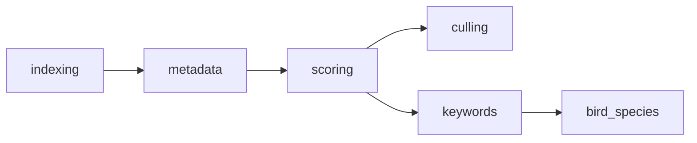
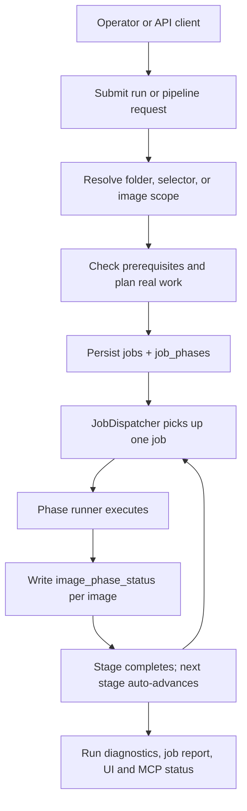

# Pipeline Architecture

Summary page. The full graph — phases and sub-steps, status state machines, preconditions,
control plane and persistence — lives in **[pipeline/INDEX.md](pipeline/INDEX.md)**.

For exact phase codes and UI labels, [../technical/PIPELINE_TERMINOLOGY.md](../technical/PIPELINE_TERMINOLOGY.md)
remains the product-naming authority.

## Phase Sequence

| Phase code | Submit token | User label | Optional | Responsibility |
|---|---|---|---|---|
| `indexing` | `indexing` | Discovery | no | Scan and register files; compute identity hash. |
| `metadata` | `metadata` | Inspection | no | EXIF/XMP, image UUID, thumbnails. |
| `scoring` | `score` | Quality Analysis | no | Run quality models and persist scores. |
| `culling` | `cluster` | Similarity Clustering | yes | Build stacks; assign pick/reject. |
| `keywords` | `tag` | Tagging | yes | Generate keywords and captions; sync metadata. |
| `bird_species` | orchestrated separately | Bird Species ID | yes | Localise and classify birds. |

The canonical request field is **`stage_codes`**; `operations` is a retained validation alias.

## Phase Dependencies

The phases are a **DAG, not a chain**. `culling` and `keywords` are siblings that both depend
only on `scoring` — enabling either does not require the other. Source:
`PHASE_PREREQUISITES` at `modules/phases.py:54-61`.

Details, including the transitive closure used by the legacy single-phase endpoints, in
[pipeline/phase-graph.md](pipeline/phase-graph.md).

## Run Model

- Batch work is persisted in `jobs`; the stage plan lives in `job_phases`.
- Per-image phase status lives in `image_phase_status` — the authoritative record.
- Folder status is **computed** from those rows and cached on `folders.phase_agg_json`; there is
  no folder phase table.
- The React Runs UI and gallery copy call a `jobs.id` row a **run**.
- Queue and restart behavior: [../technical/RUNS_QUEUE_AND_RESTART.md](../technical/RUNS_QUEUE_AND_RESTART.md).

Three separate status vocabularies apply at these three levels and do **not** share values — the
image level says `done`, the stage level says `completed`. See
[pipeline/phase-status-machines.md](pipeline/phase-status-machines.md).

## High-Level Flow

Full sequence diagrams in [pipeline/run-lifecycle.md](pipeline/run-lifecycle.md); the dispatcher,
orchestrator, JIT planner and auto-drive layers in
[pipeline/control-plane.md](pipeline/control-plane.md).

## Storage And Status

PostgreSQL + pgvector is the primary data layer. The backend owns schema and migrations; the
gallery consumes schema through PostgreSQL or backend API mode. See [../DATABASE.md](../DATABASE.md),
[../technical/DB_SCHEMA.md](../technical/DB_SCHEMA.md),
[pipeline/persistence.md](pipeline/persistence.md), and
[../technical/AGENT_COORDINATION.md](../technical/AGENT_COORDINATION.md).

## API Surfaces

- Runs and queue: `/api/runs/*`, `/api/queue`, `/api/jobs/*`.
- Pipeline compatibility surface: `/api/pipeline/*`.
- Per-phase runner surfaces: `/api/scoring/*`, `/api/tagging/*`, `/api/clustering/*`, `/api/bird-species/*`.
- Canonical contract: [../technical/API_CONTRACT.md](../technical/API_CONTRACT.md), [../reference/api/openapi.yaml](../reference/api/openapi.yaml).

Note `/api/runs/submit` validates phase prerequisites; `/api/pipeline/submit` does not.

## Related

- [pipeline/INDEX.md](pipeline/INDEX.md) — the comprehensive set
- [INDEX.md](INDEX.md) — architecture index
- [../IMAGE_PIPELINE.md](../IMAGE_PIPELINE.md)
- [../features/implemented/01-pipeline-and-runs.md](../features/implemented/01-pipeline-and-runs.md)
- [../technical/PIPELINE_PHASE_RUNNERS.md](../technical/PIPELINE_PHASE_RUNNERS.md)
