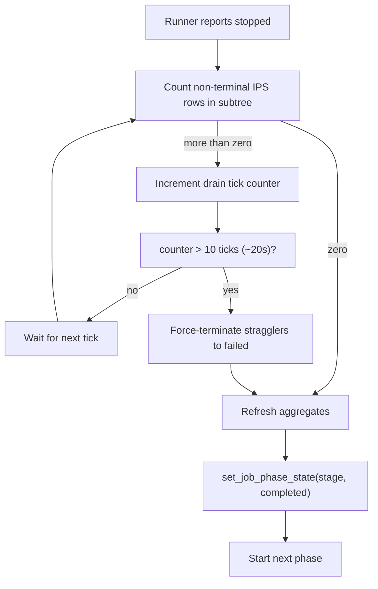
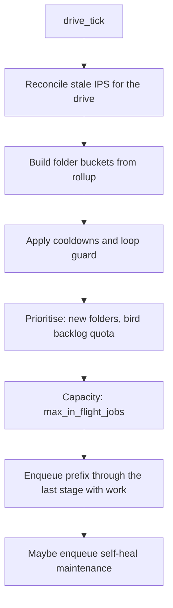

# Pipeline control plane

Four independent layers decide what runs and when. They are not alternatives — they stack, and
a single processed image may have passed through all four. This layer is where most real
production behaviour lives, and it is the part with the least existing documentation.

| Layer | Module | Scope | Answers |
|---|---|---|---|
| Dispatcher | `modules/job_dispatcher.py` | one job at a time | "which job runs next?" |
| Orchestrator | `modules/pipeline_orchestrator.py` | one folder, all stages | "which stage of this folder is next?" |
| Run planner | `modules/run_phase_planner.py` | one scope, per image | "is there real work here?" |
| Auto-drive | `modules/runs_autodrive.py` | the whole library | "which folder should we work on at all?" |

---

## 1. JobDispatcher

A single daemon thread, `job-dispatcher`, polling at an interval clamped to at least 0.2 s.
Detailed sequence in [run-lifecycle.md](run-lifecycle.md); the operational facts:

- **Global exclusivity.** `_any_runner_busy` bails the whole tick if *any* runner is running.
  Runner precedence for reporting: indexing, metadata, scoring, tagging, clustering, selection,
  bird species, maintenance.
- **Continuation before new work.** A stage left `running` by auto-advance is adopted first.
- **Capacity.** New dequeues are gated by `dispatcher.max_in_flight_jobs` (default 1), counting
  only non-maintenance pipeline jobs.
- **Phantom cleanup each tick.** `reconcile_phantom_running_job_phases` demotes stages that claim
  to be running while their runner is idle, after `dispatcher.stale_phase_grace_sec` (default 120).
- **Idle work.** When there is nothing to dispatch, the tick calls `runs_autodrive.drive_tick()`
  outside the lock.
- **Slow-tick warning.** `_log_tick_summary` warns when a tick exceeds 1.0 s.

Config: `dispatcher.max_in_flight_jobs`, `dispatcher.stale_phase_grace_sec`,
`dispatcher.priority_lanes_enabled`, `dispatcher.interactive_priority_boost`,
`dispatcher.small_batch_image_threshold`, `dispatcher.small_batch_priority_boost`,
`dispatcher.maintenance_priority_delta`.

---

## 2. PipelineOrchestrator

Folder-level sequencer for the Gradio pipeline flow, with its own 2-second background tick.

### Planning

`start()` (`modules/pipeline_orchestrator.py:164-259`) builds a plan from the folder phase
summary and the enabled phase list, dropping:

- phases with no registered runner;
- phases not in the requested `target_phases`;
- optional phases already `skipped`;
- optional `default_skip` phases with no status — these are written `skipped`
  (reason `default_skip`, actor `system`) and bypassed.

**Catch-up override** (`:195-226`): a phase already `done` is kept in the plan anyway when
`get_folder_fulfillment_stats_for_path` reports below **99.9%** for indexing, scoring, or metadata
thumbnails. This is what lets a repair run touch a folder the rollup calls finished.

### The drain gate

The orchestrator's distinctive behaviour. When a runner stops, `on_tick` (`:341-403`) counts IPS
rows in the folder subtree that are **not** in `('done','skipped','failed')`.

Without this, a stage could complete while worker threads were still writing IPS rows, and the
next stage would read a half-written folder.

Config: `pipeline.auto_resume_interrupted`.

---

## 3. Run planner — just-in-time work discovery

`modules/run_phase_planner.py`. Rather than trusting the folder rollup, this recomputes per image
and per stage whether work exists. Called at submit time and again at dispatch.

Covered in [phase-preconditions.md](phase-preconditions.md); the control-plane-relevant parts:

**Preflight repairs** (non-dry-run only) run *before* queues are built:

| Repair | Fixes |
|---|---|
| `reconcile_stale_running_phases_for_terminal_jobs(limit=5000)` | IPS `running` owned by a finished job |
| `backfill_index_meta_for_folder` | Missing indexing/metadata rows |
| `finalize_phantom_scores` | Per-model rows present but `images.score_general` NULL |

That last one matters more than it looks. A phantom-scored image wedges auto-drive permanently:
the scoring predicate sees the model rows and reports no work, so the stage is dropped from the
run, while the folder bucketer keeps reading `not_started` and re-queues the folder. Finalising
recomputes composites from the stored rows — no re-inference — so the scope converges.

**Performance.** `db.get_image_phase_statuses_bulk` prefetches the whole scope in one query
instead of an N+1 per image. Kill switch `auto_drive.bulk_phase_status` (default true) restores
the per-image path without a redeploy.

---

## 4. Auto-drive — "Drive to Complete"

`modules/runs_autodrive.py`, roughly 2,600 lines and the largest undocumented surface in the
pipeline. It scans the library, buckets folders by what they still need, and submits runs through
the ordinary API until everything is complete.

### Folder buckets

A folder lands in exactly one bucket, named for the earliest phase with outstanding work:

`awaiting_scoring`, `awaiting_culling`, `awaiting_keywords`, `awaiting_bird_species`,
plus `waiting_in_flight` (a run already covers it), `blocked`, and `complete`.

Completeness uses `COMPLETE_PHASE_STATUSES = {"done", "skipped"}`; a phase is active when its
status is in `{"queued","running","paused","cancel_requested","restarting"}`.

Buckets are cached behind `_BUCKETS_CACHE` with TTL `auto_drive.buckets_cache_ttl_sec`, and
invalidated by `invalidate_autodrive_buckets_cache()`. A missed invalidation is why a repaired
folder can appear to stay in the wrong bucket — `update_image_bird_bbox` had exactly that bug.

### Phase selection

`resolve_auto_drive_enqueue_phases` returns the **contiguous prefix through the last stage with
work**, precisely so `assert_prereqs_for_scope` will pass on submit. It never enqueues an isolated
downstream stage.

`normalize_target_phases` aliases `score` to `scoring`, `tag`/`tagging` to `keywords`, and
`cluster` to `culling`, then filters to real `PhaseCode` values.
`phases_with_work_from_repair_plan` skips `clustering` (`_REPAIR_PLAN_QUEUE_SKIP`), since
`culling` already covers it.

### Loop guard

Stops a folder that cannot progress from being enqueued forever.

- Terminal statuses counting toward the guard: `failed`, `canceled`, `cancelled`, `interrupted`.
- Completed statuses (`completed`, `done`, `success`, `succeeded`) are re-queued **only if
  progress advanced**; otherwise they count toward `auto_drive.max_repeats`.
- Progress means an `overall_percent` gain greater than `_PROGRESS_EPS` (currently `0.0`).
- Candidate scanning is capped at `AUTODRIVE_CANDIDATE_SCAN_CAP = 500`.

### Unproductive cooldown

A folder that returns one of `nothing_to_queue`, `loop_detected`, `missing_on_disk` or
`failed_exhausted` is put on a **600-second cooldown** (`DRIVE_UNPRODUCTIVE_COOLDOWN_SEC`),
recorded with the completion percentage at the time of the skip so a later real change can lift
it early. Toggle `auto_drive.unproductive_cooldown_enabled`; duration
`auto_drive.unproductive_cooldown_sec`.

### Prioritisation

- **New folders first**, when `auto_drive.prioritize_new_folders` is on. "New" means created
  within `auto_drive.new_folder_days` (default 7).
- **Bird backlog quota.** Once the bird-species backlog exceeds
  `BIRD_BACKLOG_QUOTA_THRESHOLD` (50), a fraction of each batch's slots is reserved for it via
  `auto_drive.bird_backlog_reserve_ratio`, so species work cannot be starved by a steady inflow
  of new folders.

### Post-audit follow-up

After a data-quality audit, `maybe_schedule_post_audit_followup` finds the **earliest** pipeline
stage with audit work — in the order indexing, metadata, scoring, culling, keywords,
bird_species — and schedules it. Gated by `auto_drive.post_audit_followup`.

### Self-heal maintenance

`_maybe_enqueue_drive_self_heal_maintenance` can enqueue maintenance actions during the drive,
gated by `auto_drive.self_heal_thumbnails` and `auto_drive.self_heal_exif`. Only one maintenance
job may be active at a time.

### Control and configuration

| Endpoint | Purpose |
|---|---|
| `POST /api/runs/drive/start` | Start the durable loop |
| `POST /api/runs/drive/stop` | Stop it |
| `GET /api/runs/drive/status` | Loop status plus outstanding work |
| `POST /api/runs/auto-drive` | One-shot enqueue from the bucket planner |
| `GET /api/runs/folder-buckets` | Paginated buckets for the Runs auto-queue UI |

Config keys: `auto_drive.server_loop_enabled`, `max_in_flight_jobs`, `max_repeats`,
`buckets_cache_ttl_sec`, `bulk_phase_status`, `prioritize_new_folders`, `new_folder_days`,
`bird_backlog_reserve_ratio`, `bird_backlog_quota_threshold`, `unproductive_cooldown_enabled`,
`unproductive_cooldown_sec`, `retry_unattempted_on_loop`, `post_audit_followup`,
`self_heal_thumbnails`, `self_heal_exif`; plus `runs_autodrive.treat_exhausted_failed_as_terminal`.

---

## Heal and reconcile catalog

Because four layers and three status vocabularies track overlapping reality, they drift. These
sweeps repair it. All live in `modules/db_legacy.py` unless noted.

### Stage-level (`job_phases`)

| Function | Repairs |
|---|---|
| `reconcile_phantom_running_job_phases` | Stage `running`, runner idle past the grace window |
| `reconcile_stale_running_phases_for_terminal_jobs` | Stage still open, job already terminal |
| `reconcile_orphan_interrupted_job_phases` | `interrupted` stages with no owning process |
| `reconcile_duplicate_running_job_phases` | More than one stage `running` on a job |
| `force_reset_job_phase_to_queued` | Manual unstick |

Runner-key mapping for the busy check is `PHASE_CODE_TO_RUNNER_KEY`
(`modules/db_legacy.py:6519-6532`); note `culling` maps to `selection`, and `clustering` is
separate.

### Image-level (`image_phase_status`)

| Function | Repairs |
|---|---|
| `reconcile_stale_running_image_phases` | IPS `running` whose job finished |
| `reconcile_phantom_complete_image_phases` | Work product present, IPS not terminal-complete |
| `reset_false_complete_culling_phases` | IPS `done` but clustering artefacts absent |
| `reset_false_complete_metadata_phases` | Same shape, for metadata |
| `reset_retryable_stale_phase_failures` | Retryable failures back to runnable |
| `reset_image_phase_status` | Bulk reset to `not_started`, chunked at 900 |

`reconcile_phantom_complete_image_phases` defines completeness as the negation of
`get_phase_incomplete_sql`, so it can never diverge from a phase's own definition. Its allowed
set is `_PHANTOM_RECONCILABLE_PHASES = ("indexing", "metadata", "scoring", "keywords", "culling")`
— **`bird_species` is deliberately excluded**, because its scope is bird-tagged images only and it
is reconciled by the dedicated eligibility tooling instead.

> **Why `culling` is excluded from the drive preflight.** On 2026-08-30 the auto-drive preflight
> ran this reconcile over `culling` and flipped **672 never-clustered images** from `not_started`
> to `done` in a 23-second sweep. The culling completeness predicate tested data shape
> (`cull_decision`, an embedding, folder time-cohesion), none of which proves clustering ran.
> Those folders then read complete, so Drive to Complete skipped them permanently and the gallery
> showed no stacks. `culling` is now excluded from the drive preflight tuple, the reconcile
> refuses a culling `done` when similarity artefacts are missing, and
> `reset_false_complete_culling_phases` returns poisoned rows to `not_started`. Full postmortem:
> [../../reports/PHANTOM_CULLING_DONE_2026-09-01.md](../../reports/PHANTOM_CULLING_DONE_2026-09-01.md).

### Claims and aggregates

| Function | Repairs |
|---|---|
| `reconcile_orphan_work_claims` / `_all` | Claims held by terminal jobs |
| `invalidate_folder_phase_aggregates` | Marks a folder cache dirty |
| `refresh_folder_phase_aggregates_with_ancestors` | Recompute up the tree |
| `backfill_folder_phase_aggregates` | Rebuild the cache wholesale |
| `backfill_missing_phase_rows` | Create absent IPS rows |

### Workflow healing

`modules/workflow_healing.py` enqueues repair runs for folders whose rollup and fulfillment stats
disagree. It maps phase to job type (`keywords` to `tagging`, `culling` to `selection`) and
applies `assert_prereqs_for_scope` non-fatally — a folder with unmet prerequisites is recorded as
skipped rather than raising.

## Diagnosing a stalled pipeline

In order:

1. `GET /api/runs/drive/status` — is the drive running, and what does it think is outstanding?
2. `GET /api/runs/folder-buckets` — which bucket is the folder in? `waiting_in_flight` with no
   live job means a stale aggregate or an unreconciled stage.
3. `GET /api/runs/plan/preview` — does the planner see work?
4. `GET /api/phases/decision` for one image — the exact reason code.
5. Check for an open row in `image_phase_work_claims` held by a terminal job.
6. Check whether the folder is inside a 600-second unproductive cooldown.

MCP shortcuts: `diagnostics.get_stale_running_phase_status`,
`diagnostics.diagnose_phase_consistency`, `jobs.get_run_diagnostics`.

## Known gaps

- Auto-drive holds significant state in **process-local memory** — `_BUCKETS_CACHE`,
  `_FOLDER_COOLDOWN`, loop-guard counters. All of it is lost on restart, so cooldowns and repeat
  counts reset and a genuinely stuck folder gets fresh attempts.
- `_PROGRESS_EPS` is `0.0`, so *any* nonzero percentage gain counts as progress. A folder
  advancing by a fraction of a percent per pass can evade the repeat limit.
- The dispatcher's global `_any_runner_busy` check makes the whole pipeline serial by default,
  independent of `max_in_flight_jobs`.
- Two separate sequencers (`JobDispatcher` and `PipelineOrchestrator`) can drive stages, with
  different completion semantics. `JOBS_PIPELINE_REDESIGN_SPEC.md` proposes unifying them.

## Related

- [run-lifecycle.md](run-lifecycle.md) — the dispatch sequence in detail
- [phase-preconditions.md](phase-preconditions.md) — the gates these layers apply
- [phase-status-machines.md](phase-status-machines.md) — the states being reconciled
- [../../technical/WORKFLOW_DIAGNOSTICS.md](../../technical/WORKFLOW_DIAGNOSTICS.md) — observability
