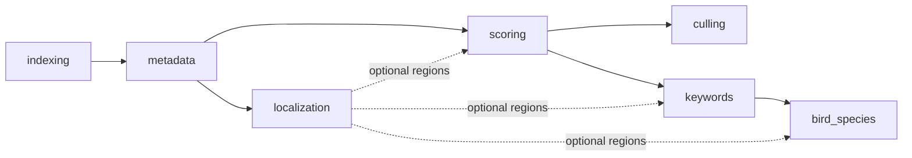

# Early localization — eight-stage rollout

This document defines an additive, reversible rollout for making object regions available soon
after metadata processing. The initial provider is the existing bird detector, but persistence and
phase boundaries are generic so another object class does not require another one-off JSON column
or hidden downstream side effect.

This is a **target design**, not a description of behavior already present in production. The
current graph and its implementation are documented in [phase-graph.md](phase-graph.md) and
[phases/bird-species.md](phases/bird-species.md).

## Decision summary

Add an optional first-class `localization` phase after `metadata`, backed by a shared rendition and
crop service. Localization is attempted before downstream inference when co-requested, but its
artifacts are **preferred inputs, not hard prerequisites**, for scoring, culling, or keywords.



The initial behavior is deliberately conservative:

- Localize all **new or source-changed, metadata-complete** images without requiring a `birds`
  keyword.
- Persist region metadata and provenance; materialize padded crop files on demand.
- Keep culling and the production IQA/aesthetic result full-frame.
- Let BioCLIP consume bird regions first and fall back to a full frame.
- Add crop or fused inputs to other consumers only behind shadow flags and benchmark gates.
- Import existing `images.bird_bbox` values before scheduling any broad backfill.
- Keep shadow localization isolated from `bird_bbox` and every production completeness predicate;
  enable normalized authority and the legacy projection together only when BioCLIP migrates.

## Current-state constraints carried into the rollout

The current prerequisite registry places `bird_species` after `keywords`
(`modules/phases.py:56-64`). The bird-species runner selects only images with the `birds` keyword,
runs detection, crops the highest-confidence box when present, and otherwise classifies the full
frame (`modules/bird_species.py:258-294`, `:689-703`). The detector returns only the best box even
when more are available (`modules/bird_detection.py:179-225`), and the result is stored as one
unversioned `images.bird_bbox` JSONB value (`modules/db_postgres.py:544-592`).

The rollout must also preserve four independent convergence layers:

1. data-completeness predicates;
2. per-image `image_phase_status`;
3. per-run `job_phases` and image×phase work claims; and
4. folder rollups, auto-drive buckets, and heal/reconcile behavior.

`PhaseExecutor.depends_on` has historically been informational, and the submission paths have not
consistently enforced the same phase vocabulary, selector scope, ordering, or prerequisite policy.
Stage 1 resolves those control-plane differences before a seventh phase is introduced. Some of
that consolidation may already be in progress in the working tree; it remains part of the gate
until its routing, continuation, and recovery behavior is verified.

The September 7 recall audit found real boxes for only 20 of 59 frames in one bald-eagle set; the
remaining 39 were valid `{"detected": false}` outcomes even though every frame visibly contained a
bird. Subject size at `imgsz=640` is the leading mechanism, and one accepted box covered 93% of the
frame. This is a regression cohort rather than a library-wide recall estimate, but it means the
rollout must evaluate negative observations and suspicious geometry before relying on them
downstream ([bird-detection-recall-2026-09-07.md](../../reports/bird-detection-recall-2026-09-07.md)).

## Rollout invariants

Every stage must preserve these invariants:

- A missing, negative, stale, or failed localization result never suppresses core full-frame
  inference.
- `no_detection` is a versioned observation, not proof that no subject exists forever.
- Retryable detector errors remain repairable without pinning a folder ahead of core work.
- Full-frame and crop embeddings never share an embedding identity unless the input mode is part
  of that identity.
- Detector boxes are unpadded facts. Padding belongs to a versioned consumer crop policy.
- Region coordinates use one documented, display-oriented coordinate space.
- Multiple detections are retained up to a configured cap; consumers decide how many to use.
- A rollout stage can be disabled without deleting normalized region history.
- No stage requires an unbenchmarked full-library rescan.

## Feature flags and compatibility controls

Use flags with explicit defaults so each stage is independently deployable:

| Flag | Initial default | Purpose |
|---|---:|---|
| `localization.enabled` | `false` | Register/schedule the new phase. |
| `localization.new_images_only` | `true` | Prevent automatic legacy-library scanning. |
| `localization.detectors.bird.enabled` | `false` | Enable the initial detector provider. |
| `localization.dual_write_bird_bbox` | `false` | Maintain the legacy JSONB projection after normalized authority is enabled. |
| `localization.read_normalized_first` | `false` | Prefer normalized regions over `bird_bbox`. |
| `localization.repair.enabled` | `false` | Enable bounded retry and the independent repair lane. |
| `bird_species.use_regions` | `false` | Remove detection ownership from BioCLIP. |
| `bird_species.multi_region_enabled` | `false` | Classify more than the primary bird region. |
| `scoring.subject_crop_shadow` | `false` | Compute non-authoritative crop IQA metrics. |
| `tagging.crop_fusion_shadow` | `false` | Evaluate full-frame plus region keyword/caption signals. |
| `accessibility.crop_fusion_shadow` | `false` | Evaluate supplemental subject descriptions. |

Flags are configuration controls, not provenance. Detector/model/config and crop-policy versions
must still be persisted with artifacts.

---

## Stage 1 — Consolidate the control plane

### Goal

Make one phase registry authoritative before adding localization. Existing behavior should remain
unchanged except for correcting inconsistent or misleading phase state.

### Changes

- Use the canonical phase registry for ordering, prerequisite lookup, executor registration,
  dispatcher routing, run planning, retries, and orchestration.
- Stop stripping the string `bird_species` in `normalize_phase_codes`; it is already a
  `PhaseCode` member (`modules/phases.py:250-273`).
- Apply the same prerequisite check to `/api/runs/submit`, `/api/pipeline/submit`, dedicated
  phase submission, auto-drive, and heal-generated runs.
- Resolve the submitted selector before checking prerequisites so paths, folder IDs, image IDs,
  exclusions, and mixed selectors use the same scope. Validate requested execution order: a hard
  prerequisite may be satisfied already or appear earlier in the same plan, not merely anywhere
  in the submitted set.
- Bring `bird_species` under the same dispatcher/plan vocabulary while retaining its dedicated
  runner.
- Replace culling follow-up behavior that marks or presents a delegated parent phase as terminal
  before its child runs with durable parent/child linkage and outcome propagation. The parent
  remains unfinished until the child succeeds, fails, or is canceled; enqueue failure is visible.
- Define separate registry fields for hard prerequisites and preferred-before/artifact edges.

### Exit gate

- Every phase accepted by one run-submission API is either accepted by the others or explicitly
  documented as unsupported.
- Registry drift, phase normalization, all selector forms, invalid ordering, resume/restart, and
  parent/child success/failure/cancellation tests pass.
- Existing six-phase runs have unchanged work selection and outputs.

### Status — met, with one item deferred

Landed as #346 (PRs #350, #352, #353, #354) plus #364, #365, #366 and #367.

| Item | Where |
|---|---|
| Canonical registry for ordering, prerequisites, executors, planning | `modules/phases.py`, `modules/phase_executors.py`, `modules/pipeline_orchestrator.py:15` |
| `normalize_phase_codes` keeps `bird_species` | `modules/phases.py:286-306` |
| Same gate on `/api/runs/submit`, `/api/pipeline/submit`, auto-drive, heal | #351, #363 |
| Selector resolution before the gate (paths, folder ids, ordering) | #354, #352 |
| `bird_species` in the dispatcher/plan vocabulary | `tests/test_phase_submission_vocabulary_parity.py` |
| Hard vs preferred-before registry fields | `PHASE_PREREQUISITES` / `PHASE_PREFERRED_BEFORE` (#364) |
| Enqueue failure on a delegated hand-off is visible | #353 |

Two things this stage did **not** resolve, both carried forward:

- **Delegated parent/child lifecycle.** `modules/selection_runner.py:419-461` still marks the
  parent's remaining stages `skipped` with a delegation note and completes the parent regardless
  of the child's outcome. The planned contract — persist the link, leave the parent unfinished,
  propagate child success/failure/cancellation — needs a durable link column and DB-backed
  recovery tests, so it is scheduled with the schema work rather than here.
- **Dedicated `/start` endpoints are prefix-expanding, not gated.** Gating them would be dead
  code; the reasoning is recorded in
  [phase-preconditions.md](phase-preconditions.md#why-the-start-endpoints-are-not-in-that-table)
  and satisfies the "explicitly documented as unsupported" clause above.

### Rollback

This stage contains correctness and consolidation work rather than a runtime feature. Revert the
registry integration as one unit if compatibility tests find an unhandled legacy caller; do not
partially retain multiple ordering authorities.

---

## Stage 2 — Add normalized persistence and a compatibility reader

### Goal

Represent positive, negative, failed, and multi-box localization outcomes with enough provenance
to determine whether an artifact is current.

### Schema

Add `image_localization_runs` with:

- image and originating job IDs;
- detector key, detector version, and detector-config hash;
- source hash/hash version and canonical-rendition hash/version;
- display-oriented coordinate space, orientation, width, and height;
- status: `detected`, `no_detection`, `retryable_error`, `terminal_error`, or `disabled`;
- retryability, error code, redacted error detail, and immutable attempt timestamps; and
- start, completion, and update timestamps.

Add `image_regions` with:

- localization-run ID;
- object class and provider class ID;
- confidence and deterministic rank;
- normalized `x1`, `y1`, `x2`, `y2` coordinates;
- geometry hash and timestamps; and
- uniqueness and range constraints.

Use one localization-run row even when zero regions are found. Absence of `image_regions` alone
must never mean either “not attempted” or “no detection.”

Keep immutable attempt history separate from mutable repair scheduling. Publish an attempt as the
current artifact only in the same transaction that persists its regions, and only if its source,
detector, configuration, and rendition identities still match the requested work. A source change
during inference leaves the attempt as superseded history rather than current output.

### Legacy import

Import without running inference:

| Legacy `bird_bbox` shape | Normalized interpretation |
|---|---|
| real coordinates | `detected`, one `bird` region |
| `{"detected": false}` | `no_detection` |
| `detector_unavailable` sentinel | `retryable_error` |
| other scan-failure sentinel | `terminal_error` unless explicitly classified retryable |
| NULL | not attempted |

Imported rows use `legacy_unversioned` detector and rendition provenance and retain the original
payload for exact compatibility, including malformed or unrecognized shapes. Do not infer a
historical source hash, orientation, or rendition from the current image row. Legacy geometry is
eligible for normalized crops only after its dimensions and orientation are verified; otherwise it
remains readable through the compatibility representation and eligible for controlled refresh.

### Compatibility behavior

- Continue reading `images.bird_bbox` while normalized reads are dark.
- Add a normalized-first reader with legacy fallback.
- Keep dual-write disabled during migration and shadow execution because `bird_bbox` already
  participates in production bird-species work selection.
- Do not alter existing species keywords or force new classification.

### Exit gate

- Migration is idempotent and preserves counts for every legacy shape.
- A synthesized legacy payload matches the pre-migration API representation.
- Unknown legacy provenance cannot silently become a current crop artifact.
- Query plans cover current artifact lookup by image and detector without table scans.
- Database growth per positive, negative, and error outcome is measured.

### Rollback

Disable normalized-first reads and continue using `bird_bbox`. The additive tables remain dormant;
do not drop imported data during rollback.

---

## Stage 3 — Establish the rendition and crop service

### Goal

Give localization and downstream consumers one deterministic way to obtain orientation-correct
full frames and region crops without making metadata own detector inference.

### Changes

- Define a canonical inference-rendition descriptor containing source/rendition hashes, decode
  route, orientation transform, display dimensions, color policy, and version.
- Bake orientation before detection and express region coordinates in normalized
  display-oriented space.
- Record which RAW path produced the pixels: embedded preview, `rawpy`, or ImageMagick. The
  existing decode chain can select different representations (`modules/thumbnails.py:420-527`).
- Materialize crops on demand from the region plus a named padding policy.
- Cache crops by source/rendition, orientation, geometry, padding policy, target size, format, and
  color-policy versions.
- Add bounded decoded-image reuse inside a job/process. Do not make runner correctness depend on
  another runner retaining tensors or model state.
- Retain up to the detector cap (initially 10) and rank by confidence, then stable geometry
  tie-breakers. Preserve the existing best-box interface as a compatibility projection.
- Reject out-of-range, inverted, or zero-area geometry. Record suspicious near-full-frame boxes in
  evaluation metrics; do not set a universal `area_frac` ceiling from a single observed outlier.
- Benchmark the current `imgsz=640` path against `imgsz=1280` and a targeted second-pass candidate
  on a pinned set containing detector positives, misses, true negatives, small subjects, textured
  backgrounds, and multiple species. Production defaults remain unchanged until the benchmark.

Current thumbnail generation resizes the image and copies the orientation tag for RAW files rather
than calling `bake_orientation` (`modules/thumbnails.py:671-739`). The service must therefore not
assume that stored thumbnail pixels already match display orientation.

### Exit gate

- Orientation fixtures 1–8 produce the same visual crop from original, RAW preview, and supported
  resized renditions within the defined tolerance.
- Crop keys change when any provenance or padding input changes.
- Cache eviction leaves durable metadata valid and crops reproducible.
- Concurrent crop requests coalesce or safely produce the same artifact.
- Detector evaluation reports recall, false positives, latency, and memory for the pinned cohort;
  the 59-frame eagle set is retained as a regression slice, not presented as a population rate.

### Rollback

Disable cache reads and regenerate through the legacy full-frame path. No downstream consumer is
using the service for authoritative output yet.

---

## Stage 4 — Introduce first-class localization in shadow mode

### Goal

Run localization early for new or changed images, persist its artifacts, and integrate phase
convergence without changing downstream results.

### Phase behavior

- Add `localization` after `metadata` in canonical order.
- Hard prerequisite: `metadata`.
- Preferred-before consumers: `scoring`, `keywords`, and `bird_species`.
- Default scope: every new or source-changed metadata-complete image.
- Initial provider: the existing bird YOLO detector.
- Persist every accepted region up to `max_regions_per_class`, ranked deterministically.
- Define “new” with a persisted enablement boundary. Automatically select images indexed after
  that boundary and images whose source identity changes; unchanged legacy images require an
  explicit repair/backfill selection.
- When localization and consumers are co-requested, attempt localization first, but release the
  consumers to their full-frame paths after that attempt. Later retries run independently and do
  not hold the core run open.

### Status semantics

| Artifact result | IPS outcome | Downstream effect |
|---|---|---|
| one or more regions | `done` | regions available |
| valid scan, zero regions | `done` | full-frame fallback remains available |
| terminal source/decode error | `skipped` with reason | core phases continue |
| detector disabled | `skipped` with versioned reason | enabling invalidates the skip |
| retryable detector/runtime error | `failed` with backoff | repair lane retries; core phases continue |

The localization run stage remains failed when it contains retryable per-image failures, while the
orchestrator continues independent core stages and exposes the auxiliary failure in diagnostics.
It must not rewrite failed image outcomes as successful localization or report the entire run as
unconditionally successful.

### Convergence work

- Add localization to `image_phase_status`, `job_phases`, executor-version policy, work claims,
  folder summaries, JIT repair planning, restart/recovery, and diagnostics.
- Define data completeness as a matching `detected`, `no_detection`, or terminal outcome for every
  enabled provider. A retryable error is an attempt but never proof of completeness.
- Add safe phantom reconciliation only when a current terminal attempt proves work completion.
- Report localization backlog separately from core completion.
- Add bounded repair with this stage: at most three automatic attempts for one artifact identity,
  with delays of one minute and five minutes after the initial failure. Exhausted failures require
  an explicit retry or a changed source/detector/configuration/rendition identity.
- Reuse the image×phase claim across normal and repair submissions. Admit at most one repair job
  while core work is idle so repair cannot starve ingestion.

### Exit gate

- Shadow localization changes only normalized artifacts and localization diagnostics. It never
  changes `bird_bbox`, scores, tags, captions, culling, species outputs, embeddings, or production
  work-selection predicates.
- Duplicate submissions produce one open image×localization claim.
- Detector outage, restart, cancellation, retry exhaustion, and stale-claim recovery converge while
  core phases continue.
- Throughput, decode/inference time, GPU memory, region-count distribution, and failure taxonomy are
  available in metrics.

### Rollback

Set `localization.enabled=false`. Existing normalized artifacts remain readable but no new phase
work is planned. Disable `localization.repair.enabled` to stop queued retry admission without
invalidating artifacts.

---

## Stage 5 — Move BioCLIP to normalized regions

### Goal

Make bird-species classification a consumer of localization rather than the owner of YOLO
detection.

### Candidate scope

Select the union of:

- images with one or more current `bird` regions; and
- images carrying the canonical `birds` discovery keyword.

This processes detector-positive images even if keyword scoring misses `birds`, while preserving
the existing full-frame fallback for keyword-positive detector misses.

### Inference behavior

- Classify the primary region first.
- Behind `bird_species.multi_region_enabled`, classify up to the configured region cap and persist
  region-linked predictions.
- Use full frame when the image is keyword-positive and no usable region exists.
- If a current `no_detection` conflicts with a later `birds` keyword, enqueue a targeted
  relocalization attempt once per artifact identity; do not wait before allowing full-frame
  classification, and do not rescan forever because the discovery keyword persists.
- Keep image-level `species:*` keyword projection for filtering and compatibility.
- Separate full-frame and region BioCLIP embedding provenance. The current implementation can
  persist either input into one image-level space (`modules/bird_species.py:258-294`, `:344-378`).
- Enable `localization.read_normalized_first`, `bird_species.use_regions`, and the legacy
  `bird_bbox` projection together. While normalized authority is active, the embedded legacy
  detector path must not overwrite that projection.
- Preserve existing species results unless an operator explicitly requests refresh. Record input
  mode, region/rendition identity, crop policy, and model identity on new predictions so later
  changes can identify stale results. Treat existing mixed-input BioCLIP embeddings as legacy.

### Exit gate

- With `bird_species.use_regions=false`, outputs match the legacy path.
- Region mode handles no region, stale region, crop failure, multi-bird frames, and detector outage
  without losing full-frame fallback.
- Detector-positive images without a `birds` keyword enter species scope, and keyword-positive
  detector misses keep the existing full-frame fallback.
- Planner decisions, SQL completeness, runner selection, and folder rollups agree on the expanded
  candidate scope.
- Human/expert evaluation covers species accuracy, calibration, small-subject images, and multiple
  subjects before multi-region results become authoritative.
- The legacy detector-only bbox repair path is no longer needed for new work.

### Rollback

Disable `bird_species.use_regions` and normalized-first reads together. The legacy detector path
and existing `bird_bbox` values remain available during the compatibility period.

---

## Stage 6 — Run optional downstream crop/fusion experiments

### Goal

Evaluate region inputs without changing established full-frame semantics prematurely.

### Mode contract

Every experimental output records one of:

- `full_frame`;
- `region`; or
- `fusion`.

The input artifact hash, region ID, crop-policy version, model version, and fusion version are part
of provenance.

### Consumer policy

| Consumer | Stage-6 mode |
|---|---|
| Production IQA/aesthetic score | full frame remains authoritative; region score is shadow-only |
| Technical failures | global full-frame metrics plus separately named subject-region metrics |
| MobileNet/culling embeddings | full frame only |
| CLIP/OpenCLIP similarity spaces | existing image spaces stay full-frame; region spaces are separate |
| Keyword scoring | shadow full-frame + region score fusion |
| Captioning | canonical scene caption plus optional subject-region clause |
| Accessibility | full-frame description plus optional subject detail |
| BioCLIP | region-first with full-frame fallback after Stage 5 gates |

The existing crop study supports experimentation, not unconditional replacement: crop IQA is more
sensitive to constructed subject degradation, captions become more distinct, and culling does not
show a material crop benefit (`docs/reports/BIRD_BBOX_CROP_STUDY_2026-08-01.md:23-29`, `:72-100`).
Its species and caption results are not human accuracy evidence (`:118-125`).

### Exit gate

- Full-frame, region-only, and fusion modes are evaluated on the same pinned population.
- Accuracy/factuality, false-negative propagation, throughput, GPU memory, model loading, and
  end-to-end runtime are reported.
- A consumer ships crop/fusion only when its own quality gate passes; there is no global “crops
  enabled” switch.

### Rollback

Disable the individual consumer flag. Shadow rows may remain for research but cannot influence
production scores, culling, keywords, or metadata.

---

## Stage 7 — Controlled repair and backfill

### Goal

Refresh missing or stale localization artifacts without requiring an immediate full-library scan
or starving core pipeline work.

### Scheduling order

1. Import existing `bird_bbox` values and sentinels.
2. Process new and source-changed images.
3. Repair `birds`-keyword images with no current attempt, a retryable error, or a deduplicated
   keyword/negative-observation conflict.
4. Process explicitly requested folders.
5. Sample the remaining legacy-unversioned population.
6. Expand to the remaining library only after cost and quality gates pass.

### Auto-drive model

Do not make localization the one earliest blocking folder bucket. Maintain:

- the existing core pipeline bucket; and
- a separately rate-limited localization-repair lane.

Reuse Stage 4's bounded retry and claim mechanism. Exhaustion remains visible for operator action
instead of looping. Source, detector, config, or rendition-version changes reset eligibility
deliberately. Backfills persist their cursor/progress so an interruption resumes without replaying
completed partitions.

### Cost gate

Measure rather than assume:

```text
current incremental cost = N(birds-keyword candidates) × (decode + detector)
all-image incremental cost = N(metadata-complete new/changed images) × (decode + detector)
cost multiplier = N(all eligible images) / N(birds-keyword candidates)
```

The crop-study snapshot contains 37,417 real boxes and 29,068 no-detection sentinels with no NULL
remaining (`docs/reports/BIRD_BBOX_CROP_STUDY_2026-08-01.md:62-70`). Those 66,485 outcomes should be
imported, not recomputed blindly.

### Exit gate

- Repair claims are idempotent under concurrent manual, auto-drive, and run-submission requests.
- Core pipeline folders continue advancing while localization repairs are failed or cooling down.
- Operators can see current, stale, negative, retryable, terminal, and legacy-unversioned counts.
- Every broad backfill exposes a dry-run count and estimated detector/decode cost before execution.
- A representative benchmark establishes whether direct all-image detection meets the agreed
  GPU-hour and ingest-latency budgets. A two-pass triage design is considered only if it does not.

### Rollback

Disable `localization.repair.enabled`, leave new-image localization active if healthy, and retain
the last successful artifacts. Cancel queued repair jobs without invalidating normalized rows.

---

## Stage 8 — Retire compatibility paths

### Goal

Remove duplicate sources of truth after all consumers and operational workflows use normalized
localization artifacts.

### Preconditions

- Backend and gallery contracts read normalized regions.
- No supported consumer performs authoritative reads directly from `images.bird_bbox`.
- BioCLIP no longer owns detector loading or bbox-only repair.
- Normalized artifacts, repair, restart/recovery, and auto-drive have completed a compatibility
  period of at least one complete release with no unresolved convergence regressions.
- Rollback telemetry confirms that normalized-first reads can be disabled independently.

### Changes

- Stop dual-writing `images.bird_bbox`.
- Retain a synthesized compatibility field or database view for supported external readers.
- Remove the embedded bird-detection path and legacy bbox-only repair code.
- Remove legacy completeness predicates that make bird-species completion depend on `bird_bbox`.
- Deprecate the JSONB column. Any physical drop is a later, separately reviewed migration after
  compatibility consumers have been removed.
- Promote only benchmark-approved crop/fusion modes; leave rejected experimental paths disabled or
  remove them.

### Exit gate

- Searches, API telemetry, and compatibility tests show no direct legacy reads.
- A rollback rehearsal can re-enable the synthesized legacy representation without rerunning
  detection.
- Documentation and API/schema references identify normalized regions as the sole authority.

### Rollback

Before the eventual column-drop migration, re-enable synthesized or dual-written `bird_bbox`.
After the drop, rollback uses the normalized-to-legacy projection; it must not require restoring a
database backup or rescanning image files.

---

## Cross-stage validation matrix

| Area | Required scenarios |
|---|---|
| Unit | coordinate transforms, orientation, padding, hashes, multi-box ranking, status mapping, invalidation, input-mode selection |
| Integration | submit → plan → claim → localize → consume, every selector form, ordering rejection, both submission APIs, dual-read/write, region/full-frame fallback, strict shadow isolation |
| Migration | every legacy bbox/sentinel shape, malformed payload, NULL, unknown provenance, existing species keywords, repeat upgrade, rollback projection |
| Recovery | crash during detection, region transaction, crop creation, consumer inference, parent/child success/failure/cancellation, enqueue failure |
| Concurrency | duplicate runs, repair versus normal run, source change during inference, detector-version transition |
| Auto-drive | retryable failures do not block core work, backoff converges, terminal outcomes stop requeueing, stale versions reopen work |
| RAW/orientation | EXIF orientations 1–8, embedded preview/rawpy differences, display/source coordinate round trips |
| ML quality | full frame vs region vs fusion, false-negative recovery, multi-subject accuracy, calibration and small-subject slices |
| Performance | decode/detector/crop/model time, throughput, GPU memory, model-load overhead, cache hit rate, DB growth, end-to-end run time |

## Promotion checklist

Before promoting any stage:

- The previous stage's exit gate is met in a production-shaped environment.
- Metrics and failure taxonomy are available before enabling the feature broadly.
- Rollback is configuration-only or additive-data-safe.
- New output carries source, model, detector, input-mode, and crop-policy provenance.
- Core full-frame inference has an explicit fail-open path.
- Tests cover restart, concurrent claims, auto-drive convergence, and stale-artifact invalidation.
- A release note states which behavior is authoritative and which remains shadow-only.

## Decisions that remain benchmark-gated

The rollout does not pre-decide:

1. whether direct all-new-image detection meets the processing budget or needs validated triage;
2. which non-BioCLIP consumers should promote crop/fusion output; or
3. how many simultaneous subject regions should be authoritative in product-facing species results.

Defaults until those decisions are made are direct localization for new/changed images, no broad
legacy rescan, three consumer crops at most, full-frame culling, and full-frame production scoring.

## Related pages

- [localization-rollout-supplement-2026-09-08.md](localization-rollout-supplement-2026-09-08.md) — review evidence, current implementation snapshot, and resolved design details
- [phase-graph.md](phase-graph.md) — current phase order and prerequisites
- [phase-preconditions.md](phase-preconditions.md) — completeness and work-claim gates
- [phase-status-machines.md](phase-status-machines.md) — IPS, run-stage, and folder states
- [control-plane.md](control-plane.md) — dispatcher, planner, auto-drive, and healing
- [persistence.md](persistence.md) — current phase persistence
- [phases/metadata.md](phases/metadata.md) — thumbnail and RAW-rendition boundary
- [phases/bird-species.md](phases/bird-species.md) — current embedded detector and BioCLIP path
- [../../reports/BIRD_BBOX_CROP_STUDY_2026-08-01.md](../../reports/BIRD_BBOX_CROP_STUDY_2026-08-01.md) — current crop evidence and limits
- [../../reports/bird-detection-recall-2026-09-07.md](../../reports/bird-detection-recall-2026-09-07.md) — small-subject recall finding and detector benchmark rationale
