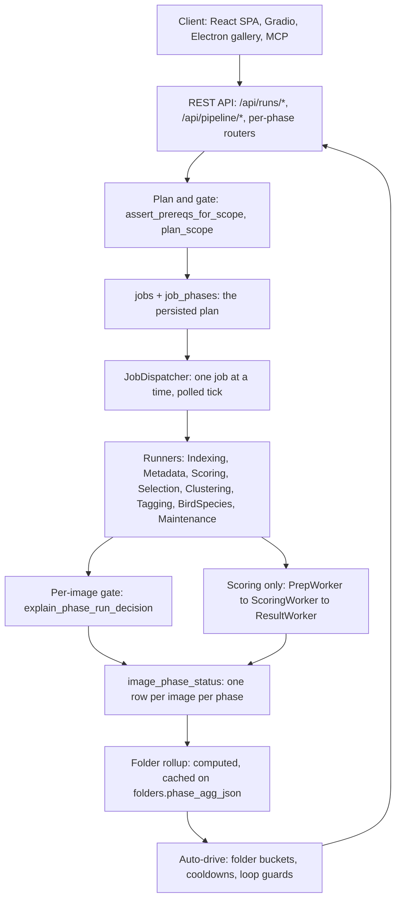
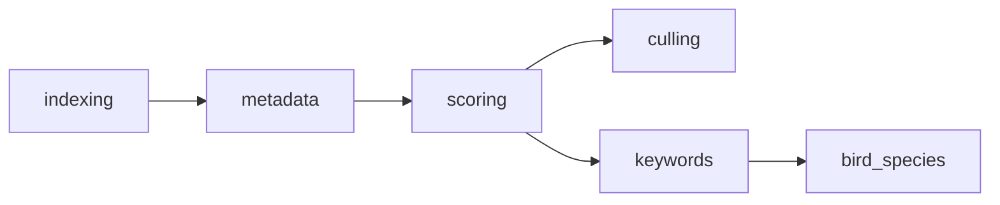

# Pipeline overview

The backend turns a folder of photographs into scored, clustered, tagged database rows. That work
is divided into six **phases**, executed by eight **runners**, coordinated by four distinct
**control layers**, and tracked in three separate **status vocabularies**.

Most confusion about this system comes from conflating those last two things. This page separates
them; the rest of the set goes deep on each.

## The one-paragraph version

A client submits a *run* over a *scope* (a folder subtree, or an explicit list of image IDs). The
run is persisted as a `jobs` row plus an ordered set of `job_phases` rows — the plan. A background
`JobDispatcher` picks up one job at a time and hands the current phase to its runner. The runner
resolves which images in scope actually need work, claims them, and processes them one by one,
writing a per-image `image_phase_status` (IPS) row for each. When the runner finishes, the stage is
marked complete and the next stage auto-advances. Folder-level progress shown in the UI is not
stored — it is computed by aggregating IPS rows and cached on `folders.phase_agg_json`.

## Layers

Auto-drive closes the loop: it reads the folder rollup, decides which folders still have work, and
submits runs back through the same API an operator uses. See [control-plane.md](control-plane.md).

## The six phases

| Order | `phase_code` | UI label | Optional | Executor |
|---|---|---|---|---|
| 1 | `indexing` | Discovery | no | `IndexingRunner` |
| 2 | `metadata` | Inspection | no | `MetadataRunner` |
| 3 | `scoring` | Quality Analysis | no | `ScoringRunner` |
| 4 | `culling` | Similarity Clustering | yes | `SelectionRunner` (fallback `ClusteringRunner`) |
| 5 | `keywords` | Tagging | yes | `TaggingRunner` |
| 6 | `bird_species` | Bird Species ID | yes | `BirdSpeciesRunner` |

Defined at `modules/phases.py:27-38` (codes), `:42-49` (order), `:430-481` (seed rows and flags).

**They are not a straight line.** `culling` and `keywords` are siblings that both depend only on
`scoring` — enabling either does not require the other. See [phase-graph.md](phase-graph.md).

## The three status vocabularies

This is the most important distinction in the system. These are **different enums applied to
different things**, and they do not share values.

| Level | Where | Values | Enforcement |
|---|---|---|---|
| **Image x phase** | `image_phase_status.status` | `not_started`, `queued`, `running`, `paused`, `cancel_requested`, `restarting`, `done`, `skipped`, `failed` (9) | `ALLOWED_TRANSITIONS` warns by default; DB `CHECK` constraint |
| **Run x stage** | `job_phases.state` | `pending`, `queued`, `running`, `paused`, `cancel_requested`, `restarting`, `completed`, `failed`, `interrupted`, `skipped`, `canceled` (11) | illegal transitions **raise `ValueError`**; no `CHECK` |
| **Folder x phase** | computed, cached | `not_started`, `queued`, `running`, `paused`, `restarting`, `cancel_requested`, `done`, `skipped`, `partial`, `failed` (10) | derived, never written directly |

Traps worth internalising:

- The image level says **`done`**; the run-stage level says **`completed`**. Different words, same idea.
- `interrupted` exists only at the run-stage level; `not_started` only at the image and folder levels.
- The folder level is the only one with `partial`, and it is never stored as a phase status — it is
  a summary of the IPS rows beneath it.

Full transition maps in [phase-status-machines.md](phase-status-machines.md).

## What decides whether work happens

Four gates, in order. Any one can turn a submitted run into a no-op.

1. **Submit-time prerequisites** — `assert_prereqs_for_scope` rejects a run whose requested phases
   have unsatisfied upstream phases (HTTP 400 `missing_prerequisites`). Both `/api/runs/submit` and
   `/api/pipeline/submit` enforce it; the latter gates folder-scoped submissions only.
2. **Scope planning** — `run_phase_planner.plan_scope` asks, per image and per stage, whether there
   is real work. A stage with an empty queue is dropped; a run with nothing anywhere is rejected
   with `nothing_to_queue`.
3. **Work claims** — `image_phase_work_claims` stops two concurrent runs processing the same
   image x phase.
4. **Per-image policy** — `explain_phase_run_decision` makes the final call inside the runner,
   returning one of roughly sixteen reason codes.

Detail in [phase-preconditions.md](phase-preconditions.md).

## Where the sub-steps are

Only the **scoring** phase uses a multi-threaded worker pipeline. The other five runners process
images in a straightforward loop.

One thread per stage, so GPU inference is serialised and there is no tensor batching. The
`scoring_queue` is deliberately small to bound VRAM. See [phases/scoring.md](phases/scoring.md).

Sub-steps inside every other phase are documented per phase under [phases/](phases/).

> **`job_steps` is not the answer.** The schema has a `job_steps` table with `step_code` and
> `step_name` columns that looks like sub-step telemetry, and `db_legacy.upsert_job_step` exists
> to write it — but nothing in production calls it. Do not build on it. Sub-step granularity
> currently lives only in `run_log` `step=` tags.

## Known gaps

- `CLAUDE.md` and several docs list **Q-Align** as an active scorer. It is not implemented
  anywhere in `modules/` or `scripts/` and has no `config.json` key. The real production set is
  SPAQ, AVA, LIQE, TOPIQ, ARNIQA — and **ARNIQA** is enabled but documented nowhere.
- `PipelineOrchestrator.PHASE_ORDER` (`modules/pipeline_orchestrator.py:14-20`) omits
  `bird_species`, despite the comment at `modules/phases.py:41` claiming it matches
  `PIPELINE_PHASE_ORDER`. Bird species is orchestrated separately.
- The `modules/phases.py:8-9` module docstring lists only 5 statuses; there are 9.

## Related

- [INDEX.md](INDEX.md) — this set
- [../../technical/PIPELINE_TERMINOLOGY.md](../../technical/PIPELINE_TERMINOLOGY.md) — naming authority
- [../../technical/PIPELINE_PHASE_RUNNERS.md](../../technical/PIPELINE_PHASE_RUNNERS.md) — prose runner walkthrough
