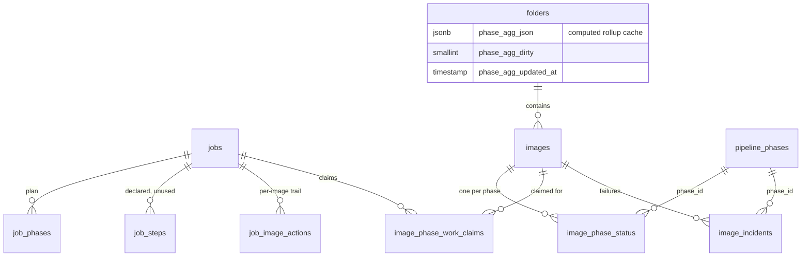

# Pipeline persistence model

Where phase state lives. PostgreSQL + pgvector is the primary engine; this repository is the
schema authority via `modules/db_postgres.py` and `migrations/versions/`.

## Entity relationships



Note there is **no folder_phase_status table**. Folder-level status is computed, never stored as
rows — only cached as JSON on `folders`.

---

## `pipeline_phases` — the phase registry

The six phases as database rows. Seeded on first startup from `phases.SEED_PHASES` by
`db_legacy.seed_pipeline_phases()`; `get_phase_id(code)` resolves code to id.

```sql
CREATE TABLE pipeline_phases (
    id            SERIAL PRIMARY KEY,
    code          VARCHAR(50)  NOT NULL,
    name          VARCHAR(100) NOT NULL,
    description   TEXT,
    sort_order    INTEGER  DEFAULT 0 NOT NULL,
    enabled       SMALLINT DEFAULT 1 NOT NULL,
    optional      SMALLINT DEFAULT 0 NOT NULL,
    default_skip  SMALLINT DEFAULT 0 NOT NULL
);
CREATE UNIQUE INDEX uq_pipeline_phases_code ON pipeline_phases(code);
```

DDL at `modules/db_postgres.py:1024-1038`; migration `0001_initial_schema.py:323-335`.

A phase present here but with no registered executor appears in the UI with its trigger disabled.

---

## `image_phase_status` (IPS) — the per-image truth

The most important table in the pipeline. One row per image per phase. Everything the UI shows
about progress is derived from it.

```sql
CREATE TABLE image_phase_status (
    id                SERIAL PRIMARY KEY,
    image_id          INTEGER NOT NULL REFERENCES images(id) ON DELETE CASCADE,
    phase_id          INTEGER NOT NULL REFERENCES pipeline_phases(id),
    status            VARCHAR(20) DEFAULT 'not_started' NOT NULL,
    executor_version  VARCHAR(50),
    app_version       VARCHAR(50),
    job_id            INTEGER REFERENCES jobs(id) ON DELETE SET NULL,
    attempt_count     SMALLINT DEFAULT 0 NOT NULL,
    last_error        TEXT,
    started_at        TIMESTAMP,
    finished_at       TIMESTAMP,
    updated_at        TIMESTAMP,
    skip_reason       TEXT,
    skipped_by        VARCHAR(255),
    CONSTRAINT ck_image_phase_status_status CHECK (status IN (
        'not_started', 'queued', 'running', 'paused',
        'cancel_requested', 'restarting',
        'done', 'skipped', 'failed'
    ))
);
CREATE UNIQUE INDEX uq_image_phase ON image_phase_status(image_id, phase_id);
CREATE INDEX idx_ips_image_id ON image_phase_status(image_id);
CREATE INDEX idx_ips_phase_id ON image_phase_status(phase_id);
CREATE INDEX idx_ips_status   ON image_phase_status(status);
```

DDL at `modules/db_postgres.py:1041-1067`; the `CHECK` was added by
`migrations/versions/0014_status_check_constraints.py:29-52`.

### Column semantics

| Column | Meaning |
|---|---|
| `status` | One of the nine `PhaseStatus` values; the only phase column with a `CHECK` |
| `executor_version` | Algorithm generation that produced the row. Drives re-run on bump. NULL on legacy rows and treated as *unknown*, not stale |
| `app_version` | Application version at write time; informational |
| `job_id` | Owning run. `ON DELETE SET NULL`, so history survives job deletion |
| `attempt_count` | Incremented on entering `running` from a terminal state. Used by exhaustion predicates |
| `last_error` | Failure text, truncated by callers |
| `started_at` | Set on `running`; `finished_at` **cleared** at the same time (issue #341) |
| `finished_at` | Set on any terminal state |
| `skip_reason` | Written only on `skipped`, cleared on `running` |
| `skipped_by` | Which component skipped it — `scoring_pipeline`, `tagging`, `bird_species_runner`, `system` |

The unique index on `(image_id, phase_id)` is what makes the table an upsert target and
guarantees exactly one current status per image per phase.

### skip_reason vocabulary

| Value | Written by |
|---|---|
| any `explain_phase_run_decision` reason | `modules/pipeline.py:254-266`, `skipped_by="scoring_pipeline"` |
| `caption_only_no_keywords` | `modules/tagging.py:958` |
| `no tags produced` | `modules/tagging.py:1006` |
| `file_missing` | `modules/bird_species.py:458` |
| `no_species_match` | `modules/bird_species_eligibility.py` |
| `default_skip` | `PipelineOrchestrator`, `skipped_by="system"` |
| `postcondition_failed:missing_similarity_artefacts` | done-postcondition gate, when enabled |

Reasons beginning `already_done_`, plus `already_indexed` and `metadata_already_done`, are
**aggregate-equivalent to `done`**. Runners must not rewrite an existing `done` row to `skipped` —
that transition is illegal and would also corrupt the rollup.

---

## `job_phases` — the run plan

The ordered stage plan for one run, and the mechanism by which stages chain.

```sql
CREATE TABLE job_phases (
    id              SERIAL PRIMARY KEY,
    job_id          INTEGER NOT NULL REFERENCES jobs(id) ON DELETE CASCADE,
    phase_order     INTEGER NOT NULL,
    phase_code      VARCHAR(50) NOT NULL,
    state           VARCHAR(20) NOT NULL,
    started_at      TIMESTAMP,
    completed_at    TIMESTAMP,
    error_message   TEXT,
    -- counters, migration 0010
    images_in_scope  INTEGER DEFAULT 0,
    images_targeted  INTEGER DEFAULT 0,
    images_processed INTEGER DEFAULT 0,
    images_skipped   INTEGER DEFAULT 0,
    images_failed    INTEGER DEFAULT 0
);
CREATE INDEX idx_job_phases_job_id ON job_phases(job_id);
```

DDL at `modules/db_postgres.py:615-624`.

- `state` uses the **run-stage vocabulary** (`completed`, not `done`) and has **no `CHECK`
  constraint** — migration 0014 excluded it because of legacy variants. Migration 0015 normalised
  `canceled` to `cancelled` here.
- `phase_order` is the **submitted** order, which need not be canonical. It is preserved for
  display so a run reports the stages in the order it actually executed.
- Counters are written by `db.update_job_phase_counters`, whose only production callers are
  `ReportCollector._push_phase_counters_unlocked` and `ReportCollector.finalize`.

### Related `jobs` columns

`jobs` carries an execution cursor: `current_phase VARCHAR(50)`, `next_phase_index INTEGER`,
`runner_state VARCHAR(50)`, written by `set_job_execution_cursor` and `update_job_status`. Queue
persistence lives in `queue_position`, `enqueued_at`, `queue_payload`, plus `report_json` and
`description`.

---

## `image_phase_work_claims` — concurrency control

Stops two concurrent runs from processing the same image in the same phase.

```sql
CREATE TABLE image_phase_work_claims (
    id           SERIAL PRIMARY KEY,
    job_id       INTEGER NOT NULL REFERENCES jobs(id) ON DELETE CASCADE,
    image_id     INTEGER NOT NULL REFERENCES images(id) ON DELETE CASCADE,
    phase_code   VARCHAR(50) NOT NULL,
    status       VARCHAR(20) NOT NULL DEFAULT 'queued',
    claimed_at   TIMESTAMP DEFAULT CURRENT_TIMESTAMP,
    released_at  TIMESTAMP
);
CREATE INDEX idx_ipwc_job_phase   ON image_phase_work_claims(job_id, phase_code);
CREATE INDEX idx_ipwc_image_phase ON image_phase_work_claims(image_id, phase_code);
CREATE UNIQUE INDEX uq_ipwc_open_image_phase
    ON image_phase_work_claims(image_id, phase_code)
    WHERE status IN ('queued', 'running');
```

DDL at `modules/db_postgres.py:683-700`; migration `0022_image_phase_work_claims.py`.

The **partial** unique index is the whole design: only open claims collide, so released history
accumulates freely. Note this table keys on `phase_code` (a string) while IPS keys on `phase_id`
(a foreign key) — a deliberate asymmetry, since claims are short-lived and never joined to the
registry.

---

## `job_image_actions` — the per-image execution trail

Append-only record of what a run did to each image, with before/after snapshots.

```sql
CREATE TABLE job_image_actions (
    id              SERIAL PRIMARY KEY,
    job_id          INTEGER NOT NULL REFERENCES jobs(id) ON DELETE CASCADE,
    image_id        INTEGER NOT NULL REFERENCES images(id) ON DELETE CASCADE,
    phase_code      VARCHAR(50) NOT NULL,
    action          VARCHAR(30) NOT NULL,
    reason          TEXT,
    before_snapshot JSONB,
    after_snapshot  JSONB,
    created_at      TIMESTAMP DEFAULT CURRENT_TIMESTAMP
);
```

Written by `ReportCollector`. This is what `GET /api/runs/{id}/report/images` reads. Retention is
governed by `processing.job_action_log_retention_days`.

`ReportCollector` skip reasons are a **separate vocabulary** from IPS `skip_reason`:
`already_indexed`, `metadata_already_done`, `scoring_policy_skip`, `no tags produced`,
`caption_only_no_keywords`, `phase_policy_skip`.

---

## `job_steps` — declared, not used

```sql
CREATE TABLE job_steps (
    id             SERIAL PRIMARY KEY,
    job_id         INTEGER NOT NULL REFERENCES jobs(id) ON DELETE CASCADE,
    phase_code     VARCHAR(50) NOT NULL,
    step_code      VARCHAR(50) NOT NULL,
    step_name      VARCHAR(100) NOT NULL,
    status         VARCHAR(20) DEFAULT 'pending',
    started_at     TIMESTAMP,
    completed_at   TIMESTAMP,
    items_total    INTEGER DEFAULT 0,
    items_done     INTEGER DEFAULT 0,
    throughput_rps DOUBLE PRECISION,
    error_message  TEXT
);
```

> **Dead schema.** `db_legacy.upsert_job_step` (writer) and `get_job_steps` (reader) both exist,
> but **no production code calls the writer**. The table is never populated. Do not build
> features on it without first implementing the write path. Sub-step granularity today lives only
> in `run_log` `step=` tags (`prep`, `inference`, `workflow`, `dispatcher`) and in the frontend's
> `STEP_DISPLAY` map (`musiq`, `liqe`, `topiq`, `qalign`, `blip`, `clip`) — which itself lists
> `qalign`, a model this backend does not implement.

---

## `image_incidents` — failure records

Append-only image-scoped failures and validations, with `phase_id` referencing
`pipeline_phases(id) ON DELETE SET NULL`. Written post-commit by `set_image_phase_status` with
`kind="phase_failure"` whenever a phase goes `failed`. Surfaced at `GET /api/incidents`.

---

## Folder rollup cache

There is no folder phase table. `get_folder_phase_summary`
(`modules/db_legacy.py:15047-15250`) aggregates IPS rows across a folder and its descendants,
then caches the result.

| Column on `folders` | Role |
|---|---|
| `phase_agg_json` | Cached rollup — one entry per phase |
| `phase_agg_dirty` | Set to 1 by `set_image_phase_status`, for the folder **and all ancestors**, in the same transaction |
| `phase_agg_updated_at` | Cache timestamp |
| `is_fully_scored` | Legacy fast flag |

Each cached entry holds `code`, `name`, `sort_order`, `status`, `total_count`, `optional`,
`advance_ready`, and per-status counts (`done_count`, `failed_count`, `running_count`,
`queued_count`, `paused_count`, `cancel_requested_count`, `restarting_count`, `skipped_count`).

Recomputed when dirty or on `force_refresh`, which additionally runs `_heal_stale_phase_flags`.
Derivation rules in [phase-status-machines.md](phase-status-machines.md).

**Cache invalidation is the usual suspect** when the UI shows a folder in the wrong state.
Relevant helpers: `invalidate_folder_phase_aggregates`,
`refresh_folder_phase_aggregates_with_ancestors`, `backfill_folder_phase_aggregates`,
`get_folder_phase_agg_dirty_local_paths`, `get_all_folder_phase_summaries_bulk`.

---

## Useful queries

Phase distribution for one folder subtree:

```sql
SELECT pp.code, ips.status, COUNT(*)
FROM image_phase_status ips
JOIN pipeline_phases pp ON pp.id = ips.phase_id
JOIN images i           ON i.id = ips.image_id
JOIN folders f          ON f.id = i.folder_id
WHERE f.path LIKE '/photos/2026%'
GROUP BY pp.code, ips.status
ORDER BY pp.code, ips.status;
```

Images stuck `running` with no live job:

```sql
SELECT ips.image_id, pp.code, ips.started_at, j.status AS job_status
FROM image_phase_status ips
JOIN pipeline_phases pp ON pp.id = ips.phase_id
LEFT JOIN jobs j        ON j.id = ips.job_id
WHERE ips.status = 'running'
  AND (j.id IS NULL OR j.status IN ('completed','failed','canceled','cancelled','interrupted'));
```

Open work claims held by terminal jobs:

```sql
SELECT c.image_id, c.phase_code, c.job_id, j.status
FROM image_phase_work_claims c
JOIN jobs j ON j.id = c.job_id
WHERE c.status IN ('queued','running')
  AND j.status IN ('completed','failed','canceled','cancelled','interrupted');
```

Executor-version spread for one phase:

```sql
SELECT ips.executor_version, ips.status, COUNT(*)
FROM image_phase_status ips
JOIN pipeline_phases pp ON pp.id = ips.phase_id
WHERE pp.code = 'scoring'
GROUP BY ips.executor_version, ips.status
ORDER BY 3 DESC;
```

Prefer read-only MCP `data.execute_sql` for ad-hoc queries; see the safety notes in
`.agent/SAFETY.md`.

## Known gaps

- `job_phases.state` has no `CHECK` constraint, so an unexpected value can enter the column and
  then fail every transition lookup.
- `job_steps` is unpopulated dead schema.
- IPS keys phases by `phase_id`; work claims key by `phase_code`. Any query joining the two must
  bridge through `pipeline_phases`.
- The folder rollup exists only as a JSON cache, so it cannot be joined or indexed. Set-based
  questions must go through `get_phase_incomplete_sql` against `images` instead.

## Related

- [phase-status-machines.md](phase-status-machines.md) — what the status values mean
- [phase-preconditions.md](phase-preconditions.md) — the completeness predicates over these tables
- [../../technical/DB_SCHEMA.md](../../technical/DB_SCHEMA.md) — full schema reference
- [../../DATABASE.md](../../DATABASE.md) — PostgreSQL and pgvector hub
