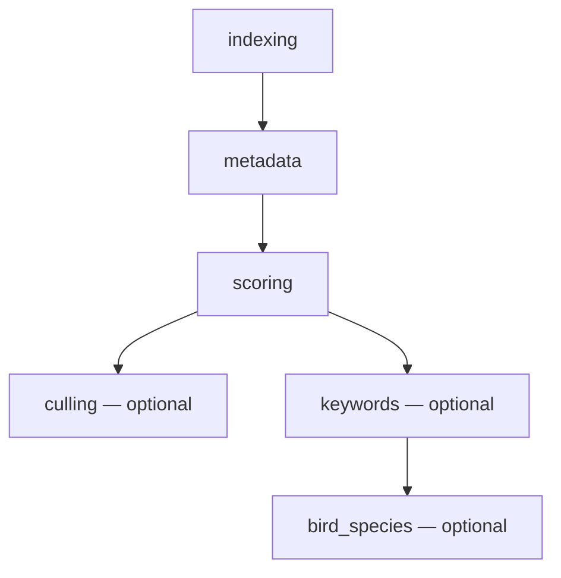

# Phase graph and prerequisites

The structural contract: which phases exist, what order they run in, what must happen before
what, and which code object actually executes each one.

## Phase codes

`modules/phases.py:27-38`:

```python
class PhaseCode(str, Enum):
    INDEXING     = "indexing"
    METADATA     = "metadata"
    SCORING      = "scoring"
    CULLING      = "culling"
    KEYWORDS     = "keywords"
    BIRD_SPECIES = "bird_species"
```

The `str` mixin means these serialise directly to JSON and SQL. Values must match
`pipeline_phases.code` in the database, seeded from `SEED_PHASES` (`modules/phases.py:529-580`).

## Canonical order

`modules/phases.py:45-52` defines `PIPELINE_PHASE_ORDER` as
`indexing, metadata, scoring, culling, keywords, bird_species`.

This order governs display and sorting, not dependency. Two helpers use it:

- `sort_phase_codes_canonical` (`:244-246`) — sorts `PhaseCode` values; unknown sorts to 999.
- `phase_string_sort_key` (`:249-256`) — sorts persisted strings; an unknown code sorts to 999.

`sort_job_phase_rows_for_display` (`:295-316`) deliberately does **not** re-sort into canonical
order. A run stores the plan the client submitted, which need not be canonical — a
`metadata, score, tag, cluster` submission stores `keywords` before `culling`. Sorting by
canonical order would report stages in an order the run never executed, so the stored
`phase_order` wins and canonical order is only a tiebreak.

## The prerequisite DAG

This is the real dependency structure. `modules/phases.py:57-64`:

```python
PHASE_PREREQUISITES: dict[str, tuple[str, ...]] = {
    "indexing":     (),
    "metadata":     ("indexing",),
    "scoring":      ("metadata",),
    "culling":      ("scoring",),
    "keywords":     ("scoring",),
    "bird_species": ("keywords",),
}
```

### Two kinds of edge

`PHASE_PREREQUISITES` holds **hard** edges: a prerequisite that is not satisfied for the
scope blocks the phase at submit time. A second table holds **advisory** edges:

```python
PHASE_PREFERRED_BEFORE: dict[str, tuple[str, ...]] = {}   # modules/phases.py:66-77
```

An advisory edge says the key *should* be attempted before each listed consumer when both
are co-requested, but its artifact is a preferred input rather than a prerequisite — a
missing, negative, stale or failed result must never suppress the consumer's own
full-frame path. `missing_prerequisites` and `pipeline_prefix_through` read
`PHASE_PREREQUISITES` only, deliberately: those two decide whether work is *blocked*, and
a soft edge never blocks.

The table is empty today. `localization` populates it with `(scoring, keywords,
bird_species)` when that phase lands — see
[localization-rollout.md](localization-rollout.md) stage 4. Both tables project onto the
executor as `depends_on` / `preferred_before`, derived in `modules/phase_executors.py` so
neither can drift from its table.



**`culling` and `keywords` are siblings, not sequential.** Every older diagram in this repository
draws a straight line through them, which is wrong: you can run tagging without ever clustering,
and vice versa. Only `bird_species` sits downstream of `keywords`, because it needs the `birds`
discovery keyword to know which images are in scope.

### Transitive closure

`pipeline_prefix_through(phase)` (`modules/phases.py:187-214`) walks the DAG — it does not slice
the linear order — and returns the contiguous set of phases required to reach a target:

| Call | Result |
|---|---|
| `pipeline_prefix_through("keywords")` | `["indexing", "metadata", "scoring", "keywords"]` |
| `pipeline_prefix_through("culling")` | `["indexing", "metadata", "scoring", "culling"]` |
| unknown phase | `[phase]` unchanged |

Used by the legacy single-phase `/start` endpoints (`modules/api/routers/clustering.py:137-139`,
`modules/api/routers/tagging.py:147-149`) so a downstream phase can never be enqueued ahead of
its prerequisites. Note `culling` closure does **not** include `keywords`, and vice versa.

### Satisfaction and enforcement

`missing_prerequisites(requested, satisfied)` (`:66-99`) returns `{phase: [missing]}`. A
prerequisite counts as satisfied when it is either already complete for the scope **or**
co-requested in the same run.

`compute_satisfied_phases_for_scope(scope_paths)` (`:102-146`) aggregates
`db.get_folder_phase_summary` across the scope. A phase is satisfied when, summed over all
folders, either `total_count == 0` (nothing to gate on) or
`done + skipped >= total AND failed == 0`.

`assert_prereqs_for_scope(phase_values, scope_paths)` (`:227-242`) composes the two. An empty
dict means every requested phase can proceed. Callers choose policy: `/api/runs/submit` raises
HTTP 400, while heal records a per-folder skip and continues.

## Executors and versions

Registration happens once at startup in `modules/phase_executors.py:44-147`. Each phase binds a
`run_folder` callable, a declared `depends_on` (hard) and a `preferred_before` (advisory);
both are derived from their tables by `_prereqs()` / `_preferred()` rather than written out.

| Phase | `executor_version` | `run_folder` | `depends_on` | Source |
|---|---|---|---|---|
| `indexing` | `1.0.0` | `indexing_runner.start_batch` | — | `:35-48` |
| `metadata` | `1.0.0` | `metadata_runner.start_batch` | `indexing` | `:51-64` |
| `scoring` | `5.0.0` (`SCORING_EXECUTOR_VERSION`) | `scoring_runner.start_batch` | `metadata` | `:67-73` |
| `culling` | `1.0.0` | `selection_runner.start_batch`, else `clustering_runner.start_batch` | `scoring` | `:76-89` |
| `keywords` | `1.0.0` | `tagging_runner.start_batch` | `scoring` | `:92-98` |
| `bird_species` | `BIRD_SPECIES_RUNNER_VERSION` (`1.0.0`) | `bird_species_runner.start_batch` | `keywords` | `:101-109` |

`indexing` and `metadata` register **even when their runner is `None`**, with `run_folder=None`.
That makes the phase visible in the UI with a disabled trigger. The other four register only when
a runner exists — so an unregistered phase simply cannot be launched.

`culling` prefers `SelectionRunner` and falls back to `ClusteringRunner`. The fallback produces
stacks but **no pick/reject decisions**; see [phases/culling.md](phases/culling.md).

### Why executor_version matters

`image_phase_status.executor_version` records which generation of the algorithm produced a row.
When it changes, `explain_phase_run_decision` returns `executor_version_changed` and the image is
re-queued — this is the mechanism for rolling out a model or algorithm change across an existing
library. It is deliberately independent of `APP_VERSION`.

`_get_scorer_version` (`modules/phase_executors.py:115-125`) carries an explicit warning: do not
use the per-model `shared_scorer.VERSION` here. That tag names the active backend, not the phase
generation stored in IPS.

## Phase flags

From `SEED_PHASES` (`modules/phases.py:430-481`), inserted into `pipeline_phases` on first start:

| Code | Name | `sort_order` | `optional` | `default_skip` |
|---|---|---|---|---|
| `indexing` | Indexing | 1 | 0 | false |
| `metadata` | Physical Metadata | 2 | 0 | false |
| `scoring` | Scoring | 30 | false | false |
| `culling` | Culling & Stacks | 40 | true | false |
| `keywords` | Keywords | 50 | true | false |
| `bird_species` | Bird Species | 60 | true | false |

`optional` and `default_skip` drive orchestrator planning
(`modules/pipeline_orchestrator.py:227-238`):

- An `optional` phase already marked `skipped` is dropped from the plan.
- An `optional` phase with `default_skip` and no status is written `skipped`
  (reason `default_skip`, actor `system`) and bypassed.

## Phase code aliases

The API and job payloads use shorter tokens than the DB. `modules/phases.py:240-244`:

```python
PHASE_CODE_ALIASES = {
    "score":         "scoring",
    "tag":           "keywords",
    "cluster":       "culling",
    "bird-species":  "bird_species",
}
```

`normalize_phase_codes` (`:326-346`) strips a `PhaseCode.` prefix, lowercases, applies the
aliases, dedupes, and returns canonically sorted values. It resolves every `PhaseCode`
member, `bird_species` included — the pre-#346 version dropped that one string while letting
the enum through, which forced every caller to special-case it.

The run planner carries a wider alias set (`modules/run_phase_planner.py:24-31`), adding
`clustering` and `selection` to `culling` and `tagging` to `keywords`. The dispatcher has its
own queue-key map again at `modules/job_dispatcher.py:531-538`. The **job_type** direction —
`tagging`/`clustering`/`selection` back to a phase code — has one home,
`phase_for_job_type` (`modules/phases.py:110-123`), which `db_legacy.job_type_for_phase_dispatch`
and the Runs-UI retry path both delegate to (#366).

## Known gaps

- **`PhaseExecutor.depends_on` has no runtime reader.** It is *derived* from
  `PHASE_PREREQUISITES` by `modules/phase_executors.py:25-31`, and
  `tests/test_phase_prerequisites_registry_sync.py` fails if the two drift — so the field
  is accurate. Nothing consults it at run time, though: the gate is
  `assert_prereqs_for_scope` reading `PHASE_PREREQUISITES` directly. The field is
  documentation the registry cannot contradict, not an enforcement point.
- **`JobDispatcher.runner_map` is still hand-written** (`modules/job_dispatcher.py:485-500`),
  with a second alias table for queue keys at `:531-538`. It binds job types to live runner
  *instances*, which the registry cannot supply, so it was not folded into
  `PHASE_TO_JOB_TYPE` (#366). `tests/test_phase_job_type_registry.py` guards it instead: a
  phase whose job type is missing from that map fails the build rather than becoming
  silently unroutable.
- **`SEED_PHASES` is inconsistently typed.** The first two rows use integers for `enabled` and
  `optional`; the last four use booleans and omit `enabled` entirely.

## Related

- [phase-preconditions.md](phase-preconditions.md) — how these prerequisites are enforced at runtime
- [phase-status-machines.md](phase-status-machines.md) — what states a phase can occupy
- [terminology-map.md](terminology-map.md) — full cross-naming table
- [phases/](phases/) — what each phase actually does
