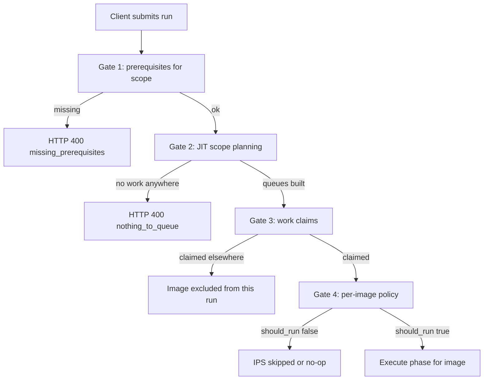
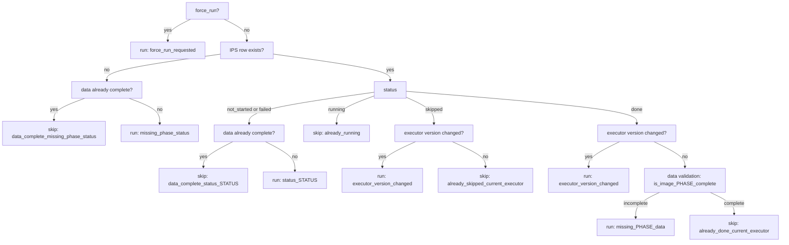

# Phase preconditions and run decisions

Four independent gates stand between "a client asked for this phase" and "this image is being
processed". Any one of them can silently reduce a run to nothing, which is why a submitted run
that appears to do nothing is usually a gating question, not a runner bug.



---

## Gate 1 — Prerequisites for scope

Runs at submit time. Prevents enqueuing a phase whose upstream work has not happened.

`assert_prereqs_for_scope(phase_values, scope_paths)` (`modules/phases.py:149-161`) composes:

1. `compute_satisfied_phases_for_scope` (`:102-146`) — sums `db.get_folder_phase_summary` over
   every scope path. A phase is **satisfied** when `total_count == 0`, or
   `done + skipped >= total` **and** `failed == 0`.
2. `missing_prerequisites` (`:66-99`) — for each requested phase, lists prerequisites that are
   neither satisfied nor co-requested in the same submission.

An empty result means go. Callers pick their own policy:

| Caller | On missing prerequisites |
|---|---|
| `POST /api/runs/submit` (`modules/api/routers/electron_runs_lifecycle.py:125-140`) | HTTP 400, body `{"code": "missing_prerequisites", "missing": {...}}` |
| `workflow_healing._enqueue_heal_run` (`:544`) | Returns a structured skip, continues with other folders |
| `POST /api/pipeline/submit` | **Does not check at all** |

That last row is a real inconsistency — see Known gaps.

The scope-satisfaction rule mirrors `_compute_scope_preview_for_resolved_paths` on purpose, so
submit-time gating and heal-time gating cannot disagree.

---

## Gate 2 — JIT scope planning

Runs at submit time and again at dispatch. Answers "is there actually work here?" per image and
per stage, rather than trusting the folder rollup.

`run_phase_planner.plan_scope` (`modules/run_phase_planner.py:122-216`):

1. **Preflight repairs** when not a dry run (`_apply_preflight`, `:62-90`):
   - `reconcile_stale_running_phases_for_terminal_jobs(limit=5000)`
   - `backfill_index_meta_for_folder` per scope path
   - `finalize_phantom_scores` — recomputes composites for images that have per-model rows but a
     NULL `images.score_general`. Without this the scope never converges: the scoring predicate
     sees the model rows and reports no work, while the folder bucketer keeps reading
     `not_started` and re-queues the folder forever.
2. **Bulk status prefetch** — `db.get_image_phase_statuses_bulk` for the whole scope, avoiding an
   N+1. Kill switch `auto_drive.bulk_phase_status` (default true).
3. **Per (stage, image) decision** via `explain_phase_run_decision`.
4. **Claim exclusion** — drop images claimed by another job (`count_claimed_by_other`).
5. `culling` queues are mirrored into a `clustering` key for legacy consumers (`:189-190`).

### Reason buckets

`_reason_bucket` (`modules/run_phase_planner.py:39-55`) collapses the fine-grained policy reasons
into eight buckets for reporting:

| Bucket | From policy reason |
|---|---|
| `missing_row` | `missing_phase_status` |
| `not_started` | `status_not_started` |
| `failed` | `status_failed` |
| `stale_executor` | `executor_version_changed` |
| `stale_running` | `already_running` |
| `missing_data` | anything starting `missing_` or containing `incomplete` |
| `current` | `already_done_current_executor` |
| `invalid_data` | anything else |

`include_stale_executor=False` moves `stale_executor` hits into `ignored_counts` rather than the
queue — that is how a caller opts out of re-running everything after a version bump.

---

## Gate 3 — Work claims

Prevents two concurrent runs from processing the same image in the same phase.

Backed by `image_phase_work_claims` with a **partial unique index**:

```sql
CREATE UNIQUE INDEX uq_ipwc_open_image_phase
  ON image_phase_work_claims (image_id, phase_code)
  WHERE status IN ('queued', 'running');
```

The predicate is what makes it work: only *open* claims collide, so historical rows accumulate
without blocking future runs.

| Function | Role | Source |
|---|---|---|
| `claim_image_phases` | Claim IDs for a job; skip those already claimed elsewhere | `modules/phase_work_claims.py:13-96` |
| `mark_claims_running` | Move claims from `queued` to `running` | `:99-116` |
| `count_claimed_by_other` | Planner exclusion test | `:237-252` |
| `release_claims_for_job` | Release on job end | `:215-234` |
| `reconcile_orphan_work_claims` | Release claims held by terminal jobs | `:128-177` |
| `reconcile_orphan_work_claims_all` | Loop the above, up to 20 passes | `:180-212` |

A claim held by a crashed job would block that image forever, so orphan reconciliation runs
during interrupted-job recovery (`modules/pipeline_orchestrator.py:435-484`).

---

## Gate 4 — Per-image run decision

The final call, made inside the runner. `explain_phase_run_decision`
(`modules/phases_policy.py:48-179`) returns a structured verdict rather than a bare boolean, so
the reason can be logged, bucketed, and surfaced through `GET /api/phases/decision`.

```python
{
  "image_id": int, "phase_code": str,
  "should_run": bool, "reason": str, "force_run": bool,
  "current_executor_version": str | None,
  "stored_status": str | None, "stored_executor_version": str | None,
}
```

### Decision order



### Full reason vocabulary

**Skip-producing** (`should_run = False`):

| Reason | Meaning |
|---|---|
| `data_complete_missing_phase_status` | No IPS row, but the work product is already present |
| `data_complete_status_not_started` | IPS says not started, data says otherwise |
| `data_complete_status_failed` | IPS says failed, data is nonetheless complete |
| `already_running` | Another run holds it |
| `already_skipped_current_executor` | Deliberately skipped, executor unchanged |
| `already_done_current_executor` | Done, current version, data verified present |

**Run-producing** (`should_run = True`):

| Reason | Meaning |
|---|---|
| `force_run_requested` | Caller overrode policy |
| `missing_phase_status` | No IPS row and no work product |
| `status_not_started` / `status_failed` | IPS says there is work |
| `executor_version_changed` | Algorithm generation moved on |
| `missing_indexing_data` | Passed `done` but `is_image_indexing_complete` false |
| `missing_metadata` | Same, for metadata |
| `missing_scoring_data` | Same, for scoring |
| `missing_keyword_data` | Same, for keywords |
| `missing_culling_work` | Same, for culling |
| `missing_bird_species_data` | Same, for bird species |
| `missing_metadata_assets` / `missing_thumbnail` / `missing_exif_capture_date` | Metadata asset-gap reasons (`modules/db_legacy.py:10552-10558`) |

### Two rules that are easy to get wrong

**`skipped` is terminal.** A skip means the executor deliberately produced no work product — the
tagger finding no tags, for instance. Data validation would therefore always find the data
missing and re-queue the image forever. Only an executor-version change reopens a skipped row
(`modules/phases_policy.py:117-129`). This matches `runs_autodrive.COMPLETE_PHASE_STATUSES` and
the `NOT IN ('done','skipped')` predicates used throughout.

**A NULL `executor_version` is not stale.** Legacy rows commonly have no version. Treating that
as a mismatch would re-run the entire library, so a NULL falls through to data validation
instead (`:131-136`).

### Data validation — the "falsely done" escape hatch

Even a `done` row with a matching version is verified against the actual data. This is what
catches an image whose status was written but whose commit was interrupted, or that was migrated
from an older schema.

---

## Completeness predicates

Each phase defines what "the work product exists" means. Two parallel families, and they are
**not** always the same test.

### Per-image

Dispatched by `_phase_data_complete` (`modules/phases_policy.py:28-45`):

| Phase | Predicate | Test |
|---|---|---|
| `indexing` | `is_image_indexing_complete` | `image_hash` present and non-blank |
| `metadata` | `is_image_metadata_complete` + `get_image_metadata_asset_gap_reason` | `rating` in 0-5 and `label` non-NULL |
| `scoring` | `is_image_scoring_complete` | at least one successful, non-shadow `image_model_scores` row with a positive value among spaq, ava, liqe, paq2piq, koniq |
| `culling` | `is_image_culling_work_complete` | negation of the culling incomplete predicate |
| `keywords` | `is_image_keywords_complete` | `image_keywords` rows exist |
| `bird_species` | `is_image_bird_species_complete` | species keyword, exhausted marker, and a usable `bird_bbox` |

`is_image_scoring_complete` deliberately ignores the aggregated `score_general`: a weighted score
of exactly `0` is a legitimate output and must not flip a scored image back to incomplete
(issue #162).

### Set-based

`get_phase_incomplete_sql(phase_code, table_alias)` (`modules/db_legacy.py:10185-10258`) returns a
`WHERE` clause selecting images with missing data. An unknown phase returns `1=0` — no matches.

| Phase | Predicate |
|---|---|
| `indexing` | `image_hash IS NULL OR TRIM(...) = ''` |
| `metadata` | no thumbnails **and** no `image_exif` row **and** no `image_xmp` row |
| `scoring` | `_incomplete_images_where_sql` |
| `culling` | `get_culling_incomplete_predicate_sql` |
| `keywords` | no `image_keywords` rows (plus legacy column check when present) |
| `bird_species` | has `birds` keyword **and** (no `species:*` and not exhausted, **or** bbox needs scan) |

> **Trap.** For `metadata` the two families test different things on purpose:
> `is_image_metadata_complete` checks rating/label, while `get_phase_incomplete_sql("metadata")`
> checks thumbnails and EXIF/XMP presence. The code carries an explicit warning
> (`modules/db_legacy.py:10197-10199`) not to merge them without reconciling what "metadata is
> done" is supposed to mean.

### The culling predicate in detail

`get_culling_incomplete_predicate_sql` (`modules/db_legacy.py:9971+`) treats an image as
incomplete when **any** of these holds:

1. `cull_decision` is NULL or blank; or
2. **stale similarity** — `cull_decision` is set, `stack_id IS NULL`, the image is
   clustering-eligible (`image_hash` present), and no default-space embedding exists; or
3. folder time-cohesion candidacy, when `clustering.heal_folder_cohesion_candidates` is on.

Condition 2 is the important one. `ClusteringEngine` persists the
`mobilenet_v2_imagenet_gap` embedding itself — even for single-image time batches — so the
absence of that embedding **proves the clustering pass never ran** on the image. That inference
is what `reset_false_complete_culling_phases` and the done-postcondition gate rely on.

This was added after the 2026-08-30 incident in which the auto-drive preflight flipped 672
never-clustered images to `done` in a 23-second sweep, because the completeness predicate at the
time tested only data shape. `culling` is now excluded from the drive preflight reconcile tuple
entirely.

---

## Where each gate is applied

| Component | Gate |
|---|---|
| `POST /api/runs/submit` | 1, then 2 |
| `POST /api/pipeline/submit` | 2 only |
| `JobDispatcher._jit_replan_phase` | 2, then 3 |
| `PrepWorker._apply_scoring_prep` | 4 |
| `TaggingRunner`, `SelectionRunner`, `ClusteringEngine`, `MetadataRunner`, `IndexingRunner` | 4 |
| `runs_autodrive` | 1 and 2, before enqueueing |
| `workflow_healing` | 1, non-fatally |

## Known gaps

- **`/api/pipeline/submit` skips Gate 1.** It validates operation tokens
  (`modules/api/routers/pipeline_submit.py:98`) but never calls `assert_prereqs_for_scope`, so it
  can enqueue a downstream phase whose prerequisites are unmet — something `/api/runs/submit`
  rejects with HTTP 400.
- **The metadata predicate divergence** above is intentional but undocumented outside a code
  comment, and reliably surprises people.
- `is_image_scoring_complete` still names the legacy model set (`spaq`, `ava`, `liqe`,
  `paq2piq`, `koniq`) even though `koniq` and `paq2piq` are no longer produced, and the currently
  enabled `topiq` and `arniqa` do not appear in it at all. An image scored only by TOPIQ and
  ARNIQA would not register as scoring-complete.

## Related

- [phase-graph.md](phase-graph.md) — the prerequisite DAG itself
- [phase-status-machines.md](phase-status-machines.md) — what the statuses mean
- [control-plane.md](control-plane.md) — who calls these gates and how often
