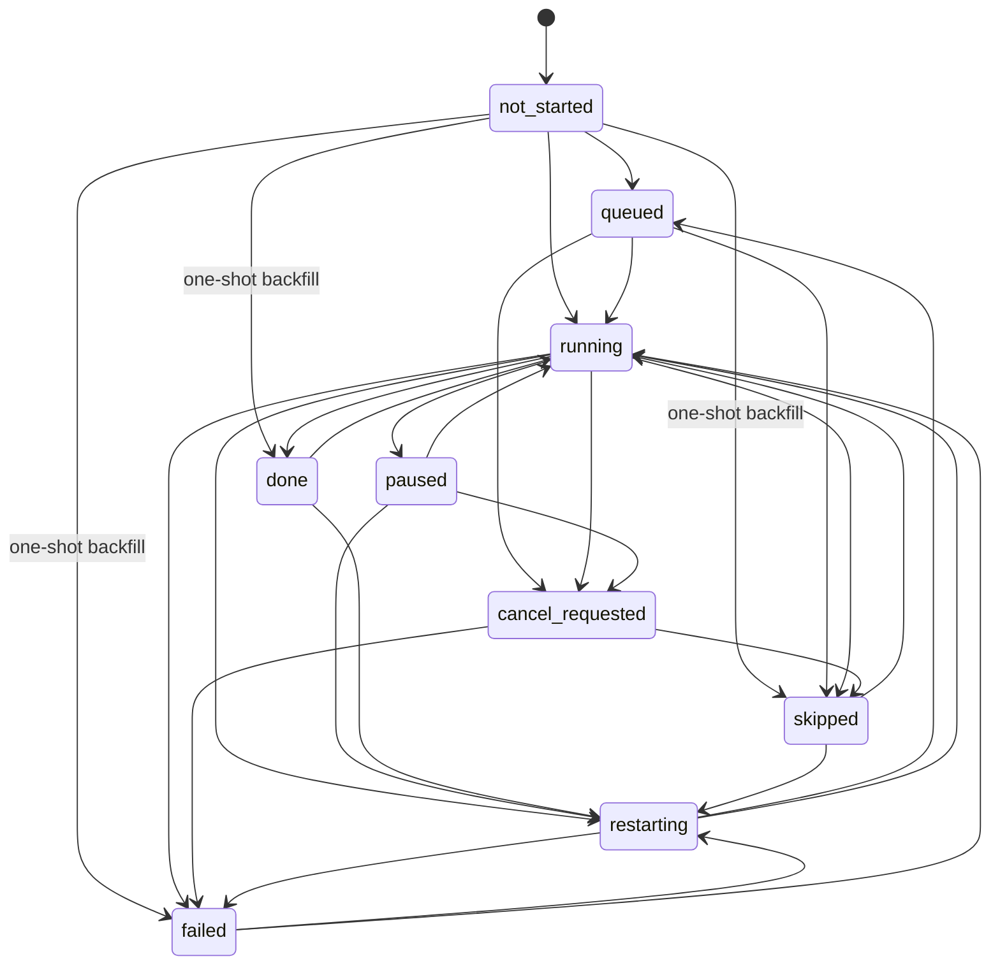
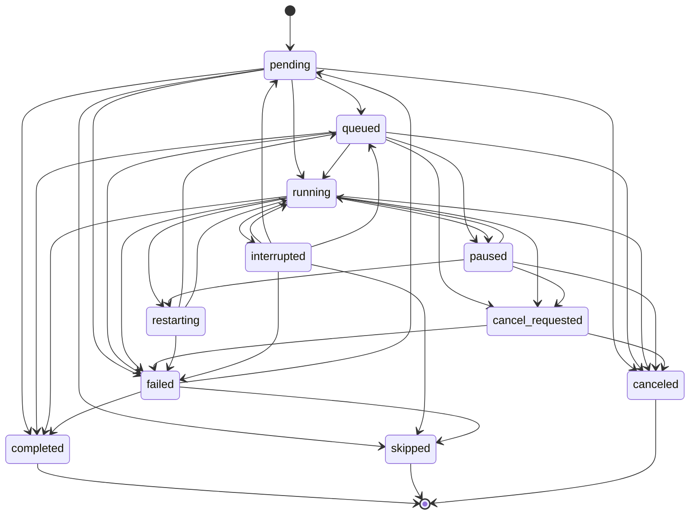
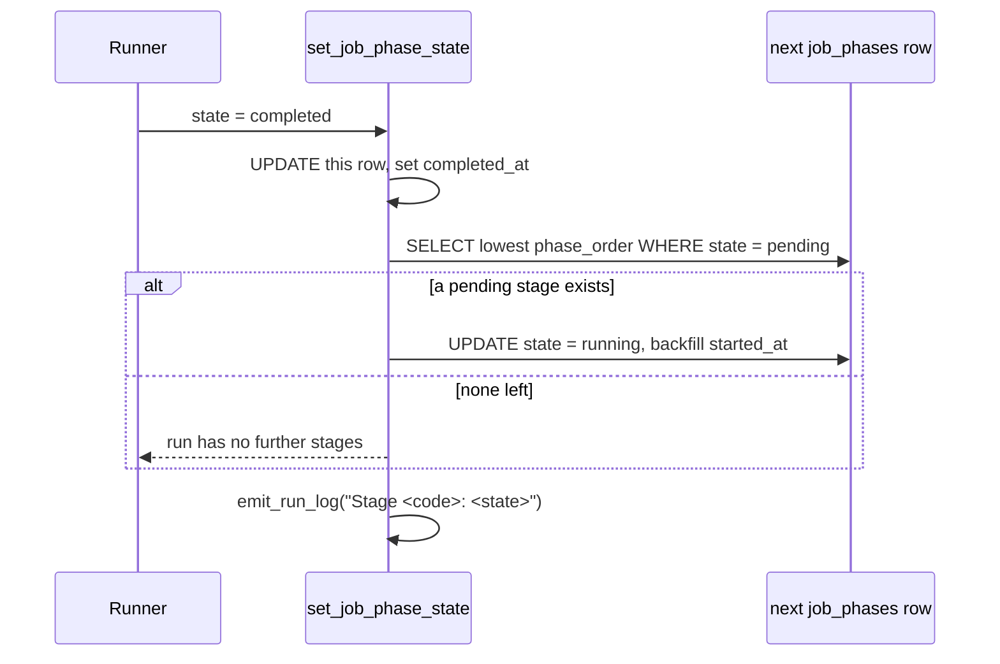
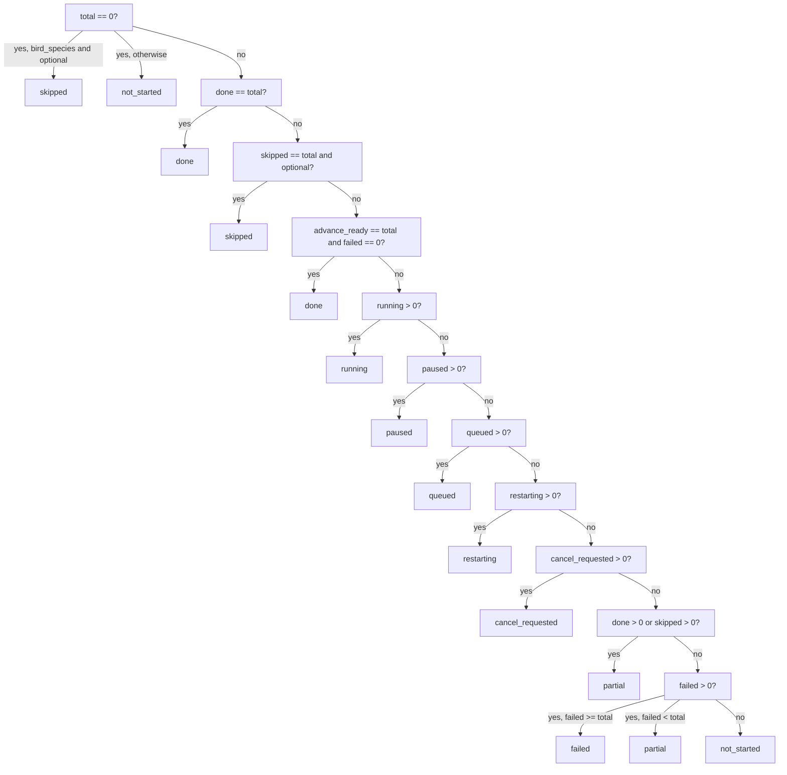

# Phase status state machines

Three different status vocabularies coexist. They describe different things, use different
values, and are enforced with different strictness. Confusing them is the single most common
source of misreadings of this system.

| Machine | Subject | Table / column | Values | On illegal transition |
|---|---|---|---|---|
| [Image phase status](#1-image-phase-status-ips) | one image in one phase | `image_phase_status.status` | 9 | warn (configurable to raise) |
| [Run stage state](#2-run-stage-state-job_phases) | one stage of one run | `job_phases.state` | 11 | **raise `ValueError`** |
| [Folder rollup](#3-folder-rollup-computed) | a folder subtree in one phase | computed, cached | 10 | n/a — derived |

Quick translation: the image level says **`done`**, the run-stage level says **`completed`**, and
the folder level adds **`partial`** which exists nowhere else.

---

## 1. Image phase status (IPS)

The authoritative per-image record. Everything else is derived from it.

`modules/phases.py:277-286`:

```python
class PhaseStatus(str, Enum):
    NOT_STARTED      = "not_started"
    QUEUED           = "queued"
    RUNNING          = "running"
    PAUSED           = "paused"
    CANCEL_REQUESTED = "cancel_requested"
    RESTARTING       = "restarting"
    DONE             = "done"
    SKIPPED          = "skipped"
    FAILED           = "failed"
```

All nine are enforced at the database level by `ck_image_phase_status_status`
(`migrations/versions/0014_status_check_constraints.py:29-52`).

### Transitions

`ALLOWED_TRANSITIONS` (`modules/phases.py:300-338`). Self-edges are legal everywhere — callers
re-emit the same status and that must not be flagged.



Every state also has an edge back to `not_started`, omitted above for legibility. Those are the
**heal reset** paths (`reset_image_phase_status`), kept legal so direct callers stay within the
contract.

Three groups of edges deserve comment, per the rationale at `modules/phases.py:288-299`:

- **`not_started` straight to a terminal state** — legitimate one-shot writes from backfill and
  ad-hoc maintenance that never pass through `running`.
- **Anything back to `not_started`** — heal reset of ghost or falsely-complete rows.
- **Terminal back to `running`/`restarting`** — re-running a phase after an executor bump.

### Enforcement

`is_transition_allowed` (`modules/phases.py:341-355`) coerces string inputs and **fails open**:
an unrecognised status returns `True`, on the reasoning that gating unknown values is not its job.

Inside `set_image_phase_status` (`modules/db_legacy.py:14023-14042`) a violation logs at WARNING
by default. Set `database.strict_phase_transitions` to raise `ValueError` instead.

### Side effects of a status write

`set_image_phase_status` (`modules/db_legacy.py:13963-14195`) does considerably more than an
`UPDATE`:

| Behaviour | Detail |
|---|---|
| `running` → `running` guard | Returns without writing — duplicate-job protection (`:14015-14021`) |
| `attempt_count` | Incremented when entering `running` from `done`/`failed`/`skipped` (`:14044-14048`) |
| Timestamps | `running` sets `started_at` and **clears `finished_at`**; terminal states set `finished_at` (`:14054-14060`) |
| `skip_reason` / `skipped_by` | Written only on `skipped`, cleared on `running` (`:14070-14076`) |
| Folder cache | Marks the folder **and all ancestors** `phase_agg_dirty = 1`, in the same transaction (`:14105-14127`) |
| Audit | Post-commit `record_audit`, plus `record_image_incident(kind="phase_failure")` on `failed` |

Clearing `finished_at` on re-entry to `running` was added for issue #341 — without it, an
in-flight work item rendered a negative duration on the run detail page.

### The done postcondition gate

`_apply_done_postcondition_gate` (`modules/db_legacy.py:13919-13961`) is an optional guard,
enabled by `phases.enforce_done_postconditions` (**off by default**).

When on, a `culling` → `done` write is downgraded to `failed` with
`postcondition_failed:missing_similarity_artefacts` unless the image passes
`is_image_culling_complete` and is not caught by
`is_image_culling_similarity_artefacts_missing`. It fails open on exception.

This exists because of the phantom-culling incident: a completeness predicate that tests *data
shape* cannot prove clustering actually ran. See [phase-preconditions.md](phase-preconditions.md).

---

## 2. Run stage state (`job_phases`)

Tracks one stage of one run. **Different vocabulary from IPS.**

Eleven values: `pending`, `queued`, `running`, `paused`, `cancel_requested`, `restarting`,
`completed`, `failed`, `interrupted`, `skipped`, `canceled`.

Note `completed` (not `done`), and `interrupted`, which has no IPS equivalent. There is **no
`CHECK` constraint** on this column — migration 0014 deliberately excluded `jobs.status` and
`job_phases.state` because they carry legacy variants.

### Transitions

`set_job_phase_state` (`modules/db_legacy.py:7541-7640`):



`completed`, `skipped` and `canceled` are **terminal** — their allowed sets are empty. An illegal
transition raises `ValueError` (`:7583-7586`), unlike the image level which only warns. The one
softening: `failed` → `skipped` / `pending` is tolerated even outside the map.

### Auto-advance — how stages chain

This is the mechanism that moves a run forward. On `completed` **or** `skipped`
(`modules/db_legacy.py:7603-7616`), the next `pending` row by `phase_order` is flipped straight
to `running`, with `started_at` backfilled.



Two consequences worth knowing:

- A stage can go `running` **without any runner having started it**. The dispatcher later notices
  a `running` stage with no busy runner and picks it up as a *continuation*
  (`modules/job_dispatcher.py:120-134`).
- Because auto-advance fires on the write, a caller that marks a stage complete and *then*
  marks the whole job complete would wrongly complete the stage that just auto-advanced. Both
  `safe_runner_thread` (`modules/pipeline.py:127-134`) and `_skip_empty_phase`
  (`modules/job_dispatcher.py:314-353`) exist specifically to avoid this.

### Other timestamp behaviour

- `running` backfills `started_at` via `COALESCE` and clears `error_message`.
- `completed` from `pending`/`queued` also backfills `started_at`, so bulk-completing a backlog
  stage does not leave a NULL start.
- `completed`, `failed`, `skipped`, `interrupted` all set `completed_at`.

---

## 3. Folder rollup (computed)

There is **no folder phase table**. Folder status is computed by aggregating IPS rows across a
folder and its descendants, then cached as JSON.

- Computed by `get_folder_phase_summary` (`modules/db_legacy.py:15047-15250`)
- Cached on `folders.phase_agg_json`, invalidated via `folders.phase_agg_dirty`
- Recomputed when dirty or on `force_refresh` (which also runs `_heal_stale_phase_flags`)

Each row carries `code`, `name`, `sort_order`, `status`, `total_count`, `optional`,
`advance_ready`, and per-status counts: `done_count`, `failed_count`, `running_count`,
`queued_count`, `paused_count`, `cancel_requested_count`, `restarting_count`, `skipped_count`.

### Derivation

`modules/db_legacy.py:15186-15219`, evaluated strictly in this order. `advance_ready = done + skipped`.



Two rules encode hard-won lessons:

- **`advance_ready == total and failed == 0` reads as `done`**, regardless of optional. Without it
  a fully-processed folder reads `partial` forever — for example an indexing run that emits
  `already_indexed` for every image.
- **Minority failures are `partial`, not `failed`.** A folder only goes red when
  `failed >= total`, so 13 failures out of 674 do not paint the whole folder as failed.

### FolderPhaseStatus is vestigial

`modules/phases.py:362-366` declares a `FolderPhaseStatus` enum with four values
(`not_started`, `partial`, `done`, `failed`). The rollup actually emits ten. Do not treat that
enum as the folder vocabulary; it covers less than half of it.

---

## Reconciliation sweeps

Because three machines track overlapping reality, they drift. A family of sweeps in
`modules/db_legacy.py` pulls them back into agreement — catalogued in
[control-plane.md](control-plane.md), summarised here:

| Sweep | Fixes |
|---|---|
| `reconcile_phantom_running_job_phases` | Stage says `running`, no runner is busy |
| `reconcile_stale_running_image_phases` | IPS says `running`, owning job is terminal |
| `reconcile_phantom_complete_image_phases` | Work product exists, IPS says not started |
| `reset_false_complete_culling_phases` | IPS says `done`, clustering artefacts absent |
| `reset_false_complete_metadata_phases` | Same shape, for metadata |
| `reconcile_orphan_work_claims` | Claim held by a terminal job |

## Known gaps

- The `modules/phases.py:8-9` module docstring lists five statuses. There are nine.
- Enforcement is asymmetric: the image level warns, the run-stage level raises. A caller that
  survives an illegal IPS write will crash on the equivalent stage write.
- `job_phases.state` has no `CHECK` constraint, so a legacy or hand-written value can enter the
  column and then fail every transition lookup (unknown `from` state yields an empty allowed set).
- `FolderPhaseStatus` covers 4 of the 10 rollup values.

## Related

- [phase-preconditions.md](phase-preconditions.md) — what gets an image into `running` at all
- [persistence.md](persistence.md) — the columns behind these machines
- [control-plane.md](control-plane.md) — the sweeps that repair drift
