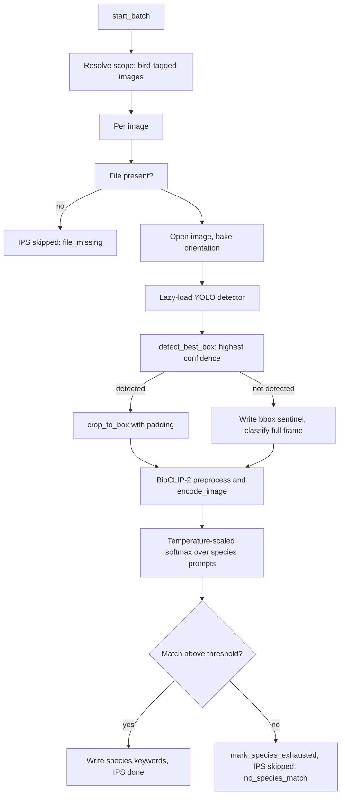

# Phase: `bird_species`

**UI label:** Bird Species ID · **Executor:** `BirdSpeciesRunner`
(`modules/bird_species.py:317`) · **Version:** `BIRD_SPECIES_RUNNER_VERSION = "1.0.0"` ·
**Prerequisites:** `keywords` · **Optional:** yes

Localises a bird in the frame and classifies it to species. The only phase with a **conditional
scope**: it applies solely to images already carrying the `birds` discovery keyword, which is why
it sits downstream of `keywords`.

## Sub-steps

### Detection — YOLO

`modules/bird_detection.py`. Weights `synthet/bird-detect-v0` / `bird_detect_v0.pt`, pulled via
`huggingface_hub` unless `bird_detection.local_path` is set.

`detect_best_box` (`:179-225`) calls `model.predict(conf, imgsz, max_det, device)` and takes the
**highest-confidence** box, returning
`{x1, y1, x2, y2, conf, img_w, img_h, area_frac}`.

`crop_to_box` (`:227-242`) expands by the configured `padding` fraction, clamps to image bounds,
and guards against a zero-area crop.

The detector loads **lazily and fails open** — if it is unavailable, classification proceeds on
the full frame rather than failing the image.

### Classification — BioCLIP 2

`BioCLIPClassifier` (`modules/bird_species.py:134`) loads `hf-hub:imageomics/bioclip-2` through
`open_clip` and caches text features per species list.

`classify` (`:230-314`): open, `bake_orientation`, ensure detector, detect and crop, preprocess,
`encode_image`, then a temperature-scaled (x100) softmax over prompts of the form
`"a photo of {name}, a bird species"`.

### The bbox sentinel taxonomy

`images.bird_bbox` is JSONB with four meaningful shapes. Getting these right is what makes the
phase converge.

| Value | Meaning | Retryable |
|---|---|---|
| `NULL` | Never scanned | yes |
| `{"detected": false}` | Scanned, no bird found | no |

> **Recall caveat.** `{"detected": false}` is not proof the frame has no bird. On a
> long-lens eagle set, 39 of 59 frames returned this sentinel while visibly containing the
> subject; the driver is subject size against `imgsz=640`, with an effective floor near
> `area_frac` 0.04. See
> [bird-detection-recall-2026-09-07](../../../reports/bird-detection-recall-2026-09-07.md).
> When the sentinel is written the phase classifies the **full frame**, so species results
> on small-subject frames should be treated as low-confidence.

| `{"detected": false, "error": "detector_unavailable"}` | Environmental failure | **yes** |
| `{"detected": false, "error": "file_missing" / "decode_error: ..." / "detect_error: ..." / "classify_error: ..."}` | Data-terminal | no |
| A real box | Success | no |

`RETRYABLE_BBOX_ERRORS = frozenset({"detector_unavailable"})`
(`modules/bird_detection.py:66`). Only that one reopens the work. The data-terminal sentinels are
deliberately non-retryable so an unreadable file cannot loop the drive forever.

### bird_bbox as first-class phase work

Historically `bird_bbox` was written only as a side effect of BioCLIP classification and was
invisible to every completeness check — a species-complete image with no box could only be
repaired by `scripts/backfill_bird_bbox.py`.

Since [#338](https://github.com/synthet/image-scoring-backend/issues/338) a missing or retryably
failed box counts as real phase work. `get_phase_incomplete_sql("bird_species")` and
`is_image_bird_species_complete` both include the box gap, so such folders surface as
`awaiting_bird_species` and **Dashboard → Drive to Complete** repairs them unattended.

`BirdSpeciesRunner.scan_bird_bbox_only` (`modules/bird_species.py:563-617`) is a **detector-only
pass**: it writes `bird_bbox` and nothing else — no BioCLIP load, no keyword or embedding writes,
no phase-status change.

The folder rollup excludes a box-gap image from both `done_count` and `skipped_count`, which is
what actually moves the bucket, and `update_image_bird_bbox` invalidates the folder aggregate
cache so the bucket flips back once repaired.

### Eligibility states

`modules/bird_species_eligibility.py:22-30`:

| State | Meaning |
|---|---|
| `not_in_scope` | No `birds` keyword |
| `complete` | Species keyword present and box usable |
| `pending` | In scope, work outstanding |
| `exhausted` | Classified, no match above threshold |
| `failed` | Terminal error |
| `skipped_other` | Skipped for another reason |

## Completeness

`is_image_bird_species_complete`. Set-based
(`get_phase_incomplete_sql("bird_species")`), an image is incomplete when it **has the `birds`
keyword** and either:

- no `species:*` keyword and no exhausted marker; **or**
- `bird_bbox` needs a scan.

The species check looks for `LOWER(keyword_norm) LIKE 'species:%'` in `image_keywords`, joined
through `keywords_dim`, plus the legacy CSV column when it still exists.

> `bird_species` is **excluded** from `_PHANTOM_RECONCILABLE_PHASES`
> (`modules/db_legacy.py:10265`). Its scope is bird-tagged images only, so the generic
> phantom-complete reconcile would misjudge it; the dedicated eligibility tooling handles it
> instead.

## Writes

| Target | Columns |
|---|---|
| `image_keywords` | `species:*` entries with `source_map="bioclip"` |
| `keywords_dim` | Species keyword dimension rows |
| `images.bird_bbox` | JSONB box or sentinel |
| `image_phase_status` | phase `bird_species` |

Species keywords are merged through `build_bird_species_keyword_csv`
(`modules/bird_species_eligibility.py:52-72`), which strips old `species:*` entries, appends the
new ones, and **guarantees the `birds` discovery keyword survives** — without that, a rewrite
would drop the image out of scope and it could never be reprocessed.

## Failure and skip

| Situation | Outcome |
|---|---|
| File missing | IPS `skipped`, `skip_reason="file_missing"`, `skipped_by="bird_species_runner"` |
| No species above threshold | `mark_species_exhausted`, IPS `skipped`, `no_species_match` |
| Detector unavailable | Classification proceeds on the full frame; box recorded as retryable |
| Decode / detect / classify error | Terminal sentinel written |

## Config

| Key | Effect |
|---|---|
| `bird_detection.enabled` | Master switch |
| `bird_detection.model_repo` / `model_file` / `local_path` | Weight source |
| `bird_detection.confidence` | Minimum detection confidence |
| `bird_detection.padding` | Crop expansion fraction |
| `bird_detection.imgsz` / `max_det` / `device` | YOLO inference parameters |
| `bird_detection.fail_open` | Continue when the detector is unavailable |
| `auto_drive.bird_backlog_quota_threshold` | Backlog size that triggers reserved drive slots |
| `auto_drive.bird_backlog_reserve_ratio` | Fraction of batch slots reserved |

Runtime parameters `candidate_species`, `threshold` (default 0.1) and `top_k` (default 1) are
passed per job by the dispatcher.

## Orchestration

Unlike the other five phases, `bird_species` is **not** driven by `PipelineOrchestrator` — its
`PHASE_ORDER` has no entry for it, and its runner map has no slot. It is orchestrated separately:

- `POST /api/bird-species/start`, `/stop`, `GET /api/bird-species/status`
- Dispatched by `JobDispatcher` under job types `bird_species` and `bird-species`
- Auto-drive buckets it as `awaiting_bird_species` with its own quota

`normalize_phase_codes` also strips it (`modules/phases.py:261`), so submit paths must
special-case it — `modules/api/routers/electron_runs_lifecycle.py:65-70` removes it before
normalising and re-attaches it after.

## Known gaps

- The phase is structurally a second-class citizen: absent from the orchestrator, stripped by
  `normalize_phase_codes`, excluded from phantom reconciliation, and special-cased in
  `phase_string_sort_key` despite being a full member of `PIPELINE_PHASE_ORDER`.
- Its scope depends on a keyword produced by an **optional** phase. If `keywords` is skipped for a
  folder, no image ever carries `birds`, and bird species silently has nothing to do — which is
  indistinguishable from being complete.
- `BIRD_SPECIES_RUNNER_VERSION` was deliberately **not** bumped when box-gap handling was added,
  so existing rows are not re-run by version change alone; convergence relies on the completeness
  predicate instead.

## Related

- [keywords.md](keywords.md) — the prerequisite phase
- [../../../technical/BIRD_SPECIES_WALKTHROUGH.md](../../../technical/BIRD_SPECIES_WALKTHROUGH.md) — end-to-end walkthrough
- [../control-plane.md](../control-plane.md) — the bird backlog quota
- [../../../reports/bird-detection-recall-2026-09-07.md](../../../reports/bird-detection-recall-2026-09-07.md) — measured recall floor and the `imgsz` mechanism
