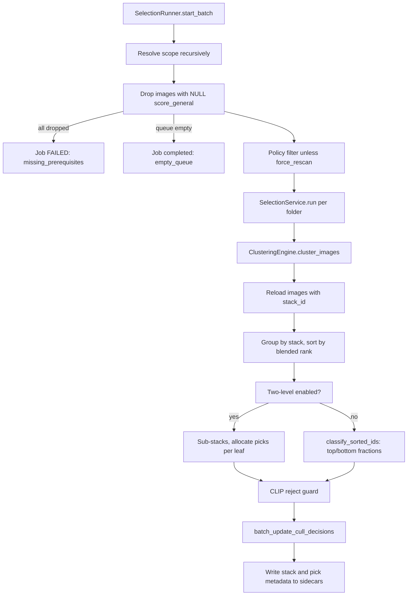

# Phase: `culling`

**UI label:** Similarity Clustering · **Executor:** `SelectionRunner`
(`modules/selection_runner.py:24`), fallback `ClusteringRunner` (`modules/clustering.py:1085`) ·
**Version:** `1.0.0` · **Prerequisites:** `scoring` · **Optional:** yes

Groups visually similar frames into stacks and assigns pick / reject / neutral decisions within
each stack.

## Two meanings, depending on which runner is registered

| Registered runner | What `culling` means |
|---|---|
| `SelectionRunner` (preferred) | Stack creation **plus** pick/reject assignment |
| `ClusteringRunner` (fallback) | Stack creation **only** |

In the fallback there is no pick/reject classification, no selection-policy sorting and no
pick/reject sidecar writes. `modules/phase_executors.py:76-89` picks selection when available.

## Sub-steps

### Scope and prerequisite filtering

`_resolve_culling_scope` (`modules/selection_runner.py:85-144`) walks folders recursively,
deduplicating by id, then applies two filters:

- **Prerequisite filter** — drops rows where `score_general IS NULL`. A score of `0` is
  legitimate and is kept (issue #162).
- **Policy filter** — `explain_phase_run_decision`, bypassed when `force_rescan`.

Status routing matters here:

| Outcome | Job status |
|---|---|
| Selector target set empty (`empty_queue`) | `completed` |
| Every image lacks a score (`missing_prerequisites`) | **`failed`**, deliberately |

Failing rather than completing prevents auto-drive from treating the folder as done and
scheduling follow-up phases over unscored images.

### Clustering engine

`modules/clustering.py`, `CLUSTER_VERSION = "1.0.0"`.

**The embedding model is MobileNetV2, not CLIP.** `load_model` (`:207-214`) builds
`MobileNetV2(weights='imagenet', include_top=False, pooling='avg', input_shape=(224,224,3))`,
producing a **1280-dimensional** global-average-pooled vector. CLIP towers appear only in the
optional two-level pass.

Per folder:

1. **Capture times** — `_load_capture_times` batch-pulls `image_exif.date_time_original` (falling
   back to `create_date`). File mtime is not used: it reflects copy time, not capture time.
2. **Runnable filter** — images without an `image_hash` are skipped with a "Run Indexing first"
   warning. Includes a heal path that flips stuck `running` rows to `done` when nothing is
   runnable.
3. **BurstUUID pre-grouping** — `_get_burst_uuid` checks `images.burst_uuid`, then the metadata
   JSON, then the file. Groups of two or more become stacks **immediately, bypassing visual
   clustering**. Singletons fall through.
4. **Time batching** — sort by capture time; a new batch starts whenever the gap to the previous
   image exceeds `time_gap_seconds`. Visual clustering only ever compares images **within** one
   batch, which is what keeps it tractable on a large folder.
5. **Feature extraction** — prefers thumbnails, resizes to 224x224 LANCZOS, batches at
   `processing.clustering_batch_size` (default 32), caches by `image_hash` plus `hash_version` in
   `thumbnails/feature_cache/feature_cache.npz`.
6. **Persist embeddings** — `db.update_image_embeddings_batch`. This happens **even for
   single-image batches**, before any clustering decision. That detail is load-bearing: see below.
7. **Cluster** — `AgglomerativeClustering(n_clusters=None, distance_threshold=..., metric='cosine', linkage='average')`.
   Skipped when fewer than two feature vectors exist.
8. **Create stacks** for clusters of two or more, choose a representative, write a fresh
   `uuid.uuid4()` burst UUID to `images.burst_uuid` and to the XMP sidecar for every member.
9. `db.mark_folder_clustered`, then IPS `culling = done` for the folder.

> **Why the unconditional embedding write matters.** Because `ClusteringEngine` persists the
> `mobilenet_v2_imagenet_gap` embedding itself, the **absence** of that embedding proves the
> clustering pass never ran on an image. That inference is the basis of
> `is_image_culling_similarity_artefacts_missing`, `reset_false_complete_culling_phases` and the
> done-postcondition gate. Do not make the write conditional.

### The burst_uuid feedback loop

Visual clustering writes a synthetic `uuid4` into `images.burst_uuid`. On a later `force_rescan`
that value would be re-read by burst pre-grouping and re-impose the previous grouping, silently
ignoring any new threshold or time gap.

`db.clear_stacks_in_folder` therefore NULLs `burst_uuid`, **and** the in-memory copies are cleared
too (`modules/clustering.py:658-665`). Both are required.

### Stack representative selection

`_select_best_image` (`:98-205`), strategy from `clustering.stack_representative_strategy`:

| Strategy | Rule |
|---|---|
| `score` | Highest normalised score; ties broken by EXIF — ISO ascending, exposure ascending, date ascending, id ascending |
| `centroid` | Highest cosine similarity to the stack embedding centroid; images without embeddings forced to `-1.0` |
| `balanced` | `alpha * norm_score + (1 - alpha) * norm_representativeness`, `alpha = clustering.best_image_alpha` (0.65) |

Falls back to `score` when embeddings are unavailable.

### Ranking and pick/reject

`SelectionService` sorts each stack by `(-blended_rank_value, quality_tiebreak, created_at, id)`,
where `blended_rank_value = (1 - w) * score_general + w * clip_quality_v0` and
`w = culling.clip_quality.weight` (default 0.15, clamped 0-1). CLIP prompt-quality is computed
just-in-time and only when `culling.clip_quality.enabled`.

`classify_sorted_ids` (`modules/selection_policy.py:52-86`):

| Stack size | Result |
|---|---|
| 1 | `neutral` |
| 2 | `pick`, `neutral` |
| 3 or more | top-k `pick`, bottom-k `reject`, rest `neutral`, `k = floor(n * 0.33)` |

`CULL_DECISION_TO_PICK_STATUS` maps `pick` to 1, `reject` to -1, `neutral` to 0.

**CLIP reject guard** — `apply_clip_reject_guard` downgrades frames below
`culling.clip_quality.reject_below` to `reject`, but never upgrades to pick and **never strips a
stack's last surviving pick**.

### Two-level culling (optional)

Enabled by `culling.two_level.enabled`; `policy_version` becomes `"2.0"`.

A second agglomerative pass runs over a semantic embedding space (default
`openclip_l14_laion2b_image`, 768-d, threshold 0.06) to split a stack into **leaf sub-stacks**,
then picks are allocated across leaves:

`M_eff = min(M, max(1, floor(N / c)))` where `M = picks_per_substack` (3),
`N = max_picks_per_stack` (20), `c` = leaf count. Leftover slots go to the largest leaves,
tie-broken by higher top score.

Stacks smaller than `max(2, min_stack_size_for_substack)` become a single leaf. Optional MMR
diversity re-ordering applies when a leaf has more members than picks.

Embeddings for the level-2 space are ensured just-in-time by
`culling_embeddings.ensure_embeddings_for_space` — Postgres only, prefers on-disk thumbnails,
batches of 32, always unloads the embedder in a `finally`, and warns when coverage falls below
90%.

## Completeness

`is_image_culling_work_complete` is the negation of `get_culling_incomplete_predicate_sql`. An
image is **incomplete** when any of:

1. `cull_decision` is NULL or blank; or
2. **stale similarity** — `cull_decision` set, `stack_id IS NULL`, `image_hash` present, and no
   default-space embedding; or
3. folder time-cohesion candidacy, when `clustering.heal_folder_cohesion_candidates` is on.

## Writes

| Target | Columns |
|---|---|
| `stacks` | `name`, `best_image_id`, `created_at` |
| `sub_stacks` | `stack_id`, `name`, `best_image_id`, `level1_space`, `level2_visual_space`, `level2_semantic_space`, `policy_version` |
| `images` | `stack_id`, `sub_stack_id`, `burst_uuid`, `cull_decision`, `cull_policy_version`, `pick_status` |
| `image_embeddings` | MobileNetV2 1280-d vectors |
| `image_embeddings_512` / `_768` | CLIP and culling-tower vectors |
| `image_model_scores` | `clip_quality_v0` when enabled |
| `cluster_progress` | Folder clustered marker |
| `image_phase_status` | phase `culling` |
| Disk | `.xmp` `BurstUUID`, `MicrosoftPhoto:StackId`, `xmpDM:pick` |

## Failure and skip

| Situation | Outcome |
|---|---|
| All images lack `score_general` | Job **`failed`** (`missing_prerequisites`) |
| Selector queue empty | Job `completed` (`empty_queue`) |
| `SelectionService` exception | IPS `failed` for every eligible image, then re-raise |
| Image without `image_hash` | Skipped with a warning |
| Sub-clustering embedding malformed or wrong dimension | Falls into a single fallback bucket rather than crashing |
| sklearn unavailable or fit failure | Degrades to one sub-cluster |

Note `SelectionRunner` does **not** write per-image IPS `done` — `ClusteringEngine` does that per
folder.

## Config

`clustering.default_threshold` · `clustering.default_time_gap` ·
`clustering.force_rescan_default` · `clustering.stack_representative_strategy` ·
`clustering.best_image_alpha` · `clustering.heal_folder_cohesion_candidates` ·
`culling.enabled` · `culling.sub_cluster_distance_threshold` · `culling.two_level.*` ·
`culling.clip_quality.{enabled,weight,reject_below}` · `culling.agent_review.*` ·
`processing.clustering_batch_size` · `embeddings.culling_spaces`

## Known gaps

- **Live config diverges from the example.** `config.json` uses `default_threshold` 0.24 and
  `default_time_gap` 600; `config.example.json` documents 0.15 and 120. Anyone reasoning from the
  example is reasoning about a different clustering behaviour.
- **The phantom-complete incident.** The culling completeness predicate tests data shape, which
  cannot prove clustering ran. On 2026-08-30 a preflight reconcile flipped 672 never-clustered
  images to `done`. `culling` is now excluded from the drive preflight and guarded by the
  artefacts-missing predicate. See
  [../../../reports/PHANTOM_CULLING_DONE_2026-09-01.md](../../../reports/PHANTOM_CULLING_DONE_2026-09-01.md).
- `phases.enforce_done_postconditions` — the guard that would refuse a bad `done` at write time —
  is **off by default**.
- `modules/clustering.py:421` calls `datetime.datetime.strptime` while the module imports
  `from datetime import datetime`, so that branch would raise `AttributeError`, which the
  surrounding `except (ValueError, KeyError, TypeError)` does not catch. In practice the capture
  timestamp cache short-circuits before reaching it.
- `level2_semantic_space` is always NULL — only a single level-2 pass runs today.

## Related

- [scoring.md](scoring.md) — the prerequisite phase
- [../phase-preconditions.md](../phase-preconditions.md) — the culling completeness predicate
- [../../../technical/CULLING_FEATURE.md](../../../technical/CULLING_FEATURE.md)
- [../../../technical/STACKS_MANUAL_MANAGEMENT.md](../../../technical/STACKS_MANUAL_MANAGEMENT.md)
- [../../../EMBEDDINGS.md](../../../EMBEDDINGS.md)
