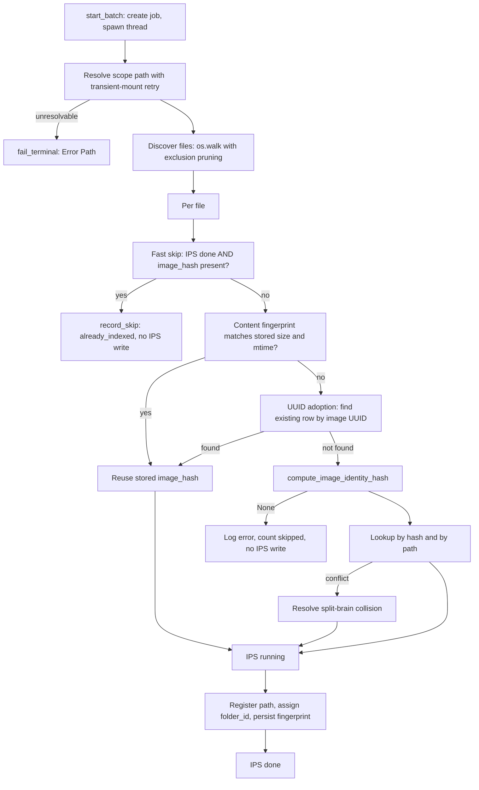

# Phase: `indexing`

**UI label:** Discovery · **Executor:** `IndexingRunner` (`modules/indexing_runner.py:358`) ·
**Version:** `INDEXING_VERSION = "1.0.0"` · **Prerequisites:** none · **Optional:** no

Discovers image files on disk and establishes a stable database identity for each one. Everything
downstream depends on the `image_hash` this phase produces.

> Older documentation states that indexing has no standalone runner and executes inside the
> scoring prep stage. That is no longer true — `modules/indexing_runner.py` exists and is
> registered as the executor. The `PrepWorker` path still applies indexing actions opportunistically
> when scoring runs over unindexed files.

## Sub-steps

### 1. Scope resolution

`_resolve_scope_input_path_with_retry` (`modules/indexing_runner.py:61-94`) retries three times
with exponential backoff, but **only** for paths that look like transient mounts (`/mnt/...` or
UNC). A network share that is briefly unavailable therefore recovers; a genuine typo fails fast.

Failure produces `fail_terminal("Error Path")` with platform-specific hints for WSL, native
Windows and Docker (`:998-1016`).

### 2. Discovery

`discover_files` (`:428-455`) walks with `prune_indexing_excluded_walk_dirs` and per-file
`path_is_indexing_excluded`. Extensions come from `discovery_extensions()`; the canonical set
lives in `modules/indexing_policy.py:25-41`.

Selector mode instead loads all rows and filters by resolved image IDs.

### 3. Fast skip

If `skip_existing` is on, the image's IPS row says `done`, **and** `images.image_hash` is non-empty
(`_image_row_has_identity_hash`, `:97-106`), the file is skipped as `already_indexed`.

This deliberately records a `ReportCollector` skip and writes **no IPS row** — `done` to `skipped`
is an illegal transition, and the existing `done` is already correct.

### 4. Identity resolution, cheapest first

Three shortcuts are tried before hashing, because hashing is the expensive step:

**Content fingerprint reuse** (`:589-625`) — reuse the stored `image_hash` when
`metadata.indexing_content_fp` `{size, mtime_ns}` still matches the file *and*
`metadata.indexing_hash_mode` matches the configured mode.

**UUID adoption** (`:629-683`) — derive the image UUID from EXIF, look up an existing row by it,
and adopt that row's `image_hash` and `hash_version`. This is what makes moved and renamed files
keep their identity.

**Hashing** (`:687-701`) — `compute_image_identity_hash`. Returning `None` logs an error and
counts the file as skipped, again with no IPS row.

### 5. Identity hashing

`modules/image_identity_hash.py` supports two modes, selected by `indexing.hash_mode`:

| `hash_version` | Mode | Content |
|---|---|---|
| 1 | `full_file` | SHA-256 of the entire file |
| 2 | `content_preview` | SHA-256 of the largest embedded JPEG preview |

Version 2 exists because RAW files are large and their pixel content is stable even when metadata
is rewritten. Candidate previews are gathered from three sources and the **longest blob of at
least 64 bytes** wins (`_content_preview_payload`, `:356-386`):

- **A** — `tifffile` JPEG-compressed strips across all pages (compressions 7, 33003, 33004, 33005, 34712)
- **B** — Nikon MakerNote `0x0011` → Preview IFD → `0x0201`/`0x0202`
- **C** — largest `FFD8..FFD9` run found via mmap, capped at 512 MB

For `.nrw` the order is C, B, A. Header reads are capped at 48 MB. When no preview is found it
falls back to full-file SHA-256 (version 1), logged when `indexing.log_hash_fallback` is on.

### 6. Split-brain collision resolution

`images` carries two competing uniqueness constraints: `UNIQUE(file_path)` and
`UNIQUE(image_hash, hash_version)`. A file that moved onto the path of a different known image
satisfies neither cleanly.

`_resolve_split_brain_collision` (`:242-355`) reconciles them: case A adopts the hash row, case B
prefers the path row, `rating` and `label` are merged, and the losing row is deleted.

### 7. Registration and folder assignment

`db.register_image_path`, then either an `UPDATE` of `file_path`/`file_name` or a full
`db.upsert_image` with `{image_path, image_hash, hash_version, folder_id, metadata}`.

Folder assignment is NEF-aware: `_resolve_nef_folder_path` (`:203-221`) walks **up** from the
file's directory to the deepest directory that directly contains a `.nef`, bounded by the scan
stop point. This keeps a RAW shoot and its derived JPEGs in one logical folder.

### 8. Status and progress

IPS `running` then `done`, both stamped with `app_version`, `executor_version` and `job_id`.
Progress is broadcast and the job log persisted every `PROGRESS_INTERVAL = 50` images.

## Completeness

| Level | Test |
|---|---|
| Per image | `is_image_indexing_complete` — `image_hash` present and non-blank |
| Set-based | `image_hash IS NULL OR TRIM(...) = ''` |

The default-space embedding is explicitly **not** part of this predicate — that is a culling
product and must not gate indexing.

## Writes

| Target | Columns |
|---|---|
| `images` | `file_path`, `file_name`, `image_hash`, `hash_version`, `folder_id`, `metadata` (`indexing_content_fp`, `indexing_hash_mode`) |
| `file_paths` | via `db.register_image_path` |
| `folders` | via `db.get_or_create_folder` |
| `image_phase_status` | phase `indexing` |
| `jobs` | `log`, `status` |

## Failure and skip

| Situation | Outcome |
|---|---|
| Path unresolvable after retries | `fail_terminal("Error Path")`, job fails |
| DB fetch error | `fail_terminal("Error DB")` |
| Hash computation returns `None` | Counted skipped, **no IPS row written** |
| Any per-file exception | `record_failure` plus IPS `failed` |
| Already indexed with a hash | `record_skip("already_indexed")`, no IPS write |
| User pause | Reconcile in-flight rows to `not_started`, job `paused` |

## Config

| Key | Effect |
|---|---|
| `indexing.hash_mode` | `content_preview` (v2) or `full_file` (v1) |
| `indexing.log_hash_fallback` | Log when v2 falls back to v1 |
| `indexing.nikon_nef_only` | Restrict discovery to NEF |
| `indexing.excluded_paths` | Pruned during the walk |
| `indexing.photos_prune_*` | Library-specific pruning |

## Known gaps

- **`config.example.json` has no `indexing` section**, even though `hash_mode`, `nikon_nef_only`
  and `excluded_paths` all change behaviour. A fresh checkout gets undocumented defaults.
- Two distinct paths count an image as "skipped" without writing an IPS row (fast skip and hash
  failure). Those images therefore never appear in the folder rollup for this phase, and a folder
  full of them reads `not_started` despite being fully indexed. The rollup's
  `advance_ready == total` rule mitigates this only when rows exist.

## Related

- [metadata.md](metadata.md) — the next phase
- [../phase-preconditions.md](../phase-preconditions.md) — the policy gate
- [../persistence.md](../persistence.md) — tables written
