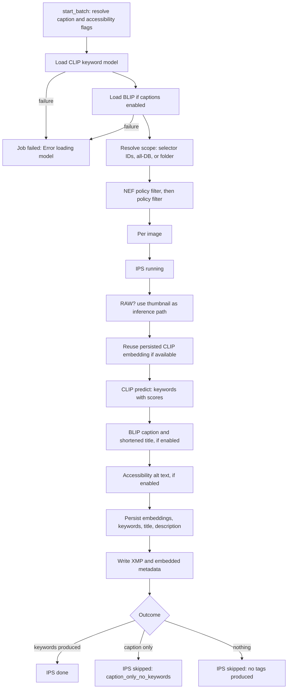

# Phase: `keywords`

**UI label:** Tagging · **Executor:** `TaggingRunner` (`modules/tagging.py:461`) ·
**Version:** `TAGGER_VERSION = "1.0.0"` · **Prerequisites:** `scoring` · **Optional:** yes

Generates search keywords with CLIP, optional captions and titles with BLIP, and optional
accessibility text — then persists them to the normalized keyword schema and back to the files.

Sibling of `culling` under `scoring`: neither depends on the other.

## Sub-steps



### Model load

Skipped entirely when a `tagging_engine` is injected. Otherwise:

- **CLIP** — `KeywordScorer.load_model()` loads `tagging.clip_model` (default
  `openai/clip-vit-base-patch32`) as `CLIPModel` plus `CLIPProcessor`, moved to CUDA when
  available. Failure fails the job.
- **BLIP** — `CaptionGenerator` loads `Salesforce/blip-image-captioning-base`, only when
  `generate_captions`. Failure fails the job.

Flags default from `tagging.captions_default` and `tagging.accessibility_default`.

### Scope

Selector IDs, an empty path meaning the whole database, or a folder with a recursive
`list_folder_paths_under_scope` fallback. Then the NEF policy filter and
`explain_phase_run_decision` with `force_run=overwrite`. Filtered-out images get a
`ReportCollector` skip with the policy reason.

`report_collector.set_scope_counts` is called **after** filtering, so reported scope reflects
real targets.

### Inference path

For RAW extensions the **thumbnail** is used rather than the RAW file — CLIP and BLIP cannot read
NEF directly, and the thumbnail is already colour-managed and orientation-baked.

### CLIP embedding reuse

`_reuse_clip_embedding` fetches the persisted `clip_vit_b32_image` 512-d vector, gated by
`embeddings.reuse_clip_image_for_keywords` and validated against `CLIP_IMAGE_DIM`.

When a reusable vector exists, `_score_prompts_from_embedding` takes a fast path: L2-normalise the
stored image vector, encode **text only**, cosine, scale by `logit_scale.exp()`, softmax. A
dimension mismatch raises so the caller falls back to a full image forward pass.

The slow path runs full CLIP and recovers the raw cosine as `logits / logit_scale` — needed for
relevance weighting below.

### Keyword selection

Prompts are `f"a photo of {k}"` over `DEFAULT_KEYWORDS` (26 entries) or a caller-supplied list.
Keep everything with `prob >= threshold` (default 0.2), sort descending, cap at `top_k`
(default 5).

Any exception returns an **empty keyword list** rather than raising — the runner then records a
skip, not a failure.

### BLIP captioning

`processor(image)` then `model.generate(max_new_tokens=tagging.max_new_tokens, default 50)` then
`processor.decode(skip_special_tokens=True)`, capitalised. The title is
`textwrap.shorten(caption, width=50, placeholder="...")`. An optional extra vision-tower pass
produces the 768-d BLIP embedding. Failure returns an empty string.

## The normalized keyword schema

```sql
CREATE TABLE keywords_dim (
    keyword_id      SERIAL PRIMARY KEY,
    keyword_norm    VARCHAR(200) NOT NULL,
    keyword_display VARCHAR(200),
    created_at      TIMESTAMP
);
CREATE UNIQUE INDEX uq_keywords_dim_norm ON keywords_dim(keyword_norm);

CREATE TABLE image_keywords (
    image_id         INTEGER NOT NULL REFERENCES images(id)       ON DELETE CASCADE,
    keyword_id       INTEGER NOT NULL REFERENCES keywords_dim(keyword_id) ON DELETE CASCADE,
    source           VARCHAR(128) DEFAULT 'auto',
    confidence       DOUBLE PRECISION,
    relevance_weight DOUBLE PRECISION NOT NULL DEFAULT 1.0,
    created_at       TIMESTAMP,
    PRIMARY KEY (image_id, keyword_id)
);
```

**Normalisation rule:** `keyword_norm = keyword.strip().lower()`; `keyword_display` preserves the
original casing.

`_sync_image_keywords` (`modules/db_legacy.py:15535-15621`) runs in one transaction:
**delete every `image_keywords` row for the image**, then upsert `keywords_dim` and insert fresh
rows with per-keyword `source`, `confidence` and `relevance_weight`. This full-replace semantic
means a re-run with a narrower keyword set removes the old ones.

The legacy `images.keywords` CSV column is written only when
`database.write_legacy_keywords_column` is on.

### `confidence` vs `relevance_weight`

These are **not** interchangeable, and using the wrong one skews search ranking.

| Column | Meaning |
|---|---|
| `confidence` | The model's raw softmax probability. **Candidate-set dependent** — adding a keyword to the prompt list changes every other keyword's value |
| `relevance_weight` | Set-size independent, derived from the raw cosine: `sigmoid(cos / 0.18)`, clamped strictly inside `(0,1)` with `1e-6` margins |

`RELEVANCE_SIGMOID_TEMPERATURE = 0.18` (`modules/keyword_relevance.py:30`). Use
`relevance_weight` for ranking across images; `confidence` is only meaningful within one image's
prediction. Gated by `tagging.write_keyword_relevance` (default true).

## Completeness

| Level | Test |
|---|---|
| Per image | `is_image_keywords_complete` — `image_keywords` rows exist |
| Set-based | No `image_keywords` rows, plus the legacy column check when that column is present |

## Writes

| Target | Columns |
|---|---|
| `keywords_dim` | `keyword_norm`, `keyword_display` |
| `image_keywords` | `source`, `confidence`, `relevance_weight` |
| `images` | `keywords` (legacy, gated), `title`, `description` |
| `image_xmp` | `alt_text`, `extended_description` |
| `image_embeddings_512` | CLIP image vectors |
| `image_embeddings_768` | BLIP image vectors |
| `image_phase_status` | phase `keywords` |
| Disk | `.xmp` `dc:subject`, `dc:title`, `dc:description` |

## Failure and skip

Three distinct outcomes, and the two skips are easy to confuse:

| Outcome | IPS | `skip_reason` |
|---|---|---|
| Keywords produced | `done` | — |
| Caption produced but no keywords | `skipped` | `caption_only_no_keywords` |
| Neither produced | `skipped` | `no tags produced` |
| Exception | `failed` | error truncated to 1024 chars |

Both skips are **terminal**. `skipped` only reopens on an executor-version change — otherwise
data validation would see no keywords, re-queue the image, produce no keywords again, and loop
forever.

Model load failure or an unresolvable path fails the whole job. Pause reconciles in-flight rows to
`not_started`.

## Config

`tagging.clip_model` · `tagging.captions_default` · `tagging.accessibility_default` ·
`tagging.max_new_tokens` · `tagging.overwrite_default` · `tagging.write_keyword_relevance` ·
`embeddings.persist_clip_image` · `embeddings.persist_blip_image` ·
`embeddings.reuse_clip_image_for_keywords` · `embeddings.model_versions.*` ·
`database.write_legacy_keywords_column`

## Related utilities

`propagate_tags` (`modules/tagging.py:20-209`) copies keywords across embedding-similar untagged
images. It is an out-of-phase utility exposed at `POST /api/tagging/propagate` — it does not
participate in phase status.

## Known gaps

- `_sync_image_keywords` deletes **all** keywords for an image before reinserting, including
  `species:*` keywords written by `bird_species`. `build_bird_species_keyword_csv` exists
  specifically to merge them back, so any new keyword writer must do the same or it will silently
  destroy species data.
- A `caption_only_no_keywords` skip leaves the image with a caption and no keywords, and because
  skips are terminal it will never be retried at the current executor version — even if the
  keyword list is later widened.
- `modules/tagging.py` carries large blocks of doubled blank lines from a bad reformat.

## Related

- [scoring.md](scoring.md) — the prerequisite phase
- [bird-species.md](bird-species.md) — the downstream phase
- [../../../technical/KEYWORD_EXTRACTION_GUIDE.md](../../../technical/KEYWORD_EXTRACTION_GUIDE.md)
- [../../../technical/CLIP_ACCESSIBILITY_METADATA.md](../../../technical/CLIP_ACCESSIBILITY_METADATA.md)
- [../../../planning/database/PHASE4_KEYWORDS_HUB.md](../../../planning/database/PHASE4_KEYWORDS_HUB.md)
