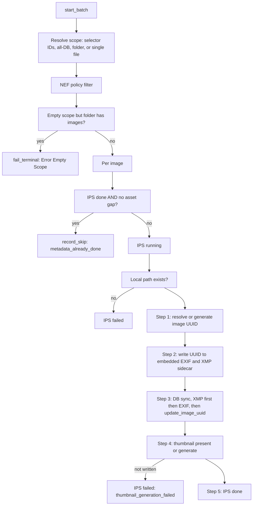

# Phase: `metadata`

**UI label:** Inspection · **Executor:** `MetadataRunner` (`modules/metadata_runner.py:17`) ·
**Version:** `METADATA_VERSION = "1.0.0"` · **Prerequisites:** `indexing` · **Optional:** no

Establishes a durable image identity in the file itself, pulls EXIF and XMP into the database,
and generates the thumbnails every later phase depends on.

## Sub-steps

### Scope resolution

Four modes (`modules/metadata_runner.py:466-518`): explicit selector IDs; empty path meaning the
whole database; a directory via `db.get_images_by_folder`, with a **recursive subfolder fallback**
through `db.list_folder_paths_under_scope`; or a single file lookup.

### The empty-scope guard

If the scope resolves to zero images but `db.get_image_count(folder_path)` is greater than zero,
the phase **hard-fails** with `"Error Empty Scope"` (`:529-552`) rather than quietly completing.

This is deliberate. Silently completing would mark the folder metadata-done while touching
nothing, and the rollup would then hide the gap permanently.

### Skip check

Skipped as `metadata_already_done` only when the IPS row says `done` **and**
`db.get_image_metadata_asset_gap_reason(image_id)` is falsy. If an asset gap exists — a missing
thumbnail, missing EXIF capture date — the image re-runs even though its status says done, and
the gap reason is logged.

### Step 1 — Image identity

Read `row.uuid`; if absent, extract EXIF and derive one via `db.generate_image_uuid()`.

### Step 2 — Physical metadata sync

Write the UUID **into the files**: `exif_extractor.ensure_image_unique_id` sets EXIF
`ImageUniqueID` through exiftool, and `xmp.write_image_unique_id` writes it to the sidecar. This
is what makes identity survive the database being rebuilt.

### Step 3 — Database sync, XMP first

Order matters and is explicit (`:262-268`):

1. `xmp.extract_and_upsert_xmp()`
2. `exif_extractor.extract_and_upsert_exif()`
3. `db.update_image_uuid()`

XMP goes first because it carries user edits (rating, label, pick flag) that should win over
camera-written EXIF.

### Step 4 — Thumbnails

`thumbnails.get_thumb_path()`, generating via `generate_thumbnail()` when absent, then
`db.update_image_thumbnail_paths()`. Thumbnails are 512x512 maximum, stored under
`<root>/thumbnails`, with a WSL/Windows dual-path pair persisted.

**A thumbnail that cannot be written is a hard failure** — IPS `failed` with error
`thumbnail_generation_failed`. Scoring, culling and keywords all prefer thumbnails for inference,
so a missing one is not a cosmetic problem.

### Step 5 — Completion

IPS `done` plus a `record_after(action="processed")` snapshot. Progress broadcasts every 50 images.

## EXIF extraction

`modules/exif_extractor.py`. The exiftool binary is resolved once via `shutil.which`; if absent,
extraction returns `None` and the phase degrades rather than failing.

- Command shape: `exiftool -j -s -n -ee -<Tag>... <path>`. The `-n` flag forces numeric GPS.
- 24 tags mapped by `_EXIF_TAG_MAP` (`:53-78`).
- Lens fallback order: `LensModel`, `Lens`, `LensID`, `LensType`.
- `gps_position_source` is set to `"exif"` whenever any GPS field is present.
- Timeouts: `exif.exiftool_read_timeout_seconds` (default 30) and
  `exif.exiftool_write_timeout_seconds` (default 120), each clamped to 5-3600.
- Upserts **merge** with the existing row (`_merge_exif_for_upsert`), so a partial extraction
  never NULLs previously-populated columns.

## XMP handling

`modules/xmp.py`. Sidecar path from `get_xmp_path`. `read_xmp_full` (`:438-556`) reads
`xmp:Rating`, `xmp:Label`, `xmpDM:pick`, `xmp:BurstUUID`, `MicrosoftPhoto:StackId`,
`xmp:Title`/`Description`, `xmp:CreateDate` (falling back to `photoshop:DateCreated`),
`xmp:ModifyDate`, the `dc:subject` bag, `dc:title`/`dc:description` alt arrays, and the IPTC
accessibility fields.

`extract_and_upsert_xmp` returns `False` when no sidecar exists — non-fatal and expected for
untouched files.

Writers used by *later* phases live here too: `write_rating`, `write_label`,
`write_pick_reject_flag`, `write_burst_uuid`, `write_metadata_unified`.

## Completeness — two divergent definitions

> **This is a known trap.** The per-image and set-based predicates test different things on
> purpose, and the code carries an explicit warning not to merge them
> (`modules/db_legacy.py:10197-10199`).

| Level | Test |
|---|---|
| Per image (`is_image_metadata_complete`) | `rating` present and within 0-5, `label` non-NULL. Rating 0 and an empty label are valid — that is a fresh-from-camera file |
| Set-based (`get_phase_incomplete_sql`) | No thumbnails **and** no `image_exif` row **and** no `image_xmp` row |
| Asset gap (`get_image_metadata_asset_gap_reason`) | `missing_metadata_assets`, `missing_thumbnail`, `missing_exif_capture_date` |

The asset-gap check is what bridges them: it can re-open a `done` image whose thumbnail
subsequently vanished.

## Writes

| Target | Columns |
|---|---|
| `image_exif` | All 24 mapped EXIF columns |
| `image_xmp` | Rating, label, pick, burst UUID, stack id, dates, subjects, accessibility |
| `images` | `image_uuid`, `thumbnail_path`, `thumbnail_path_win` |
| `image_phase_status` | phase `metadata` |
| Disk | Embedded EXIF `ImageUniqueID`, `.xmp` sidecar, thumbnail file |

## Failure and skip

| Situation | Outcome |
|---|---|
| Scope empty but folder non-empty | `fail_terminal("Error Empty Scope")` |
| Local path missing | IPS `failed`, error embeds both original and local path |
| Thumbnail not written | IPS `failed`, error `thumbnail_generation_failed` |
| Any exception | `record_failure` plus IPS `failed` |
| Already done, no asset gap | `record_skip("metadata_already_done")` |
| User pause | In-flight rows to `not_started`, job `paused` |

## Config

| Key | Effect |
|---|---|
| `exif.exiftool_read_timeout_seconds` | Read timeout, clamped 5-3600 |
| `exif.exiftool_write_timeout_seconds` | Write timeout, clamped 5-3600 |
| `raw_conversion.exiftool_timeout_s` | RAW-specific exiftool timeout |

## Known gaps

- The two completeness definitions can disagree: an image with EXIF rows but a NULL rating is
  complete by the set-based predicate and incomplete by the per-image one. Which one applies
  depends on whether the caller is a scan or a single-row check.
- Without exiftool on `PATH` the phase silently produces no EXIF rather than failing, so a
  misconfigured container yields metadata-complete images with no EXIF at all.
- `_process_metadata_image_row` spans roughly 360 lines for about 120 lines of logic
  (`:70-432`) — an artefact of a bad reformat, harmless but hard to read.

## Related

- [indexing.md](indexing.md) — the prerequisite phase
- [scoring.md](scoring.md) — the next phase
- [../../../technical/RAW_PROCESSING_GUIDE.md](../../../technical/RAW_PROCESSING_GUIDE.md) — RAW handling
- [../../../technical/NEF_IMPLEMENTATION_REVIEW.md](../../../technical/NEF_IMPLEMENTATION_REVIEW.md) — NEF pitfalls
