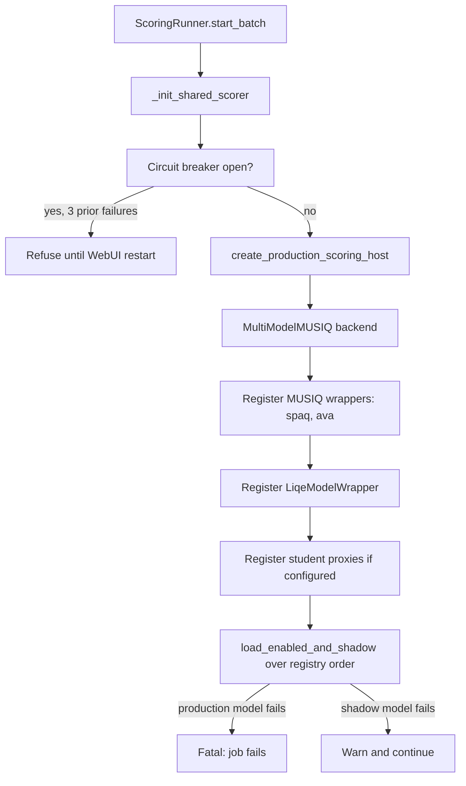
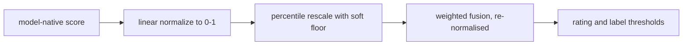

# Phase: `scoring`

**UI label:** Quality Analysis · **Executor:** `ScoringRunner` (`modules/scoring.py:31`) ·
**Version:** `SCORING_EXECUTOR_VERSION = "5.0.0"` · **Prerequisites:** `metadata` ·
**Optional:** no

Runs the quality models and reduces their outputs to three composite scores, a star rating and a
colour label. The only phase with a multi-threaded worker pipeline.

## Which models actually run

> **Q-Align is not implemented in this backend.** It appears in `CLAUDE.md`, in planning
> documents, and in the frontend's `STEP_DISPLAY` map, but there is no module, no wrapper, no
> registry entry and no `scoring.models.qalign` config key. The only occurrence in the tree is
> inside the vendored `pyiqa` package. Do not describe it as active.

Production set, from `config.json` `scoring.models`:

| Model | Enabled | Shadow | Backend | Native range |
|---|---|---|---|---|
| `spaq` | yes | no | MUSIQ head | 0-100 |
| `ava` | yes | no | MUSIQ head | 1-10 |
| `liqe` | yes | no | pyiqa / LIQE | 1.0-5.0 |
| `topiq` | yes | no | `TopiqModelWrapper` | 0-1 |
| `arniqa` | yes | no | `ArniqaModelWrapper` | 0-1 |
| `cursor` | no | no | LLM judge | — |
| `claude` | no | no | LLM judge | — |

`koniq`, `paq2piq` and `vila` are commented out of `model_sources`
(`scripts/python/run_all_musiq_models.py:802-830`) and deprecated MUSIQ variants are actively
refused by `make_musiq_wrappers`. `QptV2ModelWrapper` exists but is **deliberately not
registered** (`modules/engines/__init__.py:83-84`).

### Registry semantics

`modules/engines/registry.py:108-113`:

| `enabled` | `shadow` | Behaviour |
|---|---|---|
| true | false | Production — inferred and fused into composites |
| any | true | Shadow — inferred and stored, **excluded from fusion** |
| false | false | Skipped entirely |
| *absent from config* | — | Treated as **enabled** |

Shadow mode is how a candidate model is evaluated on live data without affecting scores.

## Model load

Import of `MultiModelMUSIQ` happens at module import (`modules/scoring.py:17-29`); a failure is
recorded and turns the whole phase into an immediate job failure.

`_init_shared_scorer` (`:66-108`) guards loading with a **circuit breaker**:
`_MODEL_LOAD_MAX_FAILURES = 3`. Once open it refuses further attempts until the WebUI restarts,
so a broken model cannot burn the queue.

The MUSIQ backend itself has a triple fallback per model — TF Hub, then Kaggle Hub, then a local
`.npz` checkpoint. **The `.npz` path is unimplemented** and raises.

### GPU handling

- TensorFlow: `_setup_gpu` calls `set_memory_growth(gpu, True)` per device and falls back to
  `/CPU:0` on `RuntimeError`. `gpu_available` is surfaced in every result payload.
- Torch: LIQE, TOPIQ and ARNIQA wrappers default to `device="cuda"`.
- `ScoringWorker` calls `torch.cuda.empty_cache()` before **every** image.

Do not run heavy inference in `webui` and `gpu-shell` simultaneously on an 8 GB card.

## The worker pipeline

`BatchImageProcessor` (`modules/engine.py:16`) is used by this phase only.

**Exactly one thread per stage.** GPU inference is therefore serialised and there is **no
tensor-level batching** — one image per model call. The `scoring_queue` is kept small
deliberately to bound VRAM growth.

Queue sizes: `processing.prep_queue_size`, `scoring_queue_size`, `result_queue_size`.
Shutdown drains via `None` sentinels forwarded stage to stage, plus a shared `stop_event`.
Each worker polls with a 1-second timeout so it can notice a stop, heartbeats to the stall
detector, and wraps each item in `phase_timer`. An exception marks the item failed and
**forwards it downstream** rather than dropping it, so the ResultWorker still records the failure.

`process_directory` also checks `db.job_should_stop_processing(job_id)` per file, so pause takes
effect at the next image boundary.

### PrepWorker

1. Resolve `image_id` by path; carry `image_hash` and `hash_version` forward.
2. Ensure a thumbnail exists.
3. **Policy gate** — `explain_phase_run_decision(..., force_run=not skip_existing)`. On skip:
   job marked `skipped`, IPS `skipped` with the decision reason and
   `skipped_by="scoring_pipeline"`.
4. Detect RAW; write IPS `running`.
5. Convert RAW to a temporary JPEG using a lazily-created `MultiModelMUSIQ(skip_gpu=True)`
   converter. Failure marks the job failed with `"RAW Conversion Failed"`.

### ScoringWorker

1. Skip immediately if the job is already skipped or failed, or if scoring is not in
   `target_phases`.
2. **Preprocessing** — reads `scoring.model_preprocessing`. When LIQE and MUSIQ want different
   resolutions it produces **two** preprocessed files, stashing the LIQE one on the job.
3. Inject LIQE separately when the host does not run it.
4. `torch.cuda.empty_cache()`.
5. `host.run_all_models(path, external_scores, write_metadata=False)` — metadata writes are
   deferred to the ResultWorker so file I/O never blocks the GPU.
6. Optional technical-failure detection, gated by `technical_failures.enabled`.
7. Status is `failed` **only if every model failed**; otherwise `success`.

Inside the host, `_run_one` times each model, calls `normalize()` into 0-1, carries optional
`subscores` for LLM judges, and stamps `is_shadow`.

### ResultWorker

1. Build the normalised score dict from **non-shadow, successful** models only.
2. `score_normalization.compute_all()` for composites, rating and label.
3. `xmp.write_metadata_unified(rating, label, use_sidecar=True, use_embedded=is_raw)`.
4. `db.upsert_image(...)` with folder-aggregate invalidation batched to the end of the run.
5. IPS `done` plus an after-snapshot.
6. Clean up temporary files.

## Score math

Four stages, in order.

### 1. Linear normalisation

`IScoringModel.normalize()` maps the model's native `score_range` linearly onto 0-1.

### 2. Percentile rescale

`rescale_percentile` (`modules/score_normalization.py:129-144`) maps `[p02, p98]` onto `[0,1]`.
Below `p02` a **soft floor** maps `[0, p02]` onto `[0, 0.15]`, so genuinely poor images still
produce a small non-zero composite instead of collapsing to exactly zero.

Default anchors (`DEFAULT_PERCENTILE_ANCHORS`, `:26-32`):

| Model | p02 | p98 |
|---|---|---|
| `liqe` | 0.311 | 0.998 |
| `ava` | 0.301 | 0.524 |
| `spaq` | 0.257 | 0.760 |
| `topiq` | 0.390 | 0.709 |
| `arniqa` | 0.467 | 0.746 |

### 3. Weighted fusion

`compute_composites` (`:163-192`). Weights resolve from `scoring.fusion`, then legacy
`composite_weights`, then defaults:

| Composite | Default weights |
|---|---|
| `general` | liqe 0.35, spaq 0.30, topiq 0.13, ava 0.12, arniqa 0.10 |
| `technical` | topiq 0.30, arniqa 0.25, spaq 0.25, liqe 0.20 |
| `aesthetic` | spaq 0.50, ava 0.40, liqe 0.10 |

**Missing models are dropped and the remaining weights re-normalised** (`:181-186`). Without
this, one unavailable model would drag every composite toward zero.

### 4. Rating and label

`score_to_rating`: 5 at 0.90, 4 at 0.72, 3 at 0.50, 2 at 0.30, else 1.
`determine_label` maps to `Red`, `Purple`, `Blue`, `Green`, `Yellow`.

`compute_all` (`:232-256`) is the single entry point, used by both the ResultWorker and
`ScoringRunner.fix_image_metadata`.

## Completeness

| Level | Test |
|---|---|
| Per image | At least one successful, non-shadow `image_model_scores` row with `COALESCE(normalized, raw_score) > 0` among `spaq`, `ava`, `liqe`, `paq2piq`, `koniq` |
| Set-based | `_incomplete_images_where_sql` |

`images.score_general` is deliberately **not** consulted: a derived weighted score of exactly `0`
is a legitimate output and must not flip a scored image back to incomplete (issue #162).

## Writes

| Target | Columns |
|---|---|
| `image_model_scores` | `raw_score`, `normalized`, `status`, `is_shadow`, `model_version`, `scored_at`. Sole store since migration 0023 |
| `images` | `score`, `score_general`, `score_technical`, `score_aesthetic`, `rating`, `label`, `model_version` |
| `image_technical_failures` | Detector output when enabled |
| `image_phase_status` | phase `scoring` |
| Disk | `.xmp` sidecar rating and label; embedded metadata for RAW |

## Failure and skip

| Situation | Outcome |
|---|---|
| MUSIQ import error | Job fails immediately |
| Model load failure (production) | Job fails; three consecutive failures open the circuit breaker |
| Model load failure (shadow) | Warn and continue |
| RAW conversion failure | IPS `failed`, `"RAW Conversion Failed"` |
| **All** models fail for an image | IPS `failed` |
| Some models fail | `success` — partial scores are fused with re-normalised weights |
| Policy skip | IPS `skipped`, reason from the decision, `skipped_by="scoring_pipeline"` |

## Config

`scoring.models.*.{enabled,shadow}` · `scoring.fusion.*` ·
`scoring.model_preprocessing.<model>.resolution` · `scoring.force_rescore_default` ·
`scoring.max_image_retries` · `scoring.liqe_max_dimension` · `scoring.topiq_max_dimension` ·
`percentile_anchors.*` · `rating_thresholds` · `label_thresholds` ·
`processing.{prep,scoring,result}_queue_size` · `technical_failures.*` · `raw_conversion.*`

## Known gaps

- **Q-Align is advertised but absent** — see the callout above. `ARNIQA` is the reverse: enabled
  in production and documented nowhere.
- **The completeness predicate is out of date.** It tests `spaq`, `ava`, `liqe`, `paq2piq`,
  `koniq`. Two of those are no longer produced, and the currently enabled `topiq` and `arniqa`
  are absent — so an image scored *only* by TOPIQ and ARNIQA would not register as scoring
  complete.
- **No tensor batching.** One image per model call, one worker thread. GPU utilisation is well
  below what batching would give.
- **Phantom scores.** An interrupted commit can leave per-model rows with a NULL
  `images.score_general`, which wedges auto-drive. `finalize_phantom_scores` in the planner
  preflight repairs this without re-inference.
- `modules/scoring.py:841` references `db_job_id` in an `except` block where it may be unbound,
  raising `UnboundLocalError` in place of the real error.
- **Eye quality is not implemented here.** The only reference is a docstring pointer to the
  sibling `image-scoring-model` repository. The nearest local analogue is
  `modules/focus_quality.py`, consumed by technical-failure detection, not by score fusion.

## Related

- [metadata.md](metadata.md) — the prerequisite phase
- [culling.md](culling.md) and [keywords.md](keywords.md) — both depend on this phase
- [../../../technical/MULTI_MODEL_SCORING.md](../../../technical/MULTI_MODEL_SCORING.md)
- [../../../technical/WEIGHTED_SCORING_STRATEGY.md](../../../technical/WEIGHTED_SCORING_STRATEGY.md)
- [../../../technical/MODEL_INPUT_SPECIFICATIONS.md](../../../technical/MODEL_INPUT_SPECIFICATIONS.md)
