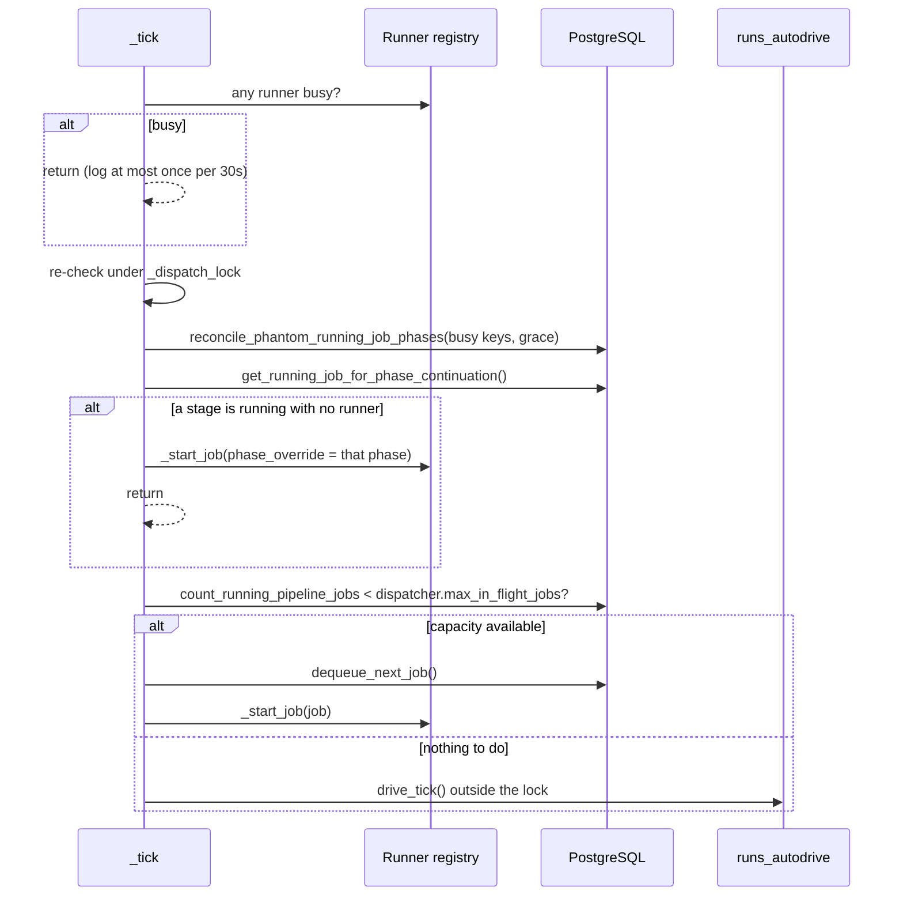
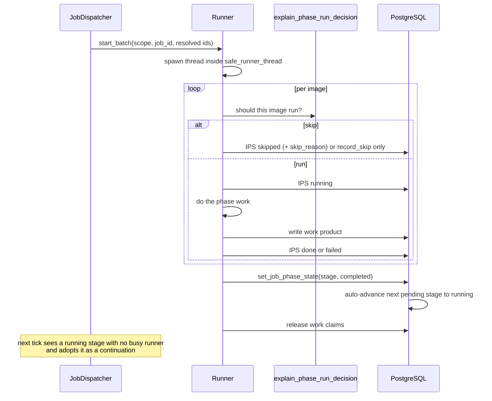

# Run lifecycle

How a request becomes processed images. A **run** is a `jobs` row; its plan is an ordered set of
`job_phases` rows. The UI and gallery say *run*; the API and MCP still say `job_id`.

## Two submit surfaces

| | `POST /api/runs/submit` | `POST /api/pipeline/submit` |
|---|---|---|
| Source | `modules/api/routers/electron_runs_lifecycle.py:47` | `modules/api/routers/pipeline_submit.py:51` |
| Consumer | React Runs UI, Electron gallery, auto-drive | Gradio, legacy clients |
| Stage field | `stage_codes` (alias `operations`) | `stage_codes` (alias `operations`) |
| Prerequisite check | **yes** — `assert_prereqs_for_scope`, HTTP 400 | **yes**, folder-scoped only — `success=false`, `data.code` |
| Empty-work check | **yes** — `nothing_to_queue` | no |
| Creates | job + full phase plan in one transaction | job for the first op, then the phase plan |

Both accept the short tokens `indexing`, `metadata`, `score`, `tag`, `cluster`, mapped to
`phase_code` values by `PHASE_CODE_ALIASES`. `bird_species` is orchestrated separately.

## Submit and plan

```mermaid
sequenceDiagram
    participant C as Client
    participant API as POST /api/runs/submit
    participant P as phases.assert_prereqs_for_scope
    participant PL as run_phase_planner.plan_scope
    participant DB as PostgreSQL

    C->>API: scope_paths, stage_codes, options
    API->>API: strip bird_species, normalize_phase_codes, sort canonically
    Note over API: default plan when stages omitted:<br/>tagging to keywords; selection to culling+metadata;<br/>otherwise indexing+metadata+scoring
    API->>P: requested phases vs scope
    P->>DB: get_folder_phase_summary per scope path
    P-->>API: {} or {phase: [missing]}
    alt prerequisites missing
        API-->>C: 400 missing_prerequisites
    end
    API->>PL: narrow to phases that actually have work
    PL->>DB: bulk phase statuses, per-image decisions
    PL-->>API: stage queues
    alt every stage empty
        API-->>C: 400 nothing_to_queue
    end
    API->>DB: enqueue_job_with_phases(first_phase_state = queued)
    DB-->>API: job_id
    API-->>C: 200 {job_id}
```

The run is now persisted and idle. Nothing executes until the dispatcher picks it up.

## Dispatch

`JobDispatcher` runs one daemon thread named `job-dispatcher`, polling at a configurable interval
clamped to at least 0.2 s (`modules/job_dispatcher.py:41`). It holds eight runner slots and a
`_dispatch_lock`.



Two things follow from this shape:

- **Continuation beats new work.** A stage that auto-advanced to `running` without a runner is
  adopted before any new job is dequeued. This is how a multi-stage run keeps moving.
- **Auto-drive only runs when idle**, and deliberately outside the dispatch lock.

`dispatcher.max_in_flight_jobs` defaults to 1, so the pipeline is effectively serial by default.
Maintenance jobs are excluded from that count.

### Phase to runner

`modules/job_dispatcher.py:485-500` maps both `phase_code` values and their aliases:

| Key | Runner |
|---|---|
| `indexing` | `IndexingRunner` |
| `metadata` | `MetadataRunner` |
| `score`, `scoring` | `ScoringRunner` |
| `tag`, `tagging`, `keywords` | `TaggingRunner` |
| `cluster`, `clustering` | `ClusteringRunner` |
| `selection`, `culling` | `SelectionRunner` |
| `bird_species`, `bird-species` | `BirdSpeciesRunner` |
| `maintenance` | `MaintenanceRunner` |

For a `pipeline` or `ui_pipeline` job the phase is resolved from the first `job_phases` row in
state `queued`, `running` or `pending` (`:455-469`). Dispatch is wrapped in
`audit_context(run_id, phase_code, source)`. Success means the runner returned `Started` or
`PhaseSkipped`.

### Scope resolution at dispatch

`_dispatch_to_runner` (`:528-773`) decides which images the runner will see, in this order:

1. **Maintenance** self-scopes and bypasses everything.
2. **Explicit resolved IDs** from `payload.resolved_image_ids_by_stage[stage]`
   (source `explicit_resolved`).
3. **JIT replan** for the canonical run mode (`_jit_replan_phase`, `:288-312`) —
   `plan_phase` then `claim_image_phases` then `mark_claims_running`, persisting the resulting
   queue (source `jit_planner`).
4. **Stored stage queue** from the payload (source `by_stage` or `root`).

If the resolved queue is empty, `_skip_empty_phase` (`:314-353`) marks the stage `completed` and
returns `PhaseSkipped` — but deliberately leaves `jobs.status = running` when non-terminal stages
remain, because auto-advance has already promoted the next stage and completing the job here
would wrongly complete that stage too.

## Execution and stage advance



`safe_runner_thread` (`modules/pipeline.py:91-152`) is the safety net around every runner. On a
clean return it completes the job **only if** the job status is still non-terminal, the runner did
not report `stopped`, and no new terminal `job_phases` row appeared while it ran. That last check
(`_terminal_phase_codes` diff, `:127-134`) is what stops a runner from completing the stage that
auto-advance just started. Its `finally` always clears `runner_obj.is_running`.

## The orchestrator path

`PipelineOrchestrator` is a second, folder-oriented sequencer used by the Gradio pipeline flow.
It builds a plan from the folder summary and drives stages itself on a 2-second tick.

Its distinguishing behaviour is the **drain gate** (`on_tick`,
`modules/pipeline_orchestrator.py:341-403`). When a runner stops, it counts IPS rows for the
folder subtree that are not in `('done','skipped','failed')`. If any remain it waits up to
`_MAX_PHASE_DRAIN_TICKS = 10` ticks — about 20 seconds — then force-terminates the stragglers to
`failed` before refreshing aggregates, completing the stage, and starting the next.

It also applies a **catch-up override**: a phase already marked `done` is re-planned anyway when
`get_folder_fulfillment_stats_for_path` reports under 99.9% for indexing, scoring, or metadata
thumbnails (`:195-226`).

Note `PipelineOrchestrator.PHASE_ORDER` has no `bird_species` entry.

## Control operations

### Run level

| Operation | Endpoint | Effect |
|---|---|---|
| Pause | `POST /api/runs/{id}/pause` | Cooperative: runners poll `job_should_stop_processing`, then reconcile in-flight IPS rows back to `not_started` and set the job `paused` |
| Resume | `POST /api/runs/{id}/resume` | `resume_job_phases` keeps `completed`/`skipped`, sets the first incomplete stage `queued`, rest `pending` |
| Cancel | `POST /api/runs/{id}/cancel` | Stage goes `cancel_requested` then `canceled` |
| Retry | `POST /api/runs/{id}/retry` | Re-enqueue a failed or canceled run |
| Force | `POST /api/runs/{id}/force` | Force-start a stuck run |

Pause is **cooperative, not preemptive**. Every runner checks
`db.job_should_stop_processing(job_id)` in its loop and, on stop, calls
`reconcile_stale_running_phases_for_jobs(..., error_message=GRACEFUL_PAUSE_MSG,
in_flight_to="not_started")` so partially-processed images are re-runnable rather than stuck in
`running`.

### Stage level

| Operation | Endpoint |
|---|---|
| Retry one stage | `POST /api/runs/{id}/stages/{stage_code}/retry` |
| Skip one stage | `POST /api/runs/{id}/stages/{stage_code}/skip` |
| Inspect stages | `GET /api/runs/{id}/stages` |
| Inspect work items | `GET /api/runs/{id}/stages/{stage_code}/items` |
| Restart from a stage | `POST /api/pipeline/phase/restart-from` |
| Skip / retry by folder | `POST /api/pipeline/phase/skip`, `.../retry` |

`/api/pipeline/phase/retry` supports only `scoring`, `keywords` and `culling`.

### Semantic three-tier aliases

`modules/api/routers/tasks.py:354-396` exposes the same operations in run/stage/step language:

- `POST /api/workflow-runs/{job_id}/{pause|resume|restart}`
- `POST /api/stage-runs/{job_id}/{phase_code}/{pause|resume|restart}`
- `POST /api/step-runs/{image_id}/{phase_code}/{pause|resume|restart}`

### Inspection

| Endpoint | Returns |
|---|---|
| `GET /api/phases/decision` | The full `explain_phase_run_decision` verdict for one image and phase |
| `GET /api/runs/{id}/diagnostics` | Run diagnostics |
| `GET /api/runs/{id}/report` | Execution report |
| `GET /api/runs/plan/preview` | Dry-run scope plan without enqueuing |
| `GET /api/queue` | Current queue |

## Recovery after restart

The queue survives a WebUI restart because it lives in `jobs`
(`queue_position`, `enqueued_at`, `queue_payload`). On startup
`recover_interrupted_jobs` (`modules/pipeline_orchestrator.py:435-484`) runs
`recover_running_jobs(mark_as="interrupted")`, `reconcile_orphan_interrupted_job_phases()` and
`reconcile_orphan_work_claims_all()`. Whether interrupted runs auto-resume is gated by
`pipeline.auto_resume_interrupted` (default false).

## Known gaps

- `/api/pipeline/submit` signals a prerequisite failure as HTTP 200 + `success=false`, while
  `/api/runs/submit` raises HTTP 400; a client handling only the status code sees the first as a
  success. It also leaves image-id and image-path selectors ungated.
- `_seed_phase_scope` (`modules/job_dispatcher.py:416-444`) creates a throwaway `ReportCollector`
  purely to populate `job_phases.images_in_scope` and `images_targeted` for the tag, cluster and
  selection runners, which do not yet accept a collector. Per-image progress is not recorded for
  those phases as a result.
- Pause cannot interrupt an in-flight model inference; it takes effect at the next image boundary.

## Related

- [control-plane.md](control-plane.md) — dispatcher internals, auto-drive, heal sweeps
- [phase-preconditions.md](phase-preconditions.md) — the gates referenced above
- [../../technical/RUNS_QUEUE_AND_RESTART.md](../../technical/RUNS_QUEUE_AND_RESTART.md) — queue persistence
- [../../technical/RUN_OPTIONS_MODE_MATRIX.md](../../technical/RUN_OPTIONS_MODE_MATRIX.md) — run options vs `run_mode`
