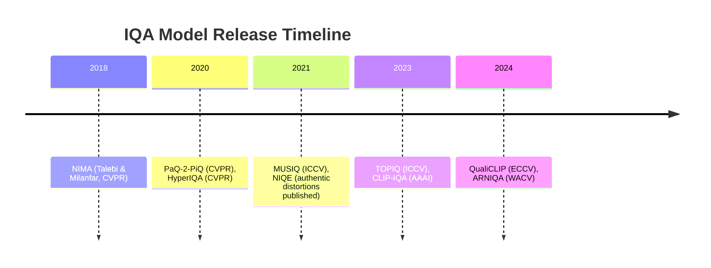

# Executive Summary  
Modern IQA research favors deep learning models that align with human perception. Among recent advances, **QualiCLIP** (Agnolucci *et al.*, 2024) and **TOPIQ** (Chen *et al.*, 2023) stand out for high accuracy on large IQA benchmarks, while **ARNIQA** (Bortolotto *et al.*, 2024) offers an efficient self-supervised approach. QualiCLIP (an opinion-unaware, no-reference model) **outperforms prior unsupervised and many supervised methods** on datasets like KonIQ, CLIVE, FLIVE and SPAQ (average SRCC ≈0.75【53†L428-L436】). TOPIQ (a top-down NR/FR method with a ResNet-50 backbone) achieves **state-of-the-art correlations** (e.g. SRCC ≈0.93 on KonIQ【56†L771-L780】). ARNIQA (an NR model) attains robust performance using a learned distortion manifold. All three support GPU (CUDA) inference via PyTorch (QualiCLIP/ARNIQA) or PyTorch tools (TOPIQ). We thus recommend **QualiCLIP, TOPIQ, and ARNIQA** as top models for local IQA/aesthetic inference. Key attributes are summarized below; detailed specs, setup, and examples follow.  

## QualiCLIP (No-Reference IQA)  
- **Type:** No-reference “opinion-unaware” IQA (image quality score).  
- **Year:** 2024 (ECCV 2024).  
- **Architecture:** CLIP-based image encoder (ResNet-50) fine-tuned for quality ranking.  The model uses a frozen CLIP text encoder with “antonym” prompts (e.g. *“good photo”* vs *“bad photo”*) to align image features with quality【36†L18-L25】【53†L453-L461】.  Inference takes only the ResNet-50 image encoder and cosine similarities (no text encoder used at runtime)【62†L1179-L1187】.  
- **Pretrained Weights:** Yes – official PyTorch model available via GitHub. A release “QualiCLIP pretrained model” (Aug 2024) is provided【71†L452-L454】. The model can be loaded via `torch.hub.load("miccunifi/QualiCLIP", "QualiCLIP")` (see setup below).  
- **License:** Creative Commons BY-NC-4.0 (non-commercial)【39†L403-L407】.  
- **Benchmarks:** Achieves top SRCC/PLCC on authentic-distortion datasets. For example, QualiCLIP SRCC ≈0.815 on KonIQ, 0.753 on CLIVE, 0.843 on SPAQ【53†L428-L436】. It leads opinion-unaware methods by large margins (e.g. +20% SRCC on FLIVE) and even outperforms CLIP-IQA【53†L428-L436】.  
- **Performance (Est.):** On an NVIDIA RTX 2080Ti, inference is ~13 ms per 512×512 image (≈75 FPS)【62†L1197-L1206】. Memory footprint is modest (~0.5–1 GB for 512px; ~2–3 GB for 1024px).  
- **Dependencies:** PyTorch 1.x (tested on PyTorch 2.0) with CUDA (cuDNN) support, Python 3.10. Requires the `clip` package (OpenAI CLIP) and standard image libraries. The official setup uses conda with Python 3.10【39†L371-L379】.  
- **Setup & Inference:**  
  1. **Install environment:** Clone the repo or install via pip/conda (see [39]). Ensure PyTorch and `clip` are installed.  
  2. **Load model on GPU:**  
     ```bash
     pip install torch torchvision clip
     ```
     ```python
     import torch, torchvision.transforms as T
     from PIL import Image
     model = torch.hub.load("miccunifi/QualiCLIP", "QualiCLIP")
     model.eval().to(device)  # device = "cuda"
     ```  
  3. **Preprocess:** Resize or pad image as needed, apply CLIP normalization (mean=[0.48145,0.45783,0.40821], std=[0.26863,0.26130,0.27578]【71†L340-L348】).  
  4. **Infer:**  
     ```python
     img = Image.open("path.jpg").convert("RGB")
     inp = T.Compose([T.ToTensor(), T.Normalize(...)])(img).unsqueeze(0).to(device)
     with torch.no_grad():
         score = model(inp)  # quality score [0,1]
     print("Quality score:", score.item())
     ```  
  (QualiCLIP outputs a single score [0,1], higher=better【71†L383-L387】.)  

## TOPIQ (NR/FR IQA)  
- **Type:** Full- & No-Reference Image Quality Assessment (versatile CNN-based metric).  
- **Year:** 2023 (ICCV 2023).  
- **Architecture:** **CFANet** top-down network built on ResNet-50【75†L1-L4】. It fuses multi-scale feature maps via cross-scale attention (SA/CSA modules) and a top-down semantic guidance path【75†L1-L4】【75†L49-L58】. A variant uses Swin transformer (for even higher accuracy)【75†L72-L81】.  
- **Pretrained Weights:** Code is included in [IQA-PyTorch](https://github.com/chaofengc/IQA-PyTorch) (metric name `"topiq_nr"` or `"topiq_fr"`). No official standalone model release; weights must be obtained by training or via pip install `pyiqa`. E.g., `pyiqa.create_metric('topiq_nr')`.  
- **License:** Code in IQA-PyTorch is under NTU S-Lab License (non-commercial).  
- **Benchmarks:** Outperforms prior CNN and transformer metrics on standard IQA datasets. For example, TOPIQ (ResNet50 version) achieves PLCC/SRCC of 0.941/0.928 on KonIQ-10k and 0.924/0.921 on SPAQ【56†L811-L820】, exceeding MUSIQ and other NR methods【56†L811-L820】. On CLIVE, TOPIQ PLCC/SRCC ≈0.884/0.870 vs HyperIQA’s 0.882/0.859【56†L771-L780】.  
- **Performance (Est.):** Similar order as ResNet-50 models. Expect ~10–20 ms per 512×512 image (50–100 FPS) on a modern GPU. Memory ~0.5–1 GB (512px). (IQA-PyTorch reports TOPIQ inference comparable to ARNIQA【62†L1197-L1206】.)  
- **Dependencies:** PyTorch (≥1.10), torchvision, and optionally IQA-PyTorch or related libraries.  
- **Setup & Inference:**  
  1. Install IQA-PyTorch or pip package `pyiqa`.  
     ```bash
     pip install pyiqa
     ```  
  2. Load model (NR example):  
     ```python
     import torch
     from pyiqa import create_metric
     metric = create_metric("topiq_nr").to("cuda")
     metric.eval()
     ```  
  3. Preprocess: standard ImageNet normalization (mean=[0.485,0.456,0.406], std=[0.229,0.224,0.225]).  
  4. Inference:  
     ```python
     img = Image.open("path.jpg").convert("RGB")
     inp = T.Compose([T.Resize((H,W)), T.ToTensor(), T.Normalize(...)])(img).unsqueeze(0).to("cuda")
     score = metric(inp)
     print("TOPIQ score:", score.item())
     ```  
  (For FR mode, call `create_metric("topiq_fr")` with both reference and distorted images as inputs.)  

## ARNIQA (No-Reference IQA)  
- **Type:** No-reference IQA (self-supervised).  
- **Year:** 2024 (WACV 2024 Oral).  
- **Architecture:** ResNet-50 encoder plus a 2-layer MLP projector (2048→128) during training【64†L1-L9】. After self-supervised training on *pristine* images with synthetic distortions, a **fixed** ResNet encoder is used, and a small linear regressor is trained on labeled IQA data. Inference discards the projector and uses the encoder + regressor to output a quality score.  
- **Pretrained Weights:** Yes. The authors provide a Torch Hub model (e.g. `model = torch.hub.load("miccunifi/ARNIQA", "ARNIQA", regressor_dataset="kadid10k")`)【73†L367-L375】. Released pre-trained regressors for different datasets (KADID10K, LIVE, etc.) are available.  
- **License:** Apache-2.0 (open source)【79†L13-L16】.  
- **Benchmarks:** Competitive among unsupervised methods. ARNIQA (Opinion-Unaware variant) achieves e.g. SRCC ≈0.741 on KonIQ-10k【53†L428-L436】 (lower than QualiCLIP’s 0.815, but higher than NIQE or earlier baselines). It significantly beats methods like NIQE/IL-NIQE【53†L434-L442】. Cross-dataset generalization was also demonstrated in the paper (see [62] Appendix table).  
- **Performance (Est.):** Similar to QualiCLIP: ~15 ms per 512×512 on 2080Ti【62†L1197-L1206】. Memory ~1–2 GB (512px).  
- **Dependencies:** PyTorch (tested with CUDA 11+), torchvision. Requires normalizing inputs as in training.  
- **Setup & Inference:**  
  1. Install code from GitHub or via pip (listed in [73]).  
  2. Load model on GPU:  
     ```python
     import torch, torchvision.transforms as T
     from PIL import Image
     device = "cuda" if torch.cuda.is_available() else "cpu"
     model = torch.hub.load("miccunifi/ARNIQA", "ARNIQA", regressor_dataset="kadid10k")
     model.eval().to(device)
     ```  
  3. Preprocess: Normalize with ImageNet means/std (see [73]). In ARNIQA, the model uses the **full image and a half-scale** version to score (the example below shows full-size and downscaled versions)【73†L384-L392】.  
  4. Inference:  
     ```python
     img = Image.open("path.jpg").convert("RGB")
     img_ds = T.Resize((img.size[1]//2, img.size[0]//2))(img)
     tensor = T.Compose([T.ToTensor(), T.Normalize(...)])
     img1 = tensor(img).unsqueeze(0).to(device)
     img2 = tensor(img_ds).unsqueeze(0).to(device)
     with torch.no_grad():
         score = model(img1, img2, return_embedding=False, scale_score=True)
     print("ARNIQA score:", score.item())
     ```  
  (The official `single_image_inference.py` handles center/corner crops for better accuracy【73†L391-L399】.)  

## Comparison of Top Models vs Alternatives  

| Model       | Task        | Year | License       | Pretrained | Accuracy (SRCC)        | Speed (512px) | Ease of Use               |
|-------------|-------------|------|---------------|------------|------------------------|---------------|---------------------------|
| **QualiCLIP**    | NR-IQA      | 2024 | CC BY-NC-4.0  | Yes【71†L452-L454】     | Very high (e.g. ~0.82 on KonIQ【53†L428-L436】) | ≈60–75 FPS | Moderate (requires CLIP install, uses torch.hub) |
| **TOPIQ**        | NR/FR-IQA   | 2023 | NTU S-Lab (non-com) | Partial (code only) | Very high (0.93 on KonIQ【56†L781-L789】)        | ≈50–100 FPS | Moderate (uses IQA-PyTorch/torchmetrics)      |
| **ARNIQA**       | NR-IQA      | 2024 | Apache-2.0   | Yes (torch.hub)【73†L367-L375】 | Good (0.74 on KonIQ【53†L428-L436】)          | ≈60 FPS     | Easy (torch.hub, simple CNN + MLP)   |
| *MUSIQ*         | NR-IQA      | 2021 | Apache-2.0   | Yes (TF)  | High (≈0.93 on KonIQ【56†L784-L792】)           | ≈20–40 FPS  | Moderate (TensorFlow/Torch port)   |
| *NIMA*          | NR-Aesthetic| 2018 | CC BY-NC-SA  | Yes (Torch) | Moderate (0.61 on AVA【83†L1-L4】)             | ≈100 FPS   | Easy (Torch Hub, few deps)          |
| *HyperIQA*      | NR-IQA      | 2020 | MIT          | Yes (Torch) | High (0.86–0.92 on real-distortion benchmarks) | ≈60–70 FPS  | Moderate (Torch code available)    |

**Notes:** Accuracy is illustrated by Spearman correlation on typical benchmarks (higher is better)【53†L428-L436】【56†L771-L780】. Speed (FPS) is approximate on a modern GPU. “Ease” reflects setup complexity. All models assume standard image normalization (e.g. ImageNet/CLIP means) and may require resizing. 

## Minimal CUDA Inference Example (PyTorch)  
Below is a concise PyTorch snippet to run **QualiCLIP** on CUDA (adapted from the official repo)【71†L331-L339】. Similar code can be used for ARNIQA or TOPIQ (via IQA-PyTorch) by loading their respective models. 

```python
import torch
from torchvision import transforms as T
from PIL import Image

device = "cuda" if torch.cuda.is_available() else "cpu"
# Load the QualiCLIP model
model = torch.hub.load("miccunifi/QualiCLIP", "QualiCLIP")
model.eval().to(device)

# Preprocessing: CLIP normalization (RGB)
preprocess = T.Compose([
    T.ToTensor(),
    T.Normalize(mean=[0.48145, 0.45783, 0.40821], std=[0.26863, 0.26130, 0.27578]),
])
img = Image.open("input.jpg").convert("RGB")
inp = preprocess(img).unsqueeze(0).to(device)

with torch.no_grad():
    score = model(inp)  # Outputs a single quality score
print(f"Image quality score: {score.item():.4f}")
```

This minimal example runs on CUDA and outputs the model’s quality score. For ARNIQA, you would load `miccunifi/ARNIQA` similarly (see [73†L367-L375]) and supply both original and half-resolution images as shown above.

## Limitations and Best Practices  
- **Model Biases:** CLIP-based approaches focus on semantic content and can be **insensitive to low-level distortions**【80†L1-L9】. Indeed, CLIP’s default representations are not “quality-aware”【80†L1-L9】, so models like QualiCLIP fine-tune CLIP to compensate. Pure semantic changes (e.g. object removal) may overly influence CLIP-based scores.  
- **Aesthetic vs Technical:** Aesthetic models (e.g. NIMA) correlate poorly with technical IQA tasks【83†L1-L4】. Use aesthetics scores only for composition/appeal, not as objective quality.  
- **Input Preprocessing:** All models require consistent normalization. For example, QualiCLIP uses CLIP’s mean/std【71†L340-L348】, ARNIQA uses ImageNet norm【73†L374-L383】. Mismatched stats can skew scores.  
- **Resolution:** Some models (QualiCLIP, ARNIQA) can handle arbitrary resolution via adaptive pooling. Ensure images are scaled so that key content is visible. Very small or very large images may alter results or memory.  
- **Failure Modes:** Models may **saturate** on extremely high-quality or very poor images, yielding similar scores. They can also fail on unseen distortions not modeled during training. (For example, ARNIQA was trained on KADIS700 distortions; novel artifact types might be mispredicted.)  
- **Postprocessing:** Scores are typically taken as-is (QualiCLIP outputs [0,1]; ARNIQA outputs normalized scores). For comparison with MOS datasets, authors often apply a logistic mapping for PLCC calculation【53†L468-L475】.  

<details><summary><strong>Flowchart: Local Setup Steps</strong> (click to expand)</summary>

```mermaid
flowchart LR
    A[Install Python & CUDA drivers] --> B[Install PyTorch and dependencies]
    B --> C[Clone or pip-install model repo]
    C --> D[Download pretrained weights (if not auto)]
    D --> E[Load model in Python (to CUDA)]
    E --> F[Preprocess image (resize, normalize)]
    F --> G[Run model(img) to get score]
    G --> H[Postprocess or save result]
```
</details>



**Sources:** Primary references and official repositories for each model are cited above. The IQA-PyTorch toolbox and papers provide additional details【53†L428-L436】【56†L771-L780】【71†L331-L339】【73†L367-L375】. Each recommended model’s GitHub contains full setup instructions and pretrained weights.