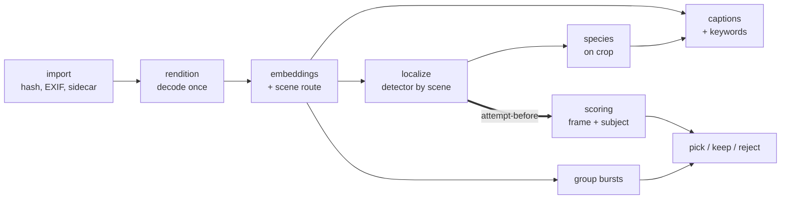

# Pipeline streamlining with subject-aware scoring

This plan gives a shorter path from import to pick/reject than the current pipeline. It builds on the
[localization rollout](../architecture/pipeline/localization-rollout.md) (#345), and it makes
**scoring consume the localized subject** instead of running beside localization.

**Status:** proposal, docs only. Tracked in #410. Implementation issues: #406 (rendition), #407
(phase graph), #408 (detector cascade), #409 (subject-aware scoring), #412 (scene route) and #413
(species beyond birds). Detailed specs, roadmap and acceptance criteria:
[spec hub](../specs/pipeline-streamlining/INDEX.md).

## Target order

1. **Import:** hash, size, mtime, EXIF and XMP sidecar, per
   [import-phase-enrichment.md](import-phase-enrichment.md).
2. **Rendition:** decode once. It writes the 512 px thumbnail and a ~2048 px inference rendition,
   both orientation-baked and sharing one identity (#406).
3. **Embeddings and scene route:** the CLIP image vector, then a zero-shot scene type (wildlife /
   landscape / architecture / people / …) scored against that stored vector.
4. **Localize:** the detector is chosen by scene. For wildlife it is the YOLO → COCO-animal →
   small-box refine cascade (#408).
5. **Species:** BioCLIP on the subject crop, with a full-frame fallback.
6. **Scoring:** full frame plus subject crop, fused. It waits for a localization *attempt* (#407,
   #409).
7. **Captions and keywords:** full frame plus species keywords. They can run alongside scoring,
   because they don't use scores.
8. **Group bursts, then pick / keep / reject.** Grouping needs only embeddings and capture time.
   Picks need scores. Delete stays a human-approved action and is never automatic.

## Where the localization rollout stands (2026-09-25)

| Stage | State |
|---|---|
| 1. Control plane | Done. The delegated parent/child lifecycle is deferred (#368). |
| 2. Normalized persistence | Schema, import and reader landed. **The import of ~76k legacy `bird_bbox` outcomes has not been run**, and no production path reads the new tables. |
| 3. Rendition and crop service | Code complete, with no production caller. The detector benchmark (#377) awaits review. |
| 4. Shadow `localization` phase | Merged (#395), off by default, bird YOLO only. Five open questions and two blockers are listed in [localization-stage4-slice1-status.md](localization-stage4-slice1-status.md), including a test DB that is never actually truncated. |
| 5–8 | Not started. |

## Today against the target

| Target step | Today |
|---|---|
| Import | `indexing` is marked done without writing `image_hash` ([import-phase-enrichment.md](import-phase-enrichment.md)). |
| Rendition | Thumbnails are made in `metadata` and aren't orientation-baked for RAW files. `localization` has its own decoder, and every other phase decodes again. |
| Scene route | None. CLIP keywords such as `birds`, `insect`, `landscape` and `people` exist only as tags, after scoring. |
| Localize | Shadow phase with the bird YOLO only. |
| Species | `bird_species` (BioCLIP 2) over the 360 names in `data/bird_species_list.txt`, only for images tagged `birds`. |
| Scoring | Full frame only. `image_model_scores` is keyed `(image_id, model_name)`, so a crop score can't be stored. |
| Captions and keywords | Hard prerequisite on `scoring` with no data dependency: they read the thumbnail and the stored CLIP vector ([keywords.md](../architecture/pipeline/phases/keywords.md)). |
| Bursts and picks | One `culling` phase. It requires scores even though grouping doesn't use them. Picks come from fixed top/bottom 33% bands per stack (`modules/selection_policy.py`). |

## Opportunities, most leverage first

### 1. Decode each image once (#406)

A RAW decode costs 0.5–0.7 s (the #387 smoke test: D300 0.52 s, Z6ii 0.74 s). A tiny detector
costs 95 ms on CPU on an 800 px preview
([subject-detector-comparison-2026-09-24.md](../reports/subject-detector-comparison-2026-09-24.md)).
Decoding is therefore the dominant per-image cost, and the pipeline pays it once per phase. One
rendition step also fixes the thumbnail orientation gap noted in rollout stage 3.

### 2. Fix the phase graph (#407)

- Make `keywords` depend on `metadata` instead of `scoring`.
- Split burst grouping, which needs no scores, from pick assignment, which does.
- Add a third edge kind, **attempt-before**, for `localization` → `scoring`. The consumer waits for
  a current attempt (`detected`, `no_detection`, `terminal_error` or `disabled`), not a success.
  A retryable failure releases the consumer to its fallback. This keeps the rollout invariant that
  a failed localization never suppresses core inference.

### 3. Scene route from the stored CLIP vector

`KeywordScorer._score_prompts_from_embedding` (`modules/tagging.py`) already scores text prompts
against the persisted `clip_vit_b32_image` vector without re-reading the image. A scene route is a
small prompt set on the same path, so it costs almost nothing. It lets the pipeline skip wildlife
detection on landscapes and choose a person detector for people.
**Unverified:** the prompt set and its accuracy need a small labelled sample first (#412,
[spec 05](../specs/pipeline-streamlining/05-scene-route.md)).

### 4. Species beyond birds

BioCLIP 2 (`hf-hub:imageomics/bioclip-2`) is a tree-of-life model. The bird-only scope comes from
the species list and the `birds` keyword gate, not from the model. A two-level zero-shot pass
would first choose the class (Aves, Mammalia, Insecta, Reptilia, Amphibia), then the species
within it. It needs a regional species list per class.
**Unverified:** the crop study's species results are not human accuracy evidence, so any class
beyond birds needs its own labelled check (#413,
[spec 06](../specs/pipeline-streamlining/06-multi-taxon-species.md)).

### 5. Detector cascade (#408)

On the #377 cohort:

| Detector | Recall on labelled birds | False positives on bird-free frames | Box quality |
|---|---|---|---|
| YOLO-640 (production) | finds no box on 117 of 238 | 0/71 on the independent strata, but 28 bird-free frames among its own detections | 73% of boxes tight |
| YOLO-1280 | 82% on 640-misses | 45/71 (63%) | ties the COCO detector |
| RTMDet-tiny (COCO) at 640 | 82% at the matched threshold | 4% at that threshold | weak on small birds (28/48 tight) |

Sources: [detector-benchmark-2026-09.md](../reports/detector-benchmark-2026-09.md),
[subject-detector-comparison-2026-09-24.md](../reports/subject-detector-comparison-2026-09-24.md)
and [bbox-llm-judge-panel-2026-09-24.md](../reports/bbox-llm-judge-panel-2026-09-24.md).

The two detectors are complementary, which gives this cascade:
1. The YOLO-640 box when present.
2. Otherwise the COCO box. Any animal class counts as "subject present" (it labelled 26 of 59
   eagles `bear`), and person is excluded for wildlife.
3. For boxes under ~2% of the frame, a YOLO refine on a padded crop.

COCO has no insect, reptile or amphibian classes. Covering them needs an open-vocabulary detector,
such as OWL-ViT, Grounding DINO or YOLO-World. None has been benchmarked here.

### 6. Subject-aware scoring (#409)

This section is the main change to the rollout. It is described in detail next.

## Subject-aware scoring

### Why

- **Crop scores are far more sensitive to the subject.** Degrading only the subject lowers crop
  IQA 2.4–17.5× more than full-frame IQA. Subject noise moves full-frame LIQE by 0.02 and the crop
  by 0.39 ([BIRD_BBOX_CROP_STUDY_2026-08-01.md](../reports/BIRD_BBOX_CROP_STUDY_2026-08-01.md)).
  The study calls this a complement: the crop tells whether the *subject* is sharp, the frame
  whether the *photo* is clean.
- **Whole-frame scores can't choose within a burst.** They are near chance there, while subject
  focus separates best from reject at 0.625, and the composite at 0.669
  ([subject-evidence-probe-2026-09-24.md](../reports/subject-evidence-probe-2026-09-24.md)).

### Design

- **Models:** the technical models (LIQE, TOPIQ, ARNIQA) score the full frame and the primary
  subject crop. Aesthetic models stay full-frame, because composition belongs to the whole frame.
- **Fusion:** a new, versioned fusion blends subject and frame quality into `score_technical`,
  with its own percentile anchors. `score_aesthetic` stays full-frame, optionally with subject size
  and placement as features.
- **Stored mode:** every composite records `subject_mode` and the fusion version. The modes are
  `region`, `none` (no subject: a landscape, architecture, or nothing found) and `unavailable`
  (localization not yet successful).
- **Ordering and fallback:** scoring uses the attempt-before edge. When a localization attempt is
  retryable, scoring goes ahead full-frame, and only the crop models re-run once a box exists.
- **Crop source:** crops come from the inference rendition, not the 512 px thumbnail. The median
  bird covers 11.7% of the frame, which is about 78 px at a 224 px model input. Subjects under ~2%
  of the frame are flagged `small_subject`, because the probe found crop focus below chance there.
- **Multiple subjects:** start with the primary region. Whether to aggregate over regions (max or
  mean) is decided later from labelled data.
- **Storage:** a migration adds an input-mode / region dimension to `image_model_scores`.
  Full-frame rows are untouched, and scoring completeness keeps counting full-frame rows.

### Cost and risk

- **Detector errors reach the scores.** A false box scores background sharpness, and a miss
  silently falls back to full frame. That makes #408 a prerequisite, not an option.
- **Calibration.** The current anchors come from about 61k full-frame images. New composites are
  not comparable to old ones without their fusion version.
- **Backfill is crop-only.** The full-frame rows already exist. The backfill scores crops for
  images with a current box (about 41k legacy boxes), then recomputes composites from stored rows.
  That is roughly three technical models × 41k crops of GPU time, not a library rescan.
- **Promotion gate.** The new fusion becomes authoritative only after ~300 human-labelled bursts
  show it picks better than the current composite. The same label set is step 0 of
  [subject-aware-culling-evidence.md](subject-aware-culling-evidence.md).

## What changes in the rollout

| Rollout stage | Change |
|---|---|
| 4 | Close it before starting new work: answer the open questions, fix the test-DB truncation bug, and run the stage 2 legacy import. Add the cascade provider (#408). |
| 5 + 7 | Merge them. BioCLIP moves to regions and the legacy outcomes are imported instead of recomputed. |
| 6 | Region IQA moves out of the shadow-only experiment and into the scoring design (#409), still behind a fusion version and the labelled-burst gate. Other consumers (captions, accessibility, Jev) stay shadow, as planned. |
| New | #406 (rendition) and #407 (phase graph) help every phase, so they don't wait for localization gates. |

The rollout's invariant that "no stage requires an unbenchmarked full-library rescan" still holds:
the scoring backfill is crop-only and runs after the cascade is benchmarked.

## Not yet measured

Blockers, decisions, cost estimates and risks: [07 — blockers and decisions](../specs/pipeline-streamlining/07-blockers-and-decisions.md) (#417). Timings are measured in #416, labelled bursts are collected in #415, and #418 covers unrotated thumbnail inputs.

- Scene-route prompt accuracy.
- BioCLIP accuracy outside birds.
- Any open-vocabulary detector.
- Per-step GPU timings on the production hardware.
- The labelled-burst set that every promotion gate depends on.

## Related tracks outside the six specs

The 2026-09-24 research reports produced five further tracks. They are not prerequisites of the
specs, but several feed their gates:

| Issue | Track | Feeds |
|---|---|---|
| #415 | Labelled bursts (~300, human); no usable human labels exist in `culling_picks` today | spec 04 AC-22, #423 |
| #416 | Per-phase and per-model timing on the 8 GB card | cost model in every spec |
| #420 | Keywords by calibrated per-tag thresholds instead of softmax-over-26 | spec 05 (same rule for scene labels) |
| #421 | Florence-2 captions in shadow | step 7 (captions) |
| #422 | Bird species: list gaps, abstention, burst/folder suggestions | step 5, spec 06 |
| #423 | Subject evidence extractor v0 (named per-criterion bands) | spec 04 (features), gallery explainability |
| #424 | Sub-second continuous-burst segmentation inside stacks | step 8, #407 |

## Related pages

- [localization-rollout.md](../architecture/pipeline/localization-rollout.md) — the eight-stage rollout this builds on
- [localization-stage4-slice1-status.md](localization-stage4-slice1-status.md) — stage 4 status, open questions and blockers
- [localization-region-scores-and-backfill.md](localization-region-scores-and-backfill.md) — region-score storage today
- [subject-aware-culling-evidence.md](subject-aware-culling-evidence.md) — within-burst evidence and the labelled-burst step
- [import-phase-enrichment.md](import-phase-enrichment.md) — import-time metadata
- [phase-graph.md](../architecture/pipeline/phase-graph.md) — the current prerequisite DAG
