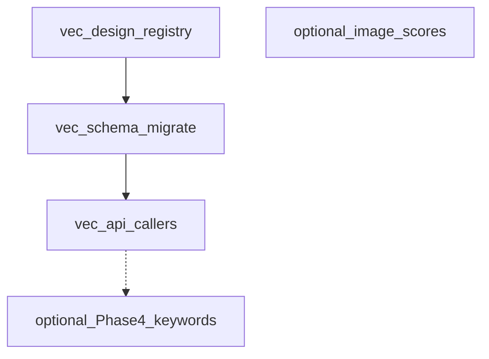

# DB refactor plan — multi-type vectors (primary) + optional normalization (secondary)

## Primary goal — different types of vectors

Today the system assumes **one** visual embedding per image: `images.image_embedding` as `vector(1280)` (MobileNetV2 GAP) in Postgres and a float32 BLOB in Firebird. See [EMBEDDINGS.md](d:/Projects/image-scoring-backend/docs/technical/EMBEDDINGS.md).

**Product goal:** Persist **several non-interchangeable** vector spaces (e.g. current CNN visual features, future CLIP image tower, optional text embeddings keyed by image+caption version) with:

- Stable **model identity** (`model_key` / `embedding_kind`) and **dimension** `N`
- **Version** or weights identity for invalidation/recompute
- **Separate ANN indexes** per space (pgvector HNSW is per column; spaces with different `N` cannot share one `vector` column)

### pgvector constraint (drives schema shape)

A single column is typed `vector(N)` with **fixed N**. You cannot store 1280-d and 512-d vectors in the same column. Practical patterns:

| Pattern                                                  | When to use                                                                                                                                                                                                       |
| -------------------------------------------------------- | ----------------------------------------------------------------------------------------------------------------------------------------------------------------------------------------------------------------- |
| **A. Few known kinds**                                   | Add nullable columns on `images`, e.g. `embedding_visual vector(1280)`, `embedding_clip_image vector(512)` — each with its own HNSW index. Simple queries, no join.                                               |
| **B. Catalog + one physical table per dimension family** | e.g. `image_embeddings_1280(image_id, kind, vector(1280), model_version, updated_at)` with `UNIQUE(image_id, kind)` — multiple models sharing dim (rare) or one row per kind with CHECK on allowed `kind` values. |
| **C. One table per kind**                                | `image_emb_mobilenet_v2(...)`, `image_emb_clip_vit_b32(...)` — clearest indexes and migrations; more DDL when adding kinds.                                                                                       |

Recommended starting point: **(A) or (C)** — avoid a generic "EAV with one bytea vector" that loses pgvector indexing.

Add a small **registry table** (e.g. `embedding_spaces`: `code`, `dim`, `description`, `active`) so the app and migrations agree on valid kinds and dimensions.

### Migration / expand-contract

1. Introduce new storage (chosen pattern) and registry row for existing MobileNet space (e.g. `mobilenet_v2_imagenet_gap`, dim 1280).
2. **Backfill** from `images.image_embedding` into the new structure.
3. **Dual-read window:** similarity search and clustering read from new storage with fallback to legacy column.
4. **Dual-write:** all writers update new storage + legacy column until callers are switched.
5. **Drop or null legacy column** after one release cycle and update [EMBEDDINGS.md](d:/Projects/image-scoring-backend/docs/technical/EMBEDDINGS.md).

### Code touchpoints (non-exhaustive)

- [modules/db_postgres.py](d:/Projects/image-scoring-backend/modules/db_postgres.py) — DDL, `POSTGRES_APP_TABLES`, HNSW indexes
- [migrations/versions/](d:/Projects/image-scoring-backend/migrations/versions/) — new revision(s)
- [modules/db.py](d:/Projects/image-scoring-backend/modules/db.py) — `update_image_embedding(s)`, `get_embeddings_for_search`, `get_images_missing_embeddings`, dual-write skip rules for embeddings (see CHANGELOG notes)
- [modules/clustering.py](d:/Projects/image-scoring-backend/modules/clustering.py) — `CLUSTER_VERSION` / model identity when persisting
- [modules/similar_search.py](d:/Projects/image-scoring-backend/modules/similar_search.py) — `EMBEDDING_DIM`, query space selection
- [scripts/maintenance/populate_missing_embeddings.py](d:/Projects/image-scoring-backend/scripts/maintenance/populate_missing_embeddings.py) — `--kind` or default kind
- API / MCP — any tool that assumes a single embedding column must take or default `embedding_kind`

### Firebird / Electron

Multi-vector may be **Postgres-first**: Firebird can keep a single BLOB for the legacy gallery path until Phase 4 Postgres migration, or gain a parallel `IMAGE_EMBEDDINGS` table with `(image_id, kind, blob)` without pgvector. Document the chosen parity rule in the implementation ticket.

### Success criteria (vectors)

- Adding a second kind (e.g. 512-d) does not require altering the 1280-d column's type.
- Similarity and clustering APIs explicitly select **which space**; no cosine search across mismatched dimensions.
- P95 similarity queries remain acceptable with **one HNSW index per queried column/table**.
- [EMBEDDINGS.md](d:/Projects/image-scoring-backend/docs/technical/EMBEDDINGS.md) checklist (model identity, dim, semantics, version, indexes, callers) is filled for each stored space.

### Gallery (Electron) Compatibility

The `image-scoring-gallery` (Electron) application is a major consumer of the `images` table.

- **Vector Refactor**: No immediate impact, as Electron does not query embeddings directly.
- **Normalization (A0, A1)**: **High Risk.** Electron relies on denormalized `keywords` and `score_*` columns in `images` (see [DATABASE_REFACTOR_ANALYSIS.md](d:/Projects/image-scoring-gallery/docs/technical/DATABASE_REFACTOR_ANALYSIS.md)).
- **Mitigation**: Any removal of legacy columns in `images` must be preceded by a **VIEW** that maintains the legacy schema interface for the gallery.

---

## As implemented (PostgreSQL) — registry + `image_embeddings`

Physical storage follows a **registry + keyed fact table** (closest to plan **Pattern B** for a single 1280-d family), not separate physical tables per model:

| Object | Role |
|--------|------|
| `embedding_spaces` | Registry: `code`, `dim`, `description`, `active`; seeded with `mobilenet_v2_imagenet_gap` (1280). |
| `image_embeddings` | `(image_id, embedding_space_id)` unique; `embedding vector(1280)`; optional `model_version`, `updated_at`; HNSW on `embedding`. |
| `images.image_embedding` | **Legacy / dual-write** column; readers use `COALESCE(ie.embedding, i.image_embedding)` where applicable. |

- **DDL / greenfield:** [`modules/db_postgres.py`](../../modules/db_postgres.py) `init_db()`.
- **Upgrade path:** Alembic [`migrations/versions/0004_embedding_spaces_image_embeddings.py`](../../migrations/versions/0004_embedding_spaces_image_embeddings.py) (creates tables, index, seed, backfill from `images.image_embedding`).
- **Constants / space id cache:** [`modules/embedding_spaces.py`](../../modules/embedding_spaces.py).

**Adding a second dimension (e.g. 512-d CLIP)** still requires a **new `vector(N)` column or new table** (pgvector rule); the current `image_embeddings.embedding` is fixed at 1280.

---

## Worklog

| Date | Area | Notes |
|------|------|--------|
| 2026-04-01 | Schema | `embedding_spaces` + `image_embeddings` added in `db_postgres.py`; `POSTGRES_APP_TABLES` extended for truncate order. |
| 2026-04-01 | Migration | Revision `0004` — create registry + junction table, HNSW on `image_embeddings.embedding`, seed row, backfill from `images.image_embedding`, `SET NOT NULL` on `embedding`. |
| 2026-04-01 | `db.py` | `_pg_default_embedding_space_subquery_sql`, `_postgres_has_default_embedding_sql`; dual-write in `update_image_embedding` / `update_image_embeddings_batch` (optional `model_version`); dual-read via `LEFT JOIN` + `COALESCE` for getters, `get_embeddings_for_search`, `get_embeddings_with_metadata`, tag-propagation queries; Postgres-specific `_get_images_missing_embeddings_pg`; `list_folder_paths_with_missing_keywords` embed clause on Postgres. |
| 2026-04-01 | `similar_search.py` | Postgres path uses `COALESCE(ie.embedding, i.image_embedding)` with join to `image_embeddings` for search / counts / near-duplicate SQL. |
| 2026-04-03 | Docs | Worklog + EMBEDDINGS.md update; reconciled plan text with implemented Pattern B–style layout (removed obsolete Pattern C table-per-kind spec). |

### Follow-ups (not done or partial)

- **`modules/mcp_server.py` `get_embedding_stats`:** Still counts `images.image_embedding IS NOT NULL` only; should use the same “has default embedding” predicate as `db._postgres_has_default_embedding_sql` on Postgres for accurate stats after backfill-only-on-new-table edge cases.
- **`modules/clustering.py`:** Still calls `update_image_embeddings_batch(embedding_pairs)` without `model_version=CLUSTER_VERSION` (column supported in DB API).
- **`repair_culling_ips_failed_has_data`:** Still treats only `images.image_embedding`; Postgres branch could include `image_embeddings` like other helpers.
- **`get_image_tag_propagation_focus`:** Still reads `images.image_embedding` only (Firebird-style path); consider Postgres `COALESCE` + join if that code path is used against PostgreSQL.
- **Tests:** `tests/test_postgres_integration.py` — optionally assert presence of `embedding_spaces` / `image_embeddings` alongside core tables.
- **Scripts:** `populate_missing_embeddings.py` — optional CLI `--embedding-space` for future non-default spaces.
- **Cleanup:** Remove any leftover one-off patch scripts under `tools/` used during bring-up (e.g. `run_vec.py`, `vec_apply.py`) if still present.

---

## Appendix — broader schema normalization (deferred / optional)

The following was the **previous** aggressive normalization scope; it remains valid as a **separate track** after or in parallel with vector work where team capacity allows.

### A0 — Baseline (Phase 4 keywords/metadata)

- [NEXT_STEPS.md](d:/Projects/image-scoring-backend/docs/plans/database/NEXT_STEPS.md): validation, perf gates, deprecate redundant `images.keywords` / related writable dupes
- [electron/db.ts](d:/Projects/image-scoring-gallery/electron/db.ts): keyword `LIKE` → normalized `EXISTS` / `keywords_dim`

### A1 — `image_scores` fact table

- Decompose `images.score_*` + `scores_json` into `(image_id, metric_code, value, …)` with expand-contract and view compatibility (high query churn on [modules/db.py](d:/Projects/image-scoring-backend/modules/db.py))

### A2 — `job_scopes` etc.

- Normalize `jobs.scope_paths` / structured `queue_payload`

### A3 — Integrity

- CHECK constraints; `image_xmp.stack_id` vs `stacks.id` strategy per [DB_SCHEMA_REFACTOR_PLAN.md](d:/Projects/image-scoring-backend/docs/plans/database/DB_SCHEMA_REFACTOR_PLAN.md)

### Explicit non-goals (unchanged)

- `folders.phase_agg_*`, `stack_cache`, `file_name` / `file_type` — keep as caches or convenience denormalization unless there is a separate product reason to change them.

