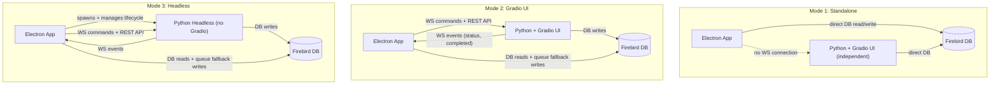
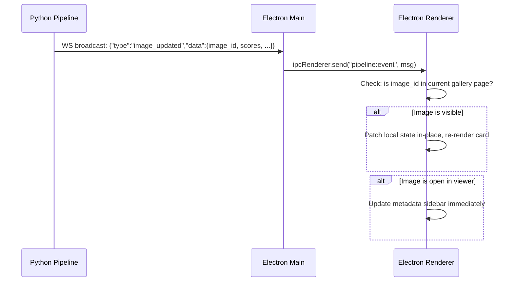
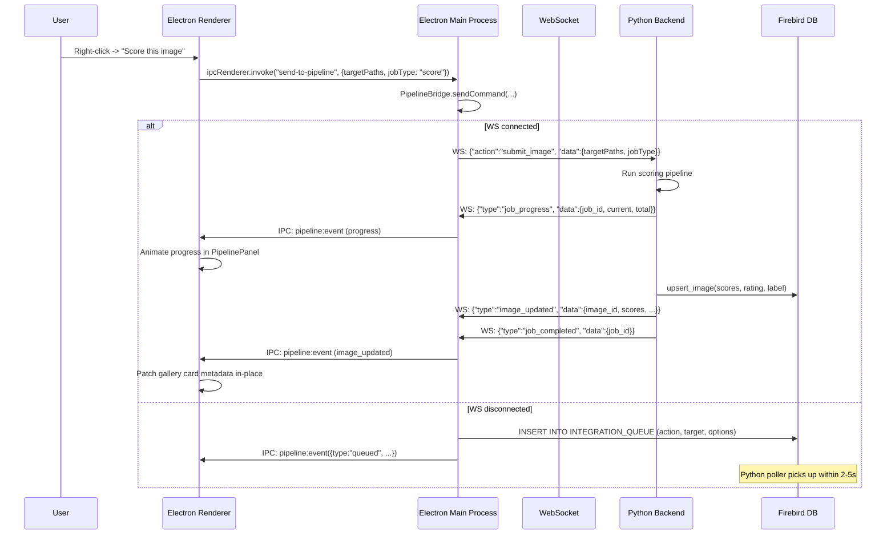

# Electron-Python Integration Design Plan

*Implementation plan for [08 - Gradio Interface Integration](EMBEDDING_APP_08_GRADIO_INTEGRATION.md).*
*Part of [Embedding Applications - Frontend Implementation Index](EMBEDDING_APPLICATIONS_INDEX.md).*

---

## Current State

**Python backend** (`webui.py`) already exposes:

- REST API at `/api/*` -- scoring, tagging endpoints; no clustering endpoints yet (`modules/api.py`)
- WebSocket at `/ws/updates` -- broadcast-only via `EventManager` (`modules/events.py`)
- Gradio UI mounted at `/` on port 7860
- Lock file `webui.lock` written on startup with `{pid, port}` for Electron discovery

**Electron app** (`electron/main.ts`) already has:

- `WebSocketService.ts` connecting to `ws://127.0.0.1:{port}/ws/updates` -- receive-only, no `send()` method
- Direct Firebird DB access via `node-firebird` in `electron/db.ts`
- API config discovery via `config.json` -> `webui.lock` fallback (`main.ts:425-463`)
- CORS configured for Vite dev ports (5173, 4173)
- 20+ IPC channels for DB operations, all prefixed `db:*`

**Gaps to close:**

1. WebSocket is one-way (Python -> Electron). No command channel exists.
2. No clustering or "submit to pipeline" REST endpoints.
3. No headless mode (Python always launches Gradio).
4. No DB fallback queue table.
5. No process lifecycle management in Electron.
6. `image_updated` events lack full refreshable payload.
7. No context menu actions for "Send to Pipeline".
8. No Pipeline mode selector in the Electron window menu.

---

## Three Operating Modes

Per the spec, configurable from the Electron application menu:



| Mode | Python Process | Gradio UI | Electron Controls Pipeline | Pipeline Panel Visible |
|---|---|---|---|---|
| **1. Standalone** | Not managed by Electron (may or may not be running) | N/A | No | No |
| **2. Gradio UI** | Running externally or launched by Electron | Yes, at `:7860` | Yes, via WS/REST | Yes |
| **3. Headless** | Spawned by Electron as child process | No | Yes, via WS/REST + native panel | Yes (with settings) |

---

## Part 1: Bidirectional WebSocket Protocol

### Python side -- upgrade `/ws/updates`

The WebSocket endpoint in `webui.py:220-234` currently receives text but does nothing with it (`pass`). Upgrade it to parse JSON commands and dispatch to runners.

**Inbound command format (Electron -> Python):**
```json
{
  "action": "submit_image | submit_folder | start_scoring | stop_scoring | start_tagging | stop_tagging | start_clustering | stop_clustering | get_status | ping",
  "request_id": "uuid-for-correlation",
  "data": {
    "targetPaths": ["/mnt/d/Photos/image.jpg"],
    "jobType": "score | tag | cluster | pipeline",
    "options": { "skip_existing": true, "custom_keywords": ["..."] }
  }
}
```

**Acknowledgement response (Python -> Electron, unicast to sender):**
```json
{
  "type": "command_response",
  "request_id": "uuid-for-correlation",
  "success": true,
  "data": { "job_id": 42, "message": "Scoring started" }
}
```

**Broadcast events (Python -> all clients, unchanged format):**
```json
{ "type": "job_progress", "data": { "job_id": 42, "current": 5, "total": 100 } }
{ "type": "image_updated", "data": { "image_id": 123, "file_path": "...", "scores": {} } }
{ "type": "job_completed", "data": { "job_id": 42, "status": "completed" } }
```

The key distinction: `command_response` is sent only to the requesting WebSocket; broadcast events go to all connections.

### Files to change (Python side)

**`modules/events.py`:**
- Add `CommandDispatcher` class with an `action -> async handler` registry.
- Each handler wraps the same logic as the REST endpoints in `api.py` (start_batch, stop, single-image, etc.).
- Add `async send_to(websocket, message)` helper for unicast responses.

**`webui.py` lines 220-234:**
- Replace the `pass` in the receive loop:

```python
data = await websocket.receive_text()
try:
    msg = json.loads(data)
    await command_dispatcher.handle(websocket, msg)
except json.JSONDecodeError:
    pass  # ignore malformed
```

**`headless.py` (new file):**
- Reuses the same WebSocket endpoint and dispatcher code.

### Electron side -- upgrade communication path

Per the spec, the IPC flow is: **Renderer -> Main process -> WebSocket/REST -> Python**.

The Main process acts as the gateway, not the renderer directly.

**`electron/main.ts`:**
- Add a `PipelineBridge` class (or module `electron/pipelineBridge.ts`) that:
  - Holds the WebSocket connection (moved from renderer to Main process for reliability)
  - Exposes `sendCommand(action, data): Promise<response>`
  - Falls back to DB queue insert on WS failure
  - Forwards broadcast events to the renderer via `mainWindow.webContents.send('pipeline:event', msg)`

**IPC channel (spec-aligned):**
```typescript
ipcMain.handle('send-to-pipeline', async (_, { targetPaths, jobType, options }) => {
    return pipelineBridge.sendCommand('submit_' + (targetPaths.length === 1 ? 'image' : 'folder'), {
        targetPaths, jobType, options
    });
});
```

**`src/services/WebSocketService.ts`:**
- Simplify to a thin wrapper that listens for `pipeline:event` messages from the Main process (via `ipcRenderer.on`).
- OR keep the renderer-side WS but add `send()` with request correlation. The Main-process approach is more resilient (survives page reloads).

**Decision point:** WebSocket in Main process (more robust) vs. renderer (simpler). Recommend Main process per spec's IPC flow diagram.

---

## Part 2: New REST Endpoints for Missing Pipelines

The REST API in `modules/api.py` currently has no clustering endpoints and no composite "run full pipeline" endpoint. Add:

- `POST /api/clustering/start` -- `{ "input_path": "..." }` -- Start clustering for a folder
- `POST /api/clustering/stop` -- Stop clustering job
- `GET /api/clustering/status` -- Get clustering runner status
- `POST /api/submit/image` -- `{ "file_path": "...", "operations": ["score","tag"] }` -- Single image pipeline
- `POST /api/submit/folder` -- `{ "input_path": "...", "operations": ["score","tag","cluster"], "options": {...} }` -- Folder pipeline

The `submit` endpoints create a **composite pipeline job** that chains the requested operations sequentially (score -> tag -> cluster), reusing existing runners. Each sub-step broadcasts its own events.

**Also required:**
- Extend `set_runners()` in `api.py` to accept `clustering_runner`.
- Register `ClusteringRunner` in both `webui.py` and `headless.py`.

---

## Part 3: DB Fallback Queue (INTEGRATION_QUEUE)

When the WebSocket is down or not yet established, the Electron Main process writes job requests directly to the DB. The Python backend polls this table on startup and periodically.

### New table

```sql
CREATE TABLE INTEGRATION_QUEUE (
    ID         INTEGER GENERATED BY DEFAULT AS IDENTITY PRIMARY KEY,
    ACTION     VARCHAR(50) NOT NULL,
    TARGET     VARCHAR(4000) NOT NULL,
    OPTIONS    BLOB SUB_TYPE TEXT,
    STATUS     VARCHAR(20) DEFAULT 'pending',
    PRIORITY   INTEGER DEFAULT 0,
    CREATED_AT TIMESTAMP DEFAULT CURRENT_TIMESTAMP,
    PICKED_AT  TIMESTAMP,
    DONE_AT    TIMESTAMP,
    RESULT     BLOB SUB_TYPE TEXT,
    ERROR_MSG  VARCHAR(4000),
    SOURCE     VARCHAR(20) DEFAULT 'electron'
);
CREATE INDEX IDX_QUEUE_STATUS ON INTEGRATION_QUEUE (STATUS, PRIORITY DESC, CREATED_AT);
```

ACTION values: `score_image`, `score_folder`, `tag_image`, `tag_folder`, `cluster_folder`, `pipeline_image`, `pipeline_folder`

### Python side: `modules/queue_poller.py` (new file)

A `threading.Thread` daemon that:
1. Polls `SELECT ... FROM INTEGRATION_QUEUE WHERE STATUS='pending' ORDER BY PRIORITY DESC, CREATED_AT FETCH FIRST 1 ROW ONLY`
2. Claims: `UPDATE ... SET STATUS='processing', PICKED_AT=CURRENT_TIMESTAMP WHERE ID=? AND STATUS='pending'` (optimistic lock)
3. Dispatches to the appropriate runner (mirrors logic in `CommandDispatcher`)
4. On completion: `UPDATE ... SET STATUS='completed', DONE_AT=CURRENT_TIMESTAMP, RESULT=?`
5. On failure: `UPDATE ... SET STATUS='failed', DONE_AT=CURRENT_TIMESTAMP, ERROR_MSG=?`
6. Broadcasts `queue_item_completed` WebSocket event
7. Sleeps 2-5 seconds between polls; exponential backoff when idle

Integrated into `webui.py` and `headless.py` startup.

### Python side: `modules/db.py` additions

- `create_queue_table()` -- DDL, called from `ensure_tables()`
- `insert_queue_item(action, target, options, source)` -> id
- `claim_next_queue_item()` -> row or None (atomic claim)
- `complete_queue_item(id, result)` / `fail_queue_item(id, error_msg)`
- `get_queue_items(status, limit)` -> list (for monitoring)

### Electron side: `electron/db.ts` additions

- `insertQueueItem(action, target, options)` -- direct Firebird INSERT
- `getQueueItems(status?, limit?)` -- for displaying in PipelinePanel

### Fallback logic in `PipelineBridge` (Main process)

```
try WS send -> success? return response
catch (WS down) -> insertQueueItem(...) -> notify renderer "queued for later"
```

### State sync (spec requirement)

The Electron app can also poll `INTEGRATION_QUEUE` to verify completion statuses if real-time events were missed. The `PipelinePanel` shows queue items and their status.

---

## Part 4: Real-time UI Refresh on Data Update

Per spec: "If the updated item is currently displayed on screen, the Electron UI patches the item data or re-fetches it immediately to reflect the new state."

### Enriched event payload

Currently `db.py` broadcasts `image_scored` and `image_updated` with varying payloads. Standardize to always include the fields Electron needs for in-place patching:

```python
event_manager.broadcast_threadsafe("image_updated", {
    "image_id": image_id,
    "file_path": file_path,
    "score_general": score_general,
    "score_technical": score_technical,
    "score_aesthetic": score_aesthetic,
    "rating": rating,
    "label": label,
    "keywords": keywords,       # JSON array
    "title": title,
    "description": description,
    "thumbnail_path": thumbnail_path
})
```

### Electron renderer response



### Files to change

**Python:** Audit all `broadcast_threadsafe("image_updated", ...)` and `broadcast_threadsafe("image_scored", ...)` calls in `modules/db.py`, `modules/scoring.py`, `modules/tagging.py` to include the full field set above.

**Electron:**
- Hook into `pipeline:event` in `useImages` (or a new `usePipelineEvents` hook) to match `image_id` against the current page of images and patch in-place.
- In `ImageViewer.tsx`, listen for updates matching the currently viewed `image_id` and refresh the detail panel.

---

## Part 5: Headless Python Mode (Mode 3)

### New file: `headless.py`

Identical to `webui.py` except: no Gradio import, no `create_ui()`, no `gr.mount_gradio_app()`. The FastAPI app serves only:
- REST API (`/api/*`)
- WebSocket (`/ws/updates`)
- Queue poller (background thread)
- Health endpoint

```python
"""Headless pipeline server -- no Gradio UI."""
import uvicorn, asyncio, json, logging
from fastapi import FastAPI, WebSocket, WebSocketDisconnect
from fastapi.middleware.cors import CORSMiddleware
from modules.api import create_api_router, set_runners
from modules.events import event_manager, command_dispatcher
from modules.scoring import ScoringRunner
from modules.tagging import TaggingRunner
from modules.clustering import ClusteringRunner
from modules.queue_poller import QueuePoller

app = FastAPI(title="Image Scoring Headless Pipeline")

# CORS (same origins as webui.py)
app.add_middleware(CORSMiddleware, allow_origins=[...], ...)

# Runners
scoring_runner = ScoringRunner()
tagging_runner = TaggingRunner()
clustering_runner = ClusteringRunner()
set_runners(scoring_runner, tagging_runner, clustering_runner)

# REST
app.include_router(create_api_router())

# WebSocket (same handler as webui.py)
@app.websocket("/ws/updates")
async def websocket_endpoint(websocket: WebSocket):
    await event_manager.connect(websocket)
    try:
        while True:
            data = await websocket.receive_text()
            msg = json.loads(data)
            await command_dispatcher.handle(websocket, msg)
    except WebSocketDisconnect:
        event_manager.disconnect(websocket)

# Queue poller
queue_poller = QueuePoller(scoring_runner, tagging_runner, clustering_runner)

@app.on_event("startup")
async def startup():
    event_manager.set_loop(asyncio.get_running_loop())
    queue_poller.start()

# Lock file (same pattern as webui.py, written to headless.lock)
uvicorn.run(app, host="0.0.0.0", port=7860)
```

### Launch

- **Manual from WSL:** `source ~/.venvs/tf/bin/activate && python headless.py`
- **Spawned by Electron:** `child_process.spawn('wsl', ['-e', 'bash', '-c', '...activate && python headless.py'])`

The headless server writes `headless.lock` (same format as `webui.lock`) so Electron can discover the port.

---

## Part 6: Electron Mode Selector and Process Lifecycle

### Application menu (`electron/main.ts`)

Extend `rebuildApplicationMenu()` (currently at line 61) to add a **"Pipeline"** top-level menu:

```
Pipeline
  (*) Standalone              -- default, no connection
  ( ) Connect to Gradio UI   -- connect to running Python+Gradio
  ( ) Launch Headless         -- spawn headless.py, connect
  ─────────────────────
  [ ] Show Pipeline Panel     -- toggle pipeline control panel
  ─────────────────────
  Configure Host/Port...      -- dialog for custom host:port
```

Radio-button selection (one active at a time). Stored in `config.json` under `pipeline.mode`.

### New module: `electron/pipelineBridge.ts`

Encapsulates all Python backend communication:

```typescript
class PipelineBridge {
    private ws: WebSocket | null = null;
    private headlessProcess: ChildProcess | null = null;
    private mode: 'standalone' | 'gradio' | 'headless' = 'standalone';

    setMode(mode): void;
    connectWebSocket(url): Promise<void>;
    sendCommand(action, data): Promise<any>;

    // Headless lifecycle
    launchHeadless(): Promise<void>;   // spawn WSL child process
    killHeadless(): Promise<void>;     // SIGTERM child process
    isHeadlessRunning(): boolean;

    // DB fallback
    private fallbackToQueue(action, data): Promise<void>;

    // Events -> renderer
    private forwardToRenderer(event): void;
}
```

### New IPC channels

- `send-to-pipeline` (renderer -> main) -- `{ targetPaths: string[], jobType: string, options?: {} }` -- Submit image(s)/folder to pipeline (spec-defined)
- `pipeline:set-mode` (renderer -> main) -- `{ mode: 'standalone'|'gradio'|'headless' }` -- Switch operating mode
- `pipeline:get-mode` (renderer -> main) -- Query current mode
- `pipeline:get-status` (renderer -> main) -- Get connection status + runner statuses
- `pipeline:event` (main -> renderer) -- `{ type: string, data: any }` -- Forward WS broadcast events to renderer

The `send-to-pipeline` channel name matches the spec's `ipcRenderer.invoke('send-to-pipeline', { targetPaths, jobType })`.

### Health monitoring

When in Gradio UI or Headless mode, the `PipelineBridge` periodically (every 5s) calls `GET /api/health`. If unreachable:
- Show yellow/red status indicator in the Pipeline Panel
- If headless mode and process exited, offer restart

---

## Part 7: Pipeline Control Panel (Electron UI)

### New component: `src/components/Pipeline/PipelinePanel.tsx`

Per spec: "a dedicated view or draggable panel within the Electron app that exposes the necessary pipeline settings."

**Layout:** A collapsible right-side panel or floating draggable panel, toggled from the Pipeline menu.

**Sections:**

1. **Connection Status** -- Green dot (connected), yellow (connecting/reconnecting), red (disconnected). Shows mode label.
2. **Quick Actions** -- Buttons for the current context:
   - "Score Current Image" / "Tag Current Image" (enabled when an image is selected)
   - "Process Current Folder" (enabled when in a folder)
   - "Run Full Pipeline" (score + tag + cluster)
3. **Active Jobs** -- Live progress from WebSocket events:
   - Job type badge (Scoring / Tagging / Clustering)
   - Progress bar (`current / total`)
   - Status message
   - Stop button
4. **Queue Status** -- Pending items from `INTEGRATION_QUEUE` (polled from DB or from `/api/queue/status` endpoint):
   - Pending count
   - Currently processing item
   - Failed items with retry button
5. **Pipeline Settings** (Headless mode only):
   - Confidence thresholds for keyword tagging
   - Custom keyword list
   - Skip existing toggle
   - Clustering distance threshold

Hidden in Standalone mode. Visible (auto-opened) when switching to Gradio UI or Headless mode.

### Supporting components

- `src/components/Pipeline/ConnectionIndicator.tsx` -- Reusable status dot
- `src/components/Pipeline/JobProgressCard.tsx` -- Single job progress display
- `src/hooks/usePipelineEvents.ts` -- Hook that subscribes to `pipeline:event` IPC and manages pipeline state

---

## Part 8: Context Menus for "Send to Pipeline"

### Gallery grid context menu (`GalleryGrid.tsx`)

Right-click on an image card:
- **Score this image** -- `ipcRenderer.invoke('send-to-pipeline', { targetPaths: [filePath], jobType: 'score' })`
- **Tag this image** -- `{ targetPaths: [filePath], jobType: 'tag' }`
- **Run full pipeline** -- `{ targetPaths: [filePath], jobType: 'pipeline' }`
- Disabled with tooltip "Not connected" when in Standalone mode.

### Folder tree context menu (`FolderTree.tsx`)

Right-click on a folder node:
- **Score this folder** -- `{ targetPaths: [folderPath], jobType: 'score' }`
- **Tag this folder** -- `{ targetPaths: [folderPath], jobType: 'tag' }`
- **Cluster this folder** -- `{ targetPaths: [folderPath], jobType: 'cluster' }`
- **Run full pipeline** -- `{ targetPaths: [folderPath], jobType: 'pipeline' }`

### Image viewer actions (`ImageViewer.tsx`)

Add a toolbar button or detail panel button: "Send to Pipeline (Score/Tag/Stack)" per spec.

### End-to-end flow (spec-aligned)



---

## Summary of Changes by File

### Python repo (`image-scoring`)

- `modules/events.py` -- Add `CommandDispatcher` class (action registry, `handle()`, unicast `send_to()`)
- `webui.py` -- Wire `command_dispatcher.handle()` into WS receive loop (replace `pass`)
- `modules/api.py` -- Add `/api/clustering/*` and `/api/submit/*` endpoints; extend `set_runners()` for clustering
- `modules/db.py` -- Add `INTEGRATION_QUEUE` DDL in `ensure_tables()`; queue CRUD functions
- `modules/queue_poller.py` -- **New file:** background thread polling INTEGRATION_QUEUE, dispatching to runners
- `headless.py` -- **New file:** FastAPI + WS + REST + queue poller, no Gradio import
- `modules/scoring.py` -- Ensure `image_scored` events include full payload (scores, rating, label, keywords)
- `modules/tagging.py` -- Ensure `image_updated` events include full payload
- `modules/db.py` -- Audit all `broadcast_threadsafe` calls for consistent, complete payloads

### Electron repo (`electron-image-scoring`)

- `electron/pipelineBridge.ts` -- **New file:** WS connection, command send/receive, headless lifecycle, DB fallback
- `electron/main.ts` -- Add Pipeline menu (lines 61-92), register `send-to-pipeline` + `pipeline:*` IPC handlers, headless spawn/kill
- `electron/preload.ts` -- Expose `sendToPipeline`, `pipelineSetMode`, `pipelineGetMode`, `onPipelineEvent`
- `electron/db.ts` -- Add `insertQueueItem()`, `getQueueItems()` for INTEGRATION_QUEUE
- `src/components/Pipeline/PipelinePanel.tsx` -- **New file:** draggable/collapsible panel with connection, jobs, queue, settings
- `src/components/Pipeline/ConnectionIndicator.tsx` -- **New file:** status dot component
- `src/components/Pipeline/JobProgressCard.tsx` -- **New file:** single job progress card
- `src/hooks/usePipelineEvents.ts` -- **New file:** hook subscribing to `pipeline:event` IPC, manages pipeline state
- `src/components/Gallery/GalleryGrid.tsx` -- Add right-click context menu with "Score/Tag/Pipeline" items
- `src/components/Tree/FolderTree.tsx` -- Add right-click context menu with "Score/Tag/Cluster/Pipeline" items
- `src/components/Viewer/ImageViewer.tsx` -- Add "Send to Pipeline" button; refresh metadata on `image_updated` event
- `src/services/WebSocketService.ts` -- Deprecate or refactor: WS moves to Main process (`pipelineBridge.ts`)
- `src/electron.d.ts` -- Add TypeScript declarations for new IPC API

### Shared / Config

- `config.json` (Electron) -- Add `pipeline: { mode, host, port }` section
- `config.example.json` (both repos) -- Document new fields
- `EMBEDDING_APP_08_GRADIO_INTEGRATION.md` -- Update with final implementation details after build
