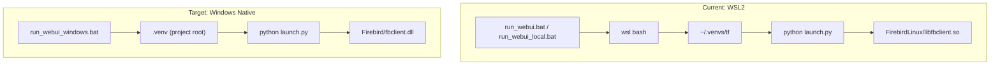

# Windows Native WebUI Environment Plan

## Current Architecture

The app runs via WSL using two launcher variants:

- **run_webui.bat** — WSL2 + Firebird TCP server (`localhost:3050`)
- **run_webui_local.bat** — WSL2 + Firebird local path (embedded, no TCP)
- **run_webui_docker.bat** — Docker container

All three invoke WSL's `~/.venvs/tf` venv and run `python launch.py` → `webui.py`.

**Windows native support today is CLI-only** (Option 3 in README): CPU scoring via `.venv`, no WebUI, no VILA.

### What Already Works on Windows

- **Firebird binaries**: `Firebird/firebird.exe`, `fbclient.dll`, and all supporting DLLs are already present (gitignored)
- **launch.py**: Detects `platform.system() == "Windows"` and starts `Firebird/firebird.exe -a` as a detached subprocess (lines 26–86)
- **modules/db.py**: Uses `Firebird/fbclient.dll` and local file path when `os.name == 'nt'`
- **requirements.txt**: Uses `tensorflow-cpu>=2.15.1,<2.16.0` (Windows-compatible)



---

## Key Constraints

| Component      | Windows Native Status | Notes                                                                     |
| -------------- | --------------------- | ------------------------------------------------------------------------- |
| **Firebird**   | Ready                 | Binaries in `Firebird/`; `db.py` + `launch.py` already handle Windows     |
| **TensorFlow** | CPU only              | TF dropped Windows GPU after 2.10; `tensorflow-cpu` in requirements works |
| **PyTorch**    | CPU + GPU supported   | CUDA works natively on Windows; needed for LIQE model                     |
| **VILA**       | Not supported         | README marks VILA as ❌ for Windows native; acceptable limitation          |
| **Gradio**     | Supported             | No platform-specific issues                                               |

---

## Implementation Plan

### Phase 1: Dependency Consolidation

**Problem**: Critical dependencies are scattered across variant requirements files.

| Dependency        | Currently In                                       | Needed In           |
| ----------------- | -------------------------------------------------- | ------------------- |
| `firebird-driver` | `requirements/requirements_research.txt`           | `requirements.txt`  |
| `torch>=2.0.0`    | `requirements/requirements_keyword_extraction.txt` | Documented in setup |

**Actions**:

1. Add `firebird-driver>=2.0` to main `requirements.txt` (it's imported at top of `db.py` but missing from main deps)
2. Do **not** add `torch` to main requirements — it's large and optional. Document the install command in the setup script instead, since torch index URL varies by CPU/CUDA target

### Phase 2: Create `run_webui_windows.bat`

Windows-native launcher (no WSL). Based on the pattern in existing `.bat` files:

```batch
@echo off
setlocal enabledelayedexpansion

set "PROJECT_ROOT=%~dp0"
set "PROJECT_ROOT=%PROJECT_ROOT:~0,-1%"

REM Add Firebird to PATH for fbclient.dll
set "PATH=%PROJECT_ROOT%\Firebird;%PATH%"

REM Optional: enable MCP server
REM set ENABLE_MCP_SERVER=1

REM Activate Windows venv
if exist "%PROJECT_ROOT%\.venv\Scripts\activate.bat" (
    call "%PROJECT_ROOT%\.venv\Scripts\activate.bat"
) else (
    echo ERROR: .venv not found. Run scripts\setup\setup_windows_native.bat first.
    pause
    exit /b 1
)

REM launch.py handles Firebird server startup on Windows
python "%PROJECT_ROOT%\launch.py" %*
pause
```

Key differences from WSL launchers:

- No `wsl` invocation or path conversion
- Uses `.venv\Scripts\activate.bat` (Windows venv)
- Adds `Firebird/` to `PATH` so `fbclient.dll` is found
- `launch.py` already starts `firebird.exe -a` on Windows — no extra Firebird logic needed

### Phase 3: Create Setup Script

Create `scripts/setup/setup_windows_native.bat`:

1. Check Python version (3.10+ required for TF 2.15)
2. Create `.venv` at project root: `python -m venv .venv`
3. Activate and install: `pip install -r requirements.txt`
4. Install PyTorch (CPU default, with CUDA instructions printed):
   - CPU: `pip install torch torchvision --index-url https://download.pytorch.org/whl/cpu`
   - CUDA: Print instructions for user to run manually with appropriate CUDA version
5. Verify Firebird binaries exist in `Firebird/` (warn if missing)
6. Optionally check if database exists, suggest `migrate_to_firebird.py` if not

### Phase 4: Documentation Updates

#### `README.md`

Add **Option 3b: Windows Native WebUI** after existing Option 3:

- Prerequisites: Python 3.10+, Firebird binaries in `Firebird/`
- Setup: run `scripts/setup/setup_windows_native.bat`
- Launch: run `run_webui_windows.bat`
- Limitations: CPU-only TensorFlow, no VILA model

#### `docs/setup/ENVIRONMENTS.md`

Update the virtual environment table:

- `.venv` (project root): Windows native WebUI + CLI (CPU, no VILA)
- Note that this is now a full WebUI environment, not just CLI

#### `.cursor/rules/python-wsl-webapp-env.mdc`

Add exception: `run_webui_windows.bat` uses Windows-native `.venv`. Scripts invoked via that bat file use Windows Python, not WSL.

### Phase 5 (Optional): GPU Considerations

For users wanting GPU acceleration:

| Framework   | Approach                      | Complexity |
| ----------- | ----------------------------- | ---------- |
| PyTorch     | `pip install torch` with CUDA | Low        |
| TensorFlow  | Pin to `2.10` + CUDA 11.x     | High       |
| TF-DirectML | `tensorflow-directml`         | Medium     |

**Recommendation**: Document CPU-first. PyTorch GPU is straightforward. TensorFlow GPU on Windows is fragile — recommend WSL or Docker for TF GPU workloads.

---

## Files to Create/Modify

| File                                      | Action | Description                             |
| ----------------------------------------- | ------ | --------------------------------------- |
| `run_webui_windows.bat`                   | Create | Windows-native WebUI launcher           |
| `scripts/setup/setup_windows_native.bat`  | Create | Venv creation + dependency installation |
| `requirements.txt`                        | Modify | Add `firebird-driver>=2.0`             |
| `README.md`                               | Modify | Add Option 3b: Windows Native WebUI   |
| `docs/setup/ENVIRONMENTS.md`              | Modify | Update `.venv` description              |
| `.cursor/rules/python-wsl-webapp-env.mdc` | Modify | Add Windows-native exception            |

---

## Verification Steps

1. Run `scripts/setup/setup_windows_native.bat` — venv created, deps installed without errors
2. Verify `Firebird/firebird.exe` and `fbclient.dll` exist
3. Run `run_webui_windows.bat`
4. Confirm: Firebird starts, DB connects, Gradio UI loads in browser
5. Test: Score an image (CPU) — TensorFlow and/or PyTorch model runs successfully
6. Test: MCP server starts when `ENABLE_MCP_SERVER=1` is set

---

## Risk Mitigations

| Risk                                | Mitigation                                                        |
| ----------------------------------- | ----------------------------------------------------------------- |
| `firebird-driver` import fails      | Setup script verifies install; `Firebird/` on PATH                |
| TF model OOM on CPU                 | Already uses `tensorflow-cpu`; no GPU memory issues               |
| VILA model called on Windows        | Code already gates VILA; README documents limitation              |
| Existing WSL workflows break        | No changes to WSL launchers; this is additive only                |
| `.venv` conflicts with existing use | `.venv` was already documented for Windows CLI in ENVIRONMENTS.md |
