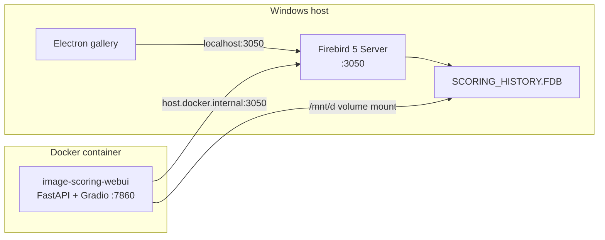

# Docker Setup Guide

This guide covers installing Docker in WSL2 and running the Image Scoring application with Docker.

## Prerequisites

- Windows 10/11 with WSL2 enabled
- Ubuntu distribution installed in WSL2
- At least 10GB of free disk space
- (Optional) NVIDIA GPU for hardware acceleration
- **Docker Desktop**: Install [Docker Desktop for Windows](https://www.docker.com/products/docker-desktop/) — ensure it uses the WSL 2 backend
- **Firebird SQL**: The Firebird service must be running on your Windows host when running the app

---

## Part 1: Installing Docker in WSL2

### Quick Installation (Recommended)

Run the all-in-one installer from Windows:

```cmd
install_and_verify_docker.bat
```

This will:
1. Install Docker Engine in WSL
2. Configure sudo-less access
3. Install NVIDIA Container Toolkit for GPU support
4. Restart WSL and verify everything works

You'll be prompted for your sudo password during installation.

### Manual Installation

If you prefer to run each step manually:

#### Step 1: Install Docker Engine

```bash
cd /path/to/image-scoring
chmod +x scripts/install_docker_wsl.sh
./scripts/install_docker_wsl.sh
```

#### Step 2: Post-Installation Configuration

```bash
chmod +x scripts/setup_docker_postinstall.sh
./scripts/setup_docker_postinstall.sh
```

**Then restart WSL:**
```powershell
# From Windows PowerShell
wsl --shutdown
```

#### Step 3: Install NVIDIA Container Toolkit (GPU support)

```bash
chmod +x scripts/install_nvidia_docker.sh
./scripts/install_nvidia_docker.sh
```

> **Note:** Requires NVIDIA drivers installed on Windows (version 470+)

#### Step 4: Verify Installation

```bash
chmod +x scripts/verify_docker_wsl.sh
./scripts/verify_docker_wsl.sh
```

This checks: WSL2 environment, Docker installation, service status, non-sudo access, container functionality, Docker Compose, GPU access (if NVIDIA toolkit installed), disk space.

---

## Part 2: Running the Image Scoring Application

### Architecture

The Docker container runs the FastAPI + Gradio web UI and connects back to the Firebird database server already running on your Windows host. Image files are accessed via volume mounts.



### Prerequisites

- **Docker Desktop for Windows** with the WSL 2 backend enabled
- **Firebird 5 Server** running on Windows (port 3050). The service must be started before the container.
- **NVIDIA GPU + drivers 470+** (optional — required only for ML scoring)
- Project cloned on your machine (sibling layout with **image-scoring-gallery** is typical). If your path differs, see [Customising the FDB path](#customising-the-fdb-path) below.

### First-time build

Build the Docker image once (and again whenever `requirements/requirements_wsl_gpu.txt` changes):

```bash
docker compose build
```

### Customising the FDB path

If your project lives somewhere other than the path you first configured, edit `FIREBIRD_WIN_DB_PATH` in `docker-compose.yml` (or set it in `.env`) to your actual host path. Use **forward slashes** — backslashes are not YAML-safe:

```yaml
- FIREBIRD_WIN_DB_PATH=E:/MyProject/image-scoring-backend/SCORING_HISTORY.FDB
```

After changing this value run `docker compose down && docker compose up` (full recreate) so the new env var is picked up.

### Running

```bash
# Foreground — logs stream to the terminal
docker compose up

# Background (detached)
docker compose up -d
```

Access the WebUI at **http://localhost:7860**.

### Stopping

```bash
docker compose down        # stops and removes the container (data is safe)
```

### Rebuilding after dependency changes

```bash
docker compose build && docker compose up
```

### Updating Python code without rebuilding

The project root is live-mounted into the container (`.:/app`). Python source changes take effect on the next `docker compose restart webui` — no rebuild needed.

### Scope paths (Runs / preview / indexing)

The WebUI only sees filesystem paths **inside the container**. `docker-compose.yml` maps a **host** folder to **`/mnt/d/Photos`** inside `webui` via:

`${PHOTOS_BIND_SOURCE:-/mnt/d/Photos}:/mnt/d/Photos:rw`

- **Docker CLI in WSL**: Leaving `PHOTOS_BIND_SOURCE` unset uses `/mnt/d/Photos` on the WSL host, which matches typical drive mounts — paths like `/mnt/d/Photos/...` in **New Run** work.
- **Docker Desktop for Windows**: The default left-hand path is **not** your Windows `D:\` tree. Create a `.env` in the repo root (see [`.env.example`](../../.env.example)) with e.g. `PHOTOS_BIND_SOURCE=D:/Photos` (forward slashes), then run `docker compose up -d --force-recreate webui`. Keep using `/mnt/d/Photos/...` in the UI; that is the path **inside** the container.

1. Set `PHOTOS_BIND_SOURCE` in `.env` when on Docker Desktop, or adjust `webui.volumes` if needed (e.g. `/mnt/e/Pictures:/mnt/e/Pictures:rw`, or a custom target and matching UI paths).
2. Run `docker compose up -d --force-recreate webui` after changing `.env` or compose volumes.
3. Use the **in-container** path in the scope field (`/mnt/d/Photos/...` when using the default right-hand mount).

Verify the bind: `docker exec image-scoring-webui ls /mnt/d/Photos`.

API errors for missing paths include a Docker reminder when `DOCKER_CONTAINER=1`.

### Key environment variables

These are set in `docker-compose.yml` and control the container's behaviour:

| Variable | Value | Purpose |
|---|---|---|
| `PHOTOS_BIND_SOURCE` | Optional; e.g. `D:/Photos` (Compose `.env`, not `config.json`) | **Host** folder bound to `/mnt/d/Photos` in `webui`; required for correct **New Run** paths on Docker Desktop for Windows |
| `FIREBIRD_WIN_DB_PATH` | e.g. `/app/SCORING_HISTORY.FDB` (see `docker-compose.yml`) | Host path to the FDB file when using Firebird from the container |
| `FIREBIRD_CLIENT_LIBRARY` | `/app/FirebirdLinux/.../libfbclient.so` | Path to the bundled Linux Firebird client library |
| `DOCKER_CONTAINER` | `1` | Tells the app it is running inside Docker |
| `WEBUI_HOST` | `0.0.0.0` | Bind to all interfaces so port 7860 is reachable from Windows |

### Quick test (after installation)

```bash
# Basic Docker sanity check
docker run hello-world

# Test GPU access (if NVIDIA toolkit installed)
docker run --rm --gpus all nvidia/cuda:12.6.0-base-ubuntu22.04 nvidia-smi

# Run the application
docker compose up
```

When the container starts you should see Firebird connectivity confirmed and then GPU detection in the logs (e.g., `NVIDIA GeForce RTX …`).

---

## Troubleshooting

### Docker service not starting

```bash
sudo service docker start
```

### Permission denied when running Docker

Complete Step 2 (post-installation) and restart WSL, or run `newgrp docker`.

### Firebird connection failed

1. Verify the Firebird service is running on Windows (port 3050).
2. Ensure Windows Firewall permits port 3050. Run `setup_firewall.bat` as Administrator.
3. Check that `FIREBIRD_WIN_DB_PATH` in `docker-compose.yml` (or `.env`) uses the correct path with **forward slashes** (match your clone location and `SCORING_HISTORY.FDB`).
4. If you see `Docker: FIREBIRD_WIN_DB_PATH is not set` or `using computed path` in the container logs, the env var is wrong or was not applied. Fix the path and run `docker compose down && docker compose up` to recreate the container.

### `duplicate key value violates unique constraint "jobs_pkey"` (`POST /api/runs/submit`)

PostgreSQL assigns `jobs.id` from a sequence (`SERIAL`). If you restored data, imported rows with explicit IDs, or migrated without resetting sequences, the sequence can lag behind `MAX(jobs.id)` and the next insert reuses an existing id.

**Fix — realign sequences** (same database your backend uses):

From the host, using the Compose Postgres service:

```bash
docker exec image-scoring-postgres psql -U postgres -d image_scoring -c "
SELECT setval(
  pg_get_serial_sequence('jobs', 'id'),
  COALESCE((SELECT MAX(id) FROM jobs), 1),
  true
);
"
```

To repair **all** SERIAL `id` columns the app uses (recommended after a full restore), run from the repo root (WSL / venv with project deps, same as the Firebird→Postgres migrate script):

```bash
python scripts/python/postgres_sequence_repair.py
```

You can pass `--pg-host`, `--pg-port`, `--pg-db`, `--pg-user`, `--pg-password` to override `config.json` / environment.

### New Run / scope preview: Path not found (`/mnt/d/Photos/...`)

The API checks paths **inside** the `webui` container. If the error mentions Docker and `PHOTOS_BIND_SOURCE`, the photos folder is not bind-mounted correctly.

1. Add `PHOTOS_BIND_SOURCE=<Windows path to library root>` to `.env` (see [`.env.example`](../../.env.example)), e.g. `PHOTOS_BIND_SOURCE=D:/Photos`.
2. Run `docker compose up -d --force-recreate webui`.
3. Confirm: `docker exec image-scoring-webui ls /mnt/d/Photos` lists your top-level folders.

### No GPU detected

1. Verify `nvidia-smi` works in a standard WSL 2 terminal.
2. Check that `deploy.resources.reservations.devices` is present in `docker-compose.yml`.
3. Update NVIDIA drivers to the latest version.

### GPU not accessible in Docker containers

**Quick Fix:**
```cmd
cleanup_nvidia_repo.bat
fix_nvidia_docker.bat
```

Or from WSL:
```bash
cd /path/to/image-scoring
sudo rm -f /etc/apt/sources.list.d/nvidia-container-toolkit.list
sudo rm -f /usr/share/keyrings/nvidia-container-toolkit-keyring.gpg
./scripts/fix_nvidia_docker.sh
```

If `nvidia-smi` doesn't work in WSL: update NVIDIA drivers to 470+, run `wsl --update`, verify `nvidia-smi` in WSL first.

### Docker auto-start not working

Add to `~/.bashrc`:

```bash
if ! pgrep -x dockerd > /dev/null; then
    sudo service docker start > /dev/null 2>&1
fi
```

### Slow performance

Accessing files across Windows/WSL (e.g., `/mnt/d`) is slower than native Linux. For maximum performance, consider moving your workspace into the WSL filesystem.

---

## Uninstalling Docker

```bash
sudo service docker stop
sudo apt-get purge -y docker-ce docker-ce-cli containerd.io docker-buildx-plugin docker-compose-plugin
sudo rm -rf /var/lib/docker /etc/docker
sudo apt-get purge -y nvidia-container-toolkit
sudo groupdel docker
```

---

## Next Steps

- Review [docker-compose.yml](../../docker-compose.yml) for configuration options
- See [README.md](../../README.md) for application documentation
