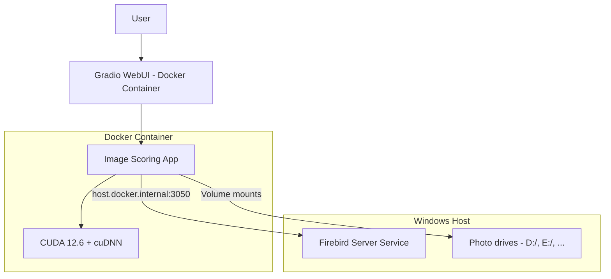

# Docker Setup Guide

This guide covers installing Docker in WSL2 and running the Image Scoring application with Docker.

## Prerequisites

- Windows 10/11 with WSL2 enabled
- Ubuntu distribution installed in WSL2
- At least 10GB of free disk space
- (Optional) NVIDIA GPU for hardware acceleration
- **Docker Desktop**: Install [Docker Desktop for Windows](https://www.docker.com/products/docker-desktop/) — ensure it uses the WSL 2 backend
- **Firebird SQL**: The Firebird service must be running on your Windows host when running the app

---

## Part 1: Installing Docker in WSL2

### Quick Installation (Recommended)

Run the all-in-one installer from Windows:

```cmd
install_and_verify_docker.bat
```

This will:
1. Install Docker Engine in WSL
2. Configure sudo-less access
3. Install NVIDIA Container Toolkit for GPU support
4. Restart WSL and verify everything works

You'll be prompted for your sudo password during installation.

### Manual Installation

If you prefer to run each step manually:

#### Step 1: Install Docker Engine

```bash
cd /path/to/image-scoring
chmod +x scripts/install_docker_wsl.sh
./scripts/install_docker_wsl.sh
```

#### Step 2: Post-Installation Configuration

```bash
chmod +x scripts/setup_docker_postinstall.sh
./scripts/setup_docker_postinstall.sh
```

**Then restart WSL:**
```powershell
# From Windows PowerShell
wsl --shutdown
```

#### Step 3: Install NVIDIA Container Toolkit (GPU support)

```bash
chmod +x scripts/install_nvidia_docker.sh
./scripts/install_nvidia_docker.sh
```

> **Note:** Requires NVIDIA drivers installed on Windows (version 470+)

#### Step 4: Verify Installation

```bash
chmod +x scripts/verify_docker_wsl.sh
./scripts/verify_docker_wsl.sh
```

This checks: WSL2 environment, Docker installation, service status, non-sudo access, container functionality, Docker Compose, GPU access (if NVIDIA toolkit installed), disk space.

---

## Part 2: Running the Image Scoring Application

### Quick Start

1. **Start Firebird**: Ensure the Firebird Server service is running on Windows (Port 3050).
2. **Launch**: Double-click `run_webui_docker.bat` in the project root.
3. **Access WebUI**: Open your browser to `http://localhost:7860`

### Quick Test (After Installation)

```bash
# Basic test
docker run hello-world

# Test GPU (if NVIDIA toolkit installed)
docker run --rm --gpus all nvidia/cuda:12.6.0-base-ubuntu22.04 nvidia-smi

# Run image-scoring with Docker Compose
docker compose up
```

### Configuration

#### Volume Mounts

The `docker-compose.yml` file defaults to mounting:
- `.` (Project Root) -> `/app`
- `D:/` -> `/mnt/d`
- `E:/` -> `/mnt/e`
- `F:/` -> `/mnt/f`

If your photos are on other drives, add them to the `volumes` section of `docker-compose.yml`.

#### Architecture



When the container starts, you should see logs indicating GPU detection (e.g., NVIDIA GeForce RTX).

---

## Troubleshooting

### Docker service not starting

```bash
sudo service docker start
```

### Permission denied when running Docker

Complete Step 2 (post-installation) and restart WSL, or run `newgrp docker`.

### Firebird connection failed

1. Verify Firebird is running on Windows.
2. Ensure Windows Firewall permits port 3050. Run `setup_firewall.bat` as Administrator.
3. Ensure the database path in `modules/db.py` matches your actual Windows path.

### No GPU detected

1. Verify `nvidia-smi` works in a standard WSL 2 terminal.
2. Check that `deploy.resources.reservations.devices` is present in `docker-compose.yml`.
3. Update NVIDIA drivers to the latest version.

### GPU not accessible in Docker containers

**Quick Fix:**
```cmd
cleanup_nvidia_repo.bat
fix_nvidia_docker.bat
```

Or from WSL:
```bash
cd /path/to/image-scoring
sudo rm -f /etc/apt/sources.list.d/nvidia-container-toolkit.list
sudo rm -f /usr/share/keyrings/nvidia-container-toolkit-keyring.gpg
./scripts/fix_nvidia_docker.sh
```

If `nvidia-smi` doesn't work in WSL: update NVIDIA drivers to 470+, run `wsl --update`, verify `nvidia-smi` in WSL first.

### Docker auto-start not working

Add to `~/.bashrc`:

```bash
if ! pgrep -x dockerd > /dev/null; then
    sudo service docker start > /dev/null 2>&1
fi
```

### Slow performance

Accessing files across Windows/WSL (e.g., `/mnt/d`) is slower than native Linux. For maximum performance, consider moving your workspace into the WSL filesystem.

---

## Uninstalling Docker

```bash
sudo service docker stop
sudo apt-get purge -y docker-ce docker-ce-cli containerd.io docker-buildx-plugin docker-compose-plugin
sudo rm -rf /var/lib/docker /etc/docker
sudo apt-get purge -y nvidia-container-toolkit
sudo groupdel docker
```

---

## Next Steps

- Review [docker-compose.yml](../../docker-compose.yml) for configuration options
- See [README.md](../../README.md) for application documentation
