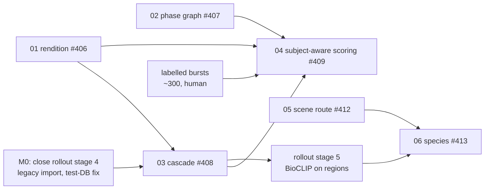

# Pipeline streamlining — spec hub

This hub holds the implementation specs for the target order described in
[planning/pipeline-streamlining.md](../../planning/pipeline-streamlining.md):

import → rendition → embeddings + scene route → localize → species on crop → subject-aware scoring
(captions and keywords alongside) → group bursts → pick / keep / reject.

Each spec follows the repo's `/spec` and `/plan` format. Acceptance criteria are EARS sentences
numbered `AC-n`, which the `validate-implementation` skill verifies later.

## Specs

| # | Spec | Issue | Kind | Depends on |
|---|---|---|---|---|
| 01 | [Decode-once rendition](01-rendition.md) | #406 | refactor | — |
| 02 | [Phase graph changes](02-phase-graph.md) | #407 | refactor | — |
| 03 | [Detector cascade](03-detector-cascade.md) | #408 | feature (shadow) | 01 (soft) |
| 04 | [Subject-aware scoring](04-subject-aware-scoring.md) | #409 | feature | 01, 02, 03, labelled bursts |
| 05 | [Scene route](05-scene-route.md) | #412 | research → feature | 01 (soft) |
| 06 | [Species beyond birds](06-multi-taxon-species.md) | #413 | research → feature | 03, 05 |
| 07 | [Blockers, decisions and suggestions](07-blockers-and-decisions.md) | #417 | register | — |

## Dependencies

## Roadmap

| Milestone | Contents | Exit |
|---|---|---|
| **M0 — unblock** | Finish rollout stage 4 (#414): answer its open questions, fix the test-DB truncation rollback (#399), get a clean `-m postgres` run, and run the stage 2 legacy import. | The stage 4 exit gate is met. The normalized tables hold the ~76k imported outcomes. |
| **M1 — foundations** | 01 rendition, 02 phase graph. | Every AC in both specs passes. Existing runs select the same work, except that keywords no longer waits for scoring. |
| **M2 — detection** | 03 cascade in shadow; the 05 scene-route benchmark. | The cascade beats YOLO-640 on the #377 cohort under the spec's gates. The scene benchmark is reported. |
| **M3 — consumers** | Rollout stage 5 (BioCLIP on regions) merged with stage 7 (backfill); the 06 species benchmark. | BioCLIP reads cascade regions. The species benchmark is reported. |
| **M4 — subject-aware scoring** | 04 in shadow, the crop-only backfill, then promotion. | Fusion v2 beats v1 on the labelled bursts, and the operator approves the rating change. |

**Parallel track: labelled bursts.** About 300 bursts of human pick/reject labels, stratified by
subject-size tercile. This is step 0 of
[subject-aware-culling-evidence.md](../../planning/subject-aware-culling-evidence.md), and it is
the only way to pass M4's gate honestly. Tracked in #415. No usable human labels exist today
([07 §4.4](07-blockers-and-decisions.md#44-labelled-bursts-existing-labels-then-collection)), so all of it is new collection.

## Shared conventions

Every spec follows these rules. They carry over from the
[localization rollout invariants](../../architecture/pipeline/localization-rollout.md#rollout-invariants).

- **Fail open.** A missing, failed or stale upstream artifact never blocks core inference; the
  consumer falls back to full frame.
- **Versioned artifacts.** Every new artifact records the source/rendition identity, the model or
  detector version, and the config hash. Flags are controls, not provenance.
- **Shadow before authority.** New outputs land in shadow, isolated from production predicates, and
  are promoted by a flag change only after their gate passes.
- **No invented contracts.** Every config key below is **new**. Each must be added to
  `config.example.json` and [CANONICAL_SOURCES.md](../../CANONICAL_SOURCES.md) in the PR that
  introduces it. A new `phase_code` or API field follows
  [cross_repo_contract_change.md](../../../.agent/workflows/cross_repo_contract_change.md).
- **Measured claims only.** Each benchmark reports its cohort, labels, confidence intervals and
  limits, the way #377 does.

## Proposed configuration keys (all new)

| Key | Default | Spec |
|---|---|---|
| `rendition.enabled` | `false` | 01 |
| `rendition.long_edge` | `2048` | 01 |
| `rendition.cache_max_gb` | `50` | 01 |
| `rendition.scoring_source` | `false` | 01 |
| `pipeline.culling_requires_scoring` | `true` | 02 |
| `localization.detectors.coco.enabled` | `false` | 03 |
| `localization.cascade.enabled` | `false` | 03 |
| `localization.cascade.refine_area_frac` | `0.02` | 03 |
| `scoring.subject.enabled` | `false` | 04 |
| `scoring.subject.crop_policy` | `score_subject_v1` | 04 |
| `scoring.fusion_version` | `v1` | 04 |
| `scene_route.enabled` | `false` | 05 |
| `scene_route.skip_detection_min_prob` | `0.9` | 05 |
| `species.taxa` | `["aves"]` | 06 |

## Related

- [planning/pipeline-streamlining.md](../../planning/pipeline-streamlining.md) — the plan these specs implement
- [architecture/pipeline/localization-rollout.md](../../architecture/pipeline/localization-rollout.md) — the rollout they build on
- [planning/localization-stage4-slice1-status.md](../../planning/localization-stage4-slice1-status.md) — M0 work items
- [planning/models/ONNX_CONVERSION_FEASIBILITY.md](../../planning/models/ONNX_CONVERSION_FEASIBILITY.md) — ONNX runtime, which spec 03 needs
