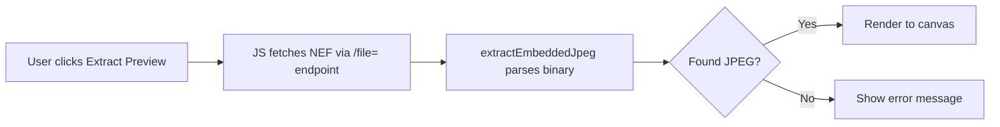

# In-Browser RAW Preview (LibRaw Integration)

Client-side NEF/RAW file preview extraction using JavaScript.

## Overview

| Aspect | Details |
|--------|---------|
| **Purpose** | Enable in-browser preview of Nikon NEF files without server processing |
| **Approach** | Embedded JPEG extraction (fast path) |
| **Files Added** | `static/js/libraw-viewer.js` (346 lines) |
| **Files Modified** | `webui.py` (script injection + UI accordion) |

## Architecture



## Key Components

### NefViewer Class
```javascript
class NefViewer {
    extractEmbeddedJpeg(buffer)  // Fast path: ~100ms
    loadWasm()                    // Lazy WASM loader (future)
    decodeRaw(buffer)             // Full decode (future)
    blobToImage(blob)             // Convert blob to HTMLImageElement
    renderToCanvas(imageData, canvas)
}
```

### Embedded JPEG Extraction Algorithm
1. Skip first 1KB (TIFF header)
2. Search for JPEG SOI marker (`0xFFD8`)
3. Validate it's substantial (>100KB remaining)
4. Find last JPEG EOI marker (`0xFFD9`)
5. Extract byte range as Blob

## WebUI Integration

### Script Injection
```python
# webui.py line 1148
tree_js = """
<script src="/file=static/js/libraw-viewer.js"></script>
...
"""
```

### UI Components (Gallery Details Panel)
```python
with gr.Accordion("🎞️ In-Browser RAW Preview", open=False):
    raw_preview_btn = gr.Button("🖼️ Extract Preview")
    raw_preview_status = gr.HTML(...)
    raw_preview_canvas = gr.HTML(...)
```

## Code Review Points

### ✅ Strengths
- No server-side dependencies for preview
- Lazy loading (JS only loaded when page renders)
- Graceful fallback if extraction fails
- WSL path conversion handled

### ⚠️ Areas for Review

| Item | Concern | Mitigation |
|------|---------|------------|
| **Large file fetch** | NEF files are 20-60MB | User-initiated action only |
| **Memory usage** | Full file in browser memory | Garbage collected after extraction |
| **Button detection** | Uses `elem_id="raw-preview-btn"` | Robust ID-based detection |
| **JSON parsing** | Searches DOM for file_path | Depends on accordion being expanded |

### 🔧 Potential Improvements
1. ~~Add `elem_id` to button for reliable detection~~ ✅ Done
2. Pass file path via Gradio state instead of DOM scraping
3. Add progress indicator for large files
4. Implement Web Worker for non-blocking decode

## Testing Checklist

- [ ] Select NEF in Gallery → Extract Preview → Verify canvas renders
- [ ] Select JPG → Extract Preview → Verify warning message
- [ ] No image selected → Extract Preview → Verify error message
- [ ] Browser console: No JS errors on page load
- [ ] Check "NefViewer: Module loaded" appears in console

## Dependencies

| Type | Name | Required |
|------|------|----------|
| Runtime | Modern browser (Chrome 90+, Firefox 89+) | ✅ |
| Optional | LibRaw WASM binary | ❌ (not included) |

## File Structure
```
static/
├── js/
│   └── libraw-viewer.js   # Main viewer module
└── wasm/
    └── (empty)            # Reserved for future WASM
```
