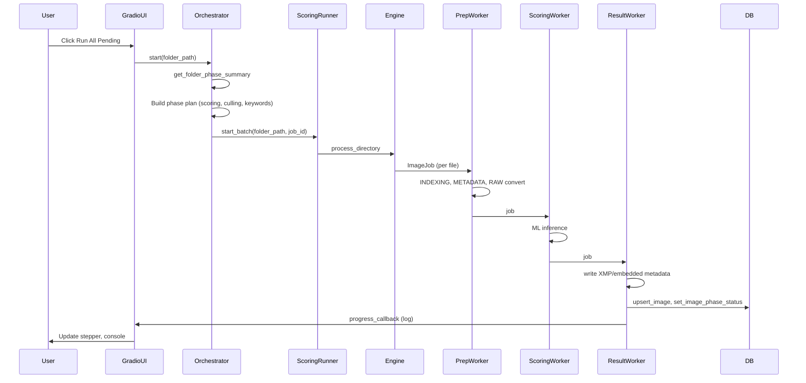
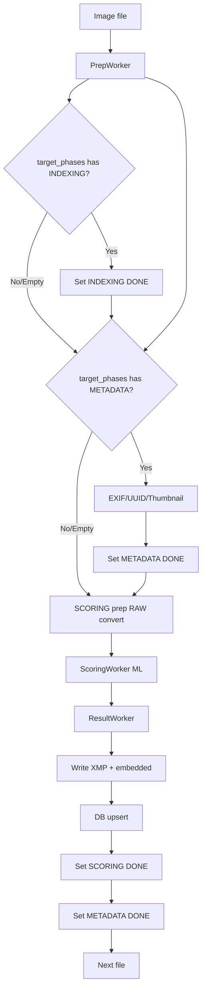
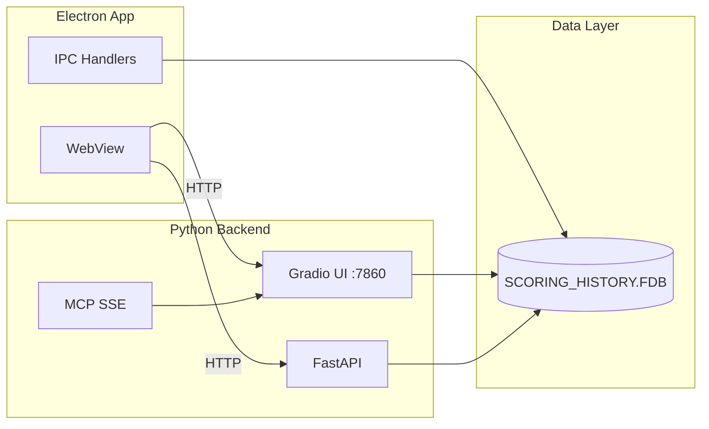

# Pipeline Architecture

Pipeline flow, worker sequence, and Electron integration for the Image Scoring application.

## Overview

The pipeline processes images through five phases: **Indexing**, **Metadata**, **Scoring**, **Culling**, and **Keywords**. Indexing and Metadata run inside the Scoring flow (no dedicated runners). Run All Pending invokes the orchestrator, which runs Scoring, Culling, and Keywords in sequence.

## Sequence: Run All Pending Flow

## Flowchart: Per-File Pipeline

## Electron + Gradio Integration

## Key Integration Points

| Component | Role |
|-----------|------|
| **Electron WebView** | Loads Gradio UI at `/app`, REST API at `:7860` |
| **IPC** | Electron main process queries Firebird directly via `electron/db.ts` |
| **Gradio** | Pipeline tab, progress stepper, Run All Pending / Stop All |
| **Orchestrator** | Builds phase plan from `get_folder_phase_summary`, runs Scoring → Culling → Keywords |
| **Shared DB** | `SCORING_HISTORY.FDB` (Firebird) — schema owned by Python `modules/db.py` |

## Related Documentation

- [PIPELINE_PHASE_RUNNERS.md](PIPELINE_PHASE_RUNNERS.md) — Phase-by-phase execution flow
- [ARCHITECTURE.md](ARCHITECTURE.md) — System architecture overview
- [API_CONTRACT.md](API_CONTRACT.md) — REST API endpoints
