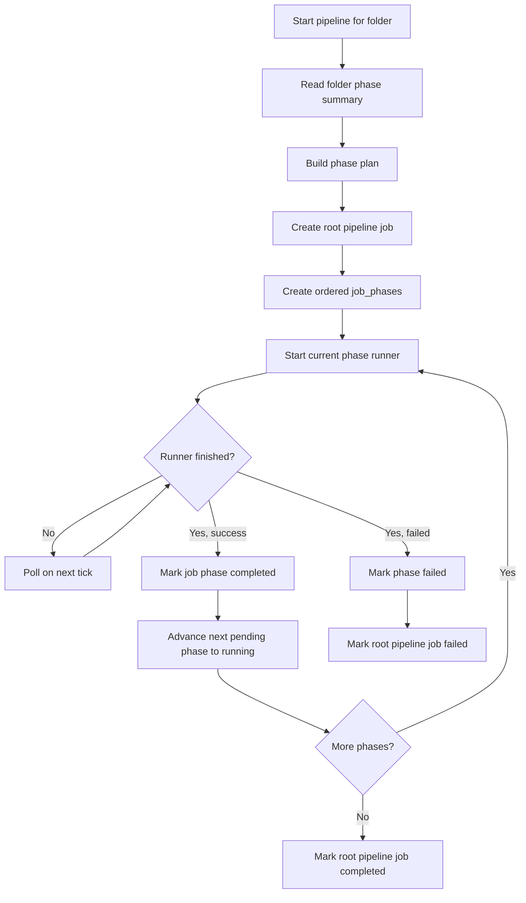

# Pipeline Phases and Runners

This document explains how the phase system is wired in the current codebase: which phases exist, which runner actually executes them, what each phase does step-by-step, and how the orchestrator advances through the pipeline.

## Quick Model

There are 5 canonical phases:

1. `indexing`
2. `metadata`
3. `scoring`
4. `culling`
5. `keywords`

Important detail: only 3 of these have standalone runners.

- `indexing` and `metadata` are real phases in the database and UI, but they execute inside the scoring pipeline's prep stage.
- `scoring` is handled by `ScoringRunner`.
- `culling` is usually handled by `SelectionRunner`. If that runner is unavailable, `ClusteringRunner` can be used instead.
- `keywords` is handled by `TaggingRunner`.

## Ownership Table

| Phase | Standalone runner? | Actual implementation owner | What it does |
|------|---------------------|-----------------------------|--------------|
| `indexing` | No | `PrepWorker` in `modules/pipeline.py` | Resolve image identity in DB, register path/hash relationships, mark indexing done when image ID is known |
| `metadata` | No | `PrepWorker` in `modules/pipeline.py` | Generate UUID, sync EXIF/XMP, extract metadata into DB, generate thumbnail |
| `scoring` | Yes | `ScoringRunner` -> `BatchImageProcessor` -> `PrepWorker`/`ScoringWorker`/`ResultWorker` | Prepare files, run models, normalize results, write DB/XMP, mark scoring status |
| `culling` | Yes | Usually `SelectionRunner`; fallback `ClusteringRunner` | Build stacks, then optionally assign pick/reject/neutral decisions |
| `keywords` | Yes | `TaggingRunner` | Run CLIP keyword tagging and optional BLIP captioning, update DB metadata, write sidecars |

## Phase Registration

Phase definitions live in `modules/phases.py` and are seeded into `PIPELINE_PHASES`.

- `indexing` and `metadata` are registered with no `run_folder` executor.
- `scoring`, `culling`, and `keywords` are registered when their runners are available.
- `culling` prefers `SelectionRunner`; `ClusteringRunner` is only used if selection is not registered.

That means the UI can show all phases, while only some phases can be launched directly.

## Orchestrator Flow

`PipelineOrchestrator` coordinates folder-level execution using persisted `job_phases`.

### What the orchestrator actually skips

- `indexing` and `metadata` are not launched as separate runners.
- If a phase is already `done`, it is omitted from the plan.
- If an optional phase is `skipped`, it is omitted from the plan.
- If an optional phase is marked `default_skip`, the orchestrator writes `skipped` status and bypasses it.

## Folder Status Model

Folder phase status is derived from per-image `IMAGE_PHASE_STATUS` rows.

- There is no single authoritative folder-phase row.
- `get_folder_phase_summary()` counts `done`, `running`, `failed`, and `skipped` image rows for each phase.
- The pipeline UI reads that aggregate summary to show the phase cards and stepper.

This is why phase behavior is easiest to understand as "many image-level status transitions aggregated into one folder-level view."

## Step-by-Step: `indexing`

`indexing` runs inside `PrepWorker`.

1. The worker starts from an `ImageJob` created by the scoring pipeline.
2. If `skip_existing` is enabled, it tries a fast path lookup by file path and reuses the stored image hash.
3. If a hash is available and an existing image row matches it, the worker sets `job.image_id`.
4. The image path is registered against that image row.
5. If an `image_id` is known, the worker marks `indexing = done`.

### Result of indexing

- The image is linked to a DB record if one already exists.
- Path/hash identity is stabilized for later phases.
- Phase status can move to `done`.

### Current limitation

If no image row exists yet, indexing does not create a lightweight standalone record at this stage. In practice, the definitive row often gets created later by `db.upsert_image()` during scoring result persistence.

## Step-by-Step: `metadata`

`metadata` also runs inside `PrepWorker`, immediately after indexing.

1. Ensure the image has a UUID. If not, derive one from extracted EXIF context.
2. Write the UUID into embedded EXIF metadata when possible.
3. Create or update the XMP sidecar and write the UUID there too.
4. If an `image_id` is known, extract EXIF and XMP into DB storage and update the main image row with the UUID.
8. Generate a thumbnail if one does not already exist.
9. Mark `metadata = done`.

### Result of metadata

- UUID is synchronized across file metadata and DB.
- EXIF/XMP records are cached in the database.
- Thumbnail generation is completed before inference.

## Step-by-Step: `scoring`

`scoring` is the most layered phase. It uses:

- `ScoringRunner`
- `BatchImageProcessor`
- `PrepWorker`
- `ScoringWorker`
- `ResultWorker`

### Stage 1: runner startup

1. `ScoringRunner.start_batch()` validates the path or selector input.
2. It loads the shared scorer models once and keeps them resident for reuse.
3. It creates a `BatchImageProcessor`.
4. It injects the parent `job_id` so DB upserts and phase tracking stay attached to the right job.
5. It starts the threaded pipeline for the folder or selected image list.

### Stage 2: prep

For each image:

1. Run `indexing` actions if targeted.
2. Run `metadata` actions if targeted.
3. Detect whether the source file is RAW.
4. If RAW, convert it to a temporary JPEG for inference.
5. Mark `scoring = running`.
6. Pass the prepared job to `ScoringWorker`.

### Stage 3: inference

`ScoringWorker` performs the model work.

1. Respect `target_phases`; if scoring is not targeted, the job is marked `skipped`.
2. Preprocess the image according to configured model resolutions.
3. Run LIQE if needed.
4. Run the MUSIQ-based scorer bundle.
5. Store model outputs on the `ImageJob`.
6. Mark the job as `success` or `failed` based on whether models produced usable results.

### Stage 4: result persistence

`ResultWorker` performs DB and metadata writes.

1. If scoring failed, mark `scoring = failed`.
2. If scoring succeeded, compute normalized technical, aesthetic, and general scores.
3. Derive rating and label from the normalized scores.
4. Write rating/label metadata to XMP, and embedded metadata for RAW when enabled.
5. Upsert the image row in the database using `db.upsert_image()`.
6. Resolve `image_id` if the row was just created during upsert.
7. Mark `scoring = done`.
8. Clean temporary files.

### Result of scoring

- Image record is fully persisted.
- Model outputs are stored.
- Rating/label metadata is written back to file/XMP.
- Folder completion flags may be recomputed after the batch ends.

## Step-by-Step: `culling`

`culling` is overloaded slightly in the current system.

- With `SelectionRunner`, `culling` means "stack creation plus pick/reject assignment."
- With `ClusteringRunner`, `culling` means "stack creation only."

### Normal path: `SelectionRunner`

This is the preferred executor when registered.

1. Load folder images from DB.
2. Apply phase policy checks per image to determine whether `culling` should rerun.
3. Mark runnable images as `culling = running`.
4. Call `SelectionService.run()`.

`SelectionService` then performs:

1. Resolve all folders under the requested input path.
2. Load images for each folder.
3. Cluster images into stacks.
4. Reload the folder after stack assignment.
5. Group images by `stack_id`.
6. Sort each stack by score.
7. Classify each image as `pick`, `reject`, or `neutral`.
8. Persist cull decisions in DB.
9. Write stack and pick/reject metadata to sidecars.
10. Return summary statistics.

After the service completes:

1. Mark tracked images as `culling = done`.
2. Mark the job completed.
3. Publish summary counts for images, stacks, picks, rejects, neutrals, and sidecar writes.

### Clustering internals used by selection

The clustering engine itself works in two passes:

1. Pre-group images by `BurstUUID` if available.
2. Create stacks immediately for burst groups with multiple images.
3. For remaining images, sort by capture time.
4. Split those images into time batches using a time-gap threshold.
5. Use thumbnails when available for feature extraction.
6. Extract MobileNetV2 feature embeddings.
7. Persist embeddings to the database.
8. Run agglomerative clustering with cosine distance.
9. Create stacks for clusters with 2 or more images.
10. Pick the stack representative from the highest-scoring image.
11. Write generated burst UUID values back into DB and XMP.

### Fallback path: `ClusteringRunner`

If `SelectionRunner` is not registered, `culling` can be backed only by clustering.

In that mode:

1. The phase policy decides which images are still runnable.
2. Runnable images are marked `culling = running`.
3. Clustering creates stacks and persists embeddings.
4. Images are marked `culling = done`.

What does not happen in this fallback:

- No `pick`/`reject` classification
- No selection-policy sorting
- No pick/reject metadata writes

## Step-by-Step: `keywords`

`keywords` is handled by `TaggingRunner`.

1. Start the runner thread and mark the job as running.
2. Load the CLIP keyword model if it is not already loaded.
3. Optionally load the BLIP captioning model.
4. Resolve input images from selector IDs, a target folder, or the full image table.
5. Apply phase rerun policy to each image.
6. For each runnable image, mark `keywords = running`.
7. Use the image thumbnail for inference when processing RAW files and a thumbnail exists.
8. Predict keywords with CLIP.
9. Optionally generate caption and title text with BLIP.
10. Update DB fields such as `keywords`, `title`, and `description`.
11. Write metadata to XMP and embedded metadata.
12. Mark `keywords = done`.
13. On exception, mark `keywords = failed`.
14. Update job progress and final completion status.

### Result of keywords

- Search/filter keywords are stored in DB.
- Optional caption/title text is stored.
- XMP and embedded file metadata are updated.

## Rerun Policy

`phases_policy.explain_phase_run_decision()` centralizes rerun decisions.

For a given image and phase:

- If there is no stored phase status, run it.
- If the phase is `failed`, `skipped`, or `not_started`, run it.
- If the phase is already `running`, do not start another run.
- If the phase is `done` but the executor version changed, rerun it.
- If the phase is `done` and the executor version matches, skip it.
- If `force_run=True`, run it regardless.

### Where policy is currently applied

- `TaggingRunner`
- `SelectionRunner`
- `ClusteringEngine`

### Important asymmetry

The scoring pipeline writes per-image phase status and executor version, but it does not currently use the same per-image rerun gate before starting work. That makes scoring less symmetric than keywords and culling.

## Practical Reading of the Current System

If you want to understand the runtime behavior quickly, read it this way:

1. `PipelineOrchestrator` is the folder-level sequencer.
2. `job_phases` stores which phase should run next.
3. `ScoringRunner` owns `indexing`, `metadata`, and `scoring` work in practice.
4. `SelectionRunner` usually owns the meaning of `culling`.
5. `TaggingRunner` owns `keywords`.
6. Folder UI state is just an aggregate of per-image phase rows.

## Source Map

Main files involved:

- `modules/phases.py`
- `modules/phase_executors.py`
- `modules/phases_policy.py`
- `modules/pipeline_orchestrator.py`
- `modules/scoring.py`
- `modules/engine.py`
- `modules/pipeline.py`
- `modules/selection_runner.py`
- `modules/selection.py`
- `modules/clustering.py`
- `modules/tagging.py`
- `modules/db.py`
