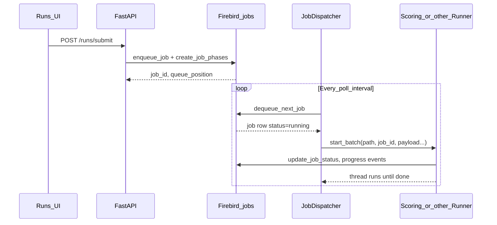

# Runs walkthrough

Step-by-step view of how **batch runs** (the React **Runs** page at `/ui/runs`) tie together the database, **`JobDispatcher`**, and **runners** (scoring, tagging, clustering, selection).

For persistence and restart behavior only, see **[RUNS_QUEUE_AND_RESTART.md](RUNS_QUEUE_AND_RESTART.md)**.

---

## 1. What a “run” is

| Concept | Storage | Notes |
|--------|---------|--------|
| **Run** | Row in **`jobs`** | `id`, `status`, `job_type`, `input_path`, `queue_payload` (JSON), `queue_position`, timestamps |
| **Stages (phases)** | **`job_phases`** | Ordered `phase_code` + `state` (`queued`, `running`, `completed`, …) for the workflow graph |
| **Work items** | DB + engines | Images/folders processed inside the runner; “done” is determined by DB state + `skip_done` / `skip_existing` in `queue_payload` |

The UI calls the API under **`/api`** (e.g. `POST /api/runs/submit`).

---

## 2. Big picture

- Only **`queued`** jobs are eligible for **`dequeue_next_job`**.
- The dispatcher starts **one** batch at a time per free runner family (it waits while any runner reports busy).

---

## 3. Starting a new run

1. User clicks **New Run** and submits scope + stages.
2. **`POST /api/runs/submit`**:
   - Inserts a **`jobs`** row with **`status = 'queued'`** and a JSON **`queue_payload`** (paths, `target_phases`, `skip_done`, etc.).
   - Creates **`job_phases`** for the selected pipeline.
3. Response includes **`run_id`** (the `jobs.id`) and **`queue_position`** (approximate place in the queue).

Nothing runs until the dispatcher dequeues that row.

---

## 4. How a queued job becomes active work

1. **`JobDispatcher`** (background thread, started when the API registers runners) wakes on an interval.
2. If no runner is busy, it calls **`db.dequeue_next_job()`**:
   - Picks the next **`queued`** job (priority, `queue_position`, `enqueued_at`, `id`).
   - Atomically sets that row to **`running`** and sets **`started_at`**.
3. **`_start_job`** reads **`job_type`** and **`queue_payload`**:
   - **`queue_payload`** is parsed as JSON; if the DB stored **double-encoded** JSON (string containing JSON), a second parse is applied so the dict is usable.
4. The matching runner’s **`start_batch(..., job_id=...)`** runs in a **worker thread**.
5. The runner updates **`jobs`** / emits WebSocket events as it progresses; when finished, it sets terminal status (**`completed`** / **`failed`**, etc.).

**Work items** (per image, per folder, etc.) are handled **inside** that runner using the same **`job_id`** and the persisted payload + database state—not by creating a new `jobs` row for each item.

---

## 5. Pause and Resume (same run id)

### Pause

- **`POST /api/runs/{id}/pause`** (while **`running`**): sets job status to **`paused`** (soft pause: runner is expected to stop after the current unit of work, depending on implementation).
- **`paused`** jobs are **not** dequeued. The queue only advances **`queued`** rows.

### Resume (in-place)

- **`POST /api/runs/{id}/resume`** is allowed for **`paused`** or **`interrupted`**.
- It **does not** create a new run. It:
  1. Merges **`skip_done: true`** into **`queue_payload`** and saves it (**`db.update_job_payload`**).
  2. Calls **`db.requeue_job(run_id)`** so the **same** row returns to **`queued`** with fresh queue ordering fields.
  3. Calls **`db.resume_job_phases(run_id)`**:
     - **`completed`** and **`skipped`** phases are left as-is.
     - The **first incomplete** phase becomes **`queued`**; later incomplete phases become **`pending`**.
- API response: **`{ "success": true, "run_id": <same id>, "queue_position": … }`**.

When the dispatcher dequeues again, the **same `job_id`** is passed to **`start_batch`**, so processing continues as one logical run with handlers skipping already-done work where the engines respect **`skip_done`** / DB state.

---

## 6. Retry (new run id)

- **`POST /api/runs/{id}/retry`** is for **failed / canceled** (and similar) scenarios where you want a **fresh job row**.
- It **`enqueue_job`s** a **new** `jobs` row, copies phase structure via **`create_job_phases`** on the **new** id, and sets **`skip_done`** in the new payload.
- Response returns the **new** **`run_id`**.

Use **Retry** when you want a new attempt record; use **Resume** when you want to continue the **same** run after pause or interrupt.

---

## 7. Force (`POST /api/runs/{id}/force`)

Requires JSON body **`{ "confirm": true }`**.

| Current `jobs.status` | Behavior (summary) |
|----------------------|---------------------|
| **`running`** | If the runner thread is **dead** (“ghost”): mark **`interrupted`**, clear stuck **`is_running`** flags if needed, then **in-place resume** (same id → **`queued`**). If thread is **alive**, returns **409** — cancel first. |
| **`queued`** | Clears **ghost `is_running`** on runners so the dispatcher can dequeue again. |
| **`paused` / `interrupted`** | Same as resume: **in-place** via **`_resume_job_inplace`**. |
| **Terminal** (`completed`, `failed`, `canceled`) | **Retry** semantics → **new** job id. |

---

## 8. After a WebUI restart

On startup, **`recover_running_jobs`** marks any row still **`running`** as **`interrupted`** (and aligns in-flight **`job_phases`**). Those runs do **not** auto-start.

- Open **Runs → History**, find **`interrupted`** runs, then **Resume** (same id) or **Retry** (new id), depending on intent.
- **`queued`** rows survive restart; the dispatcher picks them up once the server is up.

Details: **[RUNS_QUEUE_AND_RESTART.md](RUNS_QUEUE_AND_RESTART.md)**.

---

## 9. Runs UI tabs

| Tab | Typical contents |
|-----|------------------|
| **Active** | **`running`**, **`paused`**, plus **`queued`** / **`pending`** |
| **Queued** | **`queued`** / **`pending`** only |
| **History** | **`completed`**, **`failed`**, **`canceled`**, **`interrupted`** |

**Interrupted** after a crash or recovery appears under **History** — use **Resume** or **Retry** from there.

---

## 10. API cheat sheet

| Action | Method | Path | Same `run_id`? |
|--------|--------|------|----------------|
| Submit | POST | `/api/runs/submit` | New id |
| Pause | POST | `/api/runs/{id}/pause` | Same |
| Resume | POST | `/api/runs/{id}/resume` | **Same** |
| Cancel | POST | `/api/runs/{id}/cancel` | Same row updated |
| Retry | POST | `/api/runs/{id}/retry` | **New** id |
| Force | POST | `/api/runs/{id}/force` | Same or new (see §7) |
| List recent | GET | `/api/jobs/recent` | — |
| Live status | GET | `/api/tasks/active` | — |

---

## 11. Troubleshooting

1. **Queue not moving**  
   - **`GET /api/tasks/active`**: check **`dispatcher.is_dispatcher_running`**, **`active_runner`**, and whether a job is stuck **`running`** in the DB with no live thread → **Force** (with `confirm`) or restart WebUI.

2. **Paused run never runs**  
   - **`paused`** is not dequeued. Use **Resume**.

3. **Expecting same run after Resume**  
   - Success body should show **`run_id`** equal to the one you resumed. If you used **Retry** or **Force** on a terminal job, you will get a **new** id.

---

## 12. Key source files

| Piece | File |
|-------|------|
| Submit / pause / resume / retry / force | [`modules/api.py`](../../modules/api.py) |
| Dequeue, requeue, resume phases | [`modules/db.py`](../../modules/db.py) |
| Dispatcher loop | [`modules/job_dispatcher.py`](../../modules/job_dispatcher.py) |
| Runs page | [`frontend/src/pages/RunsPage.tsx`](../../frontend/src/pages/RunsPage.tsx) |
| Run actions on cards | [`frontend/src/components/runs/RunCard.tsx`](../../frontend/src/components/runs/RunCard.tsx) |
