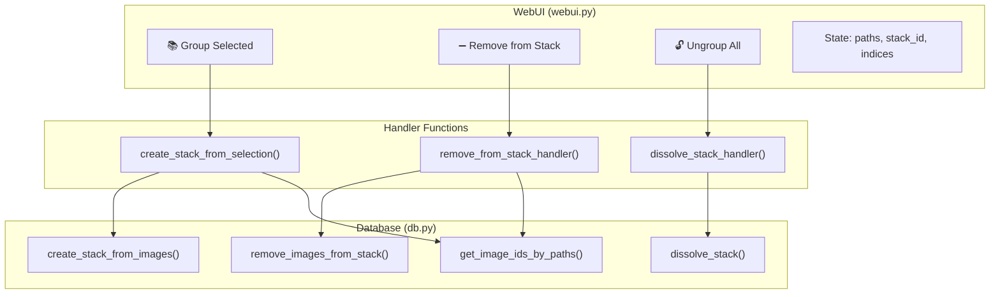
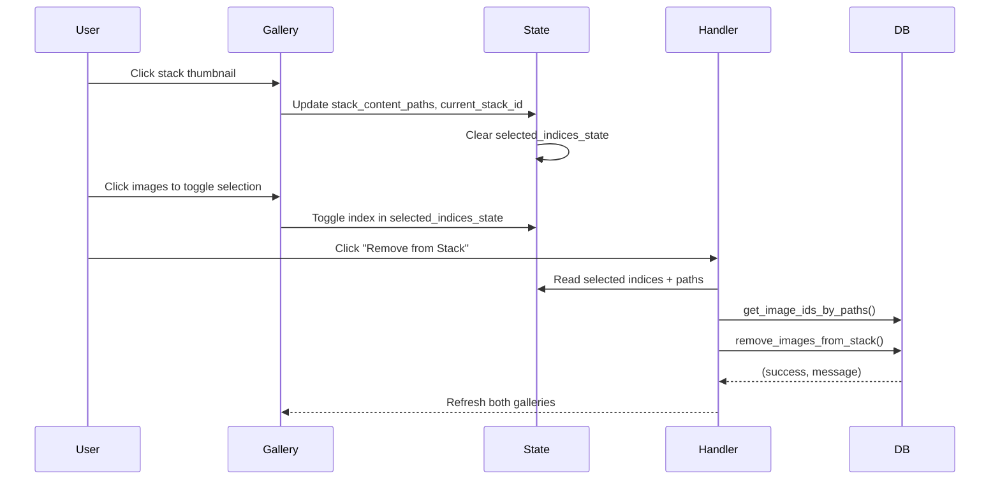

# Stacks UX Manual Management - Design Document

Technical documentation for code review of the Stacks manual management feature.

## Overview

This feature adds Lightroom-style manual stack management to the existing auto-clustering functionality. Users can now manually group, ungroup, and modify image stacks.

---

## Architecture



---

## Database Layer

### New Functions in `modules/db.py`

#### `create_stack_from_images(image_ids, name=None)`

**Purpose**: Creates a new stack from a list of image IDs.

**Logic**:
1. Validate minimum 2 images
2. Query database to verify images exist
3. Find best image (highest `score_general`)
4. Auto-generate name: `"Stack YYYY-MM-DD #NNN"`
5. Insert into `stacks` table
6. Update `images.stack_id` for all selected images

**Returns**: `(success: bool, stack_id or error_msg: str)`

```python
# Key implementation detail - best image selection
for row in rows:
    score = row['score_general'] if row['score_general'] else 0
    if score > best_score:
        best_score = score
        best_id = row['id']
```

---

#### `remove_images_from_stack(image_ids)`

**Purpose**: Removes images from their stacks without deleting the stack.

**Logic**:
1. Get affected stack IDs before removal
2. Set `stack_id = NULL` for given images
3. **Cleanup**: Delete any stacks that become empty
4. **Recalculate**: Update `best_image_id` for stacks that still have images

**Design Decisions**:
- Automatic cleanup of empty stacks prevents orphaned records
- Recalculating `best_image_id` maintains data integrity when the best-scoring image is removed

```python
# Cleanup and recalculation logic
for stack_id in affected_stacks:
    c.execute("SELECT COUNT(*) FROM images WHERE stack_id = ?", (stack_id,))
    remaining = c.fetchone()[0]
    if remaining == 0:
        c.execute("DELETE FROM stacks WHERE id = ?", (stack_id,))
    else:
        # Recalculate best_image_id from remaining images
        c.execute("""
            UPDATE stacks SET best_image_id = (
                SELECT id FROM images 
                WHERE stack_id = ? 
                ORDER BY score_general DESC NULLS LAST 
                LIMIT 1
            ) WHERE id = ?
        """, (stack_id, stack_id))
```

---

#### `dissolve_stack(stack_id)`

**Purpose**: Completely dissolves a stack - ungroups all images and deletes the stack record.

**Logic**:
1. Count images for status message
2. Get stack name for status message
3. Set `stack_id = NULL` for all images in stack
4. Delete stack record

---

#### `get_image_ids_by_paths(file_paths)`

**Purpose**: Helper to convert gallery selection (file paths) to database image IDs.

**Challenge**: Path format differences between Windows/WSL environments.

**Solution**: Two-tier lookup:
1. Try exact `file_path` match
2. Fallback to `file_name` (basename) match with warning log

**Warning**: The basename fallback may match wrong images if multiple folders contain files with the same name (e.g., `IMG_0001.jpg`). A warning is logged when fallback is used.

```python
# Fallback for path format mismatches
c.execute("SELECT id FROM images WHERE file_path = ?", (path,))
row = c.fetchone()
if not row:
    basename = os.path.basename(path)
    c.execute("SELECT id FROM images WHERE file_name = ?", (basename,))
    row = c.fetchone()
    if row:
        logging.warning(f"Path lookup fallback used: {path} -> id {row['id']} (matched by filename)")
```

---

## UI Layer

### State Management

Three new Gradio State components:

| State | Type | Purpose |
|-------|------|---------|
| `stack_content_paths` | `list[str]` | Original DB paths for selection tracking |
| `current_stack_id` | `int \| None` | Currently selected stack |
| `selected_indices_state` | `list[int]` | Accumulated gallery selection indices (toggle-based) |

### Multi-Select Behavior

The content gallery uses **click-to-toggle** selection:
- Clicking an image adds it to the selection
- Clicking a selected image removes it from the selection
- Switching stacks clears the selection

**Note**: Gradio galleries don't expose modifier key info (Ctrl/Shift), so toggle-based accumulation is used instead of Ctrl+click.

### Modified Function: `select_stack()`

**Before**: Returned only gallery images  
**After**: Returns `(gallery_images, content_paths, stack_id)` and chains a clear of `selected_indices_state`

This change enables tracking which images are in the content view for subsequent operations.

### Event Flow



---

## Error Handling

| Scenario | Handling |
|----------|----------|
| Less than 2 images selected for grouping | Return early with message |
| Image paths not found in DB | Fallback to basename lookup |
| Empty stack after removal | Auto-delete orphaned stack |
| No stack selected for dissolve | Return early with message |
| Database errors | Logged via `logging.error()`, return `(False, error_msg)` |

---

## Testing Considerations

### Unit Test Cases (Not Implemented)

```python
# Suggested test cases for future implementation
def test_create_stack_from_images_minimum():
    """Should fail with < 2 images"""
    
def test_create_stack_sets_best_image():
    """Best image should be highest score_general"""
    
def test_remove_cleans_up_empty_stack():
    """Removing last image should delete stack"""
    
def test_remove_recalculates_best_image():
    """Removing best image should update best_image_id to next highest score"""
    
def test_path_lookup_fallback():
    """Should find by basename if exact path fails and log warning"""
```

### Manual Test Matrix

| Action | Precondition | Expected Result |
|--------|--------------|-----------------|
| Group 2 images | Stack contents visible | New stack created |
| Group 1 image | Single image selected | Error message shown |
| Toggle selection | Click image twice | Selected then deselected |
| Remove 1 of 5 | Stack with 5 images | 4 images remain, best_image_id updated if needed |
| Remove all | Stack with 3 images | Stack deleted |
| Dissolve | Stack selected | Stack deleted, images ungrouped |

---

## Future Enhancements

Per the original UX review, remaining items:

- [ ] Visual badge overlay on stack thumbnails
- [ ] Keyboard shortcuts (Ctrl+G, Ctrl+Shift+G)
- [ ] Set cover image manually
- [ ] Inline expand/collapse view
